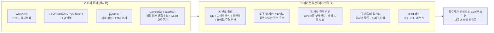

# AI 자막 번역·검수 자동화 — 유사 오픈소스 비교 및 갭 분석

> **작성 기준일**: 2026-07-27
>
> **목적**: "AI로 자막 번역가 검수를 대체(축소)하는 오픈소스 시스템"을 만들기 전에, **이미 존재하는 오픈소스가 어디까지 왔는지** 확인하고 **실제로 비어 있는 자리**를 특정한다. [번역관리_TMS_솔루션_비교.md](번역관리_TMS_솔루션_비교.md)가 **상용 SaaS** 축이라면, 이 문서는 **오픈소스** 축이다.
>
> **검증 수준 표기**: 🟢 = 리포지토리 직접 fetch로 확인 / 🟡 = 검색 결과·2차 출처 기반(도입 전 재확인 필요)
>
> **시간 민감성**: 스타 수·릴리스는 2026-07 스냅샷. 오픈소스는 변동이 빠르므로 착수 시점에 재확인.

---

## 1. 한눈에 — 결론

> **번역하는 도구는 널려 있다. 품질을 재는 도구도 (연구용으로) 있다. 그런데 이 둘을 잇고, 그 결과로 "사람이 볼 자막"을 골라내는 오픈소스는 없다.**

조사한 오픈소스는 5개 계층으로 깔끔하게 갈린다. 그리고 **계층 간이 끊겨 있다.**

| 계층 | 대표 오픈소스 | 성숙도 | 상태 |
|---|---|---|---|
| **A. 엔드투엔드 파이프라인** | VideoLingo, subsai, auto-subtitle-translate | 높음(VideoLingo 17.9k★) | ✅ 포화 |
| **B. LLM 자막 번역 전용** | LLM-Subtrans, ai-subtitle-translator, srt-llm-translator | 중간 | ✅ 포화 |
| **C. STT / 캡셔닝** | WhisperX, faster-whisper, whisply | 매우 높음 | ✅ 포화 |
| **D. 번역 품질추정(QE)** | COMET/CometKiwi, xCOMET, TransQuest, OpenKiwi | 높음(연구 성숙) | ⚠️ **연구용에 고립** |
| **E. 자막 규격 QA** | Subtitle Edit, pysubs2 | 높음 | ⚠️ **AI와 분리** |
| **🔴 F. QE → 트리아지 → 검수 큐 → CI** | **없음** | — | 🔴 **공백** |

**핵심 발견 3가지**

1. **번역 도구는 품질을 재지 않는다.** LLM-Subtrans(633★, MIT)는 8개 LLM 프로바이더를 지원하지만 **품질추정·신뢰도 점수·자막 규격 검증이 전무**하다(🟢 리포 확인). VideoLingo(17.9k★)는 Netflix 단일행 규격은 강제하지만 **명시적 human review 워크플로가 없다**(🟢).
2. **품질 측정 도구는 자막을 모른다.** COMET/CometKiwi(Apache-2.0, 770★)는 정답 번역 없이 점수를 낼 수 있지만(🟢), **문장 단위 MT 연구 도구**다. 타임코드·줄 분절·화자 개념이 없다.
3. **자막 QA 도구는 AI를 모른다.** Subtitle Edit는 `Fix Common Errors`·읽기속도 검사를 갖췄지만 **데스크톱 GUI 수작업 도구**이고, CI에 넣을 수 없다(🟡).

→ **비어 있는 자리 = "품질 점수를 근거로 검수 대상을 자동 선별하고, 그 결정을 CI 파이프라인에 태우는 계층".**

---

## 2. 계층별 상세 비교

### A. 엔드투엔드 파이프라인 — 이미 포화

| 프로젝트 | 라이선스 | ★ | 파이프라인 | QE/신뢰도 | 검수 트리아지 | 인터페이스 |
|---|---|---|---|---|---|---|
| **VideoLingo** 🟢 | Apache-2.0 | 17.9k | WhisperX → NLP/AI 분절 → **3단계 Translate-Reflect-Adaptation** → 정렬 → TTS 더빙 | ❌ (모델 선택으로 암묵 처리) | ❌ 없음 | Streamlit GUI, Docker, 배치 |
| **subsai** 🟡 | (확인 필요) | — | Whisper 계열 다중 백엔드 → 자막 생성 | ❌ | ❌ | WebUI + CLI + Python 패키지 |
| **auto-subtitle-translate** 🟡 | — | — | 생성 → 번역 → 영상 오버레이 | ❌ | ❌ | CLI |
| **open-whisperer** 🟡 | — | — | 오디오 추출 → 전사 → 번역 → muxing, **화자분리 포함** | ❌ | ❌ | CLI |
| **faster-auto-subtitle** 🟡 | — | — | faster-whisper → Opus-MT 번역 → 오버레이 | ❌ | ❌ | CLI |

**판단**: VideoLingo가 사실상 이 계층의 승자다. **여기서 정면 경쟁하면 안 된다.** 특히 더빙(TTS)까지 들어간 영역은 재현 비용이 크고 차별화가 없다.

**주목할 점**: VideoLingo의 `Translate-Reflect-Adaptation` 3단계는 사실상 **LLM 자가검수**다. 즉 "LLM으로 검수한다"는 아이디어는 이미 구현되어 있다. 그러나 **그 검수 결과를 정량화하지도, 사람에게 넘길 대상을 고르지도 않는다.** 이게 결정적 차이다.

---

### B. LLM 자막 번역 전용 — 포화, 그러나 얕음

| 프로젝트 | 라이선스 | ★ | 포맷 | 프로바이더 | QE/신뢰도 | 자막 규격 검증 | STT |
|---|---|---|---|---|---|---|---|
| **LLM-Subtrans** 🟢 | MIT | 633 | SRT · SSA/ASS · VTT | OpenRouter·Gemini·OpenAI·DeepSeek·Claude·Mistral·Azure·Bedrock | ❌ | ❌ | ❌ |
| **ai-subtitle-translator** 🟡 | — | — | SRT | OpenRouter 300+ 모델 | ❌ | ❌ | ❌ |
| **srt-llm-translator** 🟡 | — | — | SRT (타임스탬프 보존) | OpenAI·Gemini·Grok·OpenRouter | ❌ | ❌ | ❌ |
| **Batch Subtitle Translator** 🟡 | — | — | SRT·ASS·VTT·LRC | 17+ 프로바이더 | ❌ | ❌ | ❌ |

**판단**: 이 계층 전체가 **"LLM API 호출 + 자막 파싱"** 이고, 품질 축이 완전히 비어 있다. LLM-Subtrans는 `PySubtrans` 파이썬 패키지를 분리 제공하므로 **경쟁 대상이 아니라 재사용 후보**로 볼 수 있다(🟢).

> ⚠️ **여기가 우리 프로젝트가 빠지기 쉬운 함정이다.** 아무 설계 없이 시작하면 이 표의 5번째 행이 된다.

---

### C. STT / 캡셔닝 — 절대 직접 만들지 말 것

| 프로젝트 | 핵심 | 우리 프로젝트에서의 위치 |
|---|---|---|
| **WhisperX** 🟡 | faster-whisper + wav2vec2 강제정렬(**단어 단위 <100ms 타임스탬프**) + pyannote 화자분리 | **채택 후보 1순위.** 화자분리는 캐릭터 말투 일관성의 전제 |
| **faster-whisper** 🟡 | 경량·고속. pyannote 의존성·HF 토큰 불필요 | 화자분리 불필요한 경우의 대안 |
| **whisply** 🟡 | faster-whisper + mlx-whisper 배치 처리, whisperX/pyannote로 단어 단위 화자 주석 | 배치 운영 참고 |
| **gpt-4o-transcribe-diarize** 🟡 | OpenAI가 화자 라벨링된 `diarized_json` 반환 | API 경로 대안(비용·데이터 반출 검토 필요) |

**판단**: 이 계층은 **완전히 해결된 문제**다. 붙여 쓰면 된다. 단, [TMS 비교 문서](번역관리_TMS_솔루션_비교.md)에서 지적한 대로 **한국어 드라마(BGM·중첩발화·사투리) WER은 별도 검증이 필요**하다.

---

### D. 번역 품질추정(QE) — 성숙했으나 연구용에 고립

**이 계층이 우리 프로젝트의 핵심 재료다.**

| 프로젝트 | 라이선스 | 정답 번역 불필요 | 산출물 | 자막 인식 |
|---|---|---|---|---|
| **COMET / CometKiwi** 🟢 | Apache-2.0 (770★) | ✅ `wmt22-cometkiwi-da` (InfoXLM 기반) · `wmt23-cometkiwi-da-xl` 3.5B · `-xxl` 10.7B | 문장 단위 품질 점수 | ❌ |
| **xCOMET-XL / XXL** 🟢 | Apache-2.0 | ✅ | **오류 구간(error span) + MQM 심각도(minor/major/critical)** | ❌ |
| **TransQuest** 🟡 | — | ✅ | WMT2020 문장 단위 DA QE 우승. OpenKiwi·DeepQuest 대비 우수 주장 | ❌ |
| **OpenKiwi** 🟡 | Unbabel, PyTorch | ✅ | 단어·문장 단위(HTER/z-score) | ❌ |
| **SubER** 🟡 | (논문 arXiv 2205.05805) | 정답 자막 필요 | **자막 전용 메트릭 — 텍스트 + 타임코드 + 줄 분절 반영** 편집거리 | ✅ |
| **DeepSubQE** 🟡 | (논문) | — | 자막 번역 QE | ✅ |

`★ 이 표의 의미 ─────────────────────────────`
**xCOMET이 특히 중요하다.** 단순 점수(0~1)가 아니라 **"어느 구간이, 얼마나 심각하게 틀렸는지"** 를 MQM 심각도로 뱉는다(🟢 확인). 이건 그대로 **검수자에게 보여줄 하이라이트**가 된다. 검수자는 자막 전체를 읽는 게 아니라 **빨갛게 칠해진 구간만** 본다.

**SubER는 자막 전용 메트릭**이라는 점에서 유일하다 — 텍스트뿐 아니라 **타임코드와 줄 분절까지** 평가에 넣는다. 다만 정답 자막이 필요해서 운영 시점 트리아지에는 못 쓰고, **벤치마크 검증용**으로 쓸 수 있다.
`─────────────────────────────────────────────`

**판단**: 재료는 다 있다. **아무도 이걸 자막 파이프라인에 배선하지 않았을 뿐이다.**

---

### E. 자막 규격 QA / 편집 — AI와 분리되어 있음

| 프로젝트 | 라이선스 | 포맷 | 규격 검사 | CI 적합성 |
|---|---|---|---|---|
| **Subtitle Edit** 🟡 | OSS (GitHub 공개) | SRT·**VTT**·ASS·MicroDVD·D-Cinema·**EBU STL** 등 다수 | ✅ `Fix Common Errors`, 읽기속도(기본 15 chars/sec), 맞춤법(Hunspell), Whisper 통합 | ❌ **데스크톱 GUI** (Windows 중심, Avalonia Linux 빌드) |
| **pysubs2** 🟡 | (확인 필요) | SRT·**VTT**·TTML·SAMI·MicroDVD·MPL2·TMP + **Whisper 캡션** | 파싱·변환·리타이밍 (검사 규칙은 미제공) | ✅ **Python 라이브러리 + CLI** |
| **OOONA** 🟡 | 상용 | 다수 | ✅ 읽기속도·타임코드·중첩·길이·프레임레이트·포지셔닝 | 웹 SaaS(유료) |

`★ 주목 ────────────────────────────────────`
**pysubs2가 TTML을 지원한다.** [TMS 비교 문서 §3](번역관리_TMS_솔루션_비교.md)에서 "검증 9종 중 방송용 timed-text(TTML/IMSC1/DFXP)를 네이티브 지원하는 상용 TMS가 **하나도 없다**"고 결론 냈는데, **오픈소스 파서는 이미 지원한다.** 상용 TMS의 공백을 오픈소스가 메우는 구도다 — 프로젝트의 좋은 차별점 후보.
`─────────────────────────────────────────────`

**판단**: Subtitle Edit의 규칙은 훌륭하지만 **GUI에 갇혀 있다.** pysubs2는 파서일 뿐 검사 규칙이 없다. → **"pysubs2 파싱 + Subtitle Edit급 규칙 + CLI/CI"** 조합이 비어 있다.

---

### F. 오픈소스 TMS — 자막을 모름

[TMS 비교 문서 §3·§6](번역관리_TMS_솔루션_비교.md)에서 이미 검증된 내용:

| 프로젝트 | 자막 포맷 | VTT | 판정 |
|---|---|---|---|
| **Weblate** | SRT·MicroDVD·ASS·SSA | ❌ | OTT 웹 자막에 구멍 |
| **Tolgee** | 개발 i18n 중심 | 미확인 | 소규모/PoC |
| **Traduora · GitLocalize** | — | — | 2라운드 연속 미검증, 생사 불명 |

**판단**: 오픈소스 TMS는 **소프트웨어 문자열용**이지 영상 자막용이 아니다. 그리고 §1에서 정리한 대로 **AI-first 파이프라인은 TMS의 협업 계층 자체가 불필요하므로**, 이 계층은 경쟁 대상도 재사용 대상도 아니다.

---

## 3. 갭 분석 — 정확히 어디가 비었는가

**아무도 하지 않은 것 — 5가지**

| # | 공백 | 왜 아무도 안 했나 | 난이도 |
|---|---|---|---|
| ① | **다중 신호 융합 신뢰도** — QE 점수 + 자가일관성(N회 번역 분산) + 역번역 유사도 + 결정론적 위반 플래그를 하나의 위험도로 합성 | 번역 도구 개발자는 QE 연구를 모르고, QE 연구자는 자막 파이프라인을 안 만듦 | 중 |
| ② | **위험 기반 트리아지** — 임계값 위 세그먼트만 검수 큐로. "전량 검수 → 표본 검수" 전환의 실체 | 상용 TMS는 검수 시간을 줄일 **동기가 없음**(시트당 과금) | 중 |
| ③ | **자막 규격을 생성 시점에 보장** — 검사가 아니라 **번역 결과를 규격에 맞게 재분절·재타이밍** | LLM에게 프롬프트로 시키면 안 지켜짐. 결정론적 코드가 필요한데 다들 LLM에 맡김 | **상** |
| ④ | **화자별 말투 일관성** — 시리즈 전체에서 인물 어조·경어법 유지 | 문장 단위 번역 구조로는 불가능. 화자분리 + 캐릭터 시트 + 컨텍스트 관리 필요 | **상** |
| ⑤ | **CI 배선** — CLI + Git + 머신리더블 리포트 | GUI 도구(Subtitle Edit)와 GUI 파이프라인(VideoLingo)이 시장을 차지 | 하 |

---

## 4. 재사용 전략 — 만들지 말아야 할 것

> 1인 오픈소스에서 가장 흔한 실패는 **이미 있는 걸 다시 만드는 것**이다.

| 기능 | 결정 | 근거 |
|---|---|---|
| STT·화자분리 | **가져다 쓴다** (WhisperX) | 완전히 해결된 문제. 재현 가치 0 |
| 자막 파싱/직렬화 | **가져다 쓴다** (pysubs2) | SRT·VTT·TTML·ASS 이미 지원 |
| LLM 번역 호출 | **가져다 쓴다** (PySubtrans 또는 얇은 자체 구현) | 프로바이더 추상화는 이미 성숙 |
| 품질추정 모델 | **가져다 쓴다** (CometKiwi / xCOMET) | 학습은 논외. 추론만 |
| TTS·더빙 | **하지 않는다** | VideoLingo 영역. 범위 폭발 |
| 웹 에디터·협업 UI | **하지 않는다** | AI-first면 조율할 사람이 없음 |
| **신호 융합 · 트리아지** | **직접 만든다** | 🔴 공백 ① ② |
| **자막 규격 엔진** | **직접 만든다** | 🔴 공백 ③ |
| **캐릭터 일관성 관리** | **직접 만든다** | 🔴 공백 ④ |
| **CLI · CI 리포트** | **직접 만든다** | 🔴 공백 ⑤ |

---

## 5. 한계 · 다음 확인 사항

**이 문서의 공백(정직하게)**
- 🟡 표기 항목(subsai·TransQuest·OpenKiwi·pysubs2·Subtitle Edit의 라이선스·스타·최신 릴리스)은 검색 결과 기반이며 **리포 직접 확인 미완료**.
- **한국어 성능 미검증**: CometKiwi·xCOMET의 **한국어 ↔ 저자원 언어(태국어·베트남어·인도네시아어)** 쌍 성능을 확인하지 못했다. 이게 나쁘면 트리아지 신뢰도 전체가 흔들린다. **최우선 검증 대상.**
- **모델 크기 문제**: xCOMET-XL(3.5B)·XXL(10.7B)는 로컬 추론에 GPU가 필요하다. 오픈소스 사용자의 진입 장벽이 될 수 있어 **경량 대안 또는 API 폴백 경로**가 필요하다.
- **평가 데이터**: K-드라마 자막은 저작권 때문에 리포에 넣을 수 없다. **TED 다국어 병렬 코퍼스(TED2020/OPUS)** 등 공개 데이터로 벤치마크를 구성해야 한다.
- **샷 체인지 검출**: 공백 ③의 핵심인데, 이걸 하는 오픈소스(PySceneDetect 등)를 이번 조사에서 다루지 못했다.

**다음 조사 질문**
1. CometKiwi/xCOMET의 **ko→th/vi/id** 실제 성능은? 대안(자가일관성 단독)으로 충분한가?
2. xCOMET 없이 **경량 신호만으로** 트리아지가 성립하는가? (비용·접근성 결정)
3. PySubtrans를 의존성으로 쓸 것인가, 얇게 자체 구현할 것인가? (MIT라 라이선스는 무해)
4. pysubs2의 TTML 지원 깊이 — 방송 딜리버리 스펙(IMSC1)까지 되는가?
5. 샷 체인지 검출 오픈소스의 정확도와 비용
6. subsai·TransQuest·OpenKiwi 라이선스·유지보수 상태 (🟡 → 🟢 승격)

---

## 6. 출처

| 항목 | URL | 검증 |
|---|---|---|
| LLM-Subtrans | https://github.com/machinewrapped/llm-subtrans | 🟢 |
| VideoLingo | https://github.com/Huanshere/VideoLingo | 🟢 |
| Unbabel COMET (CometKiwi·xCOMET) | https://github.com/Unbabel/COMET | 🟢 |
| Unbabel OpenKiwi | https://github.com/Unbabel/OpenKiwi | 🟡 |
| TransQuest | https://github.com/TharinduDR/TransQuest | 🟡 |
| xCOMET 소개 | https://unbabel.com/xcomet-translation-quality-analysis/ | 🟡 |
| SubER 논문 | https://arxiv.org/pdf/2205.05805 | 🟡 |
| WhisperX | https://github.com/m-bain/whisperx | 🟡 |
| whisply | https://github.com/tsmdt/whisply | 🟡 |
| subsai | https://github.com/absadiki/subsai | 🟡 |
| pysubs2 문서 | https://pysubs2.readthedocs.io/en/latest/cli.html | 🟡 |
| Subtitle Edit — Fix Common Errors | https://subtitleedit.github.io/subtitleedit/features/fix-common-errors.html | 🟡 |
| ai-subtitle-translator | https://github.com/LavX/ai-subtitle-translator | 🟡 |
| srt-llm-translator | https://github.com/alejandrosnz/srt-llm-translator | 🟡 |
| open-whisperer | https://github.com/othneildrew/open-whisperer | 🟡 |
| auto-subtitle-translate | https://github.com/YJ-20/auto-subtitle-translate | 🟡 |
| CompactQE (소형 오픈웨이트 QE) | https://arxiv.org/html/2605.15763 | 🟡 |
| MQM-APE | https://arxiv.org/pdf/2409.14335 | 🟡 |
