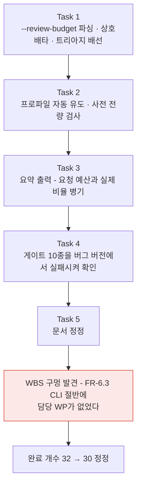

# Session Handoff

> Last updated: 2026-08-18 (KST)
> Branch: **`feat/triage-cli`** — `main`에 아직 안 올라갔다. 커밋 수는 매 커밋마다
> 자신을 포함하지 못해 여기 적은 숫자가 항상 낡는다(이전 세션에서 실제로 두 번 어긋났다) —
> `git rev-list --count e88177e..HEAD`로 직접 센다.
> **`cuesift translate`에 검수 큐 선별이 처음으로 배선됐다** — 이 저장소의 목적인
> 트리아지가 이제 CLI에서 도달 가능하다. 진척은 [WBS](docs/WBS.md), FR 번호의 출처는
> [요구사항정의서](docs/요구사항정의서.md)다

## Current Status

**[설계 스펙](docs/superpowers/specs/2026-08-18-triage-cli-design.md)의 태스크 5개
(트리아지 배선 → 프로파일 조달 → 요약 출력 → 게이트 실패 확인 → 문서 정정)를 전부 마쳤다.**
브리프·리뷰 기록은 `.superpowers/sdd/2026-08-18-triage-cli/`에 있지만 **이 경로는
`.superpowers/sdd/.gitignore`(`*`)로 git에서 완전히 빠져 있다** — 링크로 걸면 로컬에서는
열려도 GitHub에서는 404이므로 코드 스팬으로만 남긴다.

| | WP8a 종료 시점 | 이번 세션 (트리아지 CLI) |
| --- | --- | --- |
| 테스트 | 1050 passed, 3 deselected | **1094 passed, 3 deselected** |
| 트리아지 도달 경로 | **없다** — `collect_all`·`fuse`가 CLI에서 한 번도 호출되지 않았다 | `translate --review-budget`/`--review-threshold`가 실제로 돈다 |
| v0.1 FR 완료 | 32/42 (76%)라고 적혀 있었다 | **30/42 (71%)** — 아래 "완료 개수가 내려간 이유" 참고. **기능이 빠진 것이 아니라 세는 법이 틀려 있었다** |
| 라이브러리 변경 | — | **0줄.** 변경이 `cli.py` 하나에 갇힌다 |



### 완료 개수가 내려간 이유 — 읽는 사람이 가장 먼저 오해할 자리다

**이번 세션은 FR을 하나도 잃지 않았고 오히려 FR-6.3의 CLI 절반을 새로 냈다.** 32에서 30으로
내려간 것은 **이전 숫자가 실제보다 2개 높았기** 때문이다.

| FR | 옛 셈 | 실제 | 왜 |
| --- | --- | --- | --- |
| FR-6.3 | ✅ (WP1) | 🟡 | "트리아지 정책을 **지정할 수 있다**"인데 착수 시점에 CLI에서 아무것도 도달 못했다. 지금은 ②(임계값)와 ①의 비율이 닫혔고 "상위 K개"가 남는다 |
| FR-6.4 | ✅ (WP1) | 🟡 | 라이브러리는 세그먼트마다 `reasons`를 기록하지만 사용자에게 가는 통로(FR-7.2 `review.json`)가 미구현이다. CLI는 **집계**만 낸다 |

**"라이브러리에 있음"과 "사용자가 쓸 수 있음"을 같은 FR 번호가 공유하면 앞의 절반만 세고
닫힌다** — FR-5.3·FR-4.3에 이어 **세 번째다.** 상세는 [WBS](docs/WBS.md)의
"FR-6.3은 어느 WP의 것인가".

## 이번 세션이 한 일

### ① 트리아지 CLI 배선 (Task 1~4, 다른 세션이 구현·리뷰까지 마침)

| 표면 | 무엇을 |
| --- | --- |
| `--review-budget` | 경고를 **실제 동작으로 교체**. `10%`·`0.1` 형식이고 개수(`50`)는 exit 2 |
| `--review-threshold` | **신설**(0.0~1.0). `--review-budget`과 상호배타 |
| 프로파일 | **대상 언어 코드로 자동 유도**(새 옵션 0개). 없는 언어는 경고 후 그 언어의 트리아지만 건너뛰고, **하나도 없으면 exit 2** |
| 입력 집합 | **번역 실패분을 뺀다** — 실패분은 `struct.empty` hard fail을 내고 hard fail은 예산을 우회한다 |
| 요약 | `[en] 트리아지 (예산 10%, 프로파일 en)` + 대상 세그먼트·검수 대상·**실제 비율**·hard fail·신호별 적발 |

CHANGELOG에 상세를 실었다 — 여기서는 중복하지 않는다.

**세 자리가 모두 "조용히 틀리는" 자리다.** 프로그램이 정상 종료하므로 종료 코드로는
알 수 없고, 그래서 게이트가 값을 검사한다.

| 자리 | 틀리면 | 게이트 |
| --- | --- | --- |
| `collect_all`에 트랙 전체를 넘기기 | 배치 신호(`spec.overlap`)가 발화하지 않는다 | 설계 §9.1 |
| `failures` 제외 | Recall@Budget이 최악 0%까지 떨어진다 | 설계 §9.2 |
| 프로파일 사전 로드 | 앞 언어의 LLM 비용을 쓴 뒤에야 경고가 나간다 | 설계 §9.4 |

### ② 게이트 10종을 버그 버전에서 실패시켜 확인했다 (Task 4, `8d6feee`)

이 저장소의 규율이다 — **회귀 테스트는 버그 코드에서 실제로 실패하는 것을 본 뒤에야
회귀 테스트다.** 초안 §9.2가 부호 반전 테스트(**틀린 구현에서 통과하고 옳은 구현에서
실패**)였던 전례가 있어 어느 버전에서 무슨 값이 나왔는지까지 기록했다. 상세는 커밋
메시지와 `.superpowers/sdd/2026-08-18-triage-cli/`에 있다.

### ③ 리뷰가 잡은 것 (`d79ca41`·`37a76e5`)

라운드 1은 NaN 임계값 누출·임계값 경로 미검증·대소문자 플랫폼 의존, 라운드 2는
배치 신호 눈멂·임계값 미검증·프로파일 이름 절반이었다. **`--review-threshold nan`이
특히 조용했다** — click의 `min`/`max`는 `lt(nan, 0.0)`·`gt(nan, 1.0)`이 **둘 다
False**라 NaN을 통과시키고, 그러면 `ValueError`가 미처리 traceback이 되어 **exit 1**
("규격 위반 발견")로 나가 설정 실수가 자막 결함으로 오보된다. **프로파일 이름 출력이
값 검증의 유일한 수단이라는 것도 리뷰가 실측했다** — `profiles[target] = load_builtin("ko")`
변이가 **전 스위트를 통과했다**(키 집합만 검증되고 값은 검증되지 않았다).

### ④ 문서 정정 (Task 5, 이 커밋)

| 문서 | 무엇을 |
| --- | --- |
| `README.md` | **거짓말을 고쳤다** — "`--review-budget`은 아직 구현되지 않았습니다(WP5)". `#### 검수 트리아지` 절을 새로 쓰고 **하위 호환 파기 2건**을 명시했다 |
| 요구사항정의서 §5.6·§5.7 | **상태 열을 새로 추가**했다(두 표에 열이 셋뿐이었다). FR-6.3·6.4·7.4는 🟡 |
| `docs/WBS.md` | FR-6.3 CLI의 담당을 WP6으로 명시, 의존 그래프에 `FR-6.3 CLI → FR-4.3 CLI` 라벨, 완료 개수 32 → 30, "남은 1순위는 WP8b 하나다" 서술 정정 |
| `CHANGELOG.md` | `[Unreleased]`의 Added 4건 · Changed 5건 |
| `HANDOFF.md` | 이 문서 |

## 다음 사람이 반드시 알아야 할 것

### 다음 1순위는 **Tier 1 CLI 배선 (FR-4.3, WP8b)** 이다

**선행이 이번에 풀렸다.** `triage_with_tier1()`이 `budget_ratio`를 **기본값 없는 필수
인자**로 요구하므로 예산 배선 없이 Tier 1만 얹을 수 없었는데, 그 선행이 WBS에 적혀
있지 않아 "WP8b가 다음 1순위"라는 서술이 선행이 비어 있다는 사실을 가리지 못했다.
이번에 라벨을 붙였다.

### ① WP8b 착수 전 정리해야 할 것 **4건 — 여전히 유효하다**

**이전 세션에서 그대로 승계된다. 실측만 했고 구현은 안 했다.**

| 항목 | 실측 | 왜 아직 안 고쳤나 |
| --- | --- | --- |
| **배치 무력화로 호출 10배** (가장 중요) | 세그먼트 10개 × samples=3에서 **30회**(배치면 3회). **문자 수는 여기 조건 없이 적지 않는다** — `9840 + 30L`(세그먼트 단위)·`1119 + 30L`(배치)이고 L은 원문 길이다. L을 밝히지 않고 옮겨 적으면 다른 예문의 값이 "재현 실패"로 보인다(실제로 그렇게 세 라운드를 쓴 전례가 있다). 조건이 붙은 정확한 값은 `signals/llm.py`의 `_retranslate` 독스트링이 단일 출처 | Tier 1 설계 §4.1의 세그먼트 단위 프로토콜(`collect_tier1(seg, ctx)`)이 원인이고, 프로토콜 변경은 설계 변경이다. **CLI를 배선하는 사람이 이것을 모르면 실제 트랙에서 10배 비용이 그대로 난다.** 결론까지 적는다 — 기준선(배치 10) 대비 배수는 `30 × max_ratio`이고, 이 저장소의 표준 예산(10%)과 대칭인 `max_ratio=0.10`을 그대로 기본값으로 고르면 요구사항정의서 §4가 "3배는 감당 불가"라 한 한도에 **정확히 걸린다**(`30 × 0.10 = 3.0`). 실효 절감을 얻으려면 `<= 0.05`가 필요하다 |
| **Tier 1 토큰 사용량 미집계** | `collect_tier1`이 `TranslationResult.usage`를 올려 보낼 통로가 없다. **문자 배수는 여기 적지 않는다** — 원문 길이 L의 선형함수라 L 없이 인용하면 스스로 세운 규칙을 어긴다(n=1000·`max_ratio=0.10` 고정에서도 L을 스윕하면 배수가 1.9(L=3)~1.0 미만(L=40)까지 움직여 "더 쓴다"는 **부호 자체가 뒤집힌다**). 결론은 배수 없이도 선다 — `result.usage`를 통째로 버리므로 **그중 한 글자도 리포트에 안 잡힌다** | NFR-2·FR-7.4의 비용 숫자에서 **가장 비싼 계층만 빠진다.** **위 항목과 곱해진다** — 배치 무력화가 비용을 키우고 이 미집계가 그것을 숨기므로 `--dry-run` 추정치는 Tier 1을 켠 실행에서 구조적으로 과소 보고된다. **이번 세션이 이 항목을 닫지 않았다는 점을 분명히 한다**: 트리아지는 Tier 0만 쓰므로 비용이 0이고, 요구사항정의서 §5.7 FR-7.4가 🟡로 남은 이유가 정확히 이것이다 |
| **`samples` 상한 부재** | 100 × 2종 × samples=10⁶ → 2억 회가 거부 없이 통과한다 | 상한은 값이 입력되는 자리(CLI `--tier1-samples`)에 **근거와 함께** 둬야 한다(요구사항정의서 §11 R8이 출처 없는 수치를 금지) |
| **`CacheRequest.attempt`에 값 검증이 없다** | `attempt=None`이면 `key(None) == key(0)`이라 N회 호출이 한 캐시 키로 뭉친다. 실측: 정상 `attempt=i`는 호출 3회·`score=0.0286`인데 `attempt=None`은 호출 **1회**·`score=0.0000`이다 — `len(samples)<2 → None` 가드를 우회해 **"판정 불가"가 아니라 "판정했고 안전"으로 조용히 둔갑한다** | 고치는 것 자체가 WP8b의 일이다 — CLI가 `attempt`를 실제로 조립하는 자리이므로 검증도 거기서 붙는다 |

**이번 트리아지 배선이 이 4건 중 무엇도 건드리지 않았다.** Tier 1을 켜지 않으므로
발생하지 않을 뿐이고, `--tier1-*`를 붙이는 순간 전부 살아난다.

### ② Q4(자가일관성 유사도 측정 수단)는 여전히 열려 있다

WP8a가 방향은 좁혔다 — 문자 단위 유사도는 **형태**를 재고 **의미**는 못 잰다(실측 7쌍이
negation 0.727~0.930과 paraphrase 0.759~0.800으로 **범위가 겹쳐** 분리하지 못한다).
자가일관성 자체에도 **길이 편향**이 있다(짧을수록 점수가 높다, 배수는 예문 의존적이라
en 8~12배·ja 5~7배로 흩어진다 — `signals/llm.py`의 `SelfConsistency` 독스트링이 단일
출처). **판정은 벤치마크에 Tier 1을 태우는 별도 작업의 몫이다.**

### ③ FR-4.2(역번역)는 구현하지 않았다

착수 시점 실측이 문자 단위 유사도로는 `llm.retranslation_gap`이 **역방향으로 작동**함을
보였다 — 정상 변이가 오류보다 높은 점수를 받는다. 임베딩 등 다른 측정 수단이 들어오면
다시 검토한다.

### ④ `_run_single`(`engine.py`)의 전역 index 문제 — **확인됐고 아직 안 고쳤다**

Tier 1의 `_retranslate`는 `9d57e9a`로 닫혔지만, **일반 번역의 개별 폴백 경로는 같은
코드 패턴을 그대로 쓴다.** `engine.py`의 `_run_single`이
`parse_translations(completion.text, [segment.index])`로 **원본 전역 index**를 검증에
쓴다. 실물 Ollama로 확인했다.

```text
index=0: 성공 3/3
index=1: 성공 0/3   index=5: 성공 0/3   index=9: 성공 0/3
원시 응답(index=5, 3/3 동일): {"translations": [{"id": 0, "text": "[5] 길이 눈으로 덮였다."}]}
```

**약한 로컬 모델에서는 일반 번역의 개별 폴백이 index=0을 뺀 전부에서 작동하지 않는다.**
폴백은 원래 약한 모델을 위한 안전망인데 바로 그 조건에서 무력하다. **이 결함은 이
브랜치의 것이 아니다** — `48f9133`(WP7b)에 이미 있었고 지금 `main`에도 들어가 있다.
고치는 것은 WP7 계열의 별도 작업이다.

**다음 사람이 조심할 부류**: "약한/로컬 모델은 프롬프트의 명시적 지시보다 **예시의 리터럴
값**을 베끼는 경향이 있다 — 특히 항목이 하나뿐이라 값을 구분할 필요가 없을 때."
다른 리터럴 예시를 쓰는 자리에도 있을 수 있다.

## In Progress / Pending

| WP | 상태 | 근거 |
| --- | --- | --- |
| **WP7 (7a+7b)** | ✅ 완료 | FR-2.1~2.8 전부 닫힘 |
| **WP8a (Tier 1 라이브러리)** | ✅ 완료 | FR-4.1 닫힘. FR-4.3은 라이브러리 파라미터만 |
| **WP6 중 FR-6.3 CLI** | ✅ 완료 (이번 세션) | FR-6.3은 여전히 🟡 — "상위 K개"가 남는다 |
| WP8b (Tier 1 CLI 배선) | **다음 1순위** | `--tier1-max-ratio`·`--tier1-samples`·`--tier1-temperature`. 선행(`budget_ratio`)은 이번에 풀렸다. 착수 전 위 ① **4건**을 본다 |
| WP5 나머지 (FR-7.2~7.4) | 2순위 | `review.json`·`report.html`·소요 토큰. **입력이 되는 `SegmentRisk` 목록은 이제 CLI에서 만들어진다** |
| WP6 나머지 (FR-8.3~8.5) | 3순위 | `transcribe` 배선·`cuesift.yaml` 로더·진행 표시 |
| WP9 STT | 4순위 | FR-1.3이 "자막 우선"이라 마지막이어도 S1이 성립 |

## Key Decisions Made (이번 세션 · Task 5)

| 결정 | 근거 |
| --- | --- |
| **v0.1 완료 개수를 32에서 30으로 내렸다** | 브리프는 §5.6·§5.7의 상태 표시만 요구했고 개수까지 지시하지 않았다. 그러나 FR-6.3·6.4를 🟡로 적으면서 WBS의 32를 그대로 두면 **두 문서가 정면으로 갈라진다** — CLAUDE.md가 "WBS는 요구사항정의서의 파생물이지 병렬 출처가 아니다"라고 못 박은 자리다. 산수(32 − 2 = 30)를 WBS 본문에 표로 남겨 검증 가능하게 했다 |
| **WP1은 ✅로 남겼다 — 🟡로 내리지 않았다** | WP1의 산출물은 라이브러리이고 그것은 실제로 완료됐다. FR-5.3이 같은 상황에서 WP1을 ✅로 두고 개수만 WP6에서 센 **선례가 이미 이 문서에 있다.** 상태 기호를 흔드는 대신 "개수는 어느 행에서 세는가"를 명시하는 쪽이 기존 표기와 일관된다 |
| **README의 하위 호환 파기를 지우지 않고 목록으로 남겼다** | 두 파기 모두 의도된 동작이라 "고칠 것"이 없다. 그러나 옛 README를 읽고 스크립트를 짠 사용자에게는 예고 없는 파기이고, **문서가 no-op이라 말한 플래그가 번역 산출물을 통째로 없애는 상태**를 남기지 않는 것이 요점이다 |
| **README에 세그먼트 목록 출력 예시를 넣지 않았다** | 설계 D9가 화면 목록을 금지한다 — FR-7.2(`review.json`)가 WP5의 명시적 산출물이고, 화면 목록과 리포트가 갈라지면 한쪽만 고쳐진다. 문서가 없는 기능을 예시로 보이면 그것부터 갈라진다 |
| **코드를 한 줄도 고치지 않았다** | 이 태스크의 범위는 문서다. 문서를 쓰다 발견한 것은 보고하고 넘긴다 — 구현자가 도는 동안 작업트리를 건드리면 `git add`로 쓸려 담긴다는 사고가 이 저장소에서 실제로 한 번 났다 |

## 게이트 실행 기록

**이 세션(Task 5)이 직접 돌린 값이다.**

| 게이트 | 수치 |
| --- | --- |
| `ruff check .` | All checks passed |
| `ruff format --check .` | **90 files** already formatted |
| `pytest --cov=cuesift --cov-report=term-missing` | **1094 passed, 3 deselected** · 커버리지 **99%**(1733문 중 23 미실행) |
| `python scripts/check_links.py` | 마크다운 **27개** 파일 · 상대 링크 **122개** · 깨진 링크 0 |
| `npx markdownlint-cli2` | Linting: **27 files** · 0 issues |

**두 문서 게이트의 파일 수가 일치하는지 확인한다** — 갈라지면 추적 안 된 문서가 있다는
뜻이다. 링크 체커는 `git ls-files` 기준이므로 **새 파일은 `git add` 후에야 세어진다.**

**로컬 venv는 3.14이고 CI는 3.11·3.12다.** 로컬 게이트 통과가 CI 통과를 보장하지 않는다 —
이 브랜치의 35커밋이 CI를 한 번도 안 거치고 쌓였다가 원격 병합 시 `rich` 렌더링 차이로
실패한 전례가 있다. **그래서 `main`에 직접 푸시하지 않고 PR을 경유한다.**

실물 확인은 설계 스펙 §7.1이 기록을 갖고 있다 — Ollama `qwen2.5:3b`·`ten_cues.srt`·예산
30%에서 요약이 실제로 나왔고, 그 실행이 **번역 실패분 제외(D12)의 가치를 우연히
실증했다**(10개 중 9개 번역 실패 → 제외하지 않았다면 hard fail 9건이 `quota=3`을 완전히
소진). **이 값은 이번 태스크가 다시 돌린 것이 아니라 인용이다.**

## 개발 환경 메모 (승계)

Ollama는 트레이 앱 겸 백그라운드 서비스로 자동 기동해 `127.0.0.1:11434`를 듣는다 —
`ollama serve`를 따로 칠 필요가 없다. PATH에 없으면
`$env:LOCALAPPDATA\Programs\Ollama\ollama.exe`를 직접 부른다.

| 모델 | 크기 | 용도 |
| --- | --- | --- |
| `qwen2.5:3b` | 1.9GB | **번역·Tier 1 신호용.** 단일 세그먼트 호출의 index 버그(위 ④)가 이 모델에서도 재현된다는 점은 유의할 것 — "3b는 신뢰 가능"이 무조건은 아니다 |
| `qwen2.5:1.5b` | 986MB | 폴백 관찰용. 번역기로는 못 쓴다(실측 5/15) |

live 실행 명령:

```powershell
$env:CUESIFT_LIVE_BASE_URL="http://localhost:11434/v1"
$env:CUESIFT_LIVE_MODEL="qwen2.5:3b"
.venv/Scripts/python.exe -m pytest -m live -v -s
```
