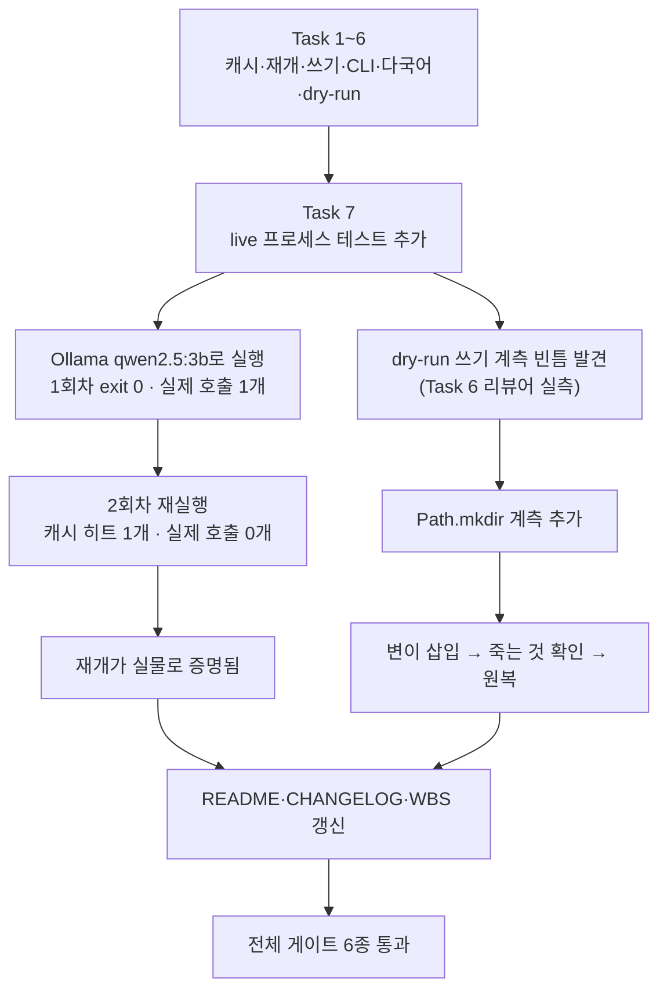

# Session Handoff

> Last updated: 2026-08-17 (KST)
> Branch: **`feat/translate-cli`** — 커밋 20개, `main`에 아직 안 올라갔다.
> **WP7b(번역 영속화·CLI)가 이 세션으로 닫혔다** — `cuesift translate`가 캐시·재개·
> 다국어·`--dry-run`까지 실제로 동작하고, 재개는 `python -m cuesift`를 서브프로세스로
> 두 번 실행한 live 테스트로 실물 확인됐다.
> 진척은 [WBS](docs/WBS.md), FR 번호의 출처는 [요구사항정의서](docs/요구사항정의서.md)다

## Current Status

**[설계 스펙](docs/superpowers/specs/2026-08-17-translate-cli-design.md)과
[구현 계획](docs/superpowers/plans/2026-08-17-translate-cli.md)의 태스크 7개(캐시 저장소 →
캐시를 끼운 프로바이더 → 자막 쓰기 → CLI 배선 → 다국어 → `--dry-run` → live 검증·문서)를
전부 마쳤다.** 브리프·리뷰 기록은 `.superpowers/sdd/2026-08-17-translate-cli/`에 있지만
**이 경로는 `.superpowers/sdd/.gitignore`(`*`)로 git에서 완전히 빠져 있다** — 링크로
걸면 로컬에서는 열려도 GitHub에서는 404이고 `scripts/check_links.py`는 `exists()`만
보므로 이 누수를 잡지 못한다. 그래서 코드 스팬으로만 남긴다(검사받지 않는 링크는
남기지 않는다). 이번 세션(Task 7)이 한 일은 코드가 아니라 **검증과 기록**이다 — 새
로직은 없고, 기존 dry-run 쓰기 계측의 빈틈 하나를 메운 것과 live 프로세스 테스트
추가가 전부다.

| | 이전 세션 종료 시점 (Task 6) | 이번 세션 (Task 7) |
| --- | --- | --- |
| 테스트 | 975 passed, 1 deselected | **975 passed, 2 deselected** (live 프로세스 테스트 1건 추가) |
| v0.1 FR 완료 | 28/42 (67%) | **31/42 (74%)** — FR-2.7·FR-7.1·FR-8.1 세 건이 이번에 닫혔다 |
| live 검증 | `translate_segments` 라이브러리 호출만 확인 | **`python -m cuesift`를 서브프로세스로 실행**해 재개(2회차 실제 호출 0개)를 실물 확인 |
| 문서 | `translate`가 아직 "구현 예정"으로 적혀 있었다 | README·CHANGELOG·WBS가 실제 동작과 일치한다 |



## 이번 세션이 한 일

### ① live 프로세스 테스트 추가 (`tests/test_translate_live.py::test_cli가_실제_프로세스로_동작한다`)

기존 live 테스트(`test_실제_엔드포인트로_한_배치를_왕복한다`)는 `translate_segments`를
**라이브러리로** 호출한다 — `typer.Exit`이 실제 프로세스 종료 코드가 되는지는 증명하지
못한다. `python -m cuesift translate`를 서브프로세스로 두 번 실행해 그 간극을 메웠다.

**`python -m cuesift`는 Task 4에서 이미 만들어져 있었다** — `src/cuesift/__main__.py`가
존재하고 `-m cuesift --version`도 동작을 확인했다. 새로 만들 필요가 없었다.

`CUESIFT_LIVE_*`(테스트 전용 예약어) → `CUESIFT_BASE_URL`/`CUESIFT_MODEL`(CLI가 실제로
읽는 이름)로 변환해 서브프로세스 환경에 넘겼다 — 접두사를 그대로 넘기면 CLI가 조용히
기본값(엔드포인트 없음)으로 돈다.

### ② dry-run 쓰기 계측의 빈틈을 메웠다 (Task 6 리뷰어 실측)

`test_dry_run은_파일도_캐시도_쓰지_않는다`가 `cuesift.cli.write_subtitle`·
`cuesift.store.provider.store` 두 **이름**만 계측하고 있었다 — `cache_dir.mkdir(...)`처럼
함수 밖에서 직접 부르는 다른 쓰기는 새어 나가도 안 죽었다(이 변이가 기존 975건을
전부 통과했다, 실측). `Path.mkdir` 자체를 계측하는 한 줄을 더했다.

**게이트를 만들면 반드시 실패시켜 본다는 이 저장소의 규율대로**, `_dry_run_report` 안에
`cache_dir.mkdir(parents=True, exist_ok=True)`를 임시로 넣어 새 계측이 실제로 죽는 것을
확인한 뒤 되돌렸다. `cli.py`는 원상태다(`git diff` 없음).

### ③ 문서 3건 정정 (Task 6 리뷰어가 Task 7로 넘긴 것)

| 무엇 | 문제 | 정정 |
| --- | --- | --- |
| README 종료 코드 표 | "`translate`는 종료 코드 70(미구현)"이라 적혀 있었다(거짓) · `69`(`EX_UNAVAILABLE`) 누락 | `cli.py` 모듈 독스트링을 단일 출처로 삼아 재작성. `69` 행 추가 |
| README `--dry-run` 예제 | `# 비용 추정` 주석이 §11 R8과 충돌(비용을 추정하지 않는다) | `# 몇 번 더 불러야 하나`로 정정 |
| README `## CLI` 절 | "`check` 구현 완료 · 나머지 설계 확정" — `translate`도 이미 동작하는데 낡음 | "`check`·`translate` 구현 완료 · `transcribe` 설계 확정" |

## 다음 사람이 반드시 알아야 할 것

### 🔴 즉시 해야 할 것 — PR을 만들어야 CI가 돈다

**이번 세션은 커밋까지만 한다 — 푸시·PR 생성은 하지 않는다** (팀 리드가 직접 한다).
다음 사람(또는 팀 리드)이 할 일:

```bash
git push -u origin feat/translate-cli
gh pr create --base main
gh pr checks --watch     # test 3.11 · test 3.12 · docs
gh pr merge --squash
```

**로컬 venv는 3.14이고 CI는 3.11·3.12다.** 3.11 문법 검사(아래 게이트 표)는 통과했지만
CI에서 실제로 3.11·3.12 인터프리터로 돌리는 것이 최종 확인이다.

### ① dry-run의 "손으로 맞춘 기본값"은 여전히 미해결이다 (Task 6이 남긴 것, 재확인만 함)

`_dry_run_report`(`src/cuesift/cli.py`)가 `temperature=0.0`·`max_tokens=None`·
`DEFAULT_BATCH_SIZE`를 손으로 반복한다. 엔진 기본값이 바뀌면 dry-run이
"호출 필요 82개 이상"이라 해 놓고 실행은 다른 수를 부르는 상황이 조용히 생길 수 있다.
**이번 세션은 이 문제를 고치지 않았다** — `translate/`의 공개 API를 늘려야 해서
되돌리기 단위가 커진다는 Task 6의 판단을 그대로 승계한다. WP8이 같은 것(엔진이
"이 설정으로 부를 메시지 목록"을 내주는 함수)을 필요로 하면 그때 함께 낸다.

### ② 이전 세션의 파킹 목록(R-1~R-4, S-1~S-3)은 이번 세션에서 재확인하지 않았다

Task 7의 범위가 `translate/`·`store/`·`ingest/`·`cli.py`의 **로직을 고치지 말라**로
좁혀져 있어(브리프의 명시적 금지) 손대지 않았다. 이전 HANDOFF(git 이력의 이전 판)에
적힌 미해결 항목들의 현재 상태는 검증되지 않은 채로 남아 있다 — 다음 세션이 착수 전에
`git log`로 재확인해야 한다.

## In Progress / Pending

| WP | 상태 | 근거 |
| --- | --- | --- |
| **WP7 (7a+7b)** | ✅ 완료 | FR-2.1~2.8 전부 닫힘 |
| **WP8 Tier 1 신호** | 다음 1순위 | 선행은 WP7a까지 — WP7b를 기다리지 않는다(WBS 참고). Q4(자가일관성 유사도)가 여기서 닫힌다 |
| WP5 나머지 (FR-7.2~7.4) | 2순위 | `review.json`·`report.html`·요약 통계 |
| WP6 나머지 (FR-8.3~8.5) | 3순위 | `transcribe` 배선·`cuesift.yaml` 로더·진행 표시 |
| WP9 STT | 4순위 | FR-1.3이 "자막 우선"이라 마지막이어도 S1이 성립 |

## Key Decisions Made (이번 세션)

| 결정 | 근거 |
| --- | --- |
| **`Path.mkdir` 전체를 계측한다 — 이름별 계측을 늘리지 않는다** | 이름별 계측(`write_subtitle`·`store`)은 다음에 새 쓰기 지점이 생겨도 계측 목록에 추가되지 않으면 또 새는 구조다. `Path.mkdir` 하나가 "쓰기 함수 이름을 전부 알아야 막을 수 있다"는 구조적 약점을 없앤다 |
| **변이는 반드시 실행해서 확인한 뒤 되돌린다** | "계측을 추가했다"와 "계측이 작동한다"는 다르다. 이 저장소가 여러 번 강조한 규율을 그대로 따랐다 |
| **CHANGELOG·WBS 수치는 전부 이번 세션에 실제로 돌려서 얻었다** | 1회차 2.71초·2회차 0.38초, 975 passed 등 — 지어낸 수치가 없다 |

## 게이트 실행 기록

| 게이트 | 수치 |
| --- | --- |
| `ruff check .` | All checks passed |
| `ruff format --check .` | **82 files** already formatted |
| `pytest --cov=cuesift --cov-report=term-missing` | **975 passed, 2 deselected** · 커버리지 **98%** (1510문 중 25 미실행) |
| `pytest -m live -v -s` (Ollama `qwen2.5:3b`) | **2 passed, 975 deselected** in 29.91초 |
| `python -m cuesift translate ...` 1회차 | exit **0** · 캐시 히트 0개 · **실제 호출 1개** · 2.71초 |
| `python -m cuesift translate ...` 2회차 (재개) | exit **0** · 캐시 히트 1개 · **실제 호출 0개** · 0.38초 |
| `python scripts/check_links.py` | 마크다운 **23개 파일** · 상대 링크 **99개** / 깨진 링크 0 |
| `npx markdownlint-cli2` | Linting: **23 files** / 0 issues |
| 3.11 문법 검사 (`ast.parse`, `src`+`tests`) | **3.11 OK** |

**두 문서 게이트가 23으로 일치한다** — 갈라지면 추적 안 된 문서가 있다는 뜻이다.

## 개발 환경 메모 (승계)

Ollama는 트레이 앱 겸 백그라운드 서비스로 자동 기동해 `127.0.0.1:11434`를 듣는다 —
`ollama serve`를 따로 칠 필요가 없다. PATH에 없으면
`$env:LOCALAPPDATA\Programs\Ollama\ollama.exe`를 직접 부른다.

| 모델 | 크기 | 용도 |
| --- | --- | --- |
| `qwen2.5:3b` | 1.9GB | **번역용.** 이번 세션의 live 검증 전부가 이것으로 통과했다 |
| `qwen2.5:1.5b` | 986MB | 폴백 관찰용. 번역기로는 못 쓴다(이전 세션 실측 5/15) |

live 실행 명령은 [README](README.md)의 "개발 환경 > 실제 LLM 엔드포인트 테스트"와
"`cuesift translate` — 번역" 절에 있다.
