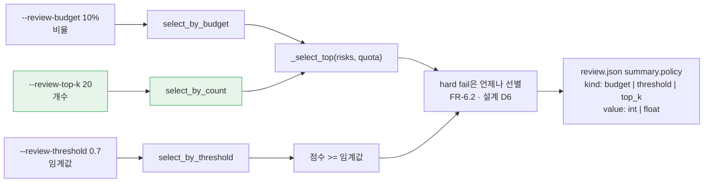
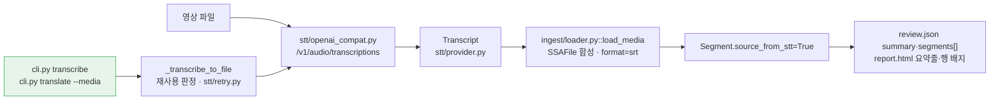

# Session Handoff

> Last updated: 2026-09-03 (KST)
> **FR-6.3이 닫혔다 - ①의 나머지 절반인 "상위 K개"가 마지막 조각이었다.**
> `feat/review-top-k`에서 태스크 6개 · 커밋 7개(`4f2cdc2`..`12de0df`)로 검수 예산에
> **세 번째 축**이 생겼다 - 비율(`--review-budget`) · 임계값(`--review-threshold`) ·
> **개수(`--review-top-k`)** 가 상호배타로 갈리고 셋 중 둘은 같은 `_select_top` 헬퍼를 지난다.
> **v0.1 완료 개수 40 → 41 (42개 중, 98%).** 남은 것은 **FR-4.2 역번역(⬜) 하나뿐이고**,
> 그것은 요구사항정의서 §12 **Q4**가 닫히기 전에는 착수 근거가 없다.
> 직전 세션의 FR-8.3은 PR [#22](https://github.com/withwooyong/cuesift/pull/22)로
> `main`에 들어갔다.
> **이번 FR-6.3은 아직 푸시되지 않았다** - 이 문서를 커밋한 **뒤에** 푸시하고 PR을 연다.
> 그래서 **PR 번호도 squash 해시도 여기 적을 수 없다.** 적을 수 없는 것은 추측하지 않는다 -
> 아래 "다음 세션 시작 절차"의 **첫 명령**이 그 값들을 재는 명령이다.
> 상태 값은 여기 적힌 숫자가 아니라 아래 "현재 상태 재는 법"의 명령으로 직접 재라.
> 진척은 [WBS](docs/WBS.md), FR 번호의 출처는 [요구사항정의서](docs/요구사항정의서.md)다

## Current Status

| 단계 | 상태 | 산출물 |
| --- | --- | --- |
| WP9 - STT 어댑터 | ✅ **머지됨** | PR [#20](https://github.com/withwooyong/cuesift/pull/20) · squash `1741337` |
| WP6 - `transcribe` 배선 (FR-8.3) | ✅ **머지됨** | PR [#22](https://github.com/withwooyong/cuesift/pull/22) · CI 5잡 통과 |
| FR-6.3 ① 설계 스펙 | ✅ | `5c1f65e` · [설계 스펙](docs/superpowers/specs/2026-09-03-review-top-k-design.md) |
| FR-6.3 ① 구현 계획 (6태스크) | ✅ | `3381f6b` · [계획서](docs/superpowers/plans/2026-09-03-review-top-k.md) |
| **FR-6.3 ① 구현 - 태스크 6개** | ✅ **전부 완료** | `4f2cdc2`..`1cce753` |
| **이중 리뷰 - 품질 축 · 계약·호환성 축** | ✅ 승인 | CRITICAL·HIGH **0건** · MEDIUM 이하 **6건** |
| 리뷰 반영 · 두 축 재확인 | ✅ 닫힘 | `12de0df` - 6건 전부 해소 · **새 문제 0건** |
| 검증 (제3자가 직접 실행, HEAD `12de0df`) | ✅ 통과 | 1783 passed · 커버리지 99% · 문서 게이트 45 = 45 |
| **FR-6.3 푸시·PR·merge** | ⬜ **미실행** | 이 문서를 커밋한 뒤에 연다 |

**이번에는 직전 세션의 순서를 쓰지 못했다.** 직전 세션은 PR을 먼저 열어 번호를 문서에 넣고
머지 직전에 이 표를 ✅로 고쳐 같은 squash에 담았다. 이번 문서는 **커밋한 뒤에 푸시하므로
PR 번호도 squash 해시도 적을 수 없다.** 적을 수 없는 것은 추측하지 않는다 - 대신 아래
시작 절차의 **첫 명령을 PR 상태 확인으로** 두었다. 이 문서가 자기 자신을 담은 PR을
볼 수 없는 것에 대한 유일한 방어가 그것이다.

## 현재 상태 재는 법

**첫 일은 직전 작업이 어디까지 갔는지 확인하는 것이다.**

```bash
gh pr list --head feat/review-top-k --state all --json number,state,mergeCommit
git branch --show-current                     # feat/review-top-k (머지 후에는 main)
git status --short                            # clean 이어야 한다
git log --oneline -10                         # 5c1f65e..12de0df 아홉 개 + 이 문서가 FR-6.3이다
```

## 이번 세션이 낸 것 - 태스크 6개 · 커밋 7개

| 태스크 | 무엇 | 커밋 |
| --- | --- | --- |
| 1 | `triage/policy.py` - `select_by_count` 신설 · `_select_top` 공통 헬퍼 추출 | `4f2cdc2` |
| 2 | `_resolve_exclusive`를 2자에서 **N자로** · 회귀 그물 보강 | `1e5e7e2` |
| 3 | `--review-top-k` 옵션과 **전 경로 배선** | `864946d` |
| 4 | `policy_value: int \| float` · `policy_kind`에 `"top_k"` | `1259192` |
| 5 | 설정 키 `triage.review_top_k` (FR-8.4) | `acb4d66` |
| 6 | 문서 8종 파급 · FR-6.3을 ✅로 | `1cce753` |
| 리뷰 반영 | MEDIUM 이하 **6건** | `12de0df` |

여섯 태스크가 낸 것은 **옵션 하나가 아니라 라이브러리(1) → 배타 해소(2) → CLI(3) →
산출물(4) → 설정(5) → 문서(6)의 한 줄**이고, 리뷰 반영은 그중 설정 채널과 오류 문구만
다시 짰다.



**개수 축은 비율 축과 코드 경로를 공유한다.** 둘 다 정렬 후 상위 N개를 자르는 같은 일이라
`_select_top(risks, quota)` 하나로 모았고, 갈리는 것은 **quota를 어떻게 구하느냐**뿐이다
(비율은 세그먼트 수에 곱하고, 개수는 그대로 쓴다). 임계값 축만 다른 모양이라 합치지 않았다.

| 축 | 옵션 | 값 예시 | 설정 키 | `policy.kind` |
| --- | --- | --- | --- | --- |
| 비율 | `--review-budget` | `0.1` · `10%` (`1`은 100%) | `triage.review_budget` | `budget` |
| 임계값 | `--review-threshold` | `0.7` | `triage.review_threshold` | `threshold` |
| **개수** | **`--review-top-k`** | **`20`** (`0`은 hard fail만) | **`triage.review_top_k`** | **`top_k`** |

셋은 **상호배타다** - 둘 이상을 명령줄로 주면 exit 2이고, 설정 파일과 명령줄이 갈리면
명령줄이 이긴다(FR-8.4). 화면 표시는 `상위 20개`, `review.json`의 `policy.value`는
**정수로** 직렬화된다(설계 D7).

## 게이트 실행 기록 (2026-09-03, HEAD `12de0df` + 이 문서 커밋)

| 게이트 | 착수 시점 | 지금 |
| --- | --- | --- |
| `pytest --cov` | 1743 passed · 5 deselected | **1783 passed · 0 failed · 5 deselected** |
| 커버리지 | TOTAL 98% | **TOTAL 99%** |
| `ruff check .` / `ruff format --check .` | 통과 · 129 files | 통과 · **129 files** |
| CLI 옵션 개수 | 30 | **31** (`--review-top-k` 하나가 늘었다) |
| YAML 허용 키 | 28 | **29** (`BINDINGS` 27 + `SPECIAL_PATHS` 2) |
| `scripts/check_links.py` | 마크다운 45개 · 상대 링크 240개 | 마크다운 **45개** · 상대 링크 **253개** (이 문서 커밋 후 **252개**) · 깨진 링크 **0** |
| `npx markdownlint-cli2` | Linting: 45 files | **Linting: 45 files** · 0 issues |

**두 도구의 파일 개수가 같은지를 본다** - 이번에는 이 문서를 `git add`한 뒤에도 45 = 45다.
링크가 253개에서 252개로 준 것은 **이 문서 자신**이다 - 머지된 WP9·WP6의 스펙·계획서 링크를
지우고 이번 스펙·계획서 링크를 넣어 하나가 줄었다. **문서를 세는 게이트에서는 인수인계
문서도 대상이다**(같은 부류가 아래 ⓔ다). 갈리면 새 문서가
`git add`되지 않아 링크 검사를 아예 받지 않은 것이다 - `check_links.py`는 `git ls-files`를
보고 markdownlint는 `gitignore` 규칙을 본다.

**이 수치는 구현자가 아니라 제3자가 직접 돌려 받은 것이다.** 그리고 **착수 값은 계획서에서
읽지 않았다** - 계획서가 적은 "마크다운 44개 · 링크 238개"는 계획서와 스펙 자신이 커밋되기
전의 값이라 실측(45개 · 240개)과 갈렸다(아래 ⓔ).

## FR 완료 개수 - 40 → **41**

FR-6.3 하나가 🟡에서 ✅로 올랐다. 비율·임계값 두 축은 이미 있었고 **①의 나머지 절반인
"상위 K개"가 이번에 닫혔다.** 직전 세션의 40은 FR-8.3이 39에서 올린 값이다.
**v0.1 대상 42개 중 41개이고 남은 하나는 FR-4.2 역번역(⬜)이다.**

## 다음 작업 패키지로 넘어간 항목 - 이월 트리아지 **14건** (기존 9건에 다섯이 늘었다)

**번호는 원래 번호를 유지한다** - 다시 매기면 이전 세션의 기록에서 가리키는 번호가 다른
항목을 뜻하게 된다. 1번과 7번은 직전 세션(`feat/media-wiring`)이 닫아 표에 없고,
**12~16번이 이번 세션의 이중 리뷰가 새로 찾은 것이다.**

| # | 무엇 | 왜 지금 안 했나 | 다시 열 조건 |
| --- | --- | --- | --- |
| 2 | `bench/track_io.py`의 `_FIELDS`가 `source_from_stt`를 모른다 — 왕복에서 **조용히 `False`로 리셋** | 도달 경로가 없다(벤치 코퍼스는 자막). 고치면 벤치 직렬화 포맷이 바뀐다 | STT 트랙을 벤치에 넣을 때. `tests/test_bench_track_io.py`의 왕복 동등성이 그 순간 실패한다 |
| 3 | `pyproject.toml`에 **`filterwarnings`가 없어 경고가 게이트를 통과한다** | `["error"]`는 스위트 전체에 영향 — WP9 범위 밖 | 별도 과제. **"검사하지 않고 통과하는 게이트" 규율에 직접 걸린다** |
| 4 | `translate/provider.py`의 `RetryableProviderError.__init__`도 `isinstance`+`isfinite`를 쓴다 — 거대 정수에서 같은 `OverflowError` 누출이 있는지 **미확인** | 기존 코드. 이번 변경과 무관 | `translate`를 손대는 다음 패키지. STT 경로에는 도달 경로가 없음을 확인했다 |
| 5 | `Transcript.__post_init__`이 `cues`의 **컨테이너 타입만** 보고 원소 타입은 안 본다 | Task 1 범위 밖 | 프로바이더를 하나 더 붙일 때 |
| 6 | `pyproject.toml:69`의 **죽은 `stt` extra** | 의존성 고정 규율상 채울 것이 없다 | 패키징을 손볼 때 |
| 8 | FR-1.5(원문 언어 자동 감지)가 반쪽 — STT 응답의 `language`를 **기록만** 한다 | `IngestResult.source_lang`은 선언값을 쓴다(값 도메인이 백엔드마다 다르다) | 자막 파일 입력까지 함께 닫을 때 |
| 9 | API 키가 **공백 한 칸**이면 `Authorization: Bearer` 뒤에 공백만 붙은 헤더가 나가 401이 "키가 틀렸다"로 오독된다 | 기존 동작이고 번역(`CUESIFT_API_KEY`)도 같다. STT만 `.strip()`을 넣으면 두 경로가 비대칭이 된다 | 키 처리를 손볼 때. `_resolve_stt_key`와 `_require_ascii_api_key` 양쪽을 함께 고친다 |
| 10 | `translate --media X --to ko`처럼 **대상이 원문과 같으면** 전사를 마친 뒤 exit 2 | 출력 경로 충돌 검사가 입력 이름을 알아야 해서 전사 앞으로 옮기기 어렵다. 다만 `media is not None and target == source_lang`은 앞에서 판정 가능하다 | 되돌릴 수 없는 비용 앞의 검사를 정리할 때 |
| 11 | 설정의 `input.media` + `--dry-run` 조합에 **CLI 탈출구가 없다** - `--no-media` 같은 무효화 옵션이 없다 | 위치 인자로 자막을 주면 회피된다. 설정 무효화 옵션은 이 한 자리만의 문제가 아니다 | 설정 무효화 규칙을 전반적으로 정할 때 |
| 12 | `triage.review_threshold`·`review_budget`도 **설정 채널에서 `true`를 exit 0으로 받는다** | **기존 동작**이라 지금 고치면 하위 호환이 깨진다. `review_top_k`만 처음부터 엄격하다(`require_int`) | 설정 스키마에 타입 검증을 일괄로 넣을 때. 리뷰어가 실측으로 재현했다 |
| 13 | 설정에 **리스트를 주면 raw traceback이 샌다** | `review_threshold: []`에서 동일 재현. `review_top_k: []`는 `require_int`가 이번에 닫았다 | 12번과 같은 자리다. 같은 커밋에서 함께 닫는다 |
| 14 | `cli.py` 자막/영상 자리의 `if "input" in losers:`는 **도달 불가능한 죽은 코드** | 위치 인자는 `default_map`에 실리지 않아 `_from_config("input")`이 늘 거짓이다. **어떤 테스트도 덮을 수 없다** | `_resolve_exclusive` 호출부를 정리할 때. 지우는 것이 맞는지부터 판정한다 |
| 15 | `review.json`에 **스키마 버전 필드가 존재한 적이 없다** | 그래서 "이번에 올리지 않았다"가 **표현 불가능한 결정이다.** `policy.kind` 도메인이 넓어졌는데 하류가 감지할 신호가 없다 | 하류 소비자가 생길 때. 계약·호환성 축 리뷰가 지목했다 |
| 16 | `policy_kind` 분기의 `else`가 **threshold로 조용히 떨어진다** | 지금은 같은 함수가 셋 중 하나를 배정하고 넷째는 `ValueError`로 죽어 도달 불가다 | **넷째 축이 추가될 때.** 그 순간 유일하게 조용히 틀릴 자리다 |

**12~16번은 미룬 이유가 서로 다르다.** 12·13은 **하위 호환**(고치면 지금 도는 설정이 깨진다),
14는 **범위 밖**, 15·16은 **미래 확장 시점에만 발동**한다. 이 구분이 다시 열 조건을 정한다 -
12·13은 사람이 날을 잡아야 하고, 15·16은 그때가 오면 저절로 걸린다.

같은 리뷰가 찾은 **MEDIUM 이하 6건은 미루지 않고 닫았다**(`12de0df`). 그중 하나가
**설정 파일의 `review_top_k: false`가 exit 0 + K=0으로 조용히 돌던 것**이고, 그것이
12·13번의 원형이다 - 새 키만 `require_int`로 닫혔고 **옛 키 둘은 그대로 남았다.**

남은 열넷은 전부 "미루면 그대로 있는" 부류다.

## STT는 이제 CLI에서 도달한다

| 부르는 쪽 | 오늘 동작 |
| --- | --- |
| `cuesift transcribe <영상>` | **동작한다.** `episode02.mp4` → `episode02.ko.srt` |
| `cuesift translate --media <영상> --to en` | **동작한다.** 전사 자막과 번역 자막을 함께 낸다 |
| `cuesift translate/check`에 영상을 **위치 인자로** 준다 | **exit 66** - `_reject_non_subtitle`이 확장자로 거부. 영상은 `--media`로 준다 |
| `cuesift.ingest.load_media(...)` (파이썬) | **동작한다.** 100% 커버리지 |

이 절과 아래 도식은 **승계다** - 이번 세션이 건드리지 않았고, 그대로 참이다.



**끊긴 자리가 없다.** WP9가 어댑터부터 산출물까지의 한 줄을 냈고 CLI만 비어 있었는데,
FR-8.3이 `_transcribe_to_file` 하나로 그 자리를 이었다 - `transcribe`와
`translate --media`가 **같은 함수를 부른다.**

### 직전 인수인계의 이 표가 두 군데 틀렸다 - 정정한다

| # | 직전 판이 말한 것 | 실제 |
| --- | --- | --- |
| P1 | "영상을 `run`에 주면 **66**" | **`run` 명령이 없다.** `cli.py`의 `def run()`은 콘솔 스크립트 진입점(`__main__`)이고 서브커맨드가 아니다. 66을 내는 것은 `translate`·`check`의 위치 인자다 |
| P2 | "`cuesift.stt.transcribe_media(...)`가 동작한다" | **그런 이름이 `__all__`에 없다.** 파이썬 진입점은 `cuesift.ingest.loader::load_media`이고, `cuesift.stt`가 내보내는 것은 프로바이더 계약과 어댑터다 |

**둘 다 이번 스펙의 착수 조사가 코드로 확인해 뒤집었다.** 인수인계 문서에 적힌 API 이름과
명령 이름은 **읽는 순간 참으로 보이지만 아무 게이트도 대조하지 않는다** - 착수 조사가
`grep`으로 확인하지 않았다면 계획서가 없는 이름을 부르는 코드를 지시했을 자리다.

### ⚠ live 검증을 못 했다 - 설계 스펙 R3의 한계

**STT 백엔드가 아직 정해지지 않았다.** OpenAI 호환 `/v1/audio/transcriptions`를 내면서
`verbose_json`을 돌려주는 서버가 필요한데 **Ollama는 그 엔드포인트를 제공하지 않는다.**
그래서 FR-8.3의 전 경로는 **가짜 프로바이더로만 검증됐다** - `transcribe`·`translate --media`·
재시도 루프·재사용 판정 어느 것도 실제 백엔드를 한 번도 치지 않았다.

**이것은 "테스트가 없다"가 아니라 "목이 만들지 않는 조건은 게이트가 통과시킨다"의 자리다.**
`Content-Encoding` 회귀가 1693건을 통과했던 것과 같은 구조다 -
**목이 한 번도 만들지 않는 조건은 게이트가 통과시킨다.**
백엔드를 정하는 사람이 `tests/test_stt_live.py`(`-m live`, `CUESIFT_LIVE_STT_*`)를 먼저 돌려야 한다.

## 이번 세션이 배운 것

**여덟 중 ⓐ·ⓑ·ⓒ·ⓕ가 한 부류다 - 게이트가 자기가 재려는 것을 재지 못했다.**
넷 다 "통과했나"가 아니라 **"무엇을 대상으로 통과했나"** 를 물어야 드러났다.

### ⓐ 계획서의 파괴 실험 지시가 방향을 반대로 볼 수 있다

Task 2에서 계획서가 지정한 변이(`in` → `==`)를 넣었는데 **37건이 전부 통과했다.**
그 테스트에서는 `losers`가 한 원소라 `==`와 `in`이 같은 분기로 떨어졌고, 실제로 갈리는 것은
**반대 방향**이었다.

**계획서가 "이 변이가 잡힌다"고 적어도 돌려 봐야 안다.** 변이를 넣었는데 전부 통과하면
그물이 죽은 것일 수도, **변이가 아무것도 바꾸지 않은 것일 수도** 있다. 둘을 먼저 갈라라.

### ⓑ `exit_code == 0`만 단언하는 회귀 테스트는 양보가 뒤집혀도 통과한다

ⓐ를 파고들었더니 기존 회귀 **4건**이 이 부류였다 - 해소된 값이 화면에 출력되지 않아
**관측되지 않았다.** 예산/임계값 쌍도 같은 이유로 뚫려 있었다. 그물을 보강한 뒤에야
캐시·예산 두 자리에서 각각 1건 FAIL을 확인했다.

**값이 화면이나 파일에 나타나지 않으면 그 테스트는 아무것도 재지 않는다.**
`_resolve_exclusive`처럼 "무엇을 버렸는가"가 결과인 함수는 **버려진 쪽이 출력에 보이는지**를
먼저 확인하고 회귀를 짜라.

### ⓒ 파괴 실험 1회로는 그물이 사는지 증명되지 않을 수 있다 - 크래시가 먼저 나면 그렇다

Task 4에서 계획서 지시대로 `float(top_k)`로 깨뜨리자 FAIL은 났지만 `isinstance` 단언이
아니라 **`exit_code == 0`에서 터졌다**(슬라이스가 float를 거부). **그물이 아니라 크래시가
잡은 것**이라 직렬화 경계에서 한 번 더 깨뜨려서야 `assert isinstance(3.0, int)`가 무는 것을
봤다. 그때 **바로 위의 `== 3` 단언은 그대로 통과했다**(`3.0 == 3`이 참이다).

**고른 변이 지점이 그물과 같은 층인지를 먼저 본다.** 앞 단계에서 죽으면 그물은 실행조차
되지 않는다.

### ⓓ click의 타입 검증은 `default_map` 값을 본문 진입 전에 변환한다

그래서 라이브러리 층(`select_by_count`)의 `bool` 거부가 **설정 파일 채널에서는 무력이다** -
`IntRange`가 `int(True) == 1`로 먼저 바꾸기 때문이다. `cli.py`에서는 원 타입을 볼 수 없어
**검증을 걸 자리는 `config/schema.py`의 바인딩**이고, 그것이 `require_int`다.

이 저장소는 같은 부류를 **`input.media`에서 이미 한 번 만났다**(그때는 `exists=True`가
양보 로직보다 먼저 터졌다). 둘을 합치면 규칙이 하나 나온다 - **설정 파일에서 온 값은
본문 코드를 만나기 전에 click을 통과하므로, 본문에 둔 방어는 그 채널을 지키지 못한다.**
**설정 예시를 실제로 실행하는 테스트가 이 부류를 잡는 유일한 게이트다.**

### ⓔ 계획서는 자기 자신을 세지 못한다

계획서의 착수 게이트 값이 "마크다운 44개 · 링크 238개"였는데 실측은 **45개 · 240개**였다.
**계획서와 스펙이 커밋되면서 이미 늘어난 것이다.**

**착수 값은 계획서에서 읽지 말고 직접 재라.** 문서를 산출물로 세는 게이트에서는
계획서 자신이 그 게이트의 대상이다.

### ⓕ `--dry-run` 경로는 트리아지를 호출하지 않는다

Task 5에서 계획서가 지시한 테스트 헬퍼가 `--dry-run`이라 `policy_label`이 출력되지 않아
`"상위 1개"` 단언이 **통과할 수 없었다.** 실제 선별을 도는 헬퍼로 바꿔야 했다.

**설정 키가 도달하는지를 보려면 그 키를 소비하는 코드까지 실제로 돌아야 한다.**
`--dry-run`은 호출 수만 세는 경로다.

### ⓖ 파이썬 `write_text` 기본값이 문서를 통째로 CRLF로 바꾼다

Task 6에서 문서 5개가 그렇게 됐고 되돌렸다. `Path.write_text`의 기본값이 `newline=None`이라
Windows에서 `\n`이 `\r\n`으로 번역된다. **`newline=""`을 준다.**
2줄 수정이 수백 줄 변경으로 찍히면 리뷰가 그 안의 진짜 변경을 볼 수 없다.

### ⓗ 축을 나눈 이중 리뷰가 실제로 작동했다

품질 축과 계약·호환성 축 리뷰어가 **독립적으로 같은 결함 셋**(설정 채널의 관대함 ·
배타 메시지 · help 부분집합)을 지목했다. **서로의 결과를 보지 않았으므로 그 일치가
결함의 실재를 가리킨다.** 반대로 각 축만 찾은 것도 있었다.

| 축 | 그 축만 찾은 것 |
| --- | --- |
| 품질 | ⓐ 계열 - 죽은 변이·관측되지 않는 회귀 |
| 계약·호환성 | **스키마 버전 논증의 공백**(이월 15번) |

**한쪽만 띄웠으면 둘 중 하나는 놓쳤다.** 축을 나눈다는 것은 같은 diff를 두 번 읽히는 것이
아니라 **서로 다른 것을 보게 만드는 것**이고, 겹친 지적은 그 자체로 신호다.

## 확정된 설계 결정 — 전문은 스펙에 있다

D1~D8은 [설계 스펙](docs/superpowers/specs/2026-09-03-review-top-k-design.md)에 있고
**구현이 뒤집은 결정 6건은 [계획서](docs/superpowers/plans/2026-09-03-review-top-k.md)의
"구현 중 바뀐 결정" 절에 있다** - 이 리포의 규약상 그 절이 본문 코드 블록보다 최신이다.
다음 사람이 특히 걸리는 넷만 옮겨 둔다.

| # | 결정 | 이것이 아니면 |
| --- | --- | --- |
| **D1** | `--review-budget`에 개수 문법을 얹지 않고 **옵션을 신설한다** | `--review-budget 1`이 "전량"인지 "상위 1개"인지 값만으로 갈리지 않는다. 어느 쪽을 택해도 한쪽 사용자가 조용히 틀린 결과를 받는다 |
| **D2** | `--tier1`과 **상호배타**(함께 주면 exit 2) | `triage_with_tier1()`이 `budget_ratio: float`를 필수로 받아 이미 머지된 표면을 함께 바꿔야 하고, 되돌리기 단위가 커진다 |
| **D6** | hard fail이 K를 넘으면 **자르지 않고 실제 개수를 표시한다** | FR-6.2("hard fail은 검수 예산을 우회한다")를 정면으로 어긴다 |
| **D8** | `select_by_count`는 **`bool`을 거부한다** | `bool`이 `int`의 서브클래스라 `select_by_count(risks, True)`가 조용히 K=1로 돈다 |

**D8은 라이브러리 층에서만 유효하다.** 설정 파일 채널에서는 click의 `IntRange`가 먼저
`int(True) == 1`로 바꾸므로, 그 자리의 방어는 `config/schema.py`의 `require_int`다(위 ⓓ).
**같은 결정이 채널마다 다른 자리에서 집행된다** - 한 자리만 보고 "막혀 있다"고 읽지 마라.

STT(WP9)의 D1~D10은 [STT 설계 스펙](docs/superpowers/specs/2026-08-30-stt-adapter-design.md)에
있고 그중 **D8**(`source_from_stt`를 점수에도 hard fail에도 넣지 않는다)은 여전히 유효하다 -
어기면 전량이 예산을 우회해 `review_ratio()`가 1.0이 되고 **README 배수가 산출 불가**가 된다.
`tests/test_ingest_media.py:439`가 그것을 **반사실 형태로** 고정하고 있다.

## 승계 항목 — 아무도 건드리지 않았다

| 항목 | 상태 |
| --- | --- |
| **Q4**(자가일관성 유사도 측정 수단) | 여전히 열려 있다. 판정은 벤치마크에 Tier 1을 태우는 별도 작업의 몫 |
| **FR-4.2**(역번역) | 구현 안 함. 문자 단위 유사도로는 `llm.retranslation_gap`이 **역방향으로 작동**한다 |
| **FR-8.5 R3**(Windows 콘솔의 `\r`) | 구조는 확인됐고 **육안 관측이 남아 있다.** 진짜 콘솔 창이 필요하다 |
| **FR-8.3 R3**(STT live 검증) | **열려 있다.** 백엔드가 정해지지 않아 가짜 프로바이더로만 검증했다 - 위 "live 검증을 못 했다" 참고 |
| **`engine.py::_run_single`의 전역 index** | 확인됐고 안 고쳤다. `main`에 있다 |
| `segments[].reasons`의 순서 미검증 | NFR-3 재현성 문제. 열려 있다 |
| 파킹 2 — 권장 모델 `qwen2.5:3b`가 3큐 중 2큐 실패 | 모델 품질 문제라 코드로 닫을 수 없다 |
| 파킹 4 — `COLUMNS=88` 아래에서 옵션 이름이 잘린다 | rich의 표 렌더링. 폭 88을 게이트로 못 박았다 |

## 개발 환경 메모 (승계)

**Python 실행은 반드시 `.venv/Scripts/python.exe`를 쓴다.** 시스템 Python은 3.14라 다르다.
게이트는 CI와 같은 대상 `.`으로 돌린다 — **`src tests`로 좁히면 안 된다**(그 차이로
CI가 5회 연속 실패한 전례가 있다).

**리포 루트에 `cuesift.yaml`을 만들지 마라.** 자동 탐색이 그것을 읽는다.
`conftest.py`의 autouse가 인프로세스 테스트는 막지만 **서브프로세스는 못 막는다**.

**변이 실험은 스크래치 사본에서 하고 `PYTHONPATH`를 강제한다.** editable install의 `.pth`가
사본을 가려 "생존" 오탐을 낸다. 리포에서 직접 할 때는 **파일 복사본으로 복원하라** —
`git checkout --`가 미커밋 작업을 날린 전례가 있다.

**보안 스캐너는 리포 밖 스크래치 가상환경에 설치한다.** `.venv`나 `pyproject.toml`에 넣으면
의존성 고정 규율(런타임 4개·dev 3개)이 깨진다.

**콘솔에서 한글 출력이 깨져 보이는 것은 표시 문제이지 버그가 아니다.** 판정이 필요하면
파일로 받아 `read_bytes()` 후 utf-8·cp949 순으로 디코드해 읽는다.

**파이썬 스크립트로 문서를 고칠 때 `newline=""`을 준다.** `Path.write_text`의 기본값이
`newline=None`이라 Windows에서 `\n`을 `\r\n`으로 번역해 **2줄 수정이 1967줄 변경으로** 찍힌다.
**두 문서 다 LF다** - 실측으로 `CHANGELOG.md` CRLF 0 · LF 363, `HANDOFF.md` CRLF 0 · LF 309였다.
직전 인수인계가 "`CHANGELOG.md`는 CRLF"라고 적은 것은 **오기이고 이번에 정정했다**
(언제 정규화됐는지는 확인하지 않았다). 섞으면 diff가 통째로 뒤집힌다.

**긴 한글 문서는 heredoc이 아니라 `Write` 도구로 쓴다.** 여러 줄 커밋 메시지는
`git commit -F <파일>`로 넘긴다 — heredoc은 조용히 깨진다.

**Bash heredoc 안의 파이썬에 Windows 경로를 넣지 마라.** 역슬래시가 한 겹 먹혀
`tests\\fixtures`가 `tests\fixtures`(폼피드)로 바뀐다. 경로가 섞인 편집은 `Edit` 도구로 한다.

### live 테스트

STT live 테스트는 `-m live` · `CUESIFT_LIVE_STT_*` 환경변수로 돌고
**오디오는 리포에 넣지 않는다**(D10, `CUESIFT_LIVE_AUDIO`로 받는다).

**STT 백엔드는 아직 정하지 않았다.** OpenAI 호환 `/v1/audio/transcriptions`를 내는 서버가
필요하고 **Ollama는 그것을 제공하지 않는다.** `verbose_json`을 내는지가 관문이다(D4).

```powershell
$env:CUESIFT_LIVE_BASE_URL="http://localhost:11434/v1"
$env:CUESIFT_LIVE_MODEL="qwen2.5:3b"
.venv/Scripts/python.exe -m pytest -m live -v -s
```

## 다음 세션 시작 절차

**첫 명령이 PR 상태 확인이다.** 이 문서는 자기 자신을 담은 PR을 볼 수 없어
번호·상태·squash 해시가 **전부 거기서만 나온다.** 순서를 바꾸지 마라.

```bash
gh pr list --head feat/review-top-k --state all --json number,state,mergeCommit
gh pr checks --watch                      # OPEN 이면 CI 5잡을 기다린다
git branch --show-current                 # feat/review-top-k (머지 후에는 main)
git status --short                        # clean
git log --oneline -3                      # 머지 후에는 최상단이 FR-6.3 squash 커밋
git checkout -b feat/<다음-작업>          # 다음 작업은 여기서 시작한다
```

**`main`에 직접 푸시하지 않는다.** CI의 `push` 트리거가 `branches: [main]`뿐이라
직접 푸시하면 머지된 **뒤에야** CI가 돈다 — 게이트가 아니라 사후 통보다.
PR 절차는 [CLAUDE.md](CLAUDE.md)의 "PR 절차"에 있다.

**남은 FR은 하나뿐이고, 그것은 지금 착수할 수 없다.** v0.1 대상 42개 중 41개가 닫혀
남은 것은 **FR-4.2 역번역**(⬜)인데, 요구사항정의서 §12 **Q4**(자가일관성 유사도 측정 수단)가
닫히기 전에는 착수 근거가 없다 - 문자 단위 유사도로는 `llm.retranslation_gap`이 **역방향으로
작동**한다는 실측이 있고, 판정은 벤치마크에 Tier 1을 태우는 별도 작업의 몫이다.

**그래서 값싼 다음 수는 셋 중 하나다.**

| 후보 | 무엇을 얻나 | 왜 지금 값싼가 |
| --- | --- | --- |
| **Q4 판정** - 벤치마크에 Tier 1을 태운다 | FR-4.2의 **선행 조건**이 닫힌다 | 이것 없이는 역번역을 구현해도 판정 기준이 없다. 마지막 FR로 가는 유일한 길이다 |
| **STT 백엔드 결정 후 `-m live`** | FR-8.3 전 경로의 **실물 확인** | 지금은 가짜 프로바이더로만 검증돼 있다(위 R3). 백엔드가 정해지는 순간 한 번에 끝난다 |
| **이월 12·13번** - 설정 채널 타입 검증 | 옛 설정 키 둘의 **조용한 exit 0**이 닫힌다 | 자리가 좁고 게이트가 명확하다. `require_int`가 이미 본이고 하위 호환 판단만 남았다 |

세 후보는 성격이 다르다 - **첫째는 막힌 것을 뚫고, 둘째는 못 본 것을 보고, 셋째는 아는
구멍을 막는다.** 어느 것도 다른 것의 선행 조건이 아니므로 순서는 자유다.
