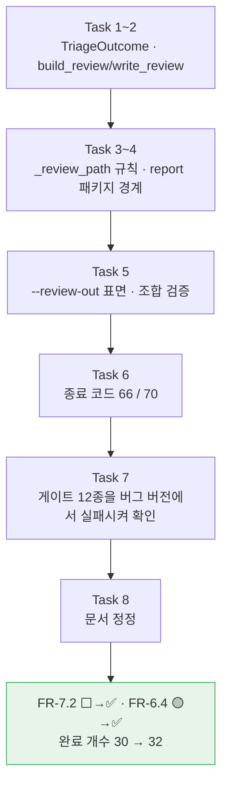

# Session Handoff

> Last updated: 2026-08-19 (KST)
> Branch: **`feat/review-json`** — `main`에 아직 안 올라갔다. 커밋 수는 매 커밋마다
> 자신을 포함하지 못해 여기 적은 숫자가 항상 낡는다(이전 세션에서 실제로 두 번 어긋났다) —
> `git rev-list --count e88177e..HEAD`로 직접 센다.
> **검수 큐가 처음으로 파일이 됐다** — `translate --review-out DIR`이 `review.json`을 낸다.
> 진척은 [WBS](docs/WBS.md), FR 번호의 출처는 [요구사항정의서](docs/요구사항정의서.md)다

## Current Status

**[설계 스펙](docs/superpowers/specs/2026-08-18-review-json-design.md)의 태스크 8개
(모델 → 직렬화 → 경로 규칙 → 패키지 → CLI 표면 → 종료 코드 → 게이트 실패 확인 → 문서 정정)를
전부 마쳤다.** 브리프·리뷰 기록은 `.superpowers/sdd/2026-08-18-review-json/`에 있지만
**이 경로는 `.superpowers/sdd/.gitignore`(`*`)로 git에서 완전히 빠져 있다** — 링크로 걸면
로컬에서는 열려도 GitHub에서는 404이므로 코드 스팬으로만 남긴다.

| | 트리아지 CLI 종료 시점 | 이번 세션 (`review.json`) |
| --- | --- | --- |
| 테스트 | 1096 passed, 3 deselected | **1153 passed, 3 deselected** |
| 검수 큐의 도달 형태 | **화면 요약뿐** — 세그먼트 단위 정보가 `_run_triage` 안에서 소멸했다 | **파일** — `{stem}.{대상언어}.review.json` |
| v0.1 FR 완료 | 30/42 (71%) | **32/42 (76%)** — `30 + FR-7.2 + FR-6.4` |
| 변경 범위 | `cli.py` 하나 | **신설 `report/` 패키지 + `cli.py`.** 기존 라이브러리(`signals`·`risk`·`triage`·`segment`) **0줄**(D13) |



### 한 작업이 FR 둘을 닫았다 — 우연이 아니다

**FR-6.4는 자기 코드가 한 줄도 바뀌지 않은 채 완료가 됐다.** 라이브러리는 이미 세그먼트마다
`SegmentRisk.reasons`를 기록하고 있었고, 부족한 것은 **목적절의 수혜자인 검수자에게 가는
통로**였다. 그 통로가 정확히 FR-7.2였다.

이것이 착수 **전에** 보였던 이유는 요구사항정의서 §0.1이 부족한 축마다 **다른 후속 작업**을
지정해 두었기 때문이다 — FR-6.4는 "축 1 부족 → 후속은 배선"이었고 그 배선의 실체가 리포트였다.
**판정 규칙이 진척 예측에 실제로 쓰인 첫 사례다.**

### 개수 32는 예전의 32와 다른 32다

읽는 사람이 가장 먼저 오해할 자리다. 이 문서는 직전 세션에 **32 → 30**을 적었고 지금 다시
32를 적는다.

| 시점 | 값 | 무엇이었나 |
| --- | --- | --- |
| 트리아지 CLI 착수 전 | 32 | **부풀린 값** — 라이브러리만 있는 FR-6.3·6.4를 ✅로 셌다 |
| 트리아지 CLI 종료 | 30 | 그 둘을 실제 상태(🟡)로 되돌렸다. 기능이 빠진 것이 아니라 **세는 법이 틀려 있었다** |
| **지금** | **32** | 30에서 **실제로 닫힌 둘**(FR-7.2·FR-6.4)을 더했다 |

**같은 숫자가 두 번 나온다고 같은 상태로 돌아온 것이 아니다.** 산수는 [WBS](docs/WBS.md)의
"30 → 32 — 산수를 남긴다"에 표로 있다.

## 이번 세션이 한 일

### ① `review.json` 배선 (Task 1~6)

| 무엇 | 어디 |
| --- | --- |
| `--review-out DIR` | **신설.** `--review-budget`/`--review-threshold` 중 하나와 함께 써야 하고 단독은 exit 2(D10) |
| 파일명 | `{stem}.{대상언어}.review.json` — 자막과 **같은 stem 규칙**(D2). 고정 이름이면 입력 여럿이 서로를 조용히 지운다 |
| `src/cuesift/report/` | **신설 패키지**(D9) — `models.py`의 `TriageOutcome`, `json_report.py`의 `build_review`/`write_review` |
| `_run_triage` 반환 | `list[str]` → **`TriageOutcome`**(D8). 화면과 파일이 **같은 객체**를 읽는다 |
| 종료 코드 | 쓰기 실패 **66** · 직렬화 실패 **70**(기존 상수 재사용, 설계 §8.1의 순서 1번) |

CHANGELOG에 상세를 실었다 — 여기서는 중복하지 않는다.

**`TriageOutcome`이 이 설계의 전부다.** 화면과 파일이 각자 세면 갈라지는데, 갈라져도
프로그램은 정상 종료하고 파일도 정상이며 종료 코드도 0이라 **어떤 게이트에도 걸리지 않는다.**
분기점을 하나로 두면 어긋날 자리가 구조적으로 없어진다.

| 자리 | 틀리면 |
| --- | --- |
| `risks`에 전량 대신 선별분만 담기 | `review_ratio`가 언제나 1.0 — **README 배수의 분모다** |
| 세그먼트 수를 하나로 두기 | 분모가 `total`인지 `triaged`인지 파일에서 알 수 없다 |
| `detail`을 잘라내기 | FR-6.4가 요구한 "왜 선별되었는지"의 증거가 사라진다 |
| `estimated_usd`를 `0.0`/`null`로 남기기 | 출처 없는 수치이거나, v0.1의 명시적 범위 결정을 숨긴다 |

### ② 게이트 12종을 버그 버전에서 실패시켜 확인했다 (Task 7, `8dcc8a7`)

이 저장소의 규율이다 — **회귀 테스트는 버그 코드에서 실제로 실패하는 것을 본 뒤에야
회귀 테스트다.** 최우선 게이트는 "같은 실행에서 화면 요약을 파싱한 수치와 `summary`의
수치가 전부 일치한다"이고, 죽이는 변이는 "JSON 쪽에서 `selected`를 따로 세게 한다"였다.
상세는 커밋 메시지와 `.superpowers/sdd/2026-08-18-review-json/`에 있다.

### ③ 리뷰가 잡은 것

여러 라운드에서 반복된 축은 **"픽스처가 대칭이라 아무것도 재지 못하는 단언"** 이었다
(`0fedbfa`·`52081e0` — 픽스처 단일값 때문에 생존한 변이 21종). 계약 축에서는
**직렬화 실패를 `TypeError` 하나로 적은 것**이 잡혔다(`f2dc6f6`) — `json.dumps`가 내는
것은 열린 집합이라 순환 참조는 `ValueError`, 깊은 중첩은 `RecursionError`, 서로게이트는
`UnicodeEncodeError`다. 좁은 그물이면 나머지 셋이 **미처리 traceback으로 exit 1**이 되어
우리 쪽 결함이 자막 결함으로 오보된다. 지금은 넓게 잡고 **예외 타입명을 stderr에 병기**한다.

### ④ 문서 정정 (Task 8, 이 커밋)

| 문서 | 무엇을 |
| --- | --- |
| 요구사항정의서 **§8.4** | 스키마를 설계 §6.1 전문으로 교체하고 **변경점 4건을 표로** 남겼다 — 무엇이 왜 바뀌었는지가 없으면 다음 사람이 원상 복구한다 |
| 요구사항정의서 **§5.6·§5.7** | FR-7.2 ⬜ → **✅** · FR-6.4 🟡 → **✅** · FR-7.4는 🟡 유지(근거 갱신) · FR-7.3 근거 갱신 |
| 요구사항정의서 **§0.1** | **전수 대조가 드러낸 것 넷.** 아래 ⑤ |
| `docs/WBS.md` | 완료 개수 30 → **32**(산수를 표로) · **"WP8b를 WP5보다 앞에 둔 근거가 소멸했다"를 절로 신설** · WP5 진척 · WP1 행의 FR-6.4 |
| `README.md` | `#### 검수 리포트 파일 — --review-out` 절 신설. **출력은 전부 실제로 돌린 것이다**(아래 ⑥) |
| `CHANGELOG.md` | `[Unreleased]`의 Added 3건 · Changed 3건 |
| `HANDOFF.md` | 이 문서 |

**WBS의 순서 근거는 지우지 않고 남겼다.** "`review.json`이 Tier 1 스키마를 두 번 깨지
않으려면 WP8b가 먼저"라는 근거는 WP8a가 끝나며 소멸했는데, 근거만 지우면 **다음 사람이 같은
순서를 다시 세운다.** 소멸을 무너뜨린 실측 3건을 함께 실었다 — 요점은 하나다:
**계층을 키가 아니라 값(`tier` 필드)으로 표현한 설계가 그 자체로 순서 의존성을 없앴다.**
실제로 WP5를 먼저 했고 스키마는 한 번도 깨지지 않았다.

### ⑤ 판정 기준이 왜 필요했나 — FR 상태를 고칠 사람은 먼저 읽을 것

**리뷰가 잣대가 갈린 것을 잡았다.** FR-4.3은 §8.2 `cuesift.yaml`의
`signals.tier1.max_ratio`가 미구현이라 🟡인데, FR-6.1은 **같은 §8.2 블록**의
`signals.weights`가 미구현인 채로 ✅였다(`cli.py`에 `weights` 인자는 0건이다).
기준이 문서 어디에도 없었으므로 다음 사람이 FR-6.1을 🟡로 내려 **완료 개수를 29로 셀 수
있었다.**

이제 요구사항정의서 §0.1에 규칙이 있다 — **두 축**이다.
**✅ = 층 도달 + 완전 / 🟡 = 층은 도달했으나 불완전, 또는 층이 부족 / ⬜ = 아무것도 없음.**

**축 1 — 층**: FR이 요구하는 층에 도달했는가. 어느 층인지는 **목적절의 수혜자가 어디에
있는가**가 가른다.

| 목적절의 수혜자 | 핵심 동사 | 요구하는 층 |
| --- | --- | --- |
| **파이프라인 안** (다음 단계 · 라이브러리를 직접 호출하는 개발자) | "산출한다" · "포함한다" · "정의한다" · "측정한다" | 라이브러리 |
| **라이브러리 밖의 사람** (검수자 · CLI 사용자 · CI) | "설정할 수 있다" · "지정할 수 있다" · "덮어쓸 수 있다" · "받는다" · "출력한다" · "반환한다" · **"…할 수 있게 한다"** | 사용자 통로(CLI·설정 파일·리포트)까지 |

**어미가 아니라 수혜자의 위치가 가른다.** FR-6.5의 "QE 모델을 꽂을 수 **있게 한다**"는
같은 어미지만 수혜자가 라이브러리를 직접 호출하는 개발자라 통로가 라이브러리 자신이라
완료다. FR-6.4의 검수자는 라이브러리 안에 도달할 수단이 없어 **통로가 생길 때까지**
부분 충족이었고, `review.json`이 그 통로가 되며 닫혔다.
아래 행이 곧 "미완료"는 아니다 — FR-7.1·FR-7.5·FR-5.3에 이번 세션의 **FR-6.4·FR-7.2가
합류했다.** 통로가 실제로 있어 완료다.

**축 2 — 완전성**: 그 층에서 FR이 말한 것을 전부 하는가. **단 축 2가 보는 것은 본문이
열거한 항목이고, 수식어·괄호로 붙은 속성은 두 축 모두에서 판정을 좌우하지 않는다**
(상태 칸에 명시만 한다).

| 부족한 축 | 후속 작업 | 지금 해당하는 FR |
| --- | --- | --- |
| 축 1 (층 미도달) | **배선** | FR-4.3. **FR-6.4가 이 칸에서 빠졌다**(이번 세션) |
| 축 2 (불완전) | **기능 추가** | FR-6.3("상위 K개") · FR-7.4(소요 토큰) |
| — (수식어라 판정 불변) | 기록만 | FR-6.1("설정 가능한" 가중치) · FR-7.1("변환 지정 가능") |

**상태 칸에 어느 축이 부족한지 적는다** — 둘은 다른 후속 작업을 부른다. **이 표가 이번
세션에 실제로 값을 냈다**: FR-6.4가 "축 1 부족 → 배선"이라 적혀 있었고, 그 배선의 실체가
FR-7.2였다는 것이 착수 전에 보였다.

**개수가 틀리는 방향은 둘이다** — 수식어 규칙이 없으면 FR-6.1·**FR-7.1**을 함께 내려
**30**, 축 2를 안 보면 FR-6.3·FR-7.4를 올려 **34**. 세 규칙이 함께 있어야 32가 유지된다.
**이전 판이 "수식어 규칙이 없으면 하나 낮게(29)"라 적은 것은 FR-7.1을 빠뜨린 셈이었다** —
같은 문서가 §5.7에서 FR-7.1을 수식어의 예로 들면서 여기서는 세지 않았다(이번 세션의 전수
대조가 잡았다). **FR-6.4는 더 이상 반대 방향의 예가 아니다** — 통로가 생겨 두 읽기가 같은
값(✅)을 낸다.

**규칙을 고치는 사람은 상태 열이 있는 FR 13개에 전수 대조하라.**
**이 규칙은 네 번 깨졌고 그때마다 고쳤다 — 아래 표의 첫 네 행이다.**

| 판 | 어디서 깨졌나 |
| --- | --- |
| 1판 (동사 목록만) | FR-6.4 — "기록한다"가 라이브러리 동사로 읽힌다 |
| 2판 (수혜자 = 시스템/사람) | FR-6.5 — 수혜자가 사람이지만 라이브러리를 직접 호출하는 개발자다 |
| 3판 (수혜자의 위치) | FR-6.3 · FR-7.4 — 층은 도달했는데 불완전하다. **완전성을 안 다뤘다** |
| 4판 초안 (층 + 완전성) | FR-7.1 — 괄호의 "변환 지정 가능"이 미구현이라 축 2가 부분 충족을 낸다 |
| 4판 (현재) | 13개 전부와 일치 |

**대조해서 32가 움직이면 규칙이 틀린 것이다** — 표기를 고치기 전에 규칙을 의심한다.
지금까지 네 번 다 틀린 쪽은 규칙이었다. **이번 세션은 다섯 번째가 아니다** — 13개 대조가
4판과 전부 일치했고, 30 → 32는 규칙이 아니라 **구현이 움직인 결과**다.

> **이 규칙은 지금 세 곳에 복제돼 있다** — 요구사항정의서 §0.1(원본) · 이 문서 ⑤ ·
> `CHANGELOG.md`의 판정 기준 항목. **고칠 때 셋을 함께 고친다.** 복제를 줄이는 것은
> 문서 구조 결정이라 미뤘고, 최종 리뷰가 triage할 항목이다.

**두 번째 정정: "FR 상태의 단일 출처는 요구사항정의서"는 사실이 아니었다.** 실측하니
§5의 FR 행 **45개 중 상태 표기가 있는 것은 13개뿐**이다(이번 세션 후 ✅ 8 · 🟡 3 · ⬜ 2 —
상태 열이 §5.4·§5.6·§5.7 세 절에만 있다). 그래서 역할을 나눠 적었다.

| 문서 | 내는 것 |
| --- | --- |
| 요구사항정의서 | 상태 열이 있는 FR의 **판정과 근거** |
| WBS | **v0.1 전수 완료 개수** |

**§5 머리에 이 사실을 못 박은 것이 요점이다** — 정정이 설계 스펙에만 있으면 §5의 빈칸을
만난 독자는 거기 도달하지 못하고 빈칸을 "미완료"로 읽어 개수를 낮게 센다.

### ⑥ `--dry-run` × 트리아지에 게이트가 0건이었다 (최종 리뷰 I4)

README가 두 동작을 "실측"으로 못 박았는데 **단언이 어디에도 없었다** — 문서가 약속한
동작에 게이트가 없는 것은 이 저장소가 1급으로 금지하는 상태다. 두 건을 넣었고
**각각 변이를 넣어 해당 테스트만 죽는 것을 확인한 뒤 되돌렸다.**

| 게이트 | 단언 | 죽이는 변이 |
| --- | --- | --- |
| `test_dry_run은_트리아지를_돌리지_않는다` | `--review-budget`을 **주고도** 요약이 없다 · 프로바이더 호출 0회 | dry-run 경로에서 요약을 내게 한다 |
| `test_dry_run에서도_프로파일_검증은_돈다` | `--to fr … --dry-run`이 **exit 2** | 프로파일 검사를 `and not dry_run`으로 미룬다 |

**첫 판이 자기 이름 때문에 실패했다** — pytest가 `tmp_path`를 **테스트 함수 이름으로**
짓는데 그 이름에 "트리아지"가 들어 있고 dry-run 출력이 경로를 찍는다. 낱말 하나로
단언하면 안 되고 요약 헤더의 고유한 모양(`"] 트리아지 ("`)으로 좁혀야 한다.
**이 함정은 이 저장소의 한국어 테스트 이름 관례 전반에 걸린다** — 출력에 경로가 실리는
테스트에서 이름의 낱말을 `not in`으로 단언하지 말 것.

### ⑦ README에 실은 출력은 전부 실제로 돌린 것이다 (Task 8)

로컬 Ollama `qwen2.5:3b`로 여섯 가지를 실행해 확인했다. **문서가 약속한 동작에 게이트가
없는 상태를 만들지 않는다**는 규율이고, 여기서는 "게이트" 자리에 실행 기록이 들어간다.

| # | 확인 | 결과 |
| --- | --- | --- |
| 1 | 정상 경로 (`--review-budget 30% --review-out reports`) | **exit 0** — 콘솔 블록과 `review.json` 전문을 그대로 실었다 |
| 2 | 파일이 서로를 안 지운다 (D2) | `--to en,ja` 후 `ep02`를 같은 디렉터리로 → **파일 3개 공존** |
| 3 | `--review-out` 단독 (D10) | **exit 2** |
| 4 | 단독 + `--dry-run` (D11) | **여전히 exit 2** — 조합 검증은 dry-run에서도 돈다 |
| 5 | 예산 + `--dry-run` | exit 0 · **디렉터리조차 생성 안 됨** |
| 6 | 프로파일 없는 언어 (D7) | 경고 · `th` 리포트 **없음** · `th` 번역은 **나감** |

**콘솔 블록을 두 번 찍었다.** 첫 판은 `--no-cache`로 돌린 것이라 `캐시 꺼짐`이 찍혔는데
README에 적은 명령에는 그 플래그가 없었다 — **문서의 명령과 문서의 출력이 어긋난 상태**라
캐시를 지우고 적힌 명령 그대로 다시 돌렸다.

**부산물로 ④(`_run_single` 전역 index 버그)의 새 재현 사례를 얻었다.** 아래 ④가 예고한
대로 개별 폴백이 `id: 0`을 돌려줘 index≠0인 세그먼트가 전부 `invalid_response`가 됐다.
**배치 실패의 원인도 실측했다** — `qwen2.5:3b`가 같은 프롬프트 3회에서 **결정론적으로**
`{"translations": [{...}], ["id": 1, ...]}`을 낸다(배열을 첫 항목에서 닫고 나머지를 맨
리스트로 낸다). 엔진은 설계대로 동작했다(배치 실패 → 개별 강등 → 실패분 원문 유지 → exit 1).

## 다음 사람이 반드시 알아야 할 것

### 다음 1순위는 **Tier 1 CLI 배선 (FR-4.3, WP8b)** 이다

**선행은 직전 세션에 풀렸다.** `triage_with_tier1()`이 `budget_ratio`를 **기본값 없는 필수
인자**로 요구하므로 예산 배선 없이 Tier 1만 얹을 수 없었는데, 그 선행이 WBS에 적혀
있지 않아 "WP8b가 다음 1순위"라는 서술이 선행이 비어 있다는 사실을 가리지 못했다.
지금은 의존 그래프에 라벨이 붙어 있다.

**이번 세션이 1순위의 근거를 갈아치웠다.** 예전 근거("`review.json` 스키마를 두 번 깨지
않으려면 Tier 1이 먼저 돌아야 한다")는 **소멸했다** — WP5를 먼저 했고 스키마는 깨지지
않았다. 지금 WP8b가 1순위인 이유는 **남은 것 중 선행이 전부 풀린 유일한 항목**이기
때문이고, 덤으로 **FR-7.4를 함께 닫는다**(Tier 1 토큰 통로 → `cost.includes`에 `"tier1"`).

### ① WP8b 착수 전 정리해야 할 것 **4건 — 여전히 유효하다**

**이전 세션에서 그대로 승계된다. 실측만 했고 구현은 안 했다.**

| 항목 | 실측 | 왜 아직 안 고쳤나 |
| --- | --- | --- |
| **배치 무력화로 호출 10배** (가장 중요) | 세그먼트 10개 × samples=3에서 **30회**(배치면 3회). **문자 수는 여기 조건 없이 적지 않는다** — `9840 + 30L`(세그먼트 단위)·`1119 + 30L`(배치)이고 L은 원문 길이다. L을 밝히지 않고 옮겨 적으면 다른 예문의 값이 "재현 실패"로 보인다(실제로 그렇게 세 라운드를 쓴 전례가 있다). 조건이 붙은 정확한 값은 `signals/llm.py`의 `_retranslate` 독스트링이 단일 출처 | Tier 1 설계 §4.1의 세그먼트 단위 프로토콜(`collect_tier1(seg, ctx)`)이 원인이고, 프로토콜 변경은 설계 변경이다. **CLI를 배선하는 사람이 이것을 모르면 실제 트랙에서 10배 비용이 그대로 난다.** 결론까지 적는다 — 기준선(배치 10) 대비 배수는 `30 × max_ratio`이고, 이 저장소의 표준 예산(10%)과 대칭인 `max_ratio=0.10`을 그대로 기본값으로 고르면 요구사항정의서 §4가 "3배는 감당 불가"라 한 한도에 **정확히 걸린다**(`30 × 0.10 = 3.0`). 실효 절감을 얻으려면 `<= 0.05`가 필요하다 |
| **Tier 1 토큰 사용량 미집계** | `collect_tier1`이 `TranslationResult.usage`를 올려 보낼 통로가 없다. **문자 배수는 여기 적지 않는다** — 원문 길이 L의 선형함수라 L 없이 인용하면 스스로 세운 규칙을 어긴다(n=1000·`max_ratio=0.10` 고정에서도 L을 스윕하면 배수가 1.9(L=3)~1.0 미만(L=40)까지 움직여 "더 쓴다"는 **부호 자체가 뒤집힌다**). 결론은 배수 없이도 선다 — `result.usage`를 통째로 버리므로 **그중 한 글자도 리포트에 안 잡힌다** | NFR-2·FR-7.4의 비용 숫자에서 **가장 비싼 계층만 빠진다.** **위 항목과 곱해진다** — 배치 무력화가 비용을 키우고 이 미집계가 그것을 숨기므로 `--dry-run` 추정치는 Tier 1을 켠 실행에서 구조적으로 과소 보고된다. **이번 세션이 이 항목을 닫지 않았다는 점을 분명히 한다**: 트리아지는 Tier 0만 쓰므로 비용이 0이고, 요구사항정의서 §5.7 FR-7.4가 🟡로 남은 이유가 정확히 이것이다 |
| **`samples` 상한 부재** | 100 × 2종 × samples=10⁶ → 2억 회가 거부 없이 통과한다 | 상한은 값이 입력되는 자리(CLI `--tier1-samples`)에 **근거와 함께** 둬야 한다(요구사항정의서 §11 R8이 출처 없는 수치를 금지) |
| **`CacheRequest.attempt`에 값 검증이 없다** | `attempt=None`이면 `key(None) == key(0)`이라 N회 호출이 한 캐시 키로 뭉친다. 실측: 정상 `attempt=i`는 호출 3회·`score=0.0286`인데 `attempt=None`은 호출 **1회**·`score=0.0000`이다 — `len(samples)<2 → None` 가드를 우회해 **"판정 불가"가 아니라 "판정했고 안전"으로 조용히 둔갑한다** | 고치는 것 자체가 WP8b의 일이다 — CLI가 `attempt`를 실제로 조립하는 자리이므로 검증도 거기서 붙는다 |

**트리아지 배선도 `review.json`도 이 4건 중 무엇도 건드리지 않았다.** Tier 1을 켜지
않으므로 발생하지 않을 뿐이고, `--tier1-*`를 붙이는 순간 전부 살아난다.

**다만 이번 세션이 둘째 항목(토큰 미집계)을 처음으로 _보이게_ 만들었다.**
`review.json`의 `cost.includes`가 `["translation"]`이라고 매 파일에 적으므로, `"tier1"`이
없다는 사실이 소비자에게 드러난다. **WP8b는 옵션을 붙이는 동시에 이 목록도 갱신해야 한다** —
갱신하지 않으면 파일이 "번역만 셌다"고 말하면서 실제로도 번역만 세는, **정직하지만 쓸모없는**
상태가 유지된다.

### ② Q4(자가일관성 유사도 측정 수단)는 여전히 열려 있다

WP8a가 방향은 좁혔다 — 문자 단위 유사도는 **형태**를 재고 **의미**는 못 잰다(실측 7쌍이
negation 0.727~0.930과 paraphrase 0.759~0.800으로 **범위가 겹쳐** 분리하지 못한다).
자가일관성 자체에도 **길이 편향**이 있다(짧을수록 점수가 높다, 배수는 예문 의존적이라
en 8~12배·ja 5~7배로 흩어진다 — `signals/llm.py`의 `SelfConsistency` 독스트링이 단일
출처). **판정은 벤치마크에 Tier 1을 태우는 별도 작업의 몫이다.**

### ③ FR-4.2(역번역)는 구현하지 않았다

착수 시점 실측이 문자 단위 유사도로는 `llm.retranslation_gap`이 **역방향으로 작동**함을
보였다 — 정상 변이가 오류보다 높은 점수를 받는다. 임베딩 등 다른 측정 수단이 들어오면
다시 검토한다.

### ④ `_run_single`(`engine.py`)의 전역 index 문제 — **확인됐고 아직 안 고쳤다**

Tier 1의 `_retranslate`는 `9d57e9a`로 닫혔지만, **일반 번역의 개별 폴백 경로는 같은
코드 패턴을 그대로 쓴다.** `engine.py`의 `_run_single`이
`parse_translations(completion.text, [segment.index])`로 **원본 전역 index**를 검증에
쓴다. 실물 Ollama로 확인했다.

```text
index=0: 성공 3/3
index=1: 성공 0/3   index=5: 성공 0/3   index=9: 성공 0/3
원시 응답(index=5, 3/3 동일): {"translations": [{"id": 0, "text": "[5] 길이 눈으로 덮였다."}]}
```

**약한 로컬 모델에서는 일반 번역의 개별 폴백이 index=0을 뺀 전부에서 작동하지 않는다.**
폴백은 원래 약한 모델을 위한 안전망인데 바로 그 조건에서 무력하다. **이 결함은 이
브랜치의 것이 아니다** — `48f9133`(WP7b)에 이미 있었고 지금 `main`에도 들어가 있다.
고치는 것은 WP7 계열의 별도 작업이다.

**다음 사람이 조심할 부류**: "약한/로컬 모델은 프롬프트의 명시적 지시보다 **예시의 리터럴
값**을 베끼는 경향이 있다 — 특히 항목이 하나뿐이라 값을 구분할 필요가 없을 때."
다른 리터럴 예시를 쓰는 자리에도 있을 수 있다.

## In Progress / Pending

| WP | 상태 | 근거 |
| --- | --- | --- |
| **WP7 (7a+7b)** | ✅ 완료 | FR-2.1~2.8 전부 닫힘 |
| **WP8a (Tier 1 라이브러리)** | ✅ 완료 | FR-4.1 닫힘. FR-4.3은 라이브러리 파라미터만 |
| **WP6 중 FR-6.3 CLI** | ✅ 완료 (직전 세션) | FR-6.3은 여전히 🟡 — "상위 K개"가 남는다 |
| **WP5 중 FR-7.2 `review.json`** | ✅ 완료 (이번 세션) | **FR-6.4도 함께 닫혔다.** 남은 것은 FR-7.3·7.4 |
| WP8b (Tier 1 CLI 배선) | **다음 1순위** | `--tier1-max-ratio`·`--tier1-samples`·`--tier1-temperature`. 선행(`budget_ratio`)은 직전 세션에 풀렸다. 착수 전 아래 ① **4건**을 본다. **닫으면 FR-7.4도 함께 닫힌다** — Tier 1 토큰 통로가 뚫려야 `cost.includes`에 `"tier1"`을 더할 수 있다 |
| WP5 나머지 (FR-7.3·7.4) | 2순위 | `report.html`과 소요 토큰. **FR-7.3은 렌더러 하나다** — `TriageOutcome`을 HTML로 그리면 되고 `spans[].side`가 이미 실려 있다 |
| WP6 나머지 (FR-8.3~8.5) | 3순위 | `transcribe` 배선·`cuesift.yaml` 로더·진행 표시 |
| WP9 STT | 4순위 | FR-1.3이 "자막 우선"이라 마지막이어도 S1이 성립 |

## Key Decisions Made (이번 세션 · Task 8)

| 결정 | 근거 |
| --- | --- |
| **v0.1 완료 개수를 30에서 32로 올렸다** | 상태 열이 있는 FR 13개를 §0.1의 두 축에 전수 대조해 얻은 값이다. 산수(`30 + FR-7.2 + FR-6.4`)를 WBS 본문에 표로 남겼고, **교차 검산**도 남겼다 — 상태 열 없는 29개의 완료 수는 이 작업으로 안 변하므로 `24 + 8 = 32`가 같은 값을 낸다 |
| **§0.1의 하드코딩된 "30"을 브리프가 지목하지 않았어도 고쳤다** | 고치지 않으면 §0.1이 §5·WBS와 **정면으로 갈라진다.** 판정 규칙이 자기가 판정한 결과와 다른 수를 말하는 상태가 가장 나쁘다 |
| **죽은 예시(FR-6.4)를 살아 있는 예시(축 2)로 교체했다** | "수혜자 규칙이 없으면 FR-6.4를 올려 하나 높게 센다"가 이번 작업으로 성립하지 않게 됐다 — 통로가 생겨 두 읽기가 같은 값을 낸다. **규칙이 죽은 것이 아니라 규칙이 개수를 가르던 자리가 구현으로 닫혔다**는 사실을 본문에 적고, 여전히 살아 있는 반대 방향(축 2 → FR-6.3·FR-7.4)으로 예시를 옮겼다 |
| **판정 규칙 자체는 고치지 않았다 — 5판을 만들지 않았다** | 13개 대조가 4판과 **전부 일치**했다. 고친 것은 규칙이 자기를 증명하려고 든 예시와 숫자뿐이다. 규칙을 건드렸다면 다시 13개를 대조해야 했다 |
| **WBS의 죽은 순서 근거를 지우지 않고 "소멸했다"로 남겼다** | 근거만 지우면 **다음 사람이 같은 순서를 다시 세운다.** 이 문서가 직전 세션에 "누락은 순서가 틀렸다는 것을 감지하는 능력까지 없앤다"고 적은 것과 같은 실패다 |
| **README에 세그먼트 목록 화면 출력 예시를 넣지 않았다** | 설계 D9가 금지한다 — FR-7.3(`report.html`)과 갈라진다. 실은 것은 **콘솔 요약**과 **파일 내용**이고 둘은 다른 것이다 |
| **README 예시 입력을 모델이 처리할 수 있는 문장으로 바꿨다** | 원래 예문은 `qwen2.5:3b`에서 결정론적으로 실패해 exit 1이 났다. 신호는 번역 품질이 아니라 **타임코드**에서 나오므로(`duration_short`) 예시의 교육적 가치는 유지된다. **실패한 출력을 "정상 예시"로 싣는 것이 더 나쁘다** |
| **코드를 한 줄도 고치지 않았다** | 이 태스크의 범위는 문서다. 문서를 쓰다 발견한 것은 보고하고 넘긴다 |

## 게이트 실행 기록

**이 세션(Task 8)이 직접 돌린 값이다.**

| 게이트 | 수치 |
| --- | --- |
| `ruff check .` | All checks passed |
| `ruff format --check .` | **96 files** already formatted |
| `pytest --cov=cuesift --cov-report=term-missing` | **1153 passed, 3 deselected** · 커버리지 **99%**(1833문 중 23 미실행) |
| — 이번 브랜치의 신규 코드 | `report/json_report.py` **100%** · `report/models.py` **100%** · `cli.py` **97%** |
| `python scripts/check_links.py` | 마크다운 **29개** 파일 · 상대 링크 **137개** · 깨진 링크 0 |
| `npx markdownlint-cli2` | Linting: **29 files** · 0 issues |

**두 문서 게이트의 파일 수가 일치하는지 확인한다** — 갈라지면 추적 안 된 문서가 있다는
뜻이다. 링크 체커는 `git ls-files` 기준이므로 **새 파일은 `git add` 후에야 세어진다.**

**로컬 venv는 3.14이고 CI는 3.11·3.12다.** 로컬 게이트 통과가 CI 통과를 보장하지 않는다 —
이 브랜치의 35커밋이 CI를 한 번도 안 거치고 쌓였다가 원격 병합 시 `rich` 렌더링 차이로
실패한 전례가 있다. **그래서 `main`에 직접 푸시하지 않고 PR을 경유한다.**

**실물 확인은 이번 태스크가 직접 돌렸다** — 위 ⑦의 6가지다(Ollama `qwen2.5:3b`).
README에 실린 콘솔 블록과 `review.json` 전문은 그 실행의 출력을 그대로 옮긴 것이다.

직전 세션의 실물 기록은 트리아지 CLI 설계 스펙 §7.1이 갖고 있다 — `ten_cues.srt`·예산
30%에서 요약이 나왔고, 그 실행이 **번역 실패분 제외(D12)의 가치를 우연히 실증했다**
(10개 중 9개 번역 실패 → 제외하지 않았다면 hard fail 9건이 `quota=3`을 완전히 소진).
**그 값은 인용이지 이번에 다시 돌린 것이 아니다.**

## 개발 환경 메모 (승계)

Ollama는 트레이 앱 겸 백그라운드 서비스로 자동 기동해 `127.0.0.1:11434`를 듣는다 —
`ollama serve`를 따로 칠 필요가 없다. PATH에 없으면
`$env:LOCALAPPDATA\Programs\Ollama\ollama.exe`를 직접 부른다.

| 모델 | 크기 | 용도 |
| --- | --- | --- |
| `qwen2.5:3b` | 1.9GB | **번역·Tier 1 신호용.** 단일 세그먼트 호출의 index 버그(위 ④)가 이 모델에서도 재현된다는 점은 유의할 것 — "3b는 신뢰 가능"이 무조건은 아니다 |
| `qwen2.5:1.5b` | 986MB | 폴백 관찰용. 번역기로는 못 쓴다(실측 5/15) |

live 실행 명령:

```powershell
$env:CUESIFT_LIVE_BASE_URL="http://localhost:11434/v1"
$env:CUESIFT_LIVE_MODEL="qwen2.5:3b"
.venv/Scripts/python.exe -m pytest -m live -v -s
```
