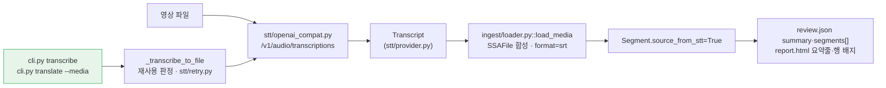

# Session Handoff

> Last updated: 2026-09-02 (KST)
> **WP6이 닫혔다 - `transcribe` 배선(FR-8.3)이 마지막 조각이었다.** `feat/media-wiring`에서
> 태스크 6개 · 커밋 8개(`6131eec`..`dd45fff`)로 `cuesift transcribe <영상>`과
> `cuesift translate --media <영상>`이 동작한다. 같은 브랜치가 **이월 1번**(`_output_path`)과
> **7번**(STT 재시도 루프)을 함께 닫았다 - 둘 다 배선하는 순간에만 도달 가능해지는 것이었다.
> **v0.1 완료 개수 39 → 40 (42개 중, 95%).** 남은 것은 FR-6.3의 "상위 K개"(🟡)와
> FR-4.2 역번역(⬜) 둘뿐이다.
> 직전 세션의 WP9(STT 어댑터)는 PR [#20](https://github.com/withwooyong/cuesift/pull/20)으로
> `main`에 들어갔다(`1741337`).
> **이번 FR-8.3은 PR [#22](https://github.com/withwooyong/cuesift/pull/22)로 열려 있다** -
> CI 5잡이 통과했으나 아직 머지되지 않았다. 사용자가 `main` merge를 승인하지 않았다.
> 상태 값은 여기 적힌 숫자가 아니라 아래 "현재 상태 재는 법"의 명령으로 직접 재라.
> 진척은 [WBS](docs/WBS.md), FR 번호의 출처는 [요구사항정의서](docs/요구사항정의서.md)다

## Current Status

| 단계 | 상태 | 산출물 |
| --- | --- | --- |
| WP9 설계 스펙 | ✅ | `034f963` · [설계 스펙](docs/superpowers/specs/2026-08-30-stt-adapter-design.md) |
| WP9 구현 계획 | ✅ | `3e2fbe6` · [계획서](docs/superpowers/plans/2026-09-01-stt-adapter.md) |
| **WP9 구현 — 태스크 7개** | ✅ **전부 완료** | `0244e61`..`c102edd` |
| 최종 전체 리뷰(통합 축) | ✅ 승인 | Critical 0 · Important 1 · Minor 4 |
| 적대적 보안 리뷰 | ✅ 닫힘 | High 1 · Medium 2 · Low 3 → 최종 픽스로 전부 대응 |
| 검증 5관문 | ✅ 통과 | 빌드·ruff·pytest·bandit·pip-audit·CLI |
| **최종 픽스 3라운드** | ✅ 승인 | `03ad01e`..`f038fc1` |
| **WP9 푸시·PR·merge** | ✅ **머지됨** | PR [#20](https://github.com/withwooyong/cuesift/pull/20) · squash `1741337` · CI 5잡 통과 |
| WP6 설계 스펙 (FR-8.3) | ✅ | `27e5d9b` · [설계 스펙](docs/superpowers/specs/2026-09-02-media-wiring-design.md) |
| WP6 구현 계획 (FR-8.3) | ✅ | `4c1d585` · [계획서](docs/superpowers/plans/2026-09-02-media-wiring.md) |
| **WP6 구현 - 태스크 6개** | ✅ **전부 완료** | `6131eec`..`a842b23` |
| **FR-8.3 푸시·PR** | ✅ | PR [#22](https://github.com/withwooyong/cuesift/pull/22) · CI 5잡 통과 |
| **FR-8.3 merge** | ⬜ **미승인** | `main` merge는 사용자 승인 대기 중이다 |

**merge만 남았고 그것은 승인 사항이다.** PR을 여는 것과 `main`을 바꾸는 것은 되돌리는
비용이 다르다 - PR은 닫으면 그만이지만 merge는 `main` 이력에 남는다. 그래서 이 문서는
PR이 열린 상태에서 커밋된다. 인수인계 문서가 자기 자신의 PR을 못 보는 문제는 **PR을 먼저
열고 번호를 넣어 커밋하는 것**으로 닫았고, 그래서 아래 시작 절차의 첫 명령이 PR 상태 확인이다.

## 현재 상태 재는 법

**첫 일은 직전 작업이 어디까지 갔는지 확인하는 것이다.**

```bash
gh pr view 22 --json state,mergeStateStatus   # OPEN 이면 머지가 아직 안 된 것이다
git branch --show-current                     # feat/media-wiring (머지 후에는 main)
git status --short                            # clean 이어야 한다
git log --oneline -10                         # 6131eec..HEAD 여덟 개 + 이 문서가 FR-8.3이다
```

## WP9가 낸 것 — 태스크 7개

| 태스크 | 무엇 | 커밋 |
| --- | --- | --- |
| 1 | `stt/provider.py` — 계약(`Transcript`·`TranscriptCue`)과 타임코드 방어 | `0244e61`·`7e1c88b` |
| 2 | `stt/openai_compat.py` — OpenAI 호환 어댑터 | `b1cd545`·`7ce9b3a`·`546ebc7` |
| 3 | `Segment.source_from_stt` 전용 필드 (FR-1.4) | `d16976e` |
| 4 | `ingest/loader.py::load_media` (FR-1.2) | `bad70a1`·`f13b30f`·`a7fb3a5` |
| 5 | `load_input` — 자막·영상 동시 입력 (FR-1.3) | `8dc584e`·`a852b0c` |
| 6 | 리포트 파급 — `review.json`·`report.html` (FR-1.4) | `d596621`..`95317d7` |
| 7 | live 테스트 + 문서 정정 | `d390dc1`·`c102edd` |
| 최종 픽스 | 스트리밍·헤더 필터·마감·userinfo·서로게이트 | `03ad01e`..`f038fc1` |

일곱 태스크가 낸 것은 **어댑터 하나가 아니라 계약(1) → 어댑터(2) → 값(3) → 인제스트(4·5) →
산출물(6)의 한 줄**이고, 최종 픽스는 그중 어댑터의 HTTP 왕복만 다시 짰다.



**점선이 사라졌다.** WP9가 낸 것은 어댑터부터 산출물까지의 한 줄이었고 CLI만 끊겨
있었는데, FR-8.3이 `_transcribe_to_file` 하나로 그 자리를 이었다 - `transcribe`와
`translate --media`가 **같은 함수를 부른다.**

## 게이트 실행 기록 (2026-09-02, HEAD `dd45fff` + 이 문서 커밋)

| 게이트 | 착수 시점 | 지금 |
| --- | --- | --- |
| `pytest -q` | 1700 passed · 5 deselected | **1743 passed · 5 deselected** |
| 커버리지 | - | **TOTAL 98%** (`retry.py` 100% · `stt/retry.py` 96% · `cli.py` 96%) |
| `ruff check .` / `ruff format --check .` | 통과 · 123 files | 통과 · **129 files** |
| CLI 옵션 개수 | 24 | **30** (`translate` 23 · `check` 3 · `transcribe` 4) |
| YAML 허용 키 | 25 | **28** (`BINDINGS` 26 + `SPECIAL_PATHS` 2) |
| `scripts/check_links.py` | 마크다운 41개 · 상대 링크 211개 · 깨진 링크 0 | 마크다운 **43개** · 상대 링크 **221개** · 깨진 링크 **0** |
| `npx markdownlint-cli2` | Linting: 41 files | **Linting: 43 files** · 0 issues |

**두 도구의 파일 개수가 같은지를 본다.** 갈리면 새 문서가 `git add`되지 않아 링크 검사를
아예 받지 않은 것이다 - `check_links.py`는 `git ls-files`를 보고 markdownlint는 `gitignore`
규칙을 본다.

## FR 완료 개수 - 39 → **40**

FR-8.3 하나가 올랐고 **이로써 WP6이 ✅가 됐다.** 직전 세션의 39는 WP9가 FR-1.2·1.4를
닫아 37에서 오른 값이다(FR-1.3은 WP4에서 이미 세어져 있어 움직이지 않았다).
**v0.1 대상 42개 중 40개이고 남은 둘은 FR-6.3의 "상위 K개"(🟡)와 FR-4.2 역번역(⬜)이다.**

## 다음 작업 패키지로 넘어간 항목 - 이월 트리아지 **9건** (기존 8건 중 둘이 닫히고 셋이 늘었다)

**1번과 7번이 표에서 빠졌다.** 둘 다 `feat/media-wiring`이 닫았다 - **배선하는 순간에만
도달 가능해지는 것들이라 같은 브랜치가 함께 고쳐야 했고**, 그것이 이 표가 그 둘을
🔴와 별도 절로 강조해 둔 이유다. 나머지 여섯의 번호는 **원래 번호를 유지한다** -
다시 매기면 이전 세션의 기록에서 가리키는 번호가 다른 항목을 뜻하게 된다.

| # | 무엇 | 왜 지금 안 했나 | 다시 열 조건 |
| --- | --- | --- | --- |
| 2 | `bench/track_io.py`의 `_FIELDS`가 `source_from_stt`를 모른다 — 왕복에서 **조용히 `False`로 리셋** | 도달 경로가 없다(벤치 코퍼스는 자막). 고치면 벤치 직렬화 포맷이 바뀐다 | STT 트랙을 벤치에 넣을 때. `tests/test_bench_track_io.py`의 왕복 동등성이 그 순간 실패한다 |
| 3 | `pyproject.toml`에 **`filterwarnings`가 없어 경고가 게이트를 통과한다** | `["error"]`는 스위트 전체에 영향 — WP9 범위 밖 | 별도 과제. **"검사하지 않고 통과하는 게이트" 규율에 직접 걸린다** |
| 4 | `translate/provider.py`의 `RetryableProviderError.__init__`도 `isinstance`+`isfinite`를 쓴다 — 거대 정수에서 같은 `OverflowError` 누출이 있는지 **미확인** | 기존 코드. 이번 변경과 무관 | `translate`를 손대는 다음 패키지. STT 경로에는 도달 경로가 없음을 확인했다 |
| 5 | `Transcript.__post_init__`이 `cues`의 **컨테이너 타입만** 보고 원소 타입은 안 본다 | Task 1 범위 밖 | 프로바이더를 하나 더 붙일 때 |
| 6 | `pyproject.toml:69`의 **죽은 `stt` extra** | 의존성 고정 규율상 채울 것이 없다 | 패키징을 손볼 때 |
| 8 | FR-1.5(원문 언어 자동 감지)가 반쪽 — STT 응답의 `language`를 **기록만** 한다 | `IngestResult.source_lang`은 선언값을 쓴다(값 도메인이 백엔드마다 다르다) | 자막 파일 입력까지 함께 닫을 때 |
| 9 | API 키가 **공백 한 칸**이면 `Authorization: Bearer` 뒤에 공백만 붙은 헤더가 나가 401이 "키가 틀렸다"로 오독된다 | 기존 동작이고 번역(`CUESIFT_API_KEY`)도 같다. STT만 `.strip()`을 넣으면 두 경로가 비대칭이 된다 | 키 처리를 손볼 때. `_resolve_stt_key`와 `_require_ascii_api_key` 양쪽을 함께 고친다 |
| 10 | `translate --media X --to ko`처럼 **대상이 원문과 같으면** 전사를 마친 뒤 exit 2 | 출력 경로 충돌 검사가 입력 이름을 알아야 해서 전사 앞으로 옮기기 어렵다. 다만 `media is not None and target == source_lang`은 앞에서 판정 가능하다 | 되돌릴 수 없는 비용 앞의 검사를 정리할 때 |
| 11 | 설정의 `input.media` + `--dry-run` 조합에 **CLI 탈출구가 없다** - `--no-media` 같은 무효화 옵션이 없다 | 위치 인자로 자막을 주면 회피된다. 설정 무효화 옵션은 이 한 자리만의 문제가 아니다 | 설정 무효화 규칙을 전반적으로 정할 때 |

**9~11번은 이번 세션의 이중 리뷰가 새로 찾은 것이다.** 셋 다 종료 코드가 2나 69로
나가 오보는 없고, 고치려면 이번 변경 범위 밖(번역 경로의 키 처리·설정 무효화 규칙)을
함께 건드려야 해서 미뤘다.

같은 리뷰가 찾은 **HIGH 2건은 미루지 않고 닫았다.** 둘 다 "미루면 그대로 있는" 부류가
아니었기 때문이다 - STT 키 폴백은 번역용 자격증명이 다른 호스트로 나가는 것이었고,
`--media`의 `exists=True`는 설정 파일을 쓰는 사용자가 명령줄로 준 자막을 잃는 것이었다.
후자는 요구사항정의서 §8.2의 예시 YAML을 채우자 **문서 게이트에서 실제로 발동했다.**

남은 아홉은 전부 "미루면 그대로 있는" 부류다. **닫힌 둘은 그렇지 않았다** - 1번은 미루면
조용히 깨졌고, 7번은 미루면 사용자가 전사 한 번에 몇 분을 기다린 뒤 429 하나로 전부 잃었다.

## STT는 이제 CLI에서 도달한다

| 부르는 쪽 | 오늘 동작 |
| --- | --- |
| `cuesift transcribe <영상>` | **동작한다.** `episode02.mp4` → `episode02.ko.srt` |
| `cuesift translate --media <영상> --to en` | **동작한다.** 전사 자막과 번역 자막을 함께 낸다 |
| `cuesift translate/check`에 영상을 **위치 인자로** 준다 | **exit 66** - `_reject_non_subtitle`이 확장자로 거부. 영상은 `--media`로 준다 |
| `cuesift.ingest.load_media(...)` (파이썬) | **동작한다.** 100% 커버리지 |

### 직전 인수인계의 이 표가 두 군데 틀렸다 - 정정한다

| # | 직전 판이 말한 것 | 실제 |
| --- | --- | --- |
| P1 | "영상을 `run`에 주면 **66**" | **`run` 명령이 없다.** `cli.py`의 `def run()`은 콘솔 스크립트 진입점(`__main__`)이고 서브커맨드가 아니다. 66을 내는 것은 `translate`·`check`의 위치 인자다 |
| P2 | "`cuesift.stt.transcribe_media(...)`가 동작한다" | **그런 이름이 `__all__`에 없다.** 파이썬 진입점은 `cuesift.ingest.loader::load_media`이고, `cuesift.stt`가 내보내는 것은 프로바이더 계약과 어댑터다 |

**둘 다 이번 스펙의 착수 조사가 코드로 확인해 뒤집었다.** 인수인계 문서에 적힌 API 이름과
명령 이름은 **읽는 순간 참으로 보이지만 아무 게이트도 대조하지 않는다** - 착수 조사가
`grep`으로 확인하지 않았다면 계획서가 없는 이름을 부르는 코드를 지시했을 자리다.

### ⚠ live 검증을 못 했다 - 설계 스펙 R3의 한계

**STT 백엔드가 아직 정해지지 않았다.** OpenAI 호환 `/v1/audio/transcriptions`를 내면서
`verbose_json`을 돌려주는 서버가 필요한데 **Ollama는 그 엔드포인트를 제공하지 않는다.**
그래서 FR-8.3의 전 경로는 **가짜 프로바이더로만 검증됐다** - `transcribe`·`translate --media`·
재시도 루프·재사용 판정 어느 것도 실제 백엔드를 한 번도 치지 않았다.

**이것은 "테스트가 없다"가 아니라 "목이 만들지 않는 조건은 게이트가 통과시킨다"의 자리다.**
직전 세션이 `Content-Encoding` 회귀를 1693건 통과시킨 것과 같은 구조다(아래 ⓑ).
백엔드를 정하는 사람이 `tests/test_stt_live.py`(`-m live`, `CUESIFT_LIVE_STT_*`)를 먼저 돌려야 한다.

## 이번 세션이 배운 것

### ⓐ 예외가 계층 밖으로 새는 부류를 **네 번** 연속 찾았다

| # | 어디 | 무엇이 샜나 | 종료 코드가 뜻하게 되는 것 |
| --- | --- | --- | --- |
| 1 | `stt/provider.py` 타임코드 방어 | `OverflowError`(거대 정수) | 1 = "규격 위반 발견"으로 **오보** |
| 2 | `stt/openai_compat.py` JSON 파싱 | `RecursionError`(20만 겹 중첩) | 〃 |
| 3 | `ingest/loader.py::_to_ms` | `OverflowError`(`round(1e308*1000)`) | 〃 |
| 4 | `stt/openai_compat.py` 응답 수신 | **`MemoryError`**(상한 없는 본문) | 〃 |

넷이 같은 모양이다 — **신뢰 경계 밖 입력이 종료 코드의 의미를 바꾼다.**
셋을 고친 뒤에도 넷째가 남아 있었다는 것이 요점이다: **같은 부류를 한 번 고쳤다고
다 고친 것이 아니다.** 다음에 프로바이더를 붙일 때는 이 표를 체크리스트로 쓰라.

### ⓑ 목이 한 번도 만들지 않는 조건은 게이트가 통과시킨다

`Content-Encoding` 회귀가 **1693건을 통과했다.** STT 목이 압축 응답을 한 번도 돌려주지
않았기 때문이고, **형제 모듈에는 그 회귀 테스트가 이미 있었다**
(`tests/test_translate_openai_compat.py:548` — *"129개 테스트가 한 번도 압축 응답을
돌려주지 않아서 `DecodingError` 누수가 가려져 있었다"*). **같은 부류의 다섯째다.**

새 어댑터를 만들 때는 **형제 어댑터의 회귀 테스트 목록을 먼저 훑어라** — 거기 있는 것은
전부 한 번 실제로 깨졌던 것이다.

### ⓒ 실측값은 "무엇을 측정했나"까지 적어야 한다

`_MAX_RESPONSE_BYTES` 주석의 "3.37배"가 **큐 10개짜리 비현실 페이로드에서만 나온 값**이었다.
모양별로 다시 재니 같은 16MB라도 큐 1.4k면 2.35배, 132k면 4.82배다 —
**증폭을 정하는 것은 본문 크기가 아니라 큐 개수였다.**
그래서 배수 하나를 박지 않고 범위와 그 이유를 적었다.

### ⓓ 리뷰어가 인용한 코드 조각은 원본이 아니다

두 번 걸렸다. ① 리뷰어 인용문만 보고 "원본에 `strip()`이 없다"고 판단해 구현자에게
틀린 지시를 냈다(구현자가 지적해 정정). ② 리뷰어가 제안한 `_to_ms` 자릿수 **310**이
틀렸고 구현자가 측정한 **309**가 옳았다(310은 `start_ms` 자릿수, 문자열은 309자).

**리뷰 지적은 옳아도 그 안의 수치와 코드 인용은 따로 확인한다.**

### ⓔ 간헐 실패하는 게이트는 넣지 않는다 — 다만 대안을 먼저 찾는다

N3(상한 검사 위치) 회귀 테스트가 **이전 원형을 죽이지 못했다.** 원형도 최종 슬라이스로
같은 길이를 내므로 `len(content) == cap`을 통과한다. 다른 것은 **그 사이에 쓴 메모리뿐**이라
`tracemalloc` peak로 고정했고, 임계값을 지금의 57배·원형의 1/4 자리(8MB)에 두어
흔들림 여지를 남겼다. **빡빡하게 잡으면 CI가 간헐 실패하고 무시되는 게이트는 없는 게이트와 같다.**

## 확정된 설계 결정 — 전문은 스펙에 있다

D1~D10은 [설계 스펙](docs/superpowers/specs/2026-08-30-stt-adapter-design.md)에 있고
**구현이 뒤집은 결정 5건은 [계획서](docs/superpowers/plans/2026-09-01-stt-adapter.md)의
"구현 중 바뀐 결정" 절에 있다** — 이 리포의 규약상 그 절이 본문 코드 블록보다 최신이다.
배선할 때 특히 걸리는 셋만 옮겨 둔다.

| # | 결정 | 이것이 아니면 |
| --- | --- | --- |
| **D2** | 예외 계층은 `translate/provider.py`의 것을 재사용 | CLI가 `except`를 두 벌 갖고, 빠뜨린 쪽은 재시도도 폴백도 없이 샌다 |
| **D6** | `IngestResult.subs`를 합성한다 (`format="srt"`) | `\| None` 완화가 WP5 전역에 죽은 분기를 만든다. **이월 1번의 원인이기도 하다** |
| **D8** | `source_from_stt`를 **점수에도 hard fail에도 넣지 않는다** | 전량이 예산을 우회해 `review_ratio()`가 1.0이 되고 **README 배수가 산출 불가**가 된다 |

D8을 어기면 무엇이 깨지는지는 `tests/test_ingest_media.py:439`가 **반사실 형태로**
고정하고 있다 — 어기면 비율이 1.0이 된다는 것을 테스트가 직접 보여 준다.

## 승계 항목 — 아무도 건드리지 않았다

| 항목 | 상태 |
| --- | --- |
| **Q4**(자가일관성 유사도 측정 수단) | 여전히 열려 있다. 판정은 벤치마크에 Tier 1을 태우는 별도 작업의 몫 |
| **FR-4.2**(역번역) | 구현 안 함. 문자 단위 유사도로는 `llm.retranslation_gap`이 **역방향으로 작동**한다 |
| **FR-8.5 R3**(Windows 콘솔의 `\r`) | 구조는 확인됐고 **육안 관측이 남아 있다.** 진짜 콘솔 창이 필요하다 |
| **FR-8.3 R3**(STT live 검증) | **열려 있다.** 백엔드가 정해지지 않아 가짜 프로바이더로만 검증했다 - 위 "live 검증을 못 했다" 참고 |
| **`engine.py::_run_single`의 전역 index** | 확인됐고 안 고쳤다. `main`에 있다 |
| `segments[].reasons`의 순서 미검증 | NFR-3 재현성 문제. 열려 있다 |
| 파킹 2 — 권장 모델 `qwen2.5:3b`가 3큐 중 2큐 실패 | 모델 품질 문제라 코드로 닫을 수 없다 |
| 파킹 4 — `COLUMNS=88` 아래에서 옵션 이름이 잘린다 | rich의 표 렌더링. 폭 88을 게이트로 못 박았다 |

## 개발 환경 메모 (승계)

**Python 실행은 반드시 `.venv/Scripts/python.exe`를 쓴다.** 시스템 Python은 3.14라 다르다.
게이트는 CI와 같은 대상 `.`으로 돌린다 — **`src tests`로 좁히면 안 된다**(그 차이로
CI가 5회 연속 실패한 전례가 있다).

**리포 루트에 `cuesift.yaml`을 만들지 마라.** 자동 탐색이 그것을 읽는다.
`conftest.py`의 autouse가 인프로세스 테스트는 막지만 **서브프로세스는 못 막는다**.

**변이 실험은 스크래치 사본에서 하고 `PYTHONPATH`를 강제한다.** editable install의 `.pth`가
사본을 가려 "생존" 오탐을 낸다. 리포에서 직접 할 때는 **파일 복사본으로 복원하라** —
`git checkout --`가 미커밋 작업을 날린 전례가 있다.

**보안 스캐너는 리포 밖 스크래치 가상환경에 설치한다.** `.venv`나 `pyproject.toml`에 넣으면
의존성 고정 규율(런타임 4개·dev 3개)이 깨진다.

**콘솔에서 한글 출력이 깨져 보이는 것은 표시 문제이지 버그가 아니다.** 판정이 필요하면
파일로 받아 `read_bytes()` 후 utf-8·cp949 순으로 디코드해 읽는다.

**파이썬 스크립트로 문서를 고칠 때 `newline=""`을 준다.** `Path.write_text`의 기본값이
`newline=None`이라 Windows에서 `\n`을 `\r\n`으로 번역해 **2줄 수정이 1967줄 변경으로** 찍힌다.
`CHANGELOG.md`는 CRLF, `HANDOFF.md`는 LF다 — 섞으면 diff가 통째로 뒤집힌다.

**긴 한글 문서는 heredoc이 아니라 `Write` 도구로 쓴다.** 여러 줄 커밋 메시지는
`git commit -F <파일>`로 넘긴다 — heredoc은 조용히 깨진다.

**Bash heredoc 안의 파이썬에 Windows 경로를 넣지 마라.** 역슬래시가 한 겹 먹혀
`tests\\fixtures`가 `tests\fixtures`(폼피드)로 바뀐다. 경로가 섞인 편집은 `Edit` 도구로 한다.

### live 테스트

STT live 테스트는 `-m live` · `CUESIFT_LIVE_STT_*` 환경변수로 돌고
**오디오는 리포에 넣지 않는다**(D10, `CUESIFT_LIVE_AUDIO`로 받는다).

**STT 백엔드는 아직 정하지 않았다.** OpenAI 호환 `/v1/audio/transcriptions`를 내는 서버가
필요하고 **Ollama는 그것을 제공하지 않는다.** `verbose_json`을 내는지가 관문이다(D4).

```powershell
$env:CUESIFT_LIVE_BASE_URL="http://localhost:11434/v1"
$env:CUESIFT_LIVE_MODEL="qwen2.5:3b"
.venv/Scripts/python.exe -m pytest -m live -v -s
```

## 다음 세션 시작 절차

**첫 일은 새 작업이 아니라 PR [#22](https://github.com/withwooyong/cuesift/pull/22)를
어떻게 할지 정하는 것이다.** 머지 승인을 받지 못한 채 세션이 끝났다.

```bash
gh pr view 22 --json state,mergeStateStatus,statusCheckRollup   # OPEN · CI 5잡 통과 상태였다
git branch --show-current                # feat/media-wiring
git status --short                       # clean
git log --oneline -10                    # 6131eec..HEAD 아홉 개가 FR-8.3이다
```

머지하기로 하면 아래를 따르고, 그 뒤에야 새 브랜치를 판다.

```bash
gh pr merge 22 --squash                  # 사용자 승인을 받은 뒤에만
git checkout main && git pull && git branch -d feat/media-wiring
```

**`main`에 직접 푸시하지 않는다.** CI의 `push` 트리거가 `branches: [main]`뿐이라
직접 푸시하면 머지된 **뒤에야** CI가 돈다 — 게이트가 아니라 사후 통보다.
PR 절차는 [CLAUDE.md](CLAUDE.md)의 "PR 절차"에 있다.

**다음 작업의 후보는 둘뿐이다.** v0.1 대상 42개 중 40개가 닫혀 남은 것은
**FR-6.3의 "상위 K개"**(🟡, 담당 WP6)와 **FR-4.2 역번역**(⬜)이다. 후자는
요구사항정의서 §12 **Q4**(자가일관성 유사도 측정 수단)가 닫히기 전에는 착수 근거가 없다 -
문자 단위 유사도로는 `llm.retranslation_gap`이 역방향으로 작동한다는 실측이 있고,
판정은 벤치마크에 Tier 1을 태우는 별도 작업의 몫이다.

**그 전에 STT 백엔드를 정하는 것이 값싸다.** FR-8.3의 전 경로가 가짜 프로바이더로만
검증돼 있어(위 R3), 백엔드가 정해지는 순간 `-m live` 한 번이 배선 전체를 실물로 확인한다.
