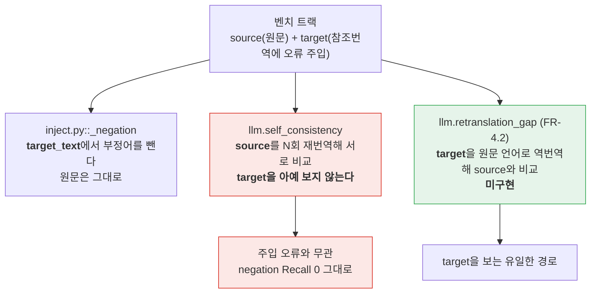

# Session Handoff

> Last updated: 2026-09-03 (KST)
> **이월 12·13번이 닫혔고, 그것보다 중요한 것은 Q4 착수 조사가 뒤집은 사실이다.**
> PR [#25](https://github.com/withwooyong/cuesift/pull/25)(squash `619a239`)가 설정 채널의
> `triage.review_threshold`에 타입 검증을 넣어 이월 두 건을 닫았다 - 변경은 함수 하나와
> 배선 한 행이고, **조사가 인수인계 서술의 절반을 뒤집은 것**이 더 큰 산출물이다.
> **다음 작업으로 Q4 판정을 골랐고 착수 조사를 마쳤다.** 그 조사가 말하는 것은
> **"벤치마크에 Tier 1을 태운다"만으로는 Q4가 닫히지 않는다**는 것이다 - 아래
> "Q4 착수 조사"가 코드 근거와 함께 그 이유를 적는다. 다음 수는 **spike**로 합의됐다.
> **v0.1 완료 개수는 41 그대로다** (42개 중, 98%). 이번 세션은 FR을 올리지 않았다.
> 상태 값은 여기 적힌 숫자가 아니라 아래 "현재 상태 재는 법"의 명령으로 직접 재라.
> 진척은 [WBS](docs/WBS.md), FR 번호의 출처는 [요구사항정의서](docs/요구사항정의서.md)다

## Current Status

| 단계 | 상태 | 산출물 |
| --- | --- | --- |
| WP6 - `transcribe` 배선 (FR-8.3) | ✅ **머지됨** | PR [#22](https://github.com/withwooyong/cuesift/pull/22) |
| FR-6.3 ① `--review-top-k` | ✅ **머지됨** | PR [#24](https://github.com/withwooyong/cuesift/pull/24) · squash `d7e927c` |
| **이월 12·13번 - 설정 채널 타입 검증** | ✅ **머지됨** | PR [#25](https://github.com/withwooyong/cuesift/pull/25) · squash `619a239` · CI 5잡 통과 |
| **Q4 착수 조사** | ✅ 끝났다 | 아래 "Q4 착수 조사" 절. **코드로 확인했고 문서를 뒤집었다** |
| **이 문서 · `CLAUDE.md` 두 줄** | PR [#26](https://github.com/withwooyong/cuesift/pull/26) | **PR을 먼저 열어 번호를 여기 넣었다** - 아래 참고 |
| **Q4 spike** | ⬜ **미착수** | 다음 세션의 첫 작업. 아래 "다음 세션" 참고 |

**이번에는 직전 세션이 못 쓴 순서를 썼다.** 직전 인수인계는 커밋한 뒤에 푸시해 PR 번호를
적을 수 없었고, 그 값은 **다음 세션의 첫 명령**이 재서 채웠다. 이번 문서는 PR을 먼저 열어
번호를 담았으므로 **자기 자신을 가리킬 수 있다.** 다만 squash 해시는 여전히 적을 수 없다 -
머지되기 전에는 존재하지 않는 값이다. **적을 수 없는 것은 추측하지 않는다.**

**이번 세션은 코드를 조금 고치고 사실을 많이 확인했다.** PR #25의 변경은 함수 하나·배선
한 행·회귀 8건이고, 나머지 시간은 전부 조사였다. 그 조사가 낸 것은 아래 두 절이다.

## 현재 상태 재는 법

**첫 일은 직전 작업이 어디까지 갔는지 확인하는 것이다.**

```bash
gh pr list --state all --limit 5 --json number,title,state,mergedAt
git branch --show-current                     # main
git status --short                            # clean
git log --oneline -3                          # 최상단이 619a239
```

## 이번 세션이 낸 것 - PR #25

`triage.review_threshold`가 설정 파일 채널에서 두 증상을 냈고, 둘은 **같은 키의 두 얼굴**이었다.

| 설정 값 | 이전 | 지금 |
| --- | --- | --- |
| `review_threshold: true` | exit 0 · **임계값 1.0** (사실상 검수 없음) | **exit 2** |
| `review_threshold: false` | exit 0 · 임계값 0.0 | **exit 2** |
| `review_threshold: []` · `{}` | exit 1 · **raw `TypeError` 누출** | **exit 2** |
| `review_threshold: null` | exit 0 (조용히 무시) | **exit 2** |
| `review_threshold: 0.5` | exit 0 | exit 0 (그대로) |
| `review_threshold: '0.5'` | exit 0 | **exit 0 (그대로)** |
| `review_threshold: 'abc'` | exit 2 (click) | exit 2 (그대로) |

원인은 click의 `FloatRange`가 `default_map` 값을 본문 진입 **전에** 변환하는 것이다.
`config/schema.py`의 `require_number`가 click보다 먼저 `bool`과 비숫자 타입을 거부한다.

**문자열을 통과시키는 것이 `require_int`와 갈리는 유일한 지점이고 의도다.** 따옴표 친
`'0.5'`는 값이 맞고 의도대로 돌아, 여기까지 막으면 정상 동작하던 파일이 깨진다.
`review_top_k`가 문자열까지 거부할 수 있었던 것은 **그 키가 신설이라 깨질 설정이 없었기**
때문이다. 같은 자리라고 같은 기준인 것은 아니다.

### 인수인계 12번 서술이 절반 틀렸다 - 조사가 뒤집었다

**"`review_threshold`·`review_budget` 둘 다 관대하다"는 앞의 키에만 참이었다.**
`review_budget`은 옵션 타입이 `str | None`이라 click이 `str(True)`를 넘기고
`_parse_review_budget`이 숫자로 읽지 못해 **이미 exit 2를 낸다**(실측).

리뷰어는 한쪽에서 재현하고 다른 쪽을 **같은 부류로 묶어 서술**했는데, 그 묶음이 인수인계를
거치며 "둘 다 재현됐다"로 읽혔다. **"리뷰어가 실측으로 재현했다"는 기록이 재현의 범위까지
보증하지는 않는다** - 착수 조사가 여덟 값을 다시 돌려 표로 만들기 전에는 드러나지 않았다.

### 게이트 실행 기록 (2026-09-03, squash `619a239`)

| 게이트 | 착수 시점 | 지금 | CI |
| --- | --- | --- | --- |
| `pytest --cov` | 1783 passed | **1791 passed** · 0 failed · 5 deselected | 1790 passed + **1 skipped** (합계 일치) |
| 커버리지 | TOTAL 99% | **TOTAL 99%** | - |
| `ruff check .` / `format --check .` | 129 files | 통과 · **129 files** | 통과 |
| `scripts/check_links.py` | 마크다운 45개 · 링크 252개 | **45개 · 252개** · 깨진 링크 **0** | **45개 · 252개** |
| `npx markdownlint-cli2` | Linting: 45 files | **45 files** · 0 issues | **45 files** |

**CI의 1 skipped는 알려진 차이다** - `data/`가 gitignore라 bench 테스트 1건이 CI에서만
skip된다. `passed`만 보면 1건 어긋나므로 **합계로 본다.**

## Q4 착수 조사 - "벤치마크에 Tier 1 태우기"로는 닫히지 않는다

**이것이 이번 세션의 가장 중요한 산출물이다.** 직전 인수인계는 다음 수 후보로
"Q4 판정 - 벤치마크에 Tier 1을 태운다"를 적었는데, **그 문장대로 하면 Q4는 닫히지 않는다.**



**코드로 확인한 것만 적는다.** 파생 문서에서 읽은 것이 아니다.

| 확인한 사실 | 출처 |
| --- | --- |
| `self_consistency`는 `target_text`를 보지 않는다 - "의미 반전은 이 신호로 잡히지 않는다"고 독스트링이 명시한다 | `src/cuesift/signals/llm.py:19~66` |
| `negation` 주입은 `target_text`만 변형한다 | `bench/inject.py:113` |
| ablation은 **구조상 tier 0만** 잰다. tier 1 이름을 섞으면 `ValueError`다 | `bench/measure.py:160` |
| `bench/run.py`에 Tier 1 경로가 **없다** | `grep -n "tier1\|llm" bench/run.py` → **0건** |

**그래서 Q4의 실체는 이렇다.** 자가일관성을 아무리 벤치에 태워도 `negation`은 올라오지
않는다 - 원문에 부정이 살아 있어 재번역 N개가 모두 부정을 살려 서로 비슷하게 나오기
때문이다. `negation`을 잡는 유일한 경로는 **아직 존재하지 않는 `retranslation_gap`**이고,
그것을 문자 단위 유사도로 만들면 역방향으로 작동한다는 실측이 **이미 두 번** 있다
(요구사항정의서 §12 Q4의 WP8a 실측: negation 0.727~0.930 vs paraphrase 0.759~0.800으로
범위가 겹치고 negation 최고값이 더 높다).

### 순환처럼 보이지만 순환이 아니다

> "FR-4.2는 Q4가 닫히기 전에는 착수 근거가 없다" + "Q4는 FR-4.2가 있어야 판정된다"

**앞 문장의 뜻은 "어떤 유사도 수단으로 구현할지 모른다"이다.** 그래서 판정용 시험 구현으로
두 수단을 비교하면 순환이 풀린다 - 그것이 다음 세션의 spike다.

## 다음 세션 - Q4 spike (사용자와 합의됨)

**본 작업(역번역 신호 + 임베딩 어댑터 + 벤치 Tier 1 경로 + 판정)은 architectural이고
분해가 필요하다.** 그런데 그 전에 **전제 둘이 검증되지 않았다.**

| 미확인 전제 | 왜 위험한가 |
| --- | --- |
| Ollama가 `/v1/embeddings`를 내는가 | **STT에서 같은 부류를 이미 한 번 만났다** - `/v1/audio/transcriptions`가 없어 WP9 전체가 가짜 프로바이더로만 검증됐다 |
| `qwen2.5:3b`의 역번역 품질 | 파킹 2가 **3큐 중 2큐 실패**를 기록했다. 역번역이 엉망이면 유사도 수단을 아무리 바꿔도 갈리지 않는다 |

### spike 설계 - 합의된 형태

**negation 라벨과 정상 세그먼트를 20~30쌍만** 뽑아, **두 백엔드**(로컬 Ollama · 상용 API)로
각각 역번역한 뒤 **두 유사도 수단**(문자 단위 · 임베딩)으로 잰다.

```text
            문자 단위 유사도      임베딩 유사도
로컬 Ollama      ?                  ?
상용 API         ?                  ?
```

**교차 비교의 목적은 "모델 탓인가 유사도 수단 탓인가"를 분리하는 것이다.** 한 백엔드만
쓰면 갈리지 않았을 때 둘을 구별할 수 없다 - 사용자가 이 이유로 두 백엔드를 골랐다.

| 결과 | Q4의 답 |
| --- | --- |
| 임베딩에서만 갈린다 (두 백엔드 공통) | **임베딩이 필요하다.** 본 설계로 넘어간다 |
| 상용 API에서만 갈린다 | **백엔드 품질이 선행이다.** 로컬 LLM 전제와 충돌하므로 별도 결정이 필요하다 |
| 어느 조합에서도 안 갈린다 | 역번역 접근 자체를 재검토한다 |

**산출물은 코드가 아니라 표 하나다.** 만든 것은 전부 throwaway로 표시한다.

### spike 착수 전에 확인할 것

**의존성은 고정이다**(런타임 4개·dev 3개). 임베딩을 쓰더라도 파이썬 패키지를 추가하지
않고 **OpenAI 호환 `/v1/embeddings`를 `httpx`로 부른다**(Q3 결정과 같은 형태).
`bench/` 아래에 두는 것도 선택지다 - 벤치 하네스는 이미 별도 계층이다.

**리포 루트에 `cuesift.yaml`을 만들지 마라.** 자동 탐색이 그것을 읽는다.

## 이월 트리아지 - **12건** (12·13번이 닫혀 14건에서 줄었다)

**번호는 원래 번호를 유지한다** - 다시 매기면 이전 세션의 기록이 다른 항목을 가리킨다.

| # | 무엇 | 왜 지금 안 했나 | 다시 열 조건 |
| --- | --- | --- | --- |
| 2 | `bench/track_io.py`의 `_FIELDS`가 `source_from_stt`를 모른다 - 왕복에서 **조용히 `False`로 리셋** | 도달 경로가 없다(벤치 코퍼스는 자막) | STT 트랙을 벤치에 넣을 때. `tests/test_bench_track_io.py`의 왕복 동등성이 그 순간 실패한다 |
| 3 | `pyproject.toml`에 **`filterwarnings`가 없어 경고가 게이트를 통과한다** | `["error"]`는 스위트 전체에 영향 | 별도 과제. **"검사하지 않고 통과하는 게이트" 규율에 직접 걸린다** |
| 4 | `translate/provider.py`의 `RetryableProviderError.__init__`도 `isinstance`+`isfinite`를 쓴다 - 거대 정수에서 `OverflowError` 누출 **미확인** | 기존 코드 | `translate`를 손대는 다음 패키지 |
| 5 | `Transcript.__post_init__`이 `cues`의 **컨테이너 타입만** 보고 원소 타입은 안 본다 | 범위 밖 | 프로바이더를 하나 더 붙일 때 |
| 6 | `pyproject.toml:69`의 **죽은 `stt` extra** | 의존성 고정 규율상 채울 것이 없다 | 패키징을 손볼 때 |
| 8 | FR-1.5(원문 언어 자동 감지)가 반쪽 - STT 응답의 `language`를 **기록만** 한다 | `IngestResult.source_lang`은 선언값을 쓴다 | 자막 파일 입력까지 함께 닫을 때 |
| 9 | API 키가 **공백 한 칸**이면 `Authorization` 헤더가 `Bearer` 뒤에 공백만 붙은 채 나가 401이 "키가 틀렸다"로 오독된다 | 번역 경로도 같아서 한쪽만 고치면 비대칭이 된다 | 키 처리를 손볼 때. `_resolve_stt_key`와 `_require_ascii_api_key` 양쪽을 함께 |
| 10 | `translate --media X --to ko`처럼 **대상이 원문과 같으면** 전사를 마친 뒤 exit 2 | 출력 경로 충돌 검사가 입력 이름을 알아야 한다. 다만 `media is not None and target == source_lang`은 앞에서 판정 가능하다 | 되돌릴 수 없는 비용 앞의 검사를 정리할 때 |
| 11 | 설정의 `input.media` + `--dry-run` 조합에 **CLI 탈출구가 없다** | 설정 무효화 옵션은 이 한 자리만의 문제가 아니다 | 설정 무효화 규칙을 전반적으로 정할 때 |
| 14 | `cli.py` 자막/영상 자리의 `if "input" in losers:`는 **도달 불가능한 죽은 코드** | 위치 인자는 `default_map`에 실리지 않아 `_from_config("input")`이 늘 거짓이다. **어떤 테스트도 덮을 수 없다** | `_resolve_exclusive` 호출부를 정리할 때. 지우는 것이 맞는지부터 판정한다 |
| 15 | `review.json`에 **스키마 버전 필드가 존재한 적이 없다** | 그래서 "이번에 올리지 않았다"가 **표현 불가능한 결정이다** | 하류 소비자가 생길 때 |
| 16 | `policy_kind` 분기의 `else`가 **threshold로 조용히 떨어진다** | 지금은 넷째가 `ValueError`로 죽어 도달 불가다 | **넷째 축이 추가될 때** |

**미룬 이유가 다시 열 조건을 정한다.** 3·14는 **사람이 날을 잡아야** 하고, 15·16은 그때가
오면 **저절로 걸리며**, 나머지는 해당 영역을 손대는 작업이 함께 닫는다.

**12·13번은 "하위 호환이라 사람이 날을 잡아야 한다"로 분류돼 있었는데, 실측이 그 분류를
좁혔다** - 깨지는 것은 `true`·`[]`처럼 **이미 틀린 설정뿐**이었다. 미룬 이유가 실제보다
크게 적혀 있으면 그 항목은 필요 이상으로 오래 남는다.

## 승계 항목 - 아무도 건드리지 않았다

| 항목 | 상태 |
| --- | --- |
| **Q4**(자가일관성 유사도 측정 수단) | **열려 있다.** 착수 조사는 끝났고 spike가 다음 수다 - 위 절 참고 |
| **FR-4.2**(역번역) | 구현 안 함. **Q4 spike가 시험 구현으로 이것을 건드린다** |
| **FR-8.5 R3**(Windows 콘솔의 `\r`) | 구조는 확인됐고 **육안 관측이 남아 있다.** 진짜 콘솔 창이 필요하다 |
| **FR-8.3 R3**(STT live 검증) | **열려 있다.** 백엔드가 정해지지 않아 가짜 프로바이더로만 검증했다 |
| **`engine.py::_run_single`의 전역 index** | 확인됐고 안 고쳤다. `main`에 있다 |
| `segments[].reasons`의 순서 미검증 | NFR-3 재현성 문제. 열려 있다 |
| 파킹 2 - 권장 모델 `qwen2.5:3b`가 3큐 중 2큐 실패 | 모델 품질 문제. **Q4 spike의 미확인 전제와 같은 자리다** |
| 파킹 4 - `COLUMNS=88` 아래에서 옵션 이름이 잘린다 | rich의 표 렌더링. 폭 88을 게이트로 못 박았다 |

## 이번 세션이 배운 것

### ⓐ "재현했다"는 기록이 재현의 **범위**까지 보증하지는 않는다

이월 12번은 두 키를 나란히 적고 "리뷰어가 실측으로 재현했다"를 달았는데, 재현된 것은
**한 키**였다. 리뷰어가 다른 키를 같은 부류로 **묶어 서술**한 것이, 인수인계를 거치며
"둘 다 재현됐다"로 읽혔다.

**부류로 묶인 서술은 각 원소가 확인됐다는 뜻이 아니다.** 착수 조사가 여덟 값을 다시 돌려
표로 만들기 전에는 드러나지 않았다 - 이 리포의 "파생 문서에서 읽은 사실은 원본에서 읽은
것보다 약하다"가 **리뷰 기록에도 적용된다.**

### ⓑ 변이가 생존하면 그물을 의심하기 전에 **변이가 어디에 걸렸는지** 본다

`bool` 분기를 죽이는 변이(M2)가 첫 시도에서 **8건 전부 통과**했다. 그물이 죽은 줄 알았으나,
변이 문자열이 파일에서 **먼저 나오는 `require_int`에 걸려** `require_number`는 멀쩡했다.

**변이 지점의 유일성을 검사하지 않으면 파괴 실험이 조용히 다른 함수를 때린다.**
스크립트에 `assert orig.count(old) == 1`을 넣어 다시 확인했다. 직전 세션의 ⓐ("변이를
넣었는데 전부 통과하면 변이가 아무것도 바꾸지 않은 것일 수도 있다")와 같은 부류이고,
이번 것은 **바꾸긴 했는데 엉뚱한 곳을 바꾼** 경우다.

### ⓒ 변이 스크립트가 중간에 죽으면 **작업트리가 변이 상태로 남는다**

첫 시도가 `subprocess.run`의 상대 경로 실행에 실패해 예외로 끝났고, **파일이 M1 변이 상태로
남았다.** 백업본이 스크래치에 있어 복원했다.

**복원을 `finally`에 넣는다.** 파괴 실험은 정의상 리포를 망가뜨린 상태로 도는 코드다 -
정상 종료 경로에만 복원을 두면 실패한 실험이 그 상태를 남긴다.
`sys.executable`을 쓰면 상대 경로 문제도 함께 사라진다.

### ⓓ 미룬 이유가 실제보다 크게 적히면 항목이 필요 이상으로 오래 남는다

12·13번의 "하위 호환이 깨진다"는 실측으로 좁혀 보니 **이미 틀린 설정만** 깨지는
것이었고, 정말로 깨질 뻔한 것(`'0.5'` 문자열)은 **통과시키면 그만**이었다.

**"고치면 무엇이 깨지는가"를 값 단위로 세어 보기 전에는 미룬 이유가 과대평가된다.**

## 확정된 설계 결정 - 전문은 스펙에 있다

FR-6.3 ①의 D1~D8은 [설계 스펙](docs/superpowers/specs/2026-09-03-review-top-k-design.md)에,
구현이 뒤집은 결정 6건은 [계획서](docs/superpowers/plans/2026-09-03-review-top-k.md)의
"구현 중 바뀐 결정" 절에 있다 - **이 리포의 규약상 그 절이 본문 코드 블록보다 최신이다.**

STT(WP9)의 D1~D10은 [STT 설계 스펙](docs/superpowers/specs/2026-08-30-stt-adapter-design.md)에
있고 그중 **D8**(`source_from_stt`를 점수에도 hard fail에도 넣지 않는다)은 여전히 유효하다 -
어기면 전량이 예산을 우회해 `review_ratio()`가 1.0이 되고 **README 배수가 산출 불가**가 된다.
`tests/test_ingest_media.py:439`가 그것을 **반사실 형태로** 고정한다.

## 개발 환경 메모 (승계)

**Python 실행은 반드시 `.venv/Scripts/python.exe`를 쓴다.** 시스템 Python은 3.14라 다르다.
게이트는 CI와 같은 대상 `.`으로 돌린다 - **`src tests`로 좁히면 안 된다**(그 차이로 CI가
5회 연속 실패한 전례가 있다).

**리포 루트에 `cuesift.yaml`을 만들지 마라.** 자동 탐색이 그것을 읽는다.
`conftest.py`의 autouse가 인프로세스 테스트는 막지만 **서브프로세스는 못 막는다.**

**변이 실험은 백업본을 만들고 복원을 `finally`에 둔다**(위 ⓒ). 스크래치 사본에서 할 때는
`PYTHONPATH`를 강제한다 - editable install의 `.pth`가 사본을 가려 "생존" 오탐을 낸다.
**`git checkout --`로 복원하지 마라** - 미커밋 작업을 날린 전례가 있다.

**콘솔에서 한글 출력이 깨져 보이는 것은 표시 문제이지 버그가 아니다.** 판정이 필요하면
파일로 받아 `read_bytes()` 후 utf-8로 디코드해 읽는다.

**파이썬 스크립트로 문서를 고칠 때 `newline=""`을 준다.** `Path.write_text`의 기본값이
`newline=None`이라 Windows에서 `\n`을 `\r\n`으로 번역해 **2줄 수정이 수백 줄 변경으로** 찍힌다.
**`CHANGELOG.md`·`HANDOFF.md` 둘 다 LF다**(실측).

**긴 한글 문서는 heredoc이 아니라 `Write` 도구로 쓴다.** 여러 줄 커밋 메시지는
`git commit -F <파일>`로 넘긴다 - heredoc은 조용히 깨진다.

**Bash heredoc 안의 파이썬에 Windows 경로를 넣지 마라.** 역슬래시가 한 겹 먹혀
`tests\\fixtures`가 `tests\fixtures`(폼피드)로 바뀐다. 경로가 섞인 편집은 `Edit` 도구로 한다.

### live 테스트

STT live 테스트는 `-m live` · `CUESIFT_LIVE_STT_*` 환경변수로 돌고
**오디오는 리포에 넣지 않는다**(D10, `CUESIFT_LIVE_AUDIO`로 받는다).

```powershell
$env:CUESIFT_LIVE_BASE_URL="http://localhost:11434/v1"
$env:CUESIFT_LIVE_MODEL="qwen2.5:3b"
.venv/Scripts/python.exe -m pytest -m live -v -s
```

## 다음 세션 시작 절차

```bash
gh pr list --state all --limit 3 --json number,title,state,mergedAt
git branch --show-current                 # main
git status --short                        # clean
git log --oneline -3                      # 최상단이 619a239
git checkout -b spike/q4-similarity       # Q4 spike는 여기서 시작한다
```

**`main`에 직접 푸시하지 않는다.** CI의 `push` 트리거가 `branches: [main]`뿐이라
직접 푸시하면 머지된 **뒤에야** CI가 돈다 - 게이트가 아니라 사후 통보다.
PR 절차는 [CLAUDE.md](CLAUDE.md)의 "PR 절차"에 있다.

**다음 작업은 Q4 spike로 합의됐다.** 위 "다음 세션 - Q4 spike" 절이 설계와 판정 기준을
담고 있고, **착수 조사는 이미 끝나 있다** - 같은 조사를 다시 하지 마라. 대신 그 절이
적은 **미확인 전제 둘**(Ollama의 `/v1/embeddings` 제공 여부, `qwen2.5:3b`의 역번역 품질)을
가장 먼저 재라. 둘 중 하나라도 실패하면 spike의 설계가 바뀐다.
