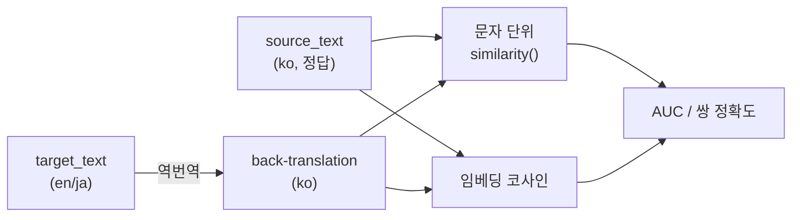

# Session Handoff

> Last updated: 2026-09-04 (KST)
> **Q4가 닫혔다. 답은 "임베딩이 필요하다"이다.**
> 로컬·상용 두 백엔드 × ko→en/ja 두 언어쌍 × 두 측정 설계, **8개 칸 전부에서
> 임베딩이 문자 단위를 이겼다**(평균 격차 +0.180). 판정표가 요구한 "두 백엔드 공통"이
> 충족되어 요구사항정의서 §12 Q4를 **✅ 해결**로 옮겼다.
> **예상과 달랐던 것은 백엔드 축이다** — 상용 모델이 역번역 오염을 26~33%에서 **0%**로
> 없앴는데도 판정력은 오르지 않았다(로컬이 근소 우위). 다국어 임베딩이 코드 스위칭된
> 역번역도 원문과 매칭해 내기 때문이다. **역번역에 상용 API를 쓸 근거가 이 실측에는 없다.**
> **코드는 한 줄도 바꾸지 않았다.** 산출물은 판정과 문서 갱신이다.
> **v0.1 완료 개수는 41 그대로다**(42개 중, 98%).
> 상태 값은 여기 적힌 숫자가 아니라 아래 "현재 상태 재는 법"의 명령으로 직접 재라.
> 진척은 [WBS](docs/WBS.md), FR 번호의 출처는 [요구사항정의서](docs/요구사항정의서.md)다

## Current Status

| 단계 | 상태 | 산출물 |
| --- | --- | --- |
| 직전 인수인계 갱신 | ✅ 머지됨 | PR [#29](https://github.com/withwooyong/cuesift/pull/29) · [#30](https://github.com/withwooyong/cuesift/pull/30) |
| **Q4 spike — 상용 API 행** | ✅ **채웠다** | 아래 "최종 2×2" |
| **Q4 판정** | ✅ **닫혔다** | 요구사항정의서 §12 Q4가 단일 출처 |
| **이 문서 + 문서 갱신** | PR — | 코드 변경 0건 — `CHANGELOG.md`를 건드리지 않았다 |

**이번 세션도 코드를 한 줄도 바꾸지 않았다.** Keep a Changelog는 코드 변경을 적는
문서이므로 `CHANGELOG.md`에 넣을 것이 없다. 실측 결과는 여기와 §12 Q4에 있다.

## 현재 상태 재는 법

**첫 일은 직전 작업이 어디까지 갔는지 확인하는 것이다.**

```bash
gh pr list --state all --limit 5 --json number,title,state,mergedAt
git branch --show-current                     # main
git status --short                            # clean
git log --oneline -3
```

## Q4 최종 판정 — 2×2가 채워졌다

### 무엇을 어떻게 쟀는가



**코퍼스의 방향은 ko→en/ja다**(Q2와 일치). `source_text`가 한국어이고
`target_text`가 en/ja이므로, 역번역은 `target_text`를 한국어로 되돌려
`source_text`와 비교하는 흐름이다. 이 방향을 착각하면 표본 구성이 통째로 뒤집힌다.

### 최종 2×2

| 백엔드 · 언어쌍 | 1차 문자 | 1차 임베딩 | 2차 문자 | 2차 임베딩 |
| --- | --- | --- | --- | --- |
| 로컬 en-ko | 0.511 | **0.730** | 0.560 | **0.820** |
| 로컬 ja-ko | 0.700 | **0.792** | 0.600 | **0.810** |
| 상용 en-ko | 0.535 | **0.728** | 0.640 | **0.830** |
| 상용 ja-ko | 0.622 | **0.757** | 0.560 | **0.700** |

**임베딩이 8/8 칸에서 이긴다.** 격차는 최소 +0.092 · 최대 +0.260 · 평균 +0.180이고,
2차만 보면 평균 +0.200이다. 1차는 AUC(n=50), 2차는 쌍 정확도(100쌍)다.

### 표본을 4배로 늘리자 격차가 벌어졌다

| 칸 | 문자 25 → 100 | 임베딩 25 → 100 | 격차 |
| --- | --- | --- | --- |
| 로컬 en-ko | 0.640 → **0.560** | 0.840 → 0.820 | +0.200 → **+0.260** |
| 로컬 ja-ko | 0.680 → **0.600** | 0.840 → 0.810 | +0.160 → **+0.210** |
| 상용 en-ko | 0.760 → **0.640** | 0.920 → 0.830 | +0.160 → **+0.190** |
| 상용 ja-ko | 0.600 → **0.560** | 0.720 → 0.700 | +0.120 → **+0.140** |

**문자 단위가 임베딩보다 두 배 넘게 떨어졌다.** 작은 표본이 문자 단위에 유리한 쪽으로
흔들려 있었다는 뜻이고, 25쌍에서 멈췄다면 격차를 과소평가한 채 판정할 뻔했다.

### 백엔드 축은 갈리지 않는다 — 예상과 다른 결과

| | 로컬 `qwen2.5:3b` + `bge-m3` | 상용 `gpt-4o-mini` + `text-embedding-3-large` |
| --- | --- | --- |
| 역번역 오염률(코드 스위칭) | **en 26% · ja 33%** | **0% · 0%** |
| 2차 임베딩 쌍 정확도 | 0.820 · 0.810 (평균 **0.815**) | 0.830 · 0.700 (평균 **0.765**) |

오염을 완전히 없앴는데도 판정력은 **로컬이 근소 우위**다. 연기 테스트에서 이미 보였다 —
오염된 로컬 역번역(`그러나 실제로他们是成功的原因...`)이 코사인 0.891, 깨끗한 상용
역번역이 0.846이었다. **다국어 임베딩이 코드 스위칭된 문장도 원문 옆에 놓는다.**

**직전 세션의 기여도 분석("유사도 수단 +0.222, 모델 품질 +0.055")과 어긋난다** —
이번 측정에서 모델 품질의 기여는 0 또는 음수다.

### 수치를 그대로 믿으면 안 되는 자리

| 유보 | 내용 |
| --- | --- |
| 1차 ja-ko는 여전히 무의미 | 이월 17번(negation 라벨이 언어와 무관한 영어 `not` 삽입)이 그대로다. **판정 무게는 2차에 있다** — 2차는 부정을 직접 제거해 만든 쌍이라 라벨이 참이다 |
| 1차 Recall@10%의 해상도 | n=50에 양성 25건이라 예산 10%가 5건이다. 배수가 0.80·1.20·1.60·2.00 네 값으로만 찍힌다 |
| 상용 ja-ko 2차가 낮은 이유 | **역번역이 부정을 문맥으로 복원한** 사례가 섞였다(이월 18번). 모델 성능이 아니라 측정 설계의 한계다 |
| 직전 세션 수치와 값이 갈렸다 | 2차 en-ko 문자가 0.800(직전) vs 0.560(이번)이다. **재현 실패가 아니라 표본이 다르다** — 대조군 선택과 ja 제외 규칙을 이번에 바꿨고, 무엇보다 **직전 세션이 프롬프트를 기록하지 않았다** |

## 재현 방법 — 스크립트는 이번에도 남기지 않았다

throwaway이며 스크래치에만 있었다. 다시 만들 때 **아래를 지켜야 이 표와 비교된다.**
직전 세션이 프롬프트를 빠뜨려 로컬 행을 다시 재야 했으므로, 이번에는 프롬프트를 적는다.

| 항목 | 값 |
| --- | --- |
| 씨앗 | `20260903` |
| 백엔드 | 로컬 `qwen2.5:3b` + `bge-m3` / 상용 `gpt-4o-mini` + `text-embedding-3-large` |
| **역번역 프롬프트** | system: `You are a translator. Translate the user's text into Korean. Output only the translation, with no explanation.` · user: `target_text` 원문 |
| 온도 | `temperature: 0` |
| 1차 표본 | 언어쌍마다 negation 라벨 25 + **어떤 라벨도 없는** 세그먼트 25 |
| 2차 표본 | 무라벨 세그먼트 **100쌍**. `target_text`에서 부정을 제거해 짝을 만든다 |
| 2차 en 규칙 | `is not→is` 계열 · 축약형(`don't→do`) · `cannot→can` · `never→always`. **대소문자를 보존한다**(`Don't→Do`) |
| 2차 ja 규칙 | `ませんでした→ました` · `ません→ます` **둘만** |
| **2차 ja 제외** | `かもしれません` · `すみません` · `いけません` · `過ぎません` · `ではありませんか` · `てなりません` |
| 유사도(문자) | `src/cuesift/signals/similarity.py`의 `similarity()`를 **그대로** |
| 유사도(임베딩) | `/v1/embeddings`에 보내 코사인. `data[]`를 `index`로 정렬해 짝지운다 |
| 지표 | 1차 AUC(점수 = −유사도) · 2차 쌍 정확도(`sim(정상) > sim(파손)`) |

**ja 제외 목록이 이번에 새로 필요해졌다.** `ません`을 기계적으로 `ます`로 바꾸면
`かもしれません → かもしれます`처럼 **일본어에 없는 형태**가 나오고, 그러면
"의미 반전"이 아니라 "입력 파손"을 재게 된다. 60건을 눈으로 훑어 12건가량이
이 부류였다.

**비용은 무시할 수준이다.** 이번 세션이 상용 API로 역번역 약 400회 + 임베딩 약 600건을
불렀고 10원에 못 미친다. 충전한 $5는 그대로 남아 있다. **비용을 아끼려고 표본을 줄이지 마라** —
이번에 25쌍에서 100쌍으로 늘린 것이 판정의 신뢰도를 실제로 바꿨다.

## 이번 세션이 배운 것

### ⓐ `; echo "exit=$?"`를 붙이면 실패가 성공으로 보고된다

로컬 재측정이 `httpx.ReadTimeout`으로 죽었는데 배경 작업은 **exit code 0**으로
보고됐다. 파이썬이 죽어도 뒤의 `echo`가 성공했기 때문이다. 결과 파일이 갱신되지
않은 채 남았고, **옛 로컬 값과 새 상용 값이 섞인 표를 한 번 냈다.**

**이 리포의 "무엇을 대상으로 통과했나" 규율이 배경 작업의 종료 코드에도 적용된다.**
긴 명령의 성공 여부를 볼 때는 종료 코드에 아무것도 덧붙이지 않는다.

막은 방법은 게이트다 — 집계 스크립트가 표를 내기 전에 **모든 칸의 표본 수가 같은지**
보게 했고, 실제로 `{local: 25, 25, openai: 100, 100}`을 잡아 exit 1로 죽었다.
**게이트를 만들고 실제로 실패시켜 본 사례가 하나 더 늘었다.**

### ⓑ 프롬프트를 기록하지 않으면 수치가 재현되지 않는다

직전 세션이 씨앗·표본·온도는 적었으나 **역번역 프롬프트를 적지 않았다.** 그래서
상용 행만 새 프롬프트로 재면 백엔드 차이와 프롬프트 차이가 섞이는 상태가 됐고,
로컬 행을 통째로 다시 재야 했다(로컬 3b로 300건, 약 30분).

**재현 조건표에 "무엇을 보냈는가"가 빠지면 그 표는 재현 조건표가 아니다.**

### ⓒ 작은 표본은 약한 신호에 유리한 쪽으로 흔들린다

25쌍에서 100쌍으로 늘리자 **문자 단위가 임베딩보다 두 배 넘게 떨어졌다.**
격차가 +0.120~+0.200에서 +0.140~+0.260으로 벌어졌다.

25쌍에서 멈췄어도 결론(임베딩 우위)은 같았겠지만 **그 크기를 과소평가했을 것이다.**
방향이 맞았다고 표본이 충분했던 것은 아니다.

### ⓓ 오염을 없애도 판정력이 오르지 않는 구간이 있다

역번역 오염을 26~33%에서 0%로 없앴는데 임베딩 쌍 정확도는 오르지 않았다.
**다국어 임베딩이 코드 스위칭된 텍스트를 흡수하기 때문이다.**

**"출력이 지저분하다"와 "신호가 약하다"는 다른 문제다.** 눈에 보이는 결함을
고치는 것이 지표를 올린다는 보장이 없고, 이번에는 그 둘이 무관했다.

## 이월 트리아지 — **14건** (18번이 신설됐다)

**번호는 원래 번호를 유지한다** — 다시 매기면 이전 세션의 기록이 다른 항목을 가리킨다.

| # | 무엇 | 왜 지금 안 했나 | 다시 열 조건 |
| --- | --- | --- | --- |
| 2 | `bench/track_io.py`의 `_FIELDS`가 `source_from_stt`를 모른다 — 왕복에서 **조용히 `False`로 리셋** | 도달 경로가 없다(벤치 코퍼스는 자막) | STT 트랙을 벤치에 넣을 때. `tests/test_bench_track_io.py`의 왕복 동등성이 그 순간 실패한다 |
| 3 | `pyproject.toml`에 **`filterwarnings`가 없어 경고가 게이트를 통과한다** | `["error"]`는 스위트 전체에 영향 | 별도 과제. **"검사하지 않고 통과하는 게이트" 규율에 직접 걸린다** |
| 4 | `translate/provider.py`의 `RetryableProviderError.__init__`도 `isinstance`+`isfinite`를 쓴다 — 거대 정수에서 `OverflowError` 누출 **미확인** | 기존 코드 | `translate`를 손대는 다음 패키지 |
| 5 | `Transcript.__post_init__`이 `cues`의 **컨테이너 타입만** 보고 원소 타입은 안 본다 | 범위 밖 | 프로바이더를 하나 더 붙일 때 |
| 6 | `pyproject.toml:69`의 **죽은 `stt` extra** | 의존성 고정 규율상 채울 것이 없다 | 패키징을 손볼 때 |
| 8 | FR-1.5(원문 언어 자동 감지)가 반쪽 — STT 응답의 `language`를 **기록만** 한다 | `IngestResult.source_lang`은 선언값을 쓴다 | 자막 파일 입력까지 함께 닫을 때 |
| 9 | API 키가 **공백 한 칸**이면 `Authorization` 헤더가 `Bearer` 뒤에 공백만 붙은 채 나가 401이 "키가 틀렸다"로 오독된다 | 번역 경로도 같아서 한쪽만 고치면 비대칭이 된다 | 키 처리를 손볼 때. `_resolve_stt_key`와 `_require_ascii_api_key` 양쪽을 함께 |
| 10 | `translate --media X --to ko`처럼 **대상이 원문과 같으면** 전사를 마친 뒤 exit 2 | 출력 경로 충돌 검사가 입력 이름을 알아야 한다 | 되돌릴 수 없는 비용 앞의 검사를 정리할 때 |
| 11 | 설정의 `input.media` + `--dry-run` 조합에 **CLI 탈출구가 없다** | 설정 무효화 옵션은 이 한 자리만의 문제가 아니다 | 설정 무효화 규칙을 전반적으로 정할 때 |
| 14 | `cli.py` 자막/영상 자리의 `if "input" in losers:`는 **도달 불가능한 죽은 코드** | 위치 인자는 `default_map`에 실리지 않아 `_from_config("input")`이 늘 거짓이다 | `_resolve_exclusive` 호출부를 정리할 때. 지우는 것이 맞는지부터 판정한다 |
| 15 | `review.json`에 **스키마 버전 필드가 존재한 적이 없다** | 그래서 "이번에 올리지 않았다"가 **표현 불가능한 결정이다** | 하류 소비자가 생길 때 |
| 16 | `policy_kind` 분기의 `else`가 **threshold로 조용히 떨어진다** | 지금은 넷째가 `ValueError`로 죽어 도달 불가다 | **넷째 축이 추가될 때** |
| **17** | **`bench/inject.py:141`의 negation 삽입이 언어를 모른다** — ja-ko 라벨 71건 전부가 의미 반전이 아니다 | 고치면 코퍼스를 다시 만들어야 하고, 그러면 기존 벤치 수치와 비교가 끊긴다 | **FR-4.2 착수와 동시에.** Q4가 닫혀 착수 근거가 생겼으므로 **이제 임박했다** |
| **18** | **역번역이 오류를 조용히 교정한다** — 부정을 제거한 문장과 원문의 역번역이 **글자까지 동일**해진 사례가 있다(`ja-04640`). 문맥이 부정을 복원한다 | spike의 범위가 아니다. 측정에서는 오답으로 셌다 | **FR-4.2 구현 시.** 이것은 버그가 아니라 **역번역 신호의 원리적 상한**이다 — 재번역이 원문을 복원할수록 오류가 가려진다. 임계값 설계가 이 성질을 알고 있어야 한다 |

**미룬 이유가 다시 열 조건을 정한다.** 3·14는 **사람이 날을 잡아야** 하고, 15·16은
그때가 오면 **저절로 걸리며**, 나머지는 해당 영역을 손대는 작업이 함께 닫는다.
**17·18은 FR-4.2와 한 묶음이다** — 17은 정답지를 고치는 일이고 18은 그 신호가
원리적으로 못 잡는 것을 아는 일이다.

## 승계 항목

| 항목 | 상태 |
| --- | --- |
| **Q4**(자가일관성 유사도 측정 수단) | ✅ **닫혔다(2026-09-04).** 임베딩이 필요하다. 요구사항정의서 §12 Q4가 단일 출처 |
| **FR-4.2**(역번역) | 구현 안 함. **착수 근거가 생겼다** — 유사도 수단은 임베딩 코사인이고 역번역 모델은 로컬로 충분하다. **이월 17·18번과 한 묶음이다** |
| **FR-8.5 R3**(Windows 콘솔의 `\r`) | 구조는 확인됐고 **육안 관측이 남아 있다.** 진짜 콘솔 창이 필요하다 |
| **FR-8.3 R3**(STT live 검증) | **열려 있다.** `/v1/audio/transcriptions`가 이 서버에서 **400**을 낸다(404 아님) — 경로는 라우팅된다. **400이 "요청이 틀렸다"인지 형태만 받는지는 안 갈랐다** |
| **`engine.py::_run_single`의 전역 index** | 확인됐고 안 고쳤다. `main`에 있다 |
| `segments[].reasons`의 순서 미검증 | NFR-3 재현성 문제. 열려 있다 |
| 파킹 2 — 권장 모델 `qwen2.5:3b`의 한국어 출력 안정성 | **이번에 수치가 갱신됐다** — 250건 기준 오염률 en 26% · ja 33%다(직전 세션은 50건에 38%). **다만 이것이 판정력을 떨어뜨리지는 않는다**(위 "백엔드 축" 참고) |
| 파킹 4 — `COLUMNS=88` 아래에서 옵션 이름이 잘린다 | rich의 표 렌더링. 폭 88을 게이트로 못 박았다 |

## 개발 환경 메모 (승계)

**Python 실행은 반드시 `.venv/Scripts/python.exe`를 쓴다.** 시스템 Python은 3.14라 다르다.
게이트는 CI와 같은 대상 `.`으로 돌린다 — **`src tests`로 좁히면 안 된다**(그 차이로 CI가
5회 연속 실패한 전례가 있다).

**리포 루트에 `cuesift.yaml`을 만들지 마라.** 자동 탐색이 그것을 읽는다.
`conftest.py`의 autouse가 인프로세스 테스트는 막지만 **서브프로세스는 못 막는다.**

**변이 실험은 백업본을 만들고 복원을 `finally`에 둔다.** 스크래치 사본에서 할 때는
`PYTHONPATH`를 강제한다 — editable install의 `.pth`가 사본을 가려 "생존" 오탐을 낸다.
**`git checkout --`로 복원하지 마라** — 미커밋 작업을 날린 전례가 있다.

**콘솔 출력이 cp949라 한글·한자가 `UnicodeEncodeError`로 터진다.** 판정이 필요한
출력은 **UTF-8 파일로 받아서 읽는다**(`open(..., encoding="utf-8", newline="")`).

**파이썬 스크립트로 문서를 고칠 때 `newline=""`을 준다.** `Path.write_text`의 기본값이
`newline=None`이라 Windows에서 `\n`을 `\r\n`으로 번역해 **2줄 수정이 수백 줄 변경으로** 찍힌다.
**`CHANGELOG.md`·`HANDOFF.md` 둘 다 LF다**(실측).

**긴 한글 문서는 heredoc이 아니라 `Write` 도구로 쓴다.** 여러 줄 커밋 메시지는
`git commit -F <파일>`로 넘긴다 — heredoc은 조용히 깨진다. **Bash heredoc 안의
파이썬에 한글 리터럴을 넣지 마라** — 이번 세션에서 `SyntaxError: (unicode error)`로
한 번 죽었다. 한글이 필요하면 `\uXXXX` 이스케이프를 쓰거나 `Write`로 스크립트를 만든다.

**Bash heredoc 안의 파이썬에 Windows 경로를 넣지 마라.** 역슬래시가 한 겹 먹혀
`tests\\fixtures`가 `tests\fixtures`(폼피드)로 바뀐다. 경로가 섞인 편집은 `Edit` 도구로 한다.

**한글을 curl 커맨드라인에 넣지 마라.** Git Bash의 `curl -d`가 CP949로 인코딩해
모델이 `"random characters and gibberish"`라고 답한다. LLM 백엔드에 한글을 보내는 것은
`httpx`로 한다(런타임 의존성에 이미 있다).

**로컬 Ollama는 긴 입력에서 `ReadTimeout`을 낸다.** 재시도가 없으면 한 건의 타임아웃이
측정 전체를 죽이고 **결과 파일이 아예 쓰이지 않는다**(이번에 발생했다).
장시간 측정 스크립트에는 재시도와 백오프를 넣는다.

### 로컬 LLM

```powershell
curl.exe http://localhost:11434/api/tags      # 설치된 모델과 capabilities
```

현재: `qwen2.5:1.5b`·`qwen2.5:3b`(둘 다 `completion`·`tools`) · `bge-m3`(`embedding`,
1024차원). **임베딩은 `capabilities`에 `embedding`이 있는 모델만 낸다** — 없으면
`/v1/embeddings`가 **501**이다(404가 아니다. 경로는 있고 모델이 못 하는 것이다).

### 상용 API

**키는 `.claude/settings.local.json`의 `env.OPENAI_API_KEY`에 있다**(`.gitignore` 99번째 줄에
걸려 추적되지 않는다). 확인은 값을 찍지 말고 길이만 본다 — 기대값 `len 164`.

```powershell
.venv/Scripts/python.exe -c "import os; k=os.environ.get('OPENAI_API_KEY'); print('len', len(k) if k else None)"
```

`None`이면 Claude Code를 재시작한다. **`setx`로는 되지 않는다** — 이미 떠 있는
프로세스 트리의 환경 블록을 갱신하지 않기 때문이다(실측). 단가는
`gpt-4o-mini` 입력 $0.15/1M · 출력 $0.60/1M, `text-embedding-3-large` $0.13/1M이고,
**충전한 $5는 이번 세션 뒤에도 사실상 그대로다.**

STT live 테스트는 `-m live` · `CUESIFT_LIVE_STT_*` 환경변수로 돌고
**오디오는 리포에 넣지 않는다**(D10, `CUESIFT_LIVE_AUDIO`로 받는다).

## 다음 세션 시작 절차

```bash
gh pr list --state all --limit 3 --json number,title,state,mergedAt
git branch --show-current                 # main
git status --short                        # clean
git log --oneline -3
```

**`main`에 직접 푸시하지 않는다.** CI의 `push` 트리거가 `branches: [main]`뿐이라
직접 푸시하면 머지된 **뒤에야** CI가 돈다 — 게이트가 아니라 사후 통보다.
PR 절차는 [CLAUDE.md](CLAUDE.md)의 "PR 절차"에 있다.

**다음 작업은 FR-4.2(역번역)다.** v0.1의 마지막 한 개이고, Q4가 닫혀 착수 근거가 생겼다.
**이월 17·18번을 같은 브랜치에서 다뤄야 한다** — 17번(negation 라벨이 언어를 모른다)은
이 신호의 정답지를 고치는 일이라 **구현보다 먼저** 와야 하고, 18번(역번역이 오류를
조용히 교정한다)은 임계값 설계가 알고 있어야 하는 원리적 상한이다.
