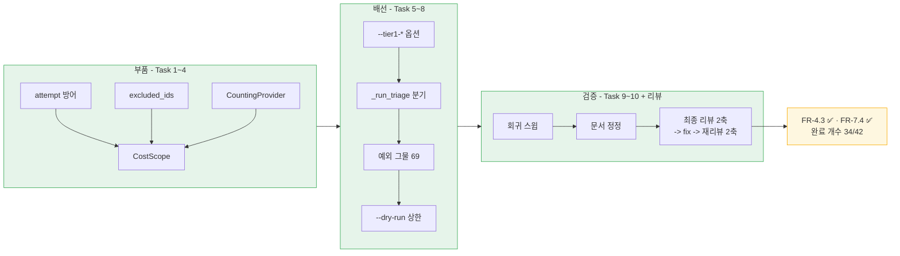

# Session Handoff

> Last updated: 2026-08-27 (KST)
> Branch: **`feat/tier1-cli`** — **아직 푸시도 PR도 안 됐다.** 커밋 수는 매 커밋마다
> 자신을 포함하지 못해 여기 적은 숫자가 항상 낡는다 —
> `git rev-list --count main..HEAD`로 직접 센다(이 문서를 쓴 시점 **37**).
> **WP8b는 완료다.** 태스크 10개와 최종 브랜치 리뷰 2축, fix 1라운드, 재리뷰 2축까지 닫혔다.
> 진척은 [WBS](docs/WBS.md), FR 번호의 출처는 [요구사항정의서](docs/요구사항정의서.md)다

## Current Status

**WP8b가 끝났고 다음 행동은 PR이다.** 이 브랜치는 **CI를 한 번도 안 거쳤다** — 아래
"다음 세션이 가장 먼저 할 일"을 보라.

| Task | 무엇 | 커밋 |
| --- | --- | --- |
| 1 | `CacheRequest.attempt` 도메인 방어 (D11) | `9e083d7` `5d6c2a7` |
| 2 | `triage_with_tier1`의 수집·융합 입력 분리 (D5·D12) | `27b8dfb` `b7a8238` `055f4b4` `059a3d6` |
| 3 | `CountingProvider` — 실제 나간 호출의 토큰 계측 (D6·D7) | `d6991f3` `d615dd7` `5616776` |
| 4 | `TriageOutcome.cost_includes` / `CostScope` (D8) | `ef15822` `1f0c9b5` `8bacd68` |
| 5 | CLI 옵션 4종과 조합 검증 (D1~D4·D9) | `131bdaa` `699a751` |
| 6 | `_run_triage`의 Tier 1 분기 배선 | `494b039` `036c662` `f1ddf12` |
| 7 | 프로바이더 예외 그물 — 종료 코드 69 (D14) | `cdf0ed6` `331ca64` |
| 8 | `--dry-run`의 Tier 1 상한 보고 (D10) | `dec9f9a` `60a3b63` `809e343` `34a80fd` |
| 9 | 회귀 스윕(변이 8종) — 검증 전용, 커밋 없음 | — |
| 10 | 문서 정정 (FR-4.3·FR-7.4 → ✅, 완료 개수 32 → 34) | `059982e` `3b29100` |
| — | 최종 브랜치 리뷰 fix 1라운드 | `a4fae69` |



### Tier 1은 이제 켤 수 있다 — **직전 인수인계와 정반대다**

```console
$ cuesift translate 입력.srt --target en --review-budget 10% \
    --tier1 --tier1-samples 3 --tier1-max-ratio 0.05 --review-out out/
```

**판정 기준은 스위치가 아니라 그 계층이 실제로 돌았는지다.** `--tier1`을 켜도
아래 셋 중 하나면 `cost.includes`에 `"tier1"`이 **안 실린다**.

| 경우 | `includes` | 왜 |
| --- | --- | --- |
| `--tier1` 없음 | `["translation"]` | 계층이 꺼져 있다 |
| `--tier1` + Tier 1이 돌았다 | `["translation","tier1"]` | 정상 |
| `--tier1` + **번역 전량 실패** | `["translation"]` | 후보를 만들 원본이 없다 |
| `--tier1` + **후보 0건** | `["translation"]` | 회색지대가 비었거나 `floor(N × max_ratio) == 0` |

**마지막 행이 최종 리뷰가 잡은 결함이다.** 자세한 것은 아래 "이 브랜치가 마지막에
배운 것"을 보라.

## 다음 세션이 가장 먼저 할 일 — **PR을 열어라**

```bash
git push -u origin feat/tier1-cli
gh pr create --base main --title "WP8b: Tier 1 CLI 배선 (FR-4.3 · FR-7.4)"
gh pr checks --watch
gh pr merge --squash
```

**푸시만으로는 CI가 안 돈다.** `.github/workflows/ci.yml`의 트리거는
`push: branches: [main]` · `pull_request:` · `workflow_dispatch:`뿐이라
**기능 브랜치 푸시는 어느 것도 건드리지 않는다.** PR을 열거나 `workflow_dispatch`로
이 ref를 지정해야 한다.

**이것이 "푸시했으니 검증됐다"는 착각의 자리다.** 로컬 venv는 3.14이고 CI는 3.11·3.12라
로컬 통과는 서로 다른 버전에서의 통과를 보장하지 않는다. 이 저장소가 PR을 경유하는
이유가 정확히 이것인데(CLAUDE.md "PR 절차"), **PR을 안 열면 그 게이트가 아예 없다.**

PR 본문에 담을 것: 무엇을 · 근거 문서(설계 스펙 D1~D14, 요구사항정의서 FR-4.3·FR-7.4) ·
아래 게이트 수치를 **개수 그대로**.

### PR이 머지된 뒤의 순위

| WP | 상태 | 근거 |
| --- | --- | --- |
| **WP8b (Tier 1 CLI 배선)** | ✅ **완료** | FR-4.3·FR-7.4 닫힘. 완료 개수 32 → **34** |
| WP5 나머지 (FR-7.3) | **1순위** | `report.html`. **렌더러 하나다** — `TriageOutcome`을 HTML로 그리면 되고 `spans[].side`가 이미 실려 있다 |
| WP6 나머지 (FR-8.3~8.5) | 2순위 | `transcribe` 배선·`cuesift.yaml` 로더·진행 표시 |
| WP9 STT | 3순위 | FR-1.3이 "자막 우선"이라 마지막이어도 S1이 성립 |

## 파킹된 finding 8건 — **원장이 아니라 여기가 영구 기록이다**

원장(`.superpowers/sdd/2026-08-25-tier1-cli/progress.md`, 1671줄)은 gitignore 안이라
**`git clean -fdx`가 지운다.** 판정 근거까지 여기 옮긴다.

**"아직 안 봤다"가 아니라 "보고 판단했다"이므로, 다시 열려면 판정 근거를 먼저 반박해야 한다.**

| # | 무엇 | 왜 지금 안 했나 | 다시 열 조건 |
| --- | --- | --- | --- |
| 1 | **번역 전량 실패가 `exit 1`** | **`main`에 이미 있는 기존 동작이다**(실측: `git show main:src/cuesift/cli.py \| grep -c "번역된 세그먼트가 없어"` → 1). `cli.py` 독스트링의 "1을 진단 실패에 쓰지 않는 것이 핵심"과 충돌하지만 이 브랜치가 만든 것이 아니다 | 종료 코드 체계를 손보는 작업이 열릴 때 |
| 2 | README 권장 모델(`qwen2.5:3b`)로 24큐 **전량 실패 + 실패 사유 0줄** | 진단 부재는 별도 작업이다. §12 Q3이 "로컬 LLM 능력은 균일하지 않아 **탐지·명시가 필요**"라 이미 말한다 | 진단 출력 작업. **문서가 권하는 모델이 실패하는 것 자체가 사용자 신뢰 문제**라 우선순위가 낮지 않다 |
| 3 | `--dry-run`의 `최대 0회`에 **사유가 없다** | 실주행엔 `_diagnose_empty_candidates`가 있는데 dry-run엔 없다. Task 8의 확장 | 2번과 같은 작업에서 함께 |
| 4 | `COLUMNS=70`에서 옵션 이름이 잘린다 | rich 렌더링. **색 활성 재현이 안 돼 `[의심]`으로 남았다** | 색이 켜진 CI 로그에서 실제로 관측될 때 |
| 5 | **화면 토큰(번역만) vs `review.json` `cost`(합계)가 다른 객체** | 화면에 합계 줄을 넣을지는 설계 결정이다 | **재리뷰 축B가 수치를 붙였다**: 같은 실행에서 화면 `prompt 1000 · completion 200 · calls 10`, 파일 `1200/240/12`. 이 차이를 설명할 것인지 없앨 것인지 정하는 일 |
| 6 | `inf` 메시지가 원인을 틀리게 말한다 | 문구 문제, 작지만 별건 | **관련 사실**: 조합 검증은 **7규칙 / 8종 문자열**이다 — `inf`와 `nan`이 한 규칙에서 서로 다른 문자열을 낸다. README 7행 표는 규칙 수 기준이라 "일곱"이 옳다 |
| 7 | `cli.py`의 `signals/llm.py:162-173` **줄번호 인용**이 그 파일이 편집되면 조용히 낡는다 | **R64** — 이 저장소 `src/`에 같은 형태가 **15건**이라 관행이다. 이 태스크만 고치면 일관성이 없다. **인용은 안 낡았다**(HEAD에서 정확함을 최종 리뷰가 확인) | 관행 전체를 바꾸는 작업 |
| 8 | 종료 코드 69 단축이 **Tier 1 실패에도** 걸려 남은 언어까지 중단한다 | 단축은 `EXIT_UNAVAILABLE`에서만 걸리고 **건너뛴 언어를 stderr로 명시한다.** `FatalProviderError`(401·모델 없음)는 다음 언어에서도 같아 계속해도 전부 실패 — **손실이 없다** | 언어별로 다른 프로바이더를 쓸 수 있게 되는 날 |

**1·2·3이 한 덩어리다** — 전부 "실패했는데 왜인지 안 말한다"이고, 2·3은 같은 작업에서 닫힌다.

## 이 브랜치가 마지막에 배운 것

### ① `None`이 두 뜻을 가지면 **계약이 아니라 호출부를 의심하라**

최종 리뷰 축B가 CLI를 직접 돌려 잡았다. 5큐 실주행에서 화면은
`[en] Tier 1: 회색지대가 비었다`인데 `review.json`은 `"includes": ["translation","tier1"]`,
`"calls": 6`(**6은 전부 번역**)이었다. **Tier 1이 한 번도 안 불렸는데 비용 범위에 실린다.**

`resolve_cost_scope`의 계약은 이미 옳았다.

| 입력 | 뜻 | 처리 |
| --- | --- | --- |
| `None` | 그 계층이 **안 돌았다** | 범위·합계에서 제외 |
| `TokenUsage(0, 0, calls=N)` | **돌았는데 무음** | `unreported`에 실린다 |
| 전량 `None` | 아무 계층도 안 돌았다 | `ValueError` |

**호출부가 그 계약을 어기고 있었다** — `tier1.counting.usage`를 무조건 넘겼다.
해법은 `models.py`를 **한 줄도 안 바꾸고** 호출부가 판정을 하게 한 것이다:
`triage_with_tier1`은 `if not candidates:` **한 자리**에서만 `warn`을 부르고 즉시
반환하므로, 호출부가 그 호출을 기록해 `tier1_usage = None if 안_돈_사유 else usage`로 넘긴다.

**계약이 틀린 것과 계약을 어긴 것은 다르다.** `models.py`를 고쳤다면 계약이
"`None`이거나 `calls == 0`이면 안 돌았다"로 넓어져 **캐시 전량 히트로 `calls == 0`이 된
진짜 돈 계층까지** 빨려 들어갔을 것이다. `CountingProvider`가 캐시 **안쪽**이라
히트는 안 세어진다 — 이것이 이 수정의 함정이었다.

**반려된 대안(`calls > 0` 기준)의 진짜 문제는 크래시가 아니라 NFR-3 재현성 위반이다.**
같은 입력의 두 실행(1회차 미스, 2회차 전량 히트)이 **다른 `includes`를 낸다.**
조용한 비결정성이 크래시보다 나쁘다.

### ② 이 브랜치의 실패 유형 5종 — **다음 브랜치에서 같은 것을 찾아라**

| 유형 | 횟수 | 형태 |
| --- | --- | --- |
| **주석이 틀린 근거를 든다** | 7 | 코드는 맞고 **근거 서술만** 틀렸다 |
| **문자열/종료코드 단언이 층을 구별 못 함** | 4 | typer의 exit 2와 조합 검증의 exit 2 · 부분 문자열 · 부재 단언 · `"15"`가 `"3,150"`에 들어감 |
| **변이 측정 착시** | 5 | 무연산 · 복합 · 되돌리기 중단 · `PYTHONPATH` 미강제 · **변이 과대**(넓은 변이는 "무언가는 잡힌다"만 말한다) |
| **지적은 옳고 범위가 틀림** | 2 | 원칙을 세우고 grep으로 적용할 때 넓거나(R68) 좁게(HANDOFF 형제 행) 걸린다 |
| **실측 표기가 실은 인용이다** | 1 | **신규.** 아래 참조 |

**다섯 번째가 이번에 새로 나왔다.** 최종 리뷰 축B가 "조합 검증 **6종**을 실행으로 셌다"고
보고했고 내가 그것을 fix 브리프에 옮겼는데, 재리뷰에서 축B가 **"내 6종은 계획서 문구를
그대로 옮긴 것"** 이라고 자백했다. 실제는 **7규칙**이다.

이 저장소는 `[실측]`/`[추측]` 둘로 나누는데 **제3의 범주(문서에서 옮긴 것)** 가
실측 칸에 들어앉았다. **구현자가 브리프를 검증했기 때문에 살았다** — 그대로 따랐으면
README에 "여섯"이 출고됐다. **브리프의 수치도 근거를 물어야 한다.**

### ③ 주석은 게이트의 존재를 **양방향으로** 틀리게 말한다

지금까지 이 브랜치가 만난 것은 전부 *"게이트가 있다고 믿었는데 없다"* 였다 —
`_TIER1_BOUND_PREFIX` 변이 사망 0건, `_TIER1_WARN_PREFIX` 0건, 비용 한도 경계 미검사.

재리뷰 축A가 **반대 방향**을 찾았다. 구현자가 *"이 불변식(`warn`은 한 자리에서만 불린다)은
문서로만 지킨다"* 라고 겸손하게 적었는데, 도는 경로에 `warn(...)` 한 줄을 넣는 변이가
**7 failed**를 냈다. **게이트가 실제로 있었다.**

고칠 대상은 아니지만 뿌리는 같다 — **주석이 게이트의 존재 여부를 추측으로 말한다.**

### ④ 변이는 **양방향으로** 걸어야 한다

재리뷰 축A가 A의 수정에 대해:

| 변이 | 결과 |
| --- | --- |
| 수정 되돌리기 (`tier1_usage = usage` 무조건) | **1 failed** |
| 역방향 (`tier1_usage = None` 고정) | **5 failed** |
| 반려된 대안 (`calls > 0` 기준) | **1 failed** |

**한 방향만 걸면 고정값을 반환하는 구현이 통과할 수 있다.** 양쪽에서 죽는다는 것은
게이트가 **값을 실제로 본다**는 뜻이다.

### ⑤ live로 못 만드는 시나리오는 **계약을 구현해서** 만든다

재리뷰 축B가 README 4행 표를 행마다 대조해야 했는데 `qwen2.5:3b`가 100큐를 5분에
21큐만 진행했다. 축B는 거기서 멈추지 않고 **리포 밖에 OpenAI 호환 스텁 서버**를 띄워
(`prompt.py:32`의 `{"translations":[{"id":N,"text":…}]}` 계약을 그대로 구현) 결정론적으로
돌렸다. **네 행 전부 실측이 됐다.**

fix 라운드의 구현자는 같은 자리에서 *"여기까지 실측, 여기부터 미실측"* 으로 정직하게
끊었다. 둘 다 옳고 축B 쪽이 한 걸음 더 갔다 — **선택지가 하나 더 있다는 것을 기록한다.**

## 브랜치 안에서 확정된 규칙 (Ruling) — 코드가 이유를 안 말하는 것들

| # | 무엇 |
| --- | --- |
| R40 | `CachingProvider`는 `cache_identity`를 **위임하지 않는다** — identity는 생성자 인자이고, 유도하면 이중 래핑이 조용히 켜진다. **부재를 `not hasattr` 테스트가 잠갔다** |
| R60 | 비용 한도는 **경계를 포함해 거부**한다 — `> limit or math.isclose(...)`. 부동소수점 표현으로 `3×0.1`과 `2×0.15`가 갈리는 것을 막는다 |
| R66 | `_TIER1_BOUND_PREFIX` 상수를 없애지 않는다 — **부재 단언이 리터럴이면 조용히 항상 참이 된다.** 대신 리터럴 테스트를 따로 둔다 |
| R68 | `test_dry_run은_tier1_호출을_내지_않는다`의 "호출"은 정확하다 — `fake.calls`는 프로바이더 호출이다. 화면 문구의 "재번역 요청"과 층이 다르다 |
| P12 | 기본 인자를 없애 누락 호출이 `TypeError`로 죽게 한다(조용한 오진 방지) |

**화면의 "재번역 요청"과 테스트의 "호출"이 다른 층인 것이 이 브랜치의 핵심 구분이다.**
샘플당 재시도 3회 + 폴백이 붙으므로 프로바이더 호출은 재번역 요청의 최대 8배가 된다.
화면 줄이 세는 것은 재번역 요청이고, 형제 줄의 `호출 필요 12개 **이상**`에서 "이상"이
그 차이를 흡수한다.

## 승계 항목 — 이 브랜치가 건드리지 않았다

| 항목 | 상태 |
| --- | --- |
| **Q4**(자가일관성 유사도 측정 수단) | 여전히 열려 있다. 문자 단위 유사도는 **형태**를 재고 **의미**는 못 잰다(실측 7쌍이 negation 0.727~0.930 / paraphrase 0.759~0.800으로 **범위가 겹친다**). 판정은 벤치마크에 Tier 1을 태우는 별도 작업의 몫 |
| **FR-4.2**(역번역) | 구현 안 함. 문자 단위 유사도로는 `llm.retranslation_gap`이 **역방향으로 작동**한다 |
| **`engine.py::_run_single`의 전역 index** | 확인됐고 안 고쳤다. `main`에도 들어가 있어 **이 브랜치 책임이 아니다.** 약한 로컬 모델에서 개별 폴백이 `index=0`을 뺀 전부에서 실패한다 — 폴백은 약한 모델용 안전망인데 바로 그 조건에서 무력하다. WP7 계열의 별도 작업 |

### 직전 브랜치 리뷰가 이월한 것

이번 브랜치가 **5번을 닫았다** — `_COST_INCLUDES` 고정 문자열이 `resolve_cost_scope`로
실제 집계 범위와 연동됐다.

| # | 무엇 | 판정과 근거 |
| --- | --- | --- |
| 1 | **AST 기반 CI 게이트** — `_format_triage_summary`의 산식 재도입을 막는 수단이 CI에 없다 | **별도 작업.** 오늘 잡을 것이 0이다(그 셋은 **등가 변이**). 프로퍼티 정의가 바뀌는 날 사각이 실재가 된다 |
| 2 | **`cli.py` 크기** | **이 브랜치 책임이 아니다.** 이번에 +501줄이 더해져 더 커졌다. 분할한다면 별도 작업 |
| 3 | `_dry_run_report` 파라미터 13개 | 전부 keyword-only이고 같은 파일의 `_translate_one`·`translate`가 각각 15개다. 2번과 함께 움직인다 |
| 4 | `segments[].reasons`의 **순서** 미검증(`reversed` 변이 생존) | NFR-3 재현성 문제. `signal_hits` 순서는 닫혔고 이쪽은 열려 있다 |
| ~~5~~ | ~~`_COST_INCLUDES`가 실제 집계 범위와 연동되지 않는다~~ | **✅ Task 4가 닫았다** |
| 6 | `TriageOutcome.__post_init__`의 집합 등호 한 방향만 고정 | **중복 id·str 오입력은 Task 4가 닫았다.** 등호 방향은 남아 있다 |
| 7 | branch coverage 부재 | `--cov-branch`를 켜 본 결과 TOTAL 99% 그대로 |
| 8 | 66 오류 메시지에 내부 임시 파일 이름이 샌다 | 머리에 올바른 경로가 있어 오독 위험 낮음. 게이트 없음 |
| 9 | `write_subtitle`의 `format_=result.format` 의존 | 오늘 도달 경로 0 |
| 10 | 픽스처에서 `hard(1) + excluded(2) == selected(3)`가 우연히 성립 | 그 조합을 겨눈 변이를 **스위트는 잡는다**(기함 게이트만 못 잡는다) |

## Key Decisions Made (이번 세션)

| 결정 | 근거 |
| --- | --- |
| **Tier 1은 기본 꺼짐(opt-in)이다** | **Q4가 아직 열려 있다.** 검증 안 된 신호를 기본 경로에 넣으면 Recall@Budget이 오염되고, 그 지표가 이 프로젝트의 유일한 증명 자료다 |
| **비용 한도는 곱(`samples × max_ratio`) 하나로 묶고 `samples` 단독 상한은 두지 않는다** | §11 R8 — `samples ≤ 10`에는 **출처가 없고** 이 곱의 출처는 §4다. **상한은 산식에서 나오므로 허용, 추정은 금지다** |
| **배치 프로토콜을 바꾸지 않고 기본값으로 가둔다** | 프로토콜 변경은 설계 변경이라 WP8b의 범위를 넘는다. 배수 = `30 × max_ratio`이고 §4가 "3배는 감당 불가"라 했으므로 `0.10`은 **정확히 한도에 걸린다.** 기본 `0.05`면 `1.5`다 |
| **`--help`의 range는 파서 범위이지 허용 범위가 아니다** | click의 `FloatRange`가 "0보다 큰"을 표현하지 못한다. **거부 동작은 바꾸지 않고** 도움말 문구와 README로 닫았다 |
| **비용 범위 판정은 스위치가 아니라 "그 계층이 돌았나"다** | 위 ①. `--tier1` 여부로 판정하면 후보 0건·번역 전량 실패가 **안 돈 계층을 무음 계층으로 둔갑**시킨다 |
| **`.gitignore`에 `.claude/`를 넣는다** | 리뷰어 worktree가 리포 안에 생겨 이 브랜치에서 **4회** 게이트를 부풀렸다(ruff 97 → **194 files**, markdownlint 31 → **62**). **한 줄이 두 게이트를 동시에 닫는다** — ruff는 `.gitignore`를 존중하고 markdownlint 설정에 `"gitignore": true`가 이미 있다 |

## 게이트 실행 기록

**이 세션이 브랜치 HEAD에서 직접 돌린 값이다.** 링크 수는 이 문서 자신을 포함하므로
**이 커밋 이후의 값**을 적는다 — 다음 사람이 돌렸을 때 나올 숫자여야 게이트로 쓸모가 있다.

| 게이트 | 수치 |
| --- | --- |
| `ruff check .` | All checks passed |
| `ruff format --check .` | **97 files** already formatted |
| `pytest --cov=cuesift --cov-report=term-missing` | **1270 passed, 3 deselected**(로컬) · 커버리지 **99%** |
| `python scripts/check_links.py` | 마크다운 **31개** 파일 · 상대 링크 **152개** · 깨진 링크 **0** |
| `npx markdownlint-cli2` | Linting: **31 files** · **0 issues** |

**링크가 154개에서 152개로 줄었다.** 이 문서가 설계 스펙·구현 계획 링크 둘을 뺐기
때문이고 `git log`가 그 역할을 대신한다. **줄어든 수가 뺀 수와 맞는지 확인했다** —
개수를 안 읽었으면 `0 broken`만 보고 넘어갔을 자리다.

**로컬과 CI의 pytest 개수는 1건 갈린다.** 로컬은 `1270 passed / 0 skipped`, CI는
**`1269 passed / 1 skipped`** 다 — `data/`가 `.gitignore:77`에 있어 코퍼스가 필요한
테스트 1건이 CI에서 skip된다. **개수가 다른 것이 정상이고, 다르지 않으면 그때가 이상하다.**

**두 문서 게이트의 파일 수가 일치하는지 확인한다** — 갈라지면 추적 안 된 문서가 있다는
뜻이다. 링크 체커는 `git ls-files` 기준이므로 **새 파일은 `git add` 후에야 세어진다.**

## 개발 환경 메모 (승계)

**Python 실행은 반드시 `.venv/Scripts/python.exe`를 쓴다.** 시스템 Python은 3.14라 다르다.
게이트는 CI와 같은 대상 `.`으로 돌린다 — **`src tests`로 좁히면 안 된다**(그 차이로
CI가 5회 연속 실패한 전례가 있다).

Ollama는 트레이 앱 겸 백그라운드 서비스로 자동 기동해 `127.0.0.1:11434`를 듣는다 —
`ollama serve`를 따로 칠 필요가 없다. PATH에 없으면
`$env:LOCALAPPDATA\Programs\Ollama\ollama.exe`를 직접 부른다.

| 모델 | 크기 | 용도 |
| --- | --- | --- |
| `qwen2.5:3b` | 1.9GB | **번역·Tier 1 신호용.** 단일 세그먼트 호출의 index 버그(위 승계 항목)가 이 모델에서도 재현된다. **100큐 실주행은 5분에 21큐**라 다중 큐 시나리오에는 못 쓴다 |
| `qwen2.5:1.5b` | 986MB | 폴백 관찰용. 번역기로는 못 쓴다(실측 5/15) |

**큐가 많은 시나리오는 스텁 서버로 만든다.** OpenAI 호환 `/v1/chat/completions`에
`{"translations":[{"id":N,"text":…}]}`를 돌려주면 된다(`translate/prompt.py:32`의 계약).
**리포 밖에 두어야 게이트를 오염시키지 않는다.**

live 실행 명령:

```powershell
$env:CUESIFT_LIVE_BASE_URL="http://localhost:11434/v1"
$env:CUESIFT_LIVE_MODEL="qwen2.5:3b"
.venv/Scripts/python.exe -m pytest -m live -v -s
```

## 리뷰 원장은 **git 밖에 있다**

`.superpowers/sdd/2026-08-25-tier1-cli/progress.md`(**1671줄**)에 Ruling R1~R78과
태스크별 게이트 수치·변이 사망 건수가 전부 있으나 `.superpowers/sdd/.gitignore`(`*`)로
완전히 빠져 있다. **`git clean -fdx`가 지운다.**

**이 문서와 커밋 메시지가 유일한 영구 기록이다.** 그래서 파킹 8건과 Ruling 다섯 개를
위에 옮겼다.

## 다음 세션 시작 절차

```bash
git checkout feat/tier1-cli
git log --oneline main..HEAD | head -5        # 원장이 없으면 커밋 메시지가 원장이다
git status --short                            # clean이어야 한다
```

**작업트리가 clean이고 게이트가 위 수치와 같으면 그대로 PR을 연다.** 코드에 손댈 것이
남아 있지 않다 — 최종 리뷰 2축과 재리뷰 2축이 모두 잔여 finding 0건으로 닫혔다.
