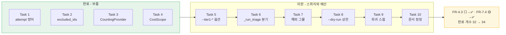

# Session Handoff

> Last updated: 2026-08-26 (KST)
> Branch: **`feat/tier1-cli`** — `main`에 아직 안 올라갔다. 커밋 수는 매 커밋마다
> 자신을 포함하지 못해 여기 적은 숫자가 항상 낡는다 —
> `git rev-list --count main..HEAD`로 직접 센다(이 문서를 쓴 시점 **19**).
> **WP8b는 미완이다.** 태스크 10개 중 4개를 마쳤고 **`--tier1-*` 옵션은 아직 하나도 없다.**
> 진척은 [WBS](docs/WBS.md), FR 번호의 출처는 [요구사항정의서](docs/요구사항정의서.md)다

## Current Status

**세션이 태스크 중간에서 끝났다.** 직전 세션들과 달리 이 문서는 완료된 작업이 아니라
**진행 중인 작업**을 넘긴다. [설계 스펙](docs/superpowers/specs/2026-08-25-tier1-cli-design.md)(D1~D14)과
[구현 계획](docs/superpowers/plans/2026-08-25-tier1-cli.md)(태스크 10개)이 커밋돼 있고,
그중 Task 1~4가 닫혔다.

| Task | 무엇 | 상태 | 커밋 |
| --- | --- | --- | --- |
| 1 | `CacheRequest.attempt` 도메인 방어 (D11) | ✅ | `9e083d7` `5d6c2a7` |
| 2 | `triage_with_tier1`의 수집·융합 입력 분리 (D5·D12) | ✅ | `27b8dfb` `b7a8238` `055f4b4` `059a3d6` |
| 3 | `CountingProvider` — 실제 나간 호출의 토큰 계측 (D6·D7) | ✅ | `d6991f3` `d615dd7` `5616776` |
| 4 | `TriageOutcome.cost_includes` (D8 · 이월 5번) | ✅ | `ef15822` `1f0c9b5` `8bacd68` |
| **5** | **CLI 옵션 4종과 조합 검증 (D1~D4·D9)** | **다음 착수 지점** | — |
| 6 | `_run_triage`의 Tier 1 분기 배선 | ⬜ | — |
| 7 | 프로바이더 예외 그물 (D14) | ⬜ | — |
| 8 | `--dry-run`의 Tier 1 상한 보고 (D10) | ⬜ | — |
| 9 | 회귀 스윕 — 게이트가 브랜치 HEAD에서도 죽이는지 확인 | ⬜ | — |
| 10 | 문서 정정 (FR-4.3·FR-7.4 → ✅, 개수 32 → 34) | ⬜ | — |



### 가장 오해하기 쉬운 자리 — **Tier 1은 아직 켤 수 없다**

부품은 다 만들었고 **스위치가 없다.** 실측이다.

```console
$ grep -rn "tier1-max-ratio\|_TIER1_COST_LIMIT" src/
(출력 없음)
```

`src/cuesift/cli.py`에서 `tier1`은 **주석 한 줄**(`:1638`)에만 나온다 — Task 4의 구현자가
Task 6이 할 일을 그 자리에 적어 둔 것이다. 커밋 19개와 3,799줄 추가를 보고 "Tier 1이
돌아간다"고 읽으면 안 된다. **돌아가는 것은 Tier 0뿐이고, `cost.includes`는 여전히
`["translation"]`이다.**

## 이번 세션이 한 일

### 부품 넷을 만들었다

| Task | 형태 | 이 부품이 없으면 무엇이 깨지나 |
| --- | --- | --- |
| 1 | `CacheRequest.attempt`가 `None`·`bool`·음수를 거부 | `attempt=None`이면 `key(None) == key(0)`이라 N회 샘플링이 **한 캐시 키로 뭉친다.** `len(samples)<2 → None` 가드를 우회해 "판정 불가"가 **"판정했고 안전"으로 조용히 둔갑**한다 |
| 2 | `triage_with_tier1(..., excluded_ids: Collection[str] = ())` | 번역 실패분에 유료 Tier 1을 태운다. 직전 세션 실물에서 10개 중 9개가 번역 실패였다 |
| 3 | `CountingProvider`(`CachingProvider` **안쪽**) | 캐시 히트는 토큰을 안 쓰는데 바깥에 두면 세어진다. 안쪽에 둬야 "실제 나간 호출"만 센다 |
| 4 | `resolve_cost_scope()` → `CostScope(usage, includes, unreported)` | 계층 하나가 무음이면 합계가 그것을 숨긴다. 아래 참조 |

### Task 4가 이번 세션의 실질이다 — **1토큰이 999회를 가린다**

리뷰 축2가 실측으로 잡은 것이다.

```python
TokenUsage(prompt_tokens=1, completion_tokens=0, calls=1000)
cost_includes = ("translation", "tier1")
# -> tokens_reported == True
```

**번역이 1토큰만 보고해도 Tier 1의 999회 무음 호출이 "계측됨"으로 나간다.** Q3가 경고한
구성("번역 = 상용 API / Tier 1 = 로컬 Ollama")이 정확히 여기 걸린다. `TriageOutcome`에
`usage` 슬롯이 **하나**뿐이라 Task 6이 `+`로 합치는 순간 복원 불가고, 원천에서는 나뉘어
있다(`CountingProvider.usage` vs `translated.usage`) — **그래서 스키마 결정이 배선보다
먼저 와야 했다.**

해법은 `cost_unreported` 필드와 라이브러리 함수다.

| 입력 | 뜻 | 처리 |
| --- | --- | --- |
| `None` | 그 계층이 **안 돌았다** | 범위·합계에서 제외 |
| `TokenUsage(0, 0, calls=N)` | **돌았는데 무음** | `unreported`에 실린다 |
| 전량 `None` | 아무 계층도 안 돌았다 | `ValueError` |

`CostScope`를 3-튜플이 아니라 frozen 데이터클래스로 둔 이유는 **`includes`와 `unreported`가
같은 타입이라 위치가 뒤바뀌어도 타입 검사에 안 걸리기 때문**이다. 이 저장소에는 mypy가
없어서 필드 이름이 유일한 방어다.

목적은 값 하나를 고치는 것이 아니라 **"합친 뒤 한 키로 부르기"를 부자연스럽게 만드는
것**이었다. 구현자의 답이 그 판정 기준이다 — *"그 경로는 이제 `scope.usage`를 일부러
버려야 성립한다."*

### 착수 전 정리 목록 4건 — **3건이 닫혔고 1건은 설계로 가뒀다**

직전 세션이 승계한 목록이다.

| 항목 | 지금 상태 |
| --- | --- |
| **`CacheRequest.attempt` 검증 부재** | ✅ Task 1이 닫았다 |
| **Tier 1 토큰 미집계** | ✅ 통로가 뚫렸다(Task 3·4). **다만 배선은 Task 6이다** — 지금 켜도 `cost`에 `"tier1"`이 안 실린다 |
| **`samples` 상한 부재** | 🟡 **설계로만 닫혔다.** `_TIER1_COST_LIMIT = 0.3` · `samples × max_ratio ≤ 0.3` 게이트가 Task 5의 산출물이고 아직 코드에 없다 |
| **배치 무력화로 호출 10배** | 🟡 **고치지 않고 기본값으로 가뒀다.** 사용자 결정이다 — 세그먼트 단위 `Tier1Collector`를 유지하고 `--tier1-max-ratio` 기본값 `0.05`로 비용을 묶는다. 근거: 배수 = `30 × max_ratio`이고 §4가 "3배는 감당 불가"라 했으므로 `0.10`은 **정확히 한도에 걸린다**(`30 × 0.10 = 3.0`). `0.05`면 `1.5`다 |

**뒤의 둘은 "해결"이 아니라 "판정"이다.** 다시 열려면 판정 근거를 반박해야 한다.

## 다음 사람이 반드시 알아야 할 것

### ① Task 5는 **초록 게이트가 거짓말을 할 수 있는** 구조다

계획서 Task 5의 테스트 코드가 **이 결함을 그대로 갖고 있다.** 브리프에 실어 넘겨야 한다.

`cli.py:476`의 `translate` 입력 인자는 `exists=True`다. typer의 파일 검증은 **함수 본문보다
먼저** 돌고 조합 검증과 **똑같이 exit 2**를 낸다. 계획서 헬퍼가 존재하지 않는 `"샘플.srt"`를
쓰므로, 검증 코드에 도달조차 못 한 채 종료 코드만 맞는다.

**7개가 균일하게 속는 것이 아니다.**

| 테스트 | 단언 | R3에 속나 |
| --- | --- | --- |
| `tier1_없이_tier1_옵션` · `review_threshold_충돌` · `트리아지_정책_요구` · `비용_한도_초과` | 종료 코드 **+ 메시지 문자열** | ❌ 잡힌다 |
| **`max_ratio_0_거부`** · **`temperature_0_거부`** | **종료 코드만** | ✅ **거짓 초록** |
| `기본값_조합은_한도_안이다` | CLI 호출 없음 | — |

**메시지 문자열을 단언한 넷은 스스로를 지킨다.** 무방비는 둘이다. 고칠 것은
`tmp_path`에 실제 `.srt`를 쓰는 픽스처와, 그 둘에 오류 메시지 단언을 붙이는 것이다.

이것이 이 저장소 규율의 정확한 사례다 — **"통과했나"가 아니라 "무엇을 대상으로 통과했나".**

### ② Task 6은 세 가지를 함께 들고 가야 한다

원장에 적혀 있으나 원장은 gitignore 안이므로 여기 옮긴다.

| # | 무엇 | 왜 |
| --- | --- | --- |
| a | **배선 게이트가 필요하다** | `CachingProvider(CountingProvider(raw))` 순서가 뒤집혀도 아무 테스트가 안 죽는다. 스택을 `isinstance`로 단언하거나, 같은 자막을 CLI 수준에서 두 번 돌려 **보고 토큰이 두 배가 되지 않는지** 단언한다 |
| b | **`CachingProvider`는 `cache_identity`를 위임하지 않는다** | 의도적이다(Ruling R40) — identity는 생성자 인자이고, 유도하면 이중 래핑이 조용히 켜진다. 부재를 `not hasattr` 테스트가 잠갔다. **identity는 raw 프로바이더에서 먼저 꺼내라** |
| c | **cost 조립은 매핑 한 줄이다** | Task 4 구현자가 범위를 한 걸음 넘어 `_run_triage` 생성부까지 배선했다. `resolve_cost_scope({"translation": ..., "tier1": ...})`에 키 하나를 더하는 것이 전부다. 계획서 본문은 `2560dea`로 이미 정정했다 |

### ③ 계획서는 **네 번 낡았다** — 태스크가 끝날 때마다 후속 인터페이스를 다시 읽어라

| # | 무엇이 낡았나 | 원인 |
| --- | --- | --- |
| 1 | `tests/test_translate_provider.py`를 "신설"로 기재 | 처음부터 틀림 |
| 2 | em dash 제약이 실제 규약보다 넓음 | 처음부터 틀림 |
| 3 | Task 6이 `cost_unreported`를 안 넘김 | **리뷰가 스키마를 바꿈** |
| 4 | Task 6이 튜플을 손으로 조립 | **리뷰가 형태를 폐기** |

**뒤의 둘은 계획의 결함이 아니라 계획의 수명이다.** 앞의 둘과 성격이 다르다 —
자기 점검으로 잡을 수 있는 것이 아니고, **실행이 사실을 바꿨으므로 실행 후에 다시 읽는
것 말고 방법이 없다.**

1번은 실제 피해를 냈다. 구현자의 `Write`가 기존 FR-2.5·FR-2.6 테스트 **28개를 지웠고**,
새 테스트 6개는 **전부 통과**했다. **총계(1175 → 1153)만이 유일한 단서였다.**

### ④ em dash(U+2014) 금지는 **출력 문자열 한정**이다

`cli.py`의 주석에 39개가 정당하게 있다. 게이트는
`tests/test_cli.py::test_help_output_has_no_em_dash`와 cp949 인코딩 테스트 둘이고, 도움말과
경고·요약 문자열만 본다. **과잉 제약의 비용은 수고가 아니라 제약 블록 전체의 신뢰다** —
한 줄이 틀린 것을 발견한 에이전트는 나머지도 의심한다.

### ⑤ 리뷰 원장은 **git 밖에 있다**

`.superpowers/sdd/2026-08-25-tier1-cli/progress.md`에 Ruling R1~R58과 태스크별 게이트 수치가
있으나 `.superpowers/sdd/.gitignore`(`*`)로 완전히 빠져 있다. **`git clean -fdx`가 지운다.**
이 문서와 커밋 메시지가 유일한 영구 기록이다.

### ⑥ 승계 항목 — 이 브랜치가 건드리지 않았다

| 항목 | 상태 |
| --- | --- |
| **Q4**(자가일관성 유사도 측정 수단) | 여전히 열려 있다. 문자 단위 유사도는 **형태**를 재고 **의미**는 못 잰다(실측 7쌍이 negation 0.727~0.930 / paraphrase 0.759~0.800으로 **범위가 겹친다**). 판정은 벤치마크에 Tier 1을 태우는 별도 작업의 몫 |
| **FR-4.2**(역번역) | 구현 안 함. 문자 단위 유사도로는 `llm.retranslation_gap`이 **역방향으로 작동**한다 |
| **`engine.py::_run_single`의 전역 index** | 확인됐고 안 고쳤다. `main`에도 들어가 있어 **이 브랜치 책임이 아니다.** 약한 로컬 모델에서 개별 폴백이 `index=0`을 뺀 전부에서 실패한다 — 폴백은 약한 모델용 안전망인데 바로 그 조건에서 무력하다. WP7 계열의 별도 작업 |

## In Progress / Pending

| WP | 상태 | 근거 |
| --- | --- | --- |
| **WP7 (7a+7b)** | ✅ 완료 | FR-2.1~2.8 전부 닫힘 |
| **WP8a (Tier 1 라이브러리)** | ✅ 완료 | FR-4.1 닫힘 |
| **WP6 중 FR-6.3 CLI** | ✅ 완료 | FR-6.3은 여전히 🟡 — "상위 K개"가 남는다 |
| **WP5 중 FR-7.2 `review.json`** | ✅ 완료 | FR-6.4도 함께 닫혔다 |
| **WP8b (Tier 1 CLI 배선)** | **진행 중 — Task 5부터** | 닫으면 **FR-4.3과 FR-7.4가 함께 닫힌다.** 완료 개수 32 → 34 |
| WP5 나머지 (FR-7.3) | 2순위 | `report.html`. **렌더러 하나다** — `TriageOutcome`을 HTML로 그리면 되고 `spans[].side`가 이미 실려 있다 |
| WP6 나머지 (FR-8.3~8.5) | 3순위 | `transcribe` 배선·`cuesift.yaml` 로더·진행 표시 |
| WP9 STT | 4순위 | FR-1.3이 "자막 우선"이라 마지막이어도 S1이 성립 |

### 직전 브랜치 리뷰가 이월한 것 — **판정과 함께 승계한다**

"아직 안 봤다"가 아니라 **"보고 판단했다"** 이므로, 다시 열려면 판정 근거를 먼저 반박해야 한다.
이번 브랜치가 **5번을 닫았다** — `_COST_INCLUDES` 고정 문자열이 `resolve_cost_scope`로
실제 집계 범위와 연동됐다.

| # | 무엇 | 판정과 근거 |
| --- | --- | --- |
| 1 | **AST 기반 CI 게이트** — `_format_triage_summary`의 산식 재도입을 막는 수단이 CI에 없고 6형태 중 3형태를 우회 | **별도 작업.** 오늘 잡을 것이 0이다(그 셋은 **등가 변이** — `triaged_segments`가 문자 그대로 `return len(self.risks)`). 프로퍼티 정의가 바뀌는 날 사각이 실재가 된다 |
| 2 | **`cli.py` 크기** | **이 브랜치 책임이 아니다.** 분할한다면 별도 작업 |
| 3 | `_dry_run_report` 파라미터 13개 | 전부 keyword-only이고 같은 파일의 `_translate_one`·`translate`가 각각 15개다. 2번과 함께 움직인다 |
| 4 | `segments[].reasons`의 **순서** 미검증(`reversed` 변이 생존) | NFR-3 재현성 문제. `signal_hits` 순서는 닫혔고 이쪽은 열려 있다 |
| ~~5~~ | ~~`_COST_INCLUDES`가 실제 집계 범위와 연동되지 않는다~~ | **✅ 이번 브랜치 Task 4가 닫았다** |
| 6 | `TriageOutcome.__post_init__`의 집합 등호 한 방향만 고정 | **중복 id·str 오입력은 Task 4가 닫았다.** 등호 방향은 남아 있다 |
| 7 | branch coverage 부재 | `--cov-branch`를 켜 본 결과 TOTAL 99% 그대로 |
| 8 | 66 오류 메시지에 내부 임시 파일 이름이 샌다 | 머리에 올바른 경로가 있어 오독 위험 낮음. 게이트 없음 |
| 9 | `write_subtitle`의 `format_=result.format` 의존 | 오늘 도달 경로 0 |
| 10 | 픽스처에서 `hard(1) + excluded(2) == selected(3)`가 우연히 성립 | 그 조합을 겨눈 변이를 **스위트는 잡는다**(기함 게이트만 못 잡는다) |

## Key Decisions Made (이번 세션)

| 결정 | 근거 |
| --- | --- |
| **Tier 1은 기본 꺼짐(opt-in)이다** | **Q4가 아직 열려 있다.** 검증 안 된 신호를 기본 경로에 넣으면 Recall@Budget이 오염되고, 그 지표가 이 프로젝트의 유일한 증명 자료다 |
| **배치 프로토콜을 바꾸지 않고 기본값으로 가둔다** | 프로토콜 변경은 설계 변경이라 WP8b의 범위를 넘는다. `--tier1-max-ratio` 기본 `0.05`가 배수를 `1.5`로 묶는다 |
| **`triage_with_tier1`에 `excluded_ids`를 추가**(호출부 필터링 아님) | 필터링을 호출부에 두면 **다음 호출부가 잊는다.** 라이브러리가 계약을 들고 있어야 한다 |
| **`_diagnose_empty_candidates`의 기본 인자를 없앴다** | P12 판례. 기본값이 있으면 인자를 빠뜨린 호출이 **같은 반환 형태로** 조용히 오진한다. `TypeError`가 낫다 |
| **`CountingProvider`는 명시 위임, `__getattr__` 금지** | `__getattr__`은 `__deepcopy__`·`__getstate__` 프로브를 새게 하고 **오타를 `inner`에서 해소해** 원래 결함을 재현한다 — 호출부가 `getattr(..., None)`으로 읽기 때문 |
| **`CachingProvider`는 `cache_identity`를 위임하지 않는다** | identity는 생성자 인자다. 유도하면 이중 래핑이 조용히 켜진다. **부재를 테스트가 잠갔다** |
| **어휘 검증을 `__post_init__`이 아니라 모듈 로드 시점에 뒀다** | `__post_init__`은 **실제로 쓰인 계층만** 본다. 등록된 오타가 통과한다. 실제로 §8.4를 갱신하기 전 문서 게이트가 먼저 실패했다 |
| **`usage=None`은 `False`로 판정한다** | **"모른다"를 "믿을 수 있다"로 보고하는 것은 방향이 틀렸다.** 소음 우려는 실측으로 닫았다 — 생성 경로가 한 곳이고 `TranslationResult.usage`는 non-Optional이다 |
| **`_format_triage_summary`의 cost 미출력을 범위 밖이라 한 내 판정을 철회했다** | 축2가 보인 것은 그 누락이 화면 경고 수정을 **정확히 부분 열화 시나리오에서 무용지물로 만든다**는 것이었다. `review.json`은 `--review-out`이 있어야 생기므로 기본 경로 사용자는 전원 무보호다 |

## 게이트 실행 기록

**이 세션이 브랜치 HEAD(`2cff529`, 작업트리 clean)에서 직접 돌린 값이다.**

| 게이트 | 수치 |
| --- | --- |
| `ruff check .` | All checks passed |
| `ruff format --check .` | **96 files** already formatted |
| `pytest --cov=cuesift --cov-report=term-missing` | **1223 passed, 3 deselected** · 커버리지 **99%**(1947문 중 23 미실행) |
| — 이번 브랜치 신규·수정 | `report/models.py` **100%** · `translate/provider.py` **100%** · `store/provider.py` **100%** |
| `python scripts/check_links.py` | 마크다운 **31개** 파일 · 상대 링크 **151개** · 깨진 링크 0 |
| `npx markdownlint-cli2` | Linting: **31 files** · 0 issues |

**두 문서 게이트의 파일 수가 일치하는지 확인한다** — 갈라지면 추적 안 된 문서가 있다는
뜻이다. 링크 체커는 `git ls-files` 기준이므로 **새 파일은 `git add` 후에야 세어진다.**

**로컬 venv는 3.14이고 CI는 3.11·3.12다.** 로컬 통과가 CI 통과를 보장하지 않는다 —
전례가 있어 `main`에 직접 푸시하지 않고 PR을 경유한다.

**이 브랜치는 아직 CI를 한 번도 안 거쳤고, 푸시해도 안 돈다.**
`.github/workflows/ci.yml`의 트리거는 `push: branches: [main]` · `pull_request:` ·
`workflow_dispatch:`다 — **기능 브랜치 푸시는 어느 것도 건드리지 않는다.**
CI를 돌리려면 PR을 열거나(`gh pr create --base main --draft`) `workflow_dispatch`로
이 ref를 지정해야 한다.

**이것이 "푸시했으니 검증됐다"는 착각의 자리다.** 로컬은 3.14이고 CI는 3.11·3.12라
로컬 통과는 서로 다른 버전에서의 통과를 보장하지 않는다. 이 저장소가 PR을 경유하는
이유가 정확히 이것인데(CLAUDE.md "PR 절차"), **PR을 안 열면 그 게이트가 아예 없다.**

### 사고 기록 — 커밋 전에 게이트를 안 돌렸다

계획서 커밋(`2560dea`) 후 링크 체커가 깨진 링크 1건을 냈다. 폐기된 절에 남은 `]`와 `(`가
인접해 마크다운 링크로 파싱된 것이다. `2cff529`로 고쳤고 0 broken을 재측정했다.
**개수를 읽는 습관이 잡았다** — `0 broken`만 봤으면 넘어갔다.

### 변이 테스트에서 배운 것 두 가지

**① 되돌리기가 미커밋 편집을 지운다.** `git checkout -- <file>`은 HEAD로 복원하므로 같은
파일의 미커밋 작업이 함께 사라진다. 실제로 발생했다. → **변이 실험은 먼저 커밋한 뒤에 한다.**

**② 생존이 항상 테스트 부실은 아니다.** Task 4의 변이 N7이 처음에 안 죽었는데, 구현자가
**게이트가 아니라 변이가 틀렸다**고 판정했다 — 마커를 `## 9.` 헤딩 **앞**에 넣으면 여전히
§8.4 슬라이스 안이다. 헤딩 뒤로 옮기니 즉사했다.

**③ 리뷰어끼리도 서로의 트리를 움직인다.** 축1(변이 주입)과 축2(읽기)를 같은 트리에서
병렬로 돌렸더니 축2가 축1의 변이 diff를 목격하고 재현 불가한 결과를 냈다. 스스로 눈치채고
clean 커밋에서 재측정해 살았다. → **변이를 돌리는 리뷰어는 병렬 대열에 넣지 않거나,
`git worktree`로 자기 사본을 뜨게 한다**(`cp -r src tests`만으로는 `conftest.py`가 요구하는
리포 루트 `pyproject.toml`이 없어 19 errors가 난다).

## 개발 환경 메모 (승계)

Ollama는 트레이 앱 겸 백그라운드 서비스로 자동 기동해 `127.0.0.1:11434`를 듣는다 —
`ollama serve`를 따로 칠 필요가 없다. PATH에 없으면
`$env:LOCALAPPDATA\Programs\Ollama\ollama.exe`를 직접 부른다.

| 모델 | 크기 | 용도 |
| --- | --- | --- |
| `qwen2.5:3b` | 1.9GB | **번역·Tier 1 신호용.** 단일 세그먼트 호출의 index 버그(위 ⑥)가 이 모델에서도 재현된다 — "3b는 신뢰 가능"이 무조건은 아니다 |
| `qwen2.5:1.5b` | 986MB | 폴백 관찰용. 번역기로는 못 쓴다(실측 5/15) |

live 실행 명령:

```powershell
$env:CUESIFT_LIVE_BASE_URL="http://localhost:11434/v1"
$env:CUESIFT_LIVE_MODEL="qwen2.5:3b"
.venv/Scripts/python.exe -m pytest -m live -v -s
```

## 다음 세션 시작 절차

```bash
git checkout feat/tier1-cli && git pull
cat .superpowers/sdd/2026-08-25-tier1-cli/progress.md | tail -40   # 없으면 이 문서가 원장이다
```

`superpowers:subagent-driven-development`를 다시 띄우고 Task 5부터 재개한다.
브리프 추출은 다음과 같다.

```bash
scripts/task-brief docs/superpowers/plans/2026-08-25-tier1-cli.md 5
```

**브리프에 위 ①을 그대로 실어라.** 계획서의 Task 5 테스트 코드가 결함을 갖고 있으므로,
브리프만 읽는 구현자는 거짓 초록 둘을 그대로 만든다.
