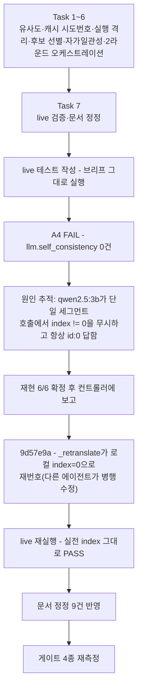

# Session Handoff

> Last updated: 2026-08-17 (KST)
> Branch: **`feat/tier1-signals`** — 커밋 22개(`git rev-list --count 48f9133..HEAD` = 22, 실측), `main`에 아직 안 올라갔다.
> **WP8a(Tier 1 신호 라이브러리 계층)가 이 세션으로 닫혔다** — `llm.self_consistency`가
> 실제 로컬 엔드포인트(Ollama `qwen2.5:3b`)에서 신호를 낸다. WP8b(CLI 배선)는 남았다.
> 진척은 [WBS](docs/WBS.md), FR 번호의 출처는 [요구사항정의서](docs/요구사항정의서.md)다

## Current Status

**[설계 스펙](docs/superpowers/specs/2026-08-17-tier1-signals-design.md)과
[구현 계획](docs/superpowers/plans/2026-08-17-tier1-signals.md)의 태스크 7개(문자 단위 유사도 →
캐시 시도 번호 → Tier 1 실행 격리 → 후보 선별 → 자가일관성 신호 → 2라운드 오케스트레이션 →
live 검증·문서 정정)를 전부 마쳤다.** 브리프·리뷰 기록은
`.superpowers/sdd/2026-08-17-tier1-signals/`에 있지만 **이 경로는
`.superpowers/sdd/.gitignore`(`*`)로 git에서 완전히 빠져 있다** — WP7b 세션이 이미 확인한
대로 링크로 걸면 로컬에서는 열려도 GitHub에서는 404이므로 코드 스팬으로만 남긴다.

| | WP7b 종료 시점 | 이번 세션 (WP8a + Task 7) |
| --- | --- | --- |
| 테스트 | 978 passed, 2 deselected | **1049 passed, 3 deselected** (live 테스트 1건 추가) |
| v0.1 FR 완료 | 31/42 (74%) | **32/42 (76%)** — FR-4.1(자가일관성)이 이번에 닫혔다. FR-4.3은 라이브러리 파라미터로만 존재해 WP8b(CLI 배선) 전에는 세지 않는다(FR-5.3이 같은 함정에 걸렸던 전례) |
| live 검증 | `translate` 서브프로세스 재개만 확인 | **`llm.self_consistency`가 실제 엔드포인트에서 신호를 낸다**(설계 §11 A4) |
| Q4(자가일관성 유사도 측정 수단) | 정량 근거만 있고 Tier 1 미구현 | **여전히 열림** — 문자 단위 유사도가 negation·paraphrase를 형태만으로 분리 못한다는 실측(7쌍) 추가, 판정은 벤치마크의 몫 |



## 이번 세션이 한 일

### ① Tier 1 신호 라이브러리 계층 (Task 1~6, 다른 세션이 구현·리뷰까지 마침)

| 모듈 | 무엇을 |
| --- | --- |
| `signals/similarity.py` | 문자 단위 유사도(`difflib.SequenceMatcher` + NFKC). §3.2 실측 7쌍이 회귀 테스트다 |
| `store/cache.py`·`store/provider.py` | `CacheRequest.attempt` — 자가일관성 N회 호출을 캐시 키에서 가르되 `attempt=0`은 키에서 생략해 기존 캐시가 바이트 단위로 유효하다 |
| `signals/base.py` | Tier 0/Tier 1 실행 경로 완전 분리 — `collect_all()`은 tier 0만, `collect_tier1()`은 후보만 |
| `triage/policy.py` | `select_tier1_candidates` — 예산 컷라인 **아래** 회색지대에서만 고른다(hard fail·이미 선별된 것 제외), 분모는 전체, 내림(`floor`) |
| `signals/llm.py` | `SelfConsistency`(`llm.self_consistency`, FR-4.1) — N회 재번역의 상호 유사도. 길이 편향을 독스트링에 실측으로 기록(완화는 안 함) |
| `tier1.py` | `triage_with_tier1()` — 2라운드(Tier 0 → 예산 → Tier 1 후보 → 재융합 → 예산 재적용) 오케스트레이션. `warn`이 기본값 없는 필수 키워드 인자다(Tier 1 미실행과 정상 실행이 반환값 형태로 구분 안 되기 때문) |

CHANGELOG에 상세를 실었다(WP8a 항목) — 여기서는 중복하지 않는다.

### ② live 검증이 신규 결함을 찾았고, 같은 브랜치에서 바로 고쳐졌다 (Task 7)

브리프의 live 테스트(세그먼트 2건, `s1.index=1`)를 그대로 돌리자 `llm.self_consistency`가
**0건**으로 A4가 실패했다. 추적 결과 — `qwen2.5:3b`는 세그먼트 하나만 보내는 호출에서
`index != 0`이면 프롬프트의 `[N]` 마커를 무시하고 **항상 `id: 0`**을 답해
`parse_translations`가 거부한다(실측: 서로 다른 문장·인덱스 2조 각 3회 = **6/6 재현**,
같은 세그먼트를 `index=0`으로만 바꾸면 3/3 성공). 시스템 프롬프트 예시가
`{"id": 0, ...}`라는 리터럴 0을 보여 주는데, 항목이 하나뿐이면 모델이 구분할 필요 없이
그 0을 그대로 베끼는 것으로 보인다.

**왜 심각했는가**: `loader.py`가 `id = f"{index:05d}"`로 매기므로 실제 트랙에서는 id와
index가 함께 간다. `select_tier1_candidates`의 동점 처리는 작은 id를 먼저 큐에 담고
남은 것을 회색지대(=Tier 1 후보)로 돌리므로, **실전에서 Tier 1 후보가 index=0을 가질 일은
거의 없다** — 고치지 않았다면 `llm.self_consistency`가 로컬 모델에서는 실전 데이터
대부분에서 조용히 `None`이 될 뻔했다(Q3 무음 열화, Tier 1 투자 전제를 흔드는 수준).
**재리뷰가 가짜 프로바이더(`AlwaysZeroProvider`)로 재현하며 부수 소득을 얻었다** — 수정
전에는 시도당 호출이 **2회**였다(배치 호출이 실패하면 `_fallback_individually` →
`_run_single`로 폴백하는데 그쪽도 같은 이유로 실패하기 때문). 즉 수정 전에는 신호가
조용히 사라질 뿐 아니라 **Tier 1 비용이 2배로 나가면서 산출은 0**이었다 — 침묵과
낭비가 동시에 났다는 뜻이다.

**이 결함은 이번 세션에 발견됐고, 이번 세션에 고쳐졌다 — 지금은 닫힌 항목이다.**
`src/` 파일이라 **이 태스크(Task 7)의 쓰기 권한 밖**이었으므로 컨트롤러에게 실측 근거와
함께 보고했고, 같은 브랜치에서 `_retranslate`가 세그먼트를 로컬 `index=0`으로 재번호해
보내고 결과는 `segment.id`로 매칭하는 방식(원본 index는 다시 참조하지 않는다)으로
닫혔다(`9d57e9a`, Ruling P13). 회귀 게이트는 두 겹이다 — `test_전역_index_대신_로컬_0으로_보낸다`
(`EchoProvider`, **메커니즘**: 프롬프트에 실제로 `[0]`이 실리는가)와
`test_증상_게이트_index가_0이_아니어도_AlwaysZeroProvider에서_신호가_난다`
(`tests/fakes/provider.py`의 `AlwaysZeroProvider`, **증상**: 재번호가 빠지면
`collect_tier1`이 `None`을 반환하는가) — 후자는 되돌려서 실제로 죽는 것까지 확인했다.
재리뷰 ADDRESSED — 정상 입력 6건에서 프롬프트의 `[N]` 마커 말고는 아무것도 안 달라지고
결함 시나리오에서는 `None` → 신호로 뒤집히는 것을 확인했다. **live 테스트는 우회 없이
실전 index(`s0=0, s1=1`) 그대로 재실행해 PASS를 확인했다** — 아래 게이트 기록 참고.
상세·재현 절차는 `signals/llm.py`의 `_retranslate` 독스트링이 단일 출처다(중복 서술하면
갈라진다).

**다음 사람이 조심할 부류**: "약한/로컬 모델은 프롬프트의 명시적 지시보다 **예시의 리터럴
값**을 베끼는 경향이 있다 — 특히 항목이 하나뿐이라 값을 구분할 필요가 없을 때." 이 결함은
Tier 1(`_retranslate`)에서는 닫혔지만, 아래 ④(`_run_single`)에서 **같은 클래스가 실제로도
재현됐다** — 다른 리터럴 예시를 쓰는 자리에도 있을 수 있다는 뜻이다.

### ③ 문서 정정 9건 (설계 스펙 §12)

| 문서 | 무엇을 |
| --- | --- |
| 요구사항정의서 §4 | 도식 "Tier 0 → 의심 후보" 아래 각주 — 실제는 **컷라인 아래 회색지대**(§3.1 벤치마크가 §4 도식보다 늦게 실측됐다) |
| 요구사항정의서 §5.4 | 상태 열 추가 — FR-4.1 ✅, FR-4.2 ⬜ 보류, FR-4.3 🟡(라이브러리만) |
| 요구사항정의서 §12 Q4 | §3.2 실측 7쌍(negation 0.727~0.930 · paraphrase 0.759~0.800, 범위가 겹친다) + 길이 편향 발견 추가. **Q4는 계속 열림**을 명시 |
| WBS | WP8 → 8a(✅)/8b(⬜) 분할, 의존 그래프·다음 작업 순서 갱신, "Q4가 여기서 닫힌다" 문구 정정 |
| 설계 §5 | `ceil`→`floor` 정정 — **Task 4가 이미 반영** |
| 설계 §6.3 | 배치 재사용 서술 정정(세그먼트 단위 프로토콜) — **Task 5가 이미 반영** |
| 설계 §7 | 도식 ④·⑦ 인자 정정 — **Task 6이 이미 반영** |
| `HANDOFF.md` | 이 문서 — 브랜치·테스트 수치 전면 갱신 |
| `CHANGELOG.md` | WP8a Added 항목 + `risk/fuse.py` 서술 오류 정정(아래 참고) |

**CHANGELOG의 `risk/fuse.py` 서술이 두 가지로 틀려 있었다** — "가중 평균"(실제는 noisy-or,
`fuse.py:92`·`:118`이 "가중 평균 시절"이라 회고한다)과 "가중치 8종"이었다. `tier1.py`의
2라운드 설계 전체가 noisy-or의 단조성 위에 서 있고 리뷰어가 회색지대 세그먼트 점수가
0.7500 → 0.7694로 **올라** 컷라인을 넘는 것을 실측으로 확인했는데, CHANGELOG를 먼저 읽은
사람은 정반대(가중 평균)를 들었을 것이다 — Keep a Changelog의 `[Unreleased]`는 현재
상태를 서술해야 하므로 바로잡았다.

**"8종에서 10종으로"라고 고쳤더니 산수가 안 맞았다(8+1=9≠10, 최종 브랜치 리뷰 A3).**
`git show 48f9133:src/cuesift/risk/fuse.py`로 확인한 결과 그 시점 실제 가중치는
**9종**이었다 — 옛 CHANGELOG 줄이 `spec.overlap` 추가 때 갱신을 누락해 "8종"으로 이미
틀려 있었고, 이 세션이 그 틀린 시작값을 괄호 안으로 그대로 옮겨 담았다. 지금은 "옛
CHANGELOG가 8종이라 적었으나 그 시점 실제는 9종이었고, WP8a가 `llm.self_consistency`를
더해 지금은 **10종**"으로 두 오류(옛 CHANGELOG의 오기·이번 서술의 산수)를 구분해 적었다.

## 다음 사람이 반드시 알아야 할 것

### 🔴 즉시 해야 할 것 — PR을 만들어야 CI가 돈다

**이번 세션은 커밋까지만 한다 — 푸시·PR 생성은 하지 않는다** (팀 리드가 직접 한다).

```bash
git push -u origin feat/tier1-signals
gh pr create --base main
gh pr checks --watch     # test 3.11 · test 3.12 · docs
gh pr merge --squash
```

**로컬 venv는 3.14이고 CI는 3.11·3.12다.** 로컬 게이트가 통과했다고 CI 통과가
보장되지 않는다 — 실제로 WP7b 세션에서 이 브랜치의 35커밋이 CI를 한 번도 안 거치고
쌓였다가 원격 병합 시 rich 렌더링 차이로 실패한 전례가 있다(CHANGELOG "테스트 5건이
`rich`의 렌더링에 의존해 Linux CI에서만 실패했다" 항목).

### ① WP8b 착수 전 정리해야 할 것 4건 (실측만 했다, 구현은 안 했다)

| 항목 | 실측 | 왜 지금 안 고쳤나 |
| --- | --- | --- |
| **배치 무력화로 호출 10배** (가장 중요) | 세그먼트 10개 × samples=3에서 **30회**(배치면 3회) — 호출 배수는 재현됨. **문자 수는 여기 조건 없이 적지 않는다** — `9840 + 30L`(세그먼트 단위)·`1119 + 30L`(배치), L은 원문 길이. L을 밝히지 않고 옮겨 적으면 다른 예문의 값이 "재현 실패"로 보인다(이 세션이 실제로 그렇게 세 라운드를 썼다, 최종 브랜치 리뷰). 조건이 붙은 정확한 값은 `signals/llm.py`의 `_retranslate` 독스트링이 단일 출처 | 설계 §4.1의 세그먼트 단위 프로토콜(`collect_tier1(seg, ctx)`)이 원인. 프로토콜 변경은 Task 2·6을 함께 건드리는 설계 변경이고 WP8a는 라이브러리 계층까지가 범위다. **CLI를 배선하는 사람이 이것을 모르면 실제 트랙에서 10배 비용이 그대로 난다.** **결론까지 적는다**(최종 브랜치 리뷰 A5) — 기준선(배치 10) 대비 배수는 `30 × max_ratio`이고, 이 저장소의 표준 예산(10%)과 대칭인 `max_ratio=0.10`을 그대로 기본값으로 고르면 요구사항정의서 §4가 "3배는 감당 불가"라 한 한도에 **정확히 걸린다**(`30 × 0.10 = 3.0`). 실효 절감을 얻으려면 `≤ 0.05`가 필요하다 |
| **Tier 1 토큰 사용량 미집계** | `collect_tier1`이 `TranslationResult.usage`를 올려 보낼 통로가 없다. 실측(n=1000, `max_ratio=0.10`): Tier 1이 번역 패스보다 프롬프트 문자를 **1.6배** 더 쓰는데 그중 한 글자도 리포트에 안 잡힌다(최종 브랜치 리뷰 A6) | NFR-2·FR-7.4의 비용 숫자에서 **가장 비싼 계층만 빠진다.** 누적은 리포트 계층(WP5 나머지·WP8b)의 일. **위 항목과 곱해진다** — 배치 무력화가 비용을 키우고 이 미집계가 그것을 숨기므로, `--dry-run` 추정치는 Tier 1을 켠 실행에서 구조적으로 과소 보고된다 |
| **`samples` 상한 부재** | 100 × 2종 × samples=10⁶ → 2억 회가 거부 없이 통과한다 | 상한은 값이 입력되는 자리(CLI `--tier1-samples`)에 **근거와 함께** 둬야 한다(§11 R8이 출처 없는 수치를 금지) |
| **`CacheRequest.attempt`에 값 검증이 없다** (최종 브랜치 리뷰 A9) | `attempt=None`이면 `key(None) == key(0)`이라 N회 호출이 한 캐시 키로 뭉친다. 실측: 정상 `attempt=i`는 호출 3회·`score=0.0286`인데 `attempt=None`은 호출 **1회**·`score=0.0000`이다 — `len(samples)<2 → None` 가드를 우회해 **"판정 불가"가 아니라 "판정했고 안전"으로 조용히 둔갑한다.** 같은 계층 `Tier1Context.__post_init__`은 `samples`의 int 여부를 명시적으로 검사하는데 `attempt`는 검증이 없고, 더 나쁘게(늦게도 안 터지고 조용히) 실패한다 | 고치는 것 자체는 WP8b의 일 — CLI가 `attempt`를 실제로 조립하는 자리이므로 검증도 거기서 붙는다 |

### ② Q4(자가일관성 유사도 측정 수단)는 여전히 열려 있다

WP8a가 방향은 좁혔다 — 문자 단위 유사도는 **형태**를 재고 **의미**는 못 잰다(§3.2 실측
7쌍이 negation·paraphrase를 분리하지 못한다). 그리고 자가일관성 자체에도 **길이 편향**이
있다(짧을수록 점수가 높다, 배수는 예문 의존적이라 en 8~12배·ja 5~7배로 흩어진다 —
`signals/llm.py`의 `SelfConsistency` 독스트링이 단일 출처). **판정은 벤치마크에 Tier 1을
태우는 별도 작업의 몫이다** — 이번 세션은 그것을 하지 않았다(설계 D8, 되돌리기 단위를
키우지 않으려는 판단).

### ③ FR-4.2(역번역)는 구현하지 않았다

착수 시점 실측(§3.2)이 문자 단위 유사도로는 `llm.retranslation_gap`이 **역방향으로
작동**함을 보였다 — 정상 변이가 오류보다 높은 점수를 받는다. 임베딩 등 다른 측정 수단이
들어오면 다시 검토한다(설계 §13).

### ④ `_run_single`(`engine.py`)에도 같은 패턴이 있다 — **확인됨** (최종 브랜치 리뷰 A7)

P13이 고친 `_retranslate`(Tier 1 전용 경로)와 별개로, **일반 번역의 개별 폴백 경로도
같은 코드 패턴을 쓴다.** `engine.py:384`의 `_run_single`이
`parse_translations(completion.text, [segment.index])`로 **원본 전역 index를 그대로**
검증에 쓴다 — Tier 1의 `_retranslate`가 고치기 전에 갖고 있던 것과 정확히 같은 모양이다.

**이 세션이 처음 적을 때는 "코드 경로만 확인, 실물 거동은 미확인"이었다 — 최종 브랜치
리뷰가 실물 Ollama로 닫았다.**

```text
index=0: 성공 3/3
index=1: 성공 0/3   index=5: 성공 0/3   index=9: 성공 0/3
원시 응답(index=5, 3/3 동일): {"translations": [{"id": 0, "text": "[5] 길이 눈으로 덮였다."}]}
```

**가설이 맞았다 — P13과 정확히 같은 형태다.** 약한 로컬 모델에서는 **일반 번역의 개별
폴백이 index=0을 뺀 전부에서 작동하지 않는다.** 폴백은 원래 약한 모델을 위한 안전망인데,
바로 그 조건(약한 모델 + 단일 항목 호출)에서 무력하다는 뜻이다. **이 결함은 이
브랜치의 것이 아니다** — `engine.py`의 이 패턴은 `48f9133`(WP7b)에 이미 있었고 지금
`main`에도 들어가 있다. WP8a는 이것을 만들지도, 고치지도 않았다 — 발견만 이번에 났다.
고치는 것은 이 세션의 범위 밖이다(WP7 계열의 별도 작업).

## In Progress / Pending

| WP | 상태 | 근거 |
| --- | --- | --- |
| **WP7 (7a+7b)** | ✅ 완료 | FR-2.1~2.8 전부 닫힘 |
| **WP8a (Tier 1 라이브러리)** | ✅ 완료 | FR-4.1 닫힘. FR-4.3은 라이브러리 파라미터만 |
| WP8b (Tier 1 CLI 배선) | 다음 1순위 | `--tier1-max-ratio`·`--tier1-samples`·`--tier1-temperature`. 착수 전 위 ① 3건을 본다 |
| WP5 나머지 (FR-7.2~7.4) | 2순위 | `review.json`·`report.html`·요약 통계. WP8b가 먼저인 이유는 WP7 때와 같다 — 리포트 스키마가 Tier 1 신호를 실으려면 CLI에서 실제로 도는 모습이 먼저 있어야 한다 |
| WP6 나머지 (FR-8.3~8.5) | 3순위 | `transcribe` 배선·`cuesift.yaml` 로더·진행 표시 |
| WP9 STT | 4순위 | FR-1.3이 "자막 우선"이라 마지막이어도 S1이 성립 |

## Key Decisions Made (이번 세션 · Task 7)

| 결정 | 근거 |
| --- | --- |
| **live 테스트는 실전 index를 그대로 쓴다 — 우회하지 않는다** | 처음엔 후보 세그먼트의 index를 0으로 바꿔 A4를 통과시키는 것도 고려했으나, 그러면 실전 조건(index != 0)에서의 회귀를 다시 놓칠 수 있었다. 발견한 결함을 src에서 고치도록 보고하는 쪽을 택했다 |
| **P13 수정은 내가 하지 않았다 — 권한 밖이었고, 실제로도 다른 에이전트가 처리했다** | Task 7의 초기 쓰기 범위는 문서와 live 테스트뿐이었다(`src/` 금지). 실측 근거를 갖춰 보고하는 것까지가 그 단계의 책임이었다 |
| **최종 리뷰 지시로 쓰기 범위가 `src/`(`signals/llm.py`·`tier1.py` 비용 절)·`tests/fakes/provider.py`·`tests/test_signals_llm.py`까지 넓어졌다** | A1(수치 조건 명시)·A4(`AlwaysZeroProvider` 실제 추가)·A5·A6(비용 결론)은 컨트롤러가 명시적으로 파일 목록에 넣은 뒤에만 손댔다 — 권한 밖에서 자체 판단으로 넓히지 않았다 |
| **CHANGELOG의 `fuse.py` 서술을 이번에 고쳤다** | `[Unreleased]` 절은 현재 상태를 서술해야 한다 — 이미 릴리스된 이력이 아니므로 Keep a Changelog 관례상 손대지 않을 이유가 없다 |
| **§5.4 FR-4.3을 ✅가 아니라 🟡로 표시했다** | 브리프는 상태 표시만 요구했지 등급까지 정하지 않았지만, FR-5.3이 "라이브러리엔 있으나 CLI에서 도달 못함"으로 한 번 이미 걸렸던 자리라 같은 함정을 반복하지 않기 위해 라이브러리-only 완료를 ✅로 세지 않았다 |
| **`assert score > 0.0`을 추가하라는 리뷰 권고를 채택하지 않았다(판정 P15)** | `temperature=1.0`은 변이를 보장하지 않는다 — 실제로 `PYTHONIOENCODING` 없이 재실행한 live 테스트에서 `score=[0.0]`이 실제로 나왔다(재번역 3개가 우연히 동일). 그 값을 실패로 처리하면 정상 케이스에서 간헐적으로 빨개진다 |

## 게이트 실행 기록

| 게이트 | 수치 |
| --- | --- |
| `ruff check .` | All checks passed |
| `ruff format --check .` | **89 files** already formatted |
| `pytest --cov=cuesift --cov-report=term-missing` | **1050 passed, 3 deselected** · 커버리지 **99%**(1655문 중 22 미실행) — 최종 리뷰가 요구한 P13 증상 게이트(`AlwaysZeroProvider`) 1건 추가 |
| `pytest -m live -v -s` (Ollama `qwen2.5:3b`) | **3 passed, 1050 deselected** in 22.6초 — `llm.self_consistency` 발화 확인(`score: [0.0]`, 크기는 단정하지 않는다 — 위 판정 P15 참고), `warn` 메시지 없음(Tier 1 정상 실행). **`PYTHONIOENCODING`을 셸에 설정하지 않고** 재실행해도 3 passed — 판정 P14 수정(`tests/test_translate_live.py`의 서브프로세스 `env`에 명시)이 셸 환경과 무관하게 동작하는 것을 확인했다 |
| `python scripts/check_links.py` | 마크다운 **25개** 파일 · 상대 링크 **112개** · 깨진 링크 0 |
| `npx markdownlint-cli2` | Linting: **25 files** · 0 issues |

**두 문서 게이트의 파일 수가 일치하는지 확인한다** — 갈라지면 추적 안 된 문서가 있다는 뜻이다.

## 개발 환경 메모 (승계)

Ollama는 트레이 앱 겸 백그라운드 서비스로 자동 기동해 `127.0.0.1:11434`를 듣는다 —
`ollama serve`를 따로 칠 필요가 없다. PATH에 없으면
`$env:LOCALAPPDATA\Programs\Ollama\ollama.exe`를 직접 부른다.

| 모델 | 크기 | 용도 |
| --- | --- | --- |
| `qwen2.5:3b` | 1.9GB | **번역·Tier 1 신호용.** 이번 세션의 live 검증 전부가 이것으로 통과했다. 단일 세그먼트 호출의 index 버그(위 ②)가 이 모델에서도 발견됐다는 점은 유의할 것 — "3b는 신뢰 가능"이라는 이전 세션의 결론이 무조건은 아니다 |
| `qwen2.5:1.5b` | 986MB | 폴백 관찰용. 번역기로는 못 쓴다(이전 세션 실측 5/15) |

live 실행 명령:

```powershell
$env:CUESIFT_LIVE_BASE_URL="http://localhost:11434/v1"
$env:CUESIFT_LIVE_MODEL="qwen2.5:3b"
.venv/Scripts/python.exe -m pytest -m live -v -s
```
