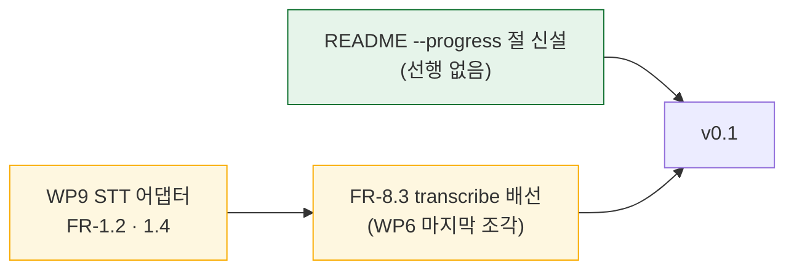

# Session Handoff

> Last updated: 2026-08-30 (KST)
> **파킹 #13(캐시가 파싱 실패 응답을 보존한다)이 PR [#17](https://github.com/withwooyong/cuesift/pull/17)로
> `main`에 머지됐다(squash, `9909ede`). 브랜치는 로컬에서 삭제됐고 작업트리는 clean이다.**
> **이번 세션은 코드를 한 줄도 바꾸지 않았다** — 직전 세션이 완성해 둔 브랜치를 푸시·PR·CI·머지로
> 내보낸 것이 전부다.
> 상태 값은 여기 적힌 숫자가 아니라 아래 "현재 상태 재는 법"의 명령으로 직접 재라.
> 진척은 [WBS](docs/WBS.md), FR 번호의 출처는 [요구사항정의서](docs/요구사항정의서.md)다

## Current Status

**작업 중인 브랜치가 없다.** `main`이 최신이고 다음 작업은 새 브랜치를 파는 것부터 시작한다.

| 단계 | 상태 | 산출물 |
| --- | --- | --- |
| 파킹 #13 구현 (직전 세션) | ✅ | 캐시 폐기 표면 · engine 배선 · 문서 정정 |
| 푸시 | ✅ | `origin/fix/cache-discard-invalid` (브랜치 잔존, `d96098c`) |
| PR 생성 | ✅ | [#17](https://github.com/withwooyong/cuesift/pull/17) |
| PR CI | ✅ | 5잡 전부 pass |
| **`main` 머지** | ✅ | squash · **`9909ede`** · 11 files changed · 1302 insertions |
| 머지 후 `main` CI | ✅ | 5잡 전부 success (push 트리거) |
| 로컬 정리 | ✅ | `main` 갱신 · 로컬 브랜치 삭제 |

FR 개수는 움직이지 않았다 — 파킹 #13은 FR-2.7(재개)의 **동작 수정**이지 새 요구의 구현이 아니다.

## 현재 상태 재는 법

```bash
git branch --show-current        # main 이어야 한다
git status --short               # clean 이어야 한다
git log --oneline -3             # 최상단이 9909ede 여야 한다
gh run list --branch main --limit 1   # 최근 main CI 결과
```

## 이번 세션이 배운 것

### ⓐ `Linting: 0 files`는 결과가 아니라 가드 명령의 에코였다

CI 로그를 `grep`으로 훑으면 `Linting: 0 files`와 `Linting: 39 files`가 **둘 다** 잡힌다.
앞의 것은 검사 결과가 아니라, 워크플로가 그 문자열을 감시하려고 적어 둔
`if grep -qE '^Linting: 0 files' lint.log` 명령 자체가 로그에 에코된 것이다.

**CI 로그를 grep할 때는 실행된 명령문과 그 출력이 같은 스트림에 섞인다.**
숫자만 뽑아 세면 워크플로가 스스로 적어 둔 임계값을 결과로 오독한다.
줄 번호를 함께 보고 앞뒤를 확인하면 갈린다.

이 저장소는 "0개 수집은 통과가 아니라 설정 오류"를 이미 CI에 게이트로 못 박아 두었다.

### ⓑ CHANGELOG는 머지 커밋 해시를 인용하지 않는다

`/handoff`의 수집 스크립트가 `ARCHIVE_NEEDED=1`을 냈지만 **아카이브하지 않았다.**
스킬의 규칙은 "최신 3개 버전만 남긴다"인데, 이 CHANGELOG의 버전 절은 이미 정확히 3개
(`[Unreleased]` · `[2026-07-28]` · `[2026-07-27]`)다. 332줄인 원인은 버전이 많아서가 아니라
**`[Unreleased]` 한 절이 280줄**이기 때문이라, 규칙을 기계적으로 적용하면 자를 대상이 없다.

또한 머지 커밋 해시(`782c4b3`·`a6ecb4a`·`b31d0bd`·`0573626`)를 CHANGELOG에서 찾으면 **전부 0건**이다.
이 저장소는 squash 전 **브랜치의 개별 커밋 해시**를 인용하는 관행이고, 파킹 #13 항목도
이미 그렇게 적혀 있다(`47087dd`·`a198b4c`·`1fa80b6`·`d11864a`).

**그 해시들은 `main` 이력에서 도달 불가다**(`git merge-base --is-ancestor` 전부 실패).
객체가 살아 있는 이유는 `origin`에 작업 브랜치를 남겨 두기 때문이다 — 이 저장소가
`origin/feat/*`를 지우지 않는 것이 이 관행의 전제다. **원격 브랜치를 정리하면 CHANGELOG의
해시 인용이 통째로 죽는다.**

### ⓒ squash 머지 후의 `git branch -d` 경고는 정상이다

```text
warning: deleting branch 'fix/cache-discard-invalid' that has been merged to
         'refs/remotes/origin/fix/cache-discard-invalid', but not yet merged to HEAD
```

원본 커밋 5개가 하나로 합쳐져 원본 해시가 `main`에 존재하지 않기 때문이다.
git이 원격 브랜치와 대조해 삭제를 승인했으므로 `-D`로 강제할 일이 아니다.

## 게이트 실행 기록

로컬은 CI와 같은 대상(`.`)으로 돌렸고, CI 수치는 로그에서 직접 읽어 대조했다.

| 게이트 | 로컬 (머지 전) | CI (PR · main 양쪽) |
| --- | --- | --- |
| `ruff check .` | **All checks passed!** | pass |
| `ruff format --check .` | **115 files already formatted** | pass |
| `pytest --cov=cuesift` | **1582 passed · 3 deselected** · 커버리지 **99%** | **1581 passed · 1 skipped · 3 deselected** (3.11~3.14 네 잡 모두) |
| 커버리지 TOTAL | 2505문 중 31 미도달 | 동일 |
| `scripts/check_links.py` | 마크다운 **39개** · 상대 링크 **189개** · 깨진 링크 **0** | 동일 |
| `npx markdownlint-cli2` | **39 files** · **0 issues** | 동일 |

**로컬 1582와 CI 1581의 차이는 예측된 것이다.** `data/`가 `.gitignore`에 있어 깨끗한
체크아웃에는 벤치 트랙이 없고 `tests/test_bench_glossary.py`가 1건을 skip한다.
직전 세션의 인수인계가 미리 적어 둔 기대값과 정확히 일치했다.

두 문서 도구의 파일 개수가 **39개로 일치한다.**

## README/문서 갱신 필요 — **이번 세션에서도 고치지 않았다**

| 무엇 | 왜 낡았나 | 확인할 진실원 |
| --- | --- | --- |
| **README에 `--progress`·`CUESIFT_PROGRESS`가 없다** | FR-8.5(`a6ecb4a`)가 기능을 넣었는데 대외 문서에 반영되지 않았다. `grep -c "progress\|진행 표시" README.md`가 **0건**이다(이번 세션 실측) | `src/cuesift/cli.py`의 `_prefer_env_bool(..., "CUESIFT_PROGRESS")` · `src/cuesift/progress.py` · [설계 스펙](docs/superpowers/specs/2026-08-29-progress-display-design.md) |

**표에 행 하나 더하는 일이 아니라 절 신설이다.** `/handoff`의 drift 검사가
`[HIGH] ENV_KEYS_IN_CODE_BUT_NOT_IN_README`로 `CUESIFT_PROGRESS`를 지목했지만,
그 신호의 처방("README 환경변수 표에 행 추가")을 적용할 표가 이 README에 없다 —
일반 환경변수(`CUESIFT_BASE_URL`·`CUESIFT_MODEL`·`CUESIFT_API_KEY`)는 코드 블록과 산문이고,
표로 된 것은 `-m live` 테스트 전용 `CUESIFT_LIVE_*` 하나뿐이다.
표를 새로 만드는 것은 섹션 구조 변경이라 세션 끝에 할 일이 아니다.

**두 세션 연속으로 이월된 항목이다.** 다음 세션이 컨텍스트가 온전할 때 집어들 것.

## 다음 작업



| 순위 | 작업 | 왜 이 순서인가 | 규모 |
| --- | --- | --- | --- |
| **1** | README에 `--progress` 절 신설 | 선행이 없고, 이미 두 세션 이월됐다. 기능은 완성돼 있는데 사용자가 알 방법이 없다 | M |
| **2** | WP9 — STT 어댑터 (FR-1.2·1.4) | FR-8.3의 선행이다. 어댑터가 없으면 `transcribe`가 부를 대상이 없다 | M |
| **3** | FR-8.3 — `transcribe` CLI 배선 | **WP6에 남은 마지막 조각이다.** FR-8.3은 §5.8("CLI") 소속이라 STT 로직이 아니라 CLI의 몫이고, WP9는 어댑터만 낸다. 그래서 WP6이 🟡다(5개 중 4개) | M |

**파킹 2번(권장 모델 `qwen2.5:3b`가 3큐 중 2큐 실패)은 여전히 열려 있다.**
파킹 #13과 같은 뿌리였지만 같은 것이 아니다 — #13은 "실패를 캐시가 굳힌다"였고 2번은
**"권장 모델이 애초에 실패한다"**다. 폐기가 재실행을 가능하게 만들었을 뿐, 같은 모델이 같은
지시를 다시 어기는 문제는 그대로다. **이제는 재실행이 실제 호출이 되므로 실측하기가 쉬워졌다.**

## 파킹된 finding

**#1·#2·#3·#13이 닫혔다.** 앞의 셋은 한 덩어리("실패했는데 왜인지 안 말한다")였고,
파킹 #13은 PR [#17](https://github.com/withwooyong/cuesift/pull/17)이 닫았다.

| # | 무엇 | 왜 지금 안 했나 | 다시 열 조건 |
| --- | --- | --- | --- |
| 2 | **권장 모델 `qwen2.5:3b`가 3큐 중 2큐 실패** | 모델 품질 문제라 코드로 닫을 수 없다 | README 권장을 바꾸거나 프롬프트를 손볼 때 |
| 4 | **`COLUMNS=88` 아래에서 옵션 이름이 잘린다** | rich의 표 렌더링이라 범위 밖이다. 대신 폭 88을 게이트로 못 박았다 | 옵션을 더 붙여 88이 깨지는 날 |
| 5 | 화면 토큰(번역만) vs `review.json` `cost`(합계)가 **다른 객체** | 화면에 합계 줄을 넣을지는 설계 결정이다 | 차이를 설명할지 없앨지 정하는 일 |
| 6 | `inf` 메시지가 원인을 틀리게 말한다 | 문구 문제, 작지만 별건 | 조합 검증은 **7규칙 / 8종 문자열**이다 |
| 7 | `cli.py`의 줄번호 인용이 조용히 낡을 수 있다 | 이 저장소 `src/`에 같은 형태가 **15건**이라 관행이다 | 관행 전체를 바꾸는 작업 |
| 8 | 종료 코드 69 단축이 **Tier 1 실패에도** 걸린다 | 단축은 `EXIT_UNAVAILABLE`에서만 걸리고 건너뛴 언어를 stderr로 명시한다 | 언어별로 다른 프로바이더를 쓸 수 있게 되는 날 |
| 9 | **`default_map` 값의 타입 변환에 게이트가 없다** | 게이트를 만들면 click 내부 의존이 한 겹 더 는다 | `Path` 전용 메서드를 쓰게 되는 날 |
| 11 | **`output.progress`에 스칼라가 아닌 YAML을 주면 트레이스백 + `exit 1`** | **기존 결함 부류의 세 번째 사례다** — `dry_run: [1]`·`signals.tier1.enabled: [1]`이 똑같이 행동한다 | 설정 파일 값 검증을 **부류 전체**로 손보는 작업 |
| 12 | **닫힌 파이프 + 실제 번역 + 진행 켬** 조합이 미검증 | `_TolerantOutput`이 한 층 아래에서 `EPIPE`를 삼켜 위험이 낮다 | 파이프 계약을 다시 손볼 때 |

## 남은 관측 하나 — FR-8.5의 R3

설계 스펙 §9 R3(Windows 콘솔의 `\r`)은 **구조는 확인됐고 육안 관측이 남아 있다.**
`!`로 돌린 실행은 stderr가 파이프라 `plain` 경로를 탔다(그것대로 "비대화형에서 `\r`이 새지
않는다"는 계약은 확인됐다). 대화형 갱신은 **진짜 콘솔 창**이 있어야 한다.

```powershell
cd C:\Users\aeby\vscode\cuesift
.venv\Scripts\python.exe -m cuesift translate tests\fixtures\ingest\ten_cues.srt --to en --out . --base-url http://h/v1 --model m1 --progress
```

**확인하지 않은 것을 확인했다고 적지 않는다.**

## 승계 항목 — 아무도 건드리지 않았다

| 항목 | 상태 |
| --- | --- |
| **Q4**(자가일관성 유사도 측정 수단) | 여전히 열려 있다. 판정은 벤치마크에 Tier 1을 태우는 별도 작업의 몫 |
| **FR-4.2**(역번역) | 구현 안 함. 문자 단위 유사도로는 `llm.retranslation_gap`이 **역방향으로 작동**한다 |
| **FR-8.3**(`transcribe`) | STT 어댑터(WP9)가 선행이지만 **FR-8.3 자신은 WP6에 남는다** — §5.8("CLI") 소속이다 |
| **`engine.py::_run_single`의 전역 index** | 확인됐고 안 고쳤다. `main`에 있다 |
| `segments[].reasons`의 순서 미검증 | NFR-3 재현성 문제. 열려 있다 |

## 개발 환경 메모 (승계)

**Python 실행은 반드시 `.venv/Scripts/python.exe`를 쓴다.** 시스템 Python은 3.14라 다르다.
게이트는 CI와 같은 대상 `.`으로 돌린다 — **`src tests`로 좁히면 안 된다**(그 차이로
CI가 5회 연속 실패한 전례가 있다).

**리포 루트에 `cuesift.yaml`을 만들지 마라.** 자동 탐색이 그것을 읽는다.
`conftest.py`의 autouse가 인프로세스 테스트는 막지만 **서브프로세스는 못 막는다**.

**변이 실험은 스크래치 사본에서 하고 `PYTHONPATH`를 강제한다.** editable install의 `.pth`가
사본을 가려 "생존" 오탐을 낸다. 리포에서 직접 할 때는 **파일 복사본으로 복원하라** —
`git checkout --`가 미커밋 작업을 날린 전례가 있다.

**콘솔에서 한글 출력이 깨져 보이는 것은 표시 문제이지 버그가 아니다.** 판정이 필요하면
파일로 받아 `read_bytes()` 후 utf-8·cp949 순으로 디코드해 읽는다 — 실행 로그가
**cp949로 떨어진다**(스모크 실측). 이번 세션에도 `scripts/check_links.py`의 콘솔 출력이
깨져 보였으나 CI 로그(UTF-8)에서 같은 수치가 확인됐다.

**파이썬 스크립트로 문서를 고칠 때 `newline=""`을 준다.** `Path.write_text`의 기본값이
`newline=None`이라 Windows에서 `\n`을 `\r\n`으로 번역해 **2줄 수정이 1967줄 변경으로** 찍힌다.

**Bash heredoc 안의 파이썬에 Windows 경로를 넣지 마라.** 역슬래시가 한 겹 먹혀
`tests\\fixtures`가 `tests\fixtures`(폼피드)로 바뀐다. 경로가 섞인 편집은 `Edit` 도구로 한다.

Ollama는 트레이 앱 겸 백그라운드 서비스로 자동 기동해 `127.0.0.1:11434`를 듣는다.
PATH에 없으면 `$env:LOCALAPPDATA\Programs\Ollama\ollama.exe`를 직접 부른다.

| 모델 | 크기 | 용도 |
| --- | --- | --- |
| `qwen2.5:3b` | 1.9GB | 번역·Tier 1 신호용. **실측: 3큐 중 2큐 실패**(파킹 2번) |
| `qwen2.5:1.5b` | 986MB | 폴백 관찰용. 번역기로는 못 쓴다(실측 5/15) |

**결정론이 필요하면 스텁 서버를 쓴다.** OpenAI 호환 `/v1/chat/completions`에
`{"translations":[{"id":N,"text":…}]}`를 돌려주면 되고, 지시를 어긴 응답을 만들려면
아무 문자열이나 `choices[0].message.content`에 담으면 된다.
**리포 밖에 두어야 게이트를 오염시키지 않는다.**

live 실행 명령:

```powershell
$env:CUESIFT_LIVE_BASE_URL="http://localhost:11434/v1"
$env:CUESIFT_LIVE_MODEL="qwen2.5:3b"
.venv/Scripts/python.exe -m pytest -m live -v -s
```

## 다음 세션 시작 절차

**작업 중인 브랜치가 없다.** 이전 인수인계처럼 특정 브랜치를 체크아웃하는 절차가 아니라,
`main`에서 새로 파는 것으로 시작한다.

```bash
git checkout main && git pull
git status --short          # clean 이어야 한다
git log --oneline -3        # 최상단이 9909ede

git checkout -b docs/readme-progress   # 위 "다음 작업" 1순위로 갈 때
```

**`main`에 직접 푸시하지 않는다.** CI의 `push` 트리거가 `branches: [main]`뿐이라
직접 푸시하면 머지된 **뒤에야** CI가 돈다 — 게이트가 아니라 사후 통보다.
PR 절차는 [CLAUDE.md](CLAUDE.md)의 "PR 절차"에 있다.
