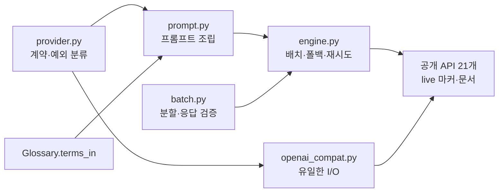

# Session Handoff

> Last updated: 2026-08-16 (KST)
> Branch: **`feat/translate-engine`** — 커밋 25개, `main`에 아직 안 올라갔다.
> **로컬 게이트 5종 전부 통과**했으나 **CI는 아직 돌지 않았다** — PR을 만들어야 돈다.
> **WP7a(번역 엔진 라이브러리 계층)가 끝났다. 다음은 WP7b(영속화·CLI)다.**
> 진척은 [WBS](docs/WBS.md), FR 번호의 출처는 [요구사항정의서](docs/요구사항정의서.md)다

## Current Status

**WP7a를 서브에이전트 구동(SDD)으로 완주했다.** 태스크 7개를 각각 다른 구현자에게 맡기고
위험 축별 리뷰어 2명(소규모는 1명)을 붙였다. 리뷰어들에게 **"자신이 상정하지 않은 변이를 직접 만들어
주입하라"** 를 명시한 것이 이 세션의 핵심 방법이고, 실제로 잡은 Important 26건 중 대부분이 거기서 나왔다.

| | 이전 세션 | 이번 세션 |
| --- | --- | --- |
| v0.1 FR 완료 | 21/42 (50%) | **28/42 (67%)** — FR-2.1~2.6, 2.8 |
| 테스트 | 499 | **858 passed + 1 deselected** (`live` 마커) |
| 신규 모듈 | — | `src/cuesift/translate/` 6개 + 공개 API 21개 |
| 커버리지 | — | `translate/` 6모듈 **100%**, 전체 99% |
| 리뷰 | — | 리뷰어 **13명** · Important **26건** · 수정 라운드 **12회** |

표가 말하는 것은 **FR 7개가 닫혔고 테스트가 359개 늘었다**는 것이다.



`translate/`는 **CLI 배선도 영속화도 없는 라이브러리 계층**이다. 그 둘은 WP7b다.

## 🔴 즉시 해야 할 것 — PR을 만들어야 CI가 돈다

```bash
git push -u origin feat/translate-engine
gh pr create --base main
gh pr checks --watch     # test 3.11 · test 3.12 · docs
```

**로컬 venv는 3.14이고 CI는 3.11·3.12다.** 이 세션에서 **버전 전용 함정을 한 번 밟을 뻔했다** —
f-string 치환부의 역슬래시는 **3.12 미만에서 `SyntaxError`**인데 로컬 3.14는 통과하고
**로컬 게이트 5종 어느 것도 잡지 못한다.** 임시 대응으로 아래를 돌리고 있다.

```bash
.venv/Scripts/python.exe -c "import ast,pathlib; [ast.parse(p.read_text(encoding='utf-8'), feature_version=(3,11)) for p in list(pathlib.Path('src').rglob('*.py'))+list(pathlib.Path('tests').rglob('*.py'))]; print('3.11 OK')"
```

## 다음 사람이 반드시 알아야 할 것 3가지

### ① `translate/`가 네트워크를 한 번도 타 보지 않았다

858개가 `httpx.MockTransport` 위에서만 초록이고 `tests/test_translate_live.py`는
**단 한 번도 통과한 적이 없다**(skip 경로만 확인). 설계 §12 첫 행에 명시돼 있다.

**Ollama를 한 번 붙이면 설계 §12의 세 항목이 동시에 닫힌다** — 실 API 왕복 · 능력 비균일 · **실물 폴백**.
폴백 경로는 특히 프런티어 모델로는 검증되지 않는다(형식을 거의 안 어긴다).
**약한 모델(3B급)이 실제로 지시를 어기는 것을 보는 것**이 그 파일의 존재 이유다.

```bash
$env:CUESIFT_LIVE_BASE_URL = "http://localhost:11434/v1"
$env:CUESIFT_LIVE_MODEL = "qwen2.5:3b"
.venv\Scripts\python.exe -m pytest -m live -v -s
```

**WP7b 착수 전에 이것부터가 값어치가 크다.**

### ② `pytest` 수치 읽는 법이 바뀌었다

마지막 줄이 `N passed, M deselected`이고 **두 수를 같이 읽어야 한다** —
`passed`만 보면 live가 사라진 것을 모른다.

`tests/conftest.py`에 **게이트 방어 3겹**이 있다(임포트 시점 / `pytest_configure` 훅 / 테스트).
설정을 건드리면 **exit 4로 수집 전에 선다.** `-c`·`--override-ini`도 걸리므로
**설정 변경은 `pyproject.toml`을 직접 고쳐야 한다.**

| 겹 | 무엇을 보나 | 무엇에 무력한가 |
| --- | --- | --- |
| 모듈 최상위 | pyproject **원문** | pytest가 실제로 무엇을 읽었는지 모른다 |
| `pytest_configure` 훅 | pytest가 **실제로 읽은** 설정 | 함수 개명(비-`pytest_` 접두사) |
| 테스트 | 두 배선의 생존 + `markers`·`pytestmark` | `-m live`로 deselect |

**셋의 실패 모드가 서로 다르다.** 알려진 한계는 설계 §9.2 표에 있다.

### ③ WP7b가 `except ProviderError`만 달면 `base_url` 오타가 트레이스백으로 샌다

생성자의 **여섯 자리**는 맨 `ValueError`이고 `ProviderError`가 **아니다** —
호출 실패가 아니라 **설정 오류**이기 때문이다(exit 2 대 exit 66과 같은 축).

그리고 상태 코드 분류가 스펙 §4.2의 열거보다 넓다.

| 상태 | 분류 |
| --- | --- |
| 2xx | 정상 |
| **3xx** | **`FatalProviderError`** + 리다이렉트 전용 메시지("base_url을 확인하라") |
| 400·401·403·404·409·499 | `FatalProviderError` |
| **408**·429 | `RetryableProviderError` |
| 5xx | `RetryableProviderError` |

전 구간 실측표가 설계 §4.2에 있다. **`ProviderError` 밖으로 새는 상태 코드는 0개다.**

## In Progress / Pending — WP7b·WP8이 막히는 지점

최종 브랜치 리뷰가 **계층 경계의 계약 공백 4건**을 실측으로 찾았다.
**넷 다 `translate/` 안에서는 옳고 경계 밖에서만 보인다.**

| WP | 무엇이 막히나 | 근거 |
| --- | --- | --- |
| **WP7b 리포트** | **실패분을 triage 입력에 넣으면 Recall@Budget이 0이 된다.** `target_text=None` → `struct.empty`가 `hard_fail=True` → quota 소진 | 실패 20건(전체 10%)에서 **재현율 100% → 0%** [실측]. 계약은 설계 §3.2.1에 신설됨 |
| **WP7b 재개** | `iter_batches`가 **연속 구간**을 전제한다. "안 된 것만 넘긴다"가 **프롬프트를 바꾼다** | 같은 세그먼트의 프롬프트 SHA가 `27077083` vs `8cb1100c` [실측] |
| **WP7b 캐시 키** | `Provider`에 **모델·설정 접근자가 없다**(`name`만 공개). CLI가 자기 값을 따로 들고 있어야 한다 | — |
| **WP8 자가일관성** | **차단 수준.** Tier 1은 상위 25%만 도는데 그것이 **비연속**이다. 이웃이 맥락이 아니라 **번역 대상**이 되어 **프롬프트 차이**를 잰다 | **Q4 판정이 이 측정에 걸려 있다** |
| **WP8 재사용 범위** | `build_messages`·`parse_translations`는 공개인데 **재시도·백오프는 비공개**다 — 맥락을 스스로 잡으면 **예외 분류가 복제된다** | — |
| WP8 온도 | **막히지 않는다** — `temperature` 노출, `n`·`logprobs` 미전송(§12 Q3 정합) | — |

**진짜 강제 지점은 WP7b·WP8의 인수 조건이다.** 독스트링은 읽지 않으면 그만이다.

## 파킹 목록 — 후속 작업 후보

### WP7b 브리프로 옮길 것 (문서·주석, 코드 동작은 옳다)

| # | 내용 |
| --- | --- |
| **R-1** | **`batch.py`의 `iter_batches` 독스트링 처방 앞 절반이 NFR-4·FR-4.3과 모순된다.** "전체 트랙을 넘긴 뒤 결과를 거르거나"는 재개(완료분 재번역 = 재개가 아니다)와 Tier 1(`max_ratio` 25% 초과) 둘 다에서 성립하지 않는다. **틀린 처방은 처방이 없는 것보다 나쁘다 — 옮길 때 반드시 정정할 것.** 정정안: "맥락을 직접 지정해 `build_messages`를 부른다. 건너뛸 id를 받는 API가 필요하면 WP7b에서 추가한다" |
| **R-2** | `provider.py`의 `content` 가드 주석 **근거가 거꾸로다.** 실측하니 열거형(블랙리스트)은 `True`를 오히려 잡고 **열거 밖 타입**(`object()` 등)이 새어 `TypeError`가 된다. 주석 정정 + parametrize에 `object()` 1케이스(변이가 죽는다) |
| **R-3** | `translate/__init__.py`의 `ValueError` 표 **2행이 `translate_segments` 경로가 아니다**(빈 배치는 120조합 전수에서 도달 없음, `ChatMessage`는 `prompt.py`가 리터럴·`join`으로만 만들어 불가). 제목 "다섯"과 표 6행 불일치 |
| **R-4** | 새 테스트의 `# noqa: ANN001, ANN202`가 **켜지지 않은 규칙**을 억제한다(`select = E,F,I,UP,B,SIM`) |
| — | 특성 테스트 주석의 **"방어를 넣으면 여기가 죽는다"는 *동작을 바꾸는* 방어에만 참**이다. no-op 절은 0건을 죽인다 |
| — | `engine.py`의 **인자 4단 수동 전달** — 10개 키워드 인자가 4개 함수로 손 복사된다. WP7b가 캐시 훅을, WP8이 샘플 수를 더할 때 **매번 4개 시그니처를 고쳐야 한다.** frozen 설정 객체가 대안 |
| — | NFR-2 정밀도 3건: `Completion`에 완료 사유 없음 · 실패 호출 토큰 과소계상 · `TokenUsage.calls=0` 기본값 |
| — | `size`(`iter_batches`) vs `batch_size`(`translate_segments`) 네이밍 갈림 · `parse_translations`만 키워드 전용 `*` 없음 |
| — | `test_translate_live.py`의 `prompt_tokens > 0`이 `_extract_usage`의 "못 읽어도 0" 설계와 충돌 — **usage를 안 주는 서버에서 live 게이트가 거짓 빨강** |
| — | `SegmentFailure.reason`이 검증 없는 맨 `str` · `attempts`가 폴백에서 **배치 호출분을 빼고 센다**(`usage.calls`는 정확) |

### 별도 태스크 (`translate/` 밖, v0.1 전)

| # | 내용 | 실측 |
| --- | --- | --- |
| **S-1** | **`_contains_term` 정규식 사전 컴파일.** `re._MAXCACHE = 512`를 넘으면 FIFO 축출로 **매 호출 전량 재컴파일** — 계단 함수다. 노출 지점은 Tier 0 전량 경로(`signals/derived.py:117`, **세그먼트마다**) | 큐 1000개 파일: 용어 **510개 0.769초 → 520개 18.111초 (23.5배)**. **회귀 게이트를 시간이 아니라 컴파일 횟수로 잡을 것** |
| **S-2** | **`load_glossary`가 빈 `source`를 검증하지 않는다.** `source: ""` 항목이 **모든 큐**에 매치 | **`select_by_threshold`가 임계 ≤0.5에서 붕괴**(review_ratio 10% → **100%**) + 모든 프롬프트에 쓰레기 줄. **예산 경로는 무사하다**(noisy-or가 단조라 순위 보존) |
| **S-3** | 중복 `source` **병합은 의미를 바꾼다** — 현재는 각 항목 독립 검사(더 엄격), 합집합 병합은 "하나만 나와도 통과". **용어집 스키마의 의미론 결정이 먼저다** | — |
| **S-4** | **`prompt.py`의 `_escape_newlines`가 단사가 아니다** — 원문 `C:\name` → `C:<진짜개행>ame`. 고치려면 **프롬프트 계약**을 바꿔야 하고 **약한 모델의 형식 위반이 는다** | **Ollama로 폴백률을 관측한 뒤가 순서다** — 측정 없이 품질을 걸면 안 된다 |

### 안 하기로 한 것

| 내용 | 근거 |
| --- | --- |
| ast 리터럴 위장 방어 | 좁히는 방법이 **그 자체로 또 이름 매칭**이고, 위장 상태에서도 로직 테스트 7건이 죽어 **위장+우회를 함께** 넣어야 한다 |
| 게이트 우회 M8+M4 · 하드코딩 URL live 파일 | **완전한 정적 판정은 없다** — 강화 규칙 후보가 `test_translate_api.py` 자신을 첫 오탐으로 만들었다 [실측]. 설계 §9.2에 한계로 명시 |

## Known Issues — 이 세션이 배운 것

### 거짓 전제가 **여섯 번** 나왔고 그중 둘은 컨트롤러가 만들었다

| # | 무엇이 거짓이었나 | 어떻게 드러났나 |
| --- | --- | --- |
| 1 | 주석이 `signals/base.py`가 `@runtime_checkable`을 피한다고 인용 — **그 파일은 둘 다 붙였다** | 리뷰어가 파일을 열어 확인 |
| 2 | 구현자가 **거짓 인용을 지우는 동안 바로 옆에 새 거짓 전제를 만들었다** | 재리뷰 |
| 3 | **구조를 바꾸자 방금 쓴 독스트링이 거짓이 됐다**(`json.loads` → `raw_decode`) | 자기 변이 검사 |
| 4 | **컨트롤러**가 스펙 §9.2에 "미등록 마커는 경고를 낸다"고 적었는데 **에러**였고, 게다가 **스위트 전체가 선다** | Task 7 탐침 |
| 5 | 새 커밋이 **테스트 총계 `830`을 세 곳에 심었는데** 같은 파일 10줄 아래가 813이었다 | 문서 리뷰어 |
| 6 | **컨트롤러가 리뷰어의 `[추론]` 표기를 지우고 지시로 옮겼고**, 구현자가 단정으로 코드 주석에 적었으며, 재현에 실패했다 | 재리뷰어가 `mklink /J`로 시험 |

**교훈: 리뷰어 보고의 `[실측]`/`[추론]` 구분은 지시로 옮길 때 유지해야 한다.**

### 반복된 실패 형태 5가지

| 형태 | 사례 |
| --- | --- |
| **변이 배터리는 자기가 상정한 변이만 잡는다** | 구현자 7종 통과 후 리뷰어 상정 밖 3종이 **전부 0건 사망** |
| **선언된 불변식에 테스트가 없으면 주석이지 계약이 아니다** | 주석이 "위치로 짝지으면 안 된다"고 적었는데 위치 짝짓기 변이가 **35개를 전부 통과** |
| **테스트 데이터가 미탐을 만든다** | 순서 데이터가 하필 정렬 순과 같아 `sorted()` 변이를 못 잡음 · `context_window=1`이 한 번도 안 쓰여 **222/1872 조합에서 다른 결과가 전부 통과** |
| **거짓말하는 가짜가 테스트를 통째로 무효화한다** (5회) | 둘째 줄 소실 · 프로토콜 이탈 `max_tokens=None` · `\n` 미복원 · **목이 gzip 응답을 한 번도 안 줘서 `DecodingError` 누수를 가림** |
| **복제된 구조의 두 번째 사본이 검사에서 빠진다** | 폴백이 배치 호출의 구조 복제인데 검사가 통째로 없었음 · 새 `except` 절에 메시지 단언 누락 |

### 커버리지 100%는 "실행됐다"이지 "관찰됐다"가 아니다

`engine.py`가 커버리지 100%인 채 **변이 12종이 살아남았다.**
`Provider` 프로토콜은 커버리지 100%였는데 **어떤 테스트도 건드리지 않았다**(클래스 본문이 임포트 시 실행된다).

### 게이트를 지키는 층은 계속 한 칸씩 내려간다

`live` 마커 게이트를 지키느라 **5라운드에 걸쳐 같은 형태가 세 번 반복됐다** —
테스트 → 훅 → 모듈 최상위 → 래퍼 본문. 매번 새 빈칸이 열렸다.

**마지막 수가 유일하게 사슬을 끊었다:** 배선 전용 함수가 **인자를 받지 않는 시그니처**를 가지면
인자를 붙이는 순간 파이썬이 `TypeError`를 낸다 — **테스트가 필요 없고 deselect도 개명도 우회할 수 없다.**
**문법이 직접 막는 것이 검사보다 강하다.**

다만 그것도 **"몇 개를 받는가"만 강제하고 "무엇을 넘기는가"는 못 한다.**
그래서 한 칸 더 내려간 뒤 **한계를 문서에 적고 멈췄다.**

## Key Decisions Made

| 결정 | 근거 |
| --- | --- |
| **FR-2.1을 "한 실행에 여러 언어"로 읽는다** | `Segment.target_text`가 단수이고 `Glossary`·spec이 한 언어 계약이다 — 다르게 읽으면 세 모듈을 동시에 깨야 한다 |
| **맥락으로 원문만 준다** | 앞의 번역 결과를 주면 용어집이 이미 푸는 문제를 토큰을 더 써서 비결정적으로 다시 푸는 것이 되고 **재현성·병렬성·캐시 키가 동시에 깨진다** |
| **배치 10 + 개별 폴백** | 배치가 깨져도 그 배치만 강등하므로 정확성이 배치 크기에 매달리지 않는다 |
| **재시도 소진 후에는 폴백하지 않는다** | 폴백은 "모델이 지시를 어김"의 처방이지 "서버가 죽음"의 처방이 아니다 |
| **`retry_after_s` 도메인을 생성자에서 닫는다** | `sleep(-1/inf/nan)`이 전부 `ProviderError` 밖이고 **`except` 핸들러 본문 안**에서 발생해 그 핸들러가 못 잡는다. 상한(60초)은 계약이 아니라 정책이라 engine에 있다 |
| **설정 오류는 맨 `ValueError`다** | `ProviderError`는 "프로바이더 **호출** 실패의 최상위"인데 이건 설정이다 — exit 2 대 exit 66과 같은 축 |
| **`content` 키 부재를 `null`과 합쳐 Retryable로** | Pydantic `exclude_none`이 null 키를 통째로 뺀다 — **판별 신호가 의미가 아니라 표기라서 분류 근거로 쓸 수 없다** |
| **공개 기준 = "밑줄 없는 최상위 이름 전부"** | "호출자가 쓰는 것"은 **검사 불가**다. 이 기준은 ast로 검사되고 21개 전부 하나씩 지워 죽는 것을 확인했다 |
| **`terms_in` 반환은 등재 순** | 위치 순이면 배치마다 프롬프트 문자열이 달라져 **프리픽스 캐시가 무효화되고 재현성이 깨진다** |
| **no-op 방어 절을 새로 만들지 않는다** | 제안된 `except ProviderError: raise`가 **0건을 죽이는 no-op**이었다. 대신 **특성 테스트 2건**이 진짜 방어에서 3건을 죽인다 |

## 게이트 실행 기록

| 게이트 | 수치 |
| --- | --- |
| `ruff check .` | All checks passed |
| `ruff format --check .` | **73 files** already formatted |
| `pytest -q` | **858 passed, 1 deselected** |
| `pytest -m live --collect-only` | **1/859 (858 deselected)** |
| `python scripts/check_links.py` | 마크다운 **21개 파일** · 상대 링크 **86개** / 깨진 링크 0 |
| `npx markdownlint-cli2` | Linting: **21 files** / 0 issues |
| 3.11 문법 (임시) | OK |

**두 문서 게이트가 21로 일치한다** — 갈라지면 추적 안 된 문서가 있다는 뜻이다.
