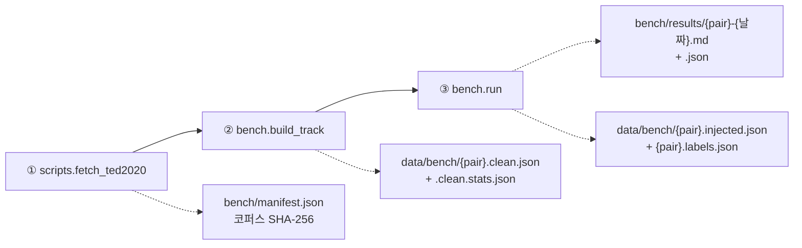

# cuesift

**AI 자막 번역·검수 트리아지 엔진**

> *"Sift the cues that actually need a human."* — 사람이 정말 봐야 할 자막만 걸러냅니다.

[](https://github.com/withwooyong/cuesift/actions/workflows/ci.yml)
[](LICENSE)
[](pyproject.toml)

> [!WARNING]
> **개발 이전 단계(pre-alpha)입니다.** Tier 0 신호 엔진(무료 결정론적 신호 9종 ·
> 위험도 융합 · 트리아지 선별)은 구현·**실측까지 끝났고**(아래 참고) 자막 파일
> 파싱(`ingest`)도 들어왔습니다. **`check`(규격 검사)와 `translate`(번역)는 CLI에
> 배선되어 실제로 동작합니다** — 아래 "CLI" 절 참고. STT(`transcribe`)만 아직
> 종료 코드 `70`(미구현)을 반환합니다.

---

## 실측: Recall @ Budget

무작위로 검수 대상을 고르는 것과 비교해, Tier 0 결정론적 신호 9종만으로 트리아지하면
**실제 검수 비율 10%에서 무작위 대비 약 7.4배**(en-ko **7.24x** · ja-ko **7.52x**)의
오류 포착률을 냅니다. 공개 병렬 코퍼스 TED2020(OPUS)에서 표본 5,000건씩을 뽑아
합성 오류를 주입하고 측정한 결과입니다(2026-07-29).

> 배수는 **요청한 예산이 아니라 실제로 검수 큐에 들어간 비율**로 나눕니다.
> hard fail 신호가 예산과 무관하게 무조건 큐에 들어가기 때문입니다(요구사항정의서
> §9.1, §6.2). **예산 10%는 요청 예산과 실제 검수 비율이 처음 일치하는 지점**이라
> 가장 오해 없이 인용할 수 있는 값입니다 — 더 낮은 예산(1~5%)은 배수가 8.8배까지
> 오르지만, 그 구간은 hard fail만으로 채워져 실제 검수 비율이 요청보다 훨씬
> 높습니다(아래 표의 "실제 검수" 열 참고).

| 요청 예산 | en-ko 실제 검수 | en-ko Recall | en-ko 배수 | ja-ko 실제 검수 | ja-ko Recall | ja-ko 배수 |
| --- | --- | --- | --- | --- | --- | --- |
| 1% | 6.32% | 54.60% | 8.64x | 5.68% | 49.80% | 8.77x |
| 2% | 6.32% | 54.60% | 8.64x | 5.68% | 49.80% | 8.77x |
| 5% | 6.32% | 54.60% | 8.64x | 5.68% | 49.80% | 8.77x |
| **10%** | **10.00%** | **72.40%** | **7.24x** | **10.00%** | **75.20%** | **7.52x** |
| 20% | 20.00% | 86.60% | 4.33x | 20.00% | 83.60% | 4.18x |
| 30% | 30.00% | 89.40% | 2.98x | 30.00% | 85.20% | 2.84x |

예산 1~5% 행이 모두 같은 값인 것은 버그가 아닙니다 — hard fail이 예산을 우회해
무조건 큐에 들어가므로, 요청 예산이 hard fail만으로 채워지는 실제 검수 비율(en-ko
6.32% · ja-ko 5.68%)보다 낮은 동안은 요청을 더 낮춰도 결과가 바뀌지 않습니다.

전체 재현 정보(코퍼스 SHA-256·시드·커밋)·유형별 Recall·오라클 대비 달성률·
신호별 ablation은 리포트 원본에 있습니다 —
[`bench/results/en-ko-2026-07-29.md`](bench/results/en-ko-2026-07-29.md) ·
[`bench/results/ja-ko-2026-07-29.md`](bench/results/ja-ko-2026-07-29.md).

**한계**: 합성 오류 주입 기반 측정이며, 실제 번역 오류와의 일치도는 아직
검증하지 않았습니다(요구사항정의서 §9.2). **위 배수는 의미 오류에는 적용되지
않습니다** — 의미가 뒤집힌 문장(`negation`)만 놓고 보면 Tier 0는 예산 10%에서
**무작위보다도 못합니다**(1.41% vs 무작위 9.61%). 다른 오류를 상위로 올리면서
문법적으로 완벽한 문장을 오히려 큐에서 밀어내기 때문입니다 — Tier 1 투자가
필요한 이유입니다(요구사항정의서 §12 Q4). **이 숫자는 융합 방식을 noisy-or로
바꾸고 숫자 검출을 고친 뒤에도 소수점까지 그대로였습니다** — 결정론적 신호를
어떻게 조합하든 의미 판단에는 닿지 못한다는 뜻입니다. 또한 **ko 자막의 약 절반(en-ko
49.91% · ja-ko 48.09%)이 TED 규격(21자 × 2줄)에 물리적으로 담기지 않아
표본에서 애초에 빠졌습니다** — 남은 표본이 짧은 문장으로 기울어 있다는
뜻입니다(리포트의 "코퍼스 제외" 절 참고).

### 재현

코퍼스(TED2020/OPUS)는 **CC BY-NC-ND 4.0**이라 원본도 가공물도 이 리포에
포함하지 않습니다. 아래 3단계로 직접 내려받아 재현합니다.



| 단계 | 하는 일 | 산출물 |
| --- | --- | --- |
| ① `fetch_ted2020` | 코퍼스 획득(약 78MB)·SHA-256 기록 | `bench/manifest.json` |
| ② `build_track` | 언어쌍당 5,000건 합성. **규격 위반 0건을 단언** | `{pair}.clean.json` · 코퍼스 제외 통계 |
| ③ `run` | 오류 7종 주입 → Tier 0 측정 → 리포트 | 리포트 `.md`/`.json` · **감사 산출물** |

②의 "규격 위반 0건" 단언이 전제입니다 — 깨끗하지 않은 트랙에서는 검출된 위반이
주입분인지 합성 실패인지 구분할 수 없습니다.

```bash
# ① 코퍼스 획득
python -m scripts.fetch_ted2020

# ② 깨끗한 트랙 합성
python -m bench.build_track --pair en-ko
python -m bench.build_track --pair ja-ko

# ③ 주입 · 측정 · 리포트
python -m bench.run --pair en-ko
python -m bench.run --pair ja-ko
```

> `python bench/run.py`가 아니라 **`python -m bench.run`** 이어야 합니다.
> 스크립트를 직접 실행하면 리포 루트가 `sys.path`에서 빠져 `cuesift`·`bench`
> 패키지를 찾지 못합니다.

시드는 기본값(`20260729`)이 위 표의 숫자를 냅니다. `--seed`를 바꾸면 다른 표본이
나오므로 값도 달라집니다.

**감사 산출물** — ③은 변조된 트랙과 정답 라벨을 `data/bench/`에 함께 남깁니다
(`{pair}.injected.json` · `{pair}.labels.json`). 라벨 파일에는 시드·커밋과 **변조
트랙의 SHA-256**이 기록되어 있어, 벤치를 다시 돌리지 않고도 정답을 검증할 수
있습니다 — 깨끗한 트랙과 변조 트랙을 비교하면 라벨과 정확히 일치해야 합니다.

**용어집(`bench/glossary.ted.yaml`)을 고치면** 회귀 게이트를 다시 돌립니다.
돌리지 않으면 대응률이 낮은 용어가 섞여 "용어집이 틀려서 생긴 오탐"과 "검출기
성능"을 구분할 수 없게 됩니다.

```bash
python -m scripts.glossary_verify --pair en-ko   # 등장 20건 이상 · 대응률 79.8% 이상
python -m scripts.glossary_verify --pair ja-ko
```

---

## 문제

다국어 OTT 자막 현지화에서 **번역가 검수가 비용·병목·품질편차의 단일 원인**입니다.
20개 언어 × 16부작이면 검수 공수가 20배로 늘고, 언어 하나가 늦으면 동시 출시가 깨집니다.

기존 도구는 양극단입니다 — TMS는 워크플로만 관리하고 품질 판단은 사람에게 넘기며,
품질추정(QE) 모델은 존재하지만 **자막 파이프라인에 배선되어 있지 않습니다.**

## 접근

전량 검수를 **위험도 순 부분 검수**로 바꿉니다.
번역 결과 전체에 위험 점수를 매기고, 상위 N%만 사람에게 올립니다.

```text
자막/영상 → (STT) → 번역 → 위험도 채점 → 상위 N% 트리아지 → 리포트
```

위험 신호는 단일 지표가 아니라 규격 위반·자가일관성·품질추정 등을 결합해 산출합니다.
자세한 설계는 [요구사항정의서](docs/요구사항정의서.md)를 참고하세요.

## CLI (`check`·`translate` 구현 완료 · `transcribe` 설계 확정)

### `cuesift check` — 규격 검사 (동작합니다)

```bash
# 규격 검사만 (CI 게이트) — 위반이 있으면 종료 코드 1
cuesift check dist/episode01.ja.srt --spec ja --fail-on hard

# 내장 프로파일 대신 우리 규격으로 (FR-5.3)
cuesift check dist/episode01.ja.srt --spec ./our-spec.yaml
```

내장 프로파일은 `en` · `ja` · `ko`와 벤치마크용 `ted-en` · `ted-ja` · `ted-ko` 여섯입니다.
`--spec` 값이 `.yaml`/`.yml`로 끝나면 파일 경로로, 그 외에는 내장 이름으로 해석합니다 —
존재 여부가 아니라 **확장자**로 가르므로 오타 난 경로가 "내장 이름이 없다"는 틀린 진단을
받지 않습니다.

판정하는 위반은 7종입니다 — `line_length` · `line_count` · `cps` · `duration_short` ·
`duration_long` · `overlap` · `empty_cue`. 위반 목록은 이 명령의 정상 산출물이므로
**stdout**으로 나가고(`cuesift check ... > violations.txt`로 갈무리됩니다),
진단 실패 메시지만 stderr로 갑니다.

```text
$ cuesift check check_violations.ass --spec ko
check_violations.ass (ass · 검사 큐 4개 · 프로파일 ko)
위반 4건 · 위반 큐 3/4개 (75.0%)

  #3  00:00:05.000  line_length    22.0 > 16.0  (2번째 줄)
  #3  00:00:05.000  cps            25.5 > 12.0
  #4  00:00:05.500  overlap        500ms
  #5  00:00:09.000  empty_cue      텍스트 없음

위반 4건 · 위반 큐 3/4개 (75.0%)
```

**요약을 머리와 끝 양쪽에 냅니다.** 위반이 682건이면 686줄이 나가고, 26화 × 3언어
매트릭스에서 프로파일을 잘못 물리면 약 5만 줄이 쌓입니다. 로그를 앞에서 남기고 뒤를
자르는 CI에서는 **가장 중요한 한 줄이 가장 먼저** 사라집니다. 양쪽에 두면 절단 방향과
무관하게 살아남습니다.

`#N`은 **원본 파일의 이벤트 순번**입니다 — 주석·드로잉을 걸러 낸 뒤의 순번이 아니므로
`검사 큐 N개`보다 클 수 있습니다. 다만 **SRT에 인쇄된 번호는 아닙니다**: pysubs2가 그
번호를 버리므로, 큐가 `1,2,4,5`로 매겨진 파일(3번이 지워진 파일)에서는 파일의 `4`를
`#3`으로 부릅니다. 인쇄 번호 보존은 v0.1 범위 밖입니다.

위반이 없을 때도 **무엇을 대상으로 통과했는지**를 냅니다 — 큐 개수와 프로파일 이름이
없으면 엉뚱한 파일이나 엉뚱한 프로파일로 통과한 것을 알 수 없기 때문입니다.

```text
$ cuesift check minimal.srt --spec ko
minimal.srt (srt · 검사 큐 2개 · 프로파일 ko) - 위반 없음
```

#### `--fail-on`

| 값 | 동작 |
| --- | --- |
| `hard` (기본) | 위반이 1건이라도 있으면 종료 코드 1 |
| `any` | **v0.1에서는 `hard`와 같습니다** — 규격 위반 7종이 전부 같은 등급입니다 |
| `none` | 위반을 stdout에 출력하되 **항상 종료 코드 0** |

세 값 중 둘이 같은 것은 v0.1에 심각도 등급이 하나뿐이기 때문입니다. 등급 배정의 출처가
없어서 만들지 않았습니다 — 1차 출처인 Netflix TTSG에 위반 등급 구분이 없습니다.
등급이 생기면 `hard`와 `any`가 갈라집니다.

#### `--limit`

위반 목록을 N건까지만 출력합니다. **기본값 `0`은 무제한**이라 아무것도 지정하지 않으면
지금까지와 똑같이 전부 나갑니다 — 상한을 기본으로 켜면 전체 목록을 파이프로 받아
grep하던 쓰임이 조용히 잘리기 때문입니다.

```text
$ cuesift check check_violations.ass --spec ko --limit 1
check_violations.ass (ass · 검사 큐 4개 · 프로파일 ko)
위반 4건 · 위반 큐 3/4개 (75.0%)

  #3  00:00:05.000  line_length    22.0 > 16.0  (2번째 줄)
  ... 3건 생략 (전체는 --limit 0)

위반 4건 · 위반 큐 3/4개 (75.0%)
```

| 규칙 | 이유 |
| --- | --- |
| **종료 코드는 `--limit`에 영향받지 않습니다** | 3건만 보여준다고 위반이 3건인 것은 아닙니다. 종료 코드는 **판정의 결과이지 출력의 결과가 아닙니다** — 여기가 흔들리면 CI 게이트가 출력 옵션에 좌우됩니다 |
| **요약은 언제나 전체 기준입니다** | 자른 뒤에 세면 `--limit 3`이 "위반 3건"이라는 거짓말을 냅니다. 위 예시에서 `4 = 1(표시) + 3(생략)`으로 합계가 닫힙니다 |
| 잘리면 반드시 고지합니다 | 고지가 없으면 사용자는 목록이 전부라고 읽습니다 |
| 상한이 위반 수보다 크면 고지가 없습니다 | `0건 생략`은 그 자체로 거짓말입니다 |
| 음수는 종료 코드 `2` | 명령줄이 틀린 것입니다 |

#### 종료 코드

**CI 게이트에서 가장 중요한 계약입니다.** `!= 0`으로 뭉뚱그리면 `66`(파일이 깨졌다)이
"규격 위반"으로 오보되고, 사용자는 멀쩡한 자막을 고치려 듭니다. 아래는 `check`·`translate`
공통 계약입니다(`src/cuesift/cli.py` 모듈 독스트링이 단일 출처입니다).

| 코드 | 뜻 | 어느 명령 |
| --- | --- | --- |
| `0` | 위반 없음(`check`, 또는 `--fail-on none`), 전량 번역 성공(`translate`) | 공통 |
| `1` | **규격 위반 발견**(`check`), **번역 일부 세그먼트 실패 — 원문 유지**(`translate`) | 공통 |
| `2` | **명령줄이 틀림** — 파일 없음 · 디렉터리 · 알 수 없는 프로파일 · 프로파일 파일 해석 실패 · **트리아지 옵션 충돌·예산 값 오류·적용할 대상 언어 없음**(아래 트리아지 절) 등 | 공통 |
| `66` | **파일 사정이 틀림** — `check`: 자막 아님 · utf-8 아님 · 읽기 불가 · 파싱 실패 · 큐 0개 · 타임코드 역전·음수. `translate`: 자막·용어집 파싱 실패 · utf-8 아님 · 읽거나 쓰지 못함 | 공통 |
| `69` | **외부 서비스(LLM 프로바이더)가 요청을 거부함** — 인증 실패·모델 없음 등 | `translate`만 |
| `70` | **미구현**(`transcribe`), 또는 **산출물의 내용 결함** — 자막·검수 리포트를 쓰려는데 그 **내용**이 파일로 나갈 수 없는 값을 담고 있음(모델이 낸 고립 서로게이트, JSON으로 바꿀 수 없는 값 등) | 공통 |

`2`와 `66`을 가르는 축은 **"호출이 틀렸나, 파일이 틀렸나"** 입니다. 둘을 구분하지 못하면
CI가 "경로 오타"와 "자막이 깨졌다"에 같은 대응을 하게 됩니다.
`66`은 `sysexits.h`의 `EX_NOINPUT`, `69`는 `EX_UNAVAILABLE`, `70`은 `EX_SOFTWARE`입니다.

**음수 타임코드가 `1`이 아니라 `66`인 것도 같은 축입니다.** `cps`·`line_length`는 검수자가
그 큐의 텍스트를 고치면 되지만, 음수 좌표는 싱크·변환 파이프라인의 사고라 자막을 아무리
들여다봐도 고칠 수 없습니다. 섞으면 CI가 두 사고에 같은 대응을 하게 됩니다.

#### 입력 포맷

| 포맷 | 확장자 | 근거 |
| --- | --- | --- |
| SubRip | `.srt` | FR-1.1 |
| WebVTT | `.vtt` | FR-1.1 |
| ASS / SSA | `.ass` · `.ssa` | FR-1.1 |
| SAMI | `.smi` · `.sami` | 한국 레거시 자막의 주력 포맷. pysubs2가 처리하며 **실측으로 확인**했습니다 |

포맷별 분기 코드가 0개인 것은 pysubs2가 포맷 판별과 태그 정규화를 전부 하기 때문입니다.
TTML은 FR-1.6으로 v0.3에 있습니다. 인코딩은 **utf-8만** 받습니다 — cp949 자막은
종료 코드 `66`과 함께 변환 안내를 냅니다.

### `cuesift translate` — 번역 (FR-8.1, 동작합니다)

```bash
export CUESIFT_BASE_URL=http://127.0.0.1:11434/v1
export CUESIFT_MODEL=qwen2.5:3b
cuesift translate ep01.ko.srt --to en,ja --out dist
```

원격 API를 쓰면 `CUESIFT_API_KEY`도 설정합니다. 없으면 `Authorization` 헤더를
붙이지 않으므로 위 예시의 로컬 Ollama에는 필요하지 않습니다.

**같은 명령을 다시 치면 재개됩니다.** 성공한 호출은 `.cuesift/cache/`에
남아 두 번째 실행에서 네트워크를 타지 않습니다.

**형식을 어긴 응답도 캐시됩니다.** 재실행으로는 결과가 나아지지 않습니다 —
모델을 바꾸거나 `--no-cache`를 쓰거나 `.cuesift/cache/`를 지웁니다.

```bash
cuesift translate ep01.ko.srt --to en --dry-run   # 몇 번 더 불러야 하나
```

`--dry-run`은 실행하지 않고 배치 수·문자 수·캐시 히트를 실측해 냅니다. **토큰과
비용은 추정하지 않습니다** — 문자에서 토큰으로 가는 계수가 모델마다 다르고
우리에게 출처가 없기 때문입니다(요구사항정의서 §11 R8, "출처 없는 수치를
기본값으로 넣지 않음").

#### 검수 트리아지 — `--review-budget` · `--review-threshold` (FR-6.3, 동작합니다)

**이 프로젝트의 목적이 여기 있습니다.** 번역은 수단이고, 실제 산출물은 "사람이 정말
봐야 할 자막"의 목록입니다. 둘 중 **하나를 주면** 번역 직후에 Tier 0 신호 9종이 돌고
검수 큐가 선별됩니다. 아무것도 주지 않으면 예전처럼 번역만 합니다 — LLM 호출 외의
비용이 새로 들지 않습니다.

```bash
cuesift translate ep01.ko.srt --to en,ja --review-budget 10%     # 상위 10%를 큐에
cuesift translate ep01.ko.srt --to en    --review-threshold 0.7  # 위험도 0.7 이상을 큐에
```

| 옵션 | 받는 값 | 비고 |
|---|---|---|
| `--review-budget` | **비율만** — `10%` · `0.1` · `0` · `100%` | `50`처럼 **개수 지정은 종료 코드 2**입니다. 라이브러리에 개수 기반 선별이 없고, `k/n`으로 환산하면 올림과 hard fail 소진 때문에 정확히 K개가 나오지 않아 옵션이 거짓말을 하게 됩니다 |
| `--review-threshold` | `0.0`~`1.0` | 이 위험도 이상을 큐에 담습니다 |
| `--review-out` | 디렉터리 | 결과를 `review.json`으로 남깁니다(아래). **위 둘 중 하나와 함께** 써야 하고, 단독으로 주면 종료 코드 2입니다 |

**둘을 함께 주면 종료 코드 2입니다.** FR-6.3은 "두 방식으로 지정할 수 있다"이지
"동시에"가 아니고, 합성하면 어느 쪽이 이겼는지가 출력에서 사라집니다.

**`0`과 `0%`는 유효한 값입니다** — "hard fail만 보기"라는 의미 있는 요청입니다.
반대로 `%` 없는 `1`은 `1%`가 아니라 **전량 검수(100%)** 가 됩니다. `0.0~1.0` 한 규칙의
결과이며, 잘못 지정해도 요약의 "실제 100.0%"가 즉시 드러냅니다.

**규격 프로파일은 대상 언어 코드에서 자동으로 유도합니다 — 새 옵션이 없습니다.**
`--to en,ja`면 내장 `en`·`ja` 프로파일을 씁니다. `check --spec`이 *검사 대상 자막*의
규격인 것과 달리 여기서는 **대상 언어**의 규격입니다(이름이 같아도 다른 것입니다).

| 상황 | 결과 |
|---|---|
| 일부 언어에 프로파일이 없다 (`--to en,th`) | 경고 후 **그 언어의 트리아지만** 건너뜁니다. `th` **번역은 그대로 나가고** 종료 코드는 달라지지 않습니다(번역이 전량 성공하면 0) |
| **어느 언어에도** 프로파일이 없다 (`--to fr --review-budget 10%`) | **종료 코드 2, 번역도 나가지 않습니다.** 요청이 통째로 무시되는데 0으로 끝나면 CI가 "트리아지했다"로 읽습니다 |

프로파일 검사는 **언어별 루프 전에 전량** 돕니다 — 루프 안에서만 보면 `--to en,ja,fr`이
en·ja의 LLM 비용을 실제로 쓴 뒤에 fr에서 죽습니다.

**`--dry-run`에는 트리아지가 반영되지 않습니다.** dry-run은 번역을 하지 않으므로 트리아지도
돌지 않고 아래 요약도 나오지 않습니다 — dry-run이 내는 것은 배치 수·문자 수·캐시 히트,
그리고 `--tier1`을 켰을 때의 **Tier 1 재번역 요청 상한**입니다(아래 Tier 1 절).
**프로파일 검증도 dry-run에서 돕니다**(실측: `--to fr --review-budget 10% --dry-run`은
종료 코드 2). 옵션 조합이 맞는지 **LLM을 부르기 전에** 확인하는 용도로는 쓸 수 있다는 뜻입니다.

요약은 언어마다 나옵니다.

```text
[en] 트리아지 (예산 10%, 프로파일 en)
  대상 세그먼트 1200개 (번역 실패 3건 제외)
  검수 대상 120개 (실제 10.0%)
  hard fail 2개
  신호별 적발
    length.ratio 12개
    spec.violation 47개
```

**요청 예산과 실제 검수 비율을 함께 냅니다.** hard fail이 예산을 우회해 quota를
소진하므로 둘은 정기적으로 어긋납니다(올림 하나로도 어긋납니다 — 7건에 10%면 실제
14.3%). 요청 예산만 보이면 위 "실측" 절의 배수를 **틀린 분모로** 재계산하게 됩니다.

**번역에 실패한 세그먼트는 트리아지 입력에서 제외합니다.** 실패분은 번역문이 비어
있어 `struct.empty`가 hard fail을 내고, hard fail은 예산을 우회하므로 프로바이더 장애
하나가 진짜 오류를 큐에서 밀어냅니다(실측: 200큐·진짜 오류 20건·예산 10%에서 번역 실패
20건이면 Recall이 **0%**). 번역 안 된 자막은 검수 대상이 아니라 **재실행 대상**입니다.

#### Tier 1 자가일관성 — `--tier1` (FR-4.3, 동작합니다)

**Tier 0는 의미를 보지 못합니다.** 문법적으로 완벽한데 뜻만 뒤집힌 문장은 결정론적 신호
9종으로 예산 10%에서 **1.41%**만 잡히고, 이것은 같은 예산의 무작위(9.61%)보다도 낮습니다
(위 "실측" 절과 같은 벤치마크). Tier 1은 그 구멍을 겨냥해 **같은 세그먼트를 N회 재번역하고
결과들이 서로 얼마나 흔들리는지**를 잽니다 — 흔들리면 모델 자신이 확신하지 못한다는 뜻입니다.

```bash
cuesift translate ep01.ko.srt --to en --review-budget 10% --tier1
```

**`--tier1`은 기본으로 꺼져 있고 `--review-budget`을 요구합니다.** LLM을 다시 부르므로
비용이 실제로 발생하고, 후보를 고르려면 예산 컷라인이 있어야 합니다 — Tier 1은 컷라인
**아래 회색지대**에서만 후보를 고릅니다(이미 검수 큐에 든 것과 hard fail은 제외).

| 옵션 | 기본값 | 무엇을 |
|---|---|---|
| `--tier1` | 꺼짐 | 스위치. 이것 없이 아래 셋만 주면 종료 코드 2입니다 |
| `--tier1-max-ratio` | `0.05` | 전체 세그먼트 중 Tier 1을 적용할 **최대 비율**(FR-4.3). 허용은 `0 < x <= 1.0` — **`0`은 거부됩니다** |
| `--tier1-samples` | `3` | 세그먼트당 재번역 횟수. 허용은 `x >= 2` — 2 미만은 비교할 쌍이 없어 거부됩니다 |
| `--tier1-temperature` | `1.0` | 재번역 온도. 허용은 `0 < x` — **`0`은 거부됩니다**(샘플이 전부 같아져 신호가 죽습니다) |

**`--help`의 범위 표기는 파서가 받는 범위이지 허용 범위가 아닙니다.** `--tier1-temperature`는
`[x>=0.0]`, `--tier1-max-ratio`는 `[0.0<=x<=1.0]`으로 찍히는데 **둘 다 `0`은 종료 코드 2**
입니다 — click의 범위는 경계를 포함해서 "0보다 큰"을 표현하지 못하므로 도움말 문구가 그것을
대신 말합니다.

##### 비용은 곱으로 막습니다

번역 기준선 대비 배수는 `samples × max_ratio × 배치크기(10)`이고 **트랙 크기에
무관합니다**(세그먼트 수가 약분됩니다). 요구사항정의서 §4가 "3배는 감당 불가"라 적었으므로
게이트는 **`--tier1-samples × --tier1-max-ratio < 0.3`** 이고, 기본값 `3 × 0.05 = 0.15`는
그 절반인 1.5배입니다. **한도에 정확히 닿아도 거부합니다** — 3.0배가 곧 §4가 막으려던 값입니다.

```text
$ cuesift translate ep01.ko.srt --to en --review-budget 10% --tier1 --tier1-samples 10
--tier1-samples(10) x --tier1-max-ratio(0.05) = 0.50 가 한도 0.3에 닿거나 넘는다. 둘 중 하나를 줄인다 (요구사항정의서 §4)
```

**상한이 `samples` 단독이 아니라 곱에 걸린 것이 설계입니다.** `--tier1-samples`만 제한하면
`--tier1-samples 10 --tier1-max-ratio 0.5`(배수 **50**)가 통과합니다 — 상한이 잘못된 축에
걸려 있으면 막으려던 것을 못 막습니다.

거부되는 조합은 **일곱**이고 전부 **LLM을 부르기 전에** 종료 코드 2로 끝납니다(아래는 실행해
받은 화면 그대로입니다).

| 무엇을 주면 | 화면 |
|---|---|
| `--tier1` 없이 `--tier1-*`만 | `--tier1-* 옵션은 --tier1과 함께 써야 한다` |
| `--tier1` + `--review-threshold` | `--tier1은 --review-threshold와 함께 쓸 수 없다 (--review-budget을 쓴다)` |
| `--tier1`인데 예산이 없다 | `--tier1은 --review-budget을 요구한다` |
| 곱이 한도에 닿거나 넘는다 | 위 화면 |
| `--tier1-max-ratio 0` | `--tier1-max-ratio 0은 Tier 1을 끄는 값이라 --tier1과 함께 줄 수 없다` |
| `--tier1-temperature 0` | `--tier1-temperature는 0보다 커야 한다 (0이면 샘플이 전부 같아진다)` |
| `inf` · `nan` | `--tier1-temperature를 숫자로 읽지 못했다: inf` |

여기에 파서가 먼저 막는 범위 오류(`--tier1-samples 1` → `Invalid value for '--tier1-samples':
1 is not in the range x>=2.`)가 더해집니다 — 그쪽은 화면 모양이 다르지만 종료 코드는 같습니다.

##### 얼마나 부를지 먼저 봅니다 — `--dry-run`

`--tier1`을 켜면 dry-run 화면에 한 줄이 더 붙습니다. LLM은 부르지 않습니다.

```text
$ cuesift translate ep01.ko.srt --to en --review-budget 10% --tier1 --dry-run
입력   ep01.ko.srt (srt) · 26 세그먼트
모델   qwen2.5:3b @ http://127.0.0.1:11434/v1

[en] ep01.en.srt
  배치 3개 (size=10, context_window=3)
  캐시 히트 0개 · 호출 필요 3개 이상
  프롬프트 문자 system 945 + user 916
  Tier 1 재번역 요청 최대 3회 (재시도·폴백 제외 · 후보 상한 비율 0.05 · 샘플 3)

(토큰·비용은 내지 않는다 - 문자에서 토큰으로 가는 계수의 출처가 없다)
```

`26 × 0.05 = 1.3`을 내림해 후보 1개, 거기에 샘플 3을 곱해 **3회**입니다.

**"호출"과 "재번역 요청"은 다른 낱말이고 섞으면 안 됩니다.** 위 화면의 `호출 필요 3개 이상`은
프로바이더 호출을 세고, `Tier 1 재번역 요청 최대 3회`는 Tier 1이 요청할 재번역을 셉니다 —
재시도와 개별 폴백이 얹히면 **실제 호출은 뒤의 수를 넘습니다.**

##### 후보가 0개일 수 있습니다 — 그때는 사유를 냅니다

`floor(세그먼트 수 × max_ratio)`가 후보 수이므로, 세그먼트가 `1/max_ratio`보다 적으면
후보가 0개가 됩니다. 아래는 **3큐짜리 다른 파일**(`short.ko.srt`)입니다 — 위 dry-run의
`ep01.ko.srt`는 26큐라 후보가 1개 나옵니다. **조용히 넘어가지 않고 이유를 찍습니다** — 유료 계층이 통째로 안 돌았는데
화면이 같으면 사용자는 Tier 1이 돈 줄로 읽습니다.

```text
$ cuesift translate short.ko.srt --to en --review-budget 30% --tier1
[en] Tier 1: 세그먼트 수(3)에 비해 max_ratio(0.05)가 작아 Tier 1 상한이 내림(floor)으로 0이 됐다 (select_tier1_candidates 독스트링 - n < 1/max_ratio)
```

회색지대 자체가 비었을 때도 같은 자리에 사유가 나옵니다
(`Tier 1: 회색지대가 비었다 (전부 hard_fail이거나 이미 선별됨)`).

##### Tier 1 토큰은 `review.json`에 합산됩니다 (FR-7.4)

`cost.includes`는 **스위치가 아니라 "그 계층이 실제로 돌았나"를 말합니다.** `--tier1`을 켠 채로도
Tier 1이 한 번도 안 도는 경우가 **둘** 있어서, 전부 네 가지입니다.

| 실행 | `cost.includes` |
|---|---|
| `--tier1`이 없다 | `["translation"]` |
| `--tier1`이 있고 **Tier 1이 돌았다** | `["translation", "tier1"]` |
| `--tier1`이 있는데 **후보가 0건이다** | `["translation"]` — 수집기가 한 번도 안 불립니다 |
| `--tier1`이 있는데 **번역이 전량 실패했다** | `["translation"]` — 트리아지까지 가지 못합니다 |

**아래 두 줄을 "스위치가 안 먹었다"로 읽지 마십시오.** Tier 1이 안 돌았는데 `"tier1"`을 실으면
목록이 **안 쓴 비용을 셌다고** 거짓말합니다 — `calls`가 0이라 수치는 부풀지 않고 화면에도
신호가 남지 않는 종류의 거짓말입니다. 후보가 0건인 실행은 그 사실을 화면이 따로 말합니다
(위 "후보가 0개일 수 있습니다" 절). **목록이 곧 그 숫자가 무엇을 덮는지에 대한 진술입니다.**

**캐시가 전량 히트한 재실행은 셋째 줄이 아닙니다.** Tier 1이 돌았는데 샘플이 전부 캐시에서
나온 것이므로 `["translation", "tier1"]` 그대로이고 토큰만 줄어듭니다 — 같은 입력의 1회차와
2회차가 다른 범위를 내면 재현성(NFR-3)이 깨집니다.

**Tier 1 단계에서 프로바이더가 치명적으로 실패하면 종료 코드 69입니다.** 번역 파일은 이미
나갔고 트리아지만 못 돈 상태이며, 화면 문구에 `Tier 1`이 들어가 번역 경로의 69와 구별됩니다.

**다만 엔드포인트가 죽어 있으면 69가 아니라 다른 코드가 먼저 납니다.** 번역과 Tier 1이 같은
엔드포인트를 쓰므로 **번역이 먼저 전량 실패하고**, 그때는 트리아지에 넣을 세그먼트가 없어
Tier 1까지 가지 못합니다(실측: 죽은 엔드포인트로 `--tier1`을 돌리면 exit 1). 69는
**번역은 성공하는데 Tier 1 재번역에서만 치명적 오류가 나는** 구성에서 걸립니다 — 예컨대
재번역 요청만 인증·정책에 걸리는 경우이고, 그 경로는 테스트가 층까지 구별해 겁니다
(`tests/test_cli_tier1.py`의 69 스위트). **엔드포인트가 통째로 죽은 경우는 여기에
해당하지 않습니다.**

#### 검수 리포트 파일 — `--review-out` (FR-7.2, 동작합니다)

**화면 요약은 실행이 끝나면 사라집니다.** `--review-out DIR`을 주면 같은 결과가
`review.json`으로 남습니다 — 검수자에게 넘기고, 스크립트로 읽고, 며칠 뒤에 다시 엽니다.

```bash
cuesift translate ep01.ko.srt --to en --review-budget 30% --review-out reports
```

```text
[en] ep01.en.srt
  세그먼트 3개 · 성공 3개 · 실패 0개
  캐시 히트 0개 · 실제 호출 1개
  토큰 prompt 239 · completion 45 · calls 1
[en] 트리아지 (예산 30%, 프로파일 en)
  대상 세그먼트 3개
  검수 대상 1개 (실제 33.3%)
  hard fail 0개
  신호별 적발
    spec.violation 1개
  리포트 reports\ep01.en.review.json
```

(경로 구분자는 실행한 OS를 따릅니다 — 위는 Windows에서 그대로 옮긴 것입니다.)

**파일명은 `{stem}.{대상언어}.review.json`이고 자막 파일과 같은 stem 규칙입니다.**
고정 이름(`review.json`)이면 입력 여럿을 같은 디렉터리로 낼 때 뒤엣것이 앞엣것을
**조용히 지웁니다** — 종료 코드는 0이고 경고도 없어 사용자는 마지막 파일만 보고 앞의
작업이 끝났다고 믿습니다. 아래는 실측입니다.

| 실행 | 남는 파일 |
|---|---|
| `translate ep01.ko.srt --to en,ja --review-budget 30% --review-out reports` | `reports/ep01.en.review.json` · `reports/ep01.ja.review.json` |
| 이어서 `translate ep02.ko.srt --to en --review-budget 30% --review-out reports` | 위 둘 **그대로** + `reports/ep02.en.review.json` |

**예산을 빼면 안 됩니다.** `--review-out` 단독은 아래 조합 표대로 **종료 코드 2**로 막혀
파일이 하나도 나오지 않습니다 — 이 표의 두 명령에 `--review-budget`이 빠져 있던 판이
있었고, 그대로 치면 "파일 2개가 남는다"가 아니라 exit 2였습니다(실측).

파일은 이렇게 생겼습니다. **위 절 첫머리의 `--to en` 명령이 실제로 낸 것입니다.**

```json
{
  "summary": {
    "source_lang": "ko",
    "target_lang": "en",
    "profile": "en",
    "policy": { "kind": "budget", "value": 0.3 },
    "total_segments": 3,
    "triaged_segments": 3,
    "excluded_failures": 0,
    "selected_for_review": 1,
    "review_ratio": 0.3333333333333333,
    "hard_fail_count": 0,
    "signal_hits": { "spec.violation": 1 },
    "cost": {
      "prompt_tokens": 244,
      "completion_tokens": 49,
      "calls": 1,
      "includes": ["translation"],
      "basis": { "translation": "cached-included" },
      "tokens_reported": true
    }
  },
  "segments": [
    {
      "id": "00001",
      "start_ms": 3400,
      "end_ms": 4200,
      "source_text": "반갑습니다.",
      "target_text": "Hello.",
      "risk_score": 0.5,
      "hard_fail": false,
      "reasons": ["spec.violation"],
      "signals": [
        {
          "name": "spec.violation",
          "tier": 0,
          "score": 0.5,
          "spans": [],
          "detail": { "kinds": ["duration_short"], "count": 1 }
        }
      ]
    }
  ]
}
```

전체 구조는 [요구사항정의서 §8.4](docs/요구사항정의서.md)에 있습니다. 읽을 때 알아야 할 것은 다섯입니다.

| 무엇 | 왜 그렇게 돼 있나 |
|---|---|
| **`segments[]`에는 선별된 것만** 담긴다 | FR-7.2가 "검수 **대상** 세그먼트 목록"입니다. 분모는 `summary`가 따로 냅니다 |
| **세그먼트 수가 셋**이다 (`total`·`triaged`·`excluded_failures`) | `total = triaged + excluded`가 **파일 안에서 검산됩니다.** 하나로 두면 `review_ratio`의 분모가 무엇인지 알 수 없고, 그 값이 위 "실측" 절 배수의 분모입니다 |
| **`policy.value`는 비율이지 퍼센트가 아니다** | `30%`는 `0.3`으로 실립니다. 화면 표시는 `× 100`을 거치므로 **반대 방향**입니다 |
| **`cost.includes`가 집계 범위를 밝힌다** | 위 예시는 Tier 1을 끈 실행이라 `["translation"]`입니다. **판정 기준은 스위치가 아니라 "그 계층이 실제로 돌았나"입니다** — `--tier1`을 켜도 번역이 전량 실패하면 Tier 1까지 가지 못해 `["translation"]`입니다(경우 셋은 위 Tier 1 절의 표). 돌았으면 `["translation", "tier1"]`이 되고 토큰도 합산됩니다(FR-7.4) |
| **`cost.basis`와 `cost.tokens_reported`** | `basis`는 계층마다 **어떻게 셌나**를 밝힙니다(`cached-included` = 캐시 적중분 포함 · `sent-only` = 실제 전송분만). `tokens_reported`가 `false`면 `prompt_tokens: 0`은 "안 썼다"가 아니라 **"모른다"**입니다 — usage를 내지 않는 로컬 백엔드가 있습니다 |

**통화 환산 비용(`estimated_usd`)은 넣지 않습니다.** 토큰당 단가가 모델·프로바이더마다
다르고 우리에게 출처가 없습니다(NFR-2 · §11 R8). `0.0`도 `null`도 넣지 않습니다 —
전자는 출처 없는 수치이고 후자는 "언젠가 채워질 자리"로 읽혀 **명시적인 범위 결정을
숨깁니다.**

조합에 따른 동작은 이렇습니다. 넷 다 실측했습니다.

| 조합 | 결과 |
|---|---|
| `--review-out` + 예산 **또는** 임계값 | 정상 — 언어마다 파일 하나 |
| `--review-out` **단독** | **종료 코드 2** — 리포트를 낼 트리아지 정책이 없습니다. 조용히 무시하면 사용자는 파일이 없다는 것을 다음 단계(배포 스크립트·CI)에서야 만납니다 |
| `--review-out` 단독 + `--dry-run` | **여전히 종료 코드 2** — 옵션 조합 오류는 LLM을 부르기 전에 알아야 합니다 |
| `--review-out` + 예산 + `--dry-run` | 종료 코드 0, **디렉터리조차 만들지 않습니다** — dry-run은 트리아지를 돌리지 않으므로 낼 것이 없습니다 |

##### "파일이 없다"와 "파일이 비어 있다"는 다른 사건입니다

둘 다 검수 대상이 0개지만 **원인이 반대라서 대응도 반대**입니다. 아래 둘 다 실측입니다.

| 무엇이 일어났나 | `review.json` | 무엇을 해야 하나 |
|---|---|---|
| **판정 자체를 못 했다** — 그 언어에 규격 프로파일이 없다 (`--to en,th`의 `th`) | **나오지 않습니다** | 프로파일을 만들거나 그 언어를 뺍니다 |
| **판정했고 전부 실패했다** — 번역이 전량 실패해 트리아지 입력이 비었다 | **나옵니다. 비어 있지 않습니다** | **재번역**입니다. 자막에는 원문이 그대로 남아 있습니다 |

**프로파일이 없는 언어에 빈 파일을 내지 않는 이유**는 소비자가 그것을 "검수했고 걸린
것이 없다"로 읽기 때문입니다 — 실제로는 판정 자체를 못 한 것입니다. 번역은 그대로
나가고 `ep01.th.srt`는 만들어집니다(실측). 리포트만 없습니다.

**반대로 전량 실패에는 반드시 파일을 냅니다.** 파일이 아예 없으면 소비자가 "실행이 안
됐다"와 "번역이 전량 실패했다"를 구분하지 못합니다. 그 파일은 **세 수치로 사실을
말합니다** — `total`은 원래 개수를, `excluded_failures`는 몇 건이 실패했는지를,
`segments: []`는 검수할 것이 남지 않았음을 각각 말합니다.

```text
[en] 트리아지: 번역된 세그먼트가 없어 건너뛴다 (전량 3건 실패)
  리포트 reports\ep01.en.review.json
```

```json
{
  "summary": {
    "total_segments": 3,
    "triaged_segments": 0,
    "excluded_failures": 3,
    "selected_for_review": 0,
    "review_ratio": 0.0,
    "hard_fail_count": 0,
    "signal_hits": {}
  },
  "segments": []
}
```

(위 JSON은 `summary`에서 이 사건과 무관한 필드를 뺀 것입니다 — 실제 파일에는
`source_lang`·`target_lang`·`profile`·`policy`·`cost`도 그대로 들어 있습니다.)

**종료 코드는 `1`입니다** — 전량 실패는 "번역 일부 실패"의 극단이지 리포트의 실패가
아닙니다. 리포트는 정상적으로 나왔습니다.

**리포트를 쓰지 못하면 종료 코드로 알립니다.** 파일이 없는데 `0`으로 끝나면 다음 단계가
빈손으로 진행합니다. 두 사정을 가릅니다 — **디스크 사정**(디렉터리를 만들지 못함·권한 없음·
대상 자리가 이미 디렉터리)은 `66`이고, **내용 결함**(JSON으로 바꿀 수 없는 값, `NaN`,
순환 참조 등)은 `70`입니다. 앞은 사용자 환경의 문제고 뒤는 우리 코드가 낸 값의 문제입니다.

**같은 축이 자막 쓰기에도 적용됩니다.** 모델이 고립 서로게이트를 낸 문자열은 파일로 나갈 수
없으므로 자막 쓰기도 `70`입니다 — 같은 오염 문자열이 자막과 리포트 양쪽으로 흐르므로,
어느 쪽이 먼저 죽느냐에 따라 코드가 달라지면 안 됩니다.

**자막 파일은 트리아지보다 먼저 쓰이므로 리포트가 실패해도 번역 산출물은 이미 디스크에
있습니다.** 그리고 두 산출물 모두 **원자적으로 씁니다**(임시 파일에 쓴 뒤 `os.replace`) —
쓰다 실패해도 **잘린 파일이나 0바이트 파일이 남지 않고, 지난 실행의 정상 파일도 보존됩니다.**
이 성질이 없으면 위 문장("이미 디스크에 있습니다")이 *위험한 종류의 참*이 됩니다.

> **하위 호환이 깨진 지점 3가지** — 이전 버전은 `--review-budget`을 경고만 내고
> 무시했으므로 **무엇을 주든 종료 코드 0으로 번역이 나왔습니다.** 지금은 값을 검증하고
> 실행을 중단시킬 수 있습니다. 아래 셋은 전부 **종료 코드 2로 끝나고 번역 산출물이 나오지
> 않습니다**(실측).
>
> | 호출 | 이전 | 지금 |
> |---|---|---|
> | `--review-budget abc` | 경고 · exit 0 · 번역 산출 | **exit 2 · 산출 없음** (읽을 수 없는 값) |
> | `--to th --review-budget 10%` | 경고 · exit 0 · th 번역 산출 | **exit 2 · 산출 없음** (프로파일 있는 대상 언어가 하나도 없다) |
> | `--to en-US --review-budget 10%` | 경고 · exit 0 · en-US 번역 산출 | **exit 2 · 산출 없음** (아래 참고) |
>
> **`--to en-US`는 예산 없이 쓰면 지금도 exit 0입니다** — 번역은 정상이고, 프로파일 조회만
> 실패합니다. 프로파일 이름은 **언어 태그 전체**로 찾으므로 `en-US`는 `en-us.yaml`을 찾다
> 없어서 건너뛰고, 그것이 유일한 대상 언어면 "적용할 수 있는 대상 언어가 없다"가 됩니다.
> **서브태그를 떼어 `en`으로 폴백하지 않습니다** — `ted-en` 같은 내장 이름과의 충돌 규칙을
> 함께 정해야 하는 설계 판단이라 미뤘습니다. 지금은 `--to en`을 쓰거나, 지역 태그가 필요하면
> 트리아지를 끄고 돌리세요.
>
> 셋 다 의도된 동작이지만, 옛 문서를 읽고 스크립트를 짰다면 이 표를 확인하세요.

설정 파일 `cuesift.yaml`(FR-8.4)은 아직 구현되지 않았습니다. **`--config`는
`translate`의 옵션이 아니라 `cuesift` 바로 뒤에 붙는 최상위 옵션입니다**
(`cuesift --config c.yaml translate ...` — 서브커맨드 뒤에 쓰면 `No such option`으로
종료 코드 2가 납니다). 지정하면 경고를 내고 CLI 인자만 반영합니다 — 조용히
무시되지 않습니다. 구현되면 모든 옵션을 파일로 지정할 수 있으며, **CLI 인자가
설정 파일보다 우선**합니다.

### `cuesift transcribe` (설계 확정, 구현 예정)

아래 명령은 아직 종료 코드 `70`(미구현)을 반환합니다.

```bash
# 영상 입력 (자막 없음) — STT로 원문 생성
cuesift transcribe episode02.mp4 --source-lang ko
```

## 개발 환경

PyPI 배포 전이므로 소스에서 설치합니다.

```bash
git clone https://github.com/withwooyong/cuesift.git
cd cuesift
python -m venv .venv && source .venv/bin/activate   # Windows: .venv\Scripts\activate
pip install -e ".[dev]"

pytest
ruff check .
```

> STT(`whisperx`)와 품질추정(`unbabel-comet`)은 `torch`를 끌고 오므로 **선택 의존성**으로 분리했습니다.
> 필요할 때만 `pip install -e ".[dev,stt,qe]"` 로 설치하세요.
> 개발은 Python **3.11 / 3.12** 를 권장합니다 — CI가 검증하는 범위이며, 그 이상은 torch 휠이 없을 수 있습니다.

### 실제 LLM 엔드포인트 테스트 (`-m live`)

번역 테스트는 기본적으로 **가짜 프로바이더** 위에서 돕니다. 실제 엔드포인트를 치는 테스트는
`pyproject.toml`의 `-m "not live"`로 제외되어 있으므로, 돌리려면 명령줄에서 `-m live`로 덮습니다.

| 환경변수 | 필수 | 설명 |
|---|---|---|
| `CUESIFT_LIVE_BASE_URL` | ✅ | OpenAI 호환 엔드포인트. 예: `http://localhost:11434/v1` |
| `CUESIFT_LIVE_MODEL` | ✅ | 모델 이름. 예: `qwen2.5:3b` |
| `CUESIFT_LIVE_API_KEY` | — | 없으면 `Authorization` 헤더를 붙이지 않습니다. 로컬 Ollama는 불필요 |

앞의 둘 중 하나라도 없으면 **실패가 아니라 skip**입니다 — `-m live`는 "돌릴 의사가 있다"이지
"엔드포인트가 있다"가 아니고, 상시 빨간 게이트는 무시되는 게이트가 됩니다.

```powershell
winget install --id Ollama.Ollama -e     # 설치 후 새 터미널
ollama pull qwen2.5:3b

$env:CUESIFT_LIVE_BASE_URL = "http://localhost:11434/v1"
$env:CUESIFT_LIVE_MODEL    = "qwen2.5:3b"
.venv/Scripts/python.exe -m pytest tests/test_translate_live.py -m live -v -s
```

`-s`는 장식이 아닙니다. 이 테스트의 목적이 `[live] calls=N`을 눈으로 읽는 것인데,
`-s`가 없으면 pytest가 stdout을 삼켜 **통과한 실행에서는 그 줄이 아예 보이지 않습니다.**

## 문서

| 문서 | 내용 |
|---|---|
| [docs/요구사항정의서.md](docs/요구사항정의서.md) | 배경·요구사항·아키텍처·인터페이스 명세 |
| [docs/번역관리_TMS_솔루션_비교.md](docs/번역관리_TMS_솔루션_비교.md) | 기존 TMS 솔루션 조사 |
| [docs/AI_자막검수_오픈소스_비교.md](docs/AI_자막검수_오픈소스_비교.md) | 자막 검수 오픈소스 조사 |
| [벤치마크 하네스 설계](docs/superpowers/specs/2026-07-28-ted2020-benchmark-harness-design.md) | TED2020 코퍼스 · 오류 주입 · Recall@Budget 측정 |
| [Tier 0 신호 엔진 구현 계획](docs/superpowers/plans/2026-07-28-tier0-signal-engine.md) | 구현 계획과 실행 중 바뀐 결정 |
| [벤치마크 하네스 구현 계획](docs/superpowers/plans/2026-07-29-ted2020-benchmark-harness.md) | 구현 계획과 실행 중 바뀐 결정 (계획 결함 12건·프로세스 기록) |
| [인제스트 설계](docs/superpowers/specs/2026-07-31-ingest-design.md) | 자막 파일 → `Segment` · pysubs2 실측 근거 · 오류 계약 |
| [인제스트 구현 계획](docs/superpowers/plans/2026-07-31-ingest.md) | 태스크 8개 · 계획 결함 4건과 정정 기록 |
| [`check` 배선 설계](docs/superpowers/specs/2026-08-03-check-cli-design.md) | 신호 엔진을 우회하는 근거 · 종료 코드 5종 · 심각도 단일 등급 |
| [`check` 배선 구현 계획](docs/superpowers/plans/2026-08-13-check-cli.md) | 태스크 7개 · 실측으로 정정한 설계 5건 |

## 라이선스

[Apache-2.0](LICENSE) · 저작권 있는 자막·영상은 이 리포에 포함하지 않습니다.
벤치마크는 공개 다국어 병렬 코퍼스(TED2020/OPUS 계열)로 구성합니다.
