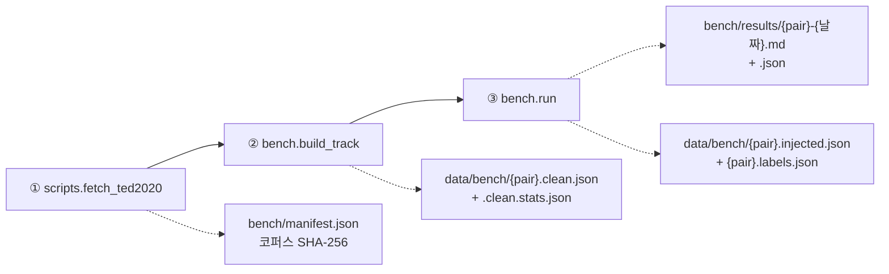

# cuesift

**AI 자막 번역·검수 트리아지 엔진**

> *"Sift the cues that actually need a human."* — 사람이 정말 봐야 할 자막만 걸러냅니다.

[](https://github.com/withwooyong/cuesift/actions/workflows/ci.yml)
[](LICENSE)
[](pyproject.toml)

> [!WARNING]
> **개발 이전 단계(pre-alpha)입니다.** Tier 0 신호 엔진(무료 결정론적 신호 9종 ·
> 위험도 융합 · 트리아지 선별)은 구현·**실측까지 끝났고**(아래 참고) 자막 파일
> 파싱(`ingest`, SRT·WebVTT·ASS/SSA)도 들어왔지만 **CLI에 배선되지 않았습니다** —
> 모든 서브커맨드는 여전히 종료 코드 `70`(미구현)을 반환합니다. 번역(`translate`)
> 계층도 아직 없어 사용할 수 없습니다.

---

## 실측: Recall @ Budget

무작위로 검수 대상을 고르는 것과 비교해, Tier 0 결정론적 신호 9종만으로 트리아지하면
**실제 검수 비율 10%에서 무작위 대비 약 7.4배**(en-ko **7.24x** · ja-ko **7.52x**)의
오류 포착률을 냅니다. 공개 병렬 코퍼스 TED2020(OPUS)에서 표본 5,000건씩을 뽑아
합성 오류를 주입하고 측정한 결과입니다(2026-07-29).

> 배수는 **요청한 예산이 아니라 실제로 검수 큐에 들어간 비율**로 나눕니다.
> hard fail 신호가 예산과 무관하게 무조건 큐에 들어가기 때문입니다(요구사항정의서
> §9.1, §6.2). **예산 10%는 요청 예산과 실제 검수 비율이 처음 일치하는 지점**이라
> 가장 오해 없이 인용할 수 있는 값입니다 — 더 낮은 예산(1~5%)은 배수가 8.8배까지
> 오르지만, 그 구간은 hard fail만으로 채워져 실제 검수 비율이 요청보다 훨씬
> 높습니다(아래 표의 "실제 검수" 열 참고).

| 요청 예산 | en-ko 실제 검수 | en-ko Recall | en-ko 배수 | ja-ko 실제 검수 | ja-ko Recall | ja-ko 배수 |
| --- | --- | --- | --- | --- | --- | --- |
| 1% | 6.32% | 54.60% | 8.64x | 5.68% | 49.80% | 8.77x |
| 2% | 6.32% | 54.60% | 8.64x | 5.68% | 49.80% | 8.77x |
| 5% | 6.32% | 54.60% | 8.64x | 5.68% | 49.80% | 8.77x |
| **10%** | **10.00%** | **72.40%** | **7.24x** | **10.00%** | **75.20%** | **7.52x** |
| 20% | 20.00% | 86.60% | 4.33x | 20.00% | 83.60% | 4.18x |
| 30% | 30.00% | 89.40% | 2.98x | 30.00% | 85.20% | 2.84x |

예산 1~5% 행이 모두 같은 값인 것은 버그가 아닙니다 — hard fail이 예산을 우회해
무조건 큐에 들어가므로, 요청 예산이 hard fail만으로 채워지는 실제 검수 비율(en-ko
6.32% · ja-ko 5.68%)보다 낮은 동안은 요청을 더 낮춰도 결과가 바뀌지 않습니다.

전체 재현 정보(코퍼스 SHA-256·시드·커밋)·유형별 Recall·오라클 대비 달성률·
신호별 ablation은 리포트 원본에 있습니다 —
[`bench/results/en-ko-2026-07-29.md`](bench/results/en-ko-2026-07-29.md) ·
[`bench/results/ja-ko-2026-07-29.md`](bench/results/ja-ko-2026-07-29.md).

**한계**: 합성 오류 주입 기반 측정이며, 실제 번역 오류와의 일치도는 아직
검증하지 않았습니다(요구사항정의서 §9.2). **위 배수는 의미 오류에는 적용되지
않습니다** — 의미가 뒤집힌 문장(`negation`)만 놓고 보면 Tier 0는 예산 10%에서
**무작위보다도 못합니다**(1.41% vs 무작위 9.61%). 다른 오류를 상위로 올리면서
문법적으로 완벽한 문장을 오히려 큐에서 밀어내기 때문입니다 — Tier 1 투자가
필요한 이유입니다(요구사항정의서 §12 Q4). **이 숫자는 융합 방식을 noisy-or로
바꾸고 숫자 검출을 고친 뒤에도 소수점까지 그대로였습니다** — 결정론적 신호를
어떻게 조합하든 의미 판단에는 닿지 못한다는 뜻입니다. 또한 **ko 자막의 약 절반(en-ko
49.91% · ja-ko 48.09%)이 TED 규격(21자 × 2줄)에 물리적으로 담기지 않아
표본에서 애초에 빠졌습니다** — 남은 표본이 짧은 문장으로 기울어 있다는
뜻입니다(리포트의 "코퍼스 제외" 절 참고).

### 재현

코퍼스(TED2020/OPUS)는 **CC BY-NC-ND 4.0**이라 원본도 가공물도 이 리포에
포함하지 않습니다. 아래 3단계로 직접 내려받아 재현합니다.



| 단계 | 하는 일 | 산출물 |
| --- | --- | --- |
| ① `fetch_ted2020` | 코퍼스 획득(약 78MB)·SHA-256 기록 | `bench/manifest.json` |
| ② `build_track` | 언어쌍당 5,000건 합성. **규격 위반 0건을 단언** | `{pair}.clean.json` · 코퍼스 제외 통계 |
| ③ `run` | 오류 7종 주입 → Tier 0 측정 → 리포트 | 리포트 `.md`/`.json` · **감사 산출물** |

②의 "규격 위반 0건" 단언이 전제입니다 — 깨끗하지 않은 트랙에서는 검출된 위반이
주입분인지 합성 실패인지 구분할 수 없습니다.

```bash
# ① 코퍼스 획득
python -m scripts.fetch_ted2020

# ② 깨끗한 트랙 합성
python -m bench.build_track --pair en-ko
python -m bench.build_track --pair ja-ko

# ③ 주입 · 측정 · 리포트
python -m bench.run --pair en-ko
python -m bench.run --pair ja-ko
```

> `python bench/run.py`가 아니라 **`python -m bench.run`** 이어야 합니다.
> 스크립트를 직접 실행하면 리포 루트가 `sys.path`에서 빠져 `cuesift`·`bench`
> 패키지를 찾지 못합니다.

시드는 기본값(`20260729`)이 위 표의 숫자를 냅니다. `--seed`를 바꾸면 다른 표본이
나오므로 값도 달라집니다.

**감사 산출물** — ③은 변조된 트랙과 정답 라벨을 `data/bench/`에 함께 남깁니다
(`{pair}.injected.json` · `{pair}.labels.json`). 라벨 파일에는 시드·커밋과 **변조
트랙의 SHA-256**이 기록되어 있어, 벤치를 다시 돌리지 않고도 정답을 검증할 수
있습니다 — 깨끗한 트랙과 변조 트랙을 비교하면 라벨과 정확히 일치해야 합니다.

**용어집(`bench/glossary.ted.yaml`)을 고치면** 회귀 게이트를 다시 돌립니다.
돌리지 않으면 대응률이 낮은 용어가 섞여 "용어집이 틀려서 생긴 오탐"과 "검출기
성능"을 구분할 수 없게 됩니다.

```bash
python -m scripts.glossary_verify --pair en-ko   # 등장 20건 이상 · 대응률 79.8% 이상
python -m scripts.glossary_verify --pair ja-ko
```

---

## 문제

다국어 OTT 자막 현지화에서 **번역가 검수가 비용·병목·품질편차의 단일 원인**입니다.
20개 언어 × 16부작이면 검수 공수가 20배로 늘고, 언어 하나가 늦으면 동시 출시가 깨집니다.

기존 도구는 양극단입니다 — TMS는 워크플로만 관리하고 품질 판단은 사람에게 넘기며,
품질추정(QE) 모델은 존재하지만 **자막 파이프라인에 배선되어 있지 않습니다.**

## 접근

전량 검수를 **위험도 순 부분 검수**로 바꿉니다.
번역 결과 전체에 위험 점수를 매기고, 상위 N%만 사람에게 올립니다.

```text
자막/영상 → (STT) → 번역 → 위험도 채점 → 상위 N% 트리아지 → 리포트
```

위험 신호는 단일 지표가 아니라 규격 위반·자가일관성·품질추정 등을 결합해 산출합니다.
자세한 설계는 [요구사항정의서](docs/요구사항정의서.md)를 참고하세요.

## CLI (설계 확정, 구현 예정)

```bash
# 전 파이프라인 — 상위 10%만 검수 대상으로 선별
cuesift translate episode01.ko.srt --to en,ja,th,vi --review-budget 10%

# 영상 입력 (자막 없음) — STT로 원문 생성 후 번역
cuesift translate episode02.mp4 --source-lang ko --to en,ja

# 규격 검사만 (CI 게이트) — 치명 오류 시 exit code ≠ 0
cuesift check dist/episode01.th.srt --spec th --fail-on hard

# 비용 추정
cuesift translate episode01.ko.srt --to en,ja --dry-run
```

모든 옵션은 `cuesift.yaml`로도 지정할 수 있으며, **CLI 인자가 설정 파일보다 우선**합니다.

## 개발 환경

PyPI 배포 전이므로 소스에서 설치합니다.

```bash
git clone https://github.com/withwooyong/cuesift.git
cd cuesift
python -m venv .venv && source .venv/bin/activate   # Windows: .venv\Scripts\activate
pip install -e ".[dev]"

pytest
ruff check .
```

> STT(`whisperx`)와 품질추정(`unbabel-comet`)은 `torch`를 끌고 오므로 **선택 의존성**으로 분리했습니다.
> 필요할 때만 `pip install -e ".[dev,stt,qe]"` 로 설치하세요.
> 개발은 Python **3.11 / 3.12** 를 권장합니다 — CI가 검증하는 범위이며, 그 이상은 torch 휠이 없을 수 있습니다.

## 문서

| 문서 | 내용 |
|---|---|
| [docs/요구사항정의서.md](docs/요구사항정의서.md) | 배경·요구사항·아키텍처·인터페이스 명세 |
| [docs/번역관리_TMS_솔루션_비교.md](docs/번역관리_TMS_솔루션_비교.md) | 기존 TMS 솔루션 조사 |
| [docs/AI_자막검수_오픈소스_비교.md](docs/AI_자막검수_오픈소스_비교.md) | 자막 검수 오픈소스 조사 |
| [벤치마크 하네스 설계](docs/superpowers/specs/2026-07-28-ted2020-benchmark-harness-design.md) | TED2020 코퍼스 · 오류 주입 · Recall@Budget 측정 |
| [Tier 0 신호 엔진 구현 계획](docs/superpowers/plans/2026-07-28-tier0-signal-engine.md) | 구현 계획과 실행 중 바뀐 결정 |
| [벤치마크 하네스 구현 계획](docs/superpowers/plans/2026-07-29-ted2020-benchmark-harness.md) | 구현 계획과 실행 중 바뀐 결정 (계획 결함 12건·프로세스 기록) |
| [인제스트 설계](docs/superpowers/specs/2026-07-31-ingest-design.md) | 자막 파일 → `Segment` · pysubs2 실측 근거 · 오류 계약 |
| [인제스트 구현 계획](docs/superpowers/plans/2026-07-31-ingest.md) | 태스크 8개 · 계획 결함 4건과 정정 기록 |

## 라이선스

[Apache-2.0](LICENSE) · 저작권 있는 자막·영상은 이 리포에 포함하지 않습니다.
벤치마크는 공개 다국어 병렬 코퍼스(TED2020/OPUS 계열)로 구성합니다.
