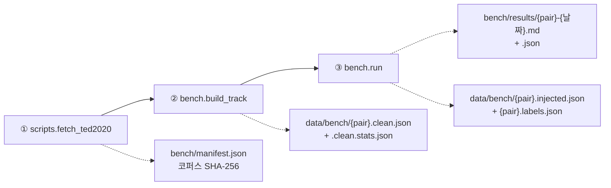

# cuesift

**AI 자막 번역·검수 트리아지 엔진**

> *"Sift the cues that actually need a human."* — 사람이 정말 봐야 할 자막만 걸러냅니다.

[](https://github.com/withwooyong/cuesift/actions/workflows/ci.yml)
[](LICENSE)
[](pyproject.toml)

> [!WARNING]
> **개발 이전 단계(pre-alpha)입니다.** Tier 0 신호 엔진(무료 결정론적 신호 9종 ·
> 위험도 융합 · 트리아지 선별)은 구현·**실측까지 끝났고**(아래 참고) 자막 파일
> 파싱(`ingest`)도 들어왔습니다. **`check`(규격 검사)와 `translate`(번역)는 CLI에
> 배선되어 실제로 동작합니다** — 아래 "CLI" 절 참고. STT(`transcribe`)만 아직
> 종료 코드 `70`(미구현)을 반환합니다.

---

## 실측: Recall @ Budget

무작위로 검수 대상을 고르는 것과 비교해, Tier 0 결정론적 신호 9종만으로 트리아지하면
**실제 검수 비율 10%에서 무작위 대비 약 7.4배**(en-ko **7.24x** · ja-ko **7.52x**)의
오류 포착률을 냅니다. 공개 병렬 코퍼스 TED2020(OPUS)에서 표본 5,000건씩을 뽑아
합성 오류를 주입하고 측정한 결과입니다(2026-07-29).

> 배수는 **요청한 예산이 아니라 실제로 검수 큐에 들어간 비율**로 나눕니다.
> hard fail 신호가 예산과 무관하게 무조건 큐에 들어가기 때문입니다(요구사항정의서
> §9.1, §6.2). **예산 10%는 요청 예산과 실제 검수 비율이 처음 일치하는 지점**이라
> 가장 오해 없이 인용할 수 있는 값입니다 — 더 낮은 예산(1~5%)은 배수가 8.8배까지
> 오르지만, 그 구간은 hard fail만으로 채워져 실제 검수 비율이 요청보다 훨씬
> 높습니다(아래 표의 "실제 검수" 열 참고).

| 요청 예산 | en-ko 실제 검수 | en-ko Recall | en-ko 배수 | ja-ko 실제 검수 | ja-ko Recall | ja-ko 배수 |
| --- | --- | --- | --- | --- | --- | --- |
| 1% | 6.32% | 54.60% | 8.64x | 5.68% | 49.80% | 8.77x |
| 2% | 6.32% | 54.60% | 8.64x | 5.68% | 49.80% | 8.77x |
| 5% | 6.32% | 54.60% | 8.64x | 5.68% | 49.80% | 8.77x |
| **10%** | **10.00%** | **72.40%** | **7.24x** | **10.00%** | **75.20%** | **7.52x** |
| 20% | 20.00% | 86.60% | 4.33x | 20.00% | 83.60% | 4.18x |
| 30% | 30.00% | 89.40% | 2.98x | 30.00% | 85.20% | 2.84x |

예산 1~5% 행이 모두 같은 값인 것은 버그가 아닙니다 — hard fail이 예산을 우회해
무조건 큐에 들어가므로, 요청 예산이 hard fail만으로 채워지는 실제 검수 비율(en-ko
6.32% · ja-ko 5.68%)보다 낮은 동안은 요청을 더 낮춰도 결과가 바뀌지 않습니다.

전체 재현 정보(코퍼스 SHA-256·시드·커밋)·유형별 Recall·오라클 대비 달성률·
신호별 ablation은 리포트 원본에 있습니다 —
[`bench/results/en-ko-2026-07-29.md`](bench/results/en-ko-2026-07-29.md) ·
[`bench/results/ja-ko-2026-07-29.md`](bench/results/ja-ko-2026-07-29.md).

**한계**: 합성 오류 주입 기반 측정이며, 실제 번역 오류와의 일치도는 아직
검증하지 않았습니다(요구사항정의서 §9.2). **위 배수는 의미 오류에는 적용되지
않습니다** — 의미가 뒤집힌 문장(`negation`)만 놓고 보면 Tier 0는 예산 10%에서
**무작위보다도 못합니다**(1.41% vs 무작위 9.61%). 다른 오류를 상위로 올리면서
문법적으로 완벽한 문장을 오히려 큐에서 밀어내기 때문입니다 — Tier 1 투자가
필요한 이유입니다(요구사항정의서 §12 Q4). **이 숫자는 융합 방식을 noisy-or로
바꾸고 숫자 검출을 고친 뒤에도 소수점까지 그대로였습니다** — 결정론적 신호를
어떻게 조합하든 의미 판단에는 닿지 못한다는 뜻입니다. 또한 **ko 자막의 약 절반(en-ko
49.91% · ja-ko 48.09%)이 TED 규격(21자 × 2줄)에 물리적으로 담기지 않아
표본에서 애초에 빠졌습니다** — 남은 표본이 짧은 문장으로 기울어 있다는
뜻입니다(리포트의 "코퍼스 제외" 절 참고).

### 재현

코퍼스(TED2020/OPUS)는 **CC BY-NC-ND 4.0**이라 원본도 가공물도 이 리포에
포함하지 않습니다. 아래 3단계로 직접 내려받아 재현합니다.



| 단계 | 하는 일 | 산출물 |
| --- | --- | --- |
| ① `fetch_ted2020` | 코퍼스 획득(약 78MB)·SHA-256 기록 | `bench/manifest.json` |
| ② `build_track` | 언어쌍당 5,000건 합성. **규격 위반 0건을 단언** | `{pair}.clean.json` · 코퍼스 제외 통계 |
| ③ `run` | 오류 7종 주입 → Tier 0 측정 → 리포트 | 리포트 `.md`/`.json` · **감사 산출물** |

②의 "규격 위반 0건" 단언이 전제입니다 — 깨끗하지 않은 트랙에서는 검출된 위반이
주입분인지 합성 실패인지 구분할 수 없습니다.

```bash
# ① 코퍼스 획득
python -m scripts.fetch_ted2020

# ② 깨끗한 트랙 합성
python -m bench.build_track --pair en-ko
python -m bench.build_track --pair ja-ko

# ③ 주입 · 측정 · 리포트
python -m bench.run --pair en-ko
python -m bench.run --pair ja-ko
```

> `python bench/run.py`가 아니라 **`python -m bench.run`** 이어야 합니다.
> 스크립트를 직접 실행하면 리포 루트가 `sys.path`에서 빠져 `cuesift`·`bench`
> 패키지를 찾지 못합니다.

시드는 기본값(`20260729`)이 위 표의 숫자를 냅니다. `--seed`를 바꾸면 다른 표본이
나오므로 값도 달라집니다.

**감사 산출물** — ③은 변조된 트랙과 정답 라벨을 `data/bench/`에 함께 남깁니다
(`{pair}.injected.json` · `{pair}.labels.json`). 라벨 파일에는 시드·커밋과 **변조
트랙의 SHA-256**이 기록되어 있어, 벤치를 다시 돌리지 않고도 정답을 검증할 수
있습니다 — 깨끗한 트랙과 변조 트랙을 비교하면 라벨과 정확히 일치해야 합니다.

**용어집(`bench/glossary.ted.yaml`)을 고치면** 회귀 게이트를 다시 돌립니다.
돌리지 않으면 대응률이 낮은 용어가 섞여 "용어집이 틀려서 생긴 오탐"과 "검출기
성능"을 구분할 수 없게 됩니다.

```bash
python -m scripts.glossary_verify --pair en-ko   # 등장 20건 이상 · 대응률 79.8% 이상
python -m scripts.glossary_verify --pair ja-ko
```

---

## 문제

다국어 OTT 자막 현지화에서 **번역가 검수가 비용·병목·품질편차의 단일 원인**입니다.
20개 언어 × 16부작이면 검수 공수가 20배로 늘고, 언어 하나가 늦으면 동시 출시가 깨집니다.

기존 도구는 양극단입니다 — TMS는 워크플로만 관리하고 품질 판단은 사람에게 넘기며,
품질추정(QE) 모델은 존재하지만 **자막 파이프라인에 배선되어 있지 않습니다.**

## 접근

전량 검수를 **위험도 순 부분 검수**로 바꿉니다.
번역 결과 전체에 위험 점수를 매기고, 상위 N%만 사람에게 올립니다.

```text
자막/영상 → (STT) → 번역 → 위험도 채점 → 상위 N% 트리아지 → 리포트
```

위험 신호는 단일 지표가 아니라 규격 위반·자가일관성·품질추정 등을 결합해 산출합니다.
자세한 설계는 [요구사항정의서](docs/요구사항정의서.md)를 참고하세요.

## CLI (`check`·`translate` 구현 완료 · `transcribe` 설계 확정)

### `cuesift check` — 규격 검사 (동작합니다)

```bash
# 규격 검사만 (CI 게이트) — 위반이 있으면 종료 코드 1
cuesift check dist/episode01.ja.srt --spec ja --fail-on hard

# 내장 프로파일 대신 우리 규격으로 (FR-5.3)
cuesift check dist/episode01.ja.srt --spec ./our-spec.yaml
```

내장 프로파일은 `en` · `ja` · `ko`와 벤치마크용 `ted-en` · `ted-ja` · `ted-ko` 여섯입니다.
`--spec` 값이 `.yaml`/`.yml`로 끝나면 파일 경로로, 그 외에는 내장 이름으로 해석합니다 —
존재 여부가 아니라 **확장자**로 가르므로 오타 난 경로가 "내장 이름이 없다"는 틀린 진단을
받지 않습니다.

판정하는 위반은 7종입니다 — `line_length` · `line_count` · `cps` · `duration_short` ·
`duration_long` · `overlap` · `empty_cue`. 위반 목록은 이 명령의 정상 산출물이므로
**stdout**으로 나가고(`cuesift check ... > violations.txt`로 갈무리됩니다),
진단 실패 메시지만 stderr로 갑니다.

```text
$ cuesift check check_violations.ass --spec ko
check_violations.ass (ass · 검사 큐 4개 · 프로파일 ko)
위반 4건 · 위반 큐 3/4개 (75.0%)

  #3  00:00:05.000  line_length    22.0 > 16.0  (2번째 줄)
  #3  00:00:05.000  cps            25.5 > 12.0
  #4  00:00:05.500  overlap        500ms
  #5  00:00:09.000  empty_cue      텍스트 없음

위반 4건 · 위반 큐 3/4개 (75.0%)
```

**요약을 머리와 끝 양쪽에 냅니다.** 위반이 682건이면 686줄이 나가고, 26화 × 3언어
매트릭스에서 프로파일을 잘못 물리면 약 5만 줄이 쌓입니다. 로그를 앞에서 남기고 뒤를
자르는 CI에서는 **가장 중요한 한 줄이 가장 먼저** 사라집니다. 양쪽에 두면 절단 방향과
무관하게 살아남습니다.

`#N`은 **원본 파일의 이벤트 순번**입니다 — 주석·드로잉을 걸러 낸 뒤의 순번이 아니므로
`검사 큐 N개`보다 클 수 있습니다. 다만 **SRT에 인쇄된 번호는 아닙니다**: pysubs2가 그
번호를 버리므로, 큐가 `1,2,4,5`로 매겨진 파일(3번이 지워진 파일)에서는 파일의 `4`를
`#3`으로 부릅니다. 인쇄 번호 보존은 v0.1 범위 밖입니다.

위반이 없을 때도 **무엇을 대상으로 통과했는지**를 냅니다 — 큐 개수와 프로파일 이름이
없으면 엉뚱한 파일이나 엉뚱한 프로파일로 통과한 것을 알 수 없기 때문입니다.

```text
$ cuesift check minimal.srt --spec ko
minimal.srt (srt · 검사 큐 2개 · 프로파일 ko) - 위반 없음
```

#### `--fail-on`

| 값 | 동작 |
| --- | --- |
| `hard` (기본) | 위반이 1건이라도 있으면 종료 코드 1 |
| `any` | **v0.1에서는 `hard`와 같습니다** — 규격 위반 7종이 전부 같은 등급입니다 |
| `none` | 위반을 stdout에 출력하되 **항상 종료 코드 0** |

세 값 중 둘이 같은 것은 v0.1에 심각도 등급이 하나뿐이기 때문입니다. 등급 배정의 출처가
없어서 만들지 않았습니다 — 1차 출처인 Netflix TTSG에 위반 등급 구분이 없습니다.
등급이 생기면 `hard`와 `any`가 갈라집니다.

#### `--limit`

위반 목록을 N건까지만 출력합니다. **기본값 `0`은 무제한**이라 아무것도 지정하지 않으면
지금까지와 똑같이 전부 나갑니다 — 상한을 기본으로 켜면 전체 목록을 파이프로 받아
grep하던 쓰임이 조용히 잘리기 때문입니다.

```text
$ cuesift check check_violations.ass --spec ko --limit 1
check_violations.ass (ass · 검사 큐 4개 · 프로파일 ko)
위반 4건 · 위반 큐 3/4개 (75.0%)

  #3  00:00:05.000  line_length    22.0 > 16.0  (2번째 줄)
  ... 3건 생략 (전체는 --limit 0)

위반 4건 · 위반 큐 3/4개 (75.0%)
```

| 규칙 | 이유 |
| --- | --- |
| **종료 코드는 `--limit`에 영향받지 않습니다** | 3건만 보여준다고 위반이 3건인 것은 아닙니다. 종료 코드는 **판정의 결과이지 출력의 결과가 아닙니다** — 여기가 흔들리면 CI 게이트가 출력 옵션에 좌우됩니다 |
| **요약은 언제나 전체 기준입니다** | 자른 뒤에 세면 `--limit 3`이 "위반 3건"이라는 거짓말을 냅니다. 위 예시에서 `4 = 1(표시) + 3(생략)`으로 합계가 닫힙니다 |
| 잘리면 반드시 고지합니다 | 고지가 없으면 사용자는 목록이 전부라고 읽습니다 |
| 상한이 위반 수보다 크면 고지가 없습니다 | `0건 생략`은 그 자체로 거짓말입니다 |
| 음수는 종료 코드 `2` | 명령줄이 틀린 것입니다 |

#### 종료 코드

**CI 게이트에서 가장 중요한 계약입니다.** `!= 0`으로 뭉뚱그리면 `66`(파일이 깨졌다)이
"규격 위반"으로 오보되고, 사용자는 멀쩡한 자막을 고치려 듭니다. 아래는 `check`·`translate`
공통 계약입니다(`src/cuesift/cli.py` 모듈 독스트링이 단일 출처입니다).

| 코드 | 뜻 | 어느 명령 |
| --- | --- | --- |
| `0` | 위반 없음(`check`, 또는 `--fail-on none`), 전량 번역 성공(`translate`) | 공통 |
| `1` | **규격 위반 발견**(`check`), **번역 일부 세그먼트 실패 — 원문 유지**(`translate`) | 공통 |
| `2` | **명령줄이 틀림** — 파일 없음 · 디렉터리 · 알 수 없는 프로파일 · 프로파일 파일 해석 실패 등 | 공통 |
| `66` | **파일 사정이 틀림** — `check`: 자막 아님 · utf-8 아님 · 읽기 불가 · 파싱 실패 · 큐 0개 · 타임코드 역전·음수. `translate`: 자막·용어집 파싱 실패 · utf-8 아님 · 읽거나 쓰지 못함 | 공통 |
| `69` | **외부 서비스(LLM 프로바이더)가 요청을 거부함** — 인증 실패·모델 없음 등 | `translate`만 |
| `70` | 미구현 | `transcribe`만 |

`2`와 `66`을 가르는 축은 **"호출이 틀렸나, 파일이 틀렸나"** 입니다. 둘을 구분하지 못하면
CI가 "경로 오타"와 "자막이 깨졌다"에 같은 대응을 하게 됩니다.
`66`은 `sysexits.h`의 `EX_NOINPUT`, `69`는 `EX_UNAVAILABLE`, `70`은 `EX_SOFTWARE`입니다.

**음수 타임코드가 `1`이 아니라 `66`인 것도 같은 축입니다.** `cps`·`line_length`는 검수자가
그 큐의 텍스트를 고치면 되지만, 음수 좌표는 싱크·변환 파이프라인의 사고라 자막을 아무리
들여다봐도 고칠 수 없습니다. 섞으면 CI가 두 사고에 같은 대응을 하게 됩니다.

#### 입력 포맷

| 포맷 | 확장자 | 근거 |
| --- | --- | --- |
| SubRip | `.srt` | FR-1.1 |
| WebVTT | `.vtt` | FR-1.1 |
| ASS / SSA | `.ass` · `.ssa` | FR-1.1 |
| SAMI | `.smi` · `.sami` | 한국 레거시 자막의 주력 포맷. pysubs2가 처리하며 **실측으로 확인**했습니다 |

포맷별 분기 코드가 0개인 것은 pysubs2가 포맷 판별과 태그 정규화를 전부 하기 때문입니다.
TTML은 FR-1.6으로 v0.3에 있습니다. 인코딩은 **utf-8만** 받습니다 — cp949 자막은
종료 코드 `66`과 함께 변환 안내를 냅니다.

### `cuesift translate` — 번역 (FR-8.1, 동작합니다)

```bash
export CUESIFT_BASE_URL=http://127.0.0.1:11434/v1
export CUESIFT_MODEL=qwen2.5:3b
cuesift translate ep01.ko.srt --to en,ja --out dist
```

**같은 명령을 다시 치면 재개됩니다.** 성공한 호출은 `.cuesift/cache/`에
남아 두 번째 실행에서 네트워크를 타지 않습니다.

**형식을 어긴 응답도 캐시됩니다.** 재실행으로는 결과가 나아지지 않습니다 —
모델을 바꾸거나 `--no-cache`를 쓰거나 `.cuesift/cache/`를 지웁니다.

```bash
cuesift translate ep01.ko.srt --to en --dry-run   # 몇 번 더 불러야 하나
```

`--dry-run`은 실행하지 않고 배치 수·문자 수·캐시 히트를 실측해 냅니다. **토큰과
비용은 추정하지 않습니다** — 문자에서 토큰으로 가는 계수가 모델마다 다르고
우리에게 출처가 없기 때문입니다(요구사항정의서 §11 R8, "출처 없는 수치를
기본값으로 넣지 않음").

`--review-budget`은 아직 구현되지 않았습니다(WP5) — 지정해도 경고만 내고 무시됩니다.
설정 파일 `cuesift.yaml`(FR-8.4)도 아직 구현되지 않았습니다. **`--config`는
`translate`의 옵션이 아니라 `cuesift` 바로 뒤에 붙는 최상위 옵션입니다**
(`cuesift --config c.yaml translate ...` — 서브커맨드 뒤에 쓰면 `No such option`으로
종료 코드 2가 납니다). 지정하면 경고를 내고 CLI 인자만 반영합니다 — 조용히
무시되지 않습니다. 구현되면 모든 옵션을 파일로 지정할 수 있으며, **CLI 인자가
설정 파일보다 우선**합니다.

### `cuesift transcribe` (설계 확정, 구현 예정)

아래 명령은 아직 종료 코드 `70`(미구현)을 반환합니다.

```bash
# 영상 입력 (자막 없음) — STT로 원문 생성
cuesift transcribe episode02.mp4 --source-lang ko
```

## 개발 환경

PyPI 배포 전이므로 소스에서 설치합니다.

```bash
git clone https://github.com/withwooyong/cuesift.git
cd cuesift
python -m venv .venv && source .venv/bin/activate   # Windows: .venv\Scripts\activate
pip install -e ".[dev]"

pytest
ruff check .
```

> STT(`whisperx`)와 품질추정(`unbabel-comet`)은 `torch`를 끌고 오므로 **선택 의존성**으로 분리했습니다.
> 필요할 때만 `pip install -e ".[dev,stt,qe]"` 로 설치하세요.
> 개발은 Python **3.11 / 3.12** 를 권장합니다 — CI가 검증하는 범위이며, 그 이상은 torch 휠이 없을 수 있습니다.

### 실제 LLM 엔드포인트 테스트 (`-m live`)

번역 테스트는 기본적으로 **가짜 프로바이더** 위에서 돕니다. 실제 엔드포인트를 치는 테스트는
`pyproject.toml`의 `-m "not live"`로 제외되어 있으므로, 돌리려면 명령줄에서 `-m live`로 덮습니다.

| 환경변수 | 필수 | 설명 |
|---|---|---|
| `CUESIFT_LIVE_BASE_URL` | ✅ | OpenAI 호환 엔드포인트. 예: `http://localhost:11434/v1` |
| `CUESIFT_LIVE_MODEL` | ✅ | 모델 이름. 예: `qwen2.5:3b` |
| `CUESIFT_LIVE_API_KEY` | — | 없으면 `Authorization` 헤더를 붙이지 않습니다. 로컬 Ollama는 불필요 |

앞의 둘 중 하나라도 없으면 **실패가 아니라 skip**입니다 — `-m live`는 "돌릴 의사가 있다"이지
"엔드포인트가 있다"가 아니고, 상시 빨간 게이트는 무시되는 게이트가 됩니다.

```powershell
winget install --id Ollama.Ollama -e     # 설치 후 새 터미널
ollama pull qwen2.5:3b

$env:CUESIFT_LIVE_BASE_URL = "http://localhost:11434/v1"
$env:CUESIFT_LIVE_MODEL    = "qwen2.5:3b"
.venv/Scripts/python.exe -m pytest tests/test_translate_live.py -m live -v -s
```

`-s`는 장식이 아닙니다. 이 테스트의 목적이 `[live] calls=N`을 눈으로 읽는 것인데,
`-s`가 없으면 pytest가 stdout을 삼켜 **통과한 실행에서는 그 줄이 아예 보이지 않습니다.**

## 문서

| 문서 | 내용 |
|---|---|
| [docs/요구사항정의서.md](docs/요구사항정의서.md) | 배경·요구사항·아키텍처·인터페이스 명세 |
| [docs/번역관리_TMS_솔루션_비교.md](docs/번역관리_TMS_솔루션_비교.md) | 기존 TMS 솔루션 조사 |
| [docs/AI_자막검수_오픈소스_비교.md](docs/AI_자막검수_오픈소스_비교.md) | 자막 검수 오픈소스 조사 |
| [벤치마크 하네스 설계](docs/superpowers/specs/2026-07-28-ted2020-benchmark-harness-design.md) | TED2020 코퍼스 · 오류 주입 · Recall@Budget 측정 |
| [Tier 0 신호 엔진 구현 계획](docs/superpowers/plans/2026-07-28-tier0-signal-engine.md) | 구현 계획과 실행 중 바뀐 결정 |
| [벤치마크 하네스 구현 계획](docs/superpowers/plans/2026-07-29-ted2020-benchmark-harness.md) | 구현 계획과 실행 중 바뀐 결정 (계획 결함 12건·프로세스 기록) |
| [인제스트 설계](docs/superpowers/specs/2026-07-31-ingest-design.md) | 자막 파일 → `Segment` · pysubs2 실측 근거 · 오류 계약 |
| [인제스트 구현 계획](docs/superpowers/plans/2026-07-31-ingest.md) | 태스크 8개 · 계획 결함 4건과 정정 기록 |
| [`check` 배선 설계](docs/superpowers/specs/2026-08-03-check-cli-design.md) | 신호 엔진을 우회하는 근거 · 종료 코드 5종 · 심각도 단일 등급 |
| [`check` 배선 구현 계획](docs/superpowers/plans/2026-08-13-check-cli.md) | 태스크 7개 · 실측으로 정정한 설계 5건 |

## 라이선스

[Apache-2.0](LICENSE) · 저작권 있는 자막·영상은 이 리포에 포함하지 않습니다.
벤치마크는 공개 다국어 병렬 코퍼스(TED2020/OPUS 계열)로 구성합니다.
