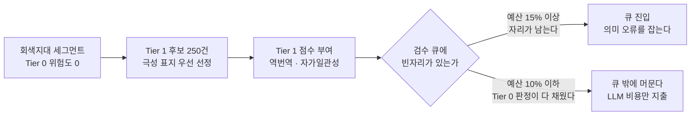
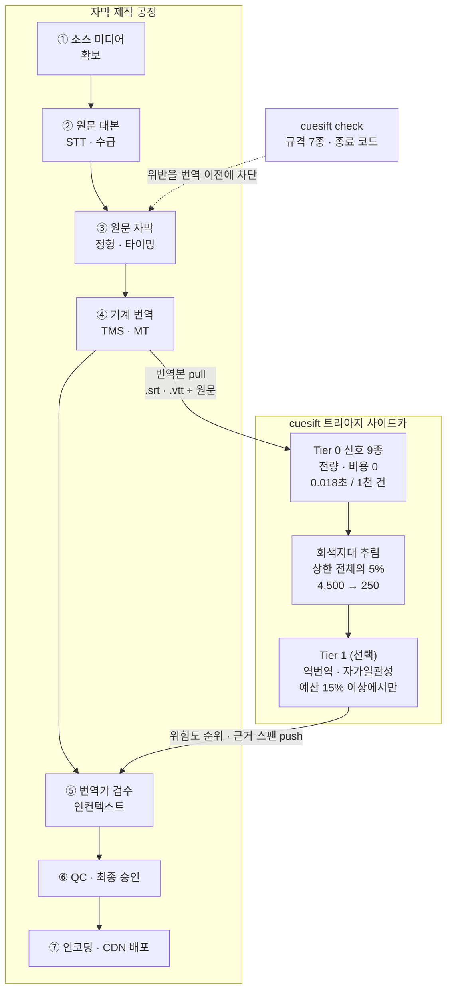

# OTT 파이프라인 도입 검토

**대상 독자**: 사내 자막 제작 공정에 cuesift 를 넣을지 판단하는 사람입니다.
무엇을 잡고 무엇을 못 잡는지는 [제품설명서.md](제품설명서.md)가, 옵션과 계약의 정본은
[README.md](../README.md)가 갖습니다. **이 문서는 그 둘이 다루지 않는 것 —
어느 공정에 붙이는가, 붙이기 전에 무엇이 막는가 — 만 다룹니다.**

| 항목 | 값 |
| --- | --- |
| 검토일 | 2026-09-13 |
| 대상 커밋 | `27eced6` (`main`) |
| 실측 출처 | [`bench/results/en-ko-2026-09-13.md`](../bench/results/en-ko-2026-09-13.md) · [`bench/results/ja-ko-2026-09-13.md`](../bench/results/ja-ko-2026-09-13.md) |

---

## 0. 결론

| 축 | 판정 | 근거 |
| --- | --- | --- |
| 코드 · 게이트 성숙도 | **실무 수준** | 테스트 1,995건 전부 통과 · 커버리지 98% · 게이트 5종 위반 0건 |
| 트리아지 성능 | **조건부 유효** | 검수 비율 10% 에서 무작위 대비 7.32배(ko→en) · 7.56배(ko→ja). 단 합성 오류 측정이다 |
| 프로덕션 운영 준비도 | **미달** | 동시 처리 · 구조화 로그 · 감사 추적 · 출력 스키마 버전이 모두 없다 |

세 축이 갈리는 것이 이 검토의 요지다. **막는 것은 정확도가 아니라 운영 기능이며,
그래서 오프라인 파일럿은 지금 당장 가능하고 파이프라인 상주는 보강을 요구한다.**

---

## 1. 이미 검증된 것

Tier 0 결정론적 신호 9종의 포착률은 [제품설명서 §4](제품설명서.md)에 있고 여기서
반복하지 않는다. **다만 그 표에 없는 검수 예산 15% 지점만 적어 둔다** — 아래 §3 의
Tier 1 판정이 이 지점에서 갈리기 때문이다.

| 요청 예산 | ko→en 포착률 | 배수 | ko→ja 포착률 | 배수 |
| --- | --- | --- | --- | --- |
| 15% | 85.6% | 5.71배 | 82.6% | 5.51배 |

배수는 실제 검수 비율로 나눈 값이다(FR-6.2 · §9.1). 예산 15% 는 hard fail 비율을
넘어선 구간이라 요청 예산과 실제 검수량이 일치한다.

### 처리량 — 검토 항목이 아니다

리포에 처리량 수치가 없어 이 검토에서 직접 측정했다. Tier 0 전량 적용(신호 수집 →
융합 → 트리아지)의 실측값이다.

| 세그먼트 | 합계 | 1천 건당 |
| --- | --- | --- |
| 100 | 0.002초 | 0.019초 |
| 1,000 | 0.019초 | 0.019초 |
| 5,000 | 0.088초 | 0.018초 |
| 20,000 | 0.364초 | 0.018초 |

2만 건까지 선형으로 유지된다. 60분 에피소드 한 편이 보통 700~900큐이므로 한 편에
약 0.015초이고, 시즌 20편을 전량 훑어도 1초를 넘지 않는다. **비용이 드는 구간은
Tier 0 가 아니라 기계 번역과 Tier 1 의 LLM 호출이다.**

---

## 2. 아직 검증되지 않은 것

도입을 판단한다면 §1 보다 이 절이 중요하다. 세 항목 모두 리포트 본문이 스스로 적어 둔
한계이며, **실제 자막으로 다시 재는 것 말고는 닫는 방법이 없다.**

| 미지수 | 내용 | 도입 판단에 주는 영향 |
| --- | --- | --- |
| **합성 오류로 측정했다** | 코퍼스에 인위적으로 주입한 오류이며, 실제 번역 엔진이 내는 오류 분포와 같다는 보장이 없다 | 위 배수는 **상한으로 읽어야 한다** |
| **표본이 짧은 문장으로 기울었다** | ko 자막의 약 절반(ko→en 49.91% · ko→ja 48.09%)이 규격에 물리적으로 담기지 않아 표본에서 빠졌다 | 긴 대사 · 빠른 대화 · 겹치는 화자가 많은 실제 콘텐츠는 분포가 다르다 |
| **의미 반전 정답지가 한 방향뿐이다** | 의미 반전을 **부정 표현 제거**로만 만들었다. 긍정을 부정으로 바꾸는 방향은 측정되지 않았다 | 원래 부정문이던 세그먼트로 표본이 기울어, 방향 대칭성이 확인되지 않았다 |

언어쌍은 ko→en 과 ko→ja 만 검증됐다(§12 Q2). 다른 언어쌍은 규격 프로파일부터 새로
만들어야 하며, 그 언어의 문자 폭과 읽기 속도 기준을 출처와 함께 정해야 한다.

---

## 3. Tier 1 을 켤 조건 — 검수 예산 15% 가 경계다

**이 절의 표가 이 문서의 단일 출처다.** 예산 5지점을 나란히 놓은 표는 다른 문서에 없고,
[HANDOFF.md](../HANDOFF.md) 이월 23번 절이 종결 경위를 갖는다.

| 검수 예산 | ko→en 의미 반전 | ko→en 전체 | ko→ja 의미 반전 | ko→ja 전체 | 판정 |
| --- | --- | --- | --- | --- | --- |
| 5% | 0.0 → 0.0 | 54.6 → 54.6 (+0건) | 1.4 → 1.4 | 49.4 → 49.4 (+0건) | **지출만 발생** |
| 10% | 1.4 → 1.4 | 73.2 → 73.2 (+0건) | 2.8 → 2.8 | 75.6 → 75.6 (+0건) | **지출만 발생** |
| **15%** | 4.2 → **18.3** | 85.6 → 87.8 (+11건) | 7.0 → **16.9** | 82.6 → 83.8 (+6건) | 이득 시작 |
| 20% | 8.5 → **33.8** | 86.4 → 89.8 (+17건) | 14.1 → 15.5 | 83.8 → 83.8 (+0건) | 언어쌍별로 갈림 |
| 30% | 19.7 → **42.3** | 88.0 → 91.2 (+16건) | 19.7 → **36.6** | 84.8 → 87.2 (+12건) | 이득 최대 |

화살표 왼쪽이 Tier 0 단독, 오른쪽이 Tier 0+1 이다. 단위는 %이고 괄호는 전체 오류
500건 중 늘어난 건수다. **운영 함의는 하나다 — 검수 예산을 10% 이하로 잡을 계획이라면
Tier 1 을 켜지 않는다.** LLM 호출 비용만 나가고 포착률은 그대로다.

### 낮은 예산에서 기여가 0인 것은 결함이 아니다

이월 23번을 닫으면서 `reselect_protecting_tier0` 을 넣었다. **Tier 1 은 Tier 0 가 아무
신호도 내지 못한 칸만 가져간다** — 그래서 전체 포착률이 떨어지는 구간이 사라졌고,
대신 자리가 빡빡한 낮은 예산에서는 들어갈 틈을 얻지 못한다.

후보 선정 자체는 잘 동작한다. 회색지대 4,500건에서 250건을 고를 때 의미 반전 오류
17건을 담아 무작위 기대값 3.89건의 **4.37배**를 적중한다(이월 21번 종결 기준).
**신호도 맞고 선정도 맞는데 큐에 못 들어가는 것이 낮은 예산 구간의 성질이다.**

---

## 4. 파이프라인의 어디에 넣는가

결론은 **기계 번역과 번역가 검수 사이**이며, 공정을 가로막는 관문이 아니라 옆에 붙는
사이드카다. 규격 검사(`check`)만 위치가 달라 번역 이전 단계에 CI 게이트로 붙는다.

점선이 통과와 차단만 판정하는 게이트이고 실선이 데이터가 오가는 경로다.
**③ · ④ · ⑤ 세 단계만 이 도구가 실제로 관여한다.**

| 공정 | 할 수 있는 것 | 없는 것 | 판정 |
| --- | --- | --- | --- |
| ① 소스 미디어 확보 | — | 전부 | 범위 외 |
| ② 원문 대본 작성 | OpenAI 호환 STT 엔드포인트 호출(FR-1.2 · FR-1.4) | 화자 분리 · 대본 정렬. **실제 엔드포인트가 없어 가짜 프로바이더로만 검증됐다**(WP9) | 보조 |
| ③ 원문 자막 정형 | 규격 7종 판정 — 행 수 · 행 길이 · 초당 글자수 · 표시 시간 상하한 · 겹침 · 빈 큐 | **교정 기능이 전혀 없다.** 리타이밍 · 재분할 · 갭 삽입이 없다 | 판정만 |
| ④ 기계 번역 | 배치 번역 · 용어집 주입 · 캐시 · 재시도 · 부분 실패 보존(FR-2.x) | 동시 처리가 없어 순차 실행이다. 처리량이 병목이다 | 대체 아님 |
| **⑤ 기계 검수** | Tier 0 9종 + Tier 1, 실제 검수 비율 기준 예산 트리아지, JSON · HTML 리포트(FR-7.x) | 출력 스키마 버전 · 감사 로그 | **본진** |
| ⑤ 사람 검수 | 위험 구간을 강조한 HTML 리포트, 근거 스팬과 순위 | **읽기 전용이다.** 수정 반영 · 코멘트 · 승인 상태 왕복이 없고 TMS 커넥터도 없다 | 읽는 뷰만 |
| ⑥ QC · 최종 승인 | 종료 코드 게이트(FR-8.2) | 승인 이력 · 서명 · 감사 로그. 규격 항목이 얇아 QC 를 대체하지 못한다(아래 §5) | 없음 |
| ⑦ 인코딩 · 배포 | — | 전부 | 범위 외 |

**기존 QC 를 대체하는 것이 아니라 겹쳐 쓰는 것이 맞다.** 상용 번역 관리 시스템의 자막
QA 는 행 수 · 타임코드 · 읽기 속도 같은 규격을 보고, cuesift 는 번역 내용의 위험도를
본다. 규격 항목의 깊이는 상용 QC 가 앞서 있으므로 그쪽을 걷어 낼 근거가 없다
(연동 형태는 [번역관리_TMS_솔루션_비교.md](번역관리_TMS_솔루션_비교.md) §2 참고).

---

## 5. 상주시키기 전에 막는 것

아래 여섯 항목은 정확도와 무관하다. 파일럿에서는 사람이 손으로 돌리면 되므로 문제가
되지 않고, **사내 파이프라인에 상주시킬 때 순서상 먼저 걸린다.**

| 항목 | 현재 상태 | 없으면 무슨 일이 생기는가 | 보강 |
| --- | --- | --- | --- |
| **동시 처리** | 비동기 · 스레드 · 프로세스 코드가 한 줄도 없다 | 번역과 Tier 1 이 순차 호출이라 시즌 단위 처리 시간이 선형으로 늘어난다. Tier 1 은 후보당 재번역 3회라 곱해진다 | 중간 |
| **구조화 로그 · 감사 추적** | 로깅 모듈을 쓰지 않는다 | 어떤 자막이 언제 어느 호스트로 나갔는지 남지 않는다. **미공개 콘텐츠 계약에서 첫 질문이 이것이다** | 중간 |
| **출력 스키마 버전** | 리포트 JSON 에 버전 필드가 없다 | 하류 시스템이 파싱 계약을 고정할 수 없어, 도구를 올릴 때마다 조용히 깨진다 | 작음 |
| **외부 전송 통제** | 엔드포인트는 설정으로 바꿀 수 있으나 허용 호스트 목록이나 오프라인 강제 모드가 없다 | 설정 오타 하나로 전량이 외부 API 로 나가고, 나갔다는 기록조차 남지 않는다 | 작음 |
| **규격 항목의 깊이** | 프로파일 필드 8개 · 검사 7종 | 최소 프레임 갭 · 씬 컷 · 이탤릭 · 화자 대시 · 강제 자막 · 화면 위치 · 음향 효과 표기 · 프레임레이트가 없어 기존 QC 를 대체하지 못한다 | 큼 |
| **재현성 기록** | 온도는 0으로 고정하나 시드가 없고, 리포트에 도구 · 모델 버전 필드가 없다 | 백엔드가 조용히 갱신되면 같은 입력에 다른 출력이 나오고, 무엇으로 냈는지 파일에 남지 않는다 | 작음 |

「작음」 세 항목(출력 스키마 버전 · 외부 전송 통제 · 재현성 기록)은 서로 독립이라 한
묶음으로 처리할 수 있다.

### 작은 결함 셋

| 결함 | 실측 | 왜 문제인가 |
| --- | --- | --- |
| 언어와 프로파일의 정합을 검사하지 않는다 | 한국어 자막을 `--spec ja` 로 검사해 「위반 없음」 종료 코드 0 | 사람이 헤더의 프로파일 라벨을 읽어 잡는 설계인데, 자동화 파이프라인에는 그 사람이 없다 |
| 규격 검사에 기계 판독 출력이 없다 | `check --help` 에 json · format · out 옵션 0건 | CI 게이트용이라고 선언했으나 종료 코드만 나온다. 무엇이 몇 건 위반인지 다음 단계로 넘길 수 없다 |
| SCC 를 못 읽는데 조용히 오판한다 | `.scc` 를 넣으면 `tmp` 포맷으로 자동 판별해 엉뚱한 검사 결과를 낸다 | 지원 포맷은 `.srt` · `.vtt` · `.ass` · `.ttml` 계열이다. 방송 자막 자산이 SCC 라면 사전 변환이 필요하다 |

세 결함 모두 **실패가 조용하다**는 공통점이 있다. 종료 코드 0 이나 정상 리포트로
나오므로, 사람이 결과를 읽지 않는 자동화 경로에서는 드러나지 않는다.

---

## 6. 도입 경로

1단계를 건너뛰면 나머지가 의미를 잃는다. 지금 있는 모든 수치는 합성 오류로 낸 것이고,
실제 자막에서 같은 배수가 나온다는 근거는 아직 없다(§2).

| 단계 | 무엇을 하는가 | 통과 조건 · 선행 보강 |
| --- | --- | --- |
| **1. 실제 자막으로 재측정** | 이미 사람이 검수해 고친 자막 200~500건에서 수정 전 · 후를 대조해 실제 오류 정답지를 만든다. 그것으로 검수 비율 10% 의 배수를 다시 잰다 | 통과 조건: 무작위 대비 3배 이상. **코드는 고치지 않아도 된다** |
| **2. 규격 검사를 게이트로 붙인다** | 원문 자막 정형 단계(③)에 걸어 규격 위반을 번역 이전에 차단한다. LLM 이 필요 없고 실패가 결정론적이라 위험이 가장 낮다 | 선행 보강: 기계 판독 출력 · 언어 정합 검사 |
| **3. 트리아지를 읽기 전용 사이드카로 돌린다** | 기계 번역 결과를 받아 순위만 내고, 번역가는 리포트를 참고 자료로 쓴다. 공정을 막지 않으므로 오판의 대가가 작다 | 선행 보강: 출력 스키마 버전 · 외부 전송 통제. **예산 10% 이하에서는 Tier 1 을 끈다** |
| **4. TMS 왕복 연동과 상주화** | 번역 관리 시스템에서 번역본을 받아 위험도 라벨을 되돌려 주는 커넥터를 만든다 | 선행 보강: 동시 처리 · 구조화 로그 · 감사 추적 |

3단계까지는 관찰 자료를 쌓는 구간이고, 4단계부터 처리량과 감사 요건이 실제 제약이 된다.
그래서 §5 의 여섯 항목은 4단계의 선행 조건으로 묶인다.

---

## 7. 이 검토의 근거와 한계

| 결론 | 근거 |
| --- | --- |
| 포착률 수치 | [`bench/results/en-ko-2026-09-13.md`](../bench/results/en-ko-2026-09-13.md) · [`bench/results/ja-ko-2026-09-13.md`](../bench/results/ja-ko-2026-09-13.md) 원본 |
| 게이트 수치 | 이 검토에서 직접 실행 — `ruff check` · `ruff format --check` · `pytest --cov` · `check_links.py` · `markdownlint-cli2` |
| 처리량 | 이 검토에서 직접 측정(§1). **리포에 이 수치가 없어 새로 쟀다** |
| 운영 갭 6항목 · 작은 결함 3건 | `src/cuesift/` 코드 확인 및 CLI 실행 |

**한계**: 실제 LLM 백엔드를 붙인 종단 처리량(초 / 에피소드)은 측정하지 않았다.
동시 처리 부재는 코드 근거이고, 그것이 시즌 단위에서 몇 시간이 되는지는 백엔드
성능에 달려 있어 이 검토의 범위 밖이다. **1단계 파일럿에서 함께 재는 것이 맞다.**
