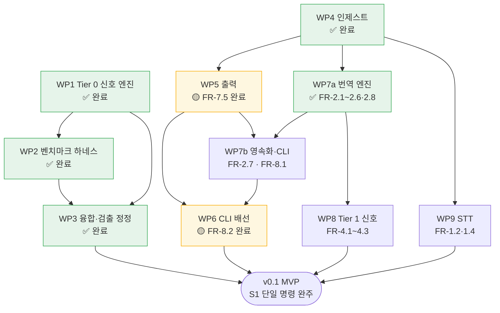

# WBS — cuesift 작업 분해 구조

> 갱신: 2026-08-16 (KST) · 기준: `feat/translate-engine`의 WP7a 완료 시점 (`9159791` 이후)
> 대상 마일스톤: **v0.1 (MVP)** — [요구사항정의서](요구사항정의서.md) §10

## 이 문서를 어떻게 읽는가

**작업 패키지(WP)는 요구사항정의서의 FR 번호에 대응한다.** 새 작업을 발명하지 않는다 —
FR에 없는 일이 WP로 올라온다면 그것은 요구사항정의서를 먼저 고쳐야 한다는 신호다.

이렇게 묶는 이유는 **진척 주장을 반증 가능하게** 만들기 위해서다.
"인제스트 60% 완료"는 아무도 반박할 수 없지만 "FR-1.1 완료"는 코드와 테스트로 확인된다.

| 기호 | 뜻 |
| --- | --- |
| ✅ | 완료 — 구현·테스트·문서가 모두 있다 |
| 🟡 | **부분 완료** — 일부 FR만 끝났고 나머지는 미착수다. 어느 FR인지 상태 칸에 적는다 |
| 🔨 | 진행 중 |
| ⬜ | 미착수 |
| ⏸ | v0.2 이후로 연기 |

## 현재 위치

```text
  v0.1 대상 FR 42개 중 28개 완료 (67%)

  WP1 Tier 0 신호 엔진   ████████████████████  ✅  FR 16개
  WP2 벤치마크 하네스     ████████████████████  ✅  (§9.1)
  WP3 융합·검출 정정      ████████████████████  ✅  FR-6.1·3.4 정정
  WP4 인제스트           ████████████████████  ✅  FR-1.1·1.3·1.5
  WP5 출력              ████░░░░░░░░░░░░░░░░  🟡  FR 5개 중 7.5 완료
  WP6 CLI 배선           ████░░░░░░░░░░░░░░░░  🟡  FR 5개 중 8.2 완료
  WP7 번역 계층          ██████████████████░░  🟡  FR 8개 중 7개 (7a 완료)
  WP8 Tier 1 신호        ░░░░░░░░░░░░░░░░░░░░  ⬜  FR 3개
  WP9 STT               ░░░░░░░░░░░░░░░░░░░░  ⬜  FR 2개
```

**FR-7.5와 FR-8.2가 서로 다른 WP에 있는데 한 작업 패키지로 끝났다.** FR-7.5(CI 종료 코드)는
요구사항정의서 §7(출력)에 있어 WP5 소속이지만, **종료 코드를 처음으로 쓰는 명령이 `check`라**
따로 구현할 자리가 없었다. 두 WP를 합치지 않고 각각 🟡로 두는 이유는 이 문서가
요구사항정의서의 **파생물**이기 때문이다 — FR 배치를 여기서 바꾸면 두 문서가 갈라진다.

**FR 개수는 작업량에 비례하지 않는다.** WP4(FR 3개)는 파서 3종이라 WP8(FR 3개)보다
훨씬 크다. 규모 추정은 아래 표의 "규모" 열을 본다.

## 작업 패키지

| WP | 이름 | FR | 상태 | 규모 | 선행 | 산출물 |
| --- | --- | --- | --- | --- | --- | --- |
| **1** | Tier 0 신호 엔진 | 3.1~3.8 · 5.1~5.3 · 6.1~6.5 | ✅ | L | — | `src/cuesift/{segment,spec,glossary,signals,risk,triage}/`. **FR-5.3은 라이브러리로는 완료였으나 CLI에서 도달할 수 없었다** — `--spec ./x.yaml`이 열리며 必 요구사항이 실제로 닫혔다 (`f16bb0f`) |
| **2** | 벤치마크 하네스 | §9.1 | ✅ | L | 1 | `bench/` · `scripts/fetch_ted2020.py` |
| **3** | 융합·검출 정정 | 6.1 · 3.4 | ✅ | S | 1·2 | `risk/fuse.py` noisy-or · `signals/structural.py` NFKC · `bench/results/` 재측정 (`2314fc6`·`78921d4`·`57bbded`) |
| **4** | 인제스트 | 1.1 · 1.3 · 1.5 | ✅ | S | — | `src/cuesift/ingest/{__init__,loader}.py` · `tests/fixtures/ingest/`(픽스처 12종) · `tests/test_ingest.py` · `tests/test_ingest_fixtures.py` · `tests/test_ingest_contamination.py` (`42a126f`·`bb105b7`·`be51706`·`52acf5b`·`d51cb3c`·`1cbc21a`·`26f7517`·`6ad9366`·`50e62cf`) |
| **5** | 출력 | 7.1~7.5 | 🟡 | M | 4 | **FR-7.5 완료** — `check`의 CI 종료 코드 5종(0·1·2·66·70)이 실제로 갈린다 (`90c6a7d`·`4899fec`·`59c7b51`·`6b45f95`). 남은 FR-7.1~7.4는 `review.json` · `report.html` · 요약 통계 |
| **6** | CLI 배선 | 8.1~8.5 | 🟡 | M | 4·5 | **FR-8.2 완료** — `cuesift check <자막파일> --spec <프로파일>`이 동작한다. `spec/check.py`에 `TrackViolation`·`check_empty_cues`·`check_track`, `cli.py`에 `check()` 본문·`_resolve_profile`·`_format_report`. [설계 스펙](superpowers/specs/2026-08-03-check-cli-design.md) (`9ef4869`) · [구현 계획](superpowers/plans/2026-08-13-check-cli.md) (`5c07fc0`) · 구현 (`4899fec`, 테스트 316→481). 남은 FR-8.1·8.3은 WP7b·WP9에, 8.4(`cuesift.yaml` 로더)·8.5(진행 표시·CI 감지)는 미착수. **표면 확장 `--limit N`**(위반 목록 상한, 기본 0=무제한)과 요약 이중 출력이 2026-08-16에 들어왔다 — FR을 새로 닫은 것이 아니라 FR-8.2의 출력 표면이므로 **완료 개수는 그대로다** (`fb0949d`·`b0a76ec`) |
| **7a** | 번역 엔진 | 2.1~2.6 · 2.8 | ✅ | L | 4 | **FR 7개 완료** — `src/cuesift/translate/`(`provider`·`batch`·`prompt`·`engine`·`openai_compat`)와 `Glossary.terms_in`. 배치 번역·개별 폴백·재시도·예외 분류가 동작한다. [설계 스펙](superpowers/specs/2026-08-16-translate-engine-design.md) (`10d3b31`) · [구현 계획](superpowers/plans/2026-08-16-translate-engine.md) (`8f0ea4a`) · 구현 (`f6e0ec6`..`1b4ea6e`, 테스트 499→**813**) · 공개 API·`live` 마커와 게이트 방어 3겹 (`9159791`~, 813→**842**). **네트워크를 치지 않는다** — `httpx.MockTransport`로 검증하고 실 API는 `-m live` opt-in |
| **7b** | 번역 영속화·CLI | 2.7 | ⬜ | M | 7a·5 | 재개(FR-2.7)·캐시(NFR-3) · `--dry-run`. **FR-8.1(`cuesift translate` 배선)도 여기서 닫힌다** — 소속은 WP6이고 WP6 행이 이미 "남은 FR-8.1·8.3은 WP7b·WP9에"라고 적어 둔 그것이다. 완료 개수는 WP6에서 센다 |
| **8** | Tier 1 신호 | 4.1~4.3 | ⬜ | M | **7a** | 자가일관성 N회 호출 · 역번역 · 적용 상한. **선행은 7a까지다** — 7b(재개·CLI)를 기다리지 않는다 |
| **9** | STT | 1.2 · 1.4 | ⬜ | M | 4 | Whisper 계열 어댑터 · `원문 검수 필요` 플래그 |

v0.1 완료 조건은 **"S1 시나리오가 단일 명령으로 완주"** 이므로 WP4~9가 전부 필요하다.
Recall@10% 최초 측정치 확보는 WP2에서 **이미 충족됐다.**

### 연기된 항목

| FR | 내용 | 버전 |
| --- | --- | --- |
| 1.6 | TTML 입출력 | v0.3 |
| 5.4 | 규격 위반 자동 교정(재분절) | v0.2 |
| 5.5 | 샷 체인지 경계 보존 | v0.3 |
| — | QE 플러그인 · 화자분리 · 캐릭터 말투 시트 | v0.2 |

## 의존 관계



**WP7a는 WP8의 선행이지만 WP7b는 아니다.** 자가일관성(FR-4.1)은 같은 세그먼트를
N회 번역해 비교하는 것이라 `translate_segments`와 `build_messages`만 있으면 되고,
재개도 CLI도 필요 없다. 두 화살표를 갈라 둔 이유가 이것이다 — 합쳐 두면
WP8이 CLI 배선을 기다리는 것처럼 보인다.

### WP7을 왜 쪼갰나

**계층 하나에 성격이 다른 두 책임이 들어 있었다.**

| | WP7a 번역 엔진 (✅) | WP7b 영속화·CLI (⬜) |
| --- | --- | --- |
| 하는 일 | 세그먼트를 받아 번역해서 돌려준다 | 그 결과를 디스크에 남기고 명령줄에 붙인다 |
| 상태 | **없다** — 순수 함수 + 프로바이더 1개 | 파일·캐시·재개 지점 |
| 테스트 | `httpx.MockTransport`로 전량 | 파일시스템 픽스처가 필요하다 |
| 실패 모드 | 모델이 형식을 어김, 네트워크 | 중단된 작업의 정합성 |

표가 말하는 것은 **두 책임의 테스트 수단이 겹치지 않는다**는 것이다.
엔진을 검증하는 데 파일시스템이 필요 없고, 재개를 검증하는 데 LLM이 필요 없다.
한 WP로 묶으면 어느 쪽 결함인지 모르는 실패가 생긴다.

`translate/`에 재개와 캐시를 **일부러 넣지 않았다.** 넣었다면 엔진의 모든
테스트가 임시 디렉터리를 들고 다녀야 했다.

**`WP5 --> WP6` 화살표는 FR-8.2에는 걸리지 않았다.** 그 의존은 `translate`가 리포트를
써야 하기 때문에 생긴 것이고, `check`는 **파일을 쓰지 않고 콘솔 요약만 낸다**(설계 D4).
그래서 WP5가 미착수인 채로 WP6의 일부가 먼저 끝날 수 있었다 — 아래 "가장 짧은 경로"가
가리킨 것이 정확히 이 틈이다.

**WP4는 병목이었다** — 출력·번역·STT 셋이 전부 여기에 걸려 있었다.
자막 파일을 `Segment`로 바꾸지 못하면 Tier 0 엔진에 실데이터가 들어가지 않기 때문이다.
완료로 WP5·WP7·WP9가 착수 가능해졌다.

### 가장 짧은 "쓸 수 있는 제품" 경로 — ✅ 도달했다 (2026-08-13)

`check` 서브커맨드(FR-8.2)는 **규격 검사만** 하므로 번역·STT 없이 완결된다.

```text
  WP4 (인제스트)  →  WP6 중 FR-8.2만  →  cuesift check 동작  ✅
```

Tier 0 엔진과 규격 프로파일이 이미 있었으므로 **파서와 배선만으로 실사용 가능한 도구가 됐다.**
v0.1 전체를 기다리지 않고 중간 산출물을 낼 수 있는 유일한 지점이었고, 실제로 그렇게 됐다 —
`cuesift check <자막파일> --spec <프로파일>`이 규격 위반 7종을 판정하고 CI가 대응을 가를 수
있는 종료 코드를 낸다 (`4899fec`, 테스트 316 → 481).

**여기서 배운 것 하나를 남긴다.** 이 경로가 짧았던 이유는 새로 만든 판정이 `empty_cue`
**하나뿐이고 나머지는 전부 배선**이었기 때문이다. 반대로 예상보다 컸던 부분은 판정이 아니라
**종료 코드 계약**이었다 — 파이썬 예외가 커맨드 본문을 빠져나가면 exit 1이 되고 이 저장소에서
1은 "규격 위반 발견"이라, 설정 사고와 파일 사고가 자막 결함으로 오보되는 누수를 12종 넘게
닫아야 했다. **다음 서브커맨드도 같은 비용을 낸다**는 뜻은 아니다: `_TolerantOutput`과
`_harden_output_streams`는 그룹 콜백·진입점에 있어 `translate`·`transcribe`가 그대로 물려받는다.

## 다음 작업 순서 (제안)

| 순 | WP | 이유 |
| --- | --- | --- |
| ~~1~~ | ~~WP3~~ | ✅ 완료 (2026-07-29). 벤치 컨텍스트가 살아 있을 때 끝냈다 |
| ~~2~~ | ~~WP4~~ | ✅ 완료 (2026-08-01). 병목이 풀려 WP5·WP7·WP9가 착수 가능해졌다 |
| ~~3~~ | ~~WP6 부분 (FR-8.2 `check`)~~ | ✅ 완료 (2026-08-13). 최초로 **쓸 수 있는 제품**이 나왔다 (`4899fec`) |
| ~~4~~ | ~~WP7a (번역 엔진)~~ | ✅ 완료 (2026-08-16). FR 7개를 닫았고 **WP8의 선행이 풀렸다** (`f6e0ec6`..`1b4ea6e` 엔진 499→**813**, `9159791`~ 공개 API·마커 813→**842**) |
| 1 | **WP7b** | `cuesift translate`가 붙어야 번역 계층이 사람 손에 닿는다. 재개(FR-2.7)·캐시는 실사용 첫날부터 필요하다 — LLM 호출은 돈이라 중단된 작업을 처음부터 다시 도는 것이 곧 비용이다. `--dry-run`도 여기서 나온다 |
| 2 | WP8 | Tier 1은 번역 계층 없이는 만들 수 없었고 이제 가능하다. **Q4(자가일관성 유사도)가 여기서 닫힌다** — 남은 미결정 하나이며, `negation` Recall이 무작위보다 낮다는 실측이 이 투자의 근거다. **WP7b를 기다리지 않는다** — `translate_segments`와 `build_messages`만 있으면 된다 |
| 3 | WP5 나머지 (FR-7.1~7.4) | `review.json`·`report.html`·요약 통계. **WP7이 먼저였던 이유**는 리포트에 실을 신호가 번역 계층에서 나오기 때문이다 — 규격 위반 7종만 아는 상태에서 FR-7.2를 확정하면 스키마를 다시 깨야 한다(설계 D4가 `--json`을 미룬 것과 같은 판단) |
| 4 | WP6 나머지 (FR-8.3~8.5) | `transcribe` 배선과 `cuesift.yaml` 로더·진행 표시. FR-8.1은 WP7b가 닫는다 |
| 5 | WP9 | STT는 FR-1.3이 "자막 우선"이라 마지막이어도 S1이 성립한다 |

**1순위가 WP7b이고 2순위가 WP8인 것은 순서 제약이 아니라 선택이다.** 둘 다 지금
착수 가능하다(위 도식의 갈라진 화살표). WP7b를 앞에 둔 이유는 그것이 **사용자가
만질 수 있는 산출물**을 내기 때문이고, `check` 때 배운 "중간 산출물을 먼저 낸다"와
같은 판단이다.

## 갱신 규칙

**상태 칸을 고칠 때 근거 커밋을 함께 적는다.** 상태만 바꾸고 근거가 없으면
이 문서는 검증할 수 없는 주장이 되고, 그 순간 [CLAUDE.md](../CLAUDE.md)가 말하는
"검사하지 않고 통과하는 게이트"와 같아진다.

| 시점 | 무엇을 |
| --- | --- |
| WP 완료 시 | 상태 → ✅ · 산출물 경로 확정 · CHANGELOG에 대응 항목 |
| FR 추가·삭제 시 | **요구사항정의서를 먼저 고치고** 이 문서를 따라 고친다 |
| 세션 종료 시 | 진척 막대와 완료 개수 갱신 · [HANDOFF](../HANDOFF.md)에서 이 문서를 참조 |

FR이 이 문서에서만 바뀌면 요구사항정의서와 갈라진다.
**이 문서는 요구사항정의서의 파생물이지 병렬 출처가 아니다.**
