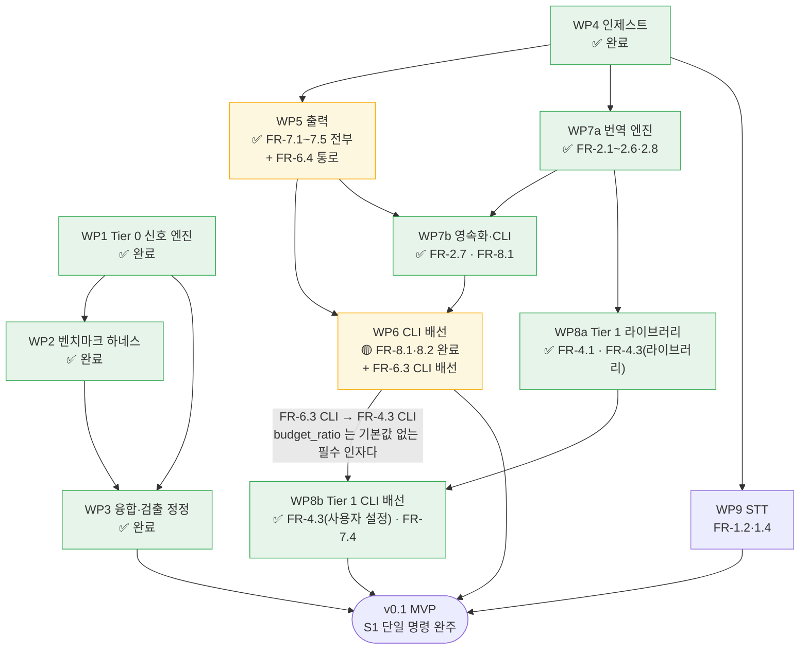

# WBS — cuesift 작업 분해 구조

> 갱신: 2026-08-19 (KST) · 기준 커밋 `19890d6`
> 대상 마일스톤: **v0.1 (MVP)** — [요구사항정의서](요구사항정의서.md) §10
>
> **기준 커밋은 구조적으로 한 커밋 뒤처진다.** 자기 해시는 커밋 전에 알 수
> 없으므로 직전 커밋을 적고, 뒤에 커밋이 더 붙으면 다시 낡는다. 이미 두 번
> 밟았다(`b2fba1d`가 같은 자리를 고쳤고 그것도 낡았다). **정확한 진척은
> 아래 본문의 수치와 커밋 해시를 보라** — 이 줄은 "대략 언제 기준인가"만 말한다.

## 이 문서를 어떻게 읽는가

**작업 패키지(WP)는 요구사항정의서의 FR 번호에 대응한다.** 새 작업을 발명하지 않는다 —
FR에 없는 일이 WP로 올라온다면 그것은 요구사항정의서를 먼저 고쳐야 한다는 신호다.

이렇게 묶는 이유는 **진척 주장을 반증 가능하게** 만들기 위해서다.
"인제스트 60% 완료"는 아무도 반박할 수 없지만 "FR-1.1 완료"는 코드와 테스트로 확인된다.

| 기호 | 뜻 |
| --- | --- |
| ✅ | 완료 — 구현·테스트·문서가 모두 있다 |
| 🟡 | **부분 완료** — 일부 FR만 끝났고 나머지는 미착수다. 어느 FR인지 상태 칸에 적는다 |
| 🔨 | 진행 중 |
| ⬜ | 미착수 |
| ⏸ | v0.2 이후로 연기 |

## 현재 위치

```text
  v0.1 대상 FR 42개 중 35개 완료 (83%)

  WP1 Tier 0 신호 엔진   ████████████████████  ✅  FR 16개 중 15개 완료 (6.3 참고)
  WP2 벤치마크 하네스     ████████████████████  ✅  (§9.1)
  WP3 융합·검출 정정      ████████████████████  ✅  FR-6.1·3.4 정정
  WP4 인제스트           ████████████████████  ✅  FR-1.1·1.3·1.5
  WP5 출력              ████████████████████  ✅  FR 5개 전부 (7.1~7.5)
  WP6 CLI 배선           ████████░░░░░░░░░░░░  🟡  FR 5개 중 8.1·8.2 완료 (+6.3 CLI 담당)
  WP7 번역 계층          ████████████████████  ✅  FR 8개 전부 (7a·7b 완료)
  WP8a Tier 1 라이브러리 ████████████████████  ✅  FR 3개 중 4.1 완료(4.3은 WP8b가 닫았다)
  WP8b Tier 1 CLI 배선   ████████████████████  ✅  FR-4.3 닫힘(CLI 노출) · FR-7.4도 함께
  WP9 STT               ░░░░░░░░░░░░░░░░░░░░  ⬜  FR 2개
```

### 30 → 32 → 34 → 35 - 산수를 남긴다

| 항 | 값 | 왜 |
| --- | --- | --- |
| 착수 시점 | 30 | 아래 "32에서 30으로 내려갔던 이유" 참고 |
| **FR-7.2** `review.json` | **+1** | ⬜ → ✅. `translate --review-out DIR`이 본문 열거 7개를 전부 담은 파일을 낸다 |
| **FR-6.4** 설명가능성 | **+1** | 🟡 → ✅. **자기 코드는 한 줄도 바뀌지 않았다** — 수혜자인 검수자에게 가는 통로가 FR-7.2였고 그것이 열렸다 |
| **소계** | **32** | 2026-08-19 |
| **FR-4.3** Tier 1 적용 상한 | **+1** | 🟡 → ✅ (2026-08-27, WP8b). `--tier1`·`--tier1-max-ratio`·`--tier1-samples`·`--tier1-temperature`가 붙어 "라이브러리에 있음"이 "**사용자가** 설정할 수 있음"이 됐다(축 1) |
| **FR-7.4** 요약 통계 | **+1** | 🟡 → ✅. **여기서도 자기 코드가 아니라 통로가 닫았다** - Tier 1 토큰이 `cost`에 합산되며 `includes`가 `["translation", "tier1"]`이 되어 "소요 토큰"의 축 2가 채워졌다 |
| **소계** | **34** | 2026-08-27 |
| **FR-7.3** `report.html` | **+1** | ⬜ → ✅ (2026-08-28, WP5 나머지). `--review-format html`이 원문/번역 대조·위험 구간 하이라이트·필터를 낸다. **여기서는 통로가 아니라 값이 없었다** - `spans[].side`가 스키마에 실려 있어 "렌더러 하나"로 읽혔는데 `Span`을 만드는 코드가 프로덕션에 **0건**이었다 |
| **합** | **35** | |

**셋째 줄은 FR 하나만 닫았고 그것도 우연이 아니다.** FR-7.3은 ⬜(아무것도 없음)이라
부족한 축이 없었고, 부족한 축이 없으면 §0.1이 지정해 둘 후속 작업도 없다 - **함께
닫히는 FR은 🟡에서만 나온다.** 앞의 두 줄이 그 사례다.

**한 작업이 FR 둘을 닫은 것은 우연이 아니고, 앞의 두 번이 그랬다.** FR-6.4는 착수 시점에
"축 1 부족(층 미도달)"이었고 그 층이 곧 리포트였다 — 요구사항정의서 §0.1이 부족한 축마다
**다른 후속 작업**(배선 / 기능 추가)을 지정해 둔 덕분에, FR-7.2를 구현하는 것이 FR-6.4의
후속 작업과 같은 일이라는 사실이 착수 전에 보였다. WP8b도 같았다 - FR-4.3의 후속은
"배선"이고 FR-7.4의 후속은 "기능 추가"라 서로 다른 일인데, **Tier 1을 CLI에 붙이는
한 작업이 둘을 함께 만족시킨다**는 것이 착수 전 WBS 1순위 항목에 이미 적혀 있었다.

**개수 32는 착수 이전의 32와 다른 32다.** 이전 32는 라이브러리만 있는 FR-6.3·6.4를
✅로 세어 부풀린 값이었고(아래), 지금 32는 그 둘을 내린 30에서 **실제로 닫힌 둘**을
더한 값이다. 같은 숫자가 두 번 나온다고 같은 상태로 돌아온 것이 아니다.

**이전에 완료 개수가 32에서 30으로 내려갔던 이유 — 기능이 빠진 것이 아니라 세는 법이
틀려 있었다.** 그 세션은 FR을 하나도 잃지 않았고 오히려 FR-6.3의 CLI 절반을 새로 냈다.
내려간 이유는 아래 "FR-6.3은 어느 WP의 것인가"가 드러낸 구멍이다 — FR-6.3·6.4가
**라이브러리만 있는 상태로 WP1에서 ✅로 세어지고 있었고**, 그 둘을 실제 상태(🟡)로
되돌리면 32 - 2 = 30이었다. 그때의 32는 실제보다 2개 높았다.

**WP1이 ✅인 채로 "16개 중 15개"인 것은 모순이 아니다.** WP 기호는 **그 WP의 산출물**
기준이고(WP1의 산출물은 Tier 0 신호 엔진 라이브러리이며 그것은 완료됐다), FR 완료는
라이브러리와 CLI **두 계층이 모두 닫혀야** 성립한다. 두 축이 다르다는 것이 애초에 이
구멍이 생긴 이유이므로, 기호를 흔들어 덮지 않고 두 축을 나란히 적는다.

**이 문장의 수는 위 막대 그래프에서 기계적으로 검산된다** — 산문이 낡으면 총계가
갈라진다. 실제로 이 자리가 `14`로 낡아 있었고(Task 8이 표를 올리면서 산문을 놓쳤다),
`14`를 믿으면 아래 합이 **33**이 되어 표제 34와 어긋난다.

| 축 | WP1 | WP4 | WP5 | WP6 | WP7 | WP8a·b | WP9 | 합 |
| --- | --- | --- | --- | --- | --- | --- | --- | --- |
| 전수 | 16 | 3 | 5 | 5 | 8 | 3 | 2 | **42** |
| 완료 | **15** | 3 | **4** | 2 | 8 | **2** | 0 | **34** |
| 완료(낡은 `14`) | 14 | 3 | 4 | 2 | 8 | 2 | 0 | **33 ✗** |

WP2·WP3은 FR을 새로 담당하지 않고 다른 WP의 FR을 정정한 작업이라 이 합에 들어가지
않는다. WP8b는 WP8a와 **같은 FR 3개**를 나눠 가지므로 전수에서 한 번만 세고, 그래서
열 이름을 `WP8a·b`로 적는다 - FR-4.3의 완료는 WP8b가 냈지만 개수는 이 한 열에서 센다.

| FR | 옛 셈 | 정정 후 | 지금 | 왜 |
| --- | --- | --- | --- | --- |
| FR-6.3 | ✅ (WP1) | 🟡 | **🟡 그대로** | ②(임계값)와 ①의 비율은 닫혔고 **"상위 K개"가 남는다.** 정정 당시에는 CLI에서 아무것도 도달할 수 없었고, 지금은 도달하되 불완전하다(축 1 → 축 2로 부족한 축이 바뀌었다) |
| FR-6.4 | ✅ (WP1) | 🟡 | **✅ (2026-08-19)** | 세그먼트별 사유를 라이브러리는 기록하지만 사용자에게 가는 통로는 FR-7.2(`review.json`)뿐이었다. **그 통로가 열리며 닫혔다** — 옛 셈이 결과적으로 같은 ✅에 도달했으나 그때는 근거가 없었다 |

FR 상태의 단일 출처는 [요구사항정의서](요구사항정의서.md) §5.4·§5.6·§5.7이고 이 표는 그
파생물이다. **다만 "전수 개수"의 출처는 이 문서(WBS)다** — 요구사항정의서의 상태 열은
§5.4·§5.6·§5.7 세 절에만 있어 **전체 FR 45개 중 13개만** 표기가 있고, 나머지 빈칸은
"미착수"가 아니라 "아직 열을 안 넣었다"는 뜻이다. **45와 42는 다른 수다** - 45는 연기분을
포함한 전체이고, 아래 "연기된 항목" 3건(FR-1.6 TTML · FR-5.4 자동 교정 · FR-5.5 샷 체인지)을
빼면 **v0.1 대상 42**가 된다. 아래 교차 검산 표의 분모가 그 42다 - **`45 - 13 = 32`를 내면
안 된다.** 13을 빼기 전에 연기 3건을 먼저 뺀다. **판정과 근거는 거기, 개수는 여기** — 이 줄만 읽고
"요구사항정의서를 세면 진척률이 나온다"로 가면 개수가 낮게 나온다(요구사항정의서 §5 머리
참고).

**교차 검산 - 개수를 다른 축으로 한 번 더 센다.** 위 `축 | WP1 | WP4 …` 표는 WP 축이고,
아래는 요구사항정의서의 상태 표기 축이다. **한 축이 틀리면 두 값이 갈라진다.**

| 축 | 대상 | 완료 |
| --- | --- | --- |
| 상태 열 **있는** FR | 요구사항정의서 §5.4·§5.6·§5.7의 **13개** | **11** — FR-4.1·4.3·6.1·6.2·6.4·6.5·7.1·7.2·**7.3**·7.4·7.5 (남은 둘은 FR-4.2 ⬜ · FR-6.3 🟡) |
| 상태 열 **없는** FR | v0.1 대상 42개 중 나머지 **29개**(`42 - 13`) | **24** — 이번 작업으로 움직이지 않는다 |
| **합** | **42** | **35** |

`24 + 11 = 35`가 WP 축의 합과 같은 값을 낸다. **두 값이 갈라지면 산수가 아니라 판정이
틀린 것이다** - 그때는 표기를 고치기 전에 요구사항정의서 §0.1의 두 축 규칙을 의심한다.

**FR-7.5와 FR-8.2가 서로 다른 WP에 있는데 한 작업 패키지로 끝났다.** FR-7.5(CI 종료 코드)는
요구사항정의서 §7(출력)에 있어 WP5 소속이지만, **종료 코드를 처음으로 쓰는 명령이 `check`라**
따로 구현할 자리가 없었다. 두 WP를 합치지 않고 각각 🟡로 두는 이유는 이 문서가
요구사항정의서의 **파생물**이기 때문이다 — FR 배치를 여기서 바꾸면 두 문서가 갈라진다.

### FR-6.3은 어느 WP의 것인가 — 이 문서에 구멍이 있었다

**FR-6.3의 CLI 절반은 착수 시점에 어느 WP에도 속해 있지 않았다.** WP5는 FR-7.1~7.5만,
WP6은 FR-8.1~8.5만 담당하는데, `cli.py`의 옛 경고는 "아직 구현되지 않았습니다 (WP5)"라고
적고 있었다 — **WP5의 범위에 그런 항목은 없다.** 그 경고가 가리킨 WP가 실재하지 않았다.

**담당은 WP6이다.** FR-8 계열과 성격이 같다 — 라이브러리에 이미 있는 것을 `cuesift
translate`의 옵션으로 노출하는 배선 작업이고, 라이브러리는 한 줄도 바뀌지 않았다.

**담당과 개수는 다른 축이다.** 이 문서는 FR을 **번호 구간**으로 WP에 나누므로 FR-6.3의
개수는 WP1의 16개 안에서 세고(FR-8.1을 WP7b가 구현했지만 개수는 WP6에서 세는 것과 같다),
**담당**만 WP6이다. 둘을 섞으면 42의 합이 깨지고, 그러면 진척률 자체를 검증할 수 없다.

**구조적 원인은 이 문서가 FR 번호로 WP를 나눈다는 것이다.** 라이브러리와 CLI 두 계층에
걸친 FR은 WP1에서 라이브러리 절반만 만들고 ✅로 닫히며, CLI 절반이 담당 WP 없이 미아가
된다. 같은 함정이 **세 번째다.**

| FR | 라이브러리 | CLI | 어떻게 드러났나 |
| --- | --- | --- | --- |
| FR-5.3 | WP1 ✅ | 도달 불가였다 | 발견 후 WP6이 `--spec ./x.yaml`을 열어 닫았다 (`f16bb0f`) |
| FR-4.3 | WP8a ✅ | **WP8b ✅ (2026-08-27)** | WP8a 세션이 발견해 §5.4에 🟡로 표시하고 WP8b를 만들었다. **세 줄 중 착수 전에 함정을 알고 판 유일한 줄이다** - 나머지 둘은 라이브러리 절반만 세고 ✅로 닫힌 뒤에 발견했다 |
| FR-6.3 | WP1 ✅ | 미구현 | **담당 WP가 없어 표시할 칸조차 없었다.** 이번에 WP6으로 넣었다 |

한 줄로: **"라이브러리에 있다"와 "사용자가 쓸 수 있다"가 같은 FR 번호를 공유하면, FR
번호로 나눈 WP는 앞의 절반만 세고 닫힌다.** 다음에 이 표에 네 번째 줄이 생길 것 같으면
그때는 나누는 축을 바꿔야 한다는 신호다.

**FR 개수는 작업량에 비례하지 않는다.** WP4(FR 3개)는 파서 3종이라 WP8(FR 3개)보다
훨씬 크다. 규모 추정은 아래 표의 "규모" 열을 본다.

## 작업 패키지

| WP | 이름 | FR | 상태 | 규모 | 선행 | 산출물 |
| --- | --- | --- | --- | --- | --- | --- |
| **1** | Tier 0 신호 엔진 | 3.1~3.8 · 5.1~5.3 · 6.1~6.5 | ✅ | L | — | `src/cuesift/{segment,spec,glossary,signals,risk,triage}/`. **이 WP의 산출물은 라이브러리이고 그것은 완료됐다 — 그러나 세 FR은 라이브러리만으로 닫히지 않는다**(위 "FR-6.3은 어느 WP의 것인가"): **FR-5.3**은 라이브러리로는 완료였으나 CLI에서 도달할 수 없었고 `--spec ./x.yaml`이 열리며 必 요구사항이 실제로 닫혔다(`f16bb0f`, 배선은 WP6), **FR-6.3**은 라이브러리만 있는 채로 ✅로 세어지고 있었으나 CLI에서 도달할 수 없었고, 이번에 CLI 배선이 붙어 **실제 상태가 🟡**가 됐으며(배선은 WP6, "상위 K개"가 남는다), **FR-6.4**는 `SegmentRisk.reasons`를 세그먼트마다 기록하지만 사용자에게 가는 통로(FR-7.2 `review.json`)가 없어 오래 🟡였고 **2026-08-19에 WP5가 그 통로를 열어 ✅가 됐다** — 이 WP의 코드는 한 줄도 바뀌지 않았다. **셋 다 개수는 이 행의 16개 안에서 센다** — 이 문서는 FR을 번호 구간으로 WP에 나누므로 구현한 WP가 어디든 개수는 번호가 정한다(FR-8.1을 WP7b가 구현했지만 개수는 WP6에서 세는 것과 같다) |
| **2** | 벤치마크 하네스 | §9.1 | ✅ | L | 1 | `bench/` · `scripts/fetch_ted2020.py` |
| **3** | 융합·검출 정정 | 6.1 · 3.4 | ✅ | S | 1·2 | `risk/fuse.py` noisy-or · `signals/structural.py` NFKC · `bench/results/` 재측정 (`2314fc6`·`78921d4`·`57bbded`) |
| **4** | 인제스트 | 1.1 · 1.3 · 1.5 | ✅ | S | — | `src/cuesift/ingest/{__init__,loader}.py` · `tests/fixtures/ingest/`(픽스처 12종) · `tests/test_ingest.py` · `tests/test_ingest_fixtures.py` · `tests/test_ingest_contamination.py` (`42a126f`·`bb105b7`·`be51706`·`52acf5b`·`d51cb3c`·`1cbc21a`·`26f7517`·`6ad9366`·`50e62cf`) |
| **5** | 출력 | 7.1~7.5 | ✅ | M | 4 | **FR-7.1·7.2·7.4·7.5 완료** — `check`의 CI 종료 코드 5종(0·1·2·66·70)이 실제로 갈린다(FR-7.5, `90c6a7d`·`4899fec`·`59c7b51`·`6b45f95`). `ingest/writer.py`가 번역된 자막을 실제 파일로 낸다(FR-7.1, `4dc5571`·`eeb4d33`). **`src/cuesift/report/`가 `review.json`을 낸다**(FR-7.2, `--review-out DIR` · 파일명 `{stem}.{target}.review.json`) — `_run_triage`가 `list[str]` 대신 `TriageOutcome`을 돌려주어 **화면 요약과 파일이 같은 객체에서 갈라져 나온다**(수치가 어긋날 자리가 구조적으로 없다). 이 작업이 **WP1의 FR-6.4도 함께 닫았다** — 검수자에게 가는 통로가 이것뿐이었다. [설계 스펙](superpowers/specs/2026-08-18-review-json-design.md). **FR-7.4는 WP8b가 닫았다** — 요약 통계의 마지막 빈칸이던 "소요 토큰"에 Tier 1분이 합산되며 `cost.includes`가 `["translation", "tier1"]`이 된다(이 WP의 코드는 `report/models.py`의 `resolve_cost_scope`만 늘었다). **FR-7.3이 2026-08-28에 닫히며 이 WP가 완료됐다** — `report.html`이 원문/번역 대조·위험 구간 하이라이트·필터를 낸다(`--review-out DIR --review-format html`). **"렌더러 하나"라던 이 칸의 옛 서술은 틀렸다** — 근거였던 "`spans[].side`가 이미 실려 있다"가 스키마에만 참이었고, `grep -rn "Span(" src/`는 프로덕션 **0건**을 냈다. 그래서 범위가 수집기 3종(`glossary.miss`·`struct.number_missing`·`struct.tag_lost`)과 렌더러 **둘**이 됐고, 부수 효과로 `review.json`의 `spans`도 채워졌다(`json_report.py` 변경 0줄). **필터 동작에는 자동 게이트가 없다** - pytest는 브라우저를 띄우지 않아 live 1회(Chrome)로 확인했다. [설계 스펙](superpowers/specs/2026-08-27-report-html-design.md) |
| **6** | CLI 배선 | 8.1~8.5 · **6.3(CLI)** | 🟡 | M | 4·5 | **FR-8.1·8.2 완료** — `cuesift translate`와 `cuesift check <자막파일> --spec <프로파일>`이 둘 다 동작한다. `check`는 `spec/check.py`에 `TrackViolation`·`check_empty_cues`·`check_track`, `cli.py`에 `check()` 본문·`_resolve_profile`·`_format_report`. [설계 스펙](superpowers/specs/2026-08-03-check-cli-design.md) (`9ef4869`) · [구현 계획](superpowers/plans/2026-08-13-check-cli.md) (`5c07fc0`) · 구현 (`4899fec`, 테스트 316→481). `translate`는 캐시·재개·다국어 순차 번역·`--dry-run`이 붙었다 — 완료 개수는 이 행에서 세지만 구현 커밋은 WP7b 행에 있다. 남은 8.3(`transcribe` 배선)·8.4(`cuesift.yaml` 로더)·8.5(진행 표시·CI 감지)는 **모두 이 WP(WP6)에 남아 있다** — FR-8.3은 §5.8("CLI")에 있어 STT 로직이 아니라 CLI 소속이다. WP9는 STT 어댑터(FR-1.2·1.4)만 내고, `transcribe`가 그 어댑터를 실제로 부르게 배선하는 것은 WP6의 몫이다. **표면 확장 `--limit N`**(위반 목록 상한, 기본 0=무제한)과 요약 이중 출력이 2026-08-16에 들어왔다 — FR을 새로 닫은 것이 아니라 FR-8.2의 출력 표면이므로 **완료 개수는 그대로다** (`fb0949d`·`b0a76ec`). **FR-6.3의 CLI 절반도 이 WP가 담당한다**(위 "FR-6.3은 어느 WP의 것인가") — `cuesift translate --review-budget 10%`·`--review-threshold 0.7`이 `collect_all`→`fuse`→`select_by_budget`/`select_by_threshold`를 실제로 돌고 요약을 낸다. 프로파일은 대상 언어 코드로 자동 유도하며 새 옵션이 없다. **라이브러리는 한 줄도 바뀌지 않았다** — 변경이 `cli.py` 하나에 갇혀 되돌리기 단위가 작다. [설계 스펙](superpowers/specs/2026-08-18-triage-cli-design.md). **FR-6.3은 여전히 🟡다** — "상위 K개"가 남는다 |
| **7a** | 번역 엔진 | 2.1~2.6 · 2.8 | ✅ | L | 4 | **FR 7개 완료** — `src/cuesift/translate/`(`provider`·`batch`·`prompt`·`engine`·`openai_compat`)와 `Glossary.terms_in`. 배치 번역·개별 폴백·재시도·예외 분류가 동작한다. [설계 스펙](superpowers/specs/2026-08-16-translate-engine-design.md) (`10d3b31`) · [구현 계획](superpowers/plans/2026-08-16-translate-engine.md) (`8f0ea4a`) · 구현 (`f6e0ec6`..`1b4ea6e`, 테스트 499→**813**) · 공개 API·`live` 마커와 게이트 방어 3겹 (`9159791`~, 813→**859**). **네트워크를 치지 않는다** — `httpx.MockTransport`로 검증하고 실 API는 `-m live` opt-in |
| **7b** | 번역 영속화·CLI | 2.7 | ✅ | M | 7a·5 | **FR-2.7 완료** — 캐시(NFR-3)·재개·`--dry-run`이 실제로 동작한다. `cuesift translate` 배선(FR-8.1, 완료 개수는 WP6에서 센다)과 번역된 자막 파일 쓰기(FR-7.1, 완료 개수는 WP5에서 센다)도 이 작업 패키지에서 나왔다. `python -m cuesift`를 서브프로세스로 두 번 실행해 재개를 실물로 확인했다 — Ollama `qwen2.5:3b`, 1회차 exit 0·실제 호출 1개(2.71초), 2회차 exit 0·캐시 히트 1개·**실제 호출 0개**(0.38초). [설계 스펙](superpowers/specs/2026-08-17-translate-cli-design.md) · [구현 계획](superpowers/plans/2026-08-17-translate-cli.md) (`2d17cc2`·`cb4e0c7`) · 구현 (`742ac52`..`4685be1`) |
| **8a** | Tier 1 신호 — 라이브러리 | 4.1 · 4.3(라이브러리) | ✅ | M | **7a** | `src/cuesift/{signals/llm,signals/similarity,tier1}.py` 신규, `signals/base`·`triage/policy`·`store/cache`·`store/provider`·`risk/fuse` 수정. 자가일관성(`llm.self_consistency`, FR-4.1)이 N회 재번역의 상호 유사도를 재고, Tier 1은 컷라인 아래 회색지대에서만 후보를 고르며(`select_tier1_candidates`, FR-4.3) `collect_all()`은 tier 0만 돈다(비용 격리). **선행은 7a까지다** — 7b(재개·CLI)를 기다리지 않는다. FR-4.2(역번역)는 착수 시점 실측이 역방향 작동 위험을 보여 **보류**했다(요구사항정의서 §12 Q4). [설계 스펙](superpowers/specs/2026-08-17-tier1-signals-design.md) · [구현 계획](superpowers/plans/2026-08-17-tier1-signals.md) · live 검증(Ollama `qwen2.5:3b`, 실제 엔드포인트에서 `llm.self_consistency` 신호 실측 확인) |
| **8b** | Tier 1 신호 — CLI 배선 | 4.3(사용자 설정) | ✅ | S | 8a·**6(FR-6.3 CLI)** | **FR-4.3 완료 · FR-7.4도 함께 닫혔다** (2026-08-27). `--tier1`(스위치)·`--tier1-max-ratio`·`--tier1-samples`·`--tier1-temperature` 4종과 조합 검증 6종, 프로바이더 예외 그물(종료 코드 69), `--dry-run`의 Tier 1 상한 줄, `cost.tier1` 조립이 들어왔다. **비용은 기본값이 가둔다** — `--tier1-samples x --tier1-max-ratio < 0.3`(설계 D4)이라 §4의 "3배는 감당 불가"를 넘는 조합이 종료 코드 2로 거부된다. [설계 스펙](superpowers/specs/2026-08-25-tier1-cli-design.md). 착수 전 기록은 이렇게 남았다: `--tier1-max-ratio`·`--tier1-samples`·`--tier1-temperature`를 `cuesift translate`에 배선한다 — **FR-4.3이 "라이브러리에 있음"을 넘어 "사용자가 설정할 수 있음"이 되려면 여기가 닫혀야 한다**(FR-5.3·FR-6.3이 같은 함정에 걸렸던 전례, 위 "FR-6.3은 어느 WP의 것인가" 참고). **선행이 하나 더 있었고 WBS에 없었다** — `triage_with_tier1()`이 `budget_ratio`를 기본값 없는 필수 인자로 요구하므로 예산 배선(FR-6.3 CLI) 없이 Tier 1만 얹을 수 없다. 그 선행은 WP6이 닫았다. 착수 전 정리해야 할 것 **4건**은 `HANDOFF.md` "다음 사람이 반드시 알아야 할 것" 참고 — 세그먼트 단위 프로토콜이라 호출이 배치 대비 10배(실측: 세그먼트 10개·samples=3에서 30회 vs 3회), Tier 1 토큰 사용량이 리포트에 집계되지 않음(NFR-2·FR-7.4), `samples` 상한이 없음(§11 R8), `CacheRequest.attempt`에 값 검증이 없음(`attempt=None`이면 N회 호출이 한 키로 뭉쳐 "판정 불가"가 "판정했고 안전"으로 둔갑한다) |
| **9** | STT | 1.2 · 1.4 | ⬜ | M | 4 | Whisper 계열 어댑터 · `원문 검수 필요` 플래그 |

v0.1 완료 조건은 **"S1 시나리오가 단일 명령으로 완주"** 이므로 WP4~9가 전부 필요하다.
Recall@10% 최초 측정치 확보는 WP2에서 **이미 충족됐다.**

### 연기된 항목

| FR | 내용 | 버전 |
| --- | --- | --- |
| 1.6 | TTML 입출력 | v0.3 |
| 5.4 | 규격 위반 자동 교정(재분절) | v0.2 |
| 5.5 | 샷 체인지 경계 보존 | v0.3 |
| — | QE 플러그인 · 화자분리 · 캐릭터 말투 시트 | v0.2 |

## 의존 관계



**WP7a는 WP8a의 선행이지만 WP7b는 아니다.** 자가일관성(FR-4.1)은 같은 세그먼트를
N회 번역해 비교하는 것이라 `translate_segments`와 `build_messages`만 있으면 되고,
재개도 CLI도 필요 없다. 두 화살표를 갈라 둔 이유가 이것이다 — 합쳐 두면
WP8a가 CLI 배선을 기다리는 것처럼 보인다.

**WP8도 WP7과 같은 이유로 8a(라이브러리)/8b(CLI 배선)로 갈랐다** — 자가일관성은
`translate_segments`만 있으면 동작하는 순수 라이브러리 호출이고, `--tier1-*` 옵션을
붙이는 것은 별개의 배선 작업이다. 상세 근거는
[Tier 1 설계 스펙](superpowers/specs/2026-08-17-tier1-signals-design.md) §1.3.

**`WP6 --> WP8B` 화살표에 이름이 붙었다 — 그것이 FR-6.3 CLI다.** 이 화살표는 전에도
있었으나 무엇 때문인지는 적혀 있지 않았고, 그래서 "WP8b가 다음 1순위"라는 서술이
선행이 비어 있다는 사실을 가리지 못했다. 실체는 하나다 — `tier1.py`의
`triage_with_tier1()`이 `budget_ratio`를 **기본값 없는 필수 인자**로 요구하므로, 예산이
CLI에서 조달되지 않으면 `--tier1-*` 옵션만 붙일 방법이 없다. 화살표는 있는데 그 안에
무엇이 들었는지 아무도 적지 않으면, 없는 것과 같은 방식으로 밟힌다.

### WP7을 왜 쪼갰나

**계층 하나에 성격이 다른 두 책임이 들어 있었다.**

| | WP7a 번역 엔진 (✅) | WP7b 영속화·CLI (✅) |
| --- | --- | --- |
| 하는 일 | 세그먼트를 받아 번역해서 돌려준다 | 그 결과를 디스크에 남기고 명령줄에 붙인다 |
| 상태 | **없다** — 순수 함수 + 프로바이더 1개 | 파일·캐시·재개 지점 |
| 테스트 | `httpx.MockTransport`로 전량 | 파일시스템 픽스처가 필요하다 |
| 실패 모드 | 모델이 형식을 어김, 네트워크 | 중단된 작업의 정합성 |

표가 말하는 것은 **두 책임의 테스트 수단이 겹치지 않는다**는 것이다.
엔진을 검증하는 데 파일시스템이 필요 없고, 재개를 검증하는 데 LLM이 필요 없다.
한 WP로 묶으면 어느 쪽 결함인지 모르는 실패가 생긴다.

`translate/`에 재개와 캐시를 **일부러 넣지 않았다.** 넣었다면 엔진의 모든
테스트가 임시 디렉터리를 들고 다녀야 했다.

**`WP5 --> WP6` 화살표는 FR-8.2에는 걸리지 않았다.** 그 의존은 `translate`가 리포트를
써야 하기 때문에 생긴 것이고, `check`는 **파일을 쓰지 않고 콘솔 요약만 낸다**(설계 D4).
그래서 WP5가 미착수인 채로 WP6의 일부가 먼저 끝날 수 있었다 — 아래 "가장 짧은 경로"가
가리킨 것이 정확히 이 틈이다.

**WP4는 병목이었다** — 출력·번역·STT 셋이 전부 여기에 걸려 있었다.
자막 파일을 `Segment`로 바꾸지 못하면 Tier 0 엔진에 실데이터가 들어가지 않기 때문이다.
완료로 WP5·WP7·WP9가 착수 가능해졌다.

### 가장 짧은 "쓸 수 있는 제품" 경로 — ✅ 도달했다 (2026-08-13)

`check` 서브커맨드(FR-8.2)는 **규격 검사만** 하므로 번역·STT 없이 완결된다.

```text
  WP4 (인제스트)  →  WP6 중 FR-8.2만  →  cuesift check 동작  ✅
```

Tier 0 엔진과 규격 프로파일이 이미 있었으므로 **파서와 배선만으로 실사용 가능한 도구가 됐다.**
v0.1 전체를 기다리지 않고 중간 산출물을 낼 수 있는 유일한 지점이었고, 실제로 그렇게 됐다 —
`cuesift check <자막파일> --spec <프로파일>`이 규격 위반 7종을 판정하고 CI가 대응을 가를 수
있는 종료 코드를 낸다 (`4899fec`, 테스트 316 → 481).

**여기서 배운 것 하나를 남긴다.** 이 경로가 짧았던 이유는 새로 만든 판정이 `empty_cue`
**하나뿐이고 나머지는 전부 배선**이었기 때문이다. 반대로 예상보다 컸던 부분은 판정이 아니라
**종료 코드 계약**이었다 — 파이썬 예외가 커맨드 본문을 빠져나가면 exit 1이 되고 이 저장소에서
1은 "규격 위반 발견"이라, 설정 사고와 파일 사고가 자막 결함으로 오보되는 누수를 12종 넘게
닫아야 했다. **다음 서브커맨드도 같은 비용을 낸다**는 뜻은 아니다: `_TolerantOutput`과
`_harden_output_streams`는 그룹 콜백·진입점에 있어 `translate`·`transcribe`가 그대로 물려받는다.

## 다음 작업 순서 (제안)

| 순 | WP | 이유 |
| --- | --- | --- |
| ~~1~~ | ~~WP3~~ | ✅ 완료 (2026-07-29). 벤치 컨텍스트가 살아 있을 때 끝냈다 |
| ~~2~~ | ~~WP4~~ | ✅ 완료 (2026-08-01). 병목이 풀려 WP5·WP7·WP9가 착수 가능해졌다 |
| ~~3~~ | ~~WP6 부분 (FR-8.2 `check`)~~ | ✅ 완료 (2026-08-13). 최초로 **쓸 수 있는 제품**이 나왔다 (`4899fec`) |
| ~~4~~ | ~~WP7a (번역 엔진)~~ | ✅ 완료 (2026-08-16). FR 7개를 닫았고 **WP8의 선행이 풀렸다** (`f6e0ec6`..`1b4ea6e` 엔진 499→**813**, `9159791`~ 공개 API·마커 813→**859**) |
| ~~5~~ | ~~WP7b~~ | ✅ 완료 (2026-08-17). 캐시·재개·다국어 순차 번역·`--dry-run`·`python -m cuesift`가 실제로 동작하고, live로 재개(2회차 실제 호출 0개)를 실물 확인했다. FR-2.7·FR-7.1·FR-8.1 완료 (`742ac52`..`4685be1`) |
| ~~6~~ | ~~WP8a (Tier 1 라이브러리)~~ | ✅ 완료 (2026-08-17). FR-4.1(자가일관성)이 실제 엔드포인트(Ollama `qwen2.5:3b`)에서 신호를 낸다 — live 검증으로 확인(`llm.self_consistency`). **Q4는 이번에도 닫히지 않는다** — 문자 단위 유사도의 판별력 실측(요구사항정의서 §12 Q4)이 방향(형태는 재지만 의미는 못 잰다)을 좁혔을 뿐, 판정은 Tier 1을 벤치마크에 태우는 별도 작업의 몫이다 |
| ~~7~~ | ~~WP6 부분 (FR-6.3 CLI 배선)~~ | ✅ 완료 (2026-08-18). **이 항목은 착수 시점의 이 표에 없었다** — 아래 정정 참고. `cuesift translate --review-budget 10%`·`--review-threshold 0.7`이 트리아지를 실제로 돌려 검수 대상·**실제 검수 비율**·hard fail·신호별 적발을 낸다. 라이브러리 변경 0줄. [설계 스펙](superpowers/specs/2026-08-18-triage-cli-design.md) |
| ~~8~~ | ~~WP5 부분 (FR-7.2 `review.json`)~~ | ✅ 완료 (2026-08-19). **이 항목은 2순위였고 1순위보다 먼저 실행했다** — 아래 "순서 근거가 소멸했다" 참고. `translate --review-out DIR`이 검수 큐를 파일로 낸다. **FR-6.4도 함께 닫혔다**(통로가 이것뿐이었다). [설계 스펙](superpowers/specs/2026-08-18-review-json-design.md) |
| ~~9~~ | ~~WP8b (Tier 1 CLI 배선)~~ | ✅ 완료 (2026-08-27). `cuesift translate --tier1 --review-budget 10%`가 Tier 1을 실제로 돌리고, **FR-4.3과 FR-7.4가 함께 닫혔다.** live 확인(Ollama `qwen2.5:3b`): `cost.includes`가 `["translation", "tier1"]`으로 나갔다. 착수 시점 기록은 이렇다 — `--tier1-max-ratio`·`--tier1-samples`·`--tier1-temperature`를 `cuesift translate`에 붙인다 — FR-4.3이 "라이브러리에 있음"에서 "**사용자가** 설정할 수 있음"이 되려면 여기가 닫혀야 한다. **이제 정말로 "붙이는 일만" 남았다** — 위 7이 `budget_ratio`를 조달하기 전에는 그것이 사실이 아니었다. 착수 전 정리할 것 **4건**은 `HANDOFF.md`를 본다(세그먼트 단위 프로토콜의 호출 10배가 가장 중요). **부수 효과 하나가 FR-7.4를 닫는다** — Tier 1 토큰 통로가 뚫리면 `review.json`의 `cost.includes`에 `"tier1"`을 더할 수 있게 된다 |
| ~~10~~ | ~~WP5 나머지 (**FR-7.3**)~~ | ✅ 완료 (2026-08-28). `translate --review-out DIR --review-format html`이 검수자용 `report.html`을 낸다 — 원문/번역 대조·위험 구간 하이라이트·필터. **착수 시점 기록은 "렌더러 하나"였고 그것이 틀렸다** — 착수 조사가 `Span`을 채우는 프로덕션 코드가 **0건**임을 실측해 범위가 수집기 3종 + 렌더러 둘이 됐다. 태스크 10개, 테스트 1270 → **1379**. [설계 스펙](superpowers/specs/2026-08-27-report-html-design.md) |
| 1 | WP6 나머지 (FR-8.3~8.5) | `transcribe` 배선과 `cuesift.yaml` 로더·진행 표시. FR-8.1은 WP7b가 닫았다. **`cuesift.yaml`(FR-8.4)이 FR-6.1의 "설정 가능한 가중치"가 기다리는 자리다** |
| 2 | WP9 | STT는 FR-1.3이 "자막 우선"이라 마지막이어도 S1이 성립한다 |

**WP7b 완료로 WP7 전체가 닫혔다.** WP8a 착수의 필수 선행은 WP7a까지였고(위 도식의
갈라진 화살표 참고) WP7b는 조건이 아니었지만, 둘 다 끝난 지금은 그 구분이 더 이상
의미가 없다.

**"남은 1순위는 WP8b 하나다"는 틀린 서술이었다 — 정정한다.** 그 문장을 쓴 시점에
WP8b의 선행 하나(FR-6.3의 CLI 배선)가 **이 표에도 위 WP 표에도 없었다.** 없는 항목은
1순위 경쟁에 나오지 않으므로, 이 문서는 자기가 빠뜨린 것 때문에 자기 결론이 틀렸다는
사실을 드러낼 수 없었다. **누락은 순서를 틀리게 하는 데서 그치지 않는다 — 순서가 틀렸다는
것을 감지하는 능력까지 함께 없앤다.** 지금은 WP6이 그 선행을 닫았고, 그래서 이번에는
"남은 1순위는 WP8b"가 참이다.

### WP8b를 WP5보다 앞에 둔 근거가 소멸했다 — 지우지 않고 남긴다

이 표는 WP8b를 1순위, WP5를 2순위로 적고 근거를 이렇게 달았다.

> `review.json`(FR-7.2)이 `llm.self_consistency`를 실을 스키마를 정하려면 Tier 1이
> CLI에서 실제로 도는 모습이 먼저 있어야 스키마를 두 번 깨지 않는다

**이 근거는 WP8a가 끝나면서 소멸했고 문서가 갱신되지 않았다.** 실측 셋이 그것을 보였다
([설계 §1.3](superpowers/specs/2026-08-18-review-json-design.md)).

| 우려 | 실측 | 위치 |
| --- | --- | --- |
| Tier 1 신호가 붙으면 스키마가 깨진다 | `signals[]`는 `name`·`tier`·`score`·`spans`·`detail`을 가진 **동종 레코드의 배열**이다. 신호 종류가 늘면 항목이 하나 느는 것뿐이고 형태는 불변이다 | 요구사항정의서 §8.4 · `segment/models.py` |
| `llm.self_consistency`의 자리가 아직 없다 | 이미 `DEFAULT_WEIGHTS`에 등록돼 있고 `tier=1`을 낸다 | `risk/fuse.py` · `signals/llm.py` |
| Tier 1의 `detail` 모양을 모른다 | 이미 확정돼 있다. **주석이 소비자를 명시했다** — "FR-6.4 · review.json이 '왜 선별되었는지'를 이것으로 쓴다" | `signals/llm.py` |

셋이 말하는 것은 하나다 — **계층을 키가 아니라 값(`tier` 필드)으로 표현한 설계가 그
자체로 순서 의존성을 없앴다.** WP8a가 review.json을 소비자로 상정하고 `detail`을 설계했으므로
"Tier 1이 도는 모습을 먼저 본다"는 선행이 이미 충족돼 있었다. 실제로 WP5를 먼저 실행했고
**스키마는 한 번도 깨지지 않았다.**

**근거만 지우지 않고 이 절을 남기는 이유는 다음 사람이 같은 순서를 다시 세우기 때문이다.**
"WP8b가 먼저"는 그럴듯한 서술이라, 소멸 사실이 적혀 있지 않으면 재발명된다 — 이 문서가
바로 위에서 "누락은 순서가 틀렸다는 것을 감지하는 능력까지 없앤다"고 적은 것과 같은 실패다.
**지금 WP8b가 1순위인 것은 그 옛 근거 때문이 아니라 남은 것 중 선행이 전부 풀린 유일한
항목이기 때문이다.**

## 갱신 규칙

**상태 칸을 고칠 때 근거 커밋을 함께 적는다.** 상태만 바꾸고 근거가 없으면
이 문서는 검증할 수 없는 주장이 되고, 그 순간 [CLAUDE.md](../CLAUDE.md)가 말하는
"검사하지 않고 통과하는 게이트"와 같아진다.

| 시점 | 무엇을 |
| --- | --- |
| WP 완료 시 | 상태 → ✅ · 산출물 경로 확정 · CHANGELOG에 대응 항목 |
| FR 추가·삭제 시 | **요구사항정의서를 먼저 고치고** 이 문서를 따라 고친다 |
| 세션 종료 시 | 진척 막대와 완료 개수 갱신 · [HANDOFF](../HANDOFF.md)에서 이 문서를 참조 |

FR이 이 문서에서만 바뀌면 요구사항정의서와 갈라진다.
**이 문서는 요구사항정의서의 파생물이지 병렬 출처가 아니다.**
