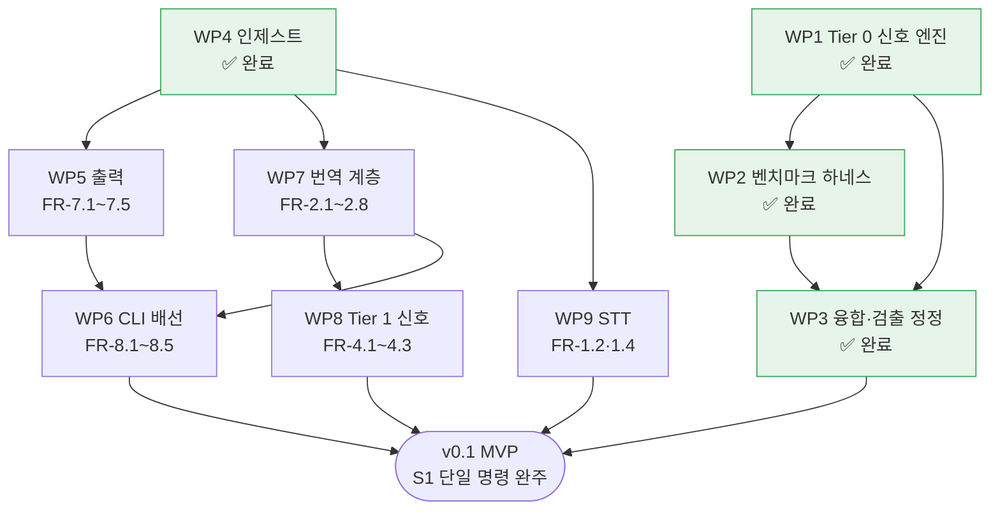

# WBS — cuesift 작업 분해 구조

> 갱신: 2026-08-01 (KST) · 기준 커밋 `6ad9366`
> 대상 마일스톤: **v0.1 (MVP)** — [요구사항정의서](요구사항정의서.md) §10

## 이 문서를 어떻게 읽는가

**작업 패키지(WP)는 요구사항정의서의 FR 번호에 대응한다.** 새 작업을 발명하지 않는다 —
FR에 없는 일이 WP로 올라온다면 그것은 요구사항정의서를 먼저 고쳐야 한다는 신호다.

이렇게 묶는 이유는 **진척 주장을 반증 가능하게** 만들기 위해서다.
"인제스트 60% 완료"는 아무도 반박할 수 없지만 "FR-1.1 완료"는 코드와 테스트로 확인된다.

| 기호 | 뜻 |
| --- | --- |
| ✅ | 완료 — 구현·테스트·문서가 모두 있다 |
| 🔨 | 진행 중 |
| ⬜ | 미착수 |
| ⏸ | v0.2 이후로 연기 |

## 현재 위치

```text
  v0.1 대상 FR 42개 중 19개 완료 (45%)

  WP1 Tier 0 신호 엔진   ████████████████████  ✅  FR 16개
  WP2 벤치마크 하네스     ████████████████████  ✅  (§9.1)
  WP3 융합·검출 정정      ████████████████████  ✅  FR-6.1·3.4 정정
  WP4 인제스트           ████████████████████  ✅  FR-1.1·1.3·1.5
  WP5 출력              ░░░░░░░░░░░░░░░░░░░░  ⬜  FR 5개
  WP6 CLI 배선           ░░░░░░░░░░░░░░░░░░░░  ⬜  FR 5개
  WP7 번역 계층          ░░░░░░░░░░░░░░░░░░░░  ⬜  FR 8개
  WP8 Tier 1 신호        ░░░░░░░░░░░░░░░░░░░░  ⬜  FR 3개
  WP9 STT               ░░░░░░░░░░░░░░░░░░░░  ⬜  FR 2개
```

**FR 개수는 작업량에 비례하지 않는다.** WP4(FR 3개)는 파서 3종이라 WP8(FR 3개)보다
훨씬 크다. 규모 추정은 아래 표의 "규모" 열을 본다.

## 작업 패키지

| WP | 이름 | FR | 상태 | 규모 | 선행 | 산출물 |
| --- | --- | --- | --- | --- | --- | --- |
| **1** | Tier 0 신호 엔진 | 3.1~3.8 · 5.1~5.3 · 6.1~6.5 | ✅ | L | — | `src/cuesift/{segment,spec,glossary,signals,risk,triage}/` |
| **2** | 벤치마크 하네스 | §9.1 | ✅ | L | 1 | `bench/` · `scripts/fetch_ted2020.py` |
| **3** | 융합·검출 정정 | 6.1 · 3.4 | ✅ | S | 1·2 | `risk/fuse.py` noisy-or · `signals/structural.py` NFKC · `bench/results/` 재측정 (`2314fc6`·`78921d4`·`57bbded`) |
| **4** | 인제스트 | 1.1 · 1.3 · 1.5 | ✅ | S | — | `src/cuesift/ingest/{__init__,loader}.py` · `tests/fixtures/ingest/`(픽스처 10종) · `tests/test_ingest.py` · `tests/test_ingest_fixtures.py` · `tests/test_ingest_contamination.py` (`42a126f`·`bb105b7`·`be51706`·`52acf5b`·`d51cb3c`·`1cbc21a`·`26f7517`·`6ad9366`) |
| **5** | 출력 | 7.1~7.5 | ⬜ | M | 4 | `review.json` · `report.html` · 요약 통계 |
| **6** | CLI 배선 | 8.1~8.5 | ⬜ | M | 4·5 | `cli.py` 실동작 · `cuesift.yaml` 로더. **FR-8.2 부분은 설계 확정** — [설계 스펙](superpowers/specs/2026-08-03-check-cli-design.md) (`9ef4869`) |
| **7** | 번역 계층 | 2.1~2.8 | ⬜ | L | 4 | `src/cuesift/translate/` — LLM 어댑터·컨텍스트 윈도우·재개 |
| **8** | Tier 1 신호 | 4.1~4.3 | ⬜ | M | 7 | 자가일관성 N회 호출 · 역번역 · 적용 상한 |
| **9** | STT | 1.2 · 1.4 | ⬜ | M | 4 | Whisper 계열 어댑터 · `원문 검수 필요` 플래그 |

v0.1 완료 조건은 **"S1 시나리오가 단일 명령으로 완주"** 이므로 WP4~9가 전부 필요하다.
Recall@10% 최초 측정치 확보는 WP2에서 **이미 충족됐다.**

### 연기된 항목

| FR | 내용 | 버전 |
| --- | --- | --- |
| 1.6 | TTML 입출력 | v0.3 |
| 5.4 | 규격 위반 자동 교정(재분절) | v0.2 |
| 5.5 | 샷 체인지 경계 보존 | v0.3 |
| — | QE 플러그인 · 화자분리 · 캐릭터 말투 시트 | v0.2 |

## 의존 관계



**WP4는 병목이었다** — 출력·번역·STT 셋이 전부 여기에 걸려 있었다.
자막 파일을 `Segment`로 바꾸지 못하면 Tier 0 엔진에 실데이터가 들어가지 않기 때문이다.
완료로 WP5·WP7·WP9가 착수 가능해졌다.

### 가장 짧은 "쓸 수 있는 제품" 경로

`check` 서브커맨드(FR-8.2)는 **규격 검사만** 하므로 번역·STT 없이 완결된다.

```text
  WP4 (인제스트)  →  WP6 중 FR-8.2만  →  cuesift check 동작
```

Tier 0 엔진과 규격 프로파일이 이미 있으므로 **파서와 배선만으로 실사용 가능한 도구가 된다.**
v0.1 전체를 기다리지 않고 중간 산출물을 낼 수 있는 유일한 지점이다.

## 다음 작업 순서 (제안)

| 순 | WP | 이유 |
| --- | --- | --- |
| ~~1~~ | ~~WP3~~ | ✅ 완료 (2026-07-29). 벤치 컨텍스트가 살아 있을 때 끝냈다 |
| ~~2~~ | ~~WP4~~ | ✅ 완료 (2026-08-01). 병목이 풀려 WP5·WP7·WP9가 착수 가능해졌다 |
| 1 | WP6 부분 (FR-8.2 `check`) | 최초로 **쓸 수 있는 제품**이 나온다. 설계 확정(2026-08-03) — 구현 계획 대기 |
| 2 | WP7 → WP8 | Tier 1은 번역 계층 없이는 만들 수 없다. Q4가 여기서 닫힌다 |
| 3 | WP5 → WP6 전체 | 리포트와 나머지 서브커맨드 |
| 4 | WP9 | STT는 FR-1.3이 "자막 우선"이라 마지막이어도 S1이 성립한다 |

## 갱신 규칙

**상태 칸을 고칠 때 근거 커밋을 함께 적는다.** 상태만 바꾸고 근거가 없으면
이 문서는 검증할 수 없는 주장이 되고, 그 순간 [CLAUDE.md](../CLAUDE.md)가 말하는
"검사하지 않고 통과하는 게이트"와 같아진다.

| 시점 | 무엇을 |
| --- | --- |
| WP 완료 시 | 상태 → ✅ · 산출물 경로 확정 · CHANGELOG에 대응 항목 |
| FR 추가·삭제 시 | **요구사항정의서를 먼저 고치고** 이 문서를 따라 고친다 |
| 세션 종료 시 | 진척 막대와 완료 개수 갱신 · [HANDOFF](../HANDOFF.md)에서 이 문서를 참조 |

FR이 이 문서에서만 바뀌면 요구사항정의서와 갈라진다.
**이 문서는 요구사항정의서의 파생물이지 병렬 출처가 아니다.**
