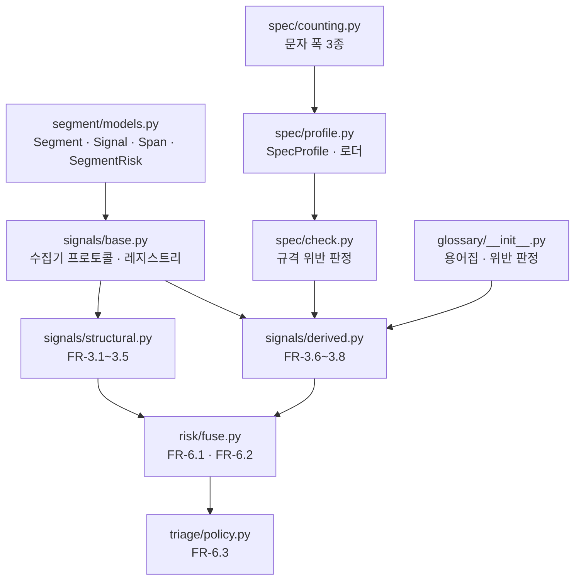

# Tier 0 신호 엔진 Implementation Plan

> **For agentic workers:** REQUIRED SUB-SKILL: Use superpowers:subagent-driven-development (recommended) or superpowers:executing-plans to implement this plan task-by-task. Steps use checkbox (`- [ ]`) syntax for tracking.

**Goal:** LLM·네트워크 없이 자막 세그먼트의 Tier 0 위험 신호 8종을 산출하고, 이를 하나의 위험도로 융합해 검수 예산 안에서 선별하는 순수 모듈군을 구현한다.

**Architecture:** 요구사항정의서 §7.2가 "순수"로 규정한 모듈(`spec`·`glossary`·`signals`·`risk`·`triage`)만 만든다. 외부 의존은 YAML 파싱뿐이고 네트워크·LLM 호출이 없다. 신호 수집기는 레지스트리에 등록되는 플러그인이며(FR-6.5), 세그먼트 단위 수집기와 트랙 단위(배치) 수집기 두 종류의 인터페이스를 갖는다.

**Tech Stack:** Python 3.11+ · PyYAML · pytest · ruff

## Global Constraints

이 절의 요건은 모든 태스크에 암묵적으로 포함된다.

| 항목 | 값 |
| --- | --- |
| Python 최저 버전 | 3.11 (`pyproject.toml` `requires-python = ">=3.11"`) |
| 새 런타임 의존성 | **추가 금지.** 현재 4개(`typer`·`pysubs2`·`pyyaml`·`httpx`)를 유지한다 |
| 새 dev 의존성 | **추가 금지.** `pytest`·`pytest-cov`·`ruff`만 쓴다 |
| ruff 규칙 | `E`·`F`·`I`·`UP`·`B`·`SIM`, `line-length = 100` |
| 파일 첫 줄 | `from __future__ import annotations` (기존 모듈 관례) |
| 주석·독스트링 | **한국어.** 근거가 되는 FR·Q 번호를 병기한다 (예: `FR-3.4`) |
| 커밋 메시지 | **한국어** |
| 푸시 | **금지.** 사용자가 명시적으로 요청할 때만 |
| 테스트 | 네트워크 접근 금지. 모든 테스트가 오프라인에서 통과해야 한다 |
| 로컬 Python | 3.14.6이라 `[stt]`·`[qe]` extra 설치가 막힐 수 있다. 이 계획은 extra를 쓰지 않으므로 무관하다 |

**검증 습관 (필수):** 테스트를 돌릴 때 "통과했나"가 아니라 **"몇 개를 대상으로 통과했나"** 를 확인한다. `pytest`의 수집 개수를 매번 읽는다. 0개 수집은 통과가 아니라 설정 오류다.

---

## 선행 결정 3건

이 계획은 스펙과 요구사항정의서 사이에서 확정되지 않은 지점 3개를 결정하고 진행한다. 각각 근거를 코드 주석에 남긴다.

| # | 쟁점 | 결정 | 근거 |
| --- | --- | --- | --- |
| D1 | §7.3은 타임코드를 `timedelta`로, §8.4는 `start_ms`/`end_ms`로 적었다 | **정수 밀리초(`start_ms`·`end_ms`)** 를 쓴다 | §8.4의 `review.json`이 최종 산출물 계약이다. `timedelta`를 쓰면 직렬화 지점마다 변환이 생기고, CPS 계산에서 부동소수 오차가 들어온다 |
| D2 | `char_counting`의 `latin_half`와 `fullwidth`가 구분되지 않는다 | `fullwidth`는 **모든 문자를 1.0으로** 센다 (반각 라틴 포함) | 두 모드가 같은 계산이면 스키마에 이름이 둘일 이유가 없다. 일본어 13자/줄은 세 언어 중 가장 좁아 관대한 계산이 화면 넘침으로 직결되므로, 가장 보수적인 정의를 택한다 |
| D3 | 스펙 §9는 `specs/ted.yaml` 하나를 적었으나 TED 프로파일도 언어별 값이 필요하다 | `specs/ted-ko.yaml`·`ted-en.yaml`·`ted-ja.yaml` **3개 파일**로 나눈다 | 프로파일 스키마를 하나로 유지해 로더가 단순해지고, `--spec ted-ko`처럼 CLI에서 직접 지정할 수 있다. 파일 안에 언어별 절을 두면 로더가 두 형태를 모두 다뤄야 한다 |

---

## 모듈 구조



위 도식이 말하는 것은 **의존이 한 방향으로만 흐른다**는 점이다. `risk`는 어떤 신호가 존재하는지 모르고 `Signal` 목록만 받으며, `triage`는 위험도가 어떻게 계산됐는지 모른다. 이 단방향성이 FR-6.5(v0.2에서 QE 모델을 코드 수정 없이 꽂기)의 전제다.

### 파일 책임

| 파일 | 책임 (한 문장) | 태스크 |
| --- | --- | --- |
| `src/cuesift/segment/models.py` | 파이프라인 전체가 주고받는 데이터 모양을 정의한다 | 1 |
| `src/cuesift/spec/counting.py` | 텍스트의 표시 폭을 세 가지 규칙으로 센다 | 2 |
| `src/cuesift/spec/profile.py` | 규격 프로파일 YAML을 읽어 검증된 객체로 만든다 | 3 |
| `specs/*.yaml` | 언어별 규격 수치와 출처 (7개 파일) | 3 |
| `src/cuesift/spec/check.py` | 텍스트와 지속시간이 프로파일을 만족하는지 판정한다 | 4 |
| `src/cuesift/glossary/__init__.py` | 용어집을 읽고 대응어 누락을 판정한다 | 5 |
| `src/cuesift/signals/base.py` | 수집기 인터페이스와 레지스트리를 제공한다 | 6 |
| `src/cuesift/signals/structural.py` | 텍스트만으로 판정되는 신호 5종 (FR-3.1~3.5) | 7 |
| `src/cuesift/signals/derived.py` | 외부 지식이 필요한 신호 3종 (FR-3.6~3.8) | 8 |
| `src/cuesift/risk/fuse.py` | 신호 목록을 위험도 하나로 합성한다 | 9 |
| `src/cuesift/triage/policy.py` | 위험도와 정책으로 검수 큐를 정한다 | 10 |

---

## Task 1: 세그먼트 데이터 모델

**Files:**

- Create: `src/cuesift/segment/__init__.py`
- Create: `src/cuesift/segment/models.py`
- Test: `tests/test_segment_models.py`

**Interfaces:**

- Consumes: 없음 (첫 태스크)
- Produces: `Segment`, `Span`, `Signal`, `SegmentRisk`. 이후 모든 태스크가 이 타입을 쓴다.

- [ ] **Step 1: 실패하는 테스트를 작성한다**

`tests/test_segment_models.py`:

```python
"""세그먼트 데이터 모델 테스트 (요구사항정의서 §7.3)."""

import pytest

from cuesift.segment import Segment, SegmentRisk, Signal, Span


def test_segment_duration_is_derived_from_timecodes():
    seg = Segment(id="s1", index=0, start_ms=1000, end_ms=3500, source_text="안녕하세요")
    assert seg.duration_ms == 2500


def test_segment_rejects_reversed_timecodes():
    """end < start는 파싱 버그의 신호다. 조용히 음수 duration을 만들면
    CPS가 음수가 되어 규격 검사가 무의미해진다."""
    with pytest.raises(ValueError, match="end_ms"):
        Segment(id="s1", index=0, start_ms=3000, end_ms=1000, source_text="x")


def test_segment_target_text_defaults_to_none():
    seg = Segment(id="s1", index=0, start_ms=0, end_ms=1000, source_text="원문")
    assert seg.target_text is None
    assert seg.speaker is None
    assert seg.meta == {}


def test_signal_score_must_be_normalized():
    """FR-6.1은 신호를 0~1로 정규화한다고 규정한다. 범위를 벗어난 값이
    들어오면 가중합이 조용히 왜곡되므로 생성 시점에 막는다."""
    with pytest.raises(ValueError, match="score"):
        Signal(name="spec.cps", tier=0, score=1.5)


def test_signal_defaults():
    sig = Signal(name="spec.cps", tier=0, score=0.4)
    assert sig.hard_fail is False
    assert sig.spans == ()
    assert sig.detail == {}


def test_span_rejects_reversed_range():
    with pytest.raises(ValueError, match="end"):
        Span(start=5, end=2)


def test_segment_risk_holds_signals_and_reasons():
    sig = Signal(name="struct.empty", tier=0, score=1.0, hard_fail=True)
    risk = SegmentRisk(segment_id="s1", signals=[sig], risk_score=1.0, hard_fail=True)
    assert risk.selected is False
    assert risk.reasons == []
```

- [ ] **Step 2: 테스트가 실패하는지 확인한다**

Run: `pytest tests/test_segment_models.py -v`
Expected: FAIL — `ModuleNotFoundError: No module named 'cuesift.segment'`

- [ ] **Step 3: 최소 구현을 작성한다**

`src/cuesift/segment/models.py`:

```python
"""파이프라인 전체가 주고받는 데이터 모델 (요구사항정의서 §7.3).

**타임코드는 정수 밀리초로 둔다.** §7.3은 `timedelta`로 적었으나 최종
산출물 계약인 §8.4 `review.json`이 `start_ms`/`end_ms`를 쓴다. 두 표현을
섞으면 직렬화 지점마다 변환이 생기고, CPS 계산에서 부동소수 오차가 들어온다.
"""

from __future__ import annotations

from dataclasses import dataclass, field


@dataclass(frozen=True, slots=True)
class Span:
    """텍스트 안의 문제 구간. 리포트 하이라이트에 쓴다 (§7.3)."""

    start: int
    end: int

    def __post_init__(self) -> None:
        if self.end < self.start:
            raise ValueError(f"end({self.end})가 start({self.start})보다 작다")


@dataclass(slots=True)
class Segment:
    """자막 한 덩어리. 판정의 최소 단위다 (§0.2)."""

    id: str
    index: int
    start_ms: int
    end_ms: int
    source_text: str
    target_text: str | None = None
    speaker: str | None = None  # v0.2 화자분리용 자리
    meta: dict = field(default_factory=dict)

    def __post_init__(self) -> None:
        # 음수 duration은 CPS를 음수로 만들어 규격 검사를 통째로 무의미하게 한다.
        if self.end_ms < self.start_ms:
            raise ValueError(f"end_ms({self.end_ms})가 start_ms({self.start_ms})보다 작다")

    @property
    def duration_ms(self) -> int:
        return self.end_ms - self.start_ms


@dataclass(frozen=True, slots=True)
class Signal:
    """수집기 하나가 낸 판정 결과 (§7.3).

    `score`는 0.0(안전)~1.0(위험)으로 정규화한다 (FR-6.1).
    `hard_fail`은 가중합을 우회해 무조건 검수 큐에 들어간다 (FR-6.2).
    """

    name: str
    tier: int
    score: float
    hard_fail: bool = False
    spans: tuple[Span, ...] = ()
    detail: dict = field(default_factory=dict)

    def __post_init__(self) -> None:
        if not 0.0 <= self.score <= 1.0:
            raise ValueError(f"score({self.score})가 0.0~1.0 범위를 벗어났다")


@dataclass(slots=True)
class SegmentRisk:
    """세그먼트 하나의 융합 결과와 선별 여부 (§7.3)."""

    segment_id: str
    signals: list[Signal]
    risk_score: float
    hard_fail: bool
    selected: bool = False
    reasons: list[str] = field(default_factory=list)  # 선별 사유 (FR-6.4)
```

`src/cuesift/segment/__init__.py`:

```python
"""세그먼트 데이터 모델 (요구사항정의서 §7.3)."""

from __future__ import annotations

from cuesift.segment.models import Segment, SegmentRisk, Signal, Span

__all__ = ["Segment", "SegmentRisk", "Signal", "Span"]
```

- [ ] **Step 4: 테스트가 통과하는지 확인한다**

Run: `pytest tests/test_segment_models.py -v`
Expected: PASS — **7 passed**. 수집 개수가 7인지 확인한다.

- [ ] **Step 5: 린트를 돌린다**

Run: `ruff check src tests && ruff format --check src tests`
Expected: 오류 없음. 포맷 지적이 나오면 `ruff format src tests`로 고친다.

- [ ] **Step 6: 커밋한다**

```bash
git add src/cuesift/segment tests/test_segment_models.py
git commit -m "기능: 세그먼트 데이터 모델 추가

요구사항정의서 §7.3의 Segment·Signal·Span·SegmentRisk를 구현했다.
타임코드는 §7.3의 timedelta가 아니라 §8.4 review.json 계약에 맞춰
정수 밀리초로 둔다 — 두 표현을 섞으면 직렬화마다 변환이 생기고
CPS 계산에 부동소수 오차가 들어온다.

역순 타임코드와 정규화 범위를 벗어난 score는 생성 시점에 막는다.
음수 duration은 CPS를 음수로 만들어 규격 검사를 무의미하게 하고,
범위 밖 score는 FR-6.1의 가중합을 조용히 왜곡한다."
```

---

## Task 2: 문자 폭 계산

**Files:**

- Create: `src/cuesift/spec/__init__.py`
- Create: `src/cuesift/spec/counting.py`
- Test: `tests/test_spec_counting.py`

**Interfaces:**

- Consumes: 없음
- Produces: `CharCounting` (StrEnum: `grapheme`·`latin_half`·`fullwidth`), `text_width(text: str, mode: CharCounting) -> float`

**배경:** §8.3.1이 언어마다 다른 `char_counting`을 지정했다. ko는 `latin_half`, en은 `grapheme`, ja는 `fullwidth`다. 같은 문자열이라도 모드에 따라 폭이 달라지므로, 줄 길이와 CPS가 전부 이 함수 위에 선다.

- [ ] **Step 1: 실패하는 테스트를 작성한다**

`tests/test_spec_counting.py`:

```python
"""문자 폭 계산 테스트 (요구사항정의서 FR-5.2, §8.3.1)."""

import pytest

from cuesift.spec import CharCounting, text_width


@pytest.mark.parametrize(
    ("mode", "expected"),
    [
        (CharCounting.grapheme, 5.0),
        (CharCounting.latin_half, 5.0),
        (CharCounting.fullwidth, 5.0),
    ],
)
def test_pure_hangul_is_the_same_in_all_modes(mode, expected):
    """한글은 셋 다 전각 1자다. 모드 차이는 라틴 문자에서만 나타난다."""
    assert text_width("안녕하세요", mode) == expected


def test_latin_is_half_width_in_latin_half_mode():
    """ko 프로파일(16자/줄)은 한글 기준이므로 라틴은 반각으로 센다."""
    assert text_width("AI", CharCounting.latin_half) == 1.0


def test_latin_is_full_width_in_fullwidth_mode():
    """ja 프로파일(13자/줄)은 세 언어 중 가장 좁다. 반각을 관대하게 세면
    화면 넘침으로 직결되므로 가장 보수적으로 전각 취급한다 (결정 D2)."""
    assert text_width("AI", CharCounting.fullwidth) == 2.0


def test_latin_counts_as_one_each_in_grapheme_mode():
    """en 프로파일(42자/줄)은 문자 폭을 따지지 않는다."""
    assert text_width("AI", CharCounting.grapheme) == 2.0


def test_mixed_script_in_latin_half():
    """한글 3자(3.0) + 라틴 2자(1.0) = 4.0"""
    assert text_width("인공지AI", CharCounting.latin_half) == 4.0


def test_combining_marks_do_not_add_width_in_grapheme_mode():
    """'é'를 e + U+0301로 쓴 것은 화면에서 한 글자다. 두 자로 세면
    라틴 언어의 줄 길이가 과대평가된다."""
    assert text_width("é", CharCounting.grapheme) == 1.0


def test_ideographic_space_is_full_width():
    """전각 공백(U+3000)은 CJK 자막에서 실제로 한 칸을 차지한다."""
    assert text_width("　", CharCounting.fullwidth) == 1.0


def test_empty_text_is_zero_width():
    for mode in CharCounting:
        assert text_width("", mode) == 0.0


def test_accented_latin_is_half_width_regardless_of_case():
    """é(East Asian Width 'A')와 É('N')가 같은 폭이어야 한다.

    유니코드의 Ambiguous 등급은 라틴 악센트 문자를 일관성 없이 분류한다.
    이를 전각으로 세면 같은 글자의 대소문자가 다른 폭을 갖는다.
    """
    assert text_width("é", CharCounting.latin_half) == 0.5
    assert text_width("É", CharCounting.latin_half) == 0.5
    assert text_width("Café", CharCounting.latin_half) == 2.0


def test_hangul_is_still_full_width_in_latin_half():
    """A 등급을 반각으로 내리는 변경이 한글 판정을 건드리지 않았는지 확인한다."""
    assert text_width("안녕", CharCounting.latin_half) == 2.0
```

- [ ] **Step 2: 테스트가 실패하는지 확인한다**

Run: `pytest tests/test_spec_counting.py -v`
Expected: FAIL — `ImportError: cannot import name 'CharCounting'`

- [ ] **Step 3: 최소 구현을 작성한다**

`src/cuesift/spec/counting.py`:

```python
"""텍스트의 표시 폭 계산 (요구사항정의서 FR-5.2, §8.3.1).

`char_counting`이 세 값을 갖는 이유는 언어마다 "한 자"의 뜻이 다르기 때문이다.
en 42자는 라틴 문자 42개, ko 16자는 한글 16자, ja 13자는 전각 13자다.

**`fullwidth`가 반각 라틴도 1.0으로 세는 것은 의도된 선택이다** (결정 D2).
`latin_half`와 같은 계산으로 두면 스키마에 이름이 둘일 이유가 없어지고,
ja 13자/줄은 세 언어 중 가장 좁아 관대한 계산이 화면 넘침으로 직결된다.
"""

from __future__ import annotations

import unicodedata
from enum import StrEnum

# East Asian Width가 이 값이면 전각으로 본다.
# W = Wide, F = Fullwidth.
# 유니코드의 Ambiguous 등급(A)은 라틴 악센트 문자(é, É 등)를 일관성 없이
# 분류하므로, 같은 글자의 대소문자가 다른 폭을 갖는 문제가 생긴다.
# 자막의 일관성이 CJK 폰트 렌더링 근사보다 중요하므로, latin_half에서는
# 실제 전각(W·F)만 1.0으로 센다.
_WIDE = frozenset({"W", "F"})


class CharCounting(StrEnum):
    """줄 길이·CPS를 셀 때 쓰는 규칙 (§8.3.1).

    Q5 조사에서 `grapheme`|`cjk_width` 두 값으로는 ko를 표현할 수 없어
    현재의 세 값으로 재정의했다.
    """

    grapheme = "grapheme"
    latin_half = "latin_half"
    fullwidth = "fullwidth"


def _visible_chars(text: str) -> list[str]:
    """결합 문자(악센트 등)를 제외한, 화면에서 자리를 차지하는 문자만 남긴다.

    표준 라이브러리에는 완전한 자소 클러스터 분할이 없다. `regex` 패키지가
    필요하지만 이 프로젝트는 의존성을 늘리지 않는다(Global Constraints).
    `unicodedata.combining()`으로 결합 표시를 걸러내는 근사를 쓴다.

    **한계**: 이모지 ZWJ 시퀀스(가족 이모지 등)는 여전히 여러 자로 센다.
    자막 텍스트에서는 드물고, 과대평가는 규격을 보수적으로 만드는 방향이라
    화면 넘침을 유발하지 않는다.
    """
    return [ch for ch in unicodedata.normalize("NFC", text) if unicodedata.combining(ch) == 0]


def text_width(text: str, mode: CharCounting) -> float:
    """`mode` 규칙으로 `text`의 표시 폭을 잰다."""
    chars = _visible_chars(text)

    if mode is CharCounting.grapheme:
        return float(len(chars))

    if mode is CharCounting.fullwidth:
        return float(len(chars))

    # latin_half — 전각은 1.0, 그 외는 0.5.
    return sum((1.0 if unicodedata.east_asian_width(ch) in _WIDE else 0.5 for ch in chars), 0.0)
```

`src/cuesift/spec/__init__.py`:

```python
"""자막 규격 프로파일과 검사 (요구사항정의서 §5.5, §8.3)."""

from __future__ import annotations

from cuesift.spec.counting import CharCounting, text_width

__all__ = ["CharCounting", "text_width"]
```

- [ ] **Step 4: 테스트가 통과하는지 확인한다**

Run: `pytest tests/test_spec_counting.py -v`
Expected: PASS — **12 passed** (파라미터화 3건 + 개별 9건).

- [ ] **Step 5: `grapheme`과 `fullwidth`가 같은 구현인 것을 확인하고 남긴다**

두 분기가 현재 같은 값을 낸다. 이는 우연이 아니라 정의상 그렇다 — 둘 다 "보이는 문자 1개 = 1.0"이다. 차이는 `latin_half`만 갖는다. 분기를 합치지 말고 그대로 둔다: 나중에 `grapheme`이 진짜 자소 클러스터 분할로 바뀌어도 `fullwidth`는 영향받지 않아야 한다.

`src/cuesift/spec/counting.py`의 `fullwidth` 분기 위에 주석을 추가한다:

```python
    if mode is CharCounting.fullwidth:
        # grapheme과 현재 같은 식이지만 분기를 합치지 않는다. grapheme이
        # 나중에 진짜 자소 클러스터 분할로 바뀌어도 fullwidth는 "보이는
        # 문자 = 전각 1"이라는 자체 정의를 유지해야 한다.
        return float(len(chars))
```

- [ ] **Step 6: 린트와 커밋**

```bash
ruff check src tests && ruff format --check src tests
git add src/cuesift/spec tests/test_spec_counting.py
git commit -m "기능: 문자 폭 계산 3종 추가

FR-5.2와 §8.3.1의 char_counting을 구현했다. en 42자는 라틴 42개,
ko 16자는 한글 16자, ja 13자는 전각 13자로 '한 자'의 뜻이 언어마다 다르다.

fullwidth가 반각 라틴도 1.0으로 세는 것은 의도된 결정이다. latin_half와
같은 계산이면 스키마에 이름이 둘일 이유가 없고, ja 13자/줄은 세 언어 중
가장 좁아 관대한 계산이 화면 넘침으로 직결된다.

자소 클러스터 분할은 표준 라이브러리에 없어 unicodedata.combining()
근사를 쓴다. 이모지 ZWJ 시퀀스를 과대평가하는 한계가 있으나 규격을
보수적으로 만드는 방향이라 화면 넘침을 유발하지 않는다."
```

---

## Task 3: 규격 프로파일과 YAML 7개

**Files:**

- Create: `src/cuesift/spec/profile.py`
- Modify: `src/cuesift/spec/__init__.py`
- Create: `specs/ko.yaml`, `specs/en.yaml`, `specs/ja.yaml`
- Create: `specs/ted-ko.yaml`, `specs/ted-en.yaml`, `specs/ted-ja.yaml`
- Test: `tests/test_spec_profile.py`

**Interfaces:**

- Consumes: `CharCounting` (Task 2)
- Produces: `SpecProfile` (필드: `name`·`max_chars_per_line`·`char_counting`·`max_cps`·`max_lines`·`min_duration_ms`·`max_duration_ms`·`source`), `load_profile(path: Path) -> SpecProfile`, `load_builtin(name: str) -> SpecProfile`

**TED 값 확인 결과 (2026-07-28 조사 완료)**

아래 YAML의 수치는 조사로 확정한 값이다. 추가 확인은 필요 없다.

| 항목 | 값 | 출처 | 검증 등급 |
| --- | --- | --- | --- |
| en 줄당 42자 · 2줄 · 21 CPS | 확정 | [ted.com 자막 팁](https://www.ted.com/participate/translate/subtitling-tips) — 현재 접근 가능 | 🟢 원문 확인 |
| ko 줄당 21자 · 10 CPS | 확정 | TED Translators Wiki 한국어 포털 | 🟡 **도메인 소멸** |
| ja 줄당 21자 · 10 CPS | 확정 | TED Translators Wiki 일본어 번역 가이드 | 🟡 **도메인 소멸** |
| 최소·최대 노출시간 | TED가 명시하지 않음 | Netflix 일반 요건 차용 | 🟡 대체 출처 |

**🟡 등급의 뜻**: `translations.ted.com`이 DNS 해석에 실패한다(2026-07-28 확인). TED가 Open Translation Project 위키를 내린 것으로 보인다. ko·ja 값은 **검색 색인에 남은 스냅샷**으로만 확인했고 원문 페이지는 열지 못했다. 두 언어 포털이 독립적으로 같은 값(21자 / 10 CPS)을 말하는 점이 상호 검증 역할을 한다.

**이 사실을 YAML 주석에 남긴다.** §11 R8은 출처 없는 수치를 금지하는데, 죽은 URL을 살아 있는 것처럼 적는 것도 같은 문제다 — 나중에 확인하려는 사람이 링크를 눌러 보고서야 알게 된다.

**노출시간을 TED 프로파일 3개 모두 833/7000으로 통일한다.** Netflix ja의 500ms를 가져오지 않는 이유는, TED가 지속시간을 아예 명시하지 않으므로 언어별 차등의 근거가 없기 때문이다. 근거 없는 비대칭은 벤치마크에서 ja만 다른 기준으로 재는 결과를 낳는다.

- [ ] **Step 1: 실패하는 테스트를 작성한다**

`tests/test_spec_profile.py`:

```python
"""규격 프로파일 로더 테스트 (요구사항정의서 FR-5.1, FR-5.3, §8.3.1)."""

import pytest

from cuesift.spec import CharCounting, SpecProfile, load_builtin, load_profile


def test_builtin_ko_matches_documented_values():
    """§8.3.1의 표를 그대로 옮겼는지 확인한다. 이 값이 바뀌면
    규격 검사 결과 전체가 바뀌므로 테스트로 고정한다."""
    p = load_builtin("ko")
    assert p.max_chars_per_line == 16
    assert p.char_counting is CharCounting.latin_half
    assert p.max_cps == 12
    assert p.max_lines == 2
    assert p.min_duration_ms == 833
    assert p.max_duration_ms == 7000


def test_builtin_en_matches_documented_values():
    p = load_builtin("en")
    assert p.max_chars_per_line == 42
    assert p.char_counting is CharCounting.grapheme
    assert p.max_cps == 20


def test_builtin_ja_uses_language_specific_min_duration():
    """§8.3.1의 선례 규칙 — 언어별 가이드가 일반 요건을 덮어쓴다.
    일본어 500ms가 일반 요건 833ms를 대체한다."""
    p = load_builtin("ja")
    assert p.min_duration_ms == 500
    assert p.char_counting is CharCounting.fullwidth


def test_every_builtin_profile_declares_a_source():
    """§11 R8 — 출처 없는 수치를 기본값으로 넣지 않는다."""
    for name in ["ko", "en", "ja", "ted-ko", "ted-en", "ted-ja"]:
        assert load_builtin(name).source.startswith("http")


def test_ted_profile_is_separate_from_netflix():
    """§8.3.1 — TED2020을 Netflix 프로파일로 검사하면 위반이 대량
    발생해 트리아지 성능 측정이 오염된다."""
    assert load_builtin("ted-en").max_cps != load_builtin("en").max_cps


def test_ted_cjk_profiles_keep_the_researched_values():
    """ko·ja의 21자/10 CPS는 원문 URL이 죽은 출처에서 얻은 값이다.
    다시 확인할 수 없으므로 테스트가 유일한 보존 수단이다.

    라틴 기준(42자/21 CPS)의 환산치가 아니라 TED가 두 언어에 별도로
    정한 값이며, 두 언어 포털이 독립적으로 같은 수치를 말한다."""
    for name in ["ted-ko", "ted-ja"]:
        p = load_builtin(name)
        assert p.max_chars_per_line == 21
        assert p.max_cps == 10
        # TED는 지속시간을 명시하지 않는다. 언어별 차등의 근거가 없으므로
        # TED 프로파일 3종이 같은 값을 쓴다.
        assert p.min_duration_ms == load_builtin("ted-en").min_duration_ms


def test_unknown_builtin_raises_with_available_names():
    with pytest.raises(FileNotFoundError, match="ko"):
        load_builtin("nonexistent")


def test_load_profile_rejects_missing_required_field(tmp_path):
    """필드가 빠지면 기본값으로 조용히 채우지 않는다. 검사하지 않고
    통과하는 게이트는 없는 게이트보다 나쁘다."""
    path = tmp_path / "broken.yaml"
    path.write_text("name: broken\nmax_cps: 12\n", encoding="utf-8")
    with pytest.raises(ValueError, match="max_chars_per_line"):
        load_profile(path)


def test_load_profile_rejects_unknown_char_counting(tmp_path):
    path = tmp_path / "bad.yaml"
    path.write_text(
        "name: bad\nsource: http://x\nmax_chars_per_line: 16\n"
        "char_counting: cjk_width\nmax_cps: 12\nmax_lines: 2\n"
        "min_duration_ms: 833\nmax_duration_ms: 7000\n",
        encoding="utf-8",
    )
    with pytest.raises(ValueError, match="char_counting"):
        load_profile(path)


def test_load_profile_rejects_nonpositive_cps(tmp_path):
    """max_cps가 0이면 모든 세그먼트가 위반이 되어 신호가 무의미해진다."""
    path = tmp_path / "zero.yaml"
    path.write_text(
        "name: zero\nsource: http://x\nmax_chars_per_line: 16\n"
        "char_counting: latin_half\nmax_cps: 0\nmax_lines: 2\n"
        "min_duration_ms: 833\nmax_duration_ms: 7000\n",
        encoding="utf-8",
    )
    with pytest.raises(ValueError, match="max_cps"):
        load_profile(path)


def test_user_profile_can_override_builtin(tmp_path):
    """FR-5.3 — 사용자가 덮어쓸 수 있다."""
    path = tmp_path / "custom.yaml"
    path.write_text(
        "name: custom\nsource: http://internal\nmax_chars_per_line: 20\n"
        "char_counting: latin_half\nmax_cps: 15\nmax_lines: 3\n"
        "min_duration_ms: 600\nmax_duration_ms: 8000\n",
        encoding="utf-8",
    )
    p = load_profile(path)
    assert isinstance(p, SpecProfile)
    assert p.max_chars_per_line == 20
    assert p.max_lines == 3
```

- [ ] **Step 2: 테스트가 실패하는지 확인한다**

Run: `pytest tests/test_spec_profile.py -v`
Expected: FAIL — `ImportError: cannot import name 'SpecProfile'`

- [ ] **Step 3: 프로파일 YAML 6개를 작성한다**

`specs/ko.yaml`:

```yaml
# 한국어 자막 규격 프로파일
# 출처: Netflix Timed Text Style Guide — Korean (Q5에서 1차 출처로 확정)
# 수치와 URL만 둔다. 가이드 본문(산문)은 저작물이므로 복제하지 않는다(§8.3.1).
name: ko
source: https://partnerhelp.netflixstudios.com/hc/en-us/articles/216001127-Korean-Timed-Text-Style-Guide
max_chars_per_line: 16
char_counting: latin_half
max_cps: 12
max_lines: 2
# 일반 요건 5/6초. 언어별 가이드가 덮어쓰지 않으면 이 값을 쓴다.
min_duration_ms: 833
max_duration_ms: 7000
```

`specs/en.yaml`:

```yaml
# 영어(미국) 자막 규격 프로파일
# 출처: Netflix Timed Text Style Guide — English (USA)
name: en
source: https://partnerhelp.netflixstudios.com/hc/en-us/articles/217350977-English-USA-Timed-Text-Style-Guide
max_chars_per_line: 42
char_counting: grapheme
max_cps: 20
max_lines: 2
min_duration_ms: 833
max_duration_ms: 7000
```

`specs/ja.yaml`:

```yaml
# 일본어 자막 규격 프로파일
# 출처: Netflix Timed Text Style Guide — Japanese
#
# min_duration_ms가 500인 것은 오타가 아니다. §8.3.1의 선례 규칙 —
# 언어별 가이드가 일반 요건(833ms)을 덮어쓴다.
#
# max_chars_per_line은 가로쓰기 기준 13자다. 세로쓰기(11자)는 v0.1 범위 밖이라
# 프로파일에 두지 않는다. 필요해지면 별도 프로파일(ja-vertical)로 분리한다.
name: ja
source: https://partnerhelp.netflixstudios.com/hc/en-us/articles/215767517-Japanese-Timed-Text-Style-Guide
max_chars_per_line: 13
char_counting: fullwidth
max_cps: 4
max_lines: 2
min_duration_ms: 500
max_duration_ms: 7000
```

`specs/ted-en.yaml`:

```yaml
# TED 자막 규격 프로파일 — 영어 (벤치마크 전용)
#
# TED2020 코퍼스는 Netflix가 아니라 TED 자체 기준으로 제작됐다.
# Netflix 프로파일로 검사하면 규격 위반이 대량 발생해 트리아지 성능
# 측정이 오염된다(§8.3.1).
#
# 42자·2줄·21 CPS는 아래 출처에서 직접 확인했다(2026-07-28).
#
# min/max_duration_ms는 TED가 명시하지 않는다. Netflix 일반 요건을
# 차용했고, TED 프로파일 3종 모두 같은 값을 쓴다 — TED가 지속시간을
# 언급하지 않으므로 언어별 차등의 근거가 없다.
name: ted-en
source: https://www.ted.com/participate/translate/subtitling-tips
max_chars_per_line: 42
char_counting: grapheme
max_cps: 21
max_lines: 2
min_duration_ms: 833
max_duration_ms: 7000
```

`specs/ted-ko.yaml`:

```yaml
# TED 자막 규격 프로파일 — 한국어 (벤치마크 전용)
#
# 21자/줄·10 CPS는 TED Translators Wiki 한국어 포털의 값이다.
# 라틴 기준(42자/21 CPS)의 환산치가 아니라 TED가 한국어에 별도로 정한 값이다.
#
# ⚠️ 출처 URL이 죽었다. translations.ted.com이 DNS 해석에 실패한다
# (2026-07-28 확인). TED가 Open Translation Project 위키를 내린 것으로
# 보인다. 값은 검색 색인에 남은 스냅샷으로 확인했고 원문 페이지는 열지
# 못했다. 일본어 가이드가 독립적으로 같은 값을 말하는 것이 상호 검증이다.
# 살아 있는 출처가 필요하면 아래 source를 교체할 것.
#
# min/max_duration_ms는 TED 미명시. ted-en 주석 참조.
name: ted-ko
source: https://translations.ted.com/Portal:한국어
max_chars_per_line: 21
char_counting: latin_half
max_cps: 10
max_lines: 2
min_duration_ms: 833
max_duration_ms: 7000
```

`specs/ted-ja.yaml`:

```yaml
# TED 자막 규격 프로파일 — 일본어 (벤치마크 전용)
#
# 21자/줄·10 CPS는 TED Translators Wiki 일본어 번역 가이드의 값이다.
# 한국어 포털과 같은 수치이며, 두 언어가 독립적으로 일치하는 것이
# 상호 검증 역할을 한다.
#
# ⚠️ ted-ko와 같은 단서 — 출처 URL이 죽었다(translations.ted.com DNS 실패,
# 2026-07-28 확인). 검색 색인 스냅샷으로만 확인한 값이다.
#
# min_duration_ms가 Netflix ja의 500이 아니라 833인 것은 의도된 것이다.
# TED는 지속시간을 아예 명시하지 않으므로 언어별 차등의 근거가 없고,
# 근거 없는 비대칭은 벤치마크에서 ja만 다른 기준으로 재게 만든다.
name: ted-ja
source: https://translations.ted.com/日本語への翻訳ガイド
max_chars_per_line: 21
char_counting: fullwidth
max_cps: 10
max_lines: 2
min_duration_ms: 833
max_duration_ms: 7000
```

- [ ] **Step 4: 로더를 구현한다**

`src/cuesift/spec/profile.py`:

```python
"""규격 프로파일 로드와 검증 (요구사항정의서 FR-5.1, FR-5.3, §8.3).

프로파일은 언어별 YAML 하나다. TED 벤치마크 프로파일도 같은 스키마를 쓰고
파일만 나눈다(결정 D3) — 파일 안에 언어별 절을 두면 로더가 두 형태를 모두
다뤄야 하고, `--spec ted-ko` 같은 직접 지정도 못 하게 된다.
"""

from __future__ import annotations

from dataclasses import dataclass
from pathlib import Path
from typing import Any

import yaml

from cuesift.spec.counting import CharCounting

# 리포지토리에 동봉한 기본 프로파일 위치. src/cuesift/spec/profile.py 기준
# 세 단계 위가 리포 루트다.
_BUILTIN_DIR = Path(__file__).resolve().parents[3] / "specs"

_REQUIRED = (
    "name",
    "source",
    "max_chars_per_line",
    "char_counting",
    "max_cps",
    "max_lines",
    "min_duration_ms",
    "max_duration_ms",
)


@dataclass(frozen=True, slots=True)
class SpecProfile:
    """언어 하나의 자막 규격 (FR-5.1)."""

    name: str
    source: str
    max_chars_per_line: float
    char_counting: CharCounting
    max_cps: float
    max_lines: int
    min_duration_ms: int
    max_duration_ms: int


def _require_positive(raw: dict[str, Any], key: str) -> None:
    if raw[key] <= 0:
        # 0이면 모든 세그먼트가 위반이 되어 신호가 무의미해진다.
        # 조용히 통과시키면 "규격 위반 100%"가 정상처럼 보인다.
        raise ValueError(f"{key}는 0보다 커야 한다 (받은 값: {raw[key]})")


def load_profile(path: Path) -> SpecProfile:
    """YAML 파일 하나를 검증된 프로파일로 만든다."""
    raw = yaml.safe_load(path.read_text(encoding="utf-8"))
    if not isinstance(raw, dict):
        raise ValueError(f"{path}: 최상위가 매핑이 아니다")

    # 기본값으로 조용히 채우지 않는다. 빠진 필드는 설정 실수이고,
    # 기본값을 넣으면 사용자가 의도한 것과 다른 규격으로 검사하게 된다.
    missing = [k for k in _REQUIRED if k not in raw]
    if missing:
        raise ValueError(f"{path}: 필수 필드가 없다 — {', '.join(missing)}")

    try:
        counting = CharCounting(raw["char_counting"])
    except ValueError as exc:
        allowed = ", ".join(m.value for m in CharCounting)
        raise ValueError(
            f"{path}: char_counting이 '{raw['char_counting']}'다. 허용값: {allowed}"
        ) from exc

    for key in ("max_chars_per_line", "max_cps", "max_lines", "min_duration_ms"):
        _require_positive(raw, key)

    if raw["max_duration_ms"] <= raw["min_duration_ms"]:
        raise ValueError(
            f"{path}: max_duration_ms({raw['max_duration_ms']})가 "
            f"min_duration_ms({raw['min_duration_ms']}) 이하다"
        )

    return SpecProfile(
        name=str(raw["name"]),
        source=str(raw["source"]),
        max_chars_per_line=float(raw["max_chars_per_line"]),
        char_counting=counting,
        max_cps=float(raw["max_cps"]),
        max_lines=int(raw["max_lines"]),
        min_duration_ms=int(raw["min_duration_ms"]),
        max_duration_ms=int(raw["max_duration_ms"]),
    )


def available_builtins() -> list[str]:
    """동봉된 프로파일 이름 목록."""
    return sorted(p.stem for p in _BUILTIN_DIR.glob("*.yaml"))


def load_builtin(name: str) -> SpecProfile:
    """`specs/<name>.yaml`을 읽는다."""
    path = _BUILTIN_DIR / f"{name}.yaml"
    if not path.is_file():
        raise FileNotFoundError(
            f"'{name}' 프로파일이 없다. 사용 가능: {', '.join(available_builtins())}"
        )
    return load_profile(path)
```

`src/cuesift/spec/__init__.py`를 갱신한다:

```python
"""자막 규격 프로파일과 검사 (요구사항정의서 §5.5, §8.3)."""

from __future__ import annotations

from cuesift.spec.counting import CharCounting, text_width
from cuesift.spec.profile import SpecProfile, available_builtins, load_builtin, load_profile

__all__ = [
    "CharCounting",
    "SpecProfile",
    "available_builtins",
    "load_builtin",
    "load_profile",
    "text_width",
]
```

- [ ] **Step 5: 테스트가 통과하는지 확인한다**

Run: `pytest tests/test_spec_profile.py -v`
Expected: PASS — **11 passed**

- [ ] **Step 6: 프로파일이 휠에 포함되는지 확인한다**

`specs/`는 `src/cuesift/` 밖이라 `[tool.hatch.build.targets.wheel]`의 `packages = ["src/cuesift"]`에 걸리지 않는다. 설치본에서 `load_builtin`이 깨진다.

`pyproject.toml`에 다음을 추가한다 (`[tool.hatch.build.targets.wheel]` 아래):

```toml
[tool.hatch.build.targets.wheel.force-include]
"specs" = "cuesift/specs"
```

그리고 `_BUILTIN_DIR`이 두 배치를 모두 찾도록 고친다:

```python
# 소스 트리에서는 리포 루트의 specs/, 설치본에서는 패키지 안의 specs/를 쓴다.
_PACKAGED = Path(__file__).resolve().parent.parent / "specs"
_REPO_ROOT = Path(__file__).resolve().parents[3] / "specs"
_BUILTIN_DIR = _PACKAGED if _PACKAGED.is_dir() else _REPO_ROOT
```

- [ ] **Step 7: 실패 경로를 실제로 확인한다**

게이트를 만들었으면 실패시켜 본다. 임시로 `specs/ko.yaml`의 `max_cps` 줄을 지우고 실행한다:

Run: `python -c "from cuesift.spec import load_builtin; load_builtin('ko')"`
Expected: `ValueError: .../specs/ko.yaml: 필수 필드가 없다 — max_cps`

확인 후 `git checkout specs/ko.yaml`로 되돌린다.

- [ ] **Step 8: 린트와 커밋**

```bash
ruff check src tests && ruff format --check src tests
pytest -q
git add src/cuesift/spec specs pyproject.toml tests/test_spec_profile.py
git commit -m "기능: 규격 프로파일 로더와 기본 프로파일 6종 추가

§8.3.1이 확정한 ko·en·ja 값과 TED 벤치마크용 ted-ko·ted-en·ted-ja를
YAML로 옮겼다. 수치와 출처 URL만 두고 가이드 본문은 복제하지 않는다.

TED 프로파일을 언어별 파일 3개로 나눴다. 스펙 초안은 ted.yaml 하나였으나
파일 안에 언어별 절을 두면 로더가 두 스키마를 다뤄야 하고 --spec ted-ko
같은 직접 지정도 못 하게 된다.

빠진 필드를 기본값으로 채우지 않고 실패시킨다. 조용히 채우면 사용자가
의도한 것과 다른 규격으로 검사하게 된다. max_cps가 0이면 모든 세그먼트가
위반이 되어 '규격 위반 100%'가 정상처럼 보이므로 이것도 막는다.

specs/를 휠에 force-include 한다. src/cuesift/ 밖이라 그대로 두면
설치본에서 load_builtin이 깨진다.

ted-ko·ted-ja의 21자/10 CPS는 라틴 기준의 환산치가 아니라 TED가 두 언어에
별도로 정한 값이다. 출처 URL이 죽어 있어(translations.ted.com DNS 실패)
검색 색인 스냅샷으로만 확인했고, 그 사실을 주석에 명기했다(§11 R8)."
```

---

## Task 4: 규격 검사

**Files:**

- Create: `src/cuesift/spec/check.py`
- Modify: `src/cuesift/spec/__init__.py`
- Test: `tests/test_spec_check.py`

**Interfaces:**

- Consumes: `SpecProfile`, `CharCounting`, `text_width` (Task 2·3), `Segment` (Task 1)
- Produces:
  - `SpecViolation` (필드: `kind: str`·`measured: float`·`limit: float`·`line_index: int | None`)
  - `check_text(text: str, duration_ms: int, profile: SpecProfile) -> list[SpecViolation]`
  - `check_overlaps(segments: Sequence[Segment]) -> dict[str, SpecViolation]`

`kind`가 가질 수 있는 값은 `line_length`·`line_count`·`cps`·`duration_short`·`duration_long`·`overlap` 6종이다. 이후 태스크가 이 문자열을 쓴다.

- [ ] **Step 1: 실패하는 테스트를 작성한다**

`tests/test_spec_check.py`:

```python
"""규격 검사 테스트 (요구사항정의서 FR-5.1, FR-3.8)."""

from cuesift.segment import Segment
from cuesift.spec import check_overlaps, check_text, load_builtin

KO = load_builtin("ko")  # 16자/줄, latin_half, 12 CPS, 2줄, 833~7000ms


def _kinds(violations):
    return sorted(v.kind for v in violations)


def test_conforming_text_has_no_violations():
    # 8자 / 2000ms = 4 CPS < 12
    assert check_text("안녕하세요반갑", 2000, KO) == []


def test_line_too_long_is_reported_with_line_index():
    """17자는 ko 한도 16자를 넘는다."""
    text = "가나다라마바사아자차카타파하거너더"
    violations = check_text(text, 7000, KO)
    long = [v for v in violations if v.kind == "line_length"]
    assert len(long) == 1
    assert long[0].line_index == 0
    assert long[0].measured == 17.0
    assert long[0].limit == 16.0


def test_only_the_offending_line_is_reported():
    """두 줄 중 둘째 줄만 길면 둘째 줄만 지목해야 한다.
    하이라이트가 엉뚱한 줄을 가리키면 검수자가 리포트를 신뢰하지 않는다."""
    text = "짧은줄\n가나다라마바사아자차카타파하거너더"
    long = [v for v in check_text(text, 7000, KO) if v.kind == "line_length"]
    assert len(long) == 1
    assert long[0].line_index == 1


def test_too_many_lines():
    text = "한줄\n두줄\n세줄"
    v = [x for x in check_text(text, 7000, KO) if x.kind == "line_count"]
    assert len(v) == 1
    assert v[0].measured == 3
    assert v[0].limit == 2


def test_cps_uses_the_configured_counting_mode():
    """ko는 latin_half다. 라틴 20자는 폭 10.0이므로 1000ms에서 10 CPS다.
    grapheme으로 셌다면 20 CPS가 되어 위반이 됐을 것이다."""
    assert [v for v in check_text("a" * 20, 1000, KO) if v.kind == "cps"] == []


def test_cps_violation_is_reported():
    # 폭 12.0(한글 12자) / 500ms = 24 CPS > 12
    v = [x for x in check_text("가나다라마바사아자차카타", 500, KO) if x.kind == "cps"]
    assert len(v) == 1
    assert v[0].measured == 24.0


def test_cps_counts_the_whole_text_not_per_line():
    """줄바꿈은 화면에 동시에 보이므로 읽기 속도는 전체 기준이다.
    줄마다 따로 재면 2줄 자막의 CPS가 절반으로 과소평가된다."""
    v = [x for x in check_text("가나다라마바\n사아자차카타", 500, KO) if x.kind == "cps"]
    assert len(v) == 1
    assert v[0].measured == 24.0


def test_duration_too_short():
    v = [x for x in check_text("가", 400, KO) if x.kind == "duration_short"]
    assert len(v) == 1
    assert v[0].limit == 833


def test_duration_too_long():
    v = [x for x in check_text("가", 9000, KO) if x.kind == "duration_long"]
    assert len(v) == 1
    assert v[0].limit == 7000


def test_zero_duration_does_not_divide_by_zero():
    """duration 0은 파싱 사고이지 CPS 무한대가 아니다. 예외로 죽으면
    자막 하나 때문에 전체 실행이 멈춘다."""
    violations = check_text("가나다", 0, KO)
    assert "duration_short" in _kinds(violations)
    assert "cps" not in _kinds(violations)


def test_empty_text_has_no_length_or_cps_violation():
    """빈 값은 FR-3.2가 hard fail로 따로 잡는다. 규격 검사가 중복
    보고하면 신호 하나가 두 번 세어져 위험도가 부풀려진다."""
    violations = check_text("", 2000, KO)
    assert _kinds(violations) == []


def test_overlapping_segments_are_detected():
    segs = [
        Segment(id="a", index=0, start_ms=0, end_ms=2000, source_text="가"),
        Segment(id="b", index=1, start_ms=1500, end_ms=3000, source_text="나"),
    ]
    result = check_overlaps(segs)
    assert set(result) == {"b"}
    assert result["b"].measured == 500


def test_touching_segments_do_not_overlap():
    """end == start는 겹침이 아니다. 경계에서 오탐이 나면
    모든 자막이 위반으로 표시된다."""
    segs = [
        Segment(id="a", index=0, start_ms=0, end_ms=2000, source_text="가"),
        Segment(id="b", index=1, start_ms=2000, end_ms=3000, source_text="나"),
    ]
    assert check_overlaps(segs) == {}


def test_overlaps_are_checked_in_time_order_not_list_order():
    """입력이 정렬돼 있지 않아도 판정이 같아야 한다."""
    segs = [
        Segment(id="b", index=1, start_ms=1500, end_ms=3000, source_text="나"),
        Segment(id="a", index=0, start_ms=0, end_ms=2000, source_text="가"),
    ]
    assert set(check_overlaps(segs)) == {"b"}


def test_long_segment_overlapping_a_later_one_is_detected():
    """긴 세그먼트가 뒤쪽 세그먼트를 덮는데 사이에 안 겹치는 것이 끼어 있는 경우.

    인접 쌍만 비교하면 C가 검사에서 통째로 빠진다.
    """
    segs = [
        Segment(id="A", index=0, start_ms=0, end_ms=10000, source_text="가"),
        Segment(id="B", index=1, start_ms=100, end_ms=200, source_text="나"),
        Segment(id="C", index=2, start_ms=5000, end_ms=6000, source_text="다"),
    ]
    assert set(check_overlaps(segs)) == {"B", "C"}


def test_overlap_amount_is_the_actual_intersection():
    """포함 관계에서 겹침량은 앞 세그먼트의 끝이 아니라 실제 교집합이다.

    B(100~200)는 A(0~10000) 안에 완전히 들어 있으므로 겹침은 100ms다.
    """
    segs = [
        Segment(id="A", index=0, start_ms=0, end_ms=10000, source_text="가"),
        Segment(id="B", index=1, start_ms=100, end_ms=200, source_text="나"),
        Segment(id="C", index=2, start_ms=5000, end_ms=6000, source_text="다"),
    ]
    result = check_overlaps(segs)
    assert result["B"].measured == 100
    assert result["C"].measured == 1000
```

- [ ] **Step 2: 테스트가 실패하는지 확인한다**

Run: `pytest tests/test_spec_check.py -v`
Expected: FAIL — `ImportError: cannot import name 'check_text'`

- [ ] **Step 3: 최소 구현을 작성한다**

`src/cuesift/spec/check.py`:

```python
"""자막 규격 판정 (요구사항정의서 FR-5.1, FR-3.8).

**이 모듈은 순수하다** — 세그먼트 하나의 텍스트와 지속시간만 보고 판정한다.
겹침만 트랙 전체를 봐야 하므로 별도 함수로 뺐다.

규격을 LLM이 아니라 코드로 판정하는 이유는 §5.5에 있다. "42자 넘지 마"를
프롬프트로 지시하면 대체로 지키고 가끔 어긴다. 자막 규격은 100%가 아니면
의미가 없다 — 한 편에 한 줄만 넘쳐도 사고다.
"""

from __future__ import annotations

from collections.abc import Sequence
from dataclasses import dataclass

from cuesift.segment import Segment
from cuesift.spec.counting import text_width
from cuesift.spec.profile import SpecProfile


@dataclass(frozen=True, slots=True)
class SpecViolation:
    """규격 위반 한 건.

    `kind`는 `line_length`·`line_count`·`cps`·`duration_short`·
    `duration_long`·`overlap` 중 하나다.
    """

    kind: str
    measured: float
    limit: float
    line_index: int | None = None


def check_text(text: str, duration_ms: int, profile: SpecProfile) -> list[SpecViolation]:
    """텍스트 하나가 프로파일을 만족하는지 판정한다."""
    violations: list[SpecViolation] = []

    # 빈 값은 FR-3.2가 hard fail로 따로 잡는다. 여기서 중복 보고하면
    # 같은 문제가 두 신호로 세어져 위험도가 부풀려진다.
    if text.strip():
        lines = text.split("\n")

        if len(lines) > profile.max_lines:
            violations.append(
                SpecViolation("line_count", float(len(lines)), float(profile.max_lines))
            )

        for i, line in enumerate(lines):
            width = text_width(line, profile.char_counting)
            if width > profile.max_chars_per_line:
                violations.append(
                    SpecViolation("line_length", width, profile.max_chars_per_line, line_index=i)
                )

        # CPS는 줄이 아니라 전체 기준이다. 두 줄은 화면에 동시에 보이므로
        # 줄마다 따로 재면 2줄 자막의 읽기 속도가 절반으로 과소평가된다.
        # 줄바꿈 자체는 읽을 문자가 아니므로 제외한다.
        if duration_ms > 0:
            width = text_width(text.replace("\n", ""), profile.char_counting)
            cps = width / (duration_ms / 1000)
            if cps > profile.max_cps:
                violations.append(SpecViolation("cps", round(cps, 3), profile.max_cps))

    if duration_ms < profile.min_duration_ms:
        violations.append(
            SpecViolation("duration_short", float(duration_ms), float(profile.min_duration_ms))
        )
    elif duration_ms > profile.max_duration_ms:
        violations.append(
            SpecViolation("duration_long", float(duration_ms), float(profile.max_duration_ms))
        )

    return violations


def check_overlaps(segments: Sequence[Segment]) -> dict[str, SpecViolation]:
    """시간이 겹치는 세그먼트를 찾는다 (FR-5.1 세그먼트 중첩 금지).

    겹침은 **뒤에 오는 세그먼트**에 기록한다. 앞 세그먼트에 붙이면
    한 자막이 여러 번 겹칠 때 어느 쌍이 문제인지 알 수 없다.

    입력 순서에 의존하지 않도록 시간순으로 정렬한 뒤 판정한다.

    **직전 항목이 아니라 지금까지 본 최대 end_ms와 비교한다.** 인접 쌍만
    보면 긴 세그먼트가 여러 개를 덮을 때 중간에 끼지 않은 것을 놓친다 —
    A(0~10000)가 C(5000~6000)를 덮어도 사이의 B(100~200)와 C가 안 겹치면
    C가 검사에서 빠진다. 검사하지 않고 통과하는 게이트는 없는 게이트보다 나쁘다.
    """
    ordered = sorted(segments, key=lambda s: (s.start_ms, s.end_ms))
    result: dict[str, SpecViolation] = {}
    run_end: int | None = None

    for seg in ordered:
        # end == start는 겹침이 아니다. 경계를 위반으로 보면
        # 연속된 자막 전체가 오탐이 된다.
        if run_end is not None and seg.start_ms < run_end:
            # 포함 관계에서는 앞 세그먼트의 끝이 아니라 이 세그먼트의 끝이
            # 겹침의 경계다. run_end만 쓰면 겹침량이 과대 보고된다.
            overlap = min(run_end, seg.end_ms) - seg.start_ms
            result[seg.id] = SpecViolation("overlap", float(overlap), 0.0)

        if run_end is None or seg.end_ms > run_end:
            run_end = seg.end_ms

    return result
```

`src/cuesift/spec/__init__.py`에 추가한다:

```python
from cuesift.spec.check import SpecViolation, check_overlaps, check_text
```

`__all__`에 `"SpecViolation"`, `"check_overlaps"`, `"check_text"`를 넣고 알파벳순을 유지한다.

- [ ] **Step 4: 테스트가 통과하는지 확인한다**

Run: `pytest tests/test_spec_check.py -v`
Expected: PASS — **16 passed**

- [ ] **Step 5: 린트와 커밋**

```bash
ruff check src tests && ruff format --check src tests
pytest -q
git add src/cuesift/spec tests/test_spec_check.py
git commit -m "기능: 규격 검사 구현

FR-5.1의 줄 길이·줄 수·CPS·노출시간·겹침을 판정한다.

CPS는 줄이 아니라 전체 텍스트 기준으로 잰다. 두 줄은 화면에 동시에
보이므로 줄마다 따로 재면 2줄 자막의 읽기 속도가 절반으로 과소평가된다.

빈 텍스트는 길이·CPS 위반을 내지 않는다. FR-3.2가 hard fail로 따로
잡으므로 여기서 중복 보고하면 같은 문제가 두 신호로 세어져 위험도가
부풀려진다.

duration 0에서 0으로 나누지 않는다. 파싱 사고 하나 때문에 전체 실행이
멈추면 안 된다. 이 경우 duration_short만 보고한다.

겹침은 뒤에 오는 세그먼트에 기록하고, 입력 순서에 의존하지 않도록
시간순 정렬 후 판정한다. end == start는 겹침이 아니다 — 경계를 위반으로
보면 연속된 자막 전체가 오탐이 된다."
```

---

## Task 5: 용어집

**Files:**

- Create: `src/cuesift/glossary/__init__.py`
- Test: `tests/test_glossary.py`

**Interfaces:**

- Consumes: 없음
- Produces:
  - `GlossaryEntry` (필드: `source: str`·`targets: tuple[str, ...]`)
  - `Glossary` (메서드: `violations(source_text: str, target_text: str) -> list[GlossaryEntry]`, `is_empty` 프로퍼티)
  - `load_glossary(path: Path, target_lang: str) -> Glossary`

**YAML 형식:**

```yaml
entries:
  - source: 기후변화
    targets:
      en: [climate change, global warming]
      ja: [気候変動]
```

- [ ] **Step 1: 실패하는 테스트를 작성한다**

`tests/test_glossary.py`:

```python
"""용어집 테스트 (요구사항정의서 FR-3.7, FR-2.3)."""

import pytest

from cuesift.glossary import Glossary, GlossaryEntry, load_glossary

SAMPLE = """
entries:
  - source: 기후변화
    targets:
      en: [climate change, global warming]
      ja: [気候変動]
  - source: 인공지능
    targets:
      en: [artificial intelligence, AI]
      ja: [人工知能]
"""


@pytest.fixture
def glossary_file(tmp_path):
    path = tmp_path / "glossary.yaml"
    path.write_text(SAMPLE, encoding="utf-8")
    return path


def test_load_selects_only_the_target_language(glossary_file):
    g = load_glossary(glossary_file, "en")
    assert len(g.entries) == 2
    assert g.entries[0].targets == ("climate change", "global warming")


def test_entry_without_the_target_language_is_dropped(tmp_path):
    """ja 항목이 없는 용어를 en 용어집에 남기면 대응어가 빈 채로
    항상 위반 판정이 나온다."""
    path = tmp_path / "g.yaml"
    path.write_text(
        "entries:\n  - source: 가\n    targets:\n      ja: [ア]\n",
        encoding="utf-8",
    )
    assert load_glossary(path, "en").entries == ()


def test_no_violation_when_target_contains_a_listed_equivalent(glossary_file):
    g = load_glossary(glossary_file, "en")
    assert g.violations("기후변화는 심각하다", "Climate change is serious") == []


def test_violation_when_no_equivalent_appears(glossary_file):
    g = load_glossary(glossary_file, "en")
    hits = g.violations("기후변화는 심각하다", "The weather is bad")
    assert [e.source for e in hits] == ["기후변화"]


def test_any_one_of_multiple_equivalents_satisfies(glossary_file):
    """대응어가 여러 개면 하나만 나와도 통과다. 전부 요구하면
    정상 번역이 대량 오탐이 된다."""
    g = load_glossary(glossary_file, "en")
    assert g.violations("인공지능 연구", "AI research") == []


def test_matching_is_case_insensitive(glossary_file):
    g = load_glossary(glossary_file, "en")
    assert g.violations("기후변화", "CLIMATE CHANGE") == []


def test_term_absent_from_source_is_not_checked(glossary_file):
    """원문에 없는 용어는 판정 대상이 아니다 (FR-3.7의 정의).
    이걸 어기면 용어집이 커질수록 오탐이 선형으로 는다."""
    assert load_glossary(glossary_file, "en").violations("날씨 얘기", "Weather talk") == []


def test_multiple_violations_are_all_reported(glossary_file):
    g = load_glossary(glossary_file, "en")
    hits = g.violations("기후변화와 인공지능", "Two topics")
    assert sorted(e.source for e in hits) == ["기후변화", "인공지능"]


def test_empty_glossary_reports_itself(tmp_path):
    """비어 있는 용어집으로 측정하면 '용어 위반 0건'이 나오는데,
    이건 '위반이 없다'가 아니라 '검사하지 않았다'다. 호출자가
    이 둘을 구분할 수 있어야 한다."""
    path = tmp_path / "empty.yaml"
    path.write_text("entries: []\n", encoding="utf-8")
    g = load_glossary(path, "en")
    assert g.is_empty is True
    assert Glossary(entries=(GlossaryEntry("가", ("a",)),)).is_empty is False


def test_missing_entries_key_raises(tmp_path):
    path = tmp_path / "bad.yaml"
    path.write_text("terms: []\n", encoding="utf-8")
    with pytest.raises(ValueError, match="entries"):
        load_glossary(path, "en")
```

- [ ] **Step 2: 테스트가 실패하는지 확인한다**

Run: `pytest tests/test_glossary.py -v`
Expected: FAIL — `ModuleNotFoundError: No module named 'cuesift.glossary'`

- [ ] **Step 3: 최소 구현을 작성한다**

`src/cuesift/glossary/__init__.py`:

```python
"""용어집 로드와 위반 판정 (요구사항정의서 FR-3.7, FR-2.3).

**판정 규칙**: 원문에 용어집 키가 있는데 번역문에 등재된 대응어가 하나도
없으면 위반이다. 원문에 없는 용어는 검사하지 않는다 — 이걸 어기면 용어집이
커질수록 오탐이 선형으로 늘어 용어집을 키울 수 없게 된다.

대응어가 여러 개면 **하나만 나와도 통과**다. 전부 요구하면 정상 번역이
대량 오탐이 된다("AI"와 "artificial intelligence"를 한 문장에 둘 다 쓰지 않는다).
"""

from __future__ import annotations

from dataclasses import dataclass
from pathlib import Path

import yaml


@dataclass(frozen=True, slots=True)
class GlossaryEntry:
    """용어 하나와 그 대응어들."""

    source: str
    targets: tuple[str, ...]


@dataclass(frozen=True, slots=True)
class Glossary:
    """대상 언어 하나에 대한 용어집."""

    entries: tuple[GlossaryEntry, ...] = ()

    @property
    def is_empty(self) -> bool:
        """비어 있으면 '위반 0건'이 '검사하지 않음'을 뜻한다.

        호출자가 이 둘을 구분할 수 있어야 한다. 구분하지 않으면
        용어집을 못 읽은 실행이 만점으로 보고된다.
        """
        return not self.entries

    def violations(self, source_text: str, target_text: str) -> list[GlossaryEntry]:
        """원문에 등장하는 용어 중 번역문에 대응어가 없는 것들."""
        lowered = target_text.lower()
        return [
            entry
            for entry in self.entries
            if entry.source in source_text
            and not any(t.lower() in lowered for t in entry.targets)
        ]


def load_glossary(path: Path, target_lang: str) -> Glossary:
    """YAML 용어집에서 `target_lang` 대응어만 골라 로드한다."""
    raw = yaml.safe_load(path.read_text(encoding="utf-8"))
    if not isinstance(raw, dict) or "entries" not in raw:
        raise ValueError(f"{path}: 최상위에 'entries' 키가 없다")

    entries: list[GlossaryEntry] = []
    for item in raw["entries"] or []:
        targets = (item.get("targets") or {}).get(target_lang)
        # 대상 언어 대응어가 없는 항목은 버린다. 남겨 두면 대응어가
        # 빈 채로 항상 위반 판정이 나온다.
        if not targets:
            continue
        entries.append(GlossaryEntry(source=str(item["source"]), targets=tuple(targets)))

    return Glossary(entries=tuple(entries))
```

- [ ] **Step 4: 테스트가 통과하는지 확인한다**

Run: `pytest tests/test_glossary.py -v`
Expected: PASS — **10 passed**

- [ ] **Step 5: 린트와 커밋**

```bash
ruff check src tests && ruff format --check src tests
pytest -q
git add src/cuesift/glossary tests/test_glossary.py
git commit -m "기능: 용어집 로드와 위반 판정 추가

FR-3.7 — 원문에 용어집 키가 있는데 번역문에 등재된 대응어가 하나도
없으면 위반이다.

원문에 없는 용어는 검사하지 않는다. 이걸 어기면 용어집이 커질수록
오탐이 선형으로 늘어 용어집을 키울 수 없게 된다.

대응어가 여러 개면 하나만 나와도 통과다. 전부 요구하면 정상 번역이
대량 오탐이 된다 — 'AI'와 'artificial intelligence'를 한 문장에
둘 다 쓰지 않는다.

Glossary.is_empty를 노출한다. 비어 있는 용어집의 '위반 0건'은
'위반이 없다'가 아니라 '검사하지 않았다'이고, 구분하지 않으면
용어집을 못 읽은 실행이 만점으로 보고된다."
```

---

## Task 6: 신호 수집기 인터페이스와 레지스트리

**Files:**

- Create: `src/cuesift/signals/__init__.py`
- Create: `src/cuesift/signals/base.py`
- Test: `tests/test_signals_base.py`

**Interfaces:**

- Consumes: `Segment`, `Signal` (Task 1), `SpecProfile` (Task 3), `Glossary` (Task 5)
- Produces:
  - `SignalContext` (필드: `profile: SpecProfile`·`glossary: Glossary | None`·`source_lang: str`·`target_lang: str`)
  - `SegmentCollector` Protocol — `name: str`, `tier: int`, `collect(seg, ctx) -> Signal | None`
  - `BatchCollector` Protocol — `name: str`, `tier: int`, `collect_batch(segments, ctx) -> dict[str, Signal]`
  - `register(collector)`, `registry() -> dict[str, ...]`, `collect_all(segments, ctx, enabled=None) -> dict[str, list[Signal]]`

**왜 인터페이스가 둘인가:** FR-3.6(길이비 이상치)은 "언어쌍 분포에서 이상치"를 판정하므로 트랙 전체를 봐야 한다. 세그먼트 단위 프로토콜에 억지로 끼우면 수집기가 매번 전체를 다시 훑게 된다.

- [ ] **Step 1: 실패하는 테스트를 작성한다**

`tests/test_signals_base.py`:

```python
"""신호 수집기 인터페이스와 레지스트리 테스트 (요구사항정의서 FR-6.5)."""

import pytest

from cuesift.segment import Segment, Signal
from cuesift.signals import SignalContext, collect_all, register, registry
from cuesift.spec import load_builtin


@pytest.fixture
def ctx():
    return SignalContext(
        profile=load_builtin("en"), glossary=None, source_lang="ko", target_lang="en"
    )


@pytest.fixture
def segments():
    return [
        Segment(id="s1", index=0, start_ms=0, end_ms=2000, source_text="가", target_text="a"),
        Segment(id="s2", index=1, start_ms=2000, end_ms=4000, source_text="나", target_text="b"),
    ]


@pytest.fixture(autouse=True)
def clean_registry():
    """레지스트리는 전역 상태다. **비운 뒤** 테스트를 돌리고 복원한다.

    비우지 않으면 Task 7·8이 등록한 실제 신호 8종이 함께 돌아가고,
    이 파일의 단언(`== ["test.always"]`)이 실제 신호의 발화 여부에
    의존하게 된다. 인터페이스 테스트가 신호 구현에 묶이면 안 된다.
    """
    saved = dict(registry())
    registry().clear()
    yield
    registry().clear()
    registry().update(saved)


class _AlwaysFires:
    name = "test.always"
    tier = 0

    def collect(self, seg, ctx):
        return Signal(name=self.name, tier=0, score=1.0)


class _NeverFires:
    name = "test.never"
    tier = 0

    def collect(self, seg, ctx):
        return None


class _Batch:
    name = "test.batch"
    tier = 0

    def collect_batch(self, segments, ctx):
        return {segments[0].id: Signal(name=self.name, tier=0, score=0.5)}


def test_register_makes_collector_discoverable():
    register(_AlwaysFires())
    assert "test.always" in registry()


def test_duplicate_name_is_rejected():
    """이름이 겹치면 나중 것이 앞선 것을 조용히 덮어써 신호가 사라진다."""
    register(_AlwaysFires())
    with pytest.raises(ValueError, match="test.always"):
        register(_AlwaysFires())


def test_collect_all_returns_signals_per_segment(ctx, segments):
    register(_AlwaysFires())
    result = collect_all(segments, ctx)
    assert [s.name for s in result["s1"]] == ["test.always"]
    assert [s.name for s in result["s2"]] == ["test.always"]


def test_none_result_means_no_signal(ctx, segments):
    """수집기가 None을 내면 '점수 0'이 아니라 '해당 없음'이다.
    0점 신호를 넣으면 §8.4 review.json이 무의미한 항목으로 채워진다."""
    register(_NeverFires())
    result = collect_all(segments, ctx)
    assert result["s1"] == []


def test_every_segment_appears_even_with_no_signals(ctx, segments):
    """빠진 키는 KeyError를 부른다. 신호가 없어도 빈 리스트를 준다."""
    result = collect_all(segments, ctx)
    assert set(result) == {"s1", "s2"}


def test_batch_collector_runs_once_over_the_track(ctx, segments):
    register(_Batch())
    result = collect_all(segments, ctx)
    assert [s.name for s in result["s1"]] == ["test.batch"]
    assert result["s2"] == []


def test_enabled_filter_selects_a_subset(ctx, segments):
    """ablation 측정(스펙 §6.1 신호별 기여도)이 이 인자를 쓴다."""
    register(_AlwaysFires())
    register(_Batch())
    result = collect_all(segments, ctx, enabled={"test.batch"})
    assert [s.name for s in result["s1"]] == ["test.batch"]


def test_enabled_with_unknown_name_raises():
    """오타로 신호를 껐는데 '기여도 0'으로 읽히면 잘못된 결론이 나온다."""
    with pytest.raises(ValueError, match="test.nope"):
        collect_all([], SignalContext(load_builtin("en"), None, "ko", "en"), enabled={"test.nope"})
```

- [ ] **Step 2: 테스트가 실패하는지 확인한다**

Run: `pytest tests/test_signals_base.py -v`
Expected: FAIL — `ModuleNotFoundError: No module named 'cuesift.signals'`

- [ ] **Step 3: 최소 구현을 작성한다**

`src/cuesift/signals/base.py`:

```python
"""신호 수집기 인터페이스와 레지스트리 (요구사항정의서 FR-6.5, NFR-5).

**수집기 인터페이스가 둘인 이유**: FR-3.6(길이비 이상치)은 "언어쌍 분포에서
이상치"를 판정하므로 트랙 전체를 봐야 한다. 세그먼트 단위 프로토콜에 억지로
끼우면 수집기가 세그먼트마다 전체를 다시 훑게 된다.

레지스트리는 v0.2에서 QE 모델(Tier 2)을 코드 수정 없이 꽂기 위한 자리다.
"""

from __future__ import annotations

from collections.abc import Iterable, Sequence
from dataclasses import dataclass
from typing import Protocol, runtime_checkable

from cuesift.glossary import Glossary
from cuesift.segment import Segment, Signal
from cuesift.spec import SpecProfile


@dataclass(frozen=True, slots=True)
class SignalContext:
    """수집기가 판정에 쓰는 주변 정보."""

    profile: SpecProfile
    glossary: Glossary | None
    source_lang: str
    target_lang: str


@runtime_checkable
class SegmentCollector(Protocol):
    """세그먼트 하나만 보고 판정하는 수집기."""

    name: str
    tier: int

    def collect(self, seg: Segment, ctx: SignalContext) -> Signal | None:
        """신호를 내거나, 해당 없으면 None을 낸다.

        **None과 score=0.0은 다르다.** None은 "이 신호의 판정 대상이
        아니다"이고, 0.0은 "판정했고 안전하다"다. 해당 없음에 0점 신호를
        넣으면 §8.4 review.json이 무의미한 항목으로 채워진다.
        """
        ...


@runtime_checkable
class BatchCollector(Protocol):
    """트랙 전체를 봐야 판정되는 수집기 (분포 기반 신호)."""

    name: str
    tier: int

    def collect_batch(
        self, segments: Sequence[Segment], ctx: SignalContext
    ) -> dict[str, Signal]:
        """신호가 있는 세그먼트 ID만 담아 반환한다."""
        ...


_REGISTRY: dict[str, SegmentCollector | BatchCollector] = {}


def registry() -> dict[str, SegmentCollector | BatchCollector]:
    """등록된 수집기 사전. 테스트가 저장·복원할 수 있도록 노출한다."""
    return _REGISTRY


def register(collector: SegmentCollector | BatchCollector) -> None:
    """수집기를 등록한다."""
    if collector.name in _REGISTRY:
        # 조용히 덮어쓰면 앞선 신호가 사라지고, 그 신호가 잡던 오류가
        # 리포트에서 통째로 빠진다. 원인을 역추적하기 매우 어렵다.
        raise ValueError(f"신호 이름이 중복됐다: {collector.name}")
    _REGISTRY[collector.name] = collector


def collect_all(
    segments: Sequence[Segment],
    ctx: SignalContext,
    enabled: Iterable[str] | None = None,
) -> dict[str, list[Signal]]:
    """모든 수집기를 돌려 세그먼트별 신호 목록을 만든다.

    `enabled`를 주면 그 이름들만 실행한다 — ablation 측정에 쓴다.
    """
    if enabled is None:
        names = list(_REGISTRY)
    else:
        names = list(enabled)
        # 오타로 신호를 껐는데 "기여도 0"으로 읽히면 잘못된 결론이 나온다.
        unknown = [n for n in names if n not in _REGISTRY]
        if unknown:
            raise ValueError(f"등록되지 않은 신호: {', '.join(sorted(unknown))}")

    # 신호가 하나도 없는 세그먼트도 키를 갖는다. 빠진 키는 KeyError를 부른다.
    result: dict[str, list[Signal]] = {seg.id: [] for seg in segments}

    for name in names:
        collector = _REGISTRY[name]
        # 프로토콜 isinstance가 아니라 hasattr로 가른다. runtime_checkable
        # 프로토콜의 isinstance는 데이터 멤버(name·tier)까지 hasattr로 확인해
        # 두 프로토콜이 동시에 참이 될 수 있고, 판정이 미묘해진다.
        if hasattr(collector, "collect_batch"):
            for seg_id, signal in collector.collect_batch(segments, ctx).items():
                result[seg_id].append(signal)
        else:
            for seg in segments:
                signal = collector.collect(seg, ctx)
                if signal is not None:
                    result[seg.id].append(signal)

    return result
```

`src/cuesift/signals/__init__.py`:

```python
"""Tier 0 신호 수집기 (요구사항정의서 §5.3)."""

from __future__ import annotations

from cuesift.signals.base import (
    BatchCollector,
    SegmentCollector,
    SignalContext,
    collect_all,
    register,
    registry,
)

__all__ = [
    "BatchCollector",
    "SegmentCollector",
    "SignalContext",
    "collect_all",
    "register",
    "registry",
]
```

- [ ] **Step 4: 테스트가 통과하는지 확인한다**

Run: `pytest tests/test_signals_base.py -v`
Expected: PASS — **8 passed**

- [ ] **Step 5: 린트와 커밋**

```bash
ruff check src tests && ruff format --check src tests
pytest -q
git add src/cuesift/signals tests/test_signals_base.py
git commit -m "기능: 신호 수집기 인터페이스와 레지스트리 추가

FR-6.5·NFR-5 — v0.2에서 QE 모델을 코드 수정 없이 꽂을 자리다.

수집기 인터페이스를 둘로 나눴다. FR-3.6(길이비 이상치)은 '언어쌍
분포에서 이상치'를 판정하므로 트랙 전체를 봐야 하는데, 세그먼트 단위
프로토콜에 끼우면 수집기가 세그먼트마다 전체를 다시 훑게 된다.

None과 score=0.0을 구분한다. None은 '판정 대상 아님', 0.0은 '판정했고
안전함'이다. 해당 없음에 0점 신호를 넣으면 review.json이 무의미한
항목으로 채워진다.

이름 중복 등록을 막는다. 조용히 덮어쓰면 앞선 신호가 사라지고 그 신호가
잡던 오류가 리포트에서 통째로 빠지는데, 역추적이 매우 어렵다.

collect_all의 enabled에 등록되지 않은 이름을 주면 실패시킨다. 오타로
신호를 껐는데 ablation에서 '기여도 0'으로 읽히면 잘못된 결론이 나온다."
```

---

## Task 7: 구조 신호 5종 (FR-3.1 ~ FR-3.5)

**Files:**

- Create: `src/cuesift/signals/structural.py`
- Modify: `src/cuesift/signals/__init__.py`
- Test: `tests/test_signals_structural.py`

**Interfaces:**

- Consumes: Task 6의 `SegmentCollector`·`SignalContext`·`register`
- Produces: 등록되는 신호 5종

| 신호 이름 | FR | hard_fail | 판정 |
| --- | --- | --- | --- |
| `struct.untranslated` | FR-3.1 | ✔ | 번역문에 원문 언어 문자가 유의미하게 남음 |
| `struct.empty` | FR-3.2 | ✔ | 번역문이 비었거나 공백뿐 |
| `struct.degeneration` | FR-3.3 | ✔ | 동일 어절이 비정상 반복 |
| `struct.number_missing` | FR-3.4 | ✔ | 원문의 숫자가 번역문에 없음 |
| `struct.tag_lost` | FR-3.5 | ✔ | 원문의 마크업이 소실·불일치 |

§5.3의 각주대로 다섯 개 모두 `hard_fail=True`다 — 검수 예산과 무관하게 항상 큐에 들어간다(FR-6.2).

- [ ] **Step 1: 실패하는 테스트를 작성한다**

`tests/test_signals_structural.py`:

```python
"""구조 신호 테스트 (요구사항정의서 FR-3.1~FR-3.5)."""

import pytest

from cuesift.segment import Segment
from cuesift.signals import SignalContext
from cuesift.signals.structural import (
    Degeneration,
    Empty,
    NumberMissing,
    TagLost,
    Untranslated,
)
from cuesift.spec import load_builtin


@pytest.fixture
def ctx():
    return SignalContext(
        profile=load_builtin("en"), glossary=None, source_lang="ko", target_lang="en"
    )


def _seg(source: str, target: str | None) -> Segment:
    return Segment(
        id="s1", index=0, start_ms=0, end_ms=2000, source_text=source, target_text=target
    )


# --- FR-3.1 미번역 잔존 ---


def test_untranslated_fires_when_hangul_remains_in_english(ctx):
    sig = Untranslated().collect(_seg("안녕하세요", "안녕하세요"), ctx)
    assert sig is not None
    assert sig.hard_fail is True
    assert sig.score == 1.0


def test_untranslated_silent_on_clean_translation(ctx):
    assert Untranslated().collect(_seg("안녕하세요", "Hello"), ctx) is None


def test_untranslated_tolerates_a_single_stray_character(ctx):
    """FR-3.1은 '유의미하게' 남은 경우다. 고유명사 표기 등으로 한 글자가
    섞이는 일은 실제로 있고, 이걸 hard fail로 올리면 오탐이 쏟아진다."""
    assert Untranslated().collect(_seg("가나다라마바사", "A long English sentence 가"), ctx) is None


def test_untranslated_silent_when_target_lang_is_the_source_script(ctx):
    """ko→ko(원문 검수 경로)에서 한글이 남는 것은 정상이다."""
    same = SignalContext(load_builtin("ko"), None, "ko", "ko")
    assert Untranslated().collect(_seg("안녕하세요", "안녕하세요"), same) is None


# --- FR-3.2 빈 값 ---


@pytest.mark.parametrize("target", ["", "   ", "\n\n", None])
def test_empty_fires_on_blank_targets(ctx, target):
    sig = Empty().collect(_seg("원문이 있다", target), ctx)
    assert sig is not None
    assert sig.hard_fail is True


def test_empty_silent_when_source_is_also_blank(ctx):
    """원문이 비었으면 번역문이 빈 것은 오류가 아니다."""
    assert Empty().collect(_seg("   ", ""), ctx) is None


# --- FR-3.3 반복 붕괴 ---


def test_degeneration_fires_on_repeated_token(ctx):
    sig = Degeneration().collect(_seg("반복", "yes yes yes yes yes"), ctx)
    assert sig is not None
    assert sig.hard_fail is True


def test_degeneration_silent_on_natural_repetition(ctx):
    """'very very good'처럼 2회 반복은 자연스럽다. 여기서 발화하면
    강조 표현이 전부 오탐이 된다."""
    assert Degeneration().collect(_seg("아주 좋다", "very very good"), ctx) is None


def test_degeneration_silent_on_short_text(ctx):
    assert Degeneration().collect(_seg("네", "yes"), ctx) is None


# --- FR-3.4 숫자 누락 ---


def test_number_missing_fires_when_a_number_disappears(ctx):
    sig = NumberMissing().collect(_seg("3시에 만나자", "See you later"), ctx)
    assert sig is not None
    assert sig.hard_fail is True
    assert sig.detail["missing"] == ["3"]


def test_number_missing_silent_when_all_numbers_survive(ctx):
    assert NumberMissing().collect(_seg("3시 15분", "3:15"), ctx) is None


def test_number_missing_silent_when_source_has_no_number(ctx):
    assert NumberMissing().collect(_seg("만나자", "See you"), ctx) is None


def test_number_missing_reports_only_the_absent_ones(ctx):
    sig = NumberMissing().collect(_seg("3시 15분 20초", "3 minutes 15"), ctx)
    assert sig is not None
    assert sig.detail["missing"] == ["20"]


# --- FR-3.5 태그 손실 ---


def test_tag_lost_fires_when_markup_disappears(ctx):
    sig = TagLost().collect(_seg("<i>기울임</i>", "italic"), ctx)
    assert sig is not None
    assert sig.hard_fail is True


def test_tag_lost_silent_when_markup_is_preserved(ctx):
    assert TagLost().collect(_seg("<i>기울임</i>", "<i>italic</i>"), ctx) is None


def test_tag_lost_silent_when_neither_side_has_markup(ctx):
    assert TagLost().collect(_seg("평문", "plain"), ctx) is None


def test_tag_lost_fires_on_added_markup(ctx):
    """없던 태그가 생긴 것도 불일치다. LLM이 서식을 지어내는 사고가 있다."""
    assert TagLost().collect(_seg("평문", "<i>plain</i>"), ctx) is not None
```

- [ ] **Step 2: 테스트가 실패하는지 확인한다**

Run: `pytest tests/test_signals_structural.py -v`
Expected: FAIL — `ModuleNotFoundError: No module named 'cuesift.signals.structural'`

- [ ] **Step 3: 최소 구현을 작성한다**

`src/cuesift/signals/structural.py`:

```python
"""텍스트만으로 판정되는 Tier 0 신호 (요구사항정의서 FR-3.1~FR-3.5).

다섯 개 모두 `hard_fail`이다(§5.3 각주). 검수 예산과 무관하게 항상 검수
큐에 들어간다(FR-6.2).

**이들이 이 프로젝트의 비용 논리를 떠받친다**(§4). 실무 LLM 번역 사고의
상당수 — 미번역 잔존·빈 출력·반복 붕괴·숫자 누락 — 는 LLM 없이 코드만으로
잡힌다. 값비싼 신호는 코드로 못 잡는 의미 오류에만 써야 한다.
"""

from __future__ import annotations

import re
from collections import Counter

from cuesift.segment import Segment, Signal
from cuesift.signals.base import SignalContext, register

# 언어별 고유 문자 범위. 미번역 잔존 판정에 쓴다.
_SCRIPT_RANGES = {
    "ko": re.compile(r"[가-힣ᄀ-ᇿ]"),  # 한글 음절 + 자모
    "ja": re.compile(r"[぀-ゟ゠-ヿ]"),  # 히라가나 + 가타카나
}

# 원문 언어 문자가 이 비율 이상 남으면 미번역으로 본다.
# FR-3.1의 "유의미하게"를 수치화한 것이다. 한 글자만 섞여도 발화하면
# 고유명사 표기 때문에 오탐이 쏟아진다.
_UNTRANSLATED_RATIO = 0.15

# 같은 어절이 이 횟수 이상 반복되면 붕괴로 본다.
# 2회는 'very very good' 같은 자연스러운 강조라 제외한다.
_DEGENERATION_MIN_REPEAT = 3

_NUMBER = re.compile(r"\d+")
_TAG = re.compile(r"</?[a-zA-Z][^>]*>")


class Untranslated:
    """FR-3.1 — 번역문에 원문 언어 문자가 유의미하게 남아 있다."""

    name = "struct.untranslated"
    tier = 0

    def collect(self, seg: Segment, ctx: SignalContext) -> Signal | None:
        # ko→ko(원문 검수 경로)에서 한글이 남는 것은 정상이다.
        if ctx.source_lang == ctx.target_lang:
            return None
        pattern = _SCRIPT_RANGES.get(ctx.source_lang)
        if pattern is None or not seg.target_text:
            return None

        stripped = seg.target_text.strip()
        if not stripped:
            return None

        hits = len(pattern.findall(stripped))
        ratio = hits / len(stripped)
        if ratio < _UNTRANSLATED_RATIO:
            return None

        return Signal(
            name=self.name,
            tier=0,
            score=1.0,
            hard_fail=True,
            detail={"ratio": round(ratio, 3), "chars": hits},
        )


class Empty:
    """FR-3.2 — 번역 결과가 비었거나 공백뿐이다."""

    name = "struct.empty"
    tier = 0

    def collect(self, seg: Segment, ctx: SignalContext) -> Signal | None:
        # 원문이 비었으면 번역문이 빈 것은 오류가 아니다.
        if not seg.source_text.strip():
            return None
        if seg.target_text and seg.target_text.strip():
            return None
        return Signal(name=self.name, tier=0, score=1.0, hard_fail=True)


class Degeneration:
    """FR-3.3 — 동일 어절·구가 비정상 반복된다."""

    name = "struct.degeneration"
    tier = 0

    def collect(self, seg: Segment, ctx: SignalContext) -> Signal | None:
        if not seg.target_text:
            return None
        tokens = seg.target_text.split()
        if len(tokens) < _DEGENERATION_MIN_REPEAT:
            return None

        token, count = Counter(tokens).most_common(1)[0]
        if count < _DEGENERATION_MIN_REPEAT:
            return None

        return Signal(
            name=self.name,
            tier=0,
            score=1.0,
            hard_fail=True,
            detail={"token": token, "count": count},
        )


class NumberMissing:
    """FR-3.4 — 원문의 숫자가 번역문에 없다."""

    name = "struct.number_missing"
    tier = 0

    def collect(self, seg: Segment, ctx: SignalContext) -> Signal | None:
        source_numbers = _NUMBER.findall(seg.source_text)
        if not source_numbers:
            return None

        target_numbers = set(_NUMBER.findall(seg.target_text or ""))
        missing = [n for n in source_numbers if n not in target_numbers]
        if not missing:
            return None

        return Signal(
            name=self.name,
            tier=0,
            score=1.0,
            hard_fail=True,
            detail={"missing": missing},
        )


class TagLost:
    """FR-3.5 — 원문의 마크업이 소실·불일치한다."""

    name = "struct.tag_lost"
    tier = 0

    def collect(self, seg: Segment, ctx: SignalContext) -> Signal | None:
        source_tags = Counter(t.lower() for t in _TAG.findall(seg.source_text))
        target_tags = Counter(t.lower() for t in _TAG.findall(seg.target_text or ""))
        if source_tags == target_tags:
            return None

        # 없던 태그가 생긴 것도 불일치다. LLM이 서식을 지어내는 사고가 있다.
        return Signal(
            name=self.name,
            tier=0,
            score=1.0,
            hard_fail=True,
            detail={"source": dict(source_tags), "target": dict(target_tags)},
        )


for _collector in (Untranslated(), Empty(), Degeneration(), NumberMissing(), TagLost()):
    register(_collector)
```

`src/cuesift/signals/__init__.py` 끝에 임포트를 추가해 등록이 일어나게 한다:

```python
# 임포트만으로 레지스트리에 등록된다. ruff가 미사용으로 지우지 않도록
# noqa를 붙인다.
from cuesift.signals import structural  # noqa: E402,F401
```

- [ ] **Step 4: 테스트가 통과하는지 확인한다**

Run: `pytest tests/test_signals_structural.py -v`
Expected: PASS — **20 passed** (파라미터화 4건 포함)

- [ ] **Step 5: 등록이 실제로 됐는지 확인한다**

Run: `python -c "from cuesift.signals import registry; print(sorted(registry()))"`
Expected: `['struct.degeneration', 'struct.empty', 'struct.number_missing', 'struct.tag_lost', 'struct.untranslated']` — **5개**

수가 5개인지 눈으로 센다. 임포트 부작용에 의존하는 등록은 조용히 빠지기 쉽다.

- [ ] **Step 6: 린트와 커밋**

```bash
ruff check src tests && ruff format --check src tests
pytest -q
git add src/cuesift/signals tests/test_signals_structural.py
git commit -m "기능: 구조 신호 5종 추가 (FR-3.1~3.5)

미번역 잔존·빈 값·반복 붕괴·숫자 누락·태그 손실. 다섯 개 모두
hard fail이라 검수 예산과 무관하게 항상 큐에 들어간다(FR-6.2).

미번역 판정에 비율 임계(15%)를 뒀다. FR-3.1의 '유의미하게'를 수치화한
것으로, 한 글자만 섞여도 발화하면 고유명사 표기 때문에 오탐이 쏟아진다.
ko→ko 원문 검수 경로에서는 아예 판정하지 않는다.

반복 붕괴는 3회부터 본다. 2회는 'very very good' 같은 자연스러운
강조이고, 여기서 발화하면 강조 표현이 전부 오탐이 된다.

태그는 소실뿐 아니라 추가도 불일치로 본다. LLM이 없던 서식을
지어내는 사고가 실제로 있다."
```

---

## Task 8: 파생 신호 3종 (FR-3.6 ~ FR-3.8)

**Files:**

- Create: `src/cuesift/signals/derived.py`
- Modify: `src/cuesift/signals/__init__.py`
- Test: `tests/test_signals_derived.py`

**Interfaces:**

- Consumes: Task 4의 `check_text`·`check_overlaps`, Task 5의 `Glossary`, Task 6의 프로토콜
- Produces:

| 신호 이름 | FR | 인터페이스 | hard_fail |
| --- | --- | --- | --- |
| `spec.violation` | FR-3.8 | `SegmentCollector` | ✘ |
| `glossary.miss` | FR-3.7 | `SegmentCollector` | ✘ |
| `length.ratio` | FR-3.6 | `BatchCollector` | ✘ |

세 신호 모두 hard fail이 아니다. 규격 위반과 용어 위반은 오류가 맞지만 치명은 아니고, 길이비는 정의상 통계적 의심에 불과하다.

**FR-3.6 판정 방식:** 트랙 전체의 길이비(`번역 폭 / 원문 폭`) 분포에서 **중앙값 절대 편차(MAD)** 기반 로버스트 z-점수를 쓴다. 평균·표준편차를 쓰지 않는 이유는, 미번역·빈값 같은 극단값이 이미 섞여 있어 평균이 끌려가면 정작 이상치가 정상 범위로 들어오기 때문이다.

- [ ] **Step 1: 실패하는 테스트를 작성한다**

`tests/test_signals_derived.py`:

```python
"""파생 신호 테스트 (요구사항정의서 FR-3.6~FR-3.8)."""

import pytest

from cuesift.glossary import Glossary, GlossaryEntry
from cuesift.segment import Segment
from cuesift.signals import SignalContext
from cuesift.signals.derived import GlossaryMiss, LengthRatio, SpecViolationSignal
from cuesift.spec import load_builtin


@pytest.fixture
def ctx():
    return SignalContext(
        profile=load_builtin("ko"), glossary=None, source_lang="ko", target_lang="ko"
    )


def _seg(sid: str, source: str, target: str, start: int = 0, end: int = 2000) -> Segment:
    return Segment(
        id=sid, index=0, start_ms=start, end_ms=end, source_text=source, target_text=target
    )


# --- FR-3.8 규격 위반 ---


def test_spec_signal_silent_on_conforming_segment(ctx):
    assert SpecViolationSignal().collect(_seg("s1", "가나", "안녕하세요"), ctx) is None


def test_spec_signal_fires_on_cps_violation(ctx):
    # 폭 12.0 / 500ms = 24 CPS > ko 한도 12
    sig = SpecViolationSignal().collect(_seg("s1", "가", "가나다라마바사아자차카타", 0, 500), ctx)
    assert sig is not None
    assert sig.hard_fail is False
    assert "cps" in sig.detail["kinds"]


def test_spec_signal_score_grows_with_violation_count(ctx):
    """위반이 많을수록 위험하다. 한 건이든 세 건이든 같은 점수면
    가중합에서 심각도가 사라진다."""
    one = SpecViolationSignal().collect(_seg("s1", "가", "가나다라마바사아자차카타", 0, 500), ctx)
    three = SpecViolationSignal().collect(
        _seg("s2", "가", "가나다라마바사아자차카타파하거너더\n둘\n셋", 0, 400), ctx
    )
    assert three.score > one.score


def test_spec_signal_judges_target_text_not_source(ctx):
    """검사 대상은 화면에 나가는 번역문이다. 원문을 재면 번역 품질과
    무관한 위반이 잡힌다."""
    assert SpecViolationSignal().collect(_seg("s1", "가" * 40, "짧다", 0, 3000), ctx) is None


# --- FR-3.7 용어집 위반 ---


def test_glossary_signal_silent_without_a_glossary(ctx):
    """용어집이 없으면 판정하지 않는다. 0점 신호를 내면 '검사했고
    통과'로 읽혀 용어집 누락이 숨는다."""
    assert GlossaryMiss().collect(_seg("s1", "기후변화", "weather"), ctx) is None


def test_glossary_signal_fires_on_missing_equivalent():
    g = Glossary(entries=(GlossaryEntry("기후변화", ("climate change",)),))
    ctx = SignalContext(load_builtin("en"), g, "ko", "en")
    sig = GlossaryMiss().collect(_seg("s1", "기후변화 문제", "A weather problem"), ctx)
    assert sig is not None
    assert sig.hard_fail is False
    assert sig.detail["terms"] == ["기후변화"]


def test_glossary_signal_silent_when_equivalent_present():
    g = Glossary(entries=(GlossaryEntry("기후변화", ("climate change",)),))
    ctx = SignalContext(load_builtin("en"), g, "ko", "en")
    assert GlossaryMiss().collect(_seg("s1", "기후변화", "Climate change"), ctx) is None


# --- FR-3.6 길이비 이상치 ---


def _varied_normals() -> list[Segment]:
    """길이비가 0.8~1.2로 흩어진 정상 세그먼트 9건.

    전부 같은 길이로 만들면 MAD가 0이 되어 척도 계산이 다른 경로를 탄다.
    그 경로는 `test_length_ratio_falls_back_when_mad_is_zero`가 따로 검증한다.
    """
    targets = ["가나다라마", "가나다라마바", "가나다라", "가나다라마", "가나다라마바",
               "가나다라마", "가나다라", "가나다라마바", "가나다라마"]
    return [_seg(f"n{i}", "가나다라마", t) for i, t in enumerate(targets)]


def test_length_ratio_flags_the_outlier(ctx):
    """정상 9건(비율 0.8~1.2) 사이에 비율 12.0인 극단값 1건을 넣는다."""
    segs = [*_varied_normals(), _seg("odd", "가나다라마", "가" * 60)]
    result = LengthRatio().collect_batch(segs, ctx)
    assert set(result) == {"odd"}
    assert result["odd"].hard_fail is False


def test_length_ratio_silent_on_uniform_track(ctx):
    """전부 같은 비율이면 이상치가 정의되지 않는다."""
    segs = [_seg(f"n{i}", "가나다라마", "가나다라마") for i in range(10)]
    assert LengthRatio().collect_batch(segs, ctx) == {}


def test_length_ratio_falls_back_when_mad_is_zero(ctx):
    """정상군이 완전히 균일하면 MAD가 0이 된다. 이때 척도를 못 구한다고
    빈손으로 돌아가면 **가장 명백한 이상치를 놓친다.**

    합성 벤치마크에서 이 상황은 예외가 아니라 기본이다 — 정상 세그먼트가
    같은 길이로 생성되고 주입된 오류만 튀기 때문이다.
    """
    segs = [_seg(f"n{i}", "가나다라마", "가나다라마") for i in range(10)]
    segs.append(_seg("x1", "가나다라마", "가" * 80))
    segs.append(_seg("x2", "가나다라마", "가" * 90))
    result = LengthRatio().collect_batch(segs, ctx)
    assert set(result) == {"x1", "x2"}


def test_length_ratio_needs_enough_samples(ctx):
    """표본이 적으면 분포를 말할 수 없다. 2건짜리 트랙에서 '이상치'를
    판정하면 근거 없는 신호가 위험도에 섞인다."""
    segs = [_seg("a", "가", "가"), _seg("b", "가", "가" * 50)]
    assert LengthRatio().collect_batch(segs, ctx) == {}


def test_length_ratio_skips_empty_targets(ctx):
    """빈 번역은 FR-3.2가 hard fail로 잡는다. 길이비 분포에 0을 넣으면
    중앙값이 끌려가 정상 세그먼트가 이상치로 뒤집힌다."""
    segs = [_seg(f"n{i}", "가나다라마", "가나다라마") for i in range(8)]
    segs.append(_seg("blank", "가나다라마", ""))
    segs.append(_seg("mild", "가나다라마", "가" * 15))
    result = LengthRatio().collect_batch(segs, ctx)
    assert "blank" not in result
    assert "mild" in result
```

- [ ] **Step 2: 테스트가 실패하는지 확인한다**

Run: `pytest tests/test_signals_derived.py -v`
Expected: FAIL — `ModuleNotFoundError: No module named 'cuesift.signals.derived'`

- [ ] **Step 3: 최소 구현을 작성한다**

`src/cuesift/signals/derived.py`:

```python
"""외부 지식이 필요한 Tier 0 신호 (요구사항정의서 FR-3.6~FR-3.8).

셋 다 hard fail이 아니다. 규격 위반과 용어 위반은 오류가 맞지만 치명은
아니고, 길이비는 정의상 통계적 의심에 불과하다. hard fail을 남발하면
FR-6.2의 예산 우회가 사실상 전량 검수가 되어 트리아지가 무의미해진다.
"""

from __future__ import annotations

import statistics
from collections.abc import Sequence

from cuesift.segment import Segment, Signal
from cuesift.signals.base import SignalContext, register
from cuesift.spec import check_text, text_width

# 위반 이 건수에서 score 1.0에 도달한다. 한 건이든 세 건이든 같은 점수면
# 가중합에서 심각도가 사라진다.
_SPEC_SATURATION = 3.0

# 길이비 이상치 판정에 필요한 최소 표본. 이보다 적으면 분포를 말할 수 없다.
_RATIO_MIN_SAMPLES = 8

# 로버스트 z-점수가 이 값을 넘으면 이상치로 본다.
_RATIO_Z_THRESHOLD = 3.5

# MAD를 표준편차 척도로 환산하는 상수 (정규분포 가정).
_MAD_SCALE = 0.6745

# 평균절대편차를 표준편차 척도로 환산하는 상수. MAD가 0일 때만 쓴다.
_MEAN_AD_SCALE = 1.2533


class SpecViolationSignal:
    """FR-3.8 — §5.5 규격 검사 결과를 신호로 바꾼다."""

    name = "spec.violation"
    tier = 0

    def collect(self, seg: Segment, ctx: SignalContext) -> Signal | None:
        # 검사 대상은 화면에 나가는 번역문이다. 원문을 재면 번역 품질과
        # 무관한 위반이 잡힌다.
        if not seg.target_text:
            return None

        violations = check_text(seg.target_text, seg.duration_ms, ctx.profile)
        if not violations:
            return None

        score = min(1.0, len(violations) / _SPEC_SATURATION)
        return Signal(
            name=self.name,
            tier=0,
            score=score,
            hard_fail=False,
            detail={
                "kinds": sorted(v.kind for v in violations),
                "count": len(violations),
            },
        )


class GlossaryMiss:
    """FR-3.7 — 원문에 용어집 키가 있으나 번역문에 대응어가 없다."""

    name = "glossary.miss"
    tier = 0

    def collect(self, seg: Segment, ctx: SignalContext) -> Signal | None:
        # 용어집이 없거나 비었으면 판정하지 않는다. 0점 신호를 내면
        # "검사했고 통과"로 읽혀 용어집 누락이 숨는다.
        if ctx.glossary is None or ctx.glossary.is_empty or not seg.target_text:
            return None

        hits = ctx.glossary.violations(seg.source_text, seg.target_text)
        if not hits:
            return None

        return Signal(
            name=self.name,
            tier=0,
            score=1.0,
            hard_fail=False,
            detail={"terms": [e.source for e in hits]},
        )


class LengthRatio:
    """FR-3.6 — 원문 대비 번역 길이비가 언어쌍 분포에서 이상치다.

    **중앙값과 MAD를 쓴다.** 평균·표준편차를 쓰지 않는 이유는, 트랙에
    미번역·반복 붕괴 같은 극단값이 이미 섞여 있기 때문이다. 평균이 그쪽으로
    끌려가면 정작 이상치가 정상 범위로 들어오고, 정상군이 이상치로 뒤집힌다.
    """

    name = "length.ratio"
    tier = 0

    def collect_batch(
        self, segments: Sequence[Segment], ctx: SignalContext
    ) -> dict[str, Signal]:
        mode = ctx.profile.char_counting
        ratios: dict[str, float] = {}

        for seg in segments:
            # 빈 번역은 FR-3.2가 hard fail로 잡는다. 분포에 0을 넣으면
            # 중앙값이 끌려가 정상 세그먼트가 이상치로 뒤집힌다.
            if not seg.target_text or not seg.target_text.strip():
                continue
            source_width = text_width(seg.source_text, mode)
            if source_width <= 0:
                continue
            ratios[seg.id] = text_width(seg.target_text, mode) / source_width

        # 표본이 적으면 분포를 말할 수 없다. 근거 없는 신호가 위험도에
        # 섞이면 리포트의 설명(FR-6.4)이 거짓말이 된다.
        if len(ratios) < _RATIO_MIN_SAMPLES:
            return {}

        values = list(ratios.values())
        median = statistics.median(values)
        deviations = [abs(v - median) for v in values]

        scale = statistics.median(deviations) / _MAD_SCALE

        if scale == 0:
            # 정상군이 완전히 균일하면 MAD가 0이 된다. 여기서 빈손으로
            # 돌아가면 **가장 명백한 이상치를 놓친다** — 합성 벤치마크에서는
            # 이 상황이 예외가 아니라 기본이다(정상 세그먼트가 같은 길이로
            # 생성되고 주입된 오류만 튄다). 평균절대편차로 척도를 다시 잡는다.
            scale = statistics.fmean(deviations) * _MEAN_AD_SCALE

        # 값이 전부 동일하면 두 척도가 모두 0이다. 이때는 이상치가
        # 정의되지 않는다 — 판정하지 않는 것이 맞다.
        if scale == 0:
            return {}

        result: dict[str, Signal] = {}
        for seg_id, ratio in ratios.items():
            z = abs(ratio - median) / scale
            if z <= _RATIO_Z_THRESHOLD:
                continue
            result[seg_id] = Signal(
                name=self.name,
                tier=0,
                # z가 임계의 2배면 1.0에 도달한다.
                score=min(1.0, z / (_RATIO_Z_THRESHOLD * 2)),
                hard_fail=False,
                detail={
                    "ratio": round(ratio, 3),
                    "median": round(median, 3),
                    "z": round(z, 2),
                },
            )
        return result


for _collector in (SpecViolationSignal(), GlossaryMiss(), LengthRatio()):
    register(_collector)
```

`src/cuesift/signals/__init__.py`의 임포트 줄을 확장한다:

```python
from cuesift.signals import derived, structural  # noqa: E402,F401
```

- [ ] **Step 4: 테스트가 통과하는지 확인한다**

Run: `pytest tests/test_signals_derived.py -v`
Expected: PASS — **13 passed**

- [ ] **Step 5: 신호 8종이 모두 등록됐는지 확인한다**

Run: `python -c "from cuesift.signals import registry; r=sorted(registry()); print(len(r), r)"`
Expected: `8` 그리고 다음 목록:

```text
['glossary.miss', 'length.ratio', 'spec.violation', 'struct.degeneration',
 'struct.empty', 'struct.number_missing', 'struct.tag_lost', 'struct.untranslated']
```

**8이 아니면 멈춘다.** §5.3이 요구한 신호는 8종이고, 등록이 하나 빠지면 그 신호가 잡던 오류가 리포트에서 통째로 사라진다.

- [ ] **Step 6: 린트와 커밋**

```bash
ruff check src tests && ruff format --check src tests
pytest -q
git add src/cuesift/signals tests/test_signals_derived.py
git commit -m "기능: 파생 신호 3종 추가 (FR-3.6~3.8)

규격 위반·용어집 위반·길이비 이상치. 셋 다 hard fail이 아니다.
hard fail을 남발하면 FR-6.2의 예산 우회가 사실상 전량 검수가 되어
트리아지 자체가 무의미해진다.

길이비는 중앙값과 MAD 기반 로버스트 z-점수를 쓴다. 평균·표준편차를
쓰면 트랙에 이미 섞인 미번역·반복 붕괴 극단값이 평균을 끌고 가서
정작 이상치가 정상 범위로 들어오고 정상군이 이상치로 뒤집힌다.
빈 번역은 분포에서 아예 제외한다 — 같은 이유다.

용어집이 없거나 비었으면 신호를 내지 않는다. 0점 신호를 내면
'검사했고 통과'로 읽혀 용어집 누락이 숨는다.

규격 신호는 위반 건수에 비례해 점수를 올린다. 한 건이든 세 건이든
같은 점수면 가중합에서 심각도가 사라진다.

이로써 §5.3의 Tier 0 신호 8종이 모두 등록됐다."
```

---

## Task 9: 위험도 융합

**Files:**

- Create: `src/cuesift/risk/__init__.py`
- Create: `src/cuesift/risk/fuse.py`
- Test: `tests/test_risk_fuse.py`

**Interfaces:**

- Consumes: `Signal`, `SegmentRisk` (Task 1)
- Produces:
  - `DEFAULT_WEIGHTS: dict[str, float]` — 신호 8종 전부 `1.0` (무튜닝, 스펙 §6.3)
  - `fuse(segment_id: str, signals: Sequence[Signal], weights: Mapping[str, float] | None = None) -> SegmentRisk`

- [ ] **Step 1: 실패하는 테스트를 작성한다**

`tests/test_risk_fuse.py`:

```python
"""위험도 융합 테스트 (요구사항정의서 FR-6.1, FR-6.2, FR-6.4)."""

import pytest

from cuesift.risk import DEFAULT_WEIGHTS, fuse
from cuesift.segment import Signal


def _sig(name: str, score: float, hard: bool = False) -> Signal:
    return Signal(name=name, tier=0, score=score, hard_fail=hard)


def test_no_signals_means_zero_risk():
    r = fuse("s1", [])
    assert r.risk_score == 0.0
    assert r.hard_fail is False
    assert r.reasons == []


def test_single_signal_score_passes_through():
    assert fuse("s1", [_sig("spec.violation", 0.6)]).risk_score == pytest.approx(0.6)


def test_weighted_average_of_multiple_signals():
    """가중 평균이지 합이 아니다. 합을 쓰면 신호가 많은 세그먼트가
    각 신호의 점수와 무관하게 상위로 올라간다."""
    r = fuse("s1", [_sig("a", 0.2), _sig("b", 0.8)], weights={"a": 1.0, "b": 1.0})
    assert r.risk_score == pytest.approx(0.5)


def test_weights_shift_the_result():
    r = fuse("s1", [_sig("a", 0.0), _sig("b", 1.0)], weights={"a": 1.0, "b": 3.0})
    assert r.risk_score == pytest.approx(0.75)


def test_risk_score_stays_normalized():
    """FR-6.1 — 0~1을 벗어나면 triage의 정렬·임계 비교가 깨진다."""
    r = fuse("s1", [_sig(f"n{i}", 1.0) for i in range(10)])
    assert 0.0 <= r.risk_score <= 1.0


def test_hard_fail_forces_max_risk():
    """FR-6.2 — hard fail은 가중합을 우회한다. 우회하지 않으면
    다른 신호가 전부 0인 세그먼트의 hard fail이 희석돼 예산 밖으로 밀린다."""
    r = fuse("s1", [_sig("struct.empty", 1.0, hard=True), _sig("x", 0.0), _sig("y", 0.0)])
    assert r.hard_fail is True
    assert r.risk_score == 1.0


def test_reasons_name_every_contributing_signal():
    """FR-6.4 — 왜 선별되었는지 설명 가능해야 한다."""
    r = fuse("s1", [_sig("spec.violation", 0.5), _sig("glossary.miss", 1.0)])
    assert sorted(r.reasons) == ["glossary.miss", "spec.violation"]


def test_zero_score_signal_is_not_a_reason():
    """0점 신호를 사유에 넣으면 리포트가 '이것 때문에 뽑혔다'고
    거짓말한다."""
    assert fuse("s1", [_sig("a", 0.0), _sig("b", 0.7)]).reasons == ["b"]


def test_unknown_signal_uses_default_weight():
    """v0.2에서 새 신호가 꽂혀도 가중치 설정 없이 동작해야 한다(FR-6.5)."""
    assert fuse("s1", [_sig("qe.cometkiwi", 1.0)], weights={"spec.violation": 2.0}).risk_score == 1.0


def test_negative_weight_is_rejected():
    """음수 가중치는 '위험할수록 안전'을 뜻하게 되어 정렬이 뒤집힌다."""
    with pytest.raises(ValueError, match="가중치"):
        fuse("s1", [_sig("a", 0.5)], weights={"a": -1.0})


def test_default_weights_cover_all_eight_signals():
    """등록된 신호가 기본 가중치 표에서 빠지면 조용히 1.0이 되는데,
    그 자체는 문제가 아니지만 '튜닝하지 않았다'는 기록이 사라진다."""
    from cuesift.signals import registry

    assert set(DEFAULT_WEIGHTS) == set(registry())


def test_all_default_weights_are_equal():
    """스펙 §6.3 — 첫 측정은 무튜닝이다. 같은 데이터로 맞춘 가중치는
    새 데이터에서 재현되지 않는다."""
    assert len(set(DEFAULT_WEIGHTS.values())) == 1
```

- [ ] **Step 2: 테스트가 실패하는지 확인한다**

Run: `pytest tests/test_risk_fuse.py -v`
Expected: FAIL — `ModuleNotFoundError: No module named 'cuesift.risk'`

- [ ] **Step 3: 최소 구현을 작성한다**

`src/cuesift/risk/fuse.py`:

```python
"""신호 융합 (요구사항정의서 FR-6.1, FR-6.2, FR-6.4).

**가중 평균이지 합이 아니다.** 합을 쓰면 신호가 많이 붙은 세그먼트가
각 신호의 점수와 무관하게 상위로 올라가고, 결과가 0~1을 벗어나
triage의 정렬·임계 비교가 깨진다.

**가중치는 튜닝하지 않는다**(스펙 §6.3). 같은 데이터에서 맞춘 값은
새 데이터에서 재현되지 않는다. 튜닝이 필요해지면 분리된 검증 세트를
만드는 것이 순서다.
"""

from __future__ import annotations

from collections.abc import Mapping, Sequence

from cuesift.segment import SegmentRisk, Signal

# 등록된 신호 8종에 균등 가중. 무튜닝 기본값이다.
DEFAULT_WEIGHTS: dict[str, float] = {
    "struct.untranslated": 1.0,
    "struct.empty": 1.0,
    "struct.degeneration": 1.0,
    "struct.number_missing": 1.0,
    "struct.tag_lost": 1.0,
    "spec.violation": 1.0,
    "glossary.miss": 1.0,
    "length.ratio": 1.0,
}

# 가중치 표에 없는 신호의 기본값. v0.2에서 QE 신호가 꽂혀도
# 설정 없이 동작해야 한다(FR-6.5).
_FALLBACK_WEIGHT = 1.0


def fuse(
    segment_id: str,
    signals: Sequence[Signal],
    weights: Mapping[str, float] | None = None,
) -> SegmentRisk:
    """신호 목록을 위험도 하나로 합성한다."""
    table = DEFAULT_WEIGHTS if weights is None else weights

    for name, weight in table.items():
        if weight < 0:
            # 음수는 "위험할수록 안전"을 뜻하게 되어 정렬이 뒤집힌다.
            raise ValueError(f"가중치가 음수다: {name}={weight}")

    hard_fail = any(s.hard_fail for s in signals)

    # 0점 신호를 사유에 넣으면 리포트가 "이것 때문에 뽑혔다"고 거짓말한다.
    reasons = [s.name for s in signals if s.score > 0.0]

    if hard_fail:
        # FR-6.2 — 가중합을 우회한다. 우회하지 않으면 다른 신호가 전부
        # 0인 세그먼트의 hard fail이 희석돼 예산 밖으로 밀린다.
        return SegmentRisk(
            segment_id=segment_id,
            signals=list(signals),
            risk_score=1.0,
            hard_fail=True,
            reasons=reasons,
        )

    total_weight = sum(table.get(s.name, _FALLBACK_WEIGHT) for s in signals)
    if total_weight <= 0:
        score = 0.0
    else:
        weighted = sum(table.get(s.name, _FALLBACK_WEIGHT) * s.score for s in signals)
        score = weighted / total_weight

    return SegmentRisk(
        segment_id=segment_id,
        signals=list(signals),
        risk_score=min(1.0, max(0.0, score)),
        hard_fail=False,
        reasons=reasons,
    )
```

`src/cuesift/risk/__init__.py`:

```python
"""신호 융합과 위험도 산출 (요구사항정의서 §5.6)."""

from __future__ import annotations

from cuesift.risk.fuse import DEFAULT_WEIGHTS, fuse

__all__ = ["DEFAULT_WEIGHTS", "fuse"]
```

- [ ] **Step 4: 테스트가 통과하는지 확인한다**

Run: `pytest tests/test_risk_fuse.py -v`
Expected: PASS — **12 passed**

`test_default_weights_cover_all_eight_signals`가 실패하면 Task 8의 등록이 빠진 것이다. `DEFAULT_WEIGHTS` 쪽을 고치지 말고 등록을 먼저 확인한다.

- [ ] **Step 5: 린트와 커밋**

```bash
ruff check src tests && ruff format --check src tests
pytest -q
git add src/cuesift/risk tests/test_risk_fuse.py
git commit -m "기능: 위험도 융합 추가 (FR-6.1, FR-6.2, FR-6.4)

가중 평균으로 합성한다. 합을 쓰면 신호가 많이 붙은 세그먼트가 각
신호의 점수와 무관하게 상위로 올라가고, 결과가 0~1을 벗어나 triage의
정렬·임계 비교가 깨진다.

hard fail은 가중합을 우회해 위험도 1.0을 받는다(FR-6.2). 우회하지
않으면 다른 신호가 전부 0인 세그먼트의 hard fail이 희석돼 예산 밖으로
밀린다 — 치명 오류를 놓치는 정확한 경로다.

기본 가중치는 8종 균등, 무튜닝이다. 같은 데이터에서 맞춘 값은 새
데이터에서 재현되지 않는다. 가중치 표에 없는 신호는 1.0으로 처리해
v0.2 QE 신호가 설정 없이 꽂히도록 한다(FR-6.5).

0점 신호는 선별 사유에 넣지 않는다. 넣으면 리포트가 '이것 때문에
뽑혔다'고 거짓말한다(FR-6.4)."
```

---

## Task 10: 트리아지 선별

**Files:**

- Create: `src/cuesift/triage/__init__.py`
- Create: `src/cuesift/triage/policy.py`
- Test: `tests/test_triage_policy.py`

**Interfaces:**

- Consumes: `SegmentRisk` (Task 1)
- Produces:
  - `select_by_budget(risks: Sequence[SegmentRisk], budget_ratio: float) -> list[SegmentRisk]`
  - `select_by_threshold(risks: Sequence[SegmentRisk], threshold: float) -> list[SegmentRisk]`
  - `review_ratio(risks: Sequence[SegmentRisk]) -> float`

두 함수 모두 **새 리스트를 반환하고 입력을 변형하지 않는다.** 같은 위험도 목록에 여러 예산을 적용해 보는 것이 스펙 §6.1의 예산 스윕이므로, 입력을 변형하면 두 번째 예산부터 결과가 오염된다.

`review_ratio`는 스펙 §6.2가 요구하는 **실제 검수 비율**이다. 요청 예산이 아니라 이 값으로 배수를 계산해야 한다.

- [ ] **Step 1: 실패하는 테스트를 작성한다**

`tests/test_triage_policy.py`:

```python
"""트리아지 선별 테스트 (요구사항정의서 FR-6.3, 스펙 §6.2)."""

import pytest

from cuesift.segment import SegmentRisk
from cuesift.triage import review_ratio, select_by_budget, select_by_threshold


def _risk(sid: str, score: float, hard: bool = False) -> SegmentRisk:
    return SegmentRisk(segment_id=sid, signals=[], risk_score=score, hard_fail=hard)


@pytest.fixture
def ten():
    """위험도 0.0, 0.1, ..., 0.9인 세그먼트 10개."""
    return [_risk(f"s{i}", i / 10) for i in range(10)]


def test_budget_selects_the_top_slice(ten):
    selected = select_by_budget(ten, 0.2)
    assert {r.segment_id for r in selected} == {"s9", "s8"}


def test_budget_marks_selected_flag(ten):
    selected = select_by_budget(ten, 0.2)
    assert all(r.selected for r in selected)


def test_budget_does_not_mutate_the_input(ten):
    """스펙 §6.1의 예산 스윕은 같은 목록에 여러 예산을 적용한다.
    입력을 변형하면 두 번째 예산부터 결과가 오염된다."""
    select_by_budget(ten, 0.5)
    assert all(r.selected is False for r in ten)


def test_budget_rounds_up_so_a_small_budget_is_not_empty(ten):
    """10건에 5% 예산이면 0.5건이다. 내림하면 0건이 되어 트리아지가
    아무것도 안 하고 통과한다."""
    assert len(select_by_budget(ten, 0.05)) == 1


def test_hard_fail_bypasses_the_budget():
    """FR-6.2 — 예산 1%여도 hard fail은 전부 들어간다."""
    risks = [_risk(f"s{i}", 0.0) for i in range(10)]
    risks[3] = _risk("s3", 1.0, hard=True)
    risks[7] = _risk("s7", 1.0, hard=True)
    selected = select_by_budget(risks, 0.01)
    assert {"s3", "s7"} <= {r.segment_id for r in selected}


def test_review_ratio_reports_what_was_actually_spent():
    """스펙 §6.2 — 요청 예산이 아니라 실제 비율로 배수를 계산해야 한다.
    hard fail이 예산을 우회하므로 둘은 다르다."""
    risks = [_risk(f"s{i}", 0.0) for i in range(10)]
    risks[3] = _risk("s3", 1.0, hard=True)
    risks[7] = _risk("s7", 1.0, hard=True)
    selected = select_by_budget(risks, 0.01)
    assert review_ratio(selected + [r for r in risks if r.segment_id not in {"s3", "s7"}]) > 0.01


def test_budget_of_zero_still_includes_hard_fails():
    risks = [_risk("a", 0.0), _risk("b", 1.0, hard=True)]
    assert {r.segment_id for r in select_by_budget(risks, 0.0)} == {"b"}


def test_full_budget_selects_everything(ten):
    assert len(select_by_budget(ten, 1.0)) == 10


def test_budget_outside_zero_to_one_is_rejected(ten):
    with pytest.raises(ValueError, match="budget_ratio"):
        select_by_budget(ten, 1.5)


def test_empty_input_returns_empty(ten):
    assert select_by_budget([], 0.5) == []
    assert review_ratio([]) == 0.0


def test_ties_are_broken_deterministically():
    """NFR-3 재현성 — 같은 입력이 같은 결과를 내야 한다. 동점에서
    순서가 흔들리면 벤치마크 숫자가 실행마다 달라진다."""
    risks = [_risk("b", 0.5), _risk("a", 0.5), _risk("c", 0.5)]
    first = [r.segment_id for r in select_by_budget(risks, 0.34)]
    second = [r.segment_id for r in select_by_budget(list(reversed(risks)), 0.34)]
    assert first == second


def test_threshold_selects_at_or_above(ten):
    selected = select_by_threshold(ten, 0.7)
    assert {r.segment_id for r in selected} == {"s7", "s8", "s9"}


def test_threshold_includes_hard_fail_below_threshold():
    """hard fail은 임계값 정책에서도 우회한다(FR-6.2)."""
    risks = [_risk("a", 0.1, hard=True), _risk("b", 0.2)]
    assert {r.segment_id for r in select_by_threshold(risks, 0.9)} == {"a"}


def test_review_ratio_counts_selected_over_total():
    risks = [_risk("a", 0.0), _risk("b", 0.0), _risk("c", 0.0), _risk("d", 0.0)]
    risks[0].selected = True
    assert review_ratio(risks) == 0.25
```

- [ ] **Step 2: 테스트가 실패하는지 확인한다**

Run: `pytest tests/test_triage_policy.py -v`
Expected: FAIL — `ModuleNotFoundError: No module named 'cuesift.triage'`

- [ ] **Step 3: 최소 구현을 작성한다**

`src/cuesift/triage/policy.py`:

```python
"""검수 큐 선별 정책 (요구사항정의서 FR-6.3, 스펙 §6.2).

두 정책 모두 **새 리스트를 반환하고 입력을 변형하지 않는다.** 같은 위험도
목록에 여러 예산을 적용하는 것이 스펙 §6.1의 예산 스윕이므로, 입력을
변형하면 두 번째 예산부터 결과가 오염된다.
"""

from __future__ import annotations

import math
from collections.abc import Sequence
from dataclasses import replace

from cuesift.segment import SegmentRisk


def _selected_copy(risk: SegmentRisk) -> SegmentRisk:
    return replace(risk, selected=True)


def _sorted_desc(risks: Sequence[SegmentRisk]) -> list[SegmentRisk]:
    """위험도 내림차순. 동점은 세그먼트 ID로 깨뜨린다.

    NFR-3(재현성) — 동점에서 순서가 흔들리면 벤치마크 숫자가
    실행마다 달라진다.
    """
    return sorted(risks, key=lambda r: (-r.risk_score, r.segment_id))


def select_by_budget(
    risks: Sequence[SegmentRisk], budget_ratio: float
) -> list[SegmentRisk]:
    """상위 `budget_ratio` 비율을 검수 큐에 담는다 (FR-6.3 ①).

    hard fail은 예산과 무관하게 항상 포함된다 (FR-6.2). 따라서 반환된
    개수가 `len(risks) * budget_ratio`를 넘을 수 있다 — 이것이 스펙 §6.2가
    "요청 예산"과 "실제 검수 비율"을 구분하는 이유다.
    """
    if not 0.0 <= budget_ratio <= 1.0:
        raise ValueError(f"budget_ratio는 0.0~1.0이어야 한다 (받은 값: {budget_ratio})")
    if not risks:
        return []

    hard = [r for r in risks if r.hard_fail]
    rest = _sorted_desc([r for r in risks if not r.hard_fail])

    # 올림한다. 10건에 5% 예산이면 0.5건인데, 내림하면 0건이 되어
    # 트리아지가 아무것도 안 하고 통과한다.
    quota = math.ceil(len(risks) * budget_ratio)
    remaining = max(0, quota - len(hard))

    return [_selected_copy(r) for r in hard + rest[:remaining]]


def select_by_threshold(
    risks: Sequence[SegmentRisk], threshold: float
) -> list[SegmentRisk]:
    """위험도가 `threshold` 이상인 것을 담는다 (FR-6.3 ②)."""
    picked = [r for r in risks if r.hard_fail or r.risk_score >= threshold]
    return [_selected_copy(r) for r in _sorted_desc(picked)]


def review_ratio(risks: Sequence[SegmentRisk]) -> float:
    """실제로 검수 큐에 들어간 비율 (스펙 §6.2).

    **요청 예산이 아니라 이 값으로 배수를 계산한다.** hard fail이 예산을
    우회하므로 둘은 다르고, 요청 예산으로 나누면 배수가 부풀려진다.
    """
    if not risks:
        return 0.0
    return sum(1 for r in risks if r.selected) / len(risks)
```

`src/cuesift/triage/__init__.py`:

```python
"""검수 큐 선별 (요구사항정의서 §5.6)."""

from __future__ import annotations

from cuesift.triage.policy import review_ratio, select_by_budget, select_by_threshold

__all__ = ["review_ratio", "select_by_budget", "select_by_threshold"]
```

- [ ] **Step 4: 테스트가 통과하는지 확인한다**

Run: `pytest tests/test_triage_policy.py -v`
Expected: PASS — **16 passed**

- [ ] **Step 5: 전체 테스트와 커버리지를 확인한다**

Run: `pytest --cov=cuesift --cov-report=term-missing -q`
Expected: **전체 통과**, 수집 개수 **129개**.

| 출처 | 개수 |
| --- | --- |
| Task 1 세그먼트 모델 | 7 |
| Task 2 문자 폭 | 12 |
| Task 3 프로파일 | 11 |
| Task 4 규격 검사 | 16 |
| Task 5 용어집 | 10 |
| Task 6 레지스트리 | 8 |
| Task 7 구조 신호 | 20 |
| Task 8 파생 신호 | 13 |
| Task 9 위험도 융합 | 12 |
| Task 10 트리아지 | 14 |
| 기존 CLI 테스트 | 6 |
| **합계** | **129** |

수집 개수를 눈으로 읽는다. 크게 적으면 테스트 파일이 수집되지 않은 것이다.

- [ ] **Step 6: 린트와 커밋**

```bash
ruff check src tests && ruff format --check src tests
git add src/cuesift/triage tests/test_triage_policy.py
git commit -m "기능: 트리아지 선별 정책 추가 (FR-6.3)

예산 방식과 임계값 방식 두 정책을 구현했다. 둘 다 새 리스트를 반환하고
입력을 변형하지 않는다 — 같은 목록에 여러 예산을 적용하는 예산 스윕에서
입력을 변형하면 두 번째 예산부터 결과가 오염된다.

예산 계산은 올림한다. 10건에 5% 예산이면 0.5건인데 내림하면 0건이
되어 트리아지가 아무것도 안 하고 통과한다.

hard fail은 두 정책 모두에서 우회한다(FR-6.2). 따라서 선별 개수가
요청 예산을 넘을 수 있고, 이것이 review_ratio를 따로 노출하는 이유다.
배수는 요청 예산이 아니라 실제 검수 비율로 나눠야 한다.

동점은 세그먼트 ID로 깨뜨린다. 순서가 흔들리면 벤치마크 숫자가
실행마다 달라져 NFR-3 재현성이 깨진다."
```

---

## 완료 조건

이 계획이 끝나면 다음이 참이어야 한다.

| # | 조건 | 확인 방법 |
| --- | --- | --- |
| 1 | Tier 0 신호 8종이 모두 등록된다 | `python -c "from cuesift.signals import registry; print(len(registry()))"` → `8` |
| 2 | 전체 테스트가 오프라인에서 통과한다 | `pytest -q` — 수집 개수를 읽는다 |
| 3 | 린트가 깨끗하다 | `ruff check src tests && ruff format --check src tests` |
| 4 | 런타임 의존성이 4개 그대로다 | `pyproject.toml`의 `dependencies` 확인 |
| 5 | 프로파일 6종이 모두 출처를 갖는다 | `test_every_builtin_profile_declares_a_source` |
| 6 | CI 3잡이 통과한다 | 푸시 없이 로컬에서 `pytest` + `ruff` + `markdownlint` + `check_links.py` |

## 이 계획이 다루지 않는 것

| 항목 | 어디서 |
| --- | --- |
| 코퍼스 획득·트랙 합성·오류 주입·측정·리포트 | 계획 B (스펙 단계 4~7) |
| CLI 서브커맨드 실제 연결 (`cuesift check`) | 별도 작업. 이 계획은 모듈만 만든다 |
| Tier 1 자가일관성 · Q4 | 계획 B 이후 |
| `ingest`(자막 파싱) · `translate` · `report` 모듈 | v0.1 나머지 범위 |
