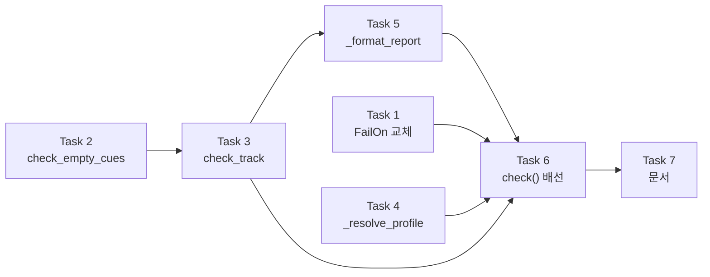

# `cuesift check` 배선 구현 계획

> **For agentic workers:** REQUIRED SUB-SKILL: Use superpowers:subagent-driven-development (recommended) or superpowers:executing-plans to implement this plan task-by-task. Steps use checkbox (`- [ ]`) syntax for tracking.

**Goal:** 종료 코드 `70`(미구현)으로 끝나는 `cuesift check <자막파일> --spec <프로파일>`을
실제 CI 게이트로 동작하게 만든다.

**Architecture:** `check`는 신호 엔진(`collect_all` → `fuse` → `triage`)을 **통과하지 않는다.**
`spec/check.py`의 판정 함수를 직접 부른다. 신호 계층이 얹는 넷(점수화·`hard_fail`·융합·트리아지)을
`check`가 하나도 쓰지 않기 때문이다 — 심각도가 단일 등급이고, 예산도 순위도 없다.
규격 판정의 원천은 `spec/check.py` 하나이고 `translate` 경로와 `check` 경로가 양쪽 다 그것을 쓰므로
두 경로가 갈라지지 않는다.

**Tech Stack:** Python 3.11+ · typer 0.27.0 · pysubs2 1.8.1 · pytest 9.1.1 · ruff 0.16.0

**Spec:** [`docs/superpowers/specs/2026-08-03-check-cli-design.md`](../specs/2026-08-03-check-cli-design.md)
— 결정 로그 12건(D1~D12)이 근거와 함께 있다. 이 계획은 그 설계를 태스크로 분해한 것이다.

## Global Constraints

이 절의 제약은 **모든 태스크의 요구사항에 암묵적으로 포함된다.**

| 항목 | 값 |
| --- | --- |
| Python 실행 | **반드시 `.venv/Scripts/python.exe`** — 시스템 Python은 3.14라 다르다 |
| 모듈 첫 줄 | `from __future__ import annotations` |
| 독스트링·주석 | **한국어.** 근거 FR·§ 번호를 병기한다 (예: `FR-8.2`, `설계 §4.2`) |
| 주석 내용 | "왜 이 값인가"가 아니라 **"이 값이 아니면 무엇이 깨지는가"** |
| ruff | `line-length = 100`, 규칙 `E,F,I,UP,B,SIM`. **글자 수가 아니라 East Asian Width 표시 폭이다** |
| 커밋 메시지 | **한국어** |
| 푸시 | **하지 않는다.** 사용자가 명시적으로 요청할 때만 |
| 의존성 | **추가 금지.** 런타임 4개(`typer`·`pysubs2`·`pyyaml`·`httpx`) 고정 |
| **사용자에게 출력되는 문자열** | **em dash `—`(U+2014)를 쓰지 마라.** 아래 참조 |

### 출력 문자열에 em dash를 쓰지 않는 이유

Windows 기본 로케일(cp949)에서 **U+2014는 인코딩되지 않는다.** stdout을 파일이나 파이프로
받는 순간 `UnicodeEncodeError`가 나고 프로세스는 **exit 1**로 죽는다.

```text
$ cuesift check clean.srt --spec ko > violations.txt
exit=1
UnicodeEncodeError: 'cp949' codec can't encode character '—' in position 7
```

**이 저장소에서 exit 1은 "규격 위반 발견"이다.** 즉 깨끗한 자막을 검사해도 CI가 "위반 있음"으로
읽는다. 설계 §7.1이 `cuesift check ... > violations.txt`로 갈무리할 수 있어야 한다고 명시적으로
약속하므로, 이것은 문서화된 사용법이 정면으로 깨지는 경우다.

실측(2026-08-13)으로 확인한 범위는 좁다 — `·`(U+00B7)·`≠`(U+2260)·`┌`(U+250C)·한글은
**cp949에서 전부 안전**하고 `—`(U+2014) 하나만 실패한다. 따라서 금지 대상은 em dash뿐이다.

| 대상 | 규칙 |
| --- | --- |
| `_format_report`가 만드는 출력 · `check()` 독스트링 · `typer.Option(help=...)` | **em dash 금지** — 각각 stdout과 `--help`로 나간다 |
| 모듈 내부 주석 · private 함수 독스트링 | 제한 없음 — 사용자에게 출력되지 않는다 |
| `.md` 문서 | 제한 없음 |

**로컬 게이트는 CI와 대상이 같아야 한다.** `src tests`로 좁히지 마라 — 2026-07-29~08-01에
CI가 5회 연속 실패했는데 로컬이 범위를 좁혀 돌려 통과한 것이 원인이었다.

```bash
.venv/Scripts/python.exe -m ruff check .
.venv/Scripts/python.exe -m ruff format --check .
.venv/Scripts/python.exe -m pytest --cov=cuesift --cov-report=term-missing
python scripts/check_links.py
npx --yes markdownlint-cli2
```

**게이트는 "통과했나"가 아니라 "무엇을 대상으로 통과했나"를 본다.** `pytest`의 수집 개수를
매번 읽어라. 줄거나 그대로면 테스트가 수집되지 않은 것이다.

**이 계획서는 수집 개수의 절대값을 적지 않는다.** 각 태스크는 **증가분**만 명시하고,
기준선은 **컨트롤러가 dispatch 시점에 실측해 브리프 밖에서 전달한다.** 절대값을 적으면
앞선 태스크의 리뷰 fix가 테스트를 추가할 때마다 이후 모든 태스크의 기대값이 밀린다 —
실제로 이 계획서에서 두 번 어긋났고, 그때마다 구현자가 "예상과 다르다"를 판단해야 했다.
증가분은 태스크가 정의하는 테스트 개수라 그 태스크 안에서 닫힌다.

---

## 실측으로 확정된 사실

**이 절의 수치는 전부 2026-08-13에 실행해서 얻은 것이다. 설계 문서와 어긋나는 곳이 있으면
이 절이 맞다.** 설계는 픽스처를 열어보지 않고 쓰였고, 그 결과 세 곳이 틀렸다.

### 기존 API (변경하지 않는다)

```python
# src/cuesift/spec/check.py
@dataclass(frozen=True, slots=True)
class SpecViolation:
    kind: str            # 'line_length'|'line_count'|'cps'|'duration_short'|'duration_long'|'overlap'
    measured: float
    limit: float
    line_index: int | None = None   # ★ 0-based다. 사람이 읽는 좌표는 +1

def check_text(text: str, duration_ms: int, profile: SpecProfile) -> list[SpecViolation]: ...
def check_overlaps(segments: Sequence[Segment]) -> dict[str, SpecViolation]: ...

# src/cuesift/spec/profile.py
def load_builtin(name: str) -> SpecProfile: ...      # 실패 → FileNotFoundError
def load_profile(path: Path) -> SpecProfile: ...     # 실패 → ValueError (파일 없으면 OSError)
def available_builtins() -> list[str]: ...           # ['en','ja','ko','ted-en','ted-ja','ted-ko']

# src/cuesift/ingest
def load_subtitle(path: Path, *, source_lang: str = "ko") -> IngestResult: ...   # 실패 → IngestError(예외)

@dataclass(frozen=True, slots=True)
class IngestResult:
    segments: list[Segment]
    source_path: Path
    format: str                    # 'srt'|'vtt'|'ass'|'ssa'
    source_lang: str
    subs: pysubs2.SSAFile
    event_index: dict[str, int]    # segment.id → 원본 이벤트 인덱스 (0-based)

@dataclass(slots=True)
class Segment:
    id: str            # '00000' 형태의 5자리 문자열
    index: int         # 필터 후 인덱스 (0-based)
    start_ms: int
    end_ms: int
    source_text: str
    target_text: str | None = None
    speaker: str | None = None
    meta: dict = field(default_factory=dict)
```

`IngestError`는 **예외로 던져지고** `reason` 속성이 계약이다:
`empty` · `decode` · `parse` · `not_found` · `video_input` · `bad_timecode`.

### `ko` 프로파일 실제 값

```text
max_chars_per_line = 16.0   char_counting = latin_half   max_cps = 12.0
max_lines = 2               min_duration_ms = 833        max_duration_ms = 7000
```

**`latin_half`는 한글 1.0 · 공백 0.5로 센다.** CPS는 글자 수가 아니라 **표시 폭**으로 계산된다 —
`'짧은 줄\n열여섯 자를…'`의 CPS 25.5는 두 줄 폭의 합 `3.5 + 22.0`이다.
기대값을 "글자 수"로 계산하면 틀린다.

### 픽스처별 실제 발화 (`ko` 프로파일)

| 픽스처 | 설계 §10.1 기재 | **실측** |
| --- | --- | --- |
| `multiline.vtt` | `line_length` | ❌ **`line_count`** `measured=3.0, limit=2.0`. 큐 1개뿐 |
| `overlap.vtt` | 겹침 1200ms | ❌ **`overlap` `measured=1000.0`**, 세그먼트 `'00001'`에 기록 |
| `minimal.srt` | 위반 없음 | ✅ 0건 |
| `empty_cue.srt` | 신규 판정이 잡음 | ✅ **현재 0건** — §10.2 "먼저 실패시켜 보기"의 전제 확인됨 |
| `all_comments.ass` | — | `IngestError(reason='empty')` |
| `reversed.srt` | exit 66 | `IngestError(reason='bad_timecode')` |
| `cp949.srt` | exit 66 | `IngestError(reason='decode')` |
| `not_subtitle.txt` | exit 66 | `IngestError(reason='parse')` |

### 큐 번호를 검증할 수 있는 픽스처가 없다

설계 §10.3이 지목한 **"큐 번호가 원본 위치인가 필터 후 인덱스인가"** 는 diff로 판정할 수 없고,
`event_index[id] != segment.index`인 입력이 있어야만 테스트로 판정된다.
**기존 12개 픽스처를 전부 돌려 확인한 결과, 갈라지는 것은 `tags.ass` 하나뿐이고 그마저 위반이
0건이라 쓸 수 없다.**

**따라서 신규 픽스처는 설계가 제안한 `check_violations.srt`(SRT)가 아니라 ASS여야 한다.**
SRT에는 주석 문법이 없어 두 인덱스가 구조적으로 갈라질 수 없다. Task 6이 만드는
`check_violations.ass`는 4개 큐 전부에서 `ev != idx`이므로, 큐 번호를 틀리면 출력의 모든 줄이 틀린다.

---

## File Structure

| 파일 | 상태 | 책임 |
| --- | --- | --- |
| `src/cuesift/spec/check.py` | 수정 | `TrackViolation` · `check_empty_cues` · `check_track` 추가. **순수성 유지 — `ingest`·`typer` 임포트 금지** |
| `src/cuesift/spec/__init__.py` | 수정 | 신규 3종 재수출 |
| `src/cuesift/cli.py` | 수정 | `FailOn` 교체 · `EXIT_BAD_INPUT` · `_resolve_profile` · `_format_report` · `check()` 본문 |
| `tests/fixtures/ingest/check_violations.ass` | **신규** | 위반 4종 + 큐 번호 갈라짐을 한 파일에 |
| `tests/test_spec_check.py` | 수정 | `check_empty_cues` · `check_track` 단위 테스트 |
| `tests/test_cli_check.py` | **신규** | 종료 코드 5종 · 스트림 분리 · 큐 번호 · 출력 형식 |
| `tests/test_cli.py` | 수정 | `test_check_accepts_documented_flags`가 배선 후 깨진다 |
| `docs/요구사항정의서.md` | 수정 | §3.2 S3 · §8.1의 `--spec th` → `--spec ja` |
| `README.md` | 수정 | `--spec th` → `--spec ja` · `--fail-on` 값 설명 |
| `docs/WBS.md` · `CHANGELOG.md` | 수정 | 진척 기록 |

**`spec/check.py`의 순수성이 이 구조의 축이다.** 큐 번호 계산에 `event_index`가 필요하므로,
`spec`이 그것을 받으면 모듈 첫 줄의 계약("이 모듈은 순수하다")이 깨지고 `spec` 테스트가
인제스트 결과 구조에 묶인다. 그래서 `TrackViolation`은 `segment_id`까지만 담고
**`cli.py`가 `event_index[segment_id] + 1`로 원본 큐 번호를 붙인다.**

---

## 태스크 의존 관계



Task 1·2·4는 서로 의존하지 않으므로 병렬로 진행할 수 있다. Task 3은 Task 2를,
Task 5는 Task 3을, Task 6은 1·3·4·5를 모두 요구한다.

---

### Task 1: `--fail-on` 값을 요구사항정의서에 맞춘다

**Files:**

- Modify: `src/cuesift/cli.py:31-36` (`FailOn` 정의)
- Test: `tests/test_cli.py`

**Interfaces:**

- Consumes: 없음
- Produces: `FailOn.hard` · `FailOn.any` · `FailOn.none` — Task 6이 `fail_on is not FailOn.none`으로 분기한다

**배경:** 요구사항정의서 FR-7.5는 `hard | any | none`인데 코드는 `hard | soft | never`다.
[CLAUDE.md](../../../CLAUDE.md)가 요구사항정의서를 단일 진실 원천으로 정했으므로 **코드를 고친다**(설계 D7).
마침 v0.1은 단일 등급이라 `soft`는 **존재하지 않는 등급을 가리키는 이름**이 되어 더 맞지 않다.
CLI가 아직 배선 전이라 호환 부담이 없다.

- [ ] **Step 1: 실패하는 테스트를 쓴다**

`tests/test_cli.py` 상단에 픽스처 경로 상수를 추가한다. 이 저장소에는 `conftest.py`가 없고,
상대 경로는 pytest 실행 위치에 의존하므로 `__file__` 기준으로 잡아야 한다.

```python
from pathlib import Path

FIXTURES = Path(__file__).parent / "fixtures" / "ingest"
```

그리고 파일 끝에 다음 두 테스트를 추가한다.

```python
def test_fail_on_accepts_the_documented_values():
    """FR-7.5가 정한 값은 hard|any|none이다 (설계 §5.2)."""
    for value in ("hard", "any", "none"):
        result = runner.invoke(
            app,
            ["check", str(FIXTURES / "minimal.srt"), "--spec", "ko", "--fail-on", value],
        )
        assert result.exit_code != 2, f"--fail-on {value} 가 파싱되지 않았다"


def test_fail_on_rejects_the_removed_values():
    """soft·never는 요구사항정의서에 없는 이름이라 제거됐다.

    이름이 남아 있으면 사용자가 문서에 없는 값을 쓰고도 통과한다.
    """
    for value in ("soft", "never"):
        result = runner.invoke(
            app,
            ["check", str(FIXTURES / "minimal.srt"), "--spec", "ko", "--fail-on", value],
        )
        assert result.exit_code == 2, f"--fail-on {value} 가 아직 받아들여진다"
```

- [ ] **Step 2: 테스트를 돌려 실패를 확인한다**

```bash
.venv/Scripts/python.exe -m pytest tests/test_cli.py -k fail_on -v
```

기대: `test_fail_on_accepts_the_documented_values`가 `--fail-on any`에서 **exit 2**로 실패하고,
`test_fail_on_rejects_the_removed_values`가 `soft`에서 **exit 70**(현재 유효한 값이라 미구현으로 진행)으로 실패한다.
**두 테스트가 서로 반대 방향으로 실패하는 것을 눈으로 확인하라** — 한쪽만 실패하면 테스트가 잘못됐다.

- [ ] **Step 3: `FailOn`을 교체한다**

`src/cuesift/cli.py`의 기존 정의를 다음으로 바꾼다.

```python
class FailOn(StrEnum):
    """FR-7.5 — 어느 심각도부터 CI를 실패시킬지.

    **v0.1에서 `hard`와 `any`는 같은 결과를 낸다.** 규격 위반 7종이 전부 같은
    등급이기 때문이다(설계 §5.1). 등급을 나누려면 배정의 출처가 필요한데
    1차 출처인 Netflix TTSG에 위반 등급 구분이 없고, 요구사항정의서 §11 R8이
    "출처 없는 수치를 기본값으로 넣지 않음"을 명시한다.

    이름을 `soft`·`never`에서 바꾼 것은 요구사항정의서가 단일 진실 원천이기
    때문이다. `soft`는 v0.1에 존재하지 않는 등급을 가리킨다.
    """

    hard = "hard"
    any = "any"
    none = "none"
```

`any`와 `none`은 Python 내장 함수·상수와 이름이 겹치지만 **클래스 속성이라 충돌하지 않는다**
(`None`이 예약어이지 `none`은 아니다). ruff의 `A003`(builtin-attribute-shadowing) 규칙은
이 저장소의 규칙 집합(`E,F,I,UP,B,SIM`)에 없다.

- [ ] **Step 4: 테스트를 돌려 통과를 확인한다**

```bash
.venv/Scripts/python.exe -m pytest tests/test_cli.py -v
```

기대: `-k fail_on` 2건 PASS. **`test_check_accepts_documented_flags`는 여전히 PASS해야 한다**
(아직 `check()`가 `_not_implemented`이므로 exit 70). 여기서 깨지면 예상 밖의 일이 일어난 것이다.

- [ ] **Step 5: 게이트를 돌리고 커밋한다**

```bash
.venv/Scripts/python.exe -m ruff check .
.venv/Scripts/python.exe -m ruff format --check .
.venv/Scripts/python.exe -m pytest --cov=cuesift --cov-report=term-missing
```

수집 개수가 **316 → 318**로 늘어야 한다.

```bash
git add src/cuesift/cli.py tests/test_cli.py
git commit --file=- <<'MSG'
수정: --fail-on 값을 요구사항정의서 FR-7.5에 맞춘다

soft·never를 any·none으로 바꾼다. 요구사항정의서가 단일 진실 원천이고,
v0.1이 단일 등급이라 soft는 존재하지 않는 등급을 가리키는 이름이었다.

근거: 설계 §5.2 D7
MSG
```

**커밋 메시지는 heredoc으로 쓴다.** `Bash` 도구는 Git Bash라 PowerShell here-string(`@'…'@`)을
쓰면 메시지 앞뒤에 `@`가 남는다 — 이전 세션에서 실제로 발생해 `--amend`로 고쳤다.

---

### Task 2: 빈 큐 판정 `check_empty_cues`

**Files:**

- Modify: `src/cuesift/spec/check.py`
- Modify: `src/cuesift/spec/__init__.py`
- Test: `tests/test_spec_check.py`

**Interfaces:**

- Consumes: `SpecViolation` · `Segment` (기존)
- Produces: `check_empty_cues(segments: Sequence[Segment]) -> dict[str, SpecViolation]` — Task 3의 `check_track`이 부른다

**배경:** 빈 큐는 **현재 파이프라인의 어느 경로로도 탐지되지 않는다.** 세 구성을 전부 실측했다:
`struct.empty`는 `source_text`가 비면 `None`을 반환하고, `check_text`는 빈 텍스트의 줄·CPS 검사를
건너뛴다. 배포 자막에 텍스트 없는 큐가 남는 것은 명백한 결함이므로 이 사각지대를 닫는다.

**이 설계가 새로 만드는 판정은 이것 하나뿐이고, 나머지 태스크는 전부 배선이다.**

- [ ] **Step 1: 이중 계산 방지 계약을 고정하는 테스트를 먼저 쓴다**

`tests/test_spec_check.py` 끝에 추가한다. 이 테스트는 **지금도 통과한다** — 목적이 회귀 방지이기 때문이다.

```python
def test_check_text_does_not_flag_empty_text():
    """빈 텍스트는 check_text의 대상이 아니다 (설계 §4.2).

    여기에 빈 큐 판정을 넣으면 translate 경로에서 struct.empty와 이중 계산되고,
    그 부풀림이 spec.violation 점수를 통해 위험도로 흘러 검수 비율을 밀어 올린다.
    검수 비율은 Recall@Budget 배수의 분모다 — 여기서 새면 프로젝트의 핵심 주장이 무너진다.
    """
    profile = load_builtin("ko")
    assert check_text("", 2000, profile) == []
    assert check_text("   \n  ", 2000, profile) == []
```

- [ ] **Step 2: 빈 큐 판정 테스트를 쓴다 (아직 실패한다)**

```python
def test_check_empty_cues_flags_blank_and_whitespace_only():
    """FR-5.1 — 텍스트 없는 큐는 배포 자막의 결함이다."""
    segments = [
        Segment(id="00000", index=0, start_ms=0, end_ms=2000, source_text="있는 텍스트"),
        Segment(id="00001", index=1, start_ms=2500, end_ms=4000, source_text=""),
        Segment(id="00002", index=2, start_ms=4500, end_ms=6000, source_text="   \n  "),
    ]

    found = check_empty_cues(segments)

    assert set(found) == {"00001", "00002"}
    assert found["00001"].kind == "empty_cue"
    assert found["00002"].kind == "empty_cue"


def test_check_empty_cues_is_silent_on_a_clean_track():
    segments = [
        Segment(id="00000", index=0, start_ms=0, end_ms=2000, source_text="첫 줄"),
        Segment(id="00001", index=1, start_ms=2500, end_ms=4000, source_text="둘째 줄"),
    ]
    assert check_empty_cues(segments) == {}
```

임포트가 필요하면 파일 상단에 추가한다:

```python
from cuesift.spec.check import check_empty_cues
```

- [ ] **Step 3: 테스트를 돌려 실패를 확인한다**

```bash
.venv/Scripts/python.exe -m pytest tests/test_spec_check.py -k empty -v
```

기대: `test_check_text_does_not_flag_empty_text`는 **PASS**(계약이 이미 지켜지고 있다),
`check_empty_cues` 2건은 `ImportError` 또는 `NameError`로 **FAIL**.

**여기서 확인할 것이 하나 더 있다.** 설계 §10.2가 요구한 "게이트를 먼저 실패시켜 보기"는
실측으로 이미 끝났다 — `empty_cue.srt`를 현재 파이프라인에 넣으면 위반 0건이 나온다.
그 사실이 Task 6의 통합 테스트에서 다시 확인된다.

- [ ] **Step 4: `check_empty_cues`를 구현한다**

`src/cuesift/spec/check.py`의 `check_overlaps` 아래에 추가한다.

```python
def check_empty_cues(segments: Sequence[Segment]) -> dict[str, SpecViolation]:
    """텍스트가 없거나 공백뿐인 세그먼트를 찾는다 (FR-5.1·설계 §2.1).

    **`check_text`가 아니라 별도 함수인 것이 계약이다.** `check_text` 안에 넣으면
    `translate` 경로에서 `struct.empty`와 이중 계산되고, 그 부풀림이 검수 비율을
    밀어 올린다(설계 §4.2). `translate` 경로는 이 함수를 부르지 않는다.

    `measured`·`limit`이 둘 다 `0.0`인 것은 이 판정에 잴 수치가 없기 때문이다 —
    빈 큐는 임계값을 넘은 것이 아니라 있으면 안 되는 것이다.
    """
    return {
        seg.id: SpecViolation("empty_cue", 0.0, 0.0)
        for seg in segments
        if not seg.source_text.strip()
    }
```

`src/cuesift/spec/__init__.py`의 임포트와 `__all__`에 추가한다.

```python
from cuesift.spec.check import SpecViolation, check_empty_cues, check_overlaps, check_text
```

`__all__`은 알파벳 순이므로 `"available_builtins"` 다음, `"check_overlaps"` 앞에
`"check_empty_cues",`를 넣는다.

- [ ] **Step 5: 테스트를 돌려 통과를 확인한다**

```bash
.venv/Scripts/python.exe -m pytest tests/test_spec_check.py -v
```

기대: 3건 PASS, 기존 테스트 전부 PASS.

- [ ] **Step 6: 게이트를 돌리고 커밋한다**

```bash
.venv/Scripts/python.exe -m ruff check .
.venv/Scripts/python.exe -m ruff format --check .
.venv/Scripts/python.exe -m pytest --cov=cuesift --cov-report=term-missing
```

수집 개수 **318 → 321**.

```bash
git add src/cuesift/spec/check.py src/cuesift/spec/__init__.py tests/test_spec_check.py
git commit --file=- <<'MSG'
기능: 빈 큐 판정을 추가한다 — 어느 경로로도 탐지되지 않던 사각지대

struct.empty는 source_text가 비면 None을 반환하고 check_text는 빈 텍스트의
줄·CPS 검사를 건너뛴다. 세 구성을 실측해 셋 다 놓치는 것을 확인했다.

check_text 밖에 두는 것이 계약이다 — 안에 넣으면 translate 경로에서
struct.empty와 이중 계산되어 검수 비율이 부풀려진다.

근거: 설계 §2.1 §4.2 §12.3 D1 D6
MSG
```

---

### Task 3: 트랙 전체 검사 `check_track`

**Files:**

- Modify: `src/cuesift/spec/check.py`
- Modify: `src/cuesift/spec/__init__.py`
- Test: `tests/test_spec_check.py`

**Interfaces:**

- Consumes: `check_text` · `check_overlaps` · `check_empty_cues`(Task 2) · `SpecProfile`
- Produces:
  - `TrackViolation(segment_id: str, start_ms: int, violation: SpecViolation)` — frozen dataclass
  - `check_track(segments: Sequence[Segment], profile: SpecProfile) -> list[TrackViolation]`
  - Task 5의 `_format_report`와 Task 6의 `check()`가 둘 다 쓴다

- [ ] **Step 1: 실패하는 테스트를 쓴다**

`tests/test_spec_check.py`에 추가한다. **위반 순서가 계약의 일부**이므로 순서까지 단언한다.

```python
def test_check_track_orders_violations_by_list_order_not_by_time():
    """리스트 순서가 1차 정렬이다. `start_ms`도 `segment_id`도 아니다 (설계 §4).

    **인제스트는 시간순을 보장하지 않는다** — pysubs2도 `_to_segments`도 정렬하지 않으므로
    리스트 순서가 곧 **파일 순서**다. 사람이 파일을 위에서 아래로 읽으므로 그것이 맞다.

    세 정렬 키(리스트·`start_ms`·`segment_id`)가 동시에 단조인 픽스처로는 무엇이 1차인지
    구분할 수 없다. 여기서는 셋을 일부러 어긋나게 둔다.
    """
    segments = [
        # 덮개 큐(00002) 안에 들어가 겹친다.
        Segment(id="00000", index=0, start_ms=1000, end_ms=3000, source_text="본문"),
        # 뒤의 둘을 통째로 덮는 긴 큐. 3줄이라 line_count. 폭은 전부 16 미만이다.
        # **덮개를 리스트 가운데 두는 것이 이 픽스처의 요점이다.** 덮개는 반드시 가장
        # 이른 start_ms를 갖는데, 그것을 리스트 맨 앞에 두면 리스트 순서와 start_ms
        # 순서가 같아져 `sorted(key=start_ms)` 변이가 무탐지로 빠져나간다.
        Segment(
            id="00002", index=1, start_ms=0, end_ms=7000, source_text="첫 줄\n둘째 줄\n셋째 줄"
        ),
        # 겹치면서 비어 있다. duration 1000ms는 min 833을 넘으므로 duration_short는 없다.
        Segment(id="00001", index=2, start_ms=4000, end_ms=5000, source_text=""),
    ]

    found = check_track(segments, KO)

    assert [(tv.segment_id, tv.violation.kind) for tv in found] == [
        ("00000", "overlap"),
        ("00002", "line_count"),
        ("00001", "overlap"),
        ("00001", "empty_cue"),
    ]


def test_check_track_keeps_multiple_violations_of_one_segment_together():
    """한 세그먼트가 여러 위반을 내면 이어 붙는다."""
    profile = load_builtin("ko")
    segments = [
        Segment(
            id="00000",
            index=0,
            start_ms=0,
            end_ms=1000,
            source_text="짧은 줄\n열여섯 자를 확실히 넘기는 아주 긴 두 번째 줄",
        ),
    ]

    found = check_track(segments, profile)

    assert [tv.violation.kind for tv in found] == ["line_length", "cps"]
    assert all(tv.segment_id == "00000" for tv in found)
    # line_index는 0-based다. 두 번째 줄이 길다.
    assert found[0].violation.line_index == 1
    assert found[0].violation.measured == 22.0
    # CPS는 글자 수가 아니라 표시 폭으로 잰다 — 3.5 + 22.0 = 25.5.
    assert found[1].violation.measured == 25.5


def test_track_violation_carries_start_ms_for_output():
    """cli가 타임코드를 찍으려면 위반에 시각이 붙어 있어야 한다."""
    profile = load_builtin("ko")
    segments = [Segment(id="00000", index=0, start_ms=83400, end_ms=84400, source_text="")]

    found = check_track(segments, profile)

    assert found[0].start_ms == 83400


def test_check_track_is_silent_on_a_clean_track():
    """오탐 회귀 그물을 겸한다.

    기호만 있는 큐(`♪`·`…`·`.`)는 자막에서 정상이고 실제 코퍼스에 존재한다
    (TED2020 151만 줄 실측: 5건). 이 프로젝트에서 **오탐은 검수 비율을 부풀려
    Recall@Budget 지표 자체를 파괴하므로** 미탐보다 비싸다. 누군가 빈 큐 판정을
    "개선"이라며 넓히면 여기가 먼저 깨져야 한다.
    """
    profile = load_builtin("ko")
    segments = [
        Segment(id="00000", index=0, start_ms=0, end_ms=3000, source_text="안녕하세요\n두 번째 줄"),
        Segment(id="00001", index=1, start_ms=3500, end_ms=6000, source_text="세 번째 큐"),
        Segment(id="00002", index=2, start_ms=6500, end_ms=8000, source_text="♪"),
        Segment(id="00003", index=3, start_ms=8500, end_ms=10000, source_text="…"),
        Segment(id="00004", index=4, start_ms=10500, end_ms=12000, source_text="."),
    ]
    assert check_track(segments, profile) == []


def test_check_track_keeps_every_violation_of_one_cue_in_a_fixed_order():
    """`check_overlaps`와 `check_empty_cues`가 **같은 키 공간**을 쓴다.

    둘 다 `dict[str, SpecViolation]`을 `seg.id`로 키잉하므로 `{**overlaps, **empties}`로
    합치면 한쪽이 **조용히 소실된다.** 그것이 이 함수를 쓰는 가장 자연스러운 오답이다.

    한 세그먼트 안의 순서도 계약이다 — `check_text`가 낸 것들 → `overlap` → `empty_cue`.
    Task 5의 출력이 이 순서를 그대로 쓴다.

    빈 큐가 `duration_short`와 함께 보고되는 것은 **의도된 동작이다.** `check_text`의
    duration 분기가 `if text.strip():` 가드 밖에 있어서 그렇고, 둘 다 참인 위반이라
    억제하지 않기로 했다(빈 큐를 채우면서 노출시간도 고쳐야 한다 — 사용자 승인 룰링).
    **여기서 순서를 통째로 단언하는 것이 그 결정을 지키는 유일한 게이트다** —
    빈 큐면 duration 위반을 삼키도록 바꿔도 다른 테스트는 전부 통과한다.

    빈 큐가 앞 큐의 타임코드를 복제한 채 남는 것은 흔한 저작 아티팩트라
    "빈 큐이면서 겹침"은 인위적 조합이 아니다.
    """
    segments = [
        Segment(id="00000", index=0, start_ms=0, end_ms=5000, source_text="본문"),
        # 앞 큐(0~5000) 안에 들어가고(겹침), 텍스트가 없고(빈 큐), 노출이 833ms 미만이다.
        # 세 판정이 동시에 걸려야 세그먼트 내부 순서가 관찰된다 — 한 건만 나오는
        # 픽스처로는 append 순서를 바꾸는 변이가 전부 통과한다.
        Segment(id="00001", index=1, start_ms=1000, end_ms=1500, source_text=""),
    ]

    kinds = [tv.violation.kind for tv in check_track(segments, KO) if tv.segment_id == "00001"]

    assert kinds == ["duration_short", "overlap", "empty_cue"]


def test_check_track_accepts_a_generator_not_just_a_list():
    """제너레이터를 넣어도 리스트와 결과가 같아야 한다.

    `check_track`은 입력을 **3회 순회한다**(`check_overlaps` · `check_empty_cues` · 본체 루프).
    제너레이터는 첫 순회에서 소진되므로 방어하지 않으면 본체 루프가 빈 채로 돌아
    **위반 0건**이 되고, `check`는 그것을 "깨끗한 파일"로 읽어 종료 코드 0을 낸다.
    실패가 예외가 아니라 **조용한 통과**라 이 저장소가 명시적으로 금지한 형태다.

    `Sequence[Segment]` 애노테이션은 이것을 막지 못한다 — 이 리포에는 타입 검사 게이트가
    없고(dev 의존성이 pytest·pytest-cov·ruff 셋뿐) ruff의 `E,F,I,UP,B,SIM`도 잡지 않는다.
    """
    segments = [
        Segment(id="00000", index=0, start_ms=0, end_ms=5000, source_text="본문"),
        Segment(id="00001", index=1, start_ms=1000, end_ms=1500, source_text=""),
    ]

    from_list = [(tv.segment_id, tv.violation.kind) for tv in check_track(segments, KO)]
    from_generator = [
        (tv.segment_id, tv.violation.kind) for tv in check_track((s for s in segments), KO)
    ]

    # 둘 다 빈 리스트면 위 단언은 아무것도 지키지 않는다. 픽스처가 위반을 내는지 먼저 못 박는다.
    assert from_list != []
    assert from_generator == from_list


def test_translate_path_does_not_import_the_empty_cue_check():
    """`check_empty_cues`는 `check` 경로 전용이라는 계약을 고정한다.

    `spec/check.py`의 독스트링이 "`translate` 경로는 이 함수를 부르지 않는다"를
    계약으로 선언하지만, **독스트링만 있는 불변식은 게이트가 아니다.**
    누군가 `signals/derived.py`에 배선해도 지금은 전체 스위트가 통과한다.
    """
    import cuesift.signals.derived as derived

    assert not hasattr(derived, "check_empty_cues")
```

- [ ] **Step 2: 테스트를 돌려 실패를 확인한다**

```bash
.venv/Scripts/python.exe -m pytest tests/test_spec_check.py -k "track or empty_cue_check" -v
```

기대: `check_track`을 부르는 6건은 `ImportError`/`NameError`로 FAIL.
`test_translate_path_does_not_import_the_empty_cue_check`는 **지금도 PASS한다** —
계약이 이미 지켜지고 있고 이 테스트의 목적은 회귀 방지다.

**Task 2의 테스트를 한꺼번에 추가하면 모듈 수준 `ImportError`로 파일 전체가 수집 실패해
"어느 것이 PASS인지"를 볼 수 없다.** Task 2 구현자가 겪은 것이므로 필요하면 두 단계로 나눠라.

- [ ] **Step 3: `check_empty_cues` 독스트링에 경계 결정 근거를 남긴다**

Task 2 리뷰가 실코퍼스로 확인한 것이다. **판정 로직은 바꾸지 마라** — 근거만 적는다.

`src/cuesift/spec/check.py`의 `check_empty_cues` 독스트링 끝에 다음 취지의 문단을 더한다.

```python
    `str.strip()`이 경계다. `str.isspace()` 기준이라 `U+3000`(전각 공백)·`U+00A0`(NBSP)·
    `U+2028`은 이미 잡히고, 놓치는 것은 `Cf`(format) 계열뿐이다.

    **`Cf`를 포함하도록 넓히지 않는다.** TED2020 151만 줄에서 `Cf`만으로 이뤄진 줄은
    0건이라 실측 이득이 없는 반면, 넓히면 `U+2800`(점자 공백)과 `U+115F`(한글 필러)가
    오탐이 된다. 이 프로젝트에서 오탐은 검수 비율을 부풀려 Recall@Budget 지표 자체를
    파괴하므로 미탐보다 비싸다.
```

- [ ] **Step 4: `TrackViolation`과 `check_track`을 구현한다**

`src/cuesift/spec/check.py`의 `SpecViolation` 정의 아래에 `TrackViolation`을 두고,
파일 끝에 `check_track`을 둔다.

```python
@dataclass(frozen=True, slots=True)
class TrackViolation:
    """트랙 안에서 위치가 확정된 규격 위반 (설계 §4).

    **큐 번호를 담지 않는 것이 계약이다.** 큐 번호는 `IngestResult.event_index`가
    있어야 계산되는데(필터가 세그먼트 인덱스를 재부여하므로 `segment.index + 1`은
    원본 파일의 큐 번호가 아니다), 그것을 받으면 이 모듈이 인제스트 결과 구조에
    묶여 첫 줄의 "이 모듈은 순수하다"가 깨진다. 큐 번호는 `cli.py`가 붙인다.
    """

    segment_id: str
    start_ms: int
    violation: SpecViolation
```

```python
def check_track(segments: Sequence[Segment], profile: SpecProfile) -> list[TrackViolation]:
    """트랙 전체를 검사해 위반을 세그먼트 순서로 반환한다 (FR-5.1·설계 §4).

    **정렬 기준이 세그먼트 순서인 것은 사람이 파일을 위에서 아래로 읽기 때문이다.**
    심각도 순으로 정렬하면 같은 큐의 위반들이 흩어져 파일에서 찾기 어려워진다.
    v0.1에는 심각도 등급 자체가 없기도 하다(설계 §5.1).

    새 규격 판정이 생기면 여기에 함께 넣는 것이 규약이다 — `check` 경로가
    신호 엔진을 통과하지 않으므로(설계 D3) 이 함수가 규격 판정의 집결지다.
    """
    overlaps = check_overlaps(segments)
    empties = check_empty_cues(segments)

    found: list[TrackViolation] = []
    for seg in segments:
        for violation in check_text(seg.source_text, seg.end_ms - seg.start_ms, profile):
            found.append(TrackViolation(seg.id, seg.start_ms, violation))
        if seg.id in overlaps:
            found.append(TrackViolation(seg.id, seg.start_ms, overlaps[seg.id]))
        if seg.id in empties:
            found.append(TrackViolation(seg.id, seg.start_ms, empties[seg.id]))
    return found
```

`src/cuesift/spec/__init__.py`에 재수출을 추가한다.

```python
from cuesift.spec.check import (
    SpecViolation,
    TrackViolation,
    check_empty_cues,
    check_overlaps,
    check_text,
    check_track,
)
```

`__all__`에 `"TrackViolation"`(`"SpecViolation"` 뒤)과 `"check_track"`(`"check_text"` 뒤)을 넣는다.

- [ ] **Step 5: 테스트를 돌려 통과를 확인한다**

```bash
.venv/Scripts/python.exe -m pytest tests/test_spec_check.py -v
```

기대: 신규 7건 PASS. **`measured == 22.0`과 `25.5`가 정확히 맞는지 확인하라** —
이 값들은 실측으로 얻은 것이고, 틀리면 `latin_half` 계산을 잘못 이해한 것이다.

**변이 7종을 전부 실패시켜 봐라.** 게이트를 만들면 반드시 실패시켜 봐야 한다.
`check_track` 안을 잠시 바꾸고 확인한 뒤 원상복구하라.

| # | 변이 | 지키는 계약 |
| --- | --- | --- |
| 1 | 반환 직전 `sorted(key=tv.start_ms)` | 리스트 순서가 1차 정렬 |
| 2 | 반환 직전 `sorted(key=tv.segment_id)` | 〃 |
| 3 | `overlap`·`empty_cue` append 순서 교환 | 세그먼트 내부 순서 |
| 4 | 두 꼬리를 `check_text` 루프 앞으로 | 대분류 순서 |
| 5 | 빈 큐면 `check_text`의 duration 위반을 걸러 냄 | **사용자 승인 룰링**(억제 금지) |
| 6 | `{**overlaps, **empties}` dict 병합 | 위반 소실 방지 |
| 7 | `list(segments)` 제거 | 제너레이터 소진 방지 |

**치환이 실제로 성립했는지 먼저 확인하라.** 워킹카피가 CRLF라 `\n` 패턴으로 치환하면
0건 매치로 조용히 실패하고, 그러면 원본이 돌면서 결과는 "변이가 통과했다"로 읽힌다.
치환 건수를 단언하고, 파일 비교에는 `read_text`가 아니라 `read_bytes`를 써라
(`read_text`는 줄바꿈을 번역해 CRLF↔LF를 못 본다).

**커버리지로는 이 축을 지킬 수 없다.** 분기 커버리지를 켜도 분기 30개 중 partial 0이다 —
소실은 두 `if`가 **같은 세그먼트에서 동시에 참**일 때만 나는데 분기 커버리지는 둘을 독립적으로
센다. 실제로 `spec/check.py`는 이 픽스처를 고치기 전에도 100%였고 지금도 100%인데
**변이 탐지율만 1/5 → 7/7로 바뀌었다.** 두 수치가 재는 것이 다르다.

- [ ] **Step 6: 게이트를 돌리고 커밋한다**

수집 개수는 **컨트롤러가 알려준 기준선**을 쓴다(계획서의 321→325는 작성 시점 값이라 어긋난다).

```bash
git add src/cuesift/spec/check.py src/cuesift/spec/__init__.py tests/test_spec_check.py
git commit --file=- <<'MSG'
기능: 트랙 전체 규격 검사 check_track을 추가한다

check_text·check_overlaps·check_empty_cues를 세그먼트 순서로 묶는다.
TrackViolation은 segment_id까지만 담는다 — 큐 번호를 담으면 spec 모듈이
event_index를 알아야 해서 순수성 계약이 깨진다.

근거: 설계 §4 D5
MSG
```

---

### Task 4: `--spec` 값 해석 `_resolve_profile`

**Files:**

- Modify: `src/cuesift/cli.py`
- Test: `tests/test_cli_check.py` (**신규 파일**)

**Interfaces:**

- Consumes: `load_builtin` · `load_profile` · `SpecProfile`
- Produces: `_resolve_profile(spec: str) -> SpecProfile` — Task 6의 `check()`가 첫 줄에서 부른다

**배경:** FR-5.3이 "사용자가 규격을 덮어쓸 수 있다"를 必로 요구하는데, `load_profile(path)`는
있지만 CLI에서 도달할 방법이 없다. **존재 여부가 아니라 확장자로 가른다**(설계 D10) —
존재 여부로 가르면 오타 난 파일 경로가 "내장 이름이 없다"는 **틀린 진단**을 받는다.

- [ ] **Step 1: 실패하는 테스트를 쓴다**

`tests/test_cli_check.py`를 새로 만든다.

```python
"""`cuesift check` 배선 테스트 (FR-8.2·FR-7.5).

설계 §10.3이 지목한 "diff로 판정할 수 없는 것" 셋을 여기서 닫는다 —
큐 번호가 원본 위치인가 · stdout/stderr 분리 · 종료 코드 2와 66의 구분.
"""

from __future__ import annotations

from pathlib import Path

import pytest
from typer.testing import CliRunner

from cuesift.cli import _resolve_profile, app

runner = CliRunner()
FIXTURES = Path(__file__).parent / "fixtures" / "ingest"


def test_resolve_profile_reads_a_builtin_name():
    profile, label = _resolve_profile("ko")
    assert profile.name == "ko"
    # 내장 이름은 라벨이 이름 그대로다.
    assert label == "ko"


def test_resolve_profile_reads_a_yaml_path():
    """FR-5.3 — 사용자 프로파일이 CLI에서 도달 가능해야 한다."""
    profile, label = _resolve_profile("specs/ted-ko.yaml")
    assert profile.name == "ted-ko"


def test_resolve_profile_labels_a_user_file_distinguishably():
    """`profile.name`만으로는 내장과 사용자 파일을 구분할 수 없다.

    `--spec ./our-spec.yaml`인데 그 파일이 `name: ko`면 헤더가 내장 `ko`로 검사한 것과
    **바이트 단위로 같아진다**(실측). 설계 §7.2가 헤더를 둔 이유가
    "엉뚱한 프로파일로 통과한 것을 알 수 없다"를 막는 것이므로, FR-5.3 경로에서
    그 기능이 죽는다. 라벨이 출처를 함께 담아 그것을 닫는다.
    """
    _, label = _resolve_profile("specs/ted-ko.yaml")

    assert "ted-ko" in label
    assert "specs/ted-ko.yaml" in label
    assert label != "ted-ko", "내장 이름과 구분되지 않는다"


def test_resolve_profile_rejects_an_unknown_builtin_name():
    """오타 난 내장 이름은 사용 가능한 목록을 함께 보여준다."""
    import typer

    with pytest.raises(typer.BadParameter) as caught:
        _resolve_profile("th")
    assert "ted-ko" in str(caught.value)


def test_resolve_profile_reports_a_missing_yaml_as_a_path_problem():
    """확장자로 가르므로 오타 난 경로가 '내장 이름이 없다'는 틀린 진단을 받지 않는다.

    존재 여부로 갈랐다면 './없는.yaml'이 내장 이름으로 해석되어
    "'./없는.yaml' 프로파일이 없다. 사용 가능: en, ja, ..."라는
    엉뚱한 메시지가 나갔을 것이다.
    """
    import typer

    with pytest.raises(typer.BadParameter) as caught:
        _resolve_profile("./없는파일.yaml")
    message = str(caught.value)
    assert "사용 가능" not in message, "내장 이름으로 잘못 해석됐다"
```

`specs/ted-ko.yaml`은 리포 루트 기준 상대 경로다. pytest는 리포 루트에서 실행되므로 동작하지만,
**실패하면 `Path(__file__).parents[1] / "specs" / "ted-ko.yaml"`로 바꿔라.**

- [ ] **Step 2: 테스트를 돌려 실패를 확인한다**

```bash
.venv/Scripts/python.exe -m pytest tests/test_cli_check.py -v
```

기대: 4건 전부 `ImportError: cannot import name '_resolve_profile'`로 FAIL.

- [ ] **Step 3: `_resolve_profile`을 구현한다**

`src/cuesift/cli.py`에 임포트를 추가한다.

```python
from cuesift.spec import SpecProfile, load_builtin, load_profile
```

그리고 `check()` 위에 모듈 수준 함수로 둔다.

```python
def _resolve_profile(spec: str) -> SpecProfile:
    """`--spec` 값을 프로파일로 바꾼다 (FR-5.3·설계 §8).

    **존재 여부가 아니라 확장자로 가른다.** 존재 여부로 가르면 오타 난 파일
    경로가 "내장 이름이 없다"는 틀린 진단을 받는다 — 인제스트가 mp4를
    `decode` 오류로 보고하지 않으려고 확장자를 먼저 본 것과 같은 판단이다.

    **두 로더가 서로 다른 예외를 던진다** — `load_builtin`은 `FileNotFoundError`,
    `load_profile`은 `ValueError`(파일이 없으면 `OSError`)다. 한쪽만 잡으면
    처리되지 않은 traceback이 사용자에게 그대로 나간다. 전부 `BadParameter`로
    모아 종료 코드 2(명령줄이 틀림)로 낸다.
    """
    if spec.endswith((".yaml", ".yml")):
        try:
            return load_profile(Path(spec))
        except (OSError, ValueError) as exc:
            raise typer.BadParameter(str(exc), param_hint="--spec") from exc
    try:
        return load_builtin(spec)
    except FileNotFoundError as exc:
        raise typer.BadParameter(str(exc), param_hint="--spec") from exc
```

**`.yml`도 받는 것은 설계 §8을 한 칸 넓힌 것이다.** 설계는 `.yaml`만 적었지만,
`.yml`을 빼면 `--spec ./spec.yml`이 정확히 D10이 막으려던 틀린 진단("내장 이름 spec.yml이 없다")을
받는다. 같은 결정의 논리적 귀결이므로 함께 넣는다.

- [ ] **Step 4: 테스트를 돌려 통과를 확인한다**

```bash
.venv/Scripts/python.exe -m pytest tests/test_cli_check.py -v
```

기대: 4건 PASS.

- [ ] **Step 5: 게이트를 돌리고 커밋한다**

**수집 개수가 신규 테스트 4건만큼 늘어야 한다.** 절대 기준선은 컨트롤러가 알려준 값을 쓴다.

```bash
git add src/cuesift/cli.py tests/test_cli_check.py
git commit --file=- <<'MSG'
기능: --spec을 확장자로 가른다 — FR-5.3을 CLI에서 도달 가능하게

.yaml/.yml이면 파일 경로, 아니면 내장 이름으로 해석한다. 존재 여부로 가르면
오타 난 경로가 "내장 이름이 없다"는 틀린 진단을 받는다.

load_builtin은 FileNotFoundError를, load_profile은 ValueError를 던지므로
둘 다 잡아 BadParameter로 모은다.

근거: 설계 §8 D10
MSG
```

---

### Task 5: 출력 포매팅 `_format_report`

**Files:**

- Modify: `src/cuesift/cli.py`
- Test: `tests/test_cli_check.py`

**Interfaces:**

- Consumes: `TrackViolation`(Task 3) · `SpecViolation`
- Produces:
  - `_format_timecode(ms: int) -> str`
  - `_format_detail(violation: SpecViolation) -> str`
  - `_format_report(*, source_name, fmt, profile_name, cue_total, violations, event_index) -> list[str]`
  - Task 6의 `check()`가 `_format_report`만 부른다

**배경:** 설계 §7.4가 포매팅을 **순수 함수로 분리**하라고 정했다. `CliRunner` 없이 문자열
입출력으로 직접 시험할 수 있어야 정렬·자릿수·큐 번호 부여 같은 포맷 결함이 CLI 통합 테스트에
묻히지 않는다.

**이 태스크는 한국어 리터럴이 가장 많다.** Task 3에서 실측된 것 — **ruff의 `line-length = 100`은
글자 수가 아니라 East Asian Width 표시 폭이다.** 93자짜리 줄이 폭 101로 `E501`에 걸렸다.

**그리고 `ruff format`이 구해 주지 않는다.** 포매터는 호출 인자는 쪼개도 **문자열 리터럴은
못 쪼갠다** — 60자짜리 한국어 리터럴(폭 108)에 대해 `ruff format`은 `already formatted`로
통과시키고 `ruff check`는 `E501`로 잡는다. **autofix가 없으므로 손으로 나눠야 한다**
(암묵 결합 `"..." "..."` 또는 문구 단축).

여유 수치도 실측돼 있다. **아래 코드 블록에 폭 100 초과는 없지만 여유가 6~7폭뿐이고**,
가장 빠듯한 줄이 하필 한국어 f-string(`위반 {n}건 · 위반 큐 ...`)이다. 문구를 한 단어만
늘려도 넘어간다. 4칸 들여쓰기 + `msg = "..."` 기준 안전 한도는 **한글 약 44자**다.

- [ ] **Step 1: 실패하는 테스트를 쓴다**

`tests/test_cli_check.py`에 추가한다. 임포트를 갱신한다.

```python
from cuesift.cli import _format_report, _format_timecode, _resolve_profile
from cuesift.spec import SpecViolation, TrackViolation
```

**`app`을 임포트하지 마라.** 이 태스크의 테스트는 순수 함수만 부르므로 `app`이 미사용이 되어
ruff `F401`이 난다(실측). `app`은 Task 6이 `runner.invoke(app, ...)`을 쓸 때 되돌린다.

```python
def test_format_timecode_is_fixed_regardless_of_input_format():
    """SRT는 쉼표, VTT는 마침표를 쓰지만 출력 표기는 하나로 고정한다 (설계 §7.3)."""
    assert _format_timecode(83400) == "00:01:23.400"
    assert _format_timecode(0) == "00:00:00.000"
    assert _format_timecode(3_661_007) == "01:01:01.007"


def test_format_report_uses_the_original_cue_number_not_the_filtered_index():
    """설계 §10.3 — diff로는 판정할 수 없는 항목이다.

    주석이 없는 파일에서는 event_index와 segment.index가 같아 틀려도 통과한다.
    여기서는 일부러 갈라진 event_index를 넣어 원본 큐 번호를 쓰는지 본다.
    """
    violations = [
        TrackViolation("00001", 5000, SpecViolation("line_length", 22.0, 16.0, line_index=1)),
    ]
    # 원본 이벤트 2번(0-based) → 큐 번호 3. 필터 후 인덱스로 세면 2가 된다.
    event_index = {"00000": 1, "00001": 2}

    lines = _format_report(
        source_name="check_violations.ass",
        fmt="ass",
        profile_name="ko",
        cue_total=4,
        violations=violations,
        event_index=event_index,
    )

    assert any("#3" in line for line in lines), lines
    assert not any("#2 " in line for line in lines), lines


def test_format_report_renders_each_violation_kind():
    violations = [
        TrackViolation("00000", 83400, SpecViolation("line_length", 21.0, 16.0, line_index=1)),
        TrackViolation("00000", 83400, SpecViolation("cps", 18.2, 12.0)),
        TrackViolation("00001", 242100, SpecViolation("overlap", 1200.0, 0.0)),
        TrackViolation("00002", 371000, SpecViolation("empty_cue", 0.0, 0.0)),
        TrackViolation("00003", 400000, SpecViolation("duration_short", 500.0, 833.0)),
    ]
    event_index = {"00000": 0, "00001": 1, "00002": 2, "00003": 3}

    body = "\n".join(
        _format_report(
            source_name="x.srt",
            fmt="srt",
            profile_name="ko",
            cue_total=120,
            violations=violations,
            event_index=event_index,
        )
    )

    assert "x.srt (srt · 큐 120개 · 프로파일 ko)" in body
    assert "line_length" in body and "21.0 > 16.0" in body
    # line_index는 0-based다 — 사람이 읽는 좌표는 +1.
    assert "(2번째 줄)" in body
    assert "overlap" in body and "1200ms" in body
    assert "empty_cue" in body and "텍스트 없음" in body
    assert "duration_short" in body and "500ms < 833ms" in body
    # 위반 5건이지만 위반 큐는 4개다 — 한 큐에 두 건이 있다.
    assert "위반 5건 · 위반 큐 4/120개 (3.3%)" in body


def test_format_report_states_what_it_checked_when_clean():
    """'통과했나'가 아니라 '무엇을 대상으로 통과했나'를 본다."""
    lines = _format_report(
        source_name="clean.ko.srt",
        fmt="srt",
        profile_name="ko",
        cue_total=120,
        violations=[],
        event_index={},
    )
    # em dash가 아니라 ASCII 하이픈이다. 전역 제약 "출력 문자열에 em dash 금지" 참조.
    assert lines == ["clean.ko.srt (srt · 큐 120개 · 프로파일 ko) - 위반 없음"]
```

- [ ] **Step 2: 테스트를 돌려 실패를 확인한다**

```bash
.venv/Scripts/python.exe -m pytest tests/test_cli_check.py -k format -v
```

기대: 4건 전부 ImportError로 FAIL.

- [ ] **Step 3: 포매팅 함수를 구현한다**

`src/cuesift/cli.py`에 임포트를 추가한다.

```python
from collections.abc import Mapping, Sequence
```

**`SpecViolation`·`TrackViolation`은 기존 `from cuesift.spec import (...)` 줄에 합쳐라.**
같은 모듈에서 두 번 임포트하면 ruff `I001`(import block is un-sorted or un-formatted)이 난다 —
심볼을 전부 사용해도 블록 형식 규칙이라 무관하게 발생한다(실측).

그리고 `_resolve_profile` 아래에 둔다.

```python
# duration_short가 14자로 가장 길다. 한 칸을 더 둬야 수치와 붙지 않는다.
_KIND_WIDTH = 15


def _format_timecode(ms: int) -> str:
    """`00:01:23.400`으로 고정한다 (설계 §7.3).

    SRT는 쉼표(`,400`), VTT는 마침표(`.400`)를 쓰므로 입력 포맷을 따라가면
    같은 도구의 출력이 파일마다 달라진다. 1차 좌표는 큐 번호이고 타임코드는
    보조이므로 표기를 하나로 고정하는 편이 낫다.
    """
    seconds, milliseconds = divmod(max(ms, 0), 1000)
    minutes, seconds = divmod(seconds, 60)
    hours, minutes = divmod(minutes, 60)
    return f"{hours:02d}:{minutes:02d}:{seconds:02d}.{milliseconds:03d}"


def _format_detail(violation: SpecViolation) -> str:
    """위반 한 건의 수치 부분을 만든다.

    `line_index`는 **0-based**다. 사람이 읽는 좌표는 1부터 세므로 `+1`한다 —
    빼먹어도 테스트 없이는 드러나지 않는 종류의 오차다.
    """
    kind = violation.kind
    if kind == "empty_cue":
        return "텍스트 없음"
    if kind == "overlap":
        return f"{violation.measured:.0f}ms"
    if kind in ("duration_short", "duration_long"):
        sign = "<" if kind == "duration_short" else ">"
        return f"{violation.measured:.0f}ms {sign} {violation.limit:.0f}ms"

    detail = f"{violation.measured} > {violation.limit}"
    if violation.line_index is not None:
        detail = f"{detail}  ({violation.line_index + 1}번째 줄)"
    return detail


def _format_report(
    *,
    source_name: str,
    fmt: str,
    profile_name: str,
    cue_total: int,
    violations: Sequence[TrackViolation],
    event_index: Mapping[str, int],
) -> list[str]:
    """콘솔 산출물 전체를 만든다 (설계 §7).

    **순수 함수인 것이 요점이다.** `CliRunner` 없이 문자열 입출력으로 직접
    시험할 수 있어야 정렬·자릿수·큐 번호 부여 같은 포맷 결함이 CLI 통합
    테스트에 묻히지 않는다(설계 §7.4).

    위반이 없을 때도 검사 대상 개수와 프로파일 이름을 낸다 — 그것이 없으면
    사용자는 엉뚱한 파일이나 엉뚱한 프로파일로 통과한 것을 알 수 없다.
    """
    head = f"{source_name} ({fmt} · 큐 {cue_total}개 · 프로파일 {profile_name})"
    if not violations:
        # em dash(U+2014)를 쓰지 않는다. cp949 로케일에서 stdout을 리다이렉트하면
        # UnicodeEncodeError로 exit 1이 나고, 이 저장소에서 exit 1은 "규격 위반 발견"이다.
        # 깨끗한 파일이 CI에서 위반으로 읽힌다.
        return [f"{head} - 위반 없음"]

    lines = [head, ""]
    for track_violation in violations:
        # 원본 파일의 큐 번호다. `segment.index + 1`이 아니다 — 필터가 인덱스를
        # 재부여하므로 주석이 있는 파일에서 둘이 갈라진다(설계 §4.1).
        cue = event_index[track_violation.segment_id] + 1
        stamp = _format_timecode(track_violation.start_ms)
        kind = f"{track_violation.violation.kind:<{_KIND_WIDTH}}"
        lines.append(f"  #{cue}  {stamp}  {kind}{_format_detail(track_violation.violation)}")

    flagged = len({tv.segment_id for tv in violations})
    ratio = flagged / cue_total * 100 if cue_total else 0.0
    lines.append("")
    lines.append(f"위반 {len(violations)}건 · 위반 큐 {flagged}/{cue_total}개 ({ratio:.1f}%)")
    return lines
```

- [ ] **Step 4: 테스트를 돌려 통과를 확인한다**

```bash
.venv/Scripts/python.exe -m pytest tests/test_cli_check.py -v
```

기대: 8건 PASS. `"위반 5건 · 위반 큐 4/120개 (3.3%)"`가 정확히 맞는지 확인하라 —
`4/120 = 3.333…`이므로 `:.1f`가 `3.3`을 낸다.

- [ ] **Step 5: 게이트를 돌리고 커밋한다**

**수집 개수가 신규 테스트 4건만큼 늘어야 한다.** 절대 기준선은 컨트롤러가 알려준 값을 쓴다.

```bash
git add src/cuesift/cli.py tests/test_cli_check.py
git commit --file=- <<'MSG'
기능: check 출력 포매팅을 순수 함수로 분리한다

_format_report는 CliRunner 없이 문자열로 시험할 수 있다. 큐 번호는
event_index로 원본 위치를 쓰고, line_index는 0-based라 +1해서 낸다.
위반이 없을 때도 큐 개수와 프로파일을 낸다 — 무엇을 대상으로 통과했는지
보이지 않으면 게이트가 아니다.

근거: 설계 §7 §4.1 D9
MSG
```

---

### Task 6: `check()` 배선과 종료 코드

**Files:**

- Create: `tests/fixtures/ingest/check_violations.ass`
- Modify: `src/cuesift/cli.py` (`check()` 본문 · `EXIT_BAD_INPUT` 상수)
- Modify: `tests/test_cli.py` (`test_check_accepts_documented_flags`)
- Test: `tests/test_cli_check.py`

**Interfaces:**

- Consumes: `FailOn`(Task 1) · `check_track`(Task 3) · `_resolve_profile`(Task 4) · `_format_report`(Task 5) · `load_subtitle` · `IngestError`
- Produces: 동작하는 `cuesift check`. **이것이 끝나면 처음으로 쓸 수 있는 제품이 나온다**

**종료 코드 계약:**

| 코드 | 언제 | 근거 |
| --- | --- | --- |
| `0` | 위반 없음, 또는 `--fail-on none` | |
| `1` | 위반 있음 (`hard`·`any`) | FR-7.5 |
| `2` | **명령줄이 틀림** — 파일 없음·디렉터리·프로파일 해석 실패 | typer 관행 |
| `66` | **파일 내용이 틀림** — 자막 아님·utf-8 아님·파싱 실패·큐 0개·타임코드 역전 | `sysexits.h` `EX_NOINPUT` |

**`2`와 `66`을 가르는 축은 "호출이 틀렸나, 파일이 틀렸나"다.** CI가 둘을 구분하지 못하면
"경로 오타"와 "자막이 깨졌다"에 같은 대응을 하게 된다. **`1`은 위반에만 쓴다** —
진단 실패를 `1`로 내면 CI가 "규격 위반"과 "파일을 못 읽음"을 구분하지 못한다.

- [ ] **Step 1: 신규 픽스처를 만든다**

`tests/fixtures/ingest/check_violations.ass`를 다음 내용 그대로 만든다.
**한 글자도 바꾸지 마라** — 기대값이 이 내용에서 실측으로 나왔다.

```text
[Script Info]
ScriptType: v4.00+

[V4+ Styles]
Format: Name, Fontname, Fontsize
Style: Default,Arial,20

[Events]
Format: Layer, Start, End, Style, Name, MarginL, MarginR, MarginV, Effect, Text
Comment: 0,0:00:00.00,0:00:01.00,Default,,0,0,0,,머리말 주석 — 화면에 나오지 않는다
Dialogue: 0,0:00:01.00,0:00:04.00,Default,,0,0,0,,정상 큐입니다
Dialogue: 0,0:00:05.00,0:00:06.00,Default,,0,0,0,,짧은 줄\N열여섯 자를 확실히 넘기는 아주 긴 두 번째 줄
Dialogue: 0,0:00:05.50,0:00:08.00,Default,,0,0,0,,겹치는 큐
Dialogue: 0,0:00:09.00,0:00:10.00,Default,,0,0,0,,
```

**`Comment:` 줄이 이 픽스처의 핵심이다.** 그것이 원본 이벤트 인덱스를 1칸 밀어내
`event_index`와 `segment.index`를 갈라놓는다. 실측 결과:

| 큐 | 원본 번호 (`ev+1`) | 필터 후 (`idx+1`) | 발화 |
| --- | --- | --- | --- |
| 정상 큐입니다 | **2** | 1 | — |
| 짧은 줄 / 긴 줄 | **3** | 2 | `line_length` 22.0 > 16.0 (`line_index=1`) · `cps` 25.5 > 12.0 |
| 겹치는 큐 | **4** | 3 | `overlap` 500.0ms |
| (빈 텍스트) | **5** | 4 | `empty_cue` |

**네 큐 전부 갈라진다** — 큐 번호 계산을 틀리면 출력의 모든 줄이 틀린다.

- [ ] **Step 2: 실패하는 테스트를 쓴다**

`tests/test_cli_check.py`에 추가한다.

```python
def test_check_reports_all_violation_kinds_with_original_cue_numbers():
    """설계 §10.3의 세 항목 중 둘을 한 번에 닫는다 — 큐 번호와 출력 형식.

    이 픽스처는 머리말 Comment 때문에 네 큐 전부 event_index != index다.
    큐 번호를 segment.index + 1로 계산하면 네 줄이 전부 1씩 작게 나온다.
    """
    result = runner.invoke(
        app, ["check", str(FIXTURES / "check_violations.ass"), "--spec", "ko"]
    )

    assert result.exit_code == 1
    out = result.stdout
    assert "check_violations.ass (ass · 큐 4개 · 프로파일 ko)" in out
    assert "#3" in out and "line_length" in out and "22.0 > 16.0" in out
    assert "(2번째 줄)" in out
    assert "#3" in out and "cps" in out and "25.5 > 12.0" in out
    assert "#4" in out and "overlap" in out and "500ms" in out
    assert "#5" in out and "empty_cue" in out and "텍스트 없음" in out
    assert "위반 4건 · 위반 큐 3/4개 (75.0%)" in out
    # 필터 후 인덱스로 셌다면 #1·#2·#3·#4가 나온다. #1은 정상 큐라 나오면 안 된다.
    assert "#1 " not in out


def test_check_passes_a_clean_track():
    result = runner.invoke(app, ["check", str(FIXTURES / "minimal.srt"), "--spec", "ko"])
    assert result.exit_code == 0
    assert "minimal.srt (srt · 큐 2개 · 프로파일 ko) - 위반 없음" in result.stdout


def test_check_flags_line_count_not_line_length_on_multiline():
    """실측: multiline.vtt는 세 줄이지만 각 줄은 16자를 넘지 않는다."""
    result = runner.invoke(app, ["check", str(FIXTURES / "multiline.vtt"), "--spec", "ko"])
    assert result.exit_code == 1
    assert "line_count" in result.stdout
    assert "line_length" not in result.stdout


def test_check_flags_overlap_with_the_measured_gap():
    """실측: overlap.vtt의 겹침은 1000ms다."""
    result = runner.invoke(app, ["check", str(FIXTURES / "overlap.vtt"), "--spec", "ko"])
    assert result.exit_code == 1
    assert "overlap" in result.stdout
    assert "1000ms" in result.stdout


def test_check_now_catches_the_empty_cue_that_nothing_caught_before():
    """설계 §12.3 — 세 경로 전부 놓치던 사각지대를 check_empty_cues가 닫는다."""
    result = runner.invoke(app, ["check", str(FIXTURES / "empty_cue.srt"), "--spec", "ko"])
    assert result.exit_code == 1
    assert "empty_cue" in result.stdout
    assert "#2" in result.stdout


@pytest.mark.parametrize(
    "fixture",
    ["not_subtitle.txt", "cp949.srt", "reversed.srt", "all_comments.ass"],
)
def test_bad_file_content_exits_66_not_2(fixture: str):
    """설계 §10.3 — 둘 다 '0이 아님'이라 != 0으로 단언하면 뒤바뀌어도 통과한다.

    66은 파일 내용이 틀렸다는 뜻이고 2는 호출이 틀렸다는 뜻이다.
    CI가 둘을 구분하지 못하면 '경로 오타'와 '자막이 깨졌다'에 같은 대응을 한다.
    """
    result = runner.invoke(app, ["check", str(FIXTURES / fixture), "--spec", "ko"])
    assert result.exit_code == 66


def test_missing_file_exits_2_not_66():
    result = runner.invoke(app, ["check", str(FIXTURES / "없는파일.srt"), "--spec", "ko"])
    assert result.exit_code == 2


def test_directory_input_exits_2():
    """HANDOFF가 WP6으로 미뤄 둔 항목 — typer가 거른다 (설계 D11).

    인제스트에서 처리하면 디렉터리가 not_found로 보고되어
    '존재하는데 없다'는 틀린 진단이 남는다.
    """
    result = runner.invoke(app, ["check", str(FIXTURES), "--spec", "ko"])
    assert result.exit_code == 2


def test_unknown_profile_exits_2():
    result = runner.invoke(app, ["check", str(FIXTURES / "minimal.srt"), "--spec", "th"])
    assert result.exit_code == 2


def test_fail_on_none_prints_violations_but_exits_0():
    """게이트를 끄고 보고만 받는 경로다 (설계 §11 R2)."""
    result = runner.invoke(
        app,
        ["check", str(FIXTURES / "overlap.vtt"), "--spec", "ko", "--fail-on", "none"],
    )
    assert result.exit_code == 0
    assert "overlap" in result.stdout


def test_fail_on_hard_and_any_agree_in_v01():
    """설계 §5.1 — v0.1에는 등급이 하나다. 둘이 갈라지면 등급이 생긴 것이다."""
    codes = []
    for value in ("hard", "any"):
        result = runner.invoke(
            app,
            ["check", str(FIXTURES / "overlap.vtt"), "--spec", "ko", "--fail-on", value],
        )
        codes.append(result.exit_code)
    assert codes == [1, 1]


def test_violations_go_to_stdout_and_diagnostics_go_to_stderr():
    """설계 §10.3 — mix_stderr면 섞여서 구분되지 않는다.

    위반 목록은 이 명령의 정상 산출물이지 오류 메시지가 아니다.
    `cuesift check ... > violations.txt`로 갈무리할 수 있어야 한다.
    """
    ok = runner.invoke(app, ["check", str(FIXTURES / "overlap.vtt"), "--spec", "ko"])
    assert "overlap" in ok.stdout
    assert "overlap" not in ok.stderr

    bad = runner.invoke(app, ["check", str(FIXTURES / "cp949.srt"), "--spec", "ko"])
    assert bad.exit_code == 66
    assert "utf-8" in bad.stderr
    assert bad.stdout.strip() == ""
```

typer 0.27.0의 `CliRunner`에는 `mix_stderr` 인자가 없고 `Result`가 `stdout`·`stderr`를
따로 갖는다(확인함). 따라서 마지막 테스트가 실제로 분리를 검증한다.

**stderr 단언은 짧은 부분 문자열로만 하라.** Task 4가 실측한 것 — rich가 stderr를 렌더할 때
**강제로 개행을 넣고**, Windows 경로는 역슬래시라 원문과 다르게 보인다. 긴 문장이나 경로를
통째로 단언하면 내용이 맞아도 실패한다. 위 테스트가 `"utf-8"` 같은 짧은 토큰만 보는 이유다.

- [ ] **Step 3: 테스트를 돌려 실패를 확인한다**

```bash
.venv/Scripts/python.exe -m pytest tests/test_cli_check.py -v
```

기대: 신규 테스트 대부분이 **exit 70**(미구현)으로 FAIL한다.
`test_bad_file_content_exits_66_not_2`도 70이 나와 FAIL해야 한다 —
**여기서 66이 나오면 이미 구현돼 있다는 뜻이므로 멈추고 확인하라.**

- [ ] **Step 4: `check()`를 배선한다**

`src/cuesift/cli.py`에 임포트와 상수를 추가한다.

```python
from cuesift.ingest import IngestError, load_subtitle
```

`EXIT_NOT_IMPLEMENTED` 옆에 둔다.

```python
# sysexits.h EX_NOINPUT — 파일 내용이 틀렸다는 뜻이다. 명령줄이 틀린 2와 구분한다.
# CI가 둘을 구분하지 못하면 "경로 오타"와 "자막이 깨졌다"에 같은 대응을 하게 된다.
EXIT_BAD_INPUT = 66
```

`check()`를 통째로 바꾼다.

```python
@app.command()
def check(
    input: Annotated[
        Path,
        typer.Argument(exists=True, dir_okay=False, help="검사할 자막 파일"),
    ],
    spec: Annotated[
        str,
        typer.Option("--spec", help="규격 프로파일 이름(예: ko) 또는 .yaml 파일 경로"),
    ],
    fail_on: Annotated[
        FailOn,
        # help 문자열은 `--help`로 출력되므로 em dash를 쓰지 않는다(전역 제약).
        typer.Option("--fail-on", help="hard와 any는 v0.1에서 같다. 위반 1건이면 종료 코드 1"),
    ] = FailOn.hard,
) -> None:
    """FR-8.2: 자막 규격 검사만 수행합니다 (CI 게이트).

    **신호 엔진을 통과하지 않는다**(설계 D3). `collect_all`→`fuse`→`triage`가
    얹는 넷(점수화·hard_fail·융합·트리아지)을 이 명령이 하나도 쓰지 않기
    때문이다. 심각도가 단일 등급이고 예산도 순위도 없다. 규격 판정의 원천은
    `spec/check.py` 하나이고 translate 경로와 여기가 양쪽 다 그것을 쓴다.
    """
    # `_resolve_profile`은 프로파일과 **표시용 라벨**을 함께 낸다. 라벨이 따로 필요한 것은
    # `profile.name`이 YAML의 `name` 필드라서, `--spec ./our-spec.yaml`인데 그 파일이
    # `name: ko`면 헤더가 내장 `ko`로 검사한 것과 **바이트 단위로 같아지기** 때문이다.
    # 설계 §7.2가 헤더를 둔 이유("엉뚱한 프로파일로 통과한 것을 알 수 없다")가 FR-5.3
    # 경로에서 정확히 무효화된다.
    profile, profile_label = _resolve_profile(spec)

    try:
        result = load_subtitle(input)
    except IngestError as exc:
        # 진단 실패는 산출물이 아니라 실행 실패 보고다 — stderr로 낸다(설계 §7.1).
        typer.echo(str(exc), err=True)
        raise typer.Exit(EXIT_BAD_INPUT) from exc

    violations = check_track(result.segments, profile)

    # 위반 목록은 이 명령의 정상 산출물이므로 stdout이다(설계 D9).
    for line in _format_report(
        source_name=input.name,
        fmt=result.format,
        profile_name=profile_label,
        cue_total=len(result.segments),
        violations=violations,
        event_index=result.event_index,
    ):
        typer.echo(line)

    if violations and fail_on is not FailOn.none:
        raise typer.Exit(1)
```

`check_track`을 임포트에 추가한다.

```python
from cuesift.spec import SpecProfile, SpecViolation, TrackViolation, check_track, load_builtin, load_profile
```

**이 임포트 줄은 100자를 넘는다.** ruff가 잡으므로 괄호로 나눠 쓴다.

```python
from cuesift.spec import (
    SpecProfile,
    SpecViolation,
    TrackViolation,
    check_track,
    load_builtin,
    load_profile,
)
```

- [ ] **Step 5: 기존 CLI 테스트를 갱신한다**

`tests/test_cli.py`의 `test_check_accepts_documented_flags`는 **배선 후 반드시 깨진다** —
(Task 1이 이 파일에 테스트를 추가했으므로 **줄번호가 아니라 함수 이름으로 찾아라**) —
`episode01.th.srt`가 존재하지 않아 `exists=True`가 exit 2를 내고, `--spec th`도 없는 프로파일이다.
이 테스트의 목적("문서에 적힌 호출 형태가 파싱된다")을 살려 실제 파일로 바꾼다.

```python
def test_check_accepts_documented_flags():
    """요구사항정의서 §8.1 S3의 CI 게이트 호출 형태.

    문서의 예시는 --spec th였으나 내장 프로파일에 th가 없다. Q2가 초기 언어쌍을
    ko→en/ja로 확정했으므로 태국어는 v0.1 범위 밖이고, 문서를 --spec ja로
    정정했다(Task 7·설계 §9).
    """
    result = runner.invoke(
        app,
        ["check", str(FIXTURES / "minimal.srt"), "--spec", "ko", "--fail-on", "hard"],
    )
    assert result.exit_code == 0
```

- [ ] **Step 6: 테스트를 돌려 통과를 확인한다**

```bash
.venv/Scripts/python.exe -m pytest tests/test_cli_check.py tests/test_cli.py -v
```

기대: 전부 PASS. **다음 셋을 눈으로 확인하라:**

1. `test_check_reports_all_violation_kinds_with_original_cue_numbers`가 PASS — 큐 번호가 원본이다
2. `test_bad_file_content_exits_66_not_2`가 4건 전부 PASS — 66과 2가 갈린다
3. `test_violations_go_to_stdout_and_diagnostics_go_to_stderr`가 PASS — 스트림이 분리된다

- [ ] **Step 7: 실제로 명령을 돌려 본다**

테스트만으로는 사람이 읽는 출력이 실제로 읽히는지 알 수 없다.

**`python -m cuesift`는 동작하지 않는다** — `src/cuesift/__main__.py`가 없다(실측 확인).
진입점은 `pyproject.toml`의 `[project.scripts] cuesift = "cuesift.cli:app"`이므로 설치된
실행 파일을 쓴다.

```bash
.venv/Scripts/cuesift.exe check tests/fixtures/ingest/check_violations.ass --spec ko
echo "exit=$?"
```

기대: 설계 §7.2 형태의 출력과 `exit=1`. **정렬이 깨져 보이면 `_KIND_WIDTH`를 조정하고
Task 5의 테스트를 함께 갱신하라.**

**리다이렉트도 함께 시험하라.** 이것이 전역 제약의 em dash 금지가 지키는 경로다.

```bash
.venv/Scripts/cuesift.exe check tests/fixtures/ingest/minimal.srt --spec ko > out.txt
echo "exit=$?"    # 0이어야 한다. 1이면 UnicodeEncodeError다
```

- [ ] **Step 8: 게이트를 돌리고 커밋한다**

**수집 개수가 신규 테스트 15건만큼 늘어야 한다** — `def test_` 12개 중 하나가
`@pytest.mark.parametrize`로 4건이 되므로 `11 + 4 = 15`다. 절대 기준선은 컨트롤러가 알려준 값을 쓴다.
**직접 세어 확인하라** — 이 계획서의 개수 표기가 이미 두 번 틀렸다.

```bash
git add src/cuesift/cli.py tests/test_cli.py tests/test_cli_check.py tests/fixtures/ingest/check_violations.ass
git commit --file=- <<'MSG'
기능: check를 배선한다 — 종료 코드 5종이 실제로 갈린다

신호 엔진을 통과하지 않고 spec/check.py를 직접 부른다. 종료 코드는
0(통과)·1(위반)·2(명령줄)·66(파일 내용)으로 갈린다.

신규 픽스처 check_violations.ass는 머리말 Comment로 event_index와
segment.index를 갈라놓는다 — 기존 12개 픽스처 중 갈라지는 것은 tags.ass
하나뿐이고 위반이 0건이라 큐 번호를 검증할 수 없었다.

근거: 설계 §3 §6 §10.3 D3 D8 D11
MSG
```

---

### Task 7: 문서 정정과 진척 기록

**Files:**

- Modify: `docs/요구사항정의서.md:206` · `:492`
- Modify: `README.md:15`(거짓이 된 서술) · `:144`(제목) · `:154`(예시) · `## CLI` 절(표 추가)
- Modify: `docs/WBS.md:31` · `:49` · `:107~124`
- Modify: `docs/superpowers/specs/2026-07-31-ingest-design.md:317` (해소된 위험이 "남는 위험"에 있다)
- Modify: `docs/superpowers/specs/2026-08-03-check-cli-design.md` (상단 상태 줄)
- Modify: `CHANGELOG.md`

**Interfaces:**

- Consumes: Task 6의 완료
- Produces: 없음 (문서)

**배경:** 요구사항정의서 §3.2 S3와 §8.1이 `cuesift check episode01.th.srt --spec th`를 예시로 쓰는데
**내장 프로파일에 `th`가 없다.** Q2가 초기 언어쌍을 ko→en/ja로 확정했으므로 태국어는 v0.1 범위
밖이고, 이 예시는 Q2 확정 이전의 잔재다. **문서에 적힌 명령이 실행되지 않는 것은 문서가 검증되지
않았다는 신호**이고, 이 저장소에서 그것은 "검사하지 않고 통과하는 게이트"와 같은 부류다.

**사용자가 2026-08-13에 이 정정을 승인했다.**

- [ ] **Step 1: 요구사항정의서를 정정한다**

`docs/요구사항정의서.md:206` (§3.2 S3):

```text
CI: cuesift check episode01.ja.srt --spec ja --fail-on hard
```

`docs/요구사항정의서.md:492` (§8.1):

```text
cuesift check dist/episode01.ja.srt --spec ja --fail-on hard
```

**파일명도 함께 바꾼다.** `--spec`만 `ja`로 바꾸면 `episode01.th.srt --spec ja`가 되어
"태국어 파일을 일본어 규격으로 검사"하는 더 이상한 명령이 된다.

**S1의 `--to en,ja,th,vi`는 손대지 마라**(`:190`, `:483`). 그것은 번역 대상 언어이지 규격
프로파일이 아니고, 목록에 `ja`가 이미 있어 "S1에서 번역한 것 중 하나를 S3에서 검사한다"는
시나리오 연결이 유지된다.

- [ ] **Step 2: README에서 거짓이 된 서술부터 고친다**

**`README.md:15`가 Task 6이 끝나는 순간 거짓이 된다.**

```text
> 모든 서브커맨드는 여전히 종료 코드 `70`(미구현)을 반환합니다. 번역(`translate`)
```

`check`는 이제 실제로 동작하므로 다음처럼 고친다 (뒤에 이어지는 문장과 자연스럽게 연결되도록
주변 두세 줄을 함께 읽고 다듬어라).

```text
> `check`(규격 검사)는 동작합니다. 번역(`translate`)과 STT(`transcribe`)는 아직
> 종료 코드 `70`(미구현)을 반환합니다.
```

`README.md:144`의 제목 `## CLI (설계 확정, 구현 예정)`도 더 이상 맞지 않는다.
`check`만 구현됐고 나머지는 예정이므로 그 사실이 드러나게 고친다 —
예: `## CLI (check 구현 완료 · 나머지 설계 확정)`.

`README.md:154`의 `--spec th`를 요구사항정의서와 같은 방식으로 고친다.

```text
cuesift check dist/episode01.ja.srt --spec ja --fail-on hard
```

- [ ] **Step 3: README에 `--fail-on`과 종료 코드를 명시한다**

**`hard`와 `any`가 v0.1에서 같은 결과를 낸다는 사실을 명시한다**(설계 §5.1 R1).
조용히 같으면 사용자는 둘이 다르다고 믿는다. `## CLI` 절(`:144~`)의 코드 블록 아래에 넣는다.

```markdown
| `--fail-on` | 동작 |
| --- | --- |
| `hard` (기본) | 위반이 1건이라도 있으면 종료 코드 1 |
| `any` | **v0.1에서는 `hard`와 같다** — 규격 위반 7종이 전부 같은 등급이다 |
| `none` | 위반을 출력하되 항상 종료 코드 0 |

v0.1에 심각도 등급이 하나뿐인 것은 등급 배정의 출처가 없기 때문이다 —
1차 출처인 Netflix TTSG에 위반 등급 구분이 없다.
```

종료 코드 표도 함께 넣는다.

```markdown
| 코드 | 뜻 |
| --- | --- |
| `0` | 위반 없음 (또는 `--fail-on none`) |
| `1` | 규격 위반 발견 |
| `2` | 명령줄이 틀림 — 파일 없음·디렉터리·알 수 없는 프로파일 |
| `66` | 파일 내용이 틀림 — 자막 아님·utf-8 아님·파싱 실패·큐 0개·타임코드 역전 |
```

- [ ] **Step 4: 설계 문서에서 "이제 거짓인 현재 상태 주장"을 고친다**

Task 1의 리뷰가 찾은 항목이다. 계획서 초안에는 없었다.

**기록과 현재 상태 주장을 구분한다.** 설계 문서는 작성 시점의 스냅샷이므로 본문을 소급해
고치지 않는다. 그러나 **"남는 위험"처럼 현재 상태를 주장하는 절**은 다르다 — 해소된 결함이
미해결 위험으로 남으면 다음 세션이 없는 함정을 밟는다.

| 위치 | 현재 서술 | 조치 |
| --- | --- | --- |
| `specs/2026-07-31-ingest-design.md:317` | "FR-7.5 문서·코드 불일치 \| **기존 결함** \| WP4에서 고치지 않고 기록만" | **해소 표시.** `hard\|any\|none`으로 정정된 커밋을 병기한다 |
| `specs/2026-08-03-check-cli-design.md:215` | "현재 `cli.py:31` `FailOn` \| `hard \| soft \| never`" | **본문은 그대로 둔다** — 설계 시점의 정확한 기록이다 |
| `specs/2026-08-03-check-cli-design.md` 상단 | `> 상태: 설계 확정 (구현 계획 대기)` | `> 상태: 구현 완료` + 계획서 링크 |
| `src/cuesift/spec/check.py:3-4` | "**겹침만** 트랙 전체를 봐야 하므로 별도 함수로 뺐다" | **이제 `Sequence`를 받는 함수가 둘이다.** 아래 참조 |

`spec/check.py`의 **모듈 첫 줄 계약**이 이제 사실과 어긋난다. `check_empty_cues`는 트랙 문맥이
필요 없는 세그먼트별 술어인데 `check_track`의 합류 편의를 위해 배치 API를 쓴다. 시그니처만 보고
"빈 큐도 트랙 문맥이 필요하구나"로 오독할 여지가 생겼다. 한 줄로 닫는다 — 예:

```text
겹침은 트랙 전체를 봐야 해서, 빈 큐는 `check_track`이 겹침과 같은 방식으로 합칠 수 있도록
각각 `Sequence`를 받는다.
```

- [ ] **Step 5: WBS와 CHANGELOG를 갱신한다**

`docs/WBS.md`의 세 곳을 고친다. **근거 커밋 해시를 병기한다** — 이 저장소의 관행이다
(현재 WP6 행이 설계 스펙에 `9ef4869`를 병기하고 있다).

| 위치 | 현재 | 무엇을 |
| --- | --- | --- |
| `:31` | `WP6 CLI 배선  ░░░░░░░░░░░░░░░░░░░░  ⬜  FR 5개` | FR 5개 중 2개(8.2·7.5) 완료를 진행 바에 반영 |
| `:49` | WP6 행이 `⬜` · "FR-8.2 부분은 설계 확정" | 🟡(부분 완료)로 바꾸고 "FR-8.2 구현 완료" + 커밋 해시 |
| `:107~124` | 최단 경로 절 — "설계 확정, 구현 계획 대기" | "구현 완료"로. 다음 우선순위가 WP5로 넘어간다 |

**v0.1 FR 완료 수를 세어 갱신하라.** FR-8.2와 FR-7.5가 완료되고, FR-5.3(사용자 규격 덮어쓰기)이
`--spec ./x.yaml`로 도달 가능해졌다. 정확한 수는 WBS의 현재 표를 세어서 정하고,
**HANDOFF의 기록(19/42)을 그대로 옮기지 마라** — 두 문서가 갈라진 상태일 수 있다.

`CHANGELOG.md`의 `[Unreleased]`에 Keep a Changelog 형식으로 추가한다.

```markdown
### Added
- `cuesift check`가 실제로 동작한다 — 규격 위반 6종과 빈 큐를 판정하고
  종료 코드 0·1·2·66을 구분해 낸다 (FR-8.2, FR-7.5)
- 빈 큐 판정 `check_empty_cues` — 기존 세 경로 어디로도 탐지되지 않던 사각지대

### Changed
- `--fail-on` 값을 요구사항정의서 FR-7.5에 맞춰 `hard|any|none`으로 바꿨다
  (기존 `hard|soft|never`)
- `--spec`이 `.yaml`/`.yml` 경로를 받는다 — FR-5.3이 CLI에서 도달 가능해졌다

### Fixed
- 요구사항정의서 §3.2 S3와 §8.1의 예시가 실행되지 않았다 — `--spec th`는
  내장 프로파일에 없다. Q2 확정(ko→en/ja) 이전의 잔재를 `--spec ja`로 정정했다
```

- [ ] **Step 6: 문서 게이트를 돌린다**

```bash
python scripts/check_links.py
npx --yes markdownlint-cli2
```

**두 게이트의 파일 개수를 대조하라.** 링크 체커는 `git ls-files` 기준이라 미추적 파일을
건너뛴다 — 이 계획서(`2026-08-13-check-cli.md`)는 새 파일이므로 `git add` 후에야 검사된다.
**개수 대조가 누락을 잡는 유일한 수단이다.** 착수 시점 기준은 마크다운 18개 · 상대 링크 60개이고,
이 계획서가 추가되면 19개가 된다.

- [ ] **Step 7: 전체 게이트를 돌리고 커밋한다**

```bash
.venv/Scripts/python.exe -m ruff check .
.venv/Scripts/python.exe -m ruff format --check .
.venv/Scripts/python.exe -m pytest --cov=cuesift --cov-report=term-missing
python scripts/check_links.py
npx --yes markdownlint-cli2
```

```bash
git add docs/요구사항정의서.md README.md docs/WBS.md CHANGELOG.md \
        docs/superpowers/specs/2026-07-31-ingest-design.md \
        docs/superpowers/specs/2026-08-03-check-cli-design.md
git commit --file=- <<'MSG'
문서: S3 예시를 실행 가능하게 정정하고 check 사용법을 넣는다

--spec th는 내장 프로파일에 없다. Q2가 언어쌍을 ko→en/ja로 확정했으므로
태국어는 v0.1 범위 밖이고 이 예시는 Q2 이전의 잔재였다. 파일명도 함께
바꿔야 "태국어 파일을 일본어 규격으로 검사"가 되지 않는다.

README의 "모든 서브커맨드는 여전히 70을 반환합니다"가 거짓이 됐다 —
check는 이제 동작한다.

hard와 any가 v0.1에서 같다는 것도 명시한다. 조용히 같으면 사용자는
둘이 다르다고 믿는다.

근거: 설계 §9 §5.1 R1 (사용자 승인 2026-08-13)
MSG
```

- [ ] **Step 8: PR을 만든다 (푸시는 사용자 승인 후)**

**푸시하지 마라.** 사용자가 명시적으로 요청할 때만 실행한다.
승인이 나오면 아래를 돌린다. 브랜치는 이미 `feat/check-cli`다.

```bash
git push -u origin feat/check-cli
gh pr create --base main
gh pr checks --watch
```

PR 본문에는 **무엇을 · 근거 문서 · 게이트 수치**를 담는다. 게이트 수치는 개수를 그대로 적는다
(pytest 수집 개수 · markdownlint `Linting: N files` · 링크 체커 상대 링크 개수).

---

## 리뷰어에게 넘길 것

설계 §10.3이 정리한 **"diff로 판정할 수 없는 것"** 을 그대로 옮긴다. 지목만으로는 부족하므로
**검증 방법까지** 적는다. "잘 봐 달라"고만 하면 diff를 읽고 "계획대로 구현됨"으로 승인한다.

| 항목 | 왜 diff로 안 보이나 | 검증 방법 |
| --- | --- | --- |
| 큐 번호가 원본 위치인가 | 주석 없는 파일에서는 `event_index`와 `index`가 같아 **틀려도 통과한다** | `check_violations.ass`를 실제로 돌려 `#2·#3·#4·#5`가 나오는지 본다. `#1`이 보이면 필터 후 인덱스를 쓴 것이다 |
| stdout·stderr 분리 | 섞이면 구분되지 않는다 | `check ... > out.txt 2> err.txt`로 갈라 두 파일의 내용을 확인한다 |
| 종료 코드 `2`와 `66`의 구분 | 둘 다 "0이 아님"이라 `!= 0`으로 쓰면 뒤바뀌어도 통과한다 | 없는 파일(2)과 `cp949.srt`(66)를 각각 돌려 `echo $?`를 읽는다 |
| `spec/check.py`의 순수성 | 임포트가 늘어도 동작은 한다 | `grep -n "import" src/cuesift/spec/check.py` — `ingest`·`typer`가 있으면 계약 위반이다 |
| `line_index` 0-based | +1을 빼먹어도 출력이 그럴듯하다 | `check_violations.ass`에서 "(2번째 줄)"이 나오는지 본다. "(1번째 줄)"이면 틀렸다 |
| 이중 계산 방지 | `check_text`에 빈 큐 판정을 넣어도 `check` 결과는 같다 | `translate` 경로에서 `struct.empty`와 겹치는지 본다. `test_check_text_does_not_flag_empty_text`가 그 계약을 고정한다 |

**금지 사항: 코드 수정 · `git stash` · 작업 트리 변경.** 실측과 추측을 구분해 표기할 것.

---

## 설계에서 바꾼 것

계획을 쓰며 실측한 결과, 설계 문서를 그대로 따르면 안 되는 곳이 다섯 군데 나왔다.
**전부 설계가 픽스처를 열어보지 않고 쓰였기 때문이다.**

| # | 설계 | 이 계획 | 근거 |
| --- | --- | --- | --- |
| 1 | `multiline.vtt`가 `line_length` 발화 | **`line_count`** | 각 줄이 4자라 16을 안 넘는다 (실측) |
| 2 | `overlap.vtt`의 겹침 1200ms | **1000ms** | 타임코드 계산 (실측) |
| 3 | 신규 픽스처 `check_violations.srt` | **`check_violations.ass`** | SRT엔 주석 문법이 없어 큐 번호가 구조적으로 갈라질 수 없다 |
| 4 | `--spec`은 `.yaml`로 가른다 | **`.yaml`/`.yml`** | `.yml`을 빼면 D10이 막으려던 틀린 진단이 그대로 난다 |
| 5 | `--spec th` 정정 대상은 요구사항정의서 | **README·`cli.py` help·`test_cli.py`도** | grep으로 확인 |
| 6 | (언급 없음) | **`README.md:15`가 거짓이 된다** | "모든 서브커맨드는 여전히 70을 반환합니다" — `check`가 동작하는 순간 사실이 아니다 |

### Task 1 리뷰가 추가로 찾은 것 (계획서에 반영 완료)

계획서 초안을 쓴 뒤 Task 1 리뷰어 둘이 실측으로 찾아냈다. **전부 반영돼 있으므로 구현자는
아래를 따로 조치할 필요가 없다** — 왜 이렇게 돼 있는지 궁금할 때 읽는 절이다.

| # | 발견 | 반영 위치 |
| --- | --- | --- |
| 7 | **em dash(U+2014)가 cp949에서 exit 1 크래시** — 깨끗한 파일이 CI에서 "위반 있음"으로 읽힌다 | Global Constraints의 전용 절 · Task 5·6 코드와 테스트 |
| 8 | `python -m cuesift`가 실행 불가 (`__main__.py` 없음) | Task 6 Step 7을 `.venv/Scripts/cuesift.exe`로 |
| 9 | Task 1이 `tests/test_cli.py`를 늘려 계획서 줄번호가 밀림 | Task 6 Step 5를 **함수 이름 기준**으로 |
| 10 | 설계 문서 2곳이 사라진 이름을 **현재 상태로** 주장 | Task 7 Step 4 신설 |

### D12 `--config` 경고를 구현하지 않는다

설계 D12는 "`--config`는 경고하고 무시한다"이고 근거는 "조용한 무시는 이 저장소의 규율에
어긋난다"였다. **그러나 `--config` 옵션이 애초에 없으므로 조용한 무시가 아니라 명시적 거부다** —
`cuesift check x.srt --config c.yaml`은 지금도 exit 2(unknown option)로 끝난다.

받지도 않을 옵션을 추가해 "무시한다"고 경고하는 것보다, 존재하지 않는 것이 더 명확한 신호다.
FR-8.4 설정 파일 로더는 설계 §1.1이 **비범위**로 명시했다. 로더를 만들 때 함께 추가한다.

**사용자가 2026-08-13에 이 판단을 승인했다.** `--config`는 이 작업에서 구현하지 않는다.
