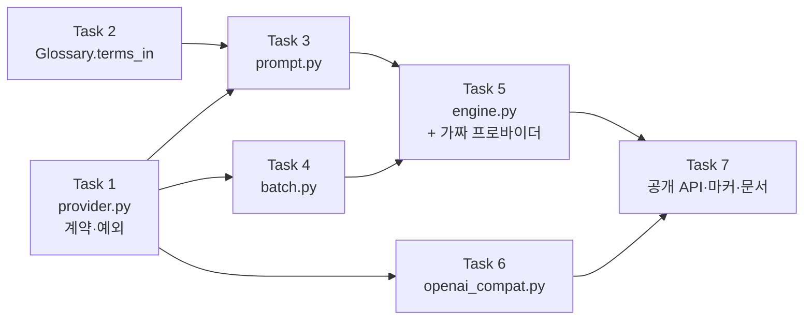

# WP7a 번역 엔진 구현 계획

> **For agentic workers:** REQUIRED SUB-SKILL: Use superpowers:subagent-driven-development (recommended) or superpowers:executing-plans to implement this plan task-by-task. Steps use checkbox (`- [ ]`) syntax for tracking.

**Goal:** 세그먼트 리스트를 대상 언어 하나로 번역하는 라이브러리 계층을 만든다. CLI 배선도 영속화도 하지 않는다.

**Architecture:** 순수 모듈(`prompt`·`batch`)과 I/O 모듈(`openai_compat`)을 `Provider` 프로토콜로 갈라 두고, `engine`이 그 위에서 배치 호출 → 검증 → 개별 폴백 → 재시도를 지휘한다. 배치가 깨져도 그 배치만 세그먼트 1개씩으로 강등하므로 정확성이 배치 크기에 매달리지 않는다.

**Tech Stack:** Python 3.11+ · `httpx`(이미 런타임 의존성) · `pytest` · `httpx.MockTransport`(의존성 추가 없이 HTTP 계층 검증)

**Spec:** [번역 엔진 설계 (WP7a)](../specs/2026-08-16-translate-engine-design.md)

## 구현 중 바뀐 결정

**아래 항목은 본문 코드 블록보다 이쪽이 최신이다.** 본문은 구현자에게 준 그대로가
기록이라 고치지 않는다. 체크박스도 채우지 않는다 — 진척의 단일 출처는
[WBS](../../WBS.md)와 [CHANGELOG](../../../CHANGELOG.md)이고 이 문서는 레시피다.

| # | 본문의 계획 | 실제 | 왜 바꿨나 |
| --- | --- | --- | --- |
| 1 | Task 7의 `__all__` **15개** | **21개** | 공개 기준을 "호출자가 지금 쓰는 것"에서 **"밑줄 없는 최상위 이름 전부"** 로 바꿨다. 전자는 검사할 수 없어 새 심볼이 조용히 빠진다. 추가된 6개는 `BatchWindow`·`DEFAULT_TIMEOUT_S`·`Role`·`build_messages`·`iter_batches`·`parse_translations` |
| 2 | live 테스트가 `usage.calls == 1`을 단언 | **상한만 단언** (`<= (1+세그먼트수) x (max_retries+1)`) | `== 1`은 약한 모델에서 폴백이 발동하면 빨개지는데, **그 발동이야말로 이 파일의 관찰 목표**다. 하한은 `failures == ()`가 이미 함의해 공허하다 |
| 3 | 게이트 설정 검사를 테스트로 | **`tests/conftest.py`의 `pytest_configure`로** | 테스트에 두면 `addopts`에 `-m live`를 덧붙이는 변이가 **감시자 자신까지 deselect**해 exit 0으로 초록이 난다(실측). 훅은 수집 전에 돌아 deselect 대상이 아니다 |
| 4 | 하위 모듈 목록을 손으로 관리 | **`pkgutil.iter_modules`** | 손 목록은 새 모듈이 생겨도 **0건이 죽었다**(실측). 표준 라이브러리라 의존성 규율에 걸리지 않는다 |

1번이 이 계획서에서 가장 큰 이탈이다. 나머지 셋은 전부 **"검사가 실제로 무엇을
죽이는가"를 실측한 뒤** 나온 것이고, 공통 원인은 하나다 — 계획이 상정한 변이만
막는 검사를 짜면 상정 밖 변이는 0건을 죽인다.

## Global Constraints

이 절의 제약은 **모든 태스크에 암묵적으로 포함된다.**

| 제약 | 정확한 값 |
| --- | --- |
| Python 실행 | **반드시 `.venv/Scripts/python.exe`.** 시스템 Python은 3.14라 다르다 |
| 모듈 첫 줄 | `from __future__ import annotations` |
| 독스트링·주석 | **한국어.** 근거 FR·§ 번호를 병기한다 (예: `FR-2.4`, `§7.2`) |
| 주석 내용 | "왜 이 값인가"가 아니라 **"이 값이 아니면 무엇이 깨지는가"** |
| ruff | `line-length = 100`, 규칙 `E,F,I,UP,B,SIM` |
| 커밋 메시지 | **한국어.** 푸시는 사용자가 명시적으로 요청할 때만 |
| 의존성 | **추가 금지.** 런타임 4개(`typer`·`pysubs2`·`pyyaml`·`httpx`), dev 3개(`pytest`·`pytest-cov`·`ruff`) |
| 로컬 게이트 | 대상은 항상 `.` — `src tests`로 좁히면 **CI 5회 연속 실패를 숨긴 그 사고**가 재현된다 |
| pytest 마커 | `addopts`에 **`--strict-markers`가 켜져 있다.** 미등록 마커는 경고가 아니라 **에러**다 |
| 출력 문자열 | em dash(`—`) 금지. cp949에서 인코딩 실패 → exit 1("규격 위반 발견")로 오보된다. **독스트링·주석은 무관** |

로컬 게이트 5종 (`.github/workflows/ci.yml`에서 그대로 옮긴 것):

```bash
.venv/Scripts/python.exe -m ruff check .
.venv/Scripts/python.exe -m ruff format --check .
.venv/Scripts/python.exe -m pytest --cov=cuesift --cov-report=term-missing
python scripts/check_links.py
npx --yes markdownlint-cli2
```

---

## 파일 구조

| 파일 | 책임 (한 문장) | 태스크 |
| --- | --- | --- |
| `src/cuesift/translate/__init__.py` | 공개 API 노출 — `translate_segments` · `TranslationResult` | 1(껍데기) · 7(완성) |
| `src/cuesift/translate/provider.py` | LLM 호출의 계약과 **실패 분류**를 정의한다 | 1 |
| `src/cuesift/translate/prompt.py` | 세그먼트와 맥락을 메시지로 조립한다 [순수] | 3 |
| `src/cuesift/translate/batch.py` | 배치를 자르고 응답을 검증한다 [순수] | 4 |
| `src/cuesift/translate/engine.py` | 흐름을 지휘한다 — 폴백과 재시도 | 5 |
| `src/cuesift/translate/openai_compat.py` | OpenAI 호환 엔드포인트를 친다 [유일한 I/O] | 6 |
| `src/cuesift/glossary/__init__.py` | `terms_in()` 추가 (수정) | 2 |
| `tests/fakes/provider.py` | 가짜 프로바이더 — 배포물에 넣지 않는다 | 5 |
| `pyproject.toml` | `live` 마커 등록 + 기본 제외 (수정) | 7 |



Task 1과 2는 서로 독립이라 병렬 가능하다. Task 6도 Task 1만 끝나면 병렬 가능하다.

---

### Task 1: 프로바이더 계약과 예외 계층

**Files:**

- Create: `src/cuesift/translate/__init__.py`
- Create: `src/cuesift/translate/provider.py`
- Test: `tests/test_translate_provider.py`

**Interfaces:**

- Consumes: 없음 (첫 태스크)
- Produces:
  - `ChatMessage(role: Literal["system","user","assistant"], content: str)`
  - `TokenUsage(prompt_tokens: int = 0, completion_tokens: int = 0, calls: int = 0)` — `__add__` 지원
  - `Completion(text: str, usage: TokenUsage)`
  - `Provider` Protocol — `name: str`, `complete(messages, *, temperature: float, max_tokens: int | None) -> Completion`
  - `ProviderError(Exception)` / `RetryableProviderError(ProviderError)` — `retry_after_s: float | None` / `FatalProviderError(ProviderError)`

**설계 근거 (스펙 §4.2):** 이 태스크의 핵심은 프로토콜이 아니라 **예외 분류**다.
나누지 않으면 API 키 오타가 800큐 × 재시도 3회 = 2400회 실패 호출이 되고,
사용자는 800건 실패 리포트를 받고 원인이 키 하나였다는 것을 모른다.

- [ ] **Step 1: 실패하는 테스트를 쓴다**

`tests/test_translate_provider.py`를 새로 만든다.

```python
"""프로바이더 계약과 예외 계층 (요구사항정의서 FR-2.5, FR-2.6)."""

from __future__ import annotations

import pytest

from cuesift.translate.provider import (
    ChatMessage,
    Completion,
    FatalProviderError,
    ProviderError,
    RetryableProviderError,
    TokenUsage,
)


def test_chat_message_역할이_셋_중_하나여야_한다() -> None:
    assert ChatMessage(role="system", content="너는 번역가다").role == "system"


def test_chat_message_잘못된_역할은_거부한다() -> None:
    # Literal은 타입 힌트일 뿐 런타임에 아무것도 막지 않는다. 잘못된 역할은
    # 서버가 400을 내는데, 그 400은 FatalProviderError로 분류되어 전체를
    # 중단시킨다. 조립 시점에 막지 않으면 원인이 프롬프트 조립 코드라는
    # 사실이 호출 실패 지점에서 보이지 않는다.
    with pytest.raises(ValueError, match="role"):
        ChatMessage(role="tool", content="x")  # type: ignore[arg-type]


def test_token_usage_합산() -> None:
    a = TokenUsage(prompt_tokens=10, completion_tokens=5, calls=1)
    b = TokenUsage(prompt_tokens=3, completion_tokens=2, calls=1)
    total = a + b
    assert (total.prompt_tokens, total.completion_tokens, total.calls) == (13, 7, 2)


def test_token_usage_기본값은_전부_0이다() -> None:
    # 배치 루프가 빈 TokenUsage부터 누적하므로 기본값이 없으면 호출부가
    # 매번 0을 세 개 적어야 한다.
    assert TokenUsage() + TokenUsage(calls=1) == TokenUsage(calls=1)


def test_completion은_사용량을_동반한다() -> None:
    c = Completion(text="hello", usage=TokenUsage(prompt_tokens=1))
    assert c.text == "hello"
    assert c.usage.prompt_tokens == 1


def test_예외_계층_두_갈래가_공통_조상을_갖는다() -> None:
    # 호출부가 "프로바이더 문제 전부"를 한 번에 잡을 수 있어야 한다.
    assert issubclass(RetryableProviderError, ProviderError)
    assert issubclass(FatalProviderError, ProviderError)


def test_재시도_가능_실패는_서로_구분된다() -> None:
    # 이 구분이 없으면 인증 실패도 세그먼트 실패로 취급되어 파일 전체가
    # 실패 표시로 완주한다 (설계 §4.2).
    assert not issubclass(FatalProviderError, RetryableProviderError)
    assert not issubclass(RetryableProviderError, FatalProviderError)


def test_retry_after를_실어_나른다() -> None:
    err = RetryableProviderError("429", retry_after_s=2.5)
    assert err.retry_after_s == 2.5


def test_retry_after는_없을_수_있다() -> None:
    assert RetryableProviderError("timeout").retry_after_s is None
```

- [ ] **Step 2: 테스트가 실패하는 것을 확인한다**

```bash
.venv/Scripts/python.exe -m pytest tests/test_translate_provider.py -v
```

Expected: `ModuleNotFoundError: No module named 'cuesift.translate'` (수집 단계에서 실패)

- [ ] **Step 3: 최소 구현을 쓴다**

`src/cuesift/translate/__init__.py` (이 태스크에서는 껍데기만. Task 7에서 공개 API를 채운다):

```python
"""번역 계층 (요구사항정의서 §5.2 FR-2.1~2.8).

공개 API는 Task 7에서 채운다. 지금은 하위 모듈의 네임스페이스일 뿐이다.
"""

from __future__ import annotations
```

`src/cuesift/translate/provider.py`:

```python
"""LLM 프로바이더의 계약과 실패 분류 (FR-2.5, FR-2.6).

**이 모듈에서 프로토콜보다 중요한 것은 예외 계층이다.** FR-2.6은 "실패한
세그먼트를 재시도하고, 실패 시 해당 세그먼트만 표시 후 진행"이라고만 적혀
있어서, 곧이곧대로 구현하면 인증 실패도 "세그먼트 실패"로 취급되어 파일
전체가 실패 표시로 완주한다. 사용자는 800건 실패 리포트를 받고 원인이 키
하나였다는 것을 모른다 (설계 §4.2).

축은 종료 코드가 이미 그은 것과 같다 - exit 2("명령줄이 틀림")와
exit 66("파일 내용이 틀림")의 구분, 즉 "호출자가 틀렸나, 데이터가 틀렸나"다.
"""

from __future__ import annotations

from collections.abc import Sequence
from dataclasses import dataclass
from typing import Literal, Protocol, runtime_checkable

Role = Literal["system", "user", "assistant"]

_ROLES = ("system", "user", "assistant")


@dataclass(frozen=True, slots=True)
class ChatMessage:
    """프로바이더에 보내는 메시지 한 개."""

    role: Role
    content: str

    def __post_init__(self) -> None:
        # Literal은 런타임에 아무것도 막지 않는다. 잘못된 역할은 서버가 400을
        # 내고 그 400은 FatalProviderError가 되어 전체를 중단시키는데, 그때는
        # 원인이 프롬프트 조립 코드라는 사실이 보이지 않는다. Span.__post_init__
        # 이 같은 이유로 side를 검사한다.
        if self.role not in _ROLES:
            raise ValueError(f"role({self.role!r})은 {_ROLES} 중 하나여야 한다")


@dataclass(frozen=True, slots=True)
class TokenUsage:
    """호출 하나 또는 누적분의 토큰 사용량 (NFR-2 비용 투명성)."""

    prompt_tokens: int = 0
    completion_tokens: int = 0
    calls: int = 0

    def __add__(self, other: TokenUsage) -> TokenUsage:
        """배치 루프가 빈 값부터 누적할 수 있게 한다."""
        return TokenUsage(
            prompt_tokens=self.prompt_tokens + other.prompt_tokens,
            completion_tokens=self.completion_tokens + other.completion_tokens,
            calls=self.calls + other.calls,
        )


@dataclass(frozen=True, slots=True)
class Completion:
    """프로바이더가 돌려준 것."""

    text: str
    usage: TokenUsage


class ProviderError(Exception):
    """프로바이더 호출 실패의 최상위. 호출부가 전부를 한 번에 잡을 수 있게 한다."""


class RetryableProviderError(ProviderError):
    """다시 걸면 성공할 수 있는 실패 - 429, 5xx, 타임아웃, 연결 끊김.

    `retry_after_s`는 서버가 지정한 대기다. 무시하면 서버가 지정한 대기를
    어겨 일시적 제한이 영구 차단으로 승격될 수 있다.
    """

    def __init__(self, message: str, *, retry_after_s: float | None = None) -> None:
        super().__init__(message)
        self.retry_after_s = retry_after_s


class FatalProviderError(ProviderError):
    """다시 걸어도 같은 결과인 실패 - 401, 403 인증, 400 스키마, 404 모델 없음.

    이것을 재시도하면 실패 1회가 실패 N회로 늘어날 뿐이고, 진짜 원인이
    대량의 세그먼트 실패 아래 묻힌다.
    """


@runtime_checkable
class Provider(Protocol):
    """LLM 호출의 계약. 표면을 최소로 두는 것이 NFR-5(코드 수정 없이 추가)를 돕는다."""

    name: str

    def complete(
        self,
        messages: Sequence[ChatMessage],
        *,
        temperature: float,
        max_tokens: int | None,
    ) -> Completion: ...
```

- [ ] **Step 4: 테스트가 통과하는 것을 확인한다**

```bash
.venv/Scripts/python.exe -m pytest tests/test_translate_provider.py -v
```

Expected: 9 passed

- [ ] **Step 5: 게이트를 돌리고 커밋한다**

```bash
.venv/Scripts/python.exe -m ruff check .
.venv/Scripts/python.exe -m ruff format --check .
.venv/Scripts/python.exe -m pytest -q
```

Expected: 전부 통과 · pytest 수집 개수가 **499 → 508**

```bash
git add src/cuesift/translate/ tests/test_translate_provider.py
git commit -m "기능: 프로바이더 계약과 예외 계층 - 재시도 가능성이 축이다 (FR-2.5, FR-2.6)"
```

---

### Task 2: `Glossary.terms_in()` — 프롬프트 주입용 용어 필터

**Files:**

- Modify: `src/cuesift/glossary/__init__.py`
- Test: `tests/test_glossary.py` (기존 파일에 추가)

**Interfaces:**

- Consumes: 기존 `Glossary`·`GlossaryEntry`·`_contains_term`
- Produces: `Glossary.terms_in(source_text: str) -> list[GlossaryEntry]`

**설계 근거 (스펙 §5.3):** 전체 용어집을 매번 프롬프트에 넣으면
용어집이 500개일 때 배치에 3개만 나와도 497개가 매 호출 낭비된다.
**기존 `_contains_term`을 재사용하는 것이 요점**이다 — 판정 규칙이 갈리면
"프롬프트에 넣은 용어"와 "위반으로 잡는 용어"가 어긋나 신호가 자기모순을 낸다.

- [ ] **Step 1: 실패하는 테스트를 쓴다**

`tests/test_glossary.py` 끝에 추가한다.

```python
def test_terms_in_원문에_등장하는_용어만_고른다() -> None:
    g = Glossary(
        entries=(
            GlossaryEntry(source="기후변화", targets=("climate change",)),
            GlossaryEntry(source="탄소중립", targets=("carbon neutrality",)),
        )
    )
    found = g.terms_in("기후변화는 시급한 문제다")
    assert [e.source for e in found] == ["기후변화"]


def test_terms_in_대소문자를_무시한다() -> None:
    g = Glossary(entries=(GlossaryEntry(source="AI", targets=("AI",)),))
    assert len(g.terms_in("ai가 바꾼다")) == 1


def test_terms_in_단어_경계를_지킨다() -> None:
    # violations()와 같은 규칙이어야 한다. 갈리면 프롬프트에 넣은 용어와
    # 위반으로 잡는 용어가 어긋난다 (설계 §5.3).
    g = Glossary(entries=(GlossaryEntry(source="AI", targets=("AI",)),))
    assert g.terms_in("SAID that") == []


def test_terms_in_CJK는_조사가_붙어도_찾는다() -> None:
    # `\b`가 CJK를 깨뜨려 폐기된 이력이 _BOUNDARY 주석에 남아 있다.
    g = Glossary(entries=(GlossaryEntry(source="気候変動", targets=("climate change",)),))
    assert len(g.terms_in("これは気候変動です")) == 1


def test_terms_in_빈_용어집은_빈_리스트() -> None:
    assert Glossary().terms_in("아무 문장") == []


def test_terms_in과_violations가_같은_판정을_쓴다() -> None:
    # 원문에 있다고 terms_in이 고른 용어는, 번역문에 대응어가 없으면
    # 반드시 violations에도 잡혀야 한다. 어긋나면 프롬프트에 주입해 놓고
    # 위반으로도 안 잡거나, 주입하지 않고 위반으로 잡는다.
    g = Glossary(entries=(GlossaryEntry(source="기후변화", targets=("climate change",)),))
    source, target = "기후변화 대응", "response to warming"
    assert [e.source for e in g.terms_in(source)] == [
        e.source for e in g.violations(source, target)
    ]
```

- [ ] **Step 2: 테스트가 실패하는 것을 확인한다**

```bash
.venv/Scripts/python.exe -m pytest tests/test_glossary.py -k terms_in -v
```

Expected: 6개 전부 `AttributeError: 'Glossary' object has no attribute 'terms_in'`

- [ ] **Step 3: 최소 구현을 쓴다**

`src/cuesift/glossary/__init__.py`의 `Glossary` 클래스 안, `violations` **앞**에 넣는다.

```python
    def terms_in(self, source_text: str) -> list[GlossaryEntry]:
        """원문에 등장하는 용어들. 프롬프트 주입용 (FR-2.3).

        `violations()`와 **같은 판정 규칙**(`_contains_term`)을 쓰는 것이
        요점이다. 규칙이 갈리면 프롬프트에 넣은 용어와 위반으로 잡는 용어가
        어긋나, 주입하지 않은 용어를 안 썼다고 위반 처리하게 된다.

        전체 용어집을 매번 프롬프트에 넣지 않기 위해 있다. 용어집이 500개인데
        배치에 3개만 나오면 나머지 497개는 매 호출 낭비다.
        """
        lowered_source = source_text.lower()
        return [
            entry for entry in self.entries if _contains_term(lowered_source, entry.source.lower())
        ]
```

- [ ] **Step 4: 테스트가 통과하는 것을 확인한다**

```bash
.venv/Scripts/python.exe -m pytest tests/test_glossary.py -v
```

Expected: 기존 테스트 전부 + 신규 6개 통과

- [ ] **Step 5: 게이트를 돌리고 커밋한다**

```bash
.venv/Scripts/python.exe -m ruff check . && .venv/Scripts/python.exe -m ruff format --check . && .venv/Scripts/python.exe -m pytest -q
```

Expected: 수집 개수 **508 → 514**

```bash
git add src/cuesift/glossary/__init__.py tests/test_glossary.py
git commit -m "기능: Glossary.terms_in - 프롬프트에 넣을 용어만 고른다 (FR-2.3)"
```

---

### Task 3: `prompt.py` — 프롬프트 조립

**Files:**

- Create: `src/cuesift/translate/prompt.py`
- Test: `tests/test_translate_prompt.py`

**Interfaces:**

- Consumes: `ChatMessage`(Task 1) · `Glossary.terms_in`(Task 2) · `Segment`(기존)
- Produces:
  - `build_messages(batch: Sequence[Segment], *, source_lang: str, target_lang: str, before: Sequence[Segment] = (), after: Sequence[Segment] = (), glossary: Glossary | None = None, work_context: str | None = None) -> list[ChatMessage]`

**설계 근거 (스펙 §5):** 맥락으로 **원문만** 준다. 앞의 번역 결과를 주면
용어집이 이미 푸는 문제(일관성)를 토큰을 더 써서 비결정적으로 다시 푸는 것이 되고,
재현성·병렬성·캐시 키가 동시에 깨진다.

식별자는 `Segment.index`(원본 전역 인덱스)를 쓴다. 배치 내 지역 번호를 쓰면
맥락 세그먼트와 번호 공간이 갈라져 모델이 "[2]"가 맥락인지 대상인지 알 수 없다.

- [ ] **Step 1: 실패하는 테스트를 쓴다**

`tests/test_translate_prompt.py`를 새로 만든다.

```python
"""프롬프트 조립 (FR-2.2 맥락 윈도우, FR-2.3 용어집, FR-2.8 작품 맥락)."""

from __future__ import annotations

from cuesift.glossary import Glossary, GlossaryEntry
from cuesift.segment.models import Segment
from cuesift.translate.prompt import build_messages


def _seg(index: int, text: str) -> Segment:
    return Segment(
        id=f"s{index}",
        index=index,
        start_ms=index * 1000,
        end_ms=index * 1000 + 900,
        source_text=text,
    )


def test_시스템과_유저_두_메시지를_낸다() -> None:
    messages = build_messages([_seg(0, "안녕")], source_lang="ko", target_lang="en")
    assert [m.role for m in messages] == ["system", "user"]


def test_언어쌍이_시스템_메시지에_들어간다() -> None:
    messages = build_messages([_seg(0, "안녕")], source_lang="ko", target_lang="ja")
    assert "ko" in messages[0].content
    assert "ja" in messages[0].content


def test_대상_세그먼트가_전역_인덱스로_표시된다() -> None:
    # 배치 내 지역 번호를 쓰면 맥락과 번호 공간이 갈라져 모델이 어느 것이
    # 대상인지 구별할 근거를 잃는다 (설계 §5.1).
    messages = build_messages([_seg(10, "가"), _seg(11, "나")], source_lang="ko", target_lang="en")
    assert "[10]" in messages[1].content
    assert "[11]" in messages[1].content


def test_앞뒤_맥락이_들어가되_번역대상과_구분된다() -> None:
    messages = build_messages(
        [_seg(10, "대상")],
        before=[_seg(9, "앞")],
        after=[_seg(11, "뒤")],
        source_lang="ko",
        target_lang="en",
    )
    body = messages[1].content
    assert "[9]" in body and "[11]" in body
    # 맥락은 번역하지 말라는 지시가 반드시 있어야 한다. 없으면 모델이
    # 맥락까지 번역해 개수 검증이 실패하고 폴백이 헛돈다.
    assert body.count("번역하지 말") >= 2


def test_맥락이_없으면_그_절을_넣지_않는다() -> None:
    # 빈 절을 넣으면 모델이 빈 지시를 해석하려 든다.
    body = build_messages([_seg(0, "가")], source_lang="ko", target_lang="en")[1].content
    assert "번역하지 말" not in body


def test_용어집은_배치에_등장하는_것만_넣는다() -> None:
    glossary = Glossary(
        entries=(
            GlossaryEntry(source="기후변화", targets=("climate change",)),
            GlossaryEntry(source="탄소중립", targets=("carbon neutrality",)),
        )
    )
    system = build_messages(
        [_seg(0, "기후변화 이야기")],
        source_lang="ko",
        target_lang="en",
        glossary=glossary,
    )[0].content
    assert "climate change" in system
    # 등장하지 않은 용어는 토큰 낭비다 (설계 §5.3).
    assert "carbon neutrality" not in system


def test_용어집이_비면_그_절을_넣지_않는다() -> None:
    system = build_messages(
        [_seg(0, "아무 말")],
        source_lang="ko",
        target_lang="en",
        glossary=Glossary(),
    )[0].content
    assert "용어" not in system


def test_맥락에만_있는_용어도_주입한다() -> None:
    # 앞 맥락에 나온 용어를 모델이 번역 대상에서 대명사로 받을 수 있다.
    glossary = Glossary(entries=(GlossaryEntry(source="기후변화", targets=("climate change",)),))
    system = build_messages(
        [_seg(10, "그것은 시급하다")],
        before=[_seg(9, "기후변화 이야기")],
        source_lang="ko",
        target_lang="en",
        glossary=glossary,
    )[0].content
    assert "climate change" in system


def test_작품_맥락은_지정됐을_때만_들어간다() -> None:
    with_ctx = build_messages(
        [_seg(0, "가")], source_lang="ko", target_lang="en", work_context="1920년대 사극, 격식체"
    )[0].content
    without = build_messages([_seg(0, "가")], source_lang="ko", target_lang="en")[0].content
    assert "1920년대 사극" in with_ctx
    assert "1920년대 사극" not in without


def test_JSON_응답_형식을_지시한다() -> None:
    # response_format을 쓰지 않기로 했으므로(설계 §4.3, T7) 프롬프트가
    # 유일한 형식 지시다. 이 지시가 빠지면 폴백이 상시 발동한다.
    system = build_messages([_seg(0, "가")], source_lang="ko", target_lang="en")[0].content
    assert "translations" in system
    assert "id" in system and "text" in system


def test_세그먼트를_합치거나_나누지_말라고_지시한다() -> None:
    # FR-2.4의 첫 방어선이다.
    system = build_messages([_seg(0, "가")], source_lang="ko", target_lang="en")[0].content
    assert "합치" in system and "나누" in system
```

- [ ] **Step 2: 테스트가 실패하는 것을 확인한다**

```bash
.venv/Scripts/python.exe -m pytest tests/test_translate_prompt.py -v
```

Expected: `ModuleNotFoundError: No module named 'cuesift.translate.prompt'`

- [ ] **Step 3: 최소 구현을 쓴다**

`src/cuesift/translate/prompt.py`:

```python
"""프롬프트 조립 (FR-2.2 맥락 윈도우, FR-2.3 용어집, FR-2.8 작품 맥락).

**맥락으로 원문만 준다.** 앞의 번역 결과를 주면 용어 일관성을 프롬프트가
담당하게 되는데, 그것은 용어집(FR-2.3)이 존재하는 이유 그 자체다. 같은
문제를 토큰을 더 써서 비결정적으로 다시 푸는 것이고, 그 대가로 재현성
(NFR-3)과 병렬성과 캐시 키(WP7b)가 동시에 깨진다 (설계 §5.2).

이 모듈은 순수하다. 네트워크도 파일도 건드리지 않으므로 테스트가 값싸다.
"""

from __future__ import annotations

from collections.abc import Sequence

from cuesift.glossary import Glossary, GlossaryEntry
from cuesift.segment.models import Segment
from cuesift.translate.provider import ChatMessage

_SYSTEM_BASE = """\
너는 자막 번역가다. {source_lang} 자막을 {target_lang}로 번역한다.

규칙:
- 각 세그먼트를 독립적으로 번역한다. 세그먼트를 합치거나 나누지 마라.
- 번역 대상으로 주어진 항목만 번역한다.
- 응답은 다른 말 없이 JSON 하나로만 낸다:
  {{"translations": [{{"id": <번호>, "text": "<번역문>"}}]}}
- 주어진 번호를 그대로 쓰고, 빠뜨리거나 더하지 마라."""


def _format_lines(segments: Sequence[Segment]) -> str:
    return "\n".join(f"[{s.index}] {s.source_text}" for s in segments)


def _collect_terms(
    glossary: Glossary,
    segments: Sequence[Segment],
) -> list[GlossaryEntry]:
    """등장 순서를 지키면서 중복을 제거한다.

    dict.fromkeys가 아니라 손으로 도는 이유는 GlossaryEntry가 frozen이어도
    targets가 tuple이라 해시 가능성이 구현 세부에 매달리기 때문이다.
    """
    seen: set[str] = set()
    collected: list[GlossaryEntry] = []
    for segment in segments:
        for entry in glossary.terms_in(segment.source_text):
            if entry.source not in seen:
                seen.add(entry.source)
                collected.append(entry)
    return collected


def build_messages(
    batch: Sequence[Segment],
    *,
    source_lang: str,
    target_lang: str,
    before: Sequence[Segment] = (),
    after: Sequence[Segment] = (),
    glossary: Glossary | None = None,
    work_context: str | None = None,
) -> list[ChatMessage]:
    """배치 하나를 번역시킬 메시지를 만든다.

    식별자는 `Segment.index`(원본 전역 인덱스)다. 배치 내 지역 번호를 쓰면
    맥락 세그먼트와 번호 공간이 갈라져, 모델이 "[2]"가 맥락인지 번역
    대상인지 구별할 근거를 잃는다.
    """
    system_parts = [_SYSTEM_BASE.format(source_lang=source_lang, target_lang=target_lang)]

    if work_context:
        # 지정되지 않았을 때 빈 절을 넣으면 모델이 빈 지시를 해석하려 든다.
        system_parts.append(f"작품 맥락:\n{work_context}")

    if glossary is not None and not glossary.is_empty:
        # 맥락 세그먼트의 용어도 포함한다. 앞 맥락에 나온 용어를 번역 대상이
        # 대명사로 받는 경우가 있어, 대상만 훑으면 그 용어가 주입되지 않는다.
        entries = _collect_terms(glossary, [*before, *batch, *after])
        if entries:
            lines = "\n".join(f"- {e.source} -> {' / '.join(e.targets)}" for e in entries)
            system_parts.append(f"용어집 (반드시 이 대응어를 쓴다):\n{lines}")

    user_parts: list[str] = []
    if before:
        user_parts.append(f"## 앞 맥락 - 번역하지 말 것\n{_format_lines(before)}")
    user_parts.append(f"## 번역 대상\n{_format_lines(batch)}")
    if after:
        user_parts.append(f"## 뒤 맥락 - 번역하지 말 것\n{_format_lines(after)}")

    return [
        ChatMessage(role="system", content="\n\n".join(system_parts)),
        ChatMessage(role="user", content="\n\n".join(user_parts)),
    ]
```

- [ ] **Step 4: 테스트가 통과하는 것을 확인한다**

```bash
.venv/Scripts/python.exe -m pytest tests/test_translate_prompt.py -v
```

Expected: 11 passed

- [ ] **Step 5: 게이트를 돌리고 커밋한다**

```bash
.venv/Scripts/python.exe -m ruff check . && .venv/Scripts/python.exe -m ruff format --check . && .venv/Scripts/python.exe -m pytest -q
```

Expected: 수집 개수 **514 → 525**

```bash
git add src/cuesift/translate/prompt.py tests/test_translate_prompt.py
git commit -m "기능: 프롬프트 조립 - 맥락은 원문만 준다 (FR-2.2, FR-2.3, FR-2.8)"
```

---

### Task 4: `batch.py` — 배치 분할과 응답 검증

**Files:**

- Create: `src/cuesift/translate/batch.py`
- Test: `tests/test_translate_batch.py`

**Interfaces:**

- Consumes: `Segment`(기존)
- Produces:
  - `DEFAULT_BATCH_SIZE = 10` · `DEFAULT_CONTEXT_WINDOW = 3`
  - `BatchWindow(batch: tuple[Segment, ...], before: tuple[Segment, ...], after: tuple[Segment, ...])`
  - `iter_batches(segments: Sequence[Segment], *, size: int = DEFAULT_BATCH_SIZE, context_window: int = DEFAULT_CONTEXT_WINDOW) -> Iterator[BatchWindow]`
  - `InvalidResponseError(ValueError)`
  - `parse_translations(raw: str, expected_ids: Sequence[int]) -> dict[int, str]`

**설계 근거 (스펙 §7):** `parse_translations`가 FR-2.4의 실체다.
개수·번호가 어긋나면 `InvalidResponseError`를 던지고, 그것이 개별 폴백의 방아쇠가 된다.
**빈 문자열은 여기서 걸러내지 않는다** — 그것은 배치 폐기가 아니라
그 세그먼트만의 실패이고(`empty_translation`), 판정은 `engine`이 한다.

- [ ] **Step 1: 실패하는 테스트를 쓴다**

`tests/test_translate_batch.py`를 새로 만든다.

```python
"""배치 분할과 응답 검증 (FR-2.4 경계 보존)."""

from __future__ import annotations

import json

import pytest

from cuesift.segment.models import Segment
from cuesift.translate.batch import (
    DEFAULT_BATCH_SIZE,
    DEFAULT_CONTEXT_WINDOW,
    InvalidResponseError,
    iter_batches,
    parse_translations,
)


def _segs(n: int) -> list[Segment]:
    return [
        Segment(id=f"s{i}", index=i, start_ms=i * 1000, end_ms=i * 1000 + 900, source_text=f"문장{i}")
        for i in range(n)
    ]


def test_기본_배치_크기는_10이다() -> None:
    # 폴백 비용의 비대칭 때문이다 - 배치 20이 깨지면 20회 개별 호출이
    # 되지만 10이 깨지면 10회다 (설계 §8.2).
    assert DEFAULT_BATCH_SIZE == 10
    assert DEFAULT_CONTEXT_WINDOW == 3


def test_배치를_크기대로_자른다() -> None:
    windows = list(iter_batches(_segs(25), size=10, context_window=0))
    assert [len(w.batch) for w in windows] == [10, 10, 5]


def test_빈_입력은_배치를_내지_않는다() -> None:
    assert list(iter_batches([], size=10, context_window=3)) == []


def test_첫_배치는_앞_맥락이_없다() -> None:
    first = next(iter(iter_batches(_segs(20), size=5, context_window=3)))
    assert first.before == ()
    assert [s.index for s in first.after] == [5, 6, 7]


def test_마지막_배치는_뒤_맥락이_없다() -> None:
    last = list(iter_batches(_segs(10), size=5, context_window=3))[-1]
    assert [s.index for s in last.before] == [2, 3, 4]
    assert last.after == ()


def test_맥락_윈도우가_입력보다_크면_있는_만큼만() -> None:
    # 슬라이스 음수 인덱스 사고를 막는다. before를 segments[-2:0]으로
    # 계산하면 빈 튜플이 아니라 뒤에서 두 개가 나온다.
    windows = list(iter_batches(_segs(4), size=2, context_window=10))
    assert windows[0].before == ()
    assert [s.index for s in windows[1].before] == [0, 1]


def test_맥락_윈도우_0이면_맥락이_없다() -> None:
    for window in iter_batches(_segs(10), size=5, context_window=0):
        assert window.before == () and window.after == ()


def test_정상_응답을_파싱한다() -> None:
    raw = json.dumps({"translations": [{"id": 0, "text": "hello"}, {"id": 1, "text": "world"}]})
    assert parse_translations(raw, [0, 1]) == {0: "hello", 1: "world"}


def test_코드_펜스를_벗겨_낸다() -> None:
    # 모델이 ```json 펜스를 두르는 것은 매우 흔하다. 형식의 껍데기지
    # 내용 계약 위반이 아니므로, 이것 때문에 폴백을 돌리면 비용만 든다.
    raw = '```json\n{"translations": [{"id": 0, "text": "hello"}]}\n```'
    assert parse_translations(raw, [0]) == {0: "hello"}


def test_JSON이_아니면_거부한다() -> None:
    with pytest.raises(InvalidResponseError):
        parse_translations("죄송합니다, 번역할 수 없습니다.", [0])


def test_id가_누락되면_거부한다() -> None:
    raw = json.dumps({"translations": [{"id": 0, "text": "hello"}]})
    with pytest.raises(InvalidResponseError, match="누락"):
        parse_translations(raw, [0, 1])


def test_없는_id가_섞이면_거부한다() -> None:
    # 맥락 세그먼트를 번역해 돌려준 경우다. 지시 불이행 신호이므로
    # 배치를 폐기한다 (설계 §7.1).
    raw = json.dumps({"translations": [{"id": 0, "text": "a"}, {"id": 9, "text": "b"}]})
    with pytest.raises(InvalidResponseError, match="여분"):
        parse_translations(raw, [0])


def test_translations_키가_없으면_거부한다() -> None:
    with pytest.raises(InvalidResponseError, match="translations"):
        parse_translations(json.dumps({"result": []}), [0])


def test_최상위가_배열이면_거부한다() -> None:
    with pytest.raises(InvalidResponseError):
        parse_translations(json.dumps([{"id": 0, "text": "a"}]), [0])


def test_text가_문자열이_아니면_거부한다() -> None:
    raw = json.dumps({"translations": [{"id": 0, "text": 42}]})
    with pytest.raises(InvalidResponseError, match="text"):
        parse_translations(raw, [0])


def test_id가_정수가_아니면_거부한다() -> None:
    raw = json.dumps({"translations": [{"id": "0", "text": "a"}]})
    with pytest.raises(InvalidResponseError, match="id"):
        parse_translations(raw, [0])


def test_id가_중복되면_거부한다() -> None:
    # dict로 접으면 조용히 마지막 것이 이겨 개수 검증을 통과한다.
    raw = json.dumps({"translations": [{"id": 0, "text": "a"}, {"id": 0, "text": "b"}]})
    with pytest.raises(InvalidResponseError, match="중복"):
        parse_translations(raw, [0])


def test_빈_문자열은_파싱_단계에서_거부하지_않는다() -> None:
    # 빈 번역은 배치 폐기가 아니라 그 세그먼트만의 실패다. 판정은
    # engine이 한다 (설계 §7.1).
    raw = json.dumps({"translations": [{"id": 0, "text": ""}]})
    assert parse_translations(raw, [0]) == {0: ""}
```

- [ ] **Step 2: 테스트가 실패하는 것을 확인한다**

```bash
.venv/Scripts/python.exe -m pytest tests/test_translate_batch.py -v
```

Expected: `ModuleNotFoundError: No module named 'cuesift.translate.batch'`

- [ ] **Step 3: 최소 구현을 쓴다**

`src/cuesift/translate/batch.py`:

```python
"""배치 분할과 응답 검증 (FR-2.4 경계 보존).

**`parse_translations`가 FR-2.4의 실체다.** 개수와 번호가 어긋나면
InvalidResponseError를 던지고, 그것이 개별 폴백의 방아쇠가 된다.

다만 이 검증에는 한계가 있다 - 개수와 번호가 맞아도 모델이 [10]의 내용을
[11]에 넣는 것은 탐지할 수 없다. 그것은 Tier 0의 길이비 신호가 잡는다.
**FR-2.4는 translate 혼자 지키는 요구사항이 아니라 translate(구조)와
signals(탐지)가 나눠 지킨다** (설계 §7.2).

이 모듈은 순수하다.
"""

from __future__ import annotations

import json
from collections.abc import Iterator, Sequence
from dataclasses import dataclass

from cuesift.segment.models import Segment

# 배치가 깨졌을 때 개별 호출로 강등하는 대가가 배치 크기에 비례한다.
# 크면 약한 모델이 개수를 어겨 폴백이 잦아져 오히려 호출이 늘고,
# 작으면 앞뒤 맥락이 매 호출 중복 전송돼 토큰이 낭비된다.
DEFAULT_BATCH_SIZE = 10

# 요구사항정의서 §8.2 `cuesift.yaml` 예시값과 맞춘다. 0이면 FR-2.2가
# 무효가 되고, 크면 배치당 토큰이 선형으로 는다.
DEFAULT_CONTEXT_WINDOW = 3

_FENCE = "```"


@dataclass(frozen=True, slots=True)
class BatchWindow:
    """번역할 배치와 그 앞뒤 맥락. 맥락은 번역 대상이 아니다."""

    batch: tuple[Segment, ...]
    before: tuple[Segment, ...]
    after: tuple[Segment, ...]


class InvalidResponseError(ValueError):
    """응답이 계약을 어겼다. 개별 폴백의 방아쇠다."""


def iter_batches(
    segments: Sequence[Segment],
    *,
    size: int = DEFAULT_BATCH_SIZE,
    context_window: int = DEFAULT_CONTEXT_WINDOW,
) -> Iterator[BatchWindow]:
    """세그먼트를 배치로 자르고 각 배치에 앞뒤 맥락을 붙인다 (FR-2.2)."""
    if size < 1:
        raise ValueError(f"size({size})는 1 이상이어야 한다")
    if context_window < 0:
        raise ValueError(f"context_window({context_window})는 0 이상이어야 한다")

    for start in range(0, len(segments), size):
        end = min(start + size, len(segments))
        # max(0, ...)가 없으면 start-3이 음수가 되어 슬라이스가 뒤에서부터
        # 잘라 온다. 첫 배치의 앞 맥락이 파일 끝 세그먼트가 되는 사고다.
        before_start = max(0, start - context_window)
        yield BatchWindow(
            batch=tuple(segments[start:end]),
            before=tuple(segments[before_start:start]) if context_window else (),
            after=tuple(segments[end : end + context_window]) if context_window else (),
        )


def _strip_fence(raw: str) -> str:
    """모델이 두른 코드 펜스를 벗긴다.

    펜스는 형식의 껍데기지 내용 계약 위반이 아니다. 이것 때문에 폴백을
    돌리면 정상 응답에 개별 호출 비용을 물린다.
    """
    text = raw.strip()
    if not text.startswith(_FENCE):
        return text
    lines = text.splitlines()
    # 첫 줄은 ``` 또는 ```json, 마지막 줄은 ```.
    if lines and lines[-1].strip() == _FENCE:
        lines = lines[:-1]
    return "\n".join(lines[1:]).strip()


def parse_translations(raw: str, expected_ids: Sequence[int]) -> dict[int, str]:
    """응답을 파싱하고 계약을 검사한다.

    빈 문자열 번역은 **여기서 거르지 않는다.** 그것은 배치 폐기 사유가
    아니라 그 세그먼트만의 실패이고(`empty_translation`), 판정은 engine이 한다.
    """
    try:
        parsed = json.loads(_strip_fence(raw))
    except json.JSONDecodeError as e:
        raise InvalidResponseError(f"JSON이 아니다: {e}") from None

    if not isinstance(parsed, dict) or "translations" not in parsed:
        raise InvalidResponseError("최상위에 'translations' 키가 없다")

    items = parsed["translations"]
    if not isinstance(items, list):
        raise InvalidResponseError("'translations'가 배열이 아니다")

    result: dict[int, str] = {}
    for item in items:
        if not isinstance(item, dict):
            raise InvalidResponseError("항목이 객체가 아니다")
        item_id = item.get("id")
        # bool은 int의 하위 타입이라 isinstance(True, int)가 참이다.
        # 걸러 내지 않으면 {"id": true}가 1번 세그먼트로 접힌다.
        if not isinstance(item_id, int) or isinstance(item_id, bool):
            raise InvalidResponseError(f"id가 정수가 아니다: {item_id!r}")
        text = item.get("text")
        if not isinstance(text, str):
            raise InvalidResponseError(f"text가 문자열이 아니다: {text!r}")
        if item_id in result:
            # dict로 접으면 마지막 것이 조용히 이겨 개수 검증을 통과한다.
            raise InvalidResponseError(f"id가 중복됐다: {item_id}")
        result[item_id] = text

    expected = set(expected_ids)
    got = set(result)
    if missing := expected - got:
        raise InvalidResponseError(f"id가 누락됐다: {sorted(missing)}")
    if extra := got - expected:
        raise InvalidResponseError(f"여분의 id가 있다: {sorted(extra)}")

    return result
```

- [ ] **Step 4: 테스트가 통과하는 것을 확인한다**

```bash
.venv/Scripts/python.exe -m pytest tests/test_translate_batch.py -v
```

Expected: 18 passed

- [ ] **Step 5: 게이트를 돌리고 커밋한다**

```bash
.venv/Scripts/python.exe -m ruff check . && .venv/Scripts/python.exe -m ruff format --check . && .venv/Scripts/python.exe -m pytest -q
```

Expected: 수집 개수 **525 → 543**

```bash
git add src/cuesift/translate/batch.py tests/test_translate_batch.py
git commit -m "기능: 배치 분할과 응답 검증 - 폴백의 방아쇠 (FR-2.4)"
```

---

### Task 5: `engine.py` — 실행 흐름과 가짜 프로바이더

**Files:**

- Create: `src/cuesift/translate/engine.py`
- Create: `tests/fakes/__init__.py`
- Create: `tests/fakes/provider.py`
- Test: `tests/test_translate_engine.py`

**Interfaces:**

- Consumes: Task 1·3·4 전부
- Produces:
  - `SegmentFailure(segment_id: str, reason: str, attempts: int)`
  - `TranslationResult(target_lang: str, segments: tuple[Segment, ...], failures: tuple[SegmentFailure, ...], usage: TokenUsage)`
  - `DEFAULT_MAX_RETRIES = 3`
  - `translate_segments(segments, *, provider, source_lang, target_lang, glossary=None, work_context=None, batch_size=DEFAULT_BATCH_SIZE, context_window=DEFAULT_CONTEXT_WINDOW, temperature=0.0, max_retries=DEFAULT_MAX_RETRIES, sleep=time.sleep) -> TranslationResult`

**설계 근거 (스펙 §6):** 이 태스크가 WP7a에서 가장 복잡하다. 지켜야 할 것 셋:

1. **`FatalProviderError`는 재시도하지 않고 그대로 전파한다** — 호출부가 즉시 멈춰야 한다
2. **재시도 소진 후에는 개별 폴백을 하지 않는다** — 폴백은 "모델이 지시를 어김"의 처방이지 "서버가 죽음"의 처방이 아니다
3. **`sleep`을 주입 가능하게 둔다** — 테스트가 실제로 7초를 기다리면 스위트가 느려져 아무도 안 돌린다

- [ ] **Step 1: 가짜 프로바이더를 만든다**

`tests/fakes/__init__.py`:

```python
"""테스트 더블 모음. 배포물(`src/`)에 넣지 않는다."""

from __future__ import annotations
```

`tests/fakes/provider.py`:

```python
"""가짜 프로바이더 - 네트워크 없이 engine을 검증한다 (NFR-7).

`src/`가 아니라 `tests/`에 있는 이유는 배포물에 테스트 더블을 섞지 않기
위해서다. WP8(Tier 1 자가일관성)도 같은 가짜를 쓴다.
"""

from __future__ import annotations

import json
from collections.abc import Callable, Sequence

from cuesift.translate.provider import ChatMessage, Completion, ProviderError, TokenUsage


class ScriptedProvider:
    """미리 정한 응답을 순서대로 돌려준다.

    응답 자리에 예외 인스턴스를 넣으면 그것을 던진다. 재시도·폴백 경로를
    시나리오로 적을 수 있게 하는 것이 목적이다.
    """

    name = "scripted"

    def __init__(self, responses: Sequence[str | ProviderError]) -> None:
        self._responses = list(responses)
        self.calls: list[list[ChatMessage]] = []

    def complete(
        self,
        messages: Sequence[ChatMessage],
        *,
        temperature: float,
        max_tokens: int | None = None,
    ) -> Completion:
        self.calls.append(list(messages))
        if not self._responses:
            raise AssertionError(f"대본이 소진됐는데 {len(self.calls)}번째 호출이 왔다")
        item = self._responses.pop(0)
        if isinstance(item, ProviderError):
            raise item
        return Completion(text=item, usage=TokenUsage(prompt_tokens=1, completion_tokens=1, calls=1))


class EchoProvider:
    """요청받은 id를 그대로 채워 정상 JSON을 낸다.

    `transform`으로 번역문을 바꿀 수 있고, `drop_last`로 개수 불일치를,
    `garbage`로 파싱 실패를 만들 수 있다.
    """

    name = "echo"

    def __init__(
        self,
        *,
        transform: Callable[[str], str] = lambda s: f"EN:{s}",
        drop_last: bool = False,
        garbage: bool = False,
        fail_batches_of_size: int | None = None,
    ) -> None:
        self._transform = transform
        self._drop_last = drop_last
        self._garbage = garbage
        self._fail_batches_of_size = fail_batches_of_size
        self.calls: list[list[ChatMessage]] = []

    def complete(
        self,
        messages: Sequence[ChatMessage],
        *,
        temperature: float,
        max_tokens: int | None = None,
    ) -> Completion:
        self.calls.append(list(messages))
        pairs = _parse_targets(messages[-1].content)

        if self._garbage:
            return _completion("죄송합니다, 번역할 수 없습니다.")
        # 배치일 때만 깨뜨리고 개별 폴백은 성공시키기 위한 장치다.
        if self._fail_batches_of_size is not None and len(pairs) >= self._fail_batches_of_size:
            return _completion("죄송합니다, 번역할 수 없습니다.")

        items = [{"id": i, "text": self._transform(t)} for i, t in pairs]
        if self._drop_last and len(items) > 1:
            items = items[:-1]
        return _completion(json.dumps({"translations": items}, ensure_ascii=False))


def _completion(text: str) -> Completion:
    return Completion(text=text, usage=TokenUsage(prompt_tokens=1, completion_tokens=1, calls=1))


def _parse_targets(user_content: str) -> list[tuple[int, str]]:
    """유저 메시지에서 '## 번역 대상' 절의 [id] 텍스트만 뽑는다."""
    lines = user_content.splitlines()
    out: list[tuple[int, str]] = []
    in_target = False
    for line in lines:
        if line.startswith("## "):
            in_target = line.startswith("## 번역 대상")
            continue
        if in_target and line.startswith("["):
            head, _, text = line.partition("] ")
            out.append((int(head[1:]), text))
    return out
```

- [ ] **Step 2: 실패하는 테스트를 쓴다**

`tests/test_translate_engine.py`:

```python
"""실행 엔진 - 배치, 폴백, 재시도 (FR-2.6)."""

from __future__ import annotations

import json

import pytest

from cuesift.segment.models import Segment
from cuesift.translate.engine import translate_segments
from cuesift.translate.provider import (
    FatalProviderError,
    RetryableProviderError,
)
from tests.fakes.provider import EchoProvider, ScriptedProvider


def _segs(n: int) -> list[Segment]:
    return [
        Segment(id=f"s{i}", index=i, start_ms=i * 1000, end_ms=i * 1000 + 900, source_text=f"문장{i}")
        for i in range(n)
    ]


def _ok(ids: list[int]) -> str:
    return json.dumps({"translations": [{"id": i, "text": f"EN{i}"} for i in ids]})


def test_정상_경로에서_전부_번역된다() -> None:
    result = translate_segments(
        _segs(3), provider=EchoProvider(), source_lang="ko", target_lang="en"
    )
    assert [s.target_text for s in result.segments] == ["EN:문장0", "EN:문장1", "EN:문장2"]
    assert result.failures == ()
    assert result.target_lang == "en"


def test_원본_세그먼트를_변형하지_않는다() -> None:
    # en이 채운 target_text를 ja가 덮어쓰면 두 언어를 동시에 들 수 없다
    # (설계 §3.2).
    original = _segs(2)
    translate_segments(original, provider=EchoProvider(), source_lang="ko", target_lang="en")
    assert all(s.target_text is None for s in original)


def test_배치_크기대로_호출한다() -> None:
    provider = EchoProvider()
    translate_segments(
        _segs(25), provider=provider, source_lang="ko", target_lang="en", batch_size=10
    )
    assert len(provider.calls) == 3


def test_사용량을_누적한다() -> None:
    provider = EchoProvider()
    result = translate_segments(
        _segs(25), provider=provider, source_lang="ko", target_lang="en", batch_size=10
    )
    assert result.usage.calls == 3


def test_개수_불일치는_개별_폴백을_탄다() -> None:
    # 배치(2개 이상)는 깨뜨리고 개별 호출(1개)은 성공시킨다.
    provider = EchoProvider(fail_batches_of_size=2)
    result = translate_segments(
        _segs(3), provider=provider, source_lang="ko", target_lang="en", batch_size=3
    )
    # 배치 1회 실패 + 개별 3회 = 4회
    assert len(provider.calls) == 4
    assert result.failures == ()
    assert [s.target_text for s in result.segments] == ["EN:문장0", "EN:문장1", "EN:문장2"]


def test_파싱_실패도_개별_폴백을_탄다() -> None:
    provider = ScriptedProvider(["산문 응답입니다", _ok([0]), _ok([1])])
    result = translate_segments(
        _segs(2), provider=provider, source_lang="ko", target_lang="en", batch_size=2
    )
    assert len(provider.calls) == 3
    assert result.failures == ()


def test_개별_폴백도_실패하면_그_세그먼트만_실패한다() -> None:
    # 배치 깨짐 -> 개별 3회 중 가운데만 산문 응답.
    provider = ScriptedProvider(["산문", _ok([0]), "산문", _ok([2])])
    result = translate_segments(
        _segs(3), provider=provider, source_lang="ko", target_lang="en", batch_size=3
    )
    assert [f.segment_id for f in result.failures] == ["s1"]
    assert result.failures[0].reason == "invalid_response"
    # 나머지는 진행한다 (FR-2.6).
    assert result.segments[0].target_text == "EN0"
    assert result.segments[1].target_text is None
    assert result.segments[2].target_text == "EN2"


def test_빈_번역은_그_세그먼트만_실패한다() -> None:
    raw = json.dumps({"translations": [{"id": 0, "text": "EN0"}, {"id": 1, "text": "   "}]})
    provider = ScriptedProvider([raw])
    result = translate_segments(
        _segs(2), provider=provider, source_lang="ko", target_lang="en", batch_size=2
    )
    assert [f.reason for f in result.failures] == ["empty_translation"]
    assert result.segments[1].target_text is None


def test_재시도_가능_실패는_다시_건다() -> None:
    provider = ScriptedProvider([RetryableProviderError("503"), _ok([0])])
    result = translate_segments(
        _segs(1),
        provider=provider,
        source_lang="ko",
        target_lang="en",
        sleep=lambda _s: None,
    )
    assert len(provider.calls) == 2
    assert result.failures == ()


def test_재시도가_소진되면_배치_전원이_실패한다() -> None:
    provider = ScriptedProvider([RetryableProviderError("503")] * 4)
    result = translate_segments(
        _segs(3),
        provider=provider,
        source_lang="ko",
        target_lang="en",
        batch_size=3,
        max_retries=3,
        sleep=lambda _s: None,
    )
    # 최초 1회 + 재시도 3회 = 4회. **개별 폴백은 타지 않는다** (설계 §6.3).
    assert len(provider.calls) == 4
    assert [f.segment_id for f in result.failures] == ["s0", "s1", "s2"]
    assert all(f.reason == "provider_error" for f in result.failures)


def test_치명적_실패는_즉시_전파된다() -> None:
    # 구분이 없으면 API 키 오타가 800건 실패 리포트로 나온다 (설계 §4.2).
    provider = ScriptedProvider([FatalProviderError("401 Unauthorized")])
    with pytest.raises(FatalProviderError):
        translate_segments(
            _segs(10),
            provider=provider,
            source_lang="ko",
            target_lang="en",
            batch_size=5,
            sleep=lambda _s: None,
        )
    # 재시도도 폴백도 하지 않았다.
    assert len(provider.calls) == 1


def test_백오프가_지수로_는다() -> None:
    waited: list[float] = []
    provider = ScriptedProvider([RetryableProviderError("503")] * 3 + [_ok([0])])
    translate_segments(
        _segs(1),
        provider=provider,
        source_lang="ko",
        target_lang="en",
        sleep=waited.append,
    )
    assert waited == [1.0, 2.0, 4.0]


def test_retry_after를_존중한다() -> None:
    # 무시하면 서버가 지정한 대기를 어겨 일시적 제한이 영구 차단으로
    # 승격될 수 있다.
    waited: list[float] = []
    provider = ScriptedProvider([RetryableProviderError("429", retry_after_s=7.5), _ok([0])])
    translate_segments(
        _segs(1),
        provider=provider,
        source_lang="ko",
        target_lang="en",
        sleep=waited.append,
    )
    assert waited == [7.5]


def test_빈_입력은_호출하지_않는다() -> None:
    provider = EchoProvider()
    result = translate_segments([], provider=provider, source_lang="ko", target_lang="en")
    assert provider.calls == []
    assert result.segments == ()
    assert result.usage.calls == 0


def test_temperature를_그대로_넘긴다() -> None:
    # WP8 자가일관성이 의도적으로 올려 쓴다 (설계 §8.2).
    seen: list[float] = []

    class Recording(EchoProvider):
        def complete(self, messages, *, temperature, max_tokens=None):  # type: ignore[no-untyped-def]
            seen.append(temperature)
            return super().complete(messages, temperature=temperature, max_tokens=max_tokens)

    translate_segments(
        _segs(1), provider=Recording(), source_lang="ko", target_lang="en", temperature=0.9
    )
    assert seen == [0.9]
```

- [ ] **Step 3: 테스트가 실패하는 것을 확인한다**

```bash
.venv/Scripts/python.exe -m pytest tests/test_translate_engine.py -v
```

Expected: `ModuleNotFoundError: No module named 'cuesift.translate.engine'`

- [ ] **Step 4: 최소 구현을 쓴다**

`src/cuesift/translate/engine.py`:

```python
"""번역 실행 엔진 - 배치, 검증, 개별 폴백, 재시도 (FR-2.1, FR-2.6).

**흐름의 세 가지 불변식** (설계 §6):

1. FatalProviderError는 재시도하지 않고 그대로 전파한다. 401을 세그먼트
   실패로 삼키면 사용자가 800건 실패 리포트를 받고 원인이 키 하나였다는
   것을 모른다.
2. 재시도 소진 후에는 개별 폴백을 하지 않는다. 폴백은 "모델이 지시를
   어김"의 처방이지 "서버가 죽음"의 처방이 아니다. 네트워크가 끊긴
   상태에서 강등하면 실패 1회가 실패 10회로 늘어날 뿐이다.
3. 원본 Segment를 변형하지 않는다. 제자리 수정하면 en 파이프라인이 채운
   target_text를 ja 파이프라인이 덮어써 두 언어를 동시에 들 수 없다.
"""

from __future__ import annotations

import time
from collections.abc import Callable, Sequence
from dataclasses import dataclass, replace

from cuesift.glossary import Glossary
from cuesift.segment.models import Segment
from cuesift.translate.batch import (
    DEFAULT_BATCH_SIZE,
    DEFAULT_CONTEXT_WINDOW,
    BatchWindow,
    InvalidResponseError,
    iter_batches,
    parse_translations,
)
from cuesift.translate.prompt import build_messages
from cuesift.translate.provider import (
    ChatMessage,
    Completion,
    FatalProviderError,
    Provider,
    RetryableProviderError,
    TokenUsage,
)

# 크면 429가 지속될 때 실패 확정이 한없이 미뤄지고, 작으면 일시적 5xx에
# 취약해진다.
DEFAULT_MAX_RETRIES = 3

# 고정 간격은 429 상황에서 서버 압박을 유지한다.
_BACKOFF_BASE_S = 1.0


@dataclass(frozen=True, slots=True)
class SegmentFailure:
    """번역하지 못한 세그먼트 하나 (FR-2.6).

    `reason`을 남기지 않으면 "실패 800건"에서 원인이 서버인지 모델인지
    구분할 수 없다.
    """

    segment_id: str
    reason: str  # "provider_error" | "invalid_response" | "empty_translation"
    attempts: int


@dataclass(frozen=True, slots=True)
class TranslationResult:
    """대상 언어 하나에 대한 번역 결과 (설계 §3.2)."""

    target_lang: str
    segments: tuple[Segment, ...]
    failures: tuple[SegmentFailure, ...]
    usage: TokenUsage


def _backoff_delay(attempt: int, retry_after_s: float | None) -> float:
    """대기 시간. 서버가 지정했으면 그것이 우선이다."""
    if retry_after_s is not None:
        return retry_after_s
    return _BACKOFF_BASE_S * (2**attempt)


def translate_segments(
    segments: Sequence[Segment],
    *,
    provider: Provider,
    source_lang: str,
    target_lang: str,
    glossary: Glossary | None = None,
    work_context: str | None = None,
    batch_size: int = DEFAULT_BATCH_SIZE,
    context_window: int = DEFAULT_CONTEXT_WINDOW,
    temperature: float = 0.0,
    max_retries: int = DEFAULT_MAX_RETRIES,
    sleep: Callable[[float], None] = time.sleep,
) -> TranslationResult:
    """세그먼트를 대상 언어 하나로 번역한다.

    대상 언어를 **하나만** 받는 것이 FR-2.1의 해석이다 - 복수 언어는
    호출자가 루프를 돈다. Segment.target_text가 단수이고 Glossary와 spec이
    한 언어 계약이라, 다르게 읽으면 세 모듈을 동시에 깨야 한다 (설계 §3.1).

    `sleep`은 테스트가 실제로 기다리지 않게 하려고 주입 가능하다.
    """
    translated: dict[str, str] = {}
    failures: list[SegmentFailure] = []
    usage = TokenUsage()

    for window in iter_batches(segments, size=batch_size, context_window=context_window):
        batch_usage, batch_texts, batch_failures = _run_window(
            window,
            provider=provider,
            source_lang=source_lang,
            target_lang=target_lang,
            glossary=glossary,
            work_context=work_context,
            temperature=temperature,
            max_retries=max_retries,
            sleep=sleep,
        )
        usage = usage + batch_usage
        translated.update(batch_texts)
        failures.extend(batch_failures)

    return TranslationResult(
        target_lang=target_lang,
        segments=tuple(
            replace(s, target_text=translated[s.id]) if s.id in translated else replace(s)
            for s in segments
        ),
        failures=tuple(failures),
        usage=usage,
    )


def _run_window(
    window: BatchWindow,
    *,
    provider: Provider,
    source_lang: str,
    target_lang: str,
    glossary: Glossary | None,
    work_context: str | None,
    temperature: float,
    max_retries: int,
    sleep: Callable[[float], None],
) -> tuple[TokenUsage, dict[str, str], list[SegmentFailure]]:
    """배치 하나를 처리한다. 검증에 실패하면 개별 폴백으로 강등한다."""
    messages = build_messages(
        window.batch,
        source_lang=source_lang,
        target_lang=target_lang,
        before=window.before,
        after=window.after,
        glossary=glossary,
        work_context=work_context,
    )
    expected = [s.index for s in window.batch]

    try:
        completion, usage, attempts = _call_with_retry(
            provider,
            messages,
            temperature=temperature,
            max_retries=max_retries,
            sleep=sleep,
        )
    except RetryableProviderError:
        # 재시도 소진. 개별 폴백을 타지 않는다 - 서버가 죽은 상태에서
        # 강등하면 실패 1회가 실패 N회로 늘어날 뿐이다 (설계 §6.3).
        return (
            TokenUsage(),
            {},
            [
                SegmentFailure(segment_id=s.id, reason="provider_error", attempts=max_retries + 1)
                for s in window.batch
            ],
        )

    try:
        mapping = parse_translations(completion.text, expected)
    except InvalidResponseError:
        fallback_usage, texts, fallback_failures = _fallback_individually(
            window,
            provider=provider,
            source_lang=source_lang,
            target_lang=target_lang,
            glossary=glossary,
            work_context=work_context,
            temperature=temperature,
            max_retries=max_retries,
            sleep=sleep,
        )
        return usage + fallback_usage, texts, fallback_failures

    texts, failures = _collect(window.batch, mapping, attempts=attempts)
    return usage, texts, failures


def _fallback_individually(
    window: BatchWindow,
    *,
    provider: Provider,
    source_lang: str,
    target_lang: str,
    glossary: Glossary | None,
    work_context: str | None,
    temperature: float,
    max_retries: int,
    sleep: Callable[[float], None],
) -> tuple[TokenUsage, dict[str, str], list[SegmentFailure]]:
    """배치를 세그먼트 1개짜리 호출들로 강등한다 (설계 §6.2).

    인자를 **kwargs로 뭉뚱그리지 않는다. 이 함수는 호출 비용이 배치 크기만큼
    늘어나는 자리라, 어떤 설정으로 강등됐는지가 인자 목록에 보여야 한다.
    """
    usage = TokenUsage()
    texts: dict[str, str] = {}
    failures: list[SegmentFailure] = []

    for segment in window.batch:
        single = BatchWindow(batch=(segment,), before=window.before, after=window.after)
        single_usage, single_texts, single_failures = _run_single(
            single,
            provider=provider,
            source_lang=source_lang,
            target_lang=target_lang,
            glossary=glossary,
            work_context=work_context,
            temperature=temperature,
            max_retries=max_retries,
            sleep=sleep,
        )
        usage = usage + single_usage
        texts.update(single_texts)
        failures.extend(single_failures)

    return usage, texts, failures


def _run_single(
    window: BatchWindow,
    *,
    provider: Provider,
    source_lang: str,
    target_lang: str,
    glossary: Glossary | None,
    work_context: str | None,
    temperature: float,
    max_retries: int,
    sleep: Callable[[float], None],
) -> tuple[TokenUsage, dict[str, str], list[SegmentFailure]]:
    """세그먼트 하나를 번역한다. 여기서 실패하면 그 세그먼트만 실패다."""
    segment = window.batch[0]
    messages = build_messages(
        window.batch,
        source_lang=source_lang,
        target_lang=target_lang,
        before=window.before,
        after=window.after,
        glossary=glossary,
        work_context=work_context,
    )

    try:
        completion, usage, attempts = _call_with_retry(
            provider,
            messages,
            temperature=temperature,
            max_retries=max_retries,
            sleep=sleep,
        )
    except RetryableProviderError:
        return (
            TokenUsage(),
            {},
            [
                SegmentFailure(
                    segment_id=segment.id, reason="provider_error", attempts=max_retries + 1
                )
            ],
        )

    try:
        mapping = parse_translations(completion.text, [segment.index])
    except InvalidResponseError:
        return (
            usage,
            {},
            [SegmentFailure(segment_id=segment.id, reason="invalid_response", attempts=attempts)],
        )

    texts, failures = _collect(window.batch, mapping, attempts=attempts)
    return usage, texts, failures


def _collect(
    batch: Sequence[Segment],
    mapping: dict[int, str],
    *,
    attempts: int,
) -> tuple[dict[str, str], list[SegmentFailure]]:
    """검증을 통과한 응답에서 빈 번역만 걸러낸다.

    빈 번역은 배치 폐기 사유가 아니다 - 개수도 번호도 맞았으므로 계약은
    지켜졌고, 그 세그먼트만 쓸모없는 것이다 (설계 §7.1).
    """
    texts: dict[str, str] = {}
    failures: list[SegmentFailure] = []
    for segment in batch:
        text = mapping[segment.index]
        if not text.strip():
            failures.append(
                SegmentFailure(
                    segment_id=segment.id, reason="empty_translation", attempts=attempts
                )
            )
            continue
        texts[segment.id] = text
    return texts, failures


def _call_with_retry(
    provider: Provider,
    messages: Sequence[ChatMessage],
    *,
    temperature: float,
    max_retries: int,
    sleep: Callable[[float], None],
) -> tuple[Completion, TokenUsage, int]:
    """재시도 가능한 실패만 다시 건다. 반환은 (응답, 사용량, 시도 횟수)다.

    FatalProviderError는 잡지 않는다 - 그대로 전파되어 호출자가 즉시
    멈춘다. 이것이 없으면 API 키 오타가 전체 세그먼트를 실패로 채운다.

    **실패한 호출의 토큰 사용량은 세지 않는다.** 응답 본문이 없어 알 방법이
    없기 때문이다. NFR-2 비용 보고가 실패 호출분만큼 과소 계상된다는 뜻이고,
    그 한계를 여기 적어 둔다 - 나중에 "왜 청구서가 더 나왔나"를 여기서 찾게 된다.
    """
    usage = TokenUsage()
    last: RetryableProviderError | None = None

    for attempt in range(max_retries + 1):
        try:
            completion = provider.complete(messages, temperature=temperature, max_tokens=None)
        except FatalProviderError:
            raise
        except RetryableProviderError as e:
            last = e
            if attempt < max_retries:
                sleep(_backoff_delay(attempt, e.retry_after_s))
            continue
        return completion, usage + completion.usage, attempt + 1

    assert last is not None
    raise last
```

- [ ] **Step 5: 테스트가 통과하는 것을 확인한다**

```bash
.venv/Scripts/python.exe -m pytest tests/test_translate_engine.py -v
```

Expected: 15 passed

- [ ] **Step 6: 폴백이 실제로 발동하는 것을 눈으로 확인한다**

이 저장소 규율상 **게이트는 실패시켜 본 뒤에야 게이트다.**

```bash
.venv/Scripts/python.exe -m pytest tests/test_translate_engine.py -v -k "폴백"
```

Expected: 3개 통과 — `개수_불일치는_개별_폴백을_탄다` · `파싱_실패도_개별_폴백을_탄다` ·
`개별_폴백도_실패하면_그_세그먼트만_실패한다`

**추가 확인:** `test_개수_불일치는_개별_폴백을_탄다`에서 `assert len(provider.calls) == 4`를
`== 1`로 바꿔 **실패하는 것을 확인한 뒤 되돌린다.** 폴백이 실제로 3회를 더 부르는지
단언이 보증하고 있는지 확인하는 것이다.

- [ ] **Step 7: 게이트를 돌리고 커밋한다**

```bash
.venv/Scripts/python.exe -m ruff check . && .venv/Scripts/python.exe -m ruff format --check . && .venv/Scripts/python.exe -m pytest -q
```

Expected: 수집 개수 **543 → 558**

```bash
git add src/cuesift/translate/engine.py tests/fakes/ tests/test_translate_engine.py
git commit -m "기능: 번역 실행 엔진 - 배치, 개별 폴백, 재시도 (FR-2.1, FR-2.6)"
```

---

### Task 6: `openai_compat.py` — OpenAI 호환 어댑터

**Files:**

- Create: `src/cuesift/translate/openai_compat.py`
- Test: `tests/test_translate_openai_compat.py`

**Interfaces:**

- Consumes: Task 1 (`ChatMessage`·`Completion`·`TokenUsage`·예외 계층)
- Produces:
  - `OpenAICompatibleProvider(*, base_url: str, model: str, api_key: str | None = None, timeout: float = 60.0, client: httpx.Client | None = None)`
  - `name` 속성 = `"openai-compatible"`

**설계 근거 (스펙 §4.3, §9.1):** `httpx.MockTransport`를 쓴다.
`httpx`가 **이미 런타임 의존성**이라 의존성을 하나도 추가하지 않고 HTTP 계층을 통째로 검증할 수 있다.

**`response_format`(JSON 모드)을 쓰지 않는다.** 서버마다 지원이 달라 조용히 무시되거나
400을 낸다. 프롬프트로 JSON을 요구하고 파싱 실패를 정상 경로(개별 폴백)로 다루는 쪽이
이식성이 높다.

- [ ] **Step 1: 실패하는 테스트를 쓴다**

`tests/test_translate_openai_compat.py`:

```python
"""OpenAI 호환 어댑터 (FR-2.5).

httpx.MockTransport를 쓴다 - httpx가 이미 런타임 의존성이라 의존성 추가
없이 HTTP 계층을 전부 검증할 수 있다 (설계 §9.1).
"""

from __future__ import annotations

import httpx
import pytest

from cuesift.translate.openai_compat import OpenAICompatibleProvider
from cuesift.translate.provider import (
    ChatMessage,
    FatalProviderError,
    RetryableProviderError,
)

_MESSAGES = [ChatMessage(role="user", content="안녕")]


def _provider(handler, **kwargs) -> OpenAICompatibleProvider:  # type: ignore[no-untyped-def]
    client = httpx.Client(transport=httpx.MockTransport(handler))
    return OpenAICompatibleProvider(
        base_url="http://x/v1", model="m", api_key="k", client=client, **kwargs
    )


def _ok_body(text: str = "hello") -> dict:
    return {
        "choices": [{"message": {"content": text}}],
        "usage": {"prompt_tokens": 7, "completion_tokens": 3},
    }


def test_정상_응답을_Completion으로_바꾼다() -> None:
    provider = _provider(lambda _r: httpx.Response(200, json=_ok_body()))
    completion = provider.complete(_MESSAGES, temperature=0.0, max_tokens=None)
    assert completion.text == "hello"
    assert completion.usage.prompt_tokens == 7
    assert completion.usage.completion_tokens == 3
    assert completion.usage.calls == 1


def test_요청_본문에_모델과_메시지가_들어간다() -> None:
    seen: dict = {}

    def handler(request: httpx.Request) -> httpx.Response:
        seen.update(__import__("json").loads(request.content))
        return httpx.Response(200, json=_ok_body())

    _provider(handler).complete(_MESSAGES, temperature=0.3, max_tokens=100)
    assert seen["model"] == "m"
    assert seen["messages"] == [{"role": "user", "content": "안녕"}]
    assert seen["temperature"] == 0.3
    assert seen["max_tokens"] == 100


def test_max_tokens가_None이면_보내지_않는다() -> None:
    # 일부 서버가 max_tokens: null에 400을 낸다.
    seen: dict = {}

    def handler(request: httpx.Request) -> httpx.Response:
        seen.update(__import__("json").loads(request.content))
        return httpx.Response(200, json=_ok_body())

    _provider(handler).complete(_MESSAGES, temperature=0.0, max_tokens=None)
    assert "max_tokens" not in seen


def test_response_format을_보내지_않는다() -> None:
    # 서버마다 지원이 달라 조용히 무시되거나 400을 낸다 (설계 §4.3, T7).
    seen: dict = {}

    def handler(request: httpx.Request) -> httpx.Response:
        seen.update(__import__("json").loads(request.content))
        return httpx.Response(200, json=_ok_body())

    _provider(handler).complete(_MESSAGES, temperature=0.0, max_tokens=None)
    assert "response_format" not in seen


def test_api_key가_있으면_Authorization을_붙인다() -> None:
    seen: dict[str, str] = {}

    def handler(request: httpx.Request) -> httpx.Response:
        seen["auth"] = request.headers.get("authorization", "")
        return httpx.Response(200, json=_ok_body())

    _provider(handler).complete(_MESSAGES, temperature=0.0, max_tokens=None)
    assert seen["auth"] == "Bearer k"


def test_api_key가_없으면_Authorization을_안_붙인다() -> None:
    # 로컬 LLM은 키를 요구하지 않는다. 빈 Bearer를 보내면 거부하는
    # 서버가 있다.
    seen: dict[str, str | None] = {}

    def handler(request: httpx.Request) -> httpx.Response:
        seen["auth"] = request.headers.get("authorization")
        return httpx.Response(200, json=_ok_body())

    client = httpx.Client(transport=httpx.MockTransport(handler))
    OpenAICompatibleProvider(base_url="http://x/v1", model="m", client=client).complete(
        _MESSAGES, temperature=0.0, max_tokens=None
    )
    assert seen["auth"] is None


@pytest.mark.parametrize("status", [400, 401, 403, 404, 422])
def test_되돌릴_수_없는_상태는_Fatal이다(status: int) -> None:
    provider = _provider(lambda _r: httpx.Response(status, json={"error": "no"}))
    with pytest.raises(FatalProviderError):
        provider.complete(_MESSAGES, temperature=0.0, max_tokens=None)


@pytest.mark.parametrize("status", [429, 500, 502, 503, 504])
def test_일시적_상태는_Retryable이다(status: int) -> None:
    provider = _provider(lambda _r: httpx.Response(status, json={"error": "busy"}))
    with pytest.raises(RetryableProviderError):
        provider.complete(_MESSAGES, temperature=0.0, max_tokens=None)


def test_Retry_After_헤더를_읽는다() -> None:
    provider = _provider(
        lambda _r: httpx.Response(429, headers={"Retry-After": "12"}, json={"error": "slow"})
    )
    with pytest.raises(RetryableProviderError) as exc:
        provider.complete(_MESSAGES, temperature=0.0, max_tokens=None)
    assert exc.value.retry_after_s == 12.0


def test_Retry_After가_날짜형이면_무시한다() -> None:
    # HTTP-date 형식도 규격상 유효하지만 파싱하지 않는다. 파싱 실패로
    # 예외를 내면 재시도 가능한 상황이 치명적 오류로 승격된다.
    provider = _provider(
        lambda _r: httpx.Response(
            429, headers={"Retry-After": "Wed, 21 Oct 2026 07:28:00 GMT"}, json={}
        )
    )
    with pytest.raises(RetryableProviderError) as exc:
        provider.complete(_MESSAGES, temperature=0.0, max_tokens=None)
    assert exc.value.retry_after_s is None


def test_타임아웃은_Retryable이다() -> None:
    def handler(_request: httpx.Request) -> httpx.Response:
        raise httpx.ReadTimeout("too slow")

    with pytest.raises(RetryableProviderError):
        _provider(handler).complete(_MESSAGES, temperature=0.0, max_tokens=None)


def test_연결_실패는_Retryable이다() -> None:
    def handler(_request: httpx.Request) -> httpx.Response:
        raise httpx.ConnectError("refused")

    with pytest.raises(RetryableProviderError):
        _provider(handler).complete(_MESSAGES, temperature=0.0, max_tokens=None)


def test_스키마가_다르면_Fatal이다() -> None:
    # choices가 없다는 것은 이 서버가 OpenAI 호환이 아니라는 뜻이다.
    # 재시도해도 같으므로 Retryable로 두면 무의미한 재시도만 는다.
    provider = _provider(lambda _r: httpx.Response(200, json={"output": "hello"}))
    with pytest.raises(FatalProviderError, match="choices"):
        provider.complete(_MESSAGES, temperature=0.0, max_tokens=None)


def test_usage가_없어도_동작한다() -> None:
    # 일부 서버가 usage를 생략한다. 비용 보고가 0이 될 뿐 번역은 성립한다.
    body = {"choices": [{"message": {"content": "hi"}}]}
    provider = _provider(lambda _r: httpx.Response(200, json=body))
    completion = provider.complete(_MESSAGES, temperature=0.0, max_tokens=None)
    assert completion.usage.prompt_tokens == 0
    assert completion.usage.calls == 1


def test_name을_노출한다() -> None:
    provider = _provider(lambda _r: httpx.Response(200, json=_ok_body()))
    assert provider.name == "openai-compatible"
```

- [ ] **Step 2: 테스트가 실패하는 것을 확인한다**

```bash
.venv/Scripts/python.exe -m pytest tests/test_translate_openai_compat.py -v
```

Expected: `ModuleNotFoundError: No module named 'cuesift.translate.openai_compat'`

- [ ] **Step 3: 최소 구현을 쓴다**

`src/cuesift/translate/openai_compat.py`:

```python
"""OpenAI 호환 엔드포인트 어댑터 (FR-2.5, Q3).

로컬 LLM(Ollama, vLLM, LM Studio)과 상용 API가 모두 /v1/chat/completions를
제공하므로 이것으로 일원화한다(Q3). **단 능력은 균일하지 않다** -
logprobs와 n은 서버에 따라 조용히 사라진다(2026-08-16 확인: Ollama의 호환
레이어가 두 필드를 드롭한다). 이 모듈은 둘 다 쓰지 않으므로 영향이 없다.

`response_format`(JSON 모드)도 쓰지 않는다. 지원 여부가 서버마다 달라
조용히 무시되거나 400을 내므로, 프롬프트로 JSON을 요구하고 파싱 실패를
정상 경로(개별 폴백)로 다루는 쪽이 이식성이 높다 (설계 §4.3).

이 모듈이 이 계층의 **유일한 I/O**다.
"""

from __future__ import annotations

from collections.abc import Sequence

import httpx

from cuesift.translate.provider import (
    ChatMessage,
    Completion,
    FatalProviderError,
    RetryableProviderError,
    TokenUsage,
)

# 짧으면 긴 배치가 정상인데 끊기고, 길면 죽은 서버에 오래 매달린다.
DEFAULT_TIMEOUT_S = 60.0

# 429는 재시도로 풀리고, 5xx는 서버 사정이라 잠시 뒤 성공할 수 있다.
_RETRYABLE_STATUS = frozenset({408, 429})


class OpenAICompatibleProvider:
    """OpenAI 호환 `/chat/completions`를 친다."""

    name = "openai-compatible"

    def __init__(
        self,
        *,
        base_url: str,
        model: str,
        api_key: str | None = None,
        timeout: float = DEFAULT_TIMEOUT_S,
        client: httpx.Client | None = None,
    ) -> None:
        self._base_url = base_url.rstrip("/")
        self._model = model
        self._api_key = api_key
        # client 주입은 테스트가 MockTransport를 꽂는 통로다.
        self._client = client or httpx.Client(timeout=timeout)

    def complete(
        self,
        messages: Sequence[ChatMessage],
        *,
        temperature: float,
        max_tokens: int | None = None,
    ) -> Completion:
        payload: dict[str, object] = {
            "model": self._model,
            "messages": [{"role": m.role, "content": m.content} for m in messages],
            "temperature": temperature,
        }
        if max_tokens is not None:
            # max_tokens: null에 400을 내는 서버가 있다.
            payload["max_tokens"] = max_tokens

        headers = {}
        if self._api_key:
            # 로컬 LLM은 키를 요구하지 않는다. 빈 Bearer를 거부하는 서버가 있다.
            headers["Authorization"] = f"Bearer {self._api_key}"

        try:
            response = self._client.post(
                f"{self._base_url}/chat/completions", json=payload, headers=headers
            )
        except httpx.TimeoutException as e:
            raise RetryableProviderError(f"타임아웃: {e}") from None
        except httpx.TransportError as e:
            # ConnectError도 여기 온다. 서버가 뜨는 중일 수 있다.
            raise RetryableProviderError(f"연결 실패: {e}") from None

        _raise_for_status(response)
        return _to_completion(response)


def _raise_for_status(response: httpx.Response) -> None:
    status = response.status_code
    if status < 400:
        return
    if status in _RETRYABLE_STATUS or status >= 500:
        raise RetryableProviderError(
            f"{status}: {response.text[:200]}",
            retry_after_s=_parse_retry_after(response.headers.get("Retry-After")),
        )
    # 나머지 4xx는 다시 걸어도 같다 - 401 인증, 400 스키마, 404 모델 없음.
    raise FatalProviderError(f"{status}: {response.text[:200]}")


def _parse_retry_after(raw: str | None) -> float | None:
    """초 단위 Retry-After만 읽는다.

    HTTP-date 형식도 규격상 유효하지만 파싱하지 않는다. 파싱 실패로 예외를
    내면 **재시도 가능한 상황이 치명적 오류로 승격된다** - 대기 시간을 몰라도
    지수 백오프로 물러설 수 있으므로 모르는 편이 안전하다.
    """
    if raw is None:
        return None
    try:
        return float(raw)
    except ValueError:
        return None


def _to_completion(response: httpx.Response) -> Completion:
    try:
        body = response.json()
    except ValueError as e:
        raise FatalProviderError(f"응답이 JSON이 아니다: {e}") from None

    try:
        text = body["choices"][0]["message"]["content"]
    except (KeyError, IndexError, TypeError) as e:
        # choices가 없다는 것은 이 서버가 OpenAI 호환이 아니라는 뜻이다.
        # 재시도해도 같으므로 Retryable로 두면 무의미한 재시도만 는다.
        raise FatalProviderError(f"응답에 choices가 없다: {e}") from None

    if not isinstance(text, str):
        raise FatalProviderError(f"content가 문자열이 아니다: {text!r}")

    # usage를 생략하는 서버가 있다. 비용 보고가 0이 될 뿐 번역은 성립한다.
    usage = body.get("usage") or {}
    return Completion(
        text=text,
        usage=TokenUsage(
            prompt_tokens=int(usage.get("prompt_tokens", 0)),
            completion_tokens=int(usage.get("completion_tokens", 0)),
            calls=1,
        ),
    )
```

- [ ] **Step 4: 테스트가 통과하는 것을 확인한다**

```bash
.venv/Scripts/python.exe -m pytest tests/test_translate_openai_compat.py -v
```

Expected: 23 passed (parametrize 10개 포함 — 단일 테스트 13개 + 파라미터 10개)

- [ ] **Step 5: 게이트를 돌리고 커밋한다**

```bash
.venv/Scripts/python.exe -m ruff check . && .venv/Scripts/python.exe -m ruff format --check . && .venv/Scripts/python.exe -m pytest -q
```

Expected: 수집 개수 **558 → 581**

```bash
git add src/cuesift/translate/openai_compat.py tests/test_translate_openai_compat.py
git commit -m "기능: OpenAI 호환 어댑터 - 상태 코드를 재시도 가능성으로 가른다 (FR-2.5)"
```

---

### Task 7: 공개 API · `live` 마커 · 문서 갱신

**Files:**

- Modify: `src/cuesift/translate/__init__.py`
- Modify: `pyproject.toml:60-65` (`[tool.pytest.ini_options]`)
- Create: `tests/test_translate_live.py`
- Test: `tests/test_translate_api.py`
- Modify: `docs/WBS.md` · `CHANGELOG.md` · `docs/superpowers/specs/2026-08-16-translate-engine-design.md`

**Interfaces:**

- Consumes: Task 1·5·6
- Produces: `from cuesift.translate import translate_segments, TranslationResult, ...`

**설계 근거:** `--strict-markers`가 켜져 있으므로 `live` 마커를 등록하지 않으면
**경고가 아니라 에러**다. 그리고 `-m "not live"`를 `addopts`에 넣지 않으면
CI 3잡이 전부 API 키 없이 실패한다.

- [ ] **Step 1: 공개 API 테스트를 쓴다**

`tests/test_translate_api.py`:

```python
"""번역 계층의 공개 표면 (FR-2.1~2.6, 2.8)."""

from __future__ import annotations

import cuesift.translate as t


def test_공개_이름이_전부_노출된다() -> None:
    # 호출자(WP7b CLI, WP8 Tier 1)가 하위 모듈 경로를 몰라도 되게 한다.
    for name in (
        "translate_segments",
        "TranslationResult",
        "SegmentFailure",
        "TokenUsage",
        "Provider",
        "ProviderError",
        "RetryableProviderError",
        "FatalProviderError",
        "OpenAICompatibleProvider",
    ):
        assert hasattr(t, name), name


def test_all이_실제_속성과_일치한다() -> None:
    # __all__에 오타가 있으면 `from cuesift.translate import *`가 터진다.
    for name in t.__all__:
        assert hasattr(t, name), name
```

- [ ] **Step 2: 테스트가 실패하는 것을 확인한다**

```bash
.venv/Scripts/python.exe -m pytest tests/test_translate_api.py -v
```

Expected: `AssertionError: translate_segments`

- [ ] **Step 3: 공개 API를 채운다**

`src/cuesift/translate/__init__.py` 전체를 교체한다.

```python
"""번역 계층 (요구사항정의서 §5.2 FR-2.1~2.8).

**대상 언어를 하나만 받는다.** FR-2.1의 "복수 대상 언어 동시 번역"은
"한 호출에 여러 언어"가 아니라 **"한 실행에 여러 언어"** 로 읽는다 -
Segment.target_text가 단수이고 Glossary와 spec이 한 언어 계약이라,
다르게 읽으면 세 모듈을 동시에 깨야 한다 (설계 §3.1).

재개(FR-2.7)와 캐시(NFR-3)는 이 계층에 없다. WP7b가 감싼다.
"""

from __future__ import annotations

from cuesift.translate.batch import (
    DEFAULT_BATCH_SIZE,
    DEFAULT_CONTEXT_WINDOW,
    InvalidResponseError,
)
from cuesift.translate.engine import (
    DEFAULT_MAX_RETRIES,
    SegmentFailure,
    TranslationResult,
    translate_segments,
)
from cuesift.translate.openai_compat import OpenAICompatibleProvider
from cuesift.translate.provider import (
    ChatMessage,
    Completion,
    FatalProviderError,
    Provider,
    ProviderError,
    RetryableProviderError,
    TokenUsage,
)

__all__ = [
    "DEFAULT_BATCH_SIZE",
    "DEFAULT_CONTEXT_WINDOW",
    "DEFAULT_MAX_RETRIES",
    "ChatMessage",
    "Completion",
    "FatalProviderError",
    "InvalidResponseError",
    "OpenAICompatibleProvider",
    "Provider",
    "ProviderError",
    "RetryableProviderError",
    "SegmentFailure",
    "TokenUsage",
    "TranslationResult",
    "translate_segments",
]
```

- [ ] **Step 4: `live` 마커를 등록하고 기본 제외한다**

`pyproject.toml`의 `[tool.pytest.ini_options]`를 교체한다.

```toml
[tool.pytest.ini_options]
testpaths = ["tests"]
# `--strict-markers`가 켜져 있으므로 아래 markers에 없는 마커는 경고가
# 아니라 **에러**다. `-m "not live"`가 없으면 CI 3잡이 전부 API 키 없이
# 실패한다 - 명령줄에서 `-m live`를 주면 이 기본값을 덮는다.
addopts = '-ra --strict-markers -m "not live"'
markers = [
    "live: 실제 LLM 엔드포인트를 친다. 기본 제외이며 CUESIFT_LIVE_BASE_URL이 필요하다",
]
# bench/ 와 scripts/ 는 휠에 들어가지 않으므로 설치 경로로 임포트되지 않는다.
# 리포 루트를 sys.path에 넣지 않으면 tests/test_bench_*.py가 전부 수집 오류가 된다.
pythonpath = ["."]
```

- [ ] **Step 5: opt-in 실 API 테스트를 쓴다**

`tests/test_translate_live.py`:

```python
"""실제 엔드포인트 왕복 (opt-in).

기본 제외다. 돌리려면:

    CUESIFT_LIVE_BASE_URL=https://api.openai.com/v1 \\
    CUESIFT_LIVE_MODEL=gpt-4o-mini \\
    CUESIFT_LIVE_API_KEY=sk-... \\
    .venv/Scripts/python.exe -m pytest tests/test_translate_live.py -m live -v

**이 테스트가 통과해도 폴백 경로는 검증되지 않는다.** 상용 프론티어
모델은 배치 지시를 거의 틀리지 않기 때문이다. 폴백의 실물 검증에는
소형 로컬 모델이 필요하다 (설계 §9.3).
"""

from __future__ import annotations

import os

import pytest

from cuesift.segment.models import Segment
from cuesift.translate import OpenAICompatibleProvider, translate_segments

pytestmark = pytest.mark.live


def _provider() -> OpenAICompatibleProvider:
    base_url = os.environ.get("CUESIFT_LIVE_BASE_URL")
    model = os.environ.get("CUESIFT_LIVE_MODEL")
    if not base_url or not model:
        pytest.skip("CUESIFT_LIVE_BASE_URL / CUESIFT_LIVE_MODEL이 없다")
    return OpenAICompatibleProvider(
        base_url=base_url, model=model, api_key=os.environ.get("CUESIFT_LIVE_API_KEY")
    )


def test_실제_엔드포인트로_한_배치를_왕복한다() -> None:
    segments = [
        Segment(id="s0", index=0, start_ms=0, end_ms=1000, source_text="안녕하세요."),
        Segment(id="s1", index=1, start_ms=1000, end_ms=2000, source_text="반갑습니다."),
        Segment(id="s2", index=2, start_ms=2000, end_ms=3000, source_text="잘 부탁드립니다."),
    ]
    result = translate_segments(
        segments, provider=_provider(), source_lang="ko", target_lang="en"
    )

    assert result.failures == (), f"실패: {result.failures}"
    assert all(s.target_text for s in result.segments)
    # 타임코드가 그대로여야 한다 (FR-2.4).
    assert [(s.start_ms, s.end_ms) for s in result.segments] == [
        (0, 1000),
        (1000, 2000),
        (2000, 3000),
    ]
    assert result.usage.calls == 1
```

- [ ] **Step 6: 마커가 실제로 제외되는지 확인한다**

```bash
.venv/Scripts/python.exe -m pytest -q
```

Expected: `test_translate_live.py`가 **deselect**된다 (`1 deselected` 표시)

```bash
.venv/Scripts/python.exe -m pytest tests/test_translate_live.py -m live -q
```

Expected: 환경변수가 없으면 `1 skipped` — **에러가 아니라 skip이어야 한다**

- [ ] **Step 7: 문서를 갱신한다**

`docs/WBS.md`:

- 진행 막대의 `WP7 번역 계층`을 `████████░░░░░░░░░░░░  🟡  FR 8개 중 7개` 로
- 작업 패키지 표 7행 상태를 🟡로 바꾸고 산출물에 커밋 해시를 적는다
- "다음에 무엇을 할 것인가" 표의 1순위를 **WP7b**로 갱신한다

`CHANGELOG.md`의 `[Unreleased]` → `Added`에 추가한다.

```markdown
- 번역 엔진 계층 (`cuesift.translate`) — 배치 번역과 개별 폴백, 프로바이더
  추상화, 재시도 정책 (FR-2.1~2.6, FR-2.8)
```

`docs/superpowers/specs/2026-08-16-translate-engine-design.md` §9.2를 고친다.
현재 "미등록 마커는 `PytestUnknownMarkWarning`이 난다"고 적혀 있는데
**`--strict-markers`가 켜져 있어 실제로는 에러다.** 다음으로 교체한다.

```markdown
`pytest.ini` 마커로 등록하고 기본 `-m "not live"`로 제외한다.
`addopts`에 **`--strict-markers`가 켜져 있어 미등록 마커는 경고가 아니라 에러**이며,
제외하지 않으면 CI 3잡이 전부 실패한다.
```

- [ ] **Step 8: 전체 게이트 5종을 돌린다**

```bash
.venv/Scripts/python.exe -m ruff check .
.venv/Scripts/python.exe -m ruff format --check .
.venv/Scripts/python.exe -m pytest --cov=cuesift --cov-report=term-missing
python scripts/check_links.py
npx --yes markdownlint-cli2
```

Expected:

| 게이트 | 확인할 수치 |
| --- | --- |
| `ruff check .` | `All checks passed!` |
| `ruff format --check .` | 파일 개수가 **58 → 73** (신규 파이썬 파일 15개: `src/` 6 + `tests/` 9) |
| `pytest --cov` | 수집 **581 → 583**, `1 deselected`, `translate/` 커버리지 확인 |
| `check_links.py` | 마크다운 **21개**(계획서 추가) · 깨진 링크 **0** |
| `markdownlint-cli2` | `Linting: 21 files` — **링크 체커 개수와 대조한다** |

**0개 수집은 통과가 아니라 설정 오류다.**

- [ ] **Step 9: 커밋한다**

```bash
git add src/cuesift/translate/__init__.py pyproject.toml tests/test_translate_api.py \
        tests/test_translate_live.py docs/ CHANGELOG.md
git commit -m "기능: 번역 계층 공개 API와 live 마커 - WP7a 완료 (FR-2.1~2.6, 2.8)"
```

---

## 완료 후

**PR을 만들어야 CI가 돈다.** `.github/workflows/ci.yml`의 `push` 트리거는
`branches: [main]`뿐이라 직접 푸시하면 머지된 뒤에야 돈다.

```bash
git push -u origin feat/translate-engine   # 사용자가 명시적으로 요청할 때만
gh pr create --base main
gh pr checks --watch                        # test 3.11 · test 3.12 · docs
```

**로컬 venv는 Python 3.14, CI는 3.11/3.12다.** 로컬 통과가 CI 통과를 뜻하지 않는다.

### 남는 것 (WP7b 이후)

| 항목 | 어디로 |
| --- | --- |
| 실물 폴백 발동 확인 (소형 로컬 모델) | Ollama 설치 후. 설계 §9.3 |
| 캐시·재개 (FR-2.7, NFR-3·4) | WP7b |
| `cuesift translate` CLI 배선 · `--dry-run` | WP7b |
| `cli.py` 스트림 배관 161줄을 `console.py`로 (m4) | WP7b 착수 시 |
| 자가일관성·역번역 | WP8 |
