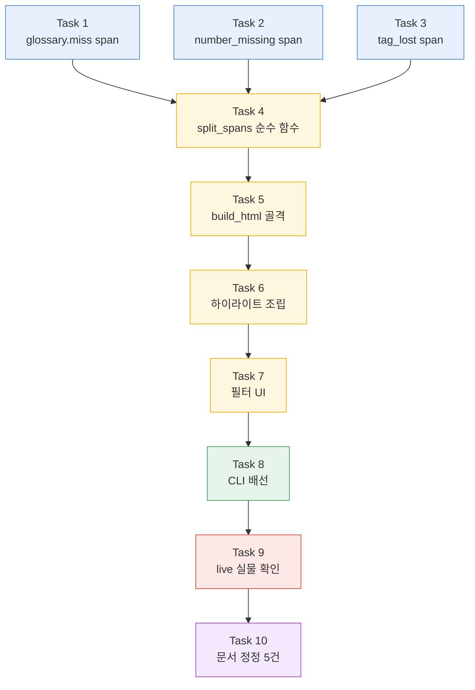
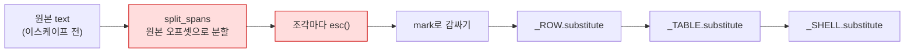

# `report.html` 검수 리포트 구현 계획 (FR-7.3)

> **For agentic workers:** REQUIRED SUB-SKILL: Use superpowers:subagent-driven-development (recommended) or superpowers:executing-plans to implement this plan task-by-task. Steps use checkbox (`- [ ]`) syntax for tracking.

**Goal:** `cuesift translate --review-out DIR --review-format html`이 원문/번역 대조·위험 구간 하이라이트·필터를 갖춘 단일 파일 `report.html`을 낸다.

**Architecture:** 세 부분이다. **A** 수집기 3종(`glossary.miss`·`struct.number_missing`·`struct.tag_lost`)이 판정하는 그 자리에서 `Span`을 함께 낸다. **B** `report/highlight.py`의 순수 함수가 겹치는 구간을 경계점으로 쪼개고, `report/html_report.py`가 `string.Template`으로 HTML을 조립한다. **C** `cli.py`가 `--review-format`으로 요청을 받아 파일을 쓴다. `report/json_report.py`는 **한 줄도 바뀌지 않는다** - 수집기가 span을 내기 시작하면 `review.json`의 `spans`도 함께 채워진다.

**Tech Stack:** Python 3.11+ / 표준 라이브러리만(`string.Template`·`html.escape`·`re`) / typer / pytest

**Spec:** [`docs/superpowers/specs/2026-08-27-report-html-design.md`](../specs/2026-08-27-report-html-design.md)

## Global Constraints

이 절의 제약은 **모든 태스크의 요구사항에 암묵적으로 포함된다.**

| # | 제약 | 값 |
| --- | --- | --- |
| G1 | Python 실행 | `.venv/Scripts/python.exe` - 시스템 Python은 3.14라 다르다 |
| G2 | 모든 모듈 첫 줄 | `from __future__ import annotations` |
| G3 | 독스트링·주석 | **한국어**. 근거 FR·§ 번호 병기 (예: `FR-7.3`, `§6.1`) |
| G4 | ruff | `line-length = 100`, 규칙 `E,F,I,UP,B,SIM` |
| G5 | 커밋 메시지 | **한국어** |
| G6 | 푸시 | **사용자가 명시적으로 요청할 때만.** 커밋과 푸시를 한 명령에 묶지 않는다 |
| G7 | 의존성 | 추가 금지. 런타임 4개(`typer`·`pysubs2`·`pyyaml`·`httpx`), dev 3개(`pytest`·`pytest-cov`·`ruff`) |
| G8 | **em dash(U+2014) 금지** | **콘솔로 출력되는 문자열 리터럴에만** 적용된다. cp949가 인코딩하지 못한다(실측). `·`(U+00B7)는 인코딩되므로 쓴다. **문서(`.md`)와 주석은 무관** |
| G9 | 주석에 적는 것 | "왜 이 값인가"가 아니라 **"이 값이 아니면 무엇이 깨지는가"** |
| G10 | 로컬 게이트 | CI와 **대상이 같아야 한다.** `.` 를 `src tests`로 좁히지 않는다 |
| G11 | 테스트 이름 | **기존 파일을 수정할 때는 그 파일의 관례를 따른다.** `tests/test_signals_*.py`는 영어 스네이크, 신규 파일은 한국어(최근 관례) |
| G12 | 브랜치 | `feat/report-html` (이미 생성됨, 스펙 커밋 `3cdac38`이 있다) |

### 로컬 게이트 5종 (CI에서 옮긴 것 그대로)

```bash
.venv/Scripts/python.exe -m ruff check .
.venv/Scripts/python.exe -m ruff format --check .
.venv/Scripts/python.exe -m pytest --cov=cuesift --cov-report=term-missing
python scripts/check_links.py
npx --yes markdownlint-cli2
```

### 착수 시점 기준선 (2026-08-27 실측)

| 항목 | 값 |
| --- | --- |
| 로컬 pytest | **1270 passed · 3 deselected** |
| 커버리지 | 99% - 2013 문장 중 23 미도달 |
| markdownlint | 32 files · 0 issues |
| 링크 체커 | 32 files · 상대 링크 155개 · 0 broken |

**"통과했나"가 아니라 "무엇을 대상으로 통과했나"를 읽는다.** 태스크마다 이 수치와
비교하고, 줄었으면 멈춘다.

---

## 파일 구조

```text
src/cuesift/
├─ segment/models.py         Span                    무변경
├─ glossary/__init__.py      term_offsets()          함수 1개 추가        ← Task 1
├─ signals/
│  ├─ derived.py             GlossaryMiss.collect    spans 추가           ← Task 1
│  └─ structural.py          _number_matches()       함수 1개 추가        ← Task 2
│                            NumberMissing.collect   spans 추가           ← Task 2
│                            _tag_matches()          함수 1개 추가        ← Task 3
│                            TagLost.collect         spans 추가           ← Task 3
└─ report/
   ├─ models.py              TriageOutcome           무변경
   ├─ json_report.py         build_review            무변경 ★
   ├─ highlight.py           Fragment · split_spans  신규 파일            ← Task 4
   └─ html_report.py         build_html · write_html 신규 파일            ← Task 5·6·7

src/cuesift/cli.py           ReviewFormat · _report_path · 배선           ← Task 8

tests/
├─ test_glossary.py          term_offsets                                 ← Task 1
├─ test_signals_derived.py   GlossaryMiss span                            ← Task 1
├─ test_signals_structural.py NumberMissing · TagLost span                ← Task 2·3
├─ test_report_highlight.py  split_spans                    신규 파일     ← Task 4
├─ test_report_html.py       build_html                     신규 파일     ← Task 5·6·7
└─ test_cli_report_html.py   --review-format                신규 파일     ← Task 8
```

★ `json_report.py`가 무변경인 것이 **설계의 자기검증 지점이다**(스펙 §4).
손대야 한다면 "두 산출물이 한 원천에서 나온다"는 전제가 틀렸다는 신호다.

## 태스크 지도



Task 1~3은 서로 독립이라 순서를 바꿔도 된다. Task 4부터는 선행이 있다.

---

## Task 1: `glossary.miss`가 원문 구간을 낸다

**Files:**

- Modify: `src/cuesift/glossary/__init__.py` (`_contains_term` 아래에 함수 1개 추가)
- Modify: `src/cuesift/signals/derived.py:105-127` (`GlossaryMiss.collect`)
- Test: `tests/test_glossary.py` · `tests/test_signals_derived.py`

**Interfaces:**

- Consumes: 없음 (첫 태스크)
- Produces:
  - `cuesift.glossary.term_offsets(text: str, term: str) -> list[tuple[int, int]]`
  - `GlossaryMiss.collect()`가 `Signal.spans`에 `Span(start, end, side="source")`를 채운다

### 배경 - 왜 `lower()`가 아니라 `IGNORECASE`인가

현재 판정은 이렇다.

```python
# src/cuesift/glossary/__init__.py:77-86 (현재 코드)
def violations(self, source_text: str, target_text: str) -> list[GlossaryEntry]:
    """원문에 등장하는 용어 중 번역문에 대응어가 없는 것들."""
    lowered_target = target_text.lower()
    lowered_source = source_text.lower()
    return [
        entry
        for entry in self.entries
        if _contains_term(lowered_source, entry.source.lower())
        and not any(_contains_term(lowered_target, t.lower()) for t in entry.targets)
    ]
```

**`lower()`한 문자열에서 오프셋을 얻으면 원본과 어긋날 수 있다.** `str.lower()`는
대부분 길이를 보존하지만 항상은 아니다 - 실측: `len('İ') == 1`, `len('İ'.lower()) == 2`
(U+0130이 `i` + U+0307 결합 문자로 분해된다). 그 뒤 모든 오프셋이 1씩 밀린다.

그래서 `term_offsets`는 **원본 문자열에 `re.IGNORECASE`를 적용한다.** 오프셋이
원본 기준이라 어긋날 자리가 없다.

- [ ] **Step 1: `term_offsets`의 실패 테스트를 쓴다**

`tests/test_glossary.py` 끝에 추가한다. **이 파일의 기존 테스트 이름 관례를 먼저
확인하고 따른다**(G11).

```python
def test_term_offsets_finds_all_occurrences() -> None:
    """같은 용어가 여러 번 나오면 모두 찾는다."""
    assert term_offsets("open source and open source", "open source") == [(0, 11), (16, 27)]


def test_term_offsets_is_case_insensitive_but_keeps_original_offsets() -> None:
    """대소문자를 무시하되 오프셋은 **원본 기준**이다 (FR-7.3 · 설계 D7)."""
    text = "OpenSource is here"
    assert term_offsets(text, "opensource") == [(0, 10)]
    assert text[0:10] == "OpenSource"


def test_term_offsets_respects_the_same_word_boundary_as_the_judgement() -> None:
    """`_contains_term`과 같은 경계 규칙을 쓴다.

    ASCII 영숫자에 둘러싸인 것은 매치가 아니다. 규칙이 갈리면 위반으로 잡은
    용어의 위치를 못 찾아 하이라이트가 조용히 빈다.
    """
    assert term_offsets("opensourceX is not a match", "opensource") == []


def test_term_offsets_does_not_apply_boundary_to_cjk() -> None:
    """CJK에는 경계를 적용하지 않는다.

    `\\b`가 CJK를 전부 깨뜨린 전례가 있다(CLAUDE.md). 한국어는 조사가 붙으므로
    `오픈소스를`에서 `오픈소스`를 찾아야 한다.
    """
    assert term_offsets("오픈소스를 쓴다", "오픈소스") == [(0, 4)]


def test_term_offsets_returns_positions_in_ascending_order() -> None:
    """위치 순으로 낸다 (설계 D9 - review.json 배열 순서의 재현성)."""
    offsets = term_offsets("a term b term c term", "term")
    assert offsets == sorted(offsets)
```

`tests/test_glossary.py`의 import에 `term_offsets`를 더한다.

- [ ] **Step 2: 실패를 확인한다**

```bash
.venv/Scripts/python.exe -m pytest tests/test_glossary.py -k term_offsets -v
```

Expected: 5개 모두 FAIL - `ImportError: cannot import name 'term_offsets'`

- [ ] **Step 3: `term_offsets`를 구현한다**

`src/cuesift/glossary/__init__.py`의 `_contains_term` **바로 아래**에 넣는다.
함께 바뀌는 것이라 함께 둔다.

```python
def term_offsets(text: str, term: str) -> list[tuple[int, int]]:
    """`text`에서 `term`이 등장하는 모든 구간. FR-7.3 하이라이트의 입력이다.

    **`_contains_term`과 같은 `_BOUNDARY`를 쓴다.** 규칙이 갈리면 위반으로
    잡은 용어의 위치를 못 찾아 하이라이트가 조용히 빈다 - 검수자는 칠해지지
    않은 것을 "문제 없음"으로 읽는다.

    **`lower()`한 문자열이 아니라 원본에 `IGNORECASE`를 건다.** `str.lower()`는
    길이를 보존하지 않는 경우가 있고(실측: `len('İ')==1`, `len('İ'.lower())==2`)
    그 뒤 모든 오프셋이 밀린다. 판정(`violations`)은 `lower()`를 써도 되지만
    **오프셋은 원본 기준이어야 한다**(설계 D7).

    반환은 **위치 오름차순**이다 - `review.json`에 배열로 직렬화되므로 순서가
    비결정적이면 같은 입력이 다른 파일을 낸다(NFR-3 · 설계 D9).
    """
    pattern = _BOUNDARY.format(re.escape(term))
    return [(m.start(), m.end()) for m in re.finditer(pattern, text, re.IGNORECASE)]
```

`__all__`이 있다면 `term_offsets`를 더한다.

- [ ] **Step 4: 통과를 확인한다**

```bash
.venv/Scripts/python.exe -m pytest tests/test_glossary.py -v
```

Expected: 새 테스트 5개 PASS, 기존 테스트도 전부 PASS

- [ ] **Step 5: `GlossaryMiss`의 실패 테스트를 쓴다**

`tests/test_signals_derived.py`에 추가한다. **이 파일의 이름 관례를 확인하고
따른다**(G11).

```python
def test_glossary_miss_marks_the_term_position_in_the_source(ctx_with_glossary):
    """위반 용어의 원문 위치를 span으로 낸다 (FR-7.3)."""
    seg = _seg("오픈소스 프로젝트다", "It is a project")
    sig = GlossaryMiss().collect(seg, ctx_with_glossary)

    assert sig is not None
    assert len(sig.spans) == 1
    span = sig.spans[0]
    assert span.side == "source"
    assert seg.source_text[span.start : span.end] == "오픈소스"


def test_glossary_miss_span_side_is_source_because_the_term_is_absent_in_target(
    ctx_with_glossary,
):
    """번역문에 **없으므로** 원문을 가리킨다 (`segment/models.py`의 Span 독스트링)."""
    sig = GlossaryMiss().collect(_seg("오픈소스다", "It is"), ctx_with_glossary)
    assert sig is not None
    assert all(s.side == "source" for s in sig.spans)


def test_glossary_miss_spans_cover_every_occurrence(ctx_with_glossary):
    """같은 용어가 두 번 나오면 span도 두 개다."""
    seg = _seg("오픈소스와 오픈소스", "It and it")
    sig = GlossaryMiss().collect(seg, ctx_with_glossary)
    assert sig is not None
    assert len(sig.spans) == 2


def test_glossary_miss_span_count_matches_the_judgement(ctx_with_glossary):
    """**위반으로 잡힌 용어는 반드시 위치를 갖는다.**

    판정(`violations`)과 위치(`term_offsets`)가 서로 다른 규칙을 쓰면 이
    단언이 깨진다. 그 어긋남은 하이라이트가 조용히 비는 것으로만 드러나므로
    여기서 고정한다.
    """
    seg = _seg("오픈소스 프로젝트다", "It is a project")
    sig = GlossaryMiss().collect(seg, ctx_with_glossary)
    assert sig is not None
    assert len(sig.detail["terms"]) >= 1
    assert len(sig.spans) >= len(sig.detail["terms"])
```

`ctx_with_glossary` fixture가 이 파일에 없으면 만든다. 기존 `ctx` fixture 옆에 둔다.

```python
@pytest.fixture
def ctx_with_glossary():
    """`오픈소스` -> `open source` 하나만 담은 용어집."""
    return SignalContext(
        profile=load_builtin("en"),
        glossary=Glossary(entries=(GlossaryEntry(source="오픈소스", targets=("open source",)),)),
        source_lang="ko",
        target_lang="en",
    )
```

- [ ] **Step 6: 실패를 확인한다**

```bash
.venv/Scripts/python.exe -m pytest tests/test_signals_derived.py -k glossary_miss -v
```

Expected: 새 테스트 4개 FAIL - `assert len(sig.spans) == 1` 에서 `0 == 1`
(현재 `spans`가 언제나 빈 튜플이다)

**이 실패를 눈으로 확인하는 것이 이 태스크의 핵심이다.** 스펙 §3.1이 발견한
공백이 바로 여기다.

- [ ] **Step 7: `GlossaryMiss.collect`에 spans를 더한다**

`src/cuesift/signals/derived.py`의 `GlossaryMiss.collect`를 이렇게 바꾼다.

```python
    def collect(self, seg: Segment, ctx: SignalContext) -> Signal | None:
        # 용어집이 없거나 비었으면 판정하지 않는다. 0점 신호를 내면
        # "검사했고 통과"로 읽혀 용어집 누락이 숨는다.
        if ctx.glossary is None or ctx.glossary.is_empty or not seg.target_text:
            return None

        hits = ctx.glossary.violations(seg.source_text, seg.target_text)
        if not hits:
            return None

        # 위반 용어가 원문에서 차지하는 구간. FR-7.3 리포트가 여기를 칠한다.
        #
        # **번역문이 아니라 원문을 가리킨다** - 이 신호는 "번역문에 대응어가
        # 없다"는 판정이라 번역문에는 칠할 것이 없다(`Span` 독스트링).
        #
        # **위치 순으로 정렬한다.** `hits`는 용어집 등재 순이고(`violations`가
        # 그 순서를 유지한다) 용어 여럿의 구간이 섞이면 순서가 뒤엉킨다.
        # `review.json`에 배열로 직렬화되므로 순서가 비결정적이면 같은 입력이
        # 다른 파일을 낸다(NFR-3 · 설계 D9).
        offsets = sorted(
            offset for entry in hits for offset in term_offsets(seg.source_text, entry.source)
        )

        return Signal(
            name=self.name,
            tier=0,
            score=_violation_score(len(hits)),
            hard_fail=False,
            spans=tuple(Span(start=s, end=e, side="source") for s, e in offsets),
            detail={"terms": [e.source for e in hits]},
        )
```

import를 더한다.

```python
from cuesift.glossary import term_offsets
from cuesift.segment import Span
```

**`cuesift.segment`가 `Span`을 내보내는지 확인한다.** 안 하면
`from cuesift.segment.models import Span`을 쓴다.

- [ ] **Step 8: 통과를 확인한다**

```bash
.venv/Scripts/python.exe -m pytest tests/test_signals_derived.py tests/test_glossary.py -v
```

Expected: 전부 PASS

- [ ] **Step 9: 전체 게이트를 돌린다**

```bash
.venv/Scripts/python.exe -m ruff check .
.venv/Scripts/python.exe -m ruff format --check .
.venv/Scripts/python.exe -m pytest --cov=cuesift --cov-report=term-missing
```

Expected: **1279 passed · 3 deselected** (기준선 1270 + 새 테스트 9개).
**개수를 읽는다** - 줄었으면 멈추고 원인을 찾는다.

- [ ] **Step 10: 커밋한다**

```bash
git add src/cuesift/glossary/__init__.py src/cuesift/signals/derived.py tests/test_glossary.py tests/test_signals_derived.py
git commit -m "기능: glossary.miss가 원문의 용어 구간을 낸다 (FR-7.3)"
```

---

## Task 2: `struct.number_missing`이 원문 구간을 낸다

**Files:**

- Modify: `src/cuesift/signals/structural.py:98-119` (`_numbers`) · `:201-231` (`NumberMissing.collect`)
- Test: `tests/test_signals_structural.py`

**Interfaces:**

- Consumes: 없음 (Task 1과 독립)
- Produces:
  - `_number_matches(text: str) -> list[tuple[str, int, int]]` - (정규화된 값, start, end)
  - `NumberMissing.collect()`가 `Signal.spans`에 `Span(start, end, side="source")`를 채운다

### 배경 - `detail`의 값으로는 위치를 되찾을 수 없다

`_numbers()`는 **추출한 뒤 NFKC 정규화하고 천 단위 구분자를 제거한다.**

| 원문 | `detail["missing"]` | `source_text.find(값)` |
| --- | --- | --- |
| `５０` (전각) | `"50"` | **-1** |
| `1,000` | `"1000"` | **-1** |

그래서 렌더러가 값으로 위치를 되찾는 방식은 불가능하다(스펙 §3.4).
**매치 객체가 이미 오프셋을 갖고 있으므로 그 자리에서 함께 낸다**(설계 D8).

- [ ] **Step 1: 실패 테스트를 쓴다**

`tests/test_signals_structural.py`의 `NumberMissing` 절에 추가한다.
**이 파일은 영어 스네이크 관례다**(G11).

```python
def test_number_missing_marks_the_number_position_in_the_source(ctx):
    """누락된 숫자의 원문 위치를 span으로 낸다 (FR-7.3)."""
    seg = _seg("2024년에 시작했다", "It started")
    sig = NumberMissing().collect(seg, ctx)

    assert sig is not None
    assert len(sig.spans) == 1
    span = sig.spans[0]
    assert span.side == "source"
    assert seg.source_text[span.start : span.end] == "2024"


def test_number_missing_span_uses_pre_normalization_offsets(ctx_ja):
    """**정규화 전 위치**를 낸다.

    `_numbers`는 추출 후 NFKC 정규화하므로 `detail`의 값은 `"50"`이지만
    원문은 전각 `５０`이다. 값으로 되찾으면 `find`가 -1을 내고 하이라이트가
    조용히 빈다(스펙 §3.4). 오프셋은 원본 문자열 기준이어야 한다.
    """
    seg = _seg("５０개가 있다", "There are some")
    sig = NumberMissing().collect(seg, ctx_ja)

    assert sig is not None
    assert sig.detail["missing"] == ["50"]
    span = sig.spans[0]
    assert seg.source_text[span.start : span.end] == "５０"


def test_number_missing_span_covers_the_thousands_separator(ctx):
    """천 단위 구분자를 포함한 원문 표기 전체를 덮는다.

    `detail`의 값은 `"1000"`이지만 원문은 `1,000`이다. 구간은 원문 표기를
    가리켜야 검수자가 그 자리를 본다.
    """
    seg = _seg("1,000명이 왔다", "People came")
    sig = NumberMissing().collect(seg, ctx)

    assert sig is not None
    span = sig.spans[0]
    assert seg.source_text[span.start : span.end] == "1,000"


def test_number_missing_spans_only_cover_missing_numbers(ctx):
    """번역문에 있는 숫자는 칠하지 않는다.

    span 개수가 `detail["missing"]` 개수와 같아야 한다. 전부 칠하면 정상
    번역된 숫자까지 위험 구간으로 보인다.
    """
    seg = _seg("2024년 3개", "3 items in 2024")
    sig = NumberMissing().collect(seg, ctx)
    assert sig is None  # 둘 다 번역문에 있다


def test_number_missing_span_count_matches_detail(ctx):
    """span 개수와 `missing` 개수가 일치한다."""
    seg = _seg("2024년과 1999년", "Some years")
    sig = NumberMissing().collect(seg, ctx)

    assert sig is not None
    assert len(sig.spans) == len(sig.detail["missing"]) == 2
```

- [ ] **Step 2: 실패를 확인한다**

```bash
.venv/Scripts/python.exe -m pytest tests/test_signals_structural.py -k number_missing -v
```

Expected: 새 테스트 4개 FAIL(`len(sig.spans) == 1`이 `0 == 1`),
`test_number_missing_spans_only_cover_missing_numbers`는 PASS(기존 동작)

- [ ] **Step 3: `_number_matches`를 만들고 `_numbers`를 그 위에 얹는다**

`src/cuesift/signals/structural.py`의 `_numbers`를 이렇게 바꾼다.
**독스트링의 기존 내용은 한 글자도 지우지 않는다** - 정규화 순서의 근거가
거기 있다.

```python
def _number_matches(text: str) -> list[tuple[str, int, int]]:
    """텍스트의 숫자를 (정규화된 값, 시작, 끝)으로 뽑는다.

    **오프셋은 정규화 전 원본 기준이다.** 값은 NFKC 정규화와 천 단위 구분자
    제거를 거치므로 원문 표기와 다르다(`５０` -> `50`, `1,000` -> `1000`).
    값으로 원문 위치를 되찾으면 `str.find`가 -1을 내고 **예외 없이**
    하이라이트만 빈다 - 검수자는 칠해지지 않은 것을 "문제 없음"으로 읽는다
    (FR-7.3 · 설계 D8).

    `_numbers`가 이 함수 위에 얹혀 있어 **추출 규칙이 하나다.** 둘로 갈리면
    판정한 숫자와 칠하는 숫자가 어긋난다.
    """
    return [
        (unicodedata.normalize("NFKC", m.group()).replace(",", ""), m.start(), m.end())
        for m in _NUMBER.finditer(text)
    ]


def _numbers(text: str) -> list[str]:
    """텍스트의 숫자를 천 단위 구분자를 제거하고 NFKC 정규화해 뽑는다.

    **정규화하지 않으면 전각과 반각이 다른 수가 된다** - `'５０' != '50'`이라
    일본어 자막의 정상 번역이 누락으로 판정되고, 두 자리 이상이라
    `multi_digit`에 걸려 hard fail이 난다. hard fail은 검수 예산을
    우회하므로(FR-6.2) 이 오탐이 실제 검수 비율을 부풀려 §9.1의 배수를
    파괴한다. ja-ko 자연 오탐 41건 중 13건(31.7%)이 이 경로였다.

    **추출한 뒤에 정규화한다.** 텍스트 전체를 먼저 정규화하면 `½`(U+00BD,
    카테고리 No)가 `1⁄2`가 되어 **원문에 없던 숫자 1과 2가 생긴다.**
    `\\d`는 카테고리 Nd만 잡으므로 추출 후 정규화는 그 경로를 열지 않는다.

    **한계**: 한자 수사(`十代`)는 NFKC의 대상이 아니라 여전히 미탐이다.
    아라비아 매핑에는 파서가 필요하고 `十分に`(≠ 10분)·`万一`(≠ 10001) 같은
    관용구에서 hard fail 신호에 새 오탐을 만든다.
    """
    return [value for value, _, _ in _number_matches(text)]
```

- [ ] **Step 4: `NumberMissing.collect`에 spans를 더한다**

```python
    def collect(self, seg: Segment, ctx: SignalContext) -> Signal | None:
        source_matches = _number_matches(seg.source_text)
        if not source_matches:
            return None

        target_numbers = set(_numbers(seg.target_text or ""))
        missing = [(v, s, e) for v, s, e in source_matches if v not in target_numbers]
        if not missing:
            return None

        # 누락된 것이 전부 한 자리 수면 hard fail을 해제한다.
        #
        # 영어 자막 스타일가이드는 한 자리 수를 단어로 적게 한다("three").
        # 이것을 hard fail로 두면 정상 번역이 검수 예산을 우회해 큐에 쌓여
        # §9.1의 배수가 무의미해진다. 신호 자체는 남겨 소프트 위험으로 둔다.
        #
        # 두 자리 이상(연도·금액·시각)은 단어로 적는 일이 거의 없으므로
        # hard fail을 유지한다.
        multi_digit = any(len(v) > 1 for v, _, _ in missing)

        # **누락된 것만 칠한다.** 전부 칠하면 정상 번역된 숫자까지 위험
        # 구간으로 보여 검수자가 헛짚는다. `finditer` 순서가 곧 위치 순이라
        # 정렬이 필요 없다(설계 D9).
        return Signal(
            name=self.name,
            tier=0,
            score=1.0 if multi_digit else 0.5,
            hard_fail=multi_digit,
            spans=tuple(Span(start=s, end=e, side="source") for _, s, e in missing),
            detail={"missing": [v for v, _, _ in missing]},
        )
```

`Span` import를 파일 상단에 더한다.

- [ ] **Step 5: 통과를 확인한다**

```bash
.venv/Scripts/python.exe -m pytest tests/test_signals_structural.py -v
```

Expected: 전부 PASS. **기존 `NumberMissing` 테스트가 하나도 깨지지 않아야 한다** -
`_numbers`의 반환 계약을 바꾸지 않았기 때문이다.

- [ ] **Step 6: 전체 게이트를 돌린다**

```bash
.venv/Scripts/python.exe -m ruff check .
.venv/Scripts/python.exe -m ruff format --check .
.venv/Scripts/python.exe -m pytest --cov=cuesift --cov-report=term-missing
```

Expected: **1284 passed · 3 deselected** (1279 + 5)

- [ ] **Step 7: 커밋한다**

```bash
git add src/cuesift/signals/structural.py tests/test_signals_structural.py
git commit -m "기능: struct.number_missing이 원문의 숫자 구간을 낸다 (FR-7.3)"
```

### 구현 중 바뀐 결정 — **위 코드 블록보다 이 절이 최신이다**

세 가지가 계획과 달라졌다. 앞의 Step 1 테스트 코드를 그대로 복사하면 ①이 되돌아온다.

| # | 계획 | 실제 | 왜 |
| --- | --- | --- | --- |
| ① | `test_number_missing_spans_only_cover_missing_numbers`가 `_seg("2024년 3개", "3 items in 2024")` → `assert sig is None` | 입력을 `_seg("3시 15분 20초", "3 minutes 15")`로 바꾸고 `len(spans) == 1` · `source_text[span] == "20"`을 단언 | **계획판은 `spans`를 한 번도 보지 않아 게이트가 아니었다.** `spans=... for _, s, e in missing`을 `source_matches`로 바꾼 변이가 **생존**했다(리뷰 실측: 변이 후에도 40 passed). 판정은 맞고 하이라이트만 틀린 상태라 `detail`만 보는 단언으로는 영원히 안 잡힌다 |
| ② | `_number_matches`가 `(값, m.start(), m.end())`를 낸다 | 끝을 `m.start() + len(m.group().rstrip(","))`로 낸다 | `_NUMBER`의 `[\d,]*`가 `"3, 4"`에서 `"3,"`까지 먹는다. 값은 쉼표를 지워 `"3"`이 되므로 **`detail`이 말하는 것과 칠해지는 것이 어긋난다.** 값 계산은 그대로라 판정은 불변이다 |
| ③ | 테스트 5개 · 게이트 1284 | 테스트 **6개** · 게이트 **1286** | ②의 회귀 테스트가 하나 늘었고, Task 1이 계획(+9)보다 하나 많은 +10을 남겨 베이스라인이 1280이었다 |

**게이트 수치는 계획서의 산술이 아니라 직전 커밋에서 실측한다.** ③이 그 사례다.

### 미결로 남긴 것 — 전각 콤마 (이번 커밋 범위 밖)

`１，２３４`가 `['1', '234']`로 갈라져 **hard fail 오탐**이 난다. NFKC 정규화가
추출 **뒤**에 오는데 `[\d,]`는 ASCII 쉼표만 보기 때문이다. ja 자막에서 전각 콤마는
실재하고, hard fail은 검수 예산을 우회하므로(FR-6.2) 이 오탐은 §9.1의 배수를
직접 깎는다.

**Task 2에서 고치지 않은 이유**는 이것이 `spans`가 아니라 **판정을 바꾸기** 때문이다.
Task 2의 제약은 "값 계산을 건드리지 않는다"였고 그것을 21,574 입력으로 증명했다.
전각 콤마 수정은 그 증명을 무효화하므로 **ja 벤치 실측을 동반한 자기 사이클**이
필요하다 — `_NUMBER`를 고칠지, 추출 직전에 쉼표류만 선별 정규화할지가 갈린다.
(후자는 `½` → `1⁄2` 경로를 열지 않아야 한다 — `_numbers` 독스트링 참고.)

---

## Task 3: `struct.tag_lost`가 태그 구간을 낸다

**Files:**

- Modify: `src/cuesift/signals/structural.py:120-127` (`_tag_names`) · `:235-256` (`TagLost.collect`)
- Test: `tests/test_signals_structural.py`

**Interfaces:**

- Consumes: 없음 (Task 1·2와 독립)
- Produces:
  - `_tag_matches(text: str) -> list[tuple[str, int, int]]` - (정규화된 이름, start, end)
  - `TagLost.collect()`가 `Signal.spans`를 채운다. **side가 둘 다 나온다**

### 배경 - 이 신호만 `side`가 갈린다

`TagLost`는 두 방향의 불일치를 함께 잡는다.

| 상황 | 어디를 칠하나 | `side` |
| --- | --- | --- |
| 원문에 있는 태그가 번역문에 부족하다 | 원문의 그 태그 | `"source"` |
| 번역문에만 있는 태그가 생겼다 (LLM이 서식을 지어냈다) | 번역문의 그 태그 | `"target"` |

**이것이 `Span.side`가 존재하는 이유의 실물이다.** 다른 두 신호는 언제나
`"source"`지만 이 신호는 갈린다.

- [ ] **Step 1: 실패 테스트를 쓴다**

```python
def test_tag_lost_marks_the_missing_tag_in_the_source(ctx):
    """번역문에서 사라진 태그의 **원문** 위치를 칠한다 (FR-7.3)."""
    seg = _seg("This is <i>important</i>", "이것은 중요하다")
    sig = TagLost().collect(seg, ctx)

    assert sig is not None
    source_spans = [s for s in sig.spans if s.side == "source"]
    assert len(source_spans) == 2  # <i> 와 </i>
    assert seg.source_text[source_spans[0].start : source_spans[0].end] == "<i>"


def test_tag_lost_marks_the_invented_tag_in_the_target(ctx):
    """번역문에만 생긴 태그는 **번역문** 위치를 칠한다.

    LLM이 서식을 지어내는 사고가 있다(`TagLost` 주석). 그때 원문에는 칠할
    것이 없으므로 side가 target이어야 한다.
    """
    seg = _seg("This is important", "이것은 <b>중요하다</b>")
    sig = TagLost().collect(seg, ctx)

    assert sig is not None
    target_spans = [s for s in sig.spans if s.side == "target"]
    assert len(target_spans) == 2
    assert seg.target_text[target_spans[0].start : target_spans[0].end] == "<b>"


def test_tag_lost_span_side_splits_in_both_directions(ctx):
    """양쪽이 동시에 어긋나면 span도 양쪽에 생긴다."""
    seg = _seg("<i>A</i>", "<b>B</b>")
    sig = TagLost().collect(seg, ctx)

    assert sig is not None
    assert {s.side for s in sig.spans} == {"source", "target"}


def test_tag_lost_ignores_attributes_when_locating(ctx):
    """속성이 있어도 태그 전체를 덮는다.

    `_TAG`가 `[^>]*?/?>`로 속성을 삼키므로 구간은 `<font color="red">`
    전체다. 이름만 덮으면 검수자가 어디까지가 그 태그인지 못 본다.
    """
    seg = _seg('<font color="red">A</font>', "A")
    sig = TagLost().collect(seg, ctx)

    assert sig is not None
    first = [s for s in sig.spans if s.side == "source"][0]
    assert seg.source_text[first.start : first.end] == '<font color="red">'


def test_tag_lost_silent_when_tags_match(ctx):
    """일치하면 신호가 없고 span도 없다."""
    assert TagLost().collect(_seg("<i>A</i>", "<i>가</i>"), ctx) is None
```

- [ ] **Step 2: 실패를 확인한다**

```bash
.venv/Scripts/python.exe -m pytest tests/test_signals_structural.py -k tag_lost -v
```

Expected: 새 테스트 4개 FAIL, `test_tag_lost_silent_when_tags_match`는 PASS

- [ ] **Step 3: `_tag_matches`를 만들고 `_tag_names`를 그 위에 얹는다**

```python
def _tag_matches(text: str) -> list[tuple[str, int, int]]:
    """텍스트의 태그를 (정규화된 이름, 시작, 끝)으로 뽑는다.

    이름 정규화는 `_tag_names`와 **같다** - 닫는 태그는 `/` 접두어, 소문자.
    규칙이 갈리면 손실로 센 태그와 칠하는 태그가 어긋난다.

    구간은 **태그 전체**다(`<font color="red">`). 이름만 덮으면 검수자가
    어디까지가 그 태그인지 못 본다(FR-7.3).
    """
    return [
        (
            ("/" if m.group(0).startswith("</") else "") + m.group(1).lower(),
            m.start(),
            m.end(),
        )
        for m in _TAG.finditer(text)
    ]


def _tag_names(text: str) -> Counter[str]:
    """텍스트의 태그를 이름 기준으로 센다. 닫는 태그는 `/` 접두어로 구분한다."""
    return Counter(name for name, _, _ in _tag_matches(text))
```

- [ ] **Step 4: `TagLost.collect`에 spans를 더한다**

```python
    def collect(self, seg: Segment, ctx: SignalContext) -> Signal | None:
        source_matches = _tag_matches(seg.source_text)
        target_matches = _tag_matches(seg.target_text or "")
        source_tags = Counter(name for name, _, _ in source_matches)
        target_tags = Counter(name for name, _, _ in target_matches)
        if source_tags == target_tags:
            return None

        # 없던 태그가 생긴 것도 불일치다. LLM이 서식을 지어내는 사고가 있다.
        #
        # **양방향을 각각 칠한다** - 원문에서 사라진 것은 원문을, 번역문에만
        # 생긴 것은 번역문을 가리킨다. 이 신호가 `Span.side`가 존재하는 이유의
        # 실물이다(FR-7.3 · `Span` 독스트링).
        #
        # `Counter` 뺄셈은 음수를 버리므로 "부족한 만큼"만 남는다. 개수가
        # 아니라 **이름 집합**으로 칠하는 이유는, 같은 이름이 3개 중 1개만
        # 사라졌을 때 어느 것이 사라졌는지 알 방법이 없기 때문이다 -
        # 그 이름의 태그를 모두 칠해 검수자가 세게 한다.
        lost = set(source_tags - target_tags)
        invented = set(target_tags - source_tags)

        spans = [
            Span(start=s, end=e, side="source") for name, s, e in source_matches if name in lost
        ]
        spans += [
            Span(start=s, end=e, side="target") for name, s, e in target_matches if name in invented
        ]

        return Signal(
            name=self.name,
            tier=0,
            score=1.0,
            hard_fail=True,
            spans=tuple(spans),
            detail={"source": dict(source_tags), "target": dict(target_tags)},
        )
```

- [ ] **Step 5: 통과를 확인한다**

```bash
.venv/Scripts/python.exe -m pytest tests/test_signals_structural.py -v
```

Expected: 전부 PASS

- [ ] **Step 6: `review.json`이 spans를 싣는지 확인한다**

**이 스텝이 스펙 §4의 자기검증이다.** `json_report.py`를 한 줄도 안 고쳤는데
`spans`가 채워져야 한다.

```bash
.venv/Scripts/python.exe -m pytest tests/test_report_json.py -v
```

Expected: 전부 PASS (기존 테스트가 손으로 만든 `Span`을 쓰므로 이미 통과한다)

`tests/test_report_json.py`에 확인 테스트를 하나 더한다.
**이 파일은 한국어 이름 관례다**(G11).

```python
def test_수집기가_낸_spans가_리포트에_그대로_실린다() -> None:
    """`json_report.py`를 고치지 않아도 spans가 채워진다 (설계 §4).

    손대야 한다면 "두 산출물이 한 원천에서 나온다"는 전제가 틀렸다는 신호다.
    """
    seg = Segment(
        id="s1", index=0, start_ms=0, end_ms=1000,
        source_text="This is <i>A</i>", target_text="이것은 A",
    )
    sig = TagLost().collect(seg, SignalContext(
        profile=load_builtin("en"), glossary=None, source_lang="ko", target_lang="en",
    ))
    assert sig is not None and sig.spans

    doc = _signal_doc(sig)
    assert len(doc["spans"]) == len(sig.spans)
    assert doc["spans"][0]["side"] in ("source", "target")
```

- [ ] **Step 7: 전체 게이트를 돌린다**

```bash
.venv/Scripts/python.exe -m ruff check .
.venv/Scripts/python.exe -m ruff format --check .
.venv/Scripts/python.exe -m pytest --cov=cuesift --cov-report=term-missing
```

Expected: **1290 passed · 3 deselected** (1284 + 6)

- [ ] **Step 8: 커밋한다**

```bash
git add src/cuesift/signals/structural.py tests/test_signals_structural.py tests/test_report_json.py
git commit -m "기능: struct.tag_lost가 양쪽 태그 구간을 낸다 (FR-7.3)"
```

---

### 구현 중 바뀐 결정 — **위 코드 블록보다 이 절이 최신이다**

구현 코드(Step 3·4)는 계획 그대로다. **바뀐 것은 전부 테스트 쪽이다.**

| # | 계획 | 실제 | 왜 |
| --- | --- | --- | --- |
| ① | 테스트 5개 | **7개** — `spans_skip_the_tags_that_survived`(source)와 `target_spans_skip_the_tags_that_were_kept`(target)를 더했다 | **계획판 5개는 `lost`/`invented` 필터를 한 번도 재지 않는다.** 제안된 입력이 전부 "모든 태그가 손실" 또는 "모든 태그가 신규"라, 필터를 지우고 **전부 칠하는** 변이가 5개를 모두 통과한다. Task 2의 ①과 같은 형태다 — 판정은 맞고 하이라이트만 틀린 상태 |
| ② | `test_tag_lost_silent_when_tags_match` 추가 | **넣지 않았다** | `tests/test_signals_structural.py`의 `test_tag_lost_silent_when_markup_is_preserved`와 입력만 다른 동일 테스트다 |
| ③ | `_signal_doc(sig)`를 직접 호출 | `build_review` 경유 | `_signal_doc`은 사설 심볼이고 `test_report_json.py`가 임포트하지 않는다. 기존 `test_spans가_side와_함께_실린다`와 같은 경로를 쓴다 |
| ④ | 게이트 1290 | **1294** | 베이스라인이 1284가 아니라 **1286**이었다(Task 2가 +2를 더 남겼다). 1286 + 7 + 1 |

**`Span.side`의 대칭은 테스트도 대칭이어야 산다.** ①의 두 테스트가 그렇다 —
source 쪽만 걸었을 때 `invented` 필터 변이가 **실제로 생존했다**(아래 M2).

#### 변이 실측 — 게이트가 무엇을 잡는가

`git worktree` + `PYTHONPATH` 강제로 4종을 겨눴다(절차는 메모리
`mutation-testing-needs-pythonpath-override`).

| 변이 | 결과 | 살해자 |
| --- | --- | --- |
| M1 `lost` 필터 제거 (원문 전부 칠하기) | **단독 격추** | `spans_skip_the_tags_that_survived` |
| M2 `invented` 필터 제거 (번역문 전부 칠하기) | **단독 격추** | `target_spans_skip_the_tags_that_were_kept` |
| M3 `side="source"` → `"target"` 고정 | 격추 (5) | `marks_the_missing_tag_in_the_source` 외 |
| M4 구간을 태그 **이름만** 덮게 축소 | 격추 (5) | `ignores_attributes_when_locating` 외 |

M1·M2가 **단독** 격추라는 것이 ①의 근거다. 두 테스트를 빼면 그 자리에 게이트가 없다.

---

## Task 4: `split_spans` - 겹치는 구간을 평평하게 쪼갠다

**Files:**

- Create: `src/cuesift/report/highlight.py`
- Modify: `src/cuesift/report/__init__.py` (내보내기)
- Test: `tests/test_report_highlight.py` (신규)

**Interfaces:**

- Consumes: `cuesift.segment.Span` (Task 1~3이 채운 것, 그러나 이 함수는 그 사실을 모른다)
- Produces:
  - `Fragment(text: str, signals: tuple[str, ...])` - frozen dataclass
  - `split_spans(text: str, spans: Sequence[tuple[str, Span]]) -> list[Fragment]`

### 배경 - 왜 중첩이 아니라 분할인가

구간이 **교차**하면 중첩 태그로는 유효한 HTML을 만들 수 없다.

```text
A = [0, 5)   B = [3, 8)

중첩 시도:  <mA>012<mB>34</mA>567</mB>
                          ^^^^^      ^^^^^
                          A가 B 안에서 닫힌다 - 유효하지 않다

분할:      경계점 {0, 3, 5, 8} -> 조각 4개, 전부 형제
           [0,3){A}  [3,5){A,B}  [5,8){B}  [8,len){}
```

**HTML을 모르는 순수 함수로 둔다.** 겹침·교차·인접·빈 구간·경계값을 문자열
조립 없이 직접 단언할 수 있다. `html_report.py`에 섞으면 알고리즘 버그와
마크업 버그가 같은 실패로 보인다(스펙 §6.3).

- [ ] **Step 1: 실패 테스트를 쓴다**

`tests/test_report_highlight.py`를 만든다. **신규 파일이므로 한국어 이름
관례를 쓴다**(G11).

```python
"""구간 분할 테스트 (FR-7.3 · 설계 D6)."""

from __future__ import annotations

from cuesift.report.highlight import Fragment, split_spans
from cuesift.segment import Span


def _s(start: int, end: int) -> Span:
    return Span(start=start, end=end, side="source")


def test_구간이_없으면_조각이_하나다() -> None:
    assert split_spans("abcdef", []) == [Fragment(text="abcdef", signals=())]


def test_구간_하나가_텍스트_일부를_덮는다() -> None:
    assert split_spans("abcdef", [("sig", _s(2, 4))]) == [
        Fragment(text="ab", signals=()),
        Fragment(text="cd", signals=("sig",)),
        Fragment(text="ef", signals=()),
    ]


def test_포함_관계인_겹침은_안쪽_조각이_두_신호를_갖는다() -> None:
    """A=[0,4) B=[0,8) - 경계점 {0,4,8,10}."""
    result = split_spans("0123456789", [("A", _s(0, 4)), ("B", _s(0, 8))])

    assert [f.text for f in result] == ["0123", "4567", "89"]
    assert [f.signals for f in result] == [("A", "B"), ("B",), ()]


def test_교차하는_겹침도_평평하게_쪼갠다() -> None:
    """A=[0,5) B=[3,8) - 중첩 태그로는 표현할 수 없는 경우다."""
    result = split_spans("0123456789", [("A", _s(0, 5)), ("B", _s(3, 8))])

    assert [f.text for f in result] == ["012", "34", "567", "89"]
    assert [f.signals for f in result] == [("A",), ("A", "B"), ("B",), ()]


def test_인접한_구간은_합쳐지지_않는다() -> None:
    """A=[0,4) B=[4,8) - 경계가 맞닿아도 별개다."""
    result = split_spans("0123456789", [("A", _s(0, 4)), ("B", _s(4, 8))])

    assert [f.signals for f in result] == [("A",), ("B",), ()]


def test_텍스트_끝에_닿는_구간은_꼬리_조각을_만들지_않는다() -> None:
    result = split_spans("abcd", [("A", _s(2, 4))])

    assert [f.text for f in result] == ["ab", "cd"]


def test_빈_구간은_무시한다() -> None:
    """start == end면 덮을 문자가 없다. 조각도 경계점도 만들지 않는다."""
    assert split_spans("abcd", [("A", _s(2, 2))]) == [Fragment(text="abcd", signals=())]


def test_범위를_벗어난_구간은_무시한다() -> None:
    """수집기가 잘못된 오프셋을 내도 렌더러가 죽지 않는다.

    죽는 대신 그 구간만 빠진다 - 리포트 전체를 잃는 것보다 낫다.
    """
    assert split_spans("abcd", [("A", _s(2, 99))]) == [Fragment(text="abcd", signals=())]


def test_빈_텍스트는_조각이_없다() -> None:
    assert split_spans("", [("A", _s(0, 0))]) == []


def test_신호_이름은_정렬해_담는다() -> None:
    """출력이 결정론적이어야 한다 - 같은 입력이 다른 HTML을 내면 안 된다."""
    result = split_spans("abcd", [("zebra", _s(0, 4)), ("alpha", _s(0, 4))])

    assert result[0].signals == ("alpha", "zebra")


def test_같은_신호가_두_구간을_덮어도_이름은_한_번만_담긴다() -> None:
    result = split_spans("abcdef", [("A", _s(0, 3)), ("A", _s(1, 4))])

    assert result[1].signals == ("A",)
```

- [ ] **Step 2: 실패를 확인한다**

```bash
.venv/Scripts/python.exe -m pytest tests/test_report_highlight.py -v
```

Expected: 11개 모두 FAIL - `ModuleNotFoundError: No module named 'cuesift.report.highlight'`

- [ ] **Step 3: `highlight.py`를 만든다**

```python
"""위험 구간 분할 (FR-7.3 · 설계 D6).

**HTML을 모른다.** 문자열과 구간만 안다 - 그래야 겹침·교차·인접·경계값을
문자열 조립 없이 단언할 수 있다(설계 §6.3).
"""

from __future__ import annotations

from collections.abc import Sequence
from dataclasses import dataclass

from cuesift.segment import Span


@dataclass(frozen=True, slots=True)
class Fragment:
    """텍스트 조각 하나와 그 조각을 덮는 신호 이름들.

    `signals`가 비면 평문이고, 하나 이상이면 하이라이트 대상이다.
    이름이 여럿인 것은 그 구간에서 신호가 겹쳤다는 뜻이다.
    """

    text: str
    signals: tuple[str, ...]


def split_spans(text: str, spans: Sequence[tuple[str, Span]]) -> list[Fragment]:
    """겹치는 구간을 경계점으로 쪼개 **평평한** 조각 목록으로 만든다.

    중첩 태그를 쓰지 않는 이유는 구간이 **교차**할 수 있기 때문이다 -
    `A=[0,5)`와 `B=[3,8)`은 중첩으로 유효한 HTML을 만들 수 없다.
    분할은 언제나 형제 조각만 낸다(설계 D6).

    **범위를 벗어나거나 빈 구간은 버린다.** 수집기가 잘못된 오프셋을 내도
    리포트 전체를 잃는 것보다 그 구간만 빠지는 편이 낫다.

    `signals`는 **정렬해서** 담는다 - 같은 입력이 다른 HTML을 내면
    재현성(NFR-3)이 깨진다.
    """
    if not text:
        return []

    valid = [(name, span) for name, span in spans if 0 <= span.start < span.end <= len(text)]
    if not valid:
        return [Fragment(text=text, signals=())]

    points = sorted({0, len(text)} | {p for _, span in valid for p in (span.start, span.end)})

    return [
        Fragment(
            text=text[start:end],
            signals=tuple(
                sorted({name for name, span in valid if span.start <= start and end <= span.end})
            ),
        )
        for start, end in zip(points, points[1:], strict=False)
    ]
```

- [ ] **Step 4: 통과를 확인한다**

```bash
.venv/Scripts/python.exe -m pytest tests/test_report_highlight.py -v
```

Expected: 11개 전부 PASS

- [ ] **Step 5: 회귀 테스트가 실제로 실패하는지 확인한다**

**게이트를 만들면 반드시 실패시켜 봐야 한다**(리포 규율). 분할 로직에 변이를
넣어 테스트가 죽는지 본다.

`split_spans`의 조건 `span.start <= start and end <= span.end`를
`span.start <= start`로 **일시적으로** 바꾼다.

```bash
.venv/Scripts/python.exe -m pytest tests/test_report_highlight.py -v
```

Expected: `test_포함_관계인_겹침은_안쪽_조각이_두_신호를_갖는다`와
`test_교차하는_겹침도_평평하게_쪼갠다`가 FAIL

**실패를 확인한 뒤 반드시 원래대로 되돌린다.**

- [ ] **Step 6: `report/__init__.py`에 내보낸다**

```python
from cuesift.report.highlight import Fragment, split_spans
```

`__all__`에 `"Fragment"`, `"split_spans"`를 더한다. **알파벳 순을 지킨다** -
기존 목록이 정렬돼 있고 ruff의 `I` 규칙이 import를 정렬한다.

- [ ] **Step 7: 전체 게이트를 돌린다**

```bash
.venv/Scripts/python.exe -m ruff check .
.venv/Scripts/python.exe -m ruff format --check .
.venv/Scripts/python.exe -m pytest --cov=cuesift --cov-report=term-missing
```

Expected: **1301 passed · 3 deselected** (1290 + 11)

- [ ] **Step 8: 커밋한다**

```bash
git add src/cuesift/report/highlight.py src/cuesift/report/__init__.py tests/test_report_highlight.py
git commit -m "기능: 겹치는 위험 구간을 평평하게 쪼개는 split_spans (FR-7.3)"
```

### 구현 중 바뀐 결정 — **위 코드 블록보다 이 절이 최신이다**

넷이 달라졌다. ①②는 테스트를 늘렸고, ③은 구현 코드를 **줄였다.**

| # | 계획 | 실제 | 왜 |
| --- | --- | --- | --- |
| ① | 테스트 11개 | **12개** — `test_음수_start를_가진_구간은_무시한다`를 더했다 | **계획판 11개는 `0 <= span.start`를 한 번도 재지 않는다.** 그 항을 지운 변이(M2)가 새 테스트에 **단독 격추**됐다 — 11개만으로는 생존한다. `Span`은 `end < start`만 막으므로 음수 start는 생성자를 통과하고, 그러면 `text[-3:0]`이 **빈 조각**을 낸다. 빈 `<mark>`는 화면에 아무것도 그리지 않아 Task 9의 실물 확인으로도 안 잡힌다 |
| ② | `test_신호_이름은_정렬해_담는다`가 이름 **둘** | 이름 **넷** | 파이썬이 문자열 해시를 프로세스마다 무작위화하므로 `sorted` 제거 변이가 집합 순회 순서만으로 통과할 수 있다. **실측: 둘이면 20회 중 2회 생존, 넷이면 0회.** 산술로는 둘일 때 1/2을 예측했으나 집합 순회는 균등 순열이 아니라 해시 슬롯 배치라 맞지 않았다 — 독스트링의 근거를 실측으로 바꿔 적었다 |
| ③ | 조기 반환 둘 (`if not text:` · `if not valid:`) | **넣지 않았다** | 경계점 계산이 같은 값을 낸다. `text=""`는 경계점이 `{0}` 하나뿐이라 짝이 없어 `[]`가 되고, 유효 구간 0개는 `{0, len(text)}`만 남아 신호 없는 조각 하나가 된다. 실제로 제거 후에도 12개가 그대로 통과했다 — **어떤 테스트로도 구별되지 않는 분기는 변이가 반드시 생존하는 자리다.** 사라진 설명은 주석으로 옮겼다 |
| ④ | 게이트 1301 (1290 + 11) | **1306** (1294 + 12) | 베이스라인이 1290이 아니라 **1294**였다. Task 2·3이 계획보다 각각 더 남겼다 |

**게이트 수치는 계획서의 산술이 아니라 직전 커밋에서 실측한다.** ④는 Task 2·3에 이어 세 번째다.

#### 변이 실측 — 게이트가 무엇을 잡는가

`git worktree` + `PYTHONPATH` 강제로 7종을 겨눴다(절차는 메모리
`mutation-testing-needs-pythonpath-override`).

| 변이 | 결과 | 살해자 |
| --- | --- | --- |
| M1 포함 조건의 뒷항 `end <= span.end` 제거 | 격추 (4) | `포함_관계인_겹침은_안쪽_조각이_두_신호를_갖는다` 외 |
| M2 `0 <= span.start` 제거 | **단독 격추** | `음수_start를_가진_구간은_무시한다` |
| M3 빈 구간 통과 (`<` → `<=`) | **단독 격추** | `빈_구간은_무시한다` |
| M4 범위 초과 통과 (`<= len(text)` 제거) | **단독 격추** | `범위를_벗어난_구간은_무시한다` |
| M5 `signals` 정렬 제거 | **단독 격추** (20회 반복 전부) | `신호_이름은_정렬해_담는다` |
| M6 경계점에서 `0` 제거 | 격추 (6) | `구간이_없으면_조각이_하나다` 외 |
| M7 경계점에서 `len(text)` 제거 | 격추 (8) | `교차하는_겹침도_평평하게_쪼갠다` 외 |

**단독 격추가 4건이라는 것이 이 테스트 집합의 값이다.** 전부 격추만으로는
픽스처가 값을 일치시켜 게이트를 무력화한 경우가 보이지 않는다.

하네스에서 하나 더 배웠다 — **UTF-8 강제는 자식 프로세스만으로 부족하다.**
`PYTHONIOENCODING`을 pytest 자식에만 걸고 하네스 자신에게 걸지 않으니
살해자의 한글 이름이 콘솔에서 mojibake로 깨졌다. 파일 리다이렉트가 아니어도
같은 함정에 걸린다.

---

## Task 5: `build_html` 골격 - 요약 통계

**Files:**

- Create: `src/cuesift/report/html_report.py`
- Modify: `src/cuesift/report/__init__.py`
- Test: `tests/test_report_html.py` (신규)

**Interfaces:**

- Consumes: `cuesift.report.models.TriageOutcome`
- Produces:
  - `build_html(outcome: TriageOutcome) -> str`
  - `write_html(outcome: TriageOutcome, path: Path) -> None`

### 배경 - `string.Template`을 쓰는 이유 (D5)

| 수단 | CSS의 `{}` | `script` 안 JS | 치환 누락 |
| --- | --- | --- | --- |
| f-string | **전부 `{{`로 두 배** | 무사 | 조용한 오출력 |
| `string.Template` | **그대로** | 무사 | **`KeyError`로 즉사** |
| `ElementTree` | 그대로 | **깨진다**(raw text를 이스케이프한다) | - |

**`safe_substitute`를 쓰지 않는다.** 치환 누락이 조용해져 D5의 취지가
사라진다 - `$rows`가 그대로 출력에 남아도 아무도 모른다.

- [ ] **Step 1: 실패 테스트를 쓴다**

`tests/test_report_html.py`를 만든다. 신규 파일이라 한국어 이름을 쓴다(G11).

```python
"""report.html 렌더러 테스트 (FR-7.3)."""

from __future__ import annotations

from pathlib import Path

import pytest

from cuesift.report import build_html, write_html
from cuesift.report.models import TriageOutcome
from cuesift.segment import Segment, SegmentRisk

# `Signal`·`Span`은 Task 6에서 쓴다. 지금 import하면 ruff의 F401(미사용)에
# 걸려 `ruff check .`가 실패한다 - 그때 함께 더한다.


def _outcome(
    risks: list[SegmentRisk] | None = None,
    segments: list[Segment] | None = None,
    **kwargs,
) -> TriageOutcome:
    """테스트용 TriageOutcome. 기본은 선별 0건이다."""
    defaults = dict(
        source_lang="ko",
        target_lang="en",
        profile_name="netflix-en",
        policy_label="예산 10%",
        policy_kind="budget",
        policy_value=0.1,
        risks=tuple(risks or ()),
        segments=tuple(segments or ()),
        excluded_failures=0,
        usage=None,
    )
    defaults.update(kwargs)
    return TriageOutcome(**defaults)


def test_요약이_총_세그먼트_수를_담는다() -> None:
    """**흔하지 않은 수를 쓴다.** `assert "1" in html`은 아무것도 재지 않는다 -
    "1"은 타임코드에도 점수에도 있어 어떤 문서든 통과한다."""
    segs = [
        Segment(id=f"s{i}", index=i, start_ms=0, end_ms=1000, source_text="가", target_text="a")
        for i in range(37)
    ]
    risks = [
        SegmentRisk(segment_id=f"s{i}", signals=[], risk_score=0.0, hard_fail=False)
        for i in range(37)
    ]
    html = build_html(_outcome(risks=risks, segments=segs))

    assert ">37<" in html


def test_요약이_언어쌍과_규격을_담는다() -> None:
    """재현성 필드 - 파일만 보고 무엇을 어느 규격으로 걸렀는지 알아야 한다."""
    html = build_html(_outcome())

    assert "ko" in html
    assert "en" in html
    assert "netflix-en" in html


def test_선별이_0건이어도_문서가_나온다() -> None:
    """빈 리포트와 실행 실패는 다르다 (설계 D10).

    파일이 없으면 소비자가 "실행이 안 됐다"와 "걸린 것이 없다"를 구분하지
    못한다.
    """
    html = build_html(_outcome())

    assert html.startswith("<!DOCTYPE html>")
    assert "</html>" in html


def test_문서에_charset이_있다() -> None:
    """한국어가 깨지지 않으려면 필수다. 파일로 열리는 문서라 서버 헤더가 없다."""
    assert 'charset="utf-8"' in build_html(_outcome())


def test_요약의_수치가_outcome과_일치한다() -> None:
    """화면 요약·review.json과 같은 원천에서 나온다 - 갈라질 자리가 없다."""
    segs = [
        Segment(id=f"s{i}", index=i, start_ms=i * 1000, end_ms=(i + 1) * 1000,
                source_text="가", target_text="a")
        for i in range(5)
    ]
    risks = [
        SegmentRisk(segment_id=f"s{i}", signals=[], risk_score=0.5, hard_fail=False, selected=i < 2)
        for i in range(5)
    ]
    outcome = _outcome(risks=risks, segments=segs)
    html = build_html(outcome)

    assert str(outcome.total_segments) in html
    assert str(outcome.selected_for_review) in html


def test_write_html이_파일을_쓴다(tmp_path: Path) -> None:
    path = tmp_path / "out.report.html"
    write_html(_outcome(), path)

    assert path.exists()
    assert path.read_text(encoding="utf-8").startswith("<!DOCTYPE html>")


def test_write_html은_상위_디렉터리를_만든다(tmp_path: Path) -> None:
    """`--review-out`이 없는 디렉터리를 가리킬 수 있다. write_review와 같은 계약이다."""
    path = tmp_path / "없던디렉터리" / "out.report.html"
    write_html(_outcome(), path)

    assert path.exists()
```

**`write_review`가 상위 디렉터리를 만드는지 먼저 확인한다.**
`src/cuesift/report/json_report.py`의 `write_review`를 읽고, 만들지 않는다면
마지막 테스트를 그 동작에 맞춰 고친다. **형제 함수의 계약을 맞추는 것이
목적이지 새 계약을 만드는 것이 아니다.**

- [ ] **Step 2: 실패를 확인한다**

```bash
.venv/Scripts/python.exe -m pytest tests/test_report_html.py -v
```

Expected: 7개 모두 FAIL - `ImportError: cannot import name 'build_html'`

- [ ] **Step 3: `html_report.py`의 셸과 요약을 만든다**

```python
"""`report.html` 렌더러 (FR-7.3 · 설계 §7.2).

**`string.Template`을 쓴다.** f-string은 CSS의 중괄호를 전부 두 배로 쓰게
하고, 하나만 빠뜨리면 예외가 아니라 조용히 깨진 CSS가 나간다 - pytest가
못 잡고 브라우저에서 눈으로만 보인다. `ElementTree`는 `script`·`style`의
내용을 이스케이프해 JS를 망가뜨린다(설계 D5 · §3.5).

**템플릿을 별도 `.html` 자산으로 빼지 않는다.** `specs/*.yaml`과 달리
사용자가 편집할 물건이 아니고, 자산으로 빼면 hatch의 `force-include`를
건드려 **휠에서만 누락되는** 실패를 새로 만든다.
"""

from __future__ import annotations

import html
from pathlib import Path
from string import Template

from cuesift.report.models import TriageOutcome

_CSS = """
:root { color-scheme: light dark; }
body {
  font-family: system-ui, -apple-system, "Malgun Gothic", sans-serif;
  margin: 0; padding: 1.5rem; line-height: 1.6;
}
h1 { font-size: 1.25rem; margin: 0 0 1rem; }
.summary { border: 1px solid currentColor; border-radius: 6px; padding: 1rem; margin-bottom: 1rem; }
.summary dl { display: flex; flex-wrap: wrap; gap: 1.5rem; margin: 0; }
.summary div { min-width: 8rem; }
.summary dt { font-size: 0.8rem; opacity: 0.7; }
.summary dd { margin: 0; font-size: 1.4rem; font-variant-numeric: tabular-nums; }
.meta { margin: 0.75rem 0 0; font-size: 0.85rem; opacity: 0.7; }
"""

_JS = ""

_SHELL = Template(
    """<!DOCTYPE html>
<html lang="ko">
<head>
<meta charset="utf-8">
<meta name="viewport" content="width=device-width, initial-scale=1">
<title>$title</title>
<style>$css</style>
</head>
<body>
<h1>$title</h1>
$summary
$filters
$table
<script>$js</script>
</body>
</html>
"""
)

_SUMMARY = Template(
    """<section class="summary">
<dl>
<div><dt>총 세그먼트</dt><dd>$total</dd></div>
<div><dt>검수 대상</dt><dd>$selected</dd></div>
<div><dt>실제 검수 비율</dt><dd>$ratio</dd></div>
<div><dt>hard fail</dt><dd>$hard_fail</dd></div>
<div><dt>번역 실패</dt><dd>$excluded</dd></div>
</dl>
<p class="meta">$source_lang -&gt; $target_lang · 규격 $profile · 정책 $policy</p>
</section>"""
)


def build_html(outcome: TriageOutcome) -> str:
    """트리아지 결과를 단일 파일 HTML로 만든다 (FR-7.3).

    **`review.json`과 같은 `TriageOutcome`에서 나온다.** 두 산출물의 수치가
    갈라질 자리가 구조적으로 없다 - 화면 요약도 같은 객체를 읽는다.
    """
    return _SHELL.substitute(
        title=f"검수 리포트 · {esc(outcome.source_lang)} -&gt; {esc(outcome.target_lang)}",
        css=_CSS,
        js=_JS,
        summary=_summary_html(outcome),
        filters="",
        table="",
    )


def esc(value: object) -> str:
    """HTML 이스케이프. 속성에도 들어가므로 따옴표까지 변환한다.

    **`quote=True`가 기본이지만 명시한다** - 이 함수가 속성값에도 쓰이므로
    누군가 `quote=False`로 바꾸면 원문의 따옴표가 속성을 탈출한다.
    """
    return html.escape(str(value), quote=True)


def _summary_html(outcome: TriageOutcome) -> str:
    """요약 통계 (FR-7.4).

    **수치를 여기서 세지 않는다.** `TriageOutcome`의 프로퍼티를 읽는다 -
    `_format_triage_summary`가 같은 판단을 이미 내려 두었다.
    """
    return _SUMMARY.substitute(
        total=outcome.total_segments,
        selected=outcome.selected_for_review,
        ratio=f"{outcome.review_ratio:.1%}",
        hard_fail=outcome.hard_fail_count,
        excluded=outcome.excluded_failures,
        source_lang=esc(outcome.source_lang),
        target_lang=esc(outcome.target_lang),
        profile=esc(outcome.profile_name),
        policy=esc(outcome.policy_label),
    )


def write_html(outcome: TriageOutcome, path: Path) -> None:
    """`report.html`을 쓴다 (FR-7.3).

    상위 디렉터리 생성은 `write_review`와 **같은 계약**이다 - 두 산출물이
    같은 `--review-out`으로 나가므로 한쪽만 만들면 조합에 따라 실패한다.
    """
    path.parent.mkdir(parents=True, exist_ok=True)
    path.write_text(build_html(outcome), encoding="utf-8")
```

**`TriageOutcome`의 프로퍼티 이름을 확인한다.** `total_segments`·
`selected_for_review`·`review_ratio`·`hard_fail_count`가 실제로 있는지
`src/cuesift/report/models.py`에서 확인하고, 다르면 실제 이름을 쓴다.

- [ ] **Step 4: 통과를 확인한다**

```bash
.venv/Scripts/python.exe -m pytest tests/test_report_html.py -v
```

Expected: 7개 전부 PASS

- [ ] **Step 5: 치환 누락이 즉사하는지 확인한다**

D5의 핵심 주장을 실제로 확인한다. `_SHELL.substitute`에서 `filters=""`를
**일시적으로** 지운다.

```bash
.venv/Scripts/python.exe -m pytest tests/test_report_html.py -v
```

Expected: `KeyError: 'filters'`로 FAIL - 조용한 오출력이 아니다

**확인한 뒤 반드시 되돌린다.**

- [ ] **Step 6: `report/__init__.py`에 내보낸다**

```python
from cuesift.report.html_report import build_html, write_html
```

`__all__`에 `"build_html"`, `"write_html"`을 알파벳 순으로 더한다.

- [ ] **Step 7: 전체 게이트를 돌린다**

```bash
.venv/Scripts/python.exe -m ruff check .
.venv/Scripts/python.exe -m ruff format --check .
.venv/Scripts/python.exe -m pytest --cov=cuesift --cov-report=term-missing
```

Expected: **1308 passed · 3 deselected** (1301 + 7)

- [ ] **Step 8: 커밋한다**

```bash
git add src/cuesift/report/html_report.py src/cuesift/report/__init__.py tests/test_report_html.py
git commit -m "기능: report.html 골격과 요약 통계를 낸다 (FR-7.3)"
```

### 구현 중 바뀐 결정 — **위 코드 블록보다 이 절이 최신이다**

**구현 코드는 계획 그대로다. 바뀐 것은 전부 테스트 쪽이다** — Task 3과 같은 형태다.

| # | 계획 | 실제 | 왜 |
| --- | --- | --- | --- |
| ① | 테스트 7개 | **21개**(파라미터 4건 포함) | **계획판 7개는 `review_ratio`·`hard_fail_count`·`excluded_failures`·`esc`를 한 번도 재지 않는다.** 그 자리의 변이 다섯(M1·M4·M5·M6·M8)이 전부 생존한다. 특히 M1은 화면의 검수 비율을 **요청 예산**으로 바꾸는데, 그 값이 README 배수의 분모다(§9.1) |
| ② | `test_요약의_수치가_outcome과_일치한다`가 `str(outcome.total_segments) in html` | 폐기하고 `">70<"`처럼 태그로 감싼 뒤 **다섯 칸의 값을 전부 다르게** 짰다(70·13·31.7%·7·29) | CSS의 `padding: 1.5rem`·`font-size: 1.25rem`이 `"5"`와 `"2"`를 이미 참으로 만들어 **요약을 통째로 지워도 통과한다.** 계획서가 테스트 1에서 "흔하지 않은 수를 쓰라"고 경고한 함정에 테스트 5가 그대로 빠졌다. 값이 서로 다른 것은 두 칸을 맞바꾼 변이를 가르기 위해서다 |
| ③ | `"ko" in html` · `"en" in html` | meta 줄 전체(`"ko -&gt; en · 규격 netflix-en · 정책 예산 10%"`)를 단언 | 셸의 `<html lang="ko">`가 첫째를, `"netflix-en"`이 둘째를 참으로 만든다. **화살표까지만 묶어도 부족하다** — `<title>`이 같은 `"ko -&gt; en"`을 갖고 있어 meta 줄을 지운 변이(M9)가 **실측으로 생존했다** |
| ④ | 이스케이프 테스트 없음 | 네 필드(`source_lang`·`target_lang`·`profile_name`·`policy_label`)로 파라미터화 | `policy_label`은 **사용자가 친 원본 문자열**이라(`models.py`) CLI 인자에서 그대로 온다 — 규격 이름보다 주입에 가까운 자리다. `profile_name` 하나만 걸면 M8이 **단독으로 생존한다** |
| ⑤ | 게이트 1308 (1301 + 7) | **1327** (1306 + 21) | 베이스라인이 1301이 아니라 **1306**이었다. Task 2·3·4에 이어 **네 번째**다 |

**게이트 수치는 계획서의 산술이 아니라 직전 커밋에서 실측한다.** ⑤가 그 네 번째 사례다.

#### 변이 실측 — 게이트가 무엇을 잡는가

`git worktree` + `PYTHONPATH` 강제로 16종을 겨눴다(절차는 메모리
`mutation-testing-needs-pythonpath-override`).

| 변이 | 결과 | 살해자 |
| --- | --- | --- |
| M1 비율을 실제가 아닌 요청 예산으로 | **단독 격추** | `요약이_실제_검수_비율을_담는다` |
| M2 총 세그먼트에서 번역 실패분 누락 | **단독 격추** | `총_세그먼트_수가_번역_실패분을_포함한다` |
| M3 검수 대상을 트리아지 대상으로 | **단독 격추** | `요약이_검수_대상_수를_담는다` |
| M4 hard fail 건수를 `0`으로 | **단독 격추** | `요약이_hard_fail_건수를_담는다` |
| M5 번역 실패 건수를 `0`으로 | **단독 격추** | `요약이_번역_실패_건수를_담는다` |
| M6 `esc`의 `quote`를 `False`로 | **단독 격추** | `따옴표가_이스케이프되어_속성을_탈출하지_못한다` |
| M7 규격 이름을 `esc` 없이 | 격추 (2) | `필드가_모두_이스케이프된다[profile_name]` 외 |
| M8 정책 라벨을 `esc` 없이 | **단독 격추** | `필드가_모두_이스케이프된다[policy_label]` |
| M9 meta에서 대상 언어 누락 | **단독 격추** | `요약이_언어쌍과_규격과_정책을_한_줄로_담는다` |
| M10 `write_text`의 `encoding` 생략 | 격추 (2) | `write_html이_파일을_쓴다` 외 |
| M11 상위 디렉터리 생성 제거 | **단독 격추** | `write_html은_상위_디렉터리를_만든다` |
| M12 `safe_substitute`로 바꾸기 | **생존** | — (아래) |
| M12b `safe_substitute` + 키 누락 | **단독 격추** | `출력에_미치환_placeholder가_남지_않는다` |
| M13 원본 언어를 `esc` 없이 | **단독 격추** | `필드가_모두_이스케이프된다[source_lang]` |
| M14 대상 언어를 `esc` 없이 | **단독 격추** | `필드가_모두_이스케이프된다[target_lang]` |
| M15 제목의 `esc` 제거 | 격추 (2) | `필드가_모두_이스케이프된다[source_lang]` 외 |

**단독 격추가 12건이라는 것이 이 테스트 집합의 값이다.**

**M12는 현재 입력으로 구별되지 않는다.** 모든 키를 주면 `substitute`와
`safe_substitute`의 출력이 같기 때문이다 — Task 4 ③의 "어떤 테스트로도 구별되지
않는 분기는 변이가 반드시 생존하는 자리"와 같다. D5의 취지는 **미래의 코드 변경**에
대한 방어이지 현재 출력의 성질이 아니다. 그래서 메서드 자체가 아니라 **그 위험이
현실화된 상태**를 겨눴다(M12b) — Task 6·7이 placeholder를 늘리면서 키를 빠뜨리면
`substitute`는 `KeyError`로, 그마저 바뀌면 `출력에_미치환_placeholder가_남지_않는다`가
잡는다. 이중 방어다.

`substitute`의 즉사는 손으로도 확인했다(Step 5) — `filters=""`를 지우자 **21개 전부**
`KeyError: 'filters'`로 실패했다. 조용한 오출력이 아니다.

#### 하네스에서 배운 것 둘

| 함정 | 증상 | 대응 |
| --- | --- | --- |
| `replace(old, new, 1)`이 **독스트링**을 먼저 맞춘다 | `quote=True`가 독스트링에 먼저 있어 **주석만 바뀌고 코드는 그대로** — M6을 "생존"으로 오판했다 | 변이 패턴에 `return html.escape(...)`처럼 **코드 문맥을 포함**시킨다 |
| bytecode 캐시가 **크기가 같은 변이**를 가린다 | M8과 M13은 둘 다 `esc(`+`)` 제거라 파일 크기가 정확히 같고, 같은 초에 실행돼 M8의 `.pyc`가 재사용됐다 — M13의 살해자가 M8의 것으로 찍혔다 | `PYTHONDONTWRITEBYTECODE=1`을 하네스 env에 건다 |

둘 다 **결과가 그럴듯해서 넘어갈 뻔한** 부류다. 첫째는 "생존"이, 둘째는 "격추"가
나왔는데 순서가 반대였다면 **생존을 격추로 오판**했을 자리다.

### 미결로 남긴 것 — `write_html`의 원자성 (Task 6 범위)

`write_review`는 임시 파일 + `os.replace`로 쓰지만 `write_html`은 `write_text`를
그대로 쓴다. **두 산출물이 같은 `--review-out`으로 나가는데 원자성만 다르다.**

`write_text`는 먼저 truncate하며 열고 **그 다음에** 인코딩하므로, 서로게이트가 섞인
문자열이 오면 재실행에서 지난 실행의 정상 리포트가 **0바이트로 파괴된다**
(`json_report.py`의 실측 근거가 그것이다).

**Task 5에서 맞추지 않은 이유**는 지금 도달 경로가 없기 때문이다 — 요약에 실리는
넷은 언어 코드·규격 이름·정책 라벨이고 어느 것도 자막 본문이 아니다. 게이트를
세울 수 없는 코드를 미리 넣는 것은 "검사하지 않고 통과하는 게이트"와 같은 부류다.

**Task 6에서 도달 경로가 생긴다.** 세그먼트 본문이 들어가는 순간 `pysubs2`가 파싱한
자막 문자열이 그대로 오고, 서로게이트가 섞인 자막 파일은 실재한다. 그때
`json_report.py`의 임시 파일 패턴을 옮기고 회귀 테스트를 함께 세운다.

---

## Task 6: 세그먼트 행과 위험 구간 하이라이트

**Files:**

- Modify: `src/cuesift/report/html_report.py`
- Test: `tests/test_report_html.py`

**Interfaces:**

- Consumes: `split_spans(text, spans) -> list[Fragment]` (Task 4) · `esc(value) -> str` (Task 5)
- Produces: `build_html`이 세그먼트마다 `tr` 행을 내고, 구간이 있으면 `mark`로 감싼다

### 배경 - 이스케이프 순서가 정답을 정한다 (D7)

**이 태스크에서 가장 틀리기 쉬운 곳이다.**

```text
원문:  He said <i>2024</i> loudly
                   ^^^^  number_missing [12, 16)

✗ 틀린 순서                          ✓ 맞는 순서
  1. html.escape                       1. split_spans(원본, spans)
     "He said &lt;i&gt;2024..."           ["He said <i>", "2024", ...]
  2. 오프셋 [12,16)으로 분할           2. 조각마다 esc()
     -> "&gt;20"을 칠한다                 3. mark로 감싼다

  escape가 1자를 4자로 바꿔            오프셋은 원본 기준으로만 유효하다
  오프셋이 전부 어긋난다
```

**예외가 나지 않는다.** 어긋난 오프셋도 유효한 슬라이스라 조용히 잘못된
구간이 칠해진다. 그리고 **자막에는 태그가 실제로 들어온다** - `struct.tag_lost`가
존재하는 것이 그 증거다(스펙 §3.6). 태그 없는 텍스트로만 테스트하면 이 버그는
끝까지 안 드러난다.

- [ ] **Step 1: 실패 테스트를 쓴다 - 이스케이프 순서가 최우선이다**

`tests/test_report_html.py`에 추가한다.

```python
def _risk_with_span(segment_id: str, name: str, start: int, end: int, side: str) -> SegmentRisk:
    return SegmentRisk(
        segment_id=segment_id,
        signals=[
            Signal(
                name=name,
                tier=0,
                score=1.0,
                hard_fail=True,
                spans=(Span(start=start, end=end, side=side),),
            )
        ],
        risk_score=1.0,
        hard_fail=True,
        selected=True,
        reasons=[name],
    )


def test_태그가_있는_원문에서_하이라이트가_어긋나지_않는다() -> None:
    """**이 계획의 최우선 게이트다** (설계 D7 · §10.1).

    `html.escape`는 길이를 보존하지 않는다 - `<`(1자)가 `&lt;`(4자)가 된다.
    이스케이프를 분할보다 먼저 하면 오프셋이 전부 밀리는데 **예외는 나지
    않는다.** 엉뚱한 구간이 조용히 칠해진다.

    자막에 태그가 들어오는 것은 가정이 아니라 사실이다 - `struct.tag_lost`가
    태그를 세고 있다.
    """
    source = "He said <i>2024</i> loudly"
    assert source[12:16] == "2024"

    seg = Segment(id="s1", index=0, start_ms=0, end_ms=1000,
                  source_text=source, target_text="크게 말했다")
    risk = _risk_with_span("s1", "struct.number_missing", 12, 16, "source")
    html_out = build_html(_outcome(risks=[risk], segments=[seg]))

    assert "<mark" in html_out
    # 칠해진 것이 2024여야 한다. 이스케이프를 먼저 걸었다면 "&gt;20" 근처가 칠해진다.
    marked = html_out.split("<mark", 1)[1].split(">", 1)[1].split("</mark>", 1)[0]
    assert marked == "2024"


def test_원문의_태그가_이스케이프되어_실행되지_않는다() -> None:
    """자막 원문이 그대로 마크업이 되면 안 된다."""
    seg = Segment(id="s1", index=0, start_ms=0, end_ms=1000,
                  source_text="<script>alert(1)</script>", target_text="a")
    risk = SegmentRisk(segment_id="s1", signals=[], risk_score=1.0, hard_fail=True, selected=True)
    html_out = build_html(_outcome(risks=[risk], segments=[seg]))

    assert "<script>alert(1)</script>" not in html_out
    assert "&lt;script&gt;" in html_out


def test_구간이_없는_신호는_하이라이트를_만들지_않는다() -> None:
    """신호 10종 중 7종은 구간 개념이 성립하지 않는다 (스펙 §3.2).

    빈 것과 아직 안 만든 것을 구분할 필요가 없다 - 배지로만 보여준다.
    """
    seg = Segment(id="s1", index=0, start_ms=0, end_ms=1000, source_text="가나다", target_text="abc")
    risk = SegmentRisk(
        segment_id="s1",
        signals=[Signal(name="length.ratio", tier=0, score=0.8)],
        risk_score=0.8, hard_fail=False, selected=True,
    )
    html_out = build_html(_outcome(risks=[risk], segments=[seg]))

    assert "<mark" not in html_out
    assert "length.ratio" in html_out


def test_side가_source면_원문_칸만_칠한다() -> None:
    """`Span.side`가 어느 칸을 칠할지 가르는 유일한 판별자다."""
    seg = Segment(id="s1", index=0, start_ms=0, end_ms=1000,
                  source_text="2024년", target_text="the year")
    risk = _risk_with_span("s1", "struct.number_missing", 0, 4, "source")
    html_out = build_html(_outcome(risks=[risk], segments=[seg]))

    assert html_out.count("<mark") == 1


def test_side가_target이면_번역문_칸을_칠한다() -> None:
    seg = Segment(id="s1", index=0, start_ms=0, end_ms=1000,
                  source_text="중요", target_text="<b>important</b>")
    risk = _risk_with_span("s1", "struct.tag_lost", 0, 3, "target")
    html_out = build_html(_outcome(risks=[risk], segments=[seg]))

    assert html_out.count("<mark") == 1


def test_선별되지_않은_세그먼트는_행이_없다() -> None:
    """선별된 것만 담는다 (설계 D4 · review.json의 D3와 같은 집합)."""
    segs = [
        Segment(id=f"s{i}", index=i, start_ms=0, end_ms=1000, source_text="가", target_text="a")
        for i in range(3)
    ]
    risks = [
        SegmentRisk(segment_id=f"s{i}", signals=[], risk_score=0.5, hard_fail=False, selected=i == 0)
        for i in range(3)
    ]
    html_out = build_html(_outcome(risks=risks, segments=segs))

    assert html_out.count('<tr class="seg"') == 1


def test_행이_타임코드를_읽을_수_있게_담는다() -> None:
    """검수자가 자막 편집기에서 그 자리를 찾아야 한다."""
    seg = Segment(id="s1", index=0, start_ms=192000, end_ms=195000,
                  source_text="가", target_text="a")
    risk = SegmentRisk(segment_id="s1", signals=[], risk_score=1.0, hard_fail=True, selected=True)
    html_out = build_html(_outcome(risks=[risk], segments=[seg]))

    assert "00:03:12" in html_out
```

- [ ] **Step 2: 실패를 확인한다**

```bash
.venv/Scripts/python.exe -m pytest tests/test_report_html.py -v
```

Expected: 새 테스트 7개 FAIL (표가 아직 빈 문자열이다)

- [ ] **Step 3: 행 렌더링을 구현한다**

`html_report.py`에 추가한다.

```python
_TABLE = Template(
    """<table>
<thead><tr><th>ID</th><th>시각</th><th>위험도</th><th>원문</th><th>번역</th><th>사유</th></tr></thead>
<tbody id="rows">$rows</tbody>
</table>"""
)

_ROW = Template(
    """<tr class="seg" data-hardfail="$hardfail" data-signals="$signals">
<td class="id">$id</td>
<td class="tc">$timecode</td>
<td class="score">$score</td>
<td class="src">$source</td>
<td class="tgt">$target</td>
<td class="why">$reasons</td>
</tr>"""
)


def _timecode(ms: int) -> str:
    """밀리초를 `HH:MM:SS`로. 검수자가 자막 편집기에서 그 자리를 찾는 데 쓴다."""
    total = ms // 1000
    return f"{total // 3600:02d}:{total % 3600 // 60:02d}:{total % 60:02d}"


def _highlighted(text: str, signals: list[Signal], side: str) -> str:
    """한쪽 텍스트를 구간별로 칠한다 (FR-7.3 · 설계 D7).

    **이스케이프는 분할 뒤에 조각 단위로 건다.** `html.escape`는 길이를
    보존하지 않으므로(`<` 1자 -> `&lt;` 4자) 먼저 걸면 오프셋이 전부
    어긋난다 - 그리고 **예외가 나지 않는다.** 어긋난 오프셋도 유효한
    슬라이스라 엉뚱한 구간이 조용히 칠해진다.

    자막에 태그가 들어오는 것은 가정이 아니다 - `struct.tag_lost`가 태그를
    세고 있는 것이 그 증거다.
    """
    pairs = [(sig.name, span) for sig in signals for span in sig.spans if span.side == side]
    return "".join(
        esc(frag.text)
        if not frag.signals
        else f'<mark data-sig="{esc(" ".join(frag.signals))}">{esc(frag.text)}</mark>'
        for frag in split_spans(text, pairs)
    )


def _row_html(risk: SegmentRisk, segment: Segment) -> str:
    """세그먼트 하나. `SegmentRisk`와 `Segment`를 조인한다 - `_segment_doc`의 형제다."""
    names = sorted({sig.name for sig in risk.signals})
    return _ROW.substitute(
        # **JS가 읽는 계약이다.** 파이썬이 보장하는 것은 이 속성이 outcome과
        # 일치한다는 것까지고, 필터 동작 자체는 live로 확인한다(설계 D3).
        hardfail="1" if risk.hard_fail else "0",
        signals=esc(" ".join(names)),
        id=esc(segment.id),
        timecode=_timecode(segment.start_ms),
        score=f"{risk.risk_score:.2f}",
        source=_highlighted(segment.source_text, risk.signals, "source"),
        target=_highlighted(segment.target_text or "", risk.signals, "target"),
        reasons=esc(" · ".join(risk.reasons)) or "&nbsp;",
    )
```

`build_html`의 `table=""`을 바꾼다.

```python
    by_id = {seg.id: seg for seg in outcome.segments}
    rows = "".join(_row_html(risk, by_id[risk.segment_id]) for risk in outcome.selected)
```

그리고 `table=_TABLE.substitute(rows=rows)`.

import를 더한다.

```python
from cuesift.report.highlight import split_spans
from cuesift.segment import Segment, SegmentRisk, Signal
```

CSS에 표 스타일을 더한다.

```python
table { border-collapse: collapse; width: 100%; font-size: 0.9rem; }
th, td { border-bottom: 1px solid currentColor; padding: 0.5rem; text-align: left; vertical-align: top; }
th { font-size: 0.75rem; opacity: 0.7; }
td.tc, td.score, td.id { white-space: nowrap; font-variant-numeric: tabular-nums; }
tr.seg[data-hardfail="1"] td.score { font-weight: 700; }
mark { background: Highlight; color: HighlightText; padding: 0 0.1em; border-radius: 2px; }
```

**`outcome.selected`가 실제 프로퍼티인지 확인한다.** `build_review`가
`outcome.selected`를 쓰고 있으므로 같은 것을 쓴다.

- [ ] **Step 4: 통과를 확인한다**

```bash
.venv/Scripts/python.exe -m pytest tests/test_report_html.py -v
```

Expected: 14개 전부 PASS

- [ ] **Step 5: 이스케이프 순서 테스트가 실제로 실패하는지 확인한다**

**이 계획에서 가장 중요한 확인이다.** `_highlighted`를 D7 위반 버전으로
**일시적으로** 바꾼다.

```python
def _highlighted(text: str, signals: list[Signal], side: str) -> str:
    escaped = esc(text)          # <- 먼저 이스케이프 (틀린 순서)
    pairs = [(sig.name, span) for sig in signals for span in sig.spans if span.side == side]
    return "".join(
        frag.text if not frag.signals else f"<mark>{frag.text}</mark>"
        for frag in split_spans(escaped, pairs)
    )
```

```bash
.venv/Scripts/python.exe -m pytest tests/test_report_html.py -k 태그가_있는_원문 -v
```

Expected: FAIL - `assert marked == "2024"`가 `"&gt;20"` 같은 값으로 깨진다

**실패를 확인한 뒤 반드시 되돌린다.** 실패하지 않으면 테스트 데이터에
태그가 없는 것이므로 데이터를 다시 짠다(길이비 회귀 테스트가 겪은 것과 같은
상황이다).

- [ ] **Step 6: 전체 게이트를 돌린다**

```bash
.venv/Scripts/python.exe -m ruff check .
.venv/Scripts/python.exe -m ruff format --check .
.venv/Scripts/python.exe -m pytest --cov=cuesift --cov-report=term-missing
```

Expected: **1315 passed · 3 deselected** (1308 + 7)

- [ ] **Step 7: 커밋한다**

```bash
git add src/cuesift/report/html_report.py tests/test_report_html.py
git commit -m "기능: 세그먼트 행과 위험 구간 하이라이트를 그린다 (FR-7.3)"
```

### 구현 중 바뀐 결정 — **위 코드 블록보다 이 절이 최신이다**

**구현 코드는 계획 그대로다. 다만 계획서의 픽스처 하나가 틀렸고, Task 5가 넘긴
미결을 여기서 닫았다.**

| # | 계획 | 실제 | 왜 |
| --- | --- | --- | --- |
| ① | 하이라이트 오프셋 `[12, 16)` | **`[11, 15)`** | `"He said "`가 8자라 `"2024"`는 `[11, 15)`다. **계획이 함께 넣어 둔 `assert source[12:16] == "2024"` 가드가 이것을 잡았다** — 그 줄이 없었다면 뒤따르는 실패가 "오프셋을 잘못 적었다"가 아니라 "D7을 어겼다"로 읽혀 멀쩡한 구현을 뜯었을 자리다. **픽스처에도 게이트가 필요하다** |
| ② | 테스트 7개 | **21개**(파라미터 2건 포함) | 계획판 7개로는 변이 **여덟**이 생존한다 — `_timecode`의 시(時)·분 항, `data-hardfail`, 위험도 포맷, 사유 칸, `sorted`, `by_id` 조인, `target_text or ""`. 특히 타임코드는 계획의 192초짜리 하나로는 `//3600`을 지워도 `% 3600`을 지워도 **같은 값이 나온다** |
| ③ | 원자성은 "Task 6 범위"로만 적힘 | **여기서 닫았다** — 임시 파일 + `os.replace` + `newline="\n"` | Task 5가 미룬 이유가 "도달 경로가 없다"였고, **세그먼트 본문이 들어오는 지금 그 경로가 생겼다.** `pysubs2`가 파싱한 자막이 그대로 오므로 서로게이트가 섞이면 재실행에서 지난 리포트가 0바이트로 파괴된다 |
| ④ | `newline="\n"`은 계획에 없음 | 더했다 | 같은 입력이 Windows에서 CRLF, Linux CI에서 LF를 내면 **바이트가 갈린다**(NFR-3). `write_review`가 같은 이유로 이미 걸어 둔 것이고, 원자적 쓰기로 옮기는 김에 계약을 맞췄다 |
| ⑤ | 게이트 1315 (1308 + 7) | **1348** (1327 + 21) | 베이스라인이 1308이 아니라 **1327**이었다. Task 2·3·4·5에 이어 **다섯 번째**다 |

**게이트 수치는 계획서의 산술이 아니라 직전 커밋에서 실측한다.** ⑤가 그 다섯 번째 사례다.

#### 조립 순서 — 이 순서가 D7이다



붉은 두 단계의 **순서가 뒤집히면 예외 없이 엉뚱한 구간이 칠해진다.** 오른쪽
세 단계는 값을 재스캔하지 않으므로 자막의 `$100`이 안전하다 — 한 겹 더
감싸는 순간 그 성질이 깨진다.

#### 변이 실측 — 게이트가 무엇을 잡는가

20종을 겨눴다. **제자리 변이 + `finally` 복원**으로 돌렸다 — worktree를 쓰면
editable install의 `.pth` finder가 사본을 가려 "생존" 오탐이 나는데(메모리
`mutation-testing-needs-pythonpath-override`), 제자리 변이는 그 문제 자체가 없다.
`PYTHONDONTWRITEBYTECODE=1`은 Task 5가 겪은 `.pyc` 재사용 함정을 닫는다.

| 변이 | 결과 | 살해자 |
| --- | --- | --- |
| M1 **D7 위반** — 분할보다 이스케이프를 먼저 | 격추 (2) | `태그가_있는_원문에서_하이라이트가_어긋나지_않는다` 외 |
| M2 타임코드에서 시(時) 항 제거 | **단독 격추** | `타임코드가_한_시간을_넘겨도_맞는다` |
| M3 타임코드에서 분의 `% 3600` 제거 | **단독 격추** | `타임코드가_한_시간을_넘겨도_맞는다` |
| M4 타임코드에서 초의 `% 60` 제거 | 격추 (2) | `타임코드가_한_시간을_넘겨도_맞는다` 외 |
| M5 신호 이름 정렬 제거 | **단독 격추** | `행의_신호_이름은_정렬해_담는다` |
| M6 `data-hardfail`을 항상 `0`으로 | **단독 격추** | `행이_hard_fail_여부를_속성으로_담는다` |
| M7 `data-signals`를 비움 | 격추 (2) | `구간이_없는_신호는_하이라이트를_만들지_않는다` 외 |
| M8 `span.side` 걸러내기 제거 | **단독 격추** | `side가_source면_원문_칸만_칠한다` |
| M9 원문/번역 칸 맞바꾸기 | 격추 (3) | `side가_target이면_번역문_칸을_칠한다` 외 |
| M10 id 조인을 위치 조인으로 | **단독 격추** | `행이_짝이_맞는_세그먼트와_조인된다` |
| M11 `selected` 대신 `risks` 전체 | 격추 (2) | `선별되지_않은_세그먼트는_행이_없다` 외 |
| M12 평문 조각의 `esc` 제거 | 격추 (2) | `번역문의_태그도_이스케이프된다` 외 |
| M13 세그먼트 id의 `esc` 제거 | **단독 격추** | `세그먼트_id가_이스케이프된다` |
| M14 `target_text`의 `or ""` 제거 | **단독 격추** | `번역문이_없는_세그먼트도_행이_나온다` |
| M15 위험도 소수 자릿수를 `0`으로 | **단독 격추** | `행이_위험도를_소수점_둘째_자리로_담는다` |
| M16 선별 사유 칸을 비움 | **단독 격추** | `행이_선별_사유를_담는다` |
| M17 원자적 쓰기 제거 (`write_text` 직접) | 격추 (2) | `write_html이_실패해도_기존_리포트를_보존한다` 외 |
| M18 `newline="\n"` 제거 | **단독 격추** | `write_html이_줄바꿈을_LF로_쓴다` |
| M19 임시 파일 정리 제거 | **단독 격추** | `write_html이_실패해도_임시_파일을_남기지_않는다` |
| M20 표를 빈 문자열로 | 격추 (19) | `side가_source면_원문_칸만_칠한다` 외 |

**단독 격추가 12건이라는 것이 이 테스트 집합의 값이다.** 전부 격추만으로는
픽스처가 값을 우연히 일치시켜 게이트를 무력화한 경우가 보이지 않는다.

#### 하네스에서 배운 것 — **자기가 쓴 CSS가 자기 단언을 참으로 만든다**

M6이 처음에 **생존했다.** `data-hardfail`을 상수 `"0"`으로 바꿨는데
`assert 'data-hardfail="1"' in html_out`이 통과했다.

원인은 이 태스크에서 **직접 추가한 CSS**였다.

```css
tr.seg[data-hardfail="1"] td.score { font-weight: 700; }
```

이 한 줄이 `data-hardfail="1"`이라는 문자열을 문서에 **항상** 넣어 둔다.
행을 통째로 지워도 단언이 참이다. 태그 문맥까지 묶어
(`<tr class="seg" data-hardfail="1"`) 고치자 **단독 격추**로 바뀌었다.

| 사례 | 참으로 만든 것 | 태스크 |
| --- | --- | --- |
| `assert "5" in html` | CSS의 `padding: 1.5rem` | Task 5 ② |
| `assert "ko -&gt; en" in html` | `<title>`의 같은 문자열 | Task 5 ③ |
| `assert 'data-hardfail="1"' in html` | CSS의 속성 선택자 | **Task 6** |

세 번째다. 앞의 둘과 다른 점은 **스타일을 쓴 사람과 테스트를 쓴 사람이 같았다**는
것이다 — 방금 자기가 넣은 선택자가 단언을 참으로 만드는 것은 diff를 봐도 보이지
않는다. 변이 실측이 아니었으면 `data-hardfail`은 **재어지지 않은 채** Task 7의
필터가 그것을 읽었을 것이고, 실패는 "필터가 안 먹는다"로 나타나 렌더러가 아니라
JS를 뜯게 했을 것이다.

**부분 문자열 단언은 문서 어디에도 우연히 존재할 수 있다.** 태그 문맥까지 묶는다.

---

## Task 7: 필터 UI와 `noscript` 폴백

**Files:**

- Modify: `src/cuesift/report/html_report.py`
- Test: `tests/test_report_html.py`

**Interfaces:**

- Consumes: Task 6의 `data-hardfail`·`data-signals` 속성
- Produces: `build_html`이 필터 UI와 JS를 담는다. 새 공개 함수는 없다

### 배경 - 파이썬이 보장하는 것과 아닌 것 (D3)

```text
파이썬이 보장한다 (pytest)          JS가 한다 (live 1회 확인)
┌────────────────────────┐          ┌────────────────────────┐
│ data-hardfail="1"      │          │ 체크박스 -> row.hidden  │
│ data-signals="a b"     │   ───>   │ 카운터 갱신             │
│ 이 값이 outcome과 일치  │          │                        │
│ 체크박스가 등장 신호만  │          │ noscript면 전량 표시     │
└────────────────────────┘          └────────────────────────┘
```

**검사하지 않는 것을 검사한다고 적지 않는다.** 필터 동작은 자동 게이트가
없고, 그 사실은 Task 9와 완료 판정에 명시한다(설계 §10.6).

### 신호 이름은 CSS 클래스가 될 수 없다

신호 이름은 전부 점을 포함한다(`spec.violation`·`length.ratio`·…).
CSS에서 `.spec.violation`은 "클래스 `spec`과 클래스 `violation`을 동시에 가진
요소"로 파싱되므로 `spec.overlap`을 가진 행이 `spec.violation` 필터에 잡힌다.
**`data-` 속성에 공백으로 구분해 싣고 JS가 문자열로 비교한다**(스펙 §7.3).

- [ ] **Step 1: 실패 테스트를 쓴다**

```python
def test_필터_체크박스가_등장한_신호만큼_있다() -> None:
    """신호 목록을 하드코딩하지 않는다 (설계 D2 · NFR-5).

    하드코딩하면 신호가 추가될 때 필터에서만 빠지고 그 사실이 화면에
    드러나지 않는다.
    """
    segs = [
        Segment(id=f"s{i}", index=i, start_ms=0, end_ms=1000, source_text="가", target_text="a")
        for i in range(2)
    ]
    risks = [
        SegmentRisk(
            segment_id="s0",
            signals=[Signal(name="length.ratio", tier=0, score=0.8)],
            risk_score=0.8, hard_fail=False, selected=True,
        ),
        SegmentRisk(
            segment_id="s1",
            signals=[Signal(name="struct.tag_lost", tier=0, score=1.0, hard_fail=True)],
            risk_score=1.0, hard_fail=True, selected=True,
        ),
    ]
    html_out = build_html(_outcome(risks=risks, segments=segs))

    assert html_out.count('class="f-sig"') == 2
    assert 'value="length.ratio"' in html_out
    assert 'value="struct.tag_lost"' in html_out
    # 등장하지 않은 신호는 체크박스가 없다
    assert 'value="glossary.miss"' not in html_out


def test_등장하지_않은_신호는_체크박스가_없다() -> None:
    html_out = build_html(_outcome())

    assert 'class="f-sig"' not in html_out


def test_hard_fail_토글이_있다() -> None:
    assert 'id="f-hardfail"' in build_html(_outcome())


def test_noscript_폴백이_있다() -> None:
    """JS가 없으면 필터를 못 쓴다. 그 사실을 말하고 전량을 보여준다 (설계 D3)."""
    html_out = build_html(_outcome())

    assert "<noscript>" in html_out


def test_필터_체크박스_값이_행의_data_signals와_같은_어휘다() -> None:
    """**마크업 계약이다.** 두 값이 갈라지면 필터가 조용히 아무것도 못 거른다.

    JS는 행의 `data-signals`를 공백으로 쪼개 체크박스 `value`와 비교한다.
    파이썬이 보장할 수 있는 것은 두 어휘가 같다는 것까지다.
    """
    seg = Segment(id="s1", index=0, start_ms=0, end_ms=1000, source_text="가", target_text="a")
    risk = SegmentRisk(
        segment_id="s1",
        signals=[Signal(name="length.ratio", tier=0, score=0.8)],
        risk_score=0.8, hard_fail=False, selected=True,
    )
    html_out = build_html(_outcome(risks=[risk], segments=[seg]))

    assert 'data-signals="length.ratio"' in html_out
    assert 'value="length.ratio"' in html_out


def test_카운터_자리가_있다() -> None:
    """"표시 중 N / M" - 필터로 몇 개가 숨었는지 검수자가 알아야 한다."""
    assert 'id="count"' in build_html(_outcome())
```

- [ ] **Step 2: 실패를 확인한다**

```bash
.venv/Scripts/python.exe -m pytest tests/test_report_html.py -v
```

Expected: 새 테스트 6개 FAIL

- [ ] **Step 3: 필터 UI와 JS를 구현한다**

**Task 5가 넣은 `_JS = ""`를 아래 내용으로 대체한다.** 새 상수를 만들지
않는다 - 이름이 둘이면 `_SHELL`이 어느 것을 치환하는지 읽는 사람이 모른다.

```python
_FILTERS = Template(
    """<section class="filters">
<label><input type="checkbox" id="f-hardfail"> hard fail만</label>
<div class="sigs">$checkboxes</div>
<p class="count">표시 중 <span id="count">$total</span> / $total</p>
<noscript>브라우저에서 스크립트를 쓸 수 없어 필터가 동작하지 않습니다. 전량을 표시합니다.</noscript>
</section>"""
)

_CHECKBOX = Template('<label><input type="checkbox" class="f-sig" value="$name" checked> $name</label>')

_JS = """
(function () {
  var rows = Array.prototype.slice.call(document.querySelectorAll('tr.seg'));
  var hardOnly = document.getElementById('f-hardfail');
  var sigBoxes = Array.prototype.slice.call(document.querySelectorAll('.f-sig'));
  var counter = document.getElementById('count');
  if (!rows.length || !hardOnly || !counter) { return; }

  function apply() {
    var allowed = {};
    sigBoxes.forEach(function (box) { if (box.checked) { allowed[box.value] = true; } });
    var shown = 0;
    rows.forEach(function (row) {
      var names = (row.getAttribute('data-signals') || '').split(' ').filter(Boolean);
      // 신호가 하나도 없는 행은 신호 필터로 거르지 않는다 - 거를 근거가 없다.
      var bySignal = !names.length || names.some(function (n) { return allowed[n]; });
      var byHard = !hardOnly.checked || row.getAttribute('data-hardfail') === '1';
      var visible = bySignal && byHard;
      row.hidden = !visible;
      if (visible) { shown += 1; }
    });
    counter.textContent = String(shown);
  }

  hardOnly.addEventListener('change', apply);
  sigBoxes.forEach(function (box) { box.addEventListener('change', apply); });
  apply();
})();
"""
```

`build_html`에서 필터를 조립한다.

```python
    names = sorted({sig.name for risk in outcome.selected for sig in risk.signals})
    checkboxes = "".join(_CHECKBOX.substitute(name=esc(name)) for name in names)
    filters = _FILTERS.substitute(
        checkboxes=checkboxes,
        total=outcome.selected_for_review,
    )
```

**`names`를 outcome에서 뽑는 것이 D2의 실질이다.** 하드코딩하면 신호가
추가될 때 필터에서만 빠지고 그 사실이 화면에 드러나지 않는다(NFR-5).

CSS에 필터 스타일을 더한다.

```python
.filters { display: flex; flex-wrap: wrap; align-items: center; gap: 1rem; margin-bottom: 1rem; }
.filters .sigs { display: flex; flex-wrap: wrap; gap: 0.75rem; }
.filters label { font-size: 0.85rem; cursor: pointer; }
.filters .count { margin: 0; font-size: 0.85rem; opacity: 0.7; }
noscript { display: block; width: 100%; font-size: 0.85rem; opacity: 0.8; }
tr.seg[hidden] { display: none; }
```

**`tr[hidden] { display: none }`이 필요하다.** 브라우저 기본 스타일에서
`display: table-row`가 `hidden` 속성을 이긴다.

- [ ] **Step 4: 통과를 확인한다**

```bash
.venv/Scripts/python.exe -m pytest tests/test_report_html.py -v
```

Expected: 20개 전부 PASS

- [ ] **Step 5: 전체 게이트를 돌린다**

```bash
.venv/Scripts/python.exe -m ruff check .
.venv/Scripts/python.exe -m ruff format --check .
.venv/Scripts/python.exe -m pytest --cov=cuesift --cov-report=term-missing
```

Expected: **1321 passed · 3 deselected** (1315 + 6)

- [ ] **Step 6: 커밋한다**

```bash
git add src/cuesift/report/html_report.py tests/test_report_html.py
git commit -m "기능: 검수 리포트에 필터 UI와 noscript 폴백을 넣는다 (FR-7.3)"
```

### 구현 중 바뀐 결정 — **위 코드 블록보다 이 절이 최신이다**

**필터 UI와 JS는 계획 그대로다. 바뀐 것은 조립을 어디에 두느냐와 게이트의 크기다.**

| # | 계획 | 실제 | 왜 |
| --- | --- | --- | --- |
| ① | 조립을 `build_html` 본문에서 | **`_filters_html(outcome)` 헬퍼** | `_summary_html`·`_row_html`의 형제다. 필터에는 적어 둘 계약이 넷(선별 집합·정렬·`checked`·이스케이프) 있는데, `build_html`의 독스트링에 다섯 번째 문단으로 넣으면 **조인 규칙이 묻힌다** — 그 규칙이 이 파일에서 제일 비싼 것이다 |
| ② | 테스트 6개 | **13개** | 계획판 6개로는 변이 **아홉**이 생존한다(M1·M2·M3·M4·M5·M6·M10·M11·M14). 어휘를 `risks` 전체에서 뽑기, 정렬, `checked`, `esc`, 카운터 분모, `noscript` 내용, `tr.seg[hidden]`, 스크립트 미탑재, 라벨 본문이 전부 재이지 않는다 |
| ③ | 없음 | **JS 어휘 계약 테스트를 더했다** | 테스트가 `_JS`를 직접 import해 `getElementById`·`querySelectorAll`·`getAttribute`의 인자를 뽑고, 그 이름이 문서에 실제로 나오는지 대조한다. **동작이 아니라 어휘를 잰다** — 한쪽만 이름을 바꾸면 `querySelector`가 `null`을 돌려주고 필터는 **예외 없이** 아무것도 하지 않는다. M7·M8·M11·M15 넷을 이것이 잡았고 그중 둘은 단독 격추다 |
| ④ | 게이트 1321 (1315 + 6) | **1361** (1348 + 13) | 베이스라인이 1315가 아니라 **1348**이었다. Task 2·3·4·5·6에 이어 **여섯 번째**다 |

**게이트 수치는 계획서의 산술이 아니라 직전 커밋에서 실측한다.** ④가 그 여섯 번째 사례다.

#### 예방적으로 강화했으나 값이 증명되지 않은 것

Task 6이 남긴 교훈("부분 문자열 단언은 CSS가 참으로 만든다")에 따라
`assert 'id="f-hardfail"'`을 `<input type="checkbox" id="f-hardfail">`로 묶었다.
**다만 이번 변이 집합에서는 느슨한 단언도 M8을 격추했을 것이다** — id를 바꾼 변이가
문서에서 그 문자열을 통째로 없애기 때문이다. 강화의 값은 *다른* 변이(예: CSS에
`#f-hardfail` 선택자를 나중에 추가하는 것)에서 나타나며, 그 변이는 아직 재지 않았다.

**재지 않은 강화를 "잡았다"고 적지 않는다.**

#### 변이 실측 — 게이트가 무엇을 잡는가

15종을 겨눴다. Task 6과 같은 **제자리 변이 + `finally` 복원**이다.

| 변이 | 결과 | 살해자 |
| --- | --- | --- |
| M1 체크박스 어휘를 `selected`가 아닌 `risks` 전체에서 | **단독 격추** | `선별되지_않은_위험의_신호는_체크박스가_없다` |
| M2 신호 이름 정렬을 뒤집기 | **단독 격추** | `필터_체크박스가_이름순으로_나온다` |
| M3 체크박스의 `checked` 제거 | 격추 (2) | `체크박스는_처음에_전부_켜져_있다` 외 |
| M4 체크박스 `value`의 `esc` 제거 | **단독 격추** | `신호_이름이_이스케이프되어_속성을_탈출하지_못한다` |
| M5 카운터 분모를 총 세그먼트로 | **단독 격추** | `카운터가_검수_대상_수로_시작한다` |
| M6 `noscript` 내용을 비움 | **단독 격추** | `noscript_폴백이_있다` |
| M7 카운터 `id`를 JS와 어긋나게 | 격추 (2) | `JS가_참조하는_식별자를_문서가_전부_담는다` 외 |
| M8 hard fail 토글 `id`를 JS와 어긋나게 | 격추 (2) | `hard_fail_토글이_있다` 외 |
| M9 체크박스 클래스를 JS와 어긋나게 | 격추 (5) | `필터_체크박스가_등장한_신호만큼_있다` 외 |
| M10 숨은 행 CSS 규칙 제거 | **단독 격추** | `숨은_행을_감추는_CSS가_있다` |
| M11 스크립트를 문서에 싣지 않음 | **단독 격추** | `JS가_참조하는_식별자를_문서가_전부_담는다` |
| M12 신호 이름을 하드코딩 | 격추 (6) | `등장하지_않은_신호는_체크박스가_없다` 외 |
| M13 필터 섹션을 셸에 넣지 않음 | 격추 (11) | `필터_체크박스가_등장한_신호만큼_있다` 외 |
| M14 체크박스의 보이는 이름 제거 | **단독 격추** | `체크박스에_보이는_이름이_붙는다` |
| M15 `data-signals`를 읽는 JS의 속성 이름을 어긋나게 | **단독 격추** | `JS가_참조하는_식별자를_문서가_전부_담는다` |

**15/15 격추, 단독 격추 9건.**

#### M12가 닫은 것 — 실패시킬 수 없었던 게이트

계획서의 `test_등장하지_않은_신호는_체크박스가_없다`는 **Step 2에서 실패하지
않았다.** `'class="f-sig"' not in html_out`은 부정 단언이라 미구현 상태에서
구조적으로 참이다. "게이트를 만들면 반드시 실패시켜 봐야 한다"를 그대로
적용하면 이 테스트는 아직 게이트가 아니었다.

M12(신호 이름 하드코딩)가 그것을 격추해 게이트로 승격시켰다.
**부정 단언은 TDD의 red 단계에서 값이 재어지지 않는다** — 변이가 그 자리를 메운다.

#### 파이썬이 재지 않는 것

| 재는 것 (pytest 13개) | 재지 않는 것 (Task 9의 live 1회) |
| --- | --- |
| 체크박스가 등장 신호와 같은 어휘·개수·순서 | 체크박스를 끄면 행이 실제로 사라지는가 |
| 행의 `data-*`가 outcome과 일치 | 카운터가 갱신되는가 |
| JS가 찾는 이름을 문서가 내보냄 | hard fail 토글과 신호 필터의 **교집합** 동작 |
| `tr.seg[hidden]` 규칙의 존재 | 그 규칙이 브라우저 기본 스타일을 실제로 이기는가 |

오른쪽 칸이 비어 있지 않다는 것이 Task 9가 선택이 아닌 이유다(설계 §10.6).

#### 하네스에서 배운 것 — 살해자 이름이 깨지면 실측이 아니다

첫 실행이 `UnicodeEncodeError`로 죽었다. 원인은 서브프로세스 pytest의 출력이
Windows 기본 `cp949`로 나오는데 하네스가 utf-8로 디코드한 것이다 — 한글 테스트
이름이 전부 `�`가 됐다.

여기서 위험한 것은 예외가 아니라 **예외가 안 났을 경우**다. `errors="replace"`가
이미 걸려 있었으므로 살해자 이름은 깨진 채로 표에 실렸을 것이고, "격추 15/15"라는
합계는 그대로 참이었을 것이다. **합계가 맞으면 세부가 깨진 것이 안 보인다.**
`PYTHONIOENCODING=utf-8`을 서브프로세스 env에 넣어 닫았다.

Task 6이 `PYTHONDONTWRITEBYTECODE=1`을, Task 7이 `PYTHONIOENCODING=utf-8`을 더했다 —
변이 하네스는 **매번 환경 하나씩 못 박으며 자란다.**

---

## Task 8: `--review-format` 배선

**Files:**

- Modify: `src/cuesift/cli.py` (옵션 선언 `:603` 근처 · 가드 `:719` 근처 · `_review_path` 옆 · `_translate_one` `:1686` 근처)
- Test: `tests/test_cli_report_html.py` (신규)

**Interfaces:**

- Consumes: `write_html(outcome, path)` (Task 5)
- Produces:
  - `ReviewFormat(str, Enum)` - `JSON`·`HTML`·`BOTH`
  - `_report_path(input_path, review_dir, source_lang, target_lang) -> Path`
  - `translate`에 `--review-format` 옵션

### 배경 - 가드를 늘리지 않는다 (D1)

`--review-format`은 `--review-out`의 **하위 옵션**이다. 기존 가드
(`--review-out`은 `--review-budget` 또는 `--review-threshold`와 함께 써야 한다,
`cli.py:719`)가 그대로 유효하고 새 규칙은 **하나만** 는다.

| 상황 | 판정 |
| --- | --- |
| `--review-format`만 있고 `--review-out`이 없다 | 종료 코드 2 - 낼 곳이 없다 |
| 세 값 밖의 문자열 | typer의 `Enum` 검증이 종료 코드 2로 처리한다 |

### 파일명은 `_review_path`와 같은 stem 규칙을 쓴다

| 산출물 | 파일명 |
| --- | --- |
| `review.json` | `{stem}.{target}.review.json` |
| `report.html` | `{stem}.{target}.report.html` |

**규칙이 갈라지면 짝을 눈으로 못 맞춘다** - `_review_path` 독스트링이 이미
같은 사고(`ep01.en.srt`와 `ep01.ko.en.review.json`)를 기록하고 있다.

- [ ] **Step 1: 실패 테스트를 쓴다**

`tests/test_cli_report_html.py`를 만든다. 셋업은 `tests/test_cli_review_out.py`에서
그대로 가져온 것이다 - 새 방식을 만들지 않는다. 신규 파일이라 한국어 이름을
쓴다(G11).

```python
"""--review-format 배선 테스트 (FR-7.3 · 설계 D1)."""

from __future__ import annotations

from pathlib import Path

import pytest
from tests.fakes.provider import EchoProvider
from typer.testing import CliRunner

from cuesift.cli import _report_path, _review_path, app

runner = CliRunner()

_FIXTURES = Path(__file__).parent / "fixtures" / "ingest"


@pytest.fixture(autouse=True)
def _no_env(monkeypatch: pytest.MonkeyPatch) -> None:
    """사용자 환경이 테스트 결과를 바꾸지 못하게 한다."""
    for name in ("CUESIFT_BASE_URL", "CUESIFT_MODEL", "CUESIFT_API_KEY"):
        monkeypatch.delenv(name, raising=False)


def _patch_provider(monkeypatch: pytest.MonkeyPatch, provider: object) -> None:
    monkeypatch.setattr("cuesift.cli._build_provider", lambda **_: provider)


def _args(tmp_path: Path, fixture: str, *extra: str) -> list[str]:
    """자막 출력을 `subs/` 밑으로 몬다 - 리포트 디렉터리와 겹치면 경로 결정이
    통째로 틀려도 `rglob`이 뭔가를 찾아내 통과한다."""
    return [
        "translate",
        str(_FIXTURES / fixture),
        "--to",
        "en",
        "--out",
        str(tmp_path / "subs"),
        "--base-url",
        "http://h/v1",
        "--model",
        "m1",
        "--no-cache",
        *extra,
    ]


def _run(tmp_path: Path, monkeypatch: pytest.MonkeyPatch, *extra: str):
    _patch_provider(monkeypatch, EchoProvider())
    return runner.invoke(app, _args(tmp_path, "minimal.srt", *extra))


def test_기본값은_json이라_html이_생기지_않는다(
    tmp_path: Path, monkeypatch: pytest.MonkeyPatch
) -> None:
    """기존 실행의 산출물이 변하지 않아야 한다 (설계 D1).

    `--review-format`을 주지 않은 실행이 HTML을 내기 시작하면, CI에서 JSON만
    쓰던 사용자의 디렉터리에 파일이 조용히 늘어난다.
    """
    rp = tmp_path / "rp"
    result = _run(tmp_path, monkeypatch, "--review-budget", "10%", "--review-out", str(rp))

    assert result.exit_code == 0, result.output
    assert list(rp.glob("*.review.json"))
    assert not list(rp.glob("*.report.html"))


def test_html을_주면_html만_생긴다(tmp_path: Path, monkeypatch: pytest.MonkeyPatch) -> None:
    rp = tmp_path / "rp"
    result = _run(
        tmp_path, monkeypatch,
        "--review-budget", "10%", "--review-out", str(rp), "--review-format", "html",
    )

    assert result.exit_code == 0, result.output
    assert list(rp.glob("*.report.html"))
    assert not list(rp.glob("*.review.json"))


def test_both를_주면_둘_다_생긴다(tmp_path: Path, monkeypatch: pytest.MonkeyPatch) -> None:
    rp = tmp_path / "rp"
    result = _run(
        tmp_path, monkeypatch,
        "--review-budget", "10%", "--review-out", str(rp), "--review-format", "both",
    )

    assert result.exit_code == 0, result.output
    assert list(rp.glob("*.review.json"))
    assert list(rp.glob("*.report.html"))


def test_review_out_없이_format만_주면_exit_2다(
    tmp_path: Path, monkeypatch: pytest.MonkeyPatch
) -> None:
    """낼 곳이 없다. 조용히 무시하면 사용자는 나오지 않는 파일을 찾아 헤매고,
    종료 코드가 0이라 스크립트는 성공으로 읽는다."""
    result = _run(tmp_path, monkeypatch, "--review-budget", "10%", "--review-format", "html")

    assert result.exit_code == 2, result.output


def test_세_값_밖의_문자열은_exit_2다(
    tmp_path: Path, monkeypatch: pytest.MonkeyPatch
) -> None:
    """typer의 Enum 검증에 맡긴다 - 우리가 문자열을 파싱하지 않는다."""
    result = _run(
        tmp_path, monkeypatch,
        "--review-budget", "10%", "--review-out", str(tmp_path / "rp"),
        "--review-format", "pdf",
    )

    assert result.exit_code == 2, result.output


def test_html_파일명이_review_json과_같은_stem_규칙을_쓴다() -> None:
    """`ep01.ko.srt` -> `ep01.en.report.html` (`.ko`가 치환된다).

    **두 함수의 출력을 서로 비교한다.** 각각만 단언하면 둘이 함께 틀리는
    미래의 변경을 통과시킨다 - `test_stem_규칙이_자막_출력과_같다`가 같은
    이유로 같은 형태를 쓴다.
    """
    src = Path("a/ep01.ko.srt")

    review = _review_path(src, Path("reports"), "ko", "en")
    report = _report_path(src, Path("reports"), "ko", "en")

    assert report == Path("reports/ep01.en.report.html")
    assert report.name.removesuffix(".report.html") == review.name.removesuffix(".review.json"), (
        f"리포트({report.name})와 JSON({review.name})의 stem 규칙이 갈라졌다"
    )


def test_대문자_source_태그도_치환된다() -> None:
    """`ep01.KO.srt` -> `ep01.en.report.html`.

    Windows는 파일명 대소문자를 구분하지 않아 `ep01.KO.srt`가 정상이다.
    `stem.casefold()`가 없으면 이중 태그(`ep01.ko.en.report.html`)가 난다.
    """
    got = _report_path(Path("a/ep01.KO.srt"), Path("reports"), "ko", "en")

    assert got == Path("reports/ep01.en.report.html")


def test_대문자_source_lang_인자도_치환된다() -> None:
    """`--source-lang KO`는 CLI 어디에서도 접히지 않고 여기까지 온다.

    `suffix.casefold()`가 없으면 치환에 실패한다 - `_output_path`가 겪은
    사고의 거울상이다.
    """
    got = _report_path(Path("a/ep01.ko.srt"), Path("reports"), "KO", "en")

    assert got == Path("reports/ep01.en.report.html")


def test_source_태그가_없으면_덧붙인다() -> None:
    """치환 분기를 **무조건 타는** 변이를 잡는다.

    조건을 지우면 `ep01`에서 `.ko` 길이만큼 잘려 `ep.en.report.html`이 된다.
    """
    got = _report_path(Path("a/ep01.srt"), Path("reports"), "ko", "en")

    assert got == Path("reports/ep01.en.report.html")


def test_입력이_둘이면_html이_서로를_지우지_않는다(
    tmp_path: Path, monkeypatch: pytest.MonkeyPatch
) -> None:
    """고정 이름을 쓰면 뒤엣것이 앞엣것을 조용히 지우고 종료 코드는 0이다.

    `_review_path` 독스트링이 기록한 사고와 같은 것이다.
    """
    _patch_provider(monkeypatch, EchoProvider())
    rp = tmp_path / "rp"

    for fixture in ("minimal.srt", "crlf_bom.srt"):
        result = runner.invoke(
            app,
            _args(
                tmp_path, fixture,
                "--review-budget", "10%", "--review-out", str(rp), "--review-format", "html",
            ),
        )
        assert result.exit_code == 0, result.output

    assert len(list(rp.glob("*.report.html"))) == 2
```

**픽스처 이름을 확인한다.** `tests/fixtures/ingest/`에 `minimal.srt`와
`crlf_bom.srt`가 실제로 있는지 보고, 없으면 그 디렉터리의 다른 파일을 쓴다.

- [ ] **Step 2: 실패를 확인한다**

```bash
.venv/Scripts/python.exe -m pytest tests/test_cli_report_html.py -v
```

Expected: 전부 FAIL - `--review-format` 옵션이 없어 typer가 종료 코드 2를 낸다

- [ ] **Step 3: `ReviewFormat`과 옵션을 더한다**

`cli.py`의 다른 Enum 옆에 둔다. 없으면 `EXIT_*` 상수 아래에 둔다.

```python
class ReviewFormat(str, Enum):
    """검수 리포트 출력 형식 (FR-7.2 · FR-7.3 · 설계 D1).

    **기본이 `json`인 것이 중요하다.** `html`이나 `both`로 바꾸면 기존
    실행의 산출물이 조용히 늘어난다 - CI에서 JSON만 쓰는 사용자가 있다.
    """

    JSON = "json"
    HTML = "html"
    BOTH = "both"
```

`translate`의 `review_out` 바로 아래에 옵션을 더한다.

```python
    review_format: Annotated[
        ReviewFormat,
        typer.Option(
            "--review-format",
            # `--help`로 출력되는 문자열이므로 em dash를 쓰지 않는다(전역 제약,
            # cp949 미인코딩). `·`(U+00B7)는 인코딩되므로 쓴다.
            help="검수 리포트 형식. --review-out과 함께 써야 한다",
        ),
    ] = ReviewFormat.JSON,
```

**도움말 문구가 옵션 이름을 쪼개지 않게 쓴다.** 색이 켜진 CI에서 rich
하이라이터가 긴 문구의 옵션 이름을 쪼개 테스트가 깨진 전례가 있다
(`docs/superpowers/specs/2026-08-25-tier1-cli-design.md` §5.2).

- [ ] **Step 4: 가드를 더한다**

`cli.py:719`의 기존 가드 **바로 아래**에 둔다. 함께 바뀌는 것이라 함께 둔다.

```python
    # **`--review-format`은 `--review-out`의 하위 옵션이다**(설계 D1).
    # 조용히 무시하면 사용자는 나오지 않는 파일을 찾아 헤맨다 - 종료 코드도
    # 0이라 스크립트가 성공으로 읽는다.
    #
    # **기본값과 비교한다.** `is not None`으로 쓸 수 없다 - Enum에 기본값이
    # 있어 언제나 값이 들어온다.
    if review_format is not ReviewFormat.JSON and review_out is None:
        _echo("--review-format은 --review-out과 함께 써야 한다", err=True)
        raise typer.Exit(EXIT_USAGE)
```

**`EXIT_USAGE`의 실제 이름을 확인한다.** `cli.py`에서 종료 코드 2를 내는
기존 방식(`raise typer.Exit(2)`인지 상수인지)을 보고 그대로 따른다.

- [ ] **Step 5: `_report_path`를 더한다**

`_review_path` **바로 아래**에 둔다.

```python
def _report_path(input_path: Path, review_dir: Path, source_lang: str, target_lang: str) -> Path:
    """HTML 리포트 경로를 정한다 (FR-7.3 · 설계 §5.3).

    **stem 규칙은 바로 위 `_review_path`와 같다.** 함께 바뀌는 것이라 함께
    둔다 - 갈라지면 같은 입력이 `ep01.en.review.json`과
    `ep01.ko.en.report.html`을 내 짝을 눈으로 못 맞춘다.

    `casefold()`가 양쪽에 걸리는 이유도 같다 - 파일명 쪽만 접으면
    `--source-lang KO`가 치환에 실패해 이중 태그가 난다.
    """
    stem = input_path.stem
    suffix = f".{source_lang}"
    if stem.casefold().endswith(suffix.casefold()):
        stem = stem[: -len(suffix)]
    return review_dir / f"{stem}.{target_lang}.report.html"
```

- [ ] **Step 6: `_translate_one`에 배선한다**

시그니처에 `review_format: ReviewFormat`을 `review_out` 다음에 더하고,
호출부(`cli.py:1111` 근처)에서 넘긴다.

`cli.py:1686`의 `if review_out is not None:` 블록 안, `write_review` 호출을
형식에 따라 가른다. **기존 주석은 지우지 않는다** - 전량 실패에도 파일을
내는 근거(D8)가 거기 있다.

```python
            if review_format in (ReviewFormat.JSON, ReviewFormat.BOTH):
                review_path = _review_path(input_path, review_out, source_lang, target_lang)
                try:
                    write_review(outcome, review_path)
                except OSError as exc:
                    # (기존 주석 그대로)
                    _echo(f"{review_path}: 검수 리포트를 쓰지 못했다 - {exc}", err=True)
                    return EXIT_BAD_INPUT
                except Exception as exc:
                    # (기존 주석 그대로)
                    _echo(
                        f"{review_path}: 검수 리포트를 직렬화하지 못했다 - "
                        f"{type(exc).__name__}: {exc}",
                        err=True,
                    )
                    return EXIT_NOT_IMPLEMENTED
                _echo(f"  리포트 {review_path}")

            if review_format in (ReviewFormat.HTML, ReviewFormat.BOTH):
                html_path = _report_path(input_path, review_out, source_lang, target_lang)
                try:
                    write_html(outcome, html_path)
                except OSError as exc:
                    # 디스크 상태의 문제다. 번역 파일은 이미 나갔다 - 그 사실을
                    # 말하지 않으면 사용자는 번역까지 실패한 줄 알고 LLM 호출을
                    # 통째로 다시 쓴다. 위 write_review 그물의 형제다.
                    _echo(f"{html_path}: HTML 리포트를 쓰지 못했다 - {exc}", err=True)
                    return EXIT_BAD_INPUT
                except Exception as exc:
                    # **`Exception`까지 넓힌다.** 실패 집합이 열려 있다 -
                    # `Template.substitute`의 `KeyError`, `write_text`의
                    # `UnicodeEncodeError`(서로게이트). 좁히면 미처리 traceback이
                    # 되어 exit 1로 나가는데, 1은 이 CLI에서 "규격 위반 발견 또는
                    # 번역 일부 실패"라 정상 종료와 구분되지 않는다.
                    #
                    # **예외 타입명을 병기한다.** `KeyError`(템플릿이 틀렸다)와
                    # `NameError`(버그를 신고해야 한다)가 같은 모양으로 보이면
                    # 넓은 catch의 대가만 남는다.
                    _echo(
                        f"{html_path}: HTML 리포트를 만들지 못했다 - "
                        f"{type(exc).__name__}: {exc}",
                        err=True,
                    )
                    return EXIT_NOT_IMPLEMENTED
                _echo(f"  리포트 {html_path}")
```

**`both`에서 하나가 실패하면 거기서 멈춘다.** JSON이 나가고 HTML이 실패하면
JSON은 남는다 - 지우지 않는다. 부분 산출물이 없는 것보다 낫고, 종료 코드가
실패를 말한다.

`write_html` import를 `cli.py` 상단에 더한다.

- [ ] **Step 7: 통과를 확인한다**

```bash
.venv/Scripts/python.exe -m pytest tests/test_cli_report_html.py tests/test_cli_review_out.py -v
```

Expected: 새 테스트 11개 PASS, **기존 `--review-out` 테스트가 하나도 깨지지
않아야 한다**(기본값이 `json`이므로 동작이 같다)

- [ ] **Step 8: 도움말이 cp949로 인코딩되는지 확인한다**

```bash
.venv/Scripts/python.exe -m pytest -k cp949 -v
```

Expected: PASS - `test_help_output_is_encodable_in_the_cp949_locale`이
새 help 문자열도 검사한다. FAIL이면 em dash가 섞인 것이다(G8).

- [ ] **Step 9: 전체 게이트를 돌린다**

```bash
.venv/Scripts/python.exe -m ruff check .
.venv/Scripts/python.exe -m ruff format --check .
.venv/Scripts/python.exe -m pytest --cov=cuesift --cov-report=term-missing
```

Expected: **1332 passed · 3 deselected** (1321 + 11)

- [ ] **Step 10: 커밋한다**

```bash
git add src/cuesift/cli.py tests/test_cli_report_html.py
git commit -m "기능: --review-format으로 report.html을 요청한다 (FR-7.3)"
```

### 구현 중 바뀐 결정 — **위 코드 블록보다 이 절이 최신이다**

**배선은 계획 그대로다. 바뀐 것은 계획이 아예 다루지 않은 자리 하나 —
`--dry-run`이다.**

| # | 계획 | 실제 | 왜 |
| --- | --- | --- | --- |
| ① | `EXIT_USAGE` | **`raise typer.Exit(2)`** | 그 상수는 이 리포에 없다. `EXIT_NOT_IMPLEMENTED`(70)·`EXIT_BAD_INPUT`(66)·`EXIT_UNAVAILABLE`(69)뿐이고 사용법 오류는 기존 가드가 `2`를 직접 쓴다. 그대로 썼으면 `NameError`가 exit 1로 나가 **"규격 위반 발견"으로 오보**된다 |
| ② | `class ReviewFormat(str, Enum)` | **`StrEnum`** | 이 리포의 관례가 `FailOn(StrEnum)`이고, ruff 규칙에 `UP`이 켜져 있다 |
| ③ | 없음 | **`_review_artifact_paths`** | dry-run과 본 실행이 **형식 판단을 각자 하면 갈라진다**. 아래 ⑤ |
| ④ | 테스트 11개 | **18개** | 계획서의 11은 자기 코드 블록을 잘못 센 것이다(실제 `test_` 함수는 10개). 거기서 리뷰가 8개를 더하게 했다 |
| ⑤ | 없음 | **dry-run을 형식에 맞춘다** | 계획·설계 어디에도 `dry-run × --review-format` 항목이 **0건**이었다(`grep` 실측). 그 공백이 그대로 결함이 됐다 |
| ⑥ | 게이트 1332 (1321 + 11) | **1379** (1361 + 18) | 베이스라인이 1321이 아니라 **1361**이었다. **일곱 번째**다 |

**게이트 수치는 계획서의 산술이 아니라 직전 커밋에서 실측한다.** ⑥이 그 일곱 번째 사례다.

#### 리뷰가 잡은 것 — 계획서가 만든 구멍 셋

축을 갈라 리뷰어 2명을 띄웠다(정확성·오류 경로 / 계약·관례). **두 명이 독립적으로
같은 결함을 HIGH로 지목했다.**

| 지적 | 심각도 | 무엇이 문제였나 |
| --- | --- | --- |
| **dry-run이 나오지 않을 파일을 예고한다** | HIGH ×2 | `--review-format html --dry-run`이 `.review.json`을 예고하고, `both`는 절반만 예고했다 |
| HTML 오류 경로 2개가 **변이에서 생존** | HIGH | 두 `return`을 `return 0`으로 바꿔도 1371건이 그대로 통과했다 |
| `--review-out`의 help가 `review.json`을 못박음 | HIGH | 바로 아래 렌더되는 `--review-format`과 **한 화면에서 모순**된다 |

**dry-run 결함을 별도 태스크로 미루지 않은 근거는 이 커밋 자신의 주석이다.**
`cli.py`의 dry-run 호출부는 "경로 자체는 `_review_path` - 본 실행이 부르는
**같은 함수**다"라고 불변식을 선언하고, 가드 배치 주석은 D11("dry-run으로 확인한
명령이 본 실행에서 처음 실패하지 않아야 한다")을 근거로 든다. **같은 커밋이 두
원칙을 인용하면서 깼다.** 커밋 전에는 예고가 참이었다 - 산출물이 하나뿐이었기
때문이다. 형식이 생기면서 "어느 파일이 나가는가"가 **판단**이 되었고, 판단이 두
곳에 있으면 갈라진다.

그래서 경로 조립이 아니라 **판단 자체**를 `_review_artifact_paths`에 모았다.

#### 변이 실측 — 게이트가 무엇을 잡는가

| 변이 | 라운드 1 (수정 전) | 라운드 2 (수정 후) | 살해자 |
| --- | --- | --- | --- |
| M1 HTML `OSError -> 66`을 `0`으로 | **생존** | 격추 (1) | `test_html_쓰기_실패는_exit_66이다` |
| M2 HTML 기타 예외 `-> 70`을 `0`으로 | **생존** | 격추 (3) | `test_html_생성_실패는…exit_70이다` 3파라미터 전부 |
| M3 dry-run을 **수정 전 코드로 되돌림** | — | 격추 (2) | `test_dry_run이_예고한_파일과…같다[html]·[both]` |
| M4 `both`에서 첫 줄만 예고 | — | **단독 격추** | `test_dry_run이_예고한_파일과…같다[both]` |

**4/4 격추.** M2가 3건을 죽이는 것은 `KeyError`·`ValueError`·`UnicodeEncodeError`
세 타입을 모두 도는 파라미터화 덕이다 - 하나만 두면 `except Exception`을 그 타입으로
좁히는 변이가 통과한다.

**M3에서 `[json]` 케이스가 생존한 것이 정답이다.** 수정 전에도 `json` 예고는 참이었다.
변이 실험은 "몇 개가 죽었나"가 아니라 **"죽어야 할 것만 죽었나"** 로 읽는다 - `[json]`까지
죽었다면 그 테스트는 형식과 무관한 무언가를 재고 있다는 뜻이다.

#### 남은 위험 — 분기는 여전히 두 곳이다

`_review_artifact_paths`가 형식 판단을 모았지만 `_translate_one`은 산출물마다
**쓰는 함수와 실패 코드가 달라** 그 목록을 그대로 돌지 못한다. 조건식과 순서는
지금 같지만(리뷰어 실측: `in (JSON, BOTH)` -> `_review_path`, `in (HTML, BOTH)` ->
`_report_path`가 양쪽 동일) 갈라질 수 있다.

**갈라지면 `test_dry_run이_예고한_파일과_본_실행이_내는_파일이_같다`가 죽는다** -
M3가 그것을 실측했다. 잔여 위험은 LOW로, **넷째 형식이 추가될 때** 두 곳을 함께
고쳐야 하고 파라미터 목록에 그 값을 넣지 않으면 이 파리티 테스트가 침묵한다.

#### 절차에서 배운 것 — 재리뷰에 변이 실험을 시키면 트리가 움직인다

라운드 2에서 리뷰어 둘을 **동시에** 띄웠는데, 한쪽에 변이 재주입을 시킨 것이
문제였다. 다른 쪽이 같은 파일을 몇 초 간격으로 두 번 다르게 읽고
`ruff format --check` 실패와 `1 failed`를 **코드 결함으로 보고**했다.

"리뷰 중에는 작업트리를 얼린다"는 이 리포의 규율은 **컨트롤러의 편집만이 아니라
리뷰어의 변이 실험에도 걸린다.** 변이를 시킬 거면 리뷰어는 한 번에 하나다.

부수적으로 얻은 것: 그 리뷰어가 `-p no:cacheprovider`를 제안했다 - 라운드 1에서
변이/복원 파일 크기가 같아 mtime 초 단위 충돌로 `__pycache__`가 stale 결과를
낸 적이 있다.

---

## Task 9: live 실물 확인 - 필터가 실제로 동작하는가

**Files:**

- Create: `tmp/report-sample.html` (커밋하지 않는다)
- Test: 없음 - **이 태스크는 자동 게이트가 없다**

**Interfaces:**

- Consumes: `build_html` (Task 5~7) · `--review-format` (Task 8)
- Produces: 없음 (검증 전용)

### 왜 이 태스크가 필요한가

파이썬이 보장하는 것은 **마크업 계약**까지다(설계 D3 · §10.6).
체크박스를 눌렀을 때 행이 숨는지, 카운터가 갱신되는지는 pytest가 확인하지
못한다. **검사하지 않는 것을 검사한다고 적지 않는다** - 그래서 사람이 한 번
눈으로 본다.

WP7b가 재개를 서브프로세스 2회 실행으로 실물 확인한 것과 같은 등급이다.

- [ ] **Step 1: 필터를 확인할 샘플 HTML을 만든다**

**LLM이 필요 없다.** `build_html`을 직접 불러 신호가 다양한 outcome을 그린다.

```bash
.venv/Scripts/python.exe - <<'PY'
from pathlib import Path
from cuesift.report import build_html
from cuesift.report.models import TriageOutcome
from cuesift.segment import Segment, SegmentRisk, Signal, Span

segs, risks = [], []
cases = [
    ("2024년 <i>백서</i>를 보면", "The paper says", "struct.number_missing", 0, 4, "source", True),
    ("오픈소스 프로젝트다", "It is a project", "glossary.miss", 0, 4, "source", False),
    ("중요한 내용", "<b>important</b>", "struct.tag_lost", 0, 3, "target", True),
    ("길이가 아주 긴 문장이다", "Short", "length.ratio", 0, 0, "source", False),
]
for i, (src, tgt, name, s, e, side, hard) in enumerate(cases):
    sid = f"s{i}"
    segs.append(Segment(id=sid, index=i, start_ms=i * 192000, end_ms=i * 192000 + 2000,
                        source_text=src, target_text=tgt))
    spans = () if s == e else (Span(start=s, end=e, side=side),)
    risks.append(SegmentRisk(
        segment_id=sid,
        signals=[Signal(name=name, tier=0, score=1.0, hard_fail=hard, spans=spans)],
        risk_score=1.0 - i * 0.1, hard_fail=hard, selected=True, reasons=[name],
    ))

outcome = TriageOutcome(
    source_lang="ko", target_lang="en", profile_name="netflix-en",
    policy_label="예산 10%", policy_kind="budget", policy_value=0.1,
    risks=tuple(risks), segments=tuple(segs), excluded_failures=1, usage=None,
)
out = Path("tmp/report-sample.html")
out.parent.mkdir(exist_ok=True)
out.write_text(build_html(outcome), encoding="utf-8")
print(f"wrote {out}")
PY
```

**`tmp/`가 `.gitignore`에 있는지 확인한다.** 없으면 다른 무시 경로를 쓴다 -
샘플 파일을 커밋하지 않는다.

- [ ] **Step 2: 브라우저로 열어 다섯 가지를 확인한다**

```bash
start tmp/report-sample.html
```

| # | 확인 | 기대 |
| --- | --- | --- |
| 1 | hard fail 토글을 켠다 | 행 4개 중 2개만 남는다 |
| 2 | 카운터 | "표시 중 2 / 4"로 바뀐다 |
| 3 | `glossary.miss` 체크를 끈다 | 그 신호만 가진 행이 사라진다 |
| 4 | 하이라이트 | `2024`가 칠해지고 `<i>`는 **글자로 보인다**(태그로 해석되지 않는다) |
| 5 | `struct.tag_lost` 행 | 하이라이트가 **번역문 칸**에 있다 |

**4번이 D7의 실물 확인이다.** `<i>`가 기울임으로 렌더되면 이스케이프가
빠진 것이고, 칠해진 것이 `2024`가 아니면 오프셋이 밀린 것이다.

- [ ] **Step 3: JS를 끄고 폴백을 확인한다**

브라우저 개발자 도구에서 JavaScript를 비활성화하고 새로고침한다.

| 확인 | 기대 |
| --- | --- |
| `noscript` 문구 | "필터가 동작하지 않습니다" 안내가 보인다 |
| 행 | **4개 전부** 보인다 (숨겨진 것이 없다) |

- [ ] **Step 4: CLI 경로를 실물로 한 번 돌린다**

Ollama 등 OpenAI 호환 엔드포인트가 있으면 전체 경로를 확인한다.
**없으면 이 스텝을 건너뛰고 그 사실을 결과에 적는다** - 건너뛴 것을
통과로 적지 않는다.

```bash
.venv/Scripts/python.exe -m cuesift translate <입력.srt> --target en \
    --review-budget 10% --review-out tmp/out --review-format both
ls tmp/out
```

Expected: `{stem}.en.review.json`과 `{stem}.en.report.html`이 **둘 다** 있다

- [ ] **Step 5: 확인 결과를 기록한다**

이 태스크는 커밋할 코드가 없다. **결과를 다음 태스크의 문서 정정에
싣는다** - 무엇을 눈으로 봤고 무엇을 못 봤는지 남긴다.

### 확인 결과 — **위 코드 블록보다 이 절이 최신이다**

**다섯 가지 확인은 전부 통과했다. 바뀐 것은 확인의 *수단* 셋과, 계획서 명령의 오타 하나다.**

| # | 계획 | 실제 | 왜 |
| --- | --- | --- | --- |
| ① | `tmp/report-sample.html` | **스크래치패드(리포 밖)** | `.gitignore`에 `tmp/`가 없다. 있는 것은 `report.html`이라는 **파일명** 패턴이라 `tmp/report-sample.html`은 그대로 추적 대상이 된다 — `git check-ignore`로 실측했다. 계획서가 지시한 "없으면 다른 무시 경로를 쓴다"를 따랐다 |
| ② | `start tmp/report-sample.html` | **`127.0.0.1:8765` 로컬 HTTP** | Chrome 확장이 `file://`을 거부한다(`Can't interact with browser-internal or unparseable URLs`). 확장 설정의 "파일 URL 액세스 허용"은 사람이 켜야 한다 |
| ③ | 개발자 도구에서 JS 비활성화 | **`sandbox` iframe** | MCP로는 DevTools 토글을 누를 수 없다. `allow-scripts` 없는 `sandbox`는 Chrome이 스크립트를 **실제로** 차단하므로 같은 조건이다 — 그리고 `<noscript>`가 렌더된 것 자체가 차단의 증거다 |
| ④ | `--target en` | **`--to en`** | 그 옵션은 CLI에 없다. 계획서를 그대로 붙여넣으면 Step 4가 사용법 오류로 죽는다. **Task 10의 정정 대상 하나가 늘었다** |

#### Step 2 — 다섯 가지 확인

| # | 확인 | 기대 | 실제 |
| --- | --- | --- | --- |
| 1 | hard fail 토글 | 4행 중 2행 | ✅ s0·s2만 남았다 |
| 2 | 카운터 | "표시 중 2 / 4" | ✅ |
| 3 | `glossary.miss` 해제 | 그 신호만 가진 행이 사라진다 | ✅ s1만 사라지고 `3 / 4` |
| 4 | 하이라이트·이스케이프 | `2024`가 칠해지고 `<i>`는 글자 | ✅ 확대해서 봤다. 칠해진 것은 정확히 `2024`(0..4)였고 `<i>백서</i>`는 기울임이 아니라 **글자**였다 |
| 5 | `struct.tag_lost` | 하이라이트가 번역문 칸 | ✅ `<b>`(0..3)가 **번역 칸**에서 칠해졌다 |

**4번이 D7의 실물 확인이다.** 오프셋과 이스케이프가 한 화면에서 동시에 참인 것을 봤다 —
이스케이프가 빠졌으면 `<i>`가 사라졌을 것이고, 오프셋이 밀렸으면 `2024`가 아닌 곳이 칠해졌을 것이다.

#### Step 3 — no-JS 폴백

| 확인 | 기대 | 실제 |
| --- | --- | --- |
| `noscript` 문구 | 안내가 보인다 | ✅ "브라우저에서 스크립트를 쓸 수 없어 필터가 동작하지 않습니다. 전량을 표시합니다." |
| 행 | 4개 전부 | ✅ 숨겨진 것이 없다 |

행이 숨지 않는 근거는 구조에 있다 — `tr.seg[hidden]`의 `hidden` 속성을 **JS만** 붙인다.
스크립트가 없으면 붙일 주체가 없다. 하이라이트는 CSS라 JS 없이도 그대로 남았다.

#### Step 4 — CLI 경로 실물 실행 (Ollama `qwen2.5:3b`)

```text
.venv/Scripts/python.exe -m cuesift translate tests/fixtures/ingest/ten_cues.srt --to en \
    --base-url http://127.0.0.1:11434/v1 --model qwen2.5:3b \
    --review-budget 10% --review-out <out> --review-format both
```

`ten_cues.en.review.json`(1536B)과 `ten_cues.en.report.html`(4347B)이 **둘 다** 나왔다.
브라우저로 열어 통계·필터·카운터가 렌더되는 것까지 봤다.

**종료 코드는 1이었고 그것이 정상이다.** 10건 중 9건이 번역 실패로 원문 유지됐는데,
원인은 리포트 코드가 아니라 모델이다 — `qwen2.5:3b`가 한국어 원문을 그대로 되돌려줬다.
유일하게 "성공"한 1건도 원문을 네 줄로 반복한 것이었고, **엔진이 그것을
`struct.untranslated` + `spec.violation`으로 잡아 hard fail로 올렸다.**
소형 모델의 퇴화를 파이프라인이 실물로 한 번 잡은 셈이다.

#### 무엇을 못 봤는가

**CLI 실물 경로에서 하이라이트를 보지 못했다.** 그 실행이 낸 신호 2종
(`spec.violation`·`struct.untranslated`)은 구간 개념이 없어 `spans`가 비어 있다.
즉 확인 4·5는 `build_html`을 직접 부른 샘플에서만 참이고,
**"LLM 실행 → 구간 있는 신호 → 하이라이트"의 전 구간을 한 번에 통과시킨 적은 없다.**

이것을 통과로 적지 않는다. 구간을 내는 신호는 `glossary.miss`·`struct.number_missing`·
`struct.tag_lost` 셋뿐이고, 셋 다 **번역이 성공해야** 발화한다 — 이번 실행에서는
번역 자체가 9/10 실패해 도달하지 못했다. 더 큰 모델이 붙는 날 다시 볼 자리다.

---

## Task 10: 문서 정정 5건

**Files:**

- Modify: `docs/요구사항정의서.md` (§5.7 FR-7.3)
- Modify: `docs/WBS.md` (WP5 상태 · 완료 개수 · 남은 작업 순위)
- Modify: `HANDOFF.md`
- Modify: `CHANGELOG.md`
- Modify: `README.md` (**Task 8 리뷰에서 추가**) - 옵션 표(`:312` 근처)와 검수
  리포트 절(`:490~600`)이 `--review-out`만 설명한다. `--review-format`과
  `.report.html` 파일명 규칙, dry-run 조합 표를 더한다

**Interfaces:**

- Consumes: Task 1~9의 결과
- Produces: 없음 (문서)

### 왜 다섯 문서를 함께 고치는가

**한쪽만 고치면 다시 갈라진다.** 이 작업의 출발점이 바로 그 사고였다 -
"spans가 이미 실려 있다"가 세 문서에 복사되며 공백을 감췄다(스펙 §3.1).

- [ ] **Step 1: 요구사항정의서 §5.7을 고친다**

FR-7.3 행의 상태를 ⬜ → ✅로 바꾸고, **"spans가 이미 실려 있다"는 문장을
지운다.** 그 문장이 착각의 근원이었다.

새 상태 열에 담을 것:

- `translate --review-out DIR --review-format html`이 낸다
- 본문의 셋(원문/번역 대조 · 위험 구간 하이라이트 · 필터)을 전부 낸다
- **`Span`을 채우는 코드가 없었다는 사실** - 스키마에 실린 것과 값이 있는 것은 다르다
- 구간을 내는 신호는 3종(`glossary.miss`·`struct.number_missing`·`struct.tag_lost`)이고 나머지 7종은 구간 개념이 성립하지 않는다
- 필터 동작은 자동 게이트가 없고 live로 확인했다
- 설계 스펙 링크

- [ ] **Step 2: WBS를 고친다**

| 무엇 | 어디 | 바꿀 것 |
| --- | --- | --- |
| WP5 상태 | 진척 막대 · WP 표 | 🟡 → ✅ |
| 완료 개수 | 상태 열 있는 FR 집계 | 10 → **11** (FR-7.3 추가) |
| 남은 작업 순위 | 표 | 1순위(WP5 나머지)를 취소선으로. WP6 나머지가 1순위가 된다 |
| WP5 행 | 상세 | "남은 것은 FR-7.3 하나다"를 결과로 바꾼다 |

**`Span` 공백을 WBS에도 남긴다.** WBS가 그 문장을 복사한 문서 중 하나였다.

- [ ] **Step 3: HANDOFF를 고친다**

| 절 | 바꿀 것 |
| --- | --- |
| 머리말 | 다음 작업을 **WP6 나머지(FR-8.3~8.5)** 로 |
| Current Status | 이 브랜치의 태스크 표(1~10)와 커밋 |
| 남은 작업 순위 | WP5 완료, WP6이 1순위, WP9가 2순위 |
| **이 브랜치가 배운 것** | `Span` 공백 · 이스케이프 순서(D7) · 문서 게이트의 검사 창(스펙 §11.2) |
| 검증하지 않은 것 | **필터 동작은 자동 게이트가 없다** - live 확인 결과를 적는다 |

- [ ] **Step 4: CHANGELOG를 고친다**

Keep a Changelog 형식으로 `Added`에 넣는다.

- `cuesift translate --review-format json|html|both`
- `report.html` - 원문/번역 대조, 위험 구간 하이라이트, 필터
- 수집기 3종이 `Span`을 낸다 (부수 효과로 `review.json`의 `spans`도 채워진다)

- [ ] **Step 5: 문서 게이트를 돌린다 - 개수를 읽는다**

```bash
npx --yes markdownlint-cli2
python scripts/check_links.py
```

Expected: markdownlint **32 files · 0 issues**, 링크 체커 **32 files · 0 broken**

**두 도구가 같은 파일 수를 세는지 확인한다.** 어긋나면 새 문서가 아직
`git add`되지 않은 것이다(스펙 §11.2). 이번 태스크는 새 `.md`를 만들지
않으므로 32로 같아야 한다.

- [ ] **Step 6: 전체 게이트를 돌린다**

```bash
.venv/Scripts/python.exe -m ruff check .
.venv/Scripts/python.exe -m ruff format --check .
.venv/Scripts/python.exe -m pytest --cov=cuesift --cov-report=term-missing
npx --yes markdownlint-cli2
python scripts/check_links.py
```

Expected: 1332 passed · 3 deselected · markdownlint 0 issues · 링크 0 broken

- [ ] **Step 7: 커밋한다**

```bash
git add docs/요구사항정의서.md docs/WBS.md HANDOFF.md CHANGELOG.md
git commit -m "문서: FR-7.3을 닫고 Span 공백의 발견을 기록한다"
```

---

## 완료 판정

| # | 조건 | 확인 방법 | 자동 게이트 |
| --- | --- | --- | --- |
| 1 | 수집기 3종이 span을 낸다 | Task 1~3의 오프셋 단언 | ✅ |
| 2 | `review.json`의 `spans`가 채워진다 | Task 3 Step 6. **`json_report.py` 변경 0줄** | ✅ |
| 3 | 겹치는 구간이 평평하게 쪼개진다 | Task 4의 11개 테스트 | ✅ |
| 4 | 태그가 있는 원문에서 하이라이트가 어긋나지 않는다 | Task 6 Step 5의 변이 확인 | ✅ |
| 5 | `--review-format` 3값이 동작한다 | Task 8 | ✅ |
| 6 | **필터가 실제로 동작한다** | Task 9 - 브라우저 | ❌ **없다** |
| 7 | `noscript` 폴백이 동작한다 | Task 9 Step 3 - 브라우저 | ❌ **없다** |
| 8 | 로컬 게이트 5종 | Task 10 Step 6 | ✅ |
| 9 | CI 3잡 | PR · `gh pr checks` | ✅ |

**6·7번에 자동 게이트가 없다는 것을 감추지 않는다.** 검사하지 않는 것을
검사한다고 적으면 그 게이트는 없는 것보다 나쁘다.

### 게이트 수치의 진행

| 시점 | 계획 | **실측** | 차이 |
| --- | --- | --- | --- |
| 착수 (기준선) | 1270 | 1270 | 0 |
| Task 1 | 1279 | **1280** | +1 |
| Task 2 | 1284 | **1286** | +2 |
| Task 3 | 1290 | **1294** | +4 |
| Task 4 | 1301 | **1306** | +5 |
| Task 5 | 1308 | **1327** | +19 |
| Task 6 | 1315 | **1348** | +33 |
| Task 7 | 1321 | **1361** | +40 |
| Task 8 | 1332 | **1379** | +47 |

**계획 열은 고치지 않고 남긴다.** 차이가 단조 증가하는 것이 이 표가 말하는
전부다 - 계획의 테스트 개수는 매 태스크에서 부족했고, 그 부족분은 **변이 실측이
생존자를 보여준 뒤에야** 드러났다. Task 8의 `1332`도 같은 이유로 틀릴 것이다.

**베이스라인은 계획서가 아니라 직전 커밋에서 잰다.** Task 8은 1321이 아니라
**1361**에서 출발한다.

**개수가 줄면 멈춘다.** 늘어난 수가 예상과 다르면 테스트가 수집되지 않은
것이므로 원인을 찾는다 - 0개 수집은 통과가 아니라 설정 오류다.

**CI는 1건 적게 센다.** `data/`가 gitignore라 bench 테스트가 CI에서만
skip된다(1331 passed · 1 skipped 예상). 이것은 정상이다.

## PR

```bash
git push -u origin feat/report-html    # 사용자가 명시적으로 요청할 때만 (G6)
gh pr create --base main
gh pr checks --watch
```

PR 본문에 담을 것:

| 항목 | 내용 |
| --- | --- |
| 무엇을 | FR-7.3 `report.html` + 수집기 3종의 span 산출 |
| 근거 문서 | 설계 스펙 링크 · 요구사항정의서 §5.7 |
| 게이트 수치 | pytest 개수, markdownlint files, 링크 개수를 **그대로** |
| **검증하지 않은 것** | 필터 동작 - live 확인 결과를 적는다 |

## 자기 검토 결과

계획을 스펙과 대조했다.

| 스펙 절 | 태스크 | 상태 |
| --- | --- | --- |
| §1.1 부분 A (구간 산출) | Task 1·2·3 | ✅ |
| §1.1 부분 B (렌더러) | Task 4·5·6·7 | ✅ |
| §1.1 부분 C (배선) | Task 8 | ✅ |
| §2 D1 (`--review-format`) | Task 8 | ✅ |
| §2 D2 (필터 2축) | Task 7 | ✅ |
| §2 D3 (JS + 마크업 계약) | Task 7 · Task 9 | ✅ |
| §2 D4 (선별된 것만) | Task 6 Step 1 | ✅ |
| §2 D5 (`string.Template`) | Task 5 Step 5가 `KeyError`를 확인 | ✅ |
| §2 D6 (경계점 분할) | Task 4 | ✅ |
| §2 D7 (이스케이프 순서) | Task 6 Step 5의 변이 확인 | ✅ |
| §2 D8 (판정하는 자리에서 span) | Task 1·2·3 | ✅ |
| §2 D9 (위치 순) | Task 1 Step 1의 정렬 테스트 | ✅ |
| §2 D10 (0건에도 파일) | Task 5·8 | ✅ |
| §5.3 파일명 규칙 | Task 8 Step 5 | ✅ |
| §8 오류 처리 | Task 8 Step 6 | ✅ |
| §10.1~10.5 테스트 | Task 1~8 | ✅ |
| §10.6 검증하지 않는 것 | Task 9 · 완료 판정 6·7 | ✅ |
| §12 문서 정정 | Task 10 | ✅ |

**스펙의 모든 결정과 절이 태스크에 대응한다.** 빠진 것이 없다.

### 구현자가 반드시 확인해야 할 전제

계획은 코드를 읽고 썼지만 **읽지 않은 것이 셋 있다.** 각 태스크의 해당
스텝에 확인 지시를 넣어 두었다.

| 전제 | 어디서 확인 | 틀리면 |
| --- | --- | --- |
| `cuesift.segment`가 `Span`·`SegmentRisk`·`Signal`을 내보낸다 | Task 1 Step 7 | `from cuesift.segment.models import ...`로 바꾼다 |
| `TriageOutcome`의 프로퍼티 이름 | Task 5 Step 3 | `report/models.py`의 실제 이름을 쓴다 |
| 종료 코드 2를 내는 기존 방식 | Task 8 Step 4 | `cli.py`의 기존 코드를 그대로 따른다 |
| `write_review`가 상위 디렉터리를 만드는지 | Task 5 Step 1 | 형제 함수의 계약에 맞춘다 |
