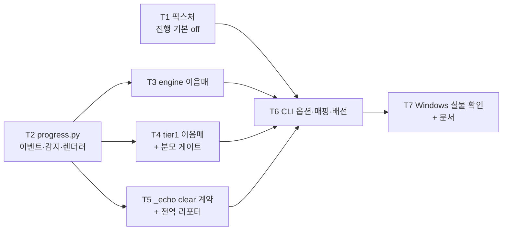

# 진행 표시와 비대화형 감지 (FR-8.5) 구현 계획

> **For agentic workers:** REQUIRED SUB-SKILL: Use superpowers:subagent-driven-development (recommended) or superpowers:executing-plans to implement this plan task-by-task. Steps use checkbox (`- [ ]`) syntax for tracking.

**Goal:** `translate`가 진행 상황을 stderr에 표시하고, 비대화형(CI) 환경을 감지해 `\r` 갱신 대신 이정표 줄을 내게 한다 (FR-8.5).

**Architecture:** 라이브러리는 `ProgressUpdate(done, total)`라는 순수 데이터만 만들고 그리는 법을 모른다. 콜백 주입(`on_progress`)이 `translate_segments`·`collect_tier1`에 구멍을 뚫고, 신규 모듈 `progress.py`가 감지·해결·렌더링을 전담한다. `progress.py`는 `cli.py`를 임포트하지 않는다 — 반대 방향이면 라이브러리가 CLI에 의존한다.

**Tech Stack:** Python 3.11+ · typer 0.27(click 벤더링) · 표준 라이브러리만 (`os`·`sys`·`dataclasses`). **새 의존성 0개** — `rich`를 쓰지 않는다.

**Spec:** [`docs/superpowers/specs/2026-08-29-progress-display-design.md`](../specs/2026-08-29-progress-display-design.md)

## Global Constraints

- 모든 모듈 첫 줄에 `from __future__ import annotations`
- 독스트링과 주석은 **한국어**, 근거 FR·§·D 번호를 병기한다 (예: `FR-8.5`, `D4`)
- 테스트 함수 이름도 **한국어**다 (기존 관례)
- ruff: `line-length = 100`, 규칙 `E,F,I,UP,B,SIM`
- 커밋 메시지는 **한국어**
- **의존성을 추가하지 않는다.** 런타임 4개(`typer`·`pysubs2`·`pyyaml`·`httpx`), dev 3개(`pytest`·`pytest-cov`·`ruff`). **`rich`는 typer의 전이 의존이라 우리 것이 아니다**(D6)
- **사용자에게 나가는 문자열에 em dash(U+2014)를 쓰지 않는다.** cp949가 인코딩하지 못해 리다이렉트 시 종료 코드가 2에서 1로 바뀐다
- **진행 출력은 stderr 전용이다**(D9). stdout은 `check` 리포트와 `--dry-run`이 쓰는 자리이고 `tests/test_cli_pipe.py`가 그 계약을 지킨다
- 파이썬 실행은 `.venv/Scripts/python.exe`
- 로컬 게이트는 CI와 대상이 같아야 한다. **`src tests`로 좁히지 않는다**

```bash
.venv/Scripts/python.exe -m ruff check .
.venv/Scripts/python.exe -m ruff format --check .
.venv/Scripts/python.exe -m pytest --cov=cuesift --cov-report=term-missing
.venv/Scripts/python.exe scripts/check_links.py
npx --yes markdownlint-cli2
```

## 착수 기준선 — 실측 (2026-08-29, `feat/progress-display` HEAD `4cfdc28`)

| 게이트 | 값 |
| --- | --- |
| `pytest` | **1480 passed · 3 deselected** · 18.49s |
| 커버리지 | **99%** (2313문 중 31 미커버) |
| CLI 옵션 수 (`test_config_schema.py`) | **23** (translate 19 · check 3 · transcribe 1) |
| 마크다운 파일 | **36** (markdownlint · check_links 양쪽 일치) |
| `src/` 변경 | **0줄** |

**완료 시 기대값**: `pytest`는 1480 + 신규분, 옵션 수는 **24**(translate 20), 마크다운은 **37**(이 계획서). CI는 `data/`가 `.gitignore`라 `passed`가 1 적고 `skipped` 1이 붙는다.

## 파일 구조

| 파일 | 책임 | 태스크 |
| --- | --- | --- |
| `src/cuesift/progress.py` (신규) | 이벤트 타입 · 환경변수 판독 · 감지 · 렌더러 · 전역 리포터 | T2 · T5 |
| `src/cuesift/translate/engine.py` | `translate_segments`에 `on_progress` 구멍 | T3 |
| `src/cuesift/signals/base.py` | `collect_tier1`에 `on_progress` 구멍. **분모는 후보 × 수집기** | T4 |
| `src/cuesift/tier1.py` | `triage_with_tier1`이 `on_progress`를 전달만 한다 | T4 |
| `src/cuesift/cli.py` | 옵션 3상 · 우선순위 4층 · `_echo` clear 계약 · 단계 배선 | T5 · T6 |
| `src/cuesift/config/schema.py` | `output.progress` 매핑 1행 | T6 |
| `tests/conftest.py` | 진행 표시를 **기본으로 끄는** autouse 픽스처 | T1 |

**`progress.py`가 최상위인 이유**는 `translate/`와 `signals/` 둘 다에서 임포트되기 때문이다. 어느 한쪽에 두면 다른 쪽이 남의 패키지 내부를 임포트하게 된다.

## 태스크 의존 관계



**T1이 T6 앞에 있는 것이 이 계획의 요점이다.** 진행 출력이 실제로 나가기 시작하는 것은 T6이고, 그때 기존 stderr 단언 다수가 한꺼번에 죽는다(§9 R2). 방어를 먼저 심는다.

## 스펙에서 바뀐 것

| # | 스펙 | 이 계획 | 근거 |
| --- | --- | --- | --- |
| 1 | `phase(label, total=...)` (§4.2 시퀀스 다이어그램) | **`phase(label)`** — `total`을 받지 않는다 | `ProgressUpdate`가 `total`을 싣고 다니므로(D2) 리포터가 따로 알 필요가 없다. 두 곳에 총량이 있으면 Tier 1처럼 총량이 호출 안에서 정해지는 경우에 갈라진다 |
| 2 | `_echo(err=True)`가 `clear()`를 부른다 (D11) | **`_echo` 전부**가 부른다 | 대화형 터미널에서 stdout과 stderr는 **같은 tty**다. `_tier1_warn`은 `err=True` 없이 stdout으로 나가는데(의도된 설계다), `\r` 줄과 같은 화면에서 겹친다. stdout이 리다이렉트된 경우 `clear()`는 stderr만 건드리므로 손해가 없다 |

## 구현 중 바뀐 결정

**이 절이 본문 코드 블록보다 최신이다.** 아래 항목에서 본문과 어긋나면 여기를 따른다.

| # | 태스크 | 무엇 | 왜 |
| --- | --- | --- | --- |
| 1 | T2 | **`ProgressReporter._last_pct`의 시작값은 `0`이다** (본문 코드의 `-1`은 틀렸다) | `-1`이면 plain 이정표가 9·19·…·99로 밀리고 끝에 100이 하나 더 붙어 **11줄**이 된다. 본문 테스트가 요구하는 10줄·첫 줄 `10/100 (10%)`과 모순이다. `phase()`의 재설정도 `0`이다 |
| 2 | T2 | 테스트의 `_FakeTTY.isatty`는 `super().isatty()`를 **먼저 부른다** | 원안(`return self._tty`)은 스트림을 닫아도 `ValueError`를 내지 않는다. 가짜가 실물보다 관대해 `detect_style`의 `except ValueError` 갈래를 **아무도 검사하지 않는 상태**가 된다 |
| 3 | T2 | `test_interactive는_한_줄을_덮어쓴다`의 마지막 단언은 `endswith("\n")` + `rstrip()` 비교다 | 확정 줄에도 패딩이 붙는 것이 옳다 — 안 붙이면 개행 뒤에 이전 줄의 꼬리가 화면에 남는다. 원안 단언이 **구현의 올바른 동작과 충돌**했다 |

| 4 | T4 | 분모 게이트의 마지막 단언은 `assert [e.total for e in events] == [4, 4, 4, 4]`다 (`all(...)`이 아니다) | `all(...)`은 변이 시 실패 메시지가 **`assert False`뿐**이라 200%가 드러나지 않는다. 게이트가 무엇을 잡았는지 읽히지 않으면 다음 사람이 원인을 다시 찾는다. 리스트 비교는 `[2, 2, 2, 2] == [4, 4, 4, 4]`를 그대로 보여 주고 이벤트 개수까지 고정한다 |
| 5 | T4 | 주석이 참조할 기존 테스트 이름은 `test_tier1은_후보에만_불린다`다 (`tests/test_tier1.py:86`) | 본문의 `test_후보만_재번역한다`는 **존재하지 않는 이름이다.** 후보 2건 × samples 3 = 호출 6회를 고정하는 것은 실제로 저 테스트다 |

**1~3은 TDD가 잡았다.** 계획서 코드를 그대로 넣었을 때 red가 아니라 green 이후 3건이 FAIL했고, 그 자리에서 "계획이 틀렸나 테스트가 틀렸나"를 판정했다. 1번은 계획이, 2·3번은 계획의 테스트가 틀렸다.

## 검증 명령 (모든 태스크 공통)

```bash
.venv/Scripts/python.exe -m pytest tests/test_progress.py -v
.venv/Scripts/python.exe -m ruff check .
.venv/Scripts/python.exe -m ruff format --check .
```

---

### Task 1: 진행 표시를 기본으로 끄는 픽스처 (R2 방어)

**Files:**

- Modify: `tests/conftest.py` (`_설정_자동_탐색_차단` 아래, 약 259행)
- Create: `tests/test_progress.py`

**Interfaces:**

- Consumes: 없음 (기능 구현 전이다)
- Produces: `CUESIFT_PROGRESS=0` 환경변수가 **모든 테스트에** 설정된 상태. T6의 CLI가 이 값을 읽어 진행을 끈다

**왜 환경변수인가**: `monkeypatch.setattr`로 모듈 속성을 고정하면 인프로세스 테스트만 막힌다. `tests/test_cli_pipe.py`는 실제 **서브프로세스**를 띄우고, 자동 탐색 차단 픽스처가 이미 같은 한계를 겪었다(`CLAUDE.md` 개발 환경 메모). 환경변수는 서브프로세스에 상속된다.

- [ ] **Step 1: 실패하는 테스트를 쓴다**

`tests/test_progress.py`를 새로 만든다.

```python
"""진행 표시와 비대화형 감지 (FR-8.5)."""

from __future__ import annotations

import os


def test_진행_표시가_모든_테스트에서_기본으로_꺼져_있다() -> None:
    # **이 단언이 픽스처의 게이트다.** 픽스처가 사라지면 진행 줄이 기존
    # stderr 단언에 섞여 수십 건이 한꺼번에 죽는데, 그때 원인은 진행
    # 표시가 아니라 각 테스트의 문제처럼 보인다 (설계 §9 R2).
    assert os.environ["CUESIFT_PROGRESS"] == "0"
```

- [ ] **Step 2: 실패를 확인한다**

```bash
.venv/Scripts/python.exe -m pytest tests/test_progress.py -v
```

Expected: FAIL — `KeyError: 'CUESIFT_PROGRESS'`

- [ ] **Step 3: 픽스처를 추가한다**

`tests/conftest.py`의 `_설정_자동_탐색_차단` 함수 **바로 아래**에 붙인다.

```python
@pytest.fixture(autouse=True)
def _진행_표시_차단(monkeypatch: pytest.MonkeyPatch) -> None:
    """진행 표시를 **기본으로 끈다** (FR-8.5 · 설계 §9 R2).

    테스트 실행은 비TTY라 자동 감지가 `plain`을 고르고, 그러면 진행 줄이
    기존 stderr 단언에 섞인다. 착수 시점 1480건 중 다수가 한꺼번에 죽는다.

    **환경변수여야 한다.** `monkeypatch.setattr`로 모듈 속성을 고정하면
    인프로세스 테스트만 막히고 `test_cli_pipe.py`가 띄우는 **서브프로세스**는
    그대로 진행을 낸다 - 위 `_설정_자동_탐색_차단`이 이미 같은 한계를 갖는다.

    진행을 재는 테스트는 `--progress`로 켠다. **CLI가 환경변수를 이긴다**
    (설계 D5).
    """
    monkeypatch.setenv("CUESIFT_PROGRESS", "0")
```

- [ ] **Step 4: 통과를 확인한다**

```bash
.venv/Scripts/python.exe -m pytest tests/test_progress.py -v
.venv/Scripts/python.exe -m pytest -q
```

Expected: `test_진행_표시가_모든_테스트에서_기본으로_꺼져_있다 PASSED` · 전체 **1481 passed · 3 deselected**

- [ ] **Step 5: 커밋**

```bash
git add tests/conftest.py tests/test_progress.py
git commit -m "테스트: 진행 표시를 모든 테스트에서 기본으로 끈다"
```

---

### Task 2: `progress.py` — 이벤트 · 감지 · 렌더러

**Files:**

- Create: `src/cuesift/progress.py`
- Modify: `tests/test_progress.py`

**Interfaces:**

- Consumes: 없음 (표준 라이브러리만)
- Produces:
  - `ProgressUpdate(done: int, total: int)` — frozen dataclass
  - `ProgressCallback = Callable[[ProgressUpdate], None]`
  - `env_flag(name: str) -> bool | None`
  - `detect_style(stream: IO[str] | None = None) -> ProgressStyle` — `"interactive" | "plain"`
  - `resolve_style(enabled: bool | None, stream=None) -> ProgressStyle` — `"off"`도 낸다
  - `ProgressReporter(style, stream=None)` — 메서드 `phase(label)` · `update(ProgressUpdate)` · `done(note="완료")` · `clear()`

- [ ] **Step 1: 실패하는 테스트를 쓴다**

`tests/test_progress.py`에 아래를 **덧붙인다**(Task 1의 테스트는 남긴다). 상단 임포트도 함께 고친다.

```python
"""진행 표시와 비대화형 감지 (FR-8.5)."""

from __future__ import annotations

import io
import os

import pytest

from cuesift.progress import (
    ProgressReporter,
    ProgressUpdate,
    detect_style,
    env_flag,
    resolve_style,
)
```

```python
@pytest.mark.parametrize(
    ("raw", "expected"),
    [
        ("1", True),
        ("true", True),
        ("TRUE", True),
        ("yes", True),
        (" on ", True),
        ("0", False),
        ("false", False),
        ("FALSE", False),
        ("no", False),
        ("off", False),
        ("", False),
        ("   ", False),
    ],
)
def test_환경변수를_3상으로_읽는다(
    monkeypatch: pytest.MonkeyPatch, raw: str, expected: bool
) -> None:
    # 판독 규칙이 두 곳에 생기면 `CUESIFT_PROGRESS=false`가 참이 되는 날이
    # 온다 (설계 §5). 이 표가 그 규칙의 단일 출처다.
    monkeypatch.setenv("CUESIFT_TEST_FLAG", raw)
    assert env_flag("CUESIFT_TEST_FLAG") is expected


def test_환경변수가_없으면_None이다(monkeypatch: pytest.MonkeyPatch) -> None:
    monkeypatch.delenv("CUESIFT_TEST_FLAG", raising=False)
    assert env_flag("CUESIFT_TEST_FLAG") is None


class _FakeTTY(io.StringIO):
    """`isatty()`를 조작할 수 있는 스트림."""

    def __init__(self, tty: bool) -> None:
        super().__init__()
        self._tty = tty

    def isatty(self) -> bool:
        return self._tty


@pytest.mark.parametrize(
    ("tty", "ci", "term", "expected"),
    [
        (True, None, None, "interactive"),
        (False, None, None, "plain"),
        # **TTY를 주는 CI가 이 표의 존재 이유다.** `isatty`만 보면
        # `docker run -t`나 일부 self-hosted 러너에서 `\r`이 로그 파일에
        # 그대로 남는다 (설계 D8).
        (True, "true", None, "plain"),
        (True, None, "dumb", "plain"),
        (True, "1", "dumb", "plain"),
        (False, "true", "dumb", "plain"),
        # `CI=`(빈 문자열)는 세우지 않은 것과 같다. GitHub Actions는
        # `CI=true`를 세우고, 빈 값을 비대화형으로 읽으면 로컬에서
        # `CI=`로 지운 사용자가 갱신을 못 받는다.
        (True, "", None, "interactive"),
        (True, None, "xterm-256color", "interactive"),
    ],
)
def test_감지_진리표(
    monkeypatch: pytest.MonkeyPatch,
    tty: bool,
    ci: str | None,
    term: str | None,
    expected: str,
) -> None:
    monkeypatch.delenv("CI", raising=False)
    monkeypatch.delenv("TERM", raising=False)
    if ci is not None:
        monkeypatch.setenv("CI", ci)
    if term is not None:
        monkeypatch.setenv("TERM", term)
    assert detect_style(_FakeTTY(tty)) == expected


def test_닫힌_스트림은_plain이다(monkeypatch: pytest.MonkeyPatch) -> None:
    # 닫힌 스트림의 `isatty()`는 `ValueError`를 낸다. 제어문자를 쓰지 않는
    # 쪽이 안전하다.
    monkeypatch.delenv("CI", raising=False)
    monkeypatch.delenv("TERM", raising=False)
    stream = _FakeTTY(True)
    stream.close()
    assert detect_style(stream) == "plain"


@pytest.mark.parametrize(
    ("enabled", "tty", "expected"),
    [
        (False, True, "off"),
        (False, False, "off"),
        (True, True, "interactive"),
        # **플래그는 켜고 끄기만 정한다** (설계 D7). `--progress`를 CI에서
        # 줘도 `\r`이 아니라 이정표 줄이 나와야 한다.
        (True, False, "plain"),
        (None, True, "interactive"),
        (None, False, "plain"),
    ],
)
def test_스타일은_언제나_감지가_정한다(
    monkeypatch: pytest.MonkeyPatch, enabled: bool | None, tty: bool, expected: str
) -> None:
    monkeypatch.delenv("CI", raising=False)
    monkeypatch.delenv("TERM", raising=False)
    assert resolve_style(enabled, _FakeTTY(tty)) == expected


def test_interactive는_한_줄을_덮어쓴다() -> None:
    stream = io.StringIO()
    reporter = ProgressReporter("interactive", stream)
    reporter.phase("[en] 번역")
    reporter.update(ProgressUpdate(41, 412))
    reporter.update(ProgressUpdate(340, 412))
    reporter.done("완료 (실패 0)")
    text = stream.getvalue()
    assert text.count("\n") == 1
    assert "\r" in text
    assert "41/412 (9%)" in text
    assert "340/412 (82%)" in text
    assert text.endswith("완료 (실패 0)\n")


def test_짧아진_줄이_이전_글자를_남기지_않는다() -> None:
    # `1000/4120` 뒤에 `340/412`가 오면 앞선 줄의 꼬리가 남는다.
    # 패딩이 없으면 `340/412 (82%)0`처럼 보인다.
    stream = io.StringIO()
    reporter = ProgressReporter("interactive", stream)
    reporter.phase("[en] 번역")
    reporter.update(ProgressUpdate(1000, 4120))
    long_len = len(stream.getvalue().rsplit("\r", 1)[-1])
    reporter.update(ProgressUpdate(340, 412))
    short = stream.getvalue().rsplit("\r", 1)[-1]
    assert len(short) == long_len
    assert short.rstrip() .endswith("(82%)")


def test_plain은_10퍼센트포인트마다_낸다() -> None:
    # 배치마다 내면 4000세그먼트에서 언어당 수백 줄이 된다 (설계 D12).
    stream = io.StringIO()
    reporter = ProgressReporter("plain", stream)
    reporter.phase("[en] 번역")
    for done in range(1, 101):
        reporter.update(ProgressUpdate(done, 100))
    lines = stream.getvalue().splitlines()
    assert len(lines) == 10
    assert lines[0] == "[en] 번역 10/100 (10%)"
    assert lines[-1] == "[en] 번역 100/100 (100%)"
    assert "\r" not in stream.getvalue()


def test_plain은_100퍼센트를_항상_낸다() -> None:
    # 10%p 규칙만 두면 마지막 조각이 10%p에 못 미칠 때 진행이 97%에서
    # 끝난 것처럼 보인다 (설계 D13).
    stream = io.StringIO()
    reporter = ProgressReporter("plain", stream)
    reporter.phase("[en] Tier 1")
    reporter.update(ProgressUpdate(97, 100))
    reporter.update(ProgressUpdate(100, 100))
    lines = stream.getvalue().splitlines()
    assert lines[-1] == "[en] Tier 1 100/100 (100%)"


def test_off는_아무것도_쓰지_않는다() -> None:
    stream = io.StringIO()
    reporter = ProgressReporter("off", stream)
    reporter.phase("[en] 번역")
    reporter.update(ProgressUpdate(1, 2))
    reporter.done()
    reporter.clear()
    assert stream.getvalue() == ""


def test_clear는_떠_있는_줄을_지운다() -> None:
    stream = io.StringIO()
    reporter = ProgressReporter("interactive", stream)
    reporter.phase("[en] 번역")
    reporter.update(ProgressUpdate(1, 2))
    painted = len(stream.getvalue().rsplit("\r", 1)[-1])
    reporter.clear()
    tail = stream.getvalue().split("\r")[-2:]
    assert tail[0] == " " * painted
    assert tail[1] == ""


def test_clear는_두_번_불러도_한_번만_지운다() -> None:
    stream = io.StringIO()
    reporter = ProgressReporter("interactive", stream)
    reporter.phase("[en] 번역")
    reporter.update(ProgressUpdate(1, 2))
    reporter.clear()
    before = stream.getvalue()
    reporter.clear()
    assert stream.getvalue() == before


class _BrokenStream(io.StringIO):
    """첫 쓰기에서 닫힌 파이프를 흉내 낸다."""

    def write(self, s: str) -> int:  # type: ignore[override]
        raise OSError(32, "Broken pipe")


def test_쓰기_실패는_전파되지_않고_영구_비활성화한다() -> None:
    # 진행 표시는 부수적이다. 닫힌 파이프에서 예외가 새면 `_TolerantOutput`과
    # `_echo`가 지켜 온 종료 코드 계약이 깨진다 (설계 D10).
    reporter = ProgressReporter("interactive", _BrokenStream())
    reporter.phase("[en] 번역")
    reporter.update(ProgressUpdate(1, 2))
    reporter.done()
    reporter.clear()
    assert reporter.disabled is True


def test_총량이_0이면_나누지_않는다() -> None:
    # 세그먼트 0개짜리 자막은 실재한다(빈 파일). ZeroDivisionError로
    # 죽으면 번역이 아니라 진행 표시가 파이프라인을 무너뜨린다.
    stream = io.StringIO()
    reporter = ProgressReporter("plain", stream)
    reporter.phase("[en] 번역")
    reporter.update(ProgressUpdate(0, 0))
    assert stream.getvalue() == ""
```

- [ ] **Step 2: 실패를 확인한다**

```bash
.venv/Scripts/python.exe -m pytest tests/test_progress.py -v
```

Expected: 전부 FAIL — `ModuleNotFoundError: No module named 'cuesift.progress'`

- [ ] **Step 3: `src/cuesift/progress.py`를 만든다**

```python
"""진행 표시와 비대화형 감지 (FR-8.5 · 설계 §4~§6).

**이 모듈은 `cli.py`를 임포트하지 않는다.** 반대 방향이면 라이브러리가
CLI에 의존하게 되고, `translate/engine.py`가 CLI를 끌고 들어온다 (설계 §4.1).

**`rich`를 쓰지 않는다**(설계 D6). `rich`는 typer의 전이 의존이라 typer가
그것을 떼면(`typer-slim`이 이미 있다) 조용한 `ImportError`가 된다. 더 큰
이유는 실측 전례다 - rich가 `FORCE_COLOR`로 **비TTY인 CI에서 색을 켜**
`--help` 출력의 옵션 이름을 쪼갠 사고가 있었다.
"""

from __future__ import annotations

import os
import sys
from collections.abc import Callable
from dataclasses import dataclass
from typing import IO, Literal

ProgressStyle = Literal["interactive", "plain", "off"]

# plain 모드의 이정표 간격(%p). 이 값이 크면 수십 분짜리 CI 작업에서 침묵이
# 길어져 "멈춤"과 "느림"이 구분되지 않고, 작으면 세그먼트 4000개·배치 10에서
# 언어당 400줄이 된다 (설계 D12).
_PLAIN_STEP_PCT = 10

# 단계 이름 뒤 점선이 끝나는 열. **CJK 폭 보정은 하지 않는다** - 한글은
# 터미널에서 두 칸을 먹어 점선 길이가 어긋나지만, 어긋나도 잃는 정보가 없다.
# 보정하려면 `unicodedata.east_asian_width`를 매 문자에 돌려야 하고 그것은
# 표시 하나를 위해 치를 값이 아니다.
_LABEL_WIDTH = 22

# 거짓으로 읽는 값들. 나머지는 전부 참이다.
_FALSE_WORDS = frozenset({"", "0", "false", "no", "off"})


@dataclass(frozen=True, slots=True)
class ProgressUpdate:
    """진척 이벤트. **단계 이름을 싣지 않는다** (설계 D2).

    단계는 표현 계층의 개념이고 호출자(CLI)가 이미 안다. 라이브러리가
    "번역 중"이라는 문자열을 알면 출력 문구를 바꿀 때 라이브러리를 고치게
    된다. `(done, total)` 둘뿐이라 나중에 다른 계층(QE, v0.2)이 붙어도
    타입이 바뀌지 않는다 (설계 §9 R4).
    """

    done: int
    total: int


ProgressCallback = Callable[[ProgressUpdate], None]


def env_flag(name: str) -> bool | None:
    """환경변수를 3상으로 읽는다. 세우지 않았으면 `None` (설계 §5).

    **판독 규칙을 여기 하나만 둔다.** `cli._prefer_env`는 문자열 전용이라
    재사용할 수 없고, 두 곳에 규칙이 생기면 `CUESIFT_PROGRESS=false`가
    참이 되는 날이 온다.
    """
    raw = os.environ.get(name)
    if raw is None:
        return None
    return raw.strip().lower() not in _FALSE_WORDS


def detect_style(stream: IO[str] | None = None) -> ProgressStyle:
    """대화형이면 `interactive`, 아니면 `plain`. **`off`는 내지 않는다.**

    끄고 켜는 것은 `resolve_style`의 일이다 - 감지는 *어떻게* 그릴지만
    정한다 (설계 D7).

    셋 중 **하나라도** 해당하면 비대화형이다. `isatty`만 보면 TTY를
    할당하는 CI 셸(`docker run -t`, 일부 self-hosted 러너)에서 `\\r`이 로그
    파일에 그대로 남는다 (설계 D8).

    `NO_COLOR`는 신호가 아니다 - 색에 관한 규격인데 이 렌더러는 색을 쓰지
    않으므로, 넣으면 규격을 넘어 해석하는 것이 된다.
    """
    target = sys.stderr if stream is None else stream
    if os.environ.get("CI"):
        return "plain"
    if os.environ.get("TERM") == "dumb":
        return "plain"
    try:
        interactive = bool(target.isatty())
    except (AttributeError, ValueError):
        # 닫힌 스트림의 `isatty()`는 `ValueError`를 낸다. 판정할 수 없으면
        # 제어문자를 쓰지 않는 쪽이 안전하다.
        interactive = False
    return "interactive" if interactive else "plain"


def resolve_style(enabled: bool | None, stream: IO[str] | None = None) -> ProgressStyle:
    """켜고 끄기(`enabled`)와 스타일(감지)을 합친다.

    `enabled`가 `None`이면 **켠다.** 진행 표시의 기본은 on이고, 자동 감지가
    정하는 것은 `interactive`인지 `plain`인지뿐이다 (설계 §5 흐름도).
    """
    if enabled is False:
        return "off"
    return detect_style(stream)


def _decorate(label: str) -> str:
    """`[en] 번역 ............ ` - 점선으로 열을 맞춘다 (설계 §6)."""
    pad = max(1, _LABEL_WIDTH - len(label))
    return f"{label} {'.' * pad} "


class ProgressReporter:
    """stderr에 진행을 그린다. **stdout은 쓰지 않는다** (설계 D9).

    `interactive`는 `\\r`로 한 줄을 덮어쓰고 단계가 끝나면 개행해 확정한다.
    `plain`은 갱신 없이 이정표를 누적하며 제어문자를 전혀 쓰지 않는다.

    **`\\r`은 커서 위치라는 상태를 남긴다.** 그래서 같은 자원을 쓰는 다른
    코드가 이 상태를 알아야 하고, 그것이 `clear()`와 `install()`의 존재
    이유다 (설계 §4.3 ②).
    """

    def __init__(self, style: ProgressStyle, stream: IO[str] | None = None) -> None:
        self._style = style
        self._stream = sys.stderr if stream is None else stream
        self._label = ""
        # 지금 떠 있는 `\r` 줄의 길이. 0이면 떠 있는 줄이 없다.
        self._line_len = 0
        # 마지막으로 plain 이정표를 낸 퍼센트. -1은 "아직 없음"이다.
        self._last_pct = -1
        self._disabled = style == "off"

    @property
    def disabled(self) -> bool:
        """쓰기 실패로 영구 비활성화됐는지 (설계 D10)."""
        return self._disabled

    def phase(self, label: str) -> None:
        """새 단계를 연다. 출력은 하지 않는다.

        **`total`을 받지 않는다.** 총량은 `ProgressUpdate`가 싣고 다니므로
        (D2) 리포터가 따로 알면 두 곳의 총량이 갈라진다 - Tier 1은 총량이
        `collect_tier1` 안에서 정해져 호출자가 미리 알 수도 없다.
        """
        self.clear()
        self._label = label
        self._last_pct = -1

    def update(self, update: ProgressUpdate) -> None:
        """진척을 그린다. `on_progress` 콜백으로 그대로 넘기는 자리다."""
        if self._disabled or update.total <= 0:
            # 세그먼트 0개짜리 자막은 실재한다(빈 파일). 여기서 나누면
            # 번역이 아니라 진행 표시가 파이프라인을 무너뜨린다.
            return
        pct = min(100, update.done * 100 // update.total)
        body = f"{update.done}/{update.total} ({pct}%)"
        if self._style == "interactive":
            self._paint(f"{_decorate(self._label)}{body}")
            return
        # 100%는 항상 낸다 - 10%p 규칙만 두면 마지막 조각이 10%p에 못
        # 미칠 때 진행이 97%에서 끝난 것처럼 보인다 (설계 D13).
        if update.done < update.total and pct < self._last_pct + _PLAIN_STEP_PCT:
            return
        self._last_pct = pct
        self._emit(f"{self._label} {body}")

    def done(self, note: str = "완료") -> None:
        """단계를 확정한다. `interactive`에서는 여기서 개행이 나간다."""
        if self._disabled:
            return
        if self._style == "interactive":
            self._paint(f"{_decorate(self._label)}{note}")
            self._raw("\n")
        else:
            self._emit(f"{self._label} {note}")
        self._line_len = 0

    def clear(self) -> None:
        """떠 있는 `\\r` 줄을 지운다 (설계 D11).

        `_echo`가 쓰기 **전에** 부른다. 이것이 없으면 진행 줄과 경고가
        한 줄에 겹친다 - `_translate_one`은 용어집 실패·캐시 경고를 실제로
        그 자리에서 낸다.
        """
        if self._disabled or self._style != "interactive" or self._line_len == 0:
            return
        self._raw("\r" + " " * self._line_len + "\r")
        self._line_len = 0

    def _paint(self, text: str) -> None:
        # 이전 줄보다 짧아지면 꼬리가 남는다 - `1000/4120` 뒤 `340/412`가
        # `340/412 (82%)0`으로 보인다. 공백으로 밀어 낸다.
        pad = max(0, self._line_len - len(text))
        self._raw("\r" + text + " " * pad)
        self._line_len = len(text) + pad

    def _emit(self, text: str) -> None:
        self._raw(text + "\n")

    def _raw(self, text: str) -> None:
        try:
            self._stream.write(text)
            self._stream.flush()
        except OSError:
            # **영구 비활성화한다** (설계 D10). 진행 표시는 부수적이고,
            # 닫힌 파이프에서 예외가 새면 `_TolerantOutput`과 `_echo`가
            # 지켜 온 종료 코드 계약이 깨진다 - `2>&1 | head -1`로 잘라
            # 읽는 사용자에게 종료 코드가 흐려진다.
            self._disabled = True
            self._line_len = 0
```

- [ ] **Step 4: 통과를 확인한다**

```bash
.venv/Scripts/python.exe -m pytest tests/test_progress.py -v
.venv/Scripts/python.exe -m ruff check . && .venv/Scripts/python.exe -m ruff format --check .
```

Expected: 전부 PASS

- [ ] **Step 5: 게이트가 실제로 실패하는지 확인한다**

**회귀 테스트는 버그 코드에서 실패하는 것을 본 뒤에야 회귀 테스트다.** 이 리포는 길이비 회귀 테스트가 버그 버전에서도 통과해 데이터를 다시 짠 전례가 있다.

`_raw`의 `except OSError:` 블록을 `raise`로 잠깐 바꾸고:

```bash
.venv/Scripts/python.exe -m pytest tests/test_progress.py::test_쓰기_실패는_전파되지_않고_영구_비활성화한다 -v
```

Expected: FAIL — `OSError: [Errno 32] Broken pipe`. 확인 후 되돌린다.

`_paint`의 `pad` 계산을 `pad = 0`으로 잠깐 바꾸고:

```bash
.venv/Scripts/python.exe -m pytest tests/test_progress.py::test_짧아진_줄이_이전_글자를_남기지_않는다 -v
```

Expected: FAIL. 확인 후 되돌린다.

- [ ] **Step 6: 커밋**

```bash
git add src/cuesift/progress.py tests/test_progress.py
git commit -m "기능: FR-8.5 진행 이벤트와 감지·렌더러"
```

---

### Task 3: `translate_segments`에 `on_progress` 이음매

**Files:**

- Modify: `src/cuesift/translate/engine.py:137-201` (`translate_segments`)
- Test: `tests/test_translate_engine.py` (기존 파일에 덧붙인다)

**Interfaces:**

- Consumes: `cuesift.progress.ProgressCallback` · `ProgressUpdate` (T2)
- Produces: `translate_segments(..., on_progress: ProgressCallback | None = None)`

**배치 루프의 진척은 `window.batch`로 센다.** `BatchWindow`는 `batch`·`before`·`after` 셋을 갖는데(`translate/batch.py:39`) 뒤 둘은 맥락이지 번역 대상이 아니다. 더하면 `done`이 `total`을 넘는다.

- [ ] **Step 1: 실패하는 테스트를 쓴다**

`tests/test_translate_engine.py` 끝에 덧붙인다. 파일 상단 임포트에 `from cuesift.progress import ProgressUpdate`를 더한다.

```python
def test_진행_콜백이_최종적으로_전량을_보고한다() -> None:
    # 진행이 100%에 도달하지 않으면 사용자는 멈춘 것과 구별하지 못한다.
    events: list[ProgressUpdate] = []
    translate_segments(
        _segs(25),
        provider=EchoProvider(),
        source_lang="ko",
        target_lang="en",
        batch_size=10,
        on_progress=events.append,
    )
    assert len(events) == 3
    assert events[-1] == ProgressUpdate(25, 25)


def test_진행_콜백이_맥락을_함께_세지_않는다() -> None:
    # `BatchWindow`는 `batch`·`before`·`after` 셋을 갖는데 뒤 둘은 맥락이지
    # 번역 대상이 아니다. 더하면 done이 total을 넘고, 다음 배치에서
    # 줄어든 것처럼 보인다.
    events: list[ProgressUpdate] = []
    translate_segments(
        _segs(25),
        provider=EchoProvider(),
        source_lang="ko",
        target_lang="en",
        batch_size=10,
        context_window=3,
        on_progress=events.append,
    )
    assert [e.done for e in events] == [10, 20, 25]
    assert all(e.total == 25 for e in events)


def test_빈_입력은_진행도_내지_않는다() -> None:
    # `test_빈_입력은_호출하지_않는다`의 형제다. 배치가 0개면 이벤트도 0개다.
    events: list[ProgressUpdate] = []
    translate_segments(
        [],
        provider=EchoProvider(),
        source_lang="ko",
        target_lang="en",
        on_progress=events.append,
    )
    assert events == []


def test_콜백을_주지_않으면_기존_호출부가_그대로다() -> None:
    # 기본값이 None이고 그때 콜백은 **한 번도 호출되지 않는다**(설계 D3).
    # 기존 호출부 0줄 변경이 이 결정의 산물이다.
    result = translate_segments(
        _segs(3), provider=EchoProvider(), source_lang="ko", target_lang="en"
    )
    assert [s.target_text for s in result.segments] == ["EN:문장0", "EN:문장1", "EN:문장2"]
```

`_segs(n)`(24행)과 `EchoProvider`(`tests.fakes.provider`)는 이 파일의 기존 자산이다. `EchoProvider`는 `"EN:{원문}"`을 돌려주고 `_segs(25)` + `batch_size=10`은 호출 3회가 된다 — `test_배치_크기대로_호출한다`가 같은 숫자를 쓴다.

- [ ] **Step 2: 실패를 확인한다**

```bash
.venv/Scripts/python.exe -m pytest tests/test_translate_engine.py -k 진행 -v
```

Expected: FAIL — `TypeError: translate_segments() got an unexpected keyword argument 'on_progress'`

- [ ] **Step 3: 이음매를 뚫는다**

`src/cuesift/translate/engine.py` 상단 임포트에 더한다.

```python
from cuesift.progress import ProgressCallback, ProgressUpdate
```

시그니처의 `sleep` **아래**에 더한다.

```python
    sleep: Callable[[float], None] = time.sleep,
    on_progress: ProgressCallback | None = None,
) -> TranslationResult:
```

독스트링 끝에 문단을 더한다.

```python
    `on_progress`는 배치가 끝날 때마다 `ProgressUpdate(done, total)`를 받는다
    (FR-8.5 · 설계 D1). **기본값이 `None`이면 한 번도 호출되지 않는다**(D3) -
    기존 호출부가 0줄도 바뀌지 않는 것이 이 기본값의 산물이다.

    대안이던 "CLI가 `iter_batches`를 직접 돌기"를 버린 이유는 재시도·맥락
    윈도우·`TokenUsage` 합산 계약을 CLI가 복제하게 되기 때문이다 - 위
    독스트링이 명시한 계약(실패분 `target_text=None`, `TokenUsage`에
    `__radd__` 없음)이 두 곳에 생기고 반드시 갈라진다.
```

배치 루프를 고친다.

```python
    translated: dict[str, str] = {}
    failures: list[SegmentFailure] = []
    usage = TokenUsage()
    # 총량은 **번역 대상 수**다. 맥락(before/after)은 대상이 아니다.
    total = len(segments)
    done = 0

    for window in iter_batches(segments, size=batch_size, context_window=context_window):
        batch_usage, batch_texts, batch_failures = _run_window(
            ...
        )
        usage = usage + batch_usage
        translated.update(batch_texts)
        failures.extend(batch_failures)
        # **`window.batch`만 센다.** `before`/`after`를 더하면 `done`이
        # `total`을 넘고, 다음 배치에서 줄어든 것처럼 보인다.
        done += len(window.batch)
        if on_progress is not None:
            on_progress(ProgressUpdate(done, total))
```

- [ ] **Step 4: 통과를 확인한다**

```bash
.venv/Scripts/python.exe -m pytest tests/test_translate_engine.py -v
.venv/Scripts/python.exe -m ruff check .
```

Expected: 전부 PASS

- [ ] **Step 5: 커밋**

```bash
git add src/cuesift/translate/engine.py tests/test_translate_engine.py
git commit -m "기능: FR-8.5 translate_segments에 진행 콜백을 붙인다"
```

---

### Task 4: Tier 1 이음매와 **분모 게이트** (D4)

**Files:**

- Modify: `src/cuesift/signals/base.py:208-255` (`collect_tier1`)
- Modify: `src/cuesift/tier1.py:22-36` (시그니처) · `:299` (호출)
- Test: `tests/test_signals_tier1.py` 또는 `collect_tier1`을 이미 다루는 파일 (구현자가 `grep -rn "collect_tier1" tests/`로 확인한다)

**Interfaces:**

- Consumes: `cuesift.progress.ProgressCallback` · `ProgressUpdate` (T2)
- Produces:
  - `collect_tier1(segments, ctx, enabled=None, on_progress=None)`
  - `triage_with_tier1(..., on_progress: ProgressCallback | None = None)` — 전달만 한다

**이 태스크가 계획 전체에서 가장 중요하다.** `collect_tier1`은 `for name → for seg` 이중 루프이고 오늘 등록된 tier 1 수집기는 `llm.self_consistency` **하나뿐**이다. 그래서 두 정의가 같은 값을 낸다:

| 정의 | 오늘 (수집기 1종) | 수집기 2종이 되는 날 |
| --- | --- | --- |
| `len(candidates)` | 20 | **35/20 = 175%** |
| `len(candidates) × len(names)` (채택) | 20 | 35/40 = 88% |

**틀린 정의를 골라도 오늘의 테스트는 전부 통과한다.** 가짜 수집기를 등록하는 테스트가 없으면 D4는 주석으로만 남는다.

- [ ] **Step 1: 실패하는 테스트를 쓴다**

**분모 게이트는 `tests/test_signals_tier_isolation.py`에 넣는다.** 그 파일에 이미 `registry()`를 저장·복원하는 `spy_registered` 픽스처(88행)와 `_segments()`(151행)·`signal_ctx`(145행)가 있다. 아래를 그 파일에 덧붙인다.

```python
class _무동작_Tier1_수집기:
    """진행 분모만 재기 위한 tier 1 수집기. **프로바이더를 만지지 않는다.**

    `_SpyTier1`과 달리 `provider_for`를 부르지 않는 이유는 이 수집기의
    임무가 `names`를 2로 만드는 것뿐이기 때문이다 - 만지면 대본이
    소진되거나 호출 수 단언이 흔들린다.
    """

    tier = 1

    def __init__(self, name: str) -> None:
        self.name = name

    def collect_tier1(self, seg: Segment, ctx: Tier1Context) -> Signal | None:
        return None


@pytest.fixture
def 무동작_수집기_둘():
    """tier 1 수집기를 **정확히 둘** 등록한다 (설계 D4).

    `spy_registered`와 같은 저장·복원 절차다. 합치지 않는 이유는 그
    픽스처가 "정확히 하나"를 전제하는 단언
    (`spy_registered.tier1_calls == len(segs)`)에 쓰이기 때문이다.
    """
    saved = dict(registry())
    try:
        for name, existing in list(registry().items()):
            if existing.tier == 1:
                del registry()[name]
        register(_무동작_Tier1_수집기("test.denominator_a"))
        register(_무동작_Tier1_수집기("test.denominator_b"))
        yield
    finally:
        registry().clear()
        registry().update(saved)


def test_진행_분모는_세그먼트_수_곱하기_수집기_수다(무동작_수집기_둘, signal_ctx):
    """**오늘 보이지 않는 200% 버그를 고정한다** (설계 D4 · §4.3 ①).

    `collect_tier1`은 `for name → for seg` 이중 루프다. 오늘 등록된 tier 1
    수집기는 `llm.self_consistency` 하나뿐이라 `len(segments)`와
    `len(segments) × len(names)`가 **같은 값을 낸다** - 틀린 정의를 골라도
    전 스위트가 통과한다. 위 픽스처가 수집기를 둘로 만들어야 비로소 두
    정의가 갈라진다.
    """
    names = [n for n, c in registry().items() if c.tier == 1]
    assert len(names) == 2, "수집기가 둘이 아니면 이 테스트는 아무것도 재지 않는다"

    t1 = Tier1Context(
        signal=signal_ctx, provider_for=lambda attempt: None, samples=3, temperature=1.0
    )
    events: list[ProgressUpdate] = []
    collect_tier1(_segments(), t1, on_progress=events.append)

    # 세그먼트 2건 × 수집기 2종 = 4. `len(segments)`로 두면 total이 2가
    # 되어 200%가 찍힌다.
    assert [e.done for e in events] == [1, 2, 3, 4]
    assert all(e.total == 4 for e in events)
```

파일 상단 임포트에 `from cuesift.progress import ProgressUpdate`를 더한다.

**전달 테스트는 `tests/test_tier1.py`에 넣는다.** 그 파일의 `_plain_segments(n)`(49행)·`_VaryingProvider`(30행)·`_ignore`(25행)·`signal_ctx`(18행)를 그대로 쓴다.

```python
def test_진행_콜백이_Tier1_수집까지_흐른다(signal_ctx):
    """`triage_with_tier1`은 진행을 **만들지 않고 넘기기만** 한다 (설계 D1).

    만들면 ①~④(수집·융합·후보 선정)까지 진행에 섞여 분모가 두 겹이 되고,
    사용자는 "무엇의 진행인지"를 잃는다.
    """
    provider = _VaryingProvider()
    events: list[ProgressUpdate] = []

    triage_with_tier1(
        _plain_segments(10),
        signal_ctx,
        budget_ratio=0.1,
        provider=provider,
        max_ratio=0.2,
        samples=3,
        warn=_ignore,
        on_progress=events.append,
    )

    # 후보 2건(10 × 0.2) × tier 1 수집기 1종 = 2. 같은 후보 수를
    # `test_후보만_재번역한다`가 호출 6회(2 × samples 3)로 이미 고정한다.
    assert events[-1] == ProgressUpdate(2, 2)
```

- [ ] **Step 2: 실패를 확인한다**

```bash
.venv/Scripts/python.exe -m pytest -k "진행_분모" -v
```

Expected: FAIL — `TypeError: collect_tier1() got an unexpected keyword argument 'on_progress'`

- [ ] **Step 3: `collect_tier1`에 이음매를 뚫는다**

`src/cuesift/signals/base.py` 상단 임포트에 더한다.

```python
from cuesift.progress import ProgressCallback, ProgressUpdate
```

시그니처를 고친다.

```python
def collect_tier1(
    segments: Sequence[Segment],
    ctx: Tier1Context,
    enabled: Iterable[str] | None = None,
    on_progress: ProgressCallback | None = None,
) -> dict[str, list[Signal]]:
```

독스트링 끝에 문단을 더한다.

```python
    `on_progress`의 **분모는 `len(segments) × len(names)`다**(FR-8.5 · 설계 D4).
    아래가 이중 루프이기 때문이다. `len(segments)`로 두면 수집기가 2종이
    되는 날 **200%가 찍힌다** - 오늘은 tier 1 수집기가 하나뿐이라 두 정의가
    같은 값을 내므로, 이 사실을 지키는 것은 가짜 수집기를 등록하는
    테스트뿐이다.
```

루프를 고친다.

```python
    result: dict[str, list[Signal]] = {seg.id: [] for seg in segments}

    # **이중 루프라 분모가 곱이다** (설계 D4).
    total = len(segments) * len(names)
    done = 0

    for name in names:
        collector = _REGISTRY[name]
        for seg in segments:
            signal = collector.collect_tier1(seg, ctx)
            if signal is not None:
                result[seg.id].append(signal)
            done += 1
            if on_progress is not None:
                on_progress(ProgressUpdate(done, total))
```

- [ ] **Step 4: `triage_with_tier1`이 전달만 하게 고친다**

`src/cuesift/tier1.py` 상단 임포트에 `from cuesift.progress import ProgressCallback`를 더하고, 시그니처의 `weights` **아래**에 더한다.

```python
    weights: Mapping[str, float] | None = None,
    on_progress: ProgressCallback | None = None,
) -> list[SegmentRisk]:
```

독스트링 끝에 문단을 더한다.

```python
    `on_progress`는 **⑤ Tier 1 수집에만 간다**(FR-8.5 · 설계 D1). 이 함수가
    자기 진행을 따로 만들지 않는 이유는 ①~④(수집·융합·후보 선정)가 LLM
    호출이 없어 순식간에 끝나기 때문이다 - 섞으면 분모가 두 겹이 되고
    사용자는 "무엇의 진행인지"를 잃는다.
```

`:299`의 호출을 고친다.

```python
    # ⑤ Tier 1 - 후보에만
    tier1 = collect_tier1(candidates, tier1_ctx, on_progress=on_progress)
```

- [ ] **Step 5: 통과를 확인한다**

```bash
.venv/Scripts/python.exe -m pytest -k "진행_분모 or Tier1_수집까지" -v
.venv/Scripts/python.exe -m pytest -q
```

Expected: 전부 PASS

- [ ] **Step 6: 게이트가 실제로 실패하는지 확인한다**

`base.py`의 `total`을 `len(segments)`로 잠깐 바꾸고:

```bash
.venv/Scripts/python.exe -m pytest -k "진행_분모" -v
```

Expected: FAIL — `assert all(e.total == 4 ...)`가 깨진다. 수집기가 둘인데 `total`이 2로 나와 진행이 **200%**를 찍는다.

**이 실패를 보지 못하면 D4에는 게이트가 없는 것이다.** 확인 후 되돌린다.

- [ ] **Step 7: 커밋**

```bash
git add src/cuesift/signals/base.py src/cuesift/tier1.py tests/
git commit -m "기능: FR-8.5 Tier 1 진행 콜백과 분모 게이트"
```

---

### Task 5: `_echo`와의 clear 계약 · 전역 리포터

**Files:**

- Modify: `src/cuesift/progress.py` (전역 리포터 추가)
- Modify: `src/cuesift/cli.py:409-423` (`_echo`)
- Modify: `tests/conftest.py` (전역 상태 초기화 픽스처 — R1)
- Test: `tests/test_progress.py`

**Interfaces:**

- Consumes: `ProgressReporter` (T2)
- Produces:
  - `progress.install(reporter: ProgressReporter | None) -> None`
  - `progress.active() -> ProgressReporter | None`
  - `progress.clear_active() -> None`
  - `cli._echo`가 쓰기 **전에** `clear_active()`를 부른다

**스펙 D11에서 넓힌 부분**: 스펙은 `_echo(err=True)`만 지목하지만, 대화형 터미널에서 stdout과 stderr는 **같은 tty**다. `_tier1_warn`은 의도적으로 `err=True` 없이 stdout으로 나가고(`cli.py:2455` 독스트링), `\r` 줄과 같은 화면에서 겹친다. stdout이 리다이렉트된 경우 `clear()`는 stderr만 건드리므로 손해가 없다.

- [ ] **Step 1: 실패하는 테스트를 쓴다**

`tests/test_progress.py`에 덧붙인다.

```python
def test_전역_리포터는_기본이_없다() -> None:
    from cuesift import progress

    assert progress.active() is None


def test_echo가_쓰기_전에_진행_줄을_지운다() -> None:
    # `\r` 진행 줄이 떠 있는 중에 경고가 나가면 두 문장이 한 줄에 겹친다
    # (설계 D11). `_translate_one`은 용어집 실패·캐시 경고를 그 자리에서 낸다.
    from cuesift import progress
    from cuesift.cli import _echo

    stream = io.StringIO()
    reporter = ProgressReporter("interactive", stream)
    reporter.phase("[en] 번역")
    reporter.update(ProgressUpdate(340, 412))
    painted = len(stream.getvalue().rsplit("\r", 1)[-1])

    progress.install(reporter)
    try:
        _echo("[en] 용어집을 읽지 못했다", err=True)
    finally:
        progress.install(None)

    # 진행 줄을 공백으로 밀어 낸 흔적이 있어야 한다.
    assert "\r" + " " * painted + "\r" in stream.getvalue()


def test_echo는_stdout_경로에서도_지운다() -> None:
    # 대화형 터미널에서 stdout과 stderr는 같은 tty다. `_tier1_warn`은
    # 의도적으로 stdout으로 나간다(cli.py `_tier1_warn` 독스트링).
    from cuesift import progress
    from cuesift.cli import _echo

    stream = io.StringIO()
    reporter = ProgressReporter("interactive", stream)
    reporter.phase("[en] Tier 1")
    reporter.update(ProgressUpdate(1, 20))
    before = stream.getvalue()

    progress.install(reporter)
    try:
        _echo("[en] Tier 1이 돌지 않았다: 후보 0건")
    finally:
        progress.install(None)

    assert stream.getvalue() != before


def test_리포터가_없으면_clear는_무해하다() -> None:
    from cuesift import progress

    progress.install(None)
    progress.clear_active()  # 예외가 없어야 한다
```

- [ ] **Step 2: 실패를 확인한다**

```bash
.venv/Scripts/python.exe -m pytest tests/test_progress.py -k "전역 or echo or 무해" -v
```

Expected: FAIL — `AttributeError: module 'cuesift.progress' has no attribute 'active'`

- [ ] **Step 3: `progress.py`에 전역 리포터를 더한다**

파일 **끝**에 붙인다.

```python
# 활성 리포터. **전역 상태다** (설계 §9 R1). 이것을 두는 이유는 `_echo`
# 호출부가 49곳이라 리포터를 인자로 흘리려면 전부를 고쳐야 하기 때문이다.
# 설치·해제 자리를 `translate` 커맨드 하나로 한정하고, `conftest.py`가
# 테스트마다 초기화한다.
_active: ProgressReporter | None = None


def install(reporter: ProgressReporter | None) -> None:
    """활성 리포터를 세운다. `None`이면 해제한다.

    **`translate` 커맨드에서만 부른다.** 다른 곳에서 부르면 전역 상태의
    수명이 커맨드 경계를 넘어 테스트가 서로 오염된다.
    """
    global _active
    _active = reporter


def active() -> ProgressReporter | None:
    """활성 리포터. 테스트가 상태를 확인할 수 있게 노출한다."""
    return _active


def clear_active() -> None:
    """활성 리포터가 있으면 떠 있는 줄을 지운다 (설계 D11).

    **`_echo`가 쓰기 전에 부른다.** 리포터가 없거나 `plain`·`off`면
    아무 일도 하지 않으므로 호출 비용이 사실상 0이다.
    """
    if _active is not None:
        _active.clear()
```

- [ ] **Step 4: `cli.py`의 `_echo`를 고친다**

상단 임포트에 더한다.

```python
from cuesift.progress import clear_active
```

`_echo` 본문을 고친다.

```python
def _echo(message: str = "", *, err: bool = False) -> None:
    """커맨드 본문의 출력. 닫힌 파이프에서도 **종료 코드를 지킨다.**

    `_TolerantOutput`이 설치되면 여기까지 예외가 오지 않지만, 이 방어를 남겨 두는 것은
    `app()`을 직접 부르는 호출자(테스트·라이브러리 사용)가 프록시를 못 받기 때문이다.
    그때 예외가 본문을 빠져나가면 `check()`가 `typer.Exit(1)`에 도달하지 못해
    **위반을 찾고도 종료 코드가 1이 아니게 된다.**

    **쓰기 전에 진행 줄을 지운다**(FR-8.5 · 설계 D11). `\\r`이 떠 있는 중에
    메시지가 나가면 두 문장이 한 줄에 겹친다. `err` 여부와 무관하게 지우는
    것은 대화형 터미널에서 stdout과 stderr가 **같은 tty**이기 때문이다 -
    `_tier1_warn`은 의도적으로 stdout으로 나간다. stdout이 리다이렉트된
    경우 `clear_active()`는 stderr만 건드리므로 손해가 없다.
    """
    clear_active()
    stream = sys.stderr if err else sys.stdout
    try:
        typer.echo(message, err=err)
    except OSError as exc:
        if not _is_closed_output(exc):
            raise
        _discard_stream(stream)
```

- [ ] **Step 5: 전역 상태 초기화 픽스처를 더한다 (R1)**

`tests/conftest.py`의 `_진행_표시_차단` **아래**에 붙인다.

```python
@pytest.fixture(autouse=True)
def _진행_리포터_초기화() -> None:
    """활성 리포터를 테스트마다 비운다 (FR-8.5 · 설계 §9 R1).

    `cuesift.progress`의 활성 리포터는 전역이다. 한 테스트가 설치한 채
    끝나면 다음 테스트의 `_echo`가 남의 스트림에 쓴다 - 그 오염은 실패가
    아니라 **엉뚱한 곳의 출력**으로 나타나 원인 추적이 매우 어렵다.
    """
    from cuesift import progress

    progress.install(None)
    yield
    progress.install(None)
```

- [ ] **Step 6: 통과를 확인한다**

```bash
.venv/Scripts/python.exe -m pytest tests/test_progress.py -v
.venv/Scripts/python.exe -m pytest -q
```

Expected: 전부 PASS. 전체 수치가 착수 1480에서 신규분만큼 늘고 **기존 건이 하나도 죽지 않아야 한다.**

- [ ] **Step 7: 커밋**

```bash
git add src/cuesift/progress.py src/cuesift/cli.py tests/conftest.py tests/test_progress.py
git commit -m "기능: FR-8.5 _echo가 쓰기 전에 진행 줄을 지운다"
```

---

### Task 6: CLI 옵션 · 설정 매핑 · 단계 배선

**Files:**

- Modify: `src/cuesift/cli.py` — `translate` 시그니처(`dry_run` 아래, 약 949행) · 본문 리포터 설치(약 1387행 앞) · `_translate_one`(1676행~)
- Modify: `src/cuesift/config/schema.py:59-82` (`BINDINGS`)
- Modify: `tests/test_config_schema.py:30-33` (23 → 24)
- Modify: `docs/요구사항정의서.md:679-680` (§8.2 예시)
- Test: `tests/test_cli_progress.py` (신규 — 옵션 존재와 3상 기본값)
- Test: `tests/test_cli_config.py` (우선순위 4층 — `_FakeCtx`가 여기 있다)
- Test: `tests/test_cli_pipe.py` (파이프 계약 — 기존 시나리오에 `--progress`를 더한다)

**Interfaces:**

- Consumes: T2~T5 전부
- Produces: `--progress/--no-progress` 옵션 · `output.progress` 설정 키

**옵션 추가와 매핑 추가는 한 커밋이어야 한다.** `tests/test_config_schema.py`가 매핑표와 click 옵션 집합의 **상등**을 본다. 한쪽만 넣으면 트리가 붉은 채로 태스크가 끝난다.

- [ ] **Step 1: 실패하는 테스트를 쓴다**

`tests/test_cli_progress.py`를 만든다.

```python
"""`--progress` 옵션과 우선순위 4층 (FR-8.5 · 설계 D5·D7)."""

from __future__ import annotations

import pytest
from typer.testing import CliRunner

from cuesift.cli import app

runner = CliRunner()


def test_progress_옵션이_help에_있다() -> None:
    result = runner.invoke(app, ["translate", "--help"])
    assert result.exit_code == 0
    assert "--progress" in result.output
    assert "--no-progress" in result.output


def test_progress_기본값은_지정_안_함이다() -> None:
    # 기본이 `False`면 자동 감지가 영영 안 돈다 (설계 D7).
    import typer

    group = typer.main.get_command(app)
    param = next(p for p in group.commands["translate"].params if p.name == "progress")
    assert param.default is None
```

**우선순위 4층은 `tests/test_cli_config.py`에 넣는다.** 그 파일의 `_FakeCtx`가 `ParameterSource`를 흉내 내고, `_resolve_llm`의 4층 테스트(311행~)가 이미 같은 형식을 쓴다. **형식을 새로 만들면 두 게이트가 서로 다른 것을 재게 된다.**

```python
def test_진행_CLI가_환경변수를_이긴다(monkeypatch: pytest.MonkeyPatch) -> None:
    from cuesift.cli import _prefer_env_bool

    monkeypatch.setenv("CUESIFT_PROGRESS", "1")
    got = _prefer_env_bool(_FakeCtx("COMMANDLINE"), "progress", False, "CUESIFT_PROGRESS")
    assert got is False


def test_진행_환경변수가_설정_파일을_이긴다(monkeypatch: pytest.MonkeyPatch) -> None:
    # `DEFAULT_MAP`은 설정 파일에서 온 값이다. `value or env`로 짜면
    # 설정의 True가 환경변수의 False를 이겨 `--no-progress`의 존재 이유가
    # 사라진다 (설계 D5).
    from cuesift.cli import _prefer_env_bool

    monkeypatch.setenv("CUESIFT_PROGRESS", "0")
    got = _prefer_env_bool(_FakeCtx("DEFAULT_MAP"), "progress", True, "CUESIFT_PROGRESS")
    assert got is False


def test_진행_설정_파일이_자동_감지를_이긴다(monkeypatch: pytest.MonkeyPatch) -> None:
    from cuesift.cli import _prefer_env_bool

    monkeypatch.delenv("CUESIFT_PROGRESS", raising=False)
    got = _prefer_env_bool(_FakeCtx("DEFAULT_MAP"), "progress", False, "CUESIFT_PROGRESS")
    assert got is False


def test_진행_아무것도_없으면_감지에_맡긴다(monkeypatch: pytest.MonkeyPatch) -> None:
    # `None`이어야 `resolve_style`이 감지로 내려간다. `False`를 내면
    # 감지가 영영 안 돈다.
    from cuesift.cli import _prefer_env_bool

    monkeypatch.delenv("CUESIFT_PROGRESS", raising=False)
    assert _prefer_env_bool(None, "progress", None, "CUESIFT_PROGRESS") is None


def test_진행_False가_falsy라서_삼켜지지_않는다(monkeypatch: pytest.MonkeyPatch) -> None:
    # `_prefer_env`의 문자열 판본을 그대로 베끼면 `value or env`가
    # `--no-progress`를 조용히 무시한다. **이 한 건이 불리언 형제를
    # 따로 만든 이유 전체다.**
    from cuesift.cli import _prefer_env_bool

    monkeypatch.setenv("CUESIFT_PROGRESS", "1")
    assert _prefer_env_bool(None, "progress", False, "CUESIFT_PROGRESS") is False
```

**파이프 계약은 `tests/test_cli_pipe.py`를 확장한다**(스펙 §8 9행). 그 파일은 실제 서브프로세스를 띄워 stderr를 닫고 종료 코드를 본다. **기존 시나리오 하나를 복사해 인자에 `--progress`만 더하고, 종료 코드가 원본과 같은지 단언한다.** 새 시나리오를 짜지 않는다 — 재는 것은 "진행을 켜도 계약이 유지되는가" 하나뿐이다.

`tests/test_config_schema.py`를 고친다.

```python
def test_CLI_옵션은_24개다() -> None:
    # translate 20 + check 3 + transcribe 1. 이 수가 바뀌면 위 상등도
    # 깨지지만, 여기서 먼저 어긋난 쪽을 알려 준다(설계 §5).
    # FR-8.5가 `--progress`를 더해 23에서 24가 됐다.
    assert len(_cli_options()) == 24
```

- [ ] **Step 2: 실패를 확인한다**

```bash
.venv/Scripts/python.exe -m pytest tests/test_cli_progress.py tests/test_config_schema.py -v
.venv/Scripts/python.exe -m pytest tests/test_cli_config.py -k 진행 -v
```

Expected: `--progress`가 `--help`에 없어 FAIL · 옵션 수가 23이라 FAIL · `_prefer_env_bool`이 없어 FAIL

- [ ] **Step 3: 옵션과 매핑을 더한다**

`src/cuesift/cli.py`의 `translate` 시그니처에서 `dry_run` **아래**, `) -> None:` **위**에 더한다.

```python
    progress: Annotated[
        bool | None,
        # **3상이다.** 기본값 `None`이 "지정 안 함"이고, 그때 자동 감지가
        # 정한다. `False`를 기본으로 두면 감지가 영영 안 돈다.
        # 플래그는 **켜고 끄기만** 정한다 - 스타일은 언제나 감지가 정한다
        # (설계 D7). `--progress`를 CI에서 줘도 `\r`이 아니라 이정표 줄이
        # 나온다.
        typer.Option(
            "--progress/--no-progress",
            help="진행 표시를 켜거나 끕니다. 기본은 자동 감지 (FR-8.5).",
        ),
    ] = None,
```

`src/cuesift/config/schema.py`의 `BINDINGS`에서 `("output", "dir")` **아래**에 더한다.

```python
    Binding(("output", "dir"), (("translate", "out"),)),
    Binding(("output", "progress"), (("translate", "progress"),)),
```

**변환 함수는 없다.** `cache.enabled → --no-cache`가 `negate`를 거치는 것과 달리, YAML의 `true`가 곧 `--progress`다.

- [ ] **Step 4: 우선순위 헬퍼를 더한다**

`src/cuesift/cli.py`의 `_prefer_env` **아래**에 붙인다.

```python
def _prefer_env_bool(
    ctx: typer.Context | None, name: str, value: bool | None, env_name: str
) -> bool | None:
    """불리언 3상에 우선순위를 적용한다 - CLI > 환경변수 > 설정 파일 (설계 D5).

    `_prefer_env`의 불리언 형제다. 문자열 판본을 그대로 쓸 수 없는 이유는
    `False`가 falsy라 `value or env`가 `--no-progress`를 조용히 무시하기
    때문이다 - 그것이 "탈출로"라는 플래그의 존재 이유를 없앤다.

    환경변수 판독은 `progress.env_flag` 하나만 쓴다. 규칙이 두 곳에 생기면
    `CUESIFT_PROGRESS=false`가 참이 되는 날이 온다.
    """
    env = env_flag(env_name)
    if env is not None and _from_config(ctx, name):
        return env
    return env if value is None else value
```

상단 임포트를 고친다.

```python
from cuesift.progress import ProgressReporter, clear_active, env_flag, install, resolve_style
```

- [ ] **Step 5: 리포터를 설치하고 단계를 배선한다**

`translate` 본문에서 언어 루프가 시작되기 **전에** 리포터를 만든다(`_translate_one` 호출부는 `cli.py:1387`이다).

```python
    # **설치·해제를 이 커맨드 하나로 한정한다** (설계 §9 R1). 전역 상태의
    # 수명이 커맨드 경계를 넘으면 테스트가 서로 오염된다.
    reporter = ProgressReporter(
        resolve_style(_prefer_env_bool(ctx, "progress", progress, "CUESIFT_PROGRESS"))
    )
    install(reporter)
    try:
        ...  # 기존 언어 루프 전체
    finally:
        # **`finally`여야 한다.** 예외로 빠져나가면 다음 커맨드가 남의
        # 리포터를 쓴다.
        install(None)
```

`_translate_one`의 시그니처에 `reporter`를 더하고(`weights` 위, 키워드 전용 자리), 호출부(`cli.py:1387`)에도 `reporter=reporter,`를 더한다.

`_translate_one` 본문의 세 자리를 배선한다.

```python
    # ① 번역
    reporter.phase(f"[{target_lang}] 번역")
    try:
        translated = translate_segments(
            result.segments,
            ...
            on_progress=reporter.update,
        )
    except FatalProviderError as exc:
        ...
    reporter.done(f"완료 (실패 {len(translated.failures)})")
```

```python
    # ② Tier 1 - `tier1`이 None이면 단계 자체가 없다
    reporter.phase(f"[{target_lang}] Tier 1")
    scored = triage_with_tier1(
        ...
        on_progress=reporter.update,
    )
    reporter.done()
```

```python
    # ③ 리포트
    reporter.phase(f"[{target_lang}] 리포트")
    ...  # write_review
    reporter.done("기록 완료")
```

**예외 경로에서 `done()`을 부르지 않는다.** 실패는 `_echo(err=True)`가 말하고, 그것이 `clear_active()`로 진행 줄을 지운다. 실패 뒤에 "완료"를 찍으면 화면이 거짓말을 한다.

- [ ] **Step 6: 요구사항정의서 §8.2를 고친다**

`docs/요구사항정의서.md`의 `output:` 블록을 고친다.

```yaml
output:
  dir: ./out
  progress: true                # false면 --no-progress와 같다
```

**이 블록은 그대로 실행된다.** `tests/test_docs_config_example.py`가 뽑아 `load_config()`에 먹이고 **CLI까지 태운다.**

- [ ] **Step 7: 통과를 확인한다**

```bash
.venv/Scripts/python.exe -m pytest tests/test_cli_progress.py tests/test_config_schema.py tests/test_docs_config_example.py -v
.venv/Scripts/python.exe -m pytest -q
.venv/Scripts/python.exe -m ruff check . && .venv/Scripts/python.exe -m ruff format --check .
```

Expected: 전부 PASS. **기존 1480건이 하나도 죽지 않아야 한다** — 죽었다면 T1의 픽스처가 닿지 않는 경로(서브프로세스 등)를 찾은 것이다.

- [ ] **Step 8: 파이프 계약을 직접 확인한다**

```bash
.venv/Scripts/python.exe -m pytest tests/test_cli_pipe.py -v
```

Expected: PASS — 진행이 켜진 채 stderr를 닫아도 종료 코드가 유지된다(D10).

- [ ] **Step 9: 커밋**

```bash
git add src/cuesift/cli.py src/cuesift/config/schema.py tests/ docs/요구사항정의서.md
git commit -m "기능: FR-8.5 --progress 옵션과 설정 파일 매핑"
```

---

### Task 7: Windows `\r` 실물 확인 · 문서

**Files:**

- Modify: `CHANGELOG.md`
- Modify: `docs/WBS.md` (WP6 · FR-8.5)
- Modify: `docs/요구사항정의서.md` (FR-8.5 상태)
- Modify: `HANDOFF.md`

**R3은 실물 확인 태스크다.** `\r`은 ANSI가 아니라 ASCII 제어문자라 cmd·PowerShell·Windows Terminal 모두 지원하지만, **확인하지 않은 것을 확인했다고 적지 않는다.**

- [ ] **Step 1: Windows 콘솔에서 `\r` 갱신을 눈으로 본다**

LLM이 필요 없다. 리포터를 직접 돌린다.

```powershell
.venv/Scripts/python.exe -c "import time; from cuesift.progress import ProgressReporter, ProgressUpdate; r = ProgressReporter('interactive'); r.phase('[en] 번역'); [(r.update(ProgressUpdate(i, 20)), time.sleep(0.15)) for i in range(1, 21)]; r.done('완료 (실패 0)')"
```

**확인할 것 셋:**

| # | 기대 | 어긋나면 |
| --- | --- | --- |
| 1 | 줄이 **하나**만 보이고 숫자가 제자리에서 바뀐다 | `\r`이 개행처럼 동작한다 → `interactive`를 Windows에서 쓰지 않도록 감지를 고쳐야 한다 |
| 2 | `20/20 (100%)` 뒤 `완료 (실패 0)`가 **같은 줄**에 남고 개행된다 | `done()`의 개행 자리가 틀렸다 |
| 3 | 한글 라벨의 점선 정렬이 읽을 만하다 | 정렬만의 문제다. **고치지 않는다** — `_LABEL_WIDTH` 주석이 이미 이유를 적고 있다 |

- [ ] **Step 2: plain 경로도 본다**

```powershell
$env:CI="true"; .venv/Scripts/python.exe -c "from cuesift.progress import ProgressReporter, ProgressUpdate, detect_style; print('style=', detect_style()); r = ProgressReporter('plain'); r.phase('[en] 번역'); [r.update(ProgressUpdate(i, 100)) for i in range(1, 101)]; r.done('완료 (실패 0)')"; Remove-Item Env:CI
```

Expected: `style= plain` · 이정표 **10줄** + 완료 1줄 · `\r` 없음

- [ ] **Step 3: 관측한 것을 문서에 적는다**

`docs/superpowers/specs/2026-08-29-progress-display-design.md` §9 R3의 완화 칸을 **관측 결과로** 바꾼다. 관측하지 않은 것은 적지 않는다.

- [ ] **Step 4: 상태 문서를 갱신한다**

| 문서 | 무엇 |
| --- | --- |
| `CHANGELOG.md` | Keep a Changelog 형식. `Added`에 진행 표시와 `--progress`, `output.progress` |
| `docs/WBS.md` | FR-8.5 ⬜ → ✅ · **WP6 🟡 → ✅** |
| `docs/요구사항정의서.md` | FR-8.5 상태 · v0.1 완료 개수 36 → **37** |
| `HANDOFF.md` | 게이트 실행 기록(실측 수치) · 파킹된 finding 10건은 **그대로 열려 있다** |

- [ ] **Step 5: 전 게이트를 CI와 같은 대상으로 돌린다**

```bash
.venv/Scripts/python.exe -m ruff check .
.venv/Scripts/python.exe -m ruff format --check .
.venv/Scripts/python.exe -m pytest --cov=cuesift --cov-report=term-missing
.venv/Scripts/python.exe scripts/check_links.py
npx --yes markdownlint-cli2
```

**두 마크다운 도구의 파일 개수가 같은지 본다.** 어긋나면 새 `.md`가 아직 `git add`되지 않은 것이고, 그 문서는 링크 검사를 **아예 받지 않는다**(실측으로 32 vs 31로 갈린 전례가 있다).

- [ ] **Step 6: 커밋**

```bash
git add CHANGELOG.md docs/ HANDOFF.md
git commit -m "문서: FR-8.5 완료 상태와 Windows 실물 확인 결과"
```

---

## 완료 판정

| 항목 | 기대 |
| --- | --- |
| `pytest` | 1480 + 신규분. **기존 1480건이 하나도 죽지 않는다** |
| 커버리지 | 99% 유지 (신규 `progress.py`가 낮추지 않아야 한다) |
| CLI 옵션 수 | **24** (translate 20 · check 3 · transcribe 1) |
| 마크다운 | markdownlint와 check_links의 파일 개수가 **일치** |
| D4 게이트 | `total`을 `len(segments)`로 되돌리면 **실패한다**(T4 Step 6에서 확인) |
| D10 게이트 | `OSError`를 전파시키면 **실패한다**(T2 Step 5에서 확인) |
| Windows `\r` | 실물로 관측했고 결과를 스펙 §9 R3에 적었다 |
