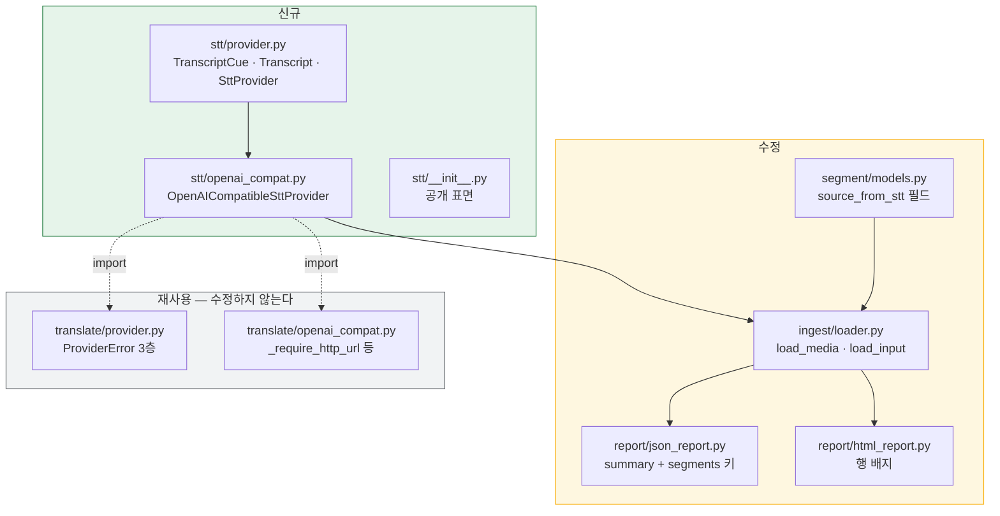
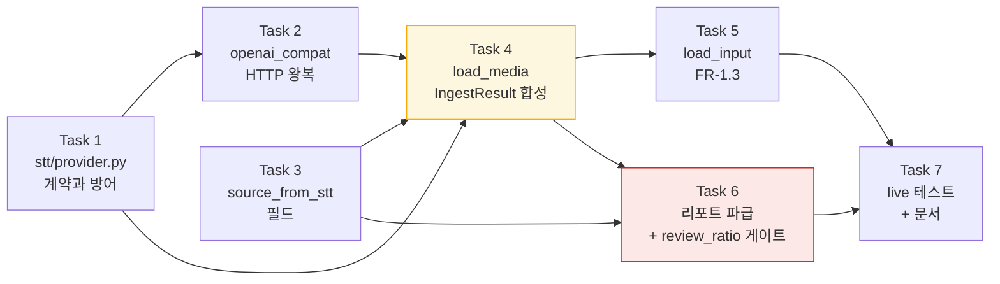

# STT 어댑터와 원문 검수 플래그 구현 계획 (WP9)

> **For agentic workers:** REQUIRED SUB-SKILL: Use superpowers:subagent-driven-development (recommended) or superpowers:executing-plans to implement this plan task-by-task. Steps use checkbox (`- [ ]`) syntax for tracking.

**Goal:** 자막이 없는 영상을 STT로 전사해 `IngestResult`로 만들고, 그렇게 생긴 원문에 `원문 검수 필요` 플래그를 달아 검수 큐가 출처를 드러내게 한다 (FR-1.2 · FR-1.3 · FR-1.4).

**Architecture:** `stt/`를 `translate/`의 형제로 새로 판다. 프로바이더는 OpenAI 호환 `/v1/audio/transcriptions`를 `httpx`로 치고 `Transcript`만 낸다. `Segment` 조립과 `IngestResult` 합성은 `ingest/loader.py`의 `load_media`가 맡는다. 플래그는 `Segment`의 전용 불리언 필드이고 **점수에도 hard fail에도 들어가지 않는다** — 리포트 두 곳에서 표시만 한다.

**Tech Stack:** Python 3.11+ · `httpx` · `pysubs2` · `typer` · `pyyaml` (런타임 4개 고정, 추가 없음) · 테스트는 `pytest` + `httpx.MockTransport`

**Spec:** [`docs/superpowers/specs/2026-08-30-stt-adapter-design.md`](../specs/2026-08-30-stt-adapter-design.md) — 결정 D1~D11, 위험 R1~R4, 게이트 §8.1이 전부 거기 있다. **이 계획은 스펙에서 논증을 가져오지 반복하지 않는다.**

## 구현 중 바뀐 결정 (2026-09-02, 구현 완료 시점에 추가)

> **이 절이 아래 본문 코드 블록보다 최신이다** (`CLAUDE.md` 문서 지도).
> 본문은 착수 전에 쓴 것이고 여기는 실제로 구현하며 실측으로 뒤집힌 것이다.
> **본문의 코드 블록을 그대로 복사하기 전에 이 표에서 그 결정이 살아 있는지 본다.**

| # | 계획서가 말한 것 | 실제로 무엇을 했나 | 왜 |
| --- | --- | --- | --- |
| B1 | P3 — 타임코드 방어를 프로바이더 계층에 두고 `IngestError("bad_timecode")`를 **만들지 않는다** | `_to_ms`가 `IngestError("bad_timecode")`를 낸다 | `round(1e308 * 1000)`이 `OverflowError`를 내 **예외 계층 밖으로 샜다.** 프로바이더 방어만으로는 인제스트 경로가 안 덮인다 |
| B2 | `source_lang=transcript.language or source_lang` | **선언값을 그대로 쓴다** | `transcript.language`가 `_SCRIPT_RANGES.get("korean")`에서 `None`이 되어 **구조 신호가 통째로 꺼졌다.** 계획서가 지시한 테스트 이름도 함께 바뀌었다 |
| B3 | `summary.source_from_stt`를 `outcome.segments`에서 유도 | `TriageOutcome.source_from_stt` **필드** + `__post_init__` 불변식 | 유도식이 **전량 번역 실패 실행에서 거짓 `false`를 냈다**(리뷰어 둘이 독립 재현, Critical). 불변식이 필드와 세그먼트의 갈림을 구조로 막는다 |
| B4 | 게이트 수치 T7 = `1646 passed` | 실측 **1678 passed** (+32) | 리뷰 지적 대응으로 테스트가 늘었다. 내역은 원장 `progress.md`의 누적 편차 추적표에 있다 |
| B5 | "새 `IngestError.reason`을 만들면 CLI 분기가 안내 없이 샌다" | **그 문장이 거짓이었다.** `IngestError.reason` 소비처는 실측 **0건** | 아래 본문 두 자리(Task 5)의 주석을 실측에 맞춰 고쳤다. `video_input`을 쓰는 판단 자체는 유지한다 — 근거가 "CLI 분기"가 아니라 "같은 상황에 같은 이름"이다 |

**표가 말하는 것은 넷 중 셋이 실측으로 뒤집혔다는 것이다** — B1·B2·B3은 전부 코드를
돌려 보고서야 드러났고, 문서만 읽어서는 어느 것도 보이지 않았다. B5는 반대 방향이다:
계획서가 근거로 든 사실이 애초에 없었다.

**B3은 스펙에도 같은 사본이 있었다** — [설계 스펙 §6](../specs/2026-08-30-stt-adapter-design.md)의
표와 그 아래 문단이다. 둘 다 고쳤다. **한쪽만 고치면 다음 사람이 남은 쪽을 복사한다.**

## Global Constraints

스펙과 `CLAUDE.md`에서 그대로 옮긴 것이다. **모든 태스크의 요구사항에 이 절이 암묵적으로 포함된다.**

| 제약 | 값 |
| --- | --- |
| Python 실행 | **반드시 `.venv/Scripts/python.exe`** — 시스템 Python은 3.14라 다르다 |
| 런타임 의존성 | `typer`·`pysubs2`·`pyyaml`·`httpx` **4개 고정.** 추가 금지 (D1이 `faster-whisper`를 배제한 이유) |
| 모든 모듈 첫 줄 | `from __future__ import annotations` |
| 독스트링·주석 | **한국어.** 근거 FR·§ 번호를 병기한다 (예: `FR-1.4`, `§4.4`) |
| 주석에 적을 것 | "왜 이 값인가"가 아니라 **"이 값이 아니면 무엇이 깨지는가"** |
| ruff | `line-length = 100`, 규칙 `E,F,I,UP,B,SIM` |
| 커밋 메시지 | **한국어.** 푸시는 사용자가 명시적으로 요청할 때만 |
| 게이트 대상 | **`.` 전체.** `src tests`로 좁히면 안 된다 (CI가 5회 연속 실패한 전례) |
| 게이트 판정 | `passed`와 `deselected`를 **함께** 읽는다. 현재 기준선은 **1582 passed · 3 deselected** |
| 리포 루트 | **`cuesift.yaml`을 만들지 마라.** 자동 탐색이 그것을 읽는다 |

로컬 게이트 5종은 CI와 명령·대상이 같아야 한다.

```bash
.venv/Scripts/python.exe -m ruff check .
.venv/Scripts/python.exe -m ruff format --check .
.venv/Scripts/python.exe -m pytest --cov=cuesift --cov-report=term-missing
python scripts/check_links.py
npx --yes markdownlint-cli2
```

---

## 이 계획을 쓰기 위해 실측한 것

**계획의 코드는 기억이 아니라 실행에서 나왔다.** 아래가 그 목록이고, 각 태스크가 이것을 근거로 삼는다.

| 확인 | 결과 | 어느 태스크가 쓰나 |
| --- | --- | --- |
| `round(nan * 1000)` | **`ValueError`** — `ProviderError` 밖이다 | Task 1 |
| `round(inf * 1000)` | **`OverflowError`** — 역시 밖이다 | Task 1 |
| `math.isfinite("1.5")` | **`TypeError`** — 타입 검사가 먼저 와야 한다 | Task 1 |
| `isinstance(True, int \| float)` | **`True`** — bool이 통과한다 | Task 1 |
| `pysubs2.SSAFile().format` | **`None`.** 이벤트를 넣어도 `None` | Task 4 |
| `format=None`으로 `write_subtitle` | **`UnknownFileExtensionError: '.tmp'`** | Task 4 |
| `event_index={}`로 `write_subtitle` | **`KeyError: '00000'`** | Task 4 |
| 합성 `IngestResult` 왕복 | **성립한다** — 3큐 · 144바이트 · 원문이 번역문으로 교체됨 | Task 4 |
| `round(1234.5)` / `round(1235.5)` | **1234 / 1236** (짝수 반올림, half-up 아님) | Task 4 |

**마지막 줄이 가장 위험하다.** 게이트를 만드는 쪽이 기대값을 half-up으로 적으면 게이트 자신이 틀린다.

## 확정된 구현 결정 (스펙에 없던 것)

계획 작성 중에 사용자가 정한 것이다. 스펙 D1~D11에 얹힌다.

| # | 결정 | 이것이 아니면 |
| --- | --- | --- |
| **P1** | HTTP 헬퍼는 `translate.openai_compat`에서 **import**한다 | 공용 모듈로 추출하면 `translate`를 수정하게 되어 기존 번역 테스트가 회귀 위험에 들어간다. 복제하면 분류 규칙이 두 벌이 되어 한쪽만 고쳐지면 갈라진다 |
| **P2** | `transcribe(audio: Path, ...)` — 프로바이더가 파일을 연다 | `bytes`를 받으면 긴 오디오가 전부 메모리에 올라온다 |
| **P3** | 타임코드 방어를 **프로바이더 계층**(`TranscriptCue`)에 둔다. 인제스트는 다시 검사하지 않는다 | 아래 |

**P3은 스펙 §7과 다르다.** 스펙은 역전·음수를 `IngestError("bad_timecode")`로 잡으라고 적었는데, 그 표는 `Transcript`가 방어 없는 자료 뭉치라고 가정하고 쓰였다. Task 1이 `TranscriptCue.__post_init__`에 방어를 넣으면 **`Transcript`를 통과한 큐는 이미 검증된 것**이고, `Transcript.cues`의 타입이 `tuple[TranscriptCue, ...]`이라 우회 경로도 없다. 그 상태에서 인제스트에 같은 검사를 또 넣으면 **아무도 실행하지 않는 분기**가 하나 생긴다 — 이 리포가 `IngestResult.subs`를 `| None`으로 완화하지 않은 것과 같은 이유다(D6).

따라서 **`IngestError("bad_timecode")`는 이 계획에서 만들지 않는다.** 방어가 사라진 것이 아니라 한 층 위로 올라갔고, 실패는 `FatalProviderError`로 나온다.

| 스펙 §7의 행 | 이 계획에서 | 어디가 잡나 |
| --- | --- | --- |
| 타임코드 역전·음수 → `IngestError("bad_timecode")` | **`FatalProviderError`** | `TranscriptCue` → `openai_compat._to_transcript`가 번역 |
| 큐 0개 → `IngestError("empty")` | 그대로 | `load_media` (표시 불가 큐만 남은 경우) |

**P1의 대가를 알고 채택한다.** `stt/openai_compat.py`가 `_`로 시작하는 이름을 모듈 밖에서 부르므로, `translate/openai_compat.py`를 고치는 사람이 `stt`를 깨뜨릴 수 있다. Task 2가 그 사실을 주석과 테스트로 못 박는다.

## 파일 구조



회색 상자를 **한 줄도 고치지 않는 것**이 이 구조의 요지다. 점선은 import이고 실선은 데이터 흐름이다.

| 파일 | 책임 | 줄 수 예상 |
| --- | --- | --- |
| `src/cuesift/stt/__init__.py` | 공개 표면 4개를 재수출한다 | ~15 |
| `src/cuesift/stt/provider.py` | `Transcript` 계약과 방어. **HTTP를 모른다** | ~120 |
| `src/cuesift/stt/openai_compat.py` | HTTP 왕복과 `verbose_json` 해석. **인제스트 정책을 모른다** | ~200 |
| `src/cuesift/ingest/loader.py` | `load_media`·`load_input` 추가 (기존 353줄에 얹는다) | +130 |
| `src/cuesift/segment/models.py` | 필드 1개 추가 | +8 |
| `src/cuesift/report/json_report.py` | 키 2개 추가 | +6 |
| `src/cuesift/report/html_report.py` | 배지 1개 추가 | +12 |

---

## 태스크 지도



**Task 6이 붉은 것은 프로젝트의 핵심 지표가 거기서 결정되기 때문이다.** Task 4가 노란 것은 실패 지점이 셋(`subs`·`format`·`event_index`)이라 리뷰가 가장 촘촘해야 하는 자리여서다.

| Task | 산출물 | 닫는 FR |
| --- | --- | --- |
| 1 | `stt/provider.py` + 방어 테스트 | — |
| 2 | `stt/openai_compat.py` + MockTransport 테스트 | — |
| 3 | `Segment.source_from_stt` | — |
| 4 | `load_media` | **FR-1.2** |
| 5 | `load_input` | **FR-1.3** |
| 6 | 리포트 2종 | **FR-1.4** |
| 7 | live 테스트 · WBS · CHANGELOG · README | — |

---

### Task 1: `stt/provider.py` — 계약과 방어

**Files:**

- Create: `src/cuesift/stt/__init__.py`
- Create: `src/cuesift/stt/provider.py`
- Test: `tests/test_stt_provider.py`

**Interfaces:**

- Consumes: `cuesift.translate.provider`의 `FatalProviderError`·`RetryableProviderError` (D2 — 새로 만들지 않는다)
- Produces:
  - `TranscriptCue(start_s: float, end_s: float, text: str)` — frozen dataclass
  - `Transcript(cues: tuple[TranscriptCue, ...], language: str | None, model: str)` — frozen dataclass
  - `SttProvider` Protocol: `name: str` · `transcribe(self, audio: Path, *, language: str | None) -> Transcript`

**이 태스크의 핵심:** 타임코드가 `nan`·`inf`·문자열이면 `round()`가 `ValueError`·`OverflowError`·`TypeError`를 내는데 **셋 다 `ProviderError` 밖이다.** 호출부의 `except FatalProviderError`가 못 잡고 스택 밖으로 샌다. `translate/provider.py`의 `TokenUsage`가 같은 이유로 같은 방어를 갖고 있다.

- [ ] **Step 1: 실패하는 테스트를 쓴다**

`tests/test_stt_provider.py`:

```python
"""`stt/provider.py`의 계약 방어 (설계 D3·D5)."""

from __future__ import annotations

import math
from pathlib import Path

import pytest

from cuesift.stt.provider import SttProvider, Transcript, TranscriptCue


def test_유한하지_않은_시작_시각을_거부한다() -> None:
    # `round(nan * 1000)`은 ValueError이고 그것은 ProviderError 밖이라
    # 호출부의 폴백이 받지 못한다 (실측).
    with pytest.raises(ValueError, match="유한한 수"):
        TranscriptCue(start_s=math.nan, end_s=1.0, text="가")


def test_무한대_종료_시각을_거부한다() -> None:
    # inf는 OverflowError를 내는데 그것도 ProviderError 밖이다 (실측).
    with pytest.raises(ValueError, match="유한한 수"):
        TranscriptCue(start_s=0.0, end_s=math.inf, text="가")


def test_수가_아닌_타임코드를_거부한다() -> None:
    # `math.isfinite("1.5")`가 TypeError를 내므로 타입 검사가 먼저 와야 한다.
    with pytest.raises(ValueError, match="유한한 수"):
        TranscriptCue(start_s="0.0", end_s=1.0, text="가")  # type: ignore[arg-type]


def test_불리언_타임코드를_거부한다() -> None:
    # `isinstance(True, int | float)`가 True라 타입 검사만으로는 통과한다.
    # `round(True * 1000)`은 1000이 되어 **1초짜리 큐가 조용히 생긴다**.
    with pytest.raises(ValueError, match="유한한 수"):
        TranscriptCue(start_s=True, end_s=1.0, text="가")  # type: ignore[arg-type]


def test_음수_시작_시각을_거부한다() -> None:
    with pytest.raises(ValueError, match="음수"):
        TranscriptCue(start_s=-0.5, end_s=1.0, text="가")


def test_역전된_타임코드를_거부한다() -> None:
    with pytest.raises(ValueError, match="작다"):
        TranscriptCue(start_s=2.0, end_s=1.0, text="가")


def test_같은_시각은_허용한다() -> None:
    # 길이 0 큐는 STT가 실제로 낸다. 역전이 아니므로 통과시키고,
    # 표시 가치 판정은 인제스트가 한다.
    cue = TranscriptCue(start_s=1.0, end_s=1.0, text="가")
    assert cue.end_s == cue.start_s


def test_텍스트가_문자열이_아니면_거부한다() -> None:
    # None이면 `Segment.source_text`가 None이 되고 Tier 0 신호가
    # 전부 AttributeError로 죽는다.
    with pytest.raises(ValueError, match="str"):
        TranscriptCue(start_s=0.0, end_s=1.0, text=None)  # type: ignore[arg-type]


def test_transcript는_큐를_튜플로_동결한다() -> None:
    t = Transcript(
        cues=(TranscriptCue(start_s=0.0, end_s=1.0, text="가"),),
        language="ko",
        model="whisper-1",
    )
    assert isinstance(t.cues, tuple)
    with pytest.raises(AttributeError):
        t.language = "en"  # type: ignore[misc]


def test_protocol이_기대하는_시그니처를_고정한다() -> None:
    # 구현체가 인자 이름을 바꾸면 호출부가 키워드로 부르다 TypeError를 낸다.
    # 그 실패는 실행 한참 뒤에 드러나므로 여기서 고정한다
    # (`translate/provider.py`의 Provider가 같은 이유로 같은 단언을 갖는다).
    import inspect

    sig = inspect.signature(SttProvider.transcribe)
    assert list(sig.parameters) == ["self", "audio", "language"]
    assert sig.parameters["audio"].annotation == "Path"
    assert sig.parameters["language"].kind is inspect.Parameter.KEYWORD_ONLY
    assert Path  # import가 쓰였음을 표시한다
```

- [ ] **Step 2: 실패를 확인한다**

```bash
.venv/Scripts/python.exe -m pytest tests/test_stt_provider.py -v
```

기대: `ModuleNotFoundError: No module named 'cuesift.stt'` — 10건 전부 수집 단계에서 실패한다.

- [ ] **Step 3: `stt/provider.py`를 쓴다**

```python
"""STT 프로바이더 계약 (요구사항정의서 FR-1.2 · 설계 D3).

**이 모듈은 HTTP를 모른다.** 계약과 방어만 두고 왕복은 `openai_compat.py`가 한다 -
`translate/provider.py`와 `translate/openai_compat.py`의 관계와 같다.

`Transcript`는 **초 단위 float**을 담는다. 밀리초 변환(D5)은 인제스트가 하는데,
그 이유는 `Segment` 조립 자체가 인제스트 정책이기 때문이다(D3).
"""

from __future__ import annotations

import math
from dataclasses import dataclass
from pathlib import Path
from typing import Protocol


@dataclass(frozen=True, slots=True)
class TranscriptCue:
    """전사 큐 하나. **초 단위**다 (D5는 인제스트에서 적용된다).

    `__post_init__`의 셋은 전부 **`ProviderError` 밖으로 새는 예외를 막는 것**이다.
    이 방어가 없으면 인제스트의 `round(start_s * 1000)`이 아래를 낸다 (실측):

    | 값 | 예외 | ProviderError 자손인가 |
    | --- | --- | --- |
    | `nan` | `ValueError` | ❌ |
    | `inf` | `OverflowError` | ❌ |
    | `"1.5"` | `TypeError` | ❌ |

    셋 다 호출부의 `except FatalProviderError`를 지나쳐 미처리 traceback이 되고
    종료 코드 1이 된다 - **이 저장소에서 1은 "규격 위반 발견"이라 STT 결함이
    자막 결함으로 오보된다.** `translate/provider.py`의 `TokenUsage`가 같은
    이유로 같은 방어를 갖고 있다.
    """

    start_s: float
    end_s: float
    text: str

    def __post_init__(self) -> None:
        for name, value in (("start_s", self.start_s), ("end_s", self.end_s)):
            # **`isinstance` 검사가 `isfinite`보다 먼저여야 한다.**
            # `math.isfinite("1.5")`는 `TypeError`를 내고 그것은 이 함수가
            # 막으려는 예외 그 자체다 (실측).
            #
            # **`bool`을 따로 뺀다.** `isinstance(True, int | float)`가 `True`라
            # 타입 검사만으로는 통과하고, `round(True * 1000)`은 1000이 되어
            # **1초짜리 큐가 예외 없이 생긴다.** 조용히 틀리는 부류다.
            if isinstance(value, bool) or not isinstance(value, int | float):
                raise ValueError(f"{name}({value!r})이 유한한 수가 아니다")
            if not math.isfinite(value):
                raise ValueError(f"{name}({value!r})이 유한한 수가 아니다")
            if value < 0:
                # 음수는 `Segment`도 안 본다 - `__post_init__`은 역전만 검사한다.
                # 여기서 놓치면 음수 밀리초가 CPS를 음수로 만든다.
                raise ValueError(f"{name}({value})이 음수다")
        if self.end_s < self.start_s:
            # 역전은 Whisper 계열이 실제로 낸다(설계 §7).
            raise ValueError(f"end_s({self.end_s})가 start_s({self.start_s})보다 작다")
        if not isinstance(self.text, str):
            # `None`이면 `Segment.source_text`가 `None`이 되고 Tier 0 신호가
            # 전부 `AttributeError`로 죽는다 - 그것도 `IngestError` 밖이다.
            raise ValueError(f"text는 str이어야 한다: {type(self.text).__name__}")


@dataclass(frozen=True, slots=True)
class Transcript:
    """전사 결과 전체 (D3).

    **`Segment`를 담지 않는다.** id 부여·`index` 재부여·플래그는 인제스트
    정책이고, 프로바이더가 그것을 알면 층이 섞인다.

    `language`가 `| None`인 것은 백엔드가 그 필드를 안 낼 수 있기 때문이다
    (§12 Q3 - 능력이 균일하지 않다). 없으면 호출자가 준 값으로 되돌린다(FR-1.5).
    """

    cues: tuple[TranscriptCue, ...]
    language: str | None
    model: str


class SttProvider(Protocol):
    """STT 호출의 계약. `translate/provider.py`의 `Provider`와 같은 규율을 따른다.

    **`@runtime_checkable`을 붙이지 않는다.** 그 검사는 메서드의 **존재만** 보고
    시그니처는 보지 않아, 인자 이름이 어긋난 구현이 "프로바이더 맞음"으로
    통과한다. 판별해야 하는 지점도 파이프라인에 없다.

    구현이 지켜야 하는 셋은 `Provider`와 동일하다.

    1. 실패는 `RetryableProviderError` 또는 `FatalProviderError`로 던진다.
       기반 `ProviderError`를 직접 던지면 호출부의 폴백을 우회한다.
    2. 타임코드 없는 응답은 **성공이 아니다** - `FatalProviderError`다(D4).
    3. 재시도하지 않는다. 호출부가 한다.
    """

    name: str

    def transcribe(self, audio: Path, *, language: str | None) -> Transcript:
        """오디오 파일 하나를 전사한다.

        `audio`는 **경로**다(P2). 프로바이더가 직접 열며, 읽기 실패는
        `FatalProviderError`로 번역한다 - 재시도해도 같기 때문이다.
        """
        ...
```

`src/cuesift/stt/__init__.py`:

```python
"""STT 어댑터 (요구사항정의서 FR-1.2 · 설계 D1~D4)."""

from __future__ import annotations

from cuesift.stt.openai_compat import OpenAICompatibleSttProvider
from cuesift.stt.provider import SttProvider, Transcript, TranscriptCue

__all__ = [
    "OpenAICompatibleSttProvider",
    "SttProvider",
    "Transcript",
    "TranscriptCue",
]
```

**주의:** `__init__.py`가 아직 없는 `openai_compat`을 import하므로 Task 1 단독으로는 `ImportError`가 난다. Step 3에서는 `__init__.py`의 `openai_compat` 줄과 `__all__`의 첫 항목을 **빼고** 쓰고, Task 2의 Step 5에서 되살린다.

- [ ] **Step 4: 테스트가 통과하는지 확인한다**

```bash
.venv/Scripts/python.exe -m pytest tests/test_stt_provider.py -v
```

기대: **10 passed**

- [ ] **Step 5: 게이트 전체를 돌린다**

```bash
.venv/Scripts/python.exe -m ruff check .
.venv/Scripts/python.exe -m ruff format --check .
.venv/Scripts/python.exe -m pytest
```

기대: `1592 passed · 3 deselected` (기준선 1582 + 신규 10). **두 수를 함께 읽는다.**

- [ ] **Step 6: 커밋한다**

```bash
git add src/cuesift/stt/ tests/test_stt_provider.py
git commit -m "기능: STT 프로바이더 계약과 타임코드 방어 (FR-1.2)"
```

---

### Task 2: `stt/openai_compat.py` — HTTP 왕복

**Files:**

- Create: `src/cuesift/stt/openai_compat.py`
- Modify: `src/cuesift/stt/__init__.py` (Task 1에서 뺀 두 줄을 되살린다)
- Test: `tests/test_stt_openai_compat.py`

**Interfaces:**

- Consumes: Task 1의 `Transcript`·`TranscriptCue` · `translate.openai_compat`의 `_require_http_url`·`_require_ascii_api_key`·`_raise_for_status` (P1) · `translate.provider`의 예외 3종
- Produces: `OpenAICompatibleSttProvider(*, base_url: str, model: str, api_key: str | None = None, timeout: float | None = None, client: httpx.Client | None = None)` — `name = "openai-compatible-stt"` · `transcribe(audio, *, language)` · `close()`

**이 태스크의 핵심:** D4다. `response_format=verbose_json`을 보내도 백엔드가 `segments`를 안 낼 수 있고, 그때 **조용히 통과시키면 전 세그먼트가 `0ms~0ms`가 되어 CPS 검사가 통째로 무의미해진다.**

- [ ] **Step 1: 실패하는 테스트를 쓴다**

`tests/test_stt_openai_compat.py`:

```python
"""`stt/openai_compat.py`의 HTTP 왕복 (설계 D1·D2·D4).

`httpx.MockTransport`를 쓰는 것은 의존성을 늘리지 않기 위해서다
(`tests/test_translate_openai_compat.py`와 같은 방식).
"""

from __future__ import annotations

import json
from pathlib import Path

import httpx
import pytest

from cuesift.stt.openai_compat import OpenAICompatibleSttProvider
from cuesift.translate.provider import FatalProviderError, RetryableProviderError

VERBOSE_BODY = {
    "text": "안녕하세요 반갑습니다",
    "language": "korean",
    "segments": [
        {"id": 0, "start": 0.0, "end": 1.2345, "text": "안녕하세요"},
        {"id": 1, "start": 1.2345, "end": 3.5, "text": " 반갑습니다"},
    ],
}


def _audio(tmp_path: Path) -> Path:
    p = tmp_path / "clip.mp3"
    p.write_bytes(b"ID3fake audio bytes")
    return p


def _provider(handler, **kwargs) -> OpenAICompatibleSttProvider:
    client = httpx.Client(transport=httpx.MockTransport(handler))
    return OpenAICompatibleSttProvider(
        base_url="http://localhost:8080/v1", model="whisper-1", client=client, **kwargs
    )


def test_verbose_json_응답을_큐로_바꾼다(tmp_path: Path) -> None:
    def handler(request: httpx.Request) -> httpx.Response:
        return httpx.Response(200, json=VERBOSE_BODY)

    t = _provider(handler).transcribe(_audio(tmp_path), language="ko")
    assert len(t.cues) == 2
    assert t.cues[0].start_s == 0.0
    assert t.cues[0].end_s == 1.2345
    assert t.cues[0].text == "안녕하세요"
    # 앞뒤 공백은 벗긴다 - Whisper는 큐마다 선행 공백을 붙인다.
    assert t.cues[1].text == "반갑습니다"
    assert t.language == "korean"
    assert t.model == "whisper-1"


def test_엔드포인트와_필수_필드를_보낸다(tmp_path: Path) -> None:
    seen: dict[str, object] = {}

    def handler(request: httpx.Request) -> httpx.Response:
        seen["url"] = str(request.url)
        seen["body"] = request.content
        return httpx.Response(200, json=VERBOSE_BODY)

    _provider(handler).transcribe(_audio(tmp_path), language="ko")
    assert seen["url"] == "http://localhost:8080/v1/audio/transcriptions"
    body = bytes(seen["body"])  # type: ignore[arg-type]
    # **`verbose_json`이 없으면 D4의 전제가 무너진다.** 기본 `json`은
    # 텍스트만 주고 타임코드가 통째로 사라진다.
    assert b"verbose_json" in body
    assert b"whisper-1" in body
    assert b"clip.mp3" in body


def test_segments가_없으면_치명적_오류다(tmp_path: Path) -> None:
    # D4 - 조용히 통과시키면 전 세그먼트가 0ms~0ms가 된다.
    def handler(request: httpx.Request) -> httpx.Response:
        return httpx.Response(200, json={"text": "안녕하세요"})

    with pytest.raises(FatalProviderError, match="segments"):
        _provider(handler).transcribe(_audio(tmp_path), language="ko")


def test_segments가_빈_배열이어도_치명적_오류다(tmp_path: Path) -> None:
    # `[]`는 "타임코드를 낼 수 없다"이지 "전사할 것이 없다"가 아니다.
    # 빈 입력 판정은 인제스트가 `IngestError("empty")`로 한다.
    def handler(request: httpx.Request) -> httpx.Response:
        return httpx.Response(200, json={"text": "", "segments": []})

    with pytest.raises(FatalProviderError, match="segments"):
        _provider(handler).transcribe(_audio(tmp_path), language="ko")


def test_큐에_start가_없으면_치명적_오류다(tmp_path: Path) -> None:
    def handler(request: httpx.Request) -> httpx.Response:
        return httpx.Response(200, json={"segments": [{"end": 1.0, "text": "가"}]})

    with pytest.raises(FatalProviderError, match="타임코드"):
        _provider(handler).transcribe(_audio(tmp_path), language="ko")


def test_큐의_타임코드가_수가_아니면_치명적_오류다(tmp_path: Path) -> None:
    # `TranscriptCue`가 ValueError를 내는데 그것은 ProviderError 밖이다.
    # 여기서 번역하지 않으면 호출부의 폴백이 받지 못한다.
    def handler(request: httpx.Request) -> httpx.Response:
        return httpx.Response(
            200, json={"segments": [{"start": "0", "end": 1.0, "text": "가"}]}
        )

    with pytest.raises(FatalProviderError, match="타임코드"):
        _provider(handler).transcribe(_audio(tmp_path), language="ko")


def test_json이_아닌_응답은_치명적_오류다(tmp_path: Path) -> None:
    def handler(request: httpx.Request) -> httpx.Response:
        return httpx.Response(200, text="<html>gateway</html>")

    with pytest.raises(FatalProviderError, match="JSON"):
        _provider(handler).transcribe(_audio(tmp_path), language="ko")


def test_401은_치명적_오류다(tmp_path: Path) -> None:
    def handler(request: httpx.Request) -> httpx.Response:
        return httpx.Response(401, text="unauthorized")

    with pytest.raises(FatalProviderError, match="401"):
        _provider(handler).transcribe(_audio(tmp_path), language="ko")


def test_413은_치명적_오류다(tmp_path: Path) -> None:
    # D9 - 분할하지 않으므로 재시도해도 같다.
    def handler(request: httpx.Request) -> httpx.Response:
        return httpx.Response(413, text="payload too large")

    with pytest.raises(FatalProviderError, match="413"):
        _provider(handler).transcribe(_audio(tmp_path), language="ko")


def test_429는_재시도_가능_오류다(tmp_path: Path) -> None:
    def handler(request: httpx.Request) -> httpx.Response:
        return httpx.Response(429, text="slow down")

    with pytest.raises(RetryableProviderError, match="429"):
        _provider(handler).transcribe(_audio(tmp_path), language="ko")


def test_503은_재시도_가능_오류다(tmp_path: Path) -> None:
    def handler(request: httpx.Request) -> httpx.Response:
        return httpx.Response(503, text="unavailable")

    with pytest.raises(RetryableProviderError, match="503"):
        _provider(handler).transcribe(_audio(tmp_path), language="ko")


def test_타임아웃은_재시도_가능_오류다(tmp_path: Path) -> None:
    def handler(request: httpx.Request) -> httpx.Response:
        raise httpx.ReadTimeout("timed out")

    with pytest.raises(RetryableProviderError, match="타임아웃"):
        _provider(handler).transcribe(_audio(tmp_path), language="ko")


def test_연결_실패는_재시도_가능_오류다(tmp_path: Path) -> None:
    def handler(request: httpx.Request) -> httpx.Response:
        raise httpx.ConnectError("refused")

    with pytest.raises(RetryableProviderError, match="연결"):
        _provider(handler).transcribe(_audio(tmp_path), language="ko")


def test_없는_파일은_치명적_오류다(tmp_path: Path) -> None:
    # 재시도해도 파일이 생기지 않는다.
    def handler(request: httpx.Request) -> httpx.Response:
        return httpx.Response(200, json=VERBOSE_BODY)

    with pytest.raises(FatalProviderError, match="읽을 수 없다"):
        _provider(handler).transcribe(tmp_path / "없다.mp3", language="ko")


def test_스킴_없는_base_url을_생성_시점에_막는다() -> None:
    # 호출 시점의 `ValueError`는 ProviderError 밖이다.
    # `translate`의 `_require_http_url`을 그대로 쓴다 (P1).
    with pytest.raises(ValueError, match="http"):
        OpenAICompatibleSttProvider(base_url="localhost:8080/v1", model="m")


def test_client와_timeout을_함께_주면_거부한다() -> None:
    # 함께 주면 timeout이 조용히 무시된다 - translate 쪽과 같은 규약이다.
    with pytest.raises(ValueError, match="함께 줄 수 없다"):
        OpenAICompatibleSttProvider(
            base_url="http://h/v1", model="m", client=httpx.Client(), timeout=5.0
        )


def test_language를_보내고_None이면_생략한다(tmp_path: Path) -> None:
    seen: list[bytes] = []

    def handler(request: httpx.Request) -> httpx.Response:
        seen.append(request.content)
        return httpx.Response(200, json=VERBOSE_BODY)

    p = _provider(handler)
    p.transcribe(_audio(tmp_path), language="ko")
    p.transcribe(_audio(tmp_path), language=None)
    assert b'name="language"' in seen[0]
    # **`language: null`에 400을 내는 서버가 있어 None은 아예 뺀다**
    # (`translate`의 `max_tokens`와 같은 판단).
    assert b'name="language"' not in seen[1]


def test_주입한_클라이언트는_닫지_않는다(tmp_path: Path) -> None:
    # 소유하지 않은 자원은 정리하지 않는다 - 공유 클라이언트가 죽는다.
    client = httpx.Client(transport=httpx.MockTransport(lambda r: httpx.Response(200, json=VERBOSE_BODY)))
    provider = OpenAICompatibleSttProvider(base_url="http://h/v1", model="m", client=client)
    provider.close()
    assert not client.is_closed


def test_translate의_비공개_헬퍼에_의존하는_사실을_고정한다() -> None:
    """P1의 대가를 테스트로 못 박는다.

    `translate/openai_compat.py`에서 이 세 이름을 지우거나 시그니처를 바꾸면
    **이 테스트가 먼저 빨개진다.** 없으면 `stt`가 import 시점에 죽는데,
    고친 사람은 자기가 무엇을 깼는지 모른 채 translate 테스트의 초록만 본다.
    """
    from cuesift.translate import openai_compat as tc

    for name in ("_require_http_url", "_require_ascii_api_key", "_raise_for_status"):
        assert hasattr(tc, name), f"{name}이 사라졌다 - stt/openai_compat.py가 이것에 의존한다"
```

- [ ] **Step 2: 실패를 확인한다**

```bash
.venv/Scripts/python.exe -m pytest tests/test_stt_openai_compat.py -v
```

기대: `ModuleNotFoundError` — 19건 전부 수집 실패.

- [ ] **Step 3: `stt/openai_compat.py`를 쓴다**

```python
"""OpenAI 호환 `/v1/audio/transcriptions` 어댑터 (설계 D1·D2·D4).

**`translate/openai_compat.py`의 비공개 헬퍼 셋을 가져다 쓴다** (계획 P1).
`_`로 시작하는 이름을 모듈 밖에서 부르는 것은 규약 위반에 가깝지만, 대안 둘이
더 나쁘다 - 공용 모듈로 추출하면 `translate`를 수정해 기존 번역 테스트가
회귀 위험에 들어가고, 복제하면 상태 코드 분류가 두 벌이 되어 한쪽만 고쳐질 때
**조용히 갈라진다**. 그 의존을 `tests/test_stt_openai_compat.py`의
`test_translate의_비공개_헬퍼에_의존하는_사실을_고정한다`가 감시한다.

**예외 계층은 새로 세우지 않는다** (D2). 분류 축("호출자가 틀렸나 데이터가
틀렸나")이 같은데 따로 세우면 CLI가 `except`를 두 벌 갖고, 빠뜨린 쪽은
재시도도 폴백도 없이 스택 밖으로 샌다.
"""

from __future__ import annotations

from pathlib import Path

import httpx

from cuesift.stt.provider import Transcript, TranscriptCue
from cuesift.translate.openai_compat import (
    _raise_for_status,
    _require_ascii_api_key,
    _require_http_url,
)
from cuesift.translate.provider import FatalProviderError, RetryableProviderError

DEFAULT_TIMEOUT_S = 300.0
"""번역보다 길다. 오디오 업로드와 전사는 초 단위가 아니라 분 단위다 -
`translate`의 60초를 그대로 쓰면 30분짜리 강연이 **정상 응답 전에** 타임아웃으로
분류되고, 그것은 재시도 대상이라 같은 실패를 `max_retries+1`회 반복한다."""

_ERROR_BODY_CHARS = 200


class OpenAICompatibleSttProvider:
    """`SttProvider` 프로토콜의 구현. `/audio/transcriptions`를 친다."""

    name = "openai-compatible-stt"

    def __init__(
        self,
        *,
        base_url: str,
        model: str,
        api_key: str | None = None,
        timeout: float | None = None,
        client: httpx.Client | None = None,
    ) -> None:
        if client is not None and timeout is not None:
            # 함께 주면 timeout이 조용히 무시된다 - 주입한 클라이언트가 이미
            # 자기 것을 갖고 있다. 호출부는 설정했다고 믿는데 값은 다른 것이 쓰인다.
            raise ValueError("client를 주면 timeout은 그 클라이언트의 것이다. 함께 줄 수 없다")
        self._base_url = base_url.rstrip("/")
        _require_http_url(self._base_url)
        _require_ascii_api_key(api_key)
        # 끝의 슬래시를 정리하지 않으면 `//audio/transcriptions`가 되고,
        # 경로를 정확히 매칭하는 게이트웨이가 404를 낸다 - 404는 Fatal이라
        # 실행 전체가 죽는데 원인은 슬래시 하나다.
        self._endpoint = f"{self._base_url}/audio/transcriptions"
        self._model = model
        self._api_key = api_key
        self._owns_client = client is None
        self._client = client or httpx.Client(
            timeout=DEFAULT_TIMEOUT_S if timeout is None else timeout
        )

    def transcribe(self, audio: Path, *, language: str | None) -> Transcript:
        """한 번만 친다. **재시도하지 않는다** - 호출부가 한다."""
        try:
            payload = audio.read_bytes()
        except OSError as e:
            # 파일이 없거나 잠겨 있다. 재시도해도 같으므로 Fatal이다.
            # 잡지 않으면 `OSError`가 `ProviderError` 밖으로 새어 폴백을 우회한다.
            raise FatalProviderError(f"{audio}: 오디오를 읽을 수 없다 - {e}") from None

        files = {"file": (audio.name, payload)}
        data: dict[str, str] = {
            "model": self._model,
            # **이 값이 D4의 전제 전부다.** 기본 `json`은 텍스트만 주고
            # 타임코드가 통째로 사라져 전 세그먼트가 `0ms~0ms`가 된다.
            "response_format": "verbose_json",
        }
        if language:
            # `language=""`를 보내면 400을 내는 서버가 있다. `is not None`으로
            # 검사하면 빈 문자열이 그대로 나가므로 진릿값으로 본다
            # (`translate`의 `api_key` 처리와 같은 판단).
            data["language"] = language

        headers: dict[str, str] = {}
        if self._api_key:
            headers["Authorization"] = f"Bearer {self._api_key}"

        try:
            response = self._client.post(
                self._endpoint, data=data, files=files, headers=headers
            )
        except httpx.TimeoutException as e:
            # TransportError의 자손이라 아래 절보다 **먼저** 와야 한다.
            # 순서가 뒤집히면 이 절이 죽은 코드가 되고 분류는 그대로라
            # 메시지를 보지 않는 테스트는 아무것도 눈치채지 못한다.
            raise RetryableProviderError(f"타임아웃: {e}") from None
        except httpx.TransportError as e:
            raise RetryableProviderError(f"연결 실패: {e}") from None
        except (httpx.HTTPError, httpx.InvalidURL, httpx.CookieConflict, httpx.StreamError) as e:
            # `TransportError`로 좁히면 `DecodingError`가 샌다 -
            # `translate/openai_compat.py`의 같은 절에 실측 기록이 있다.
            raise RetryableProviderError(f"응답 처리 실패: {e}") from None

        _raise_for_status(response)
        return self._to_transcript(response)

    def _to_transcript(self, response: httpx.Response) -> Transcript:
        """`verbose_json` 본문을 `Transcript`로 바꾼다 (D4).

        **`segments`가 없거나 비면 성공이 아니다.** 조용히 통과시키면 전
        세그먼트가 `0ms~0ms`가 되어 CPS 검사가 통째로 무의미해진다 - 그것은
        "규격을 통과했다"로 보고되므로 **오류가 아니라 거짓 초록**이다.
        """
        try:
            body = response.json()
        except ValueError as e:
            # 게이트웨이가 HTML 오류 페이지를 200으로 주는 일이 있다.
            raise FatalProviderError(f"응답이 JSON이 아니다: {e}") from None
        if not isinstance(body, dict):
            raise FatalProviderError(f"응답이 객체가 아니다: {type(body).__name__}")

        raw = body.get("segments")
        if not isinstance(raw, list) or not raw:
            # 빈 배열도 여기서 막는다. `[]`는 "타임코드를 낼 수 없다"이지
            # "전사할 것이 없다"가 아니다 - 후자의 판정은 인제스트가
            # `IngestError("empty")`로 한다.
            raise FatalProviderError(
                "응답에 segments가 없다. 백엔드가 response_format=verbose_json을 "
                f"지원하지 않는 것으로 보인다 (받은 키: {sorted(body)[:10]})"
            )

        cues: list[TranscriptCue] = []
        for i, item in enumerate(raw):
            if not isinstance(item, dict):
                raise FatalProviderError(f"{i}번째 segment가 객체가 아니다")
            try:
                cues.append(
                    TranscriptCue(
                        start_s=item.get("start"),
                        end_s=item.get("end"),
                        text=str(item.get("text", "")).strip(),
                    )
                )
            except ValueError as e:
                # **`TranscriptCue`의 `ValueError`를 여기서 번역한다.**
                # 그대로 두면 `ProviderError` 밖이라 호출부의 폴백이 받지 못한다.
                raise FatalProviderError(f"{i}번째 segment의 타임코드가 쓸 수 없다: {e}") from None

        language = body.get("language")
        return Transcript(
            cues=tuple(cues),
            language=language if isinstance(language, str) else None,
            model=self._model,
        )

    def close(self) -> None:
        """직접 만든 클라이언트만 닫는다.

        주입받은 것을 닫으면 그것을 공유하는 다른 호출부가 다음 요청에서 죽는다.
        """
        if self._owns_client:
            self._client.close()
```

- [ ] **Step 4: 테스트가 통과하는지 확인한다**

```bash
.venv/Scripts/python.exe -m pytest tests/test_stt_openai_compat.py -v
```

기대: **19 passed**

- [ ] **Step 5: `__init__.py`를 완성한다**

Task 1 Step 3에서 뺀 두 줄을 되살린다 — `from cuesift.stt.openai_compat import OpenAICompatibleSttProvider`와 `__all__`의 `"OpenAICompatibleSttProvider"`.

```bash
.venv/Scripts/python.exe -c "from cuesift.stt import OpenAICompatibleSttProvider, SttProvider, Transcript, TranscriptCue; print('ok')"
```

- [ ] **Step 6: 게이트와 커밋**

```bash
.venv/Scripts/python.exe -m ruff check . && .venv/Scripts/python.exe -m ruff format --check . && .venv/Scripts/python.exe -m pytest
git add src/cuesift/stt/ tests/test_stt_openai_compat.py
git commit -m "기능: OpenAI 호환 STT 어댑터 (FR-1.2 · D1·D4)"
```

기대: `1611 passed · 3 deselected` (1592 + 19)

---

### Task 3: `Segment.source_from_stt` — 플래그 필드

**Files:**

- Modify: `src/cuesift/segment/models.py:43-63` (`Segment` 정의)
- Test: `tests/test_segment_models.py` (기존 파일에 얹는다)

**Interfaces:**

- Produces: `Segment.source_from_stt: bool = False`

**이 태스크의 핵심:** D7과 D8이다. 기본값이 `False`라 **자막 경로가 한 줄도 안 바뀌고**, 이 필드는 점수에도 hard fail에도 들어가지 않는다.

- [ ] **Step 1: 실패하는 테스트를 쓴다**

`tests/test_segment_models.py`에 덧붙인다:

```python
def test_source_from_stt의_기본값은_False다() -> None:
    """자막 경로가 한 줄도 안 바뀌는 것이 D7의 근거다.

    기본값이 없으면 `Segment(...)`를 부르는 기존 호출 **전부**가 깨진다.
    """
    seg = Segment(id="00000", index=0, start_ms=0, end_ms=1000, source_text="가")
    assert seg.source_from_stt is False


def test_source_from_stt를_켤_수_있다() -> None:
    seg = Segment(
        id="00000", index=0, start_ms=0, end_ms=1000, source_text="가", source_from_stt=True
    )
    assert seg.source_from_stt is True


def test_source_from_stt는_meta와_별개다() -> None:
    """`meta` 딕셔너리로 대신하지 않는 이유를 고정한다 (D7).

    딕셔너리는 키 오타를 런타임에 못 막는다 - `meta["source_from_stt"]`를
    `meta["from_stt"]`로 잘못 쓰면 플래그가 **예외 없이 사라지고** 리포트는
    "STT 아님"으로 보고한다. 전용 필드는 그 오타가 `TypeError`가 된다.
    """
    seg = Segment(id="00000", index=0, start_ms=0, end_ms=1000, source_text="가")
    assert "source_from_stt" not in seg.meta
    with pytest.raises(TypeError):
        Segment(id="x", index=0, start_ms=0, end_ms=1, source_text="가", from_stt=True)  # type: ignore[call-arg]
```

- [ ] **Step 2: 실패를 확인한다**

```bash
.venv/Scripts/python.exe -m pytest tests/test_segment_models.py -k source_from_stt -v
```

기대: `TypeError: Segment.__init__() got an unexpected keyword argument 'source_from_stt'` — 2건 실패, 1건(`meta와_별개다`)은 절반만 통과한다.

- [ ] **Step 3: 필드를 추가한다**

`src/cuesift/segment/models.py`의 `Segment`에서 `meta` **다음에** 넣는다. 기본값 있는 필드 뒤이므로 순서 제약을 어기지 않는다.

```python
    speaker: str | None = None  # v0.2 화자분리용 자리
    meta: dict = field(default_factory=dict)
    # STT로 생성한 원문인가 (FR-1.4). **점수에도 hard fail에도 들어가지 않는다.**
    #
    # 넣으면 무엇이 깨지는지가 이 필드의 존재 이유다. STT 입력에서는 **전** 세그먼트가
    # True라, hard fail로 올리면 FR-6.2에 따라 전량이 검수 예산을 우회해
    # `review_ratio()`가 1.0이 된다 - README 최상단의 무작위 베이스라인 대비 배수가
    # **산출 불가능**해지고, 그 숫자가 "AI 래퍼가 아니다"를 증명하는 유일한 자료다.
    # 점수에 가중치로 더해도 전체가 같은 양만큼 올라 **순위에 정보를 하나도 주지
    # 않으면서** 상수만 더한다 (설계 §5의 세 갈래 비교).
    #
    # 소비처는 `report/json_report.py`와 `report/html_report.py` 둘뿐이다.
    source_from_stt: bool = False
```

- [ ] **Step 4: 통과를 확인하고, 기존 스위트가 무변경인지 본다**

```bash
.venv/Scripts/python.exe -m pytest tests/test_segment_models.py -v
.venv/Scripts/python.exe -m pytest
```

기대: 새 3건 통과. **전체는 `1614 passed · 3 deselected`** (1611 + 3). 기존 1611건 중 **단 한 건도 실패하지 않아야 한다** — 하나라도 깨지면 기본값이 잘못 들어간 것이다.

- [ ] **Step 5: 커밋**

```bash
git add src/cuesift/segment/models.py tests/test_segment_models.py
git commit -m "기능: Segment에 원문 검수 필요 플래그 필드 (FR-1.4 · D7·D8)"
```

---

### Task 4: `load_media` — `IngestResult` 합성

**Files:**

- Modify: `src/cuesift/ingest/loader.py` (`load_subtitle` 다음에 추가)
- Modify: `src/cuesift/ingest/__init__.py` (`load_media` 재수출)
- Create: `tests/fakes/stt.py`
- Test: `tests/test_ingest_media.py`

**Interfaces:**

- Consumes: Task 1의 `Transcript`·`SttProvider` · Task 3의 `Segment.source_from_stt`
- Produces: `load_media(path: Path, provider: SttProvider, *, source_lang: str = "ko") -> IngestResult` · `FakeSttProvider(cues, *, language="ko", model="fake")`

**이 태스크의 핵심:** §4.4다. **필수 필드 6개를 전부 채운다.** 셋이 실패 지점이고 그중 하나는 조용하다.

| 필드 | 값 | 안 채우면 |
| --- | --- | --- |
| `format` | `"srt"` | `UnknownFileExtensionError: '.tmp'` (실측) |
| `event_index` | `{seg_id: index}` 항등 사상 | `KeyError: '00000'` (실측) — 그리고 `cli.py:2954`는 **조용히** 큐 번호 폭 1 |
| `subs` | 합성 `SSAFile` | 필수 필드다 |

- [ ] **Step 1: Fake 프로바이더를 쓴다**

`tests/fakes/stt.py`:

```python
"""테스트용 STT 프로바이더 (설계 §8).

`tests/fakes/provider.py`의 형제다. 실제 HTTP를 치지 않으므로 결정론적이다.
"""

from __future__ import annotations

from pathlib import Path

from cuesift.stt.provider import Transcript, TranscriptCue
from cuesift.translate.provider import ProviderError


class FakeSttProvider:
    """정해진 큐를 그대로 돌려준다. `SttProvider` 프로토콜의 구현이다."""

    name = "fake-stt"

    def __init__(
        self,
        cues: list[tuple[float, float, str]],
        *,
        language: str | None = "ko",
        model: str = "fake",
        error: ProviderError | None = None,
    ) -> None:
        self._cues = cues
        self._language = language
        self._model = model
        self._error = error
        self.calls: list[Path] = []

    def transcribe(self, audio: Path, *, language: str | None) -> Transcript:
        self.calls.append(audio)
        if self._error is not None:
            raise self._error
        return Transcript(
            cues=tuple(TranscriptCue(start_s=s, end_s=e, text=t) for s, e, t in self._cues),
            language=self._language,
            model=self._model,
        )
```

- [ ] **Step 2: 실패하는 테스트를 쓴다**

`tests/test_ingest_media.py`:

```python
"""`load_media`의 `IngestResult` 합성 (FR-1.2 · 설계 D5·D6·§4.4)."""

from __future__ import annotations

from pathlib import Path

import pysubs2
import pytest

from cuesift.ingest import IngestError, load_media, write_subtitle
from cuesift.translate.provider import FatalProviderError
from tests.fakes.stt import FakeSttProvider

CUES = [(0.0, 1.2345, "안녕하세요"), (1.2345, 3.5, "반갑습니다"), (3.5, 5.0, "감사합니다")]


def _media(tmp_path: Path) -> Path:
    p = tmp_path / "talk.mp4"
    p.write_bytes(b"fake video")
    return p


def test_영상에서_세그먼트를_만든다(tmp_path: Path) -> None:
    result = load_media(_media(tmp_path), FakeSttProvider(CUES))
    assert len(result.segments) == 3
    assert result.segments[0].source_text == "안녕하세요"
    assert result.source_path == _media(tmp_path)


def test_모든_세그먼트에_플래그가_붙는다(tmp_path: Path) -> None:
    # FR-1.4 - STT 원문은 전부 검수 필요 표시를 받는다.
    result = load_media(_media(tmp_path), FakeSttProvider(CUES))
    assert all(seg.source_from_stt for seg in result.segments)


def test_id_규칙이_자막_경로와_같다(tmp_path: Path) -> None:
    # `_to_segments`와 같은 `f"{index:05d}"`, 0부터 연속.
    result = load_media(_media(tmp_path), FakeSttProvider(CUES))
    assert [s.id for s in result.segments] == ["00000", "00001", "00002"]
    assert [s.index for s in result.segments] == [0, 1, 2]


def test_초를_밀리초로_반올림한다(tmp_path: Path) -> None:
    """D5 - **기대값을 half-up으로 적으면 안 된다.**

    파이썬의 `round()`는 짝수 반올림이라 `1.2345 * 1000 = 1234.5`가
    **1234**가 된다(실측). half-up으로 1235를 기대하면 이 게이트 자신이 틀린다.
    """
    result = load_media(_media(tmp_path), FakeSttProvider(CUES))
    assert result.segments[0].start_ms == 0
    assert result.segments[0].end_ms == 1234
    assert result.segments[1].start_ms == 1234
    assert result.segments[2].end_ms == 5000


def test_인접_큐의_경계가_붙어_있다(tmp_path: Path) -> None:
    # D5의 목적. 한쪽만 내리고 한쪽만 올리면 원본에 없던 겹침을 우리가 만든다.
    result = load_media(_media(tmp_path), FakeSttProvider(CUES))
    for prev, nxt in zip(result.segments, result.segments[1:], strict=False):
        assert prev.end_ms == nxt.start_ms


def test_format이_srt다(tmp_path: Path) -> None:
    """§4.4 - `subs.format`이 아니라 `IngestResult.format`이다.

    합성한 `SSAFile`의 `.format`은 이벤트를 넣어도 `None`으로 남고(실측),
    `writer.py`가 그 값을 `save(format_=)`로 넘겨 `.tmp`에서 죽는다.
    """
    result = load_media(_media(tmp_path), FakeSttProvider(CUES))
    assert result.format == "srt"


def test_event_index가_항등_사상이다(tmp_path: Path) -> None:
    """§4.4 - STT 경로는 필터가 없으므로 원본 위치가 곧 순서다."""
    result = load_media(_media(tmp_path), FakeSttProvider(CUES))
    assert result.event_index == {"00000": 0, "00001": 1, "00002": 2}


def test_subs가_큐를_그대로_담는다(tmp_path: Path) -> None:
    result = load_media(_media(tmp_path), FakeSttProvider(CUES))
    assert isinstance(result.subs, pysubs2.SSAFile)
    assert len(result.subs.events) == 3
    assert result.subs.events[0].plaintext == "안녕하세요"
    assert result.subs.events[0].end == 1234


def test_write_subtitle_왕복이_성립한다(tmp_path: Path) -> None:
    """**이 스위트에서 두 번째로 중요한 게이트다** (위험 R3).

    번역 자막을 못 쓰면 이 작업 전체가 무의미하다. `format`이 `None`이면
    `.tmp`에서, `event_index`가 비면 `KeyError`로 죽는다 - 둘 다 실측했다.
    """
    result = load_media(_media(tmp_path), FakeSttProvider(CUES))
    for seg, en in zip(result.segments, ["Hello", "Nice to meet you", "Thanks"], strict=True):
        seg.target_text = en
    out = tmp_path / "talk.en.srt"
    write_subtitle(result, result.segments, out)

    body = out.read_text(encoding="utf-8")
    assert body.count("-->") == 3
    assert "Hello" in body
    assert "안녕하세요" not in body
    assert "00:00:01,234" in body


def test_source_lang은_응답의_language를_쓴다(tmp_path: Path) -> None:
    # FR-1.5 - 기록만 한다.
    result = load_media(_media(tmp_path), FakeSttProvider(CUES, language="korean"))
    assert result.source_lang == "korean"


def test_language가_없으면_호출자가_준_값을_쓴다(tmp_path: Path) -> None:
    # 백엔드가 그 필드를 안 낼 수 있다 (§12 Q3).
    result = load_media(_media(tmp_path), FakeSttProvider(CUES, language=None), source_lang="ko")
    assert result.source_lang == "ko"


def test_큐가_0개면_입력_오류다(tmp_path: Path) -> None:
    # "0개 수집은 통과가 아니라 입력 오류다."
    # 프로바이더가 빈 배열을 막으므로(D4) 여기 오는 것은 전부 표시 불가 큐다.
    with pytest.raises(IngestError) as exc:
        load_media(_media(tmp_path), FakeSttProvider([(0.0, 1.0, "   ")]))
    assert exc.value.reason == "empty"


def test_없는_파일은_not_found다(tmp_path: Path) -> None:
    with pytest.raises(IngestError) as exc:
        load_media(tmp_path / "없다.mp4", FakeSttProvider(CUES))
    assert exc.value.reason == "not_found"


def test_프로바이더의_치명적_오류는_그대로_올라간다(tmp_path: Path) -> None:
    """`IngestError`로 감싸지 않는다.

    감싸면 CLI가 "자막 파일이 잘못됐다"로 보고하는데 실제 원인은 STT 백엔드다.
    호출부는 두 예외를 각각 다른 종료 코드로 바꾼다.
    """
    provider = FakeSttProvider(CUES, error=FatalProviderError("verbose_json 미지원"))
    with pytest.raises(FatalProviderError, match="verbose_json"):
        load_media(_media(tmp_path), provider)


def test_프로바이더에_경로를_넘긴다(tmp_path: Path) -> None:
    provider = FakeSttProvider(CUES)
    media = _media(tmp_path)
    load_media(media, provider)
    assert provider.calls == [media]


def test_빈_텍스트_큐를_걸러낸다(tmp_path: Path) -> None:
    """공백만 있는 큐는 화면에 아무것도 안 띄운다.

    남기면 CPS가 0으로 계산돼 규격 검사가 무의미한 세그먼트가 큐에 낀다.
    **거르고 나서 index를 0부터 다시 부여한다** - 자막 경로의
    `_keep_displayed` + `_to_segments`와 같은 규칙이다.
    """
    cues = [(0.0, 1.0, "가"), (1.0, 2.0, "   "), (2.0, 3.0, "나")]
    result = load_media(_media(tmp_path), FakeSttProvider(cues))
    assert [s.source_text for s in result.segments] == ["가", "나"]
    assert [s.index for s in result.segments] == [0, 1]
    # 걸러낸 뒤에도 `subs`와 `event_index`가 세그먼트와 짝이 맞아야 한다.
    assert len(result.subs.events) == 2
    assert result.event_index == {"00000": 0, "00001": 1}
```

- [ ] **Step 3: 실패를 확인한다**

```bash
.venv/Scripts/python.exe -m pytest tests/test_ingest_media.py -v
```

기대: `ImportError: cannot import name 'load_media'` — 16건 전부 수집 실패.

- [ ] **Step 4: `load_media`를 쓴다**

`src/cuesift/ingest/loader.py`의 `load_subtitle` 바로 다음에 넣는다. 파일 상단 import에 `from cuesift.stt.provider import SttProvider, Transcript`를 추가한다.

```python
def load_media(
    path: Path, provider: SttProvider, *, source_lang: str = "ko"
) -> IngestResult:
    """영상·오디오를 STT로 전사해 `IngestResult`로 만든다 (FR-1.2 · 설계 §4.4).

    **`IngestResult`의 필수 필드 6개를 전부 채운다.** 셋이 실패 지점이고
    그중 하나는 조용하다 (전부 실측):

    | 안 채운 필드 | 결과 |
    | --- | --- |
    | `format` | `UnknownFileExtensionError: '.tmp'` - `writer.py`가 `save(format_=None)`을 부른다 |
    | `event_index` | `writer.py:59`·`cli.py:2966`이 `KeyError`, **`cli.py:2954`는 조용히 큐 번호 폭 1** |
    | `subs` | 필수 필드라 `TypeError` |

    **프로바이더의 예외를 `IngestError`로 감싸지 않는다.** 감싸면 CLI가
    "자막 파일이 잘못됐다"로 보고하는데 실제 원인은 STT 백엔드다 - 호출부는
    둘을 다른 종료 코드로 바꾼다.

    `source_lang`은 응답의 `language`가 있으면 그것으로 덮는다(FR-1.5).
    **자막 파일 입력에도 적용돼야 하는 요구라 이 경로만으로는 반쪽이다**(설계 §1.3).
    """
    if not path.is_file():
        raise IngestError("not_found", f"{path}: 파일이 없다")

    transcript = provider.transcribe(path, language=source_lang)
    segments, subs, event_index = _from_transcript(transcript, path)
    if not segments:
        raise IngestError(
            "empty",
            f"{path}: 표시할 큐가 0개다 (프로바이더 {provider.name}, 모델 {transcript.model}). "
            "0개 수집은 통과가 아니라 입력 오류다.",
        )
    return IngestResult(
        segments=segments,
        source_path=path,
        # **`subs.format`이 아니다.** 합성한 SSAFile의 `.format`은 이벤트를
        # 넣어도 `None`으로 남는다(실측). 그 `None`이 `writer.py:99`의
        # `save(format_=)`로 흘러가 `.tmp` 확장자 판별에서 죽는다.
        format="srt",
        source_lang=transcript.language or source_lang,
        subs=subs,
        event_index=event_index,
    )


def _from_transcript(
    transcript: Transcript, path: Path
) -> tuple[list[Segment], pysubs2.SSAFile, dict[str, int]]:
    """전사 큐를 `Segment`·`SSAFile`·대응표 셋으로 동시에 만든다 (설계 D5·D6).

    셋을 **한 루프에서** 만드는 것이 중요하다. 나눠서 만들면 빈 큐를 거른 뒤
    한쪽만 index가 밀려 `event_index`가 엉뚱한 이벤트를 가리키는데,
    그것은 예외가 아니라 **번역문이 다른 큐에 얹히는** 형태로 드러난다.

    **초 → 밀리초는 양쪽 다 `round()`다.** 같은 값에 같은 함수를 쓰므로
    인접 큐의 맞물린 경계가 그대로 붙어 있다 - 한쪽만 내리고 한쪽만 올리면
    원본에 없던 겹침을 우리가 만든다. `round()`가 **half-up이 아니라 짝수
    반올림**이라는 것은 여기서 중요하지 않다(양쪽이 같으면 되므로).
    테스트의 기대값을 적을 때만 중요하다.

    `TranscriptCue.__post_init__`이 `nan`·`inf`·역전·음수를 이미 막았으므로
    이 함수는 그것을 다시 검사하지 않는다.
    """
    segments: list[Segment] = []
    subs = pysubs2.SSAFile()
    event_index: dict[str, int] = {}
    for cue in transcript.cues:
        text = cue.text.strip()
        if not text:
            # 공백만 있는 큐는 화면에 아무것도 안 띄운다. 남기면 CPS가 0으로
            # 계산돼 규격 검사가 무의미한 세그먼트가 검수 큐에 낀다.
            # 자막 경로의 `_keep_displayed`와 같은 판단이다.
            continue
        start_ms = round(cue.start_s * 1000)
        end_ms = round(cue.end_s * 1000)
        index = len(segments)
        seg_id = f"{index:05d}"
        segments.append(
            Segment(
                id=seg_id,
                index=index,
                start_ms=start_ms,
                end_ms=end_ms,
                source_text=text,
                # FR-1.4. 이 경로로 들어온 원문은 **전부** 표시 대상이다.
                source_from_stt=True,
            )
        )
        subs.append(pysubs2.SSAEvent(start=start_ms, end=end_ms, text=text))
        # 필터 뒤에도 순서가 곧 원본 위치다 - `subs`를 같은 루프에서 채우므로
        # 걸러진 큐는 양쪽에서 함께 빠진다.
        event_index[seg_id] = index
    return segments, subs, event_index
```

`src/cuesift/ingest/__init__.py`를 고친다.

```python
from cuesift.ingest.loader import IngestError, IngestResult, load_media, load_subtitle
from cuesift.ingest.writer import write_subtitle

__all__ = ["IngestError", "IngestResult", "load_media", "load_subtitle", "write_subtitle"]
```

- [ ] **Step 5: 통과를 확인한다**

```bash
.venv/Scripts/python.exe -m pytest tests/test_ingest_media.py -v
```

기대: **16 passed**

- [ ] **Step 6: 게이트를 실패시켜 본다 (필수)**

**게이트를 만들면 반드시 실패시켜 봐야 한다.** 이 리포에서 길이비 회귀 테스트가 버그 버전에서도 통과해 데이터를 다시 짠 전례가 있다. 아래 둘을 **차례로** 넣고 빨간 것을 확인한 뒤 되돌린다.

```bash
# 변이 1: format="srt"를 subs.format으로 바꾼다
#   기대: test_write_subtitle_왕복이_성립한다 · test_format이_srt다 실패
# 변이 2: event_index[seg_id] = index 줄을 지운다
#   기대: test_write_subtitle_왕복이_성립한다 · test_event_index가_항등_사상이다 실패
.venv/Scripts/python.exe -m pytest tests/test_ingest_media.py -v
```

**되돌릴 때 `git checkout --`를 쓰지 마라** — 미커밋 작업을 날린 전례가 있다. 편집 전에 `loader.py`를 스크래치에 복사해 두고 그 사본으로 복원한다.

- [ ] **Step 7: 게이트 전체와 커밋**

```bash
.venv/Scripts/python.exe -m ruff check . && .venv/Scripts/python.exe -m ruff format --check . && .venv/Scripts/python.exe -m pytest
git add src/cuesift/ingest/ tests/test_ingest_media.py tests/fakes/stt.py
git commit -m "기능: 영상 입력을 STT로 전사해 IngestResult를 만든다 (FR-1.2 · D5·D6)"
```

기대: `1630 passed · 3 deselected` (1614 + 16)

---

### Task 5: `load_input` — 자막 우선 (FR-1.3)

**Files:**

- Modify: `src/cuesift/ingest/loader.py` (`load_media` 다음에 추가)
- Modify: `src/cuesift/ingest/__init__.py`
- Modify: `src/cuesift/ingest/loader.py:147-160` (`_reject_non_subtitle`의 독스트링 — "WP9에서 다시 본다"를 갱신한다)
- Test: `tests/test_ingest_media.py` (기존 파일에 얹는다)

**Interfaces:**

- Consumes: `load_subtitle` · Task 4의 `load_media`
- Produces: `load_input(*, subtitle: Path | None = None, media: Path | None = None, provider: SttProvider | None = None, source_lang: str = "ko") -> IngestResult`

**이 태스크의 핵심:** 이번 범위에서 `load_input`을 부르는 것은 **테스트뿐이다.** CLI 배선은 FR-8.3이고 그것은 WP6이다. 그럼에도 만드는 것은 FR-1.3을 반쪽으로 남기지 않기 위해서다.

- [ ] **Step 1: 실패하는 테스트를 쓴다**

`tests/test_ingest_media.py`에 덧붙인다:

```python
def _subtitle(tmp_path: Path) -> Path:
    p = tmp_path / "talk.srt"
    p.write_text(
        "1\n00:00:00,000 --> 00:00:02,000\n자막에서 왔다\n\n", encoding="utf-8"
    )
    return p


def test_둘_다_주어지면_자막을_채택한다(tmp_path: Path) -> None:
    """FR-1.3. **STT를 부르지 않는 것까지가 계약이다.**

    부르고 버리면 사용자가 쓰지도 않을 전사에 돈과 시간을 낸다.
    """
    provider = FakeSttProvider(CUES)
    result = load_input(
        subtitle=_subtitle(tmp_path), media=_media(tmp_path), provider=provider
    )
    assert result.segments[0].source_text == "자막에서 왔다"
    assert provider.calls == []
    assert not any(seg.source_from_stt for seg in result.segments)


def test_자막만_주어지면_자막을_읽는다(tmp_path: Path) -> None:
    result = load_input(subtitle=_subtitle(tmp_path))
    assert result.segments[0].source_text == "자막에서 왔다"


def test_영상만_주어지면_전사한다(tmp_path: Path) -> None:
    result = load_input(media=_media(tmp_path), provider=FakeSttProvider(CUES))
    assert all(seg.source_from_stt for seg in result.segments)


def test_영상만_주어졌는데_프로바이더가_없으면_거부한다(tmp_path: Path) -> None:
    # 기존 `_reject_non_subtitle`과 같은 reason을 쓴다 - 같은 상황에 같은
    # 이름을 준다.
    #
    # **초판은 여기에 "CLI가 이미 그것으로 메시지를 고르고 있어, 새 reason을
    # 만들면 그 분기가 안내 없이 샌다"고 적었고 그것은 거짓이었다** -
    # `IngestError.reason`의 소비처는 실측 **0건**이다(구현 중 바뀐 결정 B5).
    with pytest.raises(IngestError) as exc:
        load_input(media=_media(tmp_path))
    assert exc.value.reason == "video_input"


def test_아무것도_주어지지_않으면_거부한다() -> None:
    with pytest.raises(IngestError) as exc:
        load_input()
    assert exc.value.reason == "no_input"


def test_source_lang이_양쪽_경로에_전달된다(tmp_path: Path) -> None:
    sub = load_input(subtitle=_subtitle(tmp_path), source_lang="ja")
    assert sub.source_lang == "ja"
    med = load_input(
        media=_media(tmp_path), provider=FakeSttProvider(CUES, language=None), source_lang="ja"
    )
    assert med.source_lang == "ja"
```

`import` 줄에 `load_input`을 추가한다.

- [ ] **Step 2: 실패를 확인한다**

```bash
.venv/Scripts/python.exe -m pytest tests/test_ingest_media.py -k load_input -v
```

기대: `ImportError: cannot import name 'load_input'`

- [ ] **Step 3: `load_input`을 쓴다**

```python
def load_input(
    *,
    subtitle: Path | None = None,
    media: Path | None = None,
    provider: SttProvider | None = None,
    source_lang: str = "ko",
) -> IngestResult:
    """자막과 영상 중에서 고른다 (FR-1.3).

    **둘 다 주어지면 자막을 채택하고 STT를 부르지 않는다.** 부르고 버리면
    사용자가 쓰지도 않을 전사에 돈과 시간을 낸다. 요구사항정의서 §11 R1
    ("원문이 틀리면 N개 언어로 복제된다")의 대응이 바로 이 우선순위다 -
    사람이 만든 자막이 STT보다 신뢰도가 높다.

    **영상을 무시했다는 사실을 사용자에게 알리는 것은 CLI(WP6)의 몫이다.**
    라이브러리에 경고 채널을 새로 파면 이번 범위에서 쓸 곳이 없는 표면이 생긴다.

    **이 함수를 부르는 것은 지금 테스트뿐이다.** CLI 배선이 FR-8.3(WP6)이라
    그렇고, 그럼에도 만드는 것은 FR-1.3을 반쪽으로 남기지 않기 위해서다.
    """
    if subtitle is not None:
        return load_subtitle(subtitle, source_lang=source_lang)
    if media is not None:
        if provider is None:
            # `_reject_non_subtitle`과 **같은 reason을 쓴다.** 같은 상황에
            # 같은 이름을 준다.
            #
            # **초판이 든 근거("CLI가 이미 `video_input`으로 안내 메시지를
            # 고르고 있어, 새 reason을 만들면 그 분기가 안내 없이 샌다")는
            # 거짓이다** - `IngestError.reason`의 소비처는 실측 **0건**이고
            # CLI는 `reason`이 아니라 메시지 본문을 그대로 낸다
            # (구현 중 바뀐 결정 B5). 판단은 유지하되 근거를 바꾼다.
            raise IngestError(
                "video_input",
                f"{media}: 영상 입력에는 STT 프로바이더가 필요하다. "
                "--base-url과 --model을 주거나 자막 파일을 입력하라.",
            )
        return load_media(media, provider, source_lang=source_lang)
    raise IngestError("no_input", "자막 파일이나 영상 파일 중 하나는 주어야 한다")
```

`__init__.py`와 `__all__`에 `load_input`을 추가한다.

- [ ] **Step 4: `_reject_non_subtitle`의 독스트링을 갱신한다**

`loader.py:150-152`가 **"진짜 '둘 다 주어짐'은 WP9에서 다시 본다"**고 적어 놓았다. 그 약속이 지금 지켜졌으므로 문장을 바꾼다.

```python
    FR-1.3의 문구는 "자막과 영상이 모두 주어지면 자막 우선"이고, 그 판정은
    이제 `load_input`이 한다. 이 함수는 **자막 경로에 영상이 들어온 경우**만
    막는다 - `load_subtitle`이 자막 전용이라는 이름값을 지키게 하는 것이
    여기 남은 역할이다.
```

- [ ] **Step 5: 통과 확인**

```bash
.venv/Scripts/python.exe -m pytest tests/test_ingest_media.py -v
```

기대: **22 passed** (16 + 6)

- [ ] **Step 6: 게이트와 커밋**

```bash
.venv/Scripts/python.exe -m ruff check . && .venv/Scripts/python.exe -m ruff format --check . && .venv/Scripts/python.exe -m pytest
git add src/cuesift/ingest/ tests/test_ingest_media.py
git commit -m "기능: 자막과 영상이 함께 주어지면 자막을 채택한다 (FR-1.3)"
```

기대: `1636 passed · 3 deselected`

---

### Task 6: 리포트 파급 — 플래그가 사람에게 닿는다

**Files:**

- Modify: `src/cuesift/report/json_report.py:26-45` (summary) · `:163-177` (`_segment_doc`)
- Modify: `src/cuesift/report/html_report.py:113-124` (`_SUMMARY`) · `:146-155` (`_ROW`) · `:254-278` (`_row_html`) · `:167-190` (`_summary_html`)
- Test: `tests/test_report_json.py` · `tests/test_report_html.py` (기존 파일에 얹는다)

**Interfaces:**

- Consumes: Task 3의 `Segment.source_from_stt` · Task 4의 `load_media`
- Produces: `review.json`의 `summary.source_from_stt`(bool)와 `segments[].source_from_stt`(bool) · `report.html`의 `data-stt` 속성과 `STT` 배지

**이 태스크의 핵심은 두 가지다.**

첫째, `review.json`의 `segments[]`는 **선별된 세그먼트만** 담는다(설계 D3). 세그먼트에만 플래그를 달면 **한 건도 선별되지 않은 실행에서 파일 어디에도 STT였다는 흔적이 남지 않는다.** 그래서 `summary`에도 넣는다.

둘째, **`review_ratio()`가 1.0이 아님을 여기서 고정한다.** 플래그가 hard fail로 새면 이것이 조용히 1.0이 되고 README 최상단의 배수가 산출 불가가 된다.

- [ ] **Step 1: 실패하는 테스트를 쓴다 — `review.json`**

`tests/test_report_json.py`에 덧붙인다:

```python
def test_summary가_stt_여부를_낸다() -> None:
    """`segments[]`는 선별된 것만 담으므로(D3) 요약에도 있어야 한다.

    없으면 STT 원문이지만 한 건도 선별되지 않은 실행에서 **파일 어디에도
    STT였다는 흔적이 남지 않는다.** 리포트 파일은 옮겨지고 첨부되고 며칠 뒤에
    열린다 - 그때 원문의 출처를 물을 사람이 있다.
    """
    outcome = _outcome_with(source_from_stt=True, selected=0)
    doc = build_review(outcome)
    assert doc["summary"]["source_from_stt"] is True


def test_summary의_값을_세그먼트에서_유도한다() -> None:
    """**이 테스트는 구현되지 않았다 (구현 중 바뀐 결정 B3).**

    `TriageOutcome`에 필드를 두지 않으려던 이유는 세그먼트의 플래그와 요약의
    플래그가 서로 다른 경로로 채워져 갈라질 수 있다는 것이었다. 그러나 유도식이
    **전량 번역 실패 실행에서 거짓 `false`를 낸다.** 갈라짐은 필드를 두고
    `__post_init__` 불변식으로 막는 쪽을 택했다.
    """
    outcome = _outcome_with(source_from_stt=False, selected=1)
    assert build_review(outcome)["summary"]["source_from_stt"] is False


def test_세그먼트에도_플래그가_실린다() -> None:
    doc = build_review(_outcome_with(source_from_stt=True, selected=1))
    assert doc["segments"][0]["source_from_stt"] is True


def test_자막_경로는_전부_False다() -> None:
    doc = build_review(_outcome_with(source_from_stt=False, selected=1))
    assert doc["summary"]["source_from_stt"] is False
    assert doc["segments"][0]["source_from_stt"] is False
```

`_outcome_with`는 이 파일의 기존 헬퍼 관례를 따라 만든다. `Segment(..., source_from_stt=<인자>)`로 세그먼트를 만들고, `selected` 개수만큼 `SegmentRisk(selected=True)`를 둔다.

- [ ] **Step 2: 실패하는 테스트를 쓴다 — `review_ratio`**

`tests/test_ingest_media.py`에 덧붙인다. **이 스위트에서 가장 중요한 한 줄이다.**

```python
def test_STT_입력에서_실제_검수_비율이_1이_아니다(tmp_path: Path) -> None:
    """**이 게이트가 프로젝트의 핵심 주장을 지킨다** (설계 D8 · §8.1).

    STT 입력에서는 전 세그먼트가 `source_from_stt=True`다. 이 플래그가
    hard fail로 새면 FR-6.2에 따라 **전량이 검수 예산을 우회**해
    `review_ratio()`가 1.0이 되고, README 최상단의 무작위 베이스라인 대비
    배수가 **산출 불가능**해진다. 그 숫자가 "AI 래퍼가 아니다"를 증명하는
    유일한 자료다(요구사항정의서 §9.1 · §11 R4).

    플래그가 점수에 들어가는 것도 여기서 걸린다 - 전체가 같은 양만큼
    올라가면 순위에 정보를 하나도 주지 않으면서 상수만 더한다.
    """
    result = load_media(_media(tmp_path), FakeSttProvider(CUES))
    for seg in result.segments:
        seg.target_text = "a fine translation here"

    by_id = collect_all(result.segments, CTX)
    risks = [fuse(seg.id, by_id[seg.id]) for seg in result.segments]
    selected = select_by_budget(risks, 0.34)

    ratio = review_ratio(selected)
    assert ratio < 1.0, "STT 플래그가 hard fail로 샜다 - README 배수가 산출 불가가 된다"
    assert not all(r.hard_fail for r in selected)


def test_STT_플래그를_hard_fail로_올리면_비율이_1이_된다(tmp_path: Path) -> None:
    """**역가설을 고정한다** — 위 게이트가 실제로 무언가를 막고 있는가.

    이 리포에서 길이비 회귀 테스트가 버그 버전에서도 통과해 데이터를 다시
    짠 전례가 있다. 게이트를 만들면 반드시 실패시켜 봐야 하는데, 여기서는
    **변이를 넣었다 되돌리는 대신 승격 경로 자체를 테스트로 재현한다** -
    플래그가 hard fail이 될 수 있는 유일한 경로는 그것을 보는 수집기를
    등록하는 것이고, 이 테스트가 그 경로를 실행해 1.0을 보인다.

    위 테스트가 통과하고 이 테스트도 통과해야 게이트가 살아 있다는 뜻이다.
    """
    result = load_media(_media(tmp_path), FakeSttProvider(CUES))
    for seg in result.segments:
        seg.target_text = "a fine translation here"

    # 누군가 D8을 어기고 만들 법한 수집기다. 전역 레지스트리를 건드리지
    # 않으려고 등록하지 않고 신호만 직접 만든다.
    risks = [
        fuse(seg.id, [Signal(name="source_from_stt", tier=0, score=1.0, hard_fail=True)])
        for seg in result.segments
        if seg.source_from_stt
    ]
    selected = select_by_budget(risks, 0.34)
    assert review_ratio(selected) == 1.0
```

파일 상단에 import와 컨텍스트 상수를 둔다. **이름은 실측으로 확인한 것이다** — `tests/test_bench_measure.py:38-43`이 같은 조합을 쓴다.

```python
from cuesift.risk import fuse
from cuesift.segment.models import Signal
from cuesift.signals import SignalContext, collect_all
from cuesift.spec import load_builtin
from cuesift.triage import review_ratio, select_by_budget

CTX = SignalContext(
    profile=load_builtin("ted-en"), glossary=None, source_lang="ko", target_lang="en"
)
```

**`select_by_budget`의 두 번째 인자는 위치 인자 `budget_ratio`다** — `budget=`으로 부르면 `TypeError`가 난다.

- [ ] **Step 3: 실패하는 테스트를 쓴다 — `report.html`**

`tests/test_report_html.py`에 덧붙인다:

```python
def test_stt_세그먼트_행에_배지가_붙는다() -> None:
    html = build_html(_outcome_with(source_from_stt=True, selected=1))
    assert 'data-stt="1"' in html
    assert "원문 검수 필요" in html


def test_자막_세그먼트_행에는_배지가_없다() -> None:
    html = build_html(_outcome_with(source_from_stt=False, selected=1))
    assert 'data-stt="0"' in html
    assert "원문 검수 필요" not in html


def test_요약에_stt_출처가_표시된다() -> None:
    # 행이 0개인 실행에서도 출처가 드러나야 한다 (json 쪽과 같은 이유).
    html = build_html(_outcome_with(source_from_stt=True, selected=0))
    assert "STT" in html


def test_배지_텍스트를_이스케이프한다() -> None:
    # 배지는 우리가 만든 상수라 주입 경로가 없지만, `esc`를 거치는 관례를
    # 깨면 다음 사람이 사용자 문자열을 같은 자리에 넣는다.
    html = build_html(_outcome_with(source_from_stt=True, selected=1))
    assert "<script" not in html
```

- [ ] **Step 4: 세 파일의 실패를 확인한다**

```bash
.venv/Scripts/python.exe -m pytest tests/test_report_json.py tests/test_report_html.py tests/test_ingest_media.py -v
```

기대: 새 9건이 `KeyError: 'source_from_stt'`·`AssertionError`로 실패한다.

- [ ] **Step 5: `json_report.py`를 고친다**

`build_review`의 `summary`에 한 줄, `_segment_doc`에 한 줄을 넣는다.

```python
            "hard_fail_count": outcome.hard_fail_count,
            "signal_hits": outcome.signal_hits,
            # 원문이 STT에서 왔는가 (FR-1.4).
            #
            # **아래 유도식은 구현에서 폐기됐다 (구현 중 바뀐 결정 B3).**
            # 실제 코드는 `outcome.source_from_stt` 필드를 읽는다 -
            # `outcome.segments`는 번역 실패분이 빠진 집합이라 **전량 실패
            # 실행에서 비고, `any(())`는 `False`를 낸다.** 이 블록을 그대로
            # 복사하면 그 버그가 되살아난다.
            #
            # `TriageOutcome`에 필드를 새로 두면 세그먼트의 플래그와 요약의
            # 플래그가 **서로 다른 경로로 채워져** 갈라질 수 있는데, 유도하면
            # 갈라질 자리가 없다. `by_id`가 이미 전체 세그먼트를 쥐고 있어
            # 추가 배선도 필요 없다.
            #
            # `segments[]`는 선별된 것만 담으므로(설계 D3) 이 키가 없으면
            # **한 건도 선별되지 않은 STT 실행에서 파일 어디에도 흔적이 남지 않는다.**
            "source_from_stt": any(seg.source_from_stt for seg in outcome.segments),
```

```python
        "source_text": segment.source_text,
        "target_text": segment.target_text,
        # FR-1.4. **표시 전용이다** - `risk_score`에도 `hard_fail`에도
        # 반영되지 않는다(설계 D8). 반영하면 STT 입력에서 전량이 예산을
        # 우회해 `review_ratio`가 1.0이 된다.
        "source_from_stt": segment.source_from_stt,
```

- [ ] **Step 6: `html_report.py`를 고친다**

`_ROW` 템플릿에 `data-stt`와 배지 자리를 넣는다.

```python
_ROW = Template(
    """<tr class="seg" data-hardfail="$hardfail" data-signals="$signals" data-stt="$stt">
<td class="id">$id$badge</td>
<td class="tc">$timecode</td>
<td class="score">$score</td>
<td class="src">$source</td>
<td class="tgt">$target</td>
<td class="why">$reasons</td>
</tr>"""
)

_STT_BADGE = '<span class="badge-stt" title="STT로 생성한 원문이다">원문 검수 필요</span>'
```

`_CSS`에 배지 스타일 한 줄을 더한다.

```css
.badge-stt { margin-left: .4em; padding: 0 .35em; border-radius: 3px;
             background: #fef7e0; color: #7a5900; font-size: .8em; white-space: nowrap; }
```

`_row_html`에 인자 둘을 더한다.

```python
    return _ROW.substitute(
        hardfail="1" if risk.hard_fail else "0",
        signals=esc(" ".join(names)),
        # **`data-*`는 JS가 읽는 계약이다.** 필터를 늘릴 때 쓰라고 내는 것이지
        # 지금 필터가 이것을 보지는 않는다 - STT 입력에서는 전 행이 같은 값이라
        # 필터로서 정보가 0이다(설계 D8이 점수에 넣지 않는 것과 같은 이유).
        stt="1" if segment.source_from_stt else "0",
        badge=_STT_BADGE if segment.source_from_stt else "",
        id=esc(segment.id),
        timecode=_timecode(segment.start_ms),
        score=f"{risk.risk_score:.2f}",
        source=_highlighted(segment.source_text, risk.signals, "source"),
        target=_highlighted(segment.target_text or "", risk.signals, "target"),
        reasons=esc(" · ".join(risk.reasons)) or "&nbsp;",
    )
```

`_SUMMARY` 템플릿의 `meta` 줄 끝에 출처를 덧붙이고, `_summary_html`이 그 값을 채우게 한다.

```python
<p class="meta">$source_lang -&gt; $target_lang · 규격 $profile · 정책 $policy$origin</p>
```

```python
    # 행이 0개인 실행에서도 출처가 드러나야 한다 - `review.json`의
    # `summary.source_from_stt`와 같은 이유다.
    #
    # **아래 유도식은 구현에서 폐기됐다 (구현 중 바뀐 결정 B3).** 실제 코드는
    # `outcome.source_from_stt`를 읽는다 - "행이 0개인 실행"이 정확히 유도식이
    # 거짓 `false`를 내는 자리라, 옛 식은 자기가 겨눈 상황에서 실패했다.
    origin = " · 원문 STT" if any(s.source_from_stt for s in outcome.segments) else ""
```

- [ ] **Step 7: 통과를 확인한다**

```bash
.venv/Scripts/python.exe -m pytest tests/test_report_json.py tests/test_report_html.py tests/test_ingest_media.py -v
```

기대: 새 9건 통과.

- [ ] **Step 8: 핵심 게이트가 살아 있는지 확인한다 (필수)**

**이것이 이 계획 전체에서 가장 중요한 확인이다.** Step 2에서 쓴 두 테스트가 **둘 다** 통과해야 한다.

```bash
.venv/Scripts/python.exe -m pytest tests/test_ingest_media.py -k "검수_비율 or hard_fail로_올리면" -v
```

| 테스트 | 기대 | 실패하면 |
| --- | --- | --- |
| `test_STT_입력에서_실제_검수_비율이_1이_아니다` | PASS | 플래그가 hard fail로 샜다. 구현을 고친다 |
| `test_STT_플래그를_hard_fail로_올리면_비율이_1이_된다` | PASS | **게이트가 아무것도 막고 있지 않다.** 위 테스트가 통과한 것이 의미 없으므로 게이트를 다시 짠다 |

**둘째 줄이 이 단계의 이유 전부다.** 첫 테스트만 있으면 "1.0이 아니다"가 구현 덕분인지 애초에 1.0이 될 수 없는 구성이어서인지 구분되지 않는다. 이 리포에서 길이비 회귀 테스트가 버그 버전에서도 통과해 데이터를 다시 짠 전례가 정확히 그 상황이었다.

- [ ] **Step 9: 게이트 전체와 커밋**

```bash
.venv/Scripts/python.exe -m ruff check . && .venv/Scripts/python.exe -m ruff format --check . && .venv/Scripts/python.exe -m pytest --cov=cuesift --cov-report=term-missing
git add src/cuesift/report/ tests/test_report_json.py tests/test_report_html.py tests/test_ingest_media.py
git commit -m "기능: 원문 검수 필요 플래그를 리포트 두 곳에 노출한다 (FR-1.4)"
```

기대: `1646 passed · 3 deselected`

---

### Task 7: live 테스트와 문서

**Files:**

- Create: `tests/test_stt_live.py`
- Modify: `docs/WBS.md:189` (WP9 행 — "Whisper 계열 어댑터" 문구 포함)
- Modify: `docs/요구사항정의서.md` (FR-1.2·1.3·1.4 상태)
- Modify: `CHANGELOG.md`
- Modify: `README.md` (STT 사용법)

**Interfaces:**

- Consumes: 앞의 모든 태스크

**이 태스크의 핵심:** 인수인계가 지목한 문서 부채를 여기서 갚는다. **WBS §189의 "Whisper 계열 어댑터"는 D1과 어긋난다** — `faster-whisper` 같은 파이썬 패키지를 넣지 않으므로 구현과 다른 서술이다.

- [ ] **Step 1: live 테스트를 쓴다**

`tests/test_stt_live.py`:

```python
"""실제 STT 엔드포인트를 친다 (설계 D10).

**기본 제외다.** `pyproject.toml`의 `addopts`가 `-m "not live"`를 갖고 있어
`-m live`를 명시해야 돈다. 실행에는 환경변수 셋이 다 필요하다 -
`CUESIFT_LIVE_STT_BASE_URL` · `CUESIFT_LIVE_STT_MODEL` · `CUESIFT_LIVE_AUDIO`.
구체적인 명령은 계획 문서의 Task 7에 있다.

**오디오를 리포에 넣지 않는다** (D10). 링크 체커도 markdownlint도 바이너리를
보지 않아 어떤 게이트의 대상도 아닌 파일이 된다.
"""

from __future__ import annotations

import os
from pathlib import Path

import pytest

from cuesift.stt import OpenAICompatibleSttProvider

pytestmark = pytest.mark.live


@pytest.fixture
def live_provider() -> OpenAICompatibleSttProvider:
    base_url = os.environ.get("CUESIFT_LIVE_STT_BASE_URL")
    model = os.environ.get("CUESIFT_LIVE_STT_MODEL")
    if not base_url or not model:
        pytest.skip("CUESIFT_LIVE_STT_BASE_URL과 CUESIFT_LIVE_STT_MODEL이 필요하다")
    return OpenAICompatibleSttProvider(base_url=base_url, model=model)


@pytest.fixture
def live_audio() -> Path:
    raw = os.environ.get("CUESIFT_LIVE_AUDIO")
    if not raw:
        pytest.skip("CUESIFT_LIVE_AUDIO에 오디오 경로가 필요하다")
    path = Path(raw)
    if not path.is_file():
        pytest.skip(f"CUESIFT_LIVE_AUDIO가 가리키는 파일이 없다: {path}")
    return path


def test_실제_백엔드가_타임코드를_낸다(live_provider, live_audio) -> None:
    """**R1의 관문이다.** 백엔드가 `verbose_json`을 지원하는지 여기서 갈린다.

    지원하지 않으면 `FatalProviderError`가 나는데, 그것이 D4가 의도한
    **명시적 실패**다 - 조용히 통과하면 전 세그먼트가 `0ms~0ms`가 된다.
    """
    t = live_provider.transcribe(live_audio, language="ko")
    assert len(t.cues) > 0
    assert t.cues[0].end_s > t.cues[0].start_s
    print(f"\n큐 {len(t.cues)}개 · language={t.language!r} · model={t.model}")
    for cue in t.cues[:3]:
        print(f"  {cue.start_s:7.3f} ~ {cue.end_s:7.3f}  {cue.text[:40]}")


def test_전사에서_자막을_써_낸다(live_provider, live_audio, tmp_path) -> None:
    """전사 → `IngestResult` → 자막 파일까지 실제로 왕복한다 (R3)."""
    from cuesift.ingest import load_media, write_subtitle

    result = load_media(live_audio, live_provider)
    out = tmp_path / "live.srt"
    write_subtitle(result, result.segments, out)
    body = out.read_text(encoding="utf-8")
    assert body.count("-->") == len(result.segments)
    print(f"\n세그먼트 {len(result.segments)}개 · {out.stat().st_size} bytes")
```

live 실행 명령이다. **오디오 경로는 리포 밖을 가리켜야 한다** (D10).

```powershell
$env:CUESIFT_LIVE_STT_BASE_URL="http://localhost:8080/v1"
$env:CUESIFT_LIVE_STT_MODEL="whisper-1"
$env:CUESIFT_LIVE_AUDIO="C:/path/to/clip.mp3"
.venv/Scripts/python.exe -m pytest -m live -v -s
```

**STT 백엔드는 아직 정하지 않았다.** `verbose_json`을 내는지가 관문이고(D4), **Ollama는 `/v1/audio/transcriptions`를 아예 제공하지 않는다.** 후보를 고를 때 그것부터 확인한다.

- [ ] **Step 2: 수집만 확인한다 (실행하지 않는다)**

```bash
.venv/Scripts/python.exe -m pytest tests/test_stt_live.py --collect-only -q
.venv/Scripts/python.exe -m pytest
```

기대: 기본 실행에서 `deselected`가 **3에서 5로** 늘어난다. `1646 passed · 5 deselected`.

**`--strict-markers`가 켜져 있어 마커가 미등록이면 경고가 아니라 수집 에러다** — 실측으로 미등록 마커 하나가 스위트 전체(858건)를 세운 적이 있다. `live`는 이미 등록돼 있으므로 새로 넣지 않는다.

- [ ] **Step 3: WBS를 갱신한다**

`docs/WBS.md`의 WP9 행에서 **"Whisper 계열 어댑터"를 "OpenAI 호환 STT 어댑터"로 바꾸고**, 완료 표시와 커밋 해시를 넣는다. 인수인계가 지목한 부채다.

- [ ] **Step 4: 요구사항정의서의 상태를 갱신한다**

FR-1.2·FR-1.3·FR-1.4를 완료로 바꾼다. **개수를 먼저 적고 대조를 나중에 하지 않는다** — §0.1 규칙으로 상태 열이 있는 FR에 전수 대조한 뒤 합계를 쓴다. 현재 37이고 셋이 닫히면 40이 되어야 하지만, **FR-1.3의 현재 판정을 먼저 확인해야 한다**(설계 §1.2가 "반쪽"이라 적었다).

- [ ] **Step 5: CHANGELOG와 README를 갱신한다**

`CHANGELOG.md`의 `Unreleased`에 Added 항목을 넣는다. `README.md`에는 STT 사용법 절을 만들되 **권장 모델은 적지 않는다** — live 테스트로 실측하기 전까지는 파킹 #2("권장 모델 `qwen2.5:3b`가 3큐 중 2큐 실패")와 같은 종류의 미검증 주장이 된다.

- [ ] **Step 6: 문서 게이트를 돌린다**

**`git add` 뒤에 링크 체커를 돌린다.** `scripts/check_links.py`는 `git ls-files`를 대상으로 삼아 추적되기 전의 새 문서는 검사를 아예 받지 않는다 — 실측으로 32개 vs 31개로 갈렸다.

```bash
git add -A
python scripts/check_links.py
npx --yes markdownlint-cli2
```

**두 도구의 파일 개수가 같은지를 본다.** 현재 기준선은 양쪽 다 **40개**이고, 이 계획 문서가 이미 41개로 올려 놓았다.

- [ ] **Step 7: 전체 게이트 5종과 커밋**

```bash
.venv/Scripts/python.exe -m ruff check .
.venv/Scripts/python.exe -m ruff format --check .
.venv/Scripts/python.exe -m pytest --cov=cuesift --cov-report=term-missing
python scripts/check_links.py
npx --yes markdownlint-cli2
git commit -m "문서: WP9 완료를 WBS·요구사항정의서·CHANGELOG에 반영한다"
```

- [ ] **Step 8: PR을 만든다**

```bash
git push -u origin feat/stt-adapter
gh pr create --base main --title "WP9: STT 어댑터와 원문 검수 플래그 (FR-1.2·1.3·1.4)"
gh pr checks --watch
```

PR 본문에는 **무엇을 · 근거 문서 · 게이트 수치**를 담는다. **로컬과 CI의 테스트 수치를 각각 적는다** — `data/`가 gitignore라 bench 테스트가 CI에서만 skip되므로 `passed`만 읽으면 어긋난 1건이 안 보인다.

**푸시는 사용자에게 확인받는다.**

---

## 게이트 수치 추적

각 태스크가 끝날 때 이 표의 예상값과 실측을 대조한다. **어긋나면 그 자리에서 원인을 찾는다** — "통과했나"가 아니라 "무엇을 대상으로 통과했나"를 본다.

| 시점 | passed | deselected | 신규 |
| --- | --- | --- | --- |
| 기준선 (착수 전) | 1582 | 3 | — |
| Task 1 후 | 1592 | 3 | +10 |
| Task 2 후 | 1611 | 3 | +19 |
| Task 3 후 | 1614 | 3 | +3 |
| Task 4 후 | 1630 | 3 | +16 |
| Task 5 후 | 1636 | 3 | +6 |
| Task 6 후 | 1646 | 3 | +10 |
| Task 7 후 | 1646 | **5** | live 2건 |

**Task 7에서 늘어나는 것은 `deselected`이지 `passed`가 아니다.** live 테스트는 기본 제외이므로 `passed`만 읽으면 아무것도 늘지 않은 것처럼 보인다.

문서 게이트는 양쪽 도구의 파일 개수가 **같아야** 한다.

| 시점 | 마크다운 파일 |
| --- | --- |
| 이 계획 문서 추가 후 | 41 |
| Task 7 후 | 41 (기존 문서 수정만) |

## 반드시 실패시켜 볼 게이트 (요약)

**게이트를 만들면 반드시 실패시켜 봐야 한다.** 회귀 테스트는 버그 코드에서 실제로 실패하는 것을 확인한 뒤에야 회귀 테스트다.

| Task | 게이트 | 변이 | 막지 않으면 |
| --- | --- | --- | --- |
| 4 | `test_format이_srt다` | `format="srt"` → `subs.format` | `writer`가 `.tmp`에서 죽는다 |
| 4 | `test_event_index가_항등_사상이다` | `event_index[seg_id] = index` 삭제 | `KeyError`, 그리고 CLI가 **조용히** 큐 번호 폭 1 |
| 4 | `test_write_subtitle_왕복이_성립한다` | 위 둘 중 아무거나 | 번역 자막을 못 쓴다 |
| **6** | **`test_STT_입력에서_실제_검수_비율이_1이_아니다`** | 플래그를 hard fail로 승격 | **README 배수가 산출 불가.** 프로젝트의 핵심 주장이 무너진다 |

**되돌릴 때 `git checkout --`를 쓰지 않는다.** 미커밋 작업을 날린 전례가 있다 — 편집 전에 대상 파일을 스크래치에 복사하고 그 사본으로 복원한다.

## 이 계획이 닫지 않는 것

스펙 §1.3과 §10에서 그대로 옮긴 것이다. **구현자가 "빠뜨렸나"를 의심하지 않게 하려고 명시한다.**

| 항목 | 왜 |
| --- | --- |
| `cuesift transcribe` CLI (FR-8.3) | §5.8 소속이라 **WP6**이다. 이 계획은 그 명령이 부를 대상을 만들 뿐이다 |
| 긴 오디오 분할 | 겹침 병합과 오프셋 보정을 동반해 그것만으로 한 작업 단위다. 413은 `FatalProviderError`로 올린다 (D9) |
| FR-1.5의 완결 | 자막 파일 입력에도 적용돼야 하는 요구라 STT 경로만 닫으면 반쪽이다 |
| 화자 분리 | `Segment.speaker`는 v0.2 자리다 |
| 자막 파일에 플래그 기재 | SRT·VTT에 실을 자리가 없고, 억지로 만들면 FR-7.1 라운드트립이 깨진다. FR-1.4의 문구가 "**검수 큐에** 별도 표시"다 |
| STT 비용의 리포트 표현 | D11 — 단위가 토큰이 아니라 오디오 길이라 `summary.cost` 스키마에 그대로 못 들어간다 |
| `IngestResult.format`이 CLI에 `(srt)`로 보이는 것 | WP6. 입력이 `.mp4`인데 포맷 표기가 `srt`다 (스펙 §4.4) |
