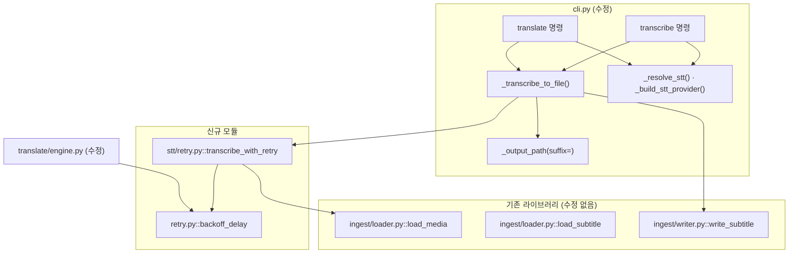

# `transcribe` 배선과 `--media` 입력 구현 계획 (FR-8.3)

> **For agentic workers:** REQUIRED SUB-SKILL: Use superpowers:subagent-driven-development (recommended) or superpowers:executing-plans to implement this plan task-by-task. Steps use checkbox (`- [ ]`) syntax for tracking.

**Goal:** WP9가 만든 STT 어댑터를 CLI에 잇는다 - `cuesift transcribe <영상>`이 원문 자막을 내고, `cuesift translate --media <영상> --to en`이 전사한 뒤 그 자막을 번역한다.

**Architecture:** 명령 둘이 아니라 **진입점 둘과 그것들이 공유하는 헬퍼 하나**를 만든다. `_transcribe_to_file()`이 출력 경로 규칙과 재사용 판정을 한 곳에 모으고 **`Path`를 반환하므로**, `translate`는 그 경로를 평소의 자막 입력처럼 다룬다 - 번역 파이프라인 안쪽에 STT 분기가 생기지 않는다. 재시도는 라이브러리(`stt/retry.py`)에 두어 파이썬 호출자도 얻게 하고, 백오프 정책만 `retry.py`로 승격해 번역과 공유한다.

**Tech Stack:** Python 3.11+ · typer · pysubs2 · httpx · pytest · ruff. **의존성을 추가하지 않는다.**

**Spec:** [`docs/superpowers/specs/2026-09-02-media-wiring-design.md`](../specs/2026-09-02-media-wiring-design.md)

## Global Constraints

이 절의 값은 스펙과 `CLAUDE.md`에서 그대로 옮긴 것이다. **모든 태스크의 요구사항에 암묵적으로 포함된다.**

| 제약 | 값 |
| --- | --- |
| Python 실행 | `.venv/Scripts/python.exe` - 시스템 Python은 3.14라 다르다 |
| 모듈 첫 줄 | `from __future__ import annotations` |
| 독스트링·주석 | **한국어.** 근거 FR·§ 번호를 병기한다 (예: `FR-8.3`, `설계 D5`) |
| 주석의 내용 | "왜 이 값인가"가 아니라 **"이 값이 아니면 무엇이 깨지는가"** |
| ruff | `line-length = 100`, 규칙 `E,F,I,UP,B,SIM` |
| **em dash(U+2014) 금지** | 출력 문자열과 **커맨드 독스트링**(그대로 `--help`가 된다)에 쓰지 않는다. cp949가 인코딩하지 못해 `cuesift --help > f.txt`가 종료 코드 1로 죽은 전례가 있고 이 저장소에서 1은 "규격 위반 발견"이다. `tests/test_cli.py::test_help_output_has_no_em_dash`가 게이트다. `·`(U+00B7)·`§`(U+00A7)·`→`(U+2192)는 cp949에 있어 계속 써도 된다 |
| 의존성 | 런타임 4개(`typer`·`pysubs2`·`pyyaml`·`httpx`), dev 3개. **추가하지 않는다** |
| 커밋 메시지 | 한국어 |
| 푸시 | 사용자가 명시적으로 요청할 때만. 커밋과 푸시를 한 명령에 묶지 않는다 |

**로컬 게이트는 CI와 대상이 같아야 한다. `src tests`로 좁히면 안 된다.**

```bash
.venv/Scripts/python.exe -m ruff check .
.venv/Scripts/python.exe -m ruff format --check .
.venv/Scripts/python.exe -m pytest --cov=cuesift --cov-report=term-missing
python scripts/check_links.py
npx --yes markdownlint-cli2
```

### 착수 시점의 게이트 수치 (실측 2026-09-02)

| 게이트 | 지금 | 이 계획을 마친 뒤 |
| --- | --- | --- |
| `pytest -q` | **1700 passed · 5 deselected** | 늘어난다 |
| `test_CLI_옵션은_24개다` | **24** (translate 20 · check 3 · transcribe 1) | **30** (translate 23 · check 3 · transcribe 4) |
| `ruff check .` / `format --check .` | **123 files** | 신규 모듈 2개 + 신규 테스트 2개만큼 늘어난다 |
| `check_links.py` | 마크다운 **42**개 · 상대 링크 213개 · 깨진 링크 0 | **두 수가 markdownlint와 같은지 본다** |
| `markdownlint-cli2` | `Linting: 42 files` · 0 issues | 이 계획서를 `git add` 하면 43 |

**"통과했나"가 아니라 "무엇을 대상으로 통과했나"를 본다.** 0개 수집은 통과가 아니라 설정 오류다. 문서를 추가했으면 `git add` 뒤에 링크 체커를 돌리고, **두 도구의 파일 개수가 같은지**를 확인한다 - `check_links.py`는 `git ls-files`를 보므로 추적되기 전의 새 문서는 검사를 아예 받지 않는다.

---

## 파일 구조



| 파일 | 책임 | 태스크 |
| --- | --- | --- |
| `src/cuesift/retry.py` | **신설.** 백오프 정책 한 함수. 번역과 STT가 공유한다 | 1 |
| `src/cuesift/translate/engine.py` | `_backoff_delay`와 상수 둘을 위로 넘긴다 | 1 |
| `src/cuesift/stt/retry.py` | **신설.** `transcribe_with_retry` - `load_media`를 감싸는 재시도 루프 | 2 |
| `src/cuesift/cli.py` | `_output_path` 시그니처 · `_transcribe_to_file` · `transcribe` 본문 · `translate --media` · 종료 코드 표 | 3·4·5·6 |
| `src/cuesift/config/schema.py` | `BINDINGS`에 4행 추가·1행 확장 | 4·5 |
| `src/cuesift/ingest/loader.py` | `_reject_non_subtitle` 문구만 (C2 재개봉) | 6 |
| `tests/fakes/stt.py` | 순차 응답 가짜를 더한다 - `FakeSttProvider`는 "429 뒤 성공"을 못 만든다 | 2 |

**`stt/__init__.py`는 건드리지 않는다.** 이유는 Task 2에 있다 (순환 임포트, 실측).

---

## Task 1: 백오프 정책을 `cuesift/retry.py`로 승격

**Files:**

- Create: `src/cuesift/retry.py`
- Create: `tests/test_retry.py`
- Modify: `src/cuesift/translate/engine.py:56,71,129-141,531` (상수 2개·함수 1개 제거, 호출 1곳)
- Modify: `tests/test_translate_engine.py:15,673,697,713,714` (임포트 출처 변경)

**Interfaces:**

- Consumes: 없음 (첫 태스크)
- Produces: `cuesift.retry.backoff_delay(attempt: int, retry_after_s: float | None) -> float` · `cuesift.retry.BACKOFF_BASE_S: float` · `cuesift.retry.MAX_BACKOFF_S: float`

**왜 이 태스크가 먼저인가:** Task 2의 `transcribe_with_retry`가 이 함수를 쓴다. 각자 두면 한쪽만 상한을 고쳤을 때 다른 쪽이 무한정 자라고, **그 갈림은 예외가 아니라 "CLI가 하루 동안 무출력으로 멈춰 있다"로만 드러난다**(설계 §4.1).

- [ ] **Step 1: 실패하는 테스트를 쓴다**

`tests/test_retry.py`를 만든다.

```python
"""백오프 정책 (설계 §4.1).

**이 파일이 있는 이유는 공유다.** 정책이 `translate/engine.py`에만 있으면
STT 쪽이 자기 판본을 만들고, 두 판본은 한쪽만 상한을 고쳤을 때 갈린다.
"""

from __future__ import annotations

from cuesift.retry import MAX_BACKOFF_S, backoff_delay


def test_서버_힌트가_지수_백오프를_이긴다() -> None:
    assert backoff_delay(0, 5.0) == 5.0


def test_힌트_0은_None과_다르다() -> None:
    # 참·거짓으로 보면 0이 None과 뭉뚱그려져 1.0으로 떨어진다. 0은
    # "쓸 수 있는 힌트가 없음"이 아니라 "지금 다시 걸어도 된다"는 유효한
    # 힌트이고, `RetryableProviderError`의 정규화도 0을 통과시킨다.
    assert backoff_delay(0, 0.0) == 0.0


def test_힌트가_없으면_지수로_자란다() -> None:
    assert [backoff_delay(i, None) for i in range(4)] == [1.0, 2.0, 4.0, 8.0]


def test_상한이_서버_힌트에_걸린다() -> None:
    # `Retry-After: 86400`은 일일 할당량 리셋을 알리는 실서비스의 흔한 값이다.
    # 그대로 자면 CLI가 하루 동안 무출력으로 멈춘다.
    assert backoff_delay(0, 86400.0) == MAX_BACKOFF_S


def test_상한이_지수_백오프에도_걸린다() -> None:
    # **상한을 힌트 경로에만 걸면 이쪽이 무한정 자란다.** 두 경로 모두에
    # 걸어야 한다는 것이 이 함수의 계약이다.
    assert backoff_delay(20, None) == MAX_BACKOFF_S
```

- [ ] **Step 2: 실패를 확인한다**

Run: `.venv/Scripts/python.exe -m pytest tests/test_retry.py -v`
Expected: FAIL - `ModuleNotFoundError: No module named 'cuesift.retry'`

- [ ] **Step 3: `src/cuesift/retry.py`를 만든다**

```python
"""재시도 백오프 정책 (FR-1.2 · 설계 §4.1).

**번역과 STT가 같은 정책을 쓰는 것이 이 모듈의 존재 이유다.** 각자 두면
한쪽만 상한을 고쳤을 때 다른 쪽이 무한정 자라고, 그 갈림은 예외가 아니라
"CLI가 하루 동안 무출력으로 멈춰 있다"로만 드러난다.

**루프는 여기 없다.** `translate`는 `provider.complete(messages, temperature,
max_tokens)`를 부르고 STT는 `transcribe(audio, language=)`를 부른다 -
시그니처가 달라 루프 자체는 공유할 수 없다(설계 P3). 공유할 수 있는 것은
정책 함수 하나뿐이고, 그것이 이 모듈이다.
"""

from __future__ import annotations

BACKOFF_BASE_S = 1.0
"""지수 백오프의 첫 간격이다. `2**attempt`로 증폭되므로 이 값이 그대로
남지 않는다 - 크면 첫 재시도까지의 지연이 배수로 불어나 사용자가 그만큼 더
기다리고, 0에 가까우면 지수 백오프가 사실상 즉시 재시도가 되어 429를 유발한
부하를 그대로 유지한다."""

MAX_BACKOFF_S = 60.0
"""한 번의 대기 상한이다. **이 상한은 예외의 계약이 아니라 여기의 정책이다** -
`RetryableProviderError`는 도메인(0 이상의 유한한 초) 밖만 걸러내고 크기는
보지 않는다.

크면 `Retry-After: 86400`(일일 할당량 리셋을 알리는 실서비스의 흔한 값)을
그대로 자서 CLI가 하루 동안 무출력으로 멈춘다. `sleep`이 주입 가능해도
기본값이 `time.sleep`이라 실사용은 그대로 걸린다. 작으면 서버가 준 유효한
힌트를 무시해 제한이 풀리기 전에 다시 걸고 429가 재발한다 - 무시하지 않으려고
힌트를 존중한 의미가 사라진다.

번역의 기본 설정(`max_retries=3`)도 STT의 `STT_MAX_RETRIES=3`도 지수 백오프
최대가 4.0초라 이 상한에 닿지 않는다. 상한이 실제로 관여하는 것은 서버가 준
큰 힌트와 `max_retries`를 크게 잡은 설정뿐이다."""


def backoff_delay(attempt: int, retry_after_s: float | None) -> float:
    """대기 시간. 서버가 지정했으면 그것이 우선이고, 상한에서 잘린다.

    `is not None`이어야 한다. 참·거짓으로 보면 `retry_after_s=0`이 None과
    뭉뚱그려져 지수 백오프로 떨어진다 - 0은 "쓸 수 있는 힌트가 없음"이
    아니라 "지금 다시 걸어도 된다"는 유효한 힌트이고, 프로바이더의 정규화도
    0을 통과시킨다.

    상한을 두 경로 **모두**에 거는 것이 요점이다. 서버 힌트에만 걸면
    `max_retries`를 크게 잡은 설정에서 `2**attempt`가 그대로 자란다.
    """
    delay = retry_after_s if retry_after_s is not None else BACKOFF_BASE_S * (2**attempt)
    return min(delay, MAX_BACKOFF_S)
```

- [ ] **Step 4: 테스트 통과를 확인한다**

Run: `.venv/Scripts/python.exe -m pytest tests/test_retry.py -v`
Expected: PASS - 5 passed

- [ ] **Step 5: `translate/engine.py`가 새 모듈을 쓰게 한다**

세 곳을 지우고 한 곳을 바꾼다.

1. **56행 부근** - `_BACKOFF_BASE_S = 1.0`과 그 위 주석 4줄을 지운다.
2. **71행 부근** - `_MAX_BACKOFF_S = 60.0`과 그 위 주석 블록을 지운다.
3. **129~141행** - `_backoff_delay` 함수 전체를 지운다.
4. **임포트 절**에 한 줄을 더한다.

```python
from cuesift.retry import backoff_delay
```

**531행** - 호출을 바꾼다.

```python
# 전
                sleep(_backoff_delay(attempt, e.retry_after_s))
# 후
                sleep(backoff_delay(attempt, e.retry_after_s))
```

**별칭(`_MAX_BACKOFF_S = MAX_BACKOFF_S`)을 남기지 않는다.** 같은 값에 이름이 둘이면 어느 쪽이 진짜인지 다음 사람이 판단해야 하고, 한쪽만 고치는 사고가 다시 열린다.

- [ ] **Step 6: 기존 테스트의 임포트 출처를 바꾼다**

`tests/test_translate_engine.py`에서 다섯 곳이다.

```python
# 15행 - 전
from cuesift.translate.engine import _MAX_BACKOFF_S, translate_segments
# 15행 - 후
from cuesift.retry import MAX_BACKOFF_S
from cuesift.translate.engine import translate_segments
```

673·697·713·714행의 `_MAX_BACKOFF_S`를 `MAX_BACKOFF_S`로 바꾼다. **이 넷은 값을 검사하는 단언이라 이름만 바뀌고 의미는 그대로다** - 검사 대상이 옮겨 갔을 뿐 게이트의 힘은 같다.

- [ ] **Step 7: 전체 게이트를 돌린다**

```bash
.venv/Scripts/python.exe -m ruff check .
.venv/Scripts/python.exe -m ruff format --check .
.venv/Scripts/python.exe -m pytest -q
```

Expected: `ruff` 통과 · **1705 passed · 5 deselected** (1700 + 신규 5)

**수를 읽는다.** 1705가 아니면 기존 테스트가 죽었거나 새 파일이 수집되지 않은 것이다.

- [ ] **Step 8: 커밋한다**

```bash
git add src/cuesift/retry.py tests/test_retry.py src/cuesift/translate/engine.py tests/test_translate_engine.py
git commit -m "리팩터: 백오프 정책을 cuesift/retry.py로 승격한다 (설계 §4.1)"
```

---

## Task 2: `stt/retry.py` - STT 재시도 루프

**Files:**

- Create: `src/cuesift/stt/retry.py`
- Create: `tests/test_stt_retry.py`
- Modify: `tests/fakes/stt.py` (순차 응답 가짜 추가)

**Interfaces:**

- Consumes: `cuesift.retry.backoff_delay` (Task 1)
- Produces:
  - `cuesift.stt.retry.STT_MAX_RETRIES: int` (= 3)
  - `cuesift.stt.retry.transcribe_with_retry(provider: SttProvider, media: Path, *, language: str, on_retry: Callable[[int, float, RetryableProviderError], None] | None = None, max_retries: int = STT_MAX_RETRIES, sleep: Callable[[float], None] = time.sleep) -> IngestResult`
  - `tests.fakes.stt.SequenceSttProvider(outcomes: Sequence[Transcript | ProviderError])`

**이 태스크가 닫는 것 (이월 7):** 어댑터는 `Retry-After`까지 실어 `RetryableProviderError`를 던지는데 **받는 코드가 리포 전체에 0건이다.** 넣지 않으면 사용자가 몇 분을 기다린 뒤 429 하나로 전부 잃는다.

**⚠ 순환 임포트 - 실측된 제약:**

`stt/retry.py`가 `cuesift.ingest.loader`를 임포트한다. **`stt/__init__.py`에서 이 모듈을 export하면 그 순간 순환이 된다.**

| `stt/__init__.py`에서 | `import cuesift.ingest` | `import cuesift.stt.retry` |
| --- | --- | --- |
| export **안 함** | rc=0 | rc=0 |
| export **함** | **rc=1** `ImportError: cannot import name 'load_media' from partially initialized module 'cuesift.ingest.loader'` | - |

경로는 `cuesift.ingest.loader` → `cuesift.stt.provider` → `cuesift.stt.__init__` → `cuesift.stt.retry` → `cuesift.ingest.loader`(아직 초기화 중)다. **`stt/__init__.py`를 건드리지 않는다.** `cli.py`는 `from cuesift.stt.retry import ...`로 직접 임포트한다.

- [ ] **Step 1: 순차 응답 가짜를 더한다**

`tests/fakes/stt.py` 끝에 붙인다. `FakeSttProvider`는 `error`를 주면 **매번** 같은 예외를 던져 "429 뒤 성공"을 만들 수 없는데, 재시도 루프의 게이트는 정확히 그 전이를 봐야 한다.

```python
class SequenceSttProvider:
    """호출 순서대로 예외를 던지거나 전사를 낸다. `SttProvider`의 구현이다.

    **`FakeSttProvider`로는 재시도 루프를 잴 수 없다.** 그쪽의 `error`는
    매번 같은 예외를 던지므로 "429 한 번 뒤 성공"이라는 전이가 만들어지지
    않고, 재시도 루프가 없는 구현과 있는 구현이 같은 결과를 낸다.

    목록이 소진되면 **마지막 원소를 반복한다** - 재시도 소진 테스트가
    `max_retries + 1`개를 손으로 세어 적지 않아도 된다.
    """

    name = "sequence-stt"

    def __init__(self, outcomes: Sequence[Transcript | ProviderError]) -> None:
        if not outcomes:
            raise ValueError("outcomes가 비었다. 0개 수집은 통과가 아니라 설정 오류다")
        self._outcomes = list(outcomes)
        self.calls: list[Path] = []
        self.languages: list[str | None] = []

    def transcribe(self, audio: Path, *, language: str | None) -> Transcript:
        self.calls.append(audio)
        self.languages.append(language)
        outcome = self._outcomes[min(len(self.calls) - 1, len(self._outcomes) - 1)]
        if isinstance(outcome, ProviderError):
            raise outcome
        return outcome
```

임포트 절에 `from collections.abc import Sequence`를 더한다.

- [ ] **Step 2: 실패하는 테스트를 쓴다**

`tests/test_stt_retry.py`를 만든다. 스펙 §8.1의 **G5·G6**이 여기 있다.

```python
"""STT 재시도 루프 (FR-1.2 · 설계 §6).

**이 루프가 없으면 사용자가 몇 분을 기다린 뒤 429 하나로 전부 잃는다.**
어댑터는 `Retry-After`까지 실어 `RetryableProviderError`를 던지는데 배선
이전에는 그것을 받는 코드가 리포 전체에 0건이었다.
"""

from __future__ import annotations

from pathlib import Path

import pytest
from tests.fakes.stt import SequenceSttProvider

from cuesift.ingest import IngestError
from cuesift.retry import MAX_BACKOFF_S
from cuesift.stt.provider import Transcript, TranscriptCue
from cuesift.stt.retry import STT_MAX_RETRIES, transcribe_with_retry
from cuesift.translate.provider import FatalProviderError, RetryableProviderError


def _transcript() -> Transcript:
    return Transcript(
        cues=(TranscriptCue(start_s=0.0, end_s=1.0, text="안녕"),),
        language="ko",
        model="fake",
    )


@pytest.fixture
def media(tmp_path: Path) -> Path:
    # `load_media`가 `path.is_file()`을 먼저 본다. 내용은 프로바이더가 가짜라
    # 읽히지 않으므로 존재하기만 하면 된다.
    path = tmp_path / "talk.mp4"
    path.write_bytes(b"not really a video")
    return path


def test_429_뒤_성공은_두_번_부른다(media: Path) -> None:
    """G5. 재시도 루프가 없으면 첫 호출에서 예외가 그대로 샌다."""
    provider = SequenceSttProvider(
        [RetryableProviderError("429 rate limited", retry_after_s=5.0), _transcript()]
    )
    waited: list[float] = []

    result = transcribe_with_retry(
        provider, media, language="ko", sleep=waited.append
    )

    assert len(provider.calls) == 2
    assert len(result.segments) == 1
    # 서버가 준 힌트를 그대로 쓴다. 지수 백오프로 떨어지면 1.0이 된다.
    assert waited == [5.0]


def test_힌트가_없으면_지수로_잔다(media: Path) -> None:
    provider = SequenceSttProvider([RetryableProviderError("503"), _transcript()])
    waited: list[float] = []

    transcribe_with_retry(provider, media, language="ko", sleep=waited.append)

    assert waited == [1.0]


def test_Fatal은_재시도되지_않는다(media: Path) -> None:
    """G6. 두 예외를 한 절로 잡는 구현에서 호출이 4회가 된다.

    **두 예외를 형제로 두는 계약이 여기에도 걸린다.** `FatalProviderError`를
    `RetryableProviderError`의 하위로 옮기면 이 루프가 인증 실패를 네 번
    재시도하고, 사용자는 틀린 키로 네 번을 기다린다.
    """
    provider = SequenceSttProvider([FatalProviderError("401 unauthorized")])
    waited: list[float] = []

    with pytest.raises(FatalProviderError, match="401"):
        transcribe_with_retry(provider, media, language="ko", sleep=waited.append)

    assert len(provider.calls) == 1
    assert waited == []


def test_재시도_소진은_마지막_예외를_전파한다(media: Path) -> None:
    provider = SequenceSttProvider([RetryableProviderError("429")])
    waited: list[float] = []

    with pytest.raises(RetryableProviderError, match="429"):
        transcribe_with_retry(provider, media, language="ko", sleep=waited.append)

    # 재시도 3회면 호출은 4회다.
    assert len(provider.calls) == STT_MAX_RETRIES + 1
    # **마지막 시도 뒤에는 자지 않는다** - 호출 N+1회에 대기는 N회다.
    # 거기서 자면 아무도 기다릴 이유가 없는 시간을 CLI가 쓴다.
    assert len(waited) == STT_MAX_RETRIES


def test_on_retry가_재시도마다_불린다(media: Path) -> None:
    """라이브러리가 문구를 알지 않는 통로다 (설계 §6)."""
    provider = SequenceSttProvider(
        [RetryableProviderError("429", retry_after_s=2.0), _transcript()]
    )
    seen: list[tuple[int, float, str]] = []

    transcribe_with_retry(
        provider,
        media,
        language="ko",
        on_retry=lambda attempt, delay, exc: seen.append((attempt, delay, str(exc))),
        sleep=lambda _: None,
    )

    assert seen == [(0, 2.0, "429")]


def test_상한이_STT_경로에도_걸린다(media: Path) -> None:
    provider = SequenceSttProvider(
        [RetryableProviderError("429", retry_after_s=86400.0), _transcript()]
    )
    waited: list[float] = []

    transcribe_with_retry(provider, media, language="ko", sleep=waited.append)

    assert waited == [MAX_BACKOFF_S]


def test_IngestError는_재시도되지_않는다(tmp_path: Path) -> None:
    """합성 실패는 다시 걸어도 같다. 파일이 없는 것도 마찬가지다."""
    provider = SequenceSttProvider([_transcript()])

    with pytest.raises(IngestError) as caught:
        transcribe_with_retry(provider, tmp_path / "없다.mp4", language="ko", sleep=lambda _: None)

    assert caught.value.reason == "not_found"
    assert provider.calls == []


def test_언어_힌트가_프로바이더까지_간다(media: Path) -> None:
    # 값이 틀린 것은 시그니처 검사로 잡히지 않는다. Whisper 계열에서 언어
    # 힌트는 전사 결과를 실질적으로 바꾼다.
    provider = SequenceSttProvider([_transcript()])

    transcribe_with_retry(provider, media, language="ja", sleep=lambda _: None)

    assert provider.languages == ["ja"]


def test_stt_패키지가_이_모듈을_export하지_않는다() -> None:
    """**export하면 순환 임포트가 된다** (실측).

    `cuesift.ingest.loader` → `cuesift.stt.provider` → `cuesift.stt.__init__`
    → 여기 → `cuesift.ingest.loader`(초기화 중)로 돌아
    `ImportError: cannot import name 'load_media' from partially initialized
    module`이 난다. export하지 않으면 두 임포트 순서 모두 정상이다.

    이 게이트가 없으면 다음 사람이 "왜 이것만 `__all__`에 없지"라며 더하고,
    실패는 임포트 시점이라 **스위트 전체가 한꺼번에 죽는다.**
    """
    import cuesift.stt

    assert not hasattr(cuesift.stt, "transcribe_with_retry")
```

- [ ] **Step 3: 실패를 확인한다**

Run: `.venv/Scripts/python.exe -m pytest tests/test_stt_retry.py -v`
Expected: FAIL - `ModuleNotFoundError: No module named 'cuesift.stt.retry'`

- [ ] **Step 4: `src/cuesift/stt/retry.py`를 만든다**

```python
"""STT 호출의 재시도 루프 (FR-1.2 · 설계 §4.1·§6).

**`SttProvider` 프로토콜의 구현이 아니라 그 호출부다.** 계약 3번("재시도하지
않는다. 호출부가 한다")은 그대로 남고, 이 모듈이 그 호출부를 라이브러리에
제공한다. `cli.py`에 두면 파이썬 호출자는 재시도를 못 얻는다 - 어댑터가
`Retry-After`까지 실어 재시도 가능이라고 말해도 **받는 코드가 다시 0건이 된다.**

**`cuesift.stt.__init__`에서 이 모듈을 export하면 안 된다** (실측). 아래
`load_media` 임포트가 `cuesift.ingest.loader` → `cuesift.stt.provider` →
`cuesift.stt.__init__` → 여기 → `cuesift.ingest.loader`(초기화 중)로 돌아
`ImportError: cannot import name 'load_media' from partially initialized
module`이 난다. export하지 않으면 두 임포트 순서 모두 정상이다 -
`tests/test_stt_retry.py::test_stt_패키지가_이_모듈을_export하지_않는다`가
그 제약을 건다.
"""

from __future__ import annotations

import time
from collections.abc import Callable
from pathlib import Path

from cuesift.ingest.loader import IngestResult, load_media
from cuesift.retry import backoff_delay
from cuesift.stt.provider import SttProvider
from cuesift.translate.provider import FatalProviderError, RetryableProviderError

STT_MAX_RETRIES = 3
"""재시도 횟수라 총 호출은 4회다 (`translate`의 `max_retries`와 같은 뜻).

**모듈 상수이고 CLI에 노출하지 않는다**(설계 D3). `translate`의 LLM 재시도가
`--max-retries`를 노출하지 않는데 STT만 바꿀 수 있으면, 같은 성격의 값에
통로가 하나만 열린 비대칭이 된다 - 사용자는 왜 한쪽만 되는지 알 방법이 없다."""


def transcribe_with_retry(
    provider: SttProvider,
    media: Path,
    *,
    language: str,
    on_retry: Callable[[int, float, RetryableProviderError], None] | None = None,
    max_retries: int = STT_MAX_RETRIES,
    sleep: Callable[[float], None] = time.sleep,
) -> IngestResult:
    """전사하고 재시도 가능한 실패만 다시 건다.

    **반환이 `Transcript`가 아니라 `IngestResult`인 것은 재시도의 단위가
    전사 한 번 전체이기 때문이다.** `load_media`는 프로바이더 호출과 세그먼트
    합성을 함께 하는데, 합성 실패(`IngestError` - 큐 0개·파일 없음)는 다시
    걸어도 같으므로 재시도 대상이 아니다. 그대로 전파된다.

    `FatalProviderError`를 **즉시 전파한다.** 401과 `verbose_json` 미지원은
    다시 걸어도 같은 답이 온다. **두 예외를 형제로 두는 계약이 여기에도
    걸린다** - `FatalProviderError`를 `RetryableProviderError`의 하위로
    옮기면 이 루프가 인증 실패를 네 번 재시도하고, 사용자는 틀린 키로 네 번을
    기다린다. `translate/engine.py::_call_with_retry`가 같은 사고를 기록하고
    있고, 상속 관계를 바꾸면
    `tests/test_translate_provider.py::test_재시도_가능_실패는_서로_구분된다`가
    함께 죽는다.

    **마지막 시도 뒤에는 자지 않는다** - 호출 N+1회에 대기는 N회다. 거기서
    자면 아무도 기다릴 이유가 없는 시간을 CLI가 쓴다.

    `on_retry`는 **다시 걸기 직전**에 불린다. 라이브러리가 문구를 알지 않게
    하는 통로다 - `ProgressUpdate`가 단계 이름을 싣지 않는 것(FR-8.5 설계 D2)과
    같은 이유다. 인자는 `(방금 실패한 시도의 0-based 번호, 잘 초, 그 예외)`다.

    `sleep`은 테스트가 실제로 기다리지 않게 하려고 주입 가능하다.
    """
    if max_retries < 0:
        raise ValueError(f"max_retries({max_retries})는 0 이상이어야 한다")

    last: RetryableProviderError | None = None
    for attempt in range(max_retries + 1):
        try:
            return load_media(media, provider, source_lang=language)
        except FatalProviderError:
            # 오늘은 아무것도 바꾸지 않는다 - 두 예외가 형제라 아래 절이
            # 애초에 Fatal을 잡지 않는다. 그래도 남기는 것은 "프로바이더
            # 실패를 한 번에 잡자"며 아래를 `except ProviderError`로 넓히는
            # 리팩터를 막기 위해서다. 그때 이 절이 없으면 401이 재시도
            # 대상이 되고, 있으면 순서가 앞서 그대로 전파된다.
            raise
        except RetryableProviderError as exc:
            last = exc
            if attempt < max_retries:
                delay = backoff_delay(attempt, exc.retry_after_s)
                if on_retry is not None:
                    on_retry(attempt, delay, exc)
                sleep(delay)

    # 루프가 한 번은 돌고(위에서 max_retries >= 0을 보장한다) 끝까지 온 것은
    # 매 회 재시도 가능 실패였다는 뜻이므로 last는 반드시 채워져 있다.
    assert last is not None
    raise last
```

- [ ] **Step 5: 테스트 통과를 확인한다**

Run: `.venv/Scripts/python.exe -m pytest tests/test_stt_retry.py -v`
Expected: PASS - 9 passed

- [ ] **Step 6: 게이트를 실제로 실패시켜 본다**

**게이트를 만들면 반드시 실패시켜 봐야 한다.** 회귀 테스트는 버그 코드에서 실제로 실패하는 것을 확인한 뒤에야 회귀 테스트다.

두 변이를 손으로 넣고 각각 확인한 뒤 되돌린다.

| 변이 | 죽어야 하는 테스트 |
| --- | --- |
| `except FatalProviderError: raise` 절을 지우고 아래를 `except ProviderError`로 넓힌다 | `test_Fatal은_재시도되지_않는다` (호출 1회 → 4회) |
| `if attempt < max_retries:` 조건을 지워 늘 잔다 | `test_재시도_소진은_마지막_예외를_전파한다` (대기 3회 → 4회) |

각 변이에서 그 테스트가 **실제로 죽는 것을 눈으로 본 뒤** 되돌린다. 죽지 않으면 게이트가 아니라 장식이므로 테스트를 다시 짠다.

- [ ] **Step 7: 전체 게이트를 돌린다**

```bash
.venv/Scripts/python.exe -m ruff check .
.venv/Scripts/python.exe -m ruff format --check .
.venv/Scripts/python.exe -m pytest -q
```

Expected: **1714 passed · 5 deselected** (1705 + 신규 9)

- [ ] **Step 8: 커밋한다**

```bash
git add src/cuesift/stt/retry.py tests/test_stt_retry.py tests/fakes/stt.py
git commit -m "STT 재시도 루프를 라이브러리에 넣는다 (이월 7 · 설계 §6)"
```

---

## Task 3: `_output_path`의 `suffix`를 필수 키워드 인자로 (C1 · D6)

**Files:**

- Modify: `src/cuesift/cli.py:788-812` (`_output_path` 시그니처와 본문 마지막 줄)
- Modify: `src/cuesift/cli.py:1367,1776,1986` (호출부 3곳)
- Modify: `tests/test_cli_review_out.py:110` (호출부 1곳)
- Modify: `tests/test_cli.py` (게이트 2개 추가)

**Interfaces:**

- Consumes: 없음
- Produces: `_output_path(input_path: Path, out_dir: Path | None, source_lang: str, target_lang: str, *, suffix: str) -> Path`

**이 태스크가 닫는 것 (이월 1 · C1):** 예전 판은 입력 확장자를 무조건 물려받아 `talk.mp4`에서 **`talk.en.mp4`라는 이름의 SRT 파일**을 만든다. 오늘은 도달 경로가 없어 **어떤 게이트도 빨개지지 않는다** - 배선이 이것을 빼면 그때부터 조용히 깨진다.

- [ ] **Step 1: 실패하는 테스트를 쓴다**

`tests/test_cli.py`에 붙인다. 스펙 §8.1의 **G8**이다.

```python
def test_output_path는_suffix를_반드시_받는다() -> None:
    """설계 D6. **기본값을 두면 위험한 쪽이 기본이 된다.**

    이 게이트는 동작이 아니라 **시그니처**를 본다 - 기본값
    (`suffix: str = ""` 또는 `input_path.suffix`)을 되돌려 넣는 변이는
    기존 호출부의 출력이 같아 다른 어떤 테스트로도 죽지 않는다. 다음에 영상
    경로를 하나 더 붙이는 사람이 값을 넘기지 않으면 `TypeError`를 받는다 -
    조용한 실패가 시끄러운 실패가 된다.
    """
    with pytest.raises(TypeError):
        cli._output_path(Path("talk.mp4"), None, "ko", "ko")  # type: ignore[call-arg]


def test_output_path가_입력_확장자를_물려받지_않는다() -> None:
    """C1. 예전 판은 `talk.ko.mp4`라는 이름의 SRT 파일을 만든다.

    **확장자만 다르고 예외는 없다** - 플레이어가 열지 못하는 파일이 조용히
    생기고 종료 코드는 0이다.
    """
    assert cli._output_path(Path("talk.mp4"), None, "ko", "ko", suffix=".srt") == Path(
        "talk.ko.srt"
    )
    # 이미 태그가 붙은 입력도 같은 출력을 낸다 - 치환 규칙이 작동한다.
    assert cli._output_path(Path("talk.ko.mp4"), None, "ko", "ko", suffix=".srt") == Path(
        "talk.ko.srt"
    )
```

`tests/test_cli.py`의 임포트에 `from pathlib import Path`와 `from cuesift import cli`가 있는지 확인하고, 없으면 더한다.

- [ ] **Step 2: 실패를 확인한다**

Run: `.venv/Scripts/python.exe -m pytest tests/test_cli.py -k output_path -v`
Expected: FAIL - 첫 테스트는 `DID NOT RAISE TypeError`(현재는 `suffix` 인자가 없어 그냥 통과), 둘째는 `TypeError: _output_path() got an unexpected keyword argument 'suffix'`

- [ ] **Step 3: 시그니처를 바꾼다**

`src/cuesift/cli.py:788`.

```python
def _output_path(
    input_path: Path,
    out_dir: Path | None,
    source_lang: str,
    target_lang: str,
    *,
    suffix: str,
) -> Path:
```

독스트링 끝에 문단 하나를 더한다.

```text
    **`suffix`가 필수 키워드 인자인 것이 게이트다**(설계 D6). 예전 판은
    `input_path.suffix`를 무조건 물려받았는데, 영상 입력이 들어오는 순간
    그것이 `talk.ko.mp4`라는 이름의 **SRT 파일**을 만든다 - 확장자만 틀리고
    예외는 없어 플레이어가 열지 못하는 파일이 조용히 생기며 종료 코드는 0이다.
    기본값을 두면 위험한 쪽이 기본이 되어 다음에 영상 경로를 하나 더 붙이는
    사람이 똑같이 밟는다. 값을 넘기지 않으면 `TypeError`이므로 조용한 실패가
    시끄러운 실패가 된다.
```

본문 마지막 줄을 바꾼다.

```python
# 전
    return directory / f"{stem}.{target_lang}{input_path.suffix}"
# 후
    return directory / f"{stem}.{target_lang}{suffix}"
```

- [ ] **Step 4: 호출부 4곳을 고친다**

**동작이 바뀌지 않는다** - 넷 다 기존 번역 경로라 입력 확장자를 그대로 넘긴다.

```python
# cli.py:1367
        out_path = _output_path(input, out, source_lang, target, suffix=input.suffix)
# cli.py:1776
                f"[{target}] {_output_path(input_path, out_dir, source_lang, target, suffix=input_path.suffix)}",
# cli.py:1986
    out_path = _output_path(input_path, out_dir, source_lang, target_lang, suffix=input_path.suffix)
# tests/test_cli_review_out.py:110
    subtitle = _output_path(src, Path("subs"), source_lang, "en", suffix=src.suffix)
```

1776행은 `line-length = 100`을 넘길 수 있다. 넘기면 줄바꿈한다 - `ruff format`이 정한 형태를 그대로 받아들인다.

**호출부를 빠뜨렸는지 확인한다.**

```bash
grep -rn "_output_path(" src/ tests/ --include=*.py
```

`def` 줄과 주석을 뺀 호출이 정확히 **4곳**이고 모두 `suffix=`를 갖는지 본다. `TypeError`는 조용하지 않아 게이트가 반드시 잡지만, 잡히는 자리가 실행 경로 안이면 사용자가 먼저 만난다.

- [ ] **Step 5: 테스트 통과를 확인한다**

Run: `.venv/Scripts/python.exe -m pytest -q`
Expected: **1716 passed · 5 deselected** (1714 + 신규 2)

- [ ] **Step 6: 게이트를 실패시켜 본다**

시그니처에 `suffix: str = ""`를 넣어 기본값을 되돌린 뒤 `test_output_path는_suffix를_반드시_받는다`가 죽는 것을 확인하고 되돌린다. **이 변이는 다른 어떤 테스트로도 죽지 않는다** - 그래서 이 게이트가 따로 있다.

- [ ] **Step 7: 커밋한다**

```bash
git add src/cuesift/cli.py tests/test_cli.py tests/test_cli_review_out.py
git commit -m "픽스: _output_path가 확장자를 물려받지 않게 한다 (이월 1 · 설계 D6)"
```

---

## Task 4: `_transcribe_to_file`과 `transcribe` 배선

**Files:**

- Modify: `src/cuesift/cli.py` - 임포트 절 · `_resolve_stt` · `_build_stt_provider` · `_transcribe_to_file` 신설, `_not_implemented` 제거, `transcribe` 본문
- Modify: `src/cuesift/config/schema.py` - `BINDINGS` 3행 추가·1행 확장
- Modify: `tests/test_config_schema.py:30-34` - 옵션 개수 24 → 27, 함수명 변경
- Modify: `tests/test_cli.py:92-94` - 70 기대를 지운다
- Modify: `tests/test_cli_pipe.py:92,430-465` - 70 계약 행 교체, `_not_implemented` 테스트 2개 제거
- Create: `tests/test_cli_transcribe.py`

**Interfaces:**

- Consumes: `cuesift.stt.retry.transcribe_with_retry`·`STT_MAX_RETRIES` (Task 2) · `_output_path(..., suffix=)` (Task 3)
- Produces:
  - `cli._resolve_stt(ctx, base_url, model) -> tuple[str, str, str | None]`
  - `cli._build_stt_provider(*, base_url: str, model: str, api_key: str | None) -> SttProvider` - **테스트가 monkeypatch하는 지점이다**
  - `cli._transcribe_to_file(media: Path, out_dir: Path | None, source_lang: str, provider: SttProvider) -> Path`
  - `cli._TRANSCRIBE_SUFFIX: str` (= `".srt"`)

- [ ] **Step 1: 실패하는 테스트를 쓴다**

`tests/test_cli_transcribe.py`를 만든다. 스펙 §8.1의 **G1·G4·G7**이 여기 있다.

```python
"""`cuesift transcribe` 배선 검증 (FR-8.3 · 설계 §4.2·§5).

**네트워크를 타지 않는다.** `_build_stt_provider`를 monkeypatch해 가짜를
꽂는다 - `_build_provider`를 꽂는 `test_cli_translate.py`의 형제다.
"""

from __future__ import annotations

from pathlib import Path

import pytest
from tests.fakes.stt import FakeSttProvider, SequenceSttProvider
from typer.testing import CliRunner

from cuesift.cli import app
from cuesift.stt.provider import Transcript, TranscriptCue
from cuesift.translate.provider import FatalProviderError, RetryableProviderError

runner = CliRunner()


@pytest.fixture(autouse=True)
def _no_env(monkeypatch: pytest.MonkeyPatch) -> None:
    """사용자 환경이 테스트 결과를 바꾸지 못하게 한다."""
    for name in (
        "CUESIFT_STT_BASE_URL",
        "CUESIFT_STT_MODEL",
        "CUESIFT_STT_API_KEY",
        "CUESIFT_API_KEY",
    ):
        monkeypatch.delenv(name, raising=False)


def _patch_stt(monkeypatch: pytest.MonkeyPatch, provider: object) -> None:
    monkeypatch.setattr("cuesift.cli._build_stt_provider", lambda **_: provider)


@pytest.fixture
def media(tmp_path: Path) -> Path:
    path = tmp_path / "talk.mp4"
    path.write_bytes(b"not really a video")
    return path


def _args(media: Path, *extra: str) -> list[str]:
    return [
        "transcribe",
        str(media),
        "--stt-base-url",
        "http://localhost:9000/v1",
        "--stt-model",
        "whisper-1",
        *extra,
    ]


def test_출력이_ko_srt다(monkeypatch: pytest.MonkeyPatch, media: Path) -> None:
    """G1. `suffix` 인자가 없던 원형은 `talk.ko.mp4`를 낸다.

    **확장자만 다르고 예외는 없다** - 플레이어가 열지 못하는 파일이 생기고
    종료 코드는 0이다.
    """
    _patch_stt(monkeypatch, FakeSttProvider([(0.0, 1.0, "안녕하세요")]))

    result = runner.invoke(app, _args(media))

    assert result.exit_code == 0, result.output
    assert (media.parent / "talk.ko.srt").is_file()
    assert not (media.parent / "talk.ko.mp4").exists()


def test_종료_코드가_70이_아니다(monkeypatch: pytest.MonkeyPatch, media: Path) -> None:
    """G7. 스텁이 남아 있으면 죽는다."""
    _patch_stt(monkeypatch, FakeSttProvider([(0.0, 1.0, "안녕")]))

    result = runner.invoke(app, _args(media))

    assert result.exit_code != 70, result.output


def test_이미_있는_자막을_재사용하고_프로바이더를_부르지_않는다(
    monkeypatch: pytest.MonkeyPatch, media: Path
) -> None:
    """G4. 설계 D2.

    **`provider.calls == []`는 결과 확인으로 대체되지 않는다** - 전사하고
    버려도 결과 파일은 같다. 호출이 일어나지 않았음을 직접 봐야 한다.
    """
    existing = media.parent / "talk.ko.srt"
    existing.write_text("1\n00:00:01,000 --> 00:00:02,000\n손으로 고친 원문\n", encoding="utf-8")
    provider = FakeSttProvider([(0.0, 1.0, "기계 전사")])
    _patch_stt(monkeypatch, provider)

    result = runner.invoke(app, _args(media))

    assert result.exit_code == 0, result.output
    assert provider.calls == []
    # 덮어쓰면 사용자가 손으로 고친 원문이 예고 없이 사라진다.
    assert "손으로 고친 원문" in existing.read_text(encoding="utf-8")
    # 조용히 재사용하지 않는다. 알림 줄이 유일한 방어다(설계 R2).
    assert "재사용" in result.stderr


def test_out_디렉터리로_낸다(monkeypatch: pytest.MonkeyPatch, media: Path, tmp_path: Path) -> None:
    _patch_stt(monkeypatch, FakeSttProvider([(0.0, 1.0, "안녕")]))
    out = tmp_path / "subs"

    result = runner.invoke(app, _args(media, "--out", str(out)))

    assert result.exit_code == 0, result.output
    assert (out / "talk.ko.srt").is_file()


def test_source_lang이_출력_이름과_프로바이더에_함께_간다(
    monkeypatch: pytest.MonkeyPatch, media: Path
) -> None:
    provider = FakeSttProvider([(0.0, 1.0, "こんにちは")], language="ja")
    _patch_stt(monkeypatch, provider)

    result = runner.invoke(app, _args(media, "--source-lang", "ja"))

    assert result.exit_code == 0, result.output
    assert (media.parent / "talk.ja.srt").is_file()
    assert provider.languages == ["ja"]


def test_STT_설정이_없으면_종료_코드_2다(media: Path) -> None:
    result = runner.invoke(app, ["transcribe", str(media)])

    assert result.exit_code == 2
    # 오류 메시지가 두 통로를 모두 적는다(설계 R4).
    assert "--stt-base-url" in result.stderr
    assert "CUESIFT_STT_BASE_URL" in result.stderr


def test_환경변수로도_설정된다(monkeypatch: pytest.MonkeyPatch, media: Path) -> None:
    monkeypatch.setenv("CUESIFT_STT_BASE_URL", "http://localhost:9000/v1")
    monkeypatch.setenv("CUESIFT_STT_MODEL", "whisper-1")
    _patch_stt(monkeypatch, FakeSttProvider([(0.0, 1.0, "안녕")]))

    result = runner.invoke(app, ["transcribe", str(media)])

    assert result.exit_code == 0, result.output


def test_재시도_소진은_종료_코드_69다(monkeypatch: pytest.MonkeyPatch, media: Path) -> None:
    """외부 서비스가 요청을 거부한 것이다. 66(파일 사정)과 갈린다."""
    _patch_stt(monkeypatch, SequenceSttProvider([RetryableProviderError("429")]))
    # 실제로 기다리지 않는다.
    monkeypatch.setattr("cuesift.stt.retry.time.sleep", lambda _: None)

    result = runner.invoke(app, _args(media))

    assert result.exit_code == 69, result.output


def test_인증_실패도_종료_코드_69다(monkeypatch: pytest.MonkeyPatch, media: Path) -> None:
    _patch_stt(monkeypatch, SequenceSttProvider([FatalProviderError("401 unauthorized")]))

    result = runner.invoke(app, _args(media))

    assert result.exit_code == 69, result.output


def test_없는_영상은_종료_코드_2다(tmp_path: Path) -> None:
    result = runner.invoke(app, _args(tmp_path / "없다.mp4"))

    assert result.exit_code == 2


def test_재시도_알림이_stderr로_나간다(monkeypatch: pytest.MonkeyPatch, media: Path) -> None:
    """설계 D4. 사용자가 알고 싶은 것은 진행률이 아니라
    "멈춰 있는 것인가 기다리는 것인가"다."""
    _patch_stt(
        monkeypatch,
        SequenceSttProvider(
            [
                RetryableProviderError("429 rate limited", retry_after_s=5.0),
                Transcript(
                    cues=(TranscriptCue(start_s=0.0, end_s=1.0, text="안녕"),),
                    language="ko",
                    model="fake",
                ),
            ]
        ),
    )
    monkeypatch.setattr("cuesift.stt.retry.time.sleep", lambda _: None)

    result = runner.invoke(app, _args(media))

    assert result.exit_code == 0, result.output
    assert "전사 중" in result.stderr
    assert "5.0" in result.stderr
    assert "2/4" in result.stderr
```

`CliRunner`가 stderr를 분리해 주는지는 이 저장소의 다른 테스트(`test_cli.py`의 `result.stderr` 사용)로 확인된다 - 같은 방식을 쓴다.

- [ ] **Step 2: 실패를 확인한다**

Run: `.venv/Scripts/python.exe -m pytest tests/test_cli_transcribe.py -v`
Expected: FAIL - 대부분 `exit_code == 70`(미구현 스텁) 또는 `No such option: --stt-base-url`

- [ ] **Step 3: `cli.py`의 임포트를 늘린다**

```python
from cuesift.ingest import IngestError, IngestResult, load_subtitle, write_subtitle
from cuesift.stt import OpenAICompatibleSttProvider, SttProvider
from cuesift.stt.retry import STT_MAX_RETRIES, transcribe_with_retry
```

`cuesift.translate.provider`에서 `ProviderError`·`RetryableProviderError`를 이미 가져오는지 확인하고, 없으면 기존 임포트 줄에 더한다.

```bash
grep -n "from cuesift.translate.provider import" -A 8 src/cuesift/cli.py
```

- [ ] **Step 4: `_resolve_stt`와 `_build_stt_provider`를 만든다**

`_resolve_llm`·`_build_provider` 바로 아래(`_output_path` 앞)에 둔다. **형제를 붙여 두면 한쪽만 고치는 사고가 눈에 보인다.**

```python
def _resolve_stt(
    ctx: typer.Context | None, base_url: str | None, model: str | None
) -> tuple[str, str, str | None]:
    """STT 접속 설정을 해결한다 (FR-8.3 · 설계 D7).

    우선순위는 위 `_resolve_llm`과 같다 - **CLI 옵션 > 환경변수 > 설정 파일**.

    **번역과 분리한 엔드포인트인 것이 요점이다.** Ollama는
    `/v1/audio/transcriptions`를 제공하지 않으므로(WP9 실측) 하나로 묶으면
    사용자가 번역과 전사 중 **하나를 반드시 못 쓴다.**

    API 키는 `CUESIFT_STT_API_KEY`를 읽고 없으면 `CUESIFT_API_KEY`로
    폴백한다 - 같은 조직의 키를 쓰는 경우가 흔하고, 폴백이 없으면 사용자가
    같은 값을 두 번 쓴다. `or`로 쓰는 것은 빈 문자열도 "없음"으로 봐야
    하기 때문이다 - 빈 키를 헤더에 실으면 서버가 401을 내고, 그것은 Fatal이라
    "키가 틀렸다"로 오독된다.
    """
    resolved_base = _prefer_env(ctx, "stt_base_url", base_url, "CUESIFT_STT_BASE_URL")
    resolved_model = _prefer_env(ctx, "stt_model", model, "CUESIFT_STT_MODEL")
    missing = [
        name
        for name, value in (("--stt-base-url", resolved_base), ("--stt-model", resolved_model))
        if not value
    ]
    if missing:
        # 두 통로를 모두 적는다(설계 R4). `_resolve_llm`의 메시지와 같은
        # 형태라 사용자가 두 번째로 만났을 때 읽는 법을 새로 배우지 않는다.
        _echo(
            f"{', '.join(missing)}가 없다. 옵션으로 주거나 "
            f"CUESIFT_STT_BASE_URL·CUESIFT_STT_MODEL 환경변수를 설정한다.",
            err=True,
        )
        raise typer.Exit(2)
    return (
        resolved_base,
        resolved_model,
        os.environ.get("CUESIFT_STT_API_KEY") or os.environ.get("CUESIFT_API_KEY"),
    )


def _build_stt_provider(*, base_url: str, model: str, api_key: str | None) -> SttProvider:
    """STT 프로바이더를 만든다. **테스트가 monkeypatch하는 지점이다.**

    위 `_build_provider`의 형제다. 본문에서 직접 만들면 CLI 테스트가
    네트워크를 타거나 `httpx` 내부를 패치해야 한다.
    """
    return OpenAICompatibleSttProvider(base_url=base_url, model=model, api_key=api_key)
```

- [ ] **Step 5: `_transcribe_to_file`을 만든다**

`_output_path` 바로 아래에 둔다 - 출력 경로 규칙을 쓰는 유일한 신규 호출부다.

```python
_TRANSCRIBE_SUFFIX = ".srt"
# **`load_media`가 `format="srt"`로 고정하므로 이것이 유일하게 옳은 값이다**
# (WP9 설계 D6). `.mp4`를 물려주면 SRT 내용이 든 `talk.ko.mp4`가 나가고
# 예외는 없다 - 플레이어가 열지 못하는 파일이 조용히 생긴다.


def _transcribe_to_file(
    media: Path, out_dir: Path | None, source_lang: str, provider: SttProvider
) -> Path:
    """영상을 전사해 원문 자막 파일로 내고 **그 경로를** 낸다 (FR-8.3 · 설계 D5).

    **`transcribe`와 `translate --media`가 이 함수 하나를 공유한다.** 재사용
    판정과 출력 경로 규칙이 두 곳에 생기면 한쪽만 고쳤을 때 두 명령이 다른
    파일을 내고, **그 갈림은 예외가 아니라 조용하다.**

    **반환이 `IngestResult`가 아니라 `Path`인 것이 요점이다.** `translate`는
    그 경로를 평소의 자막 입력처럼 다루므로 번역 경로가 STT를 전혀 모른다 -
    `--media`가 번역 파이프라인 안쪽에 분기를 만들지 않는다.

    `source_lang`을 `target_lang` 자리에도 넘긴다. `talk.mp4`도
    `talk.ko.mp4`도 `talk.ko.srt`를 내므로 **두 입력이 같은 출력을 갖는다** -
    `_output_path`의 치환 규칙이 그렇게 작동한다.
    """
    out = _output_path(media, out_dir, source_lang, source_lang, suffix=_TRANSCRIBE_SUFFIX)
    if out.exists():
        # **덮어쓰지 않는다**(설계 D2). 덮어쓰면 사용자가 손으로 고친 원문이
        # 예고 없이 사라지고, 오류로 멈추면 같은 명령을 두 번 돌리는 흔한
        # 행동이 오류가 된다. **알림 줄이 유일한 방어다** - 영상이 바뀌어도
        # 자막 파일명이 같으면 낡은 것을 쓴다(설계 R2·§10). 오늘은 사용자가
        # 파일을 지우는 것이 유일한 무효화 수단이다.
        _echo(f"전사 자막이 이미 있어 재사용한다: {out}", err=True)
        return out

    # **진행 막대를 쓰지 않는다**(설계 D4). `ProgressUpdate`는 `(done, total)`
    # 뿐이고 STT는 파일 하나에 요청 하나라 `(0,1)→(1,1)`밖에 못 낸다 -
    # 0%에서 몇 분 멈췄다가 100%로 뛰는 **정보량 0인 막대**가 된다. 사용자가
    # 알고 싶은 것은 진행률이 아니라 "멈춰 있는 것인가 기다리는 것인가"다.
    _echo(f"전사 중: {media}", err=True)

    def _on_retry(attempt: int, delay: float, exc: RetryableProviderError) -> None:
        # **문구는 CLI가 만든다.** 라이브러리가 사용자 문구를 알면 다음에
        # 다른 호출부가 생겼을 때 그쪽 문맥에 맞지 않는 문장이 나간다 -
        # `ProgressUpdate`가 단계 이름을 싣지 않는 것(FR-8.5 설계 D2)과
        # 같은 이유다. `attempt`는 방금 실패한 시도의 0-based 번호라
        # 다음 시도는 `attempt + 2`번째다.
        _echo(
            f"재시도 대기 {delay:.1f}초 ({attempt + 2}/{STT_MAX_RETRIES + 1}): {exc}",
            err=True,
        )

    try:
        result = transcribe_with_retry(provider, media, language=source_lang, on_retry=_on_retry)
    except ProviderError as exc:
        # 재시도 소진·인증 실패·`verbose_json` 미지원이 전부 여기다.
        # 69는 "외부 서비스가 요청을 거부함"이고 66(파일 사정)과 갈린다 -
        # 사용자가 고쳐야 할 것이 다르다.
        _echo(str(exc), err=True)
        raise typer.Exit(EXIT_UNAVAILABLE) from exc
    except IngestError as exc:
        # 큐 0개. `load_media`가 "0개 수집은 통과가 아니라 입력 오류다"로
        # 내는 것이고, 파일 없음은 typer의 `exists=True`가 먼저 잡는다.
        _echo(str(exc), err=True)
        raise typer.Exit(EXIT_BAD_INPUT) from exc

    try:
        write_subtitle(result, result.segments, out)
    except OSError as exc:
        # 디스크 사정이다. `write_subtitle`은 임시 파일에 쓰고 `os.replace`로
        # 갈아 끼우므로 여기서 실패해도 잘린 자막이 남지 않는다.
        _echo(f"{out}: 전사 자막을 쓰지 못했다 - {exc}", err=True)
        raise typer.Exit(EXIT_BAD_INPUT) from exc

    _echo(f"전사 자막: {out}", err=True)
    return out
```

**`write_subtitle(result, result.segments, out)`이 원문을 그대로 쓴다.** STT 세그먼트는 `target_text`가 `None`이라 그 함수가 원본 이벤트를 건드리지 않고 넘긴다 - FR-2.6의 부분 실패 처리를 그대로 재사용하는 것이다.

- [ ] **Step 6: `transcribe` 본문을 배선하고 `_not_implemented`를 지운다**

```python
@app.command()
def transcribe(
    # **파라미터가 아니다.** typer가 `Context`를 알아보고 click 옵션 목록에서
    # 빼므로 `--help`도 매핑표 상등 게이트도 그대로다. `_resolve_stt`가
    # 값의 출처를 물어보려면 이것이 있어야 한다(FR-8.4 · 설계 D3).
    ctx: typer.Context,
    input: Annotated[
        Path,
        # `readable=False`는 `check`·`translate`와 같은 이유다 - 읽기 가능
        # 판정을 인제스트 한 곳으로 모아 플랫폼마다 다른 코드가 나오지 않게 한다.
        typer.Argument(exists=True, dir_okay=False, readable=False, help="영상 또는 오디오 파일"),
    ],
    out: Annotated[
        Path | None,
        # `file_okay=False`는 `translate --out`과 같은 이유다 - 디렉터리
        # 자리에 파일 경로를 주는 흔한 사고를 본문 전에 exit 2로 거른다.
        typer.Option("--out", file_okay=False, help="출력 디렉터리. 기본은 입력 파일과 같은 곳"),
    ] = None,
    source_lang: Annotated[str, typer.Option("--source-lang", help="원문 언어")] = "ko",
    stt_base_url: Annotated[
        str | None,
        typer.Option("--stt-base-url", help="STT 엔드포인트. 없으면 CUESIFT_STT_BASE_URL"),
    ] = None,
    stt_model: Annotated[
        str | None,
        typer.Option("--stt-model", help="STT 모델 이름. 없으면 CUESIFT_STT_MODEL"),
    ] = None,
) -> None:
    """FR-8.3: STT로 원문 자막만 생성합니다."""
    resolved_base, resolved_model, api_key = _resolve_stt(ctx, stt_base_url, stt_model)
    try:
        provider = _build_stt_provider(
            base_url=resolved_base, model=resolved_model, api_key=api_key
        )
    except ValueError as exc:
        # 생성자의 ValueError는 ProviderError가 **아니다** - 설정 오류이지
        # 호출 실패가 아니다. 명령줄이 틀린 것이므로 2다(`translate`와 같다).
        _echo(str(exc), err=True)
        raise typer.Exit(2) from exc

    out_path = _transcribe_to_file(input, out, source_lang, provider)
    # **경로만 stdout으로 낸다.** 나머지 안내는 전부 stderr라
    # `cuesift transcribe talk.mp4 | xargs ...`가 성립한다.
    _echo(str(out_path))
```

**`source_lang`의 기본값이 `None`에서 `"ko"`로 바뀐다.** `load_media`의 기본값과 같아지고, `BINDINGS`의 `source_lang` 행이 이미 `transcribe.source_lang`을 가리키므로 매핑은 그대로다.

그리고 `_not_implemented`(334~349행)를 **함수째 지운다.** 호출부가 0건이 되므로 죽은 코드다. `EXIT_NOT_IMPLEMENTED` 상수는 남긴다 - 70은 여전히 산출물 내용 결함에서 나온다(`cli.py:2046`·`2261`·`2295`). 이름은 Task 6에서 고친다.

- [ ] **Step 7: `BINDINGS`를 늘린다 (설계 D8)**

`src/cuesift/config/schema.py`. `--media`는 Task 5에서 붙으므로 여기서는 `transcribe` 몫만 넣는다.

```python
    # `output.dir` 행 - 대상을 하나 더한다.
    Binding(("output", "dir"), (("translate", "out"), ("transcribe", "out"))),
```

`spec.limit` 행 뒤에 두 행을 더한다.

```python
    # **번역과 분리한 엔드포인트다**(설계 D7). Ollama는
    # `/v1/audio/transcriptions`를 제공하지 않아(WP9 실측) `llm.base_url`과
    # 하나로 묶으면 사용자가 번역과 전사 중 하나를 반드시 못 쓴다.
    Binding(("stt", "base_url"), (("transcribe", "stt_base_url"),)),
    Binding(("stt", "model"), (("transcribe", "stt_model"),)),
```

**예외 목록을 만들지 않는다.** 상등 게이트가 예외를 허용하면 "죽은 행" 검사가 약해진다.

- [ ] **Step 8: 옵션 개수 테스트를 고친다**

`tests/test_config_schema.py:30-34`. **이름에 숫자가 박혀 있으므로 함수명도 바꾼다** - 값만 고치면 이름이 거짓이 된다.

```python
def test_CLI_옵션은_27개다() -> None:
    # translate 20 + check 3 + transcribe 4. 이 수가 바뀌면 위 상등도
    # 깨지지만, 여기서 먼저 어긋난 쪽을 알려 준다(설계 §5).
    # FR-8.5가 `--progress`를 더해 23에서 24가 됐고,
    # FR-8.3의 `transcribe` 배선이 `--out`·`--stt-base-url`·`--stt-model`을
    # 더해 27이 됐다.
    assert len(_cli_options()) == 27
```

- [ ] **Step 9: 70을 기대하던 테스트를 고친다**

`tests/test_cli.py:92-94`.

```python
def test_transcribe_accepts_documented_flags():
    """**70을 기대하지 않는다**(G7). FR-8.3 배선으로 그 발신처가 사라졌다.

    STT 설정을 주지 않았으므로 종료 코드 2다 - 플래그가 파싱된다는 것과
    설정이 갖춰졌다는 것은 다르고, 이 테스트가 보는 것은 앞쪽이다.
    """
    result = runner.invoke(app, ["transcribe", "episode02.mp4", "--source-lang", "ko"])
    assert result.exit_code == 2
```

**`episode02.mp4`는 존재하지 않으므로 typer의 `exists=True`가 먼저 잡는다.** 그것도 2라 단언은 참이지만 **이유가 다르다** - 그 사실을 독스트링에 적고, 파싱 자체를 보려면 아래 한 줄을 더한다.

```python
    assert "No such option" not in result.output
```

`tests/test_cli_pipe.py:92`의 계약 행을 바꾼다.

```python
    # **70이 이 표에서 사라진다**(FR-8.3 배선). 미구현 발신처가 없어졌고
    # 남은 70(산출물의 내용 결함)은 고립 서로게이트를 낸 프로바이더가
    # 있어야 도달하므로 이 표의 정적 픽스처로는 만들 수 없다.
    # 자리를 비우지 않고 같은 명령의 exit 2로 바꾼다 - 파이프 계약이
    # 재는 것은 "종료 코드가 조용한 0이 되지 않는가"이고 그것은 값과
    # 무관하다.
    ("2 STT 설정 없음", ["transcribe", str(FIXTURES / "minimal.srt")], 2),
```

`tests/test_cli_pipe.py:430-465`의 `test_not_implemented_survives_a_closed_stderr`와 `test_not_implemented_reraises_a_full_disk`를 **지운다.** 부르는 함수가 없어졌다. 두 테스트가 재던 "닫힌 파이프에서 종료 코드가 살아남는가"는 `_echo` 판본이 같은 파일에서 계속 재고 있다 - 지우기 전에 확인한다.

```bash
grep -n "def test_" tests/test_cli_pipe.py | grep -i "echo\|closed\|epipe"
```

**`_echo` 판본이 없으면 지우지 말고 `_echo`로 옮겨 쓴다.** 방어가 사라지는 것이 아니라 검사가 사라지는 것이 이 저장소가 1급으로 금지한 상태다.

- [ ] **Step 10: 테스트 통과를 확인한다**

Run: `.venv/Scripts/python.exe -m pytest -q`
Expected: PASS. **수집 개수를 읽는다** - 1716 + `test_cli_transcribe.py`의 12개 - 제거한 2개 = **1726 근처**. 정확한 수는 실행해서 받고, 이후 태스크의 기준값으로 쓴다.

- [ ] **Step 11: 게이트를 실패시켜 본다**

| 변이 | 죽어야 하는 테스트 |
| --- | --- |
| `_TRANSCRIBE_SUFFIX`를 `media.suffix`로 바꾼다 | `test_출력이_ko_srt다` (`talk.ko.mp4`가 생긴다) |
| `if out.exists():` 블록을 지운다 | `test_이미_있는_자막을_재사용하고_프로바이더를_부르지_않는다` (`provider.calls`가 1이 된다) |

각각 죽는 것을 눈으로 본 뒤 되돌린다. **두 번째 변이가 결과 파일만 봐서는 안 잡힌다는 것을 확인하는 것이 요점이다** - 전사하고 덮어써도 파일은 존재한다.

- [ ] **Step 12: 커밋한다**

```bash
git add src/cuesift/cli.py src/cuesift/config/schema.py tests/
git commit -m "FR-8.3: transcribe를 STT 어댑터에 배선한다 (설계 D5·D7)"
```

---

## Task 5: `translate --media`

**Files:**

- Modify: `src/cuesift/cli.py` - `translate` 시그니처(위치 인자 선택화 · 신규 옵션 3개)와 본문 앞부분
- Modify: `src/cuesift/config/schema.py` - `BINDINGS` 3행 추가·2행 확장
- Modify: `tests/test_config_schema.py` - 옵션 개수 27 → 30, 함수명 변경
- Create: `tests/test_cli_translate_media.py`

**Interfaces:**

- Consumes: `cli._transcribe_to_file`·`_resolve_stt`·`_build_stt_provider` (Task 4)
- Produces: 없음 (CLI 표면만 바뀐다)

**이 태스크의 회귀 범위는 STT가 아니라 기존 번역 경로 전체다** (설계 R1). 위치 인자를 선택으로 바꾸면서 typer의 선언적 검증을 본문으로 옮기기 때문이다.

- [ ] **Step 1: 실패하는 테스트를 쓴다**

`tests/test_cli_translate_media.py`를 만든다. 스펙 §8.1의 **G2·G3**이 여기 있다.

```python
"""`cuesift translate --media` 배선 검증 (FR-8.3 · 설계 §5.2).

**네트워크를 타지 않는다.** `_build_provider`(번역)와 `_build_stt_provider`
(전사)를 둘 다 monkeypatch한다.
"""

from __future__ import annotations

from pathlib import Path

import pytest
from tests.fakes.provider import EchoProvider
from tests.fakes.stt import FakeSttProvider
from typer.testing import CliRunner

from cuesift.cli import app

_FIXTURES = Path(__file__).parent / "fixtures" / "ingest"
runner = CliRunner()


@pytest.fixture(autouse=True)
def _no_env(monkeypatch: pytest.MonkeyPatch) -> None:
    for name in (
        "CUESIFT_BASE_URL",
        "CUESIFT_MODEL",
        "CUESIFT_API_KEY",
        "CUESIFT_STT_BASE_URL",
        "CUESIFT_STT_MODEL",
        "CUESIFT_STT_API_KEY",
    ):
        monkeypatch.delenv(name, raising=False)


@pytest.fixture
def media(tmp_path: Path) -> Path:
    path = tmp_path / "talk.mp4"
    path.write_bytes(b"not really a video")
    return path


def _patch_both(monkeypatch: pytest.MonkeyPatch, stt: object) -> None:
    monkeypatch.setattr("cuesift.cli._build_provider", lambda **_: EchoProvider())
    monkeypatch.setattr("cuesift.cli._build_stt_provider", lambda **_: stt)


def _args(media: Path, *extra: str) -> list[str]:
    return [
        "translate",
        "--media",
        str(media),
        "--to",
        "en",
        "--base-url",
        "http://localhost:11434/v1",
        "--model",
        "m",
        "--stt-base-url",
        "http://localhost:9000/v1",
        "--stt-model",
        "whisper-1",
        *extra,
    ]


def test_두_파일이_나간다(monkeypatch: pytest.MonkeyPatch, media: Path) -> None:
    """G2. 원형은 `talk.ko.mp4`·`talk.en.mp4`를 낸다."""
    _patch_both(monkeypatch, FakeSttProvider([(0.0, 1.0, "안녕하세요")]))

    result = runner.invoke(app, _args(media))

    assert result.exit_code == 0, result.output
    assert (media.parent / "talk.ko.srt").is_file()
    assert (media.parent / "talk.en.srt").is_file()
    assert not (media.parent / "talk.ko.mp4").exists()
    assert not (media.parent / "talk.en.mp4").exists()


def test_없는_자막_경로는_여전히_종료_코드_2다() -> None:
    """G3. `exists=True`를 본문 검증으로 옮기다가 66으로 흘리면 죽는다.

    **여기가 어긋나면 CI에서 경로 오타가 "파일 사정(66)"으로 보고되고**
    사용자는 멀쩡한 자막을 고치려 든다.
    """
    result = runner.invoke(
        app,
        [
            "translate",
            "없는파일.srt",
            "--to",
            "en",
            "--base-url",
            "http://localhost:11434/v1",
            "--model",
            "m",
        ],
    )

    assert result.exit_code == 2, result.output


def test_자막과_media를_함께_주면_종료_코드_2다(media: Path) -> None:
    result = runner.invoke(app, _args(media, str(_FIXTURES / "minimal.srt")))

    assert result.exit_code == 2


def test_둘_다_없으면_종료_코드_2다() -> None:
    result = runner.invoke(
        app,
        ["translate", "--to", "en", "--base-url", "http://localhost:11434/v1", "--model", "m"],
    )

    assert result.exit_code == 2


def test_dry_run과_media는_함께_쓸_수_없다(media: Path) -> None:
    """**`--dry-run`이 네트워크를 타지 않는다는 계약에 예외를 두지 않는다**(NFR-2).

    전사 없이는 세그먼트 수를 셀 수 없고, 전사하면 dry-run이 돈을 쓴다 -
    사용자가 무료라고 믿고 반복 호출하는 바로 그 명령이다.
    """
    result = runner.invoke(app, _args(media, "--dry-run"))

    assert result.exit_code == 2
    # 대안을 안내한다. 막기만 하면 사용자는 무엇을 해야 하는지 모른다.
    assert "transcribe" in result.stderr


def test_기존_자막_입력_경로가_그대로_동작한다(monkeypatch: pytest.MonkeyPatch, tmp_path: Path) -> None:
    """R1. 회귀 범위가 STT가 아니라 **기존 번역 경로 전체**다."""
    monkeypatch.setattr("cuesift.cli._build_provider", lambda **_: EchoProvider())

    result = runner.invoke(
        app,
        [
            "translate",
            str(_FIXTURES / "minimal.srt"),
            "--to",
            "en",
            "--out",
            str(tmp_path),
            "--base-url",
            "http://localhost:11434/v1",
            "--model",
            "m",
        ],
    )

    assert result.exit_code == 0, result.output
    assert (tmp_path / "minimal.en.srt").is_file()


def test_전사_자막을_재사용하면_프로바이더를_부르지_않는다(
    monkeypatch: pytest.MonkeyPatch, media: Path
) -> None:
    """D2가 `--media` 경로에서도 같은 헬퍼로 걸린다(D5)."""
    (media.parent / "talk.ko.srt").write_text(
        "1\n00:00:01,000 --> 00:00:02,000\n손으로 고친 원문\n", encoding="utf-8"
    )
    stt = FakeSttProvider([(0.0, 1.0, "기계 전사")])
    _patch_both(monkeypatch, stt)

    result = runner.invoke(app, _args(media))

    assert result.exit_code == 0, result.output
    assert stt.calls == []


def test_out이_전사_자막과_번역_자막_모두에_걸린다(
    monkeypatch: pytest.MonkeyPatch, media: Path, tmp_path: Path
) -> None:
    _patch_both(monkeypatch, FakeSttProvider([(0.0, 1.0, "안녕")]))
    out = tmp_path / "subs"

    result = runner.invoke(app, _args(media, "--out", str(out)))

    assert result.exit_code == 0, result.output
    assert (out / "talk.ko.srt").is_file()
    assert (out / "talk.en.srt").is_file()


def test_STT_설정이_없으면_종료_코드_2다(media: Path) -> None:
    result = runner.invoke(
        app,
        [
            "translate",
            "--media",
            str(media),
            "--to",
            "en",
            "--base-url",
            "http://localhost:11434/v1",
            "--model",
            "m",
        ],
    )

    assert result.exit_code == 2
    assert "--stt-base-url" in result.stderr


def test_잘못된_대상_언어는_전사_전에_거부된다(
    monkeypatch: pytest.MonkeyPatch, media: Path
) -> None:
    """**전사는 targets 검증 뒤에 일어난다.**

    먼저 전사하면 `--to`에 오타를 낸 사용자가 STT 요금을 낸 뒤 exit 2를
    받는다. 기존 코드가 프로파일 검사를 LLM 호출 전에 두는 것(설계 D13)과
    같은 규율이다.
    """
    stt = FakeSttProvider([(0.0, 1.0, "안녕")])
    _patch_both(monkeypatch, stt)

    result = runner.invoke(
        app,
        [
            "translate",
            "--media",
            str(media),
            "--to",
            "en/ko",
            "--base-url",
            "http://localhost:11434/v1",
            "--model",
            "m",
            "--stt-base-url",
            "http://localhost:9000/v1",
            "--stt-model",
            "whisper-1",
        ],
    )

    assert result.exit_code == 2
    assert stt.calls == []
```

- [ ] **Step 2: 실패를 확인한다**

Run: `.venv/Scripts/python.exe -m pytest tests/test_cli_translate_media.py -v`
Expected: FAIL - `No such option: --media`

- [ ] **Step 3: `translate` 시그니처를 바꾼다**

**⚠ 파라미터 순서를 바꿔야 한다.** `input`에 기본값 `= None`을 주면 기본값 없는 `to`가 뒤따를 수 없어 `SyntaxError`다. `to`를 `input` **앞으로** 옮긴다 - 위치 인자가 `input` 하나뿐이라 CLI 사용법(`translate [INPUT] --to ...`)은 바뀌지 않는다.

```python
@app.command()
def translate(
    ctx: typer.Context,
    to: Annotated[str, typer.Option("--to", help="대상 언어 (쉼표 구분, 예: en,ja)")],
    input: Annotated[
        Path | None,
        # **`exists=True`를 뗀다**(설계 §5.2). `--media`만 준 경우 검증할
        # 대상이 없기 때문이다. 존재 검사는 본문으로 내려가고 **종료 코드
        # 2를 그대로 유지한다** - 66으로 흘리면 CI에서 경로 오타가
        # "파일 사정"으로 보고되고 사용자는 멀쩡한 자막을 고치려 든다
        # (`test_없는_자막_경로는_여전히_종료_코드_2다`가 고정한다).
        # `readable=False`는 그대로다 - 읽기 가능 판정은 인제스트가 한다.
        typer.Argument(
            dir_okay=False, readable=False, help="번역할 자막 파일. --media와 함께 줄 수 없다"
        ),
    ] = None,
    media: Annotated[
        Path | None,
        # `exists=True`를 **여기에는 건다.** 옵션이라 위와 사정이 다르다 -
        # 값이 있으면 반드시 검사 대상이 있고, typer가 잡으면 종료 코드 2가
        # 선언적으로 보장된다.
        typer.Option(
            "--media",
            exists=True,
            dir_okay=False,
            help="번역 전에 전사할 영상·오디오. 자막 파일과 함께 줄 수 없다",
        ),
    ] = None,
    # ... 기존 out·source_lang·base_url·model ... (순서 그대로)
```

그리고 기존 옵션 목록 끝(`progress` 앞)에 둘을 더한다.

```python
    stt_base_url: Annotated[
        str | None,
        typer.Option("--stt-base-url", help="STT 엔드포인트. 없으면 CUESIFT_STT_BASE_URL"),
    ] = None,
    stt_model: Annotated[
        str | None,
        typer.Option("--stt-model", help="STT 모델 이름. 없으면 CUESIFT_STT_MODEL"),
    ] = None,
```

**`--help` 출력에서 `--to`가 맨 위로 올라간다.** `tests/test_cli.py`의 두 help 테스트는 순서가 아니라 인코딩 가능성과 em dash 유무를 보므로 영향이 없다. 확인한다.

```bash
.venv/Scripts/python.exe -m pytest tests/test_cli.py -k help -v
```

- [ ] **Step 4: 본문에 조합 검증을 넣는다**

기존 조합 검증들(`no_cache`/`cache_dir`, `review_budget`/`review_threshold`) **바로 뒤**, `_resolve_llm` 호출 앞에 넣는다.

```python
    if input is not None and media is not None:
        # **명령줄이 이긴다**(FR-8.4 후반절). `cuesift.yaml`의 `input.media`가
        # 위치 인자와 부딪히면 설정 쪽을 버린다 - 위치 인자는 `default_map`에
        # 실리지 않으므로 `_from_config`가 늘 거짓이고, 따라서 설정에서 온
        # `media`만 양보 대상이 된다. 둘 다 명령줄이면 원래의 사용법 오류라
        # `_resolve_exclusive`가 exit 2로 끝낸다.
        if (
            _resolve_exclusive(ctx, "자막 파일과 --media를 함께 줄 수 없다", "input", "media")
            == "input"
        ):
            input = None
        else:
            media = None

    if input is None and media is None:
        _echo("번역할 자막 파일이나 --media 중 하나는 주어야 한다", err=True)
        raise typer.Exit(2)

    if media is not None and dry_run:
        # **`--dry-run`이 네트워크를 타지 않는다는 계약에 예외를 두지
        # 않는다**(NFR-2). 전사 없이는 세그먼트 수를 셀 수 없고, 전사하면
        # dry-run이 돈을 쓴다 - 사용자가 무료라고 믿고 반복 호출하는 바로
        # 그 명령이다. 막기만 하지 않고 대안을 적는다.
        _echo(
            "--dry-run과 --media를 함께 쓸 수 없다. 전사를 먼저 하고 그 자막으로 추정한다:\n"
            f"  cuesift transcribe {media}\n"
            f"  cuesift translate <전사된 자막> --to {to} --dry-run",
            err=True,
        )
        raise typer.Exit(2)

    if input is not None and not input.is_file():
        # typer의 `exists=True`를 본문으로 옮긴 자리다. **종료 코드가 2에서
        # 움직이면 안 된다** - 디렉터리를 준 경우도 여기서 걸린다.
        _echo(f"{input}: 파일이 없다", err=True)
        raise typer.Exit(2)
```

- [ ] **Step 5: 전사 호출을 넣는다**

`profiles` 블록 **뒤**, `load_subtitle(input, ...)` **앞**에 넣는다.

```python
    if media is not None:
        # **전사는 여기서 일어난다 - 더 앞이 아니다.** `--to`에 오타를 낸
        # 사용자가 STT 요금을 낸 뒤 exit 2를 받으면 안 된다. 위의 targets
        # 검증과 프로파일 검사가 이미 같은 이유로 LLM 호출 앞에 있다(설계 D13).
        stt_base, stt_model_name, stt_key = _resolve_stt(ctx, stt_base_url, stt_model)
        try:
            stt_provider = _build_stt_provider(
                base_url=stt_base, model=stt_model_name, api_key=stt_key
            )
        except ValueError as exc:
            _echo(str(exc), err=True)
            raise typer.Exit(2) from exc
        # **`input`에 대입하는 것이 D5의 요점이다.** 아래 코드는 한 줄도
        # 바뀌지 않는다 - 번역 경로가 STT를 전혀 모른 채 평소의 자막 입력을
        # 받는다.
        input = _transcribe_to_file(media, out, source_lang, stt_provider)
```

**이 지점 아래에서 `input`은 반드시 `Path`다.** `--media` 분기가 채우거나 위의 존재 검사를 통과했다.

- [ ] **Step 6: `BINDINGS`를 마저 늘린다**

```python
    Binding(
        ("stt", "base_url"),
        (("transcribe", "stt_base_url"), ("translate", "stt_base_url")),
    ),
    Binding(("stt", "model"), (("transcribe", "stt_model"), ("translate", "stt_model"))),
    # `translate`에만 간다 - `transcribe`는 영상이 위치 인자다.
    Binding(("input", "media"), (("translate", "media"),)),
```

- [ ] **Step 7: 옵션 개수 테스트를 고친다**

```python
def test_CLI_옵션은_30개다() -> None:
    # translate 23 + check 3 + transcribe 4. 이 수가 바뀌면 위 상등도
    # 깨지지만, 여기서 먼저 어긋난 쪽을 알려 준다(설계 §5).
    # FR-8.3의 `--media`·`--stt-base-url`·`--stt-model`이 27에서 30으로 올렸다.
    assert len(_cli_options()) == 30
```

- [ ] **Step 8: 테스트 통과를 확인한다**

Run: `.venv/Scripts/python.exe -m pytest -q`
Expected: PASS. **`test_cli_translate.py`·`test_cli_triage.py`·`test_cli_review_out.py`가 전부 초록인지 본다** - 회귀 범위가 기존 번역 경로 전체다(R1).

- [ ] **Step 9: 게이트를 실패시켜 본다**

| 변이 | 죽어야 하는 테스트 |
| --- | --- |
| 본문의 존재 검사에서 `typer.Exit(2)`를 `typer.Exit(EXIT_BAD_INPUT)`으로 바꾼다 | `test_없는_자막_경로는_여전히_종료_코드_2다` |
| 전사 호출을 `targets` 검증 **앞**으로 옮긴다 | `test_잘못된_대상_언어는_전사_전에_거부된다` (`stt.calls`가 1이 된다) |

- [ ] **Step 10: 커밋한다**

```bash
git add src/cuesift/cli.py src/cuesift/config/schema.py tests/
git commit -m "FR-8.3: translate --media로 전사 뒤 번역을 잇는다 (설계 D1·D5)"
```

---

## Task 6: 문서와 이름을 실제 동작에 맞춘다

**Files:**

- Modify: `src/cuesift/cli.py:1-33`(모듈 독스트링 종료 코드 표) · `108-111`(상수 개명)
- Modify: `src/cuesift/ingest/loader.py:396-405` (`_reject_non_subtitle` 문구 - C2)
- Modify: `docs/요구사항정의서.md` (§8.2 예시 YAML · FR-8.3 행 · §0.1 완료 개수)
- Modify: `docs/WBS.md` (WP6 행 · 파킹 표)
- Modify: `README.md` (15행 · 144행 · 248행 · 940행 부근)
- Modify: `CHANGELOG.md`
- Modify: `HANDOFF.md` (이월 표에서 1·7 제거, R3의 live 검증 한계 기재)

**Interfaces:**

- Consumes: Task 4·5의 CLI 표면
- Produces: 없음

**이 태스크가 닫는 것 (C2 재개봉):** `_reject_non_subtitle`의 *"STT 입력은 아직 CLI에 배선되지 않았다"* 가 **두 번째로 거짓이 된다.** 2026-09-02에 한 번 고친 문구다.

- [ ] **Step 1: C2 문구를 고치는 테스트를 먼저 쓴다**

`tests/test_ingest.py`(또는 `_reject_non_subtitle`을 재는 기존 파일)에 붙인다. 어느 파일인지 먼저 찾는다.

```bash
grep -rn "video_input" tests/*.py
```

```python
def test_자막_자리의_영상_메시지가_현재_없는_것을_말하지_않는다(tmp_path: Path) -> None:
    """C2가 **두 번째로** 열렸다 (설계 §7.2).

    "아직 배선되지 않았다" 형태의 문장은 그 기능이 생길 때마다 거짓이 되고,
    실제로 두 번 거짓이 됐다. 뒤 문구는 **사용자의 조치**를 말하므로 배선
    이후에도 참으로 남는다.

    **`reason`이 아니라 메시지를 보는 예외적인 테스트다** - `IngestError`는
    `reason`이 계약이고 메시지는 사람용이라고 못 박았지만, 여기서 회귀하는
    것이 정확히 그 사람용 문구이기 때문이다.
    """
    media = tmp_path / "talk.mp4"
    media.write_bytes(b"x")

    with pytest.raises(IngestError) as caught:
        load_subtitle(media)

    message = str(caught.value)
    assert "아직" not in message
    # 사용자가 할 수 있는 조치 둘이 모두 있어야 한다.
    assert "--media" in message
    assert "FR-1.3" in message
```

- [ ] **Step 2: 실패를 확인한다**

Run: `.venv/Scripts/python.exe -m pytest tests/test_ingest.py -k 현재_없는_것 -v`
Expected: FAIL - `assert "아직" not in message`

- [ ] **Step 3: `_reject_non_subtitle`의 문구를 고친다**

`src/cuesift/ingest/loader.py`.

```python
        raise IngestError(
            "video_input",
            # **"현재 없는 것"을 서술하지 않는다.** 그 형태의 문장은 기능이
            # 생길 때마다 거짓이 되고 실제로 두 번 거짓이 됐다 - 처음은
            # "STT는 v0.1에 없다"(WP9가 어댑터를 내며 깨졌다), 두 번째는
            # "아직 CLI에 배선되지 않았다"(FR-8.3이 배선하며 깨졌다).
            # 아래는 **사용자의 조치**를 말하므로 그런 식으로 낡지 않는다.
            f"{path}: 자막 자리에 영상·오디오가 왔다. 전사하려면 --media 로 주고, "
            "자막 파일이 있으면 FR-1.3에 따라 그것을 넣는다.",
        )
```

`load_input`의 `video_input` 분기 메시지는 **바꾸지 않는다** - 그쪽은 라이브러리 호출자를 향하므로 `provider`를 넘기라는 현재 문구가 옳다.

- [ ] **Step 4: 종료 코드 상수의 이름을 고친다**

`cli.py:108-111`의 주석은 *"바꾸려면 `transcribe`와 그 테스트를 함께 건드려야 해 배선 태스크의 범위를 넘는다"* 고 적혀 있다. **이 계획이 그 배선 태스크다.**

```python
# sysexits.h EX_SOFTWARE - **내부 오류나 산출물의 내용 결함**이라는 뜻이다.
# FR-8.3 배선 전에는 `transcribe`의 미구현이 유일한 발신처라 이름이
# `EXIT_NOT_IMPLEMENTED`였는데, 배선으로 그 발신처가 사라졌다. 남은 것은
# `_translate_one`·`_run_triage`가 산출물을 파일로 낼 수 없을 때 내는
# 셋뿐이므로 이름을 발신처에 맞춘다.
EXIT_SOFTWARE = 70
```

`EXIT_NOT_IMPLEMENTED`를 참조하는 모든 자리를 바꾼다.

```bash
grep -rn "EXIT_NOT_IMPLEMENTED" src/ tests/ --include=*.py
```

`src/cuesift/cli.py`의 174·2046·2261·2295행과 테스트의 임포트가 대상이다. **개명은 기계적이지만 남기면 이름이 거짓말을 계속한다** - 다음 사람이 70을 보고 "아직 안 만든 기능"으로 읽는다.

- [ ] **Step 5: `cli.py` 모듈 독스트링의 종료 코드 표를 고친다**

```text
`check`·`translate`·`transcribe` 셋 다 배선이 끝나 실제로 동작한다.
```

표의 70 행:

```text
| 70 | 산출물의 **내용** 결함 (파일로 나갈 수 없는 값을 담고 있음) | `sysexits.h` EX_SOFTWARE |
```

69 행에 STT를 더한다.

```text
| 69 | 외부 서비스(LLM·STT 프로바이더)가 요청을 거부함 | `sysexits.h` EX_UNAVAILABLE |
```

**표를 안 고치면 문서가 없는 동작을 설명하게 된다.**

- [ ] **Step 6: 요구사항정의서를 고친다**

**§8.2 예시 YAML에 두 블록을 더한다.** 이 블록은 `tests/test_docs_config_example.py`가 그대로 실행하므로 새 키의 매핑이 즉시 검증된다.

```yaml
stt:
  base_url: http://localhost:9000/v1   # 번역과 분리한다 (Ollama는 전사 API가 없다)
  model: whisper-1

input:
  media: talk.mp4                      # 자막 위치 인자를 주면 명령줄이 이긴다
```

**⚠ `test_82의_예시로_CLI가_돌면_종료_코드_2가_아니다`가 이 블록을 `--dry-run`으로 태운다.** 자막을 위치 인자로 주므로 `_resolve_exclusive`가 설정에서 온 `media`를 버리고, 그 결과 `--dry-run`과 `--media`의 조합 검증에 닿지 않는다. **먼저 테스트를 돌려 확인하고, 통과하지 않으면 조합 검증의 순서가 틀린 것이다** - `_resolve_exclusive`가 dry-run 검증보다 앞에 있어야 한다.

FR-8.3 행(536행)을 고친다.

```text
| FR-8.3 | `cuesift transcribe <영상>` - STT만 | ✅ 구현됨 (WP6) - `_transcribe_to_file`이 `transcribe`와 `translate --media` 둘에 공유되고, 재시도는 `stt/retry.py`가 라이브러리에서 제공한다. 백오프 정책은 `retry.py`로 승격해 번역과 공유한다. 설계는 [스펙](superpowers/specs/2026-09-02-media-wiring-design.md) |
```

FR-8.4 행(537행)의 "YAML 24키를 CLI 파라미터 23개에 잇는" 수치를 실제 값으로 고친다. `BINDINGS`와 `_cli_options()`를 세어 넣는다.

§0.1의 완료 FR 개수와 170행 부근의 이력 표에도 FR-8.3을 더한다.

- [ ] **Step 7: README를 고친다**

| 위치 | 무엇 |
| --- | --- |
| 15행 | "STT(`transcribe`)만 아직" 문장을 지운다 |
| 144행 | 제목의 괄호 안을 "`check`·`translate`·`transcribe` 구현 완료"로 |
| 248행 | 70 행에서 "미구현(`transcribe`)"을 뺀다. 69 행에 STT를 더한다 |
| 940행 부근 | "(CLI 배선은 구현 예정)"과 "종료 코드 70을 반환합니다" 문단을 지우고 실행 예시로 바꾼다 |

940행 부근의 새 내용:

````markdown
### `cuesift transcribe`

```bash
# 영상 입력 - STT로 원문 자막을 만든다
export CUESIFT_STT_BASE_URL=http://localhost:9000/v1
export CUESIFT_STT_MODEL=whisper-1
cuesift transcribe episode02.mp4 --source-lang ko
# -> episode02.ko.srt

# 전사한 뒤 바로 번역한다
cuesift translate --media episode02.mp4 --to en
# -> episode02.ko.srt (전사) 와 episode02.en.srt (번역)
```

**출력 자막이 이미 있으면 재사용하고 알립니다.** 덮어쓰면 손으로 고친 원문이
예고 없이 사라지기 때문입니다. 다시 전사하려면 그 파일을 지웁니다.

**STT 엔드포인트는 번역과 분리되어 있습니다.** Ollama는
`/v1/audio/transcriptions`를 제공하지 않으므로, 하나로 묶으면 번역과 전사 중
하나를 반드시 못 쓰게 됩니다.
````

**예시의 값은 복사하지 말고 실행해서 받는다.** 이 저장소는 설계 스펙의 화면 예시가 초안이었던 전례가 있다.

- [ ] **Step 8: WBS·CHANGELOG·HANDOFF를 고친다**

| 문서 | 무엇 |
| --- | --- |
| `docs/WBS.md` WP6 행 | FR-8.3 완료를 적는다. CLI 옵션 24 → **30**, 테스트 1700 → 실측값. 신규 모듈 `retry.py`·`stt/retry.py`와 **순환 임포트 제약**을 적는다 |
| `docs/WBS.md` 파킹 표 341행 | "WP6 나머지(FR-8.3)" 행을 완료로 닫는다. C1도 함께 닫혔다고 적는다 |
| `CHANGELOG.md` | Keep a Changelog 형식. `Added`에 `transcribe` 배선·`--media`·`--stt-*`, `Fixed`에 C1(`_output_path`)·C2(문구), `Changed`에 `EXIT_NOT_IMPLEMENTED` → `EXIT_SOFTWARE` |
| `HANDOFF.md` | 이월 **1**(C1)과 **7**(재시도)을 표에서 지운다. **R3의 한계를 적는다** - STT 백엔드가 정해지지 않아 live 검증을 못 했고 가짜 프로바이더로만 검증했다 |

**HANDOFF의 P1·P2를 함께 고친다.** 이번 스펙의 착수 조사가 둘을 거짓으로 판정했다.

| # | HANDOFF가 말한 것 | 실제 |
| --- | --- | --- |
| P1 | "영상을 `run`에 주면 66" | **`run` 명령이 없다.** `def run()`은 콘솔 스크립트 진입점이다 |
| P2 | "`cuesift.stt.transcribe_media(...)`가 동작한다" | 그런 이름이 `__all__`에 없다. 진입점은 `ingest/loader.py::load_media`다 |

**인수인계 문서는 자기 자신의 PR을 못 본다** - 커밋 전에 이 PR의 행을 미리 넣고, 시작 절차의 첫 명령을 PR 상태 확인으로 둔다.

- [ ] **Step 9: 문서 게이트를 돌린다**

```bash
git add -A
python scripts/check_links.py
npx --yes markdownlint-cli2
```

Expected: **두 도구의 파일 개수가 같아야 한다** - 43 / 43 (기존 42 + 이 계획서). 갈리면 `git add`가 빠진 문서가 있다는 뜻이고, `check_links.py`는 `git ls-files`를 보므로 **추적되기 전의 새 문서는 링크 검사를 아예 받지 않는다.**

- [ ] **Step 10: 전체 게이트를 돌린다**

```bash
.venv/Scripts/python.exe -m ruff check .
.venv/Scripts/python.exe -m ruff format --check .
.venv/Scripts/python.exe -m pytest --cov=cuesift --cov-report=term-missing
python scripts/check_links.py
npx --yes markdownlint-cli2
```

**수치를 전부 읽는다.** pytest의 수집 개수, markdownlint의 `Linting: N files`, 링크 체커의 상대 링크 수. `0 broken`만 보면 누락이 통과로 읽힌다.

- [ ] **Step 11: 커밋한다**

```bash
git add -A
git commit -m "문서: FR-8.3 완료를 반영하고 EXIT_SOFTWARE로 개명한다 (C2 재개봉)"
```

- [ ] **Step 12: PR을 만든다**

```bash
git push -u origin feat/media-wiring
gh pr create --base main
gh pr checks --watch
```

PR 본문에는 **무엇을 · 근거 문서 · 게이트 수치**를 담는다. 게이트 수치는 개수를 그대로 적는다.

---

## 자체 점검 (계획 작성 후)

### 스펙 커버리지

| 스펙 항목 | 태스크 |
| --- | --- |
| §1.1 `cuesift transcribe` | 4 |
| §1.1 `translate --media` | 5 |
| §1.1 `_transcribe_to_file` | 4 |
| §1.1 `retry.py::backoff_delay` | 1 |
| §1.2 이월 1 (C1) | 3 |
| §1.2 이월 7 (재시도) | 2 |
| §1.2 C2 재개봉 | 6 |
| §2 D1(디스크에 쓴다) | 5 |
| §2 D2(재사용·알림) | 4 (`_transcribe_to_file`) |
| §2 D3(모듈 상수) | 2 (`STT_MAX_RETRIES`) |
| §2 D4(막대 없음) | 4 |
| §2 D5(헬퍼 공유) | 4·5 |
| §2 D6(`suffix` 필수) | 3 |
| §2 D7(엔드포인트 분리) | 4 (`_resolve_stt`) |
| §2 D8(`BINDINGS`에 싣는다) | 4·5 |
| §4.3 `_output_path` 호출부 3곳 | 3 |
| §5.1 옵션 표 | 4·5 |
| §5.2 위치 인자 선택화 | 5 |
| §5.3 YAML 매핑 | 4·5(코드) · 6(§8.2 문서) |
| §6 재시도 계약 | 2 |
| §7.1 종료 코드 표 | 6 |
| §7.2 문구 | 6 |
| §8.1 G1~G8 | G1·G4·G7 → 4 · G2·G3 → 5 · G5·G6 → 2 · G8 → 3 |
| §8.2 게이트 수치 | 각 태스크의 마지막 스텝 |
| §9 R1~R5 | R1 → 5 · R2 → 4(주석·§10) · R3 → 6(HANDOFF) · R4 → 4 · R5 → 3 |

**§1.3의 범위 밖 넷은 태스크가 없다.** `check --media`·STT 재시도 횟수의 CLI 노출·`ProgressReporter` 연동·FR-1.5는 의도적으로 만들지 않는다.

### 스펙이 다루지 않아 이 계획이 정한 것

| 무엇 | 결정 | 근거 |
| --- | --- | --- |
| `--dry-run --media` | **종료 코드 2로 거부** | 사용자 확인(2026-09-02). `--dry-run`이 네트워크를 타지 않는다는 NFR-2의 전제에 예외를 두지 않는다 |
| 설정 파일의 `input.media` vs 위치 인자 | `_resolve_exclusive`로 **명령줄이 이긴다** | FR-8.4 후반절. `--no-cache`/`--cache-dir`이 같은 규칙을 쓴다 |
| `stt/__init__.py` export | **하지 않는다** | 순환 임포트 실측 (Task 2의 표) |
| `translate` 파라미터 순서 | `to`를 `input` 앞으로 | 기본값 있는 인자 뒤에 없는 인자를 둘 수 없다. CLI 표면은 안 바뀐다 |
| `EXIT_NOT_IMPLEMENTED` 개명 | `EXIT_SOFTWARE` | `cli.py:108`의 주석이 "배선 태스크의 몫"이라고 미리 적어 두었다 |
| `transcribe --source-lang` 기본값 | `None` → `"ko"` | `load_media`·`translate`와 같아진다 |
| 전사 호출 위치 | `targets` 검증 **뒤** | 설계 D13과 같은 규율 - 오타 하나로 STT 요금을 내면 안 된다 |

---

## 구현 중 바뀐 결정

**이 절이 위 본문의 코드 블록보다 최신이다.** 구현하며 실측이 뒤집은 것들이라,
계획서를 나중에 읽는 사람은 본문보다 이 표를 먼저 봐야 한다.

| # | 태스크 | 계획서가 말한 것 | 실제로 한 것 | 왜 갈렸나 |
| --- | --- | --- | --- | --- |
| 1 | Task 3 | `_output_path`에 `suffix`를 **필수 키워드 인자**로 더한다 | 더하되 함수 본문의 지역 변수 `suffix`를 **`lang_tag`로 개명**했다 | 본문에 이미 `suffix = f".{source_lang}"`가 있어 **인자를 덮어썼다.** 마지막 줄이 출력 확장자 대신 `.ko`를 써 `talk.mp4`가 `talk.ko.ko`가 됐다(계획서의 기대값은 `talk.ko.srt`). 개명 이유는 코드 주석에 남겼다 |
| 2 | Task 5 | 설정 파일의 `input`은 "모르는 키"로 거부된다 | 진단 문구가 **"`input`의 값이 매핑이 아니다. 가능한 키: `input.media`"** 로 바뀌었다. `tests/test_cli_config.py::test_설정에_넣은_input은_무시된다`의 기대 문구를 갱신했다 | `Binding(("input", "media"), ...)`가 들어오며 `input`이 **미지 키에서 중간 노드로** 바뀌었다. **거부된다는 사실도 종료 코드 2도 그대로이고 진단이 더 정확해진 것이다** |

**둘 다 계획서가 예고하지 못한 자리이고, 성격이 다르다.**

| | 1번 | 2번 |
| --- | --- | --- |
| 무엇이 깨졌나 | 새 기능의 **기대 출력** | 기존 테스트의 **기대 문구** |
| 무엇이 잡았나 | Task 3이 먼저 적어 둔 기대값 `talk.ko.srt` | Task 5의 **R1**("회귀 범위가 기존 번역 경로 전체") |
| 계획서가 왜 못 봤나 | 함수 본문을 읽지 않고 시그니처만 설계했다 | 새 키를 더하는 것이 **옆 키의 진단을 바꾼다**는 것을 예상하지 않았다 |

**1번이 요점이다** - 인자 이름과 지역 변수 이름이 겹치면 파이썬은 조용히 나중 대입을
쓴다. 예외도 경고도 없고, 이 자리는 원래 **조용한 실패를 막으려고** 고치던 곳이었다.
기대값을 테스트에 먼저 적어 두지 않았다면 픽스가 버그를 한 칸 옮겼을 뿐이라는 것을
아무도 몰랐을 것이다.
