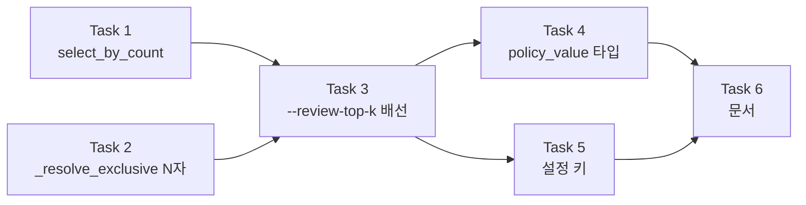

# 개수 기반 검수 예산 `--review-top-k` 구현 계획 (FR-6.3 ①)

> **에이전트 작업자에게:** 이 계획은 `superpowers:subagent-driven-development`(권장) 또는
> `superpowers:executing-plans`로 태스크 단위로 실행한다. 각 단계는 체크박스(`- [ ]`)로 추적한다.

**목표:** FR-6.3 ①의 나머지 절반인 "상위 K개"를 라이브러리·CLI·리포트 세 층에서 닫아
FR-6.3을 🟡에서 ✅로 올린다.

**접근:** 개수 전용 선별 함수 `select_by_count`를 만들되, `select_by_budget`과 **공통 헬퍼를
공유**해 hard fail 소진과 동점 처리가 두 축에서 갈리지 않게 한다. CLI는 `--review-budget`의
기존 계약(`1` = 100%)을 건드리지 않고 별도 옵션 `--review-top-k`를 신설한다.
상호배타가 2자에서 3자로 늘어나므로 `_resolve_exclusive`를 N자로 일반화한다.

**기술 스택:** Python 3.11+ · typer · pysubs2 · pyyaml · httpx · pytest · ruff
(**의존성을 추가하지 않는다.** 런타임 4개 · dev 3개 고정)

**스펙:** [`docs/superpowers/specs/2026-09-03-review-top-k-design.md`](../specs/2026-09-03-review-top-k-design.md)
(커밋 `5c1f65e`). 이 계획은 스펙에서 논증하므로 **둘을 함께 읽는다.**

## 전역 제약

이 절의 항목은 **모든 태스크의 요구사항에 암묵적으로 포함된다.**

| # | 제약 | 어기면 |
| --- | --- | --- |
| C1 | Python 실행은 반드시 `.venv/Scripts/python.exe` | 시스템 Python은 3.14라 환경이 다르다 |
| C2 | 게이트는 CI와 **같은 대상 `.`** 으로 돈다. `src tests`로 좁히지 않는다 | 그 차이로 CI가 5회 연속 실패한 전례가 있다 |
| C3 | 모든 모듈 첫 줄에 `from __future__ import annotations` | 리포 전역 규약 |
| C4 | 독스트링·주석은 **한국어**, 근거 FR·§·D 번호를 병기한다 | |
| C5 | ruff `line-length = 100`, 규칙 `E,F,I,UP,B,SIM` | |
| C6 | 커밋 메시지는 **한국어**. 여러 줄이면 `git commit -F <파일>` | heredoc은 조용히 깨진다 |
| C7 | **엠대시(U+2014)를 쓰지 않는다** | cp949로 인코딩되지 않는다. `cli.py`의 help 문자열이 이 제약을 주석으로 달고 있다 |
| C8 | `--help` 문구를 길게 늘이지 않는다 | 색이 켜진 CI에서 rich 하이라이터가 옵션 이름을 줄바꿈으로 쪼개 `--help` 테스트가 깨진 전례가 있다 |
| C9 | 리포 루트에 `cuesift.yaml`을 만들지 않는다 | 자동 탐색이 그것을 읽는다. 테스트는 `tmp_path`에 만든다 |
| C10 | 주석에는 "왜 이 값인가"가 아니라 **"이 값이 아니면 무엇이 깨지는가"** 를 적는다 | |
| C11 | **푸시는 사용자가 명시적으로 요청할 때만.** 커밋과 푸시를 한 명령에 묶지 않는다 | |

## 스펙에서 정정한 것 — 착수 조사가 뒤집은 둘

계획을 쓰면서 코드로 확인해 **스펙 §6의 두 줄이 부정확함**을 찾았다. 이 절이 그 둘의 최신 판정이며,
**본문 코드 블록보다 이 절이 우선한다**(리포 규약).

| # | 스펙이 적은 것 | 실제 | 계획에 미친 영향 |
| --- | --- | --- | --- |
| P1 | "`html_report.py` — `"top_k"` 문구 추가" | **`html_report.py:218`은 `policy_label`만 읽는다.** `policy_kind`를 보지 않는다 | **HTML 리포트는 손대지 않는다.** `policy_label`이 `"상위 50개"`를 담으므로 자동으로 맞는다 |
| P2 | D6 — "실제 개수를 표시한다"를 새로 만들 일로 서술 | **`cli.py:2731`이 이미 `검수 대상 {selected}개 (실제 {비율})`를 출력한다** | 표시를 만들 필요가 없다. **필요한 것은 게이트뿐이다** — hard fail이 K를 넘는 실행에서 그 숫자가 K가 아님을 Task 3이 고정한다 |

둘 다 "만들어야 한다"고 적힌 것이 **이미 있었다.** 스펙이 코드를 덜 읽고 쓴 자리이고,
계획 단계의 조사가 그것을 잡았다.

## 파일 구조

| 파일 | 책임 | 태스크 |
| --- | --- | --- |
| `src/cuesift/triage/policy.py` | `_select_top` 공통 헬퍼 추출 · `select_by_count` 신설 | 1 |
| `src/cuesift/triage/__init__.py` | `select_by_count`를 `__all__`에 넣는다 | 1 |
| `tests/test_triage_policy.py` | G1~G7 | 1 |
| `src/cuesift/cli.py` (`_resolve_exclusive` · 호출부 3곳) | 2자 → N자 | 2 |
| `tests/test_cli_config.py` | **`input`/`media` 쌍의 양보 회귀**(지금 없다) · 설정 축 상호배타 | 2 · 5 |
| `src/cuesift/cli.py` (옵션·가드·배선) | `--review-top-k` 전 경로 | 3 |
| `tests/test_cli_triage.py` | G8~G11 · D6 게이트 | 3 |
| `src/cuesift/report/models.py` | `policy_kind`에 `"top_k"` · `policy_value: int \| float` | 4 |
| `tests/test_cli_review_out.py` | G12(`policy.value`가 정수로 직렬화) | 4 |
| `src/cuesift/config/schema.py` | `Binding(("triage", "review_top_k"), ...)` | 5 |
| `tests/test_config_schema.py` | 옵션 개수 30 → 31 | 5 |
| 문서 8종 | §10 파급 | 6 |

`cli.py`가 크지만 **이 계획에서 쪼개지 않는다.** 관련 없는 리팩터링이고, 되돌리기 단위를 키운다.

## 태스크 의존 관계



**Task 1과 2는 서로 독립이라 순서를 바꿔도 된다.** Task 3이 둘을 소비하고,
**Task 4와 5는 Task 3 뒤라면 순서가 자유롭다** - 하나는 산출물 타입을, 다른 하나는
설정 통로를 닫는다.

---

### Task 1: `select_by_count` — 개수 축 선별 함수

**파일:**

- 수정: `src/cuesift/triage/policy.py`
- 수정: `src/cuesift/triage/__init__.py`
- 테스트: `tests/test_triage_policy.py`

**인터페이스:**

- 사용하는 것: `SegmentRisk`(`cuesift.segment`), 기존 `_sorted_desc`·`_copy`(같은 모듈의 비공개 헬퍼)
- 내놓는 것: `select_by_count(risks: Sequence[SegmentRisk], k: int) -> list[SegmentRisk]`
  — Task 3이 이 이름과 시그니처로 부른다

**배경:** `tests/test_triage_policy.py`에 헬퍼가 이미 있다. 새로 만들지 말고 그대로 쓴다.

```python
def _risk(sid: str, score: float, hard: bool = False) -> SegmentRisk:
    return SegmentRisk(segment_id=sid, signals=[], risk_score=score, hard_fail=hard)


@pytest.fixture
def ten():
    """위험도 0.0, 0.1, ..., 0.9인 세그먼트 10개."""
    return [_risk(f"s{i}", i / 10) for i in range(10)]
```

- [x] **단계 1: 공통 헬퍼를 먼저 추출한다 (리팩터링, 동작 불변)**

`src/cuesift/triage/policy.py`의 `select_by_budget` 본문에서 quota 계산 아래를 헬퍼로 옮긴다.
`_sorted_desc` 정의 바로 아래에 넣는다.

```python
def _select_top(risks: Sequence[SegmentRisk], quota: int) -> list[SegmentRisk]:
    """위험도 상위 `quota`개를 선별한 **전체 목록**을 낸다 (FR-6.3 ① · FR-6.2).

    **비율 축과 개수 축이 이 함수 하나를 공유한다.** 두 축이 각자 이 로직을 갖고
    있으면 hard fail 소진 규칙이나 동점 처리가 한쪽에서만 바뀌어 갈라지고,
    그때 `review_ratio()`의 의미가 축마다 달라진다 - 그 값이 README 최상단
    배수의 분모다.

    **hard fail이 quota를 소진한다.** 따라서 위험도가 낮은 hard fail이 그보다
    높은 비-hard 세그먼트를 큐에서 밀어내고, hard fail 개수가 quota를 넘으면
    선별 개수가 quota를 **넘는다**(FR-6.2 - hard fail은 검수 예산을 우회한다).
    가산으로 바꾸면 반대로 `review_ratio`가 요청 예산을 크게 넘어 §9.1 배수의
    분모가 부풀고, hard fail 오탐이 지표를 직접 파괴한다 - 그쪽이 더 나쁘다.
    """
    ordered = _sorted_desc(risks)
    hard_ids = {r.segment_id for r in ordered if r.hard_fail}
    rest = [r for r in ordered if not r.hard_fail]
    remaining = max(0, quota - len(hard_ids))
    selected_ids = hard_ids | {r.segment_id for r in rest[:remaining]}
    return [_copy(r, selected=r.segment_id in selected_ids) for r in ordered]
```

그리고 `select_by_budget`의 마지막 부분을 다음으로 바꾼다. **독스트링과 NaN·범위 검사,
빈 목록 가드, `quota` 주석은 그대로 둔다.**

```python
    # 올림한다. 10건에 5% 예산이면 0.5건인데, 내림하면 0건이 되어
    # 트리아지가 아무것도 안 하고 통과한다.
    quota = math.ceil(len(risks) * budget_ratio)
    return _select_top(risks, quota)
```

- [x] **단계 2: 기존 테스트가 그대로 통과하는지 본다 (리팩터링 검증)**

실행: `.venv/Scripts/python.exe -m pytest tests/test_triage_policy.py -q`

기대: 이전과 **같은 개수가 통과**한다. 하나라도 줄거나 실패하면 추출이 동작을 바꾼 것이다.

- [x] **단계 3: 실패하는 테스트를 쓴다 (G1~G7)**

`tests/test_triage_policy.py`의 `select_by_threshold` 테스트 묶음 **앞**에 넣는다.

```python
# 개수 축 (FR-6.3 ① · 설계 D4·D5·D6·D8).
#
# **비율 축과 같은 코드 경로(`_select_top`)를 쓴다.** 아래 테스트가 검사하는
# hard fail 소진과 동점 처리는 두 축에서 같은 답이어야 하고, 갈리면
# `review_ratio()`의 의미가 축마다 달라진다.


def test_top_k는_정확히_k개를_고른다(ten):
    result = select_by_count(ten, 3)
    assert {r.segment_id for r in result if r.selected} == {"s9", "s8", "s7"}


def test_top_k도_전체_목록을_반환한다(ten):
    # `select_by_budget`과 같은 계약이다. 선별분만 내면 `review_ratio`가
    # 언제나 1.0이 되고 그 값이 README 배수의 분모다.
    result = select_by_count(ten, 3)
    assert len(result) == 10


def test_hard_fail이_k를_넘으면_선별이_k를_넘는다():
    # D6 - hard fail은 검수 예산을 우회한다(FR-6.2). 자르면 요구사항 위반이다.
    risks = [_risk(f"h{i}", 0.1, hard=True) for i in range(4)]
    result = select_by_count(risks, 2)
    assert sum(1 for r in result if r.selected) == 4


def test_hard_fail이_k를_소진한다():
    # 위험도가 낮은 hard fail이 그보다 높은 비-hard를 밀어낸다.
    # 비율 축과 같은 규칙이다.
    risks = [_risk("high", 0.9), _risk("hard", 0.05, hard=True)]
    result = select_by_count(risks, 1)
    assert {r.segment_id for r in result if r.selected} == {"hard"}


def test_k가_0이면_hard_fail만_남는다():
    # D4 - `--review-budget 0`이 이미 "hard fail만 보기"를 뜻한다.
    # 개수 축에서만 0을 거부하면 두 축이 비대칭이 된다.
    risks = [_risk("a", 0.9), _risk("h", 0.1, hard=True)]
    result = select_by_count(risks, 0)
    assert {r.segment_id for r in result if r.selected} == {"h"}


def test_k가_세그먼트_수보다_크면_전량이다(ten):
    # D5 - 비율 축의 100%가 허용되는 것과 같은 자리다. 오류로 만들면
    # 세그먼트 수를 미리 아는 사람만 이 옵션을 쓸 수 있다.
    result = select_by_count(ten, 100)
    assert all(r.selected for r in result)


def test_음수_k는_거부된다(ten):
    with pytest.raises(ValueError, match="0 이상"):
        select_by_count(ten, -1)


def test_bool은_거부된다(ten):
    # D8 - `bool`은 `int`의 서브클래스라 `True`가 조용히 K=1로 동작한다.
    # 이 모듈이 NaN을 세 자리에서 명시적으로 막는 것과 같은 부류다.
    with pytest.raises(ValueError, match="bool"):
        select_by_count(ten, True)


def test_top_k는_동점을_세그먼트_id로_깨뜨린다():
    # NFR-3(재현성). 비율 축과 같은 `_sorted_desc`를 쓰므로 규칙이 같다.
    risks = [_risk("b", 0.5), _risk("a", 0.5), _risk("c", 0.5)]
    result = select_by_count(risks, 2)
    assert [r.segment_id for r in result] == ["a", "b", "c"]
    assert {r.segment_id for r in result if r.selected} == {"a", "b"}


def test_top_k는_입력을_변형하지_않는다(ten):
    # 예산 스윕(§6.1)이 같은 원본에 여러 정책을 차례로 적용한다.
    select_by_count(ten, 5)
    assert all(not r.selected for r in ten)


def test_빈_목록은_빈_목록이다():
    assert select_by_count([], 5) == []
```

임포트 줄에 `select_by_count`를 더한다.

```python
from cuesift.triage import (
    review_ratio,
    select_by_budget,
    select_by_count,
    select_by_threshold,
    select_tier1_candidates,
)
```

- [x] **단계 4: 테스트가 실패하는 것을 확인한다**

실행: `.venv/Scripts/python.exe -m pytest tests/test_triage_policy.py -q`

기대: **수집 단계에서 `ImportError`로 죽는다** (`cannot import name 'select_by_count'`).
통과하면 게이트가 아무것도 안 재는 것이므로 멈추고 원인을 찾는다.

- [x] **단계 5: 최소 구현을 쓴다**

`policy.py`의 `select_by_budget` **바로 아래**에 넣는다.

```python
def select_by_count(risks: Sequence[SegmentRisk], k: int) -> list[SegmentRisk]:
    """위험도 상위 `k`개를 검수 큐에 담는다 (FR-6.3 ① · 설계 D4·D5·D6·D8).

    `select_by_budget`과 **계약이 같다** - 전체 목록을 반환하고 선별된 것에만
    `selected=True`를 붙이며, 입력을 변형하지 않고, 동점은 세그먼트 ID로
    깨뜨린다(NFR-3). 다른 것은 quota를 환산 없이 `k`로 쓰는 것 하나뿐이다.

    **`k`가 상한이 아니다.** hard fail이 `k`를 넘으면 선별 개수가 `k`를 넘는다
    (FR-6.2 - hard fail은 검수 예산을 우회한다). 자르면 요구사항을 정면으로
    어기고, 실제 개수는 `review_ratio()`와 화면의 "검수 대상 N개"가 말한다.

    **`k = 0`은 "hard fail만 보기"다**(D4). `--review-budget 0`이 이미 그
    뜻이므로 개수 축에서만 0을 거부하면 두 축이 비대칭이 된다.

    **`k`가 세그먼트 수보다 크면 전량이다**(D5). 오류로 만들면 세그먼트 수를
    미리 아는 사람만 이 함수를 쓸 수 있다.
    """
    # **`bool`을 먼저 막는다**(D8). `bool`은 `int`의 서브클래스라
    # `select_by_count(risks, True)`가 아래 `k < 0`을 통과해 조용히 K=1로
    # 동작한다. 이 모듈이 NaN을 비교 연산의 우연에 맡기지 않는 것과 같은
    # 이유다 - 조용히 도는 잘못된 값은 게이트에 걸리지 않는다.
    if isinstance(k, bool):
        raise ValueError(f"k는 bool일 수 없다 (받은 값: {k})")
    if k < 0:
        raise ValueError(f"k는 0 이상이어야 한다 (받은 값: {k})")
    if not risks:
        return []
    return _select_top(risks, k)
```

- [x] **단계 6: `__all__`에 넣는다**

`src/cuesift/triage/__init__.py`의 임포트와 `__all__` **둘 다** 고친다.

```python
from cuesift.triage.policy import (
    gray_zone,
    review_ratio,
    select_by_budget,
    select_by_count,
    select_by_threshold,
    select_tier1_candidates,
)

__all__ = [
    "gray_zone",
    "review_ratio",
    "select_by_budget",
    "select_by_count",
    "select_by_threshold",
    "select_tier1_candidates",
]
```

- [x] **단계 7: 테스트가 통과하는지 본다**

실행: `.venv/Scripts/python.exe -m pytest tests/test_triage_policy.py -q`

기대: 전부 통과. **수집 개수가 11건 늘었는지 확인한다** — 늘지 않았으면 새 테스트가
수집되지 않은 것이다.

- [x] **단계 8: 전체 게이트를 돌린다**

```bash
.venv/Scripts/python.exe -m ruff check .
.venv/Scripts/python.exe -m ruff format --check .
.venv/Scripts/python.exe -m pytest -q
```

기대: ruff 통과 · pytest **1754 passed**(착수 1743 + 11) · 5 deselected

- [x] **단계 9: 커밋한다**

```bash
git add src/cuesift/triage/policy.py src/cuesift/triage/__init__.py tests/test_triage_policy.py
git commit -F <메시지 파일>
```

메시지(C6에 따라 파일로 넘긴다):

```text
기능: 개수 기반 선별 select_by_count (FR-6.3 ①)

비율 축과 공통 헬퍼 _select_top을 공유한다. 두 축이 각자 hard fail 소진
로직을 가지면 한쪽만 바뀌어 review_ratio()의 의미가 축마다 갈린다.

D4 k=0은 hard fail만 보기 · D5 k>n은 전량 · D6 hard fail이 k를 넘으면
선별도 k를 넘는다(FR-6.2) · D8 bool은 int의 서브클래스라 명시적으로 거부

게이트: pytest 1754 passed (착수 1743 + 11)
```

---

### Task 2: `_resolve_exclusive`를 N자로 일반화 (D3 · R1)

**파일:**

- 수정: `src/cuesift/cli.py:660-682`(함수) · `1303`·`1315`·`1333`(호출부 3곳)
- 테스트: `tests/test_cli_config.py`

**인터페이스:**

- 내놓는 것: `_resolve_exclusive(ctx, message: str, *names: str) -> list[str]`
  — **버릴 이름들의 목록.** Task 3이 3자 호출로 이 함수를 쓴다

**이 태스크가 가장 위험하다.** 새 기능이 아니라 이미 도는 코드를 건드리는 유일한 자리이고,
**실패가 예외가 아니라 침묵으로 나타난다** — `"review_budget" == ["review_budget"]`은
`False`이지 예외가 아니다. 양보 로직이 통째로 죽어도 조용하다.

**착수 조사 결과:** 세 쌍 중 둘은 회귀 테스트가 **이미 있다**(`tests/test_cli_config.py:109~161`,
6건). **`input`/`media` 쌍만 테스트가 하나도 없다** — 리포 전체에서
`grep "자막 파일과 --media를 함께"`가 `src/`에서만 나온다. 그래서 단계 1이 그것을 먼저 만든다.

- [x] **단계 1: 지금 없는 회귀 테스트를 먼저 쓴다 (변경 전에)**

`tests/test_cli_config.py`의 `test_명령줄끼리의_상호배타는_여전히_오류다` **아래**에 넣는다.

```python
def test_CLI_자막이_설정의_media를_이긴다(tmp_path: Path) -> None:
    """`input`/`media` 쌍에도 같은 양보가 걸린다 (FR-8.4 후반절).

    **이 쌍만 회귀 테스트가 없었다.** 위치 인자는 `default_map`에 실리지
    않으므로 `_from_config("input")`은 늘 거짓이고, 따라서 설정에서 온
    `media`가 양보 대상이 된다. 양보가 죽으면 설정 파일을 쓰는 사용자가
    명령줄로 준 자막을 잃는다 - FR-8.3의 리뷰가 HIGH로 잡았던 실패다.
    """
    cfg = _config(tmp_path, "input:\n  media: 없는영상.mp4\n")
    result = _translate(cfg, _srt(tmp_path))
    # 자막이 이겼으므로 없는 영상 파일에 닿지 않고 정상 종료한다.
    assert result.exit_code == 0, result.output


def test_명령줄_자막과_media는_여전히_오류다(tmp_path: Path) -> None:
    # 둘 다 명령줄이면 원래의 사용법 오류다. 양보를 넓히면 이것이 통과한다.
    cfg = _config(tmp_path, "source_lang: ko\n")
    media = tmp_path / "v.mp4"
    media.write_bytes(b"\x00")
    result = _translate(cfg, _srt(tmp_path), "--media", str(media))
    assert result.exit_code == 2
    assert normalize_rich_message("함께 줄 수 없다") in normalize_rich_message(result.stderr)
```

- [x] **단계 2: 두 테스트가 지금 통과하는 것을 확인한다**

실행:

```bash
.venv/Scripts/python.exe -m pytest tests/test_cli_config.py -q -k "media"
```

기대: **PASS**. 이 둘은 새 기능이 아니라 **기존 동작을 고정하는 그물**이라
변경 전에 통과해야 한다. 실패하면 리팩터링을 시작하기 전에 원인을 먼저 밝힌다.

- [x] **단계 3: `_resolve_exclusive`를 N자로 고친다**

`src/cuesift/cli.py:660`의 함수를 통째로 바꾼다.

```python
def _resolve_exclusive(ctx: typer.Context | None, message: str, *names: str) -> list[str]:
    """상호배타 파라미터들 중 **버릴 쪽**의 이름 목록을 낸다 (FR-8.4 · 설계 D3).

    **값의 존재만 보는 상호배타 검사는 설정 파일을 이길 방법을 없앤다.**
    `cuesift.yaml`에 `triage.review_threshold`가 있으면 `--review-budget`을 친
    사람이 exit 2를 받는데, 그는 `--review-threshold`를 쓴 적이 없다. 그래서
    이 쌍들에서만 FR-8.4 본문의 후반절이 통째로 뒤집힌다.

    **양보는 명령줄 출처가 정확히 하나일 때뿐이다.** 둘 이상이면 원래의 사용법
    오류이고, 하나도 없으면(전부 설정에서 왔으면) 설정 파일 자체가 모순이라
    어느 쪽을 버려도 사용자가 적은 정책 하나가 조용히 사라진다 - 그것이 D4가
    막는 실패다. 두 경우 모두 여기서 exit 2로 끝낸다.

    **반환이 `str`이 아니라 `list[str]`인 것은 3자 이상을 받기 때문이다**
    (FR-6.3의 `--review-budget`·`--review-threshold`·`--review-top-k`).
    호출부는 `in`으로 판정한다 - `==` 비교를 남겨 두면 문자열과 리스트를
    비교해 **예외 없이 조용히 `False`가 되고 양보가 통째로 죽는다.**
    """
    from_config = {name: _from_config(ctx, name) for name in names}
    from_cli = [name for name, cfg in from_config.items() if not cfg]
    if len(from_cli) == 1:
        return [name for name in names if name not in from_cli]
    if not from_cli:
        # 출처를 밝힌다(설계 D7). 사용자는 이 옵션들을 친 적이 없다.
        message = f"{message} (설정 파일에 둘 다 있다)"
    _echo(message, err=True)
    raise typer.Exit(2)
```

**`"설정 파일에 둘 다 있다"` 문구를 그대로 둔다.** 기존 테스트 둘
(`test_설정끼리의_상호배타는_여전히_오류다`·`test_설정끼리의_캐시_상호배타도_여전히_오류다`)이
`"설정 파일"`을 부분 문자열로 보므로 3자에서도 걸린다. 문구를 개수에 맞게 바꾸는 것은
Task 3에서 3자 호출을 넣을 때 함께 판단한다.

- [x] **단계 4: 호출부 세 곳을 고친다**

`cli.py:1301`(캐시 쌍):

```python
    if no_cache and cache_dir is not None:
        # **명령줄이 이긴다**(FR-8.4 후반절). `_resolve_exclusive`가 설정에서
        # 온 쪽을 골라 주고, 둘 다 같은 출처면 거기서 exit 2로 끝난다.
        losers = _resolve_exclusive(
            ctx, "--no-cache와 --cache-dir을 함께 줄 수 없다", "no_cache", "cache_dir"
        )
        if "no_cache" in losers:
            no_cache = False
        else:
            cache_dir = None
```

`cli.py:1310`(예산/임계값 쌍) — **Task 3이 이 자리를 3자로 다시 고친다.** 지금은 `in` 판정으로만
바꾼다.

```python
    if review_budget is not None and review_threshold is not None:
        # FR-6.3은 "두 방식으로 지정할 수 있다"이지 "동시에"가 아니다.
        # 합성하면 어느 쪽이 이겼는지가 출력에서 사라진다(설계 D4).
        # 버리는 쪽은 위와 같은 규칙으로 고른다.
        losers = _resolve_exclusive(
            ctx,
            "--review-budget과 --review-threshold는 함께 쓸 수 없다",
            "review_budget",
            "review_threshold",
        )
        if "review_budget" in losers:
            review_budget = None
        else:
            review_threshold = None
```

`cli.py:1325`(자막/영상 쌍):

```python
    if input is not None and media is not None:
        # **명령줄이 이긴다**(FR-8.4 후반절). `cuesift.yaml`의 `input.media`가
        # 위치 인자와 부딪히면 설정 쪽을 버린다 - 위치 인자는 `default_map`에
        # 실리지 않으므로 `_from_config`가 늘 거짓이고, 따라서 설정에서 온
        # `media`만 양보 대상이 된다. 둘 다 명령줄이면 원래의 사용법 오류라
        # `_resolve_exclusive`가 exit 2로 끝낸다.
        losers = _resolve_exclusive(ctx, "자막 파일과 --media를 함께 줄 수 없다", "input", "media")
        if "input" in losers:
            input = None
        else:
            media = None
```

- [x] **단계 5: 회귀 8건이 전부 통과하는지 본다 (G13)**

```bash
.venv/Scripts/python.exe -m pytest tests/test_cli_config.py -q
```

기대: 전부 통과. **단계 1에서 만든 둘을 포함해 상호배타 관련 8건이 통과해야 한다.**
하나라도 죽으면 반환 타입 변경이 양보를 깨뜨린 것이다.

- [x] **단계 6: 게이트를 실패시켜 본다 — 그물이 실제로 잡는지 확인한다**

`cli.py:1301`의 `if "no_cache" in losers:`를 일부러 `if "no_cache" == losers:`로 바꾸고
같은 명령을 돌린다.

기대: `test_CLI_캐시_끄기가_설정의_캐시_경로를_이긴다`가 **FAIL**한다.
**통과하면 그물에 구멍이 있는 것이므로 멈추고 테스트를 고친다.** 확인 후 되돌린다.

이 단계가 이 태스크의 핵심이다. R1은 "예외 없이 조용히 실패"하는 부류라
**게이트가 실제로 잡는 것을 눈으로 봐야** 회귀 테스트로 인정된다.

- [x] **단계 7: 전체 게이트와 커밋**

```bash
.venv/Scripts/python.exe -m ruff check .
.venv/Scripts/python.exe -m ruff format --check .
.venv/Scripts/python.exe -m pytest -q
git add src/cuesift/cli.py tests/test_cli_config.py
git commit -F <메시지 파일>
```

기대: pytest **1756 passed**(1754 + 2). 메시지:

```text
리팩터링: _resolve_exclusive를 N자로 일반화 (FR-8.4 · 설계 D3)

FR-6.3의 상호배타가 2자에서 3자로 늘어난다. 반환을 str에서 list[str]로
바꾸고 호출부 셋을 `in` 판정으로 고쳤다.

**input/media 쌍만 회귀 테스트가 없었다.** 변경 전에 둘을 먼저 만들고
통과를 확인한 뒤 리팩터링했다. `"이름" == ["이름"]`은 예외가 아니라
조용한 False라 그물 없이 고치면 양보가 죽어도 드러나지 않는다.

게이트: pytest 1756 passed · 상호배타 회귀 8건 통과
        (일부러 == 로 되돌려 FAIL하는 것을 확인함)
```

---

### Task 3: `--review-top-k` 옵션과 전 경로 배선 (D1 · D2 · D6)

**파일:**

- 수정: `src/cuesift/cli.py` — 옵션 정의 · 상호배타 · 가드 · `_translate_one` · `_run_triage`
- 테스트: `tests/test_cli_triage.py`

**인터페이스:**

- 사용하는 것: `select_by_count`(Task 1) · `_resolve_exclusive(..., *names)`(Task 2)
- 내놓는 것: `--review-top-k` 옵션 · `_translate_one`/`_run_triage`의 `top_k: int | None` 파라미터 ·
  `policy_kind == "top_k"` (Task 4가 그 값의 직렬화를 검사하고, Task 5가 설정 키를 잇는다)

**옵션을 만들고 배선하지 않으면 조용히 무시된다.** 그래서 이 태스크는 옵션과 배선을 함께 낸다 —
중간 상태를 커밋하면 그 커밋을 쓴 사용자가 아무 경고 없이 트리아지 없는 결과를 받는다.

**`tests/test_cli_triage.py`의 기존 장치를 그대로 쓴다.** 새로 만들지 않는다.

| 장치 | 위치 | 무엇 |
| --- | --- | --- |
| `_args(tmp_path, fixture, *extra)` | 43행 | `translate <픽스처> --to en --out <tmp> --base-url ... --no-cache` 인자 목록 |
| `_patch_provider(monkeypatch, provider)` | 39행 | `cli._build_provider`를 갈아 끼운다 |
| `EchoProvider()` (기본 transform) | `tests/fakes/provider.py:65` | 한글 원문을 남겨 **`struct.untranslated`가 전량 hard fail을 낸다**(실측, `_risk_free` 독스트링) |
| `EchoProvider(transform=_risk_free)` | 465행 | **Tier 0 신호를 하나도 내지 않는다.** 선별 정책 자체를 잴 때 쓴다 |
| `ten_cues.srt` | `tests/fixtures/ingest/` | 10큐. `_risk_free`와 짝이다 |

- [x] **단계 1: 실패하는 테스트를 쓴다 (G8~G11 · D6 게이트)**

`tests/test_cli_triage.py` **끝**에 넣는다. `_risk_free`(465행) 뒤여야 한다.

```python
# 개수 축 CLI (FR-6.3 ① · 설계 D1·D2·D6).


def test_top_k와_예산을_함께_주면_거부된다(tmp_path: Path) -> None:
    # D1·D4 - FR-6.3은 "두 방식으로 지정할 수 있다"이지 "동시에"가 아니다.
    result = runner.invoke(
        app, _args(tmp_path, "minimal.srt", "--review-budget", "10%", "--review-top-k", "5")
    )
    assert result.exit_code == 2, result.output


def test_top_k와_임계값을_함께_주면_거부된다(tmp_path: Path) -> None:
    result = runner.invoke(
        app, _args(tmp_path, "minimal.srt", "--review-threshold", "0.5", "--review-top-k", "5")
    )
    assert result.exit_code == 2, result.output


def test_top_k와_tier1은_함께_쓸_수_없다(tmp_path: Path) -> None:
    """D2 - `triage_with_tier1`이 `budget_ratio: float`를 필수로 받는다.

    **메시지가 대안을 말해야 한다.** `--review-threshold`의 같은 거부가
    이미 `(--review-budget을 쓴다)`를 달고 있고, 그것이 없으면 사용자는
    Tier 1을 포기해야 하는 줄 안다.
    """
    result = runner.invoke(
        app, _args(tmp_path, "minimal.srt", "--review-top-k", "5", "--tier1")
    )
    assert result.exit_code == 2, result.output
    assert normalize_rich_message("--review-budget") in normalize_rich_message(result.output)


def test_음수_top_k는_거부된다(tmp_path: Path) -> None:
    # `min=0`을 typer에 주므로 click이 막고, 메시지가 옵션 이름을 말한다.
    result = runner.invoke(app, _args(tmp_path, "minimal.srt", "--review-top-k", "-1"))
    assert result.exit_code == 2, result.output


def test_top_k가_정확히_k개를_고른다(
    tmp_path: Path, monkeypatch: pytest.MonkeyPatch
) -> None:
    """옵션을 받고도 배선이 없으면 조용히 무시된다 - 이 단언이 그것을 막는다.

    `_risk_free`가 신호를 하나도 내지 않으므로 hard fail이 0이고,
    따라서 선별 개수가 정확히 K다(D6의 잔여분이 발동하지 않는 조건).
    """
    _patch_provider(monkeypatch, EchoProvider(transform=_risk_free))

    result = runner.invoke(app, _args(tmp_path, "ten_cues.srt", "--review-top-k", "3"))

    assert result.exit_code == 0, result.output
    assert "검수 대상 3개" in result.output


def test_top_k_라벨이_화면에_나온다(
    tmp_path: Path, monkeypatch: pytest.MonkeyPatch
) -> None:
    # 사용자가 준 값을 그대로 되돌려 준다. 파싱 결과를 찍으면 자기 입력을
    # 화면에서 못 찾는다.
    _patch_provider(monkeypatch, EchoProvider(transform=_risk_free))

    result = runner.invoke(app, _args(tmp_path, "ten_cues.srt", "--review-top-k", "2"))

    assert "상위 2개" in result.output


def test_k가_세그먼트_수보다_커도_동작한다(
    tmp_path: Path, monkeypatch: pytest.MonkeyPatch
) -> None:
    # D5 - 오류로 만들면 세그먼트 수를 미리 아는 사람만 이 옵션을 쓸 수 있다.
    _patch_provider(monkeypatch, EchoProvider(transform=_risk_free))

    result = runner.invoke(app, _args(tmp_path, "ten_cues.srt", "--review-top-k", "100"))

    assert result.exit_code == 0, result.output
    assert "검수 대상 10개" in result.output


def test_hard_fail이_top_k를_넘으면_선별도_k를_넘는다(
    tmp_path: Path, monkeypatch: pytest.MonkeyPatch
) -> None:
    """D6 - hard fail은 검수 예산을 우회한다(FR-6.2).

    **`cli.py`가 이미 `검수 대상 N개 (실제 x%)`를 출력한다**(착수 조사 P2).
    새로 만들 표시가 아니라 고정할 그물이다 - 누군가 K로 자르는 "개선"을
    넣으면 이 단언이 죽는다.

    `EchoProvider`의 **기본** transform(`f"EN:{s}"`)은 한글 원문을 남겨
    `struct.untranslated`가 10큐 전부 hard fail을 낸다(실측, `_risk_free`
    독스트링). 그래서 `--review-top-k 1`인데 선별이 10개다.
    """
    _patch_provider(monkeypatch, EchoProvider())

    result = runner.invoke(app, _args(tmp_path, "ten_cues.srt", "--review-top-k", "1"))

    assert "검수 대상 10개" in result.output
    assert "실제 100.0%" in result.output
```

**종료 코드를 단언하지 않는 테스트가 하나 있다**(마지막 것). hard fail이 `translate`의 종료
코드를 바꾸는지는 이 테스트가 재려는 것이 아니고, 재려는 것은 **선별 개수가 K로 잘리지
않는다**는 사실 하나다. 실행해 보고 종료 코드가 0이 아니면 그 값을 독스트링에 적는다 —
**추측해서 단언을 쓰지 않는다.**

- [x] **단계 2: 실패를 확인한다**

실행: `.venv/Scripts/python.exe -m pytest tests/test_cli_triage.py -q -k top_k`

기대: 전부 **FAIL**. `No such option: --review-top-k`가 나온다.

- [x] **단계 3: 옵션을 정의한다**

`cli.py`의 `review_threshold` 정의(1159행 근처) **바로 아래**에 넣는다.

```python
    review_top_k: Annotated[
        int | None,
        typer.Option(
            "--review-top-k",
            # 음수는 click이 막는다 - 오류 메시지가 옵션 이름을 말한다.
            # **상한을 두지 않는다**(설계 D5). 세그먼트 수보다 큰 값은 전량
            # 선별이고 오류가 아니다 - 상한을 두면 세그먼트 수를 미리 아는
            # 사람만 이 옵션을 쓸 수 있다.
            min=0,
            # em dash(U+2014)를 쓰지 않는다(전역 제약, cp949 미인코딩).
            help="사람이 검수할 상위 개수 (예: 50). --review-budget과 함께 쓸 수 없다",
        ),
    ] = None,
```

- [x] **단계 4: 상호배타를 3자로 바꾼다**

Task 2가 `in` 판정으로 고쳐 둔 예산/임계값 분기를 통째로 교체한다.

```python
    _policy_options = {
        "review_budget": review_budget,
        "review_threshold": review_threshold,
        "review_top_k": review_top_k,
    }
    _given = [name for name, value in _policy_options.items() if value is not None]
    if len(_given) > 1:
        # FR-6.3은 "두 방식으로 지정할 수 있다"이지 "동시에"가 아니다.
        # 합성하면 어느 쪽이 이겼는지가 출력에서 사라진다(설계 D4).
        #
        # **주어진 것만 넘긴다.** 셋을 늘 넘기면 주지도 않은 옵션이 양보
        # 후보가 되어, 명령줄 하나 + 설정 하나인 정상 조합에서 "명령줄이
        # 정확히 하나"라는 판정이 주지 않은 세 번째 때문에 흔들린다.
        losers = _resolve_exclusive(
            ctx,
            "--review-budget과 --review-threshold와 --review-top-k는 함께 쓸 수 없다",
            *_given,
        )
        if "review_budget" in losers:
            review_budget = None
        if "review_threshold" in losers:
            review_threshold = None
        if "review_top_k" in losers:
            review_top_k = None
```

**`elif`가 아니라 `if` 셋을 나란히 둔다.** 3자에서는 버릴 것이 둘일 수 있다.

- [x] **단계 5: `--review-out` 가드와 `--tier1` 가드를 고친다**

`cli.py:1382`의 `--review-out` 검사에서 세 번째 항을 더한다. **본문의 긴 주석은 그대로 두고**
조건과 메시지만 고친다.

```python
    if (
        review_out is not None
        and review_budget is None
        and review_threshold is None
        and review_top_k is None
    ):
        ...
        _echo(
            "--review-out은 --review-budget 또는 --review-threshold 또는 "
            "--review-top-k와 함께 써야 한다",
            err=True,
        )
        raise typer.Exit(2)
```

`--review-out`의 help 문구도 함께 고친다(C8에 따라 짧게 유지한다).

```python
            help="검수 리포트 출력 디렉터리. 트리아지 정책 옵션과 함께 써야 한다",
```

**이 문구를 검사하는 테스트는 없다**(실측: `grep -rn "review-budget 또는" tests/`가 0건).
다만 `--help` 출력의 **폭**을 재는 테스트는 있으므로(파킹 4 — `COLUMNS=88`), 문구를 지금보다
길게 만들지 않는다(C8).

`cli.py:1431`의 `if tier1:` 블록에서 `review_threshold` 거부 **바로 아래**에 넣는다.

```python
        if review_top_k is not None:
            # `triage_with_tier1`이 `budget_ratio: float`를 필수 키워드로 받고
            # 내부 두 자리에서 `select_by_budget`을 부른다(설계 D2). 개수를
            # 통과시키려면 그 시그니처를 일반화해야 하는데, 이미 머지된 함수의
            # 표면을 여기서 바꾸면 되돌리기 단위가 커진다.
            _echo(
                "--tier1은 --review-top-k와 함께 쓸 수 없다 (--review-budget을 쓴다)",
                err=True,
            )
            raise typer.Exit(2)
```

- [x] **단계 6: `triage_requested`와 `policy_label`을 넓힌다**

`cli.py:1526` 근처:

```python
    triage_requested = (
        review_budget is not None or review_threshold is not None or review_top_k is not None
    )
```

`policy_label`(1550행 근처)을 세 갈래로 바꾼다.

```python
        # 사용자가 준 원문을 라벨에 쓴다 - 파싱 결과(`0.1`)를 찍으면 `10%`라고
        # 쓴 사람이 자기 입력을 화면에서 못 찾는다. 이해가 맞았는지는 별도로
        # 출력되는 "실제 N%"가 말한다.
        if review_budget is not None:
            policy_label = f"예산 {review_budget}"
        elif review_threshold is not None:
            policy_label = f"임계값 {review_threshold}"
        else:
            policy_label = f"상위 {review_top_k}개"
```

- [x] **단계 7: `_translate_one`과 `_run_triage`에 값을 흘린다**

네 자리를 고친다. **파라미터 이름은 `top_k`로 통일한다.**

| 위치 | 지금 | 더할 것 |
| --- | --- | --- |
| `cli.py:1802` (`_translate_one` 호출) | `threshold=review_threshold,` | `top_k=review_top_k,` |
| `cli.py:2123` (`_translate_one` 시그니처) | `threshold: float \| None,` | `top_k: int \| None,` |
| `cli.py:2346` (`_run_triage` 호출) | `threshold=threshold,` | `top_k=top_k,` |
| `cli.py:2797` (`_run_triage` 시그니처) | `threshold: float \| None,` | `top_k: int \| None,` |

**행 번호는 앞 단계의 편집으로 밀린다.** 번호가 아니라 이름으로 찾는다 —
`grep -n "threshold=threshold\|threshold: float | None" src/cuesift/cli.py`.

- [x] **단계 8: 정책 판정과 선별 분기를 넓힌다**

`cli.py:2839`의 판정:

```python
    if budget_ratio is not None:
        policy_kind, policy_value = "budget", budget_ratio
    elif threshold is not None:
        policy_kind, policy_value = "threshold", threshold
    elif top_k is not None:
        # **정수를 그대로 싣는다**(설계 D7). float로 바꾸면 `review.json`에
        # `"value": 50.0`이 나가 개수를 소수로 적는 파일을 도구가 읽는다.
        # Task 4가 이 값의 직렬화를 게이트로 고정한다.
        policy_kind, policy_value = "top_k", top_k
    else:
        # 호출자가 트리아지를 요청하지 않았는데 여기 도달한 것이다.
        # 조용히 빈 결과를 내면 "트리아지가 돌았고 아무것도 안 걸렸다"로
        # 읽혀 미배선을 정상으로 오인한다.
        raise ValueError("budget_ratio와 threshold와 top_k가 전부 None이다")
```

`cli.py:3015`의 선별 분기:

```python
    if policy_kind == "budget":
        scored = select_by_budget(risks, policy_value)
    elif policy_kind == "top_k":
        scored = select_by_count(risks, policy_value)
    else:
        scored = select_by_threshold(risks, policy_value)
```

`cuesift.triage`에서 가져오는 임포트 줄에 `select_by_count`를 더한다.

- [x] **단계 9: 테스트가 통과하는지 본다**

```bash
.venv/Scripts/python.exe -m pytest tests/test_cli_triage.py -q
```

기대: 새로 쓴 7건이 전부 통과.

- [x] **단계 10: 게이트를 실패시켜 본다**

단계 8의 `elif policy_kind == "top_k":` 가지를 잠시 지운다. 그러면 `else`로 떨어져
`select_by_threshold(risks, 3)`이 불리고 범위 검사(`0.0 <= threshold <= 1.0`)가 터진다.

기대: `test_top_k가_정확히_k개를_고른다`가 **FAIL**. 확인 후 되돌린다.
**통과하면 배선이 아무것도 안 재는 것이므로 멈추고 원인을 찾는다.**

- [x] **단계 11: 전체 게이트와 커밋**

```bash
.venv/Scripts/python.exe -m ruff check .
.venv/Scripts/python.exe -m ruff format --check .
.venv/Scripts/python.exe -m pytest -q
git add src/cuesift/cli.py tests/test_cli_triage.py
git commit -F <메시지 파일>
```

기대: **1763 passed + 2 failed**(1756 + 신규 7 · 실패 2). 아래 문단이 그 둘을 설명한다.

**이 시점에 `tests/test_config_schema.py`가 2건 실패한다** — 옵션이 31개가 됐는데 매핑표는
26행이라 집합 상등이 깨진다. **그것이 정상이고 Task 5가 닫는다.** 커밋 메시지에 그 사실을 적는다.

```text
기능: --review-top-k 옵션과 전 경로 배선 (FR-6.3 ① · D1·D2·D6)

옵션 정의부터 select_by_count 호출까지 한 태스크로 낸다. 옵션만 만들고
배선을 미루면 그 커밋을 쓴 사용자가 경고 없이 트리아지 없는 결과를 받는다.

D1 별도 옵션 - --review-budget은 `1`을 100%로 계약해 뒀다
D2 --tier1과 상호배타 - triage_with_tier1이 budget_ratio를 필수로 받는다
D6 hard fail이 K를 넘으면 화면 개수도 K를 넘는다. 자르지 않는다

**test_config_schema.py가 이 커밋에서 2건 실패한다.** 옵션이 31개가 됐는데
매핑표가 26행이라 집합 상등이 깨진 것이고, 설정 키 커밋이 닫는다.
```

---

### Task 4: `policy_value`의 타입 확장과 직렬화 게이트 (D7)

**파일:**

- 수정: `src/cuesift/report/models.py:218-219`
- 테스트: `tests/test_cli_review_out.py`

**인터페이스:**

- 사용하는 것: `policy_kind == "top_k"`(Task 3)
- 내놓는 것: `TriageOutcome.policy_value: int | float`

**착수 조사 결과(P1):** `html_report.py:218`은 `policy_label`만 읽으므로 **HTML은 손대지 않는다.**
`json_report.py:35`도 값을 그대로 넘기므로 코드 변경이 없다. **바뀌는 것은 타입 주석 두 줄과
그것을 고정하는 게이트 하나뿐이다.**

**Task 3보다 뒤에 오는 이유는 게이트가 실제 실행을 쓰기 때문이다.** `TriageOutcome`을 손으로
만들어 검사하면 배선이 정말 정수를 싣는지는 재지 못한다 — 그 사이에 `float()` 변환이 하나
끼어도 통과한다.

- [x] **단계 1: 실패하는 테스트를 쓴다 (G12)**

`tests/test_cli_review_out.py` 끝에 넣는다. 그 파일의 `_read_review`
(334행, `tmp_path/"reports"/<이름>`을 읽는다)와 `_args`를 쓴다.

```python
def test_top_k의_policy_value가_정수로_직렬화된다(
    tmp_path: Path, monkeypatch: pytest.MonkeyPatch
) -> None:
    """`review.json`의 `policy.value`는 개수 축에서 정수다 (설계 D7).

    **`50.0`이 아니라 `50`이어야 한다.** `float`로 두면 개수를 소수로 적는
    파일을 도구가 읽는다. 파이썬 타입이 그대로 JSON 수치가 되므로 이 단언은
    직렬화 코드가 아니라 **배선이 무엇을 실었는지**를 잰다 - 그래서
    `TriageOutcome`을 손으로 만들지 않고 CLI를 실제로 돌린다.
    """
    _patch_provider(monkeypatch, EchoProvider())

    result = runner.invoke(
        app,
        _args(
            tmp_path,
            "minimal.srt",
            "--review-top-k",
            "3",
            "--review-out",
            str(tmp_path / "reports"),
        ),
    )

    assert result.exit_code == 0, result.output
    payload = _read_review(tmp_path)
    assert payload["policy"] == {"kind": "top_k", "value": 3}
    # **`== 3`만으로는 부족하다.** 파이썬에서 `3.0 == 3`이 참이라
    # `50.0`이 나가도 위 단언이 통과한다.
    assert isinstance(payload["policy"]["value"], int)
```

**`_args`의 픽스처 이름과 `_read_review`의 기본 파일명(`minimal.en.review.json`)이 짝이다.**
다른 픽스처를 쓰면 `_read_review`에 이름을 넘겨야 한다.

- [x] **단계 2: 실패를 확인한다**

실행: `.venv/Scripts/python.exe -m pytest tests/test_cli_review_out.py -q -k policy_value`

기대: **FAIL.**

**어떻게 실패하는지가 중요하다.** 파이썬은 타입 주석을 강제하지 않으므로, Task 3이 정수를
넘겼다면 `isinstance` 단언은 **통과할 수도 있다.** 그 경우 이 게이트는 타입 주석이 아니라
**호출부가 정수를 넘기는 계약**을 재는 그물이며 여전히 유효하다 — 그 사실을 테스트
독스트링에 적고 단계 3으로 넘어간다. 실패하든 통과하든 **관측한 것을 그대로 적는다.**

- [x] **단계 3: 타입을 넓힌다**

`src/cuesift/report/models.py:218-219`:

```python
    policy_kind: str  # "budget" | "threshold" | "top_k"
    # **개수 축은 정수를 싣는다**(설계 D7). `float`로 좁히면 `review.json`에
    # `"value": 50.0`이 나가 개수를 소수로 적는 파일을 도구가 읽는다.
    policy_value: int | float
```

같은 파일의 독스트링에서 `policy_kind`/`policy_value`를 설명하는 문단이 두 가지 축만
말하고 있으면 세 번째를 더한다.

- [x] **단계 4: 게이트를 실패시켜 본다**

`cli.py`의 `policy_kind, policy_value = "top_k", top_k`를 잠시
`"top_k", float(top_k)`로 바꾼다.

기대: `test_top_k의_policy_value가_정수로_직렬화된다`가 **FAIL**
(`isinstance(3.0, int)`가 거짓). 확인 후 되돌린다.

**이 단계를 건너뛰면 안 된다.** `== 3` 단언만으로는 `3.0`이 통과하므로,
그물이 실제로 잡는지를 본 뒤에야 회귀 테스트다.

- [x] **단계 5: 전체 게이트와 커밋**

```bash
.venv/Scripts/python.exe -m ruff check .
.venv/Scripts/python.exe -m ruff format --check .
.venv/Scripts/python.exe -m pytest -q
git add src/cuesift/report/models.py tests/test_cli_review_out.py
git commit -F <메시지 파일>
```

기대: **1764 passed + 2 failed**(1763 + 신규 1). 실패 2건은 여전히
`test_config_schema.py`이고 Task 5가 닫는다.

```text
기능: policy_value를 int | float로 넓힌다 (설계 D7)

개수 축이 정수를 싣는다. float로 두면 review.json에 "value": 50.0이
나가 개수를 소수로 적는 파일을 도구가 읽는다.

게이트는 TriageOutcome을 손으로 만들지 않고 CLI를 실제로 돌린다 -
사이에 float() 변환이 하나 끼어도 손으로 만든 객체는 통과한다.
float(top_k)로 되돌려 FAIL하는 것을 확인했다.

html_report.py는 손대지 않는다 - policy_label만 읽고 policy_kind를
보지 않는다(착수 조사 P1, 스펙 §6이 부정확했다).
```

---

### Task 5: 설정 키 `triage.review_top_k` (D3)

**파일:**

- 수정: `src/cuesift/config/schema.py:77` 아래
- 테스트: `tests/test_config_schema.py:34` · `tests/test_cli_config.py` · `tests/test_docs_config_example.py`

**인터페이스:**

- 사용하는 것: `--review-top-k`(Task 4)
- 내놓는 것: `cuesift.yaml`의 `triage.review_top_k` 키

- [ ] **단계 1: 지금 깨져 있는 게이트를 확인한다**

```bash
.venv/Scripts/python.exe -m pytest tests/test_config_schema.py -q
```

기대: **2건 FAIL** — `test_매핑표가_CLI_옵션_집합과_상등이다`와 `test_CLI_옵션은_30개다`.
Task 4가 남긴 상태이고, **이 게이트가 매핑표 누락을 실제로 잡는다는 증거**다.

- [ ] **단계 2: 실패하는 테스트를 더한다 (G9 · G14)**

`tests/test_cli_config.py`에 넣는다.

```python
def test_CLI_top_k가_설정의_예산을_이긴다(tmp_path: Path) -> None:
    # 세 방식이 대등하다. 한 쌍만 고치면 나머지가 그대로 남는다.
    cfg = _config(tmp_path, 'triage:\n  review_budget: "10%"\n')
    result = _translate(cfg, _srt(tmp_path), "--review-top-k", "3")
    assert result.exit_code == 0, result.output


def test_CLI_예산이_설정의_top_k를_이긴다(tmp_path: Path) -> None:
    cfg = _config(tmp_path, "triage:\n  review_top_k: 3\n")
    result = _translate(cfg, _srt(tmp_path), "--review-budget", "10%")
    assert result.exit_code == 0, result.output


def test_설정에_세_정책이_전부_있으면_오류다(tmp_path: Path) -> None:
    # 전부 설정에서 왔으면 설정 파일 자체가 모순이다. 어느 쪽을 버려도
    # 사용자가 적은 정책 하나가 조용히 사라진다.
    cfg = _config(
        tmp_path,
        'triage:\n  review_budget: "10%"\n  review_threshold: 0.5\n  review_top_k: 3\n',
    )
    result = _translate(cfg, _srt(tmp_path))
    assert result.exit_code == 2
    assert normalize_rich_message("설정 파일") in normalize_rich_message(result.stderr)


def test_설정의_top_k만으로_트리아지가_돈다(tmp_path: Path) -> None:
    # 배선이 없으면 키를 받고도 조용히 무시된다.
    cfg = _config(tmp_path, "triage:\n  review_top_k: 1\n")
    result = _translate(cfg, _srt(tmp_path))
    assert result.exit_code == 0, result.output
    assert normalize_rich_message("상위 1개") in normalize_rich_message(result.output)
```

- [ ] **단계 3: 실패를 확인한다**

실행: `.venv/Scripts/python.exe -m pytest tests/test_cli_config.py -q -k top_k`

기대: **FAIL** — `review_top_k`가 허용 키가 아니라 exit 2가 난다
(`test_CLI_예산이_설정의_top_k를_이긴다`·`test_설정의_top_k만으로_트리아지가_돈다`).

- [ ] **단계 4: `Binding`을 더한다**

`src/cuesift/config/schema.py:77`(`review_threshold` 행) 바로 아래:

```python
    Binding(("triage", "review_top_k"), (("translate", "review_top_k"),)),
```

**`ALLOWED_PATHS`는 손대지 않는다.** `BINDINGS`에서 파생되므로 자동으로 는다 —
손으로 두면 "허용은 되는데 아무 데도 안 가는 키"가 생긴다.

- [ ] **단계 5: 개수 게이트를 갱신한다**

`tests/test_config_schema.py:29-34`:

```python
def test_CLI_옵션은_31개다() -> None:
    # translate 24 + check 3 + transcribe 4. 이 수가 바뀌면 위 상등도
    # 깨지지만, 여기서 먼저 어긋난 쪽을 알려 준다(설계 §5).
    # FR-8.3의 `--media`·`--stt-base-url`·`--stt-model`이 27에서 30으로 올렸고,
    # FR-6.3 ①의 `--review-top-k`가 31로 올렸다.
    assert len(_cli_options()) == 31
```

**함수 이름의 숫자도 함께 고친다.** 이름이 `30개다`인 채 값만 31이면 실패했을 때
읽는 사람이 어느 쪽을 믿을지 알 수 없다.

- [ ] **단계 6: 요구사항정의서 §8.2 예시를 채우고 실행 게이트를 확인한다 (G14)**

`docs/요구사항정의서.md` §8.2의 YAML 예시에서 `triage` 절을 고친다.

```yaml
triage:
  review_budget: "10%"          # 또는 review_threshold: 0.7 · review_top_k: 50
```

**활성 키를 늘리지 않고 주석으로만 보인다.** 세 정책은 상호배타라, 셋을 나란히 적으면
문서를 그대로 붙여 넣은 사용자가 첫 실행에서 exit 2를 받는다 - §8.2 예시의 존재 이유가
"붙여 넣으면 도는 것"이므로 그것을 깨뜨릴 수 없다.

**그 대가로 `review_top_k`는 문서 게이트의 검사를 받지 못한다.**
`tests/test_docs_config_example.py`의 `test_요구사항정의서_82의_예시가_로드된다`는
`load_config`만 부르고(CLI를 돌리지 않는다) YAML 블록의 **활성 키**만 로더에 먹이므로,
주석 안의 이름은 오타가 나도 아무도 잡지 못한다.

**그래서 실행 게이트를 단계 2가 대신 진다.** `test_설정의_top_k만으로_트리아지가_돈다`가
설정 파일로 `review_top_k`를 주고 CLI를 끝까지 돌리므로, 키 이름이 틀리면 거기서 죽는다.
이 대체 관계를 §8.2의 주석 옆에 한 줄로 남긴다 - 적어 두지 않으면 다음 사람이
"문서 예시가 검사받는다"고 오인한다.

- [ ] **단계 7: 전체 게이트와 커밋**

```bash
.venv/Scripts/python.exe -m ruff check .
.venv/Scripts/python.exe -m ruff format --check .
.venv/Scripts/python.exe -m pytest -q
.venv/Scripts/python.exe -c "from cuesift.config.schema import ALLOWED_PATHS, BINDINGS; print(len(BINDINGS), len(ALLOWED_PATHS))"
```

기대: **1768 passed · 5 deselected**(1764 + 신규 4, 실패 2건이 닫힌다) · **BINDINGS 27 · ALLOWED_PATHS 29**

```bash
git add src/cuesift/config/schema.py tests/test_config_schema.py tests/test_cli_config.py docs/요구사항정의서.md
git commit -F <메시지 파일>
```

```text
기능: 설정 키 triage.review_top_k (FR-8.4 · 설계 D3)

세 방식 중 하나만 설정 파일에 없으면 FR-8.4의 "설정 파일로 지정할 수
있다"에 구멍이 나고, 그 구멍은 사용자가 만날 때까지 아무도 모른다.

게이트: CLI 옵션 30 → 31 · YAML 허용 키 28 → 29 (BINDINGS 27 + SPECIAL 2)
        Task 4가 깨뜨려 둔 집합 상등이 이 커밋에서 닫힌다
```

---

### Task 6: 문서 파급

**파일:** 스펙 §10의 표를 그대로 따른다.

- [ ] **단계 1: 요구사항정의서를 고친다**

| 절 | 무엇 |
| --- | --- |
| **§5.6** | FR-6.3의 상태를 🟡에서 **✅**로. "축 2 부족(불완전)" 서술을 닫힌 근거로 바꾼다 |
| §8.1 | CLI 예시에 `--review-top-k`를 반영한다 |
| §8.2 | Task 5 단계 6에서 이미 고쳤다. 중복 편집하지 않는다 |
| **§8.4** | `review.json` 예시의 `policy.kind` 값 도메인이 셋이 됨을 적는다 |
| §0.1 "완료 판정 기준" | 축 2의 예시가 "FR-6.3(상위 K개)"이다. **닫혔으므로 과거형으로 고친다** |

**§0.1을 빠뜨리지 않는다.** 그 절이 "완료를 어떻게 세는가"의 단일 출처라 예시가 낡으면
다음 사람이 규칙을 오해한다.

- [ ] **단계 2: WBS를 고친다**

완료 개수 **40 → 41**. WP6의 FR-6.3 행을 ✅로. **v0.1 남은 것은 FR-4.2 역번역 하나**가 된다.

- [ ] **단계 3: 선행 설계 문서 둘을 정정한다**

`docs/superpowers/specs/2026-08-18-triage-cli-design.md`의 **D5**(78행)와 §1.2의 "보류" 행,
439~445행의 🟡 판정에 이 문서를 가리키는 한 줄을 더한다.

```markdown
> **2026-09-03 갱신** — 이 보류는 [개수 기반 검수 예산 설계](2026-09-03-review-top-k-design.md)가
> 닫았다. `k/n` 환산을 전제한 근거는 개수 전용 함수 `select_by_count`로 무효가 됐고,
> 남는 hard fail 소진은 비율 축도 같은 성질이라 거부가 아니라 표시로 처리한다.
```

`docs/superpowers/specs/2026-08-18-review-json-design.md`의 500행 "상위 K개 정책" 행에도
같은 형태로 한 줄을 더하고, `policy_value`의 타입 확장(D7)을 반영한다.

- [ ] **단계 4: README와 CHANGELOG**

README의 옵션 표에 `--review-top-k`를 더한다. CHANGELOG는 Keep a Changelog 형식으로
`Added`에 적는다. **`CHANGELOG.md`는 CRLF, 나머지는 LF다** — 파이썬으로 고칠 때는
`newline=""`을 준다.

- [ ] **단계 5: 문서 게이트를 돌린다**

```bash
git add -A
.venv/Scripts/python.exe scripts/check_links.py
npx --yes markdownlint-cli2
```

기대: **두 도구의 파일 개수가 같다**(45개). 깨진 링크 0 · 0 issues.
갈리면 새 문서가 `git add`되지 않아 링크 검사를 아예 받지 않은 것이다.

- [ ] **단계 6: 전체 게이트를 마지막으로 돌리고 커밋한다**

```bash
.venv/Scripts/python.exe -m ruff check .
.venv/Scripts/python.exe -m ruff format --check .
.venv/Scripts/python.exe -m pytest --cov=cuesift --cov-report=term-missing
python scripts/check_links.py
npx --yes markdownlint-cli2
```

**다섯 명령이 CI가 돌리는 것과 같다.** `src tests`로 좁히지 않는다(C2).

```bash
git commit -F <메시지 파일>
```

```text
문서: FR-6.3을 ✅로 올리고 선행 설계 둘을 정정한다

요구사항정의서 §5.6·§8.1·§8.4·§0.1, WBS 완료 개수 40 → 41.
v0.1 대상 42개 중 남은 것은 FR-4.2 역번역 하나다.

트리아지 CLI 설계 D5의 "보류"와 review.json 설계 500행의 미구현 행에
이 작업이 닫았음을 적었다 - 두 문서가 이 리포의 파생 문서 규율상
독자를 상반된 판정으로 데려가던 자리다.

게이트: 마크다운 45개 · markdownlint 45 files (두 도구 일치) · 깨진 링크 0
```

---

## 완료 조건

| 게이트 | 착수 | 완료 기대 |
| --- | --- | --- |
| `pytest -q` | 1743 passed · 5 deselected | **1768 passed**(신규 25건: 11+2+7+1+4) · 5 deselected |
| `ruff check .` / `format --check .` | 통과 · 129 files | 통과 · 129 files |
| **CLI 옵션(`_cli_options()`)** | 30 | **31** |
| **YAML 허용 키(`ALLOWED_PATHS`)** | 28 | **29**(BINDINGS 27 + SPECIAL 2) |
| `scripts/check_links.py` | 마크다운 44개 · 상대 링크 238개 · 깨진 링크 0 | 마크다운 **45개** · 깨진 링크 0 |
| `npx markdownlint-cli2` | Linting: 44 files · 0 issues | Linting: **45 files** · 0 issues |
| FR 완료 개수 | 40 / 42 | **41 / 42** |

**"통과했나"가 아니라 "무엇을 대상으로 통과했나"를 본다.** 특히 두 문서 도구의 파일 개수가
같은지, pytest 수집 개수가 실제로 늘었는지를 매번 읽는다.

## 되돌리기

각 태스크가 커밋 하나이고 PR 하나가 `feat/review-top-k` 전체를 담으므로,
**"이 PR을 revert"가 한 번에 된다.** 태스크 단위로 되돌릴 때 주의할 것은 Task 3과 5의 관계다 —
Task 3(옵션)만 되돌리면 매핑표에 갈 곳 없는 `Binding`이 남아 `test_config_schema.py`의 집합
상등이 반대 방향으로 깨진다. **둘은 함께 되돌린다.** Task 4(타입 확장)는 단독으로 되돌려도
`int | float`가 `float`로 좁아질 뿐이라 실행이 깨지지 않는다 - 게이트 하나가 죽을 뿐이다.
