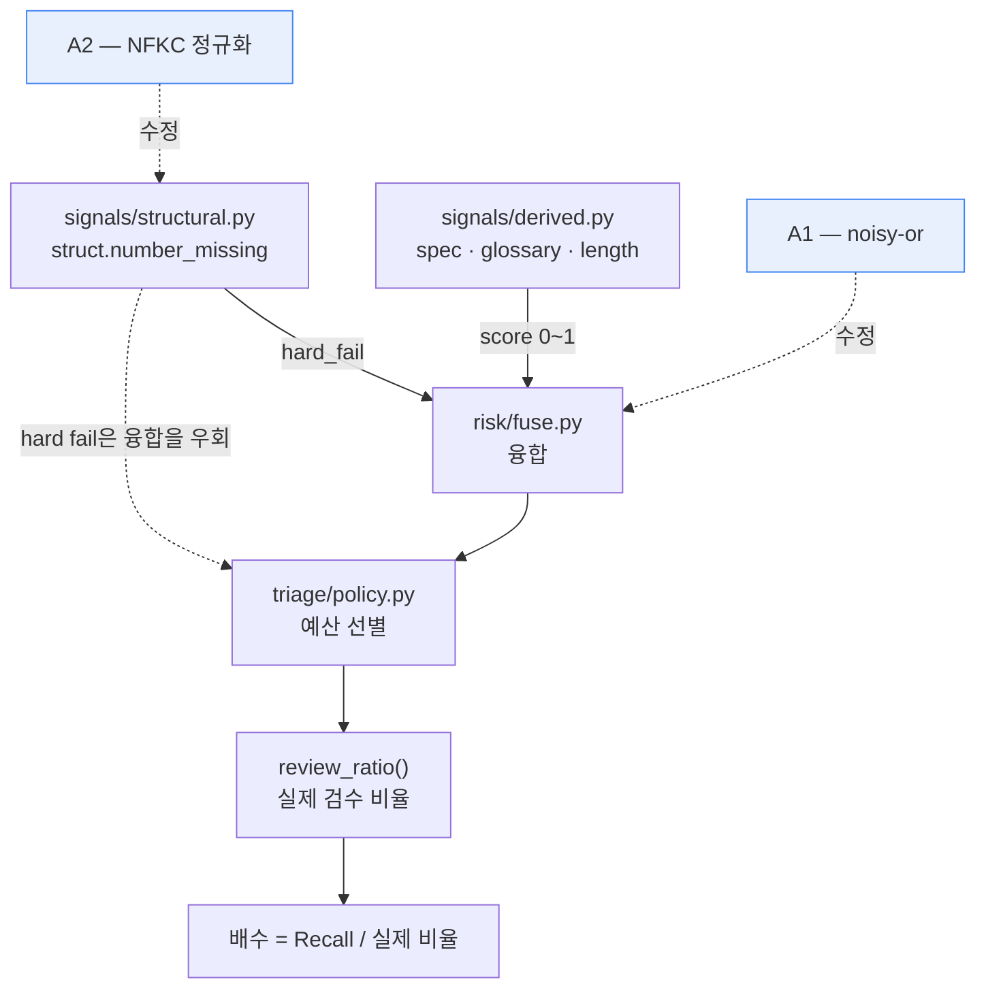
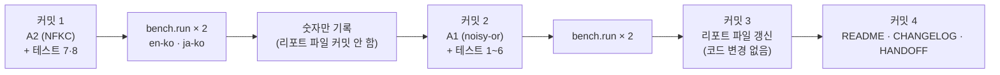

# 설계 — noisy-or 융합과 숫자 정규화

> 작성일: 2026-07-29 (KST)
> 상태: 설계 확정 (구현 계획 대기)
> 닫는 항목: [HANDOFF](../../../HANDOFF.md) "가중 평균 융합의 구조적 문제" · "`struct.number_missing`이 전각 숫자를 놓친다"
> 선행 측정: [벤치마크 하네스 설계](2026-07-28-ted2020-benchmark-harness-design.md) — 이 설계의 정량 근거를 만든 실험

## 1. 목적

Tier 0 위험도 융합의 **구조적 결함 하나**와 hard fail 신호의 **검출 결함 하나**를 고치고,
같은 벤치마크로 1회 재측정해 [README](../../../README.md) 최상단 숫자를 갱신한다.

두 결함은 성격이 다르지만 **둘 다 재측정을 요구한다**는 점에서 묶인다.
따로 처리하면 TED2020 벤치를 두 번 돌려야 하고, 그사이 리포지토리에는
"측정과 어긋난 제품 코드"가 남는다.

| # | 결함 | 성격 | 정량 근거 |
| --- | --- | --- | --- |
| A1 | 가중 평균 융합 — **문제를 하나 더 찾으면 위험도가 내려간다** | 논리 | 오라클 대비 달성률이 예산 10%에서만 69.6%로 꺼진다 (1~5% 86.4%, 20~30% 86~89%) |
| A2 | `struct.number_missing`이 전각 숫자를 놓친다 | 검출 | ja-ko 자연 오탐 41건 중 **13건(31.7%)** 이 이 경로 |

A1의 U자 저점이 **정확히 이 프로젝트의 기본 운영점**이다 — hard fail을 다 쓰고
나머지를 융합 점수 순으로 채우는 유일한 구간이 예산 10%다.

A2는 hard fail 신호의 오탐이므로 [요구사항정의서](../../요구사항정의서.md) FR-6.2에 따라
**검수 예산을 우회한다.** 오탐이 실제 검수 비율을 부풀리고, 그 비율이 배수의 분모다.

### 1.1 채택 판정은 재측정에 걸지 않는다

**noisy-or는 벤치 결과와 무관하게 채택한다.** "증거가 늘면 위험도가 내려간다"는 것은
지표 이전에 논리적 결함이고, 벤치 숫자를 보고 융합식을 고르면 그것이 곧
**벤치 데이터로 제품을 튜닝하는 것**이다. [CLAUDE.md](../../../CLAUDE.md)의
"가중치는 튜닝하지 않는다"가 금지하는 행위와 같은 종류다.

따라서 재측정의 목적은 **판정이 아니라 기록**이다.

| 재측정 결과 | 조치 |
| --- | --- |
| Recall 상승 | 채택 · 숫자 갱신 |
| Recall 하락 | 채택 · 숫자 갱신 · **한계 서술 추가** |

이 표를 스펙에 박아 두는 이유는 나중에 "한 번 더 돌려 볼까"가 생기지 않게 하기 위해서다.

### 1.2 이 설계가 답하지 않는 것

- **`spec.overlap`의 A/B 판정** — 합성 트랙에 겹침이 0건이라 이 신호는 발화하지 않는다.
  겹침이 있는 실제 자막 트랙이 있어야 판정된다.
- **한자 수사(`十`·`百`·`万`)** — NFKC로 해결되지 않는다. §4.3 참고.
- **Tier 1 자가일관성과 Q4** — LLM 계층이 필요하다.
- **`length.ratio`의 −6.0%p 기여** — 원인은 신호 자체의 오탐이며 융합식 변경으로
  해결되지 않는다. §7 참고.

## 2. 두 변경의 관계



두 변경은 **서로 다른 경로로 같은 지표에 도달한다.**
A2는 hard fail 건수를 줄여 예산 안에 여유를 만들고, A1은 그 여유를 채우는 순서를 바꾼다.
방향이 반대일 수 있으므로 **효과를 분리해 귀속한다**(§6).

### 2.1 변경 범위

| 파일 | 변경 | 규모 |
| --- | --- | --- |
| `src/cuesift/risk/fuse.py` | A1 — 융합 산식 교체 | 약 25줄 |
| `src/cuesift/signals/structural.py` | A2 — `_numbers()` NFKC 정규화 | 약 3줄 |
| `tests/test_risk_fuse.py` | 단조성·가중치 의미 6건 | 추가 |
| `tests/test_signals_structural.py` | 전각 숫자 2건 | 추가 |
| `bench/results/{pair}-2026-07-29.{md,json}` | 재측정 결과 | 덮어쓰기 |
| `README.md` · `CHANGELOG.md` · `HANDOFF.md` | 숫자·서술 | 갱신 |

**`bench/`의 코드는 건드리지 않는다.** `bench/measure.py`의 `_risks()`가
`fuse(seg.id, signals[seg.id])`를 그대로 호출하므로 산식 교체가 벤치에 자동 반영된다.
`--fusion` 플래그도 만들지 않는다 — A/B는 **두 커밋에서 각각 실행**하는 것으로 대신한다.
아무도 쓰지 않을 설정 경로를 제품에 남기지 않기 위해서다.

## 3. A1 — 융합 산식 교체

### 3.1 현행 결함

`risk/fuse.py`의 분모가 **발화한 신호의 가중치 합**이다.

```python
weighted = sum(table.get(s.name, _FALLBACK_WEIGHT) * s.score for s in signals)
score = weighted / total_weight
```

기본 가중치가 전부 1.0이므로 결과는 **발화한 신호 점수의 산술 평균**이 된다.

```text
  규격 위반 1.0                    →  1.0 / 1  =  1.00
  규격 위반 1.0 + 용어 위반 0.5    →  1.5 / 2  =  0.75   ← 더 나쁜데 뒤로 밀린다
```

트리아지는 "평균적으로 얼마나 나쁜가"가 아니라 **"적어도 하나가 진짜일 가능성"** 을 원한다.
검수자는 한 건이라도 실제 오류면 그 자막을 봐야 하기 때문이다.

### 3.2 산식

```python
product = 1.0
for s in signals:
    w = table.get(s.name, _FALLBACK_WEIGHT)
    product *= (1.0 - s.score) ** w
score = 1.0 - product
```

`FR-6.1`은 "각 신호를 0~1로 정규화하고 **설정 가능한 가중치**로 합성"만 요구할 뿐
가중 평균을 명시하지 않는다. 요구사항 변경 없이 교체 가능하다.

가중치는 **지수**로 들어간다. `(1 - sᵢ)^wᵢ`는 "이 신호를 `wᵢ`번 독립적으로 관측했다"로
읽히므로 `w=0`이 "관측하지 않음"이 되어 **ablation의 신호 끄기와 정확히 같은 의미**가 된다.

기각한 대안: `1 - ∏(1 - wᵢ·sᵢ)`. `wᵢ·sᵢ > 1`이면 `(1 - wᵢ·sᵢ)`가 음수가 되어 곱의
부호가 뒤집힌다. `w ≤ 1` clamp를 강제해야 하고, 그러면 **"신호를 강화한다"를 표현할 수 없다.**

### 3.3 경계 조건

| 입력 | 결과 | 왜 이렇게 되는가 |
| --- | --- | --- |
| `s=1.0`, `w>0` | `0.0**w = 0` → score **1.0** | 확정 위반 하나면 최대 위험. 다른 신호가 희석하지 못한다 |
| `s=1.0`, `w=0` | `0.0**0.0 = 1.0` → 기여 0 | Python 규약. `w=0`은 언제나 "이 신호를 무시" |
| `s=0.0` | `1.0**w = 1` → 기여 0 | 0점 신호가 점수를 올리지 않는다 |
| `w>1` | 밑이 더 작아짐 → 점수 상승 | `s=0.6, w=2` → `1 - 0.4² = 0.84` |
| `0<w<1` | 밑이 더 커짐 → 기여 축소 | `s=0.5, w=0.5` → 기여가 `0.5` 대신 `0.293` |
| 모든 `w=0` + 신호 존재 | **`ValueError`** | 곱이 1 → score 0.0. 전 세그먼트가 조용히 안전 판정된다 |
| 신호 없음 | score 0.0 | 판단할 것이 없다. 예외가 아니다 |

**score ∈ [0, 1]이 산식 자체로 보장된다** — 밑 `(1 - sᵢ)`가 `[0, 1]`이고 지수 `wᵢ ≥ 0`이면
거듭제곱도 `[0, 1]`이며, `[0, 1]` 값들의 곱도 `[0, 1]`이다.

이것이 **새 결합을 하나 만든다**: 범위 정합성이 `Signal.score`의 생성 시점 검증에 의존한다.
가중 평균에서는 `min(1.0, max(0.0, score))` clamp가 마지막 방어선이었지만, 여기서는
산식이 보장하고 그 보장이 상류 모델을 전제로 한다. **주석에 명시한다** — 상류 검증이
사라지면 여기가 조용히 깨진다.

clamp 자체는 남긴다. 부동소수점 여유이며 비용이 없다.

### 3.4 기존 방어의 처리

| 방어 | 도입 근거 | noisy-or에서 | 조치 |
| --- | --- | --- | --- |
| 개별 가중치 `isfinite` · 음수 금지 | D-16 | `nan`·`inf`·음수 지수가 그대로 위험 | **유지** |
| 가중치 총합 `isfinite` | D-22 | 산식이 총합을 쓰지 않아 이 경로로 점수가 뒤집히지 않는다 | **유지 · 주석 정정** |
| 총합 0 + 신호 존재 → `ValueError` | 기존 | 동일한 실패 모드가 그대로 존재 | **유지** |
| `hard_fail` 우회 (FR-6.2) | 기존 | 변경 없음 | 유지 |
| `reasons` = `score > 0`인 신호 | 기존 | 변경 없음 | 유지 |
| `min(1.0, max(0.0, ...))` clamp | 기존 | 산식이 이미 보장 | 유지 (여유) |

D-22 검사를 **삭제하지 않는 이유**가 이 표의 핵심이다. noisy-or에서는 총합 오버플로가
점수를 뒤집지 않지만, 총합은 "모든 `w=0`" 검사 때문에 어차피 계산하고
`inf` 총합은 설정 오타의 신호다. 조용히 삼키면 사용자가 오타를 모른다.

**주석은 정직하게 고친다.** 현재 주석은 "이 경로로 최대 위험이 최소 위험으로 뒤집힌다"고
적혀 있는데 그것은 가중 평균의 이야기다. "산식은 깨지지 않지만 오타를 삼키지 않는다"로
바꾼다 — D-22가 남긴 교훈이 **"막았다고 선언한 실패 모드가 다른 경로로 재현됐다"** 이므로,
주석이 사실과 어긋나면 같은 실수를 반복한다.

## 4. A2 — 숫자 정규화

### 4.1 현행 결함

```text
  _numbers('지금은 하루 50센트 이하입니다.')       →  ['50']
  _numbers('今では一日５０セント以下になりました')  →  ['５０']
```

`_NUMBER = re.compile(r"\d[\d,]*(?:\.\d+)?")`의 `\d`는 유니코드 `Nd`를 매칭하므로
전각 숫자도 **추출은 된다.** 갈라지는 곳은 집합 비교다 — `{'50'} ≠ {'５０'}`이라
누락으로 판정되고, 두 자리 이상이라 `multi_digit` 조건에 걸려 **hard fail**이 된다.

### 4.2 수정

```python
return [unicodedata.normalize("NFKC", m) for m in _NUMBER.findall(text)]
```

**추출 결과에만 적용한다.** 세그먼트 텍스트 전체를 정규화하지 않는 이유는 둘이다.

| 이유 | 내용 |
| --- | --- |
| 신규 오탐 차단 | `½`(U+00BD)·`⑤`(U+2464)는 카테고리 `No`라 `\d`에 매치되지 않는다. 텍스트를 먼저 정규화하면 `½ → 1⁄2`가 되어 **없던 숫자 1과 2가 생긴다** |
| 원인 귀속 | 변경 지점이 하나면 재측정 결과의 원인 후보도 하나다. 텍스트 전체를 정규화하면 반복·태그·미번역 신호까지 함께 움직인다 |

### 4.3 남는 한계

| 사례 | 결과 | 왜 범위 밖인가 |
| --- | --- | --- |
| `10대` → `十代` | 여전히 미탐 | 한자 수사는 NFKC의 대상이 아니다. 아라비아 매핑에는 파서가 필요하고 `十分に`(≠ 10분)·`万一`(≠ 10001) 같은 관용구에서 **hard fail 신호에 새 오탐을 만든다** |
| `1，000` (전각 콤마) | 여전히 미탐 | `_NUMBER`가 ASCII 콤마만 본다. 실데이터 빈도가 낮아 정규식 확장의 위험 대비 이득이 작다 |

ja-ko 자연 오탐 41건 중 한자 수사 경로는 4건(9.8%)이다. **이 한계를 리포트에 남긴다** —
A2 적용 후에도 오탐이 0이 되지 않는 이유를 독자가 귀속할 수 있어야 한다.

## 5. 테스트

**모든 테스트를 현재 코드에서 실제로 실패시켜 본 뒤 붙인다.**
[CLAUDE.md](../../../CLAUDE.md)의 "게이트를 만들면 반드시 실패시켜 봐야 한다"이며,
직전 세션에서 넘긴 회귀 테스트 3개가 전부 이 확인을 건너뛰어 결함이었다.

| # | 테스트 | 현재 코드에서 | 무엇을 고정하는가 |
| --- | --- | --- | --- |
| 1 | 신호를 추가해도 점수가 내려가지 않는다 | **FAIL** (1.0 → 0.75) | §3.1의 결함 자체 |
| 2 | 규격 1.0 + 용어 0.5 = 1.0 | **FAIL** (0.75) | 구체값. 1번이 산식 교체 없이 통과할 여지를 막는다 |
| 3 | `w=0`이 신호를 무력화한다 | **FAIL** | ablation과의 의미 일치 |
| 4 | `w=2`가 강화한다 (`s=0.6` → 0.84) | **FAIL** | 지수 가중을 고른 근거. `w≤1` clamp 구현을 배제한다 |
| 5 | 모든 `w=0` + 신호 → `ValueError` | PASS | 기존 방어 유지 확인 |
| 6 | hard fail 우회 | PASS | FR-6.2 유지 확인 |
| 7 | `'５０'` ↔ `'50'`이 hard fail을 내지 않는다 | **FAIL** | §4.1의 결함 자체 |
| 8 | 진짜 숫자 누락은 여전히 hard fail | PASS | **7번이 "검사를 껐다"로 통과하는 것을 막는다** |

5·6·8번은 현재도 통과한다. **그래서 더 중요하다** — 이 셋이 없으면 A1·A2가
기존 계약을 깨뜨려도 드러나지 않는다.

2번을 1번과 별도로 두는 이유: 단조성만 검사하면 "모든 점수를 `max()`로 합치는"
구현도 통과한다. 구체값이 산식을 고정한다.

## 6. 측정·문서 절차



실행 명령은 다음과 같다. 깨끗한 트랙이 `data/bench/`에 이미 있으므로
`fetch`·`build_track` 단계는 재실행하지 않는다.

```bash
# 중간 측정 (커밋 1 직후) — 리포로 나가지 않는 경로에 쓴다
.venv/Scripts/python.exe -m bench.run --pair en-ko --out-dir data/bench/tmp
.venv/Scripts/python.exe -m bench.run --pair ja-ko --out-dir data/bench/tmp

# 최종 측정 (커밋 2 직후) — 커밋될 리포트를 생성한다
.venv/Scripts/python.exe -m bench.run --pair en-ko
.venv/Scripts/python.exe -m bench.run --pair ja-ko
```

**중간 측정에 `--out-dir`를 반드시 준다.** 기본값이 `bench/results`라 그대로 돌리면
**커밋된 리포트를 덮어쓴다** — 직전 세션에서 리뷰어가 기본 경로로 벤치를 돌려
다른 작업을 덮어쓴 사고가 실제로 있었다. `data/`는 gitignore이므로 리포를 오염시키지 않는다.

`--audit-dir`는 기본값(트랙 디렉터리 = `data/bench/`)으로 둔다. 이미 gitignore 대상이다.

### 6.1 결정 사항

| 항목 | 결정 | 이유 |
| --- | --- | --- |
| 측정 횟수 | 2단계 × 2언어쌍 = **4회** | A1·A2의 효과가 반대 방향이면 1회 측정은 "변화 없음"으로 읽힌다 |
| 커밋되는 리포트 | **최종 1종** (`{pair}-2026-07-29.{md,json}`) | 같은 이름을 덮어쓰면 `git diff`가 변화를 그대로 보여 준다 |
| 중간 숫자 | CHANGELOG의 귀속 표 | 파일로 남기면 리포에 "현재값이 아닌 리포트"가 쌓인다 |
| 리포트 재생성 커밋 | 코드 커밋과 **분리** | I-1(커밋 스탬프가 한 커밋 뒤처짐)의 구조적 해법 |
| 시드 | 기본값 `20260729` 고정 | 시드를 바꾸면 A/B가 성립하지 않는다 |

### 6.1.1 실행이 실패할 수 있는 지점

`bench/measure.py`의 `check_invariants()`는 **위반 시 예외를 던지고 리포트를 내지 않는다.**
두 변경 모두 이 게이트를 통과해야 숫자가 나온다.

| 불변식 | 이 변경과의 관계 |
| --- | --- |
| 1 — Recall ≤ 오라클 상한 | A2가 hard fail을 줄이면 실제 검수 비율이 내려가고 **오라클 상한도 함께 내려간다.** 상한이 내려가는데 Recall이 따라 내려가지 않으면 위반이다 |
| 2 — 무작위 베이스라인 ≈ 실제 비율 | 영향 없음 (선별 로직 검증) |
| 3 — 예산 증가 시 Recall 단조 증가 | noisy-or가 순위를 바꿔도 상위 N 선별이므로 유지되어야 한다 |
| 4 — hard fail 오탐률 ≤ 2% | **A2가 개선하는 방향이다.** 악화되면 정규화가 미탐이 아니라 오탐을 만든 것 |

위반이 나면 그것 자체가 결과다 — 숫자를 맞추려 불변식을 완화하지 않는다.

리포트 파일명은 `date.today()`로 만들어진다(`bench/report.py`). 작업이 자정을 넘기면
**새 파일이 생기고 옛 파일이 남는다.** 그 경우 옛 파일을 지우고 새 이름으로 문서 참조를
갱신한다 — 같은 측정의 리포트가 두 개 남는 상태를 만들지 않는다.

### 6.2 부수 효과 — 함께 닫히는 항목

A2가 ja-ko hard fail 오탐의 원인 분포를 바꾸므로 리포트의 원인 목록을 재작성해야 한다.
그 과정에서 미해결 이슈 **"한자 수사가 리포트 원인 목록에 없다"** 가 함께 닫힌다 —
남는 오탐의 구성이 바뀌면 목록도 그에 맞춰 다시 쓰이기 때문이다.

### 6.3 갱신할 문서

| 문서 | 무엇을 |
| --- | --- |
| `README.md` | 최상단 배수 · 한계 절(결과가 나빠지면 서술 추가) |
| `CHANGELOG.md` | A1·A2 항목 · **귀속 표**(A2만 / A1+A2) |
| `HANDOFF.md` | 미결 항목 5·6 닫기 · 남은 한계 이관 |
| `docs/요구사항정의서.md` | §12 Q4의 인용 수치가 바뀌면 동기화 |

마지막 행이 빠지기 쉽다. Q4의 근거 문장이 `negation` Recall 1.41%를 인용하는데,
이 값은 융합식 변경의 영향을 받는다.

## 7. 비목표와 예상 리스크

| 항목 | 결정 | 이유 |
| --- | --- | --- |
| `length.ratio` 가중치 하향 | **하지 않는다** | 벤치 데이터로 가중치를 맞추는 것. `DEFAULT_WEIGHTS`는 전부 1.0을 유지한다 |
| `--fusion` 플래그 | 만들지 않는다 | 두 커밋이 곧 플래그다. 쓰이지 않을 경로를 제품에 남기지 않는다 |
| 한자 수사 매핑 | 범위 밖 | §4.3 |
| `spec.overlap` A/B | 여전히 불가 | 합성 트랙에 겹침 0건 |

### 7.1 역효과 가능성을 미리 적어 둔다

가중 평균에서는 0점 신호들이 **오탐을 희석해 줬다.** noisy-or는 점수를 **올리기만** 하므로
`length.ratio` 오탐이 지금보다 더 상위로 올라올 수 있다.

즉 ablation의 −6.0%p(끄면 Recall이 오른다)가 **개선되지 않고 악화될 가능성이 실재한다.**
가중 평균의 희석은 결함이었지만, 그 결함이 오탐 신호에 한해서는 우연히 완충으로 작동했다.

그래도 채택한다(§1.1). 완충이 필요하다면 그 답은 융합식을 되돌리는 것이 아니라
**`length.ratio` 자체를 고치는 것**이다 — 짧은 원문에서의 계통 오탐은 이미 한 번
수정됐고(`3718e3a`), 남은 −6.0%p는 그 수정이 불완전하다는 신호다. 별도 과제로 이관한다.

## 8. 요구사항 대응

| 요구사항 | 이 설계에서 |
| --- | --- |
| FR-6.1 (0~1 정규화 · 설정 가능한 가중치) | 유지. 가중치가 지수로 들어간다 |
| FR-6.2 (hard fail은 합성을 우회) | 변경 없음 |
| FR-6.4 (신호별 기여 기록) | `reasons` 변경 없음 |
| FR-6.5 (플러그인 인터페이스) | `_FALLBACK_WEIGHT = 1.0` 유지 — QE 신호가 설정 없이 꽂힌다 |
| FR-3.4 (숫자 누락 판정) | A2가 전각 숫자 오탐을 제거한다 |
| §9.1 (Recall @ Budget) | 재측정 1회로 갱신 |
