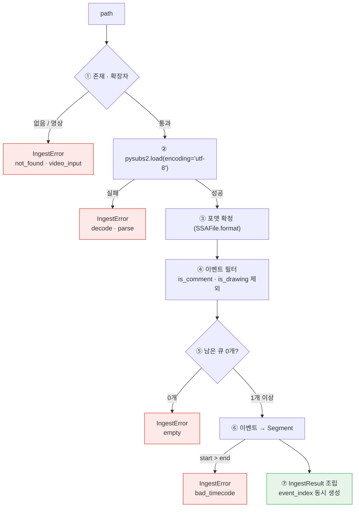

# 설계 — 인제스트 (자막 파일 → Segment)

> 작성일: 2026-07-31 (KST)
> 상태: 설계 확정 (구현 계획 대기)
> 대상: [요구사항정의서](../../요구사항정의서.md) FR-1.1 · FR-1.3 · FR-1.5 — [WBS](../../WBS.md) WP4
> 여는 항목: [HANDOFF](../../../HANDOFF.md) "`spec.overlap`은 여전히 판정 불가"

## 1. 목적과 범위

자막 파일(SRT · WebVTT · ASS/SSA)을 `Segment` 리스트로 바꾸는 계층을 만든다.

이 작업이 [WBS](../../WBS.md)의 **병목**이다 — 출력(WP5) · 번역(WP7) · STT(WP9)가 전부
여기에 걸려 있고, 자막 파일을 `Segment`로 바꾸지 못하면 Tier 0 신호 엔진에
**실데이터가 한 번도 들어가지 않는다.** 지금까지 벤치 하네스는 평문 문장쌍에서
타임코드를 합성했고(`bench/build_track.py`), 실제 자막 파일이 파이프라인에 들어온 적이 없다.

### 1.1 범위

| 구분 | 내용 |
| --- | --- |
| **포함** | FR-1.1 파싱 · FR-1.3 입력 종류 판별 · FR-1.5 언어 값 수용 |
| **산출물** | `src/cuesift/ingest/` · `tests/fixtures/ingest/` · `tests/test_ingest.py` |
| **완료 판정** | 픽스처 단위 테스트 통과 + `pytest` 수집 개수 증가 확인 + WBS 상태 갱신(근거 커밋 병기) |
| **비범위** | `check` 배선(WP6) · 출력(WP5) · STT(WP9) · VTT 화자 복원(v0.2) · TTML(v0.3) |

### 1.2 규모를 M에서 S로 내려 잡는다

WBS는 WP4를 "파서 3종, 규모 M"으로 적었다. **실측이 이 추정을 뒤집었다**(§12).
pysubs2 1.8.1이 포맷 자동 판별과 태그 정규화를 모두 처리하므로 **포맷별 분기가 0개**다.

"파서 3종"은 요구사항(3개 포맷)의 서술이지 구조(3개 모듈)의 서술이 아니었다.
라이브러리를 실제로 찔러 보기 전에는 이 둘이 구분되지 않는다.

### 1.3 이 설계가 답하지 않는 것

| 항목 | 어디로 |
| --- | --- |
| 원문 자막과 번역 자막 두 파일의 정렬 | **v0.1 표면에 존재하지 않는다.** `cli.py`의 `translate`·`check` 모두 입력을 하나만 받고, 번역문은 WP7이 생성한다 |
| `--source-lang` · 설정 파일 우선순위 해결 | WP6(설정 로더). 이 계층은 값을 받아 기록만 한다 |
| 인코딩 자동 감지 | 하지 않는다(§5.3). 런타임 의존성 4개 고정 |

## 2. 모듈 경계와 공개 API

```text
  src/cuesift/ingest/
    __init__.py    공개 API 재수출 (segment/ · spec/ 패턴과 동일)
    loader.py      전부
```

`ingest`가 pysubs2를 아는 **유일한 모듈**이 된다. 요구사항정의서 §7.2의
"외부 의존은 인터페이스 뒤로 격리"를 지키기 위해서다. 의존 방향은 `ingest` → `segment`
한 방향이고 역방향은 없다.

```python
def load_subtitle(path: Path, *, source_lang: str = "ko") -> IngestResult
```

```python
@dataclass(frozen=True, slots=True)
class IngestResult:
    segments: list[Segment]        # 하위 파이프라인이 쓰는 순수 데이터
    source_path: Path
    format: str                    # "srt" | "vtt" | "ass" | "ssa" (실측 §12)
    source_lang: str
    subs: pysubs2.SSAFile          # 원본 — WP5(FR-7.1) 라운드트립 전용
    event_index: dict[str, int]    # segment.id → subs 내 이벤트 위치
```

### 2.1 왜 원본 `SSAFile`을 들고 다니는가

FR-7.1이 **"번역된 자막 파일을 언어별로 출력한다(입력과 동일 포맷 기본)"** 를 요구한다.
즉 cuesift는 자막 파일을 다시 쓴다. `.plaintext`만 남기면 아래가 전부 사라진다.

| 잃는 것 | 예 | `subs`를 들고 있으면 |
| --- | --- | --- |
| 스크립트 헤더·스타일 정의 | `[V4+ Styles]` 블록 | 보존된다 |
| 주석 줄·타임코드·포맷 | `Comment:` · `0:00:01.00` | 보존된다 |
| ASS 오버라이드 태그 | `{\an8}` (화면 상단) | **건드리지 않은 이벤트만.** `SSAEvent.plaintext` setter가 태그를 통째로 대체하므로 **번역을 되쓰는 이벤트에서는 사라진다** |
| VTT cue settings | `line:0 position:20%` | **보존되지 않는다** — `SSAEvent`에 담을 필드가 없다 |
| 화자 태그 | `<v Alice>` | **보존되지 않는다** — pysubs2가 로드 시점에 버린다(§10) |

즉 `subs`를 들고 다니는 결정 자체는 여전히 옳다 — 스크립트 헤더·스타일 정의·주석 줄·
타임코드·포맷은 실제로 보존되고, 라운드트립이 4개 포맷(SRT·VTT·ASS·SSA) 전부에서
성립하는 것을 실측했다(§12). 다만 **되쓰기 시점의 보존 범위**는 여기서 처음 적은
것보다 좁다 — `SSAEvent.plaintext` setter가 `self.text = text.replace("\n", r"\N")`로
텍스트 전체를 교체하므로, 번역문을 되쓰는 이벤트에서는 오버라이드 태그가 함께
사라진다. 건드리지 않고 그대로 통과시키는 이벤트(스타일·주석 등)에서만 태그가
남는다. VTT cue settings는 애초에 `SSAEvent`에 담을 필드가 없어 로드 시점에 버려진다
— `subs`를 들고 있어도 살아남지 않는다.

WP4는 지금 만들고 WP5는 나중에 만든다. **지금 버린 정보는 WP5 시점에 파일을 다시
읽는 우회로를 부르고, 그 순간 같은 파일이 두 번 파싱되어 두 표현이 갈릴 수 있다.**
WP5가 오버라이드 태그를 보존한 채 되쓰려면 `plaintext` setter에 기대지 않는
별도의 되쓰기 경로가 필요하다(§10).

### 2.2 왜 `event_index`가 필요한가

§4의 필터가 ASS `Comment:` 줄과 벡터 드로잉을 버리므로 **`segments[i]`와 `subs[i]`가
어긋난다.** 이 대응표가 없으면 WP5가 번역문을 원본에 되쓸 때 첫 주석 줄 이후로
전부 한 칸씩 밀리고, **예외 없이 조용히** 밀린다.

### 2.3 `Segment.meta`는 비워 둔다

요구사항정의서 §7.3은 `meta`를 "원본 서식·태그 등"으로 적었으나, 원본을 `subs`에 두고
`meta`에도 복사하면 **같은 사실의 두 표현**이 생겨 한쪽만 고쳐질 때 갈라진다.
[CLAUDE.md](../../../CLAUDE.md)가 용어 정의를 단일 출처로 두는 것과 같은 이유다.

## 3. 데이터 흐름



**⑤가 ④ 뒤에 있는 것이 중요하다.** 전부 주석인 ASS 파일은 pysubs2 기준으로 큐가
있지만 자막은 0개다. 순서를 뒤집으면 그 파일이 조용히 통과한다.

## 4. 이벤트 필터

| 판별자 | 조치 | SRT · VTT에서 | 안 걸렀을 때 깨지는 것 |
| --- | --- | --- | --- |
| `is_comment` | `segments`에서 제외, `subs`에는 보존 | 항상 `False` | 화면에 나오지 않는 줄이 규격 검사를 받는다 |
| `is_drawing` | 동일 | 항상 `False` | `m 0 0 l 100 0 100 100`이 **자막 문자로 세어져** CPS·문자 수를 부풀린다 |
| 빈 텍스트 | **보존한다** | — | FR-3.2가 hard fail로 잡을 대상을 인제스트가 미리 지운다 |

두 필터를 포맷 분기 없이 항상 적용한다 — SRT·VTT에서 항상 `False`인 것을 실측했다(§12).

**드로잉 필터가 특히 중요한 이유**는 CPS 오염이 hard fail로 이어지기 때문이다.
hard fail은 FR-6.2에 따라 검수 예산을 우회하므로, 오탐 하나가 실제 검수 비율을 부풀려
**Recall@Budget 지표 자체**를 망가뜨린다. 신호 계층이 아니라 인제스트에서 막아야 한다.

빈 큐를 **살려 두는** 결정은 같은 원리의 반대편이다. 인제스트가 "정리"를 하면
하위 신호가 잡아야 할 것이 사라지고, 그 손실은 아무 에러도 내지 않는다.

## 5. 오류 계약

### 5.1 단일 예외 + `reason` 코드

```python
class IngestError(Exception):
    reason: str   # not_found | video_input | decode | parse | empty | bad_timecode
```

| `reason` | 상황 | 메시지에 반드시 담을 것 |
| --- | --- | --- |
| `not_found` | 파일 없음 | 경로 |
| `video_input` | 영상·오디오 확장자 | "STT는 v0.1 미구현(WP9)" + FR-1.3 언급 |
| `decode` | utf-8 디코딩 실패 | 실패 바이트 위치 + **"utf-8로 변환 후 재시도"** |
| `parse` | pysubs2 예외 | 원 예외 메시지 |
| `empty` | 필터 후 큐 0개 | 경로 + 감지된 포맷 |
| `bad_timecode` | `start > end` | **1-based 큐 번호** + 실제 두 값 |

**`empty`는 "큐가 0개"이지 "텍스트가 빈 큐"가 아니다.** 텍스트가 빈 큐는 §4에서
보존한다 — 이름이 비슷해 반대로 읽히기 쉬우므로 명시한다.

### 5.2 테스트는 `reason`을 단언하고 문구는 단언하지 않는다

지난 세션의 교훈을 그대로 적용한 것이다 — 리포트 테스트가 `"검출기의 알려진 한계"`라는
**계약**을 고정해 뒀기에 한계의 정체가 NFKC에서 한자 수사로 바뀌어도 한 줄도 고치지
않았다. `assert "NFKC" in md`였다면 **수정과 함께 실패해 개선을 방해했을 것이다.**

**회귀 방지선은 사실이 아니라 계약을 고정한다.**

### 5.3 `encoding` 파라미터를 만들지 않는다

utf-8 고정이다. cp949 자막은 사용 불가가 되지만(§10), `cli.py`에 `--encoding` 플래그가
없어 **아무도 설정할 수 없는 인자**를 만드는 것이고, `--fusion` 플래그를 만들지 않은 것과
같은 판단이다. 진단 메시지가 변환 방법을 안내한다.

### 5.4 `empty`가 잡는 것은 좁지만 실재한다

**`pysubs2.load()`는 자막이 아닌 파일에 대해 `FormatAutodetectionError`를 던진다**(§12).
자막 아닌 텍스트·빈 파일·타임코드 없는 SRT는 전부 `parse`로 걸린다.

그러면 `empty`는 무엇을 잡는가 — **파싱은 성공했는데 표시할 큐가 0개인 파일**이다.
전부 `Comment:`인 ASS가 실측으로 확인된 유일한 경로다(§12). 이 파일은 pysubs2 기준으로
큐가 있으므로 파싱 단계에서 걸리지 않고, §4 필터를 지난 뒤에야 0개가 된다.

CLAUDE.md의 **"0개 수집은 통과가 아니라 설정 오류다"** 가 이 지점이다.
pysubs2가 판단하지 않으므로 인제스트가 대신 판단한다.

## 6. Segment 매핑 계약

| 필드 | 값 | 근거 |
| --- | --- | --- |
| `id` | `f"{index:05d}"` | 요구사항정의서 §7.3 "안정적 식별자". v0.1은 한 번에 파일 하나만 처리 |
| `index` | 필터 후 **0부터 연속 재부여** | 구멍이 있으면 리포트·정렬이 혼란스럽다. 원본 위치는 `event_index`가 보존 |
| `start_ms` · `end_ms` | `e.start` · `e.end` | pysubs2가 **이미 정수 밀리초**로 준다 — 변환 없음 |
| `source_text` | `e.plaintext` | 태그 제거 + `\N` → `\n`. `check_text`가 `split("\n")`하므로 그대로 맞는다 |
| `target_text` | `None` | 번역은 WP7 |
| `speaker` | `None` | v0.2. pysubs2가 VTT `<v>`를 버리는 것을 확인했고 복원은 미룬다 |
| `meta` | `{}` | §2.3 — 원본은 `subs` 단일 출처 |

**파싱한 파일은 항상 `source_text`에 들어간다.** `check`가 번역 결과물을 검사하는
경우에도 마찬가지다. 인제스트 입장에서 "지금 읽고 있는 파일"이 곧 원문이고,
필드가 상황마다 바뀌면 하위 모듈이 어느 쪽을 볼지 매번 판단해야 한다.

## 7. FR-1.3 — 입력 종류 판별

```text
  .srt .vtt .ass .ssa            →  자막 경로 확정 (STT 안 탐)
  .mp4 .mkv .mov .webm .m4v      →  IngestError(video_input)
  .avi .mp3 .m4a .wav
  그 외 / 확장자 없음             →  pysubs2 자동 판별 → 실패 시 parse
```

### 7.1 FR-1.3은 현재 CLI 표면에서 발동하지 않는다

FR-1.3은 *"자막과 영상이 **모두 주어지면** 자막을 우선 사용한다"* 인데,

- `cli.py`의 `translate` · `check`는 입력을 하나만 받는다(`input: Path`)
- `cuesift.yaml` 스키마(§8.2)에 `video:` 키가 없다

**"둘 다 주어지는" 상황이 v0.1 표면에 존재하지 않는다.** WP4에서 FR-1.3은
**"입력 종류를 판별하고, 자막이면 STT 경로를 타지 않는다"** 로 구현한다.
R1(STT 오류 증폭)의 취지는 이것으로 충족되고, 진짜 "둘 다 주어짐"은 WP9에서
설정 스키마와 함께 다시 봐야 한다.

### 7.2 영상 확장자를 명시적으로 거르는 이유

mp4를 텍스트로 열면 `UnicodeDecodeError`가 나고, 그러면 사용자에게
*"utf-8로 변환 후 재시도"* 라는 **틀린 조언**이 간다. 확장자 화이트리스트가 그 경로를 막는다.

세 번째 줄(그 외 / 확장자 없음)에는 실측 근거가 있다 — 확장자가 없거나 `.vtt`인데
내용이 SRT여도 pysubs2가 내용으로 제대로 읽었다(§12).

## 8. FR-1.5 — 언어 값 처리

```text
  --source-lang  >  cuesift.yaml source_lang  >  기본값 "ko"
       └────────────── 이 우선순위 해결은 WP6(설정 로더) ──────────────┘

  WP4:  load_subtitle(path, source_lang="ko")   ← 값을 받아 기록만 한다
```

FR-1.5의 문구는 *"자동 감지**하거나** 명시적으로 지정받는다"* 이므로 명시 지정만으로
충족된다. 자동 감지를 넣지 않는 근거는 아래와 같다.

| 조건 | 자동 감지에 미치는 영향 |
| --- | --- |
| Q2 — 초기 언어쌍 ko→en/ja | v0.1에서 원문은 **항상 한국어**다 |
| 런타임 의존성 4개 고정 | `langdetect` 등 추가 불가. 직접 구현해야 한다 |
| `check --spec` | 규격 프로파일을 사용자가 이미 지정한다 |
| 직접 구현의 실패 양상 | 한자만 있는 짧은 자막에서 ko/ja가 갈리지 않고, **그 실패는 조용하다** |

`ingest`는 CLI나 설정 파일을 읽지 않는다(요구사항정의서 §7.2 모듈 경계). "어느 경로에서 온 값인가"의
추적도 WP6이 가질 관심사이므로 여기서 만들지 않는다.

## 9. 테스트 전략

### 9.1 픽스처

**손으로 짜고, 각 파일이 무슨 경계를 심었는지 파일 상단 주석에 적는다.**
손으로 짠 픽스처의 가치는 현실성이 아니라 **경계를 선언할 수 있다**는 것이다 —
실제 자막 파일은 어떤 경계가 들어 있는지 모르는 채로 통과한다.

| 픽스처 | 심는 경계 |
| --- | --- |
| `minimal.srt` | 정상 2큐 · 2줄 |
| `crlf_bom.srt` | CRLF + BOM |
| `overlap.vtt` | **겹치는 큐 2개** |
| `tags.ass` | `{\an8}` · 이탤릭 · `Comment:` 줄 · 벡터 드로잉. **`[V4+ Styles]` 섹션 필수**(§12) |
| `empty_cue.srt` | 빈 텍스트 큐 (보존 대상 — `empty`와 무관) |
| `reversed.srt` | `start > end` |
| `all_comments.ass` | **전부 `Comment:`** — `empty`의 유일한 경로(§5.4) |
| `not_subtitle.txt` | 자막이 아닌 텍스트 — `parse`를 낸다 |
| `cp949.srt` | cp949 인코딩 |
| `multiline.vtt` | 3줄 큐 |

### 9.2 검증 축

| # | 축 | 확인 |
| --- | --- | --- |
| 1 | 라운드트립 | 큐 개수 · 타임코드 · 텍스트 |
| 2 | 태그 제거 | `source_text`에 `{` · `<i>` 없음 |
| 3 | 필터 | 주석·드로잉이 `segments`에 없고 **`subs`에는 남아 있다** |
| 4 | `event_index` 정합 | 모든 세그먼트에 대해 `subs[event_index[id]].plaintext == source_text` |
| 5 | 오류 계약 | 6개 `reason` 각각 |
| 6 | **음성 테스트** | 필터를 끄면 드로잉이 CPS를 부풀린다 — 게이트가 **실제로 실패**하는지 확인 |

6번이 이 프로젝트의 규율이다 — **"게이트를 만들면 반드시 실패시켜 봐야 한다."**
길이비 회귀 테스트가 버그 버전에서도 통과해 데이터를 다시 짠 전례가 있다.

### 9.3 부수 효과 — `spec.overlap` 판정이 열린다

`test_overlapping_cues_reach_spec_check_overlaps`(`tests/test_ingest.py`)가 이 경로를
연다 — `overlap.vtt`를 인제스트해 나온 `Segment`를 `check_overlaps`에 그대로 넣고
겹침 1000ms가 검출되는 것을 확인한다. 지금까지는 `build_track`이 겹침 0건으로
트랙을 합성하고 주입기의 `spec` 유형은 duration을 줄일 뿐이라 **겹침을 만들지
못했다.** 기여도 `+0.0%`는 "쓸모없다"가 아니라 "측정하지 못했다"였다 — 픽스처만
있고 그것을 통과시키는 테스트가 없던 동안은 준비만 된 상태였고, 이 테스트가 그
간극을 닫는다.

## 10. 남는 위험

| 위험 | 성격 | 처리 |
| --- | --- | --- |
| cp949 자막 사용 불가 | 의도된 제약 | 진단 메시지가 변환을 안내. `--encoding`은 WP6에서 필요해지면 플래그와 함께 |
| VTT 화자 태그 소실 | 정보 손실 | v0.2. `subs`에도 없으므로 **원본 재파싱으로만 복구 가능** |
| `id`가 인덱스 기반 | 파일 편집 시 흔들린다 | 대안(내용 해시)은 v0.1 범위 밖. 한계를 주석에 적는다 |
| FR-7.5 문서·코드 불일치 | **기존 결함** | `hard\|any\|none`(요구사항정의서) vs `hard\|soft\|never`(`cli.py:31`). WP4에서 고치지 않고 기록만 |
| VTT cue settings 소실 | 정보 손실 | `SSAEvent`에 필드가 없다. 원본 재파싱으로만 복구 가능 |
| `plaintext` setter가 오버라이드 태그를 대체 | WP5 제약 | 번역을 되쓰면 `{\an8}` 등이 사라진다. WP5는 태그를 보존하는 되쓰기 경로를 직접 만들어야 한다 |
| **인제스트 결과를 신호 엔진에 바로 넣으면 `struct.empty`가 전량 발화** | **WP6 함정** | `target_text=None`이므로 모든 세그먼트가 hard fail이 되고, hard fail은 FR-6.2에 따라 검수 예산을 **우회**하므로 검수 비율이 100%가 되어 Recall@Budget이 무의미해진다. `check` 배선(WP6)은 파싱한 파일을 `target_text`로도 채우거나 `SignalContext`에 원문-전용 모드를 둬야 한다 |

## 11. 실행 방식

HANDOFF의 지침대로 **분할과 리뷰 3축을 적용**한다. 규모를 S로 내려 잡았으므로
구현 병렬화보다 **리뷰 축 분리**가 핵심이다.

| 리뷰 축 | 지목할 위험 | 검증 방법 |
| --- | --- | --- |
| 1. 라운드트립 정합 | `event_index`가 필터 후에도 맞는가 | ASS 픽스처로 **실행해서** 대응을 출력하라 |
| 2. 오염 차단 | 드로잉·주석이 규격 계산에 새어 드는가 | `check_text`에 통과시켜 **수치를 내라** |
| 3. 오류 계약 | 조용히 통과하는 입력이 있는가 | 6개 `reason`을 **실제로 발생시켜라** |

리뷰어 금지 사항: **코드 수정 · `git stash` · 기본 `--out-dir`로 벤치 실행.**
셋 다 이전 세션에서 실제로 일어난 사고다.

## 12. 실측 근거 — pysubs2 1.8.1

이 설계의 전제는 기억이 아니라 실행 결과다. `.venv/Scripts/python.exe`로 확인했다.

| 확인 항목 | 결과 | 설계 함의 |
| --- | --- | --- |
| CRLF | 파일 경로로 읽으면 `\r`이 남지 않는다 | 별도 처리 불필요. `from_string`에서만 남는다 |
| BOM | `encoding="utf-8"`로도 정상 | 별도 처리 불필요 |
| cp949 파일 | **`UnicodeDecodeError`** | §5.3 — utf-8 고정, 진단 메시지로 안내 |
| 확장자 없음 · 거짓 확장자 | **내용으로 자동 판별** | §7의 세 번째 분기 |
| ASS `Comment:` | 큐로 들어옴, `is_comment=True` | §4 필터 |
| ASS 벡터 드로잉 | 큐로 들어옴, `is_drawing=True` | §4 필터 |
| VTT `<v Alice>` | **조용히 버려짐** | §10 — `speaker`는 v0.2 |
| 오버라이드 태그 | `.plaintext`가 제거 + `\N` → `\n` | §6 — `source_text`에 그대로 쓴다 |
| VTT cue settings (`line:0 position:20%`) | `SSAEvent`에 담을 필드가 없어 로드 시점에 버려진다 | §2.1 — `subs`를 들고 있어도 살아남지 않는다. 복구하려면 원본 재파싱뿐 |
| `SSAEvent.plaintext` setter | `self.text = text.replace("\n", r"\N")` — 텍스트 전체를 교체한다 | §2.1 — 번역을 되쓰는 이벤트는 오버라이드 태그가 함께 사라진다. WP5는 별도 되쓰기 경로가 필요하다 |
| `start > end` | **통과시킨다** | `Segment.__post_init__`가 `ValueError` → §5 `bad_timecode`로 감싼다 |
| 자막이 아닌 텍스트 · 빈 파일 · 타임코드 없는 SRT | **`load()`는 `FormatAutodetectionError`** | §5.4 — 전부 `parse`다 |
| 전부 `Comment:`인 ASS | 파싱 성공 · 큐 1개 · **표시 대상 0개** | §5.4 — `empty`의 유일한 실측 경로 |
| `SSAFile.format` 값 | `"srt"` · `"vtt"` · `"ass"` · `"ssa"` **4종** | §2 — `.ssa`는 `"ass"`가 아니라 `"ssa"`다 |
| `[V4+ Styles]` 없는 ASS | **`FormatAutodetectionError`** | §5 `parse`로 감싼다. `tags.ass` 픽스처에 스타일 섹션이 있어야 한다 |

**CRLF 항목은 첫 판단을 뒤집은 것이다.** `from_string`으로 본 `\r`을 결함으로 오인했으나
파일 경로로 다시 확인하니 파이썬 텍스트 모드가 처리하고 있었다. 실측하지 않았다면
불필요한 정규화 코드가 들어갔을 것이다.

**"0큐" 항목도 한 번 틀렸다.** 초판은 `from_string(format_="srt")`로 측정해
"자막이 아닌 텍스트도 예외 없이 0큐"라고 적었으나, `format_`을 넘기면 **자동 판별을
건너뛴다.** 제품 코드가 쓸 `load()`는 자동 판별을 하므로 예외가 난다.
**측정 방법이 제품 경로와 다르면 그 측정은 제품에 대해 아무것도 말하지 않는다.**

## 13. 결정 로그

| # | 결정 | 근거 |
| --- | --- | --- |
| D1 | 손으로 짠 픽스처 + 단위 테스트로 완료를 증명한다 | 외부 의존 0, 재현 100%. 경계를 **선언**할 수 있다 |
| D2 | FR-1.5는 명시 지정만 + 기본값 `ko` | Q2가 원문을 한국어로 고정. 추측이 없으니 조용한 오판도 없다 |
| D3 | 이상 입력은 **엄격 실패 + 진단 메시지** | 조용한 실패를 만들지 않는다. 건너뛰기는 호출자가 개수를 안 읽으면 손실이 된다 |
| D4 | 원본 `SSAFile`을 `IngestResult`에 담는다 | FR-7.1 라운드트립. `Segment`는 순수하게 유지 |
| D5 | 모듈은 **단일 진입점**(A안) | 포맷별 분기가 0개. 어댑터 3개는 pysubs2가 통합한 것을 다시 쪼개는 것 |
| D6 | `encoding` 파라미터를 만들지 않는다 | 아무도 설정할 수 없는 인자. `--fusion`을 만들지 않은 것과 같은 판단 |
