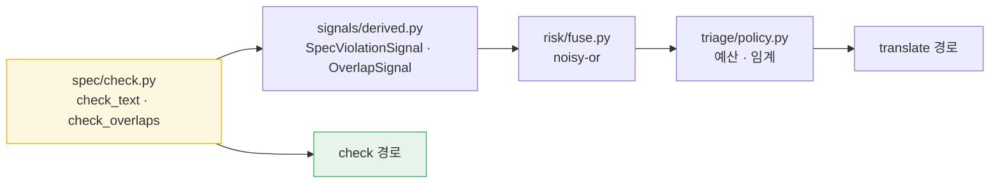
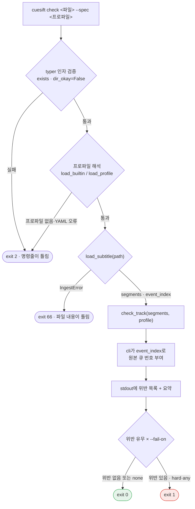

# 설계 — `cuesift check` 배선 (규격 검사 CI 게이트)

> 작성일: 2026-08-03 (KST)
> 상태: **구현 완료** (2026-08-13) — [구현 계획](../plans/2026-08-13-check-cli.md) 태스크 7개
> 대상: [요구사항정의서](../../요구사항정의서.md) FR-8.2 · FR-7.5 — [WBS](../../WBS.md) WP6 부분
> 여는 항목: [HANDOFF](../../../HANDOFF.md) "🔴 WP6이 밟을 함정 — 인제스트 결과를 신호 엔진에 그대로 넣으면 전량 hard fail"
> 선행: [인제스트 설계](2026-07-31-ingest-design.md)

## 1. 목적과 범위

`cuesift check <자막파일> --spec <프로파일>`을 **실제로 동작하게** 만든다.
지금 이 명령은 종료 코드 `70`(미구현)으로 끝난다.

이것이 [WBS](../../WBS.md)가 지목한 **"가장 짧은 쓸 수 있는 제품" 경로**다.
`check`는 규격 검사만 하므로 번역(WP7)도 STT(WP9)도 필요 없고, Tier 0 규격 판정과
규격 프로파일과 인제스트가 이미 전부 있다. v0.1 전체를 기다리지 않고 중간 산출물을
낼 수 있는 유일한 지점이다.

### 1.1 범위

| 구분 | 내용 |
| --- | --- |
| **포함** | FR-8.2 `check` 배선 · FR-7.5 CI 종료 코드 · 규격 위반 6종 + 빈 큐 판정 |
| **산출물** | `src/cuesift/spec/check.py` 확장 · `src/cuesift/cli.py` `check()` 본문 · `tests/test_cli_check.py` · `tests/test_spec_check.py` 확장 |
| **완료 판정** | 종료 코드 5종이 각각 실제로 발생하는 것을 테스트로 확인 + `pytest` 수집 개수 증가 확인 + WBS·CHANGELOG 갱신(근거 커밋 병기) |
| **비범위** | FR-8.4 설정 파일 로더 · FR-8.5 진행 표시와 CI 감지 · FR-7.2 `review.json` · FR-7.3 `report.html` · `translate`·`transcribe` 배선 |

### 1.2 이 설계가 답하지 않는 것

| 항목 | 어디로 |
| --- | --- |
| 번역 품질 판정 (미번역·반복 붕괴·용어 누락·길이비) | **`check`의 대상이 아니다.** 입력이 단일 파일이라 비교할 번역쌍이 없다. WP7·WP8 |
| 위험도 융합·검수 예산·순위 | `check`는 트리아지가 아니라 이진 게이트다(§2.2) |
| `review.json` 스키마 | WP5. `check`는 파일을 쓰지 않는다(§7) |
| 위반 심각도 등급 | v0.1에는 등급이 하나다(§5). 필요해지면 프로파일 YAML로 확장 |
| 자동 교정(재분절·줄바꿈 재배치) | FR-5.4, v0.2 |

## 2. 무엇을 검사하는가

### 2.1 검사 대상 7종

| 위반 종류 | 판정 근거 | 출처 |
| --- | --- | --- |
| `line_length` | 줄당 폭이 `max_chars_per_line` 초과 | `check_text` (기존) |
| `line_count` | 줄 수가 `max_lines` 초과 | `check_text` (기존) |
| `cps` | 초당 문자수가 `max_cps` 초과 | `check_text` (기존) |
| `duration_short` | 노출시간이 `min_duration_ms` 미만 | `check_text` (기존) |
| `duration_long` | 노출시간이 `max_duration_ms` 초과 | `check_text` (기존) |
| `overlap` | 앞선 큐와 시간이 겹침 | `check_overlaps` (기존) |
| **`empty_cue`** | 텍스트가 없거나 공백뿐 | **`check_empty_cues` (신규)** |

앞의 여섯은 이미 구현·테스트돼 있다. **이 설계가 새로 만드는 판정은 `empty_cue` 하나뿐이고,
나머지는 전부 배선이다.**

빈 큐를 넣는 근거는 §12.3의 실측이다 — 현재 파이프라인의 **어느 경로로도 탐지되지 않는
사각지대**이고, 배포 자막에 텍스트 없는 큐가 남는 것은 명백한 결함이다.

### 2.2 왜 신호 엔진을 통과하지 않는가

`check`는 `collect_all` → `fuse` → `select_by_budget` 경로를 **쓰지 않는다.**
`spec/check.py`의 판정 함수를 직접 부른다.



**근거는 신호 계층이 `check`에 아무것도 더하지 않는다는 것이다.**
`SpecViolationSignal`과 `OverlapSignal`은 `check_text`·`check_overlaps`의 얇은 래퍼이고,
그 위에 얹히는 것은 점수화·`hard_fail` 플래그·융합·트리아지 넷인데 `check`는 넷 다 쓰지
않는다 — 심각도가 단일 등급이고(§5), 예산이 없고, 순위가 없다.

| 관점 | 판단 |
| --- | --- |
| 두 경로가 갈라지지 않나 | **갈라지지 않는다.** 규격 판정의 진짜 원천은 `spec/check.py` 하나이고 양쪽이 그것을 쓴다 |
| FR-6.5 플러그인 확장이 `check`에 안 붙는다 | 의도한 것이다. v0.2의 QE 신호는 **번역 품질 추정**이라 규격 검사와 무관하다 |
| 나중에 `check`도 트리아지가 필요해지면 | 되돌리기 단위가 `cli.check()` 함수 하나다. 그때 §2.3의 함정을 다시 풀면 된다 |

### 2.3 신호 엔진을 통과했다면 밟았을 함정

HANDOFF가 기록한 함정을 재측정했고, **기록보다 넓다는 것과 기록된 대응이 안전하지 않다는 것**을
확인했다. 전문은 §12.1~12.2에 있다.

| 구성 | 발화하는 hard fail | 결과 |
| --- | --- | --- |
| 그대로 (`target_text=None`) | `struct.empty` · `struct.number_missing` · `struct.tag_lost` | 검수 비율 100% |
| 미러링 (`target_text=source_text`) | `struct.degeneration` | 정상 한국어 반복에서 오탐 |

**직접 호출은 이 함정을 회피하는 것이 아니라 구조적으로 소멸시킨다** — `struct.*` 수집기가
아예 실행되지 않는다. `target_text`는 `check` 경로 전 구간에서 `None`으로 남는다.

## 3. 데이터 흐름



`check`는 **`source_text`를 검사한다.** 인제스트가 파싱한 파일을 항상 `source_text`에
넣는 것이 WP4의 확정 결정이고, `check`의 입력은 "검사받을 배포 자막"이지 번역쌍이 아니다.

## 4. 모듈 경계와 공개 API

| 위치 | 추가되는 것 | 왜 여기인가 |
| --- | --- | --- |
| `spec/check.py` | `TrackViolation` · `check_empty_cues()` · `check_track()` | 규격 판정이므로 자리가 맞다. **순수성을 유지한다** — `ingest`·`typer`를 임포트하지 않는다 |
| `cli.py` | `check()` 본문 · `_resolve_profile()` · `_format_report()` | 큐 번호 부여·포매팅·종료 코드. `event_index`를 아는 유일한 곳 |

```python
@dataclass(frozen=True, slots=True)
class TrackViolation:
    """트랙 안에서 위치가 확정된 규격 위반."""

    segment_id: str
    start_ms: int
    violation: SpecViolation


def check_empty_cues(segments: Sequence[Segment]) -> dict[str, SpecViolation]:
    """텍스트가 없거나 공백뿐인 세그먼트를 찾는다."""


def check_track(segments: Sequence[Segment], profile: SpecProfile) -> list[TrackViolation]:
    """트랙 전체를 검사해 위반을 세그먼트 순서로 정렬해 반환한다."""
```

### 4.1 `TrackViolation`이 큐 번호를 담지 않는 이유

큐 번호는 `IngestResult.event_index`가 있어야 계산된다(필터가 세그먼트 인덱스를 재부여하므로
`segment.index + 1`은 원본 파일의 큐 번호가 아니다). `spec`이 `event_index`를 받으면
`spec/check.py` 첫 줄의 계약 — **"이 모듈은 순수하다"** — 이 깨지고, `spec` 테스트가
인제스트 결과 구조에 묶인다.

그래서 `TrackViolation`은 `segment_id`까지만 담고, **`cli.py`가 `event_index[segment_id] + 1`로
원본 큐 번호를 붙인다.** 사람이 파일에서 찾아야 하는 좌표이므로 필터 후 인덱스가 아니라
원본 위치여야 하고, 이는 인제스트의 `bad_timecode` 메시지가 이미 쓰는 규약과 같다.

### 4.2 `check_empty_cues`를 `check_text`에 넣지 않는 이유

`check_text`에는 이미 이런 주석이 있다.

> 빈 값은 FR-3.2가 hard fail로 따로 잡는다. 여기서 중복 보고하면 같은 문제가 두 신호로
> 세어져 위험도가 부풀려진다.

빈 큐 판정을 `check_text` 안에 넣으면 **`translate` 경로에서 `struct.empty`와 이중 계산**되고,
그 부풀림은 `spec.violation` 점수를 통해 위험도로 흘러 검수 비율을 밀어 올린다.
검수 비율은 §9.1 배수의 분모이므로 여기서 새면 프로젝트의 핵심 주장이 무너진다.

`check_overlaps`와 같은 형태의 **별도 함수**로 두고 `check_track`만 부른다.
`translate` 경로는 이 함수를 부르지 않으므로 기존 동작이 바뀌지 않는다.

## 5. 심각도와 `--fail-on`

### 5.1 v0.1에는 등급이 하나다

**규격 위반 7종은 전부 같은 등급이다.** `--fail-on hard`와 `--fail-on any`는 v0.1에서
같은 결과를 낸다.

| 값 | 동작 |
| --- | --- |
| `hard` (기본) | 위반이 1건이라도 있으면 exit 1 |
| `any` | 위반이 1건이라도 있으면 exit 1 — v0.1에서는 `hard`와 동일 |
| `none` | 위반을 출력하되 항상 exit 0 |

**등급을 발명하지 않는 것이 근거다.** 프로파일 수치를 재 보면 어느 축도 프로파일 독립이
아니다(§12.4) — `ja`와 `ted-ja`는 CPS가 2.50배, 줄폭이 1.62배 다르다. 프로파일과 무관하게
"명백히 틀림"인 것은 `overlap`과 `empty_cue` 둘뿐이고, 나머지 다섯을 등급으로 나누려면
새 출처가 필요한데 1차 출처인 Netflix TTSG에 위반 등급 구분이 없다.
요구사항정의서 §11 R8이 **"출처 없는 수치를 기본값으로 넣지 않음"**을 명시한다.

`hard`와 `any`가 같은 결과를 낸다는 사실은 `--help`와 README에 **명시한다.** 조용히
같으면 사용자는 둘이 다르다고 믿는다.

### 5.2 값 이름을 문서에 맞춘다

| 출처 | 값 |
| --- | --- |
| 요구사항정의서 FR-7.5 | `hard \| any \| none` |
| 현재 `cli.py:31` `FailOn` | `hard \| soft \| never` |

[CLAUDE.md](../../../CLAUDE.md)가 요구사항정의서를 단일 진실 원천으로 정했으므로 **코드를 고친다.**
마침 단일 등급을 택했으므로 `soft`는 존재하지 않는 등급을 가리키는 이름이 되어 더 맞지 않다.
CLI가 아직 배선 전이라 호환 부담이 없다.

### 5.3 확장 경로

등급이 필요해지면 프로파일 YAML에 `severity:` 절을 추가한다. 그때 `hard`와 `any`가 갈라지고
`--fail-on` 세 값이 서로 다른 동작을 갖는다. **지금 하지 않는 이유는 배정의 출처가 없기
때문이지 구조가 막기 때문이 아니다.**

## 6. 종료 코드

| 코드 | 언제 | 근거 |
| --- | --- | --- |
| `0` | 위반 없음, 또는 `--fail-on none` | |
| `1` | 위반 있음 (`hard`·`any`) | FR-7.5 |
| `2` | **명령줄이 틀림** — 파일 없음·디렉터리·알 수 없는 내장 프로파일·프로파일 파일을 못 읽음·YAML 스키마 오류 | typer 관행. 기존 `test_unknown_flag_is_a_usage_error`와 같은 축 |
| `66` | **파일 내용이 틀림** — 자막 아님·utf-8 아님·파싱 실패·큐 0개·타임코드 역전 | `sysexits.h` `EX_NOINPUT` |
| `70` | 미구현 — `translate`·`transcribe`에 잔존 | 기존 `EXIT_NOT_IMPLEMENTED`(`EX_SOFTWARE`) |

`2`와 `66`을 가르는 축은 **"호출이 틀렸나, 파일이 틀렸나"**다. CI가 둘을 구분하지 못하면
"경로 오타"와 "자막이 깨졌다"에 같은 대응을 하게 된다. `cli.py`가 이미 `70`을 분리해 둔
것과 같은 논리이며, `sysexits.h` 계열을 유지해 코드 선택에 근거를 남긴다.

**`1`은 위반에만 쓴다.** 진단 실패를 `1`로 내면 CI가 "규격 위반"과 "파일을 못 읽음"을
구분하지 못한다.

## 7. 출력 형식

### 7.1 스트림 분리

| 내용 | 스트림 | 근거 |
| --- | --- | --- |
| 위반 목록과 요약 | **stdout** | 이 명령의 **정상 산출물**이지 오류 메시지가 아니다. `cuesift check ... > violations.txt`로 갈무리할 수 있어야 한다 |
| 진단 실패 메시지 (`IngestError`·프로파일 없음) | stderr | 산출물이 아니라 실행 실패 보고다 |
| `--config` 미지원 경고 | stderr | 위와 같다 |

### 7.2 형태

**아래는 손으로 쓴 예시가 아니라 실제 렌더 결과다** — 실행해 붙였다(2026-08-14 갱신,
리포 루트에서 실행). 손으로 쓰면 문서와 구현이 갈라지고, 이 문서가 단일 진실 원천이므로
다음 사람이 문서에 맞춰 코드를 "고치는" 사고가 난다.

> **이 경고가 실제로 발동했다.** 2026-08-14에 요약 줄이 헤더 아래로도 나가게 바뀌었는데
> README만 고치고 이 문서를 놓쳐, 리뷰가 문서와 구현의 어긋남을 찾았다. 아래는 갱신본이다.

```text
$ cuesift check tests/fixtures/ingest/check_violations.ass --spec ko
tests\fixtures\ingest\check_violations.ass (ass · 검사 큐 4개 · 프로파일 ko)
위반 4건 · 위반 큐 3/4개 (75.0%)

  #3  00:00:05.000  line_length    22.0 > 16.0  (2번째 줄)
  #3  00:00:05.000  cps            25.5 > 12.0
  #4  00:00:05.500  overlap        500ms
  #5  00:00:09.000  empty_cue      텍스트 없음

위반 4건 · 위반 큐 3/4개 (75.0%)
```

**요약이 머리와 끝 양쪽에 있는 것이 계약이다.** 맨 아래 한 줄만 두면 로그를 앞에서
남기고 뒤를 자르는 CI에서 가장 중요한 한 줄이 가장 먼저 사라진다. `--limit N`으로
목록을 자를 수 있으나 **종료 코드는 그것을 보지 않고**(판정의 결과이지 출력의 결과가
아니다) **요약도 언제나 전체 기준**이다 — 자른 뒤에 세면 `--limit 3`이 "위반 3건"이라는,
종료 코드와 모순되지 않아 사용자가 검증할 수 없는 거짓말을 낸다.

세 가지가 이 예시의 계약이다.

| 요소 | 값 | 이 값이 아니면 |
| --- | --- | --- |
| 헤더의 파일 이름 | **경로 전체**(`str(input)`) | `input.name`만 내면 디렉터리를 순회하는 스크립트에서 `ko/ep01.srt`와 `ja/ep01.srt`가 같은 줄로 보여 헤더의 목적이 무너진다. 경로 구분자는 플랫폼을 따른다(위는 Windows 렌더) |
| 큐 개수 라벨 | **`검사 큐 N개`** | `cue_total`은 필터 **후** 개수라 `#N`이 이 수보다 클 수 있다. 그냥 `큐 2개`라고 쓰면 그 아래 `#4`가 찍혀 자기모순으로 읽힌다 |
| `kind` 열 폭 | 15칸(`_KIND_WIDTH`) | 가장 긴 `duration_short`가 14자다. 좁히면 수치와 붙고, 한글 kind를 넣으면 표시 폭이 글자 수와 달라 그 줄만 밀린다 |

위반이 없을 때도 **검사 대상 개수를 출력한다.**

```text
$ cuesift check tests/fixtures/ingest/minimal.srt --spec ko
tests\fixtures\ingest\minimal.srt (srt · 검사 큐 2개 · 프로파일 ko) - 위반 없음
```

**여기의 `-`는 ASCII 하이픈(U+002D)이고 em dash(U+2014)가 아니다.** 출력 문자열은
**cp949에서 인코딩 가능해야 한다** — Windows 기본 로케일에서 stdout을 리다이렉트하면
em dash가 `UnicodeEncodeError`를 내고 프로세스가 **종료 코드 1**로 죽는다. 이 저장소에서
1은 "규격 위반 발견"이므로 **위반 0건인 깨끗한 자막이 CI에서 실패로 읽힌다.**
이 문서의 산문에는 em dash를 써도 되지만 **출력 리터럴에는 쓰지 않는다.**

[CLAUDE.md](../../../CLAUDE.md)의 규율 그대로다 — **"통과했나"가 아니라 "무엇을 대상으로
통과했나"를 본다.** 큐 개수와 프로파일 이름이 출력에 없으면 사용자는 엉뚱한 파일이나
엉뚱한 프로파일로 통과한 것을 알 수 없다.

### 7.3 타임코드 표기

`00:01:23.400`으로 고정한다. SRT는 쉼표(`,400`), VTT는 마침표(`.400`)를 쓰므로 입력 포맷을
따라가면 같은 도구의 출력이 파일마다 달라진다. **1차 좌표는 큐 번호이고 타임코드는 보조**이므로
표기를 하나로 고정하는 편이 낫다.

### 7.4 포매팅은 순수 함수로 분리한다

`_format_report(...) -> list[str]`을 `cli.py`의 모듈 수준 순수 함수로 둔다.
**이름이 `_format_violations`가 아닌 것은** 위반이 0건일 때의 헤더 한 줄도 이 함수가
내기 때문이다 — 위반만 포매팅하는 함수라면 "무엇을 대상으로 통과했나"가 밖으로 샌다.
`CliRunner` 없이 문자열 입출력으로 직접 테스트할 수 있어야, 정렬·자릿수·큐 번호 부여 같은
포맷 결함이 CLI 통합 테스트에 묻히지 않는다.

## 8. `--spec` 값 해석

FR-5.3이 **"사용자가 덮어쓸 수 있다"**를 必로 요구하는데, `load_profile(path)`는 있지만
CLI에서 도달할 방법이 없다.

| 값의 모양 | 해석 | 예 |
| --- | --- | --- |
| `.yaml` 확장자로 끝남 | 파일 경로 → `load_profile` | `--spec ./our-spec.yaml` |
| 그 외 | 내장 이름 → `load_builtin` | `--spec ko` |

**존재 여부가 아니라 확장자로 가른다.** 존재 여부로 가르면 오타 난 파일 경로가
"내장 이름이 없다"는 **틀린 진단**을 받는다 — 인제스트가 mp4를 `decode` 오류로 보고하지
않으려고 확장자를 먼저 본 것과 같은 판단이다.

## 9. 요구사항정의서 정정 제안 — S3의 `--spec th`

요구사항정의서 §3.2 S3와 §8이 `cuesift check episode01.th.srt --spec th`를 예시로 쓴다.
**내장 프로파일에 `th`가 없다** — `en`·`ja`·`ko`·`ted-en`·`ted-ja`·`ted-ko` 여섯뿐이다.

Q2가 초기 언어쌍을 **ko→en/ja**로 확정했으므로 태국어는 v0.1 범위 밖이고, 이 예시는
Q2 확정 이전의 잔재다. 설계대로면 이 명령은 exit `2`와 함께
`'th' 프로파일이 없다. 사용 가능: en, ja, ko, ted-en, ted-ja, ted-ko`를 낸다.

**요구사항정의서의 예시를 `--spec ja`로 정정하는 것을 함께 제안한다.**
문서에 적힌 명령이 실행되지 않는 것은 문서가 검증되지 않았다는 신호이고,
이 저장소에서 그것은 "검사하지 않고 통과하는 게이트"와 같은 부류다.

> **✅ 반영됨** (2026-08-13, 사용자 승인). 요구사항정의서 §3.2 S3와 §8.1을
> `cuesift check episode01.ja.srt --spec ja --fail-on hard`로 고쳤다.
> **`--spec`만 바꾸지 않고 파일명도 함께 바꿨다** — `episode01.th.srt --spec ja`는
> "태국어 파일을 일본어 규격으로 검사"하는 더 이상한 명령이 된다.
> §3.2 S1의 `--to en,ja,th,vi`는 그대로 두었다: 그것은 **번역 대상 언어**이지
> 규격 프로파일이 아니고, 목록에 `ja`가 있어 S1→S3 시나리오 연결이 유지된다.

## 10. 테스트 전략

### 10.1 픽스처는 기존 것을 쓴다

`tests/fixtures/ingest/`가 세 종류의 위반을 이미 갖고 있음을 실측했다(§12.3).
새 픽스처는 **위반 4종을 한 파일에 담은 `check_violations.srt` 하나만** 추가한다 —
출력 정렬과 큐 번호 부여를 한 번에 검증하기 위해서다.

| 픽스처 | 무엇을 확인 | 기대 |
| --- | --- | --- |
| **`check_violations.srt` (신규)** | 위반 4종이 한 파일에 · 출력 정렬과 큐 번호 부여 | exit 1 |
| `multiline.vtt` | `ko` 프로파일에서 `line_length` 발화 | exit 1 |
| `overlap.vtt` | `overlap` 1200ms 발화 | exit 1 |
| `empty_cue.srt` | **신규 `check_empty_cues`가 잡는다** | exit 1 |
| `minimal.srt` | 위반 없음 | exit 0 |
| `not_subtitle.txt` | 자막으로 해석 불가 | exit 66 |
| `cp949.srt` | utf-8 아님 | exit 66 |
| `reversed.srt` | 타임코드 역전 | exit 66 |
| 없는 경로 · 디렉터리 | 명령줄이 틀림 | exit 2 |
| `--spec nope` · `--spec ./없는.yaml` | 프로파일 해석 실패 | exit 2 |
| `overlap.vtt` + `--fail-on none` | 위반은 출력하되 통과 | exit 0, stdout에 위반 |

> **각주 (2026-08-13, 구현 후).** 위 본문은 설계 시점의 기록이라 그대로 둔다. **구현은
> `check_violations.srt`가 아니라 `check_violations.ass`다.** SRT에는 주석 문법이 없어
> `event_index`와 `segment.index`가 **구조적으로 갈라질 수 없고**, 그러면 §10.3이 지목한
> "큐 번호가 원본 위치인가"를 **영원히 검증할 수 없다** — 두 값이 같으니 틀린 구현도 통과한다.
> 기존 12개 픽스처로 대신할 수도 없었다: 실측 결과 로드에 성공하는 7개 중 두 값이 갈라지는
> 것은 **`tags.ass` 하나뿐이고 그 파일은 위반이 0건**이라 위반 줄의 큐 번호를 볼 수 없다
> (`comment_then_reversed.ass`도 주석이 앞에 있지만 `bad_timecode`로 로드 자체가 실패해
> `check_track`에 닿지 않는다). **새 픽스처를 ASS로 만든 것은 취향이 아니라 이 제약이다.**

### 10.2 게이트는 반드시 실패시켜 본다

`check_empty_cues`는 **먼저 없는 상태에서 `empty_cue.srt`가 통과하는 것을 확인한 뒤**
추가한다. 회귀 테스트는 버그 코드에서 실제로 실패하는 것을 본 뒤에야 회귀 테스트다.
이 규율은 WP4 실행 중 실제로 발동했다 — 길이비 회귀 테스트가 버그 버전에서도 통과해
데이터를 다시 짰다.

### 10.3 diff로 판정할 수 없는 것

| 항목 | 왜 diff로 안 보이나 |
| --- | --- |
| 큐 번호가 원본 위치인가 필터 후 인덱스인가 | **주석이 없는 파일에서는 둘이 같다.** `comment_then_reversed.ass` 계열처럼 앞에 주석이 있는 입력이 아니면 틀려도 통과한다 |
| stdout·stderr 분리 | `CliRunner(mix_stderr=True)`면 섞여서 구분되지 않는다 |
| 종료 코드 `2`와 `66`의 구분 | 둘 다 "0이 아님"이라 `assert result.exit_code != 0`으로 쓰면 뒤바뀌어도 통과한다 |

## 11. 남는 위험

| # | 위험 | 판단 |
| --- | --- | --- |
| R1 | `--fail-on hard`와 `any`가 같아 사용자가 다르다고 오해 | `--help`와 README에 명시(§5.1). 등급이 생기면 갈라진다 |
| R2 | 원문 자막이 규격을 어기는 것은 흔하다 — 기본 호출이 거의 항상 빨간불이면 게이트가 무시된다 | **`check`의 대상은 배포 자막이다.** 무시되면 `--fail-on none`으로 보고만 받는 경로가 있다. 실사용 데이터로 재확인할 항목 |
| R3 | `check`가 신호 엔진을 안 쓰므로 v0.2에 규격 신호가 늘면 놓칠 수 있다 | 규격 판정의 원천이 `spec/check.py` 하나라 실제로 갈릴 여지는 작다(§2.2). 새 규격 판정은 `check_track`에 함께 넣는 것이 규약 |
| R4 | `empty_cue`가 자막 관행상 정상인 경우(플레이스홀더 큐) | 실측된 사례가 없다. 발견되면 프로파일 옵션으로 뺀다 |
| R5 | 큐 0개 파일이 `66`으로 끝나는 것이 CI에서 혼란스러울 수 있다 | 인제스트의 확정 계약이다 — "0개 수집은 통과가 아니라 입력 오류다" |

## 12. 실측 근거

측정일 2026-08-03, `.venv/Scripts/python.exe` (Python 3.14), 커밋 `d3881d5` 기준.

### 12.1 인제스트 결과를 신호 엔진에 그대로 넣으면

원문에 숫자와 태그가 있는 세그먼트로 `collect_all`을 돌린 결과다.

```text
입력  '2024년에 <i>서울</i>에서 만났다'  (ko→en, target_text=None)
발화  struct.empty(hard) · struct.number_missing(hard) · struct.tag_lost(hard)
```

**HANDOFF는 `struct.empty` 하나만 기록했다.** 이전 세션 픽스처에 숫자도 태그도 없었기
때문이며, 함정의 실제 범위는 더 넓다.

### 12.2 미러링 대응은 새 함정을 만든다

HANDOFF가 제시한 대응 선택지 1번(파싱한 파일을 `target_text`로도 채우기)을 그대로 시험했다.

```text
입력  '네 네 네 알겠습니다'  (target_text=source_text, ko→ko)
발화  struct.degeneration(hard)
```

`_DEGENERATION_MIN_REPEAT = 3`이 정상 한국어 반복에 걸린다. hard fail은 검수 예산을
우회하므로 이 오탐은 지표를 직접 오염시킨다. **지적이 옳아도 해법은 틀릴 수 있다.**

### 12.3 빈 큐는 어느 경로로도 탐지되지 않는다

`empty_cue.srt`(큐 2개, 그중 1개가 빈 텍스트)를 세 구성으로 돌렸다.

| 구성 | 빈 큐가 잡히나 |
| --- | --- |
| 그대로 (`target_text=None`) | ❌ — `struct.empty`가 `source_text`가 비면 `None`을 반환한다 |
| 미러링 | ❌ — 위와 같다 |
| `check_text` 직접 호출 | ❌ — 빈 텍스트의 줄·CPS 검사를 건너뛴다 |

세 경로 모두 놓친다. `check_empty_cues`가 이 사각지대를 닫는다.

### 12.4 프로파일 수치는 축을 가리지 않고 흔들린다

```text
프로파일       줄폭   줄수    CPS    최소ms    최대ms  counting
en           42.0    2   20.0     833    7000  grapheme
ja           13.0    2    4.0     500    7000  fullwidth
ko           16.0    2   12.0     833    7000  latin_half
ted-en       42.0    2   21.0     833    7000  grapheme
ted-ja       21.0    2   10.0     833    7000  fullwidth
ted-ko       21.0    2   10.0     833    7000  latin_half
```

| 비교 | 줄폭 | CPS |
| --- | --- | --- |
| `ja` ↔ `ted-ja` | 1.62배 | **2.50배** |
| `ko` ↔ `ted-ko` | 1.31배 | 1.20배 |

"공간 제약은 안정적이고 시간 제약만 프로파일에 좌우된다"는 가설을 세웠다가 이 표로
**폐기했다.** 두 축 모두 흔들리므로 등급을 코드가 못 박을 근거가 없다(§5.1).

## 13. 결정 로그

| # | 결정 | 근거 | 대안을 버린 이유 |
| --- | --- | --- | --- |
| D1 | 판정 범위는 **규격 6종 + 빈 큐** | 비교할 번역문이 없어 `struct.*`는 성립하지 않는다 | "규격만"은 §12.3의 사각지대를 남긴다. "구조 신호 전부"는 §12.2의 오탐을 부른다 |
| D2 | 심각도는 **단일 등급** | 등급 배정의 출처가 없다(R8, §12.4) | 2등급은 S3 예시를 정정해야 하고 배정 근거가 없다. 프로파일 `severity:` 절은 42칸을 근거 없이 채운다 |
| D3 | **신호 엔진을 통과하지 않는다** | 신호 계층이 더하는 넷을 `check`가 하나도 쓰지 않는다 | 미러링·원문전용모드 모두 함정을 회피할 뿐 소멸시키지 않고, 완료·테스트된 WP1 수집기를 건드린다 |
| D4 | 출력은 **콘솔 요약만** | FR-7.2 `review.json` 스키마를 규격만 아는 상태에서 미리 못 박게 된다 | `--json`은 WP5 스키마와 갈라질 위험이 있다 |
| D5 | `TrackViolation`은 **`segment_id`까지만** 담는다 | `spec/check.py`의 순수성 계약 | 큐 번호를 담으면 `spec`이 `event_index`를 알아야 한다 |
| D6 | `check_empty_cues`는 **`check_text` 밖** | `translate` 경로의 `struct.empty`와 이중 계산 방지 | 플래그 인자는 같은 함수가 두 계약을 갖게 한다 |
| D7 | `--fail-on`을 **`hard\|any\|none`** 으로 | 요구사항정의서가 단일 진실 원천 | 문서를 코드에 맞추면 `soft`가 없는 등급을 가리킨다 |
| D8 | 종료 코드 `2`(호출)와 `66`(파일)을 **분리** | CI가 대응을 달리해야 한다 | 하나로 합치면 경로 오타와 자막 파손이 구분되지 않는다 |
| D9 | 위반 목록은 **stdout** | 이 명령의 정상 산출물이다 | stderr로 내면 리다이렉트로 갈무리할 수 없다 |
| D10 | `--spec`은 **확장자**로 경로와 이름을 가른다 | FR-5.3을 CLI에서 도달 가능하게 한다 | 존재 여부로 가르면 오타 난 경로가 틀린 진단을 받는다 |
| D11 | 디렉터리 입력은 **typer가** 거른다 | HANDOFF가 WP6으로 미뤄 둔 항목이다 | 인제스트에서 처리하면 "존재하는데 없다"는 틀린 진단이 남는다 |
| D12 | `--config`는 **경고하고 무시**한다 | 조용한 무시는 이 저장소의 규율에 어긋난다 | FR-8.4 로더는 WP6 나머지 범위다 |
