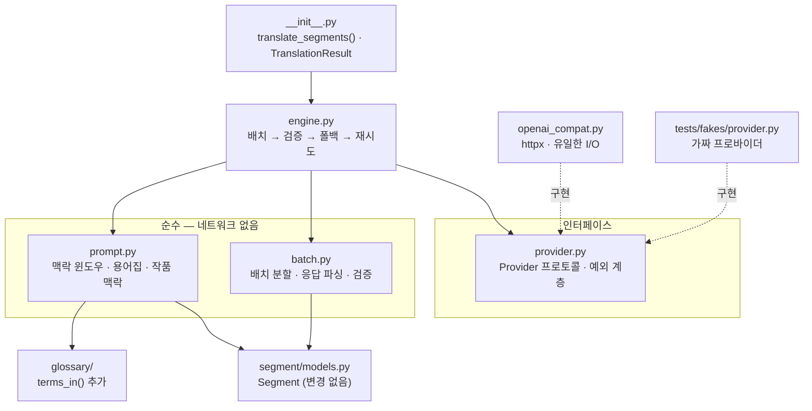
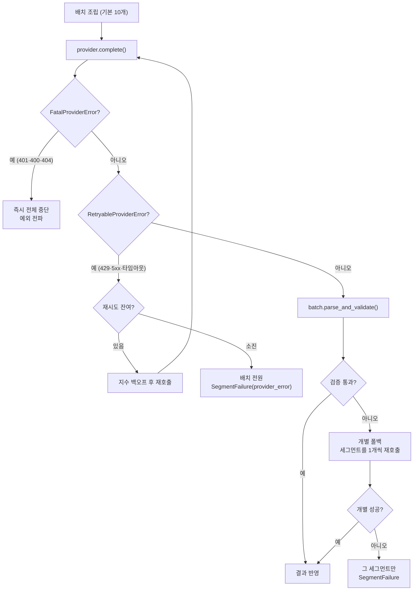

# 설계 — 번역 엔진 (WP7a)

> 작성일: 2026-08-16 (KST)
> 상태: **설계 확정** — 구현 계획 대기
> 대상: [요구사항정의서](../../요구사항정의서.md) FR-2.1~2.6 · FR-2.8 — [WBS](../../WBS.md) WP7 앞단
> 선행: [`check` 배선 설계](2026-08-03-check-cli-design.md) · [인제스트 설계](2026-07-31-ingest-design.md)
> 후속: **WP7b**(`store/` 캐시·재개 + `translate` CLI 배선) · **WP8**(Tier 1 신호)

## 1. 목적과 범위

세그먼트 리스트를 대상 언어로 번역하는 **라이브러리 계층**을 만든다.
CLI 배선도 영속화도 하지 않는다 — 이 설계가 끝나면 `translate_segments()`를
파이썬에서 호출할 수 있고, 그것으로 WP8(Tier 1 신호)이 착수 가능해진다.

[WBS](../../WBS.md)의 의존 그래프에서 **WP7은 현재 유일한 병목**이다.
`WP7 → WP8 → v0.1`과 `WP7 → WP6`가 동시에 걸려 있다.

### 1.1 범위

| 구분 | 내용 |
| --- | --- |
| **포함** | FR-2.1 복수 언어 · FR-2.2 컨텍스트 윈도우 · FR-2.3 용어집 주입 · FR-2.4 타임코드 보존 · FR-2.5 프로바이더 추상화 · FR-2.6 재시도와 부분 실패 · FR-2.8 작품 맥락 |
| **산출물** | `src/cuesift/translate/` 6개 모듈 · `tests/fakes/provider.py` · `tests/test_translate_*.py` · `Glossary.terms_in()` 추가 |
| **완료 판정** | §11 |
| **비범위** | FR-2.7 재개 · NFR-3 캐시 · `cuesift translate` CLI 본문 · `--dry-run` 비용 추정 · `cuesift.yaml` 로더 |

### 1.2 WP7을 둘로 나눈 이유

| | WP7a (이 문서) | WP7b |
| --- | --- | --- |
| 내용 | 프로바이더 어댑터 + 번역 엔진 | `store/` 캐시·재개 + CLI 배선 + `--dry-run` |
| FR | 2.1~2.6 · 2.8 | 2.7 · NFR-3 · NFR-4 · FR-8.1 |
| 끝나면 | **WP8 착수 가능** — Tier 1이 필요로 하는 건 CLI가 아니라 "세그먼트를 N회 재번역하는 함수"다 | 사람이 `cuesift translate`를 쓸 수 있다 |

되돌리기 단위를 작게 유지하는 것이 두 번째 이유다.
직전 세션이 **35커밋을 CI 없이 쌓았다가 마지막에 터진** 전례가 있다.

### 1.3 이 설계가 답하지 않는 것

| 항목 | 어디로 |
| --- | --- |
| 번역 결과를 어디에 저장하는가 | WP7b. 이 계층은 메모리에 담아 반환만 한다 |
| 같은 입력을 두 번 부르면 캐시가 먹는가 | WP7b(NFR-3). 이 계층은 **매번 호출한다** |
| 중단된 작업 재개 | WP7b(FR-2.7) |
| 자가일관성·역번역 | WP8(FR-4.1~4.3). 이 계층은 그것들이 호출할 함수를 제공할 뿐이다 |
| 어느 모델을 쓸 것인가 | 설정값이다. 이 설계는 모델을 고르지 않는다 |
| 번역 품질 평가 | 벤치마크 하네스(WP2)와 Recall@Budget 지표의 일이다 |

## 2. 모듈 구성



| 모듈 | 책임 (한 문장) | 의존 |
| --- | --- | --- |
| `provider.py` | LLM 호출의 계약과 실패 분류를 정의한다 | 없음 |
| `openai_compat.py` | OpenAI 호환 `/v1/chat/completions`를 친다 | `httpx` |
| `prompt.py` | 세그먼트와 맥락을 메시지로 조립한다 | `glossary`, `segment` |
| `batch.py` | 배치를 자르고 응답을 검증한다 | `segment` |
| `engine.py` | 흐름을 지휘한다 — 폴백과 재시도 | `Provider` 프로토콜만 |
| `__init__.py` | 공개 API 두 개를 노출한다 | 위 전부 |

`prompt.py`와 `batch.py`가 순수한 것이 이 설계의 핵심이다.
FR-2.2·2.3·2.4는 전부 **"무엇을 보냈나 / 받은 걸 어떻게 검증하나"** 이지 네트워크가 아니다.
[§7.2 모듈 경계 원칙](../../요구사항정의서.md)이 `spec`·`risk`를 순수로 유지한 것과 같은 이유고,
튜닝할 코드는 테스트가 값싸야 실제로 개선된다.

**가짜 프로바이더는 `tests/`에 둔다.** 배포물에 테스트 더블이 섞이지 않게 한다.
WP8도 같은 가짜를 쓰므로 `conftest.py` fixture로 노출한다.

## 3. 데이터 모델

### 3.1 FR-2.1의 해석 — "한 실행에 여러 언어"

FR-2.1 "복수 대상 언어로 동시 번역한다"는 두 가지로 읽힌다.

| 해석 | 뜻 | 귀결 |
| --- | --- | --- |
| 한 **호출**에 여러 언어 | 프롬프트에 "en과 ja로 번역해라" | 응답 스키마가 2차원이 되고, 한 언어 실패가 다른 언어를 죽인다 |
| 한 **실행**에 여러 언어 | `--to en,ja`가 en 파이프라인 1회 + ja 1회 | 언어별 실패 격리 |

**후자로 확정한다.** 근거는 추측이 아니라 기존 코드다.

- `Segment.target_text`가 단수 `str | None`이다
- `Glossary.violations(source_text, target_text)`가 한 언어 계약이다
- `spec.check`도 세그먼트 하나에 번역문 하나를 가정한다

전자를 택하면 이 세 모듈의 계약을 **동시에** 깨야 하는데, 얻는 것은 프롬프트 재사용뿐이다.

따라서 공개 함수는 대상 언어를 **하나만** 받는다. 복수 언어는 호출자(WP7b의 CLI)가 루프를 돈다.

### 3.2 반환 모델

```python
@dataclass(frozen=True, slots=True)
class SegmentFailure:
    segment_id: str
    reason: str          # "provider_error" | "invalid_response" | "empty_translation"
    attempts: int

@dataclass(frozen=True, slots=True)
class TokenUsage:        # NFR-2 비용 투명성
    prompt_tokens: int
    completion_tokens: int
    calls: int

@dataclass(frozen=True, slots=True)
class TranslationResult:
    target_lang: str
    segments: tuple[Segment, ...]         # target_text 채워진 새 객체 (실패분은 None)
    failures: tuple[SegmentFailure, ...]  # FR-2.6
    usage: TokenUsage
```

**원본 `Segment`를 변형하지 않고 새 객체를 반환한다.**
`Segment`는 `frozen`이 아니라 제자리 수정이 가능하지만, 그러면 en 파이프라인이 채운
`target_text`를 ja 파이프라인이 덮어써서 **두 언어를 동시에 들고 있을 수 없다.**

`failures`가 비었는지로 "완전 성공"을 판정한다. `segments` 안의 `None`을 세는 것과
같은 정보지만, 실패 **사유**는 `failures`에만 있다.

## 4. 프로바이더 계층

### 4.1 프로토콜

```python
class Provider(Protocol):
    name: str
    def complete(
        self,
        messages: Sequence[ChatMessage],
        *,
        temperature: float,
        max_tokens: int | None,
    ) -> Completion: ...
```

`Completion`은 `text: str`과 `usage: TokenUsage`를 갖는다.
표면을 최소로 두는 이유는 NFR-5(코드 수정 없이 프로바이더 추가)다 —
프로토콜이 좁을수록 새 프로바이더를 붙이기 쉽다.

### 4.2 예외 계층 — 재시도 가능성이 축이다

**이 계층에서 프로토콜보다 중요한 것이 예외 분류다.** FR-2.6의 재시도가 전부 여기 매달린다.

| 예외 | 무엇이 오나 | 재시도 |
| --- | --- | --- |
| `RetryableProviderError` | 429 · 5xx · 타임아웃 · 연결 끊김 | **한다** (지수 백오프) |
| `FatalProviderError` | 401 · 403 인증 · 400 스키마 오류 · 404 모델 없음 | **안 한다 — 즉시 전체 중단** |

FR-2.6은 "실패한 세그먼트를 재시도하고, 실패 시 해당 세그먼트만 표시 후 진행"이라고만
적혀 있다. 이걸 곧이곧대로 구현하면 **인증 실패도 "세그먼트 실패"로 취급되어
파일 전체가 실패 표시로 완주한다.** 사용자는 800건 실패 리포트를 받고 원인이
키 하나였다는 것을 모른다.

```text
구분이 없으면   API 키 오타 → 800큐 × 재시도 3회 = 2400회 실패 호출
구분이 있으면   API 키 오타 → 1회 실패 후 즉시 중단
```

이 저장소는 종료 코드에서 이미 같은 축을 그었다 — exit 2("명령줄이 틀림") vs
exit 66("파일 내용이 틀림"). **"호출자가 틀렸나, 데이터가 틀렸나"** 라는 같은 질문이다.

### 4.3 능력 비균일 (Q3) — 실측 없이 짜는 부분

[요구사항정의서 §12](../../요구사항정의서.md) Q3은 로컬 LLM을 OpenAI 호환 엔드포인트로
일원화하되 **"능력은 균일하지 않아 탐지·명시가 필요하다"** 고 못 박았다.

2026-08-16 재확인: Ollama의 `/v1/chat/completions`는 `logprobs`·`top_logprobs`·`n`을
**조용히 버린다**(네이티브 `/api/generate`는 logprobs를 계산하지만 호환 레이어가 드롭한다).
노출 요청 이슈가 아직 열려 있다.

**그러나 WP7a는 `logprobs`도 `n`도 쓰지 않는다.**

| 능력 | WP7a | 어디서 필요한가 |
| --- | --- | --- |
| `logprobs` | 안 씀 | WP8 신뢰도 추정 후보 |
| `n > 1` | 안 씀 | 자가일관성이 필요로 하지만 **N회 개별 호출로 이미 결정됨** — 이식성 때문 |
| `response_format` (JSON 모드) | **쓰고 싶지만 쓰지 않는다** | 아래 |

**JSON 모드를 쓰지 않는 이유**: 서버마다 지원이 다르고, 지원하지 않으면 조용히 무시되거나
400을 낸다. 대신 **프롬프트로 JSON을 요구하고 파싱 실패를 정상 경로로 취급**한다 —
그것이 §6.2의 개별 폴백이다. 지원 여부에 무관하게 동작하는 쪽을 택한다.

**이 절은 실측 없이 쓰였다.** 로컬 Ollama가 없어 미지원 서버의 실제 응답을 보지 못했다.
§12에 미검증으로 기록한다.

## 5. 프롬프트 조립

### 5.1 구조

배치 `[10..29]`를 번역할 때의 프롬프트다.

```text
system  자막 번역가. ko -> en. 세그먼트를 합치거나 나누지 마라. JSON으로 답하라.
        [작품 맥락] 장르 · 시대 · 톤              (FR-2.8, 지정됐을 때만)
        [용어집]   이 배치에 등장하는 용어만       (FR-2.3)

user    ## 앞 맥락 — 번역하지 말 것
        [7] ... [8] ... [9] ...                  (FR-2.2, 윈도우 기본 3)
        ## 번역 대상
        [10] ... ~ [29] ...
        ## 뒤 맥락 — 번역하지 말 것
        [30] ... [31] ... [32] ...
```

식별자는 **원본 전역 인덱스**를 쓴다. 배치 내 지역 번호(0~19)를 쓰면 맥락 세그먼트와
번호 공간이 갈라져 모델이 "[2]"가 맥락인지 대상인지 구별할 근거를 잃는다.

응답 계약:

```json
{"translations": [{"id": 10, "text": "..."}, {"id": 11, "text": "..."}]}
```

### 5.2 맥락은 원문만 준다

앞 맥락으로 **이미 번역된 결과**를 줄 수도 있다. 주지 않기로 한다.

| | 원문만 (채택) | 앞의 번역 결과 |
| --- | --- | --- |
| 문체·용어 일관성 | 용어집이 담당 | 프롬프트가 담당 |
| NFR-3 재현성 | **성립** — 입력이 순수하게 결정된다 | 깨진다 — 배치 하나가 재시도로 다른 답을 내면 뒤 전체가 달라진다 |
| 병렬 실행 | 가능 | 불가능 — 배치가 사슬로 묶인다 |
| 캐시 키(WP7b) | `(원문, 맥락 원문, 용어집, 모델, 설정)` | 앞의 모든 결과가 키에 들어간다 |
| 실패 전파 | 없음 | 한 배치 실패가 뒤의 맥락을 비운다 |

**결정적인 이유는 재현성이 아니라 역할 중복이다.** 용어 일관성은 FR-2.3 용어집이
존재하는 이유 그 자체다. 앞 번역을 참고시켜 일관성을 얻으려는 것은 용어집이 이미
푸는 문제를 토큰을 더 써서 **비결정적으로** 다시 푸는 것이다.

### 5.3 용어집 주입 — `Glossary.terms_in()`

전체 용어집을 매번 넣지 않는다. 용어집이 500개인데 배치에 3개만 나오면
나머지 497개는 매 호출 낭비다.

`glossary/__init__.py`에 공개 메서드를 하나 추가한다.

```python
def terms_in(self, source_text: str) -> list[GlossaryEntry]:
    """원문에 등장하는 용어들. 프롬프트 주입용(FR-2.3)."""
```

기존 `_contains_term`을 재사용하는 것이 요점이다. **판정 규칙이 갈리면
"프롬프트에 넣은 용어"와 "위반으로 잡는 용어"가 어긋나 신호가 자기모순을 낸다** —
프롬프트에 없던 용어를 안 썼다고 위반 처리하거나, 그 반대가 된다.

`_BOUNDARY` 룩어라운드가 CJK를 깨뜨리지 않도록 설계돼 있다는 사실도 그대로 상속된다
(`\b`는 CJK에서 동작하지 않아 폐기된 이력이 주석에 남아 있다).

### 5.4 작품 맥락 (FR-2.8)

우선순위 "권장"이며 **선택 인자**다. 지정되지 않으면 그 절을 통째로 넣지 않는다.
빈 절을 넣으면 모델이 빈 지시를 해석하려 든다.

자유 문자열로 받는다. 장르·시대·톤을 구조화된 필드로 쪼개는 것은 v0.1에 근거가 없다 —
어떤 필드가 실제로 번역을 바꾸는지 측정된 바 없고, [§11 R8](../../요구사항정의서.md)의
"출처 없는 수치를 기본값으로 넣지 않음"과 같은 종류의 문제다.

## 6. 실행 엔진

### 6.1 흐름



### 6.2 배치 → 개별 폴백

호출 단위로 세 안을 검토했다.

| | A. 개별 호출 | B. 배치만 | C. 배치 + 폴백 (채택) |
| --- | --- | --- | --- |
| 800큐 호출 수 | 800회 | ~80회 | ~80~90회 |
| FR-2.4 보장 | 구조적 | 검증 | 검증 + 실패 시 A로 강등 |
| 재시도 단위 | 세그먼트 | 배치 전체 | 세그먼트 |
| 실패 모드 | 느리다 | **한 세그먼트가 배치 전체를 죽인다** | 없음 |

음수 타임코드에서 "한 큐가 파일 전체를 죽이는 대가"를 감수한 것은
**대안이 전부 더 나빴기 때문이지 그것이 좋아서가 아니었다.**
여기서는 더 나은 대안이 있다 — 배치가 깨지면 그 배치만 개별로 강등하면 된다.
B의 실패 모드(성공한 9개를 버리고 10개를 다시 부름)는 비용을 아끼려다 비용을 쓰는 구조다.

대가는 **코드 경로가 둘이라 둘 다 테스트해야 한다**는 것이다. §9가 이를 다룬다.

### 6.3 재시도 정책

| 항목 | 값 | 이 값이 아니면 무엇이 깨지는가 |
| --- | --- | --- |
| 최대 재시도 | 3회 | 크면 429가 지속될 때 실패 확정이 한없이 미뤄진다. 작으면 일시적 5xx에 취약하다 |
| 백오프 | 지수 (1s · 2s · 4s) | 고정 간격은 429 상황에서 서버 압박을 유지한다 |
| `Retry-After` 헤더 | **존중한다** | 무시하면 서버가 지정한 대기를 어겨 차단으로 승격될 수 있다 |

**재시도 소진 후에는 개별 폴백을 하지 않는다.**
개별 폴백은 "모델이 지시를 못 따랐다"에 대한 처방이지 "서버가 죽었다"에 대한 처방이
아니다. 네트워크가 끊긴 상태에서 개별로 강등하면 실패 1회가 실패 10회로 늘어날 뿐이다.

**대기는 주입 가능한 `sleep`으로 둔다.** 테스트가 실제로 7초를 기다리면 스위트가
느려져 아무도 안 돌린다.

## 7. 검증과 FR-2.4의 한계

### 7.1 검증 규칙

| 검사 | 탐지 | 처리 |
| --- | --- | --- |
| JSON 파싱 실패 | ✅ | 배치 폐기 → 개별 폴백 |
| 대상 id 누락 · 개수 불일치 | ✅ | 배치 폐기 → 개별 폴백 |
| 응답에 없는 id가 섞임 | ✅ | 배치 폐기 → 개별 폴백 |
| 맥락 id가 응답에 포함 | ✅ | 배치 폐기 → 개별 폴백 (지시 불이행 신호다) |
| 빈 문자열 번역 | ✅ | 그 세그먼트만 `empty_translation` |
| **[10]의 내용이 [11]에 실림** | ❌ | **탐지 불가** |

### 7.2 마지막 행 — 경계 밀림은 `signals`가 잡는다

개수와 번호가 맞아도 모델이 내용을 옆 칸에 넣는 것은 이 계층에서 막을 수 없다.
그런데 이 프로젝트에는 이미 그것을 잡는 것이 있다 — **Tier 0의 길이비 신호**다.
경계가 밀리면 한쪽이 비정상적으로 길고 다른 쪽이 짧아져
`_RATIO_MIN_RELATIVE_DEVIATION`에 걸린다.

**즉 FR-2.4는 `translate` 혼자 지키는 요구사항이 아니라
`translate`(구조) + `signals`(탐지)가 나눠 지킨다.**

이것을 명시하지 않으면 나중에 누군가 "번역 계층이 경계를 보장한다"는
**거짓 전제** 위에 코드를 얹는다. 직전 세션이 정확히 그 종류의 사고를 두 번 냈다.

## 8. 수치와 근거

### 8.1 판정 수치와 구현 파라미터를 구분한다

[§11 R8](../../요구사항정의서.md)은 "출처 없는 수치를 기본값으로 넣지 않음"을 요구한다.
배치 크기에는 출처가 없다. 그러나 **성격이 다르다.**

| 종류 | 예 | 틀렸을 때 | 정당화 |
| --- | --- | --- | --- |
| **판정 수치** | CPS 상한 · 줄당 길이 · 가중치 | **결과가 거짓이 된다** | 출처 필수 (Netflix TTSG) |
| **구현 파라미터** | 배치 크기 · 타임아웃 · 재시도 횟수 | 비용·속도만 달라진다 | 출처가 아니라 **실패 모드**로 |

배치 크기가 틀려도 번역 결과는 같다 — §6.2의 폴백이 정확성을 지키기 때문이다.
**이 구분이 성립하는 것은 폴백이 있기 때문이며, 폴백이 없으면 배치 크기는
판정 수치가 된다.**

### 8.2 파라미터

주석 규약대로 "왜 이 값인가"가 아니라 **"이 값이 아니면 무엇이 깨지는가"** 를 적는다.

| 파라미터 | 기본 | 이 값이 아니면 |
| --- | --- | --- |
| 배치 크기 | **10** | 크면 약한 모델이 개수를 어겨 폴백이 잦아져 오히려 호출이 는다. 작으면 앞뒤 맥락이 매 호출 중복 전송돼 토큰이 낭비된다 |
| 맥락 윈도우 | **3** | [§8.2 `cuesift.yaml`](../../요구사항정의서.md) 예시값과 일치시킨다. 0이면 FR-2.2가 무효가 되고, 크면 배치당 토큰이 선형으로 는다 |
| temperature | **0.0** | 높으면 NFR-3 재현성이 무너진다. 자가일관성(WP8)은 **의도적으로** 올려 쓰므로 인자로 노출한다 |
| 타임아웃 | **60s** | 짧으면 긴 배치가 정상인데 끊긴다. 길면 죽은 서버에 오래 매달린다 |

배치 크기 기본을 10으로 잡은 것은 **폴백 비용의 비대칭** 때문이다 —
배치 20이 깨지면 20회 개별 호출이 되지만 배치 10이 깨지면 10회다.
실측으로 올릴 수 있는 값이지 실측 없이 크게 잡을 값이 아니다.

## 9. 테스트 전략

### 9.1 계층별

| 계층 | 수단 | 무엇을 검증 |
| --- | --- | --- |
| `prompt.py` · `batch.py` | 순수 단위 테스트 | 맥락 윈도우 경계(파일 처음·끝) · 용어집 필터 · 검증 규칙 전수 |
| `openai_compat.py` | **`httpx.MockTransport`** | 401→Fatal · 429→Retryable · 5xx→Retryable · 타임아웃 · `Retry-After` · 응답 스키마 파싱 |
| `engine.py` | 가짜 `Provider` | **폴백 발동** · 재시도 소진 · Fatal 즉시 중단 · 부분 실패 후 완주 |
| 전체 | 실 API (opt-in) | `@pytest.mark.live` — 기본 deselect |

**`httpx.MockTransport`가 이 전략의 핵심이다.** `httpx`가 이미 런타임 의존성이므로
**의존성을 하나도 추가하지 않고** HTTP 레이어를 통째로 검증할 수 있다.
의존성 고정(런타임 4개·dev 3개)은 이 저장소의 규율이다.

### 9.2 실 API는 opt-in

CI 3잡(`test 3.11`·`test 3.12`·`docs`)에는 API 키가 없다.
`pytest.ini` 마커로 등록하고 기본 `-m "not live"`로 제외한다.
**등록하지 않으면 `PytestUnknownMarkWarning`이 나고, 제외하지 않으면 CI 3잡이 전부 실패한다.**

### 9.3 폴백을 실제로 발동시키는 것

이 저장소 규율상 **게이트는 실패시켜 본 뒤에야 게이트다.**

| 수단 | 무엇을 발동시키나 | 상태 |
| --- | --- | --- |
| 가짜 프로바이더 (9개만 반환) | 개수 불일치 → 폴백 | 쉽다. 반드시 넣는다 |
| 가짜 프로바이더 (JSON 아닌 산문 반환) | 파싱 실패 → 폴백 | 쉽다. 반드시 넣는다 |
| **소형 로컬 모델 (3B급)** | **실물이 지시를 어기는 것** | 로컬 Ollama 설치 후 |

**상용 프론티어 모델로만 검증하면 폴백 경로가 한 번도 실행되지 않은 채 "통과"된다.**
"20개 주면 20개를 번호 붙여 JSON으로"를 거의 틀리지 않기 때문이다.
소형 모델은 성능이 좋을 필요가 없고 **오히려 나쁜 것이 목적이다.**

## 10. FR 대응표

| FR | 요구사항 | 어디서 충족되나 |
| --- | --- | --- |
| FR-2.1 | 복수 대상 언어 동시 번역 | §3.1 — 한 실행에 여러 언어. 호출자가 언어별로 돈다 |
| FR-2.2 | 앞뒤 컨텍스트 윈도우와 함께 번역 | §5.1 `prompt.py` · 윈도우 기본 3 |
| FR-2.3 | 용어집을 프롬프트에 주입 | §5.3 `Glossary.terms_in()` |
| FR-2.4 | 타임코드 보존 · 경계를 넘지 않음 | §7 — 구조(id 검증) + `signals` 길이비. **한계를 §7.2에 명시** |
| FR-2.5 | 복수 프로바이더 (OpenAI 호환 1차) | §4.1 `Provider` 프로토콜 + `openai_compat.py` |
| FR-2.6 | 재시도 · 실패 세그먼트만 표시 후 진행 | §4.2 예외 분류 + §6.3 재시도 + `SegmentFailure` |
| FR-2.7 | 재개 | **WP7b** |
| FR-2.8 | 작품 컨텍스트 주입 | §5.4 — 선택 인자 |

## 11. 완료 판정 (게이트)

`check` 배선 때와 같은 형식으로, **수치를 읽는다.**

| 게이트 | 판정 |
| --- | --- |
| `ruff check .` | `All checks passed!` |
| `ruff format --check .` | 파일 개수 확인 |
| `pytest --cov=cuesift` | **수집 개수 증가분을 기록한다.** `translate/` 커버리지 확인 |
| 폴백 발동 테스트 | 개수 불일치·파싱 실패 **각각** 폴백을 타는 것을 단언 |
| Fatal 즉시 중단 테스트 | 401에서 재시도 횟수가 **0**임을 단언 (호출 횟수로) |
| `scripts/check_links.py` | 마크다운·상대 링크 개수 확인 (**새 문서는 `git add` 후에야 검사된다**) |
| `markdownlint-cli2` | `Linting: N files` 개수를 링크 체커와 **대조** |
| CI | PR 생성 후 3잡 통과 — 로컬은 3.14, CI는 3.11/3.12 |

**0개 수집은 통과가 아니라 설정 오류다.**

## 12. 미검증 사항

| 항목 | 왜 미검증인가 |
| --- | --- |
| 능력 비균일 (§4.3) | 로컬 Ollama가 없어 미지원 서버의 실제 응답을 보지 못했다. 이슈 문서만 확인 |
| 실물 폴백 발동 (§9.3) | 소형 모델 설치 후에야 가능 |
| 배치 크기 10의 적정성 | 실측 없음. 폴백이 정확성을 지키므로 비용·속도 문제로 한정된다 |
| 프롬프트 문구의 번역 품질 영향 | 벤치마크(WP2)를 번역 경로에 연결해야 측정된다. WP8 이후 |

## 13. 결정 로그

| # | 결정 | 근거 |
| --- | --- | --- |
| T1 | WP7을 WP7a(엔진)/WP7b(영속화·CLI)로 나눈다 | WP8이 필요로 하는 것은 CLI가 아니라 라이브러리 함수다. 되돌리기 단위도 작아진다 |
| T2 | FR-2.1은 "한 실행에 여러 언어" | `Segment.target_text`·`Glossary`·`spec` 세 모듈이 이미 한 언어 계약이다 |
| T3 | 호출 단위는 배치 + 개별 폴백 | 배치만 쓰면 한 세그먼트가 배치 전체를 죽인다. 개별만 쓰면 맥락이 매번 중복 전송된다 |
| T4 | 예외를 Retryable/Fatal로 나눈다 | 나누지 않으면 API 키 오타가 800건 실패 리포트로 나온다 |
| T5 | 맥락은 원문만 준다 | 용어 일관성은 용어집의 역할이다. 앞 번역 의존은 재현성·병렬성·캐시 키를 동시에 깬다 |
| T6 | 재시도 소진 후 개별 폴백을 하지 않는다 | 폴백은 "모델이 지시를 어김"의 처방이지 "서버가 죽음"의 처방이 아니다 |
| T7 | JSON 모드(`response_format`)를 쓰지 않는다 | 서버마다 지원이 달라 조용히 무시되거나 400을 낸다. 파싱 실패를 정상 경로로 다루는 쪽이 이식성이 높다 |
| T8 | 배치 크기는 구현 파라미터다 | 폴백이 정확성을 지키므로 틀려도 결과가 같다. **폴백이 없으면 판정 수치가 된다** |
| T9 | 가짜 프로바이더는 `tests/`에 둔다 | 배포물에 테스트 더블을 넣지 않는다 |
| T10 | 실 API 테스트는 `@pytest.mark.live`로 분리 | CI에 키가 없다. 분리하지 않으면 3잡이 전부 실패한다 |
