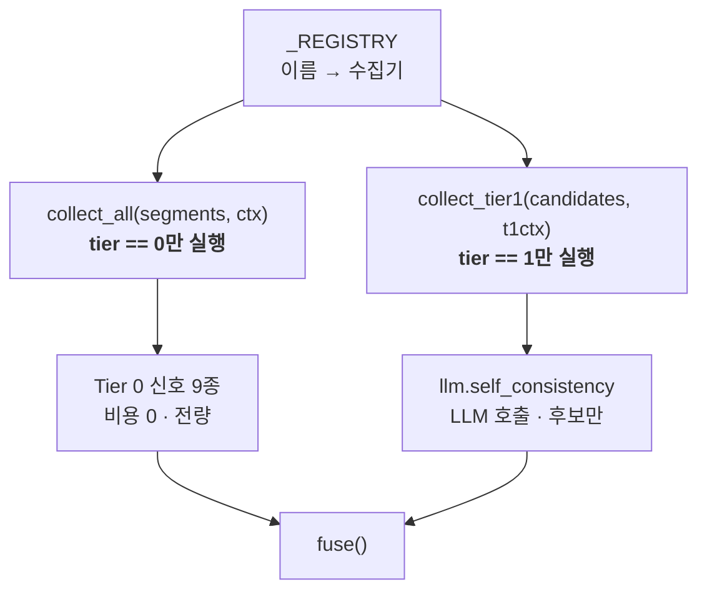
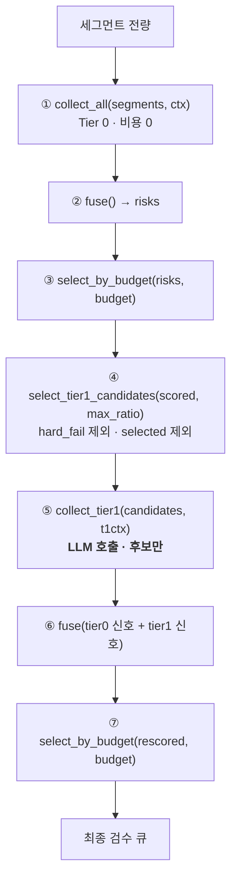

# 설계 — Tier 1 신호 라이브러리 계층 (WP8a)

> 작성일: 2026-08-17 (KST)
> 상태: **설계 확정** — 구현 계획 대기
> 대상: [요구사항정의서](../../요구사항정의서.md) FR-4.1 · FR-4.3 · FR-6.5 · NFR-3 · NFR-5 · NFR-7 — [WBS](../../WBS.md) WP8a
> 선행: [번역 엔진 설계](2026-08-16-translate-engine-design.md) · [번역 영속화·CLI 설계](2026-08-17-translate-cli-design.md)
> 후속: **WP8b**(CLI 배선 — `--tier1-max-ratio` 등) · **WP5 나머지**(FR-7.2~7.4)

## 1. 목적과 범위

**Tier 0가 원리상 못 보는 것을 보기 위한 계층을 세운다.** 벤치마크가 실측한
`negation` Recall 1.41%(무작위 10.28%)가 이 투자의 근거다(§3.1).

다만 이 설계는 **그 숫자를 움직이지 못한다.** 착수 시점의 실측(§3.2)이
"문자 단위 유사도로는 의미 반전과 정상 변이가 분리되지 않는다"를 보였고,
그래서 의미 반전을 겨냥한 신호는 이번에 만들지 않는다. WP8a가 내는 것은
**계층의 뼈대와, 작동이 확인된 신호 1종**이다.

### 1.1 범위

| 구분 | 내용 |
| --- | --- |
| **포함** | FR-4.1 자가일관성(`llm.self_consistency`) · FR-4.3 적용 상한 · Tier 1 실행 격리 · `CacheRequest.attempt` · 문자 단위 유사도 · 문서 정정 9건(§12 표 — 실행 중 3건 추가됐다) |
| **산출물** | `src/cuesift/signals/llm.py` 신규 · `src/cuesift/signals/similarity.py` 신규 · `src/cuesift/tier1.py` 신규 · `signals/base.py`·`triage/policy.py`·`store/cache.py`·`store/provider.py`·`risk/fuse.py` 수정 · `tests/test_similarity.py` · `tests/test_signals_llm.py` · `tests/test_tier1.py` |
| **완료 판정** | §11 |
| **비범위** | FR-4.2 역번역 · `llm.retranslation_gap`(§3.2에서 보류) · CLI 배선(WP8b) · 벤치마크에 Tier 1 태우기 · Tier 2 QE |

### 1.2 이 설계가 답하지 않는 것

| 항목 | 어디로 |
| --- | --- |
| Q4 — 편집거리로 충분한가 | **닫히지 않는다.** §3.2가 방향을 좁혔을 뿐 판정은 벤치마크의 일이다. §12 Q4를 갱신하되 열어 둔다 |
| Tier 1이 Recall@Budget을 올리는가 | **측정하지 않는다.** 벤치마크에 LLM 호출을 태우는 것은 별도 작업이다 |
| 어느 후보 선별 전략이 옳은가 | **논증으로만 정한다.** §5가 회색지대를 고른 근거를 적지만 실측은 없다 |
| 의미 반전을 어떻게 잡는가 | **미해결.** 임베딩 또는 LLM 직접 판정이 후보이며 Q4와 함께 남는다 |
| `--tier1-max-ratio` 같은 옵션 | **WP8b.** 이 설계는 라이브러리 계층까지다 |

### 1.3 왜 CLI를 배선하지 않는가

WP7이 7a(라이브러리)/7b(CLI)로 갈라진 것과 같은 이유다. WBS가 기록한 대로
**WP7a만으로 WP8의 선행이 풀렸다** — 계층을 먼저 세우고 배선을 뒤로 미루는
것이 이 저장소에서 이미 검증된 분할이다.

Tier 1은 라이브러리 상태로도 `-m live` 테스트가 가능하다(§10). 배선을 붙이면
`--tier1-max-ratio`·`--tier1-samples`·`--tier1-temperature` 세 옵션이 한꺼번에
들어오고, 파이프라인 구조 변경(§4)과 같은 PR에 섞여 revert 단위가 커진다.

## 2. 확정된 설계 결정

| # | 결정 | 근거 |
| --- | --- | --- |
| D1 | Tier 1 후보는 **컷라인 아래 회색지대**에서 고른다 | §5. `hard_fail`과 이미 선별된 것에 쓰는 예산은 순수 낭비다 |
| D2 | 신호는 **`llm.self_consistency` 하나**만 구현한다 | §3.2 실측. `llm.retranslation_gap`은 역방향으로 작동할 위험이 있다 |
| D3 | 변이는 **`temperature > 0` + N회 개별 호출**로 얻는다 | Q3 — Ollama가 `n`을 미지원한다. `seed`는 백엔드가 조용히 무시할 수 있어 쓰지 않는다 |
| D4 | 캐시는 **`CacheRequest.attempt`** 로 시도를 가른다. `attempt=0`은 키 문자열에서 생략한다 | §8. 기존 캐시가 바이트 단위로 유효해야 WP7b의 재개가 헛돌지 않는다 |
| D5 | 유사도는 **문자 단위**로 잰다 | ja에 공백이 없어 단어 분할이 위험하다. CJK를 깨뜨린 `\b` 전례가 있다 |
| D6 | `collect_all()`은 **tier 0만** 실행한다 | §4. Tier 1이 레지스트리에 등록되면 전량 LLM 호출이 일어난다 |
| D7 | 기본 `temperature`는 **1.0** | §6.2. OpenAI Chat Completions API 명세의 기본값이라 출처가 있다(§11 R8) |
| D8 | 벤치마크는 **이번에 돌리지 않는다** | 되돌리기 단위를 키우지 않는다. 따라서 Q4는 열린 채 남는다 |

## 3. 이 설계의 근거가 된 실측

### 3.1 Tier 0의 원리적 한계 (2026-09-04, TED2020)

근거: [`bench/results/en-ko-2026-09-04.md`](../../../bench/results/en-ko-2026-09-04.md) ·
[`bench/results/ja-ko-2026-09-04.md`](../../../bench/results/ja-ko-2026-09-04.md)

| 예산 | `negation` Recall (en-ko) | 무작위 기준선 | 비고 |
| --- | --- | --- | --- |
| 1% | 0.00% | 6.73% ±2.74% | 전혀 못 잡는다 |
| 10% | 1.41% | 10.28% ±3.37% | **무작위의 14%** |
| 20% | 8.45% | 20.82% ±4.42% | 무작위의 41% |
| 30% | 19.72% | 30.44% ±5.21% | 무작위의 65% |

같은 재측정에서 전체 Recall은 예산 10%에서 73.20%이므로 **의미 반전만
선택적으로 제자리**다. 융합식(noisy-or 전환)이나 개별 검출기를 고쳐도
소수점까지 동일했다 — 신호를 어떻게 조합하든 문법적으로 완벽한 문장의
의미가 뒤집혔는지는 판단할 수 없다는 뜻이다.

**2026-09-04에 정답지를 다시 만들었고 결론은 강해졌다.** 직전 표
(2026-07-29)는 예산 30%에서 29.58% 대 29.68%로 "무작위와 구분 불가"였는데,
그것은 옛 `negation` 주입기가 언어를 모른 채 일본어 문장에 영어 `not`을
끼워 넣어 **Tier 0 신호가 그 이물질을 우연히 잡고 있었기** 때문이다.
주입기를 제거 전용으로 고치자 격차가 드러났다. 예산 10%의 1.41%는
정답지가 바뀐 뒤에도 그대로다.

### 3.2 문자 단위 유사도의 판별력 (2026-08-17, 착수 시점 실측)

`difflib.SequenceMatcher(None, a, b, autojunk=False).ratio()`에 NFKC 정규화를
적용해 7쌍을 쟀다. 유사도 내림차순이다.

| 유사도 | 부류 | a | b |
| --- | --- | --- | --- |
| 0.930 | **negation** | `I cannot agree with you` | `I can agree with you` |
| 0.800 | **negation** | `それはできません` | `それはできます` |
| 0.800 | paraphrase | `彼は来なかった` | `彼は現れなかった` |
| 0.792 | **negation** | `He did not come to the party` | `He came to the party` |
| 0.759 | paraphrase | `He did not come to the party` | `He didn't show up at the party` |
| 0.727 | **negation** | `彼は来なかった` | `彼は来た` |
| 0.453 | unrelated | `He did not come to the party` | `The weather is nice today` |

**두 부류가 완전히 뒤섞여 있다.** `negation` 최고값(0.930)이 paraphrase
최고값(0.800)보다 위이고, ja에서는 0.800으로 동점이다. 어떤 임계값으로도
분리되지 않는다.

이것이 `llm.retranslation_gap`(기존 번역 ↔ 재번역 거리)을 보류한 이유다.
그 신호가 실제로 낼 점수를 계산하면 방향이 뒤집힌다.

| 세그먼트 | 기존 ↔ 재번역 | 유사도 | `score = 1 - sim` |
| --- | --- | --- | --- |
| `negation` 주입됨 (**잡아야 함**) | 부정어 하나 차이 | 0.79~0.93 | **0.07~0.21** |
| 정상 (**무시해야 함**) | 어휘 선택 차이 | 0.76~0.80 | **0.20~0.24** |

정상 세그먼트가 오류 세그먼트보다 높은 점수를 받는다. noisy-or에 넣으면
위험도를 잘못된 방향으로 밀어 올린다. **작동하지 않는 신호는 없는 것보다
나쁘다** — 위험도를 오염시켜 다른 신호의 판정까지 흐린다.

> **소표본이다.** 7쌍은 벤치마크가 아니다. 방향은 명확하지만 "편집거리는
> 쓸모없다"로 일반화하지 않는다 — `llm.self_consistency`는 형태 측정으로도
> 의미가 있다(§6.1). 이 표는 §12 Q4에 근거로 옮기고, 같은 데이터를
> `tests/test_similarity.py`에 회귀 테스트로 못 박는다(§10).

## 4. 모듈 구조

```text
src/cuesift/
  signals/
    base.py        [수정]  Tier1Collector 프로토콜 · collect_all은 tier 0만
    llm.py         [신규]  SelfConsistency
    similarity.py  [신규]  similarity(a, b) -> float
    structural.py          변경 없음
    derived.py             변경 없음
  triage/policy.py [수정]  select_tier1_candidates() 추가
  store/
    cache.py       [수정]  CacheRequest.attempt
    provider.py    [수정]  CachingProvider(attempt=...)
  risk/fuse.py     [수정]  DEFAULT_WEIGHTS에 llm.self_consistency 추가
  tier1.py         [신규]  2라운드 오케스트레이션
```

### 4.1 Tier 1이 레지스트리에서 격리되는 방식

**`collect_all()`이 Tier 1을 실행하면 전량 LLM 호출이 일어난다.** §4가
"16부작 × 20개 언어에서 3배는 감당 불가"라고 적은 바로 그 사고다. 레지스트리는
공유하되 실행 경로를 가른다.



타입으로도 막는다. Tier 0 수집기가 받는 `SignalContext`에는 프로바이더가 없고,
Tier 1 수집기는 `Tier1Context`를 받는다 — **Tier 0가 LLM에 닿을 수 없다는 것이
시그니처로 보장된다.**

| 프로토콜 | 컨텍스트 | 메서드 |
| --- | --- | --- |
| `SegmentCollector` (tier 0) | `SignalContext` | `collect(seg, ctx) -> Signal \| None` |
| `BatchCollector` (tier 0) | `SignalContext` | `collect_batch(segments, ctx) -> dict[str, Signal]` |
| `Tier1Collector` (**신규**) | `Tier1Context` | `collect_tier1(seg, ctx) -> Signal \| None` |

```python
@dataclass(frozen=True, slots=True)
class Tier1Context:
    """Tier 1 수집기가 LLM을 부르는 데 필요한 것.

    `SignalContext`를 상속하지 않고 **담는다** — 상속하면 Tier 0 수집기가
    `Tier1Context`를 받아도 타입 검사를 통과해, 이 분리가 노리는 격리가
    사라진다.

    **프로바이더를 직접 담지 않고 팩토리로 받는다.** 자가일관성은 시도마다
    다른 `attempt`로 캐시를 갈라야 하는데(§8), 그러려면 `CachingProvider`를
    시도별로 새로 감싸야 한다. 프로바이더를 그대로 담으면 수집기가
    `identity`·`cache_dir`을 알아야 하고 — `CachingProvider`는 `identity`가
    키워드 필수다 — 신호 수집기가 캐시 구조에 결합된다. 팩토리로 두면
    캐시를 켤지 말지는 오케스트레이션(`tier1.py`)의 결정으로 남는다.
    """

    signal: SignalContext
    provider_for: Callable[[int], Provider]  # attempt → 그 시도용 프로바이더
    samples: int
    temperature: float
```

**세그먼트 단위 프로토콜은 WP8b(CLI 배선)에서도 유지됐다.** 호출 10배(§6.3의 실측)를
알고도 바꾸지 않았고, 대신 **기본값과 게이트로 비용을 §4 한도 안에 가뒀다** -
곱 `--tier1-samples x --tier1-max-ratio`가 **한도 0.3에 닿거나 넘으면** 종료 코드 2로
거부된다(화면 문구와 같은 표현이다).
**배치화가 이뤄지면 그 상한 상수를 다시 계산해야 한다** - 배치에서는 산식에서
`DEFAULT_BATCH_SIZE`가 빠져 한도가 3.0이 된다([WP8b 설계](2026-08-25-tier1-cli-design.md)
§6.2). 상수의 단일 출처는 `cli.py`의 `_TIER1_COST_LIMIT`이고 그 주석이 같은 사실을 든다.

## 5. 후보 선별 — 왜 컷라인 아래인가

§4의 도식은 "Tier 0 → **의심 후보** → Tier 1"이라고 적혀 있다. 그러나 §3.1의
실측은 Tier 0가 `negation`을 큐에서 **밀어낸다**고 말한다. 두 서술이 충돌한다.

```text
Tier 0 위험도 순위
  높음 ┃ ███  hard fail 5종        → risk_score=1.0 고정 · Tier 1이 무의미
       ┃ ██   규격·용어집·길이비   → 이미 큐행 · Tier 1은 순수 낭비
       ┃ ══════════════ 예산 컷라인 ══════════════
       ┃ ▓▓▓  ← Tier 1 상한을 여기에 투입
       ┃ ▓▓▓     문법적으로 완벽한 문장이 여기 산다
  낮음 ┃ ░
```

**§4 도식이 벤치마크(7/29)보다 먼저 쓰였다(7/27).** 문서의 오류라기보다
시간차이며, §12 Q4에는 실측이 반영돼 있으나 §4 도식은 갱신되지 않았다.
§11의 문서 정정이 이 갈라짐을 닫는다.

```python
def select_tier1_candidates(
    risks: Sequence[SegmentRisk],
    max_ratio: float,
) -> list[str]:
    """Tier 1을 적용할 세그먼트 ID (FR-4.3).

    `select_by_budget`이 `selected`를 채운 **전체 목록**을 받는다.
    선별분만 받으면 "컷라인 아래"라는 개념 자체가 성립하지 않는다.

    hard fail을 제외하는 것은 낭비 방지가 아니라 **무의미**하기 때문이다 —
    `fuse()`가 risk_score를 1.0으로 고정하므로 신호를 더해도 순위가
    바뀌지 않는다.
    """
```

| 제외 대상 | 이유 | 누가 |
| --- | --- | --- |
| `hard_fail=True` | `risk_score=1.0` 고정. 신호를 더해도 순위 불변 | `select_tier1_candidates` |
| `selected=True` | 이미 검수 큐행. 예산을 여기 쓰면 그만큼 회색지대를 못 본다 | `select_tier1_candidates` |
| `target_text is None` | 번역 실패분. 재번역할 대상이 없다 | **`tier1.py`** |

**세 번째만 오케스트레이션이 거른다.** `SegmentRisk`는 `segment_id`만 갖고
텍스트를 갖지 않으므로 `select_tier1_candidates(risks, max_ratio)`가 판정할 수
없다. 위험도 계산에 세그먼트 본문을 끌어들이면 `triage/`가 `segment/`에
결합되고, `policy.py`가 지켜 온 "순수 함수 · 입력 불변" 계약이 흐려진다.

남은 것에서 위험도 내림차순 상위 `floor(len(risks) * max_ratio)`개를 고르되,
**회색지대가 그보다 작으면 있는 만큼만 고른다**(상한이지 할당량이 아니다).

**왜 올림이 아니라 내림인가:** 올림하면 상한이 상한을 넘는다(3×0.7 → 실제 100%).
내림하면 n < 1/max_ratio일 때 cap이 0이 되어 Tier 1이 통째로 꺼진다(0.25 비율은 n<4).
이것은 **명시되면 설계이고, 조용하면 사고다** — 구현 주석에 비용을 기록해 다음 사람이
설계를 읽을 수 있게 한다.

**분모가 후보 집합이 아니라 전체다** — FR-4.3이 "전체 세그먼트 중 Tier 1을
적용할 최대 비율"이라고 적혀 있고, 후보 집합을 분모로 삼으면 회색지대가 좁은
트랙에서 상한이 사실상 사라진다. 동점은 `_sorted_desc`와 같은 규칙(세그먼트 ID)
으로 깨뜨린다 — 여기서 순서가 흔들리면 NFR-3(재현성)이 깨지고, 같은 입력에
같은 LLM 호출이 나가지 않는다.

## 6. 신호 정의 — `llm.self_consistency`

### 6.1 무엇을 재는가

**"이 번역이 틀렸나"가 아니라 "이 구간이 번역하기 어려운가"다.** 같은 원문을
N회 재번역해 결과가 흩어지면 모델이 흔들린 것이고, 그 구간은 사람이 볼 값어치가
있다. 형태 측정으로도 의미가 있는 이유가 이것이다 — 재번역들이 형태적으로
흩어졌다면 실제로 모델이 흔들린 것이지, 우리가 형태를 의미로 착각한 것이
아니다.

```text
후보 세그먼트 하나
   ↓  같은 프롬프트로 N회 재번역 (attempt=0,1,2)
재번역 3개
   ↓  쌍별 유사도 3개: (0,1) (0,2) (1,2)
score = 1.0 - mean(pairwise_similarity)
   ↓
Signal(name="llm.self_consistency", tier=1, score=..., hard_fail=False)
```

`detail`에는 재번역 원문과 쌍별 유사도를 담는다 — FR-6.4가 요구하는
"왜 선별되었는지"의 근거이며, `review.json`(FR-7.2)이 이것을 그대로 쓴다.

### 6.2 경계 조건

이 저장소의 관례대로 **"이 값이 아니면 무엇이 깨지는가"** 를 주석에 적는다.

| 조건 | 깨지는 것 | 대응 |
| --- | --- | --- |
| `temperature == 0.0` | 재번역이 전부 동일 → score가 **항상 0.0** → 신호가 조용히 죽는다 | 생성 시점 `ValueError` |
| `samples < 2` | 쌍이 만들어지지 않는다 | 생성 시점 `ValueError` |
| 재번역 성공분 < 2 | 위와 같음 | **`None` 반환** — score 0.0이 아니다 |
| `hard_fail` 세그먼트 | 순위가 안 바뀐다 | §5에서 후보 제외 |

`temperature=0.0`을 `ValueError`로 막는 것이 과해 보이지만, 없으면 **신호가
죽었는데 "안전"으로 보고된다.** Q3가 금지한 무음 열화와 같은 실패 모드다.

**기본 `temperature`는 1.0이다.** 0.8 같은 값은 우리가 고른 것이라 §11 R8
("출처 없는 수치를 기본값으로 넣지 않음")에 걸린다. 1.0은 OpenAI Chat
Completions API 명세의 기본값이므로 출처가 있다.

### 6.3 재번역의 맥락

`translate_segments()`를 그대로 재사용하지만, 재사용되는 것은
**재시도·실패 분류뿐이다.** §4.1이 확정한 `collect_tier1(seg, ctx)`
프로토콜은 세그먼트 하나씩 넘기므로 배치는 항상 크기 1이고, 컨텍스트
윈도우 절도 프롬프트에 실리지 않는다 — 그 절은 `iter_batches`가 여러
세그먼트를 함께 볼 때만 만든다.

> **문서 정정(§12)**: 이 절이 원래 "배치·컨텍스트 윈도우·재시도가 이미
> 구현돼 있다"고 적었던 것은 §4.1의 세그먼트 단위 프로토콜과 모순이다.
> Task 5 구현·리뷰에서 실측(세그먼트 10개·samples=3): 세그먼트 단위
> **호출 10배**(30회 vs 묶었다면 3회) — §4.1의 결정을 유지하고 이 절만
> 사실에 맞춰 정정한다. **문자 수는 이 절에 적지 않는다** — 틀려서가
> 아니라(값 자체는 정확했다) **입력(원문 길이 L)을 명시해야 재현되기**
> 때문이다. 문자 수는 `9840 + 30L`(세그먼트 단위)·`1119 + 30L`(배치)의
> 선형함수이고, L을 적지 않은 채 값만 옮겨 적으면 다른 예문으로 낸 값이
> "재현 실패"처럼 보인다(이 세션에서 실제로 그렇게 세 라운드를 썼다 —
> 아무도 틀리지 않았고 아무도 L을 적지 않았을 뿐이었다, 최종 리뷰).
> 정확한 값과 L 조건은 `src/cuesift/signals/llm.py`의 `_retranslate`
> 독스트링이 단일 출처다.

**후보만 넘기므로 앞뒤 맥락이 원본과 다르다.** 애초에 컨텍스트 윈도우가
실리지 않으므로 이 문제 자체가 발생하지 않는다 — 다만 §4.1의 세그먼트
단위 프로토콜을 배치로 넓히는 날에는 다시 고려해야 한다: 후보는 트랙
전체에 흩어져 있는데 `iter_batches`는 넘긴 목록의 앞뒤로 윈도우를
만들기 때문이다. 그럼에도 측정이 유효한 것은 **N회가 모두 같은 조건을
받기 때문**이다 — 분산은 맥락의 절대적 정확성이 아니라 같은 입력에
대한 출력의 흔들림을 잰다.

원본 맥락을 살리려면 트랙 전량을 N회 재번역해야 하고, 그것이 정확히 §4가
"감당 불가"라고 적은 비용이다.

## 7. 실행 흐름 — 2라운드



**noisy-or가 이 구조를 성립시킨다.** `1 - ∏(1 - sᵢ)^wᵢ`는 신호가 붙을수록
점수가 올라가기만 하므로, 회색지대에만 Tier 1을 적용해도 적용받은 쪽이 부당하게
낮아지지 않는다. 가중 평균이었다면 낮은 Tier 1 점수가 기존 위험도를 **희석해**
오히려 큐에서 밀어냈을 것이다 — 7/29의 융합식 전환이 여기서 값을 한다.

③을 돌리고 ⑦에서 다시 도는 것은 낭비가 아니다. `select_by_budget`은 순수
함수이고 `_copy`가 가변 필드까지 복사하므로 입력이 오염되지 않으며, ④가
"이미 큐에 든 것"을 알려면 ③의 결과가 필요하다.

## 8. 캐시 — 하위 호환이 공짜로 나온다

`CacheRequest.key`에 **`temperature`가 이미 들어 있다.**

```python
material = _SEP.join((identity, repr(float(temperature)), max_tokens, messages_sha))
```

| 경로 | temperature | 결과 |
| --- | --- | --- |
| 기존 번역 (WP7b) | `0.0` | 키 불변 → **캐시가 안 깨진다** |
| Tier 1 재번역 | `1.0` | 온도가 달라 키가 자동 분리 |

남은 문제는 Tier 1 내부에서 N회 호출의 키가 서로 같다는 것뿐이다. `attempt`를
더하되 **0일 때는 키 문자열에 넣지 않는다.**

```python
@dataclass(frozen=True, slots=True)
class CacheRequest:
    identity: str
    temperature: float
    max_tokens: int | None
    messages: tuple[ChatMessage, ...]
    attempt: int = 0        # 자가일관성의 시도 번호 (FR-4.1)

    @property
    def key(self) -> str:
        parts = [
            self.identity,
            repr(float(self.temperature)),
            "none" if self.max_tokens is None else str(self.max_tokens),
            self.messages_sha,
        ]
        # **0이면 생략한다.** 넣으면 기존에 쌓인 캐시가 전량 미스가 되어
        # WP7b가 실물로 증명한 재개(2회차 실제 호출 0개)가 한 번 헛돈다.
        if self.attempt:
            parts.append(f"attempt={self.attempt}")
        material = _SEP.join(parts)
```

`CachingProvider`가 `attempt`를 감싸는 시점에 고정한다 — N회 호출은 attempt가
다른 N개의 `CachingProvider`로 처리되고, **`translate_segments()`는 손대지
않는다.**

이 감싸기를 만드는 것은 `tier1.py`이며, 그 결과가 §4.1의 `provider_for`다.

```python
# tier1.py — 캐시를 켤지 말지가 여기서 끝난다
def _provider_for(attempt: int) -> Provider:
    if cache_dir is None or identity is None:
        return inner                     # 캐시 없이 그대로
    return CachingProvider(inner, identity=identity, cache_dir=cache_dir, attempt=attempt)
```

`attempt`에 기본값 0을 주므로 기존 호출부는 전부 그대로 통과한다.

## 9. 유사도

```python
def similarity(a: str, b: str) -> float:
    """문자 단위 유사도 0.0~1.0 (FR-4.1).

    **단어로 나누지 않는 이유는 ja에 공백이 없기 때문이다.** 단어 경계(`\\b`)
    분할이 CJK를 전부 깨뜨린 전례가 이 저장소에 있다.

    NFKC로 정규화하는 이유는 전각/반각이 같은 문자로 취급돼야 하기 때문이다 —
    `struct.number_missing`의 전각 숫자 미탐과 같은 부류의 결함이다.

    **이 함수는 의미가 아니라 형태를 잰다.** 의미 반전과 정상 변이를 분리하지
    못한다(설계 §3.2 실측 7쌍). Q4가 열려 있는 이유이며, 교체할 때는 이 함수
    하나만 갈아 끼우면 된다.
    """
```

`difflib.SequenceMatcher(None, a, b, autojunk=False)`의 `ratio()`를 쓴다.
`autojunk=False`가 필요한 것은 기본 휴리스틱이 200자 이상 입력에서 빈출 요소를
junk로 취급해 결과를 왜곡하기 때문이다 — 자막 한 줄은 짧지만 `detail`에 담기는
문자열이 길어질 수 있다.

**엄밀히는 편집거리(Levenshtein)가 아니라 Ratcliff-Obershelp다.** 직접 구현하지
않는 이유는 표준 라이브러리에 검증된 것이 있는데 20줄을 새로 쓰면 버그 위험만
늘기 때문이다. 이름을 "편집거리"가 아니라 `similarity`로 두는 것도 같은 이유다.

## 10. 테스트 전략

### 10.1 최우선 게이트 — `collect_all()`이 Tier 1을 안 돌린다

```text
Tier 1 수집기를 레지스트리에 등록
       ↓
collect_all(segments, ctx) 실행
       ↓
가짜 프로바이더의 호출 횟수 == 0 이어야 한다
       ↓
게이트를 실패시켜 본다 — tier 필터를 빼고 죽는 것을 확인한 뒤 되돌린다
```

**게이트를 만들면 반드시 실패시켜 봐야 한다.** 이 저장소가 여러 번 발동시킨
규율이며, 실제로 길이비 회귀 테스트가 버그 버전에서도 통과해 데이터를 다시 짠
전례가 있다.

### 10.2 나머지

| 대상 | 방식 |
| --- | --- |
| `similarity()` | **§3.2의 7쌍을 그대로 테스트 데이터로.** 회귀 방지이자 Q4 근거의 코드화 |
| `select_tier1_candidates()` | 순수 함수. hard fail 제외 · `selected` 제외 · `max_ratio` 준수 · 분모가 전체인지 |
| `SelfConsistency` | 가짜 프로바이더(NFR-7). 네트워크 없이 |
| `temperature=0` 방어 | 게이트가 실제로 발동하는지 |
| 재번역 성공분 < 2 | `None`이 나오는지 — score 0.0이 **아님**을 확인 |
| `CacheRequest` | **`attempt=0`일 때 키가 기존과 바이트 단위로 동일** — 하위 호환 회귀 |
| `tier1.py` 오케스트레이션 | 후보에만 호출됐는지를 **호출 횟수로** 계측 |
| live | Ollama `qwen2.5:3b` 실호출 1건 (`-m live`) |

## 11. 완료 판정

| # | 조건 | 확인 방법 |
| --- | --- | --- |
| A1 | Tier 0 경로에서 LLM 호출이 0이다 | §10.1 게이트 · 변이 삽입 후 죽는 것 확인 |
| A2 | 기존 캐시가 유효하다 | `attempt=0` 키가 기존과 동일한 회귀 테스트 |
| A3 | `temperature=0`이 조용히 통과하지 않는다 | `ValueError` 테스트 |
| A4 | 실제 엔드포인트로 신호가 나온다 | `-m live` 1건, `llm.self_consistency`가 발화하는지 확인(`-s`로 score를 출력한다). **score의 크기(0.0 포함)는 단정하지 않는다** — `temperature=1.0`이 변이를 보장하지 않아 재번역 3개가 우연히 같으면 score가 정확히 0.0이 되고, 그것도 "판정했고 일관됨"이라는 유효한 결과다(Task 7 B2, 판정 P15) |
| A5 | 기존 테스트가 전부 통과한다 | `pytest --cov=cuesift` — **수집 개수를 읽는다** |
| A6 | 문서 정정 **9건**(§12 표 — 착수 시점 6건에서 Task 4·5·6이 각 1건씩 추가했다)이 반영됐다 | §12 표 |
| A7 | 게이트 6종 통과 | `ruff check .` · `ruff format --check .` · `pytest` · `check_links.py` · `markdownlint-cli2` · 3.11 문법 |

**"통과했나"가 아니라 "무엇을 대상으로 통과했나"를 읽는다.** `pytest`의 수집
개수, markdownlint의 `Linting: N files`, 링크 체커의 상대 링크 개수를 매번
기록한다. 0개 수집은 통과가 아니라 설정 오류다.

## 12. 문서 정정 — 이 작업에 포함된다

| 문서 | 무엇을 |
| --- | --- |
| 요구사항정의서 §4 | 도식은 "Tier 0 → 의심 후보". 실제는 **컷라인 아래 회색지대** — 각주로 차이와 §3.1 근거를 명시 |
| 요구사항정의서 §12 Q4 | **§3.2 실측 7쌍 추가.** "편집거리는 negation과 paraphrase를 분리하지 못한다". **Q4는 계속 열림** |
| 요구사항정의서 §5.4 | FR-4.2 미구현 · FR-4.1은 자가일관성만 구현됨을 상태로 표시 |
| WBS | WP8 → 8a/8b 분할. **"Q4가 여기서 닫힌다" 문구 정정** |
| 이 설계 §5 | 후보 선별에서 `ceil` → `floor`로 정정. 올림 vs 내림의 상충을 명시 |
| `HANDOFF.md` | 브랜치 정보가 사실과 다르다 — `feat/translate-cli`는 `48f9133`으로 이미 머지됐다 |
| `CHANGELOG.md` | WP8a 항목 |
| 이 설계 §6.3 | "배치·컨텍스트 윈도우를 재사용한다"가 §4.1의 세그먼트 단위 프로토콜과 모순 — 재사용되는 것은 재시도·실패 분류뿐임을 실측(호출 10배: 30회 vs 3회)과 함께 정정 (Task 5 리뷰, Ruling P11). **문자 수(옛 수치 10320자/1599자)는 이 절에서 뺐다** — 값 자체는 틀리지 않았다(`9840+30L` 세그먼트 단위·`1119+30L` 배치, L=16에서 정확히 일치, 최종 리뷰가 L=3·L=15로도 확인) — **L(원문 길이)을 밝히지 않은 채 값만 옮겨 적으면 다른 예문의 값이 "재현 실패"로 보인다.** 조건과 함께 둔 단일 출처는 `signals/llm.py`의 `_retranslate` 독스트링이다 (Task 6 재리뷰 → 최종 브랜치 리뷰가 진단을 정정, Task 7 Item ⑧) |
| 이 설계 §7 | 도식 ④·⑦이 둘 다 `risks`(예산 적용 전)를 인자로 그렸다 — §7 산문(329-331행)은 이미 `scored`/재융합 결과를 전제해 서로 모순이었다. 도식을 따라간 사람이 "③에서 만든 `scored`를 ④·⑦에 넘긴다"는 산문 규칙 대신 예산 미적용 `risks`를 다시 넘기는 회귀(M1)를 재도입할 수 있었다 — `tier1.py` 구현은 처음부터 산문 쪽(④는 `scored`, ⑦은 재융합한 `rescored`)이 맞았다. 도식을 코드에 맞춰 정정 (Task 6 2라운드 리뷰, C7) |

**§12 Q4 항목이 제일 중요하다.** 다음 사람이 "WP8이 끝났으니 Q4도 닫혔겠지"로
읽으면 닫히지 않은 미결정 위에 v0.1을 올리게 된다.

## 13. 남는 것

| 항목 | 상태 |
| --- | --- |
| Q4 — 유사도 측정 수단 | **열림.** §3.2가 방향을 좁혔으나 판정은 벤치마크의 일이다 |
| `llm.retranslation_gap` | **보류.** §3.2에서 역방향 작동 위험이 확인됐다. 임베딩이 들어오면 다시 겁는다 |
| FR-4.2 역번역 | **미구현.** 권장 등급이며 `retranslation_gap`과 같은 문제를 공유한다 |
| Tier 1의 Recall@Budget 기여 | **미측정.** 벤치마크에 LLM 호출을 태우는 별도 작업이 필요하다 |
| 후보 선별 전략의 우열 | **미측정.** §5는 논증이며 실측이 아니다 |
| `_dry_run_report`의 손으로 맞춘 기본값 | **승계.** WP7b가 남긴 것으로, 엔진 기본값이 바뀌면 dry-run이 어긋난다 |
