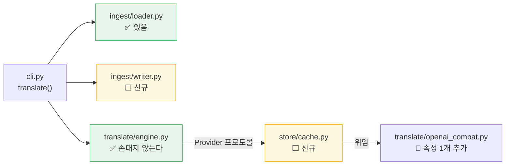
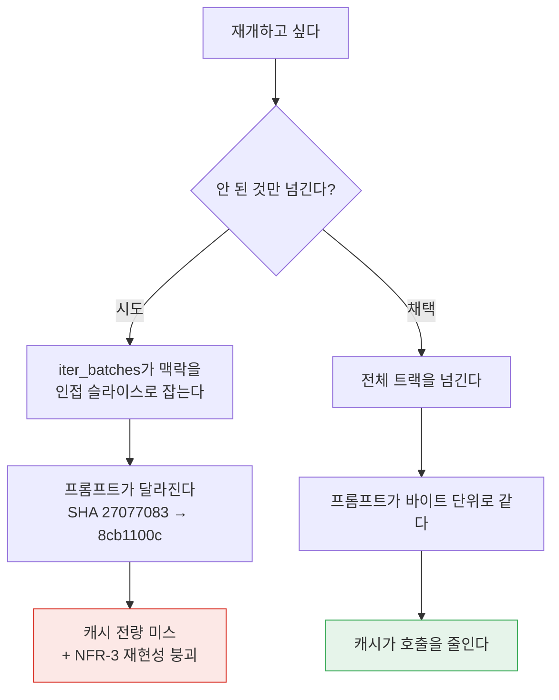
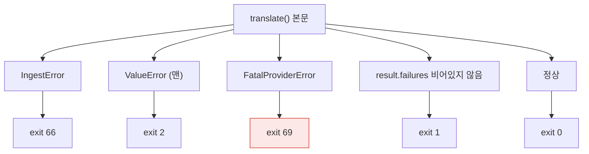

# 설계 — 번역 영속화·CLI (WP7b)

> 작성일: 2026-08-17 (KST)
> 상태: **설계 확정** — 구현 계획 대기
> 대상: [요구사항정의서](../../요구사항정의서.md) FR-2.7 · FR-7.1 · FR-8.1 · NFR-2(일부) · NFR-3 · NFR-4 — [WBS](../../WBS.md) WP7b
> 선행: [번역 엔진 설계](2026-08-16-translate-engine-design.md) · [`check` 배선 설계](2026-08-03-check-cli-design.md) · [인제스트 설계](2026-07-31-ingest-design.md)
> 후속: **WP8**(Tier 1 신호) · **WP5 나머지**(FR-7.2~7.4 `review.json`·`report.html`·요약 통계)

## 1. 목적과 범위

WP7a가 만든 `translate_segments()`를 **사람이 명령줄에서 쓸 수 있게** 한다.
중단된 작업을 재개할 수 있어야 하고(FR-2.7), 같은 입력을 두 번 돌려도 LLM을
두 번 부르지 않아야 하며(NFR-3), 번역 결과가 자막 파일로 나와야 한다(FR-7.1).

**"쓸 수 있는 제품"을 하나 더 내는 것이 이 작업의 목적이다.** `check`가
규격 검사만으로 완결된 도구가 됐듯, `translate`는 번역 파이프라인만으로
완결된 도구가 된다. 트리아지와 리포트는 WP5가 붙인다.

### 1.1 범위

| 구분 | 내용 |
| --- | --- |
| **포함** | FR-2.7 재개 · NFR-3 캐시 · NFR-4 재개 가능성 · FR-8.1 `cuesift translate` 배선 · FR-7.1 자막 파일 출력 · `--dry-run`(NFR-2 일부) |
| **산출물** | `src/cuesift/store/` 신규 · `src/cuesift/ingest/writer.py` 신규 · `cli.py`의 `translate()` 본문 · `OpenAICompatibleProvider.cache_identity` 추가 · `tests/test_store_*.py` · `tests/test_ingest_writer.py` · `tests/test_cli_translate.py` |
| **완료 판정** | §11 |
| **비범위** | FR-7.2 `review.json` · FR-7.3 `report.html` · FR-7.4 요약 통계 · 트리아지 배선(`--review-budget` 실동작) · FR-8.4 `cuesift.yaml` 로더 · FR-8.3 `transcribe` |

### 1.2 이 설계가 답하지 않는 것

| 항목 | 어디로 |
| --- | --- |
| 검수 큐를 어떻게 고르는가 | **WP5.** 이 설계는 트리아지를 배선하지 않는다 — 이유는 §1.3 |
| 토큰이 정확히 몇 개인가 | **불가.** 의존성이 고정돼 토크나이저가 없다. §7이 대신 무엇을 내는지 정한다 |
| 여러 파일을 한 번에 번역 | **비범위.** 입력은 파일 하나다. 디렉터리 순회는 셸의 일이다 |
| 병렬 번역 | **비범위.** 배치가 독립이라 가능하지만(설계 §5.2 T5), 재현성·레이트리밋·진행 표시가 동시에 얽힌다. FR-8.5(진행 표시)와 함께 다룰 일이다 |
| 캐시 만료·용량 상한 | **비범위.** 삭제는 `rm -rf .cuesift/cache`다. 만료 정책은 캐시가 실제로 커진 뒤에 정한다 |

### 1.3 왜 트리아지를 배선하지 않는가

**배선하면 이번 작업 안에서 Recall@Budget 붕괴를 풀어야 한다.**

WP7a가 `TranslationResult` 독스트링에 실측으로 못 박아 둔 것이다 —
번역 실패분은 `segments`에 `target_text=None`으로 들어 있고, 그것을 그대로
`collect_all`에 넘기면 `struct.empty`가 `hard_fail=True`로 판정한다.
hard fail은 검수 예산을 우회하므로(FR-6.2) quota를 소진한다.

| 번역 실패 | 실제 검수 비율 | Recall@10% |
| --- | --- | --- |
| 0건 | 10.0% | 100% |
| 10건 | 10.0% | 50% |
| 20건 | 10.0% | **0%** |
| 30건 | **15.0%** | 0% |

**이 표는 가설이 아니라 실측이고, 2026-08-17 세션이 실물로 재현했다** —
`qwen2.5:1.5b`·15세그먼트에서 실패 10건(67%)이 관측됐다.

트리아지를 이번에 배선하면 "실패분을 어떻게 격리할 것인가"가 WP7b의 문제가
된다. 그것은 WP5가 `review.json` 스키마를 정할 때 함께 정해야 하는 것이라
(실패분을 별도 배열로 낼 것인가, 신호로 낼 것인가), 여기서 먼저 정하면
스키마를 다시 깨게 된다. `check` 설계 D4가 `--json`을 미룬 것과 같은 판단이다.

**`--review-budget`은 옵션을 남기되 경고한다.** 조용한 무시는 이 저장소가
1급으로 금지한 것이다 — `--config`가 이미 같은 방식으로 처리된다(`cli.py`).

## 2. 구조

### 2.1 모듈 배치



요구사항정의서 §7.1이 `store/`를 **"캐시 · 재개 상태"** 로 이미 그려 뒀다.
새 모듈을 발명하는 것이 아니라 예약된 자리를 채운다.

### 2.2 `translate/`를 한 줄도 고치지 않는다

**이 설계의 핵심 성질이다.** `CachingProvider`가 `Provider` 프로토콜을
구현하므로 엔진 입장에서는 그냥 또 하나의 프로바이더다.

| 무엇이 그대로 유효한가 | 왜 중요한가 |
| --- | --- |
| 재시도·백오프 (`_call_with_retry`) | 캐시 미스일 때만 도는 것이 정확히 원하는 동작이다 |
| 배치 → 개별 폴백 | **개별 호출도 각각 캐시된다.** 재개 시 폴백 결과까지 재사용된다 |
| Retryable/Fatal 예외 분류 | 래퍼가 예외를 삼키지 않고 그대로 전파하면 계약이 유지된다 |
| 858개 테스트 | 하나도 고칠 필요가 없다 |

WP7a가 `Provider` 표면을 최소로 유지한 것(`name` + `complete` 둘뿐)이
여기서 배당을 낸다. 표면이 넓었다면 래퍼가 그만큼 많은 것을 위임해야 했다.

### 2.3 `ingest/writer.py`에 쓰기를 두는 이유

요구사항정의서 §7.2가 **`ingest`를 "pysubs2를 아는 유일한 곳"** 으로 못 박았고,
`report`는 "의존 없음(순수)"이다. 자막 쓰기는 pysubs2가 필요하므로 `report`에
둘 수 없다.

`output/`을 새로 만들면 pysubs2를 아는 곳이 둘로 늘고 §7.1 도식과 §7.2 표를
모두 고쳐야 한다. `ingest/writer.py`는 **§7.2의 `ingest` 책임 한 문장만**
고치면 된다.

읽기와 쓰기가 같은 파일 옆에 있는 것의 실질 이득도 있다 — 라운드트립이
깨지면 한 디렉터리 안에서 드러난다. WP4는 이미 이것을 예견해
`IngestResult.subs` 독스트링에 **"WP5(FR-7.1) 라운드트립 전용"** 이라고
적어 뒀다.

**요구사항정의서 변경**: §7.2의 `ingest` 행을
"영상/자막을 세그먼트 리스트로 만들고, 번역된 세그먼트를 다시 자막으로 쓴다"로
고친다. 이 문서는 요구사항정의서의 파생물이므로 **요구사항정의서를 먼저 고친다.**

## 3. 캐시 (NFR-3)

### 3.1 키

```text
sha256( identity ␟ temperature ␟ max_tokens ␟ role:content ␟ role:content ... )
                                              └──── messages 전량 ────┘

identity = "openai-compatible|http://127.0.0.1:11434/v1|qwen2.5:3b"
```

**`messages`를 재조립하지 않고 그대로 넣는 것이 요점이다.** 메시지 안에
원문·앞뒤 맥락·용어집·작품 맥락이 이미 직렬화돼 있으므로,
[번역 엔진 설계](2026-08-16-translate-engine-design.md) §5.2가 요구한
`(원문, 맥락 원문, 용어집, 모델, 설정)`이 전부 덮인다.

재조립하면 프롬프트 조립 규칙이 바뀔 때 키가 따라가지 못한다 — 실제로
2026-08-17에 시스템 프롬프트를 고쳤고(정수 id 계약), 그때 키를 손으로
관리했다면 **바뀐 프롬프트가 옛 캐시에 히트했을 것이다.**

### 3.2 `identity`를 어떻게 얻는가

`Provider` 프로토콜은 `name`만 공개하는데 그것은 **클래스 상수**다
(`openai_compat.py`의 `name = "openai-compatible"`). 모델명이 아니다.

**`name`만으로 키를 만들면 `qwen2.5:3b`로 채운 캐시가 `gpt-4o` 실행에서
히트한다.** 캐시가 조용히 다른 모델의 응답을 돌려주고 NFR-3이 정면으로
깨진다 — 이 저장소가 1급으로 금지한 "검사하지 않고 통과하는 게이트"다.

| 결정 | 내용 |
| --- | --- |
| `CachingProvider.__init__` | `identity`를 **키워드 필수 인자**로 받는다. 빈 문자열·공백은 `ValueError` |
| `OpenAICompatibleProvider` | `cache_identity` 속성을 **추가**한다 — `f"{name}\|{base_url}\|{model}"` |
| `Provider` 프로토콜 | **고치지 않는다.** 표면을 최소로 두는 것이 NFR-5를 돕는다는 §4.1의 결정을 유지한다 |

프로토콜에 넣지 않는 이유는 두 가지다. 첫째, `Protocol`은 런타임 검사가
없어 서드파티 구현이 빠뜨려도 조용히 통과한다 — 그러면 강제한 것이 아니다.
둘째, 필수 키워드 인자로 두면 **빠뜨릴 때 `TypeError`로 즉시 죽는다.**
검사되는 계약이 검사되지 않는 선언보다 낫다.

### 3.3 저장 형식

`.cuesift/cache/<sha256>.json` — 키 해시가 파일명이다.

| 필드 | 왜 필요한가 |
| --- | --- |
| `text` · `usage` | 복원할 `Completion` |
| `identity` · `temperature` · `max_tokens` | **읽을 때 현재 값과 대조한다.** 다르면 미스로 취급 |
| `messages_sha` | 같은 목적. 해시 충돌·파일 손상·수동 편집을 히트로 읽지 않는다 |
| `created_at` | 사람이 캐시를 판단할 재료 (ISO 8601, UTC) |

**키를 파일명에 넣고 재료를 파일 안에 또 쓰는 이유**가 이 저장소의 규율
그 자체다. 파일명만 믿으면 손상된 캐시가 조용히 번역문으로 둔갑한다.
대조가 어긋나면 예외가 아니라 **미스**로 떨어뜨린다 — 캐시는 최적화이지
정확성의 근거가 아니므로, 못 믿을 때는 다시 부르면 된다.

읽기 실패(JSON 파싱 오류·인코딩 오류·`OSError`)도 전부 미스다.
같은 이유이며, 여기서 예외를 던지면 손상된 파일 하나가 실행 전체를 죽인다.

### 3.4 쓰기의 원자성

```text
  <sha256>.json.<pid>.tmp  에 쓰고  →  os.replace()  →  <sha256>.json
```

`os.replace`는 Windows에서도 원자적이다. 중간에 죽어도 반쪽짜리 JSON이
남지 않는다. 임시 파일명에 pid를 넣는 것은 같은 키를 두 프로세스가 동시에
쓸 때 서로의 임시 파일을 덮지 않게 하기 위해서다.

같은 키에 대한 경쟁은 **마지막 쓰기가 이긴다.** 온도 0.0에서는 내용이
같으므로 무해하고, 온도를 올린 경우에도 캐시의 목적상 어느 하나면 된다.
락을 걸지 않는 이유는 락 파일이 죽은 프로세스에 의해 남는 문제를
새로 들여오기 때문이다.

**쓰기 실패는 삼킨다.** 캐시 디렉터리가 읽기 전용이거나 디스크가 찼을 때
번역 자체가 실패할 이유가 없다. 다만 **조용히 삼키지는 않는다** — 첫 실패
한 번만 stderr에 경고를 내고 이후는 억제한다(수백 번 반복하면 진짜 출력이
묻힌다).

### 3.5 무엇을 캐시하고 무엇을 안 하나

| 경우 | 캐시 | 근거 |
| --- | --- | --- |
| HTTP 200 응답 | **한다** | 형식을 어긴 응답이어도 한다 — NFR-3은 "같은 입력에 같은 결과"이지 "같은 입력에 더 나은 결과"가 아니다 |
| `RetryableProviderError` | 안 한다 | 캐시하면 일시적 장애(429·타임아웃)가 영구 재생된다 |
| `FatalProviderError` | 안 한다 | 키를 고치고 재실행하면 즉시 통해야 한다 |

### 3.6 그래서 생기는 것 — 캐시가 함정이 되는 지점

**모델이 형식을 어긴 응답도 캐시되므로, 같은 명령을 다시 쳐도 결과는
절대 나아지지 않는다.**

| 무엇을 바꾸면 | 캐시가 |
| --- | --- |
| 아무것도 안 바꾸고 재실행 | **전량 히트** — 실패도 그대로 재생된다 |
| 모델·`base_url` 변경 | 전량 미스 (identity가 키에 있다) |
| `--context-window` 변경 | 전량 미스 (프롬프트가 바뀐다) |
| 자막 파일 수정 | 바뀐 배치만 미스 |
| `--no-cache` · 캐시 디렉터리 삭제 | 전량 미스 |

이것은 버그가 아니라 NFR-3 재현성의 정의다. **그러나 사용자에게는
함정으로 보인다** — "다시 돌렸는데 똑같이 실패한다". 따라서 `--help`와
README에 명시하고, 실행 요약이 캐시 히트 수를 **항상** 보고한다.
히트 수를 보면 "네트워크를 안 탔다"는 사실이 드러난다.

## 4. 재개 (FR-2.7 · NFR-4)

### 4.1 재개는 재실행이다

```text
1회차: cuesift translate ep01.ko.srt --to en --out dist
  배치[0-9]    HTTP  →  캐시 저장
  배치[10-19]  HTTP  →  캐시 저장
  배치[20-29]  Ctrl-C 중단

2회차: 똑같은 명령을 다시 친다
  배치[0-9]    HIT   (호출 0)
  배치[10-19]  HIT   (호출 0)
  배치[20-29]  HTTP
```

**`--resume` 플래그를 두지 않는다.** 캐시가 있으면 재개고 없으면 처음부터인데,
사용자가 그것을 선언할 이유가 없다. 플래그를 두면 "`--resume`을 안 붙였는데
왜 캐시가 먹었나"라는 모순된 상태가 생긴다.

### 4.2 왜 실행 원장(`run.json`)을 두지 않는가

**연속 구간 제약 때문에 원장이 있어도 쓸 데가 없다.**

`iter_batches`는 `segments`가 트랙의 **연속 구간**임을 전제한다 — 맥락
윈도우를 인접 슬라이스로 잡으므로 비연속 부분집합을 넘기면 맥락이 조용히
틀린다. 실측으로 같은 세그먼트의 유저 프롬프트 SHA가 전체 실행과 부분 실행에서
달랐다(`27077083` vs `8cb1100c`).

따라서 재개해도 **전체 트랙을 넘겨야** 프롬프트가 바이트 단위로 같고,
그러면 호출을 줄이는 것은 결국 캐시다. 원장은 상태 저장소를 하나 더
늘릴 뿐 호출을 줄이지 못한다.



### 4.3 재개의 관찰 가능성

캐시가 곧 재개이므로 사용자는 "재개 중"임을 직접 알 수 없다.
그래서 **실행 요약이 캐시 히트/미스를 항상 낸다** — 그 숫자가 재개의
증거다. `--dry-run`도 같은 정보를 실행 전에 낸다(§7).

## 5. 자막 출력 (FR-7.1)

### 5.1 파일명 규칙

```text
ep01.ko.srt  --to en,ja  --out dist   →  dist/ep01.en.srt
                                          dist/ep01.ja.srt

ep01.srt     --to en                  →  ./ep01.en.srt
```

stem이 `.{source_lang}`으로 끝나면 **치환**하고, 아니면 **덧붙인다.**
확장자는 입력과 같다(FR-7.1 "입력과 동일 포맷 기본").

| 상황 | 처리 |
| --- | --- |
| `--out` 미지정 | 입력 파일과 같은 디렉터리 |
| `--out` 디렉터리 없음 | 만든다 (부모까지) |
| 출력 파일 존재 | **덮어쓴다** — 재실행이 곧 재개이므로 `--force`를 요구하면 재개가 불편해진다 |
| 출력 경로가 입력과 같아짐 | **거부한다.** exit 2. `--source-lang en --to en`이 그 경우다 |

마지막 행이 없으면 원본 자막이 번역문으로 덮여 **되돌릴 수 없다.**
덮어쓰기를 기본으로 삼은 대가를 여기서 치른다.

### 5.2 라운드트립

**원본 `SSAFile`의 이벤트 텍스트만 갈아끼운다.** 새 `SSAFile`을 조립하지 않는다.

```text
IngestResult
  ├─ subs         : pysubs2.SSAFile      원본 그대로
  ├─ event_index  : {segment_id: 원본 이벤트 인덱스}
  └─ segments     : [Segment]            target_text가 채워져 돌아온다

writer:  subs.events[event_index[seg.id]].text = 이스케이프(seg.target_text)
         subs.save(out_path, format_=result.format)
```

`event_index`가 있는 이유가 이것이다 — 인제스트가 **표시되지 않는 이벤트를
걸러냈으므로**(`_keep_displayed`) `segments`의 순번과 `subs.events`의 순번이
일치하지 않는다. 위치로 짝지으면 주석 이벤트가 하나만 있어도 전부 밀린다.

배치 태그(`{\an8}`)·VTT cue settings·타임코드는 원본 이벤트에 그대로 남는다.

### 5.3 실패 세그먼트

| 상황 | 자막 파일 | 요약 | 종료 코드 |
| --- | --- | --- | --- |
| 번역 성공 | 번역문 | — | 0 |
| **번역 실패** (`target_text is None`) | **원문 유지** | 세그먼트 ID 나열 + 출력 경로 | **1** |

**원문을 남기는 것의 위험을 설계에 명시한다.** 원문이 남은 자막은 겉보기에
정상인 파일이라, 경고를 놓치면 미번역 자막이 그대로 배포된다.
그래서 요약이 개수만 말하지 않고 **세그먼트 ID와 출력 경로를 함께** 낸다.

빈 문자열로 두는 대안은 더 나쁘다 — 자막이 사라져 화면에 아무것도 안 나오고,
그것은 "번역이 안 됐다"보다 발견하기 어렵다.

## 6. CLI 표면 (FR-8.1)

### 6.1 옵션

```text
cuesift translate <입력> --to en,ja [--out DIR]
                                    [--source-lang ko]
                                    [--base-url URL]  [--model NAME]
                                    [--glossary PATH] [--work-context TEXT]
                                    [--context-window 3]
                                    [--cache-dir DIR] [--no-cache]
                                    [--dry-run]
```

| 옵션 | 근거 | 없으면 |
| --- | --- | --- |
| `--glossary` | FR-2.3 (**必**) | `Glossary.terms_in()`이 라이브러리에만 있고 CLI에서 도달 불가능해진다 |
| `--work-context` | FR-2.8 (권장) | 같은 이유 |
| `--context-window` | §8.2 `cuesift.yaml`이 노출한 유일한 llm 설정 · **캐시 키에 들어간다** | 바꿀 수 없다 |
| `--cache-dir` · `--no-cache` | §3.6의 함정에서 빠져나올 유일한 수단 | 캐시가 함정으로 남는다 |

**FR-5.3에서 한 번 물린 함정을 되풀이하지 않는다** — 라이브러리로는 완료였으나
CLI에서 도달할 수 없어 必 요구사항이 실제로는 닫히지 않았던 사례다(WBS WP1 행).
`--glossary`가 없으면 FR-2.3이 정확히 같은 상태가 된다.

### 6.2 노출하지 않는 것

| 항목 | 왜 |
| --- | --- |
| `batch_size` | [번역 엔진 설계](2026-08-16-translate-engine-design.md) T8 — 폴백이 정확성을 지키므로 구현 파라미터다 |
| `temperature` | v0.1은 0.0 고정이 NFR-3 재현성의 전제다 |
| `max_retries` | 기본값으로 충분하고, 캐시 키에 들어가 무심코 바꾸면 캐시가 통째로 무효화된다 |

셋 다 캐시 키에 들어간다. 노출하면 사용자가 값을 만질 때마다 캐시가
전량 미스가 되는데, 그 인과가 화면에 드러나지 않는다.

### 6.3 설정 우선순위

```text
CLI 옵션  >  환경변수  >  (후일 cuesift.yaml)  >  기본값
```

| 값 | CLI | 환경변수 |
| --- | --- | --- |
| base_url | `--base-url` | `CUESIFT_BASE_URL` |
| model | `--model` | `CUESIFT_MODEL` |
| api_key | **없음** | `CUESIFT_API_KEY` |

**`api_key`는 명령줄로 받지 않는다.** 셸 히스토리와 `ps` 출력에 남는다.

**`CUESIFT_LIVE_*`를 쓰지 않는 것이 중요하다.** 그 접두사는 테스트 전용으로
예약돼 있고, `tests/test_translate_api.py`의 게이트가 "`CUESIFT_LIVE` 문자열을
가진 파일"을 찾아 live 마커 누락을 판정한다. CLI가 같은 이름을 쓰면 그
게이트의 판정 근거가 흐려진다.

base_url·model 중 하나라도 없으면 **exit 2**로 죽는다 — 기본값을 넣지 않는다.
`localhost:11434`를 기본값으로 넣으면 Ollama가 없는 사람이 연결 실패를
받는데, 그것은 "설정을 안 했다"보다 진단이 어렵다.

### 6.4 여러 대상 언어

`--to en,ja,th`는 **언어당 한 번씩 `translate_segments`를 돈다.** 순차다.
[번역 엔진 설계](2026-08-16-translate-engine-design.md) T2가 FR-2.1을
"한 실행에 여러 언어"로 읽었고, `Segment.target_text`가 단수이므로
언어마다 `IngestResult`를 다시 읽어 세그먼트를 새로 만든다.

| 상황 | 처리 |
| --- | --- |
| 한 언어가 부분 실패 | **계속 진행한다.** 나머지 언어를 돌고 마지막에 종합 보고 |
| 한 언어가 `FatalProviderError` | **즉시 중단한다.** 인증·모델 오류는 다음 언어에서도 같다 |
| 종료 코드 | **가장 나쁜 것 하나.** 69 > 66 > 2 > 1 > 0 |

부분 실패에서 계속 도는 이유는 FR-2.6의 정신 그대로다 — 실패한 것 때문에
성공할 수 있는 것을 포기하지 않는다. 반대로 Fatal에서 멈추는 이유는
T4와 같다 — 401을 언어 수만큼 반복하면 진짜 원인이 실패 더미 아래 묻힌다.

**언어별 결과를 요약 표로 낸다.** 하나로 뭉뚱그리면 "th만 전부 실패했다"가
"3개 언어에서 812건 중 270건 실패"로 보인다.

### 6.5 옵션 조합

| 조합 | 동작 |
| --- | --- |
| `--dry-run` + `--no-cache` | 캐시 히트를 **0으로 보고한다.** 실행 시와 같은 수를 내야 추정이 의미 있다 |
| `--dry-run` + `--out` | 파일을 만들지 않는다. 출력 **예정 경로만** 보고한다 |
| `--no-cache` | 읽지도 쓰지도 않는다. `--cache-dir`을 함께 주면 exit 2 |

### 6.6 종료 코드

`check`가 세운 계약("명령줄이 틀림"과 "파일 내용이 틀림"을 가른다)을 잇는다.

| 코드 | 언제 | 상수 |
| --- | --- | --- |
| **0** | 전량 번역 성공 | — |
| **1** | **부분 실패** — 일부 세그먼트가 원문 그대로 남았다 | — |
| **2** | 명령줄 오류 · `--base-url` 오타 · `--model` 미지정 · 출력이 입력을 덮음 | typer / 맨 `ValueError` |
| **66** | 입력 자막·용어집 파일 문제 | `EXIT_BAD_INPUT` |
| **69** | **`FatalProviderError`** — 401 인증 · 404 모델 없음 · 400 스키마 | `EXIT_UNAVAILABLE` **신규** |
| **70** | 미구현(`transcribe`) · 내부 오류 | `EXIT_NOT_IMPLEMENTED` |

**69를 새로 만드는 이유**는 70에 두 의미를 겹치면 CI가 "아직 안 만든 기능"과
"LLM 서버가 거부"에 같은 대응을 하기 때문이다. `sysexits.h`의
`EX_UNAVAILABLE`(69)이 정확히 이 자리다.

`cli.py`의 "70은 남은 두 골격 커맨드의 표식" 주석도 함께 정정한다 —
`translate`가 구현되면 그 문장이 거짓이 된다.

## 7. `--dry-run` (NFR-2 일부)

**실측할 수 있는 것만 낸다. 토큰과 비용은 추정하지 않는다.**

```text
$ cuesift translate ep01.ko.srt --to en --dry-run

입력   ep01.ko.srt (srt) · 812 세그먼트
모델   qwen2.5:3b @ http://127.0.0.1:11434/v1
배치   82개 (size=10, context_window=3)

  캐시 히트    64개   호출 불필요
  호출 필요    18개

프롬프트 문자  system 1,204 + user 31,880
출력 예정      ./ep01.en.srt

(토큰·비용은 추정하지 않는다 — 계수 출처가 없다)
```

| 무엇을 | 어떻게 |
| --- | --- |
| 배치 수 · 문자 수 | `build_messages`를 실제로 불러 **정확히** 센다. 추정이 아니다 |
| 캐시 히트/미스 | 캐시 키를 계산해 **파일 존재를 확인한다.** 내용은 읽지 않는다 |
| 토큰 | **내지 않는다** |
| 비용 | **내지 않는다** |

토큰을 추정하지 않는 이유는 요구사항정의서 §11 R8이 "출처 없는 수치를
기본값으로 넣지 않음"을 명시하기 때문이다. 문자→토큰 계수는 모델마다
다르고 우리에게 출처가 없다. **틀린 수치는 수치가 없는 것보다 나쁘다** —
사용자가 그것을 근거로 예산을 잡는다.

**실사용에서 가장 쓸모있는 정보는 "몇 번 더 불러야 하나"이고 그것은
정확히 나온다.** 이것이 NFR-2가 `--dry-run`에서 실제로 원한 것이다.

`--dry-run`은 네트워크를 타지 않는다. 그래야 "실행 전 추정"이라는 전제가
성립한다.

## 8. 오류가 종료 코드로 번역되는 자리

**`FatalProviderError`는 `translate_segments` 밖으로 전파된다.**
`engine.py`의 `except` 절을 전수 조사한 결과다 — `_run_window`와 `_run_single`은
`RetryableProviderError`만 잡고, Fatal은 형제라 걸리지 않는다.

이것은 [번역 엔진 설계](2026-08-16-translate-engine-design.md) T4의 의도다
("나누지 않으면 API 키 오타가 800건 실패 리포트로 나온다"). 대신 **CLI가
반드시 잡아야 한다.**



**안 잡으면 미처리 traceback이 되어 exit 1이 되고, 이 저장소에서 1은
"부분 실패"라 인증 오류가 자막 결함으로 오보된다.** `check`가 12종 넘게
닫아야 했던 누수와 정확히 같은 형태다.

`_TolerantOutput`과 `_harden_output_streams`는 그룹 콜백·진입점에 있어
`translate`가 그대로 물려받는다 — 닫힌 파이프와 cp949 인코딩 사고는
이미 막혀 있다.

## 9. 테스트 전략

### 9.1 네트워크 없는 검증

| 대상 | 수단 |
| --- | --- |
| `store/cache.py` | `tmp_path` + 가짜 inner provider (**호출 횟수를 센다**) |
| `ingest/writer.py` | 기존 픽스처 12종 라운드트립 — 읽고 → 갈아끼우고 → 쓰고 → 다시 읽어 대조 |
| `cli.py translate()` | `CliRunner` + 프로바이더 팩토리 monkeypatch |
| 종료 코드 5종 | 각 예외를 주입해 코드가 **실제로 갈리는지** |

프로바이더 팩토리를 모듈 수준 함수(`_build_provider`)로 두는 이유가
테스트 주입이다. 본문에서 `OpenAICompatibleProvider(...)`를 직접 만들면
CLI 테스트가 네트워크를 타거나 `httpx` 내부를 패치해야 한다.

### 9.2 재개 게이트 — 이 작업의 핵심

**"캐시가 있다"가 아니라 "2회차 호출 수가 1회차보다 정확히 N만큼 적다"를
단언한다.** 숫자를 세지 않으면 캐시를 한 번도 안 읽고도 통과한다.

| 시나리오 | 단언 |
| --- | --- |
| 전량 재실행 | 2회차 `provider.calls == 0` |
| K번째 배치에서 중단 후 재개 | 2회차 호출 수 == 남은 배치 수 |
| 모델을 바꾼 뒤 재실행 | 2회차 호출 수 == 1회차 (전량 미스) |
| `--no-cache` | 2회차 호출 수 == 1회차 |
| 손상된 캐시 파일 | 예외가 아니라 **미스**로 떨어진다 |

**그리고 이 저장소의 규율대로, 캐시를 무력화한 변이 사본에서 실제로 죽는
것을 확인한 뒤에야 게이트로 인정한다.** 게이트를 만들면 반드시 실패시켜
봐야 한다 — WP7a에서 새 경계 테스트 8건이 RED 단계에서 통과해 버린 사례가
정확히 이것이었다.

### 9.3 live

기존 `-m live` 마커에 CLI 경로 1건을 추가한다 — `CliRunner`가 아니라
**실제 프로세스**로 돌려 종료 코드를 확인한다. `typer.Exit`이 실제
프로세스 종료 코드가 되는지는 `CliRunner`가 완전히 증명하지 못한다.

## 10. FR 대응표

| FR | 요구사항 | 어디서 충족되나 |
| --- | --- | --- |
| FR-2.7 | 중단된 작업 재개 | §4 — 캐시가 재개다 |
| FR-7.1 | 번역된 자막을 언어별로 출력 | §5 — `ingest/writer.py` 라운드트립 |
| FR-8.1 | `cuesift translate <입력> --to <언어들>` | §6 |
| NFR-2 | 비용 투명성 · `--dry-run` | §7 — **부분 충족.** 호출 수는 정확, 토큰·비용은 내지 않는다 |
| NFR-3 | 재현성 · LLM 응답 캐시 | §3 |
| NFR-4 | 재개 가능성 | §4 |
| FR-2.3 | 용어집 주입 | §6.1 `--glossary` — **이번에 CLI에서 도달 가능해진다** |
| FR-2.8 | 작품 맥락 주입 | §6.1 `--work-context` — 같음 |

**FR-2.3·FR-2.8은 WP7a에서 이미 "완료"로 셌다.** 여기서 다시 적는 것은
개수를 늘리기 위해서가 아니라, CLI 옵션이 빠지면 그 완료가 도달 불가능한
완료가 되기 때문이다. 완료 개수는 WP7a에서 센 그대로다.

## 11. 완료 판정 (게이트)

**수치를 읽는다. "통과했나"가 아니라 "무엇을 대상으로 통과했나"를 본다.**

| 게이트 | 판정 |
| --- | --- |
| `ruff check .` | `All checks passed!` |
| `ruff format --check .` | 파일 개수 (착수 시 73) |
| `pytest --cov=cuesift` | **수집 개수 증가분을 기록한다.** 착수 시 868 passed, 1 deselected |
| `store/` 커버리지 | 100% |
| 재개 게이트 | §9.2의 5개 시나리오가 **호출 횟수를 단언**하고, 변이 사본에서 죽는 것을 확인 |
| 라운드트립 | 픽스처 12종 전부 — 배치 태그·cue settings가 살아남는지 |
| 종료 코드 | 0·1·2·66·69·70 여섯 가지가 **실제로 갈리는지** |
| `scripts/check_links.py` | 마크다운·상대 링크 개수 (**새 문서는 `git add` 후에야 검사된다**) |
| `markdownlint-cli2` | `Linting: N files` 개수를 링크 체커와 **대조** |
| CI | PR 3잡 통과 — 로컬 3.14, CI 3.11/3.12 |
| live | `-m live` 통과 (Ollama `qwen2.5:3b`) |

**0개 수집은 통과가 아니라 설정 오류다.**

## 12. 미검증 사항

| 항목 | 왜 미검증인가 |
| --- | --- |
| 대용량 자막에서의 캐시 디렉터리 크기 | 812 세그먼트 = 82개 파일. 시리즈 전체를 돌린 실측이 없다 |
| 동시 실행 경쟁 | `os.replace`의 원자성은 문서상 보장이고, 실제 경쟁을 재현한 테스트는 넣지 않는다 |
| 캐시 히트 시의 실제 속도 이득 | 네트워크 왕복이 사라지므로 자명하지만 수치는 없다 |
| VTT cue settings 라운드트립 | 픽스처에 포함되는지 확인이 필요하다. 없으면 **픽스처를 먼저 만든다** |
| Windows 경로에서의 `--out` 동작 | 개발 환경이 Windows이므로 자연히 밟히지만 CI는 ubuntu다 |

## 13. 결정 로그

| # | 결정 | 근거 |
| --- | --- | --- |
| U1 | **범위를 자막 출력(FR-7.1)까지로 한다** | 사람이 결과물을 손에 쥐어야 "쓸 수 있는 제품"이다. `check` 때와 같은 판단 |
| U2 | **트리아지를 배선하지 않는다** | 실패분 격리 방식이 `review.json` 스키마와 함께 정해져야 한다. 먼저 정하면 스키마를 다시 깬다 |
| U3 | **캐시가 곧 재개다** | 연속 구간 제약 때문에 어차피 전체 트랙을 넘겨야 한다. 원장은 상태 저장소를 늘릴 뿐 호출을 못 줄인다 |
| U4 | **`--resume` 플래그를 두지 않는다** | 캐시가 있으면 재개다. 플래그는 모순된 상태를 만든다 |
| U5 | **캐시 키는 `messages`를 그대로 해싱한다** | 재조립하면 프롬프트 규칙 변경을 키가 못 따라간다. 실제로 2026-08-17에 프롬프트가 바뀌었다 |
| U6 | **`identity`는 래퍼의 필수 키워드 인자** | `Protocol`은 런타임 검사가 없어 강제가 아니다. `TypeError`로 죽는 쪽이 검사되는 계약이다 |
| U7 | **`Provider` 프로토콜을 고치지 않는다** | 표면 최소화가 NFR-5를 돕는다는 §4.1 결정을 유지한다 |
| U8 | **캐시 재료를 파일 안에 다시 쓴다** | 파일명만 믿으면 손상된 캐시가 번역문으로 둔갑한다 |
| U9 | **읽기 실패는 예외가 아니라 미스** | 캐시는 최적화이지 정확성의 근거가 아니다. 손상 파일 하나가 실행을 죽이면 안 된다 |
| U10 | **형식 위반 응답도 캐시한다** | NFR-3은 "같은 결과"이지 "더 나은 결과"가 아니다. 대신 함정임을 문서화하고 탈출구를 준다 |
| U11 | **토큰·비용을 추정하지 않는다** | 계수 출처가 없다(§11 R8). 틀린 수치는 수치가 없는 것보다 나쁘다 |
| U12 | **`ingest/writer.py`** | `report`는 순수 모듈이고 `ingest`가 pysubs2를 아는 유일한 곳이다. §7.2 한 문장만 고치면 된다 |
| U13 | **실패 세그먼트는 원문을 남긴다** | 빈 문자열은 화면에서 사라져 발견이 더 어렵다. 대신 ID를 나열하고 exit 1 |
| U14 | **출력을 덮어쓴다** | 재실행이 곧 재개다. `--force`를 요구하면 재개가 불편해진다. 단 입력을 덮는 경우만 거부 |
| U15 | **`api_key`는 환경변수 전용** | 명령줄은 셸 히스토리와 `ps`에 남는다 |
| U16 | **exit 69를 새로 만든다** | 70에 "미구현"과 "서버 거부"를 겹치면 CI가 대응을 못 가른다 |
| U17 | **`batch_size`·`temperature`·`max_retries`를 숨긴다** | 전부 캐시 키에 들어간다. 만지면 캐시가 전량 미스인데 그 인과가 화면에 안 드러난다 |
| U18 | **부분 실패는 계속, Fatal은 즉시 중단** | FR-2.6의 정신(실패한 것 때문에 성공할 것을 포기하지 않는다)과 T4(401을 언어 수만큼 반복하면 원인이 묻힌다) |
| U19 | **종료 코드는 가장 나쁜 것 하나** | 언어별로 코드를 낼 수단이 없다. CI가 보는 것은 프로세스 하나의 코드다 |
| U20 | **언어별 결과를 표로 낸다** | 뭉뚱그리면 "th만 전부 실패"가 "3개 언어 812건 중 270건 실패"로 보인다 |
