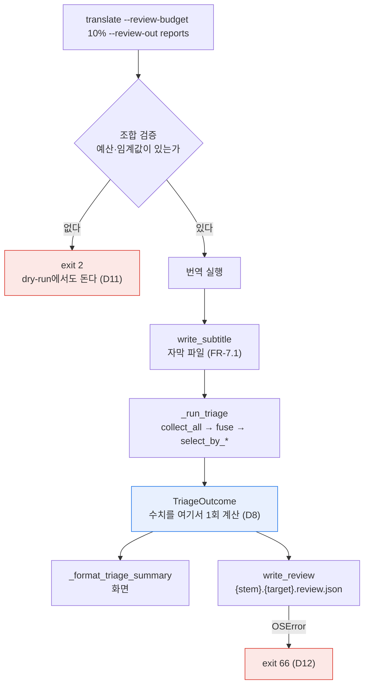

# 설계 — `review.json` 검수 리포트 (FR-7.2)

> 2026-08-18 · 선행: WP1(신호 엔진) · WP6 트리아지 CLI 배선(FR-6.3, `5605fda`)
> 후속: `report.html`(FR-7.3, 별도 설계) · Tier 1 토큰 집계(WP8b)

트리아지가 고른 검수 큐를 **사람과 도구가 읽을 수 있는 파일로 처음 내보낸다.**
선별은 이미 CLI에서 돌지만(`--review-budget`·`--review-threshold`) 결과는 화면 요약으로만
나가고 세그먼트 단위 정보는 함수 안에서 소멸한다 — `_run_triage`가 `list[str]`을 반환하기
때문이다(`src/cuesift/cli.py:1245`).

## 1. 목적과 범위

### 1.1 범위

| 항목 | 내용 |
| --- | --- |
| `--review-out` | **신설.** 리포트 출력 디렉터리 |
| `src/cuesift/report/` | **신설 패키지.** `TriageOutcome` 모델과 JSON 직렬화 |
| `_run_triage` 반환 타입 | `list[str]` → `TriageOutcome`. 요약 포매터와 JSON이 **같은 객체**를 읽는다 |
| 요구사항정의서 §8.4 | 스키마 정정 — `estimated_usd` 제거 · `cost` 확장 · 재현성 필드 · 세그먼트 수 3분할 |

FR-7.2가 열거한 필드(세그먼트 ID·타임코드·원문·번역문·신호별 점수·위험도·선별 사유)를
전부 낸다. 그 결과 **FR-6.4도 함께 닫힌다** — 아래 §9를 본다.

### 1.2 이 설계가 답하지 않는 것

| 항목 | 왜 아닌가 |
| --- | --- |
| `report.html` (FR-7.3) | 같은 `TriageOutcome`을 다른 형식으로 렌더할 뿐이다. 렌더러 하나 추가로 끝나도록 경계만 그어 둔다 |
| Tier 1 토큰 집계 | `collect_tier1`이 `TranslationResult.usage`를 올려 보낼 통로가 없다(WP8b). `cost.includes`가 **무엇이 집계됐는지 파일에 적어** 그 부재를 드러낸다 |
| `check` 명령의 리포트 출력 | FR-7.2는 트리아지 산출물이고 `check`는 규격 검사만 한다. 트리아지를 돌리지 않으므로 낼 것이 없다 |
| 통화 환산 비용 | NFR-2가 v0.1 범위 밖으로 못 박았다. §11 R8("출처 없는 수치를 기본값으로 넣지 않음")이 근거다 |
| 가중치·임계값 튜닝 | `DEFAULT_WEIGHTS`는 전부 1.0으로 둔다(스펙 §6.3) |

### 1.3 왜 WP5가 WP8b보다 먼저인가 — WBS 순서 근거의 소멸

[WBS](../../WBS.md)는 WP8b를 1순위, WP5를 2순위로 적고 근거를 이렇게 달았다.

> `review.json`(FR-7.2)이 `llm.self_consistency`를 실을 스키마를 정하려면 Tier 1이 CLI에서
> 실제로 도는 모습이 먼저 있어야 스키마를 두 번 깨지 않는다

**이 근거는 WP8a가 끝나면서 소멸했고 문서가 갱신되지 않았다.** 실측 셋이 그것을 보인다.

| 우려 | 실측 | 위치 |
| --- | --- | --- |
| Tier 1 신호가 붙으면 스키마가 깨진다 | `signals[]`는 `name`·`tier`·`score`·`spans`·`detail`을 가진 **동종 레코드의 배열**이다. 신호 종류가 늘면 항목이 하나 느는 것뿐이고 형태는 불변이다 | 요구사항정의서 §8.4 · `segment/models.py:66` |
| `llm.self_consistency`의 자리가 아직 없다 | 이미 `DEFAULT_WEIGHTS`에 등록돼 있고 `tier=1`을 낸다 | `risk/fuse.py:45` · `signals/llm.py:97` |
| Tier 1의 `detail` 모양을 모른다 | 이미 확정돼 있다. **주석이 소비자를 명시했다** — "FR-6.4 - review.json이 '왜 선별되었는지'를 이것으로 쓴다" | `signals/llm.py:110` |

세 실측이 말하는 것은 하나다 — **계층을 키가 아니라 값(`tier` 필드)으로 표현한 설계가 그
자체로 순서 의존성을 없앴다.** WP8a가 review.json을 소비자로 상정하고 `detail`을 설계했으므로
"Tier 1이 도는 모습을 먼저 본다"는 선행이 이미 충족돼 있다.

**남는 위험은 스키마의 형태가 아니라 크기다.** `self_consistency.detail.samples`는 재번역
원문 N개라 세그먼트당 수 KB가 된다. 이것은 §6.5에서 다룬다.

## 2. 확정된 설계 결정

| # | 결정 | 근거 |
| --- | --- | --- |
| D1 | `--review-out DIR` **신설**. 기존 `--out`에 자동 생성하지 않는다 | 파일 생성은 명시적 요청이어야 한다. 사용자가 요구하지 않은 파일이 자막 출력물 옆에 생기면 배포 스크립트가 그것을 함께 출고한다. FR-7.3도 같은 자리를 쓴다 |
| D2 | 파일명은 `{stem}.{target}.review.json` — 자막과 **같은 stem 규칙** | 고정 이름(`review.en.json`)은 입력 파일 여럿을 같은 디렉터리로 낼 때 **조용히 서로를 지운다.** `_output_path`가 이미 같은 사고를 막고 있다(`cli.py:396`) |
| D3 | `segments[]`에 **selected만** 담는다 | FR-7.2가 "검수 **대상** 세그먼트 목록"이다. 분모는 `summary`가 따로 낸다 |
| D4 | `detail`을 **통째로** 직렬화한다 | `signals/llm.py:110`이 review.json을 소비자로 명시했다. 원저자 의도이고, 잘라내면 FR-6.4의 "왜 선별되었는지"가 반쪽이 된다 |
| D5 | 세그먼트 수를 **셋으로** 나눈다 (`total`·`triaged`·`excluded_failures`) | 하나로 두면 `review_ratio`의 분모가 무엇인지 파일에서 알 수 없다. 셋이면 `total = triaged + excluded`가 **파일 안에서 검산된다** |
| D6 | `cost`에서 `estimated_usd`를 **제거**하고 `includes`를 넣는다 | NFR-2가 통화 환산을 금지한다. `includes`는 무엇이 집계됐는지를 매번 적어 WP8b 이후의 과소 보고를 드러낸다 |
| D7 | `policy`를 `{kind, value}`로 **구조화**한다 | 화면 라벨(`예산 10%`)은 한국어 표시용이다. 파일은 도구가 읽는다 |
| D8 | `_run_triage`가 `TriageOutcome`을 반환한다 | 화면과 파일이 **같은 수치**를 내야 한다. 두 곳에서 세면 갈라지고, 갈라진 것을 종료 코드로는 알 수 없다 |
| D9 | `src/cuesift/report/` 패키지를 연다 | `cli.py`가 1686줄이다. FR-7.3이 같은 자리를 다시 요구한다 |
| D10 | `--review-out` 단독(예산·임계값 없음)은 **exit 2** | 리포트를 기대했는데 조용히 안 나오는 것이 최악이다. 기존 상호배타 검사와 같은 자리 |
| D11 | `--dry-run`에서는 파일을 쓰지 않는다. **조합 검증은 돈다** | dry-run이 트리아지를 돌리지 않으므로 낼 것이 없다. 그러나 D10의 오류는 실행 전에 알아야 한다 — 프로파일 검증이 이미 같은 규칙을 따른다 |
| D12 | 쓰기 실패는 **exit 66** | `write_subtitle`과 같은 등급이다. 디스크 상태의 문제이지 명령줄 오류가 아니다 |
| D13 | 기존 라이브러리(`signals`·`risk`·`triage`·`segment`)를 **건드리지 않는다** | 변경을 `report/`(신설)와 `cli.py`에 가둔다. 트리아지 CLI 배선이 라이브러리 0줄 변경으로 끝난 것과 같은 규율 |

## 3. 이 설계의 근거가 된 조사

### 3.1 스키마는 이미 §8.4에 있다

요구사항정의서 §8.4가 `review.json` 구조를 JSON으로 확정해 두었다. **이 작업은 스키마
설계가 아니라 계약 구현이다.** 그 계약이 이미 코드를 거꾸로 규정한 흔적도 있다.

```text
src/cuesift/segment/models.py:1-6
  "타임코드는 정수 밀리초로 둔다. §7.3은 timedelta로 적었으나 최종 산출물
   계약인 §8.4 review.json이 start_ms/end_ms를 쓴다. 두 표현을 섞으면
   직렬화 지점마다 변환이 생기고, CPS 계산에서 부동소수 오차가 들어온다."
```

**따라서 직렬화 시점에 타임코드 변환 코드가 한 줄도 필요 없다.**

### 3.2 `detail`은 지금 전부 JSON 원시값이다

등록된 신호 10종의 `detail`을 전수 확인했다.

| 신호 | `detail` 내용 | 타입 |
| --- | --- | --- |
| `struct.untranslated` | `ratio`·`chars` | float · int |
| `struct.degeneration` | `unit`·`count` | str · int |
| `struct.number_missing` | `missing` | list[str] |
| `struct.tag_lost` | `source`·`target` | dict[str, int] |
| `spec.violation` | `kinds`·`count` | list[str] · int |
| `glossary.miss` | `terms` | list[str] |
| `length.ratio` | `ratio`·`median`·`z`·`deviation` | float |
| `spec.overlap` | `overlap_ms` | int |
| `llm.self_consistency` | `samples`·`pairwise`·`temperature`·`requested_samples` | list[str] · list[float] · float · int |

**전부 `json.dumps`가 그대로 받는 값이다.** 위험은 미래에 있다 — `detail`이 자유 dict라
v0.2 QE 플러그인(FR-6.5)이 비원시값을 넣으면 직렬화가 `TypeError`로 죽는다. §8에서 다룬다.

### 3.3 수치는 지금 한 곳에서만 계산된다

`_format_triage_summary`가 다섯 수치를 계산한다(`cli.py:1200-1215`).

```python
total = len(risks)
selected = sum(1 for r in risks if r.selected)
hard = sum(1 for r in risks if r.hard_fail)
counts = Counter()  # risk.reasons를 누적
review_ratio(risks)
```

**JSON이 이것을 다시 세면 화면과 파일이 갈라진다.** 갈라져도 프로그램은 정상 종료하므로
종료 코드로는 알 수 없다 — 이 저장소가 반복해서 값을 치른 실패 유형이다.

### 3.4 자막 파일은 트리아지보다 먼저 써진다

`cli.py`의 실행 순서는 번역 → `write_subtitle`(1049) → 번역 요약 → `_run_triage`(1092)다.
**리포트 쓰기가 실패해도 번역 산출물은 이미 디스크에 있다** — 폭발 반경이 작다. LLM 비용을
쓴 결과물을 리포트 실패로 잃지 않는다.

### 3.5 §8.4에 재현성 필드가 하나도 없다

명세의 `summary`는 언어·프로파일·정책·제외분을 담지 않는다. **파일만 보고는 "무엇을 어느
규격으로 어떤 정책에서 걸렀나"를 알 수 없다.**

이 저장소는 같은 자리에서 이미 값을 치렀다 — Task 2 리뷰가 `profiles[target] =
load_builtin("ko")` 변이를 넣었을 때 **전 스위트가 통과했고**(키 집합만 검증되고 값은
검증되지 않았다), 프로파일 이름을 화면에 찍는 것이 값 검증의 유일한 수단이었다.
리포트 파일은 옮겨지고 첨부되고 며칠 뒤에 열리므로 같은 논리가 더 강하게 적용된다.

## 4. 실행 흐름



**분기점은 `TriageOutcome` 하나다.** 화면과 파일이 같은 객체에서 갈라져 나오므로 수치가
어긋날 자리가 구조적으로 없다.

## 5. CLI 표면

### 5.1 옵션

| 옵션 | 형식 | 기본 | 비고 |
| --- | --- | --- | --- |
| `--review-out` | 디렉터리 | 없음(미지정이면 파일을 쓰지 않는다) | `file_okay=False` — `--out`과 같은 방어 |

**새 옵션은 하나뿐이다.** 프로파일은 대상 언어에서 자동 유도되고(트리아지 CLI 설계 §6.1)
정책은 기존 `--review-budget`·`--review-threshold`가 정한다.

### 5.2 파일명

```text
입력  ep01.ko.srt   --to en,ja   --review-out reports/
출력  reports/ep01.en.review.json
      reports/ep01.ja.review.json
```

stem 규칙은 `_output_path`와 같다 — `.{source_lang}`으로 끝나면 **치환**하고 아니면
**덧붙인다.** 판정만 `casefold()`하고 원본 stem은 그대로 쓴다(Windows의 `ep01.KO.srt`가
이중 태그를 내는 실측 사고가 이미 있었다).

**고정 이름을 쓰지 않는 이유는 덮어쓰기다.** `review.en.json`으로 두면 `ep01`과 `ep02`를
같은 `--review-out`으로 돌릴 때 뒤엣것이 앞엣것을 조용히 지운다.

### 5.3 조합 검증

| 조합 | 결과 |
| --- | --- |
| `--review-out` + 예산 또는 임계값 | 정상 |
| `--review-out` **단독** | **exit 2** — "리포트를 낼 트리아지 정책이 없다" |
| `--review-out` + `--dry-run` | 파일 없음. **위 검증은 그대로 돈다**(D11) |
| 예산·임계값만 (리포트 없음) | 정상 — 화면 요약만 |

**단독 지정을 조용히 무시하지 않는다.** 사용자는 리포트를 기대하고 명령을 짰는데 파일이
없으면 그 사실을 다음 단계(배포 스크립트·CI)에서야 만난다.

## 6. 스키마 (§8.4 정정판)

### 6.1 전문

```json
{
  "summary": {
    "source_lang": "ko",
    "target_lang": "en",
    "profile": "en",
    "policy": { "kind": "budget", "value": 0.1 },
    "total_segments": 100,
    "triaged_segments": 97,
    "excluded_failures": 3,
    "selected_for_review": 12,
    "review_ratio": 0.1237,
    "hard_fail_count": 4,
    "signal_hits": { "spec.violation": 7, "struct.empty": 2 },
    "cost": {
      "prompt_tokens": 1234,
      "completion_tokens": 567,
      "calls": 8,
      "includes": ["translation"]
    }
  },
  "segments": [
    {
      "id": "00007",
      "start_ms": 12000,
      "end_ms": 14500,
      "source_text": "원문",
      "target_text": "translated text",
      "risk_score": 0.87,
      "hard_fail": false,
      "reasons": ["spec.violation"],
      "signals": [
        {
          "name": "spec.violation",
          "tier": 0,
          "score": 1.0,
          "spans": [{ "start": 0, "end": 12, "side": "target" }],
          "detail": { "kinds": ["cps"], "count": 1 }
        }
      ]
    }
  ]
}
```

> **`id` 형식은 초안에서 고쳤다.** 이 스펙의 초안은 `"seg-0007"`이었으나 구현은
> `ingest/loader.py:342`의 `f"{index:05d}"`라 **접두사를 쓰지 않는다**(실측 파일도 `"00002"`).
> Task 8이 요구사항정의서 §8.4를 고치면서 발견했고, 여기도 함께 맞췄다.
>
> **한쪽만 고치면 안 되는 자리다.** §8.4는 계약 문서이고 이 스펙은 그 §8.4의 출처다 —
> 스펙에 `seg-\d+`가 남아 있으면 그것을 보고 파서를 짠 사람이 첫 실행에서 아무것도 못 찾는다.
> 이 저장소의 규율("같은 것을 두 문서에서 각각 정의하면 한쪽만 고쳐져 반드시 갈라진다")이
> 용어뿐 아니라 **계약 값**에도 적용된다.

### 6.2 세그먼트 수를 셋으로 쪼갠다

| 필드 | 뜻 | 왜 |
| --- | --- | --- |
| `total_segments` | **트랙 전체** | §8.4의 이름을 유지한다 |
| `triaged_segments` | 트리아지 대상 = **`review_ratio`의 분모** | 번역 실패분이 빠진 수 |
| `excluded_failures` | 번역 실패로 제외된 수 | `total = triaged + excluded`가 **파일 안에서 검산된다** |

하나로 두면 `total_segments`가 "트랙 전체"로 읽히면서 배수의 분모가 조용히 틀린다 —
CLAUDE.md가 "배수는 요청 예산이 아니라 실제 검수 비율로 나눈다"고 못 박은 자리다.
`review_ratio`는 `triaged_segments`를 분모로 쓰며, 화면 요약의 "실제 N%"와 같은 값이다.

**번역 실패분을 트리아지에서 빼는 근거는 트리아지 CLI 설계의 D12에 있다** — 실패분은
`struct.empty` hard fail을 내고 hard fail은 예산 quota를 소진해 진짜 오류를 큐에서 밀어낸다.
실측(200큐·진짜 오류 20건·예산 10%)에서 실패 20건이면 **Recall@10%가 0%**가 됐다.

### 6.3 `cost` 블록

§8.4의 `{ "tokens": 0, "estimated_usd": 0.0 }`을 다음으로 바꾼다.

| 필드 | 값 | 근거 |
| --- | --- | --- |
| `prompt_tokens`·`completion_tokens`·`calls` | `TranslationResult.usage` | 화면이 이미 같은 세 값을 낸다(`cli.py:1166`) |
| `includes` | `["translation"]` | **무엇이 집계됐는지 파일에 적는다** |
| ~~`estimated_usd`~~ | **키 자체를 제거** | NFR-2 — "통화 환산 비용은 v0.1 범위 밖이다. 토큰당 단가가 모델·프로바이더마다 다르고 우리에게 출처가 없다"(§11 R8) |

**`includes`가 이 블록의 요점이다.** 지금 Tier 1은 CLI에서 돌지 않으므로 번역 토큰이 곧
전체 토큰이고 값이 정확하다. WP8b가 `--tier1-*`를 붙이는 순간 같은 코드가 **과소 보고를
시작하는데 그것을 알릴 수단이 없다.** `includes`에 `"tier1"`이 없으면 소비자가 그 부재를
파일에서 바로 본다.

`estimated_usd`를 `0.0`이나 `null`로 두지 않는 이유는 둘 다 거짓말이기 때문이다 — `0.0`은
출처 없는 수치이고, `null`은 "언젠가 채워질 자리"로 읽혀 v0.1의 명시적 범위 결정을 숨긴다.

### 6.4 정책 표현

| `kind` | `value` | 대응 옵션 |
| --- | --- | --- |
| `budget` | 0.0~1.0 비율 | `--review-budget 10%` → `0.1` |
| `threshold` | 0.0~1.0 위험도 | `--review-threshold 0.7` → `0.7` |

화면 라벨(`예산 10%`)은 한국어 표시용이라 파일에 넣지 않는다. **`value`는 언제나 비율이지
퍼센트가 아니다** — 화면의 `_format_ratio`가 `* 100`을 요구하는 것과 반대 방향이라, 여기서
퍼센트를 넣으면 소비자가 100배 틀린다.

### 6.5 `spans`와 `detail`

`spans`는 `Span` 자료구조를 그대로 편다 — `{ "start": int, "end": int, "side": "source"|"target" }`.
`side`는 리포트가 **어느 쪽을 칠할지**를 가르므로 생략하지 않는다(FR-7.3의 입력이다).

`detail`은 통째로 싣는다(D4). 크기 위험은 **이중 축소로 걸린다.**

| 축소 | 효과 |
| --- | --- |
| `segments[]`에 selected만 담는다 (D3) | 예산 10%면 세그먼트의 10% 남짓 |
| Tier 1은 gray zone 후보에만 돈다 (`max_ratio`) | `samples`를 가진 세그먼트는 그중 일부 |

**따라서 `samples`가 실리는 세그먼트는 전체의 극히 일부다.** 잘라내는 쪽이 잃는 것이 더
크다 — `samples`는 "왜 이 번역이 불안정하다고 봤는가"의 유일한 증거이고, FR-6.4가 요구하는
설명력의 본체다.

## 7. 코드 구조

```text
src/cuesift/report/          신설
  __init__.py                공개 API: TriageOutcome · build_review · write_review
  models.py                  TriageOutcome (수치의 단일 출처)
  json_report.py             build_review() -> dict · write_review() -> None

src/cuesift/cli.py           변경
  _run_triage()              -> TriageOutcome  (기존: list[str])
  _format_triage_summary()   TriageOutcome를 받는다
  _review_path()             신설 - stem 규칙 (D2)
```

### 7.1 `TriageOutcome`

```python
@dataclass(frozen=True, slots=True)
class TriageOutcome:
    """트리아지 1회의 결과. 화면 요약과 review.json의 공통 출처다 (D8)."""

    source_lang: str
    target_lang: str
    profile_name: str
    policy_kind: str          # "budget" | "threshold"
    policy_value: float
    risks: tuple[SegmentRisk, ...]    # 전량. selected 플래그를 갖는다
    segments: tuple[Segment, ...]     # 본문 조달용 (타임코드·원문·번역문)
    excluded_failures: int
    usage: Usage | None
```

**위 두 줄은 2026-09-03에 넓어졌다** - `policy_kind`에 `"top_k"`가, `policy_value`에
`int | float`가 들어왔다. §13의 갱신 블록이 그 판정의 자리다.

**`risks`는 전량이고 `selected` 플래그를 갖는다.** 선별된 것만 담으면 `review_ratio`가
언제나 1.0이 되는데, 그 값이 README 배수의 분모라 조용히 틀리면 프로젝트의 핵심 주장이
무너진다 — `select_by_budget`의 독스트링이 이미 같은 이유로 전체 목록을 반환한다.

**`segments`가 따로 있는 이유는 조인 때문이다.** `SegmentRisk`는 `segment_id`만 갖고
타임코드·원문·번역문은 `Segment`에 있다. FR-7.2가 요구한 필드를 채우려면 둘이 함께 필요하다.

파생 수치(`total`·`selected`·`hard_fail_count`·`signal_hits`·`review_ratio`)는 **프로퍼티로
한 번만 정의한다.** 화면과 JSON이 각자 세는 것을 구조적으로 막는다.

### 7.2 라이브러리와 CLI의 경계

| 층 | 책임 |
| --- | --- |
| `report/` | `TriageOutcome` → dict → 파일. **경로 결정과 옵션 해석을 모른다** |
| `cli.py` | 옵션 파싱 · 조합 검증 · 경로 결정 · 예외를 종료 코드로 |

FR-7.2의 수혜자는 **검수자**(라이브러리 밖의 사람)라 판정 규칙 §0.1의 축 1이 사용자
통로까지를 완료 조건으로 요구한다. 따라서 라이브러리만으로는 닫히지 않고 CLI 배선이
같은 작업에 포함된다.

## 8. 오류 처리와 종료 코드

| 상황 | 종료 코드 | 근거 |
| --- | --- | --- |
| `--review-out` 단독 | **2** | 명령줄 조합 오류 |
| `--review-out`이 기존 **파일**을 가리킴 | **2** | typer `file_okay=False`가 먼저 거른다 |
| 디렉터리 생성·쓰기 실패 (`OSError`) | **66** | 디스크 상태의 문제다. `write_subtitle`과 같은 등급 |
| `detail`에 직렬화 불가값 (`TypeError`) | **미정 — §8.1** | **내부 결함이다.** 지금은 도달 불가(§3.2)이나 v0.2 QE 플러그인이 열 수 있는 경로다 |

**`TypeError`를 exit 1로 새게 두지 않는 것이 요점이다.** `cli.py` 머리말에서 1은 "규격 위반
발견"이라, 미처리 traceback이 exit 1이 되면 **플러그인 결함이 자막 결함으로 오보되고**
사용자는 멀쩡한 자막을 고치려 든다. `--review-threshold nan`이 정확히 같은 이유로 앞단에
가드를 갖는다.

### 8.1 직렬화 실패의 종료 코드는 구현 시점에 정한다

이 설계는 값을 지정하지 않는다. **근거 없는 새 종료 코드를 즉흥으로 만들지 않기 위해서다.**
구현자는 `cli.py` 머리말의 종료 코드 표를 먼저 읽고 다음 순서로 정한다.

1. 기존 코드 중 "내부 결함"에 해당하는 것이 있으면 그것을 쓴다
2. 없으면 코드를 **새로 정의하고 그 표에 근거와 함께 추가한다**
3. 어느 경우든 exit 1(규격 위반)과 exit 2(명령줄 오류)로는 보내지 않는다

## 9. FR 대응

| FR | 착수 시점 | 이 작업 후 | 근거 |
| --- | --- | --- | --- |
| **FR-7.2** | ⬜ 미구현 | **✅** | 열거된 필드(ID·타임코드·원문·번역문·신호별 점수·위험도·선별 사유)를 전부 낸다 |
| **FR-6.4** | 🟡 축 1 부족 | **✅** | "왜 선별되었는지 설명 가능하게 한다"의 수혜자가 검수자인데 통로가 없었다. **그 통로가 정확히 FR-7.2였다** |
| FR-7.4 | 🟡 축 2 부족 | 🟡 **유지** | `cost`가 파일에도 실리지만 **소요 토큰 중 Tier 1분이 여전히 빠진다**(WP8b). `includes`가 그 부재를 명시한다 |

**v0.1 완료 개수가 30에서 32로 오른다.** 산수는 `30 + FR-7.2 + FR-6.4 = 32`이고,
FR-6.4가 함께 닫히는 것은 판정 규칙 §0.1의 축 1(층 도달)이 이 작업으로 충족되기 때문이다.

**D3(selected만 담는다)이 FR-6.4의 "세그먼트마다 기록"과 충돌하지 않는다.** 그 FR의
목적절이 "왜 **선별**되었는지 설명 가능하게 한다"이므로 설명이 필요한 대상은 선별된
세그먼트다. 선별되지 않은 것의 신호는 화면 요약의 집계(`signal_hits`)와
`triaged_segments`가 낸다 — 두 수치 모두 **전량**에서 계산된다(§7.1의 `risks`는 전량이다).

**FR-6.4를 올리는 판단은 규칙에 대조해 검증한다** — 규칙을 고치는 사람은 상태 열이 있는
FR 13개에 전수 대조하라는 요구가 요구사항정의서 §0.1에 있다. 개수가 32에서 움직이면
표기가 아니라 **규칙을 먼저 의심한다**(지금까지 네 번 다 틀린 쪽은 규칙이었다).

## 10. 테스트 전략

**게이트를 만들면 반드시 실패시켜 본다.** 회귀 테스트는 버그 코드에서 실제로 실패하는 것을
확인한 뒤에야 회귀 테스트다. 아래 각 행의 "죽이는 변이"를 넣어 **해당 테스트만** 죽는 것을
확인하고 되돌린다.

### 10.1 최우선 게이트 — 화면과 파일이 갈라진다

| 단언 | 죽이는 변이 |
| --- | --- |
| 같은 실행에서 화면 요약을 파싱한 수치와 `summary`의 수치가 **전부 일치**한다 (`selected`·`hard_fail_count`·`signal_hits`·비율) | JSON 쪽에서 `selected`를 따로 세게 한다 |

**이것이 D8의 존재 이유이자 이 설계에서 가장 조용한 실패다.** 갈라져도 프로그램은 정상
종료하고 파일도 정상이며 종료 코드도 0이다.

### 10.2 두 번째 게이트 — 분모가 조용히 바뀐다

| 단언 | 죽이는 변이 |
| --- | --- |
| 번역 실패 N건이 있을 때 `total = triaged + excluded`이고 `excluded == N` | `excluded_failures`를 0으로 고정 |
| `review_ratio`의 분모가 `triaged_segments`다 (실패분 포함 시 값이 달라진다) | 분모를 `total_segments`로 |

배수의 분모가 부풀면 README 최상단 숫자가 무너진다.

### 10.3 세 번째 게이트 — 파일이 서로를 지운다

| 단언 | 죽이는 변이 |
| --- | --- |
| `ep01.ko.srt`와 `ep02.ko.srt`를 같은 `--review-out`으로 내면 파일이 **2개** 남는다 | 파일명을 `review.{lang}.json` 고정으로 |

**덮어쓰기는 종료 코드가 0이고 경고도 없다.** 사용자는 마지막 파일만 보고 앞의 작업이
끝났다고 믿는다.

### 10.4 나머지

| # | 단언 | 죽이는 변이 |
| --- | --- | --- |
| 4 | 언어 2개 → 파일 2개, `profile`이 각각 다르다 | `profiles[target] = load_builtin("ko")` (Task 2가 실측한 변이) |
| 5 | `segments[]`에 `selected`인 것만 있다 | 전량을 담게 한다 |
| 6 | `--review-out` 단독 → exit 2 | 검증을 뺀다 |
| 7 | `--review-out` + `--dry-run` → 파일 0개, **단독 지정은 여전히 exit 2** | dry-run 경로에서 쓰게 한다 / 검증을 `and not dry_run`으로 미룬다 |
| 8 | `detail`이 통째로 실린다 (`length.ratio`의 4개 키가 전부) | `detail`을 `{}`로 |
| 9 | 쓰기 실패 → exit 66 | `except OSError`를 뺀다 |
| 10 | `estimated_usd` 키가 **없다** · `includes == ["translation"]` | 키를 되살린다 |
| 11 | `spans[].side`가 실린다 | `side`를 빼고 start/end만 |
| 12 | JSON 왕복 — `json.loads(파일)`이 스키마 필드를 전수 갖는다 | 필드 하나 누락 |

**출력에 경로가 실리는 테스트에서는 테스트 이름의 낱말로 단언하지 않는다** — pytest가
`tmp_path`를 테스트 함수 이름으로 짓는데 이 저장소의 한국어 테스트 이름이 출력에 그대로
섞인다(트리아지 CLI Task 5에서 실제로 발생). 고유한 모양으로 좁힌다.

## 11. 완료 판정

| 게이트 | 기준 |
| --- | --- |
| `ruff check .` | All checks passed |
| `ruff format --check .` | 파일 수를 읽는다 |
| `pytest --cov=cuesift --cov-report=term-missing` | 수집 개수와 커버리지를 읽는다. **0개 수집은 통과가 아니라 설정 오류다** |
| `python scripts/check_links.py` | 마크다운 파일 수·상대 링크 수·깨진 링크 0 |
| `npx markdownlint-cli2` | `Linting: N files` — 링크 체커와 **파일 수가 일치해야 한다** |
| 실물 확인 | Ollama `qwen2.5:3b`로 `--review-out`을 실제로 돌려 파일을 열어 본다 |

로컬 venv는 3.14이고 CI는 3.11·3.12다. **`main`에 직접 푸시하지 않고 PR을 경유한다.**

## 12. 문서 정정 — 이 작업에 포함된다

| 문서 | 무엇을 |
| --- | --- |
| [요구사항정의서](../../요구사항정의서.md) **§8.4** | 스키마 정정 — `estimated_usd` 제거 · `cost` 확장 · 재현성 필드 5개 · 세그먼트 수 3분할 |
| [요구사항정의서](../../요구사항정의서.md) **§5.6·§5.7** | FR-7.2 ⬜ → ✅ · FR-6.4 🟡 → ✅ · FR-7.4는 🟡 유지(근거 갱신) |
| [WBS](../../WBS.md) | **순서 근거의 소멸을 기록한다**(§1.3) · 완료 개수 30 → 32 · WP5 진척 갱신 |
| [README](../../../README.md) | `--review-out` 사용법과 출력 예시 |
| [CHANGELOG](../../../CHANGELOG.md) | `[Unreleased]` 항목 |
| [HANDOFF](../../../HANDOFF.md) | 다음 세션 인수인계 |

**WBS 정정이 단순 갱신이 아니다.** "WP8b가 1순위"라는 서술의 근거가 WP8a 완료로 소멸했으므로
그 사실 자체를 남긴다 — 근거만 지우면 다음 사람이 같은 순서를 다시 세운다.

## 13. 남는 것

| 항목 | 다음 자리 |
| --- | --- |
| `report.html` (FR-7.3) | 같은 `TriageOutcome`을 렌더한다. 별도 설계 |
| `cost.includes`에 `"tier1"` 추가 | WP8b. **그때 Tier 1 토큰 통로도 함께 뚫는다** |
| `detail` 직렬화 계약 | v0.2 QE 플러그인이 비원시값을 넣을 수 있다. 지금은 시끄럽게 죽이는 것까지만 한다(§8.1) |
| ~~"상위 K개" 정책 (FR-6.3 ①의 나머지)~~ | **✅ 닫혔다 (2026-09-03)** - [개수 기반 검수 예산 설계](2026-09-03-review-top-k-design.md)가 `select_by_count`를 신설하고 `--review-top-k`를 배선했다 |

> **2026-09-03 갱신 - `policy`가 이 설계 이후 넓어졌다.** D7의 `{kind, value}` 구조는
> 그대로이고, 값 도메인만 늘었다.
>
> | 필드 | 이 설계 | 지금 |
> | --- | --- | --- |
> | `policy_kind` | `"budget"` \| `"threshold"` | **`"budget"` \| `"threshold"` \| `"top_k"`** |
> | `policy_value` | `float` | **`int \| float`** - `"top_k"`일 때만 `int`다 |
>
> **`json_report.py`는 한 줄도 바뀌지 않았다.** 파이썬 타입이 그대로 JSON 수치가 되므로
> `{"kind": "top_k", "value": 50}`이 나간다 - `50.0`이 아니라 `50`이어야 하고, 그 한 글자를
> `tests/test_cli_review_out.py`의 게이트가 고정한다. **스키마 버전은 올리지 않았다**:
> JSON 수치에는 타입이 없어 파이썬도 JS도 `50`과 `50.0`을 가르지 않는 하위호환 확장이다.
> **소비자는 `value`보다 `kind`를 먼저 읽어야 한다** - `0.1`과 `50`이 같은 필드에 온다.
> D7이 애초에 `{kind, value}`로 구조화해 둔 덕분에 이 확장이 스키마를 깨지 않았다.
