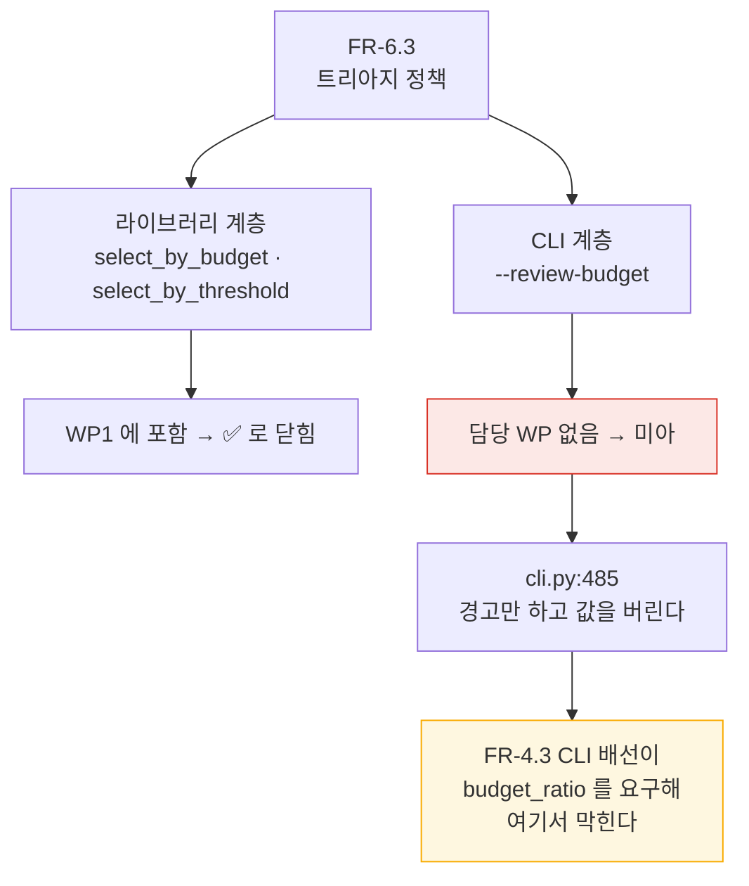
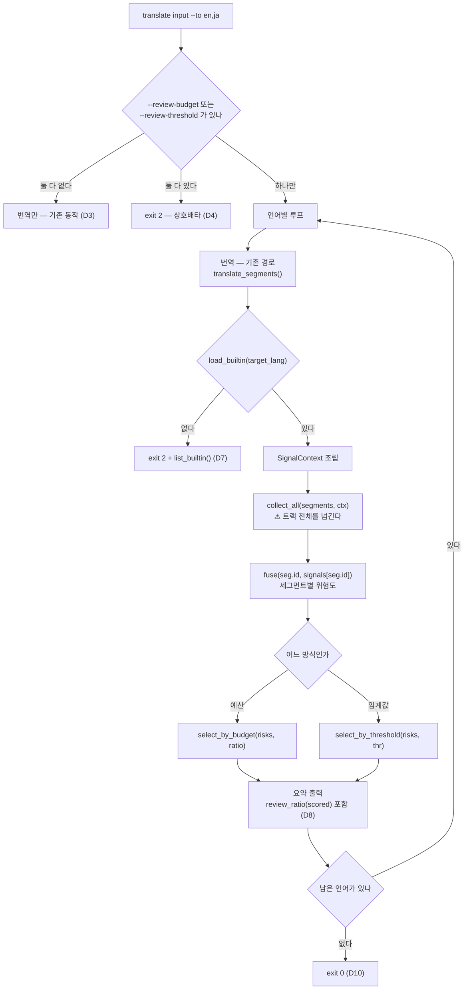

# 설계 — 트리아지 CLI 배선 (FR-6.3)

> 2026-08-18 · 선행: WP1(신호 엔진 라이브러리) · WP7b(`translate` CLI)
> 후속: Tier 1 CLI 배선(FR-4.3, 별도 설계)

`cuesift translate`에 **검수 큐 선별을 처음 배선한다.** 신호 수집·융합·예산 선별은
라이브러리에 전부 있으나 CLI에서 도달할 수 없다 — `--review-budget`은 경고만 하고
값을 버린다(`src/cuesift/cli.py:485`).

## 1. 목적과 범위

### 1.1 범위

| 항목 | 내용 |
| --- | --- |
| `--review-budget` | 기존 옵션의 **경고를 실제 동작으로 교체**. `10%`·`0.1` 형식 |
| `--review-threshold` | 신설. 위험도 임계값 방식 (FR-6.3 ②) |
| 프로파일 조달 | 대상 언어 코드로 내장 프로파일 자동 유도. 새 옵션 없음 |
| 신호 수집·융합 | `collect_all` → `fuse` → `select_by_budget`/`select_by_threshold` 배선 |
| 요약 출력 | 총 세그먼트·검수 대상·**실제 검수 비율**·hard fail·신호별 적발 건수 |
| `list_builtin()` | `spec/profile.py`에 추가. 오류 메시지의 프로파일 목록을 하드코딩하지 않기 위한 것 |

한 줄로: **라이브러리에 이미 있는 트리아지를 CLI에서 도달 가능하게 만드는 것이 전부다.**

### 1.2 이 설계가 답하지 않는 것

| 항목 | 어디로 | 근거 |
| --- | --- | --- |
| `--tier1-max-ratio`·`--tier1-samples`·`--tier1-temperature` | 후속 설계 (FR-4.3) | `triage_with_tier1()`이 `budget_ratio`를 필수로 요구하므로 이 설계가 **선행**이다. 되돌리기 단위를 키우지 않는다 |
| `review.json`·`report.html` | WP5 (FR-7.2·7.3) | 리포트 스키마는 별도 산출물이다. 화면에 세그먼트 목록을 내면 나중에 두 표현이 갈라진다 |
| "상위 K개" 예산 | 보류 | FR-6.3 ①의 절반. 라이브러리에 대응 함수가 없고, 이 저장소의 표준 운영점이 비율(10%)이다 |
| Tier 1 토큰 집계 | 후속 설계 | Tier 1을 켜지 않는 이 설계에서는 발생하지 않는다 |
| 커스텀 프로파일 덮어쓰기 | 필요해질 때 | §6.2 참고 — FR-5.3은 `check --spec`이 이미 충족한다 |

한 줄로: **이 설계는 예산까지만 배선하고 Tier 1은 건드리지 않는다.**

### 1.3 왜 이 작업이 WBS에 없었는가

착수 시점에 WBS는 "다음 1순위 = WP8b(Tier 1 CLI 배선)"라고 적고 있었다. 그러나
FR-6.3의 CLI 절반이 **어느 WP에도 속하지 않은 상태**였다.

| FR | 라이브러리 | CLI | 담당 WP |
| --- | --- | --- | --- |
| FR-6.3 | ✅ WP1 완료 | ⬜ 미구현 | **없음** |
| FR-4.3 | ✅ WP8a 완료 | ⬜ 미구현 | WP8b |

WP5는 FR-7.1~7.5(출력)만, WP6은 FR-8.1~8.5(CLI 배선)만 담당한다. `cli.py:485`의 경고가
"(WP5)"라고 적지만 WBS의 WP5 범위에 그 항목은 없다.

구조적 원인은 **WBS가 FR 번호로 WP를 나누는 것**이다. FR-6.3처럼 라이브러리와 CLI 두
계층에 걸친 FR은 WP1에서 라이브러리만 만들고 ✅로 닫히며, CLI 절반이 미아가 된다.



**같은 함정이 이 저장소에서 세 번째다.** FR-5.3과 FR-4.3은 발견 후 §5.4에 🟡로 표시해
넘겼으나, FR-6.3은 담당 WP가 없어 표시할 칸조차 없었다. §11의 문서 정정이 이 구멍을
메운다.

## 2. 확정된 설계 결정

| # | 결정 | 근거 |
| --- | --- | --- |
| D1 | **`translate`에 통합한다.** 새 명령을 만들지 않는다 | 원문과 번역문이 함께 있는 유일한 지점이다. 신호 9종 중 7종이 `seg.source_text`를 요구하는데 번역 산출물은 대상 언어 자막 하나뿐이다 — 독립 `triage` 명령은 원문·번역문 쌍 입력 형식(`bench`의 JSON 트랙 같은 것)을 CLI에 들이는 선행 작업이 필요하다 |
| D2 | **`check`를 확장하지 않는다** | 설계 §D3 "check는 신호 엔진을 통과하지 않는다"를 정면 위반한다. `check_track()`이 규격 판정의 집결지라는 규약도 함께 깨진다 |
| D3 | **두 옵션 중 하나도 없으면 트리아지를 돌리지 않는다** | 하위 호환. 기존 `translate` 사용자가 LLM 호출 외 비용을 새로 지지 않는다 |
| D4 | **`--review-budget`과 `--review-threshold`는 상호배타** | FR-6.3이 "두 방식으로 지정할 수 있다"이지 "동시에"가 아니다. 둘을 합성하면 어느 쪽이 이겼는지가 출력에서 사라진다 |
| D5 | **예산은 비율만 받는다.** 개수(`50`)는 exit 2 | 라이브러리에 대응 함수가 없다. 환산(`k/n`)으로 흉내내면 `ceil`과 hard fail 소진 때문에 정확히 K개가 나오지 않아 옵션이 거짓말을 한다 |
| D6 | **프로파일은 대상 언어 코드로 자동 유도한다.** 새 옵션 없음 | 내장 프로파일이 이미 언어별로 존재한다(`specs/{ko,en,ja,ted-*}.yaml`). `bench/run.py:102`가 같은 방식을 쓰는 선례다 |
| D7 | **프로파일이 없는 언어는 exit 2로 거부한다.** 트리아지를 조용히 건너뛰지 않는다 | "검사하지 않고 통과하는 게이트는 없는 게이트보다 나쁘다"(CLAUDE.md). 건너뛰면 사용자는 예산을 지정했는데 아무 일도 안 일어난 이유를 모른다 |
| D8 | **요청 예산과 실제 검수 비율을 나란히 출력한다** | hard fail이 quota를 소진하므로 둘은 정기적으로 어긋난다. 요청 예산만 내면 사용자가 README 배수를 틀린 분모로 재계산한다(CLAUDE.md의 규율) |
| D9 | **세그먼트 목록은 출력하지 않는다.** 요약만 | FR-7.2(`review.json`)가 WP5의 명시적 산출물이다. 화면 목록과 리포트가 갈라지면 한쪽만 고쳐진다 |
| D10 | **종료 코드는 0을 유지한다.** 검수 대상이 있어도 실패가 아니다 | `translate`는 번역 명령이고 트리아지는 정보 제공이다. `check --fail-on`과 성격이 다르다. exit 2는 사용법 오류(옵션 충돌·프로파일 없음·파싱 실패)에만 쓴다 |
| D11 | **`list_builtin()`을 `spec/profile.py`에 추가한다** | 오류 메시지가 프로파일 목록을 하드코딩하면 프로파일 추가 시 조용히 낡는다. 프로파일 지식은 그 모듈의 것이다 |

한 줄로: **D1·D2가 위치를 정하고, D3~D5가 표면을 정하고, D6~D7이 프로파일을, D8~D10이 출력을 정한다.**

## 3. 이 설계의 근거가 된 조사

착수 시점에 조사자 4명이 병렬로 확인한 사실이다. 모두 `파일:줄`로 검증했다.

### 3.1 CLI에는 트리아지가 없다

```python
# src/cuesift/cli.py:485-492
if review_budget is not None:
    _echo(
        f"경고: --review-budget은 아직 구현되지 않았습니다 (WP5). "
        f"지정한 '{review_budget}'는 무시됩니다.",
        err=True,
    )
```

`check`는 `check_track()`만 부르고(`cli.py:1268`) `translate`는 `translate_segments()`만
부른다(`cli.py:893-901`). **신호 수집기도 융합도 CLI에서 한 번도 호출되지 않는다.**

### 3.2 프로파일은 대상 언어의 것이다

`bench/run.py:100-106`이 유일한 선례다.

```python
target_lang = args.pair.split("-")[0]
profile = load_builtin(f"ted-{target_lang}")
glossary = load_glossary(Path("bench/glossary.ted.yaml"), target_lang)
ctx = SignalContext(
    profile=profile, glossary=glossary, source_lang="ko", target_lang=target_lang
)
```

프로파일을 읽는 신호는 9종 중 2종뿐이고, 둘 다 **번역문**에 적용한다.

| 신호 | `ctx.profile` | 읽는 것 | 근거 |
| --- | --- | --- | --- |
| `spec.violation` | 필요 | `check_text(seg.target_text, seg.duration_ms, ctx.profile)` | `derived.py:83-102` |
| `length.ratio` | 필요 | `ctx.profile.char_counting` | `derived.py:141-200` |
| 나머지 7종 | 불필요 | — | `structural.py`·`derived.py` |

한 줄로: **`check --spec ko`(원문 규격)와 이 설계의 프로파일(대상 언어 규격)은 이름이 같아도 다른 것이다** — D6이 새 옵션을 만들지 않는 이유이기도 하다.

### 3.3 hard fail이 예산을 소진한다

```python
# src/cuesift/triage/policy.py:85-93
quota = math.ceil(len(risks) * budget_ratio)
remaining = max(0, quota - len(hard_ids))
selected_ids = hard_ids | {r.segment_id for r in rest[:remaining]}
```

주석이 대가를 명시한다 — "위험도 0.05 hard fail 하나가 quota=1을 다 먹으면 0.9짜리가
탈락한다." 가산으로 바꾸지 않은 이유는 `review_ratio`가 부풀어 §9.1 배수의 분모가
망가지기 때문이다.

**그리고 `struct.empty`가 번역 실패분을 hard fail로 만든다**(`structural.py:166-172`,
`score=1.0, hard_fail=True`). 즉 번역 실패가 많으면 검수 큐가 실패분으로 차고 정상
세그먼트가 밀려난다. 동작은 옳지만(실패는 반드시 봐야 한다) **출력이 이를 구분해
보여주지 않으면 "예산을 다 썼는데 왜 볼 것이 적나"가 설명되지 않는다** — D8의 근거다.

### 3.4 올림과 내림이 반대 방향이다

| 함수 | 방향 | 코드 주석의 근거 |
| --- | --- | --- |
| `select_by_budget` | 올림(`ceil`) | "10건에 5% 예산이면 0.5건인데, 내림하면 0건이 되어 트리아지가 아무것도 안 하고 통과한다" |
| `select_tier1_candidates` | 내림(`floor`) | "올림이면 상한이 상한을 넘는다 (3×0.7 → 실제 100%)" |

예산은 "적어도 뭔가는 봐야 한다", 상한은 "넘으면 안 된다" — 성격이 반대라 방향도
반대다. **이 설계는 예산 쪽만 쓴다.** 후속 설계(FR-4.3)가 상한을 다룰 때 이 비대칭을
다시 봐야 한다.

### 3.5 정책 함수는 전체 목록을 반환한다

`triage/policy.py:3-14`의 모듈 독스트링이 계약을 못 박는다 — 선별된 것만 반환하면
`review_ratio`가 언제나 1.0이 되고 "그 값이 스펙 §6.2의 실제 검수 비율이자 README 배수의
분모라, 조용히 틀리면 프로젝트의 핵심 주장이 무너진다."

**CLI가 이 계약을 어기면(선별분만 들고 다니면) 같은 함정에 빠진다.** `scored` 변수는
끝까지 전체 목록이어야 하고, 개수를 셀 때만 필터한다.

## 4. 실행 흐름



도식에서 ⚠ 표시한 곳이 §9.1의 최우선 게이트다 — 세그먼트를 하나씩 넘겨도 프로그램은
정상 종료하지만 배치 신호가 조용히 죽는다.

## 5. CLI 표면

### 5.1 옵션

| 옵션 | 타입 | 기본값 | 상태 |
| --- | --- | --- | --- |
| `--review-budget` | `str \| None` | `None` | 기존 — 경고를 실제 동작으로 교체 |
| `--review-threshold` | `float \| None` | `None` | 신설 — Typer `min=0.0, max=1.0` |

`--review-threshold`에 Typer의 범위 제약을 쓰는 것은 `--context-window`(`min=0`)·
`--limit`(`min=0`)과 같은 패턴이다. 라이브러리도 범위를 검사하지만(`policy.py:110-111`)
CLI에서 막으면 오류 메시지가 옵션 이름을 말한다.

### 5.2 예산 값 파싱

`--review-budget`은 `str`이므로 CLI가 파싱한다.

| 입력 | 결과 | 근거 |
| --- | --- | --- |
| `10%` | `0.10` | 사람이 읽는 기본 형식 |
| `0.1` | `0.10` | 라이브러리 인자와 같은 표현 |
| `0` · `0%` | `0.0` | 유효값 — `select_by_budget(risks, 0.0)`은 hard fail만 선별한다. "치명 위반만 보기"는 의미 있는 요청이다 |
| `100%` · `1.0` | `1.0` | 유효값 — 전량 검수 |
| `1` | `1.0` — **전량 검수다** | 규칙의 결과다. `1%`를 의도한 사용자가 전량을 받을 수 있으나 ① Tier 0만 쓰므로 LLM 비용이 0이고 ② 요약이 "실제 100.0%"를 내므로 즉시 드러난다. help 문자열이 `%` 사용을 권한다 |
| `50` | **exit 2** | 범위 밖. "개수 지정은 v0.1 범위 밖이다. 비율로 지정하라 (예: 10%)" (D5) |
| `-5%` · `1.5` · `abc` · `` (빈 문자열) | **exit 2** | 파싱 실패 또는 범위 밖 |

한 줄로: **`%` 유무만 다르고 나머지는 `0.0 ≤ x ≤ 1.0` 한 규칙이다** — `50`이 거부되는
것도 `1`이 전량이 되는 것도 이 규칙의 결과이고, 메시지만 개수 지정을 따로 안내한다.

규칙을 더 좁히는 안(`%` 없는 값에 소수점을 요구해 `1`을 거부)은 채택하지 않았다 —
`0`까지 함께 거부되어 §5.2의 "hard fail만 보기"가 막힌다. 한 규칙을 유지하고 오지정이
출력에서 드러나게 하는 쪽을 택했다.

### 5.3 상호배타

두 옵션을 함께 주면 exit 2다(D4). 이 저장소의 패턴 중 `_resolve_llm`(`cli.py:364-378`)이
같은 모양이다 — 함수 안에서 검사하고 `typer.Exit(2)`를 던지며 `err=True`로 메시지를 낸다.

## 6. 프로파일 조달

### 6.1 자동 유도

```text
--to en,ja  →  load_builtin("en")  ·  load_builtin("ja")
```

내장 프로파일 6개가 이미 언어별로 있다: `specs/{ko,en,ja,ted-ko,ted-en,ted-ja}.yaml`.
`load_builtin(name)`은 `specs/<name>.yaml`을 읽으므로(`spec/profile.py:174`) 언어 코드가
그대로 이름이 된다.

없는 언어는 exit 2다(D7).

```text
--to fr  →  exit 2
    "fr의 내장 규격 프로파일이 없다. 사용 가능: en ja ko ted-en ted-ja ted-ko"
```

### 6.2 왜 덮어쓰기 옵션을 만들지 않는가

FR-5.3은 "기본 프로파일을 공개 스타일가이드 기반으로 제공하되, **사용자가 덮어쓸 수
있다**"를 요구하고, `check --spec <path>.yaml`이 이미 그 경로를 제공한다.
`translate`에도 만들면 두 문제가 생긴다.

| 문제 | 내용 |
| --- | --- |
| 다중 언어에서 모호하다 | `--to en,ja --spec ted-en`이 어느 언어에 적용되는지 알 수 없다. 해소하려면 `--spec en=a.yaml` 반복 문법이 필요하다 |
| 같은 이름이 다른 의미를 갖는다 | `check --spec`은 검사 대상 자막의 규격이고, `translate`에서는 **대상 언어**의 규격이다(§3.2) |

**필요해지면 그때 만든다** — TED 벤치마크처럼 `ted-en`을 지정해야 하는 용례가 CLI에서
실제로 나오면, 그 시점에 위 두 문제를 함께 푼다. 지금은 `bench/`가 라이브러리를 직접
호출하므로 CLI 옵션이 필요하지 않다.

**우회로가 하나 이미 열려 있다는 점은 기록해 둔다.** `--to`의 언어 태그 정규식
(`^[A-Za-z]{2,3}(-[A-Za-z0-9]+)*$`, `cli.py:88`)은 `ted-en`도 통과시키므로
`--to ted-en`이 `load_builtin("ted-en")`으로 이어진다. 이 설계가 만든 것이 아니라 기존
`--to` 검증의 성질이고, 그 경우 번역 대상 언어도 `ted-en`이 되어 LLM에 그대로 전달되므로
**의도된 사용법이 아니다.** 프로파일만 바꾸는 수단으로 쓰이면 번역 품질이 조용히
나빠진다 — 덮어쓰기 옵션을 만들 때 함께 닫을 항목이다.

### 6.3 `list_builtin()` 추가

```python
def list_builtin() -> list[str]:
    """내장 프로파일 이름을 정렬해 낸다 (FR-5.1).

    오류 메시지가 목록을 하드코딩하면 `specs/`에 프로파일을 더해도 조용히
    낡는다 — 사용자는 있는 프로파일을 "없다"고 안내받는다.
    """
```

정렬해서 내는 것은 NFR-3(재현성)이다 — 글롭 순서는 파일시스템에 좌우되므로 오류
메시지가 실행마다 달라지면 테스트가 흔들린다.

## 7. 출력

### 7.1 형식

```text
[en] 트리아지 (예산 10%)
  총 세그먼트      1203
  검수 대상         131  (실제 10.9%)
  hard fail          8  (번역 실패 3 포함)
  신호별 적발
    spec.violation    47
    length.ratio      12
    struct.empty       3
```

| 줄 | 출처 | 근거 |
| --- | --- | --- |
| 총 세그먼트 | `len(risks)` | FR-7.4 |
| 검수 대상 · 실제 비율 | `sum(selected)` · `review_ratio(scored)` | FR-7.4 · D8 |
| hard fail | `sum(r.hard_fail)` | FR-6.2가 예산을 우회하는 것을 사용자가 알아야 한다 |
| 번역 실패 포함 수 | `TranslationResult.failures`와 교집합 | §3.3 — 예산을 소진하는데 볼 내용은 없는 세그먼트다 |
| 신호별 적발 건수 | `r.reasons` 집계 | FR-7.4 · FR-6.4의 집계 표현 |

한 줄로: **다섯 줄 모두 FR에 근거가 있고, 그중 실제 비율과 번역 실패 구분이 이 설계가
새로 더하는 것이다.**

### 7.2 FR-6.4·FR-7.4와의 관계

`fuse()`가 `reasons`에 0점이 아닌 신호 이름만 담는다(`fuse.py:73` — "0점 신호를 사유에
넣으면 리포트가 '이것 때문에 뽑혔다'고 거짓말한다"). 이 설계의 신호별 적발 건수는 그
**집계**이고, 세그먼트별 사유는 FR-7.2(`review.json`)의 몫이다.

FR-7.4는 "소요 토큰"도 요구하는데 이 설계는 그것을 내지 않는다 — 번역의 토큰은 이미
`cli.py:1004-1005`가 출력하고 있고, 트리아지 자체는 Tier 0만 쓰므로 **비용이 0이다.**
Tier 1 토큰은 후속 설계의 몫이다.

## 8. FR 대응

| FR | 이 설계 이후 | 남는 것 |
| --- | --- | --- |
| FR-6.1 (가중 합성) | ✅ CLI에서 도달 | — |
| FR-6.2 (hard fail 우회) | ✅ CLI에서 도달 · 출력에 노출 | — |
| FR-6.3 ① (검수 예산) | 🟡 비율만 | "상위 K개" |
| FR-6.3 ② (위험도 임계값) | ✅ | — |
| FR-6.4 (선별 사유) | 🟡 집계만 | 세그먼트별 사유 → FR-7.2 |
| FR-7.4 (요약 통계) | 🟡 세그먼트 수·검수 비율·신호별 건수 | 소요 토큰(Tier 1) |
| FR-4.3 (Tier 1 상한) | ⬜ 변화 없음 | 후속 설계 전체 |

**FR-6.3 전체는 🟡로 남는다** — ②는 닫히지만 ①이 "상위 K개"를 빼고 부분 충족이므로
✅로 세지 않는다. FR-5.3이 "라이브러리엔 있으나 CLI에서 도달 못함"으로 한 번 걸렸던
자리이므로 같은 함정을 반대 방향으로도 반복하지 않는다.

## 9. 테스트 전략

**모든 게이트는 버그 버전에서 실제로 실패시켜 확인한다.** 회귀 테스트는 버그 코드에서
실패하는 것을 본 뒤에야 회귀 테스트다(CLAUDE.md). 이 저장소에서 길이비 회귀 테스트가
버그 버전에서도 통과해 데이터를 다시 짠 전례가 있다.

### 9.1 최우선 게이트 — 배치 신호가 죽지 않는다

`spec.overlap`은 `BatchCollector`다 — 트랙 전체를 봐야 세그먼트 중첩을 판정한다.
`collect_all(segments, ctx)`에 세그먼트를 하나씩 넘기면 **신호가 발화하지 않고 프로그램은
정상 종료한다.** 조용한 실패이므로 최우선이다.

| 항목 | 내용 |
| --- | --- |
| 데이터 | 시간이 겹치는 세그먼트 2건을 포함한 트랙 |
| 기대 | 요약의 신호별 적발에 `spec.overlap`이 나온다 |
| 실패 확인 | `collect_all([seg], ctx)`를 세그먼트마다 부르는 버전에서 이 테스트가 죽는지 본다 |

### 9.2 두 번째 게이트 — 실제 비율이 요청 예산과 다르게 나온다

hard fail이 quota를 초과하는 데이터를 만들어 `review_ratio`가 요청 예산보다 **큰** 값으로
출력되는 것을 확인한다. 요청 예산을 그대로 출력하는 버전에서 죽어야 한다.

| 항목 | 내용 |
| --- | --- |
| 데이터 | 세그먼트 10건, 그중 번역 실패(=`struct.empty` hard fail) 3건, 예산 10% |
| 산수 | `quota = ceil(10 × 0.10) = 1`, hard fail 3건 → 선별 3건 → 실제 30% |
| 기대 | 출력에 "실제 30.0%"와 "hard fail 3 (번역 실패 3 포함)"이 함께 나온다 |

이 케이스는 §3.3의 서술이 실제로 그렇게 동작함을 증명하는 자리이기도 하다.

### 9.3 나머지

| 대상 | 검증 |
| --- | --- |
| 예산 파싱 | `10%`·`0.1`·`0`·`0%`·`100%`·`1.0` 통과 / `50`·`-5%`·`1.5`·`abc`·빈 문자열 exit 2 |
| 상호배타 | 두 옵션 동시 지정 → exit 2, 메시지에 두 옵션 이름이 모두 나온다 |
| 프로파일 없음 | `--to fr` → exit 2, 메시지에 `list_builtin()` 결과가 나온다 |
| **회귀 — 하위 호환** | 두 옵션 없이 실행하면 신호 수집기가 **호출되지 않는다**(호출 0회를 실측한다) |
| 언어별 반복 | `--to en,ja` → 프로파일 2개 로드, 요약 2개 출력 |
| 임계값 방식 | `--review-threshold 0.7`이 `select_by_threshold`를 부르고 hard fail은 임계값 미만이어도 선별된다 |
| `list_builtin()` | 6개를 정렬해 낸다. `specs/`에 파일을 더하면 목록이 늘어난다 |
| 전체 목록 계약 | 요약이 `review_ratio`에 **전체 목록**을 넘긴다 — 선별분만 넘기는 버전에서 값이 1.0이 되어 죽는지 확인(§3.5) |

## 10. 완료 판정

| 게이트 | 기준 |
| --- | --- |
| `ruff check .` | All checks passed |
| `ruff format --check .` | 파일 수를 기록한다 |
| `pytest --cov=cuesift --cov-report=term-missing` | 수집 개수와 커버리지를 기록한다. **0개 수집은 통과가 아니라 설정 오류다** |
| `python scripts/check_links.py` | 마크다운 파일 수·상대 링크 수를 기록한다 |
| `npx markdownlint-cli2` | `Linting: N files` — 위 링크 검사와 **파일 수가 일치해야 한다** |
| 실동작 | 실제 자막 파일에 `--review-budget 10%`를 주고 요약이 나오는 것을 확인 |

§9.1·§9.2 두 게이트는 **버그 버전에서 실패하는 것을 확인한 기록**을 남긴다.

## 11. 문서 정정 — 이 작업에 포함된다

§1.3에서 발견한 WBS 구멍을 메우는 것이 이 작업의 일부다.

| 문서 | 무엇을 |
| --- | --- |
| [WBS](../../WBS.md) | FR-6.3의 CLI 배선을 **어느 WP가 담당하는지 명시**한다. 의존 그래프에 "FR-6.3 CLI → FR-4.3 CLI" 간선을 넣고, "다음 작업 순서"에서 WP8b가 1순위라는 서술을 정정한다 |
| [요구사항정의서](../../요구사항정의서.md) §5.4 | FR-6.3을 🟡(①은 비율만·②는 완료), FR-6.4를 🟡(집계만), FR-7.4를 🟡로 표시한다 |
| [HANDOFF](../../../HANDOFF.md) | "🔴 즉시 해야 할 것 — PR을 만들어야 CI가 돈다"는 이미 끝났다(`e88177e`가 PR #7 스쿼시 머지). 낡은 절을 정리한다 |
| [CHANGELOG](../../../CHANGELOG.md) | `[Unreleased]`에 이 작업 항목 |

**WBS는 요구사항정의서의 파생물이지 병렬 출처가 아니다**(CLAUDE.md) — FR 상태는 §5.4가
단일 출처이고 WBS는 작업 단위와 진척만 갖는다. 두 문서를 같은 커밋에서 함께 고친다.

## 12. 남는 것

| 항목 | 왜 남기나 |
| --- | --- |
| Tier 1 CLI 배선 (FR-4.3) | 이 설계의 직접 후속. `budget_ratio`가 생겼으므로 이제 가능하다 |
| "상위 K개" 예산 (FR-6.3 ①) | 라이브러리 함수 추가가 필요하고, 표준 운영점이 비율이라 급하지 않다 |
| `review.json`·`report.html` (FR-7.2·7.3) | WP5. 이 설계가 만든 `SegmentRisk` 목록이 그 입력이 된다 |
| 커스텀 프로파일 덮어쓰기 | §6.2 — 다중 언어 모호성과 이름 충돌을 함께 풀어야 한다 |
| `--dry-run`에 트리아지 반영 | 트리아지는 Tier 0만 쓰므로 LLM 비용이 0이다. Tier 1이 들어오면 필요해진다 |
