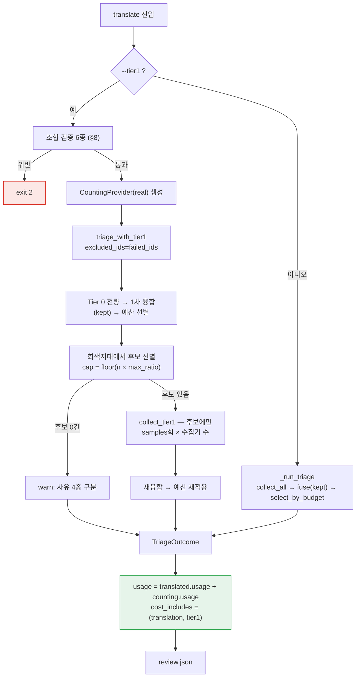

# 설계 — Tier 1 CLI 배선 (FR-4.3 · FR-7.4)

> 작성 2026-08-25 · WP8b
> 선행: [Tier 1 신호 설계](2026-08-17-tier1-signals-design.md)(WP8a, 라이브러리 계층) ·
> [`review.json` 설계](2026-08-18-review-json-design.md)(WP5, `cost.includes`의 소비자)
> 근거 문서: [요구사항정의서](../../요구사항정의서.md) · [WBS](../../WBS.md)

**Tier 1은 라이브러리에 있지만 사용자가 켤 수 없다.** FR-4.3이 요구하는 것은
"라이브러리에 파라미터가 있다"가 아니라 "**사용자가** 설정할 수 있다"이고, 그 차이가
이 작업의 전부다.

---

## 1. 목적과 범위

### 1.1 무엇을 만드나

`cuesift translate`에 Tier 1 옵션 4종을 붙이고, Tier 1이 쓴 토큰을 `review.json`까지
올린다. 후자가 FR-7.4를 함께 닫는다.

| FR | 지금 | 이 작업 후 |
| --- | --- | --- |
| FR-4.3 | 🟡 — `triage_with_tier1()`에 파라미터는 있으나 CLI 표면이 없다 | ✅ `--tier1` 외 3종 |
| FR-7.4 | 🟡 — `cost.includes`가 `["translation"]` 고정. 가장 비싼 계층이 통계에서 빠진다 | ✅ Tier 1분이 실린다 |

### 1.2 범위 밖 — 명시한다

| 항목 | 이유 |
| --- | --- |
| **`Tier1Collector` 프로토콜의 배치화** | 세그먼트 단위 호출이 배치 대비 호출을 늘리는 것은 사실이나(§6.1), 프로토콜 변경은 [WP8a 설계](2026-08-17-tier1-signals-design.md) §4.1의 개정이다. 이 작업은 **기본값으로 비용을 §4 한도 안에 가둔다**(D3) |
| FR-4.2 역번역 신호 | 착수 시점 실측이 문자 단위 유사도로는 `llm.retranslation_gap`이 **역방향으로 작동**함을 보였다 — 정상 변이가 오류보다 높은 점수를 받는다. 측정 수단이 바뀌면 다시 본다 |
| Q4 판정 (자가일관성 유사도 측정 수단) | 벤치마크에 Tier 1을 태우는 별도 작업의 몫이다. **이 작업이 Q4를 닫지 않는다는 사실이 D2의 근거다** |
| `_run_single`(`engine.py`)의 전역 index 결함 | `48f9133`(WP7b)부터 `main`에 있다. WP7 계열의 별도 작업 |
| `cli.py` 분할 | 이 작업 책임이 아니다. 이월 항목 2번 |

---

## 2. 확정된 설계 결정

| # | 결정 | 근거 |
| --- | --- | --- |
| D1 | `--tier1` **불리언 스위치를 따로 둔다.** `--tier1-max-ratio`가 스위치를 겸하지 않는다 | 값이 곧 스위치면 사용자가 매번 값을 고른다. 그때 가장 고르기 쉬운 값이 README 표준 예산과 대칭인 `0.10`인데, **그것이 정확히 §4 한도에 닿는 값이다**(§6.1). 스위치가 따로 있어야 "켜기만" 하는 사용자가 안전한 기본값을 실제로 받는다 |
| D2 | **기본은 꺼짐.** 트리아지를 켜도 Tier 1은 자동으로 돌지 않는다 | **Q4가 열려 있다** — 자가일관성의 판정력이 아직 검증되지 않았다(실측 7쌍에서 negation 0.727~0.930과 paraphrase 0.759~0.800의 범위가 겹쳐 분리하지 못한다). 검증 안 된 신호가 기본 경로에 섞이면 **Recall@Budget 지표 자체가 오염된다** — 그 숫자가 이 프로젝트의 유일한 증명 자료다(§9.1, §11 R4) |
| D3 | `--tier1-max-ratio` 기본값 **0.05** | §4의 3배 한도에서 역산했다(§6.1). `0.10`은 한도에 정확히 닿는다 |
| D4 | `samples` **단독 상한을 두지 않는다.** `samples × max_ratio < 0.3`을 게이트로 삼는다 | §11 R8이 출처 없는 수치를 금지한다. `samples ≤ 10`에는 출처가 없지만 이 곱의 출처는 §4다. **상한이 잘못된 축에 걸려 있으면 `--tier1-samples 10 --tier1-max-ratio 0.5`(배수 50)가 통과한다** |
| D5 | `triage_with_tier1`에 **`excluded_ids: Collection[str] = ()`** 를 더한다 | 이 함수는 `segments` 하나로 수집과 융합을 **둘 다** 한다(`tier1.py:140,143`). `_run_triage`는 둘의 입력을 의도적으로 다르게 준다([트리아지 CLI 설계](2026-08-18-triage-cli-design.md) D12) — 어느 쪽을 넘겨도 기존 사고가 재현된다(§3.1). 기본값이 빈 집합이라 **기존 호출부와 테스트의 거동은 완전히 불변**이다 |
| D6 | Tier 1 토큰은 **프로바이더를 감싸서** 센다. `collect_tier1`의 반환형을 바꾸지 않는다 | `Tier1Context.provider_for`가 팩토리라 CLI가 넘긴 프로바이더가 그대로 아래로 내려간다. 반환형 변경은 프로토콜 변경이라 **§1.2가 범위 밖으로 둔 배치화와 같은 등급**이 된다 |
| D7 | 계측 래퍼는 **`CachingProvider`의 안쪽**에 놓인다 | 캐시 히트는 실제로 토큰을 쓰지 않는다. `cost`는 청구서에 가까운 물건이므로 *요청한* 호출이 아니라 *실제 나간* 호출을 세야 한다 |
| D8 | `_COST_INCLUDES` 고정값을 **`TriageOutcome.cost_includes` 필드로 옮긴다** | 이월 5번의 지적이 "실제 집계 범위와 연동되지 않는다"이다. 집계 범위를 **결과 객체가 들고 있어야** 연동된다 — 화면과 파일이 같은 객체에서 갈라져 나오게 한 [`review.json` 설계](2026-08-18-review-json-design.md) D8과 같은 구조다 |
| D9 | `--tier1` + `--review-threshold`는 **exit 2로 거부** | `triage_with_tier1`이 `select_by_budget`을 고정으로 쓴다(③⑦). 회색지대 개념 자체가 예산 선별의 부산물이라 threshold 정책에서는 정의가 서지 않는다 |
| D10 | `--tier1` + `--dry-run`은 **허용**하고 **상한**을 보고한다 | `floor(n × max_ratio) × samples`는 추정이 아니라 상한이라 §11 R8에 걸리지 않는다. dry-run이 Tier 1을 침묵하면 "켠 줄 알았는데 안 돌았다"를 실행 전에 알 수단이 없다 |
| D11 | `CacheRequest.attempt`에 **`__post_init__` 검증**을 넣는다 | 검증이 없으면 `attempt=None`이 `key(None) == key(0)`으로 뭉쳐 **"판정 불가"가 "판정했고 안전"으로 둔갑한다**(§3.2). 값이 조립되는 자리가 이 작업이므로 검증도 여기서 붙는다 |
| D12 | `warn`은 CLI가 **명시적으로** 넘긴다. `lambda _: None`을 쓰지 않는다 | Ruling P12 — 여기서 침묵하면 **유료 계층이 통째로 안 돌아도 반환값의 형태가 완전히 같다.** 알아챌 다른 수단이 없다 |
| D13 | `signals/llm.py`·`signals/base.py`를 **건드리지 않는다** | D3의 결과다. 프로토콜을 유지하기로 한 이상 신호 계층에 변경 이유가 없다 |
| D14 | `_run_triage` 호출부에 **`except FatalProviderError` / `except ProviderError`를 더해 69로 낸다** | 지금 그 자리에는 `except ValueError`뿐이다(`cli.py:1267`). Tier 1이 켜지면 프로바이더 실패가 **아무에게도 안 잡혀** traceback이 되고, 미처리 traceback은 **exit 1**이다 — 이 파일 머리말 표에서 1은 "규격 위반 발견"이라 **설정 실수가 자막 결함으로 오보된다.** 번역 경로(`cli.py:1156`)가 이미 같은 둘을 69로 내고 있으므로 대칭을 맞춘다(§3.4) |

---

## 3. 이 설계의 근거가 된 조사

### 3.1 `triage_with_tier1`은 D12(수집·융합 입력 분리)를 지원하지 않는다

**착수 전 조사에서 발견했다. HANDOFF의 4건 목록에 없던 다섯째 항목이다.**

`_run_triage`는 두 단계에 **다른 입력**을 준다. 각각 다른 층의 요구이기 때문이다.

```text
cli.py:1625   signals = collect_all(translated.segments)   ← 전체
cli.py:1627   risks   = [fuse(...) for seg in kept]        ← 실패분 제외
```

`triage_with_tier1`은 `segments` 하나로 둘 다 한다.

```text
tier1.py:140  tier0 = collect_all(segments, ctx)
tier1.py:143  risks = [fuse(seg.id, tier0[seg.id]) for seg in segments]
```

따라서 CLI가 어느 쪽을 넘겨도 이 저장소가 주석으로 못 박아 둔 **기존 사고가 재현된다.**

| CLI가 넘기는 것 | 무엇이 깨지나 | 실측 출처 |
| --- | --- | --- |
| `translated.segments` (전체) | 융합에 실패분이 들어가 hard fail이 예산 quota를 소진한다 | `_run_triage` 독스트링 — 200큐·진짜 오류 20건·예산 10%에서 **Recall@10%가 0%**. 30건에서는 실제 비율이 15%로 부풀어 배수의 분모까지 망가진다 |
| `kept` (실패분 제외) | 수집에서 실패분이 빠져 그와 겹치는 **성공한** 큐의 겹침이 사라진다 | `_run_triage` 본문 주석 — 같은 2큐 파일에서 실패 1건이면 `spec.overlap` 미출력, 실패 0건이면 1개 출력. **요약도 종료 코드도 침묵한다** |

**이 간극이 지금까지 보이지 않은 이유는 `triage_with_tier1`에 호출자가 없었기 때문이다.**
WP8a는 라이브러리만 만들었고 테스트는 실패분 없는 입력으로 돌았다. 함수는 정확했고,
**함수가 놓일 자리가 아직 없었을 뿐이다.** 실패분이 0건이면 두 경로에 차이가 없으므로
게이트도 이것을 잡을 수 없었다.

실패는 드문 일이 아니다 — 약한 로컬 모델에서 흔하고, 개별 폴백이 `index=0`을 뺀 전부에서
작동하지 않는다는 실측이 이미 있다(HANDOFF ④).

### 3.2 `CacheRequest.attempt` — 무음 열화의 형태

`store/cache.py:84`의 키 생성이 falsy를 만나면 `attempt` 조각을 붙이지 않는다.
따라서 `key(None) == key(0)`이다.

| 값 | 호출 수 | `score` | 무엇으로 보이나 |
| --- | --- | --- | --- |
| `attempt=i` (정상) | 3회 | 0.0286 | 판정됨 |
| `attempt=None` | **1회** | **0.0000** | **"판정했고 안전"** |

N회 호출이 한 캐시 키로 뭉치면 샘플이 1개가 되고, `SelfConsistency`의
`len(samples) < 2 → None` 가드는 **우회된다** — 가드가 보는 것은 "샘플이 몇 개인가"이지
"몇 번 불렀나"가 아니기 때문이다. 결과는 "판정 불가"가 아니라 **점수 0.0**, 곧 "안전"이다.

Q3가 경고한 무음 열화의 정확한 형태다.

### 3.3 계측 지점은 이미 열려 있다

```text
Tier1Context.provider_for: Callable[[int], Provider]     signals/base.py:90
```

WP8a 설계가 프로바이더를 **직접 담지 않고 팩토리로** 받은 원래 의도는 다른 것이었다 —
"신호 수집기가 `identity`·`cache_dir`을 알지 않게" 하려는 것이었다. 부수 효과로
**CLI가 팩토리에 넘길 프로바이더를 감쌀 수 있는 자리**가 생겼다.

캐시 결정이 `_provider_factory` 한 곳에 갇혀 있는 덕분에 계측 지점을 **고를 자유**가 있다.
D7이 안쪽을 고른 것은 그 자유를 쓴 결과다.

### 3.4 Tier 1의 프로바이더 실패를 잡는 그물이 없다

**스펙 자체 검토에서 발견했다. §3.1에 이은 여섯째 항목이다.**

`translate`는 프로바이더 실패를 두 번 잡는다 — 그러나 **번역 호출만** 감싼다.

```text
cli.py:1156   except FatalProviderError  → EXIT_UNAVAILABLE (69)
cli.py:1159   except ProviderError       → EXIT_UNAVAILABLE (69)   ← 마지막 그물
              ↑ 감싸는 것은 _translate_one 뿐이다

cli.py:1267   except ValueError          → 2
              ↑ _run_triage 호출부. 프로바이더 예외를 잡는 절이 없다
```

Tier 0만 도는 지금은 트리아지가 LLM을 부르지 않으므로 이 비대칭이 무해하다.
**`--tier1`이 그것을 바꾼다.** `SelfConsistency`는 `FatalProviderError`를 일부러 다시
던지므로(`signals/llm.py:169`) 401·잘못된 모델 이름 같은 실패가 트리아지 자리에서 밖으로
샌다.

| | 지금 | Tier 1을 켜면 |
| --- | --- | --- |
| 번역 중 401 | 69 + 원인 메시지 | 동일 |
| **트리아지 중 401** | 발생하지 않음 (LLM 미사용) | **traceback → exit 1** |

exit 1은 이 파일 머리말 표에서 **"규격 위반 발견"** 이다. 바로 옆 `except ValueError`의
주석이 같은 오보를 막으려고 존재한다 — *"잡지 않으면 미처리 traceback이 exit 1이 되어
설정 실수가 자막 결함으로 오보되고 사용자는 멀쩡한 자막을 고치려 든다."* D14가 그 주석의
논리를 프로바이더 예외로 확장한 것이다.

---

## 4. 실행 흐름



Tier 1이 꺼져 있으면 기존 경로가 **그대로** 돈다 — `_run_triage`의 분기 이전 코드는
바뀌지 않는다.

---

## 5. CLI 표면

```text
--tier1                       Tier 1 신호를 켠다 (기본 꺼짐)
--tier1-max-ratio   FLOAT     Tier 1을 태울 회색지대 후보 상한 비율   [기본 0.05]
--tier1-samples     INT       재번역 샘플 수                          [기본 3]
--tier1-temperature FLOAT     재번역 온도                             [기본 1.0]
```

### 5.1 기본값에는 전부 출처가 있다 (§11 R8)

| 값 | 출처 |
| --- | --- |
| `max_ratio = 0.05` | §4의 "3배는 감당 불가"에서 역산 — §6.1 |
| `samples = 3` | `triage_with_tier1`의 현행 기본값. WP8a가 정했고 이 작업이 바꾸지 않는다 |
| `temperature = 1.0` | OpenAI Chat Completions API 명세의 기본값. `tier1.py` 독스트링이 R8 근거로 이미 명시하고 있다 |

### 5.2 도움말 문구는 옵션 이름을 쪼개지 않게 쓴다

`rich` 하이라이터가 색이 켜진 환경에서 긴 옵션 이름을 조각내는 사례가 이 저장소에서
이미 관측됐다. 새 옵션 4종은 모두 `--tier1-` 접두사를 공유하므로 같은 조건에 들어간다.
**폭이 아니라 색이 원인이다** — 도움말 테스트는 색을 켠 채로 돈다.

---

## 6. 비용 산식과 상한

### 6.1 배수는 트랙 크기에 무관하다

`DEFAULT_BATCH_SIZE = 10`(`translate/batch.py:26`)일 때:

```text
              Tier 1 호출        n × max_ratio × samples
   배수  =  ───────────────  =  ─────────────────────────  =  samples × max_ratio × 10
             번역 기준선                  n / 10

   ↑ n이 약분된다 — 구조적이라 트랙 크기에 무관하다
     (tier1.py 독스트링이 n=100·500·1000에서 확인)
```

§4가 "3배는 감당 불가"라 적은 한도를 대입하면 **`samples × max_ratio < 0.3`**.
**경계는 포함이다** - 3.0배가 곧 §4가 "감당 불가"라 부른 값이므로 한도에 정확히 닿는
조합도 거부한다(구현 확인: `cli.py`의 `at_or_over_limit`).

| `samples` | `max_ratio` | 곱 | 배수 | 판정 |
| --- | --- | --- | --- | --- |
| 3 | 0.05 | 0.15 | 1.5배 | ✅ **기본값** |
| 3 | 0.10 | 0.30 | 3.0배 | ❌ 거부 — 한도에 **정확히 닿아도** 거부다 |
| 3 | 0.11 | 0.33 | 3.3배 | ❌ 거부 |
| 10 | 0.10 | 1.00 | 10배 | ❌ 거부 |
| 10 | 0.03 | 0.30 | 3.0배 | ❌ 거부 — 곱이 같으면 같은 비용이라 둘째 행과 같은 판정이다 |

마지막 행이 D4의 요점이다. **`samples`를 단독으로 제한하면 이 행과 넷째 행을 구별하지
못한다** — 둘 다 `samples=10`인데 비용은 3.3배 차이다.

### 6.2 이 제약은 프로토콜에서 온다

배치 프로토콜이었다면 배수는 `max_ratio × samples`(= 0.15)로 **10분의 1**이다.
`samples × max_ratio < 0.3`이라는 게이트는 세그먼트 단위 프로토콜의 대가이지 자연법칙이
아니다. 배치화가 이뤄지면 **이 게이트의 상수를 다시 계산해야 한다** — §13에 남긴다.

---

## 7. 코드 구조

| 파일 | 변경 | 성격 |
| --- | --- | --- |
| `cli.py` | 옵션 4종 · 조합 검증 6종 · `_run_triage` 분기 · dry-run 상한 · `warn` 통로 | 신규 |
| `cli.py` | `_run_triage` 호출부에 프로바이더 예외 2절 (D14) | 기존 절 옆 |
| `tier1.py` | `excluded_ids: Collection[str] = ()` (D5) | 하위 호환 인자 |
| `store/cache.py` | `CacheRequest.__post_init__` (D11) | 방어 추가 |
| `translate/provider.py` | `CountingProvider` (D6·D7) | 신설 — `Provider` 계약 옆 |
| `report/models.py` | `TriageOutcome.cost_includes` (D8) | 필드 추가 |
| `report/json_report.py` | `_COST_INCLUDES` → outcome 필드 (D8) | 연동 |

`signals/` 아래는 **0줄**이다(D13).

### 7.1 `CountingProvider`

```text
CLI:  counting = CountingProvider(real_provider)
      triage_with_tier1(provider=counting, …)
        └─ _provider_factory                         ← 라이브러리 0줄
            └─ CachingProvider(counting, attempt=i)
                └─ 캐시 미스일 때만 counting.complete()
                     └─ Completion.usage 를 누적

      TriageOutcome.usage = translated.usage + counting.usage
```

`Provider` 프로토콜의 세 계약(`RetryableProviderError`/`FatalProviderError`로 던진다 ·
`Completion.text`는 반드시 `str` · 재시도하지 않는다)을 **위임으로 그대로 통과시킨다.**
래퍼가 예외를 삼키면 `SelfConsistency`가 `FatalProviderError`를 일부러 다시 던지는
설계(`signals/llm.py:169`)가 무력해진다.

---

## 8. 오류 처리와 종료 코드

| 조합 | 종료 코드 | 근거 |
| --- | --- | --- |
| `--tier1` 없이 `--tier1-*` 지정 | **2** | 옵션이 조용히 무시되면 "켰다고 믿는" 실행이 생긴다. `--review-out` 단독이 exit 2인 것과 같은 등급 |
| `--tier1` + `--review-threshold` | **2** | D9 |
| `--tier1` + 트리아지 정책 없음 | **2** | `budget_ratio`가 필수 인자다 |
| `--tier1 --tier1-max-ratio 0.0` | **2** | 라이브러리가 `0.0`을 "껐다"로 정의한다. 스위치와 모순 |
| `samples × max_ratio ≥ 0.3` | **2** | §6.1. **경계를 포함한다** — 곱이 정확히 `0.30`인 조합(`2 × 0.15` · `30 × 0.01`)도 거부된다. 오류 메시지에 **곱과 한도를 함께 적는다** — 어느 쪽을 줄여야 하는지 알 수 없으면 사용자는 임의로 고른다 |
| `samples < 2` · `temperature <= 0` | **2** | `Tier1Context.__post_init__`이 이미 던진다. CLI가 옵션 이름을 붙여 다시 낸다 |
| Tier 1 실행 중 `FatalProviderError` | **69** | D14 · §3.4. 지금은 잡는 절이 없어 traceback이 **exit 1**(= "규격 위반 발견")로 오보된다 |
| Tier 1 실행 중 맨 `ProviderError` | **69** | 번역 경로의 "마지막 그물"(`cli.py:1159`)과 대칭. 계약을 어기는 서드파티 구현이 파이프라인을 죽이는 것보다 낫다(NFR-5) |

**조합 검증은 `--dry-run`에서도 돈다.** `review.json` 설계 D11과 같은 규칙이다 —
오류는 실행 전에 알아야 한다.

---

## 9. FR 대응

| FR | 무엇으로 닫히나 |
| --- | --- |
| **FR-4.3** | `--tier1-max-ratio`·`--tier1-samples`·`--tier1-temperature`가 사용자에게 노출된다 |
| **FR-7.4** | `cost.includes`에 `"tier1"`이 실리고 `usage`에 Tier 1분이 더해진다 |
| NFR-2 (비용) | §6.1의 게이트가 §4 한도를 코드로 강제한다 |
| NFR-3 (재현성) | `attempt` 검증(D11)이 캐시 키 뭉침을 막는다 |
| §11 R8 (출처 없는 수치 금지) | 기본값 3종과 상한 게이트 전부에 출처를 명시했다(§5.1·§6.1) |

---

## 10. 테스트 전략

**게이트를 만들면 반드시 실패시켜 본다.** 아래 각 행의 "죽이는 변이"를 넣어 **해당
테스트만** 죽는 것을 확인하고 되돌린다.

### 10.1 최우선 게이트 — D12 간극 (§3.1)

| 단언 | 죽이는 변이 |
| --- | --- |
| 번역 실패 N건이 있는 입력에서 `--tier1` 실행의 `review_ratio`가 **Tier 1 없는 실행과 같은 분모**를 쓴다 | `excluded_ids`를 넘기지 않는다 (= 전체를 융합) |
| 실패분과 **겹치는** 성공 큐의 `spec.overlap` 신호가 `--tier1` 실행에서도 잡힌다 | `triage_with_tier1(kept, …)`로 넘긴다 (= 수집에서 실패분 제외) |

**두 변이는 서로 반대 방향이라 한쪽만 막으면 다른 쪽이 열린다.** 두 테스트가 짝이다.

### 10.2 두 번째 게이트 — 비용이 한도를 넘는다

| 단언 | 죽이는 변이 |
| --- | --- |
| `samples=10 --tier1-max-ratio 0.1` → exit 2, 메시지에 곱(1.00)과 한도(0.3)가 **둘 다** 있다 | 게이트를 `samples <= 10`으로 바꾼다 (넷째 행이 통과한다) |
| 기본값(`--tier1`만) 실행의 LLM 호출 수가 `floor(n × 0.05) × 3`을 **넘지 않는다** | `max_ratio` 기본값을 0.10으로 |

### 10.3 세 번째 게이트 — 유료 계층이 조용히 안 돈다

| 단언 | 죽이는 변이 |
| --- | --- |
| 후보 0건인 입력에서 **사유 4종이 화면에 구분되어** 나온다 | `warn=lambda _: None`을 넘긴다 (D12 위반) |
| `--tier1` 실행의 `cost.includes`가 `["translation", "tier1"]`이다 | `_COST_INCLUDES` 고정값을 되살린다 |
| Tier 1이 실제로 돈 실행의 `usage.calls`가 Tier 1 없는 실행보다 **크다** | `CountingProvider`를 위임만 하고 누적하지 않게 |

**셋 다 종료 코드가 0이고 파일도 정상이다.** 이 설계에서 가장 조용한 실패 무리다.

### 10.4 나머지

| # | 단언 | 죽이는 변이 |
| --- | --- | --- |
| 1 | `CacheRequest(attempt=None)` → `ValueError` | `__post_init__`을 뺀다 |
| 2 | `attempt=i`로 부른 N회가 캐시 키 N개를 만든다 | 키 생성에서 attempt 조각을 뺀다 |
| 3 | `--tier1` 없이 `--tier1-samples 5` → exit 2 | 검증을 뺀다 |
| 4 | `--tier1 --review-threshold 0.7` → exit 2 | 검증을 뺀다 |
| 5 | `--tier1 --tier1-max-ratio 0.0` → exit 2 | 검증을 뺀다 |
| 6 | `--tier1 --dry-run` → 호출 0회, **상한이 화면에 나온다** | dry-run 경로에서 Tier 1을 침묵시킨다 |
| 7 | `--tier1` 없는 실행의 `cost.includes`가 `["translation"]` **그대로** | 항상 `"tier1"`을 더한다 |
| 8 | 캐시 히트인 Tier 1 호출은 `usage`에 **안 잡힌다** (D7) | 래퍼를 `CachingProvider` 바깥에 둔다 |
| 9 | 기존 `triage_with_tier1` 호출부(테스트 전부)가 `excluded_ids` 없이 **거동 불변** | 기본값을 없애 필수 인자로 |
| 10 | Tier 1이 `FatalProviderError`를 던지면 **exit 69**이고 stderr에 원인이 있다 (D14) | `except FatalProviderError` 절을 뺀다 — **변이 후 exit이 1이 되는 것까지 확인한다.** 종료 코드만 단언하면 "잡히긴 했다"로 통과할 수 있다 |
| 11 | Tier 1이 맨 `ProviderError`를 던지면 **exit 69** | 마지막 그물 절을 뺀다 |

**출력에 경로가 실리는 테스트에서는 테스트 이름의 낱말로 단언하지 않는다** — pytest가
`tmp_path`를 테스트 함수 이름으로 짓는데 이 저장소의 한국어 테스트 이름이 출력에 그대로
섞인다.

---

## 11. 완료 판정

| 게이트 | 기준 |
| --- | --- |
| `ruff check .` | All checks passed |
| `ruff format --check .` | 대상이 `.`인지 확인한다 — `src tests`로 좁히면 CI와 갈라진다 |
| `pytest --cov=cuesift --cov-report=term-missing` | 전량 통과. **수집 개수를 읽는다** |
| `python scripts/check_links.py` | 상대 링크 개수를 읽는다 |
| `npx --yes markdownlint-cli2` | `Linting: N files`를 읽는다 |
| 변이 확인 | §10의 각 행이 버그 버전에서 **실제로 실패**하는 것을 확인했다 |
| 실물 확인 | 로컬 Ollama로 `--tier1` 실행이 실제로 Tier 1 호출을 내는 것을 확인했다 |

---

## 12. 문서 정정 — 이 작업에 포함된다

| 문서 | 무엇을 |
| --- | --- |
| [요구사항정의서](../../요구사항정의서.md) **§5.4·§5.7** | FR-4.3 🟡 → ✅ · FR-7.4 🟡 → ✅ |
| [요구사항정의서](../../요구사항정의서.md) **§0.1** | 완료 개수 32 → 34 |
| [WBS](../../WBS.md) | WP8b ⬜ → ✅ · WP5 진척 갱신 · 완료 개수 |
| [README](../../../README.md) | `--tier1` 사용법. **실제로 돌린 출력만 싣는다** |
| [CHANGELOG](../../../CHANGELOG.md) | `[Unreleased]` 항목 |
| [Tier 1 신호 설계](2026-08-17-tier1-signals-design.md) | §4.1에 **배치화가 미해결로 남았다**는 포인터. 이 문서 §6.2가 상수 재계산을 요구한다 |

---

## 13. 남는 것

| # | 무엇 | 왜 지금이 아닌가 |
| --- | --- | --- |
| 1 | **`Tier1Collector` 배치화** | 설계 변경이다(D3). 이뤄지면 §6.1의 상한 상수를 다시 계산해야 한다 — 그때 이 문서 §6.2를 본다 |
| 2 | Q4 판정 | 벤치마크에 Tier 1을 태우는 별도 작업. **D2가 이것에 걸려 있다** — Q4가 닫히면 기본 활성화를 다시 검토할 근거가 생긴다 |
| 3 | FR-4.2 역번역 | 측정 수단이 바뀌면 다시 본다 |
| 4 | `_run_single` 전역 index 결함 | WP7 계열. `main`에 이미 있다 |
| 5 | `segments[].reasons` 순서 미검증 | NFR-3 재현성. `signal_hits` 순서는 닫혔고 이쪽은 열려 있다 |
| 6 | `cli.py` 분할 | 이 작업이 옵션 4종과 검증 6종을 더한다. **분할 논의의 근거는 커지지만 되돌리기 단위를 흐린다** |
