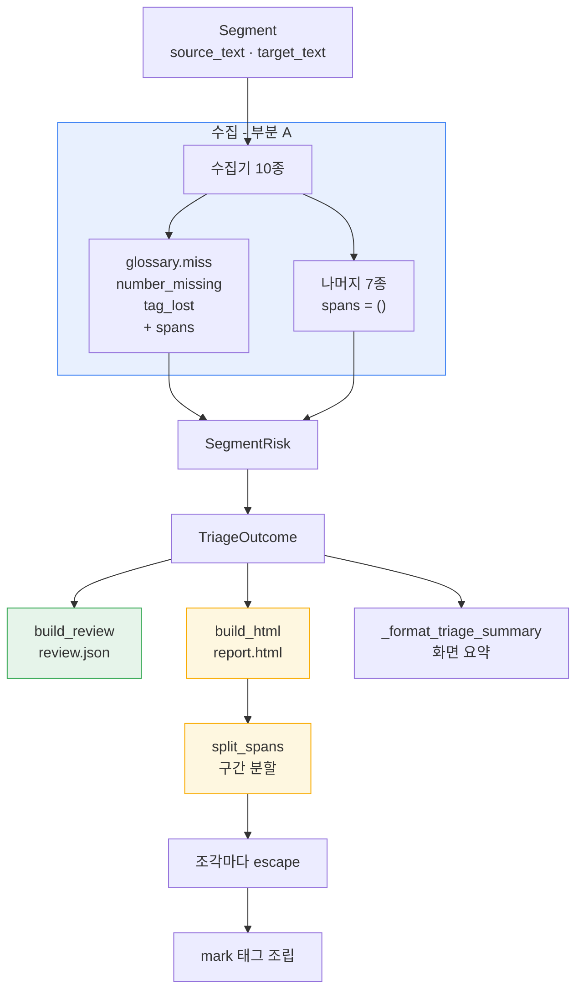

# 설계 — `report.html` 검수 리포트 (FR-7.3)

> 작업 패키지: WP5 나머지
> 선행: WP5 FR-7.2(`review.json`) · WP1 신호 엔진
> 근거 문서: [요구사항정의서](../../요구사항정의서.md) §5.7 · §7.3 · §8.4 · [WBS](../../WBS.md) WP5
> 형제 스펙: [review.json 설계](2026-08-18-review-json-design.md)

## 1. 목적과 범위

### 1.1 무엇을 만드나

FR-7.3은 **`report.html` — 검수자용 단일 파일 리포트. 원문/번역 대조, 위험 구간
하이라이트, 필터**를 必로 요구한다. 이 셋 중 **하이라이트는 입력이 없다**(§3.1).
따라서 이 작업 패키지는 렌더러 하나가 아니라 **둘**이다.

| 부분 | 무엇 | 어디 |
| --- | --- | --- |
| **A. 구간 산출** | 수집기 3종이 `Span`을 낸다 | `signals/derived.py` · `signals/structural.py` |
| **B. 렌더러** | `TriageOutcome`을 HTML로 그린다 | `report/highlight.py` · `report/html_report.py` |
| **C. 배선** | `--review-format`으로 요청한다 | `cli.py` |

표가 말하는 것은 **범위가 WP5를 넘어 WP1을 건드린다**는 사실이다. 렌더러만 만들면
FR-7.3의 세 요구 중 하나가 빈 채로 ✅가 된다.

### 1.2 범위 밖 — 명시한다

| 항목 | 왜 밖인가 |
| --- | --- |
| 나머지 신호 7종의 span | 구간 개념이 성립하지 않는다(§3.2). 세그먼트 전체가 대상이다 |
| 필터 동작의 자동 검증 | pytest가 브라우저를 띄우지 않는다. 의존성 고정(dev 3개)을 깨지 않는다(D3) |
| 정렬·페이지네이션·내보내기 | FR-7.3 본문에 없다. YAGNI |
| 전체 세그먼트 표시 | `review.json`의 D3와 같은 집합만 담는다(D4) |
| 통화 환산 비용 | NFR-2가 v0.1 범위 밖으로 돌렸다 |

## 2. 확정된 설계 결정

| # | 결정 | 무엇이 깨지는가 (이 결정이 아니면) |
| --- | --- | --- |
| **D1** | `--review-format json\|html\|both`, 기본 `json` | 새 옵션을 따로 두면 `--review-budget` 동반 가드가 2벌이 되고 조합 검증이 배로 는다. 기본값을 바꾸면 기존 실행의 산출물이 조용히 늘어난다 |
| **D2** | 필터는 hard fail 토글 + 신호별 체크박스 2축. 신호 목록은 outcome에서 뽑는다 | 하드코딩하면 신호가 추가될 때 필터에서만 빠지고, 그 사실이 화면에 안 드러난다(NFR-5) |
| **D3** | 인라인 JS + `noscript` 폴백. 파이썬은 **마크업 계약**만 검증한다 | 헤드리스 브라우저를 넣으면 dev 의존성 고정(3개)이 깨진다. 검증 못 하는 것을 검증한 척하면 게이트가 무효가 된다 |
| **D4** | 선별된 세그먼트만 담는다 | 전량을 담으면 트리아지 엔진이라는 정체성과 멀어지고, 문맥 행을 세면 검수 비율이 부풀어 §9.1 배수가 무너진다 |
| **D5** | `string.Template`으로 조립한다 | f-string은 CSS의 `{`를 전부 두 배로 쓰게 하고, 하나만 빠뜨리면 예외가 아니라 **조용히 깨진 CSS**가 나간다. `ElementTree`는 `script`·`style`의 내용을 이스케이프해 JS를 망가뜨린다(§3.5) |
| **D6** | 겹치는 span은 경계점으로 쪼개 평평하게 그린다 | 중첩 태그는 구간이 교차하면 유효한 HTML로 표현할 수 없다. 병합하면 어느 신호 때문인지가 사라져 FR-6.4가 반쪽이 된다 |
| **D7** | 이스케이프는 **분할 뒤에** 조각 단위로 건다 | `html.escape`는 길이를 바꾼다. 먼저 걸면 오프셋이 전부 어긋나고 **예외 없이** 엉뚱한 구간이 칠해진다(§6) |
| **D8** | span은 **판정하는 그 자리**에서 낸다. 렌더러가 되찾지 않는다 | `detail`의 값은 NFKC 정규화·`lower()`를 거친 것이라 원문에서 다시 찾으면 못 찾는다(§3.4) |
| **D9** | span 순서는 **매치 위치 순**이다 | `spans`는 `review.json`에 배열로 직렬화된다. 순서가 비결정적이면 같은 입력이 다른 파일을 내 NFR-3(재현성)이 깨진다. 분할(§6.2)은 경계점을 정렬하므로 순서에 무관하지만, **직렬화는 무관하지 않다**(§3.3) |
| **D10** | 전량 실패·선별 0건에도 파일을 낸다 | 파일이 없으면 소비자가 "실행이 안 됐다"와 "걸린 것이 없다"를 구분하지 못한다. `review.json`의 D8과 같은 판정이다 |

## 3. 이 설계의 근거가 된 조사

이 절의 각 항목은 **코드에서 확인한 사실**이다. 확인 명령을 함께 적는다 —
전제가 문서에서 문서로 복사되며 증폭된 것이 이 작업의 출발점이기 때문이다(§3.1).

### 3.1 `Span`을 채우는 프로덕션 코드가 하나도 없다

```bash
grep -rn "Span(" --include=*.py src/ tests/
```

결과는 **테스트 파일 두 개뿐**이다. `src/` 전체에 `Span`을 생성하는 코드가 없고,
따라서 `Signal.spans`는 언제나 `()`다.

그런데 주변 코드는 전부 값이 채워질 것을 전제한다.

| 위치 | 무엇을 하고 있나 |
| --- | --- |
| `segment/models.py:16` | 독스트링이 "리포트 하이라이트에 쓴다 (§7.3, FR-7.3)" |
| `segment/models.py:30` | `__post_init__`이 `side`를 런타임 검증한다 |
| `report/json_report.py:_signal_doc` | "`side`를 뺄 수 없다 — FR-7.3 리포트가 어느 쪽을 칠할지 가르는 유일한 판별자다" |

표가 말하는 것은 **스키마·검증·직렬화·주석이 모두 갖춰지면 "구현됐다"는 착각이
만들어진다**는 것이다. 실제로 문서 세 곳이 같은 문장으로 그 착각을 굳혔다.

| 문서 | 문장 |
| --- | --- |
| 요구사항정의서 §5.7 FR-7.3 | "하이라이트의 입력인 `signals[].spans[].side`도 §8.4에 이미 실려 있다" |
| WBS 남은 작업 순위 1 | "하이라이트의 입력인 `spans[].side`는 이미 실려 있다" |
| HANDOFF 다음 작업 | "`spans[].side`가 이미 실려 있다" |

셋 다 **참이다** — 스키마에 실려 있다. 거짓인 것은 그 문장에서 읽히는 함의,
곧 "값이 있다"이다. **파생 문서가 원문을 복사하면 검증이 아니라 증폭이 일어난다.**

### 3.2 구간 개념이 성립하는 신호는 3종이다

```bash
grep -rn 'name = "' --include=*.py src/cuesift/signals/
```

신호 10종 중 텍스트의 **일부**를 가리킬 수 있는 것은 셋뿐이다.

| 신호 | span | side | 근거 |
| --- | --- | --- | --- |
| `glossary.miss` | ✅ | `source` | 원문의 그 용어 위치. 번역문에는 **없으므로** 원문을 가리킨다 |
| `struct.number_missing` | ✅ | `source` | 원문의 그 숫자 위치. 같은 이유로 원문 |
| `struct.tag_lost` | ✅ | `source` | 원문의 그 태그 위치 |
| `spec.violation` | ❌ | — | 줄 길이·CPS 위반이라 대상이 세그먼트(또는 줄) 전체다 |
| `struct.untranslated` | ❌ | — | 번역문 전체가 원문과 같다는 판정이다 |
| `struct.empty` | ❌ | — | 번역문이 비었다. 가리킬 텍스트가 없다 |
| `struct.degeneration` | ❌ | — | 반복 붕괴. 구간이 여럿이고 경계가 임의적이다 |
| `spec.overlap` | ❌ | — | 타임코드 겹침이라 텍스트 구간이 아니다 |
| `length.ratio` | ❌ | — | 비율은 위치를 갖지 않는다 |
| `llm.self_consistency` | ❌ | — | 샘플 간 불일치. 특정 구간에 귀속되지 않는다 |

표가 말하는 것은 **"span이 없음"이 결함이 아니라 그 신호의 성질**이라는 것이다.
렌더러는 `spans`가 비면 세그먼트 전체를 신호 배지로만 표시한다 — 빈 것과
아직 안 만든 것을 구분할 필요가 없다.

### 3.3 판정 규칙이 이미 위치를 알고 있다

세 수집기 모두 **정규식 매치로 판정**하므로, 매치 객체가 이미 오프셋을 갖고 있다.
버리고 있을 뿐이다.

| 신호 | 현재 | span 산출 |
| --- | --- | --- |
| `glossary.miss` | `_contains_term()`이 `re.search(...) is not None` | `re.finditer`로 바꾸면 `m.start()`·`m.end()` |
| `struct.number_missing` | `_numbers()`가 `_NUMBER.finditer(text)`를 이미 돈다 | 같은 루프에서 오프셋을 함께 낸다 |
| `struct.tag_lost` | `_tag_names()`가 `_TAG.finditer(text)`를 이미 돈다 | 같은 루프에서 오프셋을 함께 낸다 |

**판정과 위치가 같은 함수에서 나오는 것이 D8의 실질이다.** 규칙이 갈리면
`terms_in()` 독스트링이 경고한 것과 같은 사고가 난다 — "규칙이 갈리면 프롬프트에
넣은 용어와 위반으로 잡는 용어가 어긋난다".

**순서가 다르다는 점에 유의한다**(D9). `terms_in()`은 재현성(NFR-3)을 위해
**등재 순**으로 반환하고 그 이유를 독스트링에 적어 두었다. span은 **위치 순**으로 낸다.

**두 순서가 같은 목적을 서로 다른 방법으로 이룬다.** `terms_in()`은 배치 내용이
달라져도 상대 순서가 흔들리지 않도록 등재 순을 골랐고, span은 텍스트 안의 위치가
이미 결정론적이라 위치 순으로 족하다. 분할(§6.2)은 경계점을 정렬하므로 입력 순서에
무관하지만, `review.json`에 실리는 **배열 순서는 무관하지 않다** — 같은 입력이
다른 파일을 내면 안 된다. 두 순서를 같은 것으로 취급하는 코드를 쓰지 않는다.

### 3.4 `detail`의 값으로는 위치를 되찾을 수 없다

D8의 대안(렌더러가 `detail`의 값을 원문에서 다시 찾는다)을 실제로 검토했고,
**두 수집기에서 확실히 실패한다**는 것을 확인했다.

| 신호 | `detail` | 원문 | 되찾기 |
| --- | --- | --- | --- |
| `struct.number_missing` | `{"missing": ["50"]}` | `５０` (전각) | ❌ `_numbers()`가 **추출 후 NFKC 정규화**한다. `find("50")`은 `-1` |
| `struct.number_missing` | `{"missing": ["1000"]}` | `1,000` | ❌ 천 단위 구분자를 제거한 값이다 |
| `glossary.miss` | `{"terms": ["OpenSource"]}` | `opensource` | ❌ 판정은 `lower()`한 문자열에서 했다 |
| `struct.tag_lost` | `{"source": {"i": 1}}` | `<i>` | ❌ 태그 **이름의 개수**만 있다. 원문 표기가 없다 |

표가 말하는 것은 **되찾기가 조용히 실패한다**는 것이다 — `find()`가 `-1`을 내면
그 구간만 안 칠해지고 예외는 나지 않는다. 검수자는 하이라이트가 없는 것을
"문제 없음"으로 읽는다. hard fail 신호에서 이것은 미탐이 아니라 **오해**다.

### 3.5 `ElementTree`가 실격인 이유

HTML 명세에서 `script`·`style`은 raw text 요소라 내용이 이스케이프되지 **않아야**
한다. `xml.etree.ElementTree`는 XML 규칙을 적용해 `<`·`&`를 실체 참조로 바꾼다.
결과는 JS 문법 오류이고 **필터 전체가 죽는다.** 이스케이프가 안전한 곳에서
정확히 반대로 동작하는 것이 이 도구의 함정이다.

### 3.6 자막에는 태그가 실제로 들어온다

`struct.tag_lost`가 존재하고 `_TAG` 정규식이 `[a-zA-Z][a-zA-Z0-9]*`를 잡는다는
사실 자체가 "원문에 `<i>`·`<b>`가 들어온다"는 증거다. 따라서 §6의 이스케이프
순서는 이론적 우려가 아니라 **기본 경로**다. 태그 없는 텍스트로만 테스트하면
D7 위반은 끝까지 드러나지 않는다.

## 4. 실행 흐름



도식이 말하는 것은 **세 산출물이 같은 `TriageOutcome`에서 갈라진다**는 것이다.
`build_review`는 이 작업에서 **한 줄도 바뀌지 않는다** — 수집기가 span을 내기
시작하면 `review.json`의 `spans`도 함께 살아난다. 손댈 곳이 없다는 사실이
두 산출물이 한 원천에서 나온다는 증거다.

## 5. CLI 표면

### 5.1 옵션

```console
$ cuesift translate 입력.srt --target en \
    --review-budget 10% \
    --review-out out/ \
    --review-format html
```

| 값 | `review.json` | `report.html` |
| --- | --- | --- |
| `json` (기본) | ✅ | — |
| `html` | — | ✅ |
| `both` | ✅ | ✅ |

기본값이 `json`이므로 **기존 실행의 산출물은 변하지 않는다.**

### 5.2 가드는 늘지 않는다

`--review-format`은 `--review-out`의 하위 옵션이다. 따라서 기존 가드
(`--review-out`은 `--review-budget` 또는 `--review-threshold`와 함께 써야 한다,
`cli.py:719`)가 그대로 유효하고, 새 조합 규칙은 **하나만** 추가된다.

| 상황 | 판정 |
| --- | --- |
| `--review-format`만 있고 `--review-out`이 없다 | 종료 코드 2 — 낼 곳이 없다 |
| `--review-format`에 세 값 밖의 문자열 | typer의 `Enum` 검증이 종료 코드 2로 처리한다 |

### 5.3 파일명

`_review_path`와 **같은 stem 규칙**을 쓰고 접미어만 다르다.

| 산출물 | 파일명 |
| --- | --- |
| `review.json` | `{stem}.{target}.review.json` |
| `report.html` | `{stem}.{target}.report.html` |

**규칙을 함께 두는 것이 요점이다.** 갈라지면 같은 입력이 `ep01.en.review.json`과
`ep01.ko.en.report.html`을 내 짝을 눈으로 못 맞춘다 — `_review_path` 독스트링이
이미 같은 사고를 기록하고 있다.

## 6. 하이라이트 조립 — 순서가 정답을 정한다

### 6.1 이스케이프는 분할 뒤에 (D7)

```text
원문:  He said <i>2024</i> loudly
                   ^^^^  number_missing [12, 16)

✗ 틀린 순서                          ✓ 맞는 순서
  1. html.escape                       1. split_spans(원본, spans)
     "He said &lt;i&gt;2024..."           ["He said <i>", "2024", "</i> loudly"]
  2. 오프셋 [12,16)으로 분할           2. 조각마다 html.escape
     → "&gt;20"을 칠한다                  ["He said &lt;i&gt;", "2024", ...]
                                        3. mark로 감싼다

  escape가 1자를 4자로 바꿔            오프셋은 원본 기준으로만 유효하다
  오프셋이 전부 어긋난다
```

**예외가 나지 않는다는 점이 이 함정의 핵심이다.** 어긋난 오프셋은 여전히
유효한 문자열 슬라이스라 조용히 잘못된 구간이 칠해진다.

### 6.2 겹침은 경계점으로 쪼갠다 (D6)

```text
원문:  2024년 백서를 보면
       0    4    8

  number_missing [0, 4)
  glossary.miss  [0, 8)

경계점 = 정렬된 {0, 4, 8, len} → 조각 [0,4) [4,8) [8,len)

조각      덮는 신호                            결과
[0,4)     number_missing, glossary.miss        mark 2종 표시
[4,8)     glossary.miss                        mark 1종 표시
[8,len)   없음                                 평문
```

교차 구간(`A=[0,5)`, `B=[3,8)`)도 같은 알고리즘이 처리한다 — 중첩으로는
유효한 HTML을 만들 수 없지만 분할은 언제나 평평하다.

### 6.3 `split_spans`는 HTML을 모른다

순수 함수로 분리한다. 입력은 원본 문자열과 `Span` 목록, 출력은
`(텍스트 조각, 그 조각을 덮는 신호 이름들)`의 리스트다.

**HTML을 모르는 이유는 테스트 때문이다.** 겹침·교차·인접·빈 구간·경계값을
문자열 조립 없이 직접 단언할 수 있다. `html_report.py`에 섞으면 알고리즘 버그와
마크업 버그가 같은 실패로 보인다.

## 7. 코드 구조

```text
src/cuesift/
├─ segment/models.py         Span                    무변경
├─ signals/
│  ├─ derived.py             GlossaryMiss            + spans      ← A
│  └─ structural.py          NumberMissing           + spans      ← A
│                            TagLost                 + spans      ← A
├─ glossary/__init__.py      위치를 내는 매칭 함수    신규         ← A
└─ report/
   ├─ models.py              TriageOutcome           무변경
   ├─ json_report.py         build_review            무변경 ★
   ├─ highlight.py           split_spans()           신규         ← B
   └─ html_report.py         build_html()            신규         ← B
                             write_html()

src/cuesift/cli.py           --review-format · _report_path · 쓰기 분기  ← C
```

★ `json_report.py`가 무변경인 것이 설계의 확인 지점이다(§4).

### 7.1 `report/highlight.py`

`split_spans(text, spans)` 하나. HTML도 신호도 모르고 문자열과 구간만 안다.
`side`로 거르는 것은 호출자의 몫이다 — 원문용과 번역문용을 각각 부른다.

### 7.2 `report/html_report.py`

`string.Template` 상수(셸·행·조각)와 조립 함수. 템플릿을 **별도 `.html` 자산으로
빼지 않는다** — `specs/*.yaml`과 달리 사용자가 편집할 물건이 아니고, 자산으로
빼면 `[tool.hatch.build.targets.wheel.force-include]`를 건드려 **휠에서만 누락되는**
실패를 새로 만든다.

### 7.3 신호 이름은 CSS 클래스가 될 수 없다

신호 이름은 전부 점을 포함한다(`spec.violation`·`length.ratio`·…).
CSS에서 `.spec.violation`은 "클래스 `spec`과 클래스 `violation`을 동시에 가진 요소"로
파싱되므로, `spec.overlap`을 가진 행이 `spec.violation` 필터에 잡힌다.
따라서 **`data-` 속성에 공백으로 구분해 싣고 JS가 문자열로 비교한다.**

## 8. 오류 처리와 종료 코드

`write_review`의 그물을 그대로 따른다.

| 예외 | 종료 코드 | 뜻 |
| --- | --- | --- |
| `OSError` | 66 | 디스크·경로의 문제다. 사용자가 고칠 수 있다 |
| 그 밖의 `Exception` | 70 | 우리 코드가 틀렸다 |

`json.dumps`가 없으므로 실패 종류가 다르다 — `Template.substitute`의 `KeyError`,
`write_text`의 `UnicodeEncodeError`(서로게이트). 넓은 `except`가 필요한 이유는
`json_report.py`와 같다: **실패 집합이 열려 있어 테스트로 완결할 수 없다.**

**exit 1이 최악인 이유도 같다.** 이 CLI에서 1은 "규격 위반 발견 또는 번역 일부
실패"라, 번역 실패가 함께 있는 실행에서는 정상 종료와 종료 코드가 구분되지 않는다.

## 9. FR 대응

| FR | 본문 | 이 설계가 닫는가 |
| --- | --- | --- |
| **FR-7.3** | `report.html` — 검수자용 단일 파일 리포트 | ✅ 셋을 모두 낸다 |
| ├ 원문/번역 대조 | | ✅ 행마다 원문·번역을 나란히 |
| ├ 위험 구간 하이라이트 | | ✅ 부분 A가 입력을 만든다. 3종 신호에서 구간이, 나머지에서 배지가 |
| └ 필터 | | ✅ hard fail 토글 + 신호별 체크박스(D2) |
| FR-6.4 | 설명가능성 | 실질 강화 — `reasons`가 텍스트의 **어디**인지까지 간다 |
| FR-7.2 | `review.json` | 부수 효과로 `spans`가 채워진다. 코드 변경 없음 |
| FR-7.4 | 요약 통계 | 같은 `TriageOutcome`을 읽어 화면·JSON과 수치가 일치한다 |

## 10. 테스트 전략

### 10.1 최우선 게이트 — 이스케이프 순서 (D7)

**태그를 포함한 원문**으로 건다. §3.6이 근거다.

| 입력 | 기대 |
| --- | --- |
| 원문에 `<i>`가 있고 그 뒤 구간에 span | 하이라이트가 **의도한 문자**를 감싼다 |
| 원문에 `<script>` | 출력에 실행 가능한 태그가 없다 |

**이 테스트는 먼저 실패시켜 확인한다.** 이스케이프를 분할 앞으로 옮긴 버전에서
실제로 깨지는 것을 본 뒤에야 회귀 테스트다 — 리포 규율("게이트를 만들면 반드시
실패시켜 봐야 한다").

### 10.2 두 번째 게이트 — 구간 분할 (D6)

`split_spans`를 순수 함수로 직접 단언한다.

| 케이스 | 확인 |
| --- | --- |
| 겹침(포함) | 조각 3개, 안쪽 조각이 신호 2종 |
| 교차 | 조각 3개, 중간 조각이 신호 2종 |
| 인접(`[0,4)` `[4,8)`) | 조각이 합쳐지지 않는다 |
| 빈 구간(`start == end`) | 조각을 만들지 않는다 |
| 경계(`end == len(text)`) | 꼬리 조각이 생기지 않는다 |
| span 없음 | 조각 1개, 신호 0종 |

### 10.3 세 번째 게이트 — span 오프셋 (부분 A)

수집기 3종이 **정확한 오프셋**을 내는지 원문과 함께 단언한다. CJK·전각 숫자·
천 단위 구분자·대소문자 차이를 반드시 포함한다 — §3.4의 네 경우가 그대로
테스트 데이터다.

`glossary.miss`는 `lower()`한 문자열에서 판정하므로 **길이 보존을 확인한다.**
대부분의 문자에서 `lower()`는 길이를 보존하지만 예외가 있다(`'İ'.lower()`는 2자).
ko→en/ja에서 드물지만, 오프셋이 원본 기준임을 테스트로 못 박는다.

### 10.4 마크업 계약 (D3)

파이썬이 보장하는 것은 여기까지다.

| 확인 | 수단 |
| --- | --- |
| 행 개수 == `selected` 개수 | 문자열 카운트 |
| `data-signals`가 outcome의 신호 집합과 일치 | 행마다 대조 |
| `data-hardfail`이 `risk.hard_fail`과 일치 | 행마다 대조 |
| 필터 체크박스가 **등장한 신호만큼** 있다 | outcome에서 뽑았음을 확인 |
| `noscript` 폴백이 존재한다 | 문자열 포함 |

### 10.5 CLI (부분 C)

`--review-format` 3값 × 산출 파일 조합, `--review-out` 없이 쓴 경우의 종료 코드 2,
전량 실패·선별 0건에도 파일이 나오는지(D10).

### 10.6 검증하지 않는 것 — 명시한다

**필터의 동작은 자동 게이트가 없다.** 체크박스를 눌렀을 때 행이 숨는지, 카운터가
갱신되는지는 pytest가 확인하지 못한다. live 1회 실물 확인으로 대신하고
그 사실을 계획서의 완료 판정에 적는다.

이 문단이 이 설계에서 가장 정직해야 할 곳이다 — 리포 규율은 "검사하지 않고
통과하는 게이트는 없는 게이트보다 나쁘다"이므로, **검사하지 않는 것을
검사한다고 적지 않는다.**

## 11. 완료 판정

| # | 조건 | 확인 |
| --- | --- | --- |
| 1 | 수집기 3종이 span을 낸다 | 오프셋 단언 통과 |
| 2 | `review.json`의 `spans`가 채워진다 | 기존 테스트 + 새 단언. `json_report.py` 변경 0줄 |
| 3 | `--review-format html`이 파일을 낸다 | CLI 테스트 |
| 4 | 태그가 있는 원문에서 하이라이트가 어긋나지 않는다 | §10.1 |
| 5 | 필터가 실제로 동작한다 | **live 1회 실물 확인** — 자동 게이트 없음 |
| 6 | 로컬 게이트 5종 통과 | CLAUDE.md의 명령 그대로. 수집 개수를 읽는다 |
| 7 | CI 3잡 통과 | PR 경유. `gh pr checks` |

### 11.1 게이트 수치를 읽는다

"통과했나"가 아니라 "무엇을 대상으로 통과했나"를 본다. 착수 전 기준선:

```bash
.venv/Scripts/python.exe -m pytest --cov=cuesift --cov-report=term-missing
```

착수 시점 실측(2026-08-27):

| 환경 | 결과 | 커버리지 |
| --- | --- | --- |
| 로컬 (venv 3.14) | **1270 passed · 3 deselected** | 99% — 2013 문장 중 23 미도달 |
| CI (3.11 · 3.12) | **1269 passed · 1 skipped** | — |

**두 수치가 다른 것이 정상이다.** `data/`가 gitignore라 bench 테스트 1건이
CI에서만 skip된다 — 로컬에서 passed로 세어지는 그 1건이 차이의 전부다.
`passed`만 비교하면 "1건이 사라졌다"로 잘못 읽힌다. 문서 게이트도 같은 종류의
함정을 갖는다(§11.2).

### 11.2 새 문서는 `git add` 전에는 링크 검사를 받지 않는다

**이 스펙을 쓰면서 실제로 겪었다.** 두 문서 게이트가 대상을 다르게 고른다.

| 게이트 | 대상 | 새 파일을 보는 시점 |
| --- | --- | --- |
| markdownlint | `gitignore` 규칙에 걸리지 않는 모든 `.md` | **즉시** |
| `scripts/check_links.py` | `git ls-files` — **추적 중인** 파일 | `git add` 이후 |

실측: 스펙을 쓴 직후 markdownlint는 32개, 링크 체커는 31개를 셌다.
`git add` 후 링크 체커도 32개가 되며 링크 152 → 155개로 늘었다.

**`깨진 링크 없음`만 읽으면 통과로 보인다.** 새 문서의 링크가 하나도 검사되지
않은 상태인데도 그렇다. 그래서 문서를 추가하는 태스크는 **`git add` 뒤에**
링크 체커를 돌리고 **파일 개수와 링크 개수를 모두** 읽는다.

이것은 `scripts/check_links.py`의 결함이 아니다 — 독스트링이 "markdownlint가
`gitignore: true`로 보는 집합과 일치시켜"라고 적은 의도대로 동작한다.
두 집합은 파일이 추적되는 순간부터 일치한다. **어긋나는 것은 그 사이의 창이다.**

## 12. 문서 정정 — 이 작업에 포함된다

§3.1이 발견한 것을 세 문서에서 함께 고친다. 한쪽만 고치면 다시 갈라진다.

| 문서 | 무엇 |
| --- | --- |
| `docs/요구사항정의서.md` §5.7 | FR-7.3 ⬜ → ✅. "spans가 이미 실려 있다"의 함의를 바로잡는다 |
| `docs/WBS.md` | WP5 🟡 → ✅. 완료 개수 34 → 35. 남은 작업 순위에서 1순위 제거 |
| `HANDOFF.md` | 다음 작업을 WP6 나머지(FR-8.3~8.5)로 |
| `CHANGELOG.md` | Keep a Changelog 형식 |

**`Span`이 비어 있었다는 사실 자체를 기록한다.** 스키마가 갖춰진 것과 값이 있는
것의 차이를 다음 사람이 다시 겪지 않게 한다.

## 13. 남는 것

| 항목 | 왜 남기나 |
| --- | --- |
| 나머지 7종의 세그먼트 단위 표시 | 구간이 아니라 배지로 충분하다(§3.2). 요구가 생기면 그때 |
| 필터 동작의 자동 검증 | 의존성 고정을 깨야 한다. 별도 판단이 필요하다 |
| 여러 언어를 한 파일에 | FR-7.3이 요구하지 않는다. 파일이 언어마다 나온다 |
| 정렬·검색 | YAGNI. 목록이 `risk_score` 내림차순이고 브라우저 검색이 있다 |
