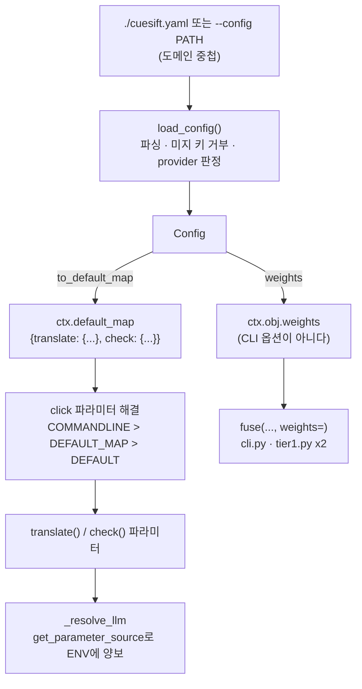

# 설계 — 설정 파일 `cuesift.yaml` (FR-8.4)

> 작업 패키지: WP6 나머지 중 FR-8.4
> 선행: WP6 FR-8.1·8.2(CLI 표면) · WP1 `risk/fuse.py` · WP8a `tier1.py`
> 근거 문서: [요구사항정의서](../../요구사항정의서.md) §5.8 FR-8.4 · §8.2 · §6.1 · §4.3 · [WBS](../../WBS.md) WP6
> 형제 스펙: [check CLI 설계](2026-08-03-check-cli-design.md) (D12에서 `--config`를 경고 후 무시로 열어 두었다)

## 1. 목적과 범위

### 1.1 무엇을 만드나

FR-8.4는 **"설정 파일(`cuesift.yaml`)로 모든 옵션을 지정할 수 있고, CLI 인자가 우선한다"** 를 必로 요구한다.

문장이 짧지만 요구는 셋이다.

| 부분 | 무엇 | 어디 |
| --- | --- | --- |
| **A. 로더** | YAML을 읽고 검증한다 | `config/loader.py` · `config/schema.py` |
| **B. 우선순위** | CLI 인자가 설정 파일을 이긴다 | `cli.py` 콜백 (`ctx.default_map`) |
| **C. 비(非)옵션 통로** | `signals.weights`를 `fuse()`에 내려보낸다 | `cli.py` · `tier1.py` |

**C가 있는 이유는 `signals.weights`가 CLI 옵션이 아니기 때문이다.** 요구사항정의서 §8.2가 그것을 설정 파일 스키마에 넣어 두었고, [FR-6.1](../../요구사항정의서.md)의 "**설정 가능한** 가중치"가 기다리는 자리가 정확히 거기다. A·B만 만들면 FR-8.4는 닫히지만 FR-6.1의 빈칸은 그대로 남는다.

### 1.2 이 작업이 함께 닫는 것

| FR | 현재 | 무엇이 비어 있었나 |
| --- | --- | --- |
| **FR-6.1** | ✅ (축 2 결손) | "가중치를 사용자가 설정하는 통로는 아직 없다 — §8.2 `cuesift.yaml`의 `signals.weights`가 그 자리이고 FR-8.4(미구현)의 몫이다" |
| **FR-4.3** | ✅ (축 2 결손) | "§8.2 설정 파일의 `signals.tier1.max_ratio`는 여전히 미구현이다" |

**둘 다 이미 ✅라 완료 개수는 늘지 않는다.** 그럼에도 적어 두는 이유는 요구사항정의서가 두 곳에서 이 작업을 명시적으로 지목하고 있어, FR-8.4를 닫으면서 그 문장들을 함께 갱신하지 않으면 문서가 갈라지기 때문이다.

### 1.3 범위 밖 — 명시한다

| 항목 | 왜 밖인가 |
| --- | --- |
| `transcribe` 배선 (FR-8.3) | STT 어댑터(WP9)가 없다. 설정 표에는 `source_lang` 한 칸만 잡아 둔다 |
| 진행 표시·CI 감지 (FR-8.5) | 독립 FR이다. 되돌리기 단위를 섞지 않는다 |
| 상위 디렉터리 탐색 | D2 참고. 사용자가 모르는 상위 파일이 검수 기준을 바꾸는 것을 막는다 |
| 설정 파일 생성 명령 (`cuesift init`) | FR-8.4 본문에 없다. YAGNI |
| 환경변수로 설정 파일 경로 지정 | 우선순위 층이 하나 더 늘고, 그 층을 요구한 FR이 없다 |
| 프로파일 디렉터리(`spec.profiles_dir`) | CLI에 대응 개념이 없다. D11 참고 |

## 2. 확정된 설계 결정

| # | 결정 | 무엇이 깨지는가 (이 결정이 아니면) |
| --- | --- | --- |
| **D1** | 우선순위 해결을 `ctx.default_map`에 위임한다. 병합 코드를 쓰지 않는다 | 손으로 짜려면 22개 옵션의 기본값을 전부 `None` 센티널로 옮겨야 하고, 그러면 `--help`의 기본값 표시가 사라진다. `--help` 출력은 이 리포에서 **CI에서만 깨진 전례**(`FORCE_COLOR`)가 있는 자리다 |
| **D2** | 자동 탐색은 현재 디렉터리 `./cuesift.yaml` **한 칸**뿐이다 | 상위로 올라가면 사용자가 존재를 모르는 파일이 검수 기준을 바꾼다. hard fail 임계와 가중치가 실린 파일에서 그것은 Recall@Budget 수치를 조용히 오염시킨다 |
| **D3** | 우선순위는 **CLI > 환경변수 > 설정 파일 > 기본값** | `cli.py`의 `_resolve_llm` 독스트링이 이미 이 순서를 선언했다. 뒤집으면 선언과 동작이 갈리고, 갈린 쪽은 주석이라 아무도 검사하지 않는다 |
| **D4** | 모르는 키는 **종료 코드 2로 거부**한다. 가까운 키를 함께 제시한다 | `revew_budget` 오타 하나가 조용히 무시되면 사용자는 예산 10%로 검수됐다고 믿는데 트리아지가 아예 안 돈다. 종료 코드는 0이다 — 이 리포가 1급으로 금지한 "검사하지 않고 통과하는 게이트" |
| **D5** | 타입 변환과 값 검증은 **click에 맡긴다.** 로더가 판정하는 값은 `llm.provider` 하나뿐 | 로더가 따로 검증하면 같은 규칙이 두 곳에 생기고 반드시 갈린다. click은 `default_map` 값도 파라미터 타입으로 변환·검증한다(§3 실측) |
| **D6** | `signals.weights`는 `default_map`이 아니라 `ctx.obj`로 간다. `--weights` 플래그를 만들지 않는다 | 10개 실수를 명령줄에 쓰는 것은 쓸모가 없다. 플래그를 만들면 "설정 파일 전용 값"이라는 범주가 사라져 v0.2의 QE 가중치도 갈 곳이 없어진다 |
| **D7** | 설정을 적용하면 **출처 한 줄을 stderr에 낸다** | click의 오류 메시지가 `Invalid value for '--review-format'`이라 `--review-format`을 친 적 없는 사용자가 명령줄을 노려보게 된다. 출처 줄이 그 오진을 막는다. 자동 탐색(D2)이 있으면 특히 필요하다 |
| **D8** | YAML은 **도메인 중첩**을 유지하고 로더가 커맨드 중첩으로 접는다 | 커맨드 중첩으로 가면 §8.2를 다시 쓰고 사용자가 CLI 내부 구조를 알아야 한다. `spec` 같은 공통 값을 `translate`와 `check`에 두 번 쓰게 된다 |
| **D9** | `signals.weights`의 키는 **실제 신호 이름 10종**이다 | §8.2의 축약명 4개(`spec`·`glossary`·`length_ratio`·`consistency`)는 `struct.*` 5종을 아예 못 가리킨다. 그리고 `review.json`의 `signals[].name`이 실제 이름을 내므로, 축약명을 쓰면 사용자가 리포트와 설정에서 서로 다른 어휘를 배워야 한다 |
| **D10** | 설정 파일 오류의 종료 코드는 **2**다 (66이 아니다) | `--spec`의 선례가 2다 — `_resolve_profile`이 YAML 문법 오류까지 `typer.BadParameter`로 낸다. 설정 파일은 명령줄의 연장이다 |
| **D11** | `spec.profiles_dir` 대신 `spec.profile`을 쓴다 | `--spec`은 내장 이름(`ko`) 또는 파일 경로를 받지 디렉터리를 받지 않는다. 디렉터리 개념을 새로 만들면 FR-5.3의 확장자 라우팅(`_resolve_profile`)이 세 번째 분기를 갖게 된다 |
| **D12** | `cache.enabled`는 **긍정형**이고 로더가 `no_cache`로 뒤집는다 | `no_cache: false`는 이중부정이라 YAML을 읽는 사람이 매번 되짚어야 한다. 설정 파일은 사람이 손으로 쓰고 오래 남는 문서다 |
| **D13** | 위치인자(`input`)는 설정 대상이 아니다 | 실행마다 다른 입력 파일을 설정에 박으면 다른 파일을 검수하고도 통과한다. `default_map`은 인자에도 먹으므로 **명시적으로 빼야** 한다 |

## 3. 착수 조사 — 실측

**"click이 해 줄 것이다"는 근거가 아니다.** 설계를 세우기 전에 폐기용 탐침 4개로 확인했다. typer 0.27은 click을 `typer._click`으로 벤더링했고 외부 `click` 패키지가 설치돼 있지 않다 — 이 사실 자체가 문서만 읽어서는 알 수 없었다.

| # | 물음 | 실측 |
| --- | --- | --- |
| **P1** | `ctx.default_map`이 서브커맨드 파라미터에 먹는가 | ✅ 먹는다. `get_parameter_source()`가 `DEFAULT` / `DEFAULT_MAP` / `COMMANDLINE`을 구분한다 |
| **P2** | CLI 인자가 `default_map`을 이기는가 | ✅ 파라미터 **단위로** 이긴다. 한 명령에서 `--context-window`는 CLI가, `source_lang`은 설정이 이겼다 |
| **P3** | `default_map`이 **필수** 옵션을 만족시키는가 | ✅ 만족시킨다. `--to` 없이 통과했고 `Missing option '--to'`가 나오지 않았다 |
| **P4** | `default_map` 값이 `Path`·`Enum`·`bool`·`float`로 변환되는가 | ✅ 변환하고 **검증까지** 한다. `"./x/y"`→`WindowsPath`, `"html"`→`ReviewFormat.HTML`. 틀린 값 `"xml"`은 `Invalid value for '--fmt'`와 **종료 코드 2**(실측) |

**P4가 설계를 가장 많이 줄였다.** 22개 옵션의 타입 변환·범위 검증 코드가 통째로 필요 없어졌고(D5), 검증 규칙이 CLI와 설정 파일에서 갈릴 자리도 함께 사라졌다.

**P3이 없었다면 `--to`·`--spec`을 선택 인자로 바꾸는 파괴적 변경이 필요했다.** 그 경우 설정 없이 실행한 사용자가 `Missing option`(2) 대신 실행 도중의 다른 오류를 만나게 된다.

## 4. 구조

### 4.1 모듈 경계

`cli.py`는 이미 2697줄이다. `spec/`·`glossary/`·`report/`와 같은 형태로 패키지를 분리한다.

```text
src/cuesift/config/
  __init__.py   공개 API — load_config(path) -> Config, Config.to_default_map()
  schema.py     허용 키 트리 + 도메인->파라미터 매핑표 (단일 출처)
  loader.py     YAML 읽기 · 미지 키 거부 · llm.provider 판정 · ValueError 정규화
```

**`schema.py`의 매핑표가 단일 출처인 것이 이 구조의 핵심이다.** 허용 키 목록과 매핑표를 따로 두면 "허용은 되는데 아무 데도 가지 않는 키"가 생기고, 그것은 조용히 무시되는 설정이라 D4가 막으려는 것과 같은 결함이다. 허용 키는 매핑표에서 **파생**시킨다.

### 4.2 데이터 흐름



**갈래가 둘인 것이 이 그림의 요점이다.** 왼쪽은 click이 해 주고, 오른쪽은 손으로 내려보내야 한다.

### 4.3 확인된 함정 셋

**① 환경변수 우선순위가 조용히 뒤집힌다.**

`cli.py`의 `_resolve_llm`이 이렇게 돼 있다.

```python
resolved_base = base_url or os.environ.get("CUESIFT_BASE_URL")
```

`default_map`이 `base_url`을 채우면 그 값이 `or`의 왼쪽에서 참이 되어 **환경변수를 이긴다.** 그러나 D3이 정한 순서는 `CLI > ENV > 설정 파일`이다. 해법은 `ctx.get_parameter_source("base_url")`이 `DEFAULT_MAP`이면 환경변수에 양보하는 것이다.

**이 결함은 테스트 없이 절대 드러나지 않는다** — 어느 쪽이 이기든 값은 나오고 종료 코드는 0이다.

**② `fuse()` 호출부가 셋인데 전부 `weights=`를 넘기지 않는다.**

| 위치 | 무엇 |
| --- | --- |
| `cli.py:2319` | Tier 0만 도는 기본 경로 |
| `tier1.py:241` | Tier 1 후보 선별 전 점수 |
| `tier1.py:303` | Tier 1 신호를 더한 **재점수** |

`tier1.py`의 둘을 빼먹으면 `--tier1` 유무로 순위가 달라진다. 더 나쁜 것은 `:303`이다 — 사용자 가중치로 고른 후보를 기본 가중치로 다시 세우게 되어, **가중치를 설정한 사용자에게만** 결과가 어긋난다.

**③ `--config`의 help 텍스트와 경고문이 거짓이 된다.**

지금은 "아직 구현되지 않아 지정해도 무시됩니다"이고 실행하면 경고가 나간다(설계 D12, `2026-08-03-check-cli-design.md`). 구현의 마지막 단계는 그 둘을 지우는 것이다. 남겨 두면 이번에는 **반대 방향의 거짓말**이 된다.

## 5. 매핑표 — YAML 24행 → 파라미터 22개

위치인자 `input` 2개는 제외한다(D13).

| # | YAML 경로 | 커맨드·파라미터 | 변환 | §8.2 |
| --- | --- | --- | --- | --- |
| 1 | `source_lang` | `translate.source_lang` · `transcribe.source_lang` | 그대로 (**두 곳에 뿌린다**) | 있음 |
| 2 | `targets` | `translate.to` | **list → `"en,ja"`** | 있음 |
| 3 | `llm.provider` | — | **값 검증만** (`openai-compatible` 외 거부) | 있음 |
| 4 | `llm.base_url` | `translate.base_url` | 그대로 | 신규 |
| 5 | `llm.model` | `translate.model` | 그대로 | 있음 |
| 6 | `llm.context_window` | `translate.context_window` | 그대로 | 있음 |
| 7 | `glossary` | `translate.glossary` | click이 `Path`로 | 신규 |
| 8 | `work_context` | `translate.work_context` | 그대로 | 신규 |
| 9 | `output.dir` | `translate.out` | click이 `Path`로 | 신규 |
| 10 | `cache.dir` | `translate.cache_dir` | click이 `Path`로 | 신규 |
| 11 | `cache.enabled` | `translate.no_cache` | **부정 반전** (`not enabled`) | 신규 |
| 12 | `dry_run` | `translate.dry_run` | 그대로 | 신규 |
| 13 | `signals.tier1.enabled` | `translate.tier1` | 그대로 | 있음 |
| 14 | `signals.tier1.max_ratio` | `translate.tier1_max_ratio` | 그대로 | 있음 |
| 15 | `signals.tier1.samples` | `translate.tier1_samples` | 그대로 | **개명** (`consistency_n`) |
| 16 | `signals.tier1.temperature` | `translate.tier1_temperature` | 그대로 | 신규 |
| 17 | `signals.weights.*` | **(파라미터 아님)** | `ctx.obj` → `fuse(weights=)` x3 | **키 이름 교체** |
| 18 | `triage.review_budget` | `translate.review_budget` | 그대로 | 있음 |
| 19 | `triage.review_threshold` | `translate.review_threshold` | 그대로 | **개명** (`risk_threshold`) |
| 20 | `review.out` | `translate.review_out` | click이 `Path`로 | 신규 |
| 21 | `review.format` | `translate.review_format` | click이 `ReviewFormat`으로 | 신규 |
| 22 | `spec.profile` | `check.spec` | 그대로 (필수 옵션 충족) | **대체** (`profiles_dir`) |
| 23 | `spec.fail_on` | `check.fail_on` | click이 `FailOn`으로 | 신규 |
| 24 | `spec.limit` | `check.limit` | 그대로 | 신규 |

**변환 로직이 있는 행은 셋뿐이다** — 2(list→쉼표), 11(부정 반전), 17(별도 경로). 나머지 21행은 이름을 옮기는 것이므로 `schema.py`가 표 하나로 끝난다.

### 5.1 `signals.weights`의 키 10종

`risk/fuse.py`의 `DEFAULT_WEIGHTS`와 **같은 집합이다.**

`struct.untranslated` · `struct.empty` · `struct.degeneration` · `struct.number_missing` · `struct.tag_lost` · `spec.violation` · `spec.overlap` · `glossary.miss` · `length.ratio` · `llm.self_consistency`

**부분 지정을 허용한다.** 명시하지 않은 신호는 `DEFAULT_WEIGHTS`의 1.0을 유지한다 — `_FALLBACK_WEIGHT`가 이미 그 성질을 갖고 있고, 전량 지정을 요구하면 v0.2에서 신호가 하나 늘 때 기존 설정 파일이 전부 거부된다(FR-6.5).

**값 검증은 `fuse()`가 한다.** 음수·NaN·inf는 이미 거기서 막힌다(`fuse.py:61`). 로더가 다시 검사하면 규칙이 두 곳이 된다(D5와 같은 이유).

## 6. 오류 처리와 종료 코드

| 상황 | 코드 | 근거 |
| --- | --- | --- |
| `./cuesift.yaml` 없음 (자동 탐색) | — | **정상.** 조용히 넘어간다 |
| `--config PATH`인데 파일 없음 | 2 | 명령줄이 틀림 |
| YAML 문법 오류 · 최상위가 매핑 아님 | 2 | `--spec` 선례 (D10) |
| utf-8로 읽히지 않음 | 2 | 같은 통로. `profile.py`의 문구를 재사용한다 |
| **모르는 키** | 2 | D4 |
| `llm.provider`가 지원 밖 | 2 | 로더가 판정하는 유일한 값 |
| 값 타입·범위 오류 | 2 | **click이 낸다.** 로더는 관여하지 않는다 (D5·P4) |

**메시지에 em dash(U+2014)를 쓰지 않는다.** cp949가 그것을 인코딩하지 못해 리다이렉트 시 종료 코드가 2에서 1로 바뀐 실측이 `spec/profile.py`에 기록돼 있다. 1은 이 리포에서 "규격 위반 발견"이다.

미지 키 메시지는 경로와 후보를 함께 낸다.

```text
cuesift.yaml: 모르는 키 'signals.tier1.consistancy'. 가까운 키: signals.tier1.samples
```

후보 제시는 표준 라이브러리 `difflib.get_close_matches`로 한다 — **의존성을 늘리지 않는다.**

## 7. 요구사항정의서 §8.2 정정

이 작업은 요구사항정의서를 고친다. **§8.2 예시는 현재 CLI 옵션 22개 중 10개 남짓만 덮고, 그중 셋은 CLI에 없는 이름을 쓴다.**

| 정정 | 이전 | 이후 | 왜 |
| --- | --- | --- | --- |
| 개명 | `signals.tier1.consistency_n` | `signals.tier1.samples` | `--tier1-samples`와 일치시킨다 |
| 개명 | `triage.risk_threshold` | `triage.review_threshold` | `--review-threshold`와 일치시킨다 |
| 대체 | `spec.profiles_dir` | `spec.profile` | CLI에 디렉터리 개념이 없다 (D11) |
| 교체 | `signals.weights`의 축약명 4개 | 실제 신호 이름 10종 | D9 |
| 추가 | — | 나머지 12키 (§5의 "신규") | FR-8.4 본문이 "모든 옵션"이다 |

**함께 갱신할 문장이 둘 더 있다.** FR-6.1과 FR-4.3의 상태 칸이 "§8.2의 그 키는 여전히 미구현이다"라고 적고 있다(§1.2). 고치지 않으면 요구사항정의서가 자기 자신과 어긋난다.

## 8. 테스트 전략

이 리포의 규율은 **"게이트를 만들면 반드시 실패시켜 봐야 한다"** 이다. 각 항목에 "무엇을 지웠을 때 실패해야 하는가"를 함께 적는다.

| 축 | 테스트 | 지웠을 때 실패해야 하는 것 |
| --- | --- | --- |
| **우선순위 진리표** | 대표 5옵션 x (CLI·설정·둘다·둘다없음) | `ctx.default_map` 대입 |
| **환경변수 3층** ① | `base_url`에 CLI / ENV / 설정 3조합 + ENV·설정 동시 | `_resolve_llm`의 `get_parameter_source` 분기 |
| **`fuse` 3경로** ② | `--tier1` 있음/없음에서 사용자 가중치가 순위를 바꾸는지 | `tier1.py:241`·`:303`의 `weights=` 전달 |
| 자동 탐색 | cwd에 `cuesift.yaml`을 두고 `--config` 없이 실행 | 자동 탐색 분기 |
| 자동 탐색 경계 | **상위** 디렉터리의 `cuesift.yaml`은 읽히지 않는다 | (반대 방향 회귀, D2) |
| 미지 키 | 오타 키 → 코드 2 + 후보 제시 | 미지 키 검사 |
| 매핑 전수 | 24행 각각 1건 (설정만 주고 값이 도착하는지) | 해당 행 |
| 변환 3종 | `targets` list→str · `cache.enabled` 반전 · weights 별도 경로 | 각 변환 |
| 필수 충족 | 설정이 `targets`·`spec.profile`을 주면 `--to`·`--spec` 생략 가능 | (P3이 확인) |
| 위치인자 배제 | 설정에 `input`을 넣어도 무시되거나 거부된다 | D13 |
| 출처 표시 | 설정 적용 시 stderr에 파일 경로가 나간다 | D7 |
| `--help` 정리 | `--config` help에 "아직 구현되지 않아"가 없다 | ③ 문구 정리 |

**②는 자동으로 잡히지 않는 종류라 따로 쓴다.** `--tier1` 없이 통과하는 테스트만 쓰면 `tier1.py`의 두 줄을 빼먹어도 전부 초록이다. FR-7.3에서 "변이 실측이 생존자를 보여준 뒤에야 부족분이 드러났다"고 적은 것과 같은 구조다.

**테스트 개수를 목표치로 못 박지 않는다.** FR-7.3의 계획이 1332를 예고하고 1379가 나왔다(+47). 부족분은 전부 변이 실측이 생존자를 보인 뒤에 드러났다 — "테스트를 몇 개 쓸 것인가"는 계획 단계에서 셀 수 없다.

착수 시점 게이트 수치는 **테스트 1379개**다.

## 9. 위험

| # | 위험 | 완화 |
| --- | --- | --- |
| R1 | click 내부 동작(`default_map`)에 의존한다. typer 업그레이드가 깨뜨릴 수 있다 | 의존성은 고정이다(런타임 4개). P1~P4의 성질을 테스트가 직접 확인하므로 업그레이드 시 게이트에서 잡힌다 |
| R2 | 오류 메시지가 `--review-format`을 가리켜 설정 파일 문제로 안 보인다 | D7의 출처 줄. 완전한 해결은 아니다 — click 메시지 자체는 바꾸지 않는다 |
| R3 | 가중치를 열면 벤치마크 수치를 튜닝된 가중치로 인용할 수 있다 | `DEFAULT_WEIGHTS`는 전부 1.0을 유지하고 `bench/`는 설정 파일을 읽지 않는다. **README의 배수는 기본 가중치 수치다** |
| R4 | `dry_run`을 설정 파일에 남겨 두면 실제 번역이 안 도는 것을 모른다 | `--dry-run`은 이미 요약에 명시된다. 설정에서 왔어도 같은 줄이 나간다 |
| R5 | 24행 매핑표가 CLI 옵션 추가 시 뒤처진다 | 매핑표에서 허용 키를 파생시키므로(§4.1) 옵션이 늘면 설정에서만 빠진다. 이것을 잡는 테스트를 둔다 — 커맨드의 파라미터 집합과 매핑표의 대상 집합을 비교한다 |

**R5의 테스트가 이 설계에서 가장 중요한 자동 게이트다.** 사람이 표를 갱신하는 것을 잊는 것은 확실히 일어나고, 잊으면 "설정 파일로 모든 옵션을 지정할 수 있다"가 조용히 거짓이 된다.
