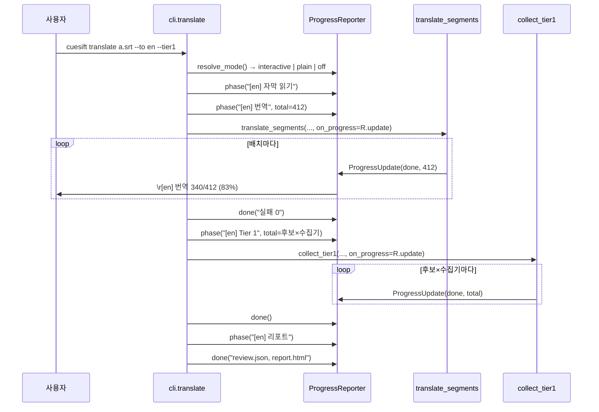
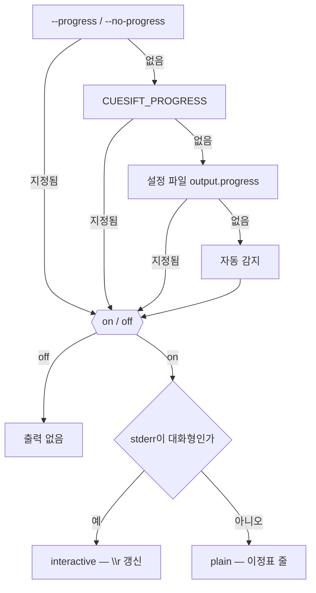

# 설계 — 진행 표시와 비대화형 감지 (FR-8.5)

> 작업 패키지: WP6 나머지 (FR-8.5) — 이것이 닫히면 **WP6이 완결된다**
> 선행: WP6 FR-8.1·8.2·8.4(CLI 표면과 설정 파일) · WP7a `translate/engine.py` · WP8a `tier1.py`
> 근거 문서: [요구사항정의서](../../요구사항정의서.md) §5.8 FR-8.5 · §8.2 · [WBS](../../WBS.md) WP6
> 형제 스펙: [설정 파일 설계](2026-08-28-config-file-design.md) (우선순위 4층 D3 · 상등 게이트 R5를 그대로 잇는다)

## 1. 목적과 범위

### 1.1 무엇을 만드나

FR-8.5는 **"진행 상황을 표시하고, 비대화형(CI) 환경을 감지하여 출력을 조정한다"** 한 줄이다.

문장은 하나지만 만들 것은 셋이다.

| 부분 | 무엇 | 어디 |
| --- | --- | --- |
| **A. 이음매** | 라이브러리가 진척을 바깥에 알린다 | `translate/engine.py` · `signals/base.py` · `tier1.py` |
| **B. 감지와 우선순위** | 대화형/비대화형/끔을 판정한다 | `progress.py` · `cli.py` 콜백 |
| **C. 렌더러** | stderr에 그린다 | `progress.py` |

**A가 먼저인 이유는 관측 지점이 하나도 없기 때문이다.** 착수 조사에서 `grep -rn "callback\|progress" src/cuesift/translate/ src/cuesift/tier1.py`가 **0건**이었다(§3). FR-8.5는 "렌더러 하나"가 아니라 라이브러리에 구멍을 뚫는 일이 절반이다 — [FR-7.3 report.html](2026-08-27-report-html-design.md)에서 `Span`을 채우는 코드가 0건이었던 것과 같은 구조다.

### 1.2 이 작업이 함께 닫는 것

**없다.** 그리고 그 사실이 이 절의 내용이다.

| 확인한 FR | 왜 안 닫히나 |
| --- | --- |
| FR-7.5 (CI 종료 코드) | 이미 ✅다. 종료 코드는 출력 형식과 무관하게 유지되며, 이 작업은 그것을 **깨뜨리지 않는 것**이 요구다(§9 R2) |
| FR-8.3 (`transcribe`) | STT 어댑터(WP9)가 없어 진행을 표시할 대상 자체가 없다 |

v0.1 완료 개수는 **36 → 37**이 된다. **WP6은 🟡로 남는다** — 이 문장의 이전 판은 "WP6이 ✅가 되고 FR-8.3은 WP9로 넘어간다"였는데 **[WBS](../../WBS.md)와 어긋났다**. WBS는 담당 배정의 원본이고, FR-8.3이 §5.8("CLI")에 있어 STT 로직이 아니라 CLI 소속이며 WP9는 STT 어댑터(FR-1.2·1.4)만 낸다고 명시적으로 논증한다. **파생 문서에서 읽은 것이 원본에서 읽은 것보다 약하다**(`CLAUDE.md`)는 규율이 여기서 한 번 더 발동했다.

### 1.3 범위 밖 — 명시한다

| 항목 | 왜 밖인가 |
| --- | --- |
| `check`·`transcribe`의 진행 표시 | `check`는 LLM 호출이 없어 보통 1초 내에 끝난다. 표시할 진행이 없는 곳에 표시 체계를 넣으면 게이트만 늘고 검사할 것이 없다 |
| ETA·처리 속도 | FR 본문에 없다. 배치 소요가 네트워크 지연에 좌우돼 추정이 자주 틀리고, 틀린 ETA는 없는 ETA보다 나쁘다 |
| 색·스타일 | 자체 렌더러는 `\r` 외의 제어문자를 쓰지 않는다(D6). 색을 쓰지 않으므로 `NO_COLOR`는 감지 신호가 아니다(D8) |
| `rich` 사용 | D6 참고. 전이 의존이며, 이 리포에는 rich가 CI에서만 출력을 깨뜨린 실측 전례가 있다 |
| 진행 로그를 파일로 남기기 | 요구가 없다. 머신리더블 산출물은 `review.json`(FR-7.2)이다 |
| 다중 언어 병렬 진행 | 번역은 언어를 **순차**로 돈다(FR-2.1 해석, `translate_segments`가 단일 언어). 진행 표시가 병렬 구조를 먼저 상정하면 없는 동시성을 가정한 코드가 된다 |

## 2. 확정된 설계 결정

| # | 결정 | 무엇이 깨지는가 (이 결정이 아니면) |
| --- | --- | --- |
| **D1** | 이음매는 **콜백 주입**이다 — `on_progress: ProgressCallback \| None = None` | 대안이던 "CLI가 `iter_batches`를 직접 돌기"는 재시도·컨텍스트 윈도우·`TokenUsage` 합산 계약을 CLI가 복제하게 만든다. `translate_segments`의 독스트링이 명시한 계약(실패분 `target_text=None`, `TokenUsage`에 `__radd__` 없음)이 두 곳에 생기고 반드시 갈린다 |
| **D2** | 이벤트는 `ProgressUpdate(done, total)` **둘뿐**이다. 단계 이름을 싣지 않는다 | 단계는 표현 계층의 개념이고 호출자(CLI)가 이미 안다. 라이브러리가 "번역 중"이라는 문자열을 알면 출력 문구를 바꿀 때 라이브러리를 고치게 된다 |
| **D3** | 기본값은 `None`이고 그때 콜백은 **한 번도 호출되지 않는다** | 기존 호출부 0줄 변경이 이 결정의 산물이다. `weights=None`이면 `DEFAULT_WEIGHTS`로 떨어지는 FR-8.4의 형태와 같다 |
| **D4** | Tier 1의 분모는 **후보 수 × tier 1 수집기 수**다 | `collect_tier1`은 `for name → for seg` 이중 루프다(`signals/base.py:243`). 분모를 `len(segments)`로 두면 수집기가 2종이 되는 날 **200%가 찍힌다.** 오늘은 수집기가 `llm.self_consistency` 하나라 두 정의가 같은 값을 내므로 **틀린 정의를 골라도 오늘의 테스트는 전부 통과한다** — 가짜 수집기를 등록하는 테스트(§8)가 이 결정을 코드에 고정한다 |
| **D5** | 우선순위는 **CLI > 환경변수 > 설정 파일 > 자동 감지**다 | FR-8.4가 세운 4층(설계 D3)과 같은 순서다. 자동 감지가 "기본값" 자리에 들어간다. 순서를 뒤집으면 `--no-progress`가 설정 파일에 지고, 그것은 "탈출로"라는 플래그의 존재 이유를 없앤다 |
| **D6** | 렌더러는 **자체 구현**이다. `rich`를 쓰지 않는다 | `rich 15.0`은 typer의 전이 의존이라 typer가 언젠가 그것을 떼면(`typer-slim`이 이미 있다) 조용한 `ImportError`가 된다. 더 큰 이유는 실측 전례다 — rich가 `FORCE_COLOR`로 **비TTY인 CI에서 색을 켜** `--help` 출력의 옵션 이름을 쪼갠 사고가 있었다. 라이브러리의 자동 감지에 맡기면 내가 열거하지 않은 신호까지 판정에 들어온다 |
| **D7** | 플래그는 **켜고 끄기만** 정한다. 스타일은 언제나 감지가 정한다 | `--progress`를 CI에서 줘도 `\r`이 아니라 이정표 줄이 나와야 한다. 사용자가 요구한 것은 "보이게 하라"이지 "제어문자를 내라"가 아니다 |
| **D8** | 감지 신호는 **`stderr.isatty()` · `CI` 환경변수 · `TERM=dumb`** 셋이다 | `isatty`만 보면 TTY를 할당하는 CI 셸(`docker run -t`, 일부 self-hosted 러너)에서 `\r`이 로그 파일에 그대로 남는다. `NO_COLOR`는 넣지 않는다 — 색에 관한 규격인데 이 렌더러는 색을 쓰지 않으므로, 넣으면 규격을 넘어 해석하는 것이 된다 |
| **D9** | 진행 출력은 **stderr 전용**이다 | stdout은 `check`의 리포트와 `--dry-run` 출력이 쓰는 자리다. 진행 줄이 섞이면 파이프로 받는 쪽이 깨진다. `test_cli_pipe.py`가 지켜 온 계약이다 |
| **D10** | 쓰기 실패(`OSError`)는 리포터를 **영구 비활성화**하고 예외를 전파하지 않는다 | 진행 표시는 부수적이다. 닫힌 파이프에서 예외가 새면 `_TolerantOutput`과 `_echo`가 지켜 온 종료 코드 계약이 깨진다 — `head -1`로 잘라 읽는 사용자에게 종료 코드가 흐려진다 |
| **D11** | `_echo(err=True)`가 쓰기 **전에** 활성 리포터의 `clear()`를 부른다 | `\r` 진행 줄이 떠 있는 중에 경고가 나가면 두 문장이 한 줄에 겹친다. `_translate_one`은 용어집 실패·캐시 경고를 실제로 그 자리에서 낸다. 라이브러리의 `warn` 콜백도 `_echo`를 지나므로 한 곳을 고치면 전부 덮인다 |
| **D12** | `plain` 모드의 이정표는 **10%p 이상 늘었을 때**만 낸다 | "배치마다"로 두면 세그먼트 4000개·배치 10에서 언어당 400줄이 된다. 반대로 단계 전환만 내면 수십 분짜리 CI 작업에서 침묵이 길어져 "멈춤"과 "느림"이 구분되지 않는다 |
| **D13** | 100%(`done == total`)는 **항상** 낸다 | 10%p 규칙만 두면 마지막 조각이 10%p에 못 미칠 때 진행이 97%에서 끝난 것처럼 보인다 |

## 3. 착수 조사 — 실측

설계 전에 확인한 것들이다. **파생 문서가 아니라 코드에서 읽었다.**

| # | 질문 | 실측 | 설계에 미친 영향 |
| --- | --- | --- | --- |
| P1 | 진행 훅이 이미 있나 | `grep -rn "callback\|on_progress\|progress" src/cuesift/translate/ src/cuesift/tier1.py` → **0건** | 범위가 "렌더러 하나"에서 "이음매 + 렌더러"로 늘었다 (§1.1) |
| P2 | 출력용 콜러블을 라이브러리에 주입한 선례가 있나 | `triage_with_tier1(..., warn: Callable[[str], None])` (`tier1.py:29`) | D1이 새 패턴이 아니라 **기존 규약의 확장**임을 확인했다 |
| P3 | `rich`를 쓸 수 있나 | 설치돼 있다(`rich 15.0`). 단 `importlib.metadata.requires("typer")`가 `rich>=13.8.0`을 **typer의 의존**으로 보여 준다 | D6 — 우리 것이 아닌 의존이다 |
| P4 | CLI 옵션을 늘리면 무엇이 깨지나 | `tests/test_config_schema.py`가 매핑표와 click 옵션 집합의 **상등**을 보고, 개수 23을 따로 고정한다 | §7 — 옵션 추가는 반드시 매핑 1행을 동반한다 |
| P5 | Tier 1 루프의 모양 | `collect_tier1`은 `for name in names: for seg in segments:` (`signals/base.py:243`) | D4 — 분모가 후보 수가 아니다 |
| P6 | 캐시 히트도 루프를 도나 | 캐시는 provider를 감싼다(`store/cache.py`). 배치 루프는 그대로 돈다 | 재개 실행에서 진행이 빠르게 100%로 흐를 뿐, 별도 처리가 필요 없다 |

## 4. 구조

### 4.1 모듈 경계

```mermaid
flowchart LR
    subgraph cli["cli.py"]
        flag["--progress / --no-progress"]
        env["CUESIFT_PROGRESS"]
        conf["output.progress"]
        resolve["resolve_mode()"]
        echo["_echo(err=True)"]
    end
    subgraph prog["progress.py (신규)"]
        upd["ProgressUpdate(done, total)"]
        rep["ProgressReporter"]
    end
    subgraph lib["라이브러리"]
        eng["translate_segments"]
        col["collect_tier1"]
        t1["triage_with_tier1"]
    end

    flag --> resolve
    env --> resolve
    conf --> resolve
    resolve --> rep
    rep -->|on_progress| eng
    rep -->|on_progress| col
    t1 -.전달만.-> col
    eng --> upd
    col --> upd
    echo -->|clear\(\) 먼저| rep
    rep -->|stderr| out(["터미널 / CI 로그"])
```

**화살표의 방향이 설계의 요점이다.** 라이브러리는 `ProgressUpdate`라는 순수 데이터만 만들고, 그것을 어디에 어떻게 그릴지는 모른다. `progress.py`는 `cli.py`를 임포트하지 않는다 — 반대 방향이면 라이브러리가 CLI에 의존하게 된다.

### 4.2 데이터 흐름



### 4.3 확인된 함정 셋

**① Tier 1 분모는 오늘 관측되지 않는다.** D4의 근거다. 수집기가 하나뿐이라 `len(candidates)`와 `len(candidates) × len(names)`가 같은 값을 낸다. 테스트가 가짜 tier 1 수집기를 하나 더 등록하지 않으면 이 결정은 주석으로만 남고 게이트가 없다.

**② 진행 표시는 stderr에 "상태"를 만든다.** 지금까지 stderr에 나가던 것은 전부 완결된 줄이었다. `\r`은 커서 위치라는 상태를 남기므로, **그 자원을 쓰는 다른 모든 코드가 이 상태를 알아야 한다.** D11이 그 계약을 `_echo` 한 곳으로 모은다. 이것이 이 작업을 bounded가 아니라 architectural로 본 이유다.

**③ 닫힌 파이프에서 죽으면 종료 코드가 흐려진다.** `cuesift translate ... 2>&1 | head -1`은 정상적인 사용이다. 진행 렌더러가 그 상황에서 `OSError`를 올리면 `_translate_one`의 방어를 지나 exit 1("부분 실패")로 오보된다 — 실제로는 번역이 성공했는데도. D10이 이것을 막는다.

## 5. 감지 규칙과 우선순위



자동 감지는 셋 중 **하나라도** 해당하면 비대화형이다.

| 신호 | 판정 | 근거 |
| --- | --- | --- |
| `not sys.stderr.isatty()` | plain | 파이프·리다이렉션. 표준 신호다 |
| `os.environ.get("CI")`가 비어 있지 않음 | plain | GitHub Actions·GitLab·CircleCI·Travis가 공통으로 세운다. TTY를 할당하는 러너에서도 제어문자가 로그에 새지 않게 한다 |
| `os.environ.get("TERM") == "dumb"` | plain | Emacs 셸·일부 편집기 터미널이 `\r` 갱신을 렌더하지 못한다 |

**`CUESIFT_PROGRESS`의 불리언 판독은 한 곳에 둔다.** `_prefer_env`는 문자열 전용이라 재사용할 수 없다. `"0"`·`"false"`·`""`을 거짓으로, 나머지를 참으로 읽는 함수 하나를 `progress.py`에 두고 그 자리를 테스트로 고정한다 — 판독 규칙이 두 곳에 생기면 `CUESIFT_PROGRESS=false`가 참이 되는 날이 온다.

## 6. 출력 형식

**interactive** — 한 줄을 덮어쓰고, 단계가 끝나면 개행해 확정한다.

```text
[en] 자막 읽기 ....... 412 세그먼트
[en] 번역 ............ 340/412 (83%)      ← \r로 갱신되는 줄
[en] 번역 ............ 완료 (실패 0)
[en] Tier 0 신호 ..... 완료
[en] Tier 1 .......... 12/20
[en] 리포트 .......... review.json, report.html
```

**plain** — 갱신 없이 누적한다. 제어문자를 쓰지 않는다.

```text
[en] 자막 읽기 412 세그먼트
[en] 번역 41/412 (10%)
[en] 번역 82/412 (20%)
[en] 번역 412/412 (100%)
[en] 번역 완료 (실패 0)
[en] Tier 1 20/20 (100%)
[en] 리포트 기록 완료
```

언어 태그를 매 줄에 다는 것은 다국어 순차 실행에서 어느 언어의 진행인지가 로그에서 사라지기 때문이다. 단계 이름은 `_translate_one`이 이미 아는 순서를 그대로 쓴다.

## 7. 설정 파일·게이트 영향

FR-8.4가 세운 상등 게이트는 **새 CLI 옵션이 설정 파일 매핑을 반드시 갖게 강제한다.** 이 작업은 그 게이트를 우회하지 않는다.

| 대상 | 지금 | 뒤 |
| --- | --- | --- |
| CLI 옵션 수 (`test_config_schema.py`) | 23 (translate 19 · check 3 · transcribe 1) | **24** (translate 20) |
| `BINDINGS` | — | **1행 추가** — `("output", "progress") → (("translate", "progress"),)` |
| `ALLOWED_PATHS` | 매핑표에서 파생 | 자동 반영. 손댈 것 없음 |
| 요구사항정의서 §8.2 예시 | — | `output.progress: true` 추가 |

`output.dir`이 이미 `output` 섹션을 열어 두었으므로 새 최상위 키는 생기지 않는다. **변환 함수는 없다** — `cache.enabled → --no-cache`가 `negate`를 거치는 것과 달리, YAML의 `true`가 곧 `--progress`다(D12의 이중부정 회피와 같은 이유).

§8.2 예시에 키를 더하면 `tests/test_docs_config_example.py`가 그 블록을 **CLI까지** 태운다 — 로드만 되고 실행되지 않는 값을 잡는 게이트이며, FR-8.4 세션이 `signals.tier1.max_ratio: 0.25`의 오류를 그 게이트로 찾아냈다.

## 8. 테스트 전략

| 축 | 방법 | 이 축이 없으면 놓치는 것 |
| --- | --- | --- |
| 콜백 계약 | 콜백으로 `events.append`를 넘겨 단조 증가·최종 `(total, total)`·`None`일 때 **무호출**을 단언 | 진행이 역행하거나 100%에 도달하지 않는 것 |
| **Tier 1 분모** | 가짜 tier 1 수집기를 하나 더 등록해 `total == 후보 × 2`를 단언 | **오늘 보이지 않는 200% 버그.** D4의 근거를 코드에 고정한다 |
| 감지 진리표 | `isatty`·`CI`·`TERM`의 조합을 monkeypatch로 전수 | CI에서만 `\r`이 새는 회귀 |
| 우선순위 | CLI > 환경변수 > 설정 파일 > 감지 4층 진리표 (FR-8.4 테스트 형식 재사용) | 설정 파일이 CLI를 이기는 역전 |
| 렌더러 | `StringIO`에 mode별 출력을 단언. 짧아진 줄의 **패딩 잔상**을 포함 | `1000/4120` 뒤 `340/412`에서 이전 글자가 남는 것 |
| 실패 격리 | 쓰기에서 `OSError`를 주입해 **예외 미전파**와 영구 비활성화를 단언 | 닫힌 파이프에서 종료 코드가 흐려지는 것 (D10) |
| 경고 충돌 | 진행 중 `_echo(err=True)` 호출 → `clear` → 경고 → 재출력 시퀀스를 문자열로 단언 | 두 문장이 한 줄에 겹치는 것 (D11) |
| 파이프 계약 | `test_cli_pipe.py` 확장 — 진행이 켜진 채 stderr을 닫아도 종료 코드가 유지되는지 | FR-7.5가 지켜 온 계약의 회귀 |
| 게이트 수치 | `test_config_schema.py`의 23 → 24 갱신 | 옵션과 매핑표가 갈리는 것 |

**모든 회귀 테스트는 버그 버전에서 실제로 실패시켜 확인한다.** 특히 `OSError` 주입과 Tier 1 분모 둘은 방어·정의를 되돌렸을 때 죽는 것을 본 뒤에야 게이트다 — 이 리포는 길이비 회귀 테스트가 버그 버전에서도 통과해 데이터를 다시 짠 전례가 있다.

## 9. 위험

| # | 위험 | 완화 |
| --- | --- | --- |
| **R1** | `_echo`에 전역 활성 리포터를 두는 것이 전역 상태다. 테스트가 서로 오염될 수 있다 | 리포터를 설치·해제하는 자리를 `translate` 커맨드 하나로 한정하고, `conftest.py`에 초기화 픽스처를 둔다. 자동 탐색 차단 픽스처의 선례가 있다 |
| **R2** | 진행 출력이 기존 테스트의 stderr 단언을 깨뜨린다 | 테스트 실행은 비TTY이므로 자동 감지가 `plain`을 고르고, 진행 줄이 기존 경고 단언에 섞인다. **테스트 기본값을 `off`로 두는 픽스처**가 필요하다 — 진행을 검사하는 테스트만 명시적으로 켠다 |
| **R3** | Windows 콘솔에서 `\r`이 기대대로 동작하지 않을 수 있다 | **구조는 확인했고 육안 관측이 남아 있다.** 렌더러가 내는 원문을 `repr()`로 뜨면 프레임 사이에 `\n`이 **하나도 없고** 전부 `\r`로 시작하며, 마지막 확정 줄 뒤에만 `\n`이 하나 붙는다 — `'\r[en] 번역 ... 1/3 (33%)\r... 2/3 (66%)\r... 3/3 (100%)\r[en] 번역 ... 완료 (실패 0)\n'`. plain 경로는 `\r` **0건**으로 확인됐다. 남은 것은 **실제 Windows Terminal에서 커서가 같은 줄 위에 겹쳐 그려지는 것 자체**다 — 검증 에이전트는 라이브 화면을 볼 수 없어 관측하지 못했다. **확인하지 않은 것을 확인했다고 적지 않는다** |
| **R4** | 이음매가 늘면 나중에 다른 계층(QE, v0.2)도 진행을 요구한다 | `ProgressUpdate`가 `(done, total)`뿐이라 새 계층이 붙어도 타입이 바뀌지 않는다. 단계 이름을 넣지 않은 D2가 여기서 값을 한다 |

## 10. 미해결

| 질문 | 판정 시점 |
| --- | --- |
| `plain`의 10%p 간격이 실제 CI 로그에서 적절한가 | 실물 확인 태스크에서 4000 세그먼트 규모로 본다. 상수는 한 곳에 두고 "이 값이 아니면 무엇이 깨지는가"를 주석으로 남긴다 |
| 다국어 실행에서 전체 진행(언어 2/3)을 함께 보일 것인가 | v0.1에서는 내지 않는다. 언어별 진행만으로 "멈췄나"가 판정되고, 전체 진행은 분모가 언어마다 다른 세그먼트 수라 합산 의미가 흐리다 |
