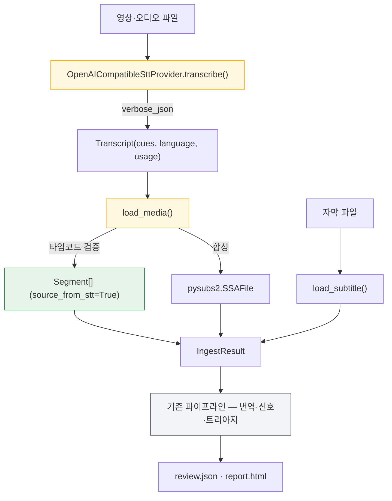
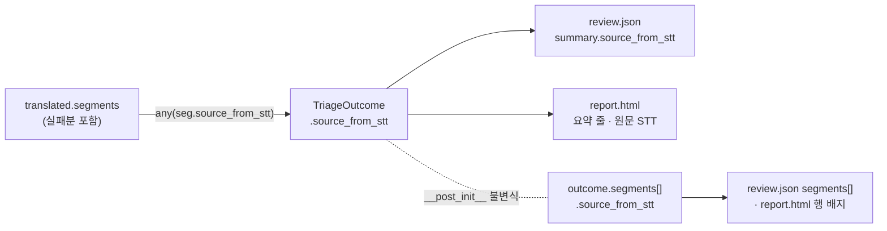

# 설계 — STT 어댑터와 원문 검수 플래그 (FR-1.2 · FR-1.4)

> 작업 패키지: WP9 — 이것이 닫히면 **FR-8.3(`transcribe` 배선, WP6)의 선행이 풀린다**
> 선행: WP4 인제스트(FR-1.1) · WP7a `translate/openai_compat.py`(HTTP 어댑터 참조 구현)
> 근거 문서: [요구사항정의서](../../요구사항정의서.md) §5.1 FR-1.2·1.3·1.4 · §11 R1 · [WBS](../../WBS.md) WP9
> 형제 스펙: [인제스트 설계](2026-07-31-ingest-design.md) (`IngestResult` 계약의 출처) · [번역 엔진 설계](2026-08-16-translate-engine-design.md) (프로바이더 예외 계층의 출처)

## 1. 목적과 범위

### 1.1 무엇을 만드나

FR-1.2는 **"자막이 없는 영상 입력 시 STT로 원문 자막을 생성한다"**, FR-1.4는
**"STT로 생성한 원문은 `원문 검수 필요` 플래그를 부여하여 검수 큐에 별도 표시한다"** 이다.

두 문장이지만 만들 것은 셋이다.

| 부분 | 무엇 | 어디 |
| --- | --- | --- |
| **A. 어댑터** | 오디오를 보내고 타임코드 있는 전사를 받는다 | `stt/provider.py` · `stt/openai_compat.py` (신규) |
| **B. 인제스트 통합** | 영상 입력을 `IngestResult`로 만든다 | `ingest/loader.py` |
| **C. 플래그 파급** | 검수 큐가 원문의 출처를 드러낸다 | `segment/models.py` · `report/json_report.py` · `report/html_report.py` |

**C가 이 작업의 숨은 절반이다.** 착수 조사에서 `grep -rn "원문 검수 필요" src/ tests/`가
**0건**이었다(§3). 문서 세 곳에 같은 문장이 있어 개념이 이미 있는 것처럼 읽히지만
코드에는 자리조차 없다 — [FR-7.3 report.html](2026-08-27-report-html-design.md)에서
`Span`을 채우는 코드가 0건이었던 것과 **같은 구조의 함정**이다.

### 1.2 이 작업이 함께 닫는 것

**FR-1.3이 함께 닫힐 후보다.** 지금 `_reject_non_subtitle`은 영상 확장자를 거부하는
것으로 FR-1.3을 반쪽만 구현하고 있고, 독스트링이 그 사실을 스스로 적어 놓았다 —
"진짜 '둘 다 주어짐'은 WP9에서 다시 본다"(`ingest/loader.py:152`).

| FR | 이 작업 뒤 |
| --- | --- |
| FR-1.2 | ⬜ → 닫힌다. `load_media`가 영상에서 `Segment`를 만든다 |
| FR-1.4 | ⬜ → 닫힌다. 플래그가 `review.json`·`report.html` 양쪽에 도달한다 |
| FR-1.3 | 반쪽 → `load_input`이 자막과 영상을 함께 받아 자막을 채택한다 |
| FR-8.3 | **닫히지 않는다.** §5.8("CLI") 소속이라 WP6의 몫이다 |

**완료 개수는 구현이 끝난 뒤 §0.1 규칙으로 전수 대조한다.** 현재 37이고 두 개가 닫히면
39가 되겠지만, §5.1 표에는 상태 열이 없어 FR-1.3의 현재 판정을 먼저 확인해야 한다.
그 절이 "규칙을 고칠 때는 상태 열이 있는 FR 18개에 전수 대조하라"고 네 번의 실패
이력과 함께 적어 둔 이유가 여기에 있다 — **개수를 먼저 적고 대조를 나중에 하면 순서가 뒤집힌다.**

### 1.3 범위 밖 — 명시한다

| 항목 | 왜 밖인가 |
| --- | --- |
| `cuesift transcribe` CLI 배선 (FR-8.3) | §5.8 소속이라 WP6이다. 이 작업은 그 명령이 부를 대상을 만들 뿐이다 |
| 긴 오디오 분할 | 겹침 병합과 타임코드 오프셋 보정을 동반해 그것만으로 한 작업 단위다. 서버 상한 초과는 413을 `FatalProviderError`로 올린다(D9) |
| FR-1.5 언어 자동 감지의 완결 | 응답의 `language`를 기록은 하지만, 자막 파일 입력에도 적용돼야 하는 요구라 STT 경로만 닫으면 반쪽이 된다 |
| 화자 분리 | `Segment.speaker`는 v0.2 자리다(§7.3) |
| 자막 파일에 플래그 기재 | SRT·VTT에 실을 자리가 없고, 억지로 만들면 FR-7.1 라운드트립이 깨진다. FR-1.4의 문구가 "**검수 큐에** 별도 표시"다 |
| STT 결과의 품질 신호 | Tier 0 신호는 번역문을 본다. 원문 품질 판정은 v0.2 QE의 영역이다 |

## 2. 확정된 설계 결정

| # | 결정 | 근거 |
| --- | --- | --- |
| **D1** | 백엔드는 **OpenAI 호환 `/v1/audio/transcriptions`** 를 `httpx`로 부른다 | 확정 결정 Q3·Q6과 일치하고 런타임 의존성이 4개 그대로다. `openai-whisper`·`faster-whisper`는 의존성 고정 규율을 깬다 |
| **D2** | 예외 계층은 `translate/provider.py`의 것을 **재사용**한다 | 분류 축("호출자가 틀렸나 데이터가 틀렸나")이 동일하다. 따로 세우면 CLI가 `except`를 두 벌 갖고, 빠뜨린 쪽은 재시도도 폴백도 없이 스택 밖으로 샌다 |
| **D3** | 프로바이더는 `Transcript`를 내고 **`Segment`는 인제스트가 만든다** | id 부여·`index` 재부여·플래그는 인제스트 정책이다. `translate`에서 프로바이더가 `Completion`만 내고 engine이 조립하는 것과 같은 층 분리다 |
| **D4** | `response_format=verbose_json`을 **명시하고**, 타임코드가 없으면 `FatalProviderError` | 기본 `json`은 텍스트만 준다. 조용히 통과시키면 전 세그먼트가 `0ms~0ms`가 되어 CPS 검사가 통째로 무의미해진다. Q3의 "능력은 균일하지 않아 탐지·명시가 필요하다"가 이 자리다 |
| **D5** | 초 → 밀리초는 **양쪽 다 `round()`** | 같은 방향으로 움직여 인접 큐의 맞물린 경계가 그대로 붙어 있다. 한쪽만 내리고 한쪽만 올리면 **원본에 없던 겹침을 우리가 만든다**. 목적은 실측으로 확인됐다(§3) — 다만 `round()`는 half-up이 **아니다**(§8.1) |
| **D6** | `IngestResult`의 **필수 필드 6개를 전부** 채운다 (§4.4). `format`에는 `"srt"`를 넣되 **그것은 `IngestResult.format`이지 `subs.format`이 아니다** | `subs`가 필수 필드다. `\| None`으로 완화하면 WP5 사용처 전부가 아무도 실행하지 않는 `None` 분기를 갖는다. 합성한 `SSAFile`의 `.format`은 이벤트를 넣어도 `None`으로 남고(§3 실측), `writer.py:99`가 그 값을 `save(format_=)`로 그대로 넘겨 `.tmp` 확장자 판별에서 죽는다 |
| **D11** | `Transcript`는 `usage`를 실어 오되 **`review.json`에 배선하지 않는다** | STT의 비용 단위는 토큰이 아니라 오디오 길이라, `summary.cost`에 합치면 `basis`·`includes`가 두 종류를 뭉뚱그린다. 그 두 필드는 정확히 그 혼합을 막으려고 만들어졌다(`json_report.py`의 주석). 표현 형태는 §10 미해결이다 |
| **D7** | 플래그는 `Segment.source_from_stt: bool = False` 전용 필드 | 기본값이 `False`라 자막 경로가 한 줄도 안 바뀐다. `meta` 딕셔너리는 오타를 런타임에 못 막아 조용히 사라진다 |
| **D8** | 플래그를 **점수에도 hard fail에도 넣지 않는다** | §5 참조. 이 결정이 프로젝트의 핵심 지표를 지킨다 |
| **D9** | 오디오 분할을 넣지 않는다 | §1.3 |
| **D10** | live 테스트 오디오는 `CUESIFT_LIVE_AUDIO`로 받는다 | 리포에 바이너리를 들이지 않는다. 링크 체커도 markdownlint도 바이너리를 보지 않아 검사받지 않는 파일이 된다 |

## 3. 착수 조사 — 실측

| 확인한 것 | 결과 | 설계에 미친 영향 |
| --- | --- | --- |
| `grep -rn "원문 검수 필요" src/ tests/` | **0건** (문서 3곳에만 있다) | §1.1 C가 작업의 절반이다 |
| 인제스트 공개 API 이름 | `load_segments`가 **아니라** `load_subtitle` | 통합 지점의 이름이 §4에서 바뀌었다 |
| `IngestResult.subs` | `pysubs2.SSAFile` **필수 필드** | D6의 존재 이유 |
| `_to_segments`의 id 규칙 | `f"{index:05d}"`, 필터 후 0부터 연속 | STT 경로가 같은 규칙을 따른다 |
| HTTP 모킹 방식 | `httpx.MockTransport` (의존성 추가 없음) | §8이 같은 방식을 쓴다 |
| 현재 게이트 | **1582 passed · 3 deselected** | HANDOFF의 1547은 낡았다 |
| **`pysubs2.SSAFile()`의 `.format`** | **`None`이다. 이벤트를 넣어도 `None`으로 남는다** (2026-09-01 실측) | D6이 말하는 `"srt"`는 `IngestResult.format` 쪽이다 |
| **`IngestResult.event_index`의 소비처** | `writer.py:59` · `cli.py:2954` · `cli.py:2966` **3곳** | §4.4 — 안 채우면 앞의 둘은 `KeyError`, 셋째는 조용히 큐 번호 폭이 1이 된다 |
| `Segment`의 데코레이터 | `@dataclass(slots=True)` — **frozen이 아니다.** 호출은 전부 키워드 인자 | D7의 필드 추가가 안전하다 |
| `review_ratio()`의 정의 | `sum(1 for r in risks if r.selected) / len(risks)` | D8을 지키면 `SegmentRisk`를 건드리지 않으므로 STT가 이 식에 들어올 자리 자체가 없다 |
| **합성 `IngestResult`의 `write_subtitle` 왕복** | **성립한다.** 3큐 · 144바이트 · 원문이 번역문으로 교체됨 (2026-09-01 실행) | R3의 미확인 가정이 닫혔다. 실패 케이스 둘도 함께 재현했다 — 아래 |
| `format=None`으로 같은 왕복 | **`UnknownFileExtensionError`: File extension '.tmp' does not match any supported subtitle format** | D6의 `"srt"`가 장식이 아니다 |
| `event_index={}`로 같은 왕복 | **`KeyError: '00000'`** | §4.4 |
| `round()`의 실제 동작 | **half-up이 아니다.** `round(1234.5)=1234` · `round(1235.5)=1236` (짝수 반올림) + `0.5005*1000=500.49999999999994` (float 오차) | §8.1 게이트의 **기대값을 half-up으로 적으면 게이트 자신이 틀린다** |
| 인접 큐 경계 (D5의 목적) | 같은 초 값에 같은 함수를 쓰므로 `1.2345`→`1234`가 양쪽에서 동일. **겹침이 생기지 않는다** | D5가 의도한 대로다 |

**`load_segments`라는 이름은 이 세션의 브레인스토밍 중에 실제로 한 번 쓰였다가 조사에서
정정됐다.** 기억으로 API를 부르면 설계 문서가 존재하지 않는 함수를 가리킨 채 굳는다.

## 4. 구조

### 4.1 모듈 경계

```text
src/cuesift/stt/
├── __init__.py        공개 표면
├── provider.py        SttProvider Protocol · Transcript · TranscriptCue
└── openai_compat.py   OpenAICompatibleSttProvider
```

`translate/`와 형제 구조다. 예외 계층만 `translate/provider.py`에서 가져다 쓰고
(D2), 나머지는 독립이다.

### 4.2 데이터 흐름



**두 경로가 같은 `IngestResult`로 합류하는 것이 이 그림의 요지다.** 회색으로 표시한
하류 파이프라인은 한 줄도 바뀌지 않는다.

### 4.3 진입점 배치

```text
                      ┌─ subtitle 있음 ─────────→ load_subtitle(path)      [기존, 무변경]
  load_input(...) ────┤
                      └─ media만 있음 ─→ load_media(path, provider)         [신규]

                            둘 다 있음 → 자막 채택 (FR-1.3)
```

`load_subtitle`은 자막 전용이라는 이름값을 지킨다. 프로바이더를 넘기지 않으면 지금과
똑같이 `IngestError("video_input")`으로 거부하므로 **기존 테스트가 한 건도 바뀌지 않는다.**

영상을 무시했다는 사실을 사용자에게 알리는 일은 CLI(WP6)의 몫이다. 라이브러리에
경고 채널을 새로 파면 이번 범위에서 쓸 곳이 없는 표면이 생긴다.

**`load_input` 자신도 이번 범위에서는 테스트만이 부른다.** CLI 배선이 FR-8.3(WP6)이기
때문이다. 그럼에도 이번에 만드는 것은 FR-1.3을 반쪽으로 남겨 두지 않기 위해서이고,
그 판단을 여기 적어 둔다 — 앞 문단이 "쓸 곳 없는 표면"을 경계하고 있으므로,
같은 성질의 것을 예외로 두면서 이유를 안 적으면 나중에 모순으로 읽힌다.

### 4.4 `IngestResult` 필드별 합성 규칙 (D6)

**필수 필드가 6개인데 브레인스토밍에서 이름이 나온 것은 5개였다.** 빠진 하나가
`event_index`이고, 그것은 `KeyError`로 죽거나 조용히 틀리는 두 갈래를 모두 갖고 있다.

| 필드 | STT 경로에서 넣는 값 | 안 채우거나 틀리면 |
| --- | --- | --- |
| `segments` | `_to_segments`와 **같은 id 규칙**(`f"{index:05d}"`)으로 만든다 | 리포트와 자막 쓰기의 짝짓기가 어긋난다 |
| `source_path` | 입력 미디어 경로 | — |
| `format` | **`"srt"` 고정** | `None`이면 `writer.py:99`의 `save(format_=None)`이 `.tmp` 확장자를 판별하려다 죽는다 |
| `source_lang` | 응답의 `language`, 없으면 호출자가 준 값 | FR-1.5는 기록까지만 (§1.3) |
| `subs` | `pysubs2.SSAFile`을 새로 만들고 큐마다 `SSAEvent`를 넣는다 | 필수 필드다 (D6) |
| **`event_index`** | **`{seg_id: index}` 항등 사상** | `writer.py:59`·`cli.py:2966`이 **`KeyError`**, `cli.py:2954`가 **조용히** 큐 번호 폭 1 |

항등 사상이면 되는 이유는 STT 경로에 `_keep_displayed` 같은 필터가 없기 때문이다.
자막 경로는 주석 이벤트를 걸러내므로 원본 위치와 세그먼트 순서가 갈리지만, STT는
프로바이더가 준 큐가 곧 전부다.

**`format="srt"`가 CLI 출력에 드러난다는 것은 알고 채택한 것이다.**
`cli.py:1724`가 `입력 video.mp4 (srt) · 42 세그먼트`로 찍는다. 입력 확장자와 포맷 표기가
어긋나 보이지만, 이 필드의 실제 소비처는 `writer`의 저장 포맷이고 그쪽이 정확해야 한다.
표기를 고치는 일은 CLI 소관이라 WP6에서 본다.

## 5. 플래그를 점수에 넣지 않는 이유 (D8)

**이 절이 이 설계에서 가장 되돌리기 어려운 결정이다.**

STT 입력에서는 **모든** 세그먼트가 `source_from_stt=True`를 갖는다. 여기서 세 갈래가 갈린다.

| 다뤘다면 | 실제 결과 |
| --- | --- |
| 점수에 가중치로 더한다 | 전체가 같은 양만큼 올라 **순위에 정보를 하나도 주지 않으면서** 상수만 더한다. `DEFAULT_WEIGHTS`를 전부 1.0으로 둔 규율(§11 R3)과도 정면으로 충돌한다 |
| hard fail로 올린다 | FR-6.2에 따라 **전량이 검수 예산을 우회**해 `review_ratio()`가 1.0이 된다. README 최상단의 무작위 베이스라인 대비 배수가 산출 불가능해진다 |
| **표시 전용으로 둔다** (채택) | 트리아지·융합이 한 줄도 안 바뀌고, 되돌리기 범위가 리포트 계층에 갇힌다 |

R1("원문이 틀리면 N개 언어로 복제된다")은 실재하는 위험이지만, 그 대응은 요구사항정의서
§11이 이미 지정해 놓았다 — FR-1.3(자막 우선)과 FR-1.4(플래그)다. **둘 다 순위 조작이 아니라
사람에게 사실을 보여 주는 수단이다.**

이 근거를 `Segment.source_from_stt`의 주석에 적는다. 이 리포의 주석 규약이
"왜 이 값인가"가 아니라 **"이 값이 아니면 무엇이 깨지는가"** 이고, 여기서 깨지는 것이
프로젝트의 핵심 주장이다.

## 6. 리포트 파급

`review.json`의 `segments[]`는 **선별된 세그먼트만** 담는다(설계 D3, [review.json 설계](2026-08-18-review-json-design.md)).
따라서 세그먼트에만 플래그를 달면, STT 원문이지만 한 건도 선별되지 않은 실행에서
**파일 어디에도 STT였다는 흔적이 남지 않는다.**

| 층 | 키 | 값 |
| --- | --- | --- |
| `summary` | `source_from_stt` | `outcome.source_from_stt` (필드) |
| `segments[]` | `source_from_stt` | `segment.source_from_stt` |
| `report.html` | 요약 줄의 `· 원문 STT` | `outcome.source_from_stt` (`html_report.py:207`) |
| `report.html` | 행 배지 | **`segment.source_from_stt`** (`html_report.py:312`). 요약 줄과 원천이 다르다 — 배지는 행마다 붙으므로 그 행의 세그먼트에서 읽는다. 세그먼트 속성이지 `Span` 하이라이트가 아니다 |

**`summary` 값은 `TriageOutcome`의 필드에서 읽는다. 유도하지 않는다.**

> **초판은 여기서 틀렸다(2026-09-01 구현 중 정정).** 초판은 `any(seg.source_from_stt
> for seg in outcome.segments)`로 유도하라고 적었다 — 세그먼트와 요약이 서로 다른 경로로
> 채워져 갈라지는 것을 막으려는 의도였다. **그 유도식은 전량 번역 실패 실행에서 거짓
> `false`를 낸다.** `segments[]`는 번역 실패분이 빠진 집합이라 그 실행에서 비고, 빈
> 이터러블 위의 `any`는 `False`다 — `total_segments: 4`인데 `source_from_stt: false`인
> 문서가 나가고, `false`는 "모름"이 아니라 **"자막 파일이었다"** 로 읽힌다. 예외도 경고도
> 없다. 리뷰어 둘이 독립적으로 재현해 Critical로 잡았다.

대신 갈라짐은 **불변식**으로 막는다. `TriageOutcome.__post_init__`이 세그먼트가 있는
실행에서 `source_from_stt != any(s.source_from_stt for s in segments)`를 거부한다.
입력 하나는 자막이거나 STT이지 섞이지 않으므로 둘은 반드시 같고, 다르면 배선이 틀린 것이다.
**세그먼트가 비어 있을 때는 제약하지 않는다** — 전량 실패 경로가 정확히 그 자리이고,
거기서 `any(())`와 같기를 요구하면 필드를 둔 이유가 통째로 사라진다.

값의 원천은 `cli.py`가 **`translated.segments`** 에서 읽는다(실패분이 남아 있는 집합이다).



**도식이 말하는 것은 원천이 하나라는 것이다** — 요약과 세그먼트가 같은 `TriageOutcome`에서
갈라져 나오고, 점선이 둘의 갈림을 생성 시점에 막는다.

`summary`가 이 값을 받을 자리인 근거는 그 절의 독스트링에 있다 — "파일만 보고 무엇을
어느 규격으로 어떤 정책에서 걸렀나를 알 수 있어야 한다. 리포트 파일은 옮겨지고 첨부되고
며칠 뒤에 열린다."

## 7. 실패 처리

| 상황 | 처리 | 이유 |
| --- | --- | --- |
| 타임코드 없는 응답 | `FatalProviderError` | D4 |
| 401·400·404 | `FatalProviderError` | 재시도하면 실패 1회가 N회로 늘 뿐이다 |
| 429·5xx·타임아웃 | `RetryableProviderError` | 호출부의 백오프에 맡긴다 |
| 413 (상한 초과) | `FatalProviderError` | D9 — 분할하지 않는다 |
| 큐 0개 | `IngestError("empty")` | "0개 수집은 통과가 아니라 입력 오류다" |
| 타임코드 역전·음수 | `IngestError("bad_timecode")` | 아래 |

**역전 타임코드를 인제스트에서 잡는 것이 중요하다.** Whisper 계열은 실제로 `end < start`인
구간을 낸다. 검증 없이 `Segment`에 넣으면 `__post_init__`이 `ValueError`를 던지는데,
`loader.py:241`이 이미 적어 놓은 대로 **그 예외는 `IngestError`를 우회한다.** 자막 경로가
`_require_int_timecodes`·`_require_non_negative_timecodes`로 막는 것과 같은 방어를
STT 경로도 받아야 한다.

## 8. 테스트 전략

| 파일 | 무엇을 고정하나 |
| --- | --- |
| `tests/test_stt_provider.py` | `Transcript`·`TranscriptCue`의 `__post_init__` 방어 |
| `tests/test_stt_openai_compat.py` | `httpx.MockTransport`로 응답 형태별 동작 |
| `tests/test_ingest_media.py` | `load_media`·`load_input`, `IngestResult` 합성, FR-1.3 우선순위 |
| `tests/test_stt_live.py` | 실제 왕복. `@pytest.mark.live`로 기본 제외 |
| `tests/fakes/provider.py` | `FakeSttProvider` 추가 (기존 파일에 얹는다) |
| `tests/test_report_json.py` · `test_report_html.py` | 플래그가 양쪽 층에 나타나는 것 |

### 8.1 실패를 먼저 확인할 게이트

**게이트를 만들면 반드시 실패시켜 봐야 한다.** 이 리포에서 길이비 회귀 테스트가 버그
버전에서도 통과해 데이터를 다시 짠 전례가 있다. 아래는 버그 버전에서 빨간 것을 **본 뒤에**
초록으로 만든다.

| 게이트 | 막지 않으면 |
| --- | --- |
| **STT 입력에서 `review_ratio()`가 1.0이 아니다** | 플래그가 hard fail로 새면 전량이 예산을 우회해 README 배수가 산출 불가가 된다. **이 스위트에서 가장 중요한 한 줄이다** |
| 타임코드 없는 응답 → `FatalProviderError` | 전 세그먼트가 `0ms~0ms`가 되어 CPS 검사가 무의미해진다 |
| `round()` 경계값 | `1.2345`초가 몇 ms인지가 고정되지 않으면 CPS 경계가 조용히 흔들린다. **기대값을 half-up으로 적으면 안 된다** — 실측은 `1.2345`초가 **1234**ms이고 `1.2355`초가 **1236**ms다(짝수 반올림). 게이트를 만드는 쪽이 먼저 틀릴 수 있는 자리다 |
| 역전 타임코드 → `IngestError("bad_timecode")` | `ValueError`가 `IngestError`를 우회한다 |
| 큐 0개 → `IngestError("empty")` | 0개 수집이 통과로 읽힌다 |
| 자막 경로 전량 무변경 | 프로바이더 없이 부르면 기존 동작과 한 글자도 달라지지 않아야 한다 |
| **합성 `IngestResult`로 `write_subtitle` 왕복이 성립한다** | `format`이 `None`이면 `.tmp`에서, `event_index`가 비면 `KeyError`로 죽는다. **번역 자막을 못 쓰는 것은 이 작업 전체를 무의미하게 만든다** (§4.4 · R3) |
| **트랙 리포트가 STT 입력에서 큐 번호를 옳게 찍는다** | `cli.py:2954`가 빈 `event_index`에 `default=0`을 써 **예외 없이** 큐 번호 폭을 1로 만든다. 위 게이트가 잡는 두 실패와 달리 이것은 조용하다 |

### 8.2 게이트 수치

현재 로컬은 **1582 passed · 3 deselected**다.

**로컬과 CI의 수치는 원래 다르다.** `data/`가 gitignore라 bench 테스트가 CI에서만
skip되므로, PR 본문에는 두 수치를 각각 적는다. `passed`만 읽으면 어긋난 1건이 안 보인다.

## 9. 위험

| # | 위험 | 대응 |
| --- | --- | --- |
| R1 | 로컬 백엔드가 `verbose_json`을 지원하지 않아 사용자가 막힌다 | D4가 조용한 실패 대신 **명시적 실패**로 만든다. 메시지에 무엇이 없어서 실패했는지 적는다 |
| R2 | 플래그가 나중에 hard fail로 승격되어 지표가 무너진다 | §8.1의 첫 게이트가 그것을 회귀로 잡는다. 주석에 근거를 남긴다 |
| R3 | `IngestResult` 합성이 WP5 라운드트립에서 깨진다 | **2026-09-01 실행으로 닫혔다** — 합성 `SSAFile`로 `write_subtitle`이 성립한다(§3). 다만 위험 대상은 `subs` 하나가 아니라 **`subs`·`format`·`event_index` 셋**이었고, **실제로 죽는 두 지점은 원래 이 행이 말하지 않던 나머지 둘**이었다. 구현은 §8.1의 두 게이트로 고정한다 |
| R4 | 외부 URL(OpenAI Audio API 스펙)은 링크 체커가 보지 않는다 | 착수 시점에 사람이 응답 스키마를 재확인한다. `translations.ted.com` 사례와 같은 종류의 위험이다 |

### 9.1 다음 작업 패키지에 넘기는 위험 (2026-09-02 구현 완료 시점)

**여기 적은 넷은 이 WP에서 고치지 않기로 한 것이다.** 범위 밖이거나 도달 경로가 아직
없기 때문이며, **적어 두지 않으면 다음 사람이 "빠뜨렸나"를 의심하거나 그대로 밟는다.**

| # | 위험 | 언제 터지나 | 성격 |
| --- | --- | --- | --- |
| C1 | `_output_path`가 `talk.en.mp4`를 만들고 그 안에 SRT를 넣는다 | 다음 WP가 **영상 입력을 CLI에 배선하는 순간** | **조용한 실패다** — 예외가 나지 않는다 |
| ~~C2~~ | ~~`_reject_non_subtitle`의 메시지 "STT는 v0.1에 없다"가 거짓이 된다~~ | ~~같은 시점~~ | **2026-09-02 최종 픽스 라운드 1에서 닫혔다**(F7-b) — 문구를 "STT 입력은 아직 CLI에 배선되지 않았다"로 바꿨고, `load_input`이 안내하던 존재하지 않는 플래그(`--base-url`·`--model`)도 함께 걷어냈다 |
| C3 | `bench/track_io.py`의 `_FIELDS`가 `source_from_stt`를 직렬화하지 않아 왕복에서 조용히 `False`로 리셋된다 | 벤치가 STT 트랙을 다루게 되는 시점 | **도달 경로가 현재 없다** |
| C4 | `pytest`에 `filterwarnings`가 없어 경고가 게이트를 통과한다 | 이미 상시 | 전체 스위트에 걸린 **별도 과제**이지 이 브랜치의 것이 아니다 |

**C1과 C2는 같은 순간에 함께 터질 예정이었으나 C2만 먼저 닫혔다.** 둘 다 "영상 입력이
CLI에 도달하는가"에 걸려 있었지만, C2는 **터지기를 기다릴 이유가 없었다** — 문구는
배선 전에도 오늘 참인 문장으로 쓸 수 있고, 그 사이에 사용자가 읽는다.
**C1은 그대로 살아 있다.** 배선은 FR-8.3(`transcribe`)이라 WP6의 몫이고(§1.3),
`--media`를 붙이는 커밋이 `_output_path`를 **반드시 함께** 고쳐야 한다.
C1이 조용하다는 것 — 예외도 경고도 없다는 것 — 이 남은 셋 중 가장 중요한 사실이다.

## 10. 미해결

| 무엇 | 언제 정하나 |
| --- | --- |
| FR-1.5 언어 자동 감지의 완결 형태 | 자막 경로에도 적용돼야 해서 별도 작업이 필요하다 |
| 긴 오디오 분할 | 실제로 상한에 부딪히는 사용자가 생길 때 |
| 권장 STT 모델과 엔드포인트 | live 테스트로 실측한 뒤 README에 적는다. 파킹 #2(권장 모델이 3큐 중 2큐 실패)와 같은 종류의 판단이다 |
| **STT 비용의 리포트 표현** (D11) | 실제로 비용을 보고 싶다는 요구가 생길 때. **단위가 토큰이 아니라 오디오 길이라 `summary.cost` 스키마에 그대로 못 들어간다** — 합치면 `basis`·`includes`가 두 종류를 뭉뚱그린다. `summary.stt` 하위 키를 새로 두는 안이 유력하지만 §8.4 스키마 문서도 함께 고쳐야 한다 |
| `IngestResult.format`이 CLI에 `(srt)`로 보이는 것 | WP6. 입력이 `.mp4`인데 포맷 표기가 `srt`다 (§4.4) |
