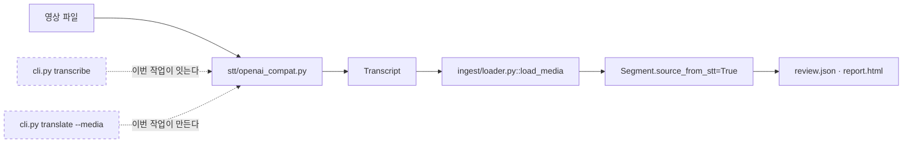
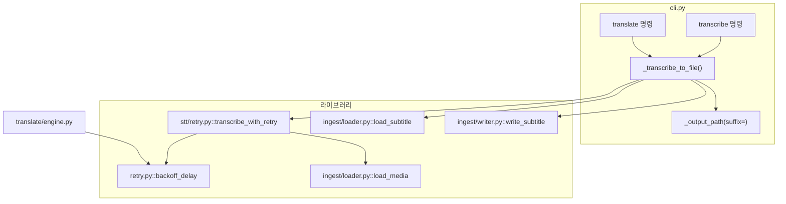
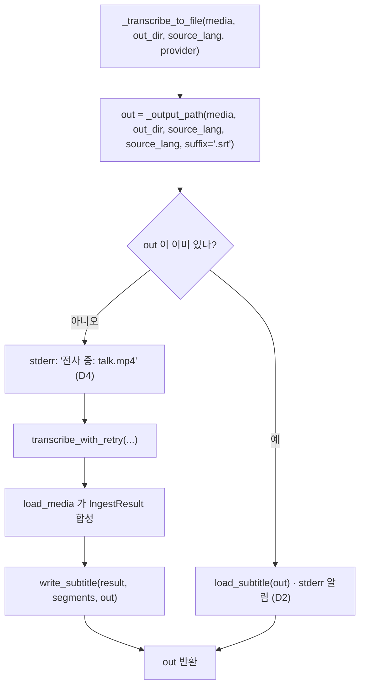

# 설계 스펙 — `transcribe` 배선과 `--media` 입력 (FR-8.3)

> 2026-09-02 · WP6의 마지막 조각
> 선행: [STT 어댑터 설계 스펙](2026-08-30-stt-adapter-design.md) · [구현 계획](../plans/2026-09-01-stt-adapter.md)

## 1. 목적과 범위

### 1.1 무엇을 만드나

**WP9가 만든 어댑터를 부르는 CLI가 없다.** 어댑터부터 산출물까지는 이어져 있고
`cuesift transcribe`만 끊겨 있다 — 오늘 그 명령은 종료 코드 70(미구현)을 낸다.



이 작업이 내는 것은 **명령 둘이 아니라 진입점 둘과 그것들이 공유하는 헬퍼 하나**다.

| 산출 | 무엇 |
| --- | --- |
| `cuesift transcribe <영상>` | 전사만 해서 원문 자막을 쓴다 (FR-8.3) |
| `cuesift translate --media <영상> --to en` | 전사한 뒤 그 자막을 번역한다 |
| `_transcribe_to_file()` | 위 둘이 공유하는 헬퍼. **출력 규칙과 재사용 판정이 여기 한 곳에만 있다** |
| `cuesift/retry.py::backoff_delay` | `translate`와 STT가 공유하는 백오프 정책 |

### 1.2 이 작업이 함께 닫는 것

세 건 모두 **배선하는 순간에만 도달 가능해진다.** 미루면 조용히 깨진다.

| # | 무엇 | 왜 같은 커밋인가 |
| --- | --- | --- |
| 이월 1 (C1) | `_output_path`가 `talk.en.mp4`를 만들고 그 안에 SRT를 넣는다 | 오늘은 도달 경로가 없어 **어떤 게이트도 빨개지지 않는다.** 배선이 이것을 빼면 그때부터 조용히 깨진다 |
| 이월 7 | STT에 재시도 루프가 없다 | 어댑터는 `Retry-After`까지 실어 `RetryableProviderError`를 던지는데 **받는 코드가 리포 전체에 0건이다.** 넣지 않으면 사용자가 몇 분을 기다린 뒤 429 하나로 전부 잃는다 |
| **C2 재개봉** | `_reject_non_subtitle`의 "STT 입력은 아직 CLI에 배선되지 않았다"가 다시 거짓이 된다 | 2026-09-02에 한 번 고친 문구다. **배선이 그것을 또 거짓으로 만든다** |

**C2가 두 번째로 열리는 것이 이 표에서 가장 중요한 사실이다.** 같은 문장이 같은 이유로
두 번 거짓이 됐다 — 문구가 "현재 없는 것"을 서술하면 그것이 생길 때마다 거짓이 된다.
이번에는 **없는 것이 아니라 사용자가 할 조치**를 적는다(§7.2).

### 1.3 범위 밖 — 명시한다

| 무엇 | 왜 |
| --- | --- |
| `check --media` | `check`는 오늘 네트워크를 전혀 타지 않는 명령이다. `--media`를 붙이면 **CI 게이트로 쓰는 사용자에게 종료 코드 69가 새로 생긴다.** 사용자는 `transcribe` 뒤 `check`로 같은 일을 할 수 있다 |
| STT 재시도 횟수의 CLI 노출 | `translate`가 `--max-retries`를 노출하지 않는다. STT만 노출하면 비대칭이다 |
| `ProgressReporter` 연동 | `ProgressUpdate`는 `(done, total)`뿐이고 STT는 파일 하나에 요청 하나라 `(0,1)→(1,1)`밖에 못 낸다. **정보량이 0인 진행 막대**가 된다 |
| FR-1.5(원문 언어 자동 감지) | STT 응답의 `language`를 기록만 하는 현 상태를 유지한다. 자막 파일 입력까지 함께 닫을 때의 몫이다 |
| 이월 2·3·4·5·6·8 | 이번 배선으로 도달 가능해지지 않는다. HANDOFF의 이월 표에 그대로 남는다 |

## 2. 확정된 설계 결정

| # | 결정 | 이것이 아니면 |
| --- | --- | --- |
| **D1** | `translate --media`는 원문 자막을 **디스크에 쓰고** 그것을 번역 입력으로 쓴다 | 재실행마다 전사를 다시 한다 — 번역에는 캐시가 있는데 **그보다 비싼 단계만 매번 다시 도는** 구조가 된다 |
| **D2** | 출력 자막이 이미 있으면 **재사용하고 stderr로 알린다** | 덮어쓰면 사용자가 손으로 고친 원문이 예고 없이 사라진다. 오류로 멈추면 같은 명령을 두 번 돌리는 흔한 행동이 오류가 된다 |
| **D3** | STT 재시도 횟수는 **모듈 상수**다 | `translate`의 LLM 재시도는 못 바꾸는데 STT만 바꿀 수 있는 비대칭이 생긴다 |
| **D4** | 진행 표시는 **시작 줄 + 재시도 알림**이다. `ProgressReporter`를 쓰지 않는다 | 0%에서 몇 분 멈췄다가 100%로 뛰는 막대를 보게 된다 — 사용자가 알고 싶은 것은 진행률이 아니라 **"멈춰 있는 것인가 기다리는 것인가"** 다 |
| **D5** | `transcribe`와 `--media`가 **헬퍼 하나**를 공유한다 | 재사용 판정과 출력 경로 규칙이 두 곳에 중복되고, 한쪽만 고치면 두 명령이 다른 파일을 낸다 — 그 갈림은 예외가 아니라 조용하다 |
| **D6** | `_output_path`의 `suffix`는 **필수 키워드 인자**다 | 기본값을 두면 위험한 쪽이 기본이 되어 **같은 버그가 그대로 산다.** 다음에 영상 경로를 하나 더 붙이는 사람이 똑같이 밟는다 |
| **D7** | STT 엔드포인트는 `--stt-base-url`·`CUESIFT_STT_BASE_URL`로 **번역과 분리**한다 | Ollama는 `/v1/audio/transcriptions`를 제공하지 않는다(WP9 실측). 하나로 묶으면 사용자가 **번역과 전사 중 하나를 반드시 못 쓴다** |
| **D8** | `--media`도 `BINDINGS`에 싣는다 | 상등 게이트(`test_매핑표가_CLI_옵션_집합과_상등이다`)가 예외를 허용하지 않는다. 예외 목록을 만들면 **"죽은 행" 검사가 약해진다** |

## 3. 착수 조사 — 실측

**문서에 있던 것과 코드가 갈린 지점이 넷이다.** 파생 문서의 함의는 원본보다 약하다는
이 리포의 규율이 그대로 발동했다.

| # | 문서가 말한 것 | 코드 | 조사 명령 |
| --- | --- | --- | --- |
| P1 | HANDOFF: "영상을 `run`에 주면 66" | **`run` 명령이 없다.** `@app.command()`는 `translate`·`check`·`transcribe` 셋뿐이고 `def run()`은 콘솔 스크립트 진입점이다 | `grep -n "^@app.command" src/cuesift/cli.py` |
| P2 | HANDOFF: "`cuesift.stt.transcribe_media(...)`가 동작한다" | `stt/__init__.py`의 `__all__`에 그런 이름이 없다. 실제 진입점은 `ingest/loader.py::load_media`다 | `cat src/cuesift/stt/__init__.py` |
| P3 | 이월 7번: "재시도 루프를 함께 넣어야 한다" | **`_call_with_retry`를 그대로 쓸 수 없다.** `provider.complete(messages, temperature, max_tokens)`에 묶여 있고 STT는 `transcribe(audio, language=)`다 | `sed -n '482,530p' src/cuesift/translate/engine.py` |
| P4 | — | **`config/schema.py`가 이미 `transcribe`를 안다.** `Binding` 주석이 *"하나로 좁히면 FR-8.3 배선 시점에 '모든 옵션'이 조용히 거짓이 된다"* 고 미리 적어 두었다 | `sed -n '43,58p' src/cuesift/config/schema.py` |

P4는 **선행 작업이 이 시점을 예상하고 남긴 장치**다. 그 예상이 맞았다 — 옵션을 늘리면
매핑표도 늘어야 하고, 늘리지 않으면 상등 게이트가 배선을 막는다.

P3이 이 스펙에서 가장 값비싼 실측이다. "재시도 루프를 넣는다"는 문장은 **기존 루프를
재사용한다는 뜻으로 읽히지만** 시그니처가 달라 성립하지 않는다. 재사용할 수 있는 것은
루프가 아니라 **백오프 정책 함수 하나**다.

## 4. 구조

### 4.1 모듈 경계



**새로 생기는 것은 둘뿐이다.**

| 모듈 | 무엇 | 왜 여기인가 |
| --- | --- | --- |
| `cuesift/retry.py` | `backoff_delay(attempt, retry_after_s)` | `translate/engine.py`에서 승격한다. **두 경로가 같은 정책을 쓰는 것이 요점이다** — 각자 두면 한쪽만 상한을 고쳐 다른 쪽이 무한정 자란다 |
| `cuesift/stt/retry.py` | `transcribe_with_retry(provider, audio, *, language, on_retry)` | 라이브러리에 둔다. `cli.py`에 두면 **파이썬 호출자는 재시도를 못 얻는다** — 어댑터가 재시도 가능이라고 말해도 받을 코드가 다시 0건이 된다 |

`SttProvider` 프로토콜의 계약 3번(*"재시도하지 않는다. 호출부가 한다"*)은 그대로다.
`transcribe_with_retry`는 프로토콜 구현체가 아니라 **그 호출부**다.

### 4.2 데이터 흐름 — `_transcribe_to_file`



**반환은 `Path`다.** `IngestResult`가 아니라 경로를 내는 것이 D5의 핵심이다 —
`translate`는 그 경로를 평소의 자막 입력처럼 다루므로 **번역 경로가 STT를 전혀 모른다.**
`--media`가 번역 파이프라인 안쪽에 분기를 만들지 않는다.

`source_lang`을 `target_lang` 자리에도 넘기는 것이 `_output_path`의 재사용 방식이다.
`talk.mp4` → `talk.ko.srt`가 되고, `talk.ko.mp4`처럼 이미 태그가 붙은 입력은
치환 규칙이 작동해 역시 `talk.ko.srt`가 된다 — **두 입력이 같은 출력을 낸다.**

### 4.3 `_output_path`의 변경 (D6)

```python
# 전 (cli.py:812) — 입력 확장자를 무조건 상속한다
return directory / f"{stem}.{target_lang}{input_path.suffix}"

# 후 — 호출부가 명시한다
def _output_path(
    input_path: Path, out_dir: Path | None, source_lang: str, target_lang: str, *, suffix: str
) -> Path:
    ...
    return directory / f"{stem}.{target_lang}{suffix}"
```

| 호출부 | 넘길 값 |
| --- | --- |
| `cli.py:1367`·`1776`·`1986` (기존 번역 경로) | `input_path.suffix` — **동작이 바뀌지 않는다** |
| `_transcribe_to_file` (신설) | `".srt"` — `load_media`가 `format="srt"`로 고정하므로(WP9 D6) 이것이 유일하게 옳은 값이다 |

**필수 인자인 것이 게이트다.** 다음에 영상 경로를 하나 더 붙이는 사람은 값을 넘기지
않으면 `TypeError`를 받는다 — 조용한 실패가 시끄러운 실패가 된다.

## 5. 명령 표면

### 5.1 옵션

| 명령 | 신설 옵션 | 기본값 |
| --- | --- | --- |
| `transcribe` | `--out` | 없으면 입력 파일과 같은 디렉터리 |
| `transcribe` · `translate` | `--stt-base-url` | 없으면 `CUESIFT_STT_BASE_URL` |
| `transcribe` · `translate` | `--stt-model` | 없으면 `CUESIFT_STT_MODEL` |
| `translate` | `--media` | 없음 |

API 키는 `CUESIFT_STT_API_KEY`를 읽고, 없으면 `CUESIFT_API_KEY`로 폴백한다 —
같은 조직의 키를 쓰는 경우가 흔하고, 폴백이 없으면 사용자가 같은 값을 두 번 쓴다.

### 5.2 `translate`의 위치 인자가 선택으로 바뀐다

**이번 변경에서 가장 까다로운 지점이다.**

```text
cuesift translate talk.ko.srt --to en          # 기존 — 그대로 동작한다
cuesift translate --media talk.mp4 --to en     # 신설 — 위치 인자가 없다
cuesift translate talk.ko.srt --media talk.mp4 --to en   # 종료 코드 2
cuesift translate --to en                      # 종료 코드 2
```

| 무엇 | 지금 | 이후 |
| --- | --- | --- |
| `input` 타입 | `Path` (필수) | `Path \| None` |
| `exists=True` 검증 | typer가 한다 | **본문에서 한다** — `--media`만 준 경우 검증할 대상이 없다 |

typer의 선언적 검증을 본문으로 옮기는 것이므로, **"파일이 없다"의 종료 코드가 2에서
바뀌지 않는지**를 회귀 테스트로 고정한다(§8.1 G3). 여기가 어긋나면 CI에서 경로 오타가
"파일 사정(66)"으로 보고되기 시작한다.

### 5.3 `cuesift.yaml` 매핑 (D8)

```yaml
stt:
  base_url: http://localhost:9000/v1
  model: whisper-1
input:
  media: talk.mp4
```

| YAML 경로 | CLI 파라미터 |
| --- | --- |
| `stt.base_url` | `transcribe.stt_base_url` · `translate.stt_base_url` |
| `stt.model` | `transcribe.stt_model` · `translate.stt_model` |
| `output.dir` | `translate.out` · **`transcribe.out`** (기존 행에 대상 추가) |
| `input.media` | `translate.media` |

`source_lang` 행처럼 `targets` 튜플이 둘을 가리키는 형태다. 이미 그 구조를 쓰고 있어
새로운 개념이 들어가지 않는다.

## 6. 재시도 계약

```python
_STT_MAX_RETRIES = 3      # 총 호출 4회 (translate 의 max_retries 와 같은 뜻)
```

| 상황 | 동작 |
| --- | --- |
| `RetryableProviderError` | `backoff_delay(attempt, exc.retry_after_s)`만큼 자고 다시 건다 |
| `FatalProviderError` | **즉시 전파한다.** 401·`verbose_json` 미지원은 다시 걸어도 같다 |
| 재시도 소진 | 마지막 `RetryableProviderError`를 전파한다. CLI가 69로 번역한다 |
| 마지막 시도 뒤 | **자지 않는다.** 호출 N+1회에 대기는 N회다 |

`on_retry` 콜백이 CLI에 알린다 — 라이브러리가 문구를 알지 않는다. `ProgressUpdate`가
단계 이름을 싣지 않는 것(FR-8.5 D2)과 같은 이유다.

```text
전사 중: talk.mp4
429 — 5.0초 뒤 재시도 (2/4)
```

**두 예외를 형제로 두는 계약이 여기에도 걸린다.** `FatalProviderError`를
`RetryableProviderError`의 하위로 옮기면 이 루프가 인증 실패를 4번 재시도한다 —
`translate/engine.py::_call_with_retry`의 독스트링이 같은 사고를 기록하고 있다.

## 7. 실패 처리

### 7.1 종료 코드

| 상황 | 코드 | 근거 |
| --- | --- | --- |
| 전사 성공 | 0 | |
| STT 재시도 소진 · `verbose_json` 미지원 · 인증 실패 | **69** | 기존 "외부 서비스가 요청을 거부함" |
| 영상 파일 없음 · 자막과 `--media` 동시 지정 · 둘 다 없음 | **2** | 기존 "명령줄이 틀림" |
| 전사 결과를 쓰지 못함 | **66** | 기존 "파일 사정" |
| ~~미구현(`transcribe`)~~ | ~~70~~ | **이 행이 표에서 사라진다** |

`cli.py` 모듈 독스트링의 종료 코드 표를 함께 고친다. 표를 안 고치면 **문서가 없는
동작을 설명하게 된다** — 70은 이제 "산출물의 내용 결함"만 뜻한다.

### 7.2 `_reject_non_subtitle`의 문구 (C2 재개봉)

```text
전: "영상·오디오 입력이다. STT 입력은 아직 CLI에 배선되지 않았다.
     FR-1.3에 따라 자막 파일이 있으면 그것을 넣는다."

후: "자막 자리에 영상·오디오가 왔다. 전사하려면 --media 로 주고,
     자막 파일이 있으면 FR-1.3에 따라 그것을 넣는다."
```

**"아직 없다"를 쓰지 않는 것이 이번 수정의 요점이다.** 그 형태의 문장은 기능이 생길
때마다 거짓이 되고, 실제로 두 번 거짓이 됐다. 뒤 문구는 **사용자의 조치**를 말하므로
배선 이후에도 참으로 남는다.

`load_input`의 `video_input` 분기 메시지도 같은 이유로 손본다 — 그쪽은 라이브러리
호출자를 향하므로 `provider`를 넘기라는 현재 문구가 옳고, 바꾸지 않는다.

## 8. 테스트 전략

### 8.1 실패를 먼저 확인할 게이트

**게이트를 만들면 반드시 실패시켜 봐야 한다.** 각 행은 "이 픽스 이전 코드에서 실제로
죽는가"를 확인한 뒤에야 게이트다.

| # | 게이트 | 픽스 이전에 무엇이 죽나 |
| --- | --- | --- |
| **G1** | `transcribe talk.mp4` 의 출력이 `talk.ko.srt`다 | `suffix` 인자가 없던 원형은 `talk.ko.mp4`를 낸다 — **확장자만 다르고 예외는 없다** |
| **G2** | `translate --media talk.mp4 --to en` 이 두 파일(`talk.ko.srt`·`talk.en.srt`)을 낸다 | 원형은 `talk.ko.mp4`·`talk.en.mp4`를 낸다 |
| **G3** | 없는 자막 경로는 여전히 종료 코드 2다 | `exists=True`를 본문 검증으로 옮기다가 66으로 흘리면 죽는다 |
| **G4** | 이미 있는 `talk.ko.srt`를 재사용하고 프로바이더 호출이 **0회**다 | 매번 전사하는 구현에서 `provider.calls == []`가 죽는다 |
| **G5** | 429 → 성공에서 프로바이더가 **2회** 불리고 `backoff_delay`가 서버 힌트를 쓴다 | 재시도 루프가 없으면 1회에서 예외가 샌다 |
| **G6** | `FatalProviderError`는 재시도되지 않는다 (호출 1회) | 두 예외를 한 절로 잡는 구현에서 4회가 된다 |
| **G7** | `transcribe`가 종료 코드 70을 내지 **않는다** | 스텁이 남아 있으면 죽는다 |
| **G8** | `_output_path`를 `suffix` 없이 부르면 `TypeError` | 기본값을 둔 구현에서 통과한다 — **D6이 지켜지는지를 직접 보는 게이트다** |

G4의 `provider.calls == []`는 WP9가 `load_input`의 분기 순서를 고정할 때 쓴 것과
같은 장치다. **호출이 일어나지 않았음을 확인하는 것은 결과를 확인하는 것으로 대체되지
않는다** — 전사하고 버려도 결과 파일은 같다.

### 8.2 게이트 수치

| 게이트 | 지금 | 이후 |
| --- | --- | --- |
| `pytest -q` | 1700 passed · 5 deselected | 늘어난다 |
| `test_CLI_옵션은_24개다` | 24 (translate 20 · check 3 · transcribe 1) | **30** (translate 23 · check 3 · transcribe 4) — 테스트 이름도 함께 바꾼다 |
| `test_매핑표가_CLI_옵션_집합과_상등이다` | 통과 | `BINDINGS`에 3행을 더하고 `output.dir` 행에 대상을 추가해야 통과한다 |
| `ruff check .` / `format --check .` | 123 files | 신규 모듈 2개만큼 늘어난다 |
| `check_links.py` / markdownlint | 41 / 41 | **두 수가 같은지를 본다** — 이 스펙과 계획서를 `git add` 하지 않으면 갈린다 |

**옵션 개수 테스트는 이름에 숫자가 박혀 있다.** `test_CLI_옵션은_24개다`를 그대로 두고
값만 고치면 이름이 거짓이 된다 — 함수명도 바꾼다.

## 9. 위험

| # | 위험 | 대응 |
| --- | --- | --- |
| R1 | `translate`의 위치 인자를 선택으로 바꾸며 기존 오류 경로가 어긋난다 | G3이 종료 코드 2를 고정한다. **회귀 범위가 STT가 아니라 기존 번역 경로 전체다** |
| R2 | 재사용(D2)이 낡은 자막을 조용히 쓴다 | 알림 줄이 유일한 방어다. 영상이 바뀌어도 자막 파일명이 같으면 감지하지 못한다 — **§10에 남긴다** |
| R3 | STT 백엔드가 정해지지 않아 live 검증을 못 한다 | Ollama는 `/v1/audio/transcriptions`를 제공하지 않는다. **가짜 프로바이더로만 검증하고 그 한계를 인수인계에 적는다** |
| R4 | `CUESIFT_STT_*` 분리로 설정이 늘어 사용자가 헷갈린다 | 오류 메시지가 두 변수 이름을 모두 적는다. `translate`의 기존 메시지와 같은 형태다 |
| R5 | `_output_path` 시그니처 변경이 이번 범위 밖 호출부를 깬다 | 호출부는 3곳뿐이다(실측). `TypeError`는 조용하지 않아 게이트가 반드시 잡는다 |

## 10. 미해결

| 무엇 | 왜 지금 안 정하나 |
| --- | --- |
| 재사용 자막의 신선도 검증 | 영상의 mtime·크기를 자막에 기록해 비교하는 방법이 있으나, **자막 포맷에 메타데이터를 넣는 결정**이라 이번 범위를 넘는다. 오늘은 사용자가 파일을 지우는 것이 유일한 무효화 수단이다 |
| `transcribe`의 다국어 동시 처리 | `translate`는 `--to en,ja`를 받지만 전사는 원문 하나다. 여러 영상을 한 번에 받는 표면은 필요해질 때 만든다 |
| FR-1.5(원문 언어 자동 감지) | STT 응답의 `language`를 `IngestResult.source_lang`에 실을지가 미정이다. 값 도메인이 백엔드마다 달라 자막 파일 입력까지 함께 봐야 한다 |
