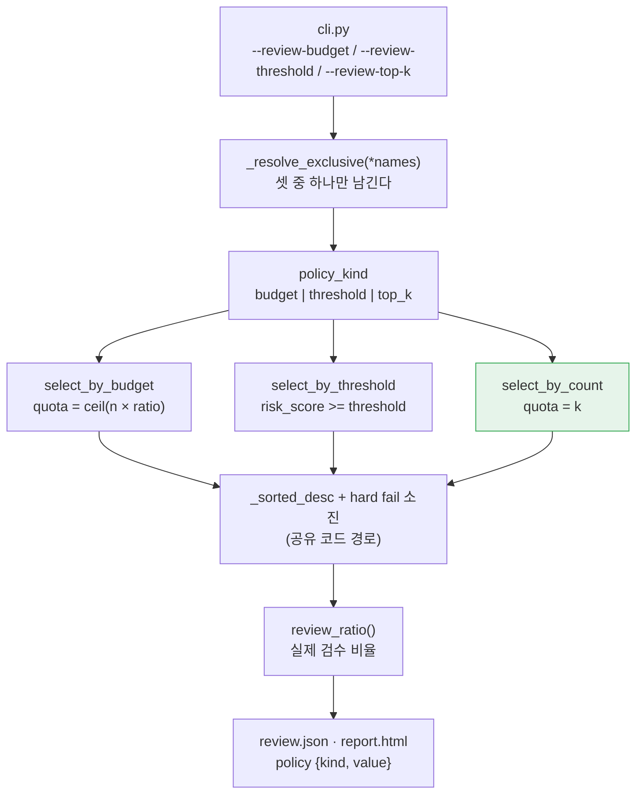

# 설계 스펙 — 개수 기반 검수 예산 `--review-top-k` (FR-6.3 ①)

> 2026-09-03 · 선행: [트리아지 CLI 배선](2026-08-18-triage-cli-design.md)(`5605fda`) ·
> [review.json](2026-08-18-review-json-design.md) · [설정 파일](2026-08-28-config-file-design.md)
> 근거 FR의 출처는 [요구사항정의서](../../요구사항정의서.md), 진척은 [WBS](../../WBS.md)다

## 1. 목적과 범위

### 1.1 무엇을 만드나

[요구사항정의서](../../요구사항정의서.md) FR-6.3은 트리아지 정책을 두 방식으로 지정할 수 있게 하라고 요구한다.

| 방식 | 본문 | 현재 |
| --- | --- | --- |
| ① 검수 예산 | **상위 N% 또는 상위 K개** | 🟡 **비율만 있다** |
| ② 위험도 임계값 | `--review-threshold` | ✅ 닫혔다 |

**이 설계가 닫는 것은 ①의 나머지 절반인 "상위 K개" 하나다.** 그것이 FR-6.3을 🟡에서 ✅로
올리는 마지막 조각이고, v0.1 대상 42개 중 완료 개수를 40에서 41로 올린다.

닫는 방식은 세 층에 걸친다.

| 층 | 무엇 | 파일 |
| --- | --- | --- |
| 라이브러리 | `select_by_count(risks, k)` 신설 | `src/cuesift/triage/policy.py` |
| 사용자 통로 | `--review-top-k` 옵션과 `triage.review_top_k` 설정 키 | `src/cuesift/cli.py` · `src/cuesift/config/schema.py` |
| 산출물 | `policy.kind = "top_k"` | `src/cuesift/report/models.py` |

세 층을 모두 지나야 FR이 닫힌다는 것은 이 저장소가 이미 세 번 배운 것이다
(§0.1의 축 1·축 2, FR-5.3·FR-6.3·FR-4.3의 전례).

### 1.2 범위 밖 — 명시한다

| 항목 | 어디로 | 근거 |
| --- | --- | --- |
| `--review-top-k`와 `--tier1`의 공존 | 이월 | `triage_with_tier1()`이 `budget_ratio: float`를 필수로 받는다. D2 참고 |
| hard fail이 K를 넘을 때 K로 자르기 | **하지 않는다** | FR-6.2가 "hard fail은 예산을 우회한다"이다. D6 참고 |
| `select_by_budget`의 `ceil` 규칙 변경 | 건드리지 않는다 | 비율 방식의 계약이고 이 작업과 무관하다 |
| `review.json` 스키마 버전 도입 | 필요해질 때 | `kind` 값이 느는 것은 하위호환 확장이다. §6 참고 |
| 벤치마크 하네스의 개수 예산 스윕 | 별도 과제 | §6.1의 예산 스윕은 비율 축으로 정의돼 있다 |

한 줄로 말하면, **이 설계는 개수 축을 CLI까지 열되 Tier 1과 벤치마크는 비율 축에 남긴다.**

### 1.3 왜 지금까지 보류였나 — 그리고 그 근거 중 하나는 무효다

[트리아지 CLI 설계](2026-08-18-triage-cli-design.md)의 **D5**가 개수 지정을 exit 2로 거부하면서
근거를 둘 들었다.

| 근거 | 지금 판정 |
| --- | --- |
| "라이브러리에 대응 함수가 없다" | **유효했다.** 이 설계가 `select_by_count`로 닫는다 |
| "`k/n` 환산은 `ceil`과 hard fail 소진 때문에 정확히 K개를 못 내 옵션이 거짓말을 한다" | **절반만 유효하다.** 아래 참고 |

두 번째 근거는 **`k/n` 환산을 전제한 것**이다. 개수 전용 함수를 만들면 `ceil` 오차는 발생 자체가
없어진다. 그러나 **hard fail 소진은 남는다** — hard fail이 K를 넘으면 선별 개수가 K를 넘는다.

**이 잔여분을 D5의 논리대로 "거짓말"이라고 부르면 `--review-budget`도 같은 죄로 폐기해야 한다.**
비율 방식도 정확히 N%를 내지 않기 때문이다. 실제로 그 성질은 `select_by_budget`의 독스트링이
이미 설계로 명시하고 있고, §6.2가 "요청 예산"과 "실제 검수 비율"을 구분하는 이유가 그것이다.
그러므로 잔여분의 처리는 **거부가 아니라 표시**다(D6).

## 2. 확정된 설계 결정

| # | 결정 | 이것이 아니면 무엇이 깨지나 |
| --- | --- | --- |
| **D1** | **`--review-top-k`를 신설한다.** `--review-budget`에 개수 문법을 얹지 않는다 | `--review-budget`은 `1`을 **100%로** 해석하도록 계약돼 있다(`_parse_review_budget` 독스트링). 같은 옵션에 정수 개수를 얹으면 `1`이 "전량"인지 "상위 1개"인지 값만으로 판정할 수 없고, 어느 쪽을 택해도 기존 사용자나 신규 사용자 한쪽이 조용히 틀린 결과를 받는다 |
| **D2** | **`--tier1`과 상호배타.** 함께 주면 exit 2 | `triage_with_tier1()`이 `budget_ratio: float`를 필수 키워드로 받고 내부 두 자리(`tier1.py:258`·`320`)에서 `select_by_budget`을 부른다. 개수를 통과시키려면 그 시그니처를 일반화해야 하는데, 이미 머지된 함수의 표면을 이 작업에서 함께 바꾸면 되돌리기 단위가 커진다 |
| **D3** | **설정 키 `triage.review_top_k`를 열고 `_resolve_exclusive`를 N자로 일반화한다** | 셋 중 하나만 설정 파일에 없으면 FR-8.4의 "설정 파일로 지정할 수 있다"에 구멍이 나고, 그 구멍은 문서에만 남아 사용자가 만날 때까지 아무도 모른다. §4.2 참고 |
| **D4** | **`K = 0`을 허용한다.** "hard fail만 보기"를 뜻한다 | `--review-budget 0`이 이미 그 뜻이고 그것을 독스트링이 명시적으로 지키고 있다(규칙을 좁혀 `1`을 거부하면 `0`도 함께 막혀 "hard fail만 보기"가 사라진다). 개수 축에서만 0을 거부하면 두 축이 비대칭이 된다 |
| **D5** | **`K > 세그먼트 수`는 전량 선별이고 오류가 아니다** | 비율 축의 `100%`가 허용되는 것과 같은 자리다. 오류로 만들면 세그먼트 수를 미리 아는 사람만 이 옵션을 쓸 수 있다 |
| **D6** | **hard fail이 K를 넘으면 선별이 K를 넘는다.** 자르지 않고 **실제 개수를 표시한다** | 자르면 FR-6.2("hard fail은 검수 예산을 우회한다")를 정면으로 어긴다. 표시하지 않으면 §1.3이 말한 잔여분이 화면에서 사라져 D5의 우려가 현실이 된다 |
| **D7** | `policy_kind`에 `"top_k"`를 더하고 **`policy_value`의 타입을 `int \| float`로 넓힌다** | `float`로 두면 `review.json`에 `"value": 50.0`이 나간다. 개수를 소수로 적는 파일을 도구가 읽는다 |
| **D8** | `select_by_count`는 **`bool`을 거부한다** | `bool`은 `int`의 서브클래스라 `select_by_count(risks, True)`가 조용히 `K=1`로 동작한다. 이 모듈은 같은 부류(NaN)를 세 자리에서 명시적으로 막고 있고, 그 이유가 "비교 연산의 우연에 맡기면 리팩터링 한 번에 조용히 깨진다"였다 |

D1이 표면을 정하고, D2·D3이 경계를 정하고, D4~D6이 값 규칙을, D7·D8이 방어를 정한다.

## 3. 착수 조사 — 실측

**파생 문서에서 읽은 사실은 원본에서 읽은 것보다 약하다**([CLAUDE.md](../../../CLAUDE.md))는 규율에 따라
설계의 전제를 코드로 확인했다.

| # | 확인한 것 | 실측 | 설계에 미친 영향 |
| --- | --- | --- | --- |
| M1 | 개수 기반 선별 함수의 부재 | `triage/policy.py`에 `select_by_budget`·`select_by_threshold`·`select_tier1_candidates`·`gray_zone`·`review_ratio` 다섯뿐 | §1.3의 첫 근거가 유효함을 확인 |
| M2 | `--review-budget`의 `1` 해석 | `_parse_review_budget`이 `0.0 <= value <= 1.0`으로만 검사한다. `1` → `1.0` = 100% | **D1의 직접 근거** |
| M3 | `_resolve_exclusive`의 항수 | 시그니처가 `(ctx, message, first, second) -> str`로 **2항 고정**. 호출부는 `cli.py:1303`·`1315`·`1333` **세 곳** | **D3의 비용.** §4.2가 이 셋을 어떻게 다루는지 정한다 |
| M4 | `triage_with_tier1`의 시그니처 | `budget_ratio: float`가 **필수 키워드**이고 내부 `select_by_budget` 호출이 `tier1.py:258`·`320` 두 자리 | **D2의 근거** |
| M5 | `policy_value`의 타입 | `report/models.py:219`가 `policy_value: float`. `json_report.py:35`가 그대로 직렬화한다 | **D7의 근거** |
| M6 | CLI 옵션 개수 게이트 | `tests/test_config_schema.py:34`가 `len(_cli_options()) == 30`을 고정하고, 같은 파일이 `BINDINGS`와의 **집합 상등**도 고정한다 | 옵션을 늘리면서 매핑표를 빠뜨리면 **게이트가 먼저 잡는다.** §7.2 참고 |

M3과 M5가 이 설계의 실제 작업량을 정한다. 나머지 넷은 이미 내린 결정의 근거를 굳힌다.

## 4. 구조

### 4.1 선별 경로 — 개수 축이 어디에 붙나



**새로 생기는 것은 초록 상자 하나뿐이다.** 정렬·hard fail 소진·사본 생성은 이미 있는 헬퍼
(`_sorted_desc`·`_copy`)를 그대로 쓴다. 그래야 동점 처리 규칙이 세 정책에서 같고, NFR-3(재현성)이
축마다 갈리지 않는다.

### 4.2 `select_by_count` — `select_by_budget`과 무엇이 같고 무엇이 다른가

```python
def select_by_count(risks: Sequence[SegmentRisk], k: int) -> list[SegmentRisk]:
    """위험도 상위 `k`개를 검수 큐에 담는다 (FR-6.3 ①)."""
```

| 항목 | `select_by_budget` | `select_by_count` |
| --- | --- | --- |
| 반환 | 전체 목록 · `selected`만 채운다 | **같다** |
| 입력 변형 | 하지 않는다(`_copy`가 가변 필드까지 복사) | **같다** |
| 정렬 | `_sorted_desc` — 동점은 세그먼트 ID | **같다** |
| hard fail | quota를 소진하고, 넘으면 quota를 초과한다 | **같다**(D6) |
| quota | `math.ceil(len(risks) * budget_ratio)` | **`k` 그대로.** 환산이 없다 |
| 값 방어 | `math.isnan` · `0.0 <= x <= 1.0` | **`bool` 거부**(D8) · `k >= 0` |

**다른 줄이 두 개뿐인 것이 요점이다.** 계약이 갈리면 `review_ratio`에 넘겼을 때의 의미가 축마다
달라지고, 그 값이 README 최상단 배수의 분모다.

### 4.3 `_resolve_exclusive`의 N자 일반화

```text
현재  (ctx, message, first: str, second: str) -> str        버릴 이름 하나
변경  (ctx, message, *names: str)             -> list[str]  버릴 이름들
```

판정 규칙은 지금의 원리를 그대로 확장한다. **명령줄이 설정 파일을 이긴다**(FR-8.4 후반절)가 축이다.

| 명령줄에서 온 것 | 처리 | 지금 2항에서의 대응 |
| --- | --- | --- |
| 정확히 1개 | 나머지(설정에서 온 것)를 **전부** 버린다 | `from_first != from_second`일 때 설정 쪽을 버리는 가지 |
| 2개 이상 | exit 2 — 원래의 사용법 오류다 | `from_first == from_second == False` |
| 0개 (전부 설정에서) | exit 2 — **설정 파일 자체가 모순이다.** 메시지에 출처를 밝힌다 | `from_first == from_second == True` |

세 행이 지금의 세 가지와 하나씩 대응하므로, **2항 호출의 동작은 변하지 않는다.** 변하는 것은
반환 타입뿐이고, 그래서 호출부 세 곳(M3)이 `== "이름"` 비교에서 `in losers` 판정으로 바뀐다.

**호출부를 고치는 것 자체가 위험이다**(R1). 기존 두 쌍(`cache_dir`/`no_cache`,
`input`/`media`)의 동작이 그대로인지는 §7.1의 회귀 테스트가 지킨다.

## 5. 명령 표면

### 5.1 옵션과 값 규칙

| 값 | 결과 | 근거 |
| --- | --- | --- |
| `--review-top-k 50` | 상위 50개(+ hard fail) | 본 설계 |
| `--review-top-k 0` | **hard fail만 검수 큐로** | D4 |
| `--review-top-k -1` | exit 2 | |
| `--review-top-k 1000` (세그먼트 100개) | **전량 선별.** 오류가 아니다 | D5 |
| `--review-top-k 3.5` | exit 2 — `typer`의 `int` 변환이 거부한다 | |
| `--review-top-k 50 --review-budget 10%` | exit 2 (둘 다 명령줄일 때) | D3 · §4.3 |
| `--review-top-k 50 --tier1` | exit 2 | D2 |
| `--review-top-k 50 --review-out out/` | **동작한다** | 세 정책 중 하나면 리포트가 성립한다 |

표시 라벨은 사용자가 준 원문을 쓴다. `policy_label = f"상위 {k}개"`이고, 이해가 맞았는지는
그 옆에 이미 출력되는 실제 검수 비율이 말한다.

### 5.2 `cuesift.yaml` 매핑 (D3)

```yaml
triage:
  review_budget: 10%      # 기존
  review_threshold: 0.7   # 기존
  review_top_k: 50        # 신설
```

`Binding(("triage", "review_top_k"), (("translate", "review_top_k"),))` 한 행이 `BINDINGS`에 들어간다.
**`ALLOWED_PATHS`는 `BINDINGS`에서 파생되므로 손으로 고치지 않는다** — 손으로 두면 "허용은 되는데
아무 데도 안 가는 키"가 생긴다(설정 파일 설계 §4.1).

`click`이 `default_map`의 값에도 타입 변환을 적용하므로, YAML에 `review_top_k: "쉰"`처럼 적으면
본문의 양보 로직보다 먼저 터진다. **이 부류는 설정 예시를 실제로 실행하는 테스트만 잡는다**
([CLAUDE.md](../../../CLAUDE.md)의 `input.media` 전례).

### 5.3 종료 코드

새로 만드는 종료 코드는 없다. 사용법 오류는 전부 **exit 2**이고, 이는 기존 트리아지 옵션과 같다.

## 6. 리포트 파급 (D7)

| 파일 | 지금 | 변경 |
| --- | --- | --- |
| `report/models.py:218` | `policy_kind: str  # "budget" \| "threshold"` | `"top_k"` 추가 |
| `report/models.py:219` | `policy_value: float` | **`policy_value: int \| float`** |
| `report/json_report.py:35` | `{"kind": ..., "value": ...}` | 코드 변경 없음 — 파이썬 타입이 그대로 JSON 수치가 된다 |
| `report/html_report.py` | 정책 표시 | `"top_k"` 문구 추가. **`ratio`는 지금처럼 `review_ratio`를 쓴다** |

`review.json`에 나가는 모양은 다음과 같다.

```json
{ "policy": { "kind": "top_k", "value": 50 } }
```

**`50.0`이 아니라 `50`이어야 한다.** 이것이 D7의 전부이고, §7.1이 이 한 글자를 게이트로 고정한다.

## 7. 테스트 전략

### 7.1 실패를 먼저 확인할 게이트

**게이트를 만들면 반드시 실패시켜 봐야 한다.** 아래는 변경 이전 코드에서 실제로 죽는 것을
확인한 뒤에야 회귀 테스트로 인정한다.

| # | 게이트 | 변경 이전에 무엇으로 죽나 |
| --- | --- | --- |
| G1 | `select_by_count(risks, 3)`이 정확히 3개를 고른다 | 함수가 없다(`ImportError`) |
| G2 | hard fail 4개 · `k=2` → **선별 4개**(D6) | 〃 |
| G3 | `k=0` → hard fail만(D4) | 〃 |
| G4 | `k > n` → 전량(D5) | 〃 |
| G5 | `k=-1` → `ValueError` | 〃 |
| G6 | `select_by_count(risks, True)` → `ValueError`(D8) | 〃 |
| G7 | 동점에서 세그먼트 ID 순 · 입력 리스트 불변 | 〃 |
| G8 | `--review-top-k 50 --review-budget 10%` → exit 2 | 옵션이 없어 `No such option` |
| G9 | 설정에 `review_budget`, 명령줄에 `--review-top-k` → **top-k가 이긴다** | 〃 |
| G10 | 설정에 세 키가 전부 → exit 2에 "설정 파일에 둘 다 있다"가 아닌 **셋을 반영한 문구** | 2항 함수가 문구를 고정하고 있다 |
| G11 | `--review-top-k --tier1` → exit 2(D2) | 〃 |
| G12 | `review.json`의 `policy.value`가 **정수로 직렬화**된다 | `float`라 `50.0`이 나온다 |
| G13 | 기존 두 쌍(`cache_dir`/`no_cache`, `input`/`media`)의 양보가 그대로다 | **반환 타입 변경이 이 셋을 깨뜨릴 수 있다**(R1) |
| G14 | §5.2의 YAML 예시를 실제로 실행한다 | 허용 키가 아니라 거부된다 |

G13이 이 표에서 유일하게 **새 기능이 아니라 기존 동작을 지키는 게이트**다. R1이 현실이 되는
자리가 정확히 거기다.

### 7.2 게이트 수치

착수 시점(`main` = `1c1302b`)에서 잰 값이다. **"통과했나"가 아니라 "무엇을 대상으로 통과했나"를 본다.**

| 게이트 | 착수 시점 | 완료 시 기대 |
| --- | --- | --- |
| `pytest -q` | 1743 passed · 5 deselected | 늘어난다 |
| `ruff check .` | 통과 | 통과 |
| `ruff format --check .` | 129 files | 129 files |
| **CLI 옵션(`_cli_options()`)** | **30** | **31** |
| **YAML 허용 키(`ALLOWED_PATHS`)** | **28**(BINDINGS 26 + SPECIAL 2) | **29**(BINDINGS 27 + SPECIAL 2) |
| `scripts/check_links.py` | 마크다운 43개 · 상대 링크 221개 · 깨진 링크 0 | 늘어난다 · 깨진 링크 0 |
| `npx markdownlint-cli2` | Linting: 43 files · 0 issues | 늘어난다 · 0 issues |

**두 문서 도구의 파일 개수가 같은지를 본다.** 착수 시점에 둘 다 43개로 일치한다. 갈리면 새 문서가
`git add`되지 않아 링크 검사를 아예 받지 않은 것이다.

**옵션 개수와 허용 키 개수는 손으로 세는 값이 아니라 테스트가 고정한 값이다**(M6). 둘을 함께 올려야
`tests/test_config_schema.py`의 집합 상등이 유지되므로, **매핑표를 빠뜨리면 게이트가 먼저 잡는다.**

## 8. 위험

| # | 위험 | 왜 이번에 실제로 발생할 수 있나 | 대응 |
| --- | --- | --- | --- |
| **R1** | `_resolve_exclusive`의 반환 타입 변경이 기존 세 호출부를 깨뜨린다 | 반환이 `str`에서 `list[str]`로 바뀌는데 세 곳이 `== "이름"`으로 비교한다. **문자열과 리스트 비교는 예외를 던지지 않고 조용히 `False`가 된다** — 양보 로직이 통째로 죽어도 타입 검사도 실행도 조용하다 | G13. 기존 두 쌍의 양보 동작을 **변경 전에** 회귀 테스트로 고정하고, 그 테스트가 변경 후에도 통과하는 것을 본다 |
| **R2** | `policy_value` 타입 확장이 `review.json` 소비자에게 간다 | 기존 값은 전부 `float`였다. 소비자가 `float`를 가정한 파서를 쓰고 있으면 `int`에서 갈릴 수 있다 | 파이썬·JS 어느 쪽도 JSON 수치를 타입으로 가르지 않는다. **하위호환 확장으로 판정하고 스키마 버전을 올리지 않는다**(§1.2) |
| **R3** | D6의 잔여분이 "상위 K개"라는 이름과 어긋나 사용자가 오독한다 | hard fail 4개에 `--review-top-k 2`를 주면 4개가 나온다 | 요약이 실제 검수 비율을 이미 출력한다. **개수 축에서도 실제 개수를 함께 낸다**(D6) |
| **R4** | 개수 축이 벤치마크에 들어가지 않아 `Recall @ Budget`이 비율 축만 잰다 | §9.1의 지표 정의가 비율로 서술돼 있다 | **범위 밖으로 명시한다**(§1.2). 개수 축은 사용자 통로이지 지표 축이 아니다 |

R1이 이 작업에서 가장 비싼 위험이다. **새 기능이 아니라 이미 도는 코드를 건드리는 유일한 자리**이고,
실패가 예외가 아니라 침묵으로 나타난다.

## 9. 미해결

| 항목 | 상태 |
| --- | --- |
| `--review-top-k`와 `--tier1`의 공존 | **이월한다.** `triage_with_tier1`에 선별 전략을 주입하는 별도 작업이 필요하다(D2) |
| 개수 축의 예산 스윕 | 벤치마크가 비율 축으로 정의돼 있다. 필요해지면 별도 설계 |
| `--review-budget`의 `1` = 100% 계약 | **그대로 둔다.** D1이 이 계약을 건드리지 않는 것으로 문제를 회피했다 |

## 10. 파급 문서

| 문서 | 무엇을 고치나 |
| --- | --- |
| [요구사항정의서](../../요구사항정의서.md) **§5.6** | FR-6.3을 🟡에서 **✅**로. 축 2(완전성)가 닫히는 근거를 적는다 |
| [요구사항정의서](../../요구사항정의서.md) §8.1 | CLI 예시에 `--review-top-k`를 반영한다 |
| [요구사항정의서](../../요구사항정의서.md) §8.2 | 설정 예시에 `triage.review_top_k`를 넣는다. **예시는 §7.1 G14가 실제로 실행한다** |
| [요구사항정의서](../../요구사항정의서.md) **§8.4** | `review.json` 예시의 `policy.kind` 값 도메인이 셋이 된다(D7) |
| [요구사항정의서](../../요구사항정의서.md) §0.1 "완료 판정 기준" | 축 2의 예시가 "FR-6.3(상위 K개)"이다. **닫힌 뒤에는 그 예시가 과거형이 된다** |
| [WBS](../../WBS.md) | 완료 개수 40 → **41**. WP6의 FR-6.3 행 |
| [트리아지 CLI 설계](2026-08-18-triage-cli-design.md) | **D5를 정정한다** — §1.3의 판정을 반영해 "보류"가 닫혔음을 적고 이 문서를 가리킨다 |
| [review.json 설계](2026-08-18-review-json-design.md) | §500의 "상위 K개 정책(FR-6.3 ①의 나머지)" 행이 닫힌다. D7의 타입 확장을 반영한다 |
| `README.md` · `CHANGELOG.md` | 옵션 표와 변경 이력 |

§0.1의 축 2 예시가 과거형이 된다는 것은 사소해 보이지만, **그 절이 "완료를 어떻게 세는가"의 단일
출처**라 예시가 낡으면 다음 사람이 규칙을 오해한다.
