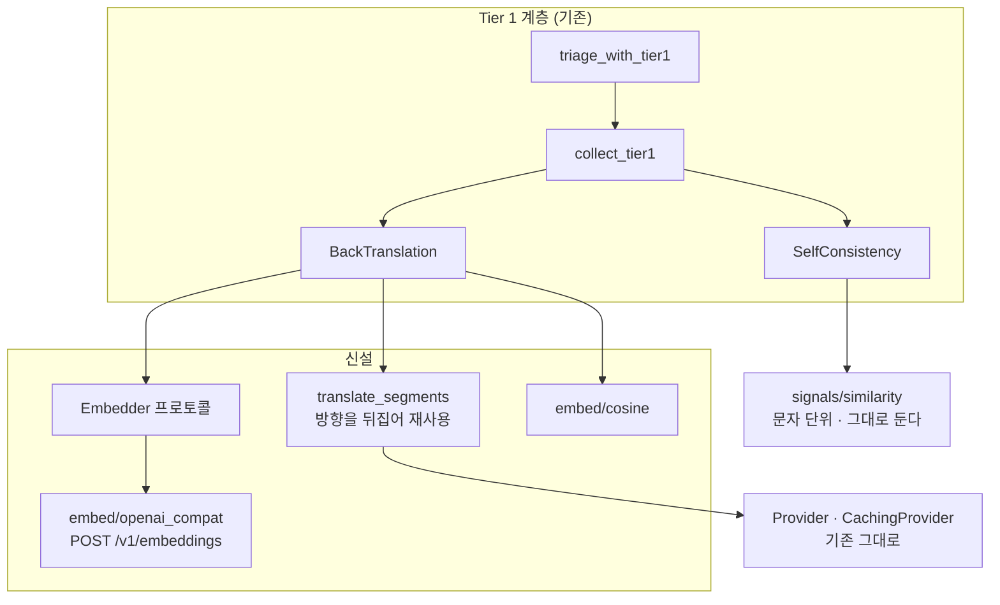
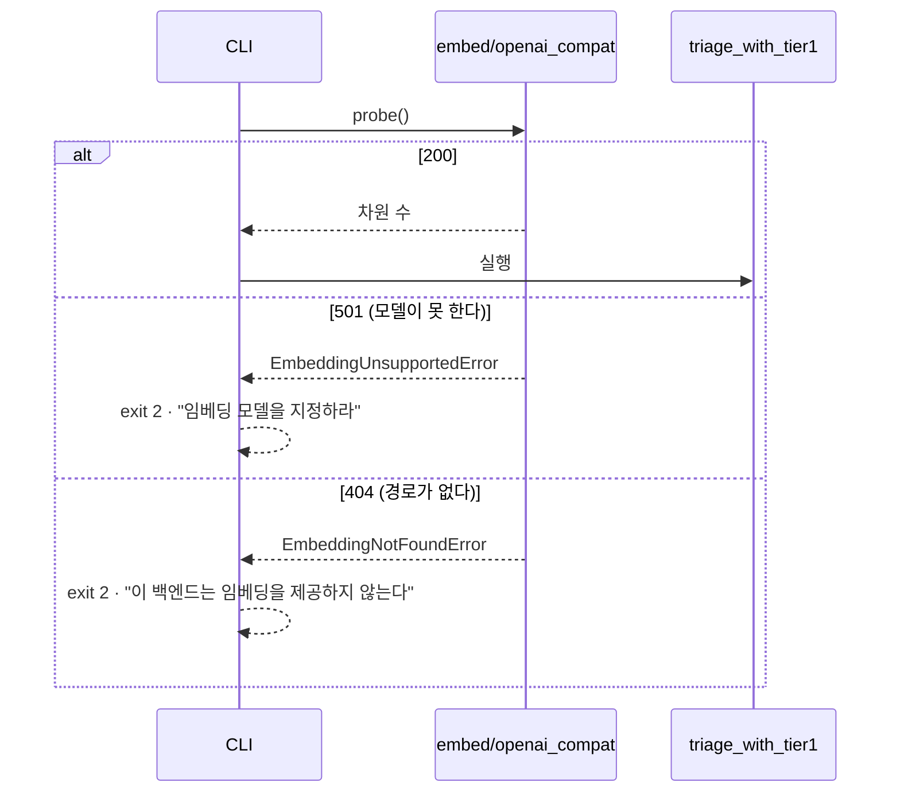
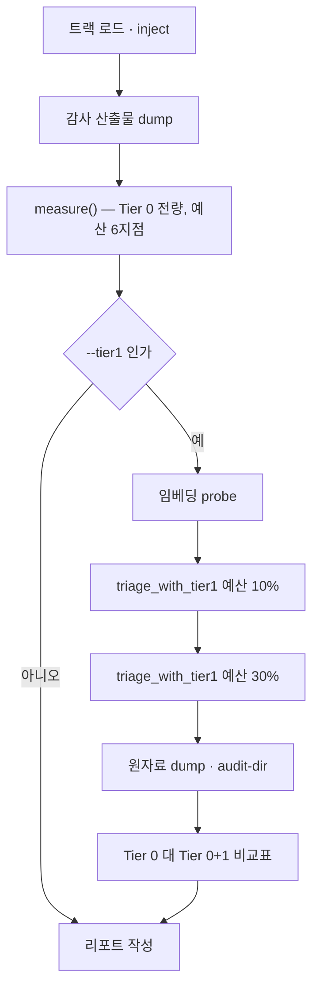

# 설계 — 역번역 유사도 신호와 벤치 측정 (FR-4.2)

> 근거 문서: [요구사항정의서](../../요구사항정의서.md) §4 · §5.4 · §12 Q4 ·
> [Tier 1 신호 설계](2026-08-17-tier1-signals-design.md) ·
> [Tier 1 CLI 설계](2026-08-25-tier1-cli-design.md)
>
> 실측 근거: [`bench/results/backtranslation-spike-2026-09-04.json`](../../../bench/results/backtranslation-spike-2026-09-04.json) ·
> [`bench/results/en-ko-2026-09-04.md`](../../../bench/results/en-ko-2026-09-04.md) ·
> [`bench/results/ja-ko-2026-09-04.md`](../../../bench/results/ja-ko-2026-09-04.md)

## 1. 목적과 범위

FR-4.2 는 v0.1 요구사항 42개 중 **마지막 하나**이다. 번역문을 원문 언어로
되돌린 뒤 원문과의 의미 유사도를 재서, Tier 0 가 원리적으로 잡지 못하는
의미 반전을 검수 큐로 올린다.

### 1.1 범위

| 들어간다 | 들어가지 않는다 |
| --- | --- |
| `embed/` 패키지 신설 (프로토콜 · OpenAI 호환 구현 · 코사인) | `llm.self_consistency` 의 문자 단위 유사도 교체 |
| `signals/backtranslation.py` 신호 구현 | Tier 2 (QE 모델) |
| `Tier1Context` 에 임베딩 계층 배선 | 임베딩 결과의 영속 캐시 |
| CLI 임베딩 옵션과 **시작 시점 가용성 탐지** | 상용 API 를 쓰는 경로 |
| `bench/run.py` 의 Tier 1 측정 (예산 10% · 30%) | 예산 6개 지점 전부에서의 Tier 1 측정 |
| `bench/classify_negation.py` 정답지 잡음 분류 | 그 분류를 CI 게이트로 승격하는 것 |
| 역번역 원자료의 세그먼트별 기록 (이월 20번) | 원자료를 리포에 커밋하는 것 (라이선스) |

### 1.2 이 설계가 답하지 않는 것

**자가일관성의 유사도 수단은 그대로 둔다.** §12 Q4 의 "임베딩이 8칸 전부에서
이겼다"는 실측은 **역번역 쌍**을 대상으로 잰 것이고, 자가일관성이 재는 것은
같은 원문을 N회 재번역했을 때의 **형태적 분산**이다. 두 신호가 같은 이름의
함수를 쓴다는 사실이 같은 근거를 공유한다는 뜻은 아니다. 게다가 자가일관성을
함께 바꾸면 2026-09-04 리포트가 비교 기준선으로서의 자격을 잃고, Recall 이
올랐을 때 어느 쪽 덕인지 갈리지 않는다.

**임베딩 결과를 디스크에 캐시하지 않는다.** 역번역(LLM 호출)은 기존
`CachingProvider` 가 그대로 덮으므로 비싼 쪽은 이미 캐시된다. 임베딩은 로컬
`bge-m3` 기준으로 싸고, 캐시를 넣으면 `store/cache.py` 와 형태만 닮은 코드가
하나 더 생긴다. 필요해지는 시점은 상용 임베딩 API 를 쓸 때인데, §12 Q4 의
부수 결론이 **역번역에 상용을 쓸 근거가 실측에 없다**고 판정했다.

## 2. 확정된 설계 결정

| # | 결정 | 이 값이 아니면 무엇이 깨지는가 |
| --- | --- | --- |
| D1 | 임베딩은 `embed/` 패키지로 분리한다 | `Provider` 프로토콜에 `embed()` 를 더하면 `CountingProvider`·`CachingProvider`·테스트 대역이 전부 미구현 메서드를 갖고, 번역만 하는 자리가 임베딩을 알게 된다 |
| D2 | 역번역에 용어집을 넘기지 않는다 | 용어집이 원문 어휘를 강제하면 **오류 문장의 역번역도 원문에 가까워져** 유사도 격차가 줄고 신호가 둔해진다 |
| D3 | 역번역 온도는 0.0 이다 | 온도를 올리면 같은 오류가 실행마다 다른 점수를 받아 NFR-3 재현성이 깨진다 |
| D4 | `Tier1Context.temperature` 를 쓰지 않는다 | 그 필드는 자가일관성 전용이고 `__post_init__` 이 `> 0` 을 강제한다. 재사용하면 D3 과 충돌한다 |
| D5 | 점수를 정규화하지 않는다 | "점수 스케일로 몰래 가중을 넣지 않는다" 규율. 코사인 분포를 펴는 변환은 가중치 튜닝과 같은 것이다 |
| D6 | `embedder` 가 없으면 예외를 던진다 | 조용히 `None` 을 내면 신호가 전 구간 0건으로 끝나고 그것이 "안전"으로 읽힌다 (Q3 무음 열화) |
| D7 | 임베딩 가용성을 **Tier 1 실행 전에** 탐지한다 | 뒤로 미루면 비싼 역번역을 수백 회 한 뒤 유사도 단계에서 전부 버리게 된다 |
| D8 | 벤치 Tier 1 은 예산 10% · 30% 두 지점만 | 10% 는 README 대표 수치가 나오는 지점, 30% 는 negation 판정이 갈린 지점이다. 6개 지점 전부를 돌면 고유 후보가 트랙당 1,500건으로 늘어난다 |
| D9 | 벤치의 `--tier1` 은 기본이 꺼짐이다 | 켜져 있으면 CI 와 기존 재현 경로가 LLM 백엔드를 요구하게 된다 |
| D10 | 원자료는 `--audit-dir` 쪽에 남긴다 | 자막 원문을 담으므로 CC BY-NC-ND 4.0 에 걸려 `bench/results/` 에 커밋할 수 없다 |

## 3. 이 설계의 근거가 된 실측

### 3.1 Tier 0 는 의미 반전을 큐에서 밀어낸다

2026-09-04 재측정(정정된 정답지 기준)이다.

| 예산 | `negation` Recall (en) | 같은 예산의 무작위 기준선 | 판정 |
| ---: | ---: | ---: | --- |
| 10% | 1.41% | 10.28% | 무작위의 **14%** |
| 30% | 19.72% | 30.44% | 무작위의 **65%** |

옛 정답지에서는 예산 30% 가 29.58% 대 29.68% 로 "무작위와 구분 불가"였는데,
이물질 `not` 을 Tier 0 가 우연히 잡아 Recall 을 부풀리고 있었기 때문이다.
정답지를 고치자 격차가 드러났으므로 **FR-4.2 의 착수 근거는 약해진 것이 아니라
강해졌다.**

### 3.2 역번역 신호의 판별력과 원리적 상한

2026-09-04 스파이크가 새 정답지의 negation 라벨 71건 × 2트랙으로 쟀다.

| 지표 | en-ko | ja-ko | 무엇을 뜻하나 |
| --- | ---: | ---: | --- |
| AUC (임베딩 · 절대 코사인) | 0.758 | 0.689 | 이 설계가 구현할 판정의 실측 성능 |
| AUC (문자 단위) | 0.569 | 0.509 | 임베딩이 en +0.190 · ja +0.180 으로 이긴다 |
| 복원율 | 21.8% (12/55) | 17.9% (10/56) | 역번역이 제거된 부정을 되살린 비율 |
| `delta_restored` | **-0.005** | **+0.011** | 복원된 건에서 **신호가 0이다** |
| `delta_not_restored` | -0.117 | -0.095 | 복원 안 된 건은 신호가 정상 작동한다 |
| 복원 건 제외 시 AUC | 0.793 | 0.717 | 복원이 AUC 를 0.035 · 0.027 깎는다 |

**`delta_restored` 가 이 설계에 주는 제약이 가장 중요하다.** 복원된 건에서는
오류 문장과 정상 문장의 유사도 차이가 사실상 0이고 ja 는 부호가 양수여서,
오류 쪽이 원문에 더 가깝게 측정된다. 가장 극단적인 사례는 이렇다.

```text
[ja-01891] removed='ません'   원문: 하지만 늘 그런 것만은 아닙니다.
  A(bad, 부정 제거 → あります) : 그러나 반드시如此일 수는 없습니다   <- 부정이 되살아났다
  B(ok,  정상)                : 그렇지도 않아요
  cos A=0.842  B=0.694   delta=+0.148                          <- 오류 쪽이 원문에 가깝다
```

그러므로 **점수 스케일을 어떻게 조정해도 이 20% 는 잡히지 않는다.** 이 신호의
negation Recall 목표는 **80% 언저리를 상한으로** 잡아야 하고, 못 잡는 부류가
무엇인지를 리포트가 서술해야 한다.

### 3.3 정답지가 신호에 주는 잡음

이월 19번이 ja 자격 313건 전부를 분류한 결과다.

| 부류 | ja 313건 | 표본 71건 | 성질 | 픽스 여부 |
| --- | ---: | ---: | --- | --- |
| A 제외어 우회 | 4 | 3 | 제외 결정이 표기 변이로 무력화 | ✅ 고쳤다 |
| F 반전 아님 | 6 | 1 | 라벨이 거짓 | ✅ 고쳤다 |
| B 고정형 파손 | 27 | 10 | 비문 | ❌ 수치로 남겼다 |
| C 호응부사 잔류 | 30 | 11 | 비문 | ❌ 수치로 남겼다 |
| D `ではあります` | 62 | 11 | 부자연 | ❌ 수치로 남겼다 |
| **E 정상 반전** | **184** | **35** | | — |

**어색한 문장은 역번역·임베딩 유사도를 원래보다 쉽게 떨어뜨린다.** ja 자격
303건(픽스 후) 중 119건, 곧 39.3% 가 그런 건이므로, 전체 negation Recall 만
보고하면 이 신호의 성능이 **낙관적으로 부풀려진다.** 그래서 §8 이 정상 반전
부분집합에서의 Recall 을 따로 내도록 설계한다.

## 4. 모듈 구조



| 파일 | 내용 |
| --- | --- |
| `src/cuesift/embed/__init__.py` | `Embedder` · `EmbeddingError` 재수출 |
| `src/cuesift/embed/provider.py` | `Embedder` 프로토콜 · 예외 계층 |
| `src/cuesift/embed/openai_compat.py` | `/v1/embeddings` httpx 구현 · `probe()` |
| `src/cuesift/embed/cosine.py` | 코사인 유사도 |
| `src/cuesift/signals/backtranslation.py` | `BackTranslation` 신호 · `register()` |
| `bench/classify_negation.py` | 정답지 잡음 분류 (§8) |

`Tier1Context` 에는 `embedder: Embedder | None = None` 필드가 더해진다.
**팩토리가 아니라 값을 직접 담는다.** `provider_for(attempt)` 가 팩토리인 것은
자가일관성이 시도마다 캐시를 갈라야 하기 때문인데, 임베딩은 결정론적이라
가를 것이 없다. 기본값을 `None` 으로 두어 기존 호출자가 한 곳도 깨지지 않게
하고, 배선 누락은 D6 에 따라 신호가 예외로 드러낸다.

### 4.1 `Embedder` 프로토콜

```python
@runtime_checkable
class Embedder(Protocol):
    """텍스트를 벡터로 만든다 (FR-4.2)."""

    def embed(self, texts: Sequence[str]) -> list[list[float]]: ...
    def close(self) -> None: ...
```

**`Provider` 와 형제가 아니라 남남이다.** 반환형이 `Completion` 이 아니고
메시지 개념도 없으며, 온도·max_tokens 같은 설정을 하나도 공유하지 않는다.
두 프로토콜을 억지로 묶으면 한쪽에서만 의미 있는 인자가 다른 쪽 서명에
남는다.

### 4.2 예외 계층

| 예외 | 언제 | 대응이 왜 다른가 |
| --- | --- | --- |
| `EmbeddingUnsupportedError` | `/v1/embeddings` 가 **501** | 경로는 있고 모델이 못 한다. 임베딩 모델을 지정하면 해결된다 |
| `EmbeddingNotFoundError` | `/v1/embeddings` 가 **404** | 경로 자체가 없다. 백엔드를 바꿔야 한다 |
| `RetryableEmbeddingError` | 503 · 타임아웃 | 재시도 대상 |
| `FatalEmbeddingError` | 401 등 | 재시도해도 같다. 즉시 멈춘다 |

**404 와 501 을 한 예외로 묶으면 안 된다.** 이 저장소에는 STT 경로 부재를
근거로 "임베딩도 또 없다"고 읽을 뻔한 전례가 있고, 대조군 `/v1/nonexistent`
가 404 인 것을 확인해 갈렸다. 없는 것과 못 하는 것은 사용자가 취할 행동이
정반대이므로 메시지도 달라야 한다.

## 5. 신호 정의 — `llm.backtranslation`

### 5.1 무엇을 재는가

```text
  ① 역번역   translate_segments([방향을 뒤집은 seg])
                source_lang = ctx.signal.target_lang
                target_lang = ctx.signal.source_lang
                glossary    = None          (D2)
                temperature = 0.0           (D3)

  ② 임베딩   ctx.embedder.embed([seg.source_text, back])   -> 벡터 2개

  ③ 점수     score = clamp(1.0 - cosine(v_source, v_back), 0.0, 1.0)
```

**절대 코사인이지 델타가 아니다.** 스파이크는 같은 세그먼트의 정상 번역 B 를
기준선으로 빼는 `delta` 도 함께 냈지만, 그것은 벤치에서만 가능한 진단이다.
실전에는 "정상 번역"이 없다. 그것이 바로 알고 싶은 값이기 때문이다. §3.2 의
AUC 0.758 · 0.689 는 절대 코사인 기준이므로 이 설계가 구현할 판정과 같은
조건에서 잰 값이다.

**clamp 가 이번에 처음으로 실제 값을 자른다.** `signals/llm.py` 의 clamp 에
"§12 Q4 가 닫혀 코사인 유사도로 바뀌면 이 줄이 실제로 값을 자른다"는 주석이
달려 있는데, 코사인의 치역이 [-1, 1] 이므로 원문과 역번역이 의미상 반대
방향인 극단에서 `1.0 - cos` 가 1.0 을 넘는다.

### 5.2 경계 조건

| 조건 | 반환 | 이유 |
| --- | --- | --- |
| `seg.target_text` 가 비었다 | `None` | 번역 실패분은 검수 대상이 아니라 재실행 대상이다 |
| 역번역이 실패했다 | `None` | 판정 불가와 "안전"은 다르다 |
| 역번역이 빈 문자열이다 | `None` | 임베딩이 영벡터를 내면 코사인이 정의되지 않는다 |
| `ctx.embedder is None` | **예외** | D6. 배선 누락은 조용히 넘어갈 사고가 아니다 |

### 5.3 세그먼트당 호출 수

| 호출 | 횟수 | 비고 |
| --- | ---: | --- |
| 역번역 (LLM) | 1 | `CachingProvider` 가 덮는다 |
| 임베딩 | 1 | 텍스트 2개를 한 요청에 담는다 |

`collect_tier1(seg, ctx)` 가 세그먼트 단위 프로토콜이라 여러 세그먼트의
임베딩을 한 요청에 묶을 수 없다. `signals/llm.py` 가 같은 한계를 이미 적어
두었고, 프로토콜 변경은 오케스트레이션까지 함께 건드리는 별개의 설계
변경이므로 이 작업에서 하지 않는다. 벤치 최대 규모는 후보 250건 × 예산
2지점 × 트랙 2개 = **1,000회**이며, 로컬 `bge-m3` 기준으로 감당 가능한
수준이다.

## 6. 캐시 격리 — 온도가 아니라 방향이 가른다

`store/cache.py` 의 키 주석에 이런 경고가 있다.

> 첫 샘플의 attempt=0이 기존 번역(Tier 0)과 섞이지 않는 것은 온도가 다르기
> 때문이다(일반 번역은 0.0, 자가일관성은 >0). **Tier 1이 temperature=0.0으로
> 불리면 이 성질이 깨진다**

D3 이 역번역 온도를 0.0 으로 정했으므로 이 경고에 정면으로 걸리는 것처럼
보인다. **실제로는 걸리지 않는다.** 캐시 키가 `messages_sha` 를 포함하고,
역번역은 번역 방향이 반대라 시스템 프롬프트와 본문이 모두 다르기 때문이다.

| 호출 | source → target | 본문 | 온도 | 키가 갈리는 근거 |
| --- | --- | --- | ---: | --- |
| 정방향 번역 | ko → en | ko 원문 | 0.0 | — |
| 자가일관성 재번역 | ko → en | ko 원문 | > 0 | 온도 · attempt |
| **역번역** | **en → ko** | **en 번역문** | 0.0 | **messages_sha** |

**이 격리는 미묘해서 테스트로 고정한다**(§9). 누군가 역번역을 "같은 방향으로
한 번 더"로 바꾸는 순간 정방향 번역 캐시에 히트해 역번역문이 원본 번역문과
같아지고, 코사인이 1.0 에 붙어 **신호가 전 구간 0점**이 된다. 무음 열화의
전형이다.

## 7. 임베딩 가용성 탐지 (D7)



**탐지는 Tier 1 실행 직전에 한 번만 한다.** 역번역은 후보 수만큼 LLM 을
부르므로, 유사도 단계에서 실패를 발견하면 이미 지불한 호출이 전부 버려진다.
`probe()` 는 짧은 고정 문자열 하나를 임베딩해 보고 차원 수를 확인한다.

### 7.1 CLI 옵션

기존 STT 어댑터가 `--stt-base-url` · `--stt-model` 로 접두사를 두는 패턴을
그대로 따른다.

| 옵션 | 환경변수 | 기본값 |
| --- | --- | --- |
| `--embed-base-url` | `CUESIFT_EMBED_BASE_URL` | `--base-url` 과 같은 값 |
| `--embed-model` | `CUESIFT_EMBED_MODEL` | 없다 (`--tier1` 이면 필수) |

**임베딩 모델의 기본값을 두지 않는다.** `bge-m3` 는 개발자 로컬에 우연히 설치된
모델이지 규격이 아니며, 요구사항정의서 §11 R8 이 출처 없는 수치를 기본값으로
넣는 것을 금지한다.

## 8. 벤치 통합

### 8.1 실행 흐름



`--tier1` 이 꺼져 있으면 흐름이 지금과 **한 줄도 다르지 않다**(D9). CI 와
기존 재현 경로는 LLM 백엔드를 요구하지 않는다.

### 8.2 리포트에 싣는 것

| 지표 | Tier 0 | Tier 0+1 |
| --- | --- | --- |
| 전체 Recall @10% · @30% | 기존 값 | 신규 |
| 실제 검수 비율 | 기존 값 | 신규 |
| 무작위 대비 배수 | 기존 값 | 신규 |
| `negation` Recall @10% · @30% | 기존 값 | 신규 |
| **정상 반전 부분집합 Recall** | 신규 | 신규 |

**부분집합 Recall 은 분모를 함께 적는다.** ja 표본의 정상 반전은 약 35건이라
해상도가 1/35 = 2.9% 이다. 이월 18번이 유보 ② 로 "n=50 에 양성 25건이라 배수가
네 값으로만 찍혀 해상도가 낮다"를 적은 것과 같은 부류이며, 수치 옆에 분모가
없으면 다음 사람이 소수점을 신뢰한다.

### 8.3 정상 반전 분류 (`bench/classify_negation.py`)

이월 19번의 분류 스크립트는 리포에 없다. **판정 기준을 CI 게이트로 쓸 수 없다는
판단은 유지하되, 벤치 보고 지표로는 코드에 넣는다.** 게이트는 통과·실패를
가르지만 보고 지표는 수치를 낼 뿐이고, 규칙이 틀렸을 때 드러나는 방식도 다르다.

| 부류 | 판정 | 언어 |
| --- | --- | --- |
| B 고정형 파손 | `なければなります` 등 고정형의 긍정화 | ja |
| C 호응부사 잔류 | `全く`·`しか(?!し)` 등이 술어 부정 없이 남음 | ja |
| D `ではあります` | 부자연한 긍정형 | ja |
| NPI 잔류 | `anymore`·`any`·`yet`·`either` 가 부정 없이 남음 | en |
| 다중 부정 잔류 | 부정이 둘 이상이라 제거 후에도 부정문 | en |

**판정은 개행을 지운 사본에 한다.** 자막은 화면 폭에 맞춰 어절 중간에서
줄바꿈되므로 `かもし` + 개행 + `れません` 이 문자열 매칭을 그대로 통과한다.
이월 19번이 실측으로 확인한 경로다.

**CJK 에는 단어 경계가 없으므로 `\b` 를 쓸 수 없고, 부분 문자열이 이웃 단어를
문다.** 「しか」가 접속사 「しかし」를 5건 잡은 실측이 있으므로 `しか(?!し)`
처럼 **뒤따르는 글자를 배제**한다. 반대로 ASCII 규칙에는 `\b` 를 쓴다.

규칙의 품질은 이월 19번이 원문 대조로 잡은 오탐 9건 · 미탐 4건을 픽스처로
고정해 검증한다(§9).

### 8.4 원자료 형식 (이월 20번)

`{audit-dir}/{pair}.backtranslation.json` 에 세그먼트별로 남긴다.

| 필드 | 내용 |
| --- | --- |
| `segment_id` | 세그먼트 ID |
| `source_text` · `target_text` | 원문과 번역문 |
| `back_translation` | 역번역문 |
| `cosine` | 원문과 역번역문의 코사인 |
| `score` | 신호가 낸 점수 |
| `label_kind` | 라벨이 있으면 그 유형, 없으면 `null` |
| `negation_class` | §8.3 의 분류 결과 (negation 라벨에만) |
| `budget_ratio` | 어느 예산 지점의 후보였나 |

메타에는 역번역 모델 · 임베딩 모델 · 커밋 · 실행 시각을 담는다.

**이월 20번이 열린 이유가 정확히 이 형식의 부재였다.** 스파이크 결과 JSON 에
집계값만 있어서, ja 라벨 71건 중 4건이 교체됐을 때 그 4건만 다시 잴 수 없었고
213회 역번역을 통째로 다시 돌려야 하는 상태가 됐다. 세그먼트별 원자료가 있으면
라벨이 바뀌어도 바뀐 것만 다시 잰다.

## 9. 테스트 전략

### 9.1 최우선 게이트 — 캐시 격리

§6 이 서술한 격리가 깨지면 신호가 조용히 0점이 된다. 다음을 고정한다.

1. 정방향 번역과 역번역이 **같은 온도 0.0** 으로 불려도 캐시 키가 다르다
2. 역번역을 같은 방향으로 바꾸면 그 테스트가 **실패한다**

두 번째를 확인하지 않으면 회귀 테스트가 아니다. **버그 버전에서 실제로
실패시켜 본 뒤에야 게이트로 인정한다.**

### 9.2 나머지

| 대상 | 방법 |
| --- | --- |
| `/v1/embeddings` 응답 처리 | `httpx.MockTransport` |
| 501 과 404 의 구분 | 두 상태 코드가 **다른 예외**를 내는 것 |
| `embedder=None` | 신호가 예외를 던지는 것 (D6) |
| 코사인 | 손으로 계산한 값과 일치 · 영벡터 · 직교 · 반대 방향 |
| 용어집 미전달 (D2) | 가짜 프로바이더가 받은 인자에 용어집이 없는 것 |
| 온도 0.0 (D3) | 가짜 프로바이더가 받은 온도 |
| 분류기 | 이월 19번의 오탐 9건 · 미탐 4건 |
| 벤치 기본 동작 | `--tier1` 없이 돌린 결과가 지금과 같은 것 (D9) |

**설명 문자열을 테스트가 자기 안에서 지어 넘기지 않는다.** 리포트 caveat
두 건이 그렇게 해서 코드와 갈라진 채 1,792건이 통과한 전례가 있으므로, 실제
상수를 임포트해 검사한다.

## 10. 완료 판정

| # | 조건 |
| --- | --- |
| 1 | `--tier1` 없는 벤치 실행이 2026-09-04 리포트와 같은 수치를 낸다 |
| 2 | 임베딩 모델 없이 `--tier1` 을 켜면 역번역 호출 **전에** 멈춘다 |
| 3 | 예산 10% · 30% 에서 Tier 0 대비 Tier 0+1 의 `negation` Recall 이 리포트에 실린다 |
| 4 | 정상 반전 부분집합 Recall 이 **분모와 함께** 실린다 |
| 5 | 원자료 JSON 에 세그먼트별 역번역문과 코사인이 있다 |
| 6 | 캐시 격리 회귀 테스트가 버그 버전에서 실패하는 것을 확인했다 |
| 7 | CI 5잡이 전부 통과한다 |

## 11. 남는 것

| 항목 | 왜 지금 안 하나 |
| --- | --- |
| 임베딩 영속 캐시 | §1.2. 상용 임베딩을 쓸 근거가 실측에 없다 |
| 배치 임베딩 | `collect_tier1` 세그먼트 단위 프로토콜을 바꿔야 한다 |
| 자가일관성의 유사도 교체 | §1.2. 근거가 다른 대상에서 나왔고 비교 기준선을 잃는다 |
| 복원되는 20% 를 잡는 방법 | §3.2. 이 신호의 원리적 상한 밖이며 다른 계층의 질문이다 |
| Q4 유보 ① 의 상용 2칸 | 옛 라벨 기준으로 남아 있다. 판정을 바꾸지는 않는다 |
