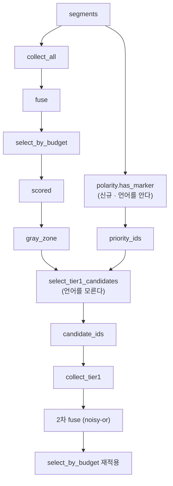

# 설계 — Tier 1 후보 선정 재설계 (FR-4.3 · 이월 21번)

> 근거 문서: [요구사항정의서](../../요구사항정의서.md) §4 · §5.4 · FR-4.2 · FR-4.3 ·
> [역번역 신호 설계](2026-09-05-backtranslation-signal-design.md) ·
> [HANDOFF](../../../HANDOFF.md) 이월 21번
>
> 실측 근거: [`bench/results/en-ko-2026-09-05.md`](../../../bench/results/en-ko-2026-09-05.md) ·
> 본 문서 §3 (2026-09-06 측정, LLM 호출 없음)

## 1. 목적과 범위

역번역 신호(FR-4.2)는 판별력이 실측됐으나 파이프라인에 얹으면 Recall 이
**떨어진다**. 원인은 신호가 아니라 후보 선정이다. 이 설계는 후보 선정을 다시
그려 신호가 볼 기회를 만든다.

### 1.1 범위

| 들어간다 | 들어가지 않는다 |
| --- | --- |
| `cuesift/polarity.py` 신설 (극성 표지 판정 술어) | 극성 표지를 Tier 0 신호로 승격하는 것 |
| `select_tier1_candidates` 에 `priority_ids` 통로 신설 | `select_by_budget`·`select_by_threshold` 의 계약 변경 |
| `tier1.py` 배선과 미지원 언어 경고 | Tier 1 결과의 큐 반영 구조 변경 (결함 ②) |
| `bench/report.py` 에 후보 구성 표 추가 | `max_ratio` 상향 또는 곱 게이트 완화 |
| en-ko 벤치 Tier 1 재측정 (예산 10% · 30%) | ja-ko 벤치 Tier 1 실행 |

### 1.2 이 설계가 답하지 않는 것

**결함 ②(비대칭 밀어냄)를 함께 고치지 않는다.** Tier 1 은 후보에만 점수를
더하고 noisy-or 는 점수를 올리기만 하므로, 후보에 든 오탐이 후보에 들지 못한
진짜 오류를 상대적으로 밀어낸다. 예산 10% 에서 Recall 이 1.41% 에서 0.00% 로
떨어진 것이 그 결과다. 그러나 두 변경을 함께 넣으면 **어느 쪽이 수치를
움직였는지 갈리지 않는다.** 후보 선정만 고친 상태의 실측을 먼저 얻는다.

**`max_ratio` 를 올리지 않는다.** 곱 게이트(`samples × max_ratio < 0.3`)와
요구사항정의서 §4 의 비용 3계층이 막는다. 이 설계는 같은 예산 안에서 후보의
밀도를 올리는 방법이다.

## 2. 확정된 설계 결정

| # | 결정 | 이 값이 아니면 무엇이 깨지는가 |
| --- | --- | --- |
| D1 | 극성 판정은 `signals/` 가 아니라 `cuesift/polarity.py` 최상위 단일 모듈에 둔다 | `signals/` 에 두면 레지스트리 수집기로 오인돼 `collect_all` 이 돌리려 하고, **점수를 내지 않는 술어**라는 성질이 흐려진다 |
| D2 | 판정 조건은 **원문 또는 번역문에 표지가 있음**(P1)이다 | 「원문에 있고 번역문에 없음」(P3)은 `bench/inject.py` 의 가정(원문 유지 · 번역문에서 제거)을 그대로 베낀 조건이라 측정이 자기 충족적이 된다(§5.3 관용구). 농축이 10~12x 에서 3.3~4.6x 로 낮아지는 것이 그 대가다 |
| D3 | 어휘 목록은 **벤치 수치를 보고 조정하지 않는다** | 조정하는 순간 같은 데이터에서 맞춘 가중치와 성질이 같아진다. 목록을 확정한 뒤 벤치를 한 번만 돌린다 |
| D4 | **ko·en 은 원본과 개행 제거본 양쪽에, ja 는 개행 제거본에만** 판정한다. CJK 는 뒤따르는 글자를 배제한다 | 셋 중 어느 조합도 다른 둘을 대신하지 못한다. 상세와 실측은 **§3.5 가 단일 출처**다 (2026-09-06 구현 중 2회 개정) |
| D5 | 지원 언어는 ko · en · ja 뿐이고, 그 밖은 **빈 우선 집합 + 경고**다 | 조용히 기존 동작으로 되돌아가면 무음 열화가 된다(§12 Q3) |
| D6 | 우선 집합이 cap 보다 작으면 **나머지를 기존 회색지대 순서로 채운다** | 하드 필터로 만들면 후보 0건의 새 원인이 생겨 `_diagnose_empty_candidates` 의 여섯 갈래가 일곱이 된다. 채움으로 두면 **후보 개수가 오늘과 정확히 같다** |
| D7 | 우선 구간 안의 순서는 **기존 `gray_zone` 정렬을 그대로 쓴다** | §3 표 2 가 어떤 재정렬도 무작위와 구별되지 않음을 보였으므로 순서에서 얻을 것이 없다. 새 난수원은 시드 관리를 늘리고 NFR-3 재현성의 표면을 넓힌다 |
| D8 | `max_ratio` 의 의미와 분모는 바뀌지 않는다 | FR-4.3 은 "전체 세그먼트 중 Tier 1 을 적용할 최대 비율"이다. 우선 집합은 **누가 검사받는가**를 정할 뿐 **몇 건을 검사하는가**를 바꾸지 않는다 |
| D9 | 극성 표지는 `risk_score` 에 한 푼도 기여하지 않는다 | `DEFAULT_WEIGHTS` 는 전부 1.0 이고 점수 스케일도 건드리지 않는다. 바뀌는 것은 비싼 검사의 수혜자 선정뿐이다 |
| D10 | 벤치 리포트가 **후보 구성**을 싣는다 | 후보 N 건 중 극성 표지 보유 몇 건, 그중 negation 몇 건인지가 없으면 Recall 이 왜 움직였는지 갈리지 않는다 |

## 3. 이 설계의 근거가 된 실측 (2026-09-06)

LLM 호출 없이 `data/bench/{en,ja}-ko.injected.json` 과 대응 라벨로 잰 값이다.
Tier 0 만 돌리므로 몇 분이면 재현된다. 측정 스크립트는 이월 19번·21번과 같은
이유로 리포에 넣지 않는다(일회성이다).

### 3.1 회색지대에는 정렬할 정보가 남아 있지 않다

| 트랙 | 예산 | 회색지대 | Tier 0 신호 0건 | 비율 |
| --- | ---: | ---: | ---: | ---: |
| en-ko | 10% | 4,500 | 4,330 | 96.2% |
| en-ko | 30% | 3,500 | 3,500 | **100%** |
| ja-ko | 10% | 4,500 | 4,431 | 98.5% |
| ja-ko | 30% | 3,500 | 3,500 | **100%** |

negation 라벨 71건 중 Tier 0 신호가 0건인 것이 en 69건 · ja 68건이다.

**이월 21번보다 강한 결과다.** 이월 21번은 "회색지대 안 순위 중앙값이 절반
지점"임을 보였는데, 이 표는 **그 이유**를 말한다. 회색지대는 거의 전부가
신호를 한 건도 받지 못한 세그먼트이므로 Tier 0 가 그 안에서 가진 정보량이
사실상 0 이다. 예산 30% 에서는 문자 그대로 100% 다.

### 3.2 그래서 어떤 재정렬도 무작위와 구별되지 않는다

cap(250건) 안에 든 negation 건수다.

| 트랙·예산 | 현행(위험도 내림) | 위험도 오름 | 신호 침묵 우선 | 시드 무작위 | 무작위 기대값 |
| --- | ---: | ---: | ---: | ---: | ---: |
| en-ko 10% | 2 | 1 | 1 | 5 | 3.89 |
| en-ko 30% | 3 | 3 | 3 | 5 | 4.07 |
| ja-ko 10% | 3 | 4 | 4 | 1 | 3.83 |
| ja-ko 30% | 4 | 4 | 4 | 3 | 4.07 |

여덟 칸 전부가 기대값 언저리이고 전략 사이에 유의한 차이가 없다.
**기존 신호를 재정렬하는 경로는 원리적으로 막혀 있다.**

### 3.3 극성 표지 여과는 3~5배 농축한다

초안 어휘 목록 기준이다. 「풀 안 negation 포함률」은 회색지대의 negation 중
몇 %가 우선 풀에 들어오는지를 뜻한다.

| 변형 | en 10% | en 30% | ja 10% | ja 30% | 포함률 |
| --- | ---: | ---: | ---: | ---: | ---: |
| **P1 원문 또는 번역문에 표지 (채택)** | **4.55x** | **4.46x** | **3.31x** | **3.26x** | 74~86% |
| P2 원문에만 표지 | 5.17x | 4.98x | 4.98x | 4.94x | 68~81% |
| P3 원문에 있고 번역문에 없음 | 11.99x | 9.33x | 10.70x | 7.86x | 56~71% |

**P1 행만 D4 최종안(§3.5)으로 다시 잰 값이다.** P2·P3 은 채택하지 않았으므로
초기 정규화(개행 제거만) 기준 값을 그대로 뒀다. 세 행을 나란히 비교할 때는
P1 이 다른 잣대를 쓴다는 것을 감안해야 한다 - 다만 P1 의 초기 정규화 값
(4.60x · 4.49x · 3.32x · 3.26x)과의 차이가 0.05x 이하라 비교의 결론은
바뀌지 않는다.

우선 풀 크기는 P1 기준 661~1,005건으로 **네 칸 전부에서 cap(250건)을
넘는다.** 따라서 D6 의 채움 경로는 이 벤치에서 발동하지 않는다.

**P3 을 쓰지 않는 이유가 D2 다.** P3 은 주입기가 만든 오류의 형태를 그대로
서술한 조건이라, 그 조건으로 후보를 고르면 주입과 여과가 같은 가정을 공유해
측정이 자기 충족적이 된다. P1 은 주입 방향을 쓰지 않으므로 「긍정문을
부정문으로 오역」 방향도 후보에 넣는다.

### 3.4 도달 가능한 상한

역번역 신호의 원리적 상한 80%(설계 2026-09-05 §3.2 — 역번역이 제거된 부정을
문맥으로 복원하는 비율이 en 21.8% · ja 17.9%)를 적용한 값이다.

| 트랙·예산 | 후보 중 negation 기대값 | ×0.8 | Recall 증가 상한 | 무작위 기준선 |
| --- | ---: | ---: | ---: | ---: |
| en-ko 10% | 17.7 | 14.2 | +20.0%p (1.41% → **21.4%**) | 10.28% |
| en-ko 30% | 18.2 | 14.5 | +20.5%p (19.72% → **40.2%**) | 30.44% |
| ja-ko 10% | 12.7 | 10.2 | +14.3%p | 10.28% |
| ja-ko 30% | 13.3 | 10.6 | +15.0%p | 30.44% |

**이것은 상한이며 달성치가 아니다.** 신호를 받아 점수가 오르는 것과 컷라인을
넘는 것은 다르고, AUC 가 0.758 이라 80% 안에서도 완전 분류는 되지 않는다.
그럼에도 **네 칸 전부에서 상한이 무작위 기준선을 넘는다** — 오늘은 상한 자체가
5% 남짓이라 기준선에 닿는 것이 불가능했다.

### 3.5 개행 처리는 언어마다 요구가 정반대다 (D4 의 단일 출처)

**이 절은 구현 중에 드러난 것이다.** 초안 D4 는 「개행을 지운 사본에 판정한다」
하나였는데, 파괴 실험이 그 게이트를 가짜로 판정하면서 두 번 개정됐다.

자막은 화면 폭에 맞춰 어절 중간에서 줄바꿈된다. 그래서 개행을 지워야 할 이유와
지우면 안 되는 이유가 **동시에** 성립한다.

| 정규화 | 무엇을 얻나 | 무엇을 잃나 |
| --- | --- | --- |
| 개행 제거본만 | CJK 의 쪼개진 표지를 잡는다 (`かもしれま`+개행+`せん`) | 영어 단어가 붙어 `\b` 가 깨진다 (`do`+개행+`not` → `donot`). 한국어 `안\s`·`못\s` 도 잃는다 |
| 원본만 | 위 둘을 지킨다 | CJK 의 쪼개진 표지를 놓친다 |
| 원본 **또는** 제거본 | 위 셋을 다 지킨다 | **배제 룩어헤드가 뚫린다** - 원본에서 `しか(?!し)` 가 다음 글자를 `\n` 으로 보고 통과한다 |

실측이다.

| 항목 | en 트랙 | ja 트랙 |
| --- | ---: | ---: |
| 개행 제거로 **잃는** 번역문 | **52** | 0 |
| 개행 제거로 **잃는** 원문(ko) | 5 | 6 |
| 개행 제거로 **얻는** 번역문 | 0 | 7 |
| 위 차이에 포함된 negation 라벨 | 0 | 0 |

**ja 는 원본 패스로 얻는 것이 0건이다.** 그래서 최종안은 원본 패스를 ko·en 에만
적용한다(`_RAW_PASS`). 배제 룩어헤드 회귀가 사라지면서 농축 배수는 그대로다.

| 트랙·예산 | 전면 OR (룩어헤드 회귀 있음) | ko·en 만 원본 패스 (채택) |
| --- | ---: | ---: |
| en 10% | 4.55x (풀 847) | **4.55x (풀 847)** |
| en 30% | 4.46x (풀 661) | **4.46x (풀 661)** |
| ja 10% | 3.31x (풀 1,005) | **3.31x (풀 1,005)** |
| ja 30% | 3.26x (풀 792) | **3.26x (풀 792)** |

소수점까지 같으므로 **회귀를 고치는 비용이 0이다.**

**가르는 기준은 언어가 아니라 패턴이 무엇에 기대는가다.** ko·en 패턴은 `\s`·`\b`
로 **구분자에 기대고**, ja 패턴은 `しか(?!し)`·`無[^限]`·`不[^思]` 처럼 **배제
룩어헤드에 기댄다.** 앞의 것은 개행이 살아 있어야 하고 뒤의 것은 개행이 없어야
한다. 새 언어를 더할 때 `_RAW_PASS` 소속을 정하는 잣대가 이것이다.

## 4. 모듈 구조



**`triage/` 는 자막 본문과 언어를 계속 모른다.** 극성 판정은 `tier1.py` 가
수행해 ID 집합으로만 넘긴다. 이 경계는 `select_tier1_candidates` 의 독스트링이
이미 선언해 둔 것이다 — "`target_text is None` 제외는 호출자의 일이다.
`SegmentRisk` 가 텍스트를 갖지 않으므로 여기서 판정할 수 없고, 끌어들이면
`triage/` 가 `segment/` 본문에 결합된다." **극성 표지 판정도 정확히 같은
부류다.**

### 4.1 `polarity.py` 의 공개 API

```python
def has_polarity_marker(text: str | None, lang: str) -> bool: ...
def supported_languages() -> frozenset[str]: ...
```

`has_polarity_marker` 는 점수가 아니라 `bool` 을 낸다. 실수를 내면 그 값이
언젠가 `risk_score` 에 흘러들어 D9 를 어긴다.

`supported_languages()` 가 별도로 있는 것은 D5 의 경고를 **호출 전에** 낼 수
있어야 하기 때문이다. 판정을 다 돌린 뒤 "전부 False 였다"로 알면 미지원
언어와 "표지가 정말 없다"가 구분되지 않는다.

### 4.2 어휘 목록은 코드 안에 둔다

`bench/glossary.ted.yaml` 같은 외부 YAML 로 빼지 않는다. 용어집은 **사용자가
프로젝트마다 바꾸는 자료**지만 극성 표지는 언어의 성질이라 사용자가 바꿀
대상이 아니고, 외부 파일로 두면 D3(벤치를 보고 조정하지 않는다)을 어기기가
쉬워진다. 파일을 고치는 것과 코드를 고치는 것은 심리적 문턱이 다르다.

패턴마다 **무엇을 배제하는지**를 주석으로 남긴다 — 「이 값이 아니면 무엇이
깨지는가」를 적는 이 리포의 관용구이며, `しか(?!し)` 처럼 배제 조건이 붙은
자리는 근거가 없으면 다음 사람이 지운다.

## 5. 후보 선정 계약

```python
def select_tier1_candidates(
    risks: Sequence[SegmentRisk],
    max_ratio: float,
    *,
    priority_ids: Collection[str] = (),
) -> list[str]: ...
```

### 5.1 두 구간 채우기

| 순서 | 무엇을 담나 |
| --- | --- |
| ① | 회색지대 ∩ `priority_ids`, `gray_zone` 정렬 순서 그대로 |
| ② | ①이 cap 을 채우지 못하면 회색지대의 나머지를 같은 순서로 |

**②가 있어야 후보 개수가 오늘과 같아진다**(D6). 개수가 같으면 빈 후보 진단
(`_diagnose_empty_candidates`)의 여섯 갈래가 그대로 유효하고, 그 함수의 기존
테스트 8건이 손대지 않은 채 게이트로 남는다.

### 5.2 `priority_ids` 의 경계 조건

| 입력 | 동작 | 이유 |
| --- | --- | --- |
| 빈 집합 (기본값) | 오늘과 완전히 같다 | 기존 호출부와 테스트가 그대로 통과해야 한다 |
| 회색지대 밖 ID 포함 | 무시된다 | 교집합만 본다. hard fail 이나 이미 선별된 것을 되살리면 §5 의 "컷라인 아래" 개념이 무너진다 |
| `str`·`bytes` | `ValueError` | `excluded_ids` 와 같은 함정이다 — 원소 단위로 쪼개져 조용히 글자 하나짜리 ID 집합이 된다 |
| cap 보다 큼 | 앞에서 cap 까지만 | 상한은 할당량이 아니다 |

## 6. 무음 열화 방어 (D5)

`tier1.py` 가 `ctx.target_lang` 과 `ctx.source_lang` 을
`polarity.supported_languages()` 와 대조한다.

| 상황 | 동작 |
| --- | --- |
| 양쪽 다 지원 | 정상 |
| 한쪽만 지원 | 지원되는 쪽만 판정한다. 경고를 낸다 |
| 양쪽 다 미지원 | `priority_ids` 가 비고 **오늘과 같이 동작한다.** 경고를 낸다 |

경고 문구는 `_TIER1_WARN_PREFIX` 와 같은 이유로 **상수로 둔다** — 테스트가
"이 경고가 나갔다"를 리터럴로 지어 넘기면 코드와 갈라져도 통과한다.

## 7. 테스트 전략

**각 게이트는 픽스 이전 원형에서 실제로 실패하는 것을 확인한 뒤에 회귀
테스트로 인정한다.** 변이는 픽스 이전 원형 전체에 가하고, 문자열 치환 전에
`count(old) == 1` 을 단언하며, 복원은 `finally` 에 둔다.

| # | 대상 | 게이트 | 무엇을 망가뜨리면 실패해야 하나 |
| --- | --- | --- | --- |
| T1 | 개행이 표지를 쪼갬 (D4) | `かもしれま\nせん` 이 표지로 판정된다 | 개행 제거를 뺀다 |
| T1b | 개행 제거로 잃는 것 (D4 · §3.5) | `do\nnot go`(en)·`안\n갔다`(ko) 가 표지로 판정된다 | 원본 패스를 뺀다 |
| T1c | 룩어헤드 뚫림 (D4 · §3.5) | `しか\nし`·`無\n限`·`不\n思` 는 표지가 **아니다** | `_RAW_PASS` 가드를 뺀다 |
| T2 | CJK 경계 (D4) | 「しかし」만 있는 문장은 표지가 아니다 | `(?!し)` 를 뺀다 |
| T3 | 한국어 띄어쓰기 변이 (D4) | 「못하다」와 「못 했습니다」가 모두 잡힌다 | `못\s` 또는 `못하` 중 하나를 뺀다 |
| T4 | 우선 구간 우선 (D6) | 우선 집합의 ID 가 cap 안에 먼저 들어간다 | 두 구간 순서를 뒤집는다 |
| T5 | 후보 개수 불변 (D6) | `priority_ids` 유무와 무관하게 후보 개수가 같다 | 하드 필터로 바꾼다 |
| T6 | `max_ratio` 불변 (D8) | 후보 개수가 `floor(n × max_ratio)` 그대로다 | cap 계산에 우선 집합을 끼운다 |
| T7 | 회색지대 밖 무시 (§5.2) | hard fail ID 를 넣어도 후보에 안 들어온다 | 교집합을 합집합으로 바꾼다 |
| T8 | `str` 거부 (§5.2) | `priority_ids="abc"` 가 `ValueError` 다 | 타입 검사를 뺀다 |
| T9 | 미지원 언어 (D5) | 경고가 나가고 우선 집합이 빈다 | 경고를 뺀다 |
| T10 | 기존 회귀 | `test_triage_policy.py`·`test_tier1.py` 가 손대지 않은 채 통과한다 | 기본값을 바꾼다 |

**어휘 목록의 내용 자체는 테스트가 지어 넘기지 않는다.** `polarity.py` 의
실제 패턴을 임포트해 검사한다 — 문구를 테스트 안에서 만들어 넘기면 코드와
갈라져도 1,792건이 전부 통과한다(리포트 caveat 전례).

## 8. 벤치 통합

### 8.1 리포트에 싣는 것 (D10)

| 항목 | 왜 |
| --- | --- |
| 후보 N 건 중 우선 구간에서 온 건수 | D6 의 채움 경로가 발동했는지 |
| 후보 중 negation 건수와 **무작위 기대값** | 적중만 보면 "적지만 있긴 하다"로 읽힌다. 기대값과 나란히 놔야 농축이 드러난다 |
| 예산 10% · 30% 의 Tier 0 대비 Tier 0+1 negation Recall | 완료 판정의 본체 |
| 정상 반전 부분집합 Recall 과 **분모** | 정답지 잡음이 수치를 부풀린다(2026-09-05 설계 §3.3) |

### 8.2 측정의 한계로 서술할 것

**벤치는 P1 과 P2 를 구분할 능력이 없다.** `bench/inject.py` 의 negation 은
제거 전용이라 원문이 항상 표지를 갖는다. 따라서 「긍정문을 부정문으로 오역」
방향은 이 벤치가 재지 못하며, P1 이 그 방향을 후보에 넣는다는 것은
**설계상의 성질이지 실측된 이득이 아니다.**

**로컬 3b 모델의 표본 한계**도 함께 적는다. `qwen2.5:3b` 는 배치 번역 형식을
자주 어겨(26건 중 19건 `invalid_response`) 실측 표본이 작아진다.
`cuesift` CLI 로 작은 트랙을 돌 때는 `--tier1-samples 2 --tier1-max-ratio 0.149`
처럼 곱 게이트 한계까지 올려야 후보 상한이 내림으로 0 이 되지 않는다.
**벤치에는 해당하지 않는다** - `bench/run.py` 는 그 두 옵션을 받지 않고
`TIER1_MAX_RATIO = 0.05` 를 상수로 두며, 5,000건 트랙에서는 상한이
`floor(4500 × 0.05) = 225` 라 0 이 되지 않는다.

## 9. 완료 판정

| # | 조건 |
| --- | --- |
| 1 | `priority_ids` 없이 부른 `select_tier1_candidates` 가 오늘과 같은 결과를 낸다 |
| 2 | T1~T9 각각이 해당 변이에서 **실제로 실패하는 것을 확인했다** |
| 3 | en-ko 벤치에서 후보 중 negation 건수가 무작위 기대값(3.9)을 유의하게 넘는다 |
| 4 | 예산 10% · 30% 의 Tier 0 대비 Tier 0+1 negation Recall 이 리포트에 실린다 |
| 5 | 후보 구성 표(§8.1)가 리포트에 실린다 |
| 6 | 로컬 게이트 5종이 전부 통과하고, `check_links.py` 와 markdownlint 의 파일 개수가 같다 |
| 7 | CI 5잡이 전부 통과한다 |

**3번이 Recall 개선을 조건으로 걸지 않는 것은 의도적이다.** 이 설계가 고치는
것은 결함 ① 하나이고, 결함 ②(비대칭 밀어냄)가 남아 있으므로 최종 Recall 이
오르지 않을 수 있다. **후보 선정이 고쳐졌는지는 후보 구성으로 판정하고,
Recall 은 결함 ② 를 판단할 자료로 기록한다.**

## 10. 남는 것

| 항목 | 왜 지금 안 하나 |
| --- | --- |
| 결함 ②(비대칭 밀어냄) 구조 변경 | §1.2. 결함 ① 수정 후의 실측을 먼저 얻는다 |
| 극성 불일치의 Tier 0 신호 승격 | 정밀도 19%(268건 중 50건)이고 같은 부류인 `length.ratio` 가 ablation 에서 전체 Recall 을 5.0% 깎았다 |
| ja-ko 벤치 Tier 1 실행 | 로컬 3b 의 형식 위반율이 높아 표본이 작아진다. en-ko 로 방향을 확인한 뒤 결정한다 |
| 어휘 목록의 언어 확장 | ko·en/ja 가 §12 Q2 의 초기 언어쌍이다 |
| 한국어 `못` 활용형 보강 | `못한`·`못할`·`못함`·`못합`·`못했`·`못해` 는 `못하` 의 부분 문자열이 아니다(`했` U+D588 vs `하` U+D558). 여섯을 전부 더하면 원문 표지 보유가 en 751 → 782 · ja 685 → 717 로 늘지만 **그중 negation 라벨은 양쪽 다 2건**이다(71건 중 2.8%). 2건을 얻자고 §3.3 표를 무효화하지 않는다 - 보강하려면 §3.3 을 다시 재야 한다 |
| `ませんでし`·`ないで` 제거 | 각각 `ません`·`ない` 에 문자열로 포섭돼 있어 정규식에 불필요하다(실측 차이 0건, 포함 관계라 증명이기도 하다). 동작 보존이므로 언제 해도 되지만 얻는 것이 가독성뿐이다 |
| 「긍정 → 부정」 방향의 실측 | 주입기를 삽입 지원으로 바꿔야 하고, 그것은 별도 작업이다 |
