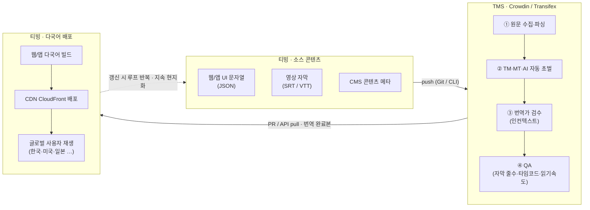
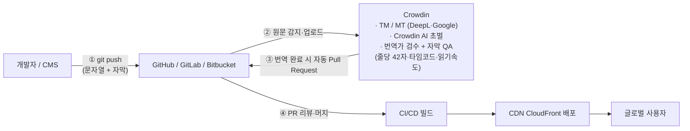
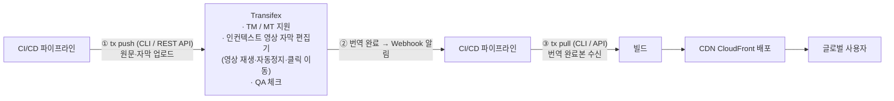

# 다국어 번역관리(TMS)·현지화 솔루션 비교 — 티빙 글로벌 서비스 대비

> **작성 기준일**: 2026-07-08
>
> **목적**: 티빙(TVING) 규모의 **글로벌 K콘텐츠 OTT**에 도입할 다국어 번역관리(TMS)·현지화 솔루션을 전수 비교하고, **티빙 스택(Spring/Node·AWS)·규모에 맞는 추천안**을 근거·출처와 함께 도출한다. `글로벌_OTT_플랫폼.md`(이 저장소에 포함되지 않은 별도 문서)의 "국제화(i18n/l10n)" 축 심화이며, 입사 후 글로벌 전략 자료(다음 단계)의 **③ 솔루션 선정** 근거가 된다.
>
> **조사 방법**: `deep-research` 하네스 2회 라운드로 총 11개 앵글 → 42개 소스 fetch → 189개 주장 추출 → **3표 적대적 검증(2/3 반박 시 기각)**. 50개 검증 중 **47개 확정·3개 기각**. 검증 통과 **9종**(Crowdin·Transifex·Lokalise·Phrase·Weblate·Tolgee·Smartling·POEditor·Localazy), 미검증 **2종**(Traduora·GitLocalize). 모든 사실은 공식 페이지 인용.
>
> **시간 민감성 주의**: 모든 가격·기능은 **2026년 공식 페이지 스냅샷**. Lokalise·Phrase·Transifex·Localazy는 최근 개편분이라 **도입 직전 재확인 필수**. 벤더 가격은 수시 변동.

---

## 0. 용어 풀이 — 먼저 개념부터

> 이 문서를 처음 보는 사람도 이해하도록, 핵심 용어를 먼저 풀어 둔다.

### TMS란?

**TMS = Translation Management System (번역관리 시스템)**

- **한 줄 정의**: 앱·웹·영상 자막의 **원문(source) 문자열**을 한곳에 모아 → 여러 언어로 **번역·검수·관리·배포**하는 것을 자동화하는 중앙 플랫폼.
- **왜 필요한가**: 언어가 2~3개일 땐 번역을 엑셀로 주고받아도 된다. 하지만 티빙처럼 **수만 개 문자열 × 수십 개 언어 × 대량 자막**이 되면 엑셀·수작업은 붕괴한다. TMS는 이 과정을 **Git·CI/CD처럼 자동화**한다 — 개발자가 코드에 문자열을 추가하면 자동으로 번역 대상에 오르고, 번역이 끝나면 자동으로 서비스에 반영된다.
- **비유**: "번역계의 GitHub + CI/CD". 원문을 push하면 → 번역이 붙고 → 완성본이 다시 서비스로 배포되는 **순환 루프**(§2 도식 참조).

### 함께 나오는 핵심 용어

| 용어 | 풀이 |
|---|---|
| **i18n / l10n** | **i18n**(internationalization, 국제화) = 여러 언어를 담을 수 있게 **설계**하는 것 / **l10n**(localization, 현지화) = 실제 특정 언어·지역에 맞게 **번역·조정**하는 것. (i·l 사이 글자 수 18·10에서 유래) |
| **TM (Translation Memory, 번역메모리)** | 과거에 번역한 문장을 저장해 두고, **비슷한 문장이 다시 나오면 재사용**. 비용↓·일관성↑ |
| **MT (Machine Translation, 기계번역)** | DeepL·Google·**LLM(ChatGPT·Claude)** 등으로 **자동 초벌 번역**. 사람이 검수 전 밑작업 |
| **용어집 (Glossary)** | "TVING = 티빙", "구독 = Subscription" 등 **고정 번역어 사전**. 브랜드·UI 일관성 유지 |
| **In-context (인컨텍스트)** | 번역가가 **실제 화면·영상을 보면서** 번역. "이 버튼이 어디 쓰이는지" 맥락을 알고 번역해 오역↓ |
| **QA 체크** | 번역 결과 자동 검사. 자막이면 **줄당 글자 수·2줄 초과·타임코드·읽기속도** 등을 export 전에 잡아냄 |
| **SRT / WebVTT(.vtt)** | 대표 **자막 파일 포맷**. **WebVTT**는 웹(HTML5 `<track>`)·HLS 스트리밍의 **표준** → **OTT 자막의 핵심**. SRT는 범용·구형 |
| **CLI / REST API / Webhook** | 개발 연동 수단. **CLI**=명령줄 도구로 파일 밀어넣기/받기, **API**=프로그램 연동, **Webhook**=번역 완료 시 자동 알림 |

---

## 1. 한눈에 — 결론

> **OTT 자막 3강 = Crowdin · Transifex · Smartling** (원래 11종 중 **WebVTT 네이티브 지원은 이 3종뿐**)
>
> **실행 추천: 1순위 Crowdin · 2순위 Transifex** (둘 다 가격 투명) · **엔터프라이즈 유력 Smartling**(자막 최심화, 단 견적제) · (데이터주권 절대요건 시) 조건부 Weblate

티빙에 가장 중요한 축은 **OTT 자막 현지화 적합성**이다. 웹/HLS 재생의 표준 자막은 **WebVTT(.vtt)** 이므로 **VTT 지원이 1차 관문**인데, 검증 9종 중 이를 네이티브로 지원하는 곳은 **Crowdin·Transifex·Smartling** 셋뿐이다.

| 솔루션 | 포지셔닝 | 과금 모델 | 진입가(대략, 2026) | VTT | 티빙 적합도 |
|---|---|---|---|---|---|
| **Crowdin** | 자막·미디어 최강, 균형형 | 호스팅 단어+매니저 수 | Pro $50/월 | ✅ (6종) | **★ 1순위** |
| **Transifex** | 인컨텍스트 영상 자막·개발통합 | 호스팅 단어 볼륨 | Growth 연 $200~/월 | ✅ (4종) | **★ 2순위** |
| **Smartling** | 엔터프라이즈 자막 특화 | 엔터프라이즈 견적(비공개) | **견적 필요** | ✅ (SRT+VTT) | **★ 엔터프라이즈 유력** |
| **Lokalise** | 개발자·AI 강함 | 처리 단어 | Explorer 연 6만 단어~ | ❌ | 자막 공백 |
| **Weblate** | 오픈소스·데이터주권 | 문자열 수 / 셀프호스팅 지원 | €47/월 or 셀프호스팅 | ❌ | 조건부(주권 요건 시) |
| **Localazy** | 개발자친화 SaaS | 소스키(문자열) 수 | $34/월(연납) | ❌ (SRT만) | 자막 약함 |
| **Tolgee** | 오픈소스·개발자친화 | 셀프호스팅 무료(10시트) | 무료(셀프호스팅) | 미확인 | 소규모/PoC |
| **Phrase** | 엔터프라이즈 TMS | 시트+관리단어 | Team $1,245/월 | 애드온(Studio) | 고비용·자막 별도 |
| **POEditor** | 경량 소프트웨어-문자열 TMS | 문자열 수 | Free~$260/월 | ❌ (자막 전무) | OTT 부적합 |

> ⚠️ **여전히 미검증(2라운드 연속 실패)**: **Traduora · GitLocalize**. GitHub 소스를 fetch했으나 3표 검증 통과 클레임이 0개 → 가격·자막·유지보수/존폐 모두 공백. **별도 GitHub 활동(커밋·릴리스·이슈) 확인으로 생사부터 판정 필요**(§8).

---

## 2. 티빙 OTT ↔ TMS 연동 도식 (1·2순위 Crowdin·Transifex)

> 핵심은 **"현지화 CI/CD 루프"**. 티빙의 UI 문자열(JSON)과 **영상 자막(SRT/VTT)이 같은 파이프라인**을 타고 TMS를 거쳐 → 번역·검수·QA → 다시 빌드·CDN으로 나간다. 콘텐츠가 갱신될 때마다 이 루프가 반복(지속 현지화, continuous localization).

### 2-1. 전체 흐름 (공통 개념)

### 2-2. Crowdin 연동 (★1순위 — Git 네이티브 · 자동 PR)

> 개발 흐름(Git)에 가장 자연스럽게 녹아든다. **코드를 push하면 문자열이 올라가고, 번역이 끝나면 자동으로 PR이 열린다.**

- **티빙 적합점**: Spring/Node·**Git 기반 CI/CD**에 그대로 붙음(별도 인프라 불필요, SaaS). 자막(SRT↔VTT 변환 포함)이 UI 문자열과 **한 리포·한 루프**로 관리됨.

### 2-3. Transifex 연동 (★2순위 — CLI/API · 인컨텍스트 영상 자막)

> Git 자동 PR 대신 **CLI/API로 밀고 당기는** 방식. 번역가가 **영상을 재생하며** 자막을 번역하는 인컨텍스트 편집기가 강점.

- **티빙 적합점**: **API·SDK·CLI·Webhook·Git이 전 요금제 기본** → 자동화 파이프라인 구성 자유도 높음. 자막 품질은 **영상 보며 번역**으로 확보.

### 2-4. 단계별 티빙 적용 (요약)

| 단계 | 하는 일 | 티빙에서 | Crowdin | Transifex |
|---|---|---|---|---|
| ① 수집 | 원문·자막 업로드 | UI JSON + 영상 SRT/VTT | **git push 자동 감지** | tx push (CLI/API) |
| ② 초벌 | TM·MT·AI 자동 번역 | 대량 자막 1차 자동화 | Crowdin AI·DeepL·Google | MT 지원(용량 종량) |
| ③ 검수 | 번역가 인컨텍스트 | 화면·영상 맥락 확인 | 에디터 내 영상 프리뷰 | **영상 재생형 자막 편집** |
| ④ QA | 자막 규칙 검사 | 줄수·타임코드·읽기속도 | **자막 전용 QA** | 기본 QA |
| ⑤ 반환 | 완료본 배포 | 빌드→CDN→사용자 | **자동 PR** | tx pull (CLI/API) |

---

## 3. OTT 자막·미디어 적합성 — 티빙 최우선 축

> K콘텐츠 글로벌의 본질은 **대량 자막의 다국어 현지화**다. 웹/HTML5 `<track>`·HLS의 표준 자막은 **WebVTT(.vtt)**. **VTT 지원 = OTT 자막 판별 기준**.

| 솔루션 | 자막 포맷 | VTT | 자막 전용 QA | 인컨텍스트 영상 편집 | 근거 |
|---|---|---|---|---|---|
| **Crowdin** | SRT·VTT·SBV·ASS·SMI·SUB (6종) | ✅ | ✅ 줄당 글자수(예 42자)·타임코드 검증·읽기속도 | ✅ 에디터 내 영상 프리뷰 | crowdin.com/solutions/subtitles-localization |
| **Smartling** | SRT·VTT(WebVTT) | ✅ | ✅ 줄길이·2줄 초과 금지·단어분할 방지·어절경계 줄바꿈 + **Standard/Enhanced 파싱모드** | ✅ Video Context(영상 스니펫+자막 오버레이, 루프·속도조절) + **CaptionHub AI 커넥터(유료)** | help.smartling.com WebVTT / Subtitle Files |
| **Transifex** | SRT·SUB·SBV·VTT (4종) | ✅ | 기본 QA | ✅ **영상 재생 동기화·자동정지·클릭 이동** | help.transifex.com 6221673 |
| **Lokalise** | SRT 있음, **VTT 없음** | ❌ | 일반 QA | — | lokalise 포맷 목록 |
| **Localazy** | **SRT만**, VTT 없음 | ❌ | 일반 QA | — | localazy.com/docs supported-file-formats |
| **Weblate** | SRT·MicroDVD(.sub)·ASS·SSA (4종) | ❌ | 일반 QA | — | docs.weblate.org formats/subtitles |
| **POEditor** | **자막 포맷 전무** | ❌ | — | — | poeditor.com/localization/files |

**핵심 판단**

- **VTT 네이티브 = Crowdin·Transifex·Smartling 3종.** Lokalise·Localazy(SRT만)·Weblate는 웹 표준 자막에 구멍, POEditor는 자막 자체가 없어 OTT 부적합.
- **자막 워크플로우 심화도**: Smartling(파싱모드+QA+영상컨텍스트+CaptionHub AI) ≈ Crowdin(6종+포맷변환+자막QA) > Transifex(영상 인컨텍스트, QA는 평범).
- **Smartling의 미묘한 한계**: CaptionHub 경로는 네이티브 저작이 아니라 **유료 제3자 커넥터**이고, 인컨텍스트는 라이브 플레이어가 아니라 **영상에서 추출한 프레임 이미지 매칭** 방식.

> ⚠️ **공통 한계 — 방송용 timed-text**: 검증 9종 중 **TTML·IMSC1·DFXP·EBU-TT·SCC**(방송/딜리버리용)를 네이티브 지원한다고 확인된 곳은 **없음**. 모두 소비자/웹 자막 포맷 중심. 티빙이 방송 딜리버리 스펙을 요구하면 **별도 자막 툴체인** 검토 필요(§8).

---

## 4. 가격·과금 모델

> 과금 "단위"가 벤더마다 다르다 — **호스팅 단어**(Crowdin·Transifex·Weblate), **처리 단어**(Lokalise), **소스키/문자열 수**(Localazy·POEditor), **시트+관리단어**(Phrase), **엔터프라이즈 견적**(Smartling). 티빙 실제 볼륨이 정해져야 실 비용 비교 가능(§8).

| 솔루션 | 과금 단위 | 티어·가격(2026 공식) | 무료 | 근거 |
|---|---|---|---|---|
| **Crowdin** | 호스팅 단어 + 매니저 수 | Free · Pro **$50/월** · Team **$150/월** · Team+ **$450/월** · Business(견적) | ✅ Free | crowdin.com/pricing |
| **Transifex** | 호스팅 단어 볼륨 | Starter 연 **$135~425/월** · Growth 연 **$200~2,050/월** · Enterprise+(견적) · **연납 2개월 무료** | — | transifex.com/pricing |
| **Smartling** | 엔터프라이즈 견적 | **공개 단가 없음(Contact sales)** — 3종 중 유일하게 가격축 공백 | — | (견적제) |
| **Lokalise** | 처리 단어(저장 키 아님) | Explorer 연 **6만**(최대 50만) · Growth 연 **30만**(최대 150만) · Advanced 연 **100만**(최대 300만) · Enterprise 연 **300만**(최대 1,500만) | ✅ Free | docs.lokalise.com 11694835 |
| **Localazy** | 소스키(소스언어 문자열) 수 | Professional **$34/월**(1,000키) · Autopilot **$78/월**(3,500) · Business **$175/월**(10,000) · Enterprise(견적) · *월결제는 $41/$94/$210* · 2026-01 +5.4% | ✅ Free | localazy.com/pricing |
| **POEditor** | 호스팅 문자열 수 | Free **$0**(1,000) · Start **$20/월**(3,000) · Plus **$60/월**(10,000) · Premium **$160/월**(30,000) · Enterprise **$260/월**(100,000) | ✅ Free | poeditor.com/pricing |
| **Weblate** | 문자열 수(클라우드)/지원 티어(셀프) | 클라우드 €47/월(1만)~€616/월(1,024만) · 셀프호스팅 Basic €53/·Extended €106/월·설치 €480(1회) · **VAT 별도** | 오픈소스 무료 | weblate.org/hosting |
| **Tolgee** | 셀프호스팅 무료 / 오픈코어 | 셀프호스팅 무료(**키 무제한·최대 10시트**), 그 이상·SSO·세분권한은 유료 라이선스 | ✅ 셀프호스팅 | tolgee.io/pricing/self-hosted |
| **Phrase** | 시트 + 관리단어 | **Team $1,245/월**(연납·관리단어 120만) · Software UI/UX **$525/월** · 자막은 **Phrase Studio 유료 애드온** | — | phrase.com/pricing |

**핵심 판단**

- **가격 투명성**: Crowdin·Transifex·Localazy·POEditor·Weblate는 공개 단가 → 계획 수립 용이. **Smartling·Phrase(사실상)·Business는 영업 견적** → TCO 산정에 세일즈 접촉 필요.
- **Crowdin 주의**: 자막·핵심 기능은 전 요금제 포함이나 **MT 처리량은 "포함"이 아니라 종량과금(Managed Balance)**.
- **Localazy/POEditor**: 가격은 저렴하나 **자막 축에서 탈락**(SRT만/자막 전무) → OTT 본류엔 부적합. 소프트웨어 UI 문자열용 보조 도구 성격.

> ⚠️ **재확인 필요(1차 기각)**: Crowdin 클라우드 **티어별 세부 단어 한도**는 1차 검증에서 1-2 반박 → 월 가격·기능 게이팅은 확정이나 콘텐츠 한도는 공식 페이지 재확인.

---

## 5. 개발자 통합 · 워크플로우 · AI

> 티빙 스택(Spring/Node·AWS·Git). SaaS는 **API/CLI/Git 연동으로 스택과 무관하게 도입** 가능. 셀프호스팅(Weblate/Tolgee)만 인프라 결합.

| 솔루션 | CLI/API/Git | 코드 포맷 | TM·용어집 | AI/LLM 기계번역 | 특이점 |
|---|---|---|---|---|---|
| **Crowdin** | ✅ CLI 전 플랜·700+ 통합·Git push 시 자동 PR | 3/5/15/무제한 | ✅ 전 플랜 | DeepL·Google·**Crowdin AI**(전 플랜) | In-Context는 Team↑, SDK는 Pro↑ |
| **Smartling** | ✅ REST API·CLI·다수 커넥터·CaptionHub | 폭넓음(자막 SRT/VTT 포함) | ✅ | **AI Hub·LLM MT** + vtt_mt_mode/srt_mt_mode 디렉티브 | 엔터프라이즈 자동화·자막 파싱모드 |
| **Transifex** | ✅ **API·SDK·CLI·Webhook·Git 전 플랜** | Git/Figma/Zendesk 통합 | ✅(고급은 상위 티어) | MT 지원(용량 종량) | 자동화가 전 요금제 기본 |
| **Lokalise** | ✅ GitHub·GitLab·Bitbucket·Azure Repos 전 플랜 | 다수(**VTT·ICU 명시 없음**) | ✅ | **Pro AI: ChatGPT·Claude 등 다중 LLM + 0~100 자동 품질점수(MQM)** | 개발·AI 최상위, 자막 약점 |
| **POEditor** | ✅ 4 Git(GitHub·Bitbucket·GitLab·Azure DevOps)·REST API(POST) | JSON·PO·XLIFF·ARB·RESX·Android·Apple 등 | ✅ | 자동번역 Google/MS/DeepL | **자막 전무** — 소프트웨어 문자열 전용 |
| **Localazy** | ✅ CLI·API·모바일 SDK·GitHub Actions | JSON·XLIFF·Android/iOS·PO·RESX 등 | ✅ | LLM MT | **SRT만**, WebVTT 불가 |
| **Weblate** | ✅ API·Git 긴밀 | gettext·XLIFF 등 폭넓음 | ✅ | MT 연동 | 오픈소스·Git 네이티브 |
| **Tolgee** | ✅ 개발자친화 SDK | 개발 i18n 중심 | ✅ | LLM 통합 | Apache-2.0, 인컨텍스트 강점 |
| **Phrase** | ✅ 50+ 포맷·Figma/Jira/GitHub 등·Developer Portal | 50+ | ✅ | **MT Autoselect(LLM 오케스트레이션)** | 자막은 별도 Studio |

**핵심 판단**

- **개발통합만 보면** Lokalise·Transifex·Crowdin·Smartling 모두 우수. 그러나 **OTT 자막 결정축**에서 Lokalise·Localazy·POEditor가 탈락 → 남는 3강(Crowdin·Transifex·Smartling)이 개발통합도 우수.
- 티빙 **Git 기반 CI/CD**엔 Crowdin(push 시 자동 PR)·Transifex(전 플랜 Webhook/Git)·Smartling(API/커넥터)이 자연스럽게 붙는다.

---

## 6. 티빙 추천 (근거)

### ★ 1순위: Crowdin — OTT 자막 적합성 + 전 요금제 기능성 + 가격 투명

- **왜**: 자막 **6종+VTT** 네이티브 + 타임코드 동기화 + **자막 전용 QA**, TM·용어집·MT·AI·QA·CLI **전 요금제**, SaaS라 **AWS/Spring/Node와 무관하게 API·CLI·Git 즉시 연동**, Git push 시 자동 PR로 **CI/CD 친화**(§2-2), 진입가($50/월) 합리적·**공개**.
- **주의**: MT 처리량 종량과금 / 티어별 단어 한도 공식 재확인.

### ★ 2순위(병행·대안): Transifex — 인컨텍스트 영상 자막 + 전 요금제 개발통합 + 가격 투명

- **왜**: **영상 재생하며 번역**하는 인컨텍스트 편집기, **API·SDK·CLI·Webhook·Git 전 요금제 기본**(§2-3), 호스팅 단어 볼륨 과금 + 연납 2개월 무료로 비용 예측 용이.
- **약점**: 자막 4종(Crowdin 6종보다 좁음), 자막 QA 평범.

### ★ 엔터프라이즈 유력: Smartling — 자막 워크플로우 최심화 (단, 견적제)

- **왜**: WebVTT 네이티브 + **자막 전용 QA + Standard/Enhanced 파싱모드 + Video Context 인컨텍스트 + CaptionHub AI 캡셔닝 커넥터** → 대량 K콘텐츠 엔터프라이즈 자막에 기능적으로 가장 깊다. 티빙이 대기업 조달·엔터프라이즈 SLA를 원하면 **1순위와 함께 견적 비교**할 만하다.
- **약점/미확정**: **공식 가격 비공개(Contact sales)** → TCO 산정 불가, CaptionHub는 **유료 제3자 커넥터**. 세일즈 접촉으로 최소 계약 규모·과금 구조 확인이 선결.

### 조건부: Weblate — 데이터주권이 "절대 요건"일 때만

- 셀프호스팅 오픈소스로 데이터 레지던시·주권 완전 통제, 라이선스 저렴. **단 VTT 미지원** → OTT 웹 자막은 **별도 변환/툴체인 보완 필수**. 티빙 규모면 유료 지원 계약 권장.

### 탈락(참고): Lokalise·Localazy·POEditor·Phrase·Tolgee

- **Lokalise·Localazy**: 개발·가격은 좋으나 **VTT 미지원**(자막 공백/SRT만).
- **POEditor**: **자막 포맷 자체가 없음** → OTT 부적합(소프트웨어 문자열 전용).
- **Phrase**: 입문가 $1,245/월·자막은 유료 Studio 애드온 → 비용·구조 불리.
- **Tolgee**: 무료는 10시트 제한 → 소규모/PoC용.

### 면접·전략 활용 포인트 (다음 단계 ②로 연결)

- **TVING 1세대 CMS에서 다국어 메타 필드를 초기부터 반영**(제목·자막 등) → i18n/l10n 아키텍처 판단 근거. *(방어 범위: "글로벌 확장에 유리한 토대"까지. "선제 설계/미리 대비" 표현 금지 — 2012 도메스틱 맥락)*
- **야나두 AI 서비스 직접 개발**(AI 튜터·여행영어) → **AI/LLM 자막·메타 자동 번역** 설계 근거(Crowdin AI·Smartling AI Hub·Lokalise Pro AI 흐름과 연결).
- **BTV 대용량 파이프라인(Kafka·ELK)** → 대규모 다국어 콘텐츠 처리 확장성 근거.

---

## 7. 솔루션별 한 줄 요약

| 솔루션 | 한 줄 | 확정 근거(투표) |
|---|---|---|
| **Crowdin** | 자막·미디어 최적 + 전 요금제 풀기능 + 가격 투명. 티빙 1순위 | 3-0 (x4 자막) / 3-0·2-1 |
| **Transifex** | 인컨텍스트 영상 자막 + 전 요금제 개발통합. 강력한 2순위 | 3-0 (x2 자막) / 3-0 (x3 가격) |
| **Smartling** | 엔터프라이즈 자막 최심화(WebVTT+QA+파싱모드+CaptionHub). 단 견적제 | 3-0 (x5 자막·통합) |
| **Lokalise** | 개발·AI 최상위지만 **VTT 공백** | 3-0 (x3) |
| **Localazy** | 개발자친화·저가지만 **SRT만(WebVTT 불가)** | 3-0 (x2) |
| **POEditor** | 저가·깔끔한 개발통합이나 **자막 포맷 전무** → OTT 부적합 | 3-0 (x3) |
| **Phrase** | 엔터프라이즈급 가격·자막 유료 애드온 → 티빙엔 불리 | 3-0 (x3) |
| **Weblate** | 오픈소스·데이터주권 강점, 단 **VTT 미지원** | 3-0 (x3) |
| **Tolgee** | 개발자친화 오픈소스, 무료는 **10시트 제한** | 3-0 (x2) |
| **Traduora** | **미검증**(2라운드 연속 실패) — 유지보수/존폐 별도 확인 | — |
| **GitLocalize** | **미검증**(2라운드 연속 실패) — 유지보수/존폐 별도 확인 | — |

---

## 8. 한계 · 다음 확인 사항 (Open Questions)

**이 보고서의 공백(정직하게)**

- **미검증 2종**: Traduora·GitLocalize는 GitHub 소스를 fetch했으나 두 라운드 연속 3표 통과 클레임 0개 → 판정 불가. **생사(활동성)부터 확인 필요**.
- **정량 공백**: 티빙 실제 **자막량·문자열 수·MAU·언어/지역 수**가 없어 각 솔루션 **실 월비용(Crowdin MT 종량·Transifex 볼륨·Lokalise 처리단어·Smartling 견적)** 산정 불가.
- **Smartling 가격 비공개**: 견적제라 3강 중 유일하게 TCO 정량 비교 불가.
- **방송용 timed-text**: 검증 9종 중 TTML/IMSC1/DFXP/SCC 네이티브 지원 확인된 곳 없음.
- **거버넌스 심화**(SSO/SAML·감사로그·데이터 레지던시)는 이번 검증에서 얕게만 다뤄짐 → 티빙 보안·주권 요건 충족 여부 추가 조사 필요.

**다음 조사 질문**

1. **Traduora·GitLocalize의 2026 유지보수/존폐 상태**(GitHub 커밋·릴리스·이슈 응답)와 자막 지원 — 두 라운드 실패, 별도 조사로 생사부터.
2. **Smartling 실제 엔터프라이즈 가격·최소 계약 규모** — 견적 접촉 없이는 TCO 비교 불가.
3. 검증 9종 중 방송용 timed-text 또는 Netflix급 딜리버리 스펙 네이티브 지원처가 있는가?
4. 티빙 실제 볼륨(언어 수·자막량·연간 신규 번역단어·시트) — TCO 비교의 전제.
5. SSO·감사로그·**데이터 레지던시(한국/미국 리전)** 가 어느 티어에서 충족되며, 사내 데이터주권 정책이 셀프호스팅(Weblate/Tolgee)을 강제하는가?
6. Localazy가 포맷 변환으로 SRT↔WebVTT를 우회 처리 가능한지(문서상 변환은 이미 지원되는 포맷 간으로 한정 → VTT 입력 불가로 보임).

---

## 9. 출처 (전부 공식 primary)

| 솔루션/주제 | URL |
|---|---|
| Crowdin 자막 현지화 | <https://crowdin.com/solutions/subtitles-localization> |
| Crowdin 지원 포맷 | <https://support.crowdin.com/supported-formats/> |
| Crowdin SRT 스토어 | <https://store.crowdin.com/srt> |
| Crowdin 가격 | <https://crowdin.com/pricing> |
| Transifex 자막 현지화 | <https://help.transifex.com/en/articles/6221673-subtitles-localization> |
| Transifex 가격 | <https://www.transifex.com/pricing> |
| Smartling WebVTT | <https://help.smartling.com/hc/en-us/articles/360041306074-WebVTT> |
| Smartling 자막 파일 번역 | <https://help.smartling.com/hc/en-us/articles/26103534325915-Translating-Subtitle-Files> |
| Smartling 영상 자막 통합 | <https://www.smartling.com/software/integrations/video-subtitles/> |
| Smartling CaptionHub | <https://www.smartling.com/integrations/captionhub> |
| Lokalise 개발자 | <https://lokalise.com/product/for-developers/> |
| Lokalise 신가격(2026) | <https://docs.lokalise.com/en/articles/11694835-new-price-plans-everything-you-should-know> |
| Localazy 가격 | <https://localazy.com/pricing> |
| Localazy 2026 가격인상 | <https://localazy.com/blog/pricing-update-january-2026> |
| Localazy SRT 포맷 | <https://localazy.com/docs/cli/srt-format> |
| Localazy 지원 포맷 | <https://localazy.com/docs/general/supported-file-formats> |
| POEditor 가격 | <https://poeditor.com/pricing/> |
| POEditor 지원 포맷 | <https://poeditor.com/localization/files> |
| POEditor 코드호스팅 통합 | <https://poeditor.com/kb/code-hosting-service-integrations> |
| POEditor API | <https://poeditor.com/docs/api> |
| Phrase 가격 | <https://phrase.com/pricing/> |
| Weblate 호스팅 가격 | <https://weblate.org/en/hosting/> |
| Weblate 자막 포맷 | <https://docs.weblate.org/en/latest/formats/subtitles.html> |
| Tolgee 셀프호스팅 가격 | <https://tolgee.io/pricing/self-hosted> |

> 통계: 2개 라운드 · 11개 검색 앵글 · 42개 소스 · 189개 주장 추출 · 50개 검증(47 확정/3 기각) · 검증 통과 9종·미검증 2종.
