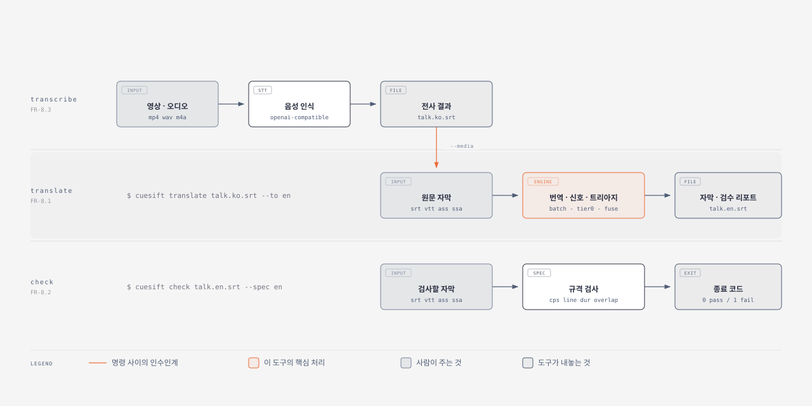

# cuesift 사용법

**대상 독자**: cuesift 를 처음 설치해서 자막 하나를 끝까지 돌려 보려는 실무자입니다.
이 문서는 **처음 30분에 필요한 것**만 담습니다.

**역할 분담**: 옵션의 기본값 · 허용 범위 · 종료 코드의 의미 · JSON 필드처럼 **값이 적힌
표는 [README.md](../README.md) 에만** 둡니다. 이 문서는 그 값을 다시 적지 않고 **무엇을
어떤 순서로 하는지, 화면에서 무엇을 보고 판단하는지**만 적습니다. 같은 값을 두 문서에
적으면 한쪽만 고쳐져 반드시 갈라지기 때문입니다. 제품의 설계 의도와 한계는
[제품설명서.md](제품설명서.md) 에 있습니다.

아래 출력 예시는 모두 실제로 실행해서 받은 것이며, 읽기 좋도록 파일 경로만 줄였습니다.

---

## 1. 준비

### 1.1 설치

PyPI 배포 전이므로 소스에서 설치합니다.

```bash
git clone https://github.com/withwooyong/cuesift.git
cd cuesift
python -m venv .venv && source .venv/bin/activate   # Windows: .venv\Scripts\activate
pip install -e ".[dev]"
```

파이썬 3.11 이상이 필요합니다. 런타임 의존성은 네 개뿐이므로 무거운 추론 라이브러리를
내려받지 않습니다.

### 1.2 백엔드

번역과 Tier 1 신호는 OpenAI 호환 엔드포인트를 부릅니다. 로컬 모델로도 동작합니다.

| 기능 | 호출 경로 | 언제 필요한가 |
| --- | --- | --- |
| 번역 · 자가일관성 · 역번역 | `/v1/chat/completions` | `translate` 를 쓸 때 |
| 임베딩 | `/v1/embeddings` | Tier 1 을 켤 때만 |
| 음성 인식 | `/v1/audio/transcriptions` | `transcribe` 를 쓰거나 `--media` 를 줄 때만 |

**규격 검사(`check`)는 백엔드가 없어도 동작합니다.** 백엔드 준비가 끝나지 않았다면 §3 부터
시작해도 됩니다.

세 기능을 한 엔드포인트가 모두 지원하지는 않으므로 따로 지정할 수 있습니다. 지정하지 않으면
임베딩은 번역 엔드포인트로 되돌아갑니다.

```bash
export CUESIFT_BASE_URL=http://localhost:11434/v1
export CUESIFT_MODEL=<번역에 쓸 모델 이름>
export CUESIFT_API_KEY=<키가 필요한 백엔드라면>
```

---

## 2. 세 명령



| 명령 | 받는 것 | 내놓는 것 | 백엔드 |
| --- | --- | --- | --- |
| `cuesift check` | 자막 파일 | 위반 목록과 종료 코드 | 필요 없음 |
| `cuesift translate` | 자막 파일 또는 영상 | 번역 자막과 검수 리포트 | 번역 필요 |
| `cuesift transcribe` | 영상 또는 오디오 | 원문 자막 | STT 필요 |

`transcribe` 의 결과는 `translate` 의 입력이 됩니다. `translate --media` 를 쓰면
두 단계가 한 번에 돕니다.

---

## 3. 규격 검사부터 — 백엔드 없이 되는 것

읽을 수 있는 자막 형식은 `.srt` · `.vtt` · `.ass` · `.ssa` · `.smi` · `.sami` 여섯입니다.
인코딩은 **utf-8 만 받습니다.** cp949 로 저장된 레거시 `.smi` 는 종료 코드 66 과 함께
변환 안내가 나옵니다.

```bash
cuesift check talk.ko.srt --spec ko
```

위반이 없으면 다음과 같이 한 줄로 끝나고 종료 코드는 0 입니다.

```text
talk.ko.srt (srt · 검사 큐 2개 · 프로파일 ko) - 위반 없음
```

위반이 있으면 큐 번호 · 타임코드 · 위반 종류 · 실제 값과 기준값을 함께 냅니다.

```text
bad.ko.srt (srt · 검사 큐 3개 · 프로파일 ko)
위반 4건 · 위반 큐 2/3개 (66.7%)

  #1  00:00:01.000  line_length    34.0 > 16.0  (1번째 줄)
  #1  00:00:01.000  cps            34.0 > 12.0
  #2  00:00:02.100  cps            22.5 > 12.0
  #2  00:00:02.100  duration_short 200ms < 833ms
```

**"검사 큐 N개" 를 매번 읽으십시오.** 0개면 통과가 아니라 파일을 잘못 지정한 것입니다.

`--spec` 에는 내장 프로파일 이름(`ko` · `en` · `ja`) 또는 사내 규격 YAML 파일의 경로를
줄 수 있습니다. 언어마다 기준값이 크게 다르므로 이 옵션은 생략할 수 없습니다.

`check` 의 옵션은 셋뿐이고, 처음에는 `--spec` 하나만 알면 됩니다.

| 옵션 | 언제 건드리는가 |
| --- | --- |
| `--spec` | 언제나 줍니다. 생략할 수 없습니다 |
| `--fail-on` | 위반이 있어도 CI 를 멈추지 않고 **보고만** 시키고 싶을 때 |
| `--limit` | 위반이 수백 건이라 로그가 길 때 |

**기본값과 받는 값의 전수는 [README.md](../README.md) 의 `cuesift check` 절에 있습니다.**

---

## 4. 번역과 트리아지

### 4.1 먼저 비용을 추정합니다

`--dry-run` 은 실제로 호출하지 않고 배치 수와 캐시 히트를 셉니다.

```bash
cuesift translate talk.ko.srt --to en --dry-run
```

```text
입력   talk.ko.srt (srt) · 2 세그먼트
모델   <모델 이름> @ http://localhost:11434/v1

[en] talk.en.srt
  배치 1개 (size=10, context_window=3)
  캐시 히트 0개 · 호출 필요 1개 이상
  프롬프트 문자 system 315 + user 37

(토큰·비용은 내지 않는다 - 문자에서 토큰으로 가는 계수의 출처가 없다)
```

토큰 수를 내지 않는 것은 의도된 것입니다. 문자 수에서 토큰 수로 가는 계수는 모델마다
다르고, 그 계수의 출처를 댈 수 없으면 추정치가 아니라 지어낸 수치가 되기 때문입니다.

### 4.2 번역하고 검수 큐를 만듭니다

```bash
cuesift translate talk.ko.srt --to en,ja \
  --review-budget 10% \
  --review-out ./review \
  --review-format both
```

`translate` 에는 `--spec` 옵션이 없습니다. **규격 프로파일은 대상 언어 코드로 자동 결정됩니다** —
`--to en` 이면 내장 `en` 프로파일이 규격 신호에 쓰입니다. 내장 프로파일이 없는 언어를 주면
번역은 그대로 나가고 규격 신호만 빠집니다.

출력 파일 이름은 `{원본이름}.{대상언어}.{확장자}` 입니다. 원본 이름이 이미 원문 언어 코드로
끝나면 **덧붙이지 않고 치환합니다.**

| 입력 | 대상 언어 | 출력 |
| --- | --- | --- |
| `talk.srt` | `en` | `talk.en.srt` |
| `talk.ko.srt` | `en` | `talk.en.srt` (`talk.ko.en.srt` 가 아닙니다) |
| `talk.ko.srt` | `en,ja` | `talk.en.srt` 와 `talk.ja.srt` |

### 4.3 검수량을 정하는 세 가지 방법

셋은 상호 배타적이라 동시에 쓸 수 없습니다.

| 옵션 | 예시 | 언제 쓰는가 |
| --- | --- | --- |
| `--review-budget` | `10%` 또는 `0.1` | 검수에 쓸 시간이 정해져 있을 때 |
| `--review-top-k` | `50` | 검수할 건수가 정해져 있을 때 |
| `--review-threshold` | `0.6` | 위험도 기준을 고정하고 싶을 때 |

**실제 검수량이 요청보다 많아질 수 있습니다.** hard fail 신호가 붙은 세그먼트는 예산과
무관하게 큐에 들어가기 때문입니다. 리포트의 `review_ratio` 가 실제로 검수해야 하는
비율이며, 이 값이 요청 예산보다 크면 그 자막에 명백한 번역 실패가 많다는 뜻입니다.

### 4.4 Tier 1 을 켤 때

의미가 뒤집힌 문장을 잡으려면 Tier 1 이 필요합니다. LLM 호출이 늘어나므로 기본값은 꺼짐입니다.

```bash
cuesift translate talk.ko.srt --to en \
  --tier1 \
  --tier1-max-ratio 0.05 \
  --tier1-samples 3 \
  --embed-model <임베딩 모델 이름>
```

| 옵션 | 왜 건드리는가 |
| --- | --- |
| `--embed-model` | **반드시 줘야 합니다.** 빼면 화면 없이 종료 코드 2 로 끝납니다 |
| `--tier1-max-ratio` | 후보를 전체의 몇 %까지 볼지 정합니다. 올리면 비용이 그대로 따라 오릅니다 |
| `--tier1-samples` | 몇 번 재번역해 비교할지 정합니다. 올리면 신호가 안정되고 비용이 늡니다 |
| `--tier1-temperature` | 재번역을 얼마나 흔들지 정합니다. 흔들지 않으면 신호가 죽습니다 |

넷 중 셋은 기본값으로 두어도 되고, 반드시 줘야 하는 것은 `--embed-model` 하나입니다.
**기본값 · 허용 범위 · 종료 코드 2 로 거부되는 조합 아홉 가지는 [README.md](../README.md) 의
"Tier 1 자가일관성" 절에 있습니다.**

`--tier1` 을 켠 실행은 번역을 시작하기 전에 임베딩 엔드포인트를 한 번 확인하고
`임베딩 준비됨 (모델 이름, N차원)` 을 냅니다. **이 줄이 없으면 Tier 1 이 열리지 않은 것입니다.**

후보 10건에 샘플 3회면 재번역 30회와 역번역 10회로 **총 40회의 LLM 호출**이 추가됩니다.

---

## 5. 검수 리포트 읽기

`--review-out` 을 주면 그 디렉터리에 리포트가 생깁니다. `--review-format` 으로 `json` ·
`html` · `both` 중 고릅니다.

파일 이름은 `{원본이름}.{대상언어}.review.json` 으로 번역 자막과 같은 규칙입니다.

JSON 을 열면 `summary` 와 `segments` 둘이 있습니다. **아래는 아래 표가 가리키는 자리만
남긴 발췌이고, 전체 필드와 각 필드의 계약은 [README.md](../README.md) 의
"검수 리포트 파일" 절에 있습니다.**

```json
{
  "summary": {
    "total_segments": 500,
    "excluded_failures": 2,
    "selected_for_review": 52,
    "review_ratio": 0.1044,
    "hard_fail_count": 7,
    "signal_hits": { "spec.violation": 31, "length.ratio": 12 }
  },
  "segments": [
    { "id": "00042", "risk_score": 1.0, "hard_fail": true,
      "signals": [{ "name": "struct.untranslated", "tier": 0, "score": 1.0 }] }
  ]
}
```

읽을 때 순서는 다음과 같습니다.

| 볼 것 | 무엇을 판단하는가 |
| --- | --- |
| `review_ratio` | 실제로 검수해야 하는 비율입니다. 요청 예산과 비교하십시오 |
| `hard_fail_count` | 명백한 번역 실패의 수입니다. 크면 번역 단계부터 다시 봐야 합니다 |
| `excluded_failures` | 번역 자체가 실패해 트리아지에서 빠진 세그먼트입니다 |
| `signal_hits` | 어떤 신호가 많이 걸렸는지 보여 줍니다. 규격 위반이 많으면 규격 설정을 의심하십시오 |
| `segments[].signals` | 그 자막이 왜 선별되었는지에 대한 근거입니다 |

`segments` 에는 **선별된 것만** 들어갑니다. 전체 자막의 점수 목록이 아닙니다.

`cost` 블록의 `tokens_reported` 가 거짓이면 백엔드가 토큰 수치를 내지 않은 것이며,
이때 토큰 값이 0 인 것은 사용량이 0 이라는 뜻이 아닙니다.

---

## 6. 설정 파일

같은 옵션을 매번 치지 않으려면 현재 디렉터리에 `cuesift.yaml` 을 둡니다. 자동으로 읽히며,
**명령줄 인자가 설정 파일보다 우선합니다.** 적용되면 `설정을 읽었다: cuesift.yaml` 한 줄이
나옵니다.

다른 경로를 쓰려면 `--config` 를 주는데, **이것은 서브커맨드보다 앞에 놓아야 합니다.**

```bash
cuesift --config ./ci.yaml translate talk.ko.srt --to en   # 됩니다
cuesift translate talk.ko.srt --to en --config ./ci.yaml   # Usage 오류가 납니다
```

```yaml
source_lang: ko
targets: [en, ja]

llm:
  provider: openai-compatible
  base_url: http://localhost:11434/v1
  model: <모델 이름>
  context_window: 3

glossary: ./glossary.yaml
work_context: "다큐멘터리, 존댓말"

output:
  dir: ./out
  progress: true

cache:
  enabled: true
  dir: ./.cuesift/cache

triage:
  review_budget: "10%"

review:
  out: ./review
  format: json

spec:
  profile: ko
  fail_on: hard
```

주의할 점이 셋 있습니다. **쓸 수 있는 키의 전수는 [요구사항정의서.md](요구사항정의서.md) §8.2 에,
우선순위와 탐색 규칙은 [README.md](../README.md) 의 설정 파일 절에 있습니다.**

| 항목 | 내용 |
| --- | --- |
| 탐색 범위 | 현재 디렉터리의 `./cuesift.yaml` 만 봅니다. **상위로 올라가지 않으므로** 리포 루트에 둔 파일은 하위 폴더에서 실행하면 읽히지 않습니다 |
| 모르는 키 | 종료 코드 2 로 거부하며 가장 가까운 키 이름을 알려 줍니다 |
| 캐시 반전 | YAML 은 `cache.enabled: true` 라는 긍정형이고 명령줄은 `--no-cache` 라는 부정형입니다 |

캐시는 기본적으로 `.cuesift/cache` 에 JSON 으로 쌓입니다. 같은 명령을 다시 쳤을 때 무엇이
실제로 다시 불리는지는 **실패의 종류가 가릅니다.**

| 실패 종류 | 캐시에 남는가 | 다시 치면 |
| --- | --- | --- |
| `invalid_response` (형식을 어겨 파싱조차 못 한 응답) | 지웁니다 | 그 배치만 실제로 다시 호출됩니다 |
| `empty_translation` (개수와 번호는 맞는데 번역문이 빈 응답) | 남습니다 | 캐시 히트라 **같은 결과가 나옵니다** |

빈 번역을 남기는 것은 그것이 계약을 지킨 응답이기 때문입니다. 폐기하면 같은 배치에서
성공한 나머지까지 다시 결제하게 됩니다. 따라서 다시 쳐도 결과가 나아지지 않는다면
모델을 바꾸거나 `--no-cache` 를 쓰십시오.

---

## 7. 종료 코드와 CI 연동

**각 코드가 정확히 무엇을 뜻하는지, 어느 명령이 내는지는 [README.md](../README.md) 의
"종료 코드" 절이 정본입니다.** 여기에는 그 코드를 받았을 때 무엇을 하는지만 적습니다.

| 코드 | 무엇을 하는가 |
| --- | --- |
| 0 | 할 일이 없습니다 |
| 1 | 자막을 고칩니다. **CI 게이트가 노리는 코드입니다** |
| 2 | 파일 경로 · 옵션 조합 · 설정 키를 확인합니다. LLM 을 부르기 전에 나므로 **비용은 들지 않았습니다** |
| 3 | 리포트의 `excluded_failures` 를 보고 그 세그먼트만 다시 돌립니다 |
| 66 | 자막이 utf-8 인지, 읽고 쓸 권한이 있는지 봅니다 |
| 69 | 백엔드 주소 · 키 · 모델 이름을 확인합니다 |
| 70 | 재현 절차와 함께 이슈로 남겨 주십시오. 우리 코드가 낸 값의 문제입니다 |

CI 에서는 `check` 만 물리면 충분합니다. 백엔드가 필요 없어 빠르고, 위반이 있을 때만 1 을 냅니다.
**`check` 는 파일을 하나만 받으므로** 여러 자막을 검사하려면 셸에서 반복해야 합니다.

```bash
for f in subtitles/*.ko.srt; do
  cuesift check "$f" --spec ko || exit 1
done
```

---

## 8. 자주 막히는 곳

| 증상 | 원인 | 조치 |
| --- | --- | --- |
| `검사 큐 0개` 인데 통과로 나옴 | 파일을 잘못 지정했거나 자막이 비었습니다 | 통과가 아니라 설정 오류입니다. 경로를 확인하십시오 |
| 같은 명령을 다시 쳐도 결과가 같음 | 빈 번역이 캐시에 남았습니다. 형식을 어긴 응답이었다면 이미 지워져 다시 불립니다 | 모델을 바꾸거나 `--no-cache` 를 붙입니다 |
| Tier 1 을 켰는데 신호가 하나도 없음 | 후보 상한이 내림으로 0 이 됐습니다. 세그먼트 수에 비해 비율이 작으면 발생합니다 | 화면에 나온 상한 0 진단 줄을 읽고 `--tier1-max-ratio` 를 올립니다 |
| 실제 검수량이 요청 예산보다 많음 | hard fail 이 예산을 우회했습니다 | 정상 동작입니다. `hard_fail_count` 를 보십시오 |
| 종료 코드 2 인데 명령줄은 맞음 | `cuesift.yaml` 의 값이 타입 검증에 걸렸습니다 | 숫자 자리에 `true` 나 목록이 들어갔는지 봅니다 |
| 진행 표시가 안 보임 | 출력이 터미널이 아니면 자동으로 꺼집니다 | `--progress` 로 강제할 수 있습니다 |
| 토큰 수가 전부 0 | 백엔드가 사용량을 보고하지 않았습니다 | `cost.tokens_reported` 를 확인하십시오 |

---

## 9. 다음 읽을 것

| 문서 | 언제 보는가 |
| --- | --- |
| [제품설명서.md](제품설명서.md) | 신호가 무엇을 잡는지, 무엇을 못 잡는지 알고 싶을 때 |
| [README.md](../README.md) | **값이 필요할 때** — 옵션 전수와 기본값, 종료 코드의 의미, `review.json` 필드, 용어집 형식, 실측 재현 절차 |
| [요구사항정의서.md](요구사항정의서.md) | 기능 번호(FR·NFR)로 근거를 확인할 때 |
