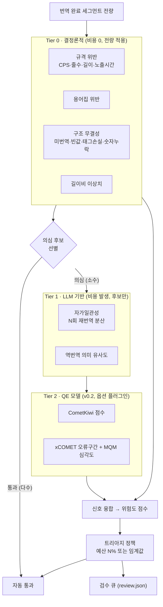
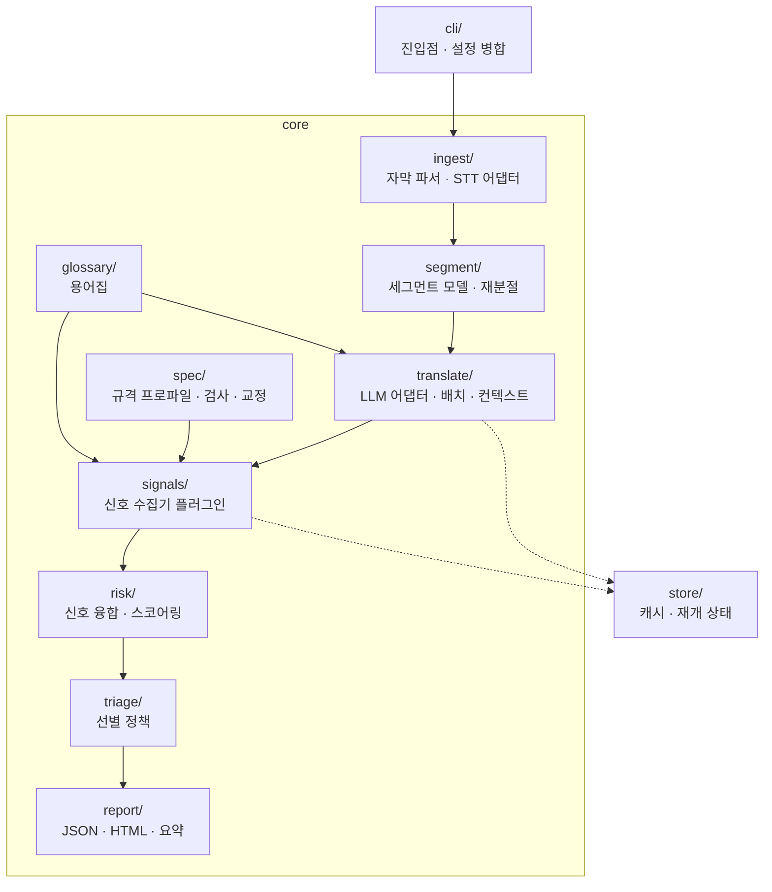

# 요구사항 정의서 — cuesift

> **AI 자막 번역·검수 트리아지 엔진**
> *"Sift the cues that actually need a human." — 사람이 정말 봐야 할 자막만 걸러냅니다.*
>
> **문서 버전**: 0.4
> **작성일**: 2026-07-27
> **프로젝트명**: **`cuesift`** (확정)
> **저장소**: [github.com/withwooyong/cuesift](https://github.com/withwooyong/cuesift) — 저장소명·배포 패키지명·CLI 명 모두 동일
> **관련 문서**: [번역관리_TMS_솔루션_비교.md](번역관리_TMS_솔루션_비교.md) · [AI_자막검수_오픈소스_비교.md](AI_자막검수_오픈소스_비교.md)

## 작명 근거

`cue`는 **WebVTT 표준에서 자막 한 블록을 가리키는 정식 용어**다 (HTML5 `<track>`, `TextTrackCue` DOM API, WebVTT 스펙). [TMS 비교 문서](번역관리_TMS_솔루션_비교.md)가 *"VTT 지원 = OTT 자막 판별 기준"* 이라고 결론 낸 그 표준을 이름에서부터 가리킨다. `sift`(체로 거르다)는 이 도구의 핵심 동작인 **선별**을 뜻한다.

> **네이밍 검증(2026-07-27)**: PyPI 미등록 · GitHub 동명 리포 없음. 대안 후보 중 `subsift`·`winnow`·`triage`는 PyPI 사용중, `cuescore`·`cuelens`는 GitHub 충돌로 탈락.

---

## 0. 용어 풀이 — 먼저 개념부터

> 이 문서는 **요구사항 명세**라 표기 규약(`FR-`·`必`·`hard fail`)과 프로젝트 고유 개념(세그먼트·신호·Tier·트리아지)을 전제하고 쓰였다. 처음 보는 사람도 §1부터 읽을 수 있도록 먼저 풀어 둔다.
>
> **자막·품질 측정 일반 용어**(QE·MQM·CPS·화자분리·자막 포맷)는 [AI_자막검수_오픈소스_비교.md](AI_자막검수_오픈소스_비교.md) §0에 정의돼 있다. **여기서는 중복 정의하지 않고 §0.5에 한 줄 요약과 포인터만 둔다** — 같은 용어를 두 문서에서 각각 정의하면 반드시 갈라진다.

### 0.1 문서 표기 규약

| 표기 | 뜻 |
|---|---|
| **`FR-n.m`** | Functional Requirement, 기능 요구사항 ID. `n`이 §5의 하위 절과 대응한다 (`FR-3.x` = §5.3 Tier 0 신호) |
| **`NFR-n`** | Non-Functional Requirement, 비기능 요구사항 — 성능·비용·재현성·테스트 가능성 등 **속성**에 대한 요구 (§6) |
| **`必`** | **v0.1(MVP)에 반드시 포함**해야 하는 요구사항 |
| **`권장`** | 있으면 좋으나 v0.1 완료 조건은 아님 |
| **`v0.2` · `v0.3`** | 해당 버전으로 **연기**된 요구사항 (§10 로드맵) |
| **굵은 표기** | 같은 우선순위 안에서 특히 핵심으로 강조한 항목 (예: `**FR-1.1**` vs `FR-1.5`) |
| **`Rn`** | 리스크 ID (§11) |
| **`Qn`** | 미결정 사항 ID (§12). 취소선 + ✅ 는 해결됨을 뜻한다 |
| **`★ … ─────` 상자** | 요구사항이 아니라 **결정의 근거**를 적은 주석. "무엇을"이 아니라 "왜 이렇게 정했는지"다 |
| **상태 열 (✅ · 🟡 · ⬜)** | ✅ 완료 · 🟡 부분 충족 · ⬜ 미착수. **§5의 일부 절에만 있다**(§5.4·§5.6·§5.7) — 전수 집계는 [WBS](WBS.md)가 낸다. 판정 기준은 바로 아래에 있다 |

#### 완료 판정 기준 — 두 축으로 본다

| 기호 | 뜻 |
|---|---|
| ✅ | **층 도달 + 완전** |
| 🟡 | 층은 도달했으나 **불완전**, 또는 **층이 부족** |
| ⬜ | 아무것도 없다 |

##### 축 1 — 층: FR이 요구하는 층에 도달했는가

**어느 층인지는 목적절의 수혜자가 어디에 있는가가 가른다.**

| 목적절의 수혜자 | 핵심 동사 | 요구하는 층 | 예 |
|---|---|---|---|
| **파이프라인 안** — 다음 단계가 그 값을 쓰거나, 라이브러리를 직접 호출하는 개발자가 그 인터페이스를 쓴다 | "산출한다" · "포함한다" · "정의한다" · "측정한다" | **라이브러리** | FR-6.1("위험도를 산출한다") · FR-6.5("프로토콜로 정의한다") |
| **라이브러리 밖의 사람** — 검수자·CLI 사용자·CI가 무언가를 받거나 할 수 있게 된다 | "설정할 수 있다" · "지정할 수 있다" · "덮어쓸 수 있다" · "받는다" · "출력한다" · "반환한다" · **"…할 수 있게 한다"** | **사용자 통로**(CLI·설정 파일·리포트)까지 | FR-6.4("설명 가능하게 한다" — 검수자가 읽어야 성립한다) · FR-4.3 · FR-6.3 |

**아래 행이 곧 "미완료"는 아니다.** FR-7.1(자막 파일 출력)·FR-7.5(CI 종료 코드)·
FR-5.3(프로파일 덮어쓰기)은 사용자 통로가 완료 조건인데 그 통로가 실제로 있어 완료 판정을
받았다. **FR-6.4·FR-7.2가 2026-08-19에 같은 무리에 합류했다** — `review.json`이 열리며
검수자에게 가는 통로가 생겼다. 이 행이 말하는 것은 **무엇이 완료 조건인가**이지 완료
여부가 아니다.

**"…할 수 있게 한다"가 언제나 사용자 통로를 요구하지는 않는다 — 어미가 아니라 수혜자의
위치가 가른다.** FR-6.5의 "QE 모델을 추가 구현 없이 **꽂을 수 있게 한다**"는 수혜자가
**라이브러리를 직접 호출하는 개발자**이고 그가 도달하는 지점이 곧 `signals/base.py`의
프로토콜이라 — 통로가 라이브러리 자신이라 — 라이브러리로 충족된다. 반대로 FR-6.4의
수혜자인 **검수자는 라이브러리 안에 도달할 수단이 없다** — 그래서 `SegmentRisk.reasons`가
있어도 통로가 없는 동안은 부분 충족이었고, `review.json`이 그 통로가 되면서 비로소 닫혔다.
**이 대비가 규칙의 실증이다** — 두 FR 모두 "…할 수 있게 한다"인데 요구하는 층이 갈렸다.

**동사 목록보다 수혜자가 먼저다.** FR-6.4의 "기록한다"만 떼어 보면 라이브러리 동사로 읽히지만,
그 문장의 목적은 기록 자체가 아니라 **사람이 설명을 받는 것**이다. 동사 목록은 자주 나오는
형태를 모아 둔 것일 뿐이므로, **목록에 없는 동사를 만나면 수혜자를 묻는다.**

##### 축 2 — 완전성: 그 층에서 FR이 말한 것을 전부 하는가

**층에 도달했다고 완료가 아니다.** FR-6.3은 CLI에 도달했으나 "**상위 K개**"가 없고,
FR-7.4는 요약이 나오지만 **소요 토큰**이 없다 — 둘 다 축 1은 만족하되 불완전해 부분 충족이다.

**축 2가 보는 것은 본문이 열거한 항목이다 — 수식어로 붙은 속성이 아니다.** 두 축 모두에
아래의 "수식어" 예외가 걸린다.

| | 축 2가 본다 | 축 2가 보지 않는다 |
|---|---|---|
| 무엇 | 본문·열거가 이름을 걸어 요구한 것 | 수식어·괄호로 붙은 부가 속성 |
| 예 | FR-6.3의 "①…상위 K개" · FR-7.4의 "**소요 토큰**" | FR-6.1의 "**설정 가능한** 가중치" · FR-7.1의 "(…**변환 지정 가능**)" |
| 미구현이면 | **부분 충족** | 판정 불변 — **상태 칸에 명시만** 한다 |

FR-7.1이 그 경계다 — `--out`은 디렉터리만 받고 출력 포맷은 언제나 입력과 같아
"변환 지정"이 없지만, 그것은 괄호로 붙은 부가 속성이라 판정을 내리지 않는다. 반면 FR-7.4의
"소요 토큰"은 요약이 내야 할 항목으로 **본문에 열거돼** 있어 빠지면 부분 충족이다.

**상태 칸에 어느 축이 부족한지 적는다.** 두 축은 **다른 후속 작업을 부른다.**

| 부족한 축 | 후속 작업 | 지금 해당하는 FR |
|---|---|---|
| 축 1 (층 미도달) | **배선** — CLI·설정 파일·리포트로 노출한다 | FR-4.3(`--tier1-*` 미배선). **FR-6.4가 이 칸에서 빠졌다** — `review.json`(FR-7.2)이 통로가 되어 닫혔다 |
| 축 2 (불완전) | **기능 추가** — 빠진 것을 만든다 | FR-6.3("상위 K개") · FR-7.4(소요 토큰 집계) |

적지 않으면 다음 사람이 부분 충족 표기를 보고 **어느 쪽을 해야 할지 모른다.**

**수식어로 붙은 속성은 그 자체가 별도 FR로 분리되지 않는 한 완료 판정을 좌우하지 않는다.**
FR-6.1의 "**설정 가능한** 가중치"가 그 예다 — 사용자가 가중치를 설정하는 통로는 §8.2
`cuesift.yaml`의 `signals.weights`이고 그것은 FR-8.4의 몫이라 아직 미구현이지만, FR-6.1의
핵심 동사는 "산출한다"이므로 ✅다. **다만 미구현 통로는 상태 칸에 명시한다** — 판정을
바꾸지 않는 것과 감추는 것은 다르다.

**이 규칙이 없으면 같은 문서가 잣대를 두 개 쓴다.** FR-4.3은 §8.2의
`signals.tier1.max_ratio`가 미구현이라 🟡인데 FR-6.1은 **같은 §8.2 블록**의
`signals.weights`가 미구현인 채로 ✅다. 규칙이 적혀 있어야 그 둘이 **다른 이유로**
갈렸다는 것이 보인다.

**규칙이 없을 때 개수가 틀리는 방향은 둘이다.** 지금 기준(32)에서 살아 있는 예는 이렇다.

| 빠진 규칙 | 어느 FR이 흔들리나 | 개수 |
|---|---|---|
| **수식어 규칙**(축 2는 본문 열거만 본다) | FR-6.1("**설정 가능한** 가중치")과 FR-7.1("(…**변환 지정 가능**)")이 **함께** 내려간다 | **둘 낮게** — 30 |
| **축 2**(완전성) | FR-6.3("상위 K개")·FR-7.4("소요 토큰")이 층 도달만으로 올라간다 | **둘 높게** — 34 |

세 규칙이 함께 있어야 32가 유지된다.

**FR-6.4는 더 이상 이 자리의 예가 아니다.** 이전 판은 "수혜자 규칙이 없으면 FR-6.4를
'기록한다'로 읽어 올려 하나 높게 센다"를 반대 방향의 예로 들었는데, FR-7.2(`review.json`)가
그 수혜자에게 가는 통로를 열면서 **두 읽기가 같은 값(✅)을 내게 됐다.** 규칙이 죽은 것이
아니라 그 규칙이 개수를 가르던 자리가 구현으로 닫힌 것이다 — 아래 1판 행이 그 역사를
남긴다. 수혜자 규칙은 지금도 FR-4.3을 🟡로 붙들고 있다.

**이전 판의 "하나 낮게(29)"는 하나를 빠뜨린 셈이었다.** 수식어 규칙이 없으면 FR-6.1만이
아니라 FR-7.1도 함께 내려가고, 4판 초안이 깨진 자리가 정확히 그 FR-7.1이다(아래 표).
같은 문서가 §5.7에서 FR-7.1을 수식어의 예로 들면서 여기서는 세지 않았다.

##### 규칙을 고칠 때는 상태 열이 있는 FR 13개에 전수 대조하라

**이 규칙은 네 번 깨졌고 그때마다 고쳤다 — 아래 표의 첫 네 행이다.** 규칙만 읽으면 매번
그럴듯했다 — **대조해야 보인다.**

| 판 | 무엇이었나 | 어디서 깨졌나 |
|---|---|---|
| 1판 | 동사 목록만 | **FR-6.4** — "기록한다"가 라이브러리 동사로 읽혀 규칙이 완료를 내는데 표기는 부분 충족 |
| 2판 | 수혜자를 "시스템 / 사람"으로 | **FR-6.5** — "꽂을 수 있게 한다"의 수혜자는 사람이지만 라이브러리를 직접 호출하는 개발자다 |
| 3판 | 수혜자의 **위치**로 | **FR-6.3 · FR-7.4** — 층은 도달했는데 부분 충족이다. 규칙이 층만 다루고 **완전성을 안 다뤘다** |
| 4판 초안 | 층 + 완전성 **두 축** | **FR-7.1** — 괄호의 "변환 지정 가능"이 미구현이라 축 2가 부분 충족을 내는데 표기는 완료다. 축 2의 범위를 정하지 않았다 |
| 4판 (현재) | 두 축 + **축 2는 본문 열거만 본다** | 13개 전부와 일치 |

**대조 결과 완료 개수가 32에서 움직이면 규칙이 틀린 것이다** — 표기를 고치기 전에 규칙을
의심한다. 지금까지 네 번 다 틀린 쪽은 규칙이었다.

**개수가 30에서 32로 오른 것은 규칙이 바뀌어서가 아니다.** FR-7.2(`review.json`)가
구현되며 FR-6.4의 통로가 함께 열려 **두 FR이 규칙에 그대로 대조된 채로 올라갔다**
(`30 + FR-7.2 + FR-6.4 = 32`). 5판은 없다 — 4판이 13개 전부와 여전히 일치한다.

### 0.2 처리 단위와 판정의 사슬 — 이 문서의 척추

이 문서 전체가 **세그먼트 → 신호 → 위험도 → 트리아지** 라는 하나의 사슬로 되어 있다. 이 넷만 잡으면 §4~§9가 전부 읽힌다.

**① 세그먼트 (Segment)**

- **한 줄 정의**: 자막 한 블록 = **타임코드 + 원문 + 번역문**. 이 도구의 **모든 처리·측정·선별 단위**.
- **왜 중요한가**: 단위가 파일도 문장도 아니라 세그먼트라는 점이 설계의 뿌리다. §7.3 데이터 모델, `review.json` 항목, 위험도 산출, 검수 큐 포함 여부가 **전부 세그먼트 하나 단위**로 결정된다.
- **`cue`와의 관계**: WebVTT의 `cue`가 곧 세그먼트다 → 프로젝트 이름 `cuesift`의 어원(위 작명 근거).

**② 신호 (Signal)**

- **한 줄 정의**: "이 세그먼트가 위험하다"고 의심할 **근거 하나**. `0.0`(안전)~`1.0`(위험)으로 정규화된 점수 + 문제 구간(`spans`)을 갖는다 (§7.3).
- **왜 중요한가**: 단일 판정기가 아니라 **여러 근거를 모아 합성하는 구조**다. 그래서 신호는 플러그인이고(FR-6.5), v0.2에서 QE 모델을 코드 수정 없이 꽂을 수 있다.

**③ 위험도 (risk score) · 융합 (fusion)**

- **한 줄 정의**: 여러 신호를 **설정 가능한 가중치로 합성**한 세그먼트 하나의 종합 점수 `0~1` (FR-6.1).
- **예외가 있다**: `hard fail` 신호는 이 가중합을 **우회**한다(FR-6.2) — 아래 §0.3.

**④ 트리아지 (Triage)**

- **한 줄 정의**: 응급실 **중증도 분류**에서 온 말. 위험도 순으로 정렬해 **검수 예산 안에 드는 세그먼트만 검수 큐로** 보내는 것 (FR-6.3).
- **왜 중요한가**: 이 프로젝트의 목적이 "번역을 더 잘하기"가 아니라 **"사람이 볼 양을 5~10%로 줄이기"**(§1.3)이므로, 트리아지가 곧 제품이다. 번역·신호는 그 근거를 만드는 수단이다.

### 0.3 프로젝트 고유 용어

| 용어 | 풀이 |
|---|---|
| **Tier 0 / 1 / 2** | 신호의 **비용 계층**(§4). **Tier 0** = 코드만으로 판정, 비용 0, **전량 적용** / **Tier 1** = LLM 재호출 필요, **의심 후보에만** / **Tier 2** = QE 모델, v0.2 옵션 플러그인 |
| **`hard fail`** | 가중합을 우회해 **무조건 검수 큐에 넣는** 치명 신호. `FR-3.1`~`3.5`(미번역 잔존·빈 값·반복 붕괴·숫자 누락·태그 손실)가 해당하며 **검수 예산과 무관**하다 (FR-6.2) |
| **검수 예산 (review budget)** | 사람이 볼 분량의 상한. `--review-budget 10%` = 위험도 상위 10%만 검수 큐로 (FR-6.3) |
| **검수 큐 (review queue)** | 트리아지에서 선별된 세그먼트 목록. 산출물이 `review.json`(FR-7.2)·`report.html`(FR-7.3) |
| **자가일관성 (self-consistency)** | 같은 세그먼트를 **N회(기본 3) 재번역**해 결과 간 상호 유사도를 측정. 분산이 크면 고위험. Tier 1의 주 신호 (FR-4.1) |
| **역번역 유사도** | 번역문을 **원문 언어로 되돌려** 원문과 의미 유사도를 비교 (FR-4.2) |
| **반복 붕괴 (degeneration)** | LLM이 동일 어절·구를 비정상적으로 반복하는 실패 양상 (FR-3.3) |
| **길이비 이상치** | 원문 대비 번역 길이 비율이 **해당 언어쌍 분포에서** 벗어난 경우 (FR-3.6) |
| **구조 무결성** | 의미가 아니라 **형태**의 온전함 — 미번역·빈 값·태그 손실·숫자 누락. 코드만으로 100% 판정된다(§4) |
| **규격 프로파일 (spec profile)** | 언어별 자막 규격을 담은 YAML — 줄당 최대 길이·최대 줄 수·CPS 상한·노출시간·중첩 금지. `specs/ko.yaml` (FR-5.1, §8.3) |
| **`char_counting`** | 규격 프로파일에서 **글자 수를 세는 방식**. `grapheme`\|`latin_half`\|`fullwidth` — 한글·라틴·태국 문자권의 폭이 달라 단순 문자 수로는 규격을 표현할 수 없다 (FR-5.2, Q5) |
| **설명가능성 (explainability)** | 신호별 기여도와 **선별 사유를 세그먼트마다 기록**해 "왜 이게 뽑혔나"에 답할 수 있게 하는 것 (FR-6.4, `SegmentRisk.reasons`) |
| **순수 모듈** | 네트워크·LLM 의존이 없어 **입력만으로 결과가 정해지는** 모듈(`spec`·`risk`·`triage`·`glossary`). 단위 테스트가 값싸므로 반복 튜닝이 가능하다 (§7.2) |
| **무음 열화 (silent degradation)** | 백엔드가 신호를 지원하지 않아 **품질은 떨어졌는데 에러 없이 통과**하는 것. 이 프로젝트가 명시적으로 금지하는 실패 유형 (Q3) |
| **원문 검수 필요 플래그** | STT로 생성한 원문에 붙이는 표시. 원문이 틀리면 N개 언어로 오류가 복제되므로(R1) 검수 큐에 별도로 드러낸다 (FR-1.4) |

### 0.4 측정·검증 용어 (§9)

| 용어 | 풀이 |
|---|---|
| **Recall @ Budget** | 이 프로젝트의 **핵심 지표**. "검수 예산 X%를 썼을 때 **실제 오류 중 몇 %** 를 검수 큐에 담았는가". `Recall@10%`로 표기 |
| **재현율(recall) vs 정확도(precision)** | **재현율** = 실제 오류 중 잡아낸 비율 / **정확도** = 잡은 것 중 진짜 오류인 비율. 이 프로젝트는 **재현율을 주 지표로** 삼는다 — 놓친 오류가 헛되게 올린 정상 세그먼트보다 훨씬 비싸므로 (§9.1) |
| **무작위 베이스라인** | 무작위로 X%를 뽑으면 오류의 X%를 잡는다는 **자명한 기준선**. 트리아지 성능은 항상 **이 대비 배수**로 말한다 (10% 예산에 60% 포착 = 6배) |
| **합성 오류 주입 (synthetic error injection)** | 정상 번역에 **알려진 오류를 의도적으로 심어** 포착률을 재는 방법(숫자 변조·용어 위반·의미 반전·규격 초과·미번역). 라벨이 **정의상 정확**한 것이 장점 (§9.2) |
| **`specs/ted.yaml`** | **벤치마크 전용** 규격 프로파일. TED2020 코퍼스는 TED 자체 기준(42자·21 CPS)으로 제작돼 Netflix 프로파일로 검사하면 규격 위반이 대량 발생해 **측정이 오염된다** (Q5) |
| **페이크 구현** | 테스트에서 실제 LLM·STT를 대신하는 가짜 어댑터. 네트워크 없이 전 파이프라인을 돌리기 위한 수단 (NFR-7, §9.3) |

### 0.5 이 문서가 전제하는 공통 용어

> 상세 정의는 [AI_자막검수_오픈소스_비교.md](AI_자막검수_오픈소스_비교.md) §0에 있다. 여기서는 문맥 파악용 한 줄만 둔다.

| 용어 | 한 줄 | 상세 |
|---|---|---|
| **STT** | 음성 → 텍스트 전사 | AI 문서 §0 ① |
| **화자분리 (Diarization)** | "누가 언제 말했는지" 라벨링. `Segment.speaker`의 근거 | AI 문서 §0 ① |
| **QE (품질추정)** | **정답 번역 없이** 번역 품질을 점수로 추정 | AI 문서 §0 ② |
| **MQM · 오류 구간** | 오류를 유형·심각도로 분류 / 틀린 **범위**를 지목 | AI 문서 §0 ② |
| **CPS (읽기속도)** | 초당 글자 수. 규격 프로파일의 핵심 항목 | AI 문서 §0 ③ |
| **`cue`** | 자막 한 블록 = 이 문서의 **세그먼트** | 위 §0.2 ① |
| **SRT · WebVTT · ASS/SSA · TTML/IMSC1** | 자막 포맷. WebVTT가 OTT 표준, TTML 계열이 방송 딜리버리용 | AI 문서 §0 ③ |
| **용어집 (glossary)** | 고정 번역어 사전. 브랜드·호칭 일관성 유지 | [TMS 문서](번역관리_TMS_솔루션_비교.md) §0 |
| **TM · MT · i18n / l10n · TMS** | 번역 관리 어휘 | [TMS 문서](번역관리_TMS_솔루션_비교.md) §0 |

---

## 1. 배경 및 문제 정의

### 1.1 문제

K콘텐츠 OTT의 다국어 자막 현지화에서 **번역가 검수(review)가 비용·병목·품질편차의 단일 원인**이다.

| 문제 | 구체적 양상 |
|---|---|
| **비용이 언어 수에 선형 비례** | 20개 언어 × 16부작 드라마 = 검수 공수 20배. TMS 구독료를 압도 |
| **품질이 사람에 종속** | 번역가별 전문성 편차. 자막 규격 준수 여부가 일정하지 않음 |
| **병목** | 검수가 끝나야 배포. 언어 하나가 늦으면 동시 출시 실패 |
| **상용 TMS가 이 비용을 줄이지 않음** | Phrase `시트 + 관리단어`, Crowdin `호스팅 단어 + 매니저 수` — **사람 수에 과금**하므로 검수 시간을 줄일 동기가 구조적으로 없음 |

### 1.2 기회

[오픈소스 비교 문서](AI_자막검수_오픈소스_비교.md) 조사 결과, 다음이 확인되었다.

- **번역 도구**(LLM-Subtrans 633★, VideoLingo 17.9k★)는 품질을 **측정하지 않는다**
- **품질추정 모델**(CometKiwi·xCOMET, Apache-2.0)은 존재하지만 **자막 파이프라인에 배선되어 있지 않다**
- **자막 규격 QA**(Subtitle Edit)는 존재하지만 **데스크톱 GUI에 갇혀 CI에 들어갈 수 없다**

→ **"품질 신호를 근거로 검수 대상을 자동 선별하고, 그 결정을 CI에 태우는 계층"이 오픈소스에 없다.**

### 1.3 이 프로젝트의 입장

> **"사람을 없앤다"가 아니라 "사람이 봐야 할 자막을 전체의 5~10%로 줄인다".**

전량 검수(full review)를 **위험 기반 표본 검수(risk-based triage)** 로 전환한다. 이는 다음 이유로 "완전 자동화"보다 우월하다.

1. **검증 가능하다** — "오류 포착률"이라는 측정 가능한 지표가 존재한다
2. **책임 소재가 유지된다** — 정치·역사·종교 오역 사고의 최종 승인 주체가 남는다
3. **STT 오류 증폭 문제를 우회한다** — 원문 자막 자체를 검수 대상에 포함할 수 있다

---

## 2. 목표 및 비목표

### 2.1 목표 (Goals)

| # | 목표 | 측정 방법 |
|---|---|---|
| G1 | **검수 대상 축소** — 검수 예산 10%로 실제 오류의 다수를 포착 | §9 오류 포착률 벤치마크 |
| G2 | **CI 통합** — 웹 UI 없이 CLI + Git + 머신리더블 리포트만으로 완결 | 단일 명령으로 전 구간 실행 |
| G3 | **자막 규격 준수 보장** — 번역 결과가 언어별 규격(CPS·줄수·길이)을 위반하지 않음 | 규격 위반 세그먼트 0건 또는 전량 플래그 |
| G4 | **저진입 장벽** — GPU 없이 동작 | v0.1 기본 경로는 API만으로 실행 가능 |
| G5 | **재현성** — 동일 입력·설정에서 동일 결과 | 시드·캐시 기반 |

### 2.2 비목표 (Non-Goals)

| 비목표 | 이유 |
|---|---|
| **TTS · 더빙** | VideoLingo(17.9k★)의 영역. 범위 폭발 대비 차별화 없음 |
| **웹 번역 에디터 · 협업 UI · 권한 관리 · 서버** | AI-first 파이프라인에는 조율할 사람이 없음. 상용 TMS 비용의 근원이며, 제거가 곧 이 프로젝트의 논지. **단, 정적 산출물인 `report.html`은 서버가 아니므로 이 제외에 해당하지 않는다** |
| **자체 번역 모델 학습** | 추론만 사용 |
| **자체 QE 모델 학습** | CometKiwi/xCOMET 추론 활용 |
| **STT 엔진 자체 구현** | WhisperX로 해결된 문제 |
| **번역 완전 자동화(사람 0명)** | §1.3 참조. 의도적으로 추구하지 않음 |

---

## 3. 사용자 및 사용 시나리오

### 3.1 대상 사용자

| 페르소나 | 상황 | 원하는 것 |
|---|---|---|
| **P1. 현지화 엔지니어** (주 대상) | OTT/제작사에서 다국어 자막 파이프라인 운영 | CI에 꽂아서 자동으로 돌리고, 검수자에게 넘길 목록을 받고 싶다 |
| **P2. 자막 검수자** | 언어 전문가. 시간이 부족 | 전체를 읽지 않고 **위험한 부분만** 보고 싶다 |
| **P3. 개인 개발자 / 소규모 팀** | 자체 콘텐츠 다국어화 | GPU 없이, 설정 최소로 돌리고 싶다 |

### 3.2 핵심 시나리오

**S1 — 자막 있는 영상의 다국어 확장 (주 시나리오)**

```text
입력: episode01.ko.srt (한국어 자막 존재)
실행: cuesift translate episode01.ko.srt --to en,ja,th,vi --review-budget 10%
출력: episode01.{en,ja,th,vi}.srt + review.json + report.html
결과: 검수자는 언어별로 상위 10% 위험 세그먼트만 확인
```

**S2 — 자막 없는 영상**

```text
입력: episode02.mp4 (자막 없음)
실행: cuesift translate episode02.mp4 --source-lang ko --to en,ja
동작: WhisperX로 원문 자막 생성 → 원문도 검수 대상에 포함(오류 증폭 방지) → 번역
```

**S3 — CI 게이트**

```text
CI: cuesift check episode01.ja.srt --spec ja --fail-on hard
결과: 규격 위반·미번역 등 치명 오류 발견 시 exit code ≠ 0 → 빌드 차단
```

---

## 4. 핵심 개념 — 계층화된 신호 수집과 트리아지

이 프로젝트의 기술적 핵심이다. **비용 통제를 위해 신호를 3계층으로 나눈다.**



`★ 설계 근거 ─────────────────────────────────`
**전량에 자가일관성을 적용하면 LLM 비용이 N배가 된다.** 16부작 × 20개 언어에서 3배는 감당 불가다.

그래서 **Tier 0(무료 결정론적 신호)로 의심 후보를 먼저 좁히고, 그 부분집합에만 Tier 1(유료)을 적용**한다. 실무에서 LLM 번역 사고의 상당수 — 미번역 잔존, 빈 출력, 반복 붕괴, 숫자 누락, 규격 초과 — 는 **LLM 없이 코드만으로 100% 잡힌다.** 값비싼 신호는 "코드로는 못 잡는 의미 오류"에만 써야 한다.
`─────────────────────────────────────────────`

> **구현 정정 (2026-08-17, WP8a)**: 위 도식은 "Tier 0 → **의심 후보** 선별"로 그려져 있으나, 실제 구현(`select_tier1_candidates`, [Tier 1 설계 스펙](superpowers/specs/2026-08-17-tier1-signals-design.md) §5)은 **예산 컷라인 아래 회색지대**에서 후보를 고른다 — `hard_fail`과 이미 선별된 세그먼트는 제외한다. 이 도식은 벤치마크 실측(2026-07-29)보다 먼저 그려졌고(2026-07-27), 그 실측은 Tier 0가 `negation`을 검수 큐에서 오히려 **밀어낸다**고 말한다(§12 Q4) — "의심 후보"라는 말이 그 실측과 어긋난다. 문서의 오류라기보다 시간차다.

---

## 5. 기능 요구사항 (Functional Requirements)

> **상태 열은 §5.4·§5.6·§5.7 세 절에만 있다.** 나머지 절의 표에 상태 칸이 없는 것은
> "미착수"가 아니라 **아직 열을 안 넣었다**는 뜻이다 — 착수 순서대로 필요한 절에만
> 붙여 왔다. 따라서 **v0.1 전수 완료 개수는 이 문서에서 셀 수 없고 [WBS](WBS.md)가
> 낸다.** 이 문서가 내는 것은 상태 열이 있는 FR의 **판정과 그 근거**이고, WBS는 그것을
> 받아 개수를 센다. 판정 기준은 §0.1에 있다.
>
> 빈칸을 "미완료"로 읽으면 개수가 실제보다 낮게 나온다. 열을 채우는 것은 좋은 일이지만
> **채우기 전에는 이 순서(판정은 여기, 집계는 WBS)를 지킨다.**

### 5.1 인제스트 (Ingest)

| ID | 요구사항 | 우선순위 |
|---|---|---|
| **FR-1.1** | 기존 자막 파일(SRT, WebVTT, ASS/SSA)을 파싱하여 세그먼트로 변환한다 | **必** |
| **FR-1.2** | 자막이 없는 영상 입력 시 STT로 원문 자막을 생성한다 | **必** |
| **FR-1.3** | 자막과 영상이 모두 주어지면 **자막을 우선 사용**한다 (STT 오류 증폭 방지) | **必** |
| **FR-1.4** | STT로 생성한 원문은 **`원문 검수 필요` 플래그**를 부여하여 검수 큐에 별도 표시한다 | **必** |
| FR-1.5 | 원문 언어를 자동 감지하거나 명시적으로 지정받는다 | 必 |
| FR-1.6 | TTML 입출력을 지원한다 (상용 TMS 공백 영역) | v0.3 |

### 5.2 번역 (Translate)

| ID | 요구사항 | 우선순위 |
|---|---|---|
| **FR-2.1** | 복수 대상 언어로 동시 번역한다 | **必** |
| **FR-2.2** | 세그먼트를 개별이 아니라 **앞뒤 컨텍스트 윈도우와 함께** 번역한다 (대화 맥락 유지) | **必** |
| **FR-2.3** | 번역 시 **용어집(glossary)** 을 프롬프트에 주입한다 | **必** |
| **FR-2.4** | **타임코드를 보존**한다. 번역이 세그먼트 경계를 넘지 않는다 | **必** |
| FR-2.5 | 복수 LLM 프로바이더를 지원한다 (OpenAI 호환 API를 1차 대상) | 必 |
| FR-2.6 | 실패한 세그먼트를 재시도하고, 재시도 실패 시 해당 세그먼트만 실패 표시 후 진행한다 | 必 |
| FR-2.7 | 중단된 작업을 재개(resume)할 수 있다 | 必 |
| FR-2.8 | 작품 컨텍스트(장르·시대·톤)를 프롬프트에 주입할 수 있다 | 권장 |

### 5.3 신호 수집 (Signals) — Tier 0

전량 적용. LLM 호출 없음.

| ID | 신호 | 판정 내용 |
|---|---|---|
| **FR-3.1** | **미번역 잔존** | 번역문에 원문 언어 문자가 유의미하게 남아 있음 (예: 태국어 자막에 한글) |
| **FR-3.2** | **빈 값 / 결측** | 번역 결과가 비었거나 공백뿐 |
| **FR-3.3** | **반복 붕괴(degeneration)** | 동일 어절·구가 비정상 반복 |
| **FR-3.4** | **숫자·시간 누락** | 원문의 숫자/시각 표현이 번역문에 없음 |
| **FR-3.5** | **태그·서식 손실** | 원문의 `<i>` 등 마크업이 소실·불일치 |
| **FR-3.6** | **길이비 이상치** | 원문 대비 번역 길이비가 언어쌍 분포에서 이상치 |
| **FR-3.7** | **용어집 위반** | 원문에 용어집 키가 있으나 번역문에 대응 값이 없음 |
| **FR-3.8** | **규격 위반** | §5.5 자막 규격 검사 결과 |

> **FR-3.1~3.5는 `hard fail`** 로 분류한다. 검수 예산과 무관하게 **항상** 검수 큐에 포함한다.

### 5.4 신호 수집 (Signals) — Tier 1

Tier 0에서 컷라인 아래 회색지대로 선별된 세그먼트에만 적용(§4 구현 정정 각주 참고 — 도식의 "의심 후보"와 다른 표현이다).

| ID | 신호 / 요구사항 | 판정 방법 | 우선순위 | 상태 |
|---|---|---|---|---|
| **FR-4.1** | **자가일관성** | 동일 세그먼트를 N회(기본 3) 재번역하여 결과 간 상호 유사도를 측정. 분산이 크면 고위험 | **必** | ✅ 구현됨 (WP8a, `signals/llm.py`) — 라이브러리 계층에서 발화하며 실제 엔드포인트(Ollama `qwen2.5:3b`)로 검증했다. CLI 노출(`--tier1-*`)은 WP8b |
| FR-4.2 | **역번역 유사도** | 번역문을 원문 언어로 역번역하여 원문과의 의미 유사도 측정 | 권장 | ⬜ 미구현 — 착수 시점 실측(§12 Q4)이 문자 단위 유사도로는 역방향 작동 위험을 보여 WP8a에서 보류했다 |
| **FR-4.3** | **Tier 1 적용 상한** | 전체 세그먼트 중 Tier 1을 적용할 최대 비율을 설정할 수 있다 (비용 통제) | **必** | 🟡 **축 1 부족(층 미도달) — 후속은 배선이다**(§0.1). 라이브러리 파라미터(`max_ratio`)로만 존재한다 — 이 항목은 "**사용자가** 설정할 수 있다"인데 CLI에서 도달할 수 없다. FR-5.3·FR-6.4와 같은 함정([WBS](WBS.md)의 "FR-6.3은 어느 WP의 것인가" 참고)이라 CLI 배선(WP8b) 전에는 완료로 세지 않는다 |

### 5.5 자막 규격 (Spec)

| ID | 요구사항 | 우선순위 |
|---|---|---|
| **FR-5.1** | 언어별 **규격 프로파일**(YAML)로 다음을 정의·검사한다: 줄당 최대 길이, 최대 줄 수, CPS(읽기속도) 상한, 최소/최대 노출시간, 세그먼트 중첩 금지 | **必** |
| **FR-5.2** | CJK(한·중·일)와 라틴/태국 문자권의 **길이 계산 방식을 구분**한다 | **必** |
| **FR-5.3** | 기본 프로파일을 공개 스타일가이드 기반으로 제공하되, **사용자가 덮어쓸 수 있다** | **必** |
| FR-5.4 | 규격 위반 시 **자동 교정**(재분절·줄바꿈 재배치)을 시도한다 | **v0.2** |
| FR-5.5 | 샷 체인지 경계에서 세그먼트를 자르지 않는다 | v0.3 |

`★ 왜 규격을 LLM에 맡기지 않는가 ─────────────`
"한 줄에 42자 넘지 마"를 프롬프트로 지시하면 LLM은 **대체로** 지키고 **가끔** 어깁니다. 자막 규격은 100%가 아니면 의미가 없습니다 — 한 편에 한 줄만 화면을 넘쳐도 사고입니다.

그래서 규격은 **생성이 아니라 검증·교정 단계에서 결정론적 코드로** 처리합니다. LLM은 "무엇을 말할지", 코드는 "어떻게 담을지"를 담당하는 역할 분리입니다.
`─────────────────────────────────────────────`

### 5.6 위험도 융합 및 트리아지 (Risk & Triage)

| ID | 요구사항 | 우선순위 | 상태 |
|---|---|---|---|
| **FR-6.1** | 각 신호를 0~1로 정규화하고, **설정 가능한 가중치**로 합성하여 세그먼트별 위험도를 산출한다 | **必** | ✅ 구현됨 (WP1 `risk/fuse.py` · WP6 CLI 배선) — `cuesift translate --review-budget`이 `collect_all`→`fuse`를 실제로 돈다. **가중치를 사용자가 설정하는 통로는 아직 없다** — §8.2 `cuesift.yaml`의 `signals.weights`가 그 자리이고 FR-8.4(미구현)의 몫이다. 핵심 동사가 "산출한다"라 수혜자가 파이프라인 안이므로 **축 1은 라이브러리에서 충족되고 축 2도 완전하다**(§0.1). 현재 `DEFAULT_WEIGHTS`는 전부 1.0이며 **튜닝하지 않는다** |
| **FR-6.2** | `hard fail` 신호는 가중합을 우회하여 **무조건 검수 큐에 포함**한다 | **必** | ✅ 구현됨 (WP1 `triage/policy.py`) — `select_by_budget`이 hard fail을 quota 밖에서 먼저 담는다. 핵심 동사가 "포함한다"라 수혜자가 파이프라인 안이므로 **축 1의 완료 조건은 라이브러리다**(§0.1). WP6의 CLI 배선과 요약의 `hard fail N개` 노출은 그 위에 더해진 것이지 완료 조건이 아니다 |
| **FR-6.3** | 트리아지 정책을 두 방식으로 지정할 수 있다: **① 검수 예산**(상위 N% 또는 상위 K개) **② 위험도 임계값** | **必** | 🟡 **축 2 부족(불완전) — 후속은 기능 추가다**(§0.1). 축 1은 만족한다: WP6이 `--review-budget`·`--review-threshold`를 배선해 사용자 통로에 도달했다. 그러나 ②는 닫혔어도 ①이 **비율만**(`10%`·`0.1`)이고 **"상위 K개"가 없다** — 라이브러리에 대응 함수가 없고 `k/n` 환산은 `ceil`과 hard fail 소진 때문에 정확히 K개를 내지 못해 옵션이 거짓말을 하게 된다(트리아지 CLI 설계 D5). **부분 충족을 완료로 세지 않는다** |
| FR-6.4 | 신호별 기여도를 세그먼트마다 기록하여 **왜 선별되었는지 설명 가능**하게 한다 | 必 | ✅ 구현됨 (WP1 `risk/fuse.py` 기록 · **WP5 `report/json_report.py`가 통로를 열었다**) — 라이브러리가 세그먼트마다 남기던 `SegmentRisk.reasons`가 이제 `review.json`의 `segments[].reasons`·`signals[].score`·`signals[].detail`로 **검수자에게 도달한다.** 목적절의 수혜자가 검수자라 사용자 통로가 완료 조건이었고(§0.1 축 1) **그 통로가 정확히 FR-7.2였다** — 그래서 이 FR은 자기 코드가 한 줄도 바뀌지 않은 채 닫혔다. `segments[]`가 선별분만 담는 것(설계 D3)은 축 2를 깨지 않는다: 목적절이 "왜 **선별**되었는지"라 설명이 필요한 대상이 곧 선별된 세그먼트이고, 선별되지 않은 것의 신호는 `summary.signal_hits`가 **전량에서** 낸다 |
| FR-6.5 | 신호 수집기를 **플러그인 인터페이스**로 정의하여 v0.2에서 QE 모델을 추가 구현 없이 꽂을 수 있게 한다 | **必** | ✅ 구현됨 (WP1 `signals/base.py` 수집기 프로토콜·레지스트리, WP8a가 `llm.self_consistency`를 코드 수정 없이 꽂아 실증) |

### 5.7 출력 (Output)

| ID | 요구사항 | 우선순위 | 상태 |
|---|---|---|---|
| **FR-7.1** | 번역된 자막 파일을 언어별로 출력한다 (입력과 동일 포맷 기본, 변환 지정 가능) | **必** | ✅ 구현됨 (WP7b `ingest/writer.py`) — `translate --out`이 언어별 파일을 내고 실패 세그먼트는 원문을 유지한다. **괄호의 "변환 지정"은 아직 없다** — `--out`은 디렉터리만 받고 출력 포맷은 언제나 입력과 같다(`_output_path`가 입력 확장자를 그대로 쓴다). 수식어로 붙은 부가 속성이라 판정을 내리지 않되 감추지도 않는다(§0.1 축 2) |
| **FR-7.2** | **`review.json`** — 검수 대상 세그먼트 목록. 세그먼트 ID·타임코드·원문·번역문·신호별 점수·위험도·선별 사유 | **必** | ✅ 구현됨 (WP5 `src/cuesift/report/` · `translate --review-out DIR`) — 본문이 열거한 **7개를 전부** 낸다(`id`·`start_ms`/`end_ms`·`source_text`·`target_text`·`signals[].score`·`risk_score`·`reasons`). 파일명은 `{stem}.{target}.review.json`이라 입력 여럿을 같은 디렉터리로 내도 **서로를 지우지 않는다.** 화면 요약과 같은 `TriageOutcome`에서 나오므로 두 산출물의 수치가 갈라질 자리가 없다. **규격 프로파일이 없는 대상 언어는 리포트를 내지 않는다**(번역은 그대로 나간다) — 빈 파일은 소비자가 "검수했고 걸린 것이 없다"로 읽는데 실제로는 판정 자체를 못 한 것이다. 구조는 §8.4 |
| **FR-7.3** | **`report.html`** — 검수자용 단일 파일 리포트. 원문/번역 대조, 위험 구간 하이라이트, 필터 | **必** | ⬜ 미구현 (WP5 나머지) — **남은 것은 렌더러 하나다.** FR-7.2가 만든 `TriageOutcome`을 다른 형식으로 그리면 되고, 하이라이트의 입력인 `signals[].spans[].side`도 §8.4에 이미 실려 있다 |
| **FR-7.4** | 요약 통계 — 총 세그먼트 수, 검수 대상 수·비율, 신호별 적발 건수, **소요 토큰**(통화 환산 비용은 v0.1 범위 밖 — NFR-2) | **必** | 🟡 **축 2 부족(불완전) — 후속은 기능 추가다**(§0.1). 축 1은 만족한다: 트리아지 요약이 대상 세그먼트 수·검수 대상 수·**실제 검수 비율**·hard fail 수·신호별 적발 건수를 화면에 내고(WP6), **이제 같은 수치가 `review.json`의 `summary`에도 실린다**(WP5). **소요 토큰은 여전히 불완전하다** — `cost.prompt_tokens`·`completion_tokens`·`calls`는 **번역분뿐이고** Tier 1의 `TranslationResult.usage`를 올려 보낼 통로가 없다(WP8b). 파일이 그 부재를 스스로 밝힌다: `cost.includes`가 `["translation"]`이라 `"tier1"`이 없는 것이 소비자에게 보인다. 통로가 뚫리는 순간 이 항목이 닫힌다 |
| FR-7.5 | `check` 명령은 CI용 종료 코드를 반환한다 (`--fail-on hard\|any\|none`) | 必 | ✅ 구현됨 (WP6 `check`, 종료 코드 0·1·2·66) |

### 5.8 CLI

| ID | 요구사항 |
|---|---|
| **FR-8.1** | `cuesift translate <입력> --to <언어들>` — 전 파이프라인 실행 |
| **FR-8.2** | `cuesift check <자막파일> --spec <프로파일>` — 규격 검사만 |
| FR-8.3 | `cuesift transcribe <영상>` — STT만 |
| FR-8.4 | 설정 파일(`cuesift.yaml`)로 모든 옵션을 지정할 수 있고, CLI 인자가 우선한다 |
| FR-8.5 | 진행 상황을 표시하고, 비대화형(CI) 환경을 감지하여 출력을 조정한다 |

---

## 6. 비기능 요구사항 (Non-Functional Requirements)

| ID | 항목 | 요구사항 |
|---|---|---|
| **NFR-1** | **진입 장벽** | v0.1 기본 경로는 **GPU 없이** 동작한다. STT는 CPU 또는 API 경로를 제공한다 |
| **NFR-2** | **비용 투명성** | 실행마다 소비 토큰을 보고한다. 실행 전 `--dry-run`으로 배치 수·문자 수·캐시 히트를 실측해 낼 수 있다. **통화 환산 비용은 v0.1 범위 밖이다** — 토큰당 단가가 모델·프로바이더마다 다르고 우리에게 출처가 없다(§11 R8, "출처 없는 수치를 기본값으로 넣지 않음") |
| **NFR-3** | **재현성** | 동일 입력·설정·시드에서 동일 결과를 낸다. LLM 응답을 캐시한다 |
| **NFR-4** | **재개 가능성** | 장시간 작업이 중단되어도 완료된 세그먼트를 재사용하여 재개한다 |
| **NFR-5** | **확장성** | 신호 수집기·LLM 프로바이더·자막 포맷·규격 프로파일은 **코드 수정 없이 추가**할 수 있어야 한다 |
| **NFR-6** | **데이터 취급** | 자막 원문을 외부 API로 전송함을 문서에 명시한다. 로컬 LLM 경로를 차단하지 않는다 |
| **NFR-7** | **테스트 가능성** | LLM·STT 호출을 인터페이스 뒤로 격리하여 네트워크 없이 테스트할 수 있다 |
| **NFR-8** | **관측 가능성** | 세그먼트 단위 처리 이력을 구조화 로그로 남긴다 |

---

## 7. 아키텍처 개요

### 7.1 모듈 구성



### 7.2 모듈 경계 원칙

| 모듈 | 책임 (한 문장) | 의존 |
|---|---|---|
| `ingest` | 영상/자막을 세그먼트 리스트로 만들고, 번역된 세그먼트를 다시 자막으로 쓴다 | 외부: pysubs2, WhisperX |
| `segment` | 세그먼트 데이터 모델과 분절 연산을 제공한다 | 없음 (순수) |
| `translate` | 세그먼트를 대상 언어로 번역한다 | LLM 프로바이더 인터페이스 |
| `spec` | 세그먼트가 규격을 만족하는지 판정하고 교정한다 | 없음 (순수) |
| `glossary` | 용어집을 로드하고 위반을 판정한다 | 없음 (순수) |
| `signals` | 세그먼트에 대해 신호를 산출한다 | `spec`, `glossary`, (Tier1은) `translate` |
| `risk` | 신호들을 하나의 위험도로 합성한다 | 없음 (순수) |
| `triage` | 위험도와 정책으로 검수 큐를 결정한다 | 없음 (순수) |
| `report` | 결과를 JSON/HTML로 직렬화한다 | 없음 (순수) |

`★ 이 경계의 의도 ───────────────────────────`
**`spec`·`risk`·`triage`·`glossary`를 순수 모듈로 유지하는 것이 핵심**입니다. 이들이 이 프로젝트의 차별화 지점인데, 네트워크·LLM 의존이 없으면 **단위 테스트가 자유롭고 빠릅니다.** 신호 융합 로직처럼 여러 번 튜닝할 코드는 테스트가 값싸야 실제로 개선됩니다.

반대로 `ingest`·`translate`는 외부 의존이 몰려 있으므로 **인터페이스 뒤로 격리**합니다(NFR-7). 이러면 전체 파이프라인 테스트를 네트워크 없이 돌릴 수 있습니다.
`─────────────────────────────────────────────`

### 7.3 핵심 데이터 모델

```text
Segment
  id            : str            # 안정적 식별자
  index         : int            # 원본 순서
  start, end    : timedelta      # 타임코드
  source_text   : str
  target_text   : str | None
  speaker       : str | None     # v0.2 화자분리
  meta          : dict           # 원본 서식·태그 등

Signal
  name          : str            # "spec.cps", "glossary.miss", "consistency" ...
  tier          : 0 | 1 | 2
  score         : float          # 0.0(안전) ~ 1.0(위험), 정규화
  hard_fail     : bool
  spans         : list[Span]     # 문제 구간 (하이라이트용)
  detail        : dict           # 설명·측정값

SegmentRisk
  segment_id    : str
  signals       : list[Signal]
  risk_score    : float          # 융합 결과
  hard_fail     : bool
  selected      : bool           # 검수 큐 포함 여부
  reasons       : list[str]      # 선별 사유 (설명가능성, FR-6.4)
```

### 7.4 기술 스택 (추천안)

| 항목 | 선택 | 근거 |
|---|---|---|
| **언어** | Python 3.11+ | WhisperX·pysubs2·COMET이 모두 Python. 선택의 여지가 사실상 없음 |
| **자막 파싱** | pysubs2 | SRT·VTT·ASS·**TTML**·SAMI 지원. 직접 구현 불필요 |
| **STT** | WhisperX (기본) / API 경로 옵션 | 단어 단위 타임스탬프 + v0.2 화자분리 대비 |
| **LLM 연동** | 자체 얇은 어댑터 (OpenAI 호환 1차) | PySubtrans는 프로바이더 클라이언트가 자체 자막 도메인 모델에 결합돼 있어 클라이언트만 재사용할 수 없다(Q6). 어댑터는 수백 줄 규모 |
| **로컬 LLM** | OpenAI 호환 엔드포인트로 일원화 | Ollama·vLLM·LM Studio가 모두 `/v1/chat/completions`를 제공. 단 `logprobs`·`n` 지원이 서버마다 달라 **능력 탐지가 필요**하다(Q3) |
| **CLI** | Typer | 타입 힌트 기반, 서브커맨드 구조에 적합 |
| **설정** | YAML | 규격 프로파일·용어집과 형식 통일 |
| **테스트** | pytest | — |
| **리포트** | 단일 HTML (인라인 CSS/JS, 외부 의존 0) | 검수자에게 파일 하나만 전달하면 되도록 |
| **배포** | PyPI(`pip install`) + Docker 이미지 | P3(개인 개발자)는 pip, P1(엔지니어)은 Docker |
| **라이선스** | **Apache-2.0** | COMET·VideoLingo와 동일. 특허 조항이 있어 기업 채택에 유리 |

---

## 8. 인터페이스 명세 (초안)

### 8.1 CLI

```bash
# 주 시나리오
cuesift translate episode01.ko.srt \
    --source-lang ko \
    --to en,ja,th,vi \
    --glossary glossary.yaml \
    --review-budget 10% \
    --out ./dist

# 영상 입력 (자막 없음)
cuesift translate episode02.mp4 --source-lang ko --to en,ja

# 규격 검사만 (CI 게이트)
cuesift check dist/episode01.ja.srt --spec ja --fail-on hard

# 몇 번 더 불러야 하나 (배치 수·문자 수·캐시 히트만 실측 — 비용은 추정하지 않는다)
cuesift translate episode01.ko.srt --to en,ja --dry-run
```

### 8.2 설정 파일 `cuesift.yaml`

```yaml
source_lang: ko
targets: [en, ja, th, vi]

llm:
  provider: openai-compatible
  model: <모델명>
  context_window: 3        # 앞뒤 세그먼트 수

signals:
  tier1:
    enabled: true
    max_ratio: 0.25        # 전체의 25%까지만 Tier1 적용 (비용 상한)
    consistency_n: 3
  weights:
    spec: 0.3
    glossary: 0.3
    length_ratio: 0.1
    consistency: 0.3

triage:
  review_budget: "10%"     # 또는 risk_threshold: 0.7

spec:
  profiles_dir: ./specs    # 언어별 프로파일
```

### 8.3 규격 프로파일 `specs/ko.yaml`

```yaml
language: ko
source:                    # 모든 수치는 출처를 동반한다 (Q5)
  name: "Netflix Korean Timed Text Style Guide"
  url: "https://partnerhelp.netflixstudios.com/hc/en-us/articles/216001127-Korean-Timed-Text-Style-Guide"
  retrieved: "2026-07-27"
char_counting: latin_half  # grapheme | fullwidth | latin_half
max_chars_per_line: 16     # 한국어 가이드 I절
max_lines: 2               # 일반 요건
max_cps: 12                # 성인. 아동 콘텐츠는 9
min_duration_ms: 833       # 일반 요건 5/6초
max_duration_ms: 7000      # 일반 요건 7초
allow_overlap: false
```

**`char_counting` 값의 의미** — 언어마다 계산 축이 다르므로 단일 규칙으로 표현할 수 없다.

| 값 | 규칙 | 적용 |
|---|---|---|
| `grapheme` | 모든 문자를 1자로 센다 | en |
| `latin_half` | 라틴 문자·공백·구두점을 0.5자로 센다 | ko |
| `fullwidth` | 반각 문자·공백·구두점을 0.5자로 센다 | ja |

### 8.3.1 기본 프로파일 값과 출처

v0.1 대상 언어(Q2)의 기본값이다. **모든 수치는 아래 1차 출처에서 인용했다.**

| 항목 | ko | en | ja |
|---|---|---|---|
| `max_chars_per_line` | 16 | 42 | 13 (가로) / 11 (세로) |
| `char_counting` | `latin_half` | `grapheme` | `fullwidth` |
| `max_cps` (성인) | 12 | 20 | 4 |
| `max_cps` (아동) | 9 | 17 | 명시 없음 |
| `max_lines` | 2 | 2 | 2 |
| `min_duration_ms` | 833 | 833 | **500** |
| `max_duration_ms` | 7000 | 7000 | 7000 |

**선례 규칙**: 언어별 가이드가 일반 요건을 **덮어쓴다.** 일본어 최소 지속시간 500ms가 일반 요건 5/6초(833ms)를 대체하는 것이 그 예다.

**출처**

| 출처 | 역할 | URL |
|---|---|---|
| Netflix TTSG — General Requirements | 언어 공통(줄 수·지속시간) | [215758617](https://partnerhelp.netflixstudios.com/hc/en-us/articles/215758617-Timed-Text-Style-Guide-General-Requirements) |
| Netflix TTSG — Korean | ko 기본값 | [216001127](https://partnerhelp.netflixstudios.com/hc/en-us/articles/216001127-Korean-Timed-Text-Style-Guide) |
| Netflix TTSG — English (USA) | en 기본값 | [217350977](https://partnerhelp.netflixstudios.com/hc/en-us/articles/217350977-English-USA-Timed-Text-Style-Guide) |
| Netflix TTSG — Japanese | ja 기본값 | [215767517](https://partnerhelp.netflixstudios.com/hc/en-us/articles/215767517-Japanese-Timed-Text-Style-Guide) |
| TED — Subtitling Tips | 벤치마크(TED2020) 평가용 프로파일 | [ted.com](https://www.ted.com/participate/translate/subtitling-tips) |

> ⚠️ **인용 방식**: 리포에는 **수치와 출처 URL만** 둔다. 스타일가이드 본문(산문)은 저작물이므로 복제하지 않는다. 수치 자체는 사실이라 인용에 문제가 없으나, 조항을 그대로 옮겨 적지 않는다.
>
> ⚠️ **TED 프로파일을 분리하는 이유**: §9.2의 벤치마크는 TED2020 코퍼스로 구성하는데, 이 데이터는 Netflix 기준이 아니라 **TED 자체 기준**(42자/줄, 2줄, 21 CPS)으로 제작됐다. Netflix 프로파일로 TED 데이터를 검사하면 규격 위반이 대량 발생해 **트리아지 성능 측정이 오염된다.** `specs/ted.yaml`을 별도로 두고 벤치마크에는 이것을 쓴다.

### 8.4 `review.json` 구조

```json
{
  "summary": {
    "source_lang": "ko",
    "target_lang": "en",
    "profile": "en",
    "policy": { "kind": "budget", "value": 0.1 },
    "total_segments": 100,
    "triaged_segments": 97,
    "excluded_failures": 3,
    "selected_for_review": 12,
    "review_ratio": 0.1237,
    "hard_fail_count": 4,
    "signal_hits": { "spec.violation": 7, "struct.empty": 2 },
    "cost": {
      "prompt_tokens": 1234,
      "completion_tokens": 567,
      "calls": 8,
      "includes": ["translation"],
      "basis": { "translation": "cached-included" },
      "tokens_reported": true
    }
  },
  "segments": [
    {
      "id": "00007",
      "start_ms": 12000,
      "end_ms": 14500,
      "source_text": "원문",
      "target_text": "translated text",
      "risk_score": 0.87,
      "hard_fail": false,
      "reasons": ["spec.violation"],
      "signals": [
        {
          "name": "spec.violation",
          "tier": 0,
          "score": 1.0,
          "spans": [{ "start": 0, "end": 12, "side": "target" }],
          "detail": { "kinds": ["cps"], "count": 1 }
        }
      ]
    }
  ]
}
```

**값은 예시이고 계약은 키다.** 초판은 0으로 채운 골격이라 어느 것이 필수인지 보이지
않았다 — `segments[]`에는 **선별된 것만** 담기고(FR-7.2가 "검수 **대상** 세그먼트
목록"이다) 분모는 `summary`가 따로 낸다.

#### 초판에서 바뀐 넷 — 무엇이 왜 바뀌었나

| 변경 | 무엇이 | 근거 |
|---|---|---|
| `cost.estimated_usd` **제거** | 키 자체를 없앴다. `0.0`이나 `null`로 두지 않는다 | **NFR-2** — 통화 환산은 v0.1 범위 밖이다. `0.0`은 출처 없는 수치이고 `null`은 "언젠가 채워질 자리"로 읽혀 명시적 범위 결정을 숨긴다(§11 R8) |
| `cost`를 **네 필드로** | `tokens` → `prompt_tokens`·`completion_tokens`·`calls`·`includes` | 화면 요약이 이미 앞의 세 값을 낸다 — 파일이 하나로 뭉치면 같은 실행의 두 산출물이 다른 해상도를 갖는다. **`includes`가 집계 범위를 밝힌다**: 지금은 `["translation"]`뿐이고, Tier 1이 CLI에 붙는 순간(WP8b) 같은 코드가 과소 보고를 시작하는데 그것을 알릴 다른 수단이 없다(FR-7.4) |
| `summary`에 **재현성 필드 5개** | `source_lang`·`target_lang`·`profile`·`policy.kind`·`policy.value` | 초판은 **파일만 보고 "무엇을 어느 규격으로 어떤 정책에서 걸렀나"를 알 수 없었다.** 리포트는 옮겨지고 첨부되고 며칠 뒤에 열린다. `profile` 이름이 없으면 프로파일을 잘못 물린 실행과 옳은 실행이 파일에서 구분되지 않는다 |
| 세그먼트 수 **3분할** | `total_segments` → `total_segments`·`triaged_segments`·`excluded_failures` | `review_ratio`의 분모가 무엇인지 파일 안에서 검산돼야 한다. `total = triaged + excluded`가 성립하고 **분모는 `triaged_segments`다** — 번역 실패분을 분모에 넣으면 실제 검수 비율이 부풀고, 그 값이 §9.1 배수의 분모다 |

넷의 공통점은 하나다 — **파일을 받은 사람이 그 파일만으로 수치를 검산하고 실행 조건을
재구성할 수 있어야 한다.** 초판은 수치를 냈지만 그 수치가 무엇을 세었는지는 내지 않았다.

#### `cost`에 더해진 둘 — `basis`와 `tokens_reported` (WP8b)

| 키 | 무엇을 | 근거 |
|---|---|---|
| `basis` | `includes`의 계층마다 **어떻게 셌나**를 밝힌다 | **`includes`는 범위만 말하고 규약은 말하지 않는다.** 번역 usage는 캐시 적중분을 포함해 세고(`store/provider.py`가 저장된 usage를 그대로 낸다) Tier 1 usage는 `CountingProvider`가 캐시 안쪽이라 제외하고 센다. 둘이 하나의 `prompt_tokens`로 합쳐지므로, 범위만 밝히면 그 숫자가 청구서와 왜 다른지 알 방법이 없다 |
| `tokens_reported` | 토큰 수치를 믿을 수 있나 | **§12 Q3** — OpenAI 호환이라도 능력은 균일하지 않아 **탐지·명시가 필요하다.** usage를 안 내는 백엔드에서 `prompt_tokens: 0`은 "안 썼다"가 아니라 "모른다"인데, 이 키가 없으면 둘이 같은 바이트로 나가 NFR-2 비용 투명성이 거짓을 말한다 |

**`cost.basis`의 어휘는 둘뿐이다: `cached-included` · `sent-only`.** 캐시 적중분을 포함해
센 계층과 실제 전송분만 센 계층을 가른다. 소비자는 파일에서 만난 낱말을 여기서 찾으므로
**어휘를 늘리려면 이 줄을 먼저 고친다** — 코드의 `COST_BASIS_VOCABULARY`가 이 줄과
일치하는지 테스트가 검사한다.

**`tokens_reported`는 계층별 판정의 AND다.** 합계만 보면 한 계층이 통째로 무음이어도
다른 계층의 토큰이 그것을 가린다 — `prompt_tokens: 1`과 `calls: 1000`이 함께 실린 실행이
그 모양이고, "번역은 상용 API · Tier 1은 로컬 모델"이 §12 Q3가 경고한 가장 흔한 구성이다.
따라서 판정은 **계층마다** 내려 AND로 합치고, 파일에는 그 결과 하나만 싣는다 — 계층별
토큰 수치를 나눠 싣는 것은 별개의 스키마 질문이라 여기서 정하지 않는다.
`false`가 나오는 경우는 셋이다: ① 어느 계층이든 `calls > 0`인데 토큰 합이 0 ② 계층별
신고가 하나라도 온 경우 ③ usage 자체가 없는 경우("모른다"는 "믿을 수 있다"가 아니다).

**세 키 전부 `TriageOutcome`에서 파생된다**(`cost_includes`·`cost_unreported` →
`cost_basis`·`token_counts_reported`). 범위를 넓히면서 규약을 빠뜨리는 것, 범위를 비우는 것,
같은 계층을 두 번 적는 것은 전부 생성 시점의 `ValueError`로 막힌다 — 갈라질 자리를
검사로 메우지 않고 구조에서 없앤 것이다.

**`policy.value`는 언제나 비율이지 퍼센트가 아니다.** `--review-budget 10%`는 `0.1`로
실린다 — 화면의 표시는 `* 100`을 거치므로 파일과 반대 방향이고, 여기에 퍼센트를 넣으면
소비자가 100배 틀린다.

**`spans[].side`를 생략하지 않는다.** 리포트가 원문과 번역문 중 **어느 쪽을 칠할지**를
가르는 유일한 판별자이고 FR-7.3의 입력이다.

**`id`는 0을 채운 5자리 문자열이다**(`ingest/loader.py`의 `f"{index:05d}"`). 위 예시가
`"00007"`인 것은 형식까지 맞춘 것이다 — 설계 스펙 §6.1의 초안은 `"seg-0007"`이라
적었으나 **구현이 그 접두사를 쓰지 않는다.** 계약 문서의 예시가 실제 형식과 다르면
소비자가 `seg-\d+` 같은 패턴을 짜고 그 파서는 첫 실행에서 아무것도 못 찾는다.

---

## 9. 성공 기준 및 검증 방법

### 9.1 핵심 지표 — 오류 포착률 (Recall @ Budget)

> **검수 예산 X%를 썼을 때, 실제 오류 중 몇 %를 검수 큐에 담았는가.**

`★ 왜 이 지표인가 ───────────────────────────`
**무작위 표본 검수는 자명한 베이스라인을 제공합니다.** 무작위로 10%를 뽑으면 오류의 10%를 잡습니다. 우리 트리아지가 같은 10% 예산으로 오류의 60%를 잡으면 **베이스라인 대비 6배**입니다.

이 배수가 README 최상단에 들어갈 숫자이고, **"AI 래퍼가 아니다"를 증명하는 유일한 방법**입니다. 정확도(precision)가 아니라 재현율(recall)을 주 지표로 삼는 이유는, 검수에서 **놓친 오류가 잘못 올린 정상 세그먼트보다 훨씬 비싸기** 때문입니다.
`─────────────────────────────────────────────`

| 지표 | 정의 | 목표 |
|---|---|---|
| **Recall@10%** | 검수 예산 10%에서의 오류 포착률 | **무작위 베이스라인(10%) 대비 유의미한 배수** — 구체 목표치는 첫 측정 후 확정 |
| **Hard-fail 정확도** | Tier 0 치명 신호의 오탐률 | 오탐 ≈ 0 (결정론적이므로) |
| **규격 위반 잔존** | 최종 산출물의 규격 위반 건수 | 0 (또는 전량 플래그) |
| **세그먼트당 비용** | 토큰·달러 | 측정·공개 |

### 9.2 벤치마크 데이터 전략

| 문제 | 대응 |
|---|---|
| **K-드라마 자막은 저작권이 있어 리포에 포함 불가** | 벤치마크는 **공개 다국어 병렬 코퍼스**(TED2020/OPUS 계열)로 구성. 실전 데이터는 사용자가 자기 것으로 실행 |
| **"실제 오류" 라벨이 없음** | **합성 오류 주입(synthetic error injection)** — 정상 번역에 알려진 오류 유형(숫자 변조, 용어 위반, 의미 반전, 규격 초과, 미번역)을 주입하고 포착률 측정. 라벨이 정의상 정확하다 |
| **합성 오류가 실제 오류와 다를 수 있음** | 한계로 명시. 2차로 소규모 인간 평가 세트를 별도 구성 |

### 9.3 테스트 요구사항

| 계층 | 대상 | 방식 |
|---|---|---|
| 단위 | `spec`·`risk`·`triage`·`glossary` (순수 모듈) | 네트워크 없이 전량 |
| 계약 | LLM·STT 어댑터 인터페이스 | 페이크 구현 |
| 통합 | 전 파이프라인 | 페이크 LLM으로 엔드투엔드 |
| 벤치마크 | 오류 포착률 | 별도 실행, CI 비필수 |

---

## 10. 로드맵

| 버전 | 범위 | 완료 조건 |
|---|---|---|
| **v0.1 (MVP)** | 인제스트(자막/STT) · 번역 · **Tier 0 + Tier 1 신호** · 규격 검사 · 위험도 융합 · 트리아지 · JSON/HTML 리포트 · CLI | S1 시나리오가 단일 명령으로 완주. Recall@10% 최초 측정치 확보 |
| **v0.2** | **QE 플러그인**(CometKiwi/xCOMET) · **화자분리 + 캐릭터 말투 시트** · **규격 자동 교정**(재분절) | QE 유무 A/B로 포착률 개선 입증 |
| **v0.3** | 샷 체인지 인식 컷 · TTML/IMSC1 · 증분 번역(변경분만) · `report.html` 고도화(영상 프리뷰 연동) | — |

> **v0.2의 캐릭터 말투 시트가 K콘텐츠 차별화의 본체**다. 화자분리로 인물을 식별하고, 시리즈 전체에서 인물별 어조·경어법·호칭을 일관 유지한다. v0.1은 이를 위한 `Segment.speaker` 필드만 미리 확보한다.

---

## 11. 리스크 및 대응

| # | 리스크 | 영향 | 대응 |
|---|---|---|---|
| R1 | **STT 오류 증폭** — 원문이 틀리면 N개 언어로 복제됨 | 치명 | FR-1.3(자막 우선) · FR-1.4(원문 검수 플래그). 원문 QC를 파이프라인의 명시적 게이트로 |
| R2 | **QE 모델의 한국어↔저자원 언어 성능 미검증** | 중 | v0.1을 **QE 없이** 설계(§4). QE는 플러그인으로 격리하여 성능이 나쁘면 빼면 됨 |
| R3 | **LLM 비용 폭발** | 중 | Tier 계층화(§4) · `max_ratio` 상한(FR-4.3) · 캐시(NFR-3) · `--dry-run`(NFR-2) |
| R4 | **"OpenAI 래퍼"로 인식됨** | 중 | 오류 포착률 벤치마크를 README 최상단에. 번역 품질이 아니라 **트리아지 효율**을 전면에 |
| R5 | **VideoLingo(17.9k★)와 혼동** | 중 | 포지셔닝 분리 — "번역하는 도구"가 아니라 "**검수 대상을 고르는 도구**". 실제로 VideoLingo 출력물에도 적용 가능하게 설계 |
| R6 | **저작권** — 실제 자막을 테스트/공개에 사용 | 법적 | §9.2 데이터 전략. 리포에 저작물 자막 미포함 |
| R7 | **범위 폭발** | 높음 | §2.2 비목표를 문서로 고정. TTS·웹 UI는 영구 제외 |
| R8 | **규격 기본값의 근거 부재** | 중 | 출처 없는 수치를 기본값으로 넣지 않음(§8.3). 프로파일 주석에 출처 명기 |

---

## 12. 미결정 사항 (Open Questions)

| # | 항목 | 비고 |
|---|---|---|
| ~~Q1~~ | ~~**프로젝트 명칭**~~ | ✅ **해결(2026-07-27)** — `cuesift` 확정. PyPI·GitHub 가용성 검증 완료. 저장소명도 `ted-tms` → `cuesift`로 변경하여 통일 |
| ~~Q2~~ | ~~**초기 대상 언어쌍**~~ | ✅ **해결(2026-07-27)** — **ko→en/ja로 확정.** 공개 병렬 코퍼스가 풍부해 Recall@Budget 측정의 신뢰도를 먼저 확보한다. 트리아지 방법론이 검증된 뒤 ko→th/vi/id로 확장한다 |
| ~~Q3~~ | ~~**로컬 LLM 지원 범위**~~ | ✅ **해결(2026-07-27)** — **OpenAI 호환 엔드포인트만 지원하면 충분.** Ollama가 `/v1/chat/completions`를 제공하므로 전용 어댑터는 불필요하다. 단 **호환은 전송 규약에 한정되며 능력은 균일하지 않다** — Ollama는 `logprobs`·`n`·`tool_choice`·`logit_bias` 미지원, vLLM은 `logprobs` 지원. 따라서 어댑터는 프로바이더 **능력(capability)을 선언·탐지**하고, 미지원 신호는 비활성화한 뒤 **그 사실을 리포트에 명시**해야 한다. 무음 열화(silent degradation)를 금지한다 |
| Q4 | **자가일관성의 의미 유사도 측정 수단** | 문자 수준 편집거리(무료)만으로 충분한가, 임베딩 모델(추가 의존)이 필요한가 — 실측 필요.<br>**제약 추가(2026-07-27, Q3 조사)**: Ollama가 `n`을 지원하지 않으므로 샘플링은 `n>1` 단일 호출이 아니라 **N회 개별 호출**로 구현해야 백엔드 이식성이 유지된다.<br>**정량 근거 추가(2026-07-29, TED2020 벤치마크 실측)**: 결정론적 신호 9종으로 의미 반전(`negation`)을 예산 10%에서 **1.41%**만 잡는다(en-ko·ja-ko 동일) — "낮다" 정도가 아니라 **같은 예산에서 무작위로 뽑았을 때(9.61%)보다도 못하다.** 100시드 재측정 확인. Tier 0가 다른 오류(미번역·빈 값·규격 위반 등)를 상위로 올리면서 문법적으로 완벽한 문장인 의미 반전을 큐에서 오히려 밀어내기 때문이다 — 예산 20%에서도 en-ko 9.86%/ja-ko 11.27%로 무작위(19.49%/19.85%)의 절반 수준에 그친다. Tier 0가 §5.4에서 예견한 대로 의미 판단에 원리상 무력하다는 것을 실측이 확인했다 — 이것이 Tier 1 투자의 근거이며, Q4는 그 Tier 1(자가일관성·역번역)을 구현해야 답할 수 있다.<br>**근거 강화(2026-07-29, 융합 방식 변경 후 재측정)**: 위 네 수치(예산 10%의 1.41%/9.61%, 예산 20%의 en-ko 9.86%/19.49%·ja-ko 11.27%/19.85%)는 **위험도 융합을 가중 평균에서 noisy-or로 바꾸고 `struct.number_missing`의 전각 숫자 미탐을 고친 뒤에도 소수점까지 동일했다.** 같은 재측정에서 전체 Recall은 예산 10%에서 en-ko 69.60% → 72.40%, ja-ko 70.60% → 75.20%로 올랐으므로 **의미 반전만 선택적으로 제자리인 것**이다. 이는 이 한계가 **융합식이나 개별 검출기의 문제가 아니라 결정론적 신호 계층 자체의 원리적 한계**임을 뜻한다 — 신호를 어떻게 조합하든 문법적으로 완벽한 문장의 의미가 뒤집혔는지는 판단할 수 없다. **이 벤치마크는 Q4를 닫지 않는다** — 조사 문서 [AI_자막검수_오픈소스_비교.md](AI_자막검수_오픈소스_비교.md) §5 조사 질문 #2("경량 신호만으로 트리아지가 성립하는가")는 이 실측으로 ✅ 닫혔지만, Q4는 다른 계층(Tier 1)의 질문이라 별개로 열려 있다. 근거: [`bench/results/en-ko-2026-07-29.md`](../bench/results/en-ko-2026-07-29.md)의 "`negation` 무작위 기준선과의 비교" 절.<br>**WP8a 실측 추가 (2026-08-17, 착수 시점 실측, [Tier 1 설계 스펙](superpowers/specs/2026-08-17-tier1-signals-design.md) §3.2)**: 문자 단위 유사도(`difflib.SequenceMatcher` + NFKC)로 7쌍을 재 보니 **negation과 paraphrase가 분리되지 않는다** — negation 0.727~0.930, paraphrase 0.759~0.800로 범위가 겹치고 negation 최고값(0.930)이 paraphrase 최고값(0.800)보다 오히려 높다. 이것이 `llm.retranslation_gap`(기존 번역 ↔ 재번역 유사도)을 이번에 보류한 근거다 — 정상 변이가 오류보다 높은 점수를 받아 noisy-or에 넣으면 위험도가 잘못된 방향으로 올라간다. 대신 구현한 `llm.self_consistency`(같은 원문의 재번역 N개 간 상호 유사도)에는 **별도로 길이 편향이 있다** — 같은 정도의 편집(동사 하나 교체)이 세그먼트 길이에 따라 점수를 크게 다르게 만들고(짧을수록 점수가 높다), 이 방향은 재현되지만 **배수의 크기는 예문에 크게 의존해 단일 수치로 특정하지 않는다**(독립 측정 4회가 en 8~12배·ja 5~7배로 흩어졌다). 상세 표와 재현 방법은 `src/cuesift/signals/llm.py`의 `SelfConsistency` 독스트링이 단일 출처다. **Q4는 이번에도 닫히지 않는다** — 문자 단위 유사도가 형태만 재고 의미를 재지 못한다는 방향은 좁혔으나, 판정은 Tier 1을 벤치마크에 태우는 별도 작업(WP8a 비범위)의 몫이다 |
| ~~Q5~~ | ~~**규격 프로파일 기본값 출처**~~ | ✅ **해결(2026-07-27)** — **Netflix Timed Text Style Guide를 1차 출처로 확정.** 공개 접근 가능하고 **언어별로 분리**돼 있어 §8.3의 프로파일 구조와 그대로 대응한다. ko·en·ja 기본값을 §8.3.1에 인용과 함께 확정했다.<br>**벤치마크는 별도 프로파일을 쓴다** — TED2020 코퍼스는 TED 자체 기준(42자, 21 CPS)으로 제작돼 Netflix 프로파일로 검사하면 측정이 오염되므로 `specs/ted.yaml`을 분리한다.<br>**스키마 변경 발생**: `char_counting`이 `grapheme`\|`cjk_width` 두 값으로는 ko를 표현할 수 없어 `grapheme`\|`latin_half`\|`fullwidth`로 재정의했다.<br>**인용 방식**: 수치와 URL만 리포에 두고 가이드 본문은 복제하지 않는다 |
| ~~Q6~~ | ~~**PySubtrans 재사용 여부**~~ | ✅ **해결(2026-07-27)** — **자체 얇은 어댑터로 결정.** 라이선스는 MIT 확인(GitHub이 `NOASSERTION`으로 표시하나 `LICENSE` 본문은 MIT).<br>**기존 배제 근거였던 "GUI가 딸려온다"는 사실이 아니다** — PyPI `pysubtrans` 1.6.0의 기본 의존성에 GUI가 없고 `pyside6`는 `gui` extra로 분리돼 있다.<br>실제 배제 사유는 **도메인 모델 동반**이다. 프로바이더 클라이언트가 `Subtitles`·`SubtitleLine`·`SubtitleScene`·`SubtitleBatch`·`SubtitleProject`(패키지 본체 약 278KB)에 결합돼 있어 클라이언트만 떼어 쓸 수 없고, 채택하면 §7.3의 `segment/` 모델과 이중화된다. `Providers/Clients/CustomClient.py`는 **구현 참고 자료로만 활용**한다 |

---

## 13. 부록 — 이 문서가 확정한 것

| 결정 | 내용 |
|---|---|
| **포지셔닝** | 번역기가 아니라 **검수 트리아지 엔진**. 번역은 수단, 트리아지가 목적 |
| **핵심 지표** | Recall@Budget (오류 포착률), 무작위 베이스라인 대비 배수 |
| **비용 전략** | 3계층 신호 — 무료 결정론 → 저비용 LLM → 옵션 QE 모델 |
| **역할 분리** | LLM은 "무엇을 말할지", 결정론적 코드는 "어떻게 담을지"(규격) |
| **영구 제외** | TTS·더빙, 웹 에디터·협업 UI, 모델 학습 |
| **v0.1 진입 장벽** | GPU 불필요, API만으로 동작 |
