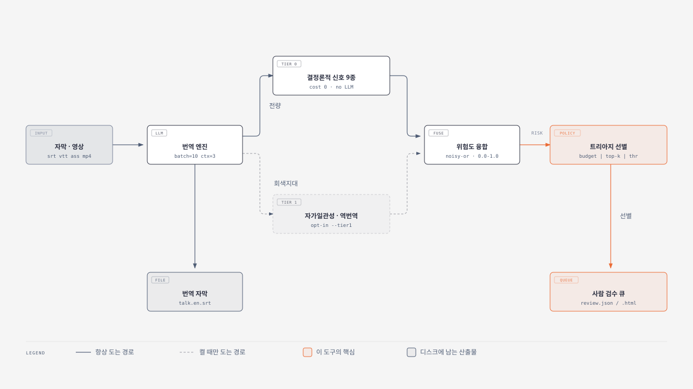
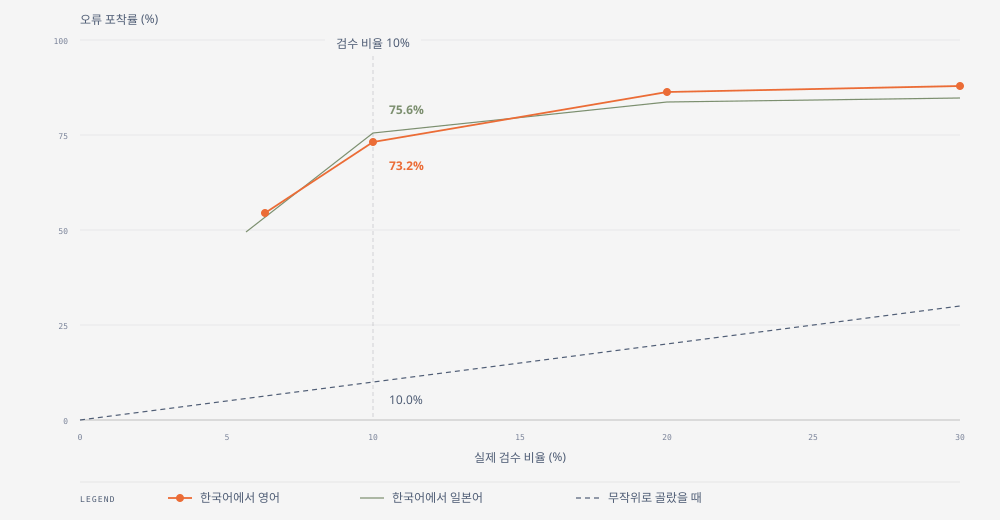

# cuesift 제품설명서

**대상 독자**: 자막 번역 품질 관리를 맡고 있고 cuesift 도입을 검토하는 실무자입니다.
설치와 명령 사용법은 [사용법.md](사용법.md)에, 옵션 전수와 개발 환경은
[README.md](../README.md)에 있습니다.

> **개발 이전 단계(pre-alpha)입니다.** 아래 수치는 전부 실측이지만 합성 오류를 주입해
> 측정한 것이며, 실제 번역 오류와의 일치도는 아직 검증하지 않았습니다.

---

## 1. 한 문장 요약

cuesift 는 번역기가 아니라 **검수 트리아지 엔진**입니다. 자막을 번역하는 것은 수단이고,
목적은 **사람이 정말 봐야 할 자막을 골라 내는 것**입니다.

이 구분이 제품의 모든 설계를 지배합니다. 번역 품질을 평가하는 도구는 "이 문장이 얼마나
좋은가"를 묻지만, cuesift 는 "검수자의 남은 두 시간을 어느 자막에 써야 하는가"를 묻습니다.

---

## 2. 어떤 문제를 푸는가

자막 검수의 비용 구조는 다음과 같이 굳어져 있습니다.

| 방식 | 잡는 오류 | 사람이 드는 시간 | 실무에서 벌어지는 일 |
| --- | --- | --- | --- |
| 전량 검수 | 대부분 | 자막 수에 비례 | 예산을 넘겨 결국 못 합니다 |
| 무작위 표본 검수 | 검수한 비율만큼 | 예산 안 | 10%를 보면 오류의 10%를 잡습니다 |
| 규칙 기반 린터만 사용 | 규격 위반만 | 거의 없음 | 의미가 뒤집힌 문장을 놓칩니다 |
| **cuesift 트리아지** | **검수 비율의 일곱 배** | **예산 안** | **아래 §4 수치** |

세 번째 행이 중요합니다. 규격 검사(글자 수·표시 시간)는 이미 여러 도구가 하고 있으며,
그것만으로는 번역 자체의 결함을 잡지 못합니다. 반대로 전량 검수는 비용 때문에
실행되지 않습니다. cuesift 가 겨냥하는 것은 **예산이 정해져 있을 때 그 예산을 어디에
쓸지 정하는 문제**입니다.

---

## 3. 어떻게 동작하는가



번역된 자막마다 여러 신호가 독립적으로 붙고, 그 신호들이 하나의 위험도 점수로 합쳐지며,
정해진 예산 안에서 점수가 높은 것부터 검수 큐에 담깁니다.

### 3.1 Tier 0 — 결정론적 신호 아홉 종

LLM 을 부르지 않고 문자열과 시간 정보만으로 판정하므로 **추가 비용이 0 입니다.**
따라서 전량에 적용합니다.

| 신호 | 무엇을 잡는가 | hard fail | 임계 조건 |
| --- | --- | --- | --- |
| `struct.untranslated` | 번역문에 원문 언어 문자가 남음 | 예 | 비율 0.15 이상이고 2자 이상 |
| `struct.empty` | 번역 결과가 비었거나 공백뿐 | 예 | — |
| `struct.degeneration` | 같은 어절이나 구가 비정상적으로 반복됨 | 예 | 3회 이상 반복, 단위 4어절 이하 |
| `struct.tag_lost` | 원문의 마크업 태그가 사라지거나 어긋남 | 예 | — |
| `struct.number_missing` | 원문의 숫자가 번역문에 없음 | 조건부 | 한 자리만 누락이면 hard fail 이 아니며 점수 0.5 |
| `spec.violation` | 규격 위반(글자 수·표시 시간·행 수) | 아니요 | 위반 건수에 따라 0.5 에서 1.0 |
| `spec.overlap` | 세그먼트의 표시 시간이 겹침 | 아니요 | 점수 0.5 고정 |
| `glossary.miss` | 용어집에 있는 용어가 번역문에 반영되지 않음 | 아니요 | 위반 건수에 따라 0.5 에서 1.0 |
| `length.ratio` | 원문 대비 번역문 길이비가 분포에서 벗어남 | 아니요 | 표본 8건 이상, z 3.5 초과, 상대 편차 0.25 초과 |

hard fail 인 네 종은 **번역이 실패했다고 단정할 수 있는 경우**만 해당합니다.
이들은 검수 예산과 무관하게 무조건 큐에 들어갑니다(§3.3).

임계값이 모두 보수적인 데에는 이유가 있습니다. hard fail 은 예산을 우회하므로,
오탐은 단순한 품질 문제가 아니라 **실제 검수 비율을 부풀려 성능 지표 자체를 파괴합니다.**
그래서 이 계층에서는 미탐이 오탐보다 낫다는 원칙을 지킵니다.

### 3.2 위험도 융합

아홉 개의 신호 점수를 noisy-or 로 합칩니다.

```text
위험도 = 1 - ∏(1 - 신호점수ᵢ)^가중치ᵢ        (범위 0.0 ~ 1.0)
hard fail 이 하나라도 있으면 위험도 = 1.0
```

**가중치는 전부 1.0 이며 튜닝하지 않습니다.** 같은 데이터에서 맞춘 가중치는 새 데이터에서
재현되지 않기 때문입니다. 이 원칙은 점수 스케일을 통해 몰래 가중을 넣는 것까지 금지합니다.

### 3.3 트리아지 선별

세 가지 방식 중 하나를 고릅니다. 셋은 상호 배타적이라 동시에 쓸 수 없습니다.

| 방식 | 옵션 | 의미 |
| --- | --- | --- |
| 예산 비율 | `--review-budget 10%` | 전체의 상위 10% 를 검수 큐에 담습니다 |
| 상위 개수 | `--review-top-k 50` | 위험도 상위 50건을 담습니다 |
| 임계값 | `--review-threshold 0.6` | 위험도 0.6 이상을 전부 담습니다 |

세 방식 모두 **hard fail 세그먼트를 먼저 담고 남은 자리를 위험도 순으로 채웁니다.**
그래서 hard fail 이 많으면 실제 검수량이 요청 예산을 넘어설 수 있습니다.
이 때문에 성능 배수는 요청 예산이 아니라 **실제 검수 비율**로 나눕니다(§4).

### 3.4 Tier 1 — 켤 때만 도는 신호

Tier 0 만으로는 문법적으로 완벽하되 의미가 뒤집힌 문장을 잡지 못합니다(§5).
Tier 1 은 그 빈 자리를 겨냥하며, **LLM 을 부르므로 비용이 발생합니다.**
그래서 기본값은 꺼짐이고, 켜더라도 Tier 0 이 좁혀 준 회색지대 후보에만 적용합니다.

| 신호 | 계산 방식 | 후보당 LLM 호출 |
| --- | --- | --- |
| `llm.self_consistency` | 같은 원문을 여러 번 재번역해 결과들 사이의 유사도를 잽니다. 흔들릴수록 위험합니다 | 샘플 수만큼(기본 3회) |
| `llm.backtranslation` | 번역문을 원문 언어로 되돌린 뒤 원문과의 의미 유사도를 잽니다 | 1회, 그리고 임베딩 호출 |

두 신호 모두 hard fail 이 아닙니다. 의미 판단은 비결정론적이라 단정할 수 없기 때문입니다.

**비용은 후보 수에 비례해 늘어납니다.** 후보 10건에 샘플 3회, 두 신호를 모두 켜면
재번역 30회와 역번역 10회로 총 40회의 LLM 호출이 발생합니다. `--tier1-max-ratio` 가
후보 비율의 상한이며 기본값은 0.05, 즉 전체의 5% 입니다.

---

## 4. 얼마나 잡는가



공개 병렬 코퍼스 TED2020(OPUS)에서 언어쌍마다 5,000건을 뽑아 합성 오류를 주입하고
측정했습니다(2026-09-04 측정).

| 실제 검수 비율 | 한국어에서 영어 포착률 | 배수 | 한국어에서 일본어 포착률 | 배수 |
| --- | --- | --- | --- | --- |
| 6.32% / 5.66% | 54.60% | 8.64배 | 49.40% | 8.73배 |
| **10.00%** | **73.20%** | **7.32배** | **75.60%** | **7.56배** |
| 20.00% | 86.40% | 4.32배 | 83.80% | 4.19배 |
| 30.00% | 88.00% | 2.93배 | 84.80% | 2.83배 |

가장 오해 없이 인용할 수 있는 값은 **검수 비율 10% 행**입니다. 요청 예산과 실제 검수 비율이
처음으로 일치하는 지점이기 때문입니다. 그보다 낮은 예산에서는 배수가 8.7배까지 오르지만,
그 구간은 hard fail 만으로 채워져 실제 검수량이 요청보다 많습니다.

첫 행의 검수 비율이 언어쌍마다 다른 것도 같은 이유입니다. hard fail 이 예산을 우회하므로
**그 지점이 각 언어쌍이 물리적으로 검수할 수밖에 없는 최소 비율**입니다.

전체 재현 정보(코퍼스 해시·시드·커밋)와 유형별 포착률은 리포트 원본에 있습니다 —
[`bench/results/en-ko-2026-09-04.md`](../bench/results/en-ko-2026-09-04.md) ·
[`bench/results/ja-ko-2026-09-04.md`](../bench/results/ja-ko-2026-09-04.md).

---

## 5. 무엇을 못 하는가

도입을 검토한다면 §4 보다 이 절이 더 중요합니다.

| 한계 | 내용 | 대응 |
| --- | --- | --- |
| **의미 오류에 약합니다** | 의미가 뒤집힌 문장만 놓고 보면 Tier 0 는 검수 비율 10% 에서 1.41% 만 잡아 무작위(10.28%)보다도 못합니다 | Tier 1 을 켜야 합니다. 이것이 Tier 1 이 존재하는 이유입니다 |
| **합성 오류로 측정했습니다** | 코퍼스에 인위적으로 주입한 오류이며, 실제 번역기가 내는 오류 분포와 같다는 보장이 없습니다 | 실제 데이터로 재측정하기 전까지 위 배수는 상한으로 읽어야 합니다 |
| **언어쌍이 한정적입니다** | 한국어에서 영어, 한국어에서 일본어만 검증했습니다 | 다른 언어쌍은 규격 프로파일부터 새로 만들어야 합니다 |
| **번역 품질을 올리지 않습니다** | 오류를 골라 낼 뿐 고쳐 주지 않습니다 | 수정은 사람이 하며, cuesift 는 어디를 볼지만 정합니다 |
| **LLM 백엔드가 필요합니다** | 번역과 Tier 1 은 OpenAI 호환 엔드포인트를 부릅니다 | 로컬 모델로도 동작합니다(§6) |

의미 오류에 약하다는 첫 행은 결함이 아니라 구조적 귀결입니다. 문법적으로 완벽한 문장은
Tier 0 의 어느 신호에도 걸리지 않으며, 다른 오류를 상위로 올리는 과정에서 오히려 큐에서
밀려납니다.

---

## 6. 도입에 필요한 것

| 항목 | 요구 사항 | 비고 |
| --- | --- | --- |
| 파이썬 | 3.11 이상 | 3.11 부터 3.14 까지 CI 로 검사합니다 |
| 런타임 의존성 | 네 개(`typer`·`pysubs2`·`pyyaml`·`httpx`) | 무거운 추론 라이브러리를 끌어오지 않습니다 |
| LLM 백엔드 | OpenAI 호환 `/v1/chat/completions` | Ollama 등 로컬 모델로도 동작합니다 |
| 임베딩 백엔드 | OpenAI 호환 `/v1/embeddings` | Tier 1 을 켤 때만 필요합니다 |
| STT 백엔드 | OpenAI 호환 `/v1/audio/transcriptions` | 영상에서 자막을 만들 때만 필요합니다 |
| 자막 형식 | SubRip · WebVTT · SubStation Alpha | `.srt` · `.vtt` · `.ass` · `.ssa` |

백엔드를 세 종류로 나눈 것은 **한 엔드포인트가 세 기능을 모두 지원하지는 않기 때문**입니다.
로컬 모델은 특히 그렇습니다. 각각을 따로 지정할 수 있고, 지정하지 않으면 번역 엔드포인트로
되돌아갑니다.

### 규격 프로파일

내장 프로파일은 Netflix 타임드 텍스트 스타일 가이드를 1차 출처로 삼습니다.

| 항목 | 한국어 | 영어 | 일본어 |
| --- | --- | --- | --- |
| 한 줄 최대 글자 수 | 16 | 42 | 13 |
| 초당 글자 수 상한 | 12 | 20 | 4 |
| 최대 행 수 | 2 | 2 | 2 |
| 최소 표시 시간 | 833ms | 833ms | 500ms |
| 최대 표시 시간 | 7,000ms | 7,000ms | 7,000ms |
| 글자 수 세는 방식 | 라틴 문자 반 칸 | 자소 단위 | 전각 |

언어마다 값이 크게 다른 것은 문자 폭과 읽는 속도가 다르기 때문이며, 그래서 규격 검사는
언어를 지정하지 않으면 동작하지 않습니다. 사내 규격이 따로 있다면 같은 형식의 YAML 파일을
직접 지정할 수 있습니다.

---

## 7. 다음 읽을 것

| 문서 | 언제 보는가 |
| --- | --- |
| [사용법.md](사용법.md) | 실제로 설치하고 첫 자막을 돌려 볼 때 |
| [README.md](../README.md) | 옵션 전수, 개발 환경, 실측 재현 절차가 필요할 때 |
| [요구사항정의서.md](요구사항정의서.md) | 기능 번호(FR·NFR)로 근거를 확인할 때 |
| [AI_자막검수_오픈소스_비교.md](AI_자막검수_오픈소스_비교.md) | 다른 도구와 비교하거나 용어 정의를 확인할 때 |
