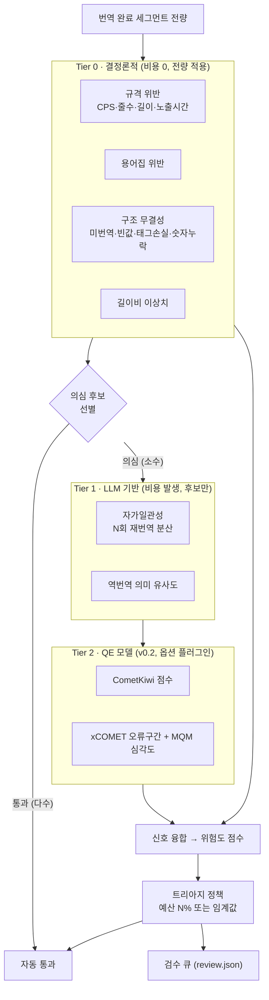
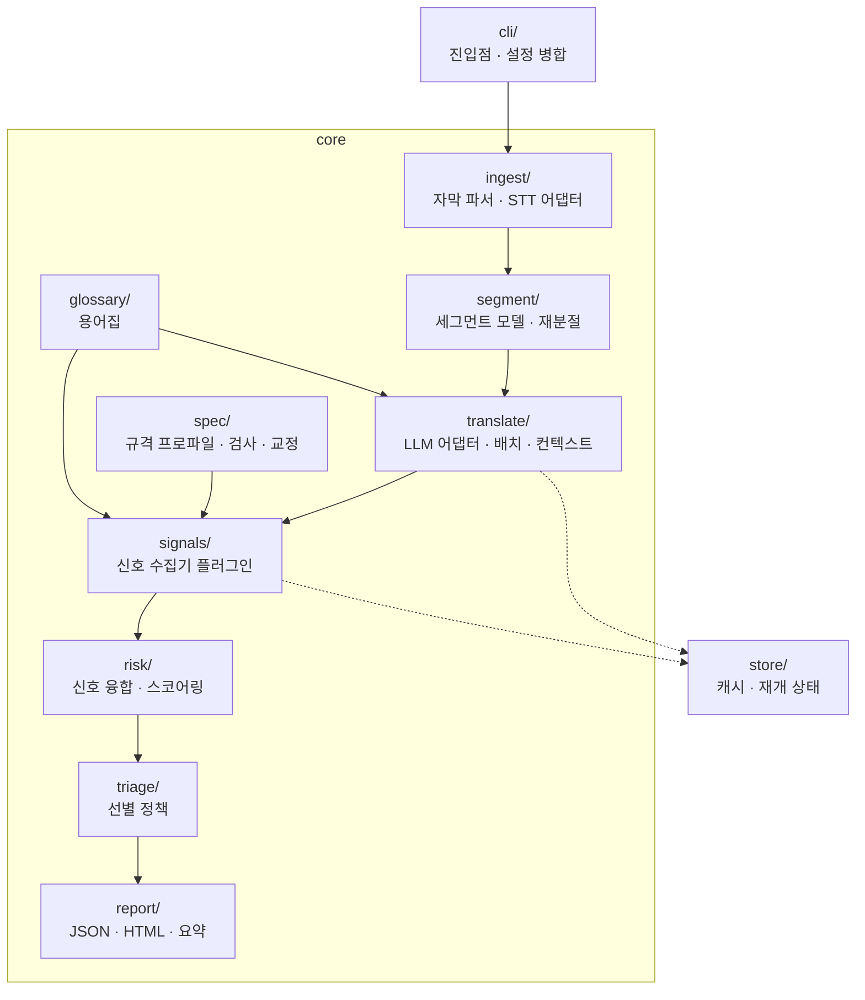

# 요구사항 정의서 — cuesift

> **AI 자막 번역·검수 트리아지 엔진**
> *"Sift the cues that actually need a human." — 사람이 정말 봐야 할 자막만 걸러냅니다.*

> **문서 버전**: 0.3
> **작성일**: 2026-07-27
> **프로젝트명**: **`cuesift`** (확정)
> **저장소**: [github.com/withwooyong/cuesift](https://github.com/withwooyong/cuesift) — 저장소명·배포 패키지명·CLI 명 모두 동일
> **관련 문서**: [번역관리_TMS_솔루션_비교.md](번역관리_TMS_솔루션_비교.md) · [AI_자막검수_오픈소스_비교.md](AI_자막검수_오픈소스_비교.md)

### 작명 근거

`cue`는 **WebVTT 표준에서 자막 한 블록을 가리키는 정식 용어**다 (HTML5 `<track>`, `TextTrackCue` DOM API, WebVTT 스펙). [TMS 비교 문서](번역관리_TMS_솔루션_비교.md)가 *"VTT 지원 = OTT 자막 판별 기준"* 이라고 결론 낸 그 표준을 이름에서부터 가리킨다. `sift`(체로 거르다)는 이 도구의 핵심 동작인 **선별**을 뜻한다.

> **네이밍 검증(2026-07-27)**: PyPI 미등록 · GitHub 동명 리포 없음. 대안 후보 중 `subsift`·`winnow`·`triage`는 PyPI 사용중, `cuescore`·`cuelens`는 GitHub 충돌로 탈락.

---

## 1. 배경 및 문제 정의

### 1.1 문제

K콘텐츠 OTT의 다국어 자막 현지화에서 **번역가 검수(review)가 비용·병목·품질편차의 단일 원인**이다.

| 문제 | 구체적 양상 |
|---|---|
| **비용이 언어 수에 선형 비례** | 20개 언어 × 16부작 드라마 = 검수 공수 20배. TMS 구독료를 압도 |
| **품질이 사람에 종속** | 번역가별 전문성 편차. 자막 규격 준수 여부가 일정하지 않음 |
| **병목** | 검수가 끝나야 배포. 언어 하나가 늦으면 동시 출시 실패 |
| **상용 TMS가 이 비용을 줄이지 않음** | Phrase `시트 + 관리단어`, Crowdin `호스팅 단어 + 매니저 수` — **사람 수에 과금**하므로 검수 시간을 줄일 동기가 구조적으로 없음 |

### 1.2 기회

[오픈소스 비교 문서](AI_자막검수_오픈소스_비교.md) 조사 결과, 다음이 확인되었다.

- **번역 도구**(LLM-Subtrans 633★, VideoLingo 17.9k★)는 품질을 **측정하지 않는다**
- **품질추정 모델**(CometKiwi·xCOMET, Apache-2.0)은 존재하지만 **자막 파이프라인에 배선되어 있지 않다**
- **자막 규격 QA**(Subtitle Edit)는 존재하지만 **데스크톱 GUI에 갇혀 CI에 들어갈 수 없다**

→ **"품질 신호를 근거로 검수 대상을 자동 선별하고, 그 결정을 CI에 태우는 계층"이 오픈소스에 없다.**

### 1.3 이 프로젝트의 입장

> **"사람을 없앤다"가 아니라 "사람이 봐야 할 자막을 전체의 5~10%로 줄인다".**

전량 검수(full review)를 **위험 기반 표본 검수(risk-based triage)** 로 전환한다. 이는 다음 이유로 "완전 자동화"보다 우월하다.

1. **검증 가능하다** — "오류 포착률"이라는 측정 가능한 지표가 존재한다
2. **책임 소재가 유지된다** — 정치·역사·종교 오역 사고의 최종 승인 주체가 남는다
3. **STT 오류 증폭 문제를 우회한다** — 원문 자막 자체를 검수 대상에 포함할 수 있다

---

## 2. 목표 및 비목표

### 2.1 목표 (Goals)

| # | 목표 | 측정 방법 |
|---|---|---|
| G1 | **검수 대상 축소** — 검수 예산 10%로 실제 오류의 다수를 포착 | §9 오류 포착률 벤치마크 |
| G2 | **CI 통합** — 웹 UI 없이 CLI + Git + 머신리더블 리포트만으로 완결 | 단일 명령으로 전 구간 실행 |
| G3 | **자막 규격 준수 보장** — 번역 결과가 언어별 규격(CPS·줄수·길이)을 위반하지 않음 | 규격 위반 세그먼트 0건 또는 전량 플래그 |
| G4 | **저진입 장벽** — GPU 없이 동작 | v0.1 기본 경로는 API만으로 실행 가능 |
| G5 | **재현성** — 동일 입력·설정에서 동일 결과 | 시드·캐시 기반 |

### 2.2 비목표 (Non-Goals)

| 비목표 | 이유 |
|---|---|
| **TTS · 더빙** | VideoLingo(17.9k★)의 영역. 범위 폭발 대비 차별화 없음 |
| **웹 번역 에디터 · 협업 UI · 권한 관리 · 서버** | AI-first 파이프라인에는 조율할 사람이 없음. 상용 TMS 비용의 근원이며, 제거가 곧 이 프로젝트의 논지. **단, 정적 산출물인 `report.html`은 서버가 아니므로 이 제외에 해당하지 않는다** |
| **자체 번역 모델 학습** | 추론만 사용 |
| **자체 QE 모델 학습** | CometKiwi/xCOMET 추론 활용 |
| **STT 엔진 자체 구현** | WhisperX로 해결된 문제 |
| **번역 완전 자동화(사람 0명)** | §1.3 참조. 의도적으로 추구하지 않음 |

---

## 3. 사용자 및 사용 시나리오

### 3.1 대상 사용자

| 페르소나 | 상황 | 원하는 것 |
|---|---|---|
| **P1. 현지화 엔지니어** (주 대상) | OTT/제작사에서 다국어 자막 파이프라인 운영 | CI에 꽂아서 자동으로 돌리고, 검수자에게 넘길 목록을 받고 싶다 |
| **P2. 자막 검수자** | 언어 전문가. 시간이 부족 | 전체를 읽지 않고 **위험한 부분만** 보고 싶다 |
| **P3. 개인 개발자 / 소규모 팀** | 자체 콘텐츠 다국어화 | GPU 없이, 설정 최소로 돌리고 싶다 |

### 3.2 핵심 시나리오

**S1 — 자막 있는 영상의 다국어 확장 (주 시나리오)**
```
입력: episode01.ko.srt (한국어 자막 존재)
실행: cuesift translate episode01.ko.srt --to en,ja,th,vi --review-budget 10%
출력: episode01.{en,ja,th,vi}.srt + review.json + report.html
결과: 검수자는 언어별로 상위 10% 위험 세그먼트만 확인
```

**S2 — 자막 없는 영상**
```
입력: episode02.mp4 (자막 없음)
실행: cuesift translate episode02.mp4 --source-lang ko --to en,ja
동작: WhisperX로 원문 자막 생성 → 원문도 검수 대상에 포함(오류 증폭 방지) → 번역
```

**S3 — CI 게이트**
```
CI: cuesift check episode01.th.srt --spec th --fail-on hard
결과: 규격 위반·미번역 등 치명 오류 발견 시 exit code ≠ 0 → 빌드 차단
```

---

## 4. 핵심 개념 — 계층화된 신호 수집과 트리아지

이 프로젝트의 기술적 핵심이다. **비용 통제를 위해 신호를 3계층으로 나눈다.**



`★ 설계 근거 ─────────────────────────────────`
**전량에 자가일관성을 적용하면 LLM 비용이 N배가 된다.** 16부작 × 20개 언어에서 3배는 감당 불가다.

그래서 **Tier 0(무료 결정론적 신호)로 의심 후보를 먼저 좁히고, 그 부분집합에만 Tier 1(유료)을 적용**한다. 실무에서 LLM 번역 사고의 상당수 — 미번역 잔존, 빈 출력, 반복 붕괴, 숫자 누락, 규격 초과 — 는 **LLM 없이 코드만으로 100% 잡힌다.** 값비싼 신호는 "코드로는 못 잡는 의미 오류"에만 써야 한다.
`─────────────────────────────────────────────`

---

## 5. 기능 요구사항 (Functional Requirements)

### 5.1 인제스트 (Ingest)

| ID | 요구사항 | 우선순위 |
|---|---|---|
| **FR-1.1** | 기존 자막 파일(SRT, WebVTT, ASS/SSA)을 파싱하여 세그먼트로 변환한다 | **必** |
| **FR-1.2** | 자막이 없는 영상 입력 시 STT로 원문 자막을 생성한다 | **必** |
| **FR-1.3** | 자막과 영상이 모두 주어지면 **자막을 우선 사용**한다 (STT 오류 증폭 방지) | **必** |
| **FR-1.4** | STT로 생성한 원문은 **`원문 검수 필요` 플래그**를 부여하여 검수 큐에 별도 표시한다 | **必** |
| FR-1.5 | 원문 언어를 자동 감지하거나 명시적으로 지정받는다 | 必 |
| FR-1.6 | TTML 입출력을 지원한다 (상용 TMS 공백 영역) | v0.3 |

### 5.2 번역 (Translate)

| ID | 요구사항 | 우선순위 |
|---|---|---|
| **FR-2.1** | 복수 대상 언어로 동시 번역한다 | **必** |
| **FR-2.2** | 세그먼트를 개별이 아니라 **앞뒤 컨텍스트 윈도우와 함께** 번역한다 (대화 맥락 유지) | **必** |
| **FR-2.3** | 번역 시 **용어집(glossary)** 을 프롬프트에 주입한다 | **必** |
| **FR-2.4** | **타임코드를 보존**한다. 번역이 세그먼트 경계를 넘지 않는다 | **必** |
| FR-2.5 | 복수 LLM 프로바이더를 지원한다 (OpenAI 호환 API를 1차 대상) | 必 |
| FR-2.6 | 실패한 세그먼트를 재시도하고, 재시도 실패 시 해당 세그먼트만 실패 표시 후 진행한다 | 必 |
| FR-2.7 | 중단된 작업을 재개(resume)할 수 있다 | 必 |
| FR-2.8 | 작품 컨텍스트(장르·시대·톤)를 프롬프트에 주입할 수 있다 | 권장 |

### 5.3 신호 수집 (Signals) — Tier 0

전량 적용. LLM 호출 없음.

| ID | 신호 | 판정 내용 |
|---|---|---|
| **FR-3.1** | **미번역 잔존** | 번역문에 원문 언어 문자가 유의미하게 남아 있음 (예: 태국어 자막에 한글) |
| **FR-3.2** | **빈 값 / 결측** | 번역 결과가 비었거나 공백뿐 |
| **FR-3.3** | **반복 붕괴(degeneration)** | 동일 어절·구가 비정상 반복 |
| **FR-3.4** | **숫자·시간 누락** | 원문의 숫자/시각 표현이 번역문에 없음 |
| **FR-3.5** | **태그·서식 손실** | 원문의 `<i>` 등 마크업이 소실·불일치 |
| **FR-3.6** | **길이비 이상치** | 원문 대비 번역 길이비가 언어쌍 분포에서 이상치 |
| **FR-3.7** | **용어집 위반** | 원문에 용어집 키가 있으나 번역문에 대응 값이 없음 |
| **FR-3.8** | **규격 위반** | §5.5 자막 규격 검사 결과 |

> **FR-3.1~3.5는 `hard fail`** 로 분류한다. 검수 예산과 무관하게 **항상** 검수 큐에 포함한다.

### 5.4 신호 수집 (Signals) — Tier 1

Tier 0에서 의심 후보로 선별된 세그먼트에만 적용.

| ID | 신호 / 요구사항 | 판정 방법 | 우선순위 |
|---|---|---|---|
| **FR-4.1** | **자가일관성** | 동일 세그먼트를 N회(기본 3) 재번역하여 결과 간 상호 유사도를 측정. 분산이 크면 고위험 | **必** |
| FR-4.2 | **역번역 유사도** | 번역문을 원문 언어로 역번역하여 원문과의 의미 유사도 측정 | 권장 |
| **FR-4.3** | **Tier 1 적용 상한** | 전체 세그먼트 중 Tier 1을 적용할 최대 비율을 설정할 수 있다 (비용 통제) | **必** |

### 5.5 자막 규격 (Spec)

| ID | 요구사항 | 우선순위 |
|---|---|---|
| **FR-5.1** | 언어별 **규격 프로파일**(YAML)로 다음을 정의·검사한다: 줄당 최대 길이, 최대 줄 수, CPS(읽기속도) 상한, 최소/최대 노출시간, 세그먼트 중첩 금지 | **必** |
| **FR-5.2** | CJK(한·중·일)와 라틴/태국 문자권의 **길이 계산 방식을 구분**한다 | **必** |
| **FR-5.3** | 기본 프로파일을 공개 스타일가이드 기반으로 제공하되, **사용자가 덮어쓸 수 있다** | **必** |
| FR-5.4 | 규격 위반 시 **자동 교정**(재분절·줄바꿈 재배치)을 시도한다 | **v0.2** |
| FR-5.5 | 샷 체인지 경계에서 세그먼트를 자르지 않는다 | v0.3 |

`★ 왜 규격을 LLM에 맡기지 않는가 ─────────────`
"한 줄에 42자 넘지 마"를 프롬프트로 지시하면 LLM은 **대체로** 지키고 **가끔** 어깁니다. 자막 규격은 100%가 아니면 의미가 없습니다 — 한 편에 한 줄만 화면을 넘쳐도 사고입니다.

그래서 규격은 **생성이 아니라 검증·교정 단계에서 결정론적 코드로** 처리합니다. LLM은 "무엇을 말할지", 코드는 "어떻게 담을지"를 담당하는 역할 분리입니다.
`─────────────────────────────────────────────`

### 5.6 위험도 융합 및 트리아지 (Risk & Triage)

| ID | 요구사항 | 우선순위 |
|---|---|---|
| **FR-6.1** | 각 신호를 0~1로 정규화하고, **설정 가능한 가중치**로 합성하여 세그먼트별 위험도를 산출한다 | **必** |
| **FR-6.2** | `hard fail` 신호는 가중합을 우회하여 **무조건 검수 큐에 포함**한다 | **必** |
| **FR-6.3** | 트리아지 정책을 두 방식으로 지정할 수 있다: **① 검수 예산**(상위 N% 또는 상위 K개) **② 위험도 임계값** | **必** |
| FR-6.4 | 신호별 기여도를 세그먼트마다 기록하여 **왜 선별되었는지 설명 가능**하게 한다 | 必 |
| FR-6.5 | 신호 수집기를 **플러그인 인터페이스**로 정의하여 v0.2에서 QE 모델을 추가 구현 없이 꽂을 수 있게 한다 | **必** |

### 5.7 출력 (Output)

| ID | 요구사항 | 우선순위 |
|---|---|---|
| **FR-7.1** | 번역된 자막 파일을 언어별로 출력한다 (입력과 동일 포맷 기본, 변환 지정 가능) | **必** |
| **FR-7.2** | **`review.json`** — 검수 대상 세그먼트 목록. 세그먼트 ID·타임코드·원문·번역문·신호별 점수·위험도·선별 사유 | **必** |
| **FR-7.3** | **`report.html`** — 검수자용 단일 파일 리포트. 원문/번역 대조, 위험 구간 하이라이트, 필터 | **必** |
| **FR-7.4** | 요약 통계 — 총 세그먼트 수, 검수 대상 수·비율, 신호별 적발 건수, **소요 토큰·비용** | **必** |
| FR-7.5 | `check` 명령은 CI용 종료 코드를 반환한다 (`--fail-on hard\|any\|none`) | 必 |

### 5.8 CLI

| ID | 요구사항 |
|---|---|
| **FR-8.1** | `cuesift translate <입력> --to <언어들>` — 전 파이프라인 실행 |
| **FR-8.2** | `cuesift check <자막파일> --spec <프로파일>` — 규격 검사만 |
| FR-8.3 | `cuesift transcribe <영상>` — STT만 |
| FR-8.4 | 설정 파일(`cuesift.yaml`)로 모든 옵션을 지정할 수 있고, CLI 인자가 우선한다 |
| FR-8.5 | 진행 상황을 표시하고, 비대화형(CI) 환경을 감지하여 출력을 조정한다 |

---

## 6. 비기능 요구사항 (Non-Functional Requirements)

| ID | 항목 | 요구사항 |
|---|---|---|
| **NFR-1** | **진입 장벽** | v0.1 기본 경로는 **GPU 없이** 동작한다. STT는 CPU 또는 API 경로를 제공한다 |
| **NFR-2** | **비용 투명성** | 실행마다 소비 토큰과 추정 비용을 보고한다. 실행 전 `--dry-run`으로 추정치를 낼 수 있다 |
| **NFR-3** | **재현성** | 동일 입력·설정·시드에서 동일 결과를 낸다. LLM 응답을 캐시한다 |
| **NFR-4** | **재개 가능성** | 장시간 작업이 중단되어도 완료된 세그먼트를 재사용하여 재개한다 |
| **NFR-5** | **확장성** | 신호 수집기·LLM 프로바이더·자막 포맷·규격 프로파일은 **코드 수정 없이 추가**할 수 있어야 한다 |
| **NFR-6** | **데이터 취급** | 자막 원문을 외부 API로 전송함을 문서에 명시한다. 로컬 LLM 경로를 차단하지 않는다 |
| **NFR-7** | **테스트 가능성** | LLM·STT 호출을 인터페이스 뒤로 격리하여 네트워크 없이 테스트할 수 있다 |
| **NFR-8** | **관측 가능성** | 세그먼트 단위 처리 이력을 구조화 로그로 남긴다 |

---

## 7. 아키텍처 개요

### 7.1 모듈 구성



### 7.2 모듈 경계 원칙

| 모듈 | 책임 (한 문장) | 의존 |
|---|---|---|
| `ingest` | 영상/자막을 세그먼트 리스트로 만든다 | 외부: pysubs2, WhisperX |
| `segment` | 세그먼트 데이터 모델과 분절 연산을 제공한다 | 없음 (순수) |
| `translate` | 세그먼트를 대상 언어로 번역한다 | LLM 프로바이더 인터페이스 |
| `spec` | 세그먼트가 규격을 만족하는지 판정하고 교정한다 | 없음 (순수) |
| `glossary` | 용어집을 로드하고 위반을 판정한다 | 없음 (순수) |
| `signals` | 세그먼트에 대해 신호를 산출한다 | `spec`, `glossary`, (Tier1은) `translate` |
| `risk` | 신호들을 하나의 위험도로 합성한다 | 없음 (순수) |
| `triage` | 위험도와 정책으로 검수 큐를 결정한다 | 없음 (순수) |
| `report` | 결과를 JSON/HTML로 직렬화한다 | 없음 (순수) |

`★ 이 경계의 의도 ───────────────────────────`
**`spec`·`risk`·`triage`·`glossary`를 순수 모듈로 유지하는 것이 핵심**입니다. 이들이 이 프로젝트의 차별화 지점인데, 네트워크·LLM 의존이 없으면 **단위 테스트가 자유롭고 빠릅니다.** 신호 융합 로직처럼 여러 번 튜닝할 코드는 테스트가 값싸야 실제로 개선됩니다.

반대로 `ingest`·`translate`는 외부 의존이 몰려 있으므로 **인터페이스 뒤로 격리**합니다(NFR-7). 이러면 전체 파이프라인 테스트를 네트워크 없이 돌릴 수 있습니다.
`─────────────────────────────────────────────`

### 7.3 핵심 데이터 모델

```
Segment
  id            : str            # 안정적 식별자
  index         : int            # 원본 순서
  start, end    : timedelta      # 타임코드
  source_text   : str
  target_text   : str | None
  speaker       : str | None     # v0.2 화자분리
  meta          : dict           # 원본 서식·태그 등

Signal
  name          : str            # "spec.cps", "glossary.miss", "consistency" ...
  tier          : 0 | 1 | 2
  score         : float          # 0.0(안전) ~ 1.0(위험), 정규화
  hard_fail     : bool
  spans         : list[Span]     # 문제 구간 (하이라이트용)
  detail        : dict           # 설명·측정값

SegmentRisk
  segment_id    : str
  signals       : list[Signal]
  risk_score    : float          # 융합 결과
  hard_fail     : bool
  selected      : bool           # 검수 큐 포함 여부
  reasons       : list[str]      # 선별 사유 (설명가능성, FR-6.4)
```

### 7.4 기술 스택 (추천안)

| 항목 | 선택 | 근거 |
|---|---|---|
| **언어** | Python 3.11+ | WhisperX·pysubs2·COMET이 모두 Python. 선택의 여지가 사실상 없음 |
| **자막 파싱** | pysubs2 | SRT·VTT·ASS·**TTML**·SAMI 지원. 직접 구현 불필요 |
| **STT** | WhisperX (기본) / API 경로 옵션 | 단어 단위 타임스탬프 + v0.2 화자분리 대비 |
| **LLM 연동** | 자체 얇은 어댑터 (OpenAI 호환 1차) | PySubtrans는 프로바이더 클라이언트가 자체 자막 도메인 모델에 결합돼 있어 클라이언트만 재사용할 수 없다(Q6). 어댑터는 수백 줄 규모 |
| **로컬 LLM** | OpenAI 호환 엔드포인트로 일원화 | Ollama·vLLM·LM Studio가 모두 `/v1/chat/completions`를 제공. 단 `logprobs`·`n` 지원이 서버마다 달라 **능력 탐지가 필요**하다(Q3) |
| **CLI** | Typer | 타입 힌트 기반, 서브커맨드 구조에 적합 |
| **설정** | YAML | 규격 프로파일·용어집과 형식 통일 |
| **테스트** | pytest | — |
| **리포트** | 단일 HTML (인라인 CSS/JS, 외부 의존 0) | 검수자에게 파일 하나만 전달하면 되도록 |
| **배포** | PyPI(`pip install`) + Docker 이미지 | P3(개인 개발자)는 pip, P1(엔지니어)은 Docker |
| **라이선스** | **Apache-2.0** | COMET·VideoLingo와 동일. 특허 조항이 있어 기업 채택에 유리 |

---

## 8. 인터페이스 명세 (초안)

### 8.1 CLI

```bash
# 주 시나리오
cuesift translate episode01.ko.srt \
    --source-lang ko \
    --to en,ja,th,vi \
    --glossary glossary.yaml \
    --review-budget 10% \
    --out ./dist

# 영상 입력 (자막 없음)
cuesift translate episode02.mp4 --source-lang ko --to en,ja

# 규격 검사만 (CI 게이트)
cuesift check dist/episode01.th.srt --spec th --fail-on hard

# 비용 추정
cuesift translate episode01.ko.srt --to en,ja --dry-run
```

### 8.2 설정 파일 `cuesift.yaml`

```yaml
source_lang: ko
targets: [en, ja, th, vi]

llm:
  provider: openai-compatible
  model: <모델명>
  context_window: 3        # 앞뒤 세그먼트 수

signals:
  tier1:
    enabled: true
    max_ratio: 0.25        # 전체의 25%까지만 Tier1 적용 (비용 상한)
    consistency_n: 3
  weights:
    spec: 0.3
    glossary: 0.3
    length_ratio: 0.1
    consistency: 0.3

triage:
  review_budget: "10%"     # 또는 risk_threshold: 0.7

spec:
  profiles_dir: ./specs    # 언어별 프로파일
```

### 8.3 규격 프로파일 `specs/th.yaml`

```yaml
language: th
char_counting: grapheme    # grapheme | cjk_width
max_chars_per_line: <값>
max_lines: 2
max_cps: <값>
min_duration_ms: <값>
max_duration_ms: <값>
allow_overlap: false
```

> ⚠️ 기본 프로파일의 **구체 수치는 공개 스타일가이드를 근거로 채우되, 출처를 프로파일 주석에 명기**한다. 근거 없는 수치를 기본값으로 넣지 않는다.

### 8.4 `review.json` 구조

```json
{
  "summary": {
    "total_segments": 0,
    "selected_for_review": 0,
    "review_ratio": 0.0,
    "hard_fail_count": 0,
    "signal_hits": {},
    "cost": { "tokens": 0, "estimated_usd": 0.0 }
  },
  "segments": [
    {
      "id": "",
      "start_ms": 0, "end_ms": 0,
      "source_text": "", "target_text": "",
      "risk_score": 0.0,
      "hard_fail": false,
      "reasons": [],
      "signals": [
        { "name": "", "tier": 0, "score": 0.0, "spans": [], "detail": {} }
      ]
    }
  ]
}
```

---

## 9. 성공 기준 및 검증 방법

### 9.1 핵심 지표 — 오류 포착률 (Recall @ Budget)

> **검수 예산 X%를 썼을 때, 실제 오류 중 몇 %를 검수 큐에 담았는가.**

`★ 왜 이 지표인가 ───────────────────────────`
**무작위 표본 검수는 자명한 베이스라인을 제공합니다.** 무작위로 10%를 뽑으면 오류의 10%를 잡습니다. 우리 트리아지가 같은 10% 예산으로 오류의 60%를 잡으면 **베이스라인 대비 6배**입니다.

이 배수가 README 최상단에 들어갈 숫자이고, **"AI 래퍼가 아니다"를 증명하는 유일한 방법**입니다. 정확도(precision)가 아니라 재현율(recall)을 주 지표로 삼는 이유는, 검수에서 **놓친 오류가 잘못 올린 정상 세그먼트보다 훨씬 비싸기** 때문입니다.
`─────────────────────────────────────────────`

| 지표 | 정의 | 목표 |
|---|---|---|
| **Recall@10%** | 검수 예산 10%에서의 오류 포착률 | **무작위 베이스라인(10%) 대비 유의미한 배수** — 구체 목표치는 첫 측정 후 확정 |
| **Hard-fail 정확도** | Tier 0 치명 신호의 오탐률 | 오탐 ≈ 0 (결정론적이므로) |
| **규격 위반 잔존** | 최종 산출물의 규격 위반 건수 | 0 (또는 전량 플래그) |
| **세그먼트당 비용** | 토큰·달러 | 측정·공개 |

### 9.2 벤치마크 데이터 전략

| 문제 | 대응 |
|---|---|
| **K-드라마 자막은 저작권이 있어 리포에 포함 불가** | 벤치마크는 **공개 다국어 병렬 코퍼스**(TED2020/OPUS 계열)로 구성. 실전 데이터는 사용자가 자기 것으로 실행 |
| **"실제 오류" 라벨이 없음** | **합성 오류 주입(synthetic error injection)** — 정상 번역에 알려진 오류 유형(숫자 변조, 용어 위반, 의미 반전, 규격 초과, 미번역)을 주입하고 포착률 측정. 라벨이 정의상 정확하다 |
| **합성 오류가 실제 오류와 다를 수 있음** | 한계로 명시. 2차로 소규모 인간 평가 세트를 별도 구성 |

### 9.3 테스트 요구사항

| 계층 | 대상 | 방식 |
|---|---|---|
| 단위 | `spec`·`risk`·`triage`·`glossary` (순수 모듈) | 네트워크 없이 전량 |
| 계약 | LLM·STT 어댑터 인터페이스 | 페이크 구현 |
| 통합 | 전 파이프라인 | 페이크 LLM으로 엔드투엔드 |
| 벤치마크 | 오류 포착률 | 별도 실행, CI 비필수 |

---

## 10. 로드맵

| 버전 | 범위 | 완료 조건 |
|---|---|---|
| **v0.1 (MVP)** | 인제스트(자막/STT) · 번역 · **Tier 0 + Tier 1 신호** · 규격 검사 · 위험도 융합 · 트리아지 · JSON/HTML 리포트 · CLI | S1 시나리오가 단일 명령으로 완주. Recall@10% 최초 측정치 확보 |
| **v0.2** | **QE 플러그인**(CometKiwi/xCOMET) · **화자분리 + 캐릭터 말투 시트** · **규격 자동 교정**(재분절) | QE 유무 A/B로 포착률 개선 입증 |
| **v0.3** | 샷 체인지 인식 컷 · TTML/IMSC1 · 증분 번역(변경분만) · `report.html` 고도화(영상 프리뷰 연동) | — |

> **v0.2의 캐릭터 말투 시트가 K콘텐츠 차별화의 본체**다. 화자분리로 인물을 식별하고, 시리즈 전체에서 인물별 어조·경어법·호칭을 일관 유지한다. v0.1은 이를 위한 `Segment.speaker` 필드만 미리 확보한다.

---

## 11. 리스크 및 대응

| # | 리스크 | 영향 | 대응 |
|---|---|---|---|
| R1 | **STT 오류 증폭** — 원문이 틀리면 N개 언어로 복제됨 | 치명 | FR-1.3(자막 우선) · FR-1.4(원문 검수 플래그). 원문 QC를 파이프라인의 명시적 게이트로 |
| R2 | **QE 모델의 한국어↔저자원 언어 성능 미검증** | 중 | v0.1을 **QE 없이** 설계(§4). QE는 플러그인으로 격리하여 성능이 나쁘면 빼면 됨 |
| R3 | **LLM 비용 폭발** | 중 | Tier 계층화(§4) · `max_ratio` 상한(FR-4.3) · 캐시(NFR-3) · `--dry-run`(NFR-2) |
| R4 | **"OpenAI 래퍼"로 인식됨** | 중 | 오류 포착률 벤치마크를 README 최상단에. 번역 품질이 아니라 **트리아지 효율**을 전면에 |
| R5 | **VideoLingo(17.9k★)와 혼동** | 중 | 포지셔닝 분리 — "번역하는 도구"가 아니라 "**검수 대상을 고르는 도구**". 실제로 VideoLingo 출력물에도 적용 가능하게 설계 |
| R6 | **저작권** — 실제 자막을 테스트/공개에 사용 | 법적 | §9.2 데이터 전략. 리포에 저작물 자막 미포함 |
| R7 | **범위 폭발** | 높음 | §2.2 비목표를 문서로 고정. TTS·웹 UI는 영구 제외 |
| R8 | **규격 기본값의 근거 부재** | 중 | 출처 없는 수치를 기본값으로 넣지 않음(§8.3). 프로파일 주석에 출처 명기 |

---

## 12. 미결정 사항 (Open Questions)

| # | 항목 | 비고 |
|---|---|---|
| ~~Q1~~ | ~~**프로젝트 명칭**~~ | ✅ **해결(2026-07-27)** — `cuesift` 확정. PyPI·GitHub 가용성 검증 완료. 저장소명도 `ted-tms` → `cuesift`로 변경하여 통일 |
| ~~Q2~~ | ~~**초기 대상 언어쌍**~~ | ✅ **해결(2026-07-27)** — **ko→en/ja로 확정.** 공개 병렬 코퍼스가 풍부해 Recall@Budget 측정의 신뢰도를 먼저 확보한다. 트리아지 방법론이 검증된 뒤 ko→th/vi/id로 확장한다 |
| ~~Q3~~ | ~~**로컬 LLM 지원 범위**~~ | ✅ **해결(2026-07-27)** — **OpenAI 호환 엔드포인트만 지원하면 충분.** Ollama가 `/v1/chat/completions`를 제공하므로 전용 어댑터는 불필요하다. 단 **호환은 전송 규약에 한정되며 능력은 균일하지 않다** — Ollama는 `logprobs`·`n`·`tool_choice`·`logit_bias` 미지원, vLLM은 `logprobs` 지원. 따라서 어댑터는 프로바이더 **능력(capability)을 선언·탐지**하고, 미지원 신호는 비활성화한 뒤 **그 사실을 리포트에 명시**해야 한다. 무음 열화(silent degradation)를 금지한다 |
| Q4 | **자가일관성의 의미 유사도 측정 수단** | 문자 수준 편집거리(무료)만으로 충분한가, 임베딩 모델(추가 의존)이 필요한가 — 실측 필요.<br>**제약 추가(2026-07-27, Q3 조사)**: Ollama가 `n`을 지원하지 않으므로 샘플링은 `n>1` 단일 호출이 아니라 **N회 개별 호출**로 구현해야 백엔드 이식성이 유지된다 |
| Q5 | **규격 프로파일 기본값 출처** | 공개 스타일가이드 중 인용 가능한 것을 특정해야 함 |
| ~~Q6~~ | ~~**PySubtrans 재사용 여부**~~ | ✅ **해결(2026-07-27)** — **자체 얇은 어댑터로 결정.** 라이선스는 MIT 확인(GitHub이 `NOASSERTION`으로 표시하나 `LICENSE` 본문은 MIT).<br>**기존 배제 근거였던 "GUI가 딸려온다"는 사실이 아니다** — PyPI `pysubtrans` 1.6.0의 기본 의존성에 GUI가 없고 `pyside6`는 `gui` extra로 분리돼 있다.<br>실제 배제 사유는 **도메인 모델 동반**이다. 프로바이더 클라이언트가 `Subtitles`·`SubtitleLine`·`SubtitleScene`·`SubtitleBatch`·`SubtitleProject`(패키지 본체 약 278KB)에 결합돼 있어 클라이언트만 떼어 쓸 수 없고, 채택하면 §7.3의 `segment/` 모델과 이중화된다. `Providers/Clients/CustomClient.py`는 **구현 참고 자료로만 활용**한다 |

---

## 13. 부록 — 이 문서가 확정한 것

| 결정 | 내용 |
|---|---|
| **포지셔닝** | 번역기가 아니라 **검수 트리아지 엔진**. 번역은 수단, 트리아지가 목적 |
| **핵심 지표** | Recall@Budget (오류 포착률), 무작위 베이스라인 대비 배수 |
| **비용 전략** | 3계층 신호 — 무료 결정론 → 저비용 LLM → 옵션 QE 모델 |
| **역할 분리** | LLM은 "무엇을 말할지", 결정론적 코드는 "어떻게 담을지"(규격) |
| **영구 제외** | TTS·더빙, 웹 에디터·협업 UI, 모델 학습 |
| **v0.1 진입 장벽** | GPU 불필요, API만으로 동작 |
